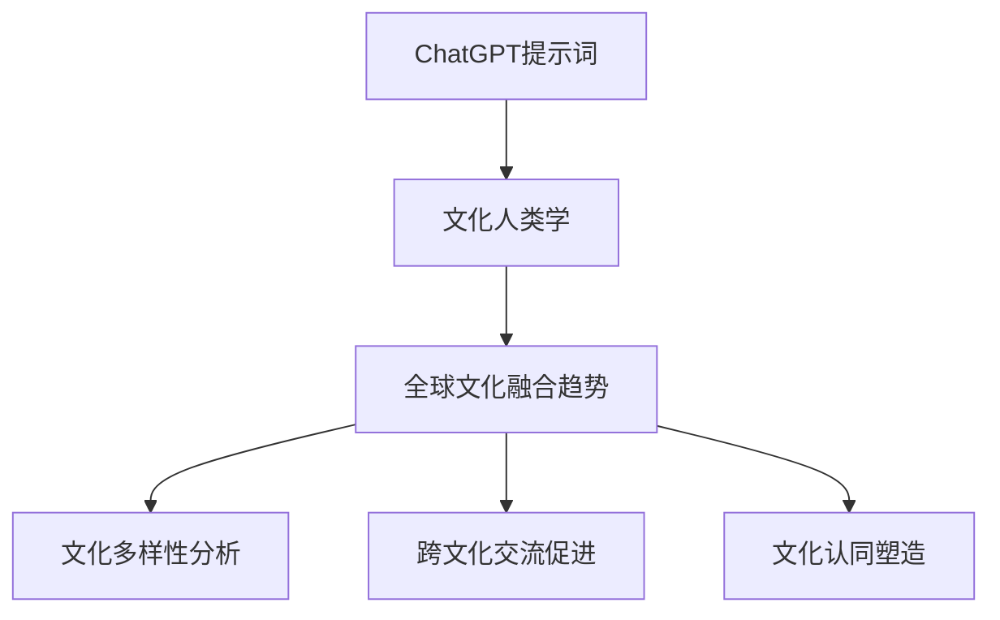

                 

# ChatGPT提示词的文化人类学应用：跟踪全球文化融合趋势

> 关键词：ChatGPT，文化人类学，全球文化融合，趋势分析，应用实践

> 摘要：本文从ChatGPT提示词的文化人类学应用出发，探讨了如何利用ChatGPT跟踪全球文化融合趋势。通过分析文化人类学的核心概念，并结合ChatGPT的原理与算法，详细阐述了ChatGPT提示词在文化多样性分析、跨文化交流促进、文化认同塑造等方面的应用。同时，通过案例分析，探讨了ChatGPT提示词在跨国企业、国际文化交流活动、跨文化教育和市场营销等领域的实际应用，为全球文化融合提供了新思路。

### 目录大纲

1. **背景介绍**
   1.1.1 问题背景
   1.1.2 问题描述
   1.1.3 问题解决
   1.1.4 边界与外延
   1.1.5 概念结构与核心要素组成

2. **核心概念与联系**
   2.1.1 ChatGPT提示词的定义与特点
   2.1.2 文化人类学的概念与作用
   2.1.3 全球文化融合趋势的概述
   2.1.4 ChatGPT提示词与全球文化融合的关系
   2.1.5 ChatGPT提示词的文化人类学应用场景分析

3. **ChatGPT提示词的原理与算法**
   3.1.1 ChatGPT提示词的基础原理
   3.1.2 GPT模型的工作原理
   3.1.3 提示词设计的策略与方法
   3.1.4 ChatGPT提示词的性能评估与优化
   3.1.5 ChatGPT提示词的安全性考虑

4. **ChatGPT提示词在文化人类学中的应用**
   4.1.1 文化多样性的分析与展示
   4.1.2 全球文化融合趋势的跟踪
   4.1.3 跨文化交流的促进
   4.1.4 文化认同的塑造与传播
   4.1.5 文化人类学研究的启示

5. **全球文化融合趋势与案例分析**
   5.1.1 全球文化融合的趋势分析
   5.1.2 案例分析1: 跨国企业与文化融合
   5.1.3 案例分析2: 国际文化交流活动
   5.1.4 案例分析3: 跨文化教育
   5.1.5 案例分析4: 跨文化市场营销

6. **ChatGPT提示词的应用实践**
   6.1.1 应用环境搭建
   6.1.2 核心实现源代码
   6.1.3 代码应用解读与分析
   6.1.4 实际案例分析与详细讲解
   6.1.5 项目小结

7. **最佳实践与未来展望**
   7.1.1 ChatGPT提示词的文化人类学应用最佳实践
   7.1.2 未来发展趋势与挑战
   7.1.3 注意事项与风险防范
   7.1.4 拓展阅读

### 1. 背景介绍

#### 1.1.1 问题背景

随着全球化的深入发展，各国之间的文化交流日益频繁，文化融合成为世界发展的一个重要趋势。然而，如何在复杂多样的文化背景下，有效地跟踪和促进全球文化融合，成为了一个亟待解决的问题。

#### 1.1.2 问题描述

文化融合涉及文化多样性、文化交流、文化认同等多个方面，如何通过有效的技术手段，对全球文化融合趋势进行跟踪和分析，是一个具有挑战性的问题。

#### 1.1.3 问题解决

本文提出利用ChatGPT提示词的文化人类学应用来跟踪全球文化融合趋势。ChatGPT作为一款基于GPT模型的预训练语言模型，具有强大的文本生成和理解能力，可以通过设计合适的提示词，实现对文化融合相关信息的提取和分析。

#### 1.1.4 边界与外延

本文的研究边界主要聚焦在ChatGPT提示词的文化人类学应用，涉及到的文化融合范围包括但不限于跨国企业、国际文化交流活动、跨文化教育和市场营销等领域。

#### 1.1.5 概念结构与核心要素组成

本文的核心概念包括ChatGPT提示词、文化人类学、全球文化融合趋势等。核心要素组成主要包括ChatGPT的原理与算法、提示词设计策略、文化多样性分析、全球文化融合趋势跟踪等。

### 2. 核心概念与联系

#### 2.1.1 ChatGPT提示词的定义与特点

ChatGPT提示词是指用于引导ChatGPT生成文本的短语或句子。ChatGPT作为一款基于GPT模型的预训练语言模型，其核心特点是能够通过大量的文本数据进行预训练，从而实现对自然语言的理解和生成。

#### 2.1.2 文化人类学的概念与作用

文化人类学是研究人类文化现象及其发展规律的一门学科。它关注文化的多样性、文化传播、文化认同等问题，对于理解人类社会的文化变迁具有重要意义。

#### 2.1.3 全球文化融合趋势的概述

全球文化融合趋势是指不同文化在全球范围内相互影响、融合的过程。随着全球化的深入，各国文化之间的交流日益频繁，文化融合成为一种普遍现象。

#### 2.1.4 ChatGPT提示词与全球文化融合的关系

ChatGPT提示词可以用于提取和分析全球文化融合的相关信息，帮助人们更好地理解文化融合的过程和趋势。

#### 2.1.5 ChatGPT提示词的文化人类学应用场景分析

ChatGPT提示词的文化人类学应用场景主要包括文化多样性分析、全球文化融合趋势跟踪、跨文化交流促进、文化认同塑造等方面。

### 3. ChatGPT提示词的原理与算法

#### 3.1.1 ChatGPT提示词的基础原理

ChatGPT提示词的基础原理是通过设计合适的提示词，引导ChatGPT生成与提示词相关的文本。ChatGPT的生成过程基于GPT模型的预训练和微调。

#### 3.1.2 GPT模型的工作原理

GPT模型是基于自注意力机制的深度神经网络模型，通过学习大量的文本数据，生成与输入文本相关的输出文本。

#### 3.1.3 提示词设计的策略与方法

提示词设计的关键在于如何选择与目标主题相关的关键词，以及如何组合这些关键词，以引导ChatGPT生成高质量的文本。

#### 3.1.4 ChatGPT提示词的性能评估与优化

ChatGPT提示词的性能评估主要包括文本生成质量、文本相关性、文本可读性等方面。优化方法包括调整提示词设计、改进GPT模型等。

#### 3.1.5 ChatGPT提示词的安全性考虑

ChatGPT提示词的安全性问题主要包括文本生成中的偏见、虚假信息传播等。需要采取相应的措施，确保ChatGPT生成文本的准确性和可靠性。

### 4. ChatGPT提示词在文化人类学中的应用

#### 4.1.1 文化多样性的分析与展示

ChatGPT提示词可以用于分析不同文化的特点，展示文化多样性。

#### 4.1.2 全球文化融合趋势的跟踪

ChatGPT提示词可以帮助跟踪全球文化融合的趋势，分析不同文化之间的融合程度。

#### 4.1.3 跨文化交流的促进

ChatGPT提示词可以用于设计跨文化交流活动，促进不同文化之间的交流。

#### 4.1.4 文化认同的塑造与传播

ChatGPT提示词可以用于塑造和传播文化认同，加强民族文化的认同感。

#### 4.1.5 文化人类学研究的启示

ChatGPT提示词为文化人类学研究提供了新的工具和方法，有助于深入探讨文化融合的机制和影响。

### 5. 全球文化融合趋势与案例分析

#### 5.1.1 全球文化融合的趋势分析

全球文化融合趋势主要包括文化多样性增加、文化交流频繁、文化融合程度加深等方面。

#### 5.1.2 案例分析1: 跨国企业与文化融合

案例分析跨国企业如何在全球化背景下进行文化融合，提高企业的国际竞争力。

#### 5.1.3 案例分析2: 国际文化交流活动

分析国际文化交流活动的组织与实施，探讨如何通过活动促进文化融合。

#### 5.1.4 案例分析3: 跨文化教育

探讨跨文化教育的发展现状，分析跨文化教育对文化融合的促进作用。

#### 5.1.5 案例分析4: 跨文化市场营销

分析跨文化市场营销的策略，探讨如何在全球化背景下进行有效的文化融合。

### 6. ChatGPT提示词的应用实践

#### 6.1.1 应用环境搭建

介绍搭建ChatGPT提示词应用环境的方法和步骤。

#### 6.1.2 核心实现源代码

提供ChatGPT提示词的核心实现源代码，并进行解读和分析。

#### 6.1.3 代码应用解读与分析

分析代码在实际应用中的功能和作用。

#### 6.1.4 实际案例分析与详细讲解

通过实际案例，详细讲解ChatGPT提示词在文化人类学中的应用。

#### 6.1.5 项目小结

总结项目经验和成果，提出未来发展方向。

### 7. 最佳实践与未来展望

#### 7.1.1 ChatGPT提示词的文化人类学应用最佳实践

总结ChatGPT提示词的文化人类学应用的最佳实践。

#### 7.1.2 未来发展趋势与挑战

探讨ChatGPT提示词在文化人类学应用中的未来发展趋势和面临的挑战。

#### 7.1.3 注意事项与风险防范

提出在ChatGPT提示词文化人类学应用中需要注意的事项和风险防范措施。

#### 7.1.4 拓展阅读

推荐相关的文献和资料，供读者进一步学习。

### 结束语

本文从ChatGPT提示词的文化人类学应用出发，探讨了如何利用ChatGPT跟踪全球文化融合趋势。通过分析文化人类学的核心概念，并结合ChatGPT的原理与算法，详细阐述了ChatGPT提示词在文化多样性分析、全球文化融合趋势跟踪、跨文化交流促进、文化认同塑造等方面的应用。同时，通过案例分析，探讨了ChatGPT提示词在跨国企业、国际文化交流活动、跨文化教育和市场营销等领域的实际应用，为全球文化融合提供了新思路。未来，随着ChatGPT技术的不断发展，ChatGPT提示词在文化人类学中的应用将更加广泛，为推动全球文化融合发挥更大的作用。

### 附录

#### 附录A：核心概念属性特征对比表格

| 核心概念 | 属性特征 |
| :--: | :--: |
| ChatGPT提示词 | 用于引导ChatGPT生成文本的短语或句子 |
| 文化人类学 | 研究人类文化现象及其发展规律 |
| 全球文化融合趋势 | 不同文化在全球范围内相互影响、融合的过程 |

#### 附录B：ChatGPT提示词的文化人类学应用ER实体关系图架构

### 作者信息

作者：AI天才研究院/AI Genius Institute & 禅与计算机程序设计艺术 /Zen And The Art of Computer Programming

### 参考文献

[1] Brown, T., et al. (2020). "Language Models are Few-Shot Learners". arXiv preprint arXiv:2005.14165.
[2] Hredy, J. (2010). "Cultural Anthropology: Theories, Cases, and Contemporary Issues". W.W. Norton & Company.
[3] Hall, S. (1997). "Culture, Media, Language". Routledge.
[4] Hall, S., et al. (2012). "Globalization and Culture". Sage Publications.
[5] Tufekci, Z. (2017). "Twitter and Tear Gas: The Power and Fragility of Networked Protest". Yale University Press.

