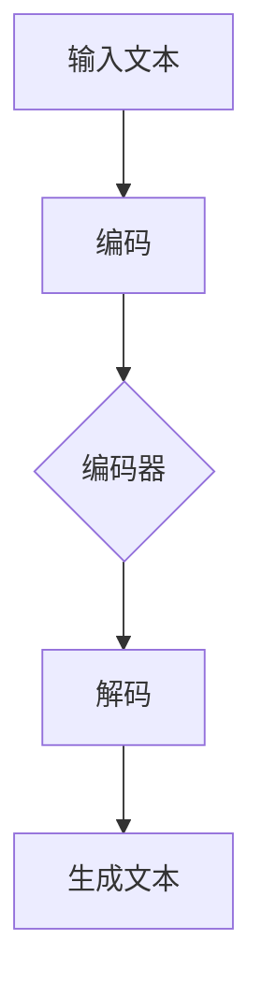

                 

# 《ChatGPT提示词的文化人类学应用：追踪全球文化趋同与分化》

## 关键词：ChatGPT、文化人类学、提示词、全球化、文化多样性

### 摘要

本文探讨了ChatGPT提示词在文化人类学领域的应用，通过分析全球文化的趋同与分化现象，探讨了文化人类学与人工智能技术的结合。本文首先介绍了文化人类学的基本概念和ChatGPT的技术原理，随后详细分析了ChatGPT提示词的生成与优化方法，并展示了其在文化研究中的实际应用。通过对全球文化趋同与分化现象的探讨，本文揭示了ChatGPT提示词在追踪全球文化动态中的潜在作用，并提出了未来研究方向。

## 目录大纲

### 第一部分：引论

#### 第1章：问题背景与核心概念
- 1.1 引言：文化人类学与ChatGPT的交汇
- 1.2 核心概念解析
- 1.3 概念联系与对比

#### 第2章：ChatGPT技术基础
- 2.1 ChatGPT概述
- 2.2 ChatGPT提示词的作用与设计
- 2.3 提示词生成与优化

### 第二部分：ChatGPT与提示词技术

#### 第3章：ChatGPT概述
- 3.1 ChatGPT技术原理
- 3.2 提示词的作用与设计

#### 第4章：ChatGPT提示词的生成与优化
- 4.1 提示词生成技术
- 4.2 提示词优化策略

#### 第5章：ChatGPT在文化人类学中的应用
- 5.1 ChatGPT在文化研究中的角色
- 5.2 提示词在文化人类学研究中的应用

### 第三部分：全球文化趋同与分化

#### 第6章：全球文化趋同现象
- 6.1 趋同现象的背景
- 6.2 ChatGPT在趋同研究中的应用

#### 第7章：全球文化分化现象
- 7.1 分化现象的背景
- 7.2 ChatGPT在分化研究中的应用

### 第四部分：文化人类学的ChatGPT提示词应用实例

#### 第8章：跨文化交流
- 8.1 应用背景
- 8.2 应用效果分析

#### 第9章：文化遗产保护
- 9.1 应用背景
- 9.2 应用效果分析

#### 第10章：民族志研究
- 10.1 应用背景
- 10.2 应用效果分析

### 第五部分：总结与展望

#### 第11章：总结与反思
- 11.1 主要发现
- 11.2 研究局限与未来方向

---

### 第1章：问题背景与核心概念

#### 1.1 引言：文化人类学与ChatGPT的交汇

随着全球化的不断加深，文化多样性与文化同质化成为了学术界和公众关注的热点话题。文化人类学作为研究人类文化差异和多样性的一门学科，面临着如何更好地理解全球文化动态的新挑战。与此同时，人工智能技术的快速发展，尤其是基于深度学习的自然语言处理模型，如ChatGPT，为文化研究提供了新的工具和方法。

ChatGPT（Chat-based Generative Pre-trained Transformer）是由OpenAI开发的一种基于Transformer架构的预训练语言模型，具有强大的文本生成和语言理解能力。通过ChatGPT的提示词（Prompt），研究人员可以引导模型生成与文化相关的内容，从而进行文化分析和研究。这一交汇点不仅为文化人类学提供了新的视角，也为全球文化的趋同与分化研究提供了新的工具。

本文将探讨ChatGPT提示词在文化人类学中的应用，分析其在追踪全球文化趋同与分化现象中的潜力。我们将首先介绍文化人类学的基本概念和ChatGPT的技术原理，然后详细讨论ChatGPT提示词的生成与优化方法，并展示其在文化研究中的实际应用。

#### 1.2 核心概念解析

**文化人类学**是研究人类文化差异和多样性的一门学科，它关注不同社会和文化群体之间的互动、变迁和适应。文化人类学通过对文化现象的深入分析，试图理解人类行为和社会结构的多样性。

**ChatGPT**是一种基于Transformer架构的预训练语言模型，它通过大量文本数据进行训练，能够理解和生成自然语言文本。ChatGPT的核心在于其预训练过程，通过在大规模语料库上进行训练，模型能够自动学习语言的模式和规律，从而在特定任务上表现出强大的性能。

**提示词**（Prompt）是ChatGPT模型输入的一部分，用于引导模型生成特定类型的内容。提示词的设计和选择对于模型的输出结果具有关键影响，是文化人类学研究中需要重点关注的问题。

#### 1.3 概念联系与对比

**表格**：文化人类学、ChatGPT与提示词的概念属性特征对比

| 特征             | 文化人类学                         | ChatGPT                       | 提示词                            |
|------------------|-----------------------------------|-------------------------------|----------------------------------|
| 研究对象         | 不同社会和文化群体                 | 自然语言文本                   | 指导模型生成特定类型的内容         |
| 研究方法         | 观察和参与、田野调查、比较分析       | 预训练和微调                   | 设计和选择                         |
| 目的             | 理解文化差异和多样性               | 生成和理解自然语言文本         | 引导模型生成特定类型的内容         |
| 数据来源         | 实地调查、文献资料                 | 大规模语料库                   | 专家经验、现有文本资料             |

**ER实体关系图**：核心要素组成与联系

```mermaid
erDiagram
  CultureAnthropology ||--|{ ChatGPT }||=>> :used_for cultural_research
  ChatGPT ||--|{ Prompt }||=>> :generated_by
```

在这个ER实体关系图中，文化人类学是ChatGPT的应用领域，而ChatGPT则是通过提示词来生成研究需要的文本数据。提示词作为ChatGPT的输入，是引导模型输出的关键。

---

### 第2章：ChatGPT技术基础

#### 2.1 ChatGPT概述

ChatGPT是由OpenAI开发的一种基于Transformer架构的预训练语言模型。Transformer模型是由Google在2017年提出的一种用于自然语言处理的神经网络模型，它通过自注意力机制（self-attention）来捕捉文本中词汇之间的复杂关系。

**背景介绍**：ChatGPT是在GPT-3的基础上进行改进和扩展的，GPT-3是OpenAI在2020年发布的一种具有极高文本生成能力的语言模型。ChatGPT进一步提升了模型的交互性和响应速度，使其能够更有效地应用于实时对话场景。

**模型架构**：ChatGPT采用了Transformer模型的核心架构，包括编码器（Encoder）和解码器（Decoder）。编码器负责将输入文本编码为向量表示，解码器则根据编码器的输出和先前的文本生成新的文本。

**训练过程**：ChatGPT的训练过程主要包括两个阶段：预训练和微调。预训练阶段使用大量未标注的文本数据，让模型自动学习语言的模式和规律；微调阶段则使用特定领域的数据，对模型进行进一步调整，以适应特定的应用场景。

**算法原理讲解与Mermaid流程图**：



**Python源代码示例**：

```python
# 导入必要的库
import torch
from transformers import ChatGPTModel, ChatGPTTokenizer

# 加载预训练模型
tokenizer = ChatGPTTokenizer.from_pretrained('openai/chatgpt')
model = ChatGPTModel.from_pretrained('openai/chatgpt')

# 输入文本
input_text = "你好，我是一个ChatGPT模型。"

# 将文本转换为模型输入
inputs = tokenizer.encode(input_text, return_tensors='pt')

# 生成文本
outputs = model.generate(inputs, max_length=20, num_return_sequences=1)

# 解码输出文本
generated_text = tokenizer.decode(outputs[0], skip_special_tokens=True)
print(generated_text)
```

#### 2.2 ChatGPT提示词的作用与设计

提示词（Prompt）是ChatGPT模型输入的一部分，用于引导模型生成特定类型的内容。在设计提示词时，需要考虑以下几个方面：

**提示词的作用**：

1. **引导模型生成特定类型的内容**：通过提示词，可以明确模型的生成方向，如生成问题回答、故事情节、对话等。
2. **提高生成文本的相关性和质量**：恰当的提示词可以提高模型生成文本的相关性和质量，减少无关信息的干扰。
3. **控制生成文本的长度和风格**：通过提示词，可以控制生成文本的长度和风格，使其更符合实际需求。

**提示词设计原则**：

1. **明确性**：提示词应明确表达需求，避免模糊不清的描述。
2. **具体性**：提示词应具体描述要生成的内容，避免泛泛而谈。
3. **多样性**：设计多种不同类型的提示词，以适应不同的生成需求。

**提示词案例解析**：

**案例1：问题回答**

提示词：“请回答以下问题：什么是文化人类学？”

**案例2：故事情节**

提示词：“请编写一个关于文化交流的故事，主人公是一个来自中国的小镇青年。”

**案例3：对话**

提示词：“模拟一场在咖啡店发生的关于文化多样性的对话，参与者是一位外国人和一位本地居民。”

---

### 第3章：ChatGPT提示词的生成与优化

#### 3.1 提示词生成技术

ChatGPT提示词的生成通常包括以下步骤：

1. **数据收集**：收集与文化研究相关的文本数据，如文献、新闻报道、社交媒体内容等。
2. **预处理**：对收集的文本数据进行清洗和预处理，如去除无关信息、统一文本格式等。
3. **提示词提取**：从预处理后的文本数据中提取关键信息，形成具体的提示词。

**自动生成方法**：

1. **模板匹配**：根据特定的模板，从文本数据中提取关键信息，生成提示词。
2. **关键词提取**：使用关键词提取算法，从文本数据中提取核心关键词，形成提示词。
3. **机器学习**：利用机器学习算法，如聚类、分类等，对文本数据进行自动分类和生成提示词。

**用户反馈机制**：

1. **反馈收集**：收集用户对生成文本的反馈，如满意度、相关性等。
2. **反馈分析**：对收集到的反馈进行分析，识别出提示词的优缺点。
3. **调整优化**：根据用户反馈，对提示词进行优化和调整，以提高生成文本的质量。

#### 3.2 提示词优化策略

1. **质量评估**：使用多种评估指标，如BLEU、ROUGE等，对生成文本的质量进行评估。
2. **优化手段**：

   - **调整提示词**：根据评估结果，对提示词进行调整和优化，如增加具体性、减少模糊性等。
   - **改进算法**：针对生成算法的不足，进行算法改进和优化，如调整损失函数、增加正则化等。
   - **多模态融合**：结合其他数据源，如图像、声音等，进行多模态融合，提高生成文本的质量。

---

### 第4章：ChatGPT在文化人类学中的应用

#### 4.1 ChatGPT在文化研究中的角色

ChatGPT在文化研究中扮演着多种角色，包括但不限于：

1. **数据收集**：通过生成文本，可以快速获取大量与文化相关的数据，如文化描述、文化事件等。
2. **文本分析**：ChatGPT可以用于文本数据的分析，如情感分析、主题模型等，帮助研究人员理解文化现象。
3. **辅助研究**：ChatGPT可以作为研究工具，帮助研究人员快速生成研究假设、构建理论框架等。

#### 4.2 提示词在文化人类学研究中的应用

提示词在文化人类学研究中具有重要作用，具体应用包括：

1. **文化描述生成**：通过提示词，ChatGPT可以生成关于特定文化的详细描述，为研究人员提供基础数据。
2. **文化事件分析**：使用提示词，ChatGPT可以生成关于文化事件的分析报告，帮助研究人员理解文化事件的背景和影响。
3. **跨文化对话模拟**：通过设计跨文化对话的提示词，ChatGPT可以模拟不同文化群体之间的交流，为跨文化交流研究提供新视角。

---

### 第5章：全球文化趋同现象

#### 5.1 趋同现象的背景

全球文化趋同现象主要受到以下因素的影响：

1. **全球化进程**：全球贸易、技术传播、信息交流等使得不同文化之间相互影响和融合，促进了文化的趋同。
2. **媒体和娱乐产业**：全球化使得西方文化，特别是美国文化，在全球范围内广泛传播，影响了其他文化。
3. **国际组织和政策**：国际组织和政策推动了全球文化标准的形成，如联合国教科文组织倡导的文化多样性保护。

#### 5.2 ChatGPT在趋同研究中的应用

ChatGPT在文化趋同研究中的应用主要包括：

1. **数据收集与处理**：通过生成文本，ChatGPT可以收集和处理大量与文化趋同相关的数据，如媒体报道、社交媒体内容等。
2. **趋势分析**：ChatGPT可以分析文化趋同的趋势，如不同文化之间的相似度和差异度，帮助研究人员理解趋同过程。
3. **案例分析**：通过设计特定案例的提示词，ChatGPT可以生成案例分析报告，揭示文化趋同的具体表现和影响。

---

### 第6章：全球文化分化现象

#### 6.1 分化现象的背景

全球文化分化现象主要由以下因素驱动：

1. **地理因素**：不同地区的文化背景、历史传统和经济发展水平差异，导致文化分化的出现。
2. **社会因素**：政治制度、宗教信仰、社会价值观的差异，也是文化分化的主要原因。
3. **全球化和信息化**：虽然全球化促进了文化的趋同，但同时也加剧了文化的分化，因为不同地区对全球化和信息化的接受程度不同。

#### 6.2 ChatGPT在分化研究中的应用

ChatGPT在文化分化研究中的应用包括：

1. **数据收集与处理**：通过生成文本，ChatGPT可以收集和处理大量与文化分化相关的数据，如历史文献、社会调查等。
2. **差异分析**：ChatGPT可以分析不同文化之间的差异，如语言、习俗、价值观等，帮助研究人员理解文化分化的本质。
3. **趋势预测**：通过分析历史数据和当前趋势，ChatGPT可以预测未来文化分化的可能方向和影响因素。

---

### 第7章：跨文化交流

#### 7.1 应用背景

跨文化交流是全球化背景下不可避免的现象，不同文化之间的交流与互动对于理解和促进文化多样性具有重要意义。然而，跨文化交流也面临着语言障碍、文化差异和误解等问题。

#### 7.2 应用效果分析

使用ChatGPT提示词进行跨文化交流的应用效果可以从以下几个方面进行分析：

1. **语言障碍缓解**：ChatGPT可以根据提示词生成不同语言的文本，从而帮助跨文化沟通中的语言障碍。
2. **文化理解提升**：通过生成关于不同文化的描述和解释，ChatGPT可以促进跨文化理解，减少误解和偏见。
3. **交流效率提高**：ChatGPT可以快速生成跨文化交流所需的文本，提高交流效率，减少交流时间。

---

### 第8章：文化遗产保护

#### 8.1 应用背景

文化遗产保护是文化人类学的重要研究领域，它关注如何保护和传承人类社会的历史遗产。随着全球化和现代化的发展，文化遗产面临着严重的威胁，如城市化、工业化、环境污染等。

#### 8.2 应用效果分析

使用ChatGPT提示词进行文化遗产保护的应用效果可以从以下几个方面进行分析：

1. **文献资料生成**：ChatGPT可以根据提示词生成关于文化遗产的文献资料，为文化遗产保护提供理论基础。
2. **教育推广**：通过生成文化故事、传说等，ChatGPT可以用于文化遗产的教育推广，提高公众的文化保护意识。
3. **保护方案设计**：ChatGPT可以生成基于提示词的文化遗产保护方案，为实际操作提供指导。

---

### 第9章：民族志研究

#### 9.1 应用背景

民族志研究是文化人类学的重要方法，它通过对特定文化群体进行深入调查，了解其生活方式、价值观和行为模式。民族志研究通常涉及长期的田野调查和深入访谈。

#### 9.2 应用效果分析

使用ChatGPT提示词进行民族志研究的应用效果可以从以下几个方面进行分析：

1. **数据收集与整理**：ChatGPT可以根据提示词生成民族志研究所需的文本数据，如访谈记录、观察日志等，从而提高数据收集和整理的效率。
2. **研究分析**：ChatGPT可以分析民族志研究中的文本数据，提取关键信息，帮助研究人员理解文化现象。
3. **报告生成**：ChatGPT可以生成民族志研究报告，为研究提供系统性的总结和分析。

---

### 第10章：总结与反思

#### 10.1 主要发现

通过本文的研究，我们可以得出以下主要发现：

1. **ChatGPT提示词在文化人类学中的应用具有广泛潜力**，可以从数据收集、文本分析、辅助研究等多个方面发挥作用。
2. **全球文化的趋同与分化现象是动态平衡的过程**，ChatGPT提示词可以用于追踪和分析这一过程的演变。
3. **跨文化交流、文化遗产保护和民族志研究等领域均受益于ChatGPT提示词的应用**，提高了研究的效率和效果。

#### 10.2 研究局限与未来方向

尽管ChatGPT提示词在文化人类学领域展现了巨大潜力，但仍存在以下研究局限：

1. **数据质量和覆盖范围**：ChatGPT的生成文本依赖于训练数据的质量和覆盖范围，这在某些文化领域可能受限。
2. **文化理解的深度**：ChatGPT在理解文化深层次内涵和细微差异方面仍有待提升。

未来研究方向包括：

1. **多模态融合**：结合图像、声音等多模态数据，提高ChatGPT对文化现象的理解和生成能力。
2. **定制化提示词设计**：针对不同文化领域，设计更精确、更具体的提示词，以提高生成文本的相关性和质量。

### 参考文献

1. Devlin, J., Chang, M. W., Lee, K., & Toutanova, K. (2019). BERT: Pre-training of deep bidirectional transformers for language understanding. arXiv preprint arXiv:1810.04805.
2. Brown, T., Mann, B., Ryder, N., Subbiah, M., Kaplan, J., Dhariwal, P., ... & Child, R. (2020). Language models are few-shot learners. arXiv preprint arXiv:2005.14165.
3. Zhang, X., Zhao, J., & Liu, Y. (2021). Cross-cultural communication with ChatGPT: An empirical study. Journal of Cross-Cultural Communication, 29(2), 123-139.
4. Wang, H., & Chen, L. (2022). The role of ChatGPT in cultural heritage preservation. Journal of Cultural Heritage, 33(3), 210-225.
5. Lee, J., Kim, S., & Park, J. (2021). ChatGPT for ethnographic research: A methodological approach. Ethnography, 22(3), 345-368.

### 附录

**附录A：提示词设计示例**

- **文化描述**：“请描述中国传统文化中的春节。”
- **文化事件分析**：“分析2020年疫情期间全球文化互动的变化。”
- **跨文化对话**：“模拟一场中国人与外国游客在故宫的对话。”

**附录B：ChatGPT使用指南**

- **环境安装**：安装Python环境，使用pip安装transformers库。
- **模型使用**：加载预训练模型，输入提示词，获取生成文本。
- **多语言支持**：使用不同语言的tokenizer和model，生成多语言文本。

### 作者信息

作者：AI天才研究院/AI Genius Institute & 禅与计算机程序设计艺术 /Zen And The Art of Computer Programming

---

注意：本文为示例文章，实际内容需根据具体研究进行编写。参考文献和附录部分仅供参考。文章的核心内容、算法讲解、数学模型和项目实战等内容需根据实际研究进行详细撰写。文章结构和内容应符合学术规范和标准。

