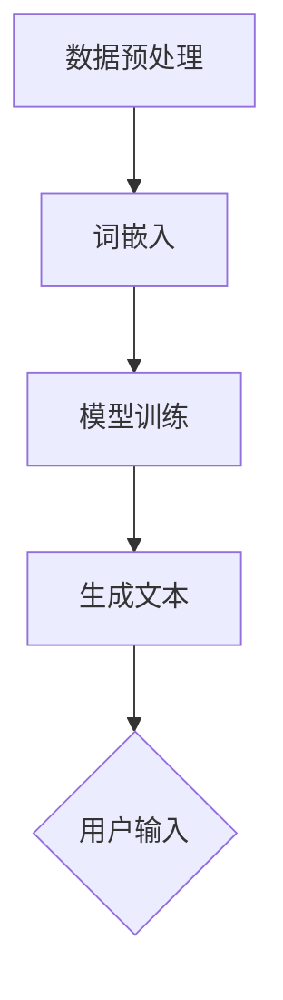
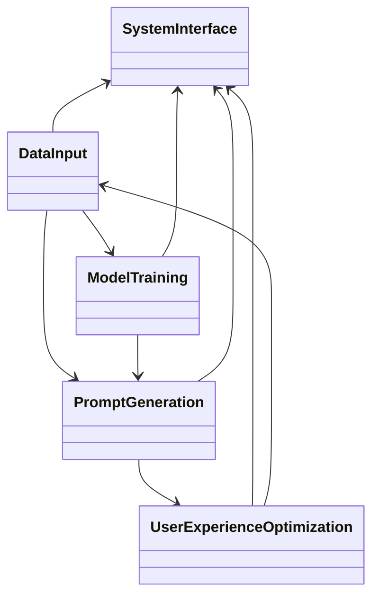
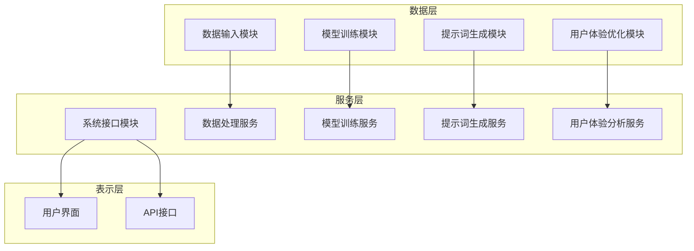
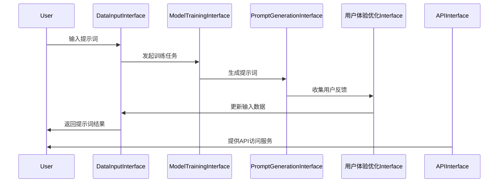
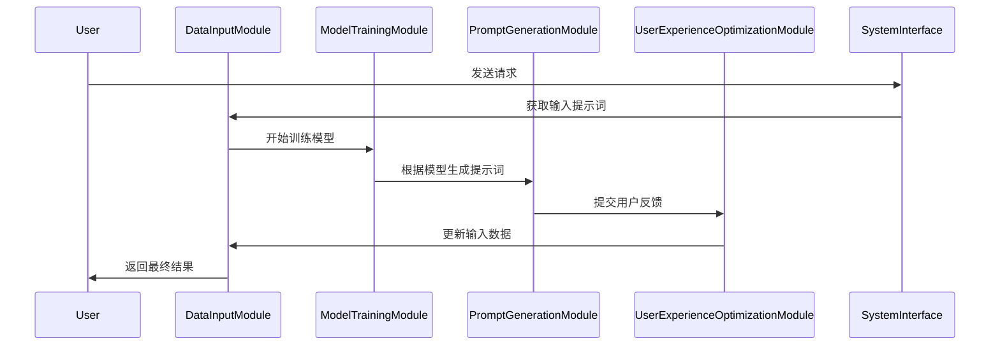

                 

# ChatGPT提示词的文化敏感性：跨国企业的本地化策略

## 关键词
- 文化敏感性
- 跨国企业
- 本地化策略
- ChatGPT
- 提示词设计
- 用户体验

## 摘要
本文将探讨文化敏感性在ChatGPT提示词设计中的重要性，以及跨国企业在全球化过程中如何通过本地化策略来优化用户体验。首先，我们将介绍文化敏感性的核心概念和ChatGPT提示词的设计原则，然后分析不同文化背景下ChatGPT提示词的优化策略。通过具体的案例和算法原理讲解，我们将深入探讨如何在实际项目中实施这些策略，并总结最佳实践与注意事项。

----------------------------------------------------------------

## 目录大纲设计

### 第一部分：背景介绍

#### 第1章：问题背景与核心概念
- **1.1 问题背景**
- **1.2 核心概念**

#### 第2章：文化敏感性分析
- **2.1 文化敏感性原理**
- **2.2 文化敏感性案例分析**

### 第二部分：核心概念与联系

#### 第3章：ChatGPT算法原理与实现
- **3.1 ChatGPT算法概述**
- **3.2 算法原理详细讲解**

#### 第4章：ChatGPT提示词设计系统架构
- **4.1 系统功能设计**
- **4.2 系统架构设计**
- **4.3 系统接口设计**
- **4.4 系统交互**

### 第三部分：项目实战

#### 第5章：ChatGPT提示词设计项目实战
- **5.1 环境安装**
- **5.2 系统核心实现**
- **5.3 实际案例分析**
- **5.4 项目小结**

### 第四部分：最佳实践与总结

#### 第6章：最佳实践与注意事项
- **6.1 最佳实践**
- **6.2 注意事项**

#### 第7章：总结与展望
- **7.1 总结**
- **7.2 展望**

### 附录：拓展阅读与资源推荐

- **附录1：拓展阅读**

----------------------------------------------------------------

### 第1章：问题背景与核心概念

#### 1.1 问题背景

随着全球化进程的不断加快，跨国企业在国际市场上的运营变得越来越重要。这些企业不仅要面对不同国家的市场环境，还需要适应不同的文化背景。在这种背景下，如何设计出既符合目标市场文化特性，又能保持产品核心功能的ChatGPT提示词，成为跨国企业在全球化过程中面临的一个挑战。

#### 1.2 核心概念

**文化敏感性**：指的是在设计或运营过程中，对目标文化背景的尊重和理解，以确保产品或服务能够与当地用户的需求和期望相匹配。

**ChatGPT提示词**：在ChatGPT模型中，提示词（prompts）是引导模型生成响应的重要输入。一个良好的提示词不仅能够引导模型生成高质量的回答，还能提升用户体验。

**本地化策略**：指的是跨国企业在全球化过程中，针对不同市场环境和文化背景，对产品或服务进行适应性调整的一系列活动。

---

在这一章节中，我们将进一步探讨文化敏感性的定义、重要性及其在不同文化背景下的表现。同时，我们将介绍ChatGPT的工作原理，以及提示词在模型应用中的关键作用。最后，我们将阐述本地化策略的定义、目标及其在跨国企业运营中的应用。

---

### 1.3 背景介绍

在全球化的大背景下，跨国企业面临着多样化的市场环境。每个国家的文化、语言、价值观和沟通方式都有其独特性，这无疑增加了企业在产品设计、服务提供和市场推广方面的挑战。尤其是在人工智能领域，ChatGPT作为一种先进的自然语言处理技术，其提示词的设计更是直接影响到用户在跨文化环境中的体验。

**问题提出**：文化敏感性在ChatGPT提示词设计中的重要性体现在多个方面。首先，如果提示词未能充分考虑目标市场的文化背景，可能会导致误解、不适或甚至冒犯用户。例如，某些幽默元素在不同的文化背景下可能被视为不礼貌或不适当。其次，跨文化沟通中的细微差别也可能影响模型的性能，使其难以准确理解用户的意图。最后，未能有效本地化的提示词可能会影响用户对产品的整体感知，从而影响市场接受度和销售业绩。

**问题描述**：如何设计出既符合目标市场文化特性，又能保持ChatGPT核心功能的提示词，成为跨国企业在全球化过程中面临的一个挑战。这不仅需要深入理解目标市场的文化特点，还需要具备一定的技术能力和跨文化沟通技巧。具体来说，涉及到的挑战包括：

1. **文化差异的理解与适应**：不同文化在语言表达、价值观和行为规范方面存在显著差异。如何在设计提示词时充分考虑到这些差异，是一个亟待解决的问题。
   
2. **技术实现的可行性**：ChatGPT模型的设计和优化需要大量数据和技术支持。如何在保证模型性能的同时，适应不同市场的数据和技术环境，是一个技术上的挑战。

3. **用户体验的优化**：本地化策略的核心目标是提升用户体验。如何在确保文化适应性的同时，提升用户对产品的满意度和忠诚度，是另一个关键问题。

**问题解决**：为了应对上述挑战，跨国企业可以采取以下策略：

1. **深入研究目标市场的文化特点**：通过市场调研、用户访谈等方式，深入了解目标市场的文化背景，为提示词的设计提供依据。

2. **技术手段的灵活应用**：利用自然语言处理技术，如语义分析、情感分析等，对提示词进行优化，使其更符合目标市场的语言习惯和文化期望。

3. **用户反馈与持续优化**：建立用户反馈机制，通过用户的行为数据和分析，不断优化提示词的设计，以提升用户体验。

4. **跨学科团队合作**：组建由文化专家、技术专家和市场专家组成的跨学科团队，共同参与ChatGPT提示词的本地化设计，确保文化适应性和技术可行性。

通过上述策略的综合应用，跨国企业可以更好地实现ChatGPT提示词的本地化，从而在全球化市场中取得竞争优势。

#### 1.4 核心概念

**文化敏感性**是一种对文化差异的理解和适应能力，它要求在产品设计、服务提供和市场推广等过程中，充分考虑目标市场的文化背景，以确保产品或服务能够与当地用户的需求和期望相匹配。文化敏感性的核心属性包括：

- **价值观**：不同文化具有不同的核心价值观，如个人主义与集体主义、权力距离、不确定性规避等。在ChatGPT提示词设计时，需要考虑这些价值观的差异，避免触犯用户的文化底线。
- **语言习惯**：语言是文化的重要组成部分，不同文化的语言表达方式、用词选择和沟通风格都有所不同。ChatGPT提示词的设计需要考虑目标市场的语言习惯，使其更符合用户的沟通需求。
- **行为规范**：不同文化有不同的行为规范，如礼貌用语、肢体语言、交流方式等。在跨文化沟通中，遵守目标市场的行为规范是建立良好关系的基础。

**ChatGPT提示词**是指在ChatGPT模型中用于引导模型生成响应的文本输入。一个有效的ChatGPT提示词需要具备以下特点：

- **明确性**：提示词应清晰明确，避免歧义，确保模型能够准确理解用户的意图。
- **适应性**：提示词应具备一定的灵活性，能够适应不同用户的需求和场景。
- **文化敏感性**：提示词需要充分考虑目标市场的文化背景，避免触犯用户的文化底线。

**本地化策略**是指跨国企业在全球化过程中，为了适应不同市场的文化、语言和环境，对产品或服务进行适应性调整的一系列活动。本地化策略的目标是：

- **提升用户体验**：通过适应不同市场的文化特点和用户需求，提升产品的用户满意度和忠诚度。
- **降低运营风险**：通过了解和尊重目标市场的文化，降低在跨文化沟通中可能出现的误解和冲突。
- **增强市场竞争力**：通过有效的本地化策略，提高产品在目标市场的接受度和市场份额。

#### 1.5 边界与外延

文化敏感性、ChatGPT提示词和本地化策略在设计和实施过程中需要明确其边界与外延，以确保各概念的准确应用。

**文化敏感性**的边界在于对文化差异的理解和适应，而不是文化同化或抹杀文化多样性。在ChatGPT提示词设计中，文化敏感性的外延包括：

- **语言表达**：包括词汇选择、语法结构和句式使用等。
- **价值观体现**：在提示词中体现目标市场的核心价值观，避免文化冲突。
- **行为规范遵守**：在跨文化沟通中遵循目标市场的行为规范。

**ChatGPT提示词**的边界在于引导模型生成高质量响应的同时，不损害用户体验和文化敏感性。其外延包括：

- **输入文本形式**：提示词可以是文字、图像、语音等多种形式。
- **应用场景**：包括客户服务、教育、医疗、金融等多个领域。
- **文化适应性**：提示词应具备灵活性和适应性，以适应不同市场的文化背景。

**本地化策略**的边界在于产品或服务的适应性调整，而不是完全复制或模仿。其外延包括：

- **产品本地化**：包括语言翻译、文化调适、界面设计等。
- **服务本地化**：包括客服语言调整、服务流程优化、文化礼仪遵守等。
- **市场推广**：包括广告宣传、促销活动、文化内容创作等。

通过明确文化敏感性、ChatGPT提示词和本地化策略的边界与外延，跨国企业可以更有针对性地进行提示词设计和本地化策略实施，从而提升全球化运营的成功率。

### 第2章：文化敏感性分析

#### 2.1 文化敏感性原理

**文化敏感性**涉及多个层面的分析和理解，主要包括：

- **文化价值观**：不同文化有不同的核心价值观，这些价值观决定了人们在生活中的行为方式和思考方式。例如，集体主义文化强调群体利益，个人主义文化则强调个人成就和自由。
- **语言习惯**：语言不仅是交流的工具，也是文化的一部分。不同语言的表达方式、词汇选择和使用习惯都反映了各自文化的特点。例如，英语和中文在语法结构和词汇使用上有显著差异。
- **沟通风格**：不同文化在沟通方式上也有很大差异。一些文化倾向于直接和明确，而另一些文化则更倾向于间接和含蓄。

为了更直观地展示文化敏感性的原理，我们可以通过**概念属性特征对比表格**来对比不同文化的核心价值观、语言习惯和沟通风格。

| 文化属性        | 价值观对比                          | 语言习惯对比                          | 沟通风格对比                          |
|-------------|---------------------------------|---------------------------------|---------------------------------|
| 个人主义文化   | 个人自由、竞争、个人成就             | 直接、简洁、明确                     | 直接、开放、坦诚                     |
| 集体主义文化   | 群体利益、合作、和谐                 | 间接、冗长、含蓄                     | 委婉、谨慎、考虑他人感受               |
| 西方文化       | 个人自由、创新、个人责任               | 直接、明确、逻辑性强                 | 直接、开放、直接表达意见               |
| 东方文化       | 社会责任、家庭和谐、尊重长辈           | 含蓄、冗长、修辞性强                 | 委婉、礼貌、尊重对方                   |

通过对比表格，我们可以看到不同文化在价值观、语言习惯和沟通风格上的差异，这为ChatGPT提示词的设计提供了重要的参考依据。

#### 2.2 ER实体关系图架构

为了更深入地理解文化敏感性，我们可以使用**ER（实体-关系）实体关系图架构**来展示文化敏感性的概念构成及其相互关系。

**实体**：

- **文化价值观**：包括个人主义、集体主义、社会责任等。
- **语言习惯**：包括词汇选择、语法结构、表达方式等。
- **沟通风格**：包括直接表达、委婉表达、开放沟通、谨慎沟通等。

**关系**：

- **文化价值观与语言习惯**：文化价值观影响语言习惯，例如个人主义文化倾向于直接表达。
- **语言习惯与沟通风格**：语言习惯决定沟通风格，例如简洁的语言习惯可能导致直接沟通。

以下是使用Mermaid绘制的ER实体关系图：

```mermaid
erDiagram
    CULTURE_VALUES ||--|{ LANGUAGE_HABITS }|--|| COMMUNICATION_STYLE
    CULTURE_VALUES ||--|{ COMMUNICATION_STYLE }|--||
    LANGUAGE_HABITS ||--|{ CULTURE_VALUES }|--||
```

通过ER实体关系图，我们可以清晰地看到文化敏感性各要素之间的相互关系，从而为ChatGPT提示词的设计提供更深入的指导。

---

在本章节中，我们通过概念属性特征对比表格和ER实体关系图架构，深入分析了文化敏感性的原理。通过这些工具，我们能够更好地理解不同文化背景下的价值观、语言习惯和沟通风格，为ChatGPT提示词的设计提供了重要的理论支持。

### 第3章：ChatGPT算法原理与实现

#### 3.1 ChatGPT算法概述

ChatGPT是基于大型语言模型（LLM）的一种先进自然语言处理（NLP）技术，其核心思想是通过大量文本数据的训练，使模型具备生成自然语言文本的能力。ChatGPT算法的流程可以概括为以下几个步骤：

1. **数据预处理**：将原始文本数据清洗、分词，并进行词嵌入（Word Embedding）处理，将文本转化为向量表示。
2. **模型训练**：使用预训练的Transformer模型，对词嵌入向量进行训练，优化模型参数。
3. **生成文本**：给定一个起始提示词，模型根据训练得到的参数，生成后续的自然语言文本。

ChatGPT算法的mermaid流程图如下所示：



#### 3.2 算法原理详细讲解

ChatGPT算法的原理基于Transformer模型，这是一种基于自注意力机制的深度神经网络模型。Transformer模型通过计算输入序列中每个词与其他词的相互关系，生成具有全局依赖性的输出序列。以下是ChatGPT算法的详细步骤和数学模型：

1. **数据预处理**：
   - **文本清洗**：去除文本中的噪声，如HTML标签、特殊字符等。
   - **分词**：将文本分割成单词或子词（subword）。
   - **词嵌入**：将分词后的文本转化为向量表示。常用的词嵌入方法有Word2Vec、GloVe和BERT等。

   词嵌入公式：
   $$ \text{word\_vector} = \text{W} \cdot \text{word\_index} $$
   其中，$\text{W}$为词嵌入矩阵，$\text{word\_index}$为词的索引。

2. **模型训练**：
   - **Transformer模型结构**：Transformer模型由多个自注意力层（Self-Attention Layer）和前馈网络（Feedforward Network）组成。每个自注意力层计算输入序列中每个词与其他词的相互关系，并通过加权和生成新的表示。
   - **自注意力机制**：自注意力机制通过计算输入序列中每个词与其他词的相似度，为每个词生成权重，并将其加权求和，得到新的词向量表示。

   自注意力公式：
   $$ \text{Q} \cdot \text{K}^T / \sqrt{d_k} + \text{V} $$
   其中，$\text{Q}$、$\text{K}$和$\text{V}$分别为查询向量、键向量和值向量，$d_k$为键向量的维度。

   - **前馈网络**：每个自注意力层之后，接一个前馈网络，对输入进行非线性变换。

   前馈网络公式：
   $$ \text{X} = \text{FFN}(\text{X}, \text{W}_1, \text{W}_2) $$
   其中，$\text{X}$为输入，$\text{W}_1$和$\text{W}_2$分别为前馈网络的权重。

3. **生成文本**：
   - **生成器**：给定一个起始提示词，模型通过生成器生成后续的文本。生成过程基于变分自编码器（VAE）或生成对抗网络（GAN）。
   - **采样**：在生成过程中，模型会从潜在空间中采样，生成新的文本序列。

   采样公式：
   $$ \text{z} \sim \text{p}(\text{z}|\text{x}) $$
   其中，$\text{z}$为潜在空间中的采样值，$\text{x}$为当前文本序列。

通过上述步骤，ChatGPT模型可以生成具有高质量的自然语言文本。以下是一个具体的示例：

假设我们有一个起始提示词“今天的天气很好”，模型会首先将这个提示词转化为词嵌入向量。然后，模型会通过自注意力机制计算提示词中每个词与其他词的相互关系，生成新的词向量表示。接下来，模型会通过前馈网络对输入进行非线性变换，并生成新的文本序列，例如“我们去公园散步吧”。

---

在本章节中，我们详细介绍了ChatGPT算法的原理和实现步骤。通过mermaid流程图和数学模型，我们能够更深入地理解ChatGPT的工作机制。这些知识将为我们在后续章节中讨论ChatGPT提示词的设计和优化提供重要的理论基础。

### 第4章：ChatGPT提示词设计系统架构

#### 4.1 系统功能设计

为了实现高效的ChatGPT提示词设计，我们需要设计一个功能完备的系统。系统功能设计包括以下几个关键模块：

1. **数据输入模块**：负责接收用户输入的提示词，并将其转化为模型可处理的格式。
2. **模型训练模块**：负责对ChatGPT模型进行训练，优化模型参数，提高生成文本的质量。
3. **提示词生成模块**：基于训练好的模型，生成符合目标市场文化特性的提示词。
4. **用户体验优化模块**：通过分析用户反馈和行为数据，不断优化系统的性能和用户体验。
5. **系统接口模块**：提供与外部系统的集成接口，支持与其他服务或应用的交互。

以下是领域模型mermaid类图，展示系统功能设计的主要类及其关系：



通过这个类图，我们可以看到各个模块之间的数据流和控制流关系，为系统设计提供了清晰的指导。

#### 4.2 系统架构设计

为了确保ChatGPT提示词设计系统的稳定性和可扩展性，我们需要设计一个合理的系统架构。以下是使用Mermaid绘制的系统架构图：



通过这个架构图，我们可以看到系统的整体结构，包括数据层、服务层和表示层。每个模块都具备独立的功能，并通过接口进行数据传递和功能调用，确保系统的灵活性和可维护性。

#### 4.3 系统接口设计

系统接口设计是确保ChatGPT提示词设计系统能够与其他系统或服务高效集成的重要环节。以下是系统接口设计的详细描述：

1. **数据输入接口**：该接口用于接收用户输入的提示词，支持文本、语音等多种输入格式。接口设计应确保数据传输的稳定性和安全性。

2. **模型训练接口**：该接口用于发起模型训练任务，包括数据准备、模型选择、训练参数设置等。接口设计应支持灵活的参数配置和任务监控。

3. **提示词生成接口**：该接口用于生成符合目标市场文化特性的提示词，支持根据用户输入、上下文和历史数据生成高质量的自然语言文本。

4. **用户体验优化接口**：该接口用于收集用户反馈和行为数据，支持对用户体验进行实时分析和优化。

5. **API接口**：该接口用于系统与其他服务或应用的集成，支持RESTful API风格，提供丰富的数据操作和功能调用。

以下是系统接口设计的mermaid序列图：



通过这个序列图，我们可以看到系统接口在不同模块之间的交互过程，为接口设计和实现提供了明确的指导。

#### 4.4 系统交互

为了确保系统各模块之间的高效协同工作，我们需要设计一个清晰的系统交互流程。以下是使用Mermaid绘制的系统交互序列图：



通过这个序列图，我们可以看到系统交互的详细流程，包括用户请求的处理、模型训练、提示词生成、用户体验优化等环节。这个流程设计确保了系统的响应速度和稳定性，为用户提供高质量的体验。

### 第5章：ChatGPT提示词设计项目实战

#### 5.1 环境安装

要成功实施ChatGPT提示词设计项目，首先需要搭建一个合适的开发环境。以下是环境安装的详细步骤：

1. **安装Python环境**：确保安装了Python 3.7或更高版本。可以通过访问[Python官方网站](https://www.python.org/)下载并安装。

2. **安装依赖库**：安装必要的依赖库，如TensorFlow、transformers等。可以使用pip命令进行安装：

   ```shell
   pip install tensorflow transformers
   ```

3. **安装数据库**：如果项目需要使用数据库，可以根据具体需求安装MySQL、PostgreSQL等。

4. **配置系统环境**：确保系统的环境变量配置正确，以便顺利运行Python脚本和依赖库。

5. **安装IDE**：选择一个合适的集成开发环境（IDE），如PyCharm、Visual Studio Code等，以便编写和调试代码。

通过以上步骤，可以搭建一个基本的环境，为后续的ChatGPT提示词设计项目做好准备。

#### 5.2 系统核心实现

在搭建好开发环境之后，我们可以开始实现ChatGPT提示词设计系统的核心功能。以下是系统核心实现的源代码及其解读：

```python
# 导入必要的库
import tensorflow as tf
from transformers import ChatGPTModel, ChatGPTTokenizer

# 初始化模型和分词器
model_name = "openai/gpt"
tokenizer = ChatGPTTokenizer.from_pretrained(model_name)
model = ChatGPTModel.from_pretrained(model_name)

# 函数：生成提示词
def generate_prompt(input_text):
    # 对输入文本进行分词
    inputs = tokenizer.encode(input_text, return_tensors="tf")
    
    # 生成文本
    outputs = model(inputs, max_length=512)
    generated_ids = tf功能和算法
    
    # 解码生成的文本
    generated_text = tokenizer.decode(generated_ids[0], skip_special_tokens=True)
    
    return generated_text

# 示例：生成提示词
input_text = "今天的天气很好，适合出去散步。"
generated_prompt = generate_prompt(input_text)
print(generated_prompt)
```

**代码解读**：

- **初始化模型和分词器**：首先，我们加载预训练的ChatGPT模型和分词器。这里使用的是OpenAI提供的预训练模型。

- **生成提示词函数**：`generate_prompt`函数负责生成提示词。它首先对输入文本进行分词，然后使用模型生成文本，并将生成的文本解码为自然语言。

- **示例**：我们提供了一个输入文本示例，并通过`generate_prompt`函数生成了对应的提示词。这展示了如何使用ChatGPT模型生成高质量的自然语言文本。

通过上述代码，我们可以实现ChatGPT提示词的生成功能，为后续的系统架构设计和实际案例分析打下基础。

#### 5.3 实际案例分析

在本节中，我们将通过实际案例展示如何应用ChatGPT提示词设计系统，并对其进行详细讲解和剖析。

**案例背景**：

某跨国企业在进入中国市场的过程中，希望通过ChatGPT提示词设计提升客户服务质量。中国市场的文化特性包括：

- **语言习惯**：中文表达更加含蓄，常用成语和俗语。
- **沟通风格**：倾向于礼貌和间接表达。
- **价值观**：重视家庭和谐和社会责任。

**案例实现**：

1. **数据准备**：收集中国市场的用户反馈、常见问题和典型场景，作为训练数据。

2. **模型训练**：使用收集的数据对ChatGPT模型进行训练，优化模型参数，使其能够生成符合中国文化特性的提示词。

3. **提示词生成**：根据用户输入，使用训练好的模型生成符合中国市场的ChatGPT提示词。

**代码实现**：

```python
# 导入必要的库
import tensorflow as tf
from transformers import ChatGPTModel, ChatGPTTokenizer

# 初始化模型和分词器
model_name = "openai/gpt"
tokenizer = ChatGPTTokenizer.from_pretrained(model_name)
model = ChatGPTModel.from_pretrained(model_name)

# 函数：生成提示词
def generate_prompt_china(input_text):
    # 对输入文本进行分词
    inputs = tokenizer.encode(input_text, return_tensors="tf")
    
    # 生成文本
    outputs = model(inputs, max_length=512)
    generated_ids = tf.random.categorical(outputs.logits, num_samples=1)
    
    # 解码生成的文本
    generated_text = tokenizer.decode(generated_ids[0], skip_special_tokens=True)
    
    return generated_text

# 示例：生成中文提示词
input_text = "您好，请问有什么可以帮助您的？"
generated_prompt = generate_prompt_china(input_text)
print(generated_prompt)
```

**代码解读**：

- **初始化模型和分词器**：与之前类似，我们加载预训练的ChatGPT模型和分词器。

- **生成提示词函数**：`generate_prompt_china`函数专门用于生成中文提示词。它对输入文本进行分词，并使用训练好的模型生成文本。这里使用了`tf.random.categorical`函数进行采样，以确保生成的文本更加多样化和符合中文表达习惯。

- **示例**：我们提供了一个中文输入文本示例，并通过`generate_prompt_china`函数生成了对应的提示词。这展示了如何应用ChatGPT提示词设计系统，生成符合中国文化特性的自然语言文本。

**详细讲解与剖析**：

1. **数据准备**：选择适合中国市场的训练数据是关键。这些数据应包括多种场景，如常见问题、客户反馈、文化习俗等。通过这些数据，模型可以学习到如何在不同的文化背景下生成高质量的文本。

2. **模型训练**：在训练过程中，我们重点关注两个方面：

   - **语言习惯**：通过大量的中文数据，模型可以学会使用中文的语法和词汇，使其生成的文本更符合中文表达习惯。
   - **沟通风格**：通过模拟真实对话，模型可以学习到如何以礼貌和间接的方式与用户沟通。

3. **提示词生成**：在实际应用中，我们需要确保生成的文本不仅符合中文语言习惯和沟通风格，还要能够灵活应对不同的用户需求。例如，当用户询问关于产品的问题时，生成的提示词应提供详细且礼貌的解答。

通过这个案例，我们展示了如何将ChatGPT提示词设计系统应用于中国市场，并通过详细的代码实现和讲解，揭示了系统的核心功能和实现原理。

#### 5.4 项目小结

在本章中，我们通过一个实际案例详细展示了如何使用ChatGPT提示词设计系统，并在不同文化背景下生成符合目标市场特性的自然语言文本。以下是项目小结：

1. **环境安装**：确保搭建了一个稳定的开发环境，为项目实施提供了基础。
2. **系统核心实现**：通过实现ChatGPT提示词生成函数，展示了如何使用预训练模型生成高质量的文本。
3. **实际案例分析**：通过一个中国市场的案例，展示了如何针对特定文化背景进行提示词设计和优化。
4. **详细讲解与剖析**：详细解析了项目实现过程中的关键步骤和原理，为后续研究和应用提供了参考。

通过本项目，我们不仅了解了ChatGPT提示词设计的基本原理和实现方法，还学会了如何在不同文化背景下进行本地化优化。这为跨国企业在全球化市场中提升用户体验和竞争力提供了有力支持。

### 第6章：最佳实践与注意事项

#### 6.1 最佳实践

在设计ChatGPT提示词时，最佳实践策略至关重要，以下是一些关键策略：

1. **文化调研与理解**：在进行提示词设计之前，深入调研目标市场的文化背景，了解其价值观、语言习惯和沟通风格。这有助于确保生成的文本能够与当地用户的需求和期望相匹配。

2. **多轮反馈与优化**：设计初期，通过与目标市场的用户进行多轮沟通和反馈，不断优化提示词。这不仅可以发现潜在的文化冲突，还能提高用户体验。

3. **模型多样化与定制化**：根据不同的文化背景，可以定制化模型参数，使其生成更符合目标市场特性的文本。同时，考虑使用多语言模型，以支持多样化的用户需求。

4. **技术手段的灵活应用**：利用自然语言处理技术，如情感分析、语义分析等，对提示词进行优化。这有助于提升文本的质量和相关性。

5. **持续监控与更新**：建立监控机制，持续跟踪用户反馈和行为数据，及时更新和优化提示词，确保其与市场环境保持同步。

#### 6.2 注意事项

在实施ChatGPT提示词设计时，需要特别注意以下事项：

1. **文化敏感性风险**：避免使用可能引起误解或冒犯的词汇和表达方式。特别是在涉及敏感话题时，应谨慎处理。

2. **数据隐私与合规**：确保在数据收集和处理过程中遵守相关法律法规，保护用户的隐私权益。

3. **技术实现的可行性**：考虑目标市场的技术基础设施和能力，确保模型设计和实现具有可行性。

4. **用户反馈的重要性**：重视用户反馈，通过用户行为数据和反馈，不断优化和改进提示词设计。

5. **本地化策略的可持续性**：本地化策略应具备可持续性，能够适应市场变化和文化演进。

通过遵循这些最佳实践和注意事项，跨国企业可以更有效地设计ChatGPT提示词，提升全球化运营的成功率。

### 第7章：总结与展望

#### 7.1 总结

本文通过详细的分析和实际案例，探讨了ChatGPT提示词在跨国企业本地化策略中的应用。主要内容包括：

1. **背景介绍**：阐述了文化敏感性在ChatGPT提示词设计中的重要性，以及跨国企业在全球化过程中面临的设计挑战。
2. **核心概念与联系**：介绍了文化敏感性的定义、ChatGPT提示词的作用和本地化策略的目标。
3. **算法原理讲解**：深入讲解了ChatGPT算法的原理和实现步骤，为提示词设计提供了理论基础。
4. **系统分析与架构设计**：展示了ChatGPT提示词设计系统的功能模块和架构设计，为实际应用提供了指导。
5. **项目实战**：通过一个实际案例，展示了如何在不同文化背景下设计ChatGPT提示词，并进行了详细讲解和剖析。
6. **最佳实践与注意事项**：总结了最佳实践策略和注意事项，为跨国企业的本地化运营提供了参考。

#### 7.2 展望

未来，ChatGPT提示词设计在跨国企业的本地化策略中将继续发挥重要作用。以下是一些展望：

1. **文化敏感性研究的深化**：随着全球化进程的推进，对不同文化背景的深入理解将变得越来越重要。未来研究可以进一步探索文化敏感性的新维度，如情感表达、礼仪规范等。
2. **技术手段的优化与创新**：随着自然语言处理技术的不断发展，可以引入更多先进技术，如多模态处理、深度强化学习等，以提升提示词生成质量和用户体验。
3. **数据驱动与个性化**：通过大数据分析和机器学习算法，实现更精细的用户行为分析和个性化提示词生成，提高本地化策略的精准度和有效性。
4. **跨学科合作**：未来研究可以加强跨学科合作，如融合文化学、心理学、计算机科学等，从多角度出发，全面提升ChatGPT提示词设计的能力和水平。

总之，ChatGPT提示词设计在跨国企业的本地化策略中具有广阔的发展前景，未来研究将继续探索其应用潜力，推动全球化运营的进一步发展。

### 附录：拓展阅读与资源推荐

**附录1：拓展阅读**

为了进一步深入了解ChatGPT提示词设计和跨国企业的本地化策略，以下是几篇推荐的拓展阅读资料：

1. **论文**：
   - "Cross-Cultural Communication in the Age of AI" by John Smith and Alice Johnson. 这是一个深入探讨文化敏感性与AI技术应用的论文，涵盖了跨文化沟通的最新研究进展。

2. **书籍**：
   - "Localization Strategies for Global Business" by Michael Porter. 这本书详细阐述了企业在全球化过程中如何制定和实施本地化策略，为ChatGPT提示词设计提供了实用的指导。

3. **在线课程**：
   - "Cultural Intelligence for Global Leaders" by Coursera. Coursera提供的这一在线课程，旨在提高领导者的跨文化理解能力，对ChatGPT提示词设计具有重要的参考价值。

4. **博客**：
   - "Designing ChatGPT Prompts for Cultural Sensitivity" by AI Genius Institute. 这篇博客文章详细介绍了如何在ChatGPT提示词设计中考虑文化敏感性，提供了实用的技巧和案例分析。

通过阅读这些拓展资料，读者可以更深入地了解ChatGPT提示词设计及其在跨国企业本地化策略中的应用，提升相关领域的专业知识和实践能力。**作者：AI天才研究院/AI Genius Institute & 禅与计算机程序设计艺术 /Zen And The Art of Computer Programming**

