                 

# 《ChatGPT提示词的文化智能自适应学习：构建全球化AI交互系统》

> 关键词：ChatGPT、提示词、文化智能、自适应学习、全球化AI交互

> 摘要：本文从全球化背景下AI交互的重要性出发，探讨了ChatGPT提示词在文化适应性方面的挑战。通过构建文化智能自适应学习模型，实现全球化AI交互系统的设计与实现，旨在为AI交互系统提供更好的文化适应性，提升用户体验。

----------------------------------------------------------------

## 《ChatGPT提示词的文化智能自适应学习：构建全球化AI交互系统》目录大纲

## 第1章 引言

### 1.1 问题背景

- 全球化背景下AI交互的重要性
- 文化差异对AI交互的影响

### 1.2 问题描述

- ChatGPT等AI模型在文化适应性方面的挑战
- 文化智能自适应学习的必要性

### 1.3 问题解决

- 提出文化智能自适应学习模型
- 实现全球化AI交互系统的目标

### 1.4 边界与外延

- 文化智能自适应学习的范围和限制
- 全球化AI交互系统的应用领域

### 1.5 概念结构与核心要素组成

- ChatGPT提示词
- 文化智能自适应学习模型
- 全球化AI交互系统

----------------------------------------------------------------

### 1.1 问题背景

在当今全球化的背景下，AI交互作为一种新兴的技术手段，正在被广泛应用于各个领域。无论是企业客服、智能助手，还是在线教育、医疗诊断，AI交互都在不断地改变我们的生活方式和工作方式。然而，随着AI交互系统的普及，文化差异对其的影响也越来越凸显。

#### 全球化背景下AI交互的重要性

全球化的进程加速了各国间的经济、文化和信息的交流。在这个背景下，AI交互系统不仅要在技术上满足用户需求，还需要在文化层面进行适应和优化。全球化AI交互系统可以帮助企业更好地服务不同国家和地区的用户，提升用户体验，增强品牌影响力。

#### 文化差异对AI交互的影响

文化差异主要体现在语言、价值观、行为习惯等方面。不同的文化背景会影响用户对AI交互系统的期望和使用方式。例如，在某些文化中，直接和简洁的交流方式可能更受欢迎，而在另一些文化中，礼貌和含蓄的表达方式则更为重要。如果AI交互系统不能很好地适应这些文化差异，可能会导致用户满意度下降，甚至影响系统的实际应用效果。

### 1.2 问题描述

ChatGPT等AI模型在文化适应性方面面临着一系列挑战：

- **语言习惯差异**：不同语言的表达方式和语法结构存在差异，这会影响AI模型的响应生成。
- **价值观差异**：不同文化对某些话题和表达方式有不同的看法，这可能导致AI模型的回答不符合用户期望。
- **行为习惯差异**：不同文化背景下的用户行为习惯和交流方式不同，这需要AI模型能够灵活地适应。

为了解决这些问题，我们需要引入文化智能自适应学习模型，以实现全球化AI交互系统的文化适应性。

### 1.3 问题解决

为了应对文化差异对AI交互系统的影响，本文提出了文化智能自适应学习模型，其主要目标和内容如下：

- **目标**：构建一个能够自适应不同文化背景的AI交互系统，提升用户体验。
- **内容**：该模型包括文化智能自适应学习算法、文化信息库、多语言支持模块等组成部分，通过这些组成部分的协同工作，实现AI交互系统的文化适应性。

通过这一模型的实现，我们可以为全球化AI交互系统提供更精准、更个性化的服务，满足不同文化背景下的用户需求。

### 1.4 边界与外延

#### 文化智能自适应学习的范围和限制

文化智能自适应学习模型主要关注的是AI交互系统在语言、价值观、行为习惯等方面的文化适应性。然而，文化适应性并非万能，它也存在一定的限制。例如，一些深层次的文化差异可能无法通过技术手段完全解决，这需要人类专家的介入和指导。

#### 全球化AI交互系统的应用领域

全球化AI交互系统可以在多个领域得到应用，包括：

- **客户服务**：为不同国家和地区的客户提供24/7的智能客服支持。
- **在线教育**：提供跨文化的在线教学和辅导服务。
- **医疗健康**：为患者提供跨文化背景的健康咨询和服务。
- **跨国企业**：为跨国企业的员工提供文化适应性培训和支持。

通过这些应用，全球化AI交互系统可以帮助企业更好地适应全球市场的需求，提升竞争力。

### 1.5 概念结构与核心要素组成

为了更好地理解文化智能自适应学习模型和全球化AI交互系统，我们需要明确以下几个核心概念：

- **ChatGPT提示词**：ChatGPT与用户交互的输入，需要考虑文化适应性。
- **文化智能自适应学习模型**：包括文化智能自适应学习算法、文化信息库、多语言支持模块等组成部分。
- **全球化AI交互系统**：基于文化智能自适应学习模型构建的AI交互系统，旨在提升跨文化用户体验。

这些概念相互关联，共同构成了本文研究的核心内容。

----------------------------------------------------------------

## 第2章 ChatGPT提示词概述

### 2.1 ChatGPT简介

ChatGPT是由OpenAI开发的一种基于GPT（Generative Pre-trained Transformer）的聊天机器人，它利用深度学习技术进行训练，能够理解并生成人类语言。ChatGPT具有以下基本原理和主要功能：

#### 基本原理

ChatGPT的核心是基于大规模预训练模型，通过无监督学习从海量文本数据中提取知识。它使用了大量的神经网络层，通过多层堆叠和注意力机制，实现了对语言的深刻理解和生成。

#### 主要功能与应用场景

- **自然语言理解**：ChatGPT能够理解用户输入的自然语言，提取关键信息，并进行适当的处理。
- **对话生成**：ChatGPT可以根据用户的输入生成连贯、合理的回复，实现与用户的自然对话。
- **文本生成**：ChatGPT还可以生成文章、故事、诗歌等多种类型的文本，应用于内容创作和自动化写作。

ChatGPT的主要应用场景包括：

- **智能客服**：为企业提供24/7的智能客服支持，提高客户满意度和服务效率。
- **在线教育**：提供智能辅导和教学支持，帮助学生更好地理解和掌握知识。
- **医疗健康**：为患者提供健康咨询、病情诊断和康复指导等。
- **内容创作**：帮助创作者快速生成文章、故事等，提高创作效率。

### 2.2 提示词的作用与类型

#### 提示词的定义与作用

提示词（Prompt）是用户与ChatGPT交互的输入，是ChatGPT生成回复的基础。一个良好的提示词可以帮助ChatGPT更好地理解用户的需求，生成更准确、更相关的回复。

#### 常见提示词的类型与应用

1. **问题型提示词**：用于提问，如“你能帮我解答这个问题吗？”
   - 应用场景：客服、教育、医疗咨询等。

2. **陈述型提示词**：用于陈述事实或观点，如“我最近在学Python编程。”
   - 应用场景：教育、聊天、社交等。

3. **指令型提示词**：用于下达指令，如“请给我推荐一本好书。”
   - 应用场景：客服、智能助手等。

4. **情感型提示词**：用于表达情感，如“我感到很焦虑。”
   - 应用场景：心理健康、医疗咨询等。

### 2.3 提示词设计原则

为了确保ChatGPT能够生成符合用户需求的回复，提示词的设计需要遵循以下原则：

#### 文化适应性原则

- **考虑语言差异**：不同文化背景下的语言表达方式不同，提示词需要考虑这些差异，使用适当的语言和表达方式。
- **避免文化偏见**：在提示词中避免使用可能引起文化偏见或误解的词汇和表达。

#### 用户友好性原则

- **清晰简洁**：提示词应尽量简洁明了，避免过于复杂或模糊的表述。
- **易理解**：提示词应使用用户熟悉的语言和表达方式，确保用户能够轻松理解。

#### 上下文敏感性原则

- **上下文理解**：提示词需要能够捕捉用户的上下文信息，确保ChatGPT能够理解用户的真实需求。
- **灵活调整**：在对话过程中，提示词应根据用户的反馈和上下文信息进行动态调整，以生成更准确的回复。

通过遵循这些设计原则，我们可以提高ChatGPT提示词的文化适应性，提升用户体验。

----------------------------------------------------------------

## 第3章 文化智能自适应学习模型

### 3.1 模型原理

文化智能自适应学习模型旨在通过自适应学习算法，使AI交互系统能够根据用户的文化背景和语言习惯，生成符合其需求和期望的回复。该模型的核心原理包括以下几个方面：

#### 文化智能自适应学习算法的基本原理

文化智能自适应学习算法基于深度学习技术，通过对海量文化数据和交互数据的训练，使模型能够理解并适应不同文化背景下的语言表达和用户行为。其基本原理包括：

1. **文化特征提取**：从交互数据中提取与文化相关的特征，如语言习惯、价值观、行为模式等。
2. **自适应调整**：根据用户的文化特征，动态调整AI交互系统的参数和行为，使其更符合用户的需求和期望。
3. **反馈优化**：通过用户反馈，不断优化模型的表现，提高其文化适应性。

#### 文化智能自适应学习的关键技术

文化智能自适应学习模型的关键技术包括：

1. **多语言处理**：支持多种语言的交互，包括自然语言理解、生成和翻译。
2. **文化特征库**：构建包含多种文化特征的数据库，用于模型的训练和自适应调整。
3. **用户个性化**：通过分析用户的交互历史和反馈，为用户提供个性化的服务。

### 3.2 模型架构

文化智能自适应学习模型的整体架构包括以下几个主要模块：

#### 模型框架与模块划分

1. **用户模块**：负责接收用户输入，提取用户的文化特征。
2. **文化特征库**：存储多种文化特征的数据，供模型训练和使用。
3. **自适应学习模块**：根据用户的文化特征，调整模型的参数和行为。
4. **交互模块**：负责与用户进行交互，生成回复。
5. **反馈模块**：收集用户的反馈，用于模型的优化和调整。

#### 模型各组成部分的功能与作用

1. **用户模块**：通过自然语言处理技术，提取用户的文化特征，如语言风格、表达习惯等。
2. **文化特征库**：包含多种文化特征的数据，用于模型的训练和自适应调整。这些数据可以从公共数据库、社交媒体、用户交互记录等多种渠道获取。
3. **自适应学习模块**：根据用户的文化特征，动态调整模型的参数和行为，使其更符合用户的需求和期望。该模块的核心算法包括文化特征匹配、参数调整、模型优化等。
4. **交互模块**：负责与用户进行交互，生成回复。该模块结合自然语言生成技术和上下文理解能力，确保生成的回复既符合文化特征，又能满足用户的实际需求。
5. **反馈模块**：收集用户的反馈，用于模型的优化和调整。用户反馈可以通过点击率、满意度评价、交互时长等多种方式进行收集。

通过这些模块的协同工作，文化智能自适应学习模型能够实现跨文化背景下的智能交互，提升用户体验。

### 3.3 文化智能自适应学习算法

#### 算法原理与数学模型

文化智能自适应学习算法的核心是基于深度学习技术，通过多层神经网络对用户的文化特征进行建模和识别。其数学模型主要包括以下几个部分：

1. **输入层**：接收用户输入的数据，如文本、语音等。
2. **特征提取层**：通过自然语言处理技术，提取用户的文化特征，如语言风格、表达习惯等。
3. **文化特征匹配层**：将提取的文化特征与预先训练好的文化特征库进行匹配，确定用户的文化背景。
4. **自适应调整层**：根据用户的文化背景，动态调整模型的参数和行为。
5. **输出层**：生成与用户文化背景相匹配的回复。

#### 算法流程与实现细节

文化智能自适应学习算法的流程主要包括以下几个步骤：

1. **数据收集与预处理**：收集用户交互数据，并进行预处理，如文本清洗、分词等。
2. **特征提取**：使用自然语言处理技术，提取用户的文化特征。
3. **文化特征匹配**：将提取的文化特征与预先训练好的文化特征库进行匹配，确定用户的文化背景。
4. **模型自适应调整**：根据用户的文化背景，动态调整模型的参数和行为。
5. **生成回复**：结合上下文理解和自然语言生成技术，生成与用户文化背景相匹配的回复。

在实现过程中，文化智能自适应学习算法使用了多种深度学习技术，如卷积神经网络（CNN）、循环神经网络（RNN）、生成对抗网络（GAN）等，以提高模型的准确性和适应性。

### 3.4 文化智能自适应学习模型的应用与效果

通过实际应用，文化智能自适应学习模型在提高AI交互系统的文化适应性方面取得了显著效果。以下是一些具体的应用场景和效果：

1. **智能客服**：在智能客服系统中，文化智能自适应学习模型能够根据用户的文化背景，生成更符合用户期望的回复，提高用户满意度。
2. **在线教育**：在线教育平台使用文化智能自适应学习模型，可以为不同文化背景的学生提供个性化的教学支持，提高学习效果。
3. **跨国企业**：跨国企业利用文化智能自适应学习模型，为其全球员工提供跨文化沟通和协作支持，提高工作效率和团队凝聚力。

通过这些应用，文化智能自适应学习模型不仅提升了AI交互系统的文化适应性，还为用户提供更加个性化和精准的服务，具有重要的实践价值。

----------------------------------------------------------------

## 第4章 全球化AI交互系统的设计与实现

### 4.1 系统设计概述

全球化AI交互系统的设计旨在实现跨文化背景下的智能交互，满足不同国家和地区的用户需求。该系统的整体架构包括以下几个主要模块：

#### 系统整体架构

1. **用户界面层**：提供用户与AI交互的接口，包括文本输入框、语音输入和输出等。
2. **交互引擎层**：负责处理用户的输入，调用文化智能自适应学习模型，生成回复。
3. **数据管理层**：存储和管理用户交互数据、文化特征库等。
4. **后台服务层**：提供系统的运维支持，包括日志记录、性能监控、安全防护等。

#### 系统功能模块划分

1. **用户模块**：负责接收用户输入，提取用户的文化特征。
2. **交互模块**：与用户进行交互，生成回复。
3. **文化特征库**：存储和管理多种文化特征数据。
4. **自适应学习模块**：根据用户的文化特征，动态调整模型参数。
5. **数据管理模块**：处理用户交互数据，支持数据分析和挖掘。

### 4.2 系统架构设计

全球化AI交互系统的架构设计主要包括硬件架构和软件架构两个方面：

#### 系统硬件架构

1. **计算节点**：用于处理用户请求，调用AI模型进行交互。
2. **存储设备**：存储用户交互数据、模型参数和日志等。
3. **网络设备**：负责数据传输和通信。
4. **备份与容灾系统**：保障系统的数据安全和业务连续性。

#### 系统软件架构

1. **前端系统**：包括用户界面、API接口等，负责与用户交互。
2. **核心业务系统**：包括交互引擎、文化特征库、自适应学习模块等，负责核心业务逻辑。
3. **数据管理系统**：包括数据库、数据仓库等，负责数据存储和管理。
4. **运维管理系统**：包括日志记录、性能监控、安全防护等，负责系统的运维和管理。

#### 系统部署与运维

全球化AI交互系统的部署和运维涉及以下几个方面：

1. **部署方案**：根据业务需求和资源情况，选择合适的部署方式，如云部署、本地部署等。
2. **运维策略**：制定系统的运维策略，包括监控、备份、故障处理等。
3. **运维工具**：使用专业的运维工具，如监控工具、日志分析工具等，提高运维效率。
4. **安全保障**：确保系统的安全性，包括数据安全、网络安全等。

通过科学的设计和部署，全球化AI交互系统可以提供稳定、高效、安全的跨文化智能交互服务。

### 4.3 系统接口设计与交互

全球化AI交互系统的接口设计旨在实现各个模块之间的高效通信和协同工作。以下为系统接口设计与交互的详细描述：

#### 系统接口设计原则

1. **高内聚、低耦合**：确保各模块之间的独立性，降低模块之间的依赖关系。
2. **简洁性**：接口设计应尽量简洁明了，减少不必要的复杂度。
3. **可扩展性**：接口设计应考虑未来的扩展需求，方便后续功能的增加和优化。

#### 系统交互流程

1. **用户输入**：用户通过用户界面层输入请求，如文本、语音等。
2. **请求转发**：用户输入经过前端系统处理后，转发至交互引擎层。
3. **文化特征提取**：交互引擎层调用用户模块，提取用户的文化特征。
4. **模型调用**：交互引擎层调用文化智能自适应学习模块，根据用户的文化特征生成回复。
5. **回复生成**：交互模块结合上下文理解技术，生成与用户文化背景相匹配的回复。
6. **回复输出**：将生成的回复通过用户界面层输出给用户。

#### 系统交互流程图

```mermaid
sequenceDiagram
    participant 用户 as 用户
    participant 前端系统 as 前端系统
    participant 交互引擎层 as 交互引擎层
    participant 用户模块 as 用户模块
    participant 文化智能自适应学习模块 as 文化智能自适应学习模块
    participant 交互模块 as 交互模块
    用户->>前端系统: 输入请求
    前端系统->>交互引擎层: 处理请求
    交互引擎层->>用户模块: 提取文化特征
    用户模块-->>交互引擎层: 返回文化特征
    交互引擎层->>文化智能自适应学习模块: 调用模型
    文化智能自适应学习模块-->>交互引擎层: 返回回复
    交互引擎层->>交互模块: 生成回复
    交互模块-->>前端系统: 输出回复
    前端系统->>用户: 展示回复
```

通过科学的接口设计和流畅的交互流程，全球化AI交互系统可以高效地完成用户请求的处理和回复的生成，提供优质的跨文化智能交互服务。

----------------------------------------------------------------

## 第5章 ChatGPT提示词的文化适应性分析

### 5.1 文化差异对AI交互的影响

文化差异对AI交互的影响主要体现在以下几个方面：

#### 不同文化背景下的语言习惯与表达方式

不同文化背景下的语言习惯和表达方式存在显著差异。例如：

1. **英语文化**：强调直接和简洁的表达方式，倾向于使用短句和简单的语法结构。
2. **汉语文化**：倾向于使用更复杂和细腻的表达方式，常常使用成语、典故等。
3. **阿拉伯文化**：在交流中更注重礼貌和含蓄，常常使用敬语和谦辞。

这些差异使得AI交互系统在处理不同文化背景的用户请求时，需要考虑语言习惯的差异，以确保生成的回复既符合用户期望，又能保持适当的礼貌和尊重。

#### 文化差异对AI交互质量的影响

文化差异对AI交互质量的影响主要体现在以下几个方面：

1. **语言理解难度**：不同文化背景下的语言表达方式复杂度不同，可能导致AI模型在理解用户请求时出现困难。
2. **回复准确性**：由于文化差异，AI模型生成的回复可能不符合用户期望，影响交互质量。
3. **用户体验**：不适应文化差异的AI交互系统可能导致用户满意度下降，甚至影响系统的实际应用效果。

为了提升AI交互系统的文化适应性，我们需要对提示词进行文化适应性评估和改进。

### 5.2 ChatGPT提示词的文化适应性评估

#### 提示词的文化适应性评价指标

为了评估ChatGPT提示词的文化适应性，我们可以从以下几个方面进行评价：

1. **语言准确性**：提示词是否能够准确地传达用户的需求和信息。
2. **文化敏感性**：提示词是否考虑了不同文化背景下的语言习惯和表达方式。
3. **用户满意度**：用户对提示词生成的回复的满意度。
4. **错误率**：提示词在生成回复时的错误率。

#### 提示词的文化适应性评估方法

1. **人工评估**：通过人工评审的方式，对提示词的文化适应性进行评估。评审者可以是对相关文化有深入了解的专业人士，也可以是来自不同文化背景的用户。
2. **自动化评估**：利用自然语言处理技术，对提示词进行自动化评估。例如，可以使用语言模型对提示词进行语法和语义分析，评估其准确性和文化敏感性。

通过以上评估方法，我们可以对ChatGPT提示词的文化适应性进行全面的评估，为后续的改进提供依据。

### 5.3 提示词文化适应性的改进策略

为了提升ChatGPT提示词的文化适应性，我们可以采取以下改进策略：

#### 针对不同文化的提示词优化策略

1. **语言习惯优化**：针对不同文化背景下的语言习惯，对提示词进行优化。例如，对英语文化背景下的用户，可以使用更简洁、直接的表达方式；对汉语文化背景下的用户，可以使用更细腻、复杂的表达方式。
2. **文化敏感性优化**：在提示词中增加文化敏感性元素，如使用适当的礼貌用语、表达方式等，确保回复符合不同文化背景下的交流规范。
3. **多语言支持**：开发多语言版本的提示词，满足不同语言文化背景的用户需求。

#### 提高提示词文化适应性的方法

1. **文化数据收集与整合**：收集并整合来自不同文化背景的数据，用于提示词的开发和优化。这些数据可以包括文献、社交媒体内容、用户反馈等。
2. **文化知识库构建**：构建包含多种文化知识的知识库，用于提示词的文化适应性评估和优化。
3. **用户反馈机制**：建立用户反馈机制，收集用户对提示词的反馈，并根据反馈进行优化。

通过以上方法，我们可以提高ChatGPT提示词的文化适应性，提升用户体验，实现更有效的跨文化AI交互。

----------------------------------------------------------------

## 第6章 实际案例分析与实战

### 6.1 案例背景

为了验证文化智能自适应学习模型在全球化AI交互系统中的应用效果，我们选择了一家跨国公司作为案例研究对象。该公司是一家提供全球客户服务的公司，其客户分布在全球不同国家和地区，包括英语国家、汉语国家、阿拉伯国家等。由于文化差异，该公司在提供客户服务时面临了一系列挑战。

### 6.2 案例实现

#### ChatGPT提示词设计与优化

1. **数据收集**：首先，我们收集了来自英语国家、汉语国家和阿拉伯国家的客户服务数据，包括常见问题、客户反馈等。
2. **文化特征提取**：通过自然语言处理技术，提取不同文化背景下的语言特征，如语言习惯、表达方式等。
3. **提示词优化**：针对不同文化背景，对ChatGPT提示词进行优化。例如，对英语文化背景下的用户，使用简洁、直接的表达方式；对汉语文化背景下的用户，使用细腻、复杂的表达方式；对阿拉伯文化背景下的用户，使用礼貌、含蓄的表达方式。

#### 全球化AI交互系统的部署与运行

1. **系统部署**：将优化后的ChatGPT提示词集成到全球化AI交互系统中，部署在公司的服务器上。
2. **系统运行**：启动全球化AI交互系统，为全球客户提供智能客服服务。系统实时分析客户请求，调用文化智能自适应学习模型，生成符合文化背景的回复。

### 6.3 案例分析与总结

#### 案例中的成功经验与不足

**成功经验：**

1. **提高客户满意度**：通过文化智能自适应学习模型，全球化AI交互系统能够为不同文化背景的客户提供更符合其需求和期望的服务，显著提高了客户满意度。
2. **降低人力成本**：智能客服系统能够处理大量的客户请求，减轻了人工客服的工作压力，降低了人力成本。
3. **提升服务效率**：系统自动生成回复，提高了客户服务的效率，缩短了客户等待时间。

**不足之处：**

1. **文化差异处理能力有限**：虽然文化智能自适应学习模型在一定程度上提高了系统的文化适应性，但仍然存在处理能力有限的不足，特别是在处理深层次文化差异时，效果可能不理想。
2. **数据收集与处理难度**：收集和整合来自不同文化背景的数据是一个复杂的过程，需要大量的时间和资源。

#### 案例对其他企业的借鉴意义

1. **重视文化差异**：企业应充分重视文化差异，在设计和优化AI交互系统时，考虑不同文化背景下的用户需求和行为习惯。
2. **构建文化知识库**：企业应构建包含多种文化知识的知识库，用于AI交互系统的训练和优化。
3. **持续优化与改进**：企业应持续收集用户反馈，并根据反馈对AI交互系统进行优化和改进，以提高系统的文化适应性和用户体验。

通过这个案例，我们可以看到文化智能自适应学习模型在全球化AI交互系统中的应用效果，同时也认识到在实现过程中仍需不断优化和改进。

----------------------------------------------------------------

## 第7章 结论与展望

### 7.1 研究成果总结

本文通过构建文化智能自适应学习模型，实现了全球化AI交互系统的设计与实现。主要研究成果包括：

1. **文化智能自适应学习模型**：提出并实现了文化智能自适应学习模型，包括文化特征提取、文化特征匹配、模型自适应调整等关键环节。
2. **全球化AI交互系统**：基于文化智能自适应学习模型，构建了全球化AI交互系统，为不同文化背景的用户提供个性化的智能服务。
3. **实际案例分析**：通过案例分析，验证了文化智能自适应学习模型在全球化AI交互系统中的应用效果，为其他企业提供了借鉴和参考。

### 7.2 未来发展趋势

未来，AI交互领域将继续向以下几个方向发展：

1. **智能化水平提升**：随着深度学习和自然语言处理技术的不断发展，AI交互系统的智能化水平将不断提高，能够更准确地理解用户需求，生成更自然的回复。
2. **跨文化适应性增强**：通过引入更多文化数据，优化文化智能自适应学习模型，提高系统的跨文化适应性，为用户提供更个性化的服务。
3. **多模态交互**：结合语音、图像、视频等多种模态，实现更丰富的交互方式，提高用户的交互体验。

### 7.3 研究与推广建议

为了进一步推动文化智能自适应学习模型在全球化AI交互系统中的应用，提出以下建议：

1. **加强文化数据收集与整合**：收集和整合来自不同文化背景的数据，为模型训练提供丰富的数据支持。
2. **建立跨学科研究团队**：结合计算机科学、心理学、社会学等多学科知识，深入研究文化智能自适应学习模型的理论和实践。
3. **推广实际应用**：在更多企业和场景中推广文化智能自适应学习模型的应用，通过实际应用验证其效果和可行性。

通过以上措施，有望进一步提升全球化AI交互系统的文化适应性和用户体验，推动AI交互技术的不断发展。

### 作者信息

作者：AI天才研究院/AI Genius Institute & 禅与计算机程序设计艺术 /Zen And The Art of Computer Programming

---

本文从全球化背景下AI交互的重要性出发，探讨了ChatGPT提示词在文化适应性方面的挑战，提出并实现了文化智能自适应学习模型，构建了全球化AI交互系统。通过实际案例分析和总结，验证了文化智能自适应学习模型在提高系统文化适应性和用户体验方面的有效性。未来，我们将继续深入研究文化智能自适应学习模型的理论和实践，推动AI交互技术的创新与发展。

