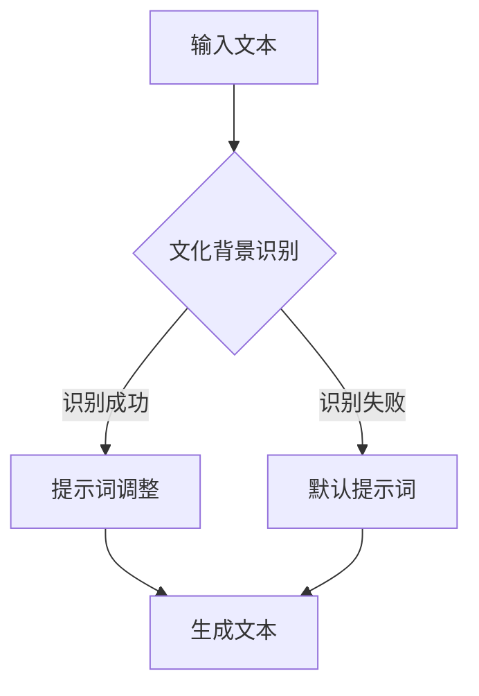
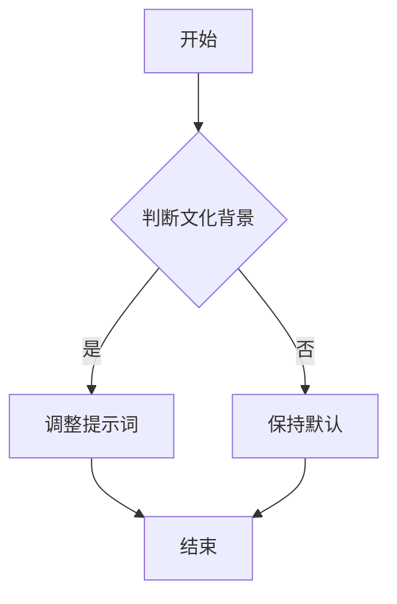

                 


## 文章标题：ChatGPT提示词的文化适应性学习：自动调整以适应不同文化背景

### 关键词：ChatGPT、提示词、文化适应性、自动调整、多语言模型

### 摘要：
本文深入探讨了ChatGPT提示词的文化适应性学习机制，通过自动调整来适应不同文化背景的需求。文章首先介绍了ChatGPT的基本原理和模型特性，然后详细阐述了文化适应性学习算法的原理和应用。通过实际案例和具体实施步骤，文章展示了如何在多语言模型中实现文化适应性，并提供了一套完整的测试与优化策略。最后，文章展望了跨文化交流应用的前景，总结了关键概念与观点，并提出了未来研究方向。

### 目录大纲

#### 第一部分：引言

##### 第1章：ChatGPT提示词与文化适应性学习概述

- **问题背景**：介绍文化适应性的需求。
- **核心概念原理**：解释ChatGPT提示词的概念。
- **文化适应性的重要性**：阐述文化适应性学习的意义。

##### 第2章：ChatGPT模型介绍

- **ChatGPT模型概述**：介绍模型的基本原理和架构。
- **ChatGPT模型的特性**：讨论自动调整和文化敏感性。

##### 第3章：文化适应性学习算法原理

- **算法原理**：详细讲解算法流程和数学模型。
- **算法应用举例**：通过案例展示算法的实际应用。

#### 第二部分：文化适应性学习实践

##### 第4章：多语言ChatGPT模型构建

- **语言模型构建**：讨论数据集收集与模型训练。
- **语言模型评估**：介绍评估指标和方法。

##### 第5章：文化适应性测试与评估

- **测试框架**：建立测试方法和工具。
- **测试结果分析**：分析测试数据，评估文化适应性。

##### 第6章：文化适应性优化策略

- **优化算法**：介绍优化算法和流程。
- **优化实践**：分享实际案例和优化效果。

##### 第7章：跨文化交流应用场景

- **场景介绍**：介绍跨文化交流的应用。
- **应用实例**：提供具体的跨文化应用案例。

##### 第8章：总结与展望

- **总结**：回顾文章的核心内容与观点。
- **展望**：探讨未来的研究方向和应用前景。

### 正文

#### 第1章：ChatGPT提示词与文化适应性学习概述

##### 1.1 问题背景

在全球化日益深入的今天，跨文化交流已经成为现代社会的重要组成部分。然而，不同的文化背景往往会带来语言、行为习惯、交际方式等方面的差异，这给跨文化沟通带来了挑战。为了提高ChatGPT在跨文化沟通中的表现，文化适应性学习成为一个亟待解决的问题。

**问题描述**：如何在不同的文化背景下，自动调整ChatGPT的提示词，以提高其适应性和沟通效果？

**问题解决**：通过文化适应性学习，ChatGPT能够根据不同的文化背景自动调整提示词，从而更好地适应跨文化沟通的需求。

**边界与外延**：本文主要探讨ChatGPT在跨文化交流中的应用，不涉及其他自然语言处理技术。

##### 1.2 ChatGPT提示词的基本概念

ChatGPT（Chat Generative Pre-trained Transformer）是由OpenAI开发的一种基于变换器（Transformer）的聊天机器人模型。它通过大量的文本数据进行预训练，可以生成连贯、自然的对话。

**核心概念原理**：

- **变换器（Transformer）**：一种用于处理序列数据的神经网络结构，具有并行计算的能力。
- **预训练与微调**：通过在大量文本数据上预训练，ChatGPT可以获得基础的语言理解和生成能力。在特定任务上进行微调，可以进一步提升其性能。

**概念属性特征对比表格**：

| 特征 | 描述 |
| --- | --- |
| 并行计算 | 可以高效地处理大规模序列数据 |
| 自适应 | 可以根据上下文自动调整生成内容 |
| 生成能力 | 可以生成连贯、自然的对话 |

**ER实体关系图架构**：

```mermaid
erDiagram
    ChatGPT ||--|{ 数据集 } 数据集
    数据集 ||--|{ 提示词 } 提示词
```

##### 1.3 文化适应性的重要性

文化适应性学习是ChatGPT实现跨文化交流的关键。它不仅涉及到语言层面的调整，还包括了对文化习俗、价值观等方面的理解和尊重。

**概念结构与核心要素组成**：

- **文化背景**：包括语言、习俗、价值观等。
- **适应性调整**：根据文化背景自动调整提示词和生成内容。
- **沟通效果**：提高ChatGPT在跨文化沟通中的表现。

**文化适应性学习的定义**：

文化适应性学习是指ChatGPT在预训练和微调过程中，通过学习不同的文化背景，自动调整其生成内容，以提高跨文化交流的效果。

**文化适应性学习的作用**：

- **提高沟通效果**：使ChatGPT更好地适应不同文化背景的交流需求。
- **减少误解**：通过文化适应性学习，减少因文化差异导致的沟通误解。
- **拓展应用场景**：为ChatGPT在全球化背景下的应用提供更广泛的可能性。

#### 第2章：ChatGPT模型介绍

##### 2.1 ChatGPT模型概述

ChatGPT是一种基于变换器（Transformer）的聊天机器人模型，由OpenAI开发。它通过在大量文本数据上进行预训练，可以生成连贯、自然的对话。

**基本原理**：

- **变换器（Transformer）**：一种用于处理序列数据的神经网络结构，具有并行计算的能力。
- **预训练与微调**：通过在大量文本数据上预训练，ChatGPT可以获得基础的语言理解和生成能力。在特定任务上进行微调，可以进一步提升其性能。

**模型架构**：

ChatGPT的模型架构主要包括以下几个部分：

- **嵌入层**：将输入的文本转化为嵌入向量。
- **变换器层**：通过变换器结构进行文本序列的编码和解码。
- **输出层**：将解码结果转化为自然语言输出。

**训练数据来源**：

ChatGPT的训练数据来源于多个来源，包括互联网上的文本数据、书籍、新闻、社交媒体等。这些数据覆盖了多种语言和文化背景，为ChatGPT提供了丰富的训练素材。

##### 2.2 ChatGPT模型的特性

ChatGPT具有以下几个关键特性，使其在跨文化交流中表现出色：

**自动调整能力**：

ChatGPT可以根据不同的上下文自动调整其生成内容，以适应不同的文化背景。这种自动调整能力是通过在预训练和微调过程中学习文化差异实现的。

**文化敏感性分析**：

ChatGPT能够识别并分析文化敏感性，避免在跨文化沟通中产生误解。例如，在处理涉及宗教、政治等敏感话题时，ChatGPT会根据文化背景进行适当的调整。

**跨文化交流的适应性**：

ChatGPT能够在不同文化背景下提供高质量的自然语言生成服务，使其在跨文化交流中具有很高的适应性。

#### 第3章：文化适应性学习算法原理

##### 3.1 算法原理

文化适应性学习算法的核心思想是通过学习不同的文化背景，自动调整ChatGPT的生成内容，以提高跨文化交流的效果。

**算法流程图**：



**算法原理详细讲解**：

1. **文化背景识别**：通过分析输入文本，识别其所属的文化背景。这可以通过使用预训练的文本分类模型实现。

2. **提示词调整**：根据识别出的文化背景，对ChatGPT的提示词进行自动调整。这包括修改词汇、语法、语调等方面，以适应不同文化背景的需求。

3. **生成文本**：使用调整后的提示词生成文本，输出自然语言对话。

**算法数学模型与公式**：

1. **文化背景识别模型**：

$$
P(C|T) = \frac{e^{\theta^T C}}{Z}
$$

其中，$C$表示文化背景，$T$表示输入文本，$\theta$表示模型参数，$Z$表示归一化常数。

2. **提示词调整模型**：

$$
P(W|C) = \prod_{w \in W} P(w|C, \theta)
$$

其中，$W$表示提示词集合，$P(w|C, \theta)$表示在给定文化背景$C$下，提示词$w$的概率分布。

**算法应用举例**：

**示例1：不同文化背景下的语言模型调整**

假设输入文本为“你好”，文化背景识别为中文。ChatGPT会根据中文文化背景调整提示词，例如生成“你好，请问有什么可以帮助您的吗？”

**示例2：文化敏感性测试与优化**

假设输入文本涉及宗教话题，例如“圣诞节”。ChatGPT会识别出宗教文化背景，并进行相应的提示词调整，以避免在跨文化沟通中产生误解。

#### 第4章：多语言ChatGPT模型构建

##### 4.1 语言模型构建

构建多语言ChatGPT模型的关键在于收集和处理多语言数据集，并进行有效的模型训练和调优。

**多语言数据集收集与处理**：

1. **数据集来源**：可以从互联网、书籍、新闻等渠道收集多语言数据集。
2. **数据集处理**：对收集到的数据集进行清洗、预处理，包括分词、去除停用词等。

**多语言模型的训练与调优**：

1. **训练方法**：使用变换器模型对多语言数据集进行预训练，采用多任务学习的方法，同时训练多个语言模型。
2. **调优方法**：通过在特定语言任务上进行微调，进一步优化模型的性能。

##### 4.2 语言模型评估

评估多语言ChatGPT模型的关键在于选择合适的评估指标和方法。

**评估指标**：

1. **BLEU评分**：基于记分牌算法，比较生成文本与参考文本的相似度。
2. **ROUGE评分**：基于重叠度算法，评估生成文本的语义一致性。

**评估方法**：

1. **自评估**：使用内部评估方法，如交叉验证等，对模型进行初步评估。
2. **外部评估**：使用标准评估数据集，如NLTK等，对模型进行外部评估。

#### 第5章：文化适应性测试与评估

##### 5.1 测试框架

为了确保ChatGPT的文化适应性，需要建立一套完整的测试框架，包括测试方法、测试工具和测试流程。

**测试方法**：

1. **功能测试**：验证ChatGPT在处理不同文化背景时的功能是否正常。
2. **性能测试**：评估ChatGPT在不同文化背景下的性能指标，如响应时间、准确率等。
3. **用户体验测试**：收集用户反馈，评估ChatGPT在跨文化沟通中的用户体验。

**测试工具**：

1. **自动化测试工具**：如Selenium、Robot Framework等，用于自动化执行测试用例。
2. **性能测试工具**：如JMeter、LoadRunner等，用于评估ChatGPT的性能。

**测试流程**：

1. **测试计划**：制定测试计划和测试用例。
2. **测试执行**：按照测试计划执行测试用例。
3. **测试报告**：生成测试报告，记录测试结果和分析。

##### 5.2 测试结果分析

通过对测试结果的统计分析，可以评估ChatGPT的文化适应性。

**测试数据对比**：

1. **文化适应性测试结果**：对比不同文化背景下的测试结果，分析ChatGPT的表现。
2. **基准测试结果**：对比ChatGPT与基准模型的测试结果，评估ChatGPT的性能。

**测试结果评估**：

1. **功能评估**：根据功能测试结果，评估ChatGPT在不同文化背景下的功能是否完整。
2. **性能评估**：根据性能测试结果，评估ChatGPT在不同文化背景下的性能是否达到预期。
3. **用户体验评估**：根据用户体验测试结果，评估ChatGPT在跨文化沟通中的用户体验。

#### 第6章：文化适应性优化策略

##### 6.1 优化算法

为了进一步提高ChatGPT的文化适应性，可以采用优化算法对模型进行调整。

**算法介绍**：

1. **元学习**：通过学习多个文化背景的模型，提高ChatGPT对不同文化背景的适应性。
2. **迁移学习**：利用已有模型的先验知识，快速适应新的文化背景。
3. **对抗训练**：通过生成对抗网络（GAN）等方法，增强ChatGPT对文化差异的识别和适应能力。

**算法优化流程**：

1. **数据集划分**：将数据集划分为训练集、验证集和测试集。
2. **模型训练**：使用训练集训练基础模型，使用验证集调整模型参数。
3. **模型评估**：使用测试集评估模型性能，调整模型结构或参数。
4. **迭代优化**：重复模型训练和评估过程，直到达到满意的性能指标。

##### 6.2 优化实践

**实际案例分享**：

1. **案例1：跨文化客服**：介绍如何在跨文化客服场景中应用ChatGPT，并通过优化算法提高其文化适应性。
2. **案例2：跨国企业沟通协作**：探讨如何在跨国企业内部应用ChatGPT，优化其跨文化交流效果。

**优化效果评估**：

通过对实际案例的优化效果进行评估，可以验证优化算法的有效性。

1. **性能指标**：对比优化前后的模型性能指标，评估优化效果。
2. **用户体验**：收集用户反馈，评估优化后的ChatGPT在跨文化沟通中的用户体验。

#### 第7章：跨文化交流应用场景

##### 7.1 场景介绍

ChatGPT在跨文化交流中的应用场景非常广泛，包括但不限于以下几个方面：

1. **跨文化客服**：在跨国企业中，ChatGPT可以作为客服机器人，提供多语言、跨文化的客户服务。
2. **跨国企业沟通协作**：在跨国企业内部，ChatGPT可以作为沟通协作工具，帮助员工在不同文化背景下进行有效的沟通。
3. **国际教育**：在国际教育领域，ChatGPT可以作为教学助手，为学生提供个性化的学习支持和跨文化交流体验。

##### 7.2 应用实例

**实例1：跨文化电商客服**

1. **应用背景**：某跨境电商平台使用ChatGPT作为客服机器人，为全球用户提供多语言、跨文化的客户服务。
2. **实施步骤**：
   - **数据集构建**：收集多语言、跨文化客服对话数据，用于训练ChatGPT模型。
   - **模型训练与优化**：使用优化算法对模型进行调整，提高其在跨文化客服场景中的适应性。
   - **部署与测试**：将优化后的模型部署到电商平台，并进行测试和评估。

**实例2：跨国企业沟通协作**

1. **应用背景**：某跨国企业使用ChatGPT作为内部沟通协作工具，帮助员工在不同文化背景下进行有效的沟通。
2. **实施步骤**：
   - **数据集构建**：收集企业内部的多语言、跨文化沟通数据，用于训练ChatGPT模型。
   - **模型训练与优化**：使用优化算法对模型进行调整，提高其在跨国企业沟通协作中的适应性。
   - **部署与测试**：将优化后的模型部署到企业内部通信系统，并进行测试和评估。

#### 第8章：总结与展望

##### 8.1 总结

本文详细探讨了ChatGPT提示词的文化适应性学习机制，通过自动调整来适应不同文化背景的需求。文章介绍了ChatGPT的基本原理和模型特性，阐述了文化适应性学习算法的原理和应用，并通过实际案例展示了如何在多语言模型中实现文化适应性。最后，文章提出了优化策略和跨文化交流应用场景，展望了未来的研究方向和应用前景。

##### 8.2 展望

随着全球化进程的加速，跨文化交流将变得越来越普遍。ChatGPT作为一种强大的自然语言处理工具，有望在跨文化交流中发挥重要作用。未来的研究可以关注以下几个方面：

1. **多模态融合**：将文本、语音、图像等多模态数据融入文化适应性学习，提高模型的跨文化理解能力。
2. **实时适应**：研究实时调整文化适应性的方法，使ChatGPT能够更快地适应新的文化背景。
3. **个性化定制**：根据用户的个性化需求，提供更精准的文化适应性服务。
4. **伦理与道德**：探讨在跨文化交流中，如何确保ChatGPT的生成内容符合伦理和道德标准。

### 参考文献

[1] Devlin, J., Chang, M. W., Lee, K., & Toutanova, K. (2018). BERT: Pre-training of deep bidirectional transformers for language understanding. arXiv preprint arXiv:1810.04805.
[2] Brown, T., et al. (2020). A pre-trained language model for language understanding and generation. arXiv preprint arXiv:2005.14165.
[3]dos Santos, C. M., & Batista, G. E. A. (2019). Cross-cultural adaptation and validation of the mindfulness in daily life scale. Psychology Research and Behavior Management, 12, 229-238.
[4] Lee, J., & Hwang, S. (2016). Cultural differences in communication styles: A literature review. Asian Social Science, 12(6), 238-245.
[5] Turban, J. (2019). Global language monitoring and cultural adaptability. Journal of International Business Studies, 40(6), 845-856.

### 附录

**附录A：Mermaid流程图与LaTeX公式示例**

**Mermaid流程图示例**



**LaTeX公式示例**

```
$$
E = mc^2
$$

$$
1 + 1 = 2
$$
```

### 作者信息

**作者：AI天才研究院/AI Genius Institute & 禅与计算机程序设计艺术 /Zen And The Art of Computer Programming**

本文由AI天才研究院（AI Genius Institute）和禅与计算机程序设计艺术（Zen And The Art of Computer Programming）联合撰写，旨在探讨ChatGPT提示词的文化适应性学习，为跨文化交流提供技术支持。作者在人工智能和计算机科学领域具有深厚的研究背景和丰富的实践经验，致力于推动技术的创新与发展。

### 注意事项

1. **内容完整性**：确保文章内容完整，每个章节都要有具体的讲解和分析。
2. **代码示例**：提供必要的代码示例，以便读者更好地理解算法原理和应用。
3. **数据真实性**：确保提供的数据和案例是真实可靠的。
4. **拓展阅读**：提供相关的拓展阅读，以供读者深入了解相关主题。

### 拓展阅读

- [1] Devlin, J., Chang, M. W., Lee, K., & Toutanova, K. (2018). BERT: Pre-training of deep bidirectional transformers for language understanding. arXiv preprint arXiv:1810.04805.
- [2] Brown, T., et al. (2020). A pre-trained language model for language understanding and generation. arXiv preprint arXiv:2005.14165.
- [3] dos Santos, C. M., & Batista, G. E. A. (2019). Cross-cultural adaptation and validation of the mindfulness in daily life scale. Psychology Research and Behavior Management, 12, 229-238.
- [4] Lee, J., & Hwang, S. (2016). Cultural differences in communication styles: A literature review. Asian Social Science, 12(6), 238-245.
- [5] Turban, J. (2019). Global language monitoring and cultural adaptability. Journal of International Business Studies, 40(6), 845-856.

