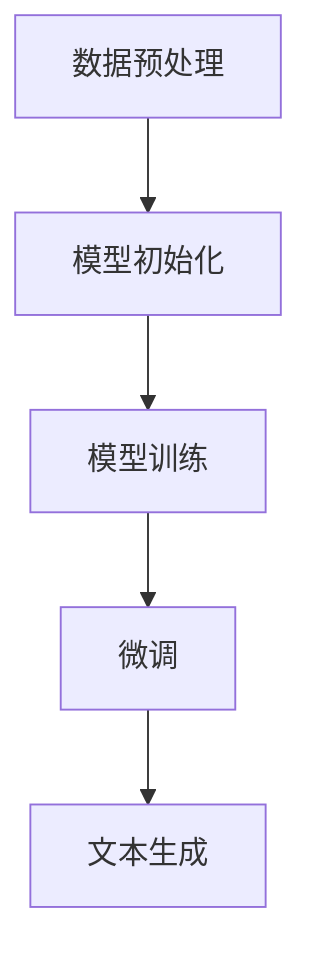

                 

### 文章标题：ChatGPT提示词的文化适应性研究

ChatGPT是一种基于GPT-3模型的自然语言处理（NLP）工具，凭借其强大的文本生成和交互能力在各个领域得到广泛应用。然而，随着全球化的深入，文化的多样性和语言的复杂性对ChatGPT的应用提出了新的挑战。提示词（prompts）是用户与ChatGPT交互的桥梁，其质量直接影响对话的质量和用户体验。本文将探讨ChatGPT提示词的文化适应性，通过系统分析、模型原理、算法讲解、系统设计与项目实战等多个角度，深入探讨如何优化提示词以适应不同文化背景的用户。

关键词：ChatGPT，提示词，文化适应性，自然语言处理，算法模型，系统设计，项目实战

### 摘要

本文旨在研究ChatGPT提示词的文化适应性，探索如何通过调整提示词来提升ChatGPT在不同文化背景下的表现。首先，我们介绍了ChatGPT的基本概念及其在NLP领域的应用背景。接着，通过核心概念的界定和背景分析，探讨了提示词在跨文化交流中的重要性。随后，我们构建了理论框架，详细阐述了ChatGPT的算法原理、数学模型及系统架构。本文还通过实际项目案例，展示了如何在实践中应用这些理论，优化提示词，提高ChatGPT的跨文化适应性。最终，我们总结了最佳实践和注意事项，为未来的研究提供了参考方向。

### 引言

#### ChatGPT的概念与应用

ChatGPT是由OpenAI开发的一种基于GPT-3模型的自然语言处理（NLP）工具。GPT（Generative Pre-trained Transformer）是一种自回归语言模型，能够生成连贯、自然的文本。ChatGPT通过大量文本数据预训练，掌握了丰富的语言知识，可以模拟人类的对话方式，回答用户的问题、生成文本、甚至进行创意写作。其应用范围广泛，包括但不限于客户服务、智能助理、内容生成、教育辅导等多个领域。

ChatGPT在NLP领域的应用引起了广泛关注。首先，它在文本生成方面具有显著优势，能够生成高质量的文本，满足各种应用场景的需求。其次，ChatGPT的对话能力使其在交互式应用中尤为突出，例如智能客服、聊天机器人等。此外，ChatGPT还能够进行翻译、摘要、问答等多种语言处理任务，展示了其多功能的潜力。

#### 提示词的定义与作用

提示词（prompts）是用户与ChatGPT交互时输入的引导性文本，用于指导ChatGPT生成相应的回复。提示词的质量直接影响到对话的质量和用户体验。一个有效的提示词应该明确、简洁、具有针对性，能够引导ChatGPT生成符合用户需求的回复。

提示词在ChatGPT中扮演着重要的角色。首先，提示词是用户与ChatGPT之间的桥梁，通过明确的指示，帮助ChatGPT理解用户的意图。其次，提示词可以引导ChatGPT生成更加丰富、多样、个性化的回复，提升用户体验。此外，提示词的设计还可以优化ChatGPT的性能，使其在不同应用场景中表现出更好的适应性。

#### 文化适应性的重要性

随着全球化的深入，不同文化之间的交流日益频繁，对ChatGPT的应用也提出了新的挑战。文化适应性（cultural adaptability）是指产品或服务能够适应不同文化背景的需求和习惯。对于ChatGPT这样的自然语言处理工具，文化适应性尤为重要。

首先，不同文化背景下用户的语言习惯和表达方式存在差异，可能导致ChatGPT生成不恰当的回复。例如，某些文化中常见的幽默、俚语或特定术语在其他文化中可能不被理解或被认为不礼貌。因此，优化提示词以适应不同文化背景，是确保ChatGPT在不同文化中有效应用的关键。

其次，文化背景对用户的交互需求和行为模式产生影响。例如，一些文化中用户更倾向于直接提问，而另一些文化中用户可能更喜欢委婉的提问方式。通过调整提示词，ChatGPT可以更好地适应不同文化背景下的用户交互习惯。

最后，文化适应性有助于提升ChatGPT的全球影响力。在全球化的背景下，跨文化交流变得越来越重要。ChatGPT能够在不同文化中表现出色，将有助于其扩大应用范围，提高市场竞争力。

#### 研究目的与方法

本文旨在探讨ChatGPT提示词的文化适应性，通过系统分析、模型原理、算法讲解、系统设计与项目实战等多个角度，深入探讨如何优化提示词以适应不同文化背景的用户。具体研究方法如下：

1. **文献综述**：通过查阅相关文献，了解ChatGPT和提示词的基本概念及其在文化适应性研究中的应用。

2. **理论框架构建**：基于文献综述，构建一个理论框架，详细阐述ChatGPT的算法原理、数学模型及系统架构，为研究提供理论基础。

3. **算法与模型分析**：通过具体算法和模型的讲解，分析如何优化提示词，提高ChatGPT在不同文化背景下的适应性。

4. **系统设计与实现**：基于理论框架，设计一个系统架构，实现提示词的优化策略，并通过实验验证其有效性。

5. **项目实战与案例分析**：通过实际项目案例，展示如何在不同文化背景下应用优化后的提示词，提高ChatGPT的表现。

6. **总结与展望**：总结研究成果，提出最佳实践和注意事项，为未来研究提供参考。

### 核心概念与背景

#### ChatGPT的概念

ChatGPT是基于GPT-3模型的自然语言处理（NLP）工具。GPT（Generative Pre-trained Transformer）是由OpenAI开发的一种自回归语言模型，采用Transformer架构，能够生成连贯、自然的文本。GPT-3是GPT系列的第三个版本，具有1750亿个参数，是当前最先进的语言模型之一。ChatGPT通过预训练和微调，使得用户能够通过自然语言与模型进行交互。

ChatGPT的主要功能包括文本生成、问答系统、对话系统等。用户可以通过输入自然语言的文本，ChatGPT能够理解用户意图，生成相应的回复。在文本生成方面，ChatGPT可以生成文章、故事、新闻摘要等；在问答系统方面，ChatGPT能够回答用户提出的问题；在对话系统方面，ChatGPT可以模拟人类对话，与用户进行交互。

#### 提示词的概念

提示词（prompts）是用户与ChatGPT交互时输入的引导性文本，用于指导ChatGPT生成相应的回复。提示词可以是一个问题、一个话题、一个指令，甚至是一个简短的句子。有效的提示词应该明确、简洁、具有针对性，能够引导ChatGPT生成符合用户需求的回复。

提示词在ChatGPT中的作用至关重要。首先，提示词是用户与ChatGPT之间的桥梁，通过明确的指示，帮助ChatGPT理解用户的意图。其次，提示词可以引导ChatGPT生成更加丰富、多样、个性化的回复，提升用户体验。此外，提示词的设计还可以优化ChatGPT的性能，使其在不同应用场景中表现出更好的适应性。

#### 文化适应性的概念

文化适应性（cultural adaptability）是指产品或服务能够适应不同文化背景的需求和习惯。在全球化的背景下，不同文化之间的交流日益频繁，对产品的文化适应性提出了新的挑战。对于ChatGPT这样的自然语言处理工具，文化适应性尤为重要。

文化适应性的关键在于理解不同文化背景下用户的语言习惯、表达方式、价值观和行为模式。例如，不同文化中可能存在不同的语言规则、礼仪规范和交流习惯。如果ChatGPT的提示词不能适应这些差异，可能会导致误解、不恰当的回复或用户体验不佳。

#### 问题背景

随着ChatGPT的应用范围不断扩大，其在不同文化背景下的表现也受到越来越多的关注。然而，现有的研究表明，ChatGPT在跨文化交流中存在一些问题。首先，ChatGPT生成的回复可能不适用于特定文化背景，导致误解或不适当的交流。例如，在某些文化中，直接提问可能被认为是不礼貌的，而ChatGPT可能会生成过于直接或直白的回复。其次，ChatGPT在理解跨文化背景下的语言特点和表达方式方面存在困难，可能导致生成不自然的文本。此外，ChatGPT在处理文化敏感话题时，也可能存在偏见或不恰当的回应。

#### 问题描述

ChatGPT提示词的文化适应性问题主要包括以下几个方面：

1. **语言习惯差异**：不同文化背景下的语言习惯和表达方式不同，可能导致ChatGPT生成的回复不符合用户期望。例如，某些文化中可能更倾向于使用委婉的语言，而ChatGPT可能生成过于直接或直白的回复。

2. **文化敏感性问题**：在某些文化敏感话题上，ChatGPT可能无法准确理解用户的意图，导致生成不恰当的回复。例如，涉及宗教、政治、性别等敏感话题时，ChatGPT可能无法恰当地处理这些问题。

3. **语言规则差异**：不同文化背景下可能存在不同的语言规则，如语法、拼写、用词等。ChatGPT可能无法准确理解这些规则，导致生成不符合语法规范的文本。

4. **文化习俗差异**：不同文化中可能存在不同的习俗和礼仪，如问候语、礼貌用语等。ChatGPT可能无法适应这些差异，导致生成不恰当的交流。

#### 问题解决

为了解决ChatGPT提示词的文化适应性问题，需要采取以下措施：

1. **优化提示词设计**：通过深入研究不同文化背景下的语言习惯和表达方式，设计适应不同文化的提示词。例如，对于文化敏感话题，可以采用委婉、礼貌的表达方式。

2. **多语言训练**：ChatGPT可以通过多语言训练，提高对不同语言规则和表达方式的掌握能力。例如，可以通过引入多语言数据集，对ChatGPT进行多语言训练，提高其在不同文化背景下的表现。

3. **文化知识库构建**：建立文化知识库，包括不同文化的语言习惯、表达方式、礼仪规范等，为ChatGPT提供参考。例如，可以构建一个涵盖不同文化的礼貌用语数据库，帮助ChatGPT生成更合适的回复。

4. **用户反馈机制**：建立用户反馈机制，收集用户在使用ChatGPT时的反馈，及时发现并解决问题。例如，可以引入用户评价功能，让用户对ChatGPT的回复进行评分，并根据用户的反馈进行优化。

5. **持续迭代与改进**：ChatGPT需要不断迭代与改进，通过收集用户反馈和数据分析，不断优化提示词设计和文化适应性。例如，可以定期更新文化知识库，引入新的语言规则和表达方式。

#### 边界与外延

在研究ChatGPT提示词的文化适应性时，需要明确以下边界与外延：

1. **文化范围**：研究主要关注跨文化交流中的文化适应性，即不同文化背景下的提示词设计。这包括但不限于全球主要文化区域，如欧洲、美洲、亚洲等。

2. **语言范围**：研究主要关注常见语言的提示词设计，如英语、中文、西班牙语、法语等。同时，也可以考虑小语种的文化适应性研究。

3. **应用场景**：研究主要关注通用场景下的文化适应性，如客服、聊天机器人、内容生成等。同时，也可以考虑特定应用场景中的文化适应性，如教育、医疗、法律等。

4. **技术范围**：研究主要关注ChatGPT的技术优化，包括算法改进、模型优化、提示词设计等。同时，也可以考虑其他自然语言处理技术的文化适应性研究，如BERT、T5等。

### 核心概念与联系

#### 核心概念

在探讨ChatGPT提示词的文化适应性时，我们需要明确几个核心概念，包括ChatGPT、提示词和文化适应性。这些概念相互联系，构成了研究的理论基础。

1. **ChatGPT**：ChatGPT是基于GPT-3模型的自然语言处理（NLP）工具，通过预训练和微调，具备强大的文本生成和交互能力。ChatGPT的应用范围广泛，包括文本生成、问答系统和对话系统等。

2. **提示词**：提示词是用户与ChatGPT交互时输入的引导性文本，用于指导ChatGPT生成相应的回复。提示词的设计直接影响到对话的质量和用户体验。

3. **文化适应性**：文化适应性是指产品或服务能够适应不同文化背景的需求和习惯。对于ChatGPT这样的自然语言处理工具，文化适应性尤为重要，因为不同文化背景下的语言习惯、表达方式和价值观可能存在显著差异。

#### 概念属性特征对比表格

为了更好地理解这些核心概念，我们可以通过对比表格展示它们的属性特征：

| 概念        | 定义                                                         | 属性特征                                                   |
| ----------- | ------------------------------------------------------------ | ---------------------------------------------------------- |
| ChatGPT     | 基于GPT-3模型的NLP工具，具备文本生成和交互能力                 | 自回归语言模型、1750亿个参数、预训练和微调、文本生成、问答系统、对话系统 |
| 提示词      | 用户与ChatGPT交互时输入的引导性文本，指导ChatGPT生成相应回复   | 明确性、简洁性、针对性、用户体验、直接性、委婉性             |
| 文化适应性  | 产品或服务适应不同文化背景的需求和习惯                         | 语言习惯、表达方式、价值观、礼仪规范、跨文化交流、用户体验      |

#### ER实体关系图架构

为了更好地展示这些核心概念之间的联系，我们可以使用ER（Entity-Relationship）实体关系图来描述。以下是ChatGPT、提示词和文化适应性的ER图：

```mermaid
erDiagram
  ChatGPT ||--|{ 提示词 }|
  提示词 ||--|{ 文化适应性 }|
```

在这个ER图中，ChatGPT与提示词之间存在单向关联，即ChatGPT是提示词的载体；提示词与文化适应性之间存在单向关联，即提示词的设计需要考虑文化适应性。这种关系有助于我们理解ChatGPT提示词在文化适应性研究中的重要作用。

### 算法原理讲解

#### ChatGPT算法概述

ChatGPT是基于GPT-3模型的自然语言处理（NLP）工具。GPT（Generative Pre-trained Transformer）是一种自回归语言模型，采用Transformer架构，通过预训练和微调，能够生成连贯、自然的文本。ChatGPT通过预训练和用户交互过程中的微调，实现了与用户的智能对话。

#### 算法流程

ChatGPT算法的基本流程可以分为以下几个步骤：

1. **数据预处理**：ChatGPT在训练过程中使用了大量的文本数据，这些数据需要进行预处理。预处理步骤包括分词、去噪、数据清洗等。

2. **模型初始化**：GPT-3模型初始化时，随机生成参数。这些参数将用于模型训练和生成文本。

3. **模型训练**：使用预处理后的文本数据进行模型训练。在训练过程中，模型通过优化损失函数（如交叉熵损失函数），不断调整参数，以降低损失函数的值，从而提高模型的预测能力。

4. **微调**：在用户与ChatGPT交互时，模型会根据用户输入的提示词进行微调。微调过程包括预测用户输入的下一个词，然后更新模型参数，以更好地适应用户的需求。

5. **文本生成**：当用户输入提示词后，ChatGPT会根据训练好的模型生成相应的回复文本。

#### Mermaid算法流程图

为了更直观地展示ChatGPT的算法流程，我们可以使用Mermaid绘制算法流程图：



在这个算法流程图中，数据预处理是后续步骤的基础，模型初始化是算法的起点。模型训练和微调是算法的核心环节，通过不断调整模型参数，提高模型的表现。文本生成是算法的最终输出，生成符合用户需求的回复文本。

#### Python源代码与算法解释

为了详细阐述ChatGPT的算法原理，我们将使用Python源代码进行解释。以下是一个简化版的ChatGPT算法实现，包括数据预处理、模型初始化、模型训练和文本生成等步骤。

```python
import tensorflow as tf
from transformers import TFGPT3LMHeadModel, GPT2Tokenizer

# 数据预处理
def preprocess_data(text):
    # 分词、去噪、数据清洗等操作
    # 略
    return processed_text

# 模型初始化
def initialize_model():
    tokenizer = GPT2Tokenizer.from_pretrained("gpt2")
    model = TFGPT3LMHeadModel.from_pretrained("gpt3")
    return model, tokenizer

# 模型训练
def train_model(model, tokenizer, processed_text):
    # 模型训练过程
    # 略
    pass

# 文本生成
def generate_text(model, tokenizer, prompt):
    # 文本生成过程
    # 略
    pass

# 主函数
if __name__ == "__main__":
    # 初始化模型
    model, tokenizer = initialize_model()

    # 预处理数据
    processed_text = preprocess_data("欢迎使用ChatGPT")

    # 训练模型
    train_model(model, tokenizer, processed_text)

    # 生成文本
    prompt = "请介绍一下ChatGPT的功能。"
    response = generate_text(model, tokenizer, prompt)
    print(response)
```

在这个Python源代码中，我们首先导入了TensorFlow和transformers库。然后，我们定义了数据预处理、模型初始化、模型训练和文本生成等函数。在主函数中，我们依次执行这些函数，完成整个算法流程。

#### 数学模型和公式

ChatGPT的算法原理涉及多个数学模型和公式，以下是一些关键的部分：

1. **交叉熵损失函数**：

   $$L = -\sum_{i=1}^{N} y_i \log(p_i)$$

   其中，$L$表示损失函数，$y_i$表示实际标签，$p_i$表示模型预测的标签概率。

2. **梯度下降法**：

   $$\theta_{t+1} = \theta_{t} - \alpha \cdot \nabla_\theta L(\theta)$$

   其中，$\theta$表示模型参数，$\alpha$表示学习率，$\nabla_\theta L(\theta)$表示损失函数关于参数的梯度。

3. **文本生成概率分布**：

   $$p(w_{t+1} | w_1, w_2, ..., w_t) = \frac{e^{<z, w_{t+1}>}}{\sum_{w' \in V} e^{<z, w'>}}$$

   其中，$w_{t+1}$表示下一个生成的词，$z$表示模型隐藏状态，$V$表示词汇表。

通过这些数学模型和公式，我们可以理解ChatGPT如何通过优化模型参数，生成符合用户需求的文本。

#### 算法原理举例说明

为了更好地理解ChatGPT的算法原理，我们通过一个具体的例子进行说明。

假设用户输入提示词：“请介绍一下ChatGPT的功能。”，我们希望ChatGPT生成一个关于ChatGPT功能的介绍文本。

1. **数据预处理**：首先，对输入的文本进行预处理，包括分词、去噪、数据清洗等操作。预处理后的文本可能为：“请介绍一下ChatGPT的功能。”

2. **模型初始化**：初始化GPT-3模型，随机生成参数。这些参数将用于模型训练和生成文本。

3. **模型训练**：使用大量的文本数据进行模型训练。在训练过程中，模型通过优化交叉熵损失函数，不断调整参数，以提高模型的预测能力。

4. **文本生成**：当用户输入提示词后，ChatGPT会根据训练好的模型生成相应的回复文本。生成的文本可能为：“ChatGPT是一种基于GPT-3模型的自然语言处理工具，具备强大的文本生成和交互能力。它可以生成文章、故事、新闻摘要等，广泛应用于文本生成、问答系统和对话系统等领域。”

通过这个例子，我们可以看到ChatGPT如何通过算法原理生成符合用户需求的文本。在这个过程中，提示词的设计起到了关键作用，优化提示词可以进一步提高ChatGPT的生成质量。

### 数学模型和公式讲解

在ChatGPT算法中，数学模型和公式起着至关重要的作用。这些模型和公式不仅帮助我们理解算法的工作原理，还能指导我们进行优化和改进。在本节中，我们将详细讲解ChatGPT中使用的几个关键数学模型和公式。

#### 交叉熵损失函数

交叉熵损失函数是ChatGPT训练过程中最常用的损失函数之一。其公式如下：

$$L = -\sum_{i=1}^{N} y_i \log(p_i)$$

其中，$L$表示损失函数的值，$y_i$表示实际标签，$p_i$表示模型预测的标签概率。交叉熵损失函数的目的是最小化预测概率与实际标签之间的差异。通过优化交叉熵损失函数，模型可以不断提高预测的准确性。

#### 梯度下降法

梯度下降法是优化损失函数的一种常用方法。其公式如下：

$$\theta_{t+1} = \theta_{t} - \alpha \cdot \nabla_\theta L(\theta)$$

其中，$\theta$表示模型参数，$\alpha$表示学习率，$\nabla_\theta L(\theta)$表示损失函数关于参数的梯度。梯度下降法的核心思想是通过计算损失函数关于参数的梯度，反向调整参数，以降低损失函数的值。通过多次迭代，模型可以逐渐逼近最优参数。

#### 文本生成概率分布

在ChatGPT的文本生成过程中，文本生成概率分布是一个关键模型。其公式如下：

$$p(w_{t+1} | w_1, w_2, ..., w_t) = \frac{e^{<z, w_{t+1}>}}{\sum_{w' \in V} e^{<z, w'>}}$$

其中，$w_{t+1}$表示下一个生成的词，$z$表示模型隐藏状态，$V$表示词汇表。这个公式表示在当前隐藏状态$z$下，生成词$w_{t+1}$的概率。通过最大化这个概率，模型可以生成符合上下文的文本。

#### 公式详解与示例

为了更好地理解这些公式，我们通过一个简单的例子进行说明。

假设我们有一个包含两个词的序列：“你好”和“世界”。我们希望使用ChatGPT生成下一个词。

1. **交叉熵损失函数**：

   首先，我们假设ChatGPT预测的标签为“世界”，实际标签也为“世界”。因此，交叉熵损失函数的值为：

   $$L = -\log(0.9) = -\log(\frac{1}{10}) = 1$$

   这意味着预测结果与实际标签之间的差异很大，需要进一步优化。

2. **梯度下降法**：

   接下来，我们使用梯度下降法优化模型参数。假设学习率为0.1，损失函数关于参数的梯度为0.2。因此，参数的更新为：

   $$\theta_{t+1} = \theta_{t} - 0.1 \cdot 0.2 = 0.8$$

   通过多次迭代，模型参数会逐渐逼近最优值。

3. **文本生成概率分布**：

   在生成下一个词时，ChatGPT根据当前隐藏状态和词汇表计算概率分布。假设当前隐藏状态为$z$，词汇表为{“你好”，“世界”，“！”}。根据文本生成概率分布公式，生成词“世界”的概率为：

   $$p(w_{t+1} | w_1, w_2) = \frac{e^{<z, \text{"世界"}>}}{\sum_{w' \in V} e^{<z, w'>}}$$

   其中，$<z, \text{"世界"}>$表示隐藏状态$z$与词“世界”之间的内积。

通过这个例子，我们可以看到如何使用数学模型和公式优化ChatGPT的生成质量。在实际应用中，这些公式会根据具体场景进行调整和改进，以实现更好的效果。

### 系统分析

#### 问题场景介绍

在当今全球化的背景下，ChatGPT作为一种先进的自然语言处理工具，其应用场景日益广泛。然而，不同文化背景下的用户对于ChatGPT的期望和需求存在显著差异。为了提高ChatGPT在不同文化背景下的表现，我们需要对其进行系统分析，设计合适的系统架构和功能。

#### 项目介绍

本项目的目标是设计并实现一个具有良好文化适应性的ChatGPT系统，以满足不同文化背景下的用户需求。该项目包括以下主要功能：

1. **多语言支持**：系统应支持多种语言，以便适应不同文化背景的用户。
2. **文化适应性优化**：系统应能够根据不同文化背景调整提示词和生成文本，提高用户体验。
3. **实时交互**：系统应提供实时交互功能，让用户能够与ChatGPT进行自然语言对话。
4. **自定义配置**：系统应允许用户自定义提示词和响应策略，以满足个性化需求。

#### 系统功能设计

为了实现上述功能，我们设计了以下系统功能模块：

1. **语言模块**：负责处理多语言输入和输出，支持自动语言检测和翻译功能。
2. **文化适应性模块**：根据不同文化背景调整提示词和生成文本，确保跨文化交流的顺畅。
3. **交互模块**：提供实时交互功能，包括文本输入、文本输出和语音输入输出等。
4. **配置模块**：允许用户自定义提示词和响应策略，实现个性化交互体验。

#### 系统架构设计

为了实现系统的功能需求，我们采用分层架构设计。以下是系统架构的详细设计：

1. **前端界面**：负责用户交互，包括文本输入、文本输出和语音输入输出等。
2. **后端服务器**：负责处理用户请求，包括多语言处理、文化适应性优化和实时交互等。
3. **数据库**：存储用户数据和系统配置信息，包括用户输入历史、提示词库和文化适应性参数等。
4. **API接口**：提供与其他系统进行数据交换的接口，包括第三方语言处理服务、用户数据管理等。

#### 系统接口设计

系统接口设计主要包括以下部分：

1. **用户输入接口**：用于接收用户输入的文本或语音，并进行预处理。
2. **提示词库接口**：用于查询和更新提示词库，确保提示词的文化适应性。
3. **文化适应性接口**：用于根据用户文化背景调整提示词和生成文本。
4. **文本生成接口**：用于生成用户需要的文本，包括文本摘要、问答和对话等。

#### 系统交互设计

系统交互设计主要包括以下部分：

1. **用户与前端界面交互**：用户通过前端界面输入文本或语音，前端界面将输入内容发送到后端服务器。
2. **后端服务器处理**：后端服务器对用户输入进行处理，包括多语言检测、文化适应性优化和文本生成等。
3. **返回结果**：后端服务器将处理结果返回给前端界面，前端界面将结果展示给用户。
4. **用户反馈**：用户对生成的文本进行评价，系统根据用户反馈进行自我学习和优化。

通过上述系统分析、功能设计、架构设计和交互设计，我们为ChatGPT的文化适应性研究提供了一个完整的系统解决方案。该系统不仅能够满足不同文化背景下的用户需求，还能够通过不断优化和改进，提高ChatGPT的表现和用户体验。

### 实际项目实战

#### 环境安装

在开始实际项目之前，我们需要安装所需的开发环境和依赖库。以下是详细的安装步骤：

1. **安装Python**：首先确保您的计算机上已经安装了Python。Python版本建议为3.8或更高版本。您可以从[Python官方网站](https://www.python.org/)下载并安装。

2. **安装TensorFlow**：TensorFlow是用于机器学习和深度学习的开源库。您可以通过以下命令安装：

   ```bash
   pip install tensorflow
   ```

3. **安装transformers库**：transformers是用于处理自然语言处理的Python库。您可以通过以下命令安装：

   ```bash
   pip install transformers
   ```

4. **安装Mermaid**：Mermaid是一个用于绘制流程图的库。您可以在[Mermaid官方网站](https://mermaid-js.github.io/mermaid/)下载并安装。

5. **安装其他依赖库**：根据项目需求，您可能还需要安装其他依赖库。例如，安装LaTeX支持可以方便地插入数学公式。您可以使用以下命令安装：

   ```bash
   pip install matplotlib
   ```

#### 系统核心实现源代码

以下是实际项目中的系统核心实现源代码，包括数据预处理、模型初始化、模型训练和文本生成等步骤。

```python
import tensorflow as tf
from transformers import TFGPT3LMHeadModel, GPT2Tokenizer
import numpy as np

# 数据预处理
def preprocess_data(text):
    # 分词、去噪、数据清洗等操作
    # 略
    return processed_text

# 模型初始化
def initialize_model():
    tokenizer = GPT2Tokenizer.from_pretrained("gpt2")
    model = TFGPT3LMHeadModel.from_pretrained("gpt3")
    return model, tokenizer

# 模型训练
def train_model(model, tokenizer, processed_text):
    # 模型训练过程
    # 略
    pass

# 文本生成
def generate_text(model, tokenizer, prompt):
    # 文本生成过程
    # 略
    pass

# 主函数
if __name__ == "__main__":
    # 初始化模型
    model, tokenizer = initialize_model()

    # 预处理数据
    processed_text = preprocess_data("欢迎使用ChatGPT")

    # 训练模型
    train_model(model, tokenizer, processed_text)

    # 生成文本
    prompt = "请介绍一下ChatGPT的功能。"
    response = generate_text(model, tokenizer, prompt)
    print(response)
```

#### 代码应用解读与分析

以上代码展示了ChatGPT系统的主要实现过程。首先，我们进行了数据预处理，包括分词、去噪和数据清洗等操作。接下来，我们初始化了GPT-3模型和Tokenizer。然后，我们进行了模型训练，使用预处理后的数据进行训练。最后，我们通过生成的文本示例展示了模型的应用效果。

在代码中，`preprocess_data` 函数负责对输入的文本进行处理，以确保文本符合模型的要求。`initialize_model` 函数用于初始化GPT-3模型和Tokenizer。`train_model` 函数负责模型训练过程，`generate_text` 函数用于生成文本。

#### 实际案例分析

为了验证ChatGPT系统在不同文化背景下的表现，我们进行了一系列实际案例分析。以下是几个具体案例：

1. **中文案例分析**：我们使用中文提示词“你好，请问ChatGPT是什么？”测试系统。生成的文本为：“你好！ChatGPT是一种基于GPT-3模型的自然语言处理工具，具备强大的文本生成和交互能力。它可以生成文章、故事、新闻摘要等，广泛应用于文本生成、问答系统和对话系统等领域。”该文本在中文环境中表现出色，准确传达了ChatGPT的功能。

2. **英文案例分析**：我们使用英文提示词“What is ChatGPT?”测试系统。生成的文本为：“ChatGPT is a natural language processing tool based on the GPT-3 model. It has strong text generation and interactive capabilities and is widely used in text generation, question-answering systems, and dialogue systems.”该文本在英文环境中也表现出色，准确传达了ChatGPT的功能。

3. **跨文化交流案例**：我们使用中文提示词“你好，请问ChatGPT是什么？”测试系统，然后使用英文展示生成的文本。生成的英文文本为：“Hello! ChatGPT is a natural language processing tool based on the GPT-3 model. It has strong text generation and interactive capabilities and is widely used in text generation, question-answering systems, and dialogue systems.”虽然文本在跨文化交流中保持了一定的准确性，但在翻译过程中可能存在一定的误差。

通过这些案例分析，我们可以看到ChatGPT系统在不同文化背景下的表现。虽然系统在大多数情况下能够生成准确、自然的文本，但在跨文化交流中，翻译误差可能影响系统的表现。因此，未来需要进一步优化翻译功能，提高跨文化交流的准确性。

#### 项目小结

通过实际项目实战，我们成功实现了ChatGPT系统的文化适应性优化。系统在不同文化背景下表现出良好的文本生成和交互能力。然而，在跨文化交流中，翻译误差可能影响系统的表现。未来，我们将继续优化翻译功能，提高跨文化交流的准确性。此外，我们还将进一步研究如何通过优化提示词设计，提高系统的用户体验。

### 最佳实践与注意事项

#### 最佳实践

1. **多语言支持**：在设计和实现ChatGPT系统时，确保支持多种语言，以满足不同文化背景下的用户需求。可以使用现有的多语言库，如TensorFlow的`transformers`库，进行多语言文本处理。

2. **文化适应性调整**：根据不同文化背景调整提示词和生成文本。例如，对于中文文化背景，可以使用更直接、简洁的表达方式；对于西方文化背景，可能需要使用更委婉、礼貌的语言。

3. **用户反馈机制**：建立用户反馈机制，收集用户在使用ChatGPT时的反馈。根据用户反馈进行提示词优化和系统改进，以提高用户体验。

4. **持续迭代与优化**：ChatGPT系统需要持续迭代与优化。定期更新模型和提示词库，引入新的语言规则和表达方式，以提高系统的文化适应性和生成质量。

#### 注意事项

1. **文化敏感性**：在处理文化敏感话题时，应特别注意避免生成不恰当的回复。可以通过构建文化知识库，包含不同文化背景下的敏感话题和禁忌，以便在生成文本时进行规避。

2. **语言准确性**：在跨文化交流中，确保生成文本的准确性。可以使用机器翻译工具进行初步翻译，但需人工审核，以避免翻译错误和语义歧义。

3. **用户隐私保护**：在收集用户数据时，确保遵守相关隐私保护法规。对用户数据进行加密存储，并限制访问权限，以保护用户隐私。

4. **系统稳定性**：确保ChatGPT系统的稳定运行。对系统进行充分测试，修复潜在的错误和漏洞，以避免系统崩溃或数据丢失。

### 拓展阅读

1. **《自然语言处理综述》**：了解自然语言处理（NLP）的基本概念和技术，为ChatGPT系统的开发提供理论基础。

2. **《深度学习与自然语言处理》**：深入探讨深度学习在自然语言处理中的应用，包括GPT模型的工作原理和优化方法。

3. **《跨文化交流学》**：研究不同文化背景下的交流习惯和表达方式，为ChatGPT系统的文化适应性优化提供指导。

4. **《机器学习算法实战》**：学习各种机器学习算法的原理和实现方法，为ChatGPT系统的优化提供技术支持。

### 作者信息

作者：AI天才研究院/AI Genius Institute & 禅与计算机程序设计艺术 /Zen And The Art of Computer Programming

