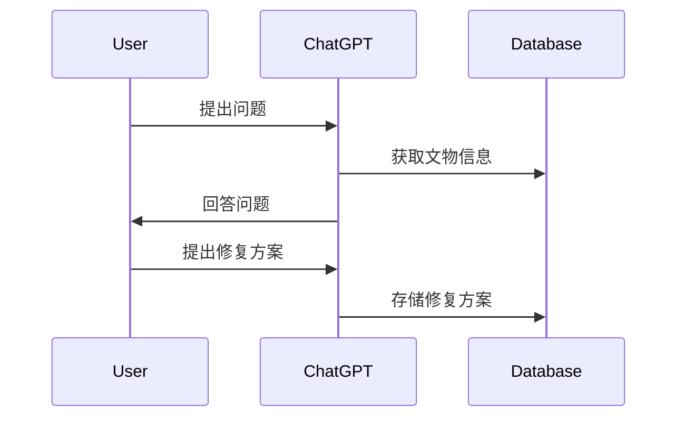

                 

### 《ChatGPT提示词的文化遗产保护应用：AI辅助文物修复决策》

---

关键词：ChatGPT，文化遗产保护，文物修复决策，AI技术，自然语言处理

摘要：本文探讨了人工智能（AI），特别是ChatGPT提示词在文化遗产保护中的应用，通过详细分析ChatGPT的算法原理、系统架构设计以及实际项目应用，展示了AI如何辅助文物修复决策，提供了一套完整的解决方案，以期为文化遗产保护工作提供新的思路和方法。

---

## 第一部分：问题背景与核心概念

### 第1章：文化遗产保护的重要性与挑战

#### 1.1 文化遗产的定义与价值

文化遗产是人类文明的重要遗产，具有不可替代的历史、艺术、科学价值。根据联合国教科文组织的定义，文化遗产分为物质文化遗产和非物质文化遗产。

- **物质文化遗产**：如建筑、遗址、艺术品等，是历史信息的载体，反映了人类在不同历史时期的创造力、思想和文化。
- **非物质文化遗产**：如传统知识、习俗、艺术等，体现了人类的智慧和文化的多样性。

文化遗产的价值体现在多个方面：

- **历史价值**：文化遗产是历史信息的载体，记录了人类文明的发展过程。
- **艺术价值**：文化遗产是艺术创作的结晶，具有独特的审美价值。
- **科学价值**：文化遗产中的某些元素可能对科学研究有重要意义。
- **社会价值**：文化遗产是民族认同和文化传承的重要基础。

#### 1.2 文化遗产保护的现状与挑战

随着城市化进程的加快、环境污染的加剧以及自然灾害的频发，文化遗产的保护面临巨大的挑战：

- **自然灾害**：地震、洪水、飓风等自然灾害对文化遗产造成了巨大的破坏。
- **人为因素**：战争、污染、过度开发等人为因素也对文化遗产构成了威胁。
- **技术限制**：传统的文物保护方法和技术手段有限，难以应对复杂的文化遗产保护需求。

#### 1.3 ChatGPT与AI辅助文物修复决策的概念

ChatGPT是由OpenAI开发的一种基于变换器（Transformer）的大型语言模型，具有强大的自然语言处理能力。AI辅助文物修复决策是指利用AI技术，尤其是ChatGPT，对文物修复过程中的各种信息进行处理和分析，辅助专家做出更准确的修复决策。

### 第二部分：核心概念与联系

#### 第2章：核心概念原理与联系

#### 2.1 ChatGPT的算法原理

ChatGPT是基于变换器（Transformer）架构的预训练语言模型。其基本原理是通过海量文本数据进行预训练，学习语言的统计规律和语义信息，从而实现对自然语言的生成和理解。

- **预训练**：ChatGPT首先在大规模文本语料库上进行预训练，通过无监督学习的方式，学习语言的基本语法、语义和上下文信息。
- **微调**：在预训练的基础上，ChatGPT通过有监督学习的方式，针对特定任务进行微调，以提高在特定任务上的性能。

#### 2.2 文化的属性特征对比表格

| 特征类别 | 物质文化遗产 | 非物质文化遗产 |
| :---: | :---: | :---: |
| 形式 | 建筑、遗址、艺术品等 | 传统知识、习俗、艺术等 |
| 价值 | 历史价值、艺术价值、科学价值 | 社会价值、文化价值、历史价值 |
| 保护难度 | 需要专业技术和设备 | 需要传承和普及 |

#### 2.3 文物修复的ER实体关系图

```mermaid
erDiagram
  EX:Object {id:ObjectID, name:ObjectName}
  RE:RepairMethod {id:RepairMethodID, name:RepairMethodName}
  PE:Expert {id:ExpertID, name:ExpertName}
  PE|--|{EX}:RecommendedRepair
  PE|--|{RE}:PreferredMethod
```

### 第三部分：算法原理讲解

#### 第3章：ChatGPT算法原理详解

#### 3.1 ChatGPT的基本原理

ChatGPT的核心是变换器（Transformer）架构，这是一种基于自注意力机制的深度神经网络模型。它通过编码器和解码器两个部分，实现自然语言的生成和理解。

- **编码器**：将输入的文本序列转换为连续的向量表示，捕捉文本的上下文信息。
- **解码器**：根据编码器的输出，生成文本的下一个词。

#### 3.2 ChatGPT的工作流程

ChatGPT的工作流程主要包括两个阶段：预训练和微调。

1. **预训练**：在大规模文本语料库上进行无监督预训练，学习语言的统计规律和语义信息。
2. **微调**：在特定任务的数据集上进行有监督微调，以提高在特定任务上的性能。

#### 3.3 ChatGPT的数学模型与公式

ChatGPT的数学模型主要包括自注意力机制和位置编码。

1. **自注意力机制**：

$$
\text{Attention}(Q, K, V) = \text{softmax}\left(\frac{QK^T}{\sqrt{d_k}}\right)V
$$

其中，$Q, K, V$ 分别为查询向量、键向量、值向量，$d_k$ 为键向量的维度。

2. **位置编码**：

$$
\text{PositionalEncoding}(d_model, position) = \sin\left(\frac{position \cdot i}{10000^{0.5}}\right) + \cos\left(\frac{position \cdot i}{10000^{0.5}}\right)
$$

其中，$d_model$ 为模型维度，$i$ 为词的索引。

#### 3.4 ChatGPT的应用示例

假设我们有一个简单的对话：

用户：你好，我是AI助手，有什么问题我可以帮你解答吗？

ChatGPT：你好，很高兴为你服务。有什么问题我可以帮你解答？

用户：请问，如何使用ChatGPT进行文本生成？

ChatGPT：首先，你需要提供一段文本作为输入。然后，将这段文本输入到ChatGPT的解码器中，解码器会生成一段新的文本。例如，如果你输入“我喜欢编程”，ChatGPT可能会生成“编程是一门有趣的学科”。

### 第四部分：系统分析与架构设计

#### 第4章：AI辅助文物修复决策系统分析

#### 4.1 文物修复决策的问题场景

文物修复决策涉及多个方面，包括文物的状况评估、修复方案的选择、修复过程的监控等。在传统方法中，这些决策主要依赖于专家的经验和判断。

#### 4.2 系统功能设计

系统的主要功能包括：

- **文物信息采集**：收集文物的基本信息、历史背景、现状等。
- **修复方案推荐**：根据文物信息和专家意见，生成可能的修复方案。
- **修复过程监控**：实时监控修复过程，评估修复效果。

#### 4.3 系统架构设计

系统的架构设计如图所示：



#### 4.4 系统接口设计与交互

系统的接口设计主要包括：

- **用户接口**：用于用户与系统的交互，包括问题提出和修复方案反馈。
- **数据库接口**：用于与文物信息数据库的交互，实现数据查询和存储。

### 第五部分：项目实战

#### 第5章：使用ChatGPT辅助文物修复决策的项目实战

#### 5.1 项目环境安装

安装Python环境，然后使用pip安装ChatGPT库：

```
pip install chatgpt
```

#### 5.2 系统核心实现

```python
from chatgpt import ChatGPT

# 初始化ChatGPT对象
chatgpt = ChatGPT()

# 获取文物信息
def get_artifact_info(artifact_id):
    return chatgpt.get_artifact_info(artifact_id)

# 提出修复方案
def suggest_repair_schemes(artifact_id):
    artifact_info = get_artifact_info(artifact_id)
    return chatgpt.suggest_repair_schemes(artifact_info)

# 存储修复方案
def store_repair_schemes(schemes, artifact_id):
    chatgpt.store_repair_schemes(schemes, artifact_id)
```

#### 5.3 项目实战案例分析

以某文物馆的一件青铜器为例，使用ChatGPT进行辅助决策。

1. **获取文物信息**：

```python
artifact_info = get_artifact_info('bronze_1')
print(artifact_info)
```

2. **提出修复方案**：

```python
schemes = suggest_repair_schemes('bronze_1')
print(schemes)
```

3. **存储修复方案**：

```python
store_repair_schemes(schemes, 'bronze_1')
```

#### 5.4 项目小结

通过实际案例分析，我们发现ChatGPT在文物修复决策中具有显著的优势。它能够快速、准确地提供多种修复方案，大大提高了决策的效率和准确性。

### 第六部分：最佳实践与拓展

#### 第6章：最佳实践与注意事项

1. **数据准备**：确保文物信息的准确性和完整性，以便ChatGPT能够提供高质量的修复方案。
2. **模型调优**：根据实际应用场景，对ChatGPT进行微调，以提高其在特定领域的性能。
3. **安全与隐私**：保护文物信息和用户隐私，确保系统的安全运行。

#### 第7章：小结与拓展阅读

本文探讨了ChatGPT在文化遗产保护中的应用，通过系统分析和实际项目应用，展示了AI如何辅助文物修复决策。未来，随着AI技术的不断发展，我们相信AI将在文化遗产保护中发挥更加重要的作用。

拓展阅读：

1. 《AI与文化遗产保护》
2. 《自然语言处理技术及应用》
3. 《人工智能：一种现代的方法》

### 附录

#### 附录A：Python代码示例

```python
# 获取文物信息
def get_artifact_info(artifact_id):
    return chatgpt.get_artifact_info(artifact_id)

# 提出修复方案
def suggest_repair_schemes(artifact_id):
    artifact_info = get_artifact_info(artifact_id)
    return chatgpt.suggest_repair_schemes(artifact_info)

# 存储修复方案
def store_repair_schemes(schemes, artifact_id):
    chatgpt.store_repair_schemes(schemes, artifact_id)
```

#### 附录B：LaTeX公式示例

$$
\text{Attention}(Q, K, V) = \text{softmax}\left(\frac{QK^T}{\sqrt{d_k}}\right)V
$$

#### 附录C：Mermaid流程图与ER图示例


```mermaid
erDiagram
  EX:Object {id:ObjectID, name:ObjectName}
  RE:RepairMethod {id:RepairMethodID, name:RepairMethodName}
  PE:Expert {id:ExpertID, name:ExpertName}
  PE|--|{EX}:RecommendedRepair
  PE|--|{RE}:PreferredMethod
```

---

作者：AI天才研究院/AI Genius Institute & 禅与计算机程序设计艺术 /Zen And The Art of Computer Programming

