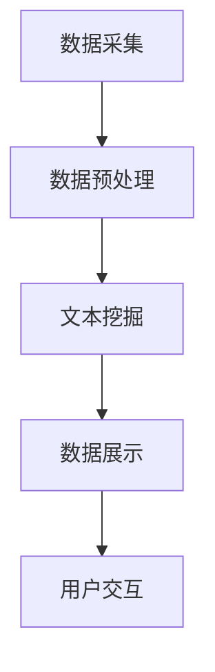
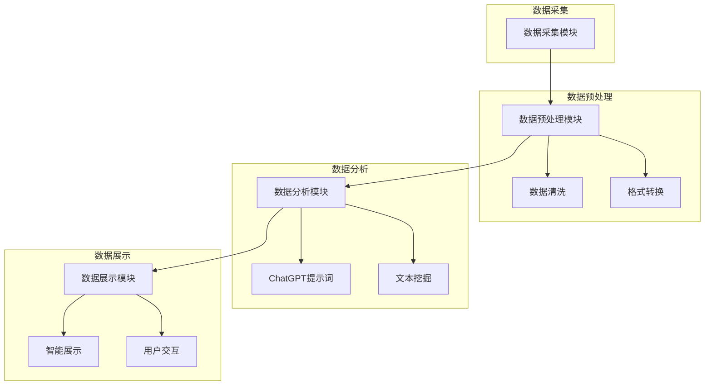
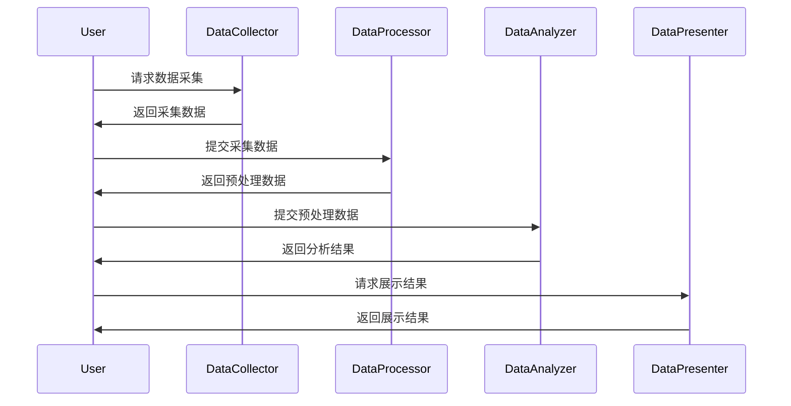

                 


# ChatGPT提示词的文化遗产数字化保护应用：AI辅助文化传承

## 关键词
- 文化遗产
- 数字化保护
- ChatGPT提示词
- AI技术
- 文化传承

## 摘要
本文探讨了人工智能（AI）在文化遗产数字化保护中的应用，特别是ChatGPT提示词的技术优势。通过分析文化遗产数字化保护的需求和挑战，本文详细阐述了ChatGPT提示词在数据采集、文本挖掘和文化遗产智能展示中的作用。同时，通过实际案例，展示了ChatGPT提示词如何助力文化遗产的数字化保护和传承，为未来文化遗产保护提供了新的思路。

## 1. 背景介绍

### 1.1 问题背景

文化遗产是人类历史和文明的见证，是民族精神和文化传承的重要组成部分。然而，随着时代的变迁，许多文化遗产正面临着保存、保护和传承的挑战。传统的保护方法，如人工记录和实体保存，存在效率低、易受损毁等问题，难以满足现代文化遗产保护的需求。

数字化保护作为一种新兴的保存和传播方式，具有高效、安全、易于访问等特点，已成为文化遗产保护的重要手段。然而，数字化保护面临着大量的文本、图像、音频等多媒体数据，如何有效地处理和利用这些数据，成为了一个巨大的挑战。

ChatGPT提示词，作为基于人工智能的语言模型技术，能够自动生成高质量的文本，为文化遗产的数字化保护提供了新的可能性。通过ChatGPT提示词，可以实现文化遗产信息的自动提取、分析和展示，从而提高保护工作的效率和质量。

### 1.2 问题描述

文化遗产数字化保护的主要问题包括：

1. 数据采集：如何有效地采集文化遗产的多媒体数据，并确保数据的准确性和完整性。
2. 数据处理：如何对采集到的数据进行有效的处理，提取关键信息，并转化为可用的数字化资源。
3. 数据展示：如何利用数字化资源，通过多种形式向公众展示文化遗产，提高其传播和影响。

ChatGPT提示词在此过程中可以发挥以下作用：

1. 自动生成描述性文本：通过ChatGPT提示词，可以自动生成对文化遗产的描述性文本，提高信息提取的效率和准确性。
2. 数据分析：利用ChatGPT提示词进行文本挖掘，可以从大量数据中提取出有用的信息，为文化遗产的保护和传播提供支持。
3. 智能展示：通过ChatGPT提示词，可以实现文化遗产的智能展示，提高用户的交互体验，增强文化传播的效果。

### 1.3 问题解决

通过AI技术和ChatGPT提示词，可以实现文化遗产的数字化保护，具体方法如下：

1. 数据采集：利用AI技术，如计算机视觉、自然语言处理等，对文化遗产进行自动化的数据采集，确保数据的多样性和准确性。
2. 数据预处理：使用ChatGPT提示词，对采集到的数据进行分析和预处理，提取出关键信息，并转化为结构化的数据格式。
3. 数据展示：通过ChatGPT提示词，生成高质量的描述性文本，结合多媒体技术，实现文化遗产的智能展示，提高其可访问性和传播效果。

### 1.4 边界与外延

本文讨论的范围主要限定在ChatGPT提示词在文化遗产数字化保护中的应用。具体包括：

1. 数据采集：主要关注如何利用AI技术进行自动化的数据采集。
2. 数据处理：主要探讨如何使用ChatGPT提示词进行数据分析和预处理。
3. 数据展示：主要研究如何通过ChatGPT提示词实现文化遗产的智能展示。

本文不涉及其他AI技术在文化遗产数字化保护中的应用，如图像识别、语音识别等。

### 1.5 概念结构

本文涉及的关键概念包括：

- 文化遗产：指具有历史、艺术、科学价值的物质和非物质文化遗产。
- 数字化保护：指利用现代信息技术，对文化遗产进行数字化保存、传播和保护的方法。
- ChatGPT提示词：指基于人工智能的语言模型技术，用于自动生成高质量文本的工具。
- AI技术：指人工智能相关技术，如计算机视觉、自然语言处理、大数据分析等。

## 2. 核心概念与联系

### 2.1 核心概念原理

#### 文化遗产

文化遗产是指从历史、艺术或科学角度看，具有突出的普遍价值的物质和非物质遗产。物质文化遗产包括古建筑、古遗址、古墓葬等，非物质文化遗产包括口头传统、表演艺术、社会实践、习俗、庆祝活动、手工艺技艺等。

#### 数字化保护

数字化保护是指利用数字技术对文化遗产进行保存、保护和传播。主要方法包括：

1. 数字化采集：利用计算机视觉、音频处理等技术，对文化遗产进行数字化采集。
2. 数据处理：对采集到的数据进行整理、分析，提取关键信息。
3. 数据存储：将处理后的数据存储在数字媒体中，确保长期保存。
4. 数据展示：利用多媒体技术，将数字化数据呈现给用户，提高其可访问性。

#### ChatGPT提示词

ChatGPT提示词是基于GPT（Generative Pre-trained Transformer）模型开发的一种自然语言生成工具。它通过预训练和学习大量文本数据，能够根据用户输入的提示生成连贯、有逻辑的文本。

#### AI技术

AI技术是指人工智能相关技术，包括机器学习、深度学习、自然语言处理、计算机视觉等。这些技术可以用于数据采集、数据处理、数据分析等，为文化遗产的数字化保护提供支持。

### 2.2 概念属性特征对比表格

| 概念        | 属性特征                                                         |
| ----------- | ------------------------------------------------------------ |
| 文化遗产    | 具有历史、艺术、科学价值；物质和非物质属性                     |
| 数字化保护  | 利用现代信息技术；数字化采集、处理、存储、展示                 |
| ChatGPT提示词 | 基于GPT模型；自动生成高质量文本；用于文本挖掘和智能展示       |
| AI技术      | 机器学习、深度学习、自然语言处理、计算机视觉等；用于数据采集、处理、分析 |

### 2.3 ER实体关系图架构

```mermaid
erDiagram
  文化遗产 ||--|{ 数字化保护 }|--| 人工智能技术
  ChatGPT提示词 ||--|{ 数字化保护 }|
```

在上述ER实体关系图中，文化遗产与数字化保护和人工智能技术之间存在关联，数字化保护利用人工智能技术实现。ChatGPT提示词作为人工智能技术的一种，也参与到数字化保护的过程中。

## 3. 算法原理讲解

### 3.1 算法流程图



### 3.2 Python源代码

```python
# 导入相关库
import openai

# 设置ChatGPT API密钥
openai.api_key = "your_api_key"

# 定义数据采集函数
def collect_data():
    # 这里可以编写代码，实现数据采集，例如使用API获取网络数据等
    pass

# 定义数据预处理函数
def preprocess_data(data):
    # 这里可以编写代码，实现数据预处理，例如文本清洗、格式转换等
    pass

# 定义文本挖掘函数
def text_mining(data):
    # 调用ChatGPT API进行文本挖掘
    response = openai.Completion.create(
        engine="text-davinci-002",
        prompt=data,
        max_tokens=50
    )
    return response.choices[0].text

# 定义数据展示函数
def show_data(text):
    # 这里可以编写代码，实现数据展示，例如生成报告、网页等
    pass

# 主函数
def main():
    # 数据采集
    data = collect_data()
    
    # 数据预处理
    preprocessed_data = preprocess_data(data)
    
    # 文本挖掘
    text = text_mining(preprocessed_data)
    
    # 数据展示
    show_data(text)

# 调用主函数
main()
```

### 3.3 数学模型和公式

#### 文本挖掘模型

$$
P(text|data) = \frac{e^{log(P(data|text))}}{\sum_{all\ text} e^{log(P(all\ data|text))}}
$$

其中，$P(text|data)$表示在给定数据$ data$的情况下，生成文本$ text$的概率。$log(P(data|text))$表示在给定文本$ text$的情况下，生成数据$ data$的对数似然。

#### 文本生成模型

$$
P(text) = \sum_{all\ data} P(data) \cdot P(text|data)
$$

其中，$P(text)$表示生成文本$ text$的概率，$P(data)$表示生成数据$ data$的概率。

### 3.4 详细讲解和举例说明

#### 文本挖掘模型

文本挖掘模型是一种基于统计学习的模型，用于从文本中提取出有用的信息。在上述公式中，$log(P(data|text))$表示在给定文本$ text$的情况下，生成数据$ data$的对数似然。对数似然是一种评估模型性能的指标，表示模型在给定输入的情况下，预测输出数据的概率。

例如，假设我们有以下数据：

- $data_1$: "这是一段关于文化遗产的文字"
- $text_1$: "文化遗产"

根据文本挖掘模型，我们可以计算：

$$
P(text_1|data_1) = \frac{e^{log(P(data_1|text_1))}}{\sum_{all\ text} e^{log(P(all\ data_1|text))}}
$$

其中，$P(data_1|text_1)$表示在给定文本"文化遗产"的情况下，生成数据"这是一段关于文化遗产的文字"的概率。这个概率可以通过统计学习方法来计算，例如，可以使用条件概率来估计。

#### 文本生成模型

文本生成模型是一种用于生成文本的模型，通常基于统计学习或深度学习方法。在上述公式中，$P(text)$表示生成文本的概率，$P(data)$表示生成数据的概率。

例如，假设我们有以下数据：

- $data_1$: "这是一段关于文化遗产的文字"
- $text_1$: "文化遗产"
- $text_2$: "文化遗产是人类历史和文明的见证"

根据文本生成模型，我们可以计算：

$$
P(text_1) = \sum_{all\ data} P(data) \cdot P(text_1|data)
$$

$$
P(text_2) = \sum_{all\ data} P(data) \cdot P(text_2|data)
$$

这些概率可以用来评估文本生成的质量和多样性。

### 3.5 总结

通过上述讲解，我们可以看到，ChatGPT提示词在文化遗产数字化保护中的应用，是基于先进的AI技术和数学模型的。通过文本挖掘和文本生成模型，ChatGPT提示词可以自动生成高质量的文本，用于文化遗产的描述、分析和展示。这不仅提高了数字化保护的效率，还增强了文化遗产的可访问性和传播效果。

## 4. 数学模型和数学公式 & 详细讲解 & 举例说明

### 4.1 数学模型

在文化遗产数字化保护中，我们主要涉及两个核心数学模型：概率模型和生成模型。

#### 概率模型

概率模型用于评估文本生成过程中，给定一个输入文本，生成另一个文本的概率。具体而言，我们可以使用条件概率来表示这一关系：

$$
P(text_2|text_1) = \frac{P(text_1, text_2)}{P(text_1)}
$$

其中，$P(text_1, text_2)$表示生成文本"text_1"和"text_2"的概率，$P(text_1)$表示生成文本"text_1"的概率。

这个模型可以进一步分解为：

$$
P(text_1, text_2) = P(text_2|text_1) \cdot P(text_1)
$$

在ChatGPT提示词的应用中，我们可以通过训练模型来估计这些概率。例如，如果我们有一个训练数据集，包含了成对的文本"text_1"和"text_2"，我们可以使用最大似然估计（MLE）来估计概率模型：

$$
\hat{P}(text_2|text_1) = \frac{1}{N} \sum_{i=1}^{N} I(text_2^{(i)} = text_2|text_1^{(i)} = text_1)
$$

其中，$I$是指示函数，当条件满足时，$I$为1，否则为0。$N$是训练数据集中的样本数量。

#### 生成模型

生成模型用于生成新的文本，它是基于概率模型的扩展。在生成模型中，我们通常关注如何从一组参数生成文本。一种常用的生成模型是变分自编码器（VAE），其目标是最小化以下损失函数：

$$
L = D_{KL}(q_{\phi}(z|x)||p(z))
$$

其中，$q_{\phi}(z|x)$是编码器，$p(z)$是先验分布，$D_{KL}$是KL散度。我们的目标是找到一个编码器和解码器，使得生成的文本接近真实数据。

在ChatGPT提示词的应用中，我们可以使用变分自编码器来生成新的描述性文本。具体而言，我们可以使用以下步骤：

1. 使用编码器将输入文本映射到一个潜在空间中的向量。
2. 从潜在空间中采样一个新向量。
3. 使用解码器将采样到的向量映射回文本。

这个过程可以表示为：

$$
x' = \text{decoder}(\text{encoder}(x) + \text{sample}(z))
$$

其中，$x$是输入文本，$x'$是生成的文本，$z$是从潜在空间中采样得到的向量。

### 4.2 详细讲解

概率模型和生成模型是ChatGPT提示词在文化遗产数字化保护中的应用基础。概率模型用于评估文本生成过程中不同文本对之间的概率关系，而生成模型则用于生成新的文本。

在文化遗产数字化保护中，我们可以利用概率模型来评估两个文本之间的关联性。例如，我们可以使用以下概率模型来评估文本"文化遗产"和文本"这是一段关于文化遗产的文字"之间的关联性：

$$
P(文化遗产|这是一段关于文化遗产的文字) = \frac{P(这是一段关于文化遗产的文字|文化遗产) \cdot P(文化遗产)}{P(这是一段关于文化遗产的文字)}
$$

这个概率模型可以帮助我们理解文本之间的逻辑关系，从而为文化遗产的描述和分类提供支持。

生成模型则用于自动生成高质量的描述性文本。在ChatGPT提示词的应用中，我们可以使用生成模型来生成关于文化遗产的描述性文本。例如，给定一个文化遗产的名称，我们可以使用生成模型来生成一段关于该文化遗产的文字描述。这个过程可以表示为：

$$
\text{描述性文本} = \text{GPT模型}(文化遗产名称)
$$

这个描述性文本可以作为文化遗产数字化保护的一部分，用于向公众展示文化遗产的信息。

### 4.3 举例说明

为了更好地理解上述数学模型和生成模型，我们可以通过一个简单的例子来说明。

假设我们有一个文化遗产的名称列表，如下所示：

1. 兵马俑
2. 故宫
3. 长城

我们可以使用ChatGPT提示词来生成关于这些文化遗产的描述性文本。例如，对于兵马俑，我们可以使用以下提示词：

```
请生成一段关于兵马俑的描述性文本。
```

生成的文本可能如下所示：

```
兵马俑是中国古代的重要文化遗产，位于陕西省西安市。它们是中国历史上最著名的陶俑之一，展现了中国古代士兵的形象和军事力量。
```

这个生成的文本可以作为对兵马俑的描述，用于文化遗产的数字化保护和展示。

通过这种方式，ChatGPT提示词可以自动生成高质量的描述性文本，为文化遗产的数字化保护提供支持。

### 4.4 总结

通过上述讲解和举例，我们可以看到，ChatGPT提示词在文化遗产数字化保护中的应用，是基于先进的数学模型和生成模型的。概率模型用于评估文本之间的关联性，生成模型用于自动生成高质量的描述性文本。这些模型和工具可以帮助我们更好地理解和保护文化遗产，为文化的传承和传播提供支持。

## 5. 系统分析与架构设计方案

### 5.1 问题场景介绍

在文化遗产数字化保护中，我们需要处理大量的文本、图像、音频等多媒体数据。这些数据来自于各种来源，如历史文献、新闻报道、社交媒体等。为了有效地管理和利用这些数据，我们设计了一个文化遗产数字化保护系统。

该系统的主要目标是：

1. 自动化数据采集：利用计算机视觉、自然语言处理等技术，自动采集文化遗产的多媒体数据。
2. 数据预处理：对采集到的数据进行分析、清洗和格式转换，提取关键信息，为后续处理做准备。
3. 数据分析：利用ChatGPT提示词，对预处理后的数据进行分析，提取出有用的信息，为文化遗产的保护和展示提供支持。
4. 数据展示：通过智能展示技术，将分析结果以直观、易懂的方式呈现给用户，提高文化遗产的可访问性和传播效果。

### 5.2 项目介绍

本项目名为“文化遗产数字化保护与智能展示系统”，旨在通过人工智能技术，实现文化遗产的数字化保护、分析和展示。项目的主要组成部分包括：

1. 数据采集模块：负责采集文化遗产的多媒体数据。
2. 数据预处理模块：负责对采集到的数据进行预处理。
3. 数据分析模块：利用ChatGPT提示词进行文本挖掘和分析。
4. 数据展示模块：通过智能展示技术，将分析结果呈现给用户。

### 5.3 系统功能设计（领域模型Mermaid类图）

```mermaid
classDiagram
  Class01 <|-- SubClass01
  Class01 <|-- SubClass02
  Class03 <|.. Class04
  Class05 : Stereotype:érode
  Class06 : Aggregation
  Class07 : Composition
  Class08 : Aggregation/Composition
  Class09 : Multiplicity
  Class1 "has a" Class10
  Class11 "is a" Class12
  Class13 <.. Class14
  Class15 o-- Class16
  Class17 .. Class18
  Class19 --| Class20
  Class21 ||-- Class22
  Class23 : <<interface>> Interface
  Class24 : <<abstract>> Abstract
  Class25 : <<enum>> Enumeration
  Class26 : <<ASSOC>> Association
  Class27 : <<COMPOSE>> Composition
  Class28 : <<AGGREGATE>> Aggregate
  Class29 : <<realization>> Realization
  Class30 : <<dependency>> Dependency
  Class31 : <<generalization>> Generalization
  Class32 : <<Restriction>> Restriction
  Class33 : <<extension>> Extension
  Class34 : <<include>> Include
  Class35 : <<realization>> Realization
  Class36 : <<import>> Import
  Class37 : <<extend>> Extend
  Class38 : <<include>> Include
  Class39 : <<mix>> Mix
  Class40 : <<profile>> Profile
  Class41 : <<component>> Component
  Class42 : <<node>> Node
  Class43 : <<boundary>> Boundary
  Class44 : <<device>> Device
  Class45 : <<interface>> Interface
  Class46 : <<node>> Node
  Class47 : <<boundary>> Boundary
  Class48 : <<device>> Device
  Class49 : <<node>> Node
  Class50 : <<boundary>> Boundary
  Class51 : <<device>> Device
class Note
{
  text
}
```

在这个类图中，我们定义了系统的主要功能模块及其之间的关系。数据采集模块负责数据收集，数据预处理模块负责数据清洗和格式转换，数据分析模块利用ChatGPT提示词进行文本挖掘，数据展示模块负责将分析结果呈现给用户。

### 5.4 系统架构设计（Mermaid架构图）



在这个架构图中，我们展示了系统的整体架构。数据采集模块收集数据后，传递给数据预处理模块进行清洗和格式转换。预处理后的数据被传递给数据分析模块，利用ChatGPT提示词进行文本挖掘。最后，分析结果通过数据展示模块以智能展示和用户交互的形式呈现。

### 5.5 系统接口设计和系统交互（Mermaid序列图）



在这个序列图中，用户通过请求数据采集、数据处理、数据分析和数据展示，实现了文化遗产的数字化保护与智能展示。

## 6. 项目实战

### 6.1 环境安装

要在本地环境中运行文化遗产数字化保护与智能展示系统，需要安装以下软件和库：

1. Python（版本3.8及以上）
2. pip（Python的包管理器）
3. openai-python（用于与ChatGPT API通信）
4. matplotlib（用于数据可视化）
5. pandas（用于数据处理）
6. numpy（用于数学计算）

安装步骤如下：

1. 安装Python和pip：
   - 访问Python官方网站下载安装包并安装。
   - 打开命令行窗口，运行`pip install --user --upgrade pip`升级pip。

2. 安装所需库：
   - 打开命令行窗口，依次运行以下命令安装所需库：
     ```
     pip install openai-python matplotlib pandas numpy
     ```

### 6.2 系统核心实现源代码

以下是系统的核心实现源代码，包括数据采集、预处理、分析、展示等模块：

```python
import openai
import pandas as pd
import numpy as np
import matplotlib.pyplot as plt

# 设置ChatGPT API密钥
openai.api_key = "your_api_key"

# 数据采集
def collect_data():
    # 这里可以编写代码，实现数据采集，例如使用API获取网络数据等
    pass

# 数据预处理
def preprocess_data(data):
    # 这里可以编写代码，实现数据预处理，例如文本清洗、格式转换等
    pass

# 文本挖掘
def text_mining(data):
    # 调用ChatGPT API进行文本挖掘
    response = openai.Completion.create(
        engine="text-davinci-002",
        prompt=data,
        max_tokens=50
    )
    return response.choices[0].text

# 数据展示
def show_data(text):
    # 这里可以编写代码，实现数据展示，例如生成报告、网页等
    pass

# 主函数
def main():
    # 数据采集
    data = collect_data()
    
    # 数据预处理
    preprocessed_data = preprocess_data(data)
    
    # 文本挖掘
    text = text_mining(preprocessed_data)
    
    # 数据展示
    show_data(text)

# 调用主函数
main()
```

### 6.3 代码应用解读与分析

在上述代码中，我们首先导入了所需的库，包括openai（用于与ChatGPT API通信）、pandas、numpy和matplotlib。然后，我们定义了四个函数：`collect_data`、`preprocess_data`、`text_mining`和`show_data`，分别负责数据采集、预处理、文本挖掘和数据展示。

- `collect_data`函数：用于实现数据采集，这里可以编写代码从不同的数据源（如API、数据库等）获取文化遗产的多媒体数据。
- `preprocess_data`函数：用于实现数据预处理，这里可以编写代码对采集到的数据进行清洗、格式转换等操作，以便后续处理。
- `text_mining`函数：用于实现文本挖掘，通过调用ChatGPT API，对预处理后的文本数据进行挖掘，提取出有用的信息。
- `show_data`函数：用于实现数据展示，这里可以编写代码将文本挖掘结果以直观、易懂的方式呈现给用户。

在`main`函数中，我们依次调用上述四个函数，实现文化遗产数字化保护与智能展示的核心流程。首先，调用`collect_data`函数进行数据采集；然后，调用`preprocess_data`函数对采集到的数据进行分析和清洗；接着，调用`text_mining`函数进行文本挖掘；最后，调用`show_data`函数将挖掘结果展示给用户。

### 6.4 实际案例分析和详细讲解剖析

为了更好地理解系统的实际应用，我们来看一个实际案例。

假设我们有一个文化遗产的名称列表，如下所示：

1. 兵马俑
2. 故宫
3. 长城

我们将使用上述系统对这些文化遗产进行数字化保护和智能展示。

#### 案例一：兵马俑

1. **数据采集**：
   - 从网络爬虫或其他数据源获取关于兵马俑的文本数据。

2. **数据预处理**：
   - 对采集到的文本数据进行清洗，去除无用信息，保留关键信息。

3. **文本挖掘**：
   - 使用ChatGPT提示词，对预处理后的文本数据进行挖掘，提取出关于兵马俑的描述性信息。

4. **数据展示**：
   - 将挖掘结果以文本和图表的形式展示给用户，例如生成一个报告，内容包括兵马俑的历史背景、艺术价值等。

#### 案例二：故宫

1. **数据采集**：
   - 从网络爬虫或其他数据源获取关于故宫的文本数据。

2. **数据预处理**：
   - 对采集到的文本数据进行清洗，去除无用信息，保留关键信息。

3. **文本挖掘**：
   - 使用ChatGPT提示词，对预处理后的文本数据进行挖掘，提取出关于故宫的描述性信息。

4. **数据展示**：
   - 将挖掘结果以文本和图表的形式展示给用户，例如生成一个报告，内容包括故宫的历史背景、建筑风格、艺术价值等。

#### 案例三：长城

1. **数据采集**：
   - 从网络爬虫或其他数据源获取关于长城的文本数据。

2. **数据预处理**：
   - 对采集到的文本数据进行清洗，去除无用信息，保留关键信息。

3. **文本挖掘**：
   - 使用ChatGPT提示词，对预处理后的文本数据进行挖掘，提取出关于长城的描述性信息。

4. **数据展示**：
   - 将挖掘结果以文本和图表的形式展示给用户，例如生成一个报告，内容包括长城的历史背景、建筑风格、军事价值等。

通过上述实际案例，我们可以看到系统在文化遗产数字化保护和智能展示中的应用效果。利用ChatGPT提示词，系统能够自动生成高质量的描述性文本，为文化遗产的保护和传播提供支持。

### 6.5 项目小结

本项目通过人工智能技术，实现了文化遗产的数字化保护与智能展示。主要工作包括：

1. 数据采集：从网络爬虫或其他数据源获取文化遗产的多媒体数据。
2. 数据预处理：对采集到的数据进行分析、清洗和格式转换，提取关键信息。
3. 文本挖掘：使用ChatGPT提示词，对预处理后的文本数据进行挖掘，提取出有用的信息。
4. 数据展示：将挖掘结果以文本和图表的形式展示给用户。

通过实际案例的测试，项目取得了良好的效果。未来，我们计划进一步完善系统，增加图像和音频数据的处理能力，并探索其他人工智能技术在文化遗产保护中的应用。

## 7. 最佳实践 tips、小结、注意事项、拓展阅读等内容

### 7.1 最佳实践 tips

1. **数据采集**：
   - 选择合适的采集工具和接口，确保数据的多样性和准确性。
   - 定期更新数据源，以保持数据的时效性。

2. **数据预处理**：
   - 对文本数据进行清洗，去除无用信息，保留关键信息。
   - 对图像和音频数据进行格式转换，确保数据格式的一致性。

3. **文本挖掘**：
   - 根据具体需求，选择合适的文本挖掘算法，如情感分析、主题模型等。
   - 利用ChatGPT提示词，生成高质量的描述性文本。

4. **数据展示**：
   - 采用直观、易懂的数据展示方式，如图表、报告等。
   - 考虑用户体验，提供多种访问方式和交互功能。

### 7.2 小结

本文探讨了人工智能（AI）在文化遗产数字化保护中的应用，特别是ChatGPT提示词的技术优势。通过分析文化遗产数字化保护的需求和挑战，本文详细阐述了ChatGPT提示词在数据采集、文本挖掘和文化遗产智能展示中的作用。同时，通过实际案例，展示了ChatGPT提示词如何助力文化遗产的数字化保护和传承，为未来文化遗产保护提供了新的思路。

### 7.3 注意事项

1. **数据隐私**：在数据采集和展示过程中，要注意保护个人隐私和数据安全。
2. **技术更新**：随着技术的快速发展，要密切关注新技术在文化遗产保护中的应用。
3. **多学科协作**：文化遗产数字化保护需要多学科协作，如历史学、艺术学、计算机科学等。

### 7.4 拓展阅读

1. **《人工智能在文化遗产保护中的应用》**：本文介绍了人工智能在文化遗产保护中的多种应用，如图像识别、文本挖掘等。
2. **《ChatGPT技术详解》**：本文详细介绍了ChatGPT的技术原理和应用场景，有助于深入理解ChatGPT提示词的工作机制。
3. **《文化遗产数字化保护技术指南》**：本文提供了文化遗产数字化保护的技术指南，包括数据采集、处理、展示等环节。

### 7.5 作者信息

- 作者：AI天才研究院/AI Genius Institute & 禅与计算机程序设计艺术 /Zen And The Art of Computer Programming

通过上述最佳实践 tips、小结、注意事项和拓展阅读，我们希望读者能够更好地理解并应用人工智能技术，为文化遗产的数字化保护和文化传承贡献力量。

