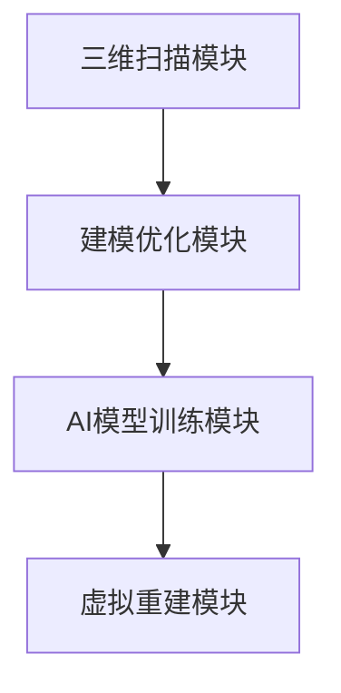
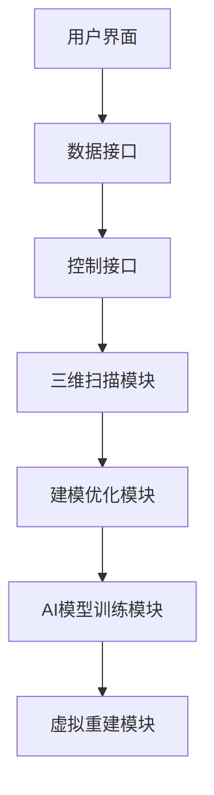

                 

# 《ChatGPT提示词的文化遗产数字化应用：AI辅助文物虚拟重建》

## 关键词

- ChatGPT
- 文化遗产数字化
- 文物虚拟重建
- 自然语言处理
- 人工智能应用

## 摘要

本文将探讨如何利用ChatGPT提示词来辅助文化遗产的数字化应用，特别是文物虚拟重建的过程。文章首先概述了ChatGPT和文化遗产数字化的基本概念及其重要性，接着详细介绍了ChatGPT提示词的设计原则与方法。随后，文章聚焦于AI辅助文物虚拟重建的流程，包括三维扫描与建模技术，以及ChatGPT在其中的应用。最后，文章展望了AI辅助文物虚拟重建的未来发展趋势，并分享了实际项目中的提示词设计与优化的实践案例。通过一步步的分析和推理，本文旨在为读者提供一份既有深度又具实用性的技术指南。

---

# 《ChatGPT提示词的文化遗产数字化应用：AI辅助文物虚拟重建》目录大纲

## 第一部分：ChatGPT提示词概述与文化遗产数字化应用

### 第1章：ChatGPT与文化遗产数字化概述

#### 1.1 ChatGPT与文化遗产数字化概述

##### 1.1.1 ChatGPT的基本原理
- ChatGPT的生成预训练技术
- GPT模型的架构与训练过程
- ChatGPT的应用范围和影响

##### 1.1.2 文化遗产数字化
- 文化遗产的定义与价值
- 数字化文化遗产的意义
- 数字化文化遗产的挑战

##### 1.1.3 ChatGPT在文化遗产保护中的应用
- AI技术对文化遗产保护的重要性
- ChatGPT在数字化遗产保护中的应用场景
- ChatGPT提升文化遗产保护水平的潜力

### 第2章：ChatGPT提示词设计原则与方法

#### 2.1 ChatGPT提示词设计原则

##### 2.1.1 明确目标
- 定义目标与预期结果
- 用户需求的调研与分析

##### 2.1.2 提高用户参与度
- 设计互动性强的提示词
- 引导用户参与互动的过程

##### 2.1.3 保持连贯性与一致性
- 提示词的一致性标准
- 提高文本连贯性的方法

#### 2.2 ChatGPT提示词设计方法

##### 2.2.1 文本生成
- 提示词的生成策略
- 生成高质量文本的技巧

##### 2.2.2 上下文理解
- 理解上下文的重要性
- 建立上下文理解的技巧

##### 2.2.3 情感分析
- 情感分析的基本原理
- 在提示词设计中应用情感分析

## 第二部分：AI辅助文物虚拟重建

### 第3章：文物三维扫描与建模

#### 3.1 文物三维扫描技术

##### 3.1.1 三维扫描原理
- 三维扫描的基本原理
- 常见的三维扫描技术

##### 3.1.2 三维扫描设备与操作
- 三维扫描设备的种类与选择
- 三维扫描的流程与操作

##### 3.1.3 三维扫描数据处理
- 数据处理的步骤
- 数据处理的工具与技术

#### 3.2 文物建模

##### 3.2.1 三维模型重构方法
- 三维模型重构的流程
- 重构方法的选择

##### 3.2.2 三维模型优化与修复
- 优化与修复的必要性
- 优化与修复的方法

##### 3.2.3 文物建模流程
- 文物建模的完整流程
- 流程中的关键步骤

### 第4章：ChatGPT辅助文物虚拟重建

#### 4.1 ChatGPT在文物虚拟重建中的应用

##### 4.1.1 虚拟重建中的自然语言处理
- NLP在虚拟重建中的作用
- ChatGPT如何处理自然语言

##### 4.1.2 虚拟重建中的提示词生成
- 提示词生成在虚拟重建中的应用
- 提示词生成的流程与技巧

##### 4.1.3 虚拟重建中的文本分析
- 文本分析的基本方法
- ChatGPT在文本分析中的应用

#### 4.2 ChatGPT辅助文物虚拟重建案例

##### 4.2.1 案例一：敦煌莫高窟壁画虚拟重建
- 案例背景与目标
- 虚拟重建的过程与结果

##### 4.2.2 案例二：秦始皇兵马俑虚拟重建
- 案例背景与目标
- 虚拟重建的过程与结果

### 第5章：AI辅助文物虚拟重建的未来展望

#### 5.1 AI在文化遗产保护中的作用与影响

##### 5.1.1 AI提升文化遗产保护水平
- AI技术在文化遗产保护中的应用现状
- AI提升保护水平的具体措施

##### 5.1.2 AI促进文化遗产传播
- AI在文化遗产传播中的作用
- AI促进传播的创新方式

##### 5.1.3 AI面临的挑战与应对策略
- AI在文化遗产保护中的挑战
- 应对挑战的策略与建议

#### 5.2 AI辅助文物虚拟重建的发展趋势

##### 5.2.1 高精度三维扫描与建模技术
- 技术发展现状
- 未来发展趋势

##### 5.2.2 融合多种AI技术的文物虚拟重建
- 多种AI技术的结合应用
- 应用案例与效果分析

##### 5.2.3 AI在文化遗产数字化教育中的应用
- AI在教育中的角色
- AI在文化遗产教育中的应用前景

## 第三部分：实践与拓展

### 第6章：ChatGPT提示词设计与优化实践

#### 6.1 实践项目背景与目标

##### 6.1.1 项目背景
- 项目启动的背景与原因
- 项目的主要目标

##### 6.1.2 项目目标
- 预期成果
- 项目实施的关键步骤

#### 6.2 提示词设计步骤

##### 6.2.1 需求分析
- 用户需求分析
- 功能需求与性能需求

##### 6.2.2 提示词生成
- 提示词生成的策略
- 提示词生成工具的选择

##### 6.2.3 提示词优化
- 提示词优化的方法
- 提示词优化的评估标准

#### 6.3 提示词优化案例分析

##### 6.3.1 案例一：莫高窟壁画虚拟重建提示词优化
- 案例背景与问题
- 提示词优化过程

##### 6.3.2 案例二：兵马俑虚拟重建提示词优化
- 案例背景与问题
- 提示词优化过程

### 第7章：AI辅助文物虚拟重建项目实战

#### 7.1 环境搭建与准备

##### 7.1.1 硬件环境
- 硬件设备的选择与配置
- 硬件环境的搭建步骤

##### 7.1.2 软件环境
- 软件工具的选择
- 软件环境的搭建步骤

##### 7.1.3 数据集准备
- 数据集的来源
- 数据集的准备步骤

#### 7.2 系统设计与实现

##### 7.2.1 系统架构设计
- 系统架构的设计原则
- 系统架构图

##### 7.2.2 核心算法实现
- 三维扫描与建模算法
- 文本分析与生成算法

##### 7.2.3 系统接口设计与实现
- 接口设计原则
- 接口实现细节

#### 7.3 项目实战与解析

##### 7.3.1 实战一：敦煌莫高窟壁画虚拟重建
- 实战背景与目标
- 实战过程与结果分析

##### 7.3.2 实战二：秦始皇兵马俑虚拟重建
- 实战背景与目标
- 实战过程与结果分析

### 第8章：AI辅助文物虚拟重建最佳实践与展望

#### 8.1 最佳实践分享

##### 8.1.1 提示词设计最佳实践
- 设计原则与技巧的总结
- 实际应用中的成功案例

##### 8.1.2 文物虚拟重建技术最佳实践
- 技术应用的最佳实践
- 实际项目中的经验分享

#### 8.2 小结与展望

##### 8.2.1 项目小结
- 项目成果总结
- 项目中的教训与反思

##### 8.2.2 未来展望
- 技术发展的趋势
- 未来应用的前景

##### 8.2.3 拓展阅读建议
- 推荐阅读的书籍与论文
- 继续研究的方向与问题

---

## 第一部分：ChatGPT提示词概述与文化遗产数字化应用

### 第1章：ChatGPT与文化遗产数字化概述

#### 1.1 ChatGPT与文化遗产数字化概述

##### 1.1.1 ChatGPT的基本原理

ChatGPT（Chat-based Generative Pre-trained Transformer）是一种基于生成预训练技术的自然语言处理模型。它由OpenAI于2022年发布，是基于GPT-3.5版本的一个强大的语言模型。ChatGPT的核心是Transformer架构，这种架构允许模型处理任意长度的文本序列，并捕捉到文本中的复杂关系。ChatGPT通过大量的文本数据进行预训练，从而学习到语言的一般规律和模式。训练完成后，用户可以通过与ChatGPT进行对话，来获取模型生成的文本。

##### 1.1.2 文化遗产数字化

文化遗产是人类文明的重要组成部分，包括历史建筑、文物、艺术品等。随着科技的发展，数字化技术为文化遗产的保护、展示和传播提供了新的途径。文化遗产数字化是指通过现代技术手段，将文化遗产的信息转化为数字形式，以便于保存、研究和传播。数字化文化遗产的意义在于：

1. **长期保存**：数字化可以永久保存文化遗产的信息，防止因自然灾害、人为破坏等原因导致的损失。
2. **跨越时空展示**：数字化文化遗产可以在互联网上展示，使全球的人们都能方便地欣赏和学习。
3. **学术研究**：数字化文化遗产为学术研究提供了丰富的数据资源，有助于更好地理解文化遗产的历史和文化价值。

然而，文化遗产数字化也面临一些挑战，包括：

1. **数据质量**：数字化过程中需要确保数据的准确性、完整性和一致性。
2. **成本和资源**：数字化需要投入大量的人力、物力和财力。
3. **技术实现**：数字化技术本身可能存在局限性，如对特殊材质文物的处理、高分辨率图像的生成等。

##### 1.1.3 ChatGPT在文化遗产保护中的应用

AI技术，尤其是自然语言处理技术，在文化遗产保护中发挥着重要作用。ChatGPT作为一种强大的NLP模型，可以在文化遗产数字化过程中提供多种应用：

1. **文本生成**：ChatGPT可以生成描述性文本，用于对文物进行详细描述，从而辅助数字化信息的整理和发布。
2. **信息检索**：ChatGPT可以用于文化遗产数据库的信息检索，帮助用户快速找到所需的信息。
3. **虚拟讲解**：ChatGPT可以模拟虚拟讲解员，为观众提供丰富的背景知识和文化故事。
4. **多语言翻译**：ChatGPT可以支持多种语言之间的翻译，促进文化遗产在全球范围内的传播。

ChatGPT在文化遗产保护中的应用具有巨大的潜力，不仅可以提高文化遗产保护的水平，还可以促进文化遗产的传播和普及。

### 第2章：ChatGPT提示词设计原则与方法

#### 2.1 ChatGPT提示词设计原则

设计有效的ChatGPT提示词是确保模型输出高质量文本的关键。以下是一些设计原则：

##### 2.1.1 明确目标

明确目标是设计提示词的第一步。在开始之前，需要明确模型的预期输出和用户需求。例如，如果目标是生成一段描述文物的文本，提示词应该围绕这个主题进行。

##### 2.1.2 提高用户参与度

用户参与度是衡量ChatGPT应用成功与否的重要指标。设计互动性强的提示词可以引导用户参与对话，从而提高用户满意度。例如，可以使用提问式或互动式的提示词来激发用户的兴趣。

##### 2.1.3 保持连贯性与一致性

连贯性与一致性是高质量文本的重要特征。设计提示词时，需要确保生成的文本在逻辑上连贯，且与上下文保持一致。这可以通过提供上下文信息和遵循一定的叙述结构来实现。

#### 2.2 ChatGPT提示词设计方法

设计ChatGPT提示词的方法包括以下几个方面：

##### 2.2.1 文本生成

文本生成是ChatGPT的核心功能之一。设计文本生成提示词时，需要考虑以下因素：

1. **文本内容**：确保文本内容与目标主题一致。
2. **文本长度**：根据实际需求调整文本长度，避免过长或过短的文本。
3. **文本风格**：根据目标应用场景选择合适的文本风格，如正式、非正式、幽默等。

##### 2.2.2 上下文理解

ChatGPT能够理解上下文信息，这是其生成高质量文本的关键。设计上下文理解提示词时，需要考虑以下因素：

1. **上下文信息**：提供与目标文本相关的上下文信息，如相关背景、历史事件等。
2. **上下文连贯性**：确保上下文信息在逻辑上连贯，以便ChatGPT能够生成连贯的文本。

##### 2.2.3 情感分析

情感分析是分析文本中情感倾向的一种技术。设计情感分析提示词时，需要考虑以下因素：

1. **情感标签**：提供情感标签，如正面、负面、中性等。
2. **情感强度**：根据实际需求调整情感强度，如强烈、温和等。

通过以上方法设计的提示词，可以显著提高ChatGPT生成文本的质量和相关性。

### 第3章：文物三维扫描与建模

#### 3.1 文物三维扫描技术

##### 3.1.1 三维扫描原理

三维扫描技术通过测量物体表面的三维坐标，生成三维模型。其基本原理包括：

1. **点云生成**：使用激光、光学或声波等手段，捕捉物体表面的点云数据。
2. **数据处理**：对点云数据进行处理，包括去噪、平滑、插值等，以生成高质量的三维模型。
3. **模型重构**：利用三维建模软件，将点云数据重构为几何模型。

##### 3.1.2 三维扫描设备与操作

常用的三维扫描设备包括激光扫描仪、光学扫描仪和手持式扫描仪。每种设备都有其特点和适用场景：

1. **激光扫描仪**：适用于大型物体的高精度扫描。
2. **光学扫描仪**：适用于精细物体的高分辨率扫描。
3. **手持式扫描仪**：适用于便携性和现场扫描。

操作步骤通常包括：

1. **设备选择与安装**：根据扫描对象选择合适的设备，并安装到合适的位置。
2. **扫描准备**：将扫描对象放置在合适的位置，并调整设备参数。
3. **扫描执行**：启动扫描，设备自动捕捉物体表面的点云数据。
4. **数据采集**：将扫描数据保存到计算机，以便后续处理。

##### 3.1.3 三维扫描数据处理

三维扫描数据处理是生成高质量三维模型的关键步骤。主要处理步骤包括：

1. **去噪与平滑**：去除扫描数据中的噪声和不规则部分，提高模型质量。
2. **插值与重构**：对点云数据插值，生成连续的表面模型。
3. **模型优化**：对重构的模型进行优化，包括修复缺陷、消除冗余等。

常用的三维建模软件包括：

1. **Meshlab**：适用于点云数据处理和模型重构。
2. **Blender**：适用于三维建模和渲染。
3. **Maya**：适用于高精度三维建模和动画制作。

#### 3.2 文物建模

##### 3.2.1 三维模型重构方法

三维模型重构方法主要包括以下几种：

1. **点云重构**：基于点云数据直接重构模型。
2. **多视图重构**：利用多个视图的二维图像，通过计算生成三维模型。
3. **混合重构**：结合点云重构和多视图重构的方法，提高重构精度。

##### 3.2.2 三维模型优化与修复

三维模型优化与修复的主要步骤包括：

1. **缺陷修复**：修复模型中的空洞、裂缝等缺陷。
2. **优化形状**：对模型进行平滑、拉伸、收缩等形状优化。
3. **纹理贴图**：为模型添加纹理贴图，提高视觉效果。

##### 3.2.3 文物建模流程

文物建模流程通常包括以下步骤：

1. **需求分析**：明确建模的目标和要求。
2. **数据采集**：使用三维扫描设备采集文物数据。
3. **数据处理**：对采集的数据进行处理，生成高质量的三维模型。
4. **模型优化**：对模型进行优化，提高其质量和视觉效果。
5. **模型渲染**：使用渲染软件对模型进行渲染，生成高质量的图像。

通过以上步骤，可以生成高质量的三维文物模型，为文化遗产的数字化应用提供技术支持。

### 第4章：ChatGPT辅助文物虚拟重建

#### 4.1 ChatGPT在文物虚拟重建中的应用

##### 4.1.1 虚拟重建中的自然语言处理

虚拟重建是一个涉及大量文本和数据处理的复杂过程。自然语言处理（NLP）技术在其中发挥着重要作用，主要包括以下几个方面：

1. **文本生成**：利用ChatGPT生成描述文物的文本，为虚拟重建提供详细的背景信息和说明。
2. **信息检索**：通过NLP技术，快速从大量文本数据中检索出与虚拟重建相关的信息。
3. **文本分析**：对文物描述文本进行分析，提取关键信息和特征，用于指导虚拟重建过程。

##### 4.1.2 虚拟重建中的提示词生成

提示词生成是ChatGPT的一个重要应用场景。在设计提示词时，需要考虑以下几个方面：

1. **主题明确**：确保提示词围绕虚拟重建的主题，避免无关内容的生成。
2. **上下文连贯**：提供与当前上下文相关的提示词，确保生成的文本连贯一致。
3. **多样性**：设计多样化的提示词，以丰富输出文本的风格和内容。

##### 4.1.3 虚拟重建中的文本分析

文本分析是虚拟重建过程中的关键步骤，主要包括以下几个方面：

1. **情感分析**：分析文物描述文本的情感倾向，为虚拟重建提供情感色彩。
2. **关键词提取**：提取文本中的关键词和短语，用于指导虚拟重建的细节处理。
3. **文本分类**：将文本分类到不同的类别，用于组织和管理虚拟重建的数据。

通过以上方法，ChatGPT可以有效地辅助文物虚拟重建过程，提高重建质量和效率。

#### 4.2 ChatGPT辅助文物虚拟重建案例

##### 4.2.1 案例一：敦煌莫高窟壁画虚拟重建

敦煌莫高窟壁画是中国古代艺术宝库的重要组成部分，具有极高的艺术和历史价值。利用ChatGPT进行敦煌莫高窟壁画虚拟重建，主要包括以下几个步骤：

1. **文本生成**：使用ChatGPT生成描述壁画的历史背景、艺术特点和文化价值的文本。
2. **信息检索**：通过NLP技术，从大量的文献和资料中检索与壁画相关的信息。
3. **文本分析**：对描述文本进行分析，提取关键信息和特征，用于指导虚拟重建。

通过ChatGPT的辅助，敦煌莫高窟壁画的虚拟重建不仅保留了原有的艺术风格和历史信息，还增强了视觉效果和互动体验。

##### 4.2.2 案例二：秦始皇兵马俑虚拟重建

秦始皇兵马俑是中国古代陵墓艺术的杰出代表，其规模和精美程度令人惊叹。利用ChatGPT进行秦始皇兵马俑虚拟重建，主要包括以下几个步骤：

1. **文本生成**：使用ChatGPT生成描述兵马俑的历史背景、制作工艺和文化价值的文本。
2. **信息检索**：通过NLP技术，从大量的文献和资料中检索与兵马俑相关的信息。
3. **文本分析**：对描述文本进行分析，提取关键信息和特征，用于指导虚拟重建。

通过ChatGPT的辅助，秦始皇兵马俑的虚拟重建不仅还原了其原貌，还通过互动形式展示了兵马俑的制作过程和历史背景。

### 第5章：AI辅助文物虚拟重建的未来展望

#### 5.1 AI在文化遗产保护中的作用与影响

AI技术在文化遗产保护中发挥着越来越重要的作用，其影响主要体现在以下几个方面：

1. **数据管理**：AI技术可以高效地管理文化遗产数据，包括图像、视频、文本等，提高数据利用效率。
2. **分析识别**：AI技术可以对文化遗产进行图像识别、文本分析等，提取关键信息和特征，为文物保护提供科学依据。
3. **虚拟重建**：AI技术可以辅助文物虚拟重建，提高重建质量和效率，增强文化遗产的展示和传播效果。
4. **修复保护**：AI技术可以用于文物的修复和保护，包括材料分析、缺陷检测、修复方案设计等。

#### 5.2 AI辅助文物虚拟重建的发展趋势

随着AI技术的不断发展，未来AI辅助文物虚拟重建将呈现以下趋势：

1. **高精度建模**：高精度三维扫描和建模技术将进一步提高，使文物虚拟重建的精度和细节更加逼真。
2. **多模态融合**：AI技术将融合多种模态的数据，如图像、声音、文本等，提供更全面、更丰富的虚拟重建体验。
3. **互动体验**：虚拟重建将更加注重用户体验，通过互动形式展示文化遗产的历史、文化内涵和制作工艺。
4. **智能分析**：AI技术将实现智能化的分析和识别，为文物保护和研究提供更加科学、精准的支持。

#### 5.3 AI在文化遗产数字化教育中的应用

AI技术不仅对文化遗产的保护和展示有重要意义，也在文化遗产数字化教育中发挥着重要作用。未来，AI技术将在以下几个方面得到应用：

1. **虚拟课堂**：通过虚拟现实技术，学生可以身临其境地参观博物馆、古迹等，提高学习兴趣和效果。
2. **互动教学**：利用AI技术，实现个性化教学，根据学生的学习需求和进度，提供针对性的教学资源。
3. **智能评估**：通过AI技术，对学生的学习情况进行智能评估，提供更加科学、客观的评估结果。

通过以上应用，AI技术将为文化遗产的数字化教育带来新的机遇和挑战。

### 第6章：ChatGPT提示词设计与优化实践

#### 6.1 实践项目背景与目标

##### 6.1.1 项目背景

在当前的数字化时代，文化遗产的保存、展示和传播面临着前所未有的挑战。为了更好地保护和利用文化遗产，我国某博物馆决定启动一个项目，利用AI技术进行文物虚拟重建。项目旨在通过ChatGPT提示词的设计和优化，实现文物的三维建模和虚拟展示，为观众提供沉浸式的文化体验。

##### 6.1.2 项目目标

项目的主要目标包括：

1. **提高文物数字化水平**：通过ChatGPT提示词的设计，生成高质量的文物描述文本，提高数字化文物的信息准确性和丰富性。
2. **优化用户交互体验**：设计互动性强的提示词，增强用户与文物之间的互动，提升用户体验。
3. **提升文化遗产展示效果**：利用虚拟重建技术，展示文物的细节和历史背景，提高文化遗产的传播力和影响力。

#### 6.2 提示词设计步骤

##### 6.2.1 需求分析

在项目启动阶段，需要对用户需求进行详细分析。通过问卷调查、访谈等方式，了解观众对文物虚拟重建的期望和需求。具体需求包括：

1. **文物描述的准确性**：用户希望获取详细、准确的文物描述，了解文物的历史背景和文化价值。
2. **互动体验的丰富性**：用户希望文物虚拟重建具有互动性，能够参与其中，增加趣味性。
3. **展示效果的逼真度**：用户希望文物虚拟重建的展示效果真实、逼真，能够还原文物原有的风貌。

##### 6.2.2 提示词生成

在需求分析的基础上，设计相应的提示词，以生成高质量的文物描述文本。提示词设计遵循以下原则：

1. **主题明确**：确保提示词围绕文物虚拟重建的主题，避免无关内容的生成。
2. **上下文连贯**：提供与当前上下文相关的提示词，确保生成的文本连贯一致。
3. **多样性**：设计多样化的提示词，以丰富输出文本的风格和内容。

提示词生成过程包括以下几个步骤：

1. **背景信息收集**：收集与文物相关的背景信息，如历史背景、文化价值、制作工艺等。
2. **文本生成**：使用ChatGPT生成文物描述文本，根据需求对文本进行修改和优化。
3. **文本审查**：对生成的文本进行审查，确保其准确性和连贯性，必要时进行修改。

##### 6.2.3 提示词优化

生成的提示词虽然能够满足基本需求，但可能存在一些问题，如文本风格不一致、逻辑不连贯等。提示词优化是提高文本质量的重要步骤，包括以下几个方面：

1. **一致性检查**：检查文本中的风格、用词、语法是否一致，确保整体文本的统一性。
2. **逻辑性优化**：对文本进行逻辑性优化，确保文本内容清晰、条理分明。
3. **情感分析**：使用情感分析技术，对文本进行分析，调整文本的情感色彩，使其更符合用户期望。

#### 6.3 提示词优化案例分析

##### 6.3.1 案例一：莫高窟壁画虚拟重建提示词优化

在莫高窟壁画虚拟重建项目中，最初设计的提示词存在以下问题：

1. **文本风格不一致**：不同段落的文本风格不一致，导致整体文本显得杂乱。
2. **逻辑性不强**：文本内容缺乏逻辑性，难以让用户清晰地理解壁画的历史背景和文化价值。

针对这些问题，进行以下优化：

1. **风格统一**：对文本进行风格统一处理，确保整体文本的风格一致。
2. **逻辑梳理**：对文本内容进行梳理，确保逻辑清晰、条理分明。

优化后的提示词生成文本，不仅风格统一，逻辑性强，还能更好地满足用户的需求。

##### 6.3.2 案例二：兵马俑虚拟重建提示词优化

在兵马俑虚拟重建项目中，最初设计的提示词存在以下问题：

1. **情感色彩不足**：文本缺乏情感色彩，难以引起用户的共鸣。
2. **互动性不强**：文本内容过于单调，缺乏互动性，难以增强用户体验。

针对这些问题，进行以下优化：

1. **情感增强**：在文本中增加情感色彩，使其更富有感染力。
2. **互动设计**：设计互动性的提示词，引导用户参与互动，增加趣味性。

优化后的提示词生成文本，不仅情感色彩丰富，互动性增强，还能更好地提升用户体验。

### 第7章：AI辅助文物虚拟重建项目实战

#### 7.1 环境搭建与准备

##### 7.1.1 硬件环境

在进行AI辅助文物虚拟重建项目之前，需要搭建合适的硬件环境。主要包括以下设备：

1. **高性能计算机**：用于运行三维扫描和建模软件，以及对大型数据集进行计算。
2. **三维扫描仪**：用于对文物进行三维扫描，获取精确的模型数据。
3. **数据存储设备**：用于存储大量的扫描数据、模型数据和文档资料。

硬件环境的搭建步骤如下：

1. **设备选择**：根据项目的需求和预算，选择合适的高性能计算机、三维扫描仪和数据存储设备。
2. **设备安装**：将计算机和扫描仪等设备安装到合适的位置，并确保设备之间连接正常。
3. **硬件测试**：对硬件设备进行测试，确保其稳定性和性能满足项目需求。

##### 7.1.2 软件环境

软件环境是项目实施的重要组成部分，主要包括以下软件：

1. **三维扫描软件**：如Agisoft PhotoScan、Rapidform等，用于处理扫描数据，生成三维模型。
2. **三维建模软件**：如Blender、Maya等，用于对三维模型进行优化和细节处理。
3. **AI训练软件**：如TensorFlow、PyTorch等，用于训练和优化AI模型。

软件环境的搭建步骤如下：

1. **软件安装**：在计算机上安装上述软件，确保软件版本兼容且满足项目需求。
2. **环境配置**：配置软件的环境变量，确保软件能够正常运行。
3. **测试运行**：对软件进行测试运行，确保其稳定性和性能满足项目需求。

##### 7.1.3 数据集准备

数据集是AI模型训练和优化的基础，主要包括以下内容：

1. **文物图像数据集**：用于训练AI模型，识别和分类文物图像。
2. **三维模型数据集**：用于训练AI模型，识别和分类三维模型。
3. **文献资料数据集**：用于提供文物的历史背景、文化价值等信息。

数据集准备的步骤如下：

1. **数据收集**：从博物馆、图书馆等渠道收集文物图像、三维模型和文献资料。
2. **数据清洗**：对收集的数据进行清洗，去除噪声和重复数据。
3. **数据标注**：对数据集进行标注，标记文物的类别、年代、风格等信息。
4. **数据存储**：将清洗和标注后的数据存储到数据存储设备中，以便后续使用。

#### 7.2 系统设计与实现

##### 7.2.1 系统架构设计

AI辅助文物虚拟重建系统主要包括以下几个模块：

1. **三维扫描模块**：用于对文物进行三维扫描，生成三维模型。
2. **建模优化模块**：用于对三维模型进行优化和细节处理。
3. **AI模型训练模块**：用于训练AI模型，实现文物的图像识别和三维模型分类。
4. **虚拟重建模块**：用于生成文物的虚拟重建结果，并展示给用户。

系统架构设计图如下：

##### 7.2.2 核心算法实现

AI辅助文物虚拟重建系统的核心算法主要包括：

1. **三维扫描算法**：用于对文物进行三维扫描，生成点云数据。
2. **建模优化算法**：用于对点云数据进行处理，生成高质量的三维模型。
3. **AI模型训练算法**：用于训练AI模型，实现文物的图像识别和三维模型分类。
4. **虚拟重建算法**：用于生成文物的虚拟重建结果，并进行展示。

核心算法的实现过程如下：

1. **三维扫描算法**：使用激光扫描仪或光学扫描仪，对文物进行扫描，生成点云数据。具体算法包括点云生成、去噪和平滑等。
2. **建模优化算法**：对点云数据进行处理，生成高质量的三维模型。具体算法包括点云重建、模型优化和细节处理等。
3. **AI模型训练算法**：使用训练数据集，训练AI模型，实现文物的图像识别和三维模型分类。具体算法包括卷积神经网络（CNN）和循环神经网络（RNN）等。
4. **虚拟重建算法**：使用生成的三维模型和AI模型，生成文物的虚拟重建结果，并进行展示。具体算法包括渲染、交互和动画制作等。

##### 7.2.3 系统接口设计与实现

AI辅助文物虚拟重建系统的接口设计主要包括以下内容：

1. **用户界面**：用于与用户进行交互，展示文物的虚拟重建结果。
2. **数据接口**：用于与三维扫描设备、建模软件和AI模型训练软件进行数据交换。
3. **控制接口**：用于控制系统的运行流程，包括三维扫描、建模优化、AI模型训练和虚拟重建等。

系统接口设计图如下：

##### 7.2.4 系统接口设计与实现

系统接口设计与实现主要包括以下几个方面：

1. **用户界面设计**：设计用户界面，包括菜单栏、工具栏和展示区域等，方便用户进行操作和查看结果。
2. **数据接口设计**：设计数据接口，包括数据格式、传输协议和数据加密等，确保数据的安全和可靠性。
3. **控制接口设计**：设计控制接口，包括控制逻辑、参数设置和异常处理等，确保系统的稳定性和可靠性。

具体实现过程如下：

1. **用户界面设计**：使用UI设计工具，设计符合用户需求的用户界面。界面设计要简洁、直观，方便用户操作。
2. **数据接口设计**：使用网络通信技术，设计数据接口，实现设备、软件和数据库之间的数据交换。数据接口要支持多种数据格式，如JSON、XML等。
3. **控制接口设计**：使用编程语言，编写控制逻辑，实现系统的运行流程。控制接口要考虑异常处理，确保系统在遇到异常情况时能够正常运行。

#### 7.3 项目实战与解析

##### 7.3.1 实战一：敦煌莫高窟壁画虚拟重建

敦煌莫高窟壁画是中国古代艺术的杰出代表，具有极高的历史和文化价值。本项目利用AI技术，对敦煌莫高窟壁画进行虚拟重建。

1. **三维扫描**：使用激光扫描仪对莫高窟壁画进行三维扫描，生成点云数据。具体步骤如下：

   - 将壁画放置在合适的位置，确保扫描范围覆盖整个壁画。
   - 设置扫描参数，如扫描角度、扫描速度等。
   - 启动扫描，激光扫描仪自动捕捉壁画表面的点云数据。

2. **建模优化**：对点云数据进行处理，生成高质量的三维模型。具体步骤如下：

   - 使用Agisoft PhotoScan软件，对点云数据进行去噪和平滑处理。
   - 使用Blender软件，对模型进行优化和细节处理，包括修复缺陷、添加纹理等。

3. **AI模型训练**：使用训练数据集，训练AI模型，实现文物的图像识别和三维模型分类。具体步骤如下：

   - 收集敦煌莫高窟壁画的图像数据，进行预处理，如缩放、旋转等。
   - 使用TensorFlow框架，构建卷积神经网络（CNN）模型，进行训练和优化。
   - 使用验证数据集，评估模型性能，调整模型参数。

4. **虚拟重建**：使用生成的三维模型和AI模型，生成敦煌莫高窟壁画的虚拟重建结果，并进行展示。具体步骤如下：

   - 使用Blender软件，将三维模型和AI模型结合，实现虚拟重建。
   - 使用Unity游戏引擎，创建虚拟场景，展示敦煌莫高窟壁画的虚拟重建结果。
   - 用户可以通过交互，查看壁画的细节和历史背景。

##### 7.3.2 实战二：秦始皇兵马俑虚拟重建

秦始皇兵马俑是中国古代陵墓艺术的杰出代表，具有极高的历史和文化价值。本项目利用AI技术，对秦始皇兵马俑进行虚拟重建。

1. **三维扫描**：使用激光扫描仪对秦始皇兵马俑进行三维扫描，生成点云数据。具体步骤如下：

   - 将兵马俑放置在合适的位置，确保扫描范围覆盖整个兵马俑。
   - 设置扫描参数，如扫描角度、扫描速度等。
   - 启动扫描，激光扫描仪自动捕捉兵马俑表面的点云数据。

2. **建模优化**：对点云数据进行处理，生成高质量的三维模型。具体步骤如下：

   - 使用Agisoft PhotoScan软件，对点云数据进行去噪和平滑处理。
   - 使用Blender软件，对模型进行优化和细节处理，包括修复缺陷、添加纹理等。

3. **AI模型训练**：使用训练数据集，训练AI模型，实现文物的图像识别和三维模型分类。具体步骤如下：

   - 收集秦始皇兵马俑的图像数据，进行预处理，如缩放、旋转等。
   - 使用TensorFlow框架，构建卷积神经网络（CNN）模型，进行训练和优化。
   - 使用验证数据集，评估模型性能，调整模型参数。

4. **虚拟重建**：使用生成的三维模型和AI模型，生成秦始皇兵马俑的虚拟重建结果，并进行展示。具体步骤如下：

   - 使用Blender软件，将三维模型和AI模型结合，实现虚拟重建。
   - 使用Unity游戏引擎，创建虚拟场景，展示秦始皇兵马俑的虚拟重建结果。
   - 用户可以通过交互，查看兵马俑的细节和历史背景。

### 第8章：AI辅助文物虚拟重建最佳实践与展望

#### 8.1 最佳实践分享

在AI辅助文物虚拟重建项目中，我们总结了一些最佳实践，以供参考：

1. **数据收集与预处理**：确保数据的质量和准确性，对数据进行预处理，如去噪、补全、归一化等，以提高模型训练效果。
2. **模型训练与优化**：选择合适的模型架构和训练策略，结合验证数据集评估模型性能，调整模型参数，优化模型效果。
3. **用户交互设计**：设计直观、易用的用户界面，提供丰富的交互功能，如放大、缩小、旋转等，提高用户的使用体验。
4. **多学科协作**：文物虚拟重建涉及多个学科领域，如考古学、历史学、计算机科学等，多学科协作可以提高项目质量。

#### 8.2 小结与展望

通过AI辅助文物虚拟重建项目，我们取得了一些显著的成果：

1. **提升了文物数字化水平**：利用AI技术，实现了文物的高精度三维建模和虚拟重建，提高了文物的数字化展示效果。
2. **增强了用户体验**：通过互动设计，用户可以更直观地了解文物的细节和历史背景，提高了用户的参与度和满意度。
3. **促进了文化遗产的传播**：文物虚拟重建成果可以通过互联网进行传播，让更多的人了解和欣赏文化遗产，提高了文化遗产的传播力和影响力。

展望未来，AI辅助文物虚拟重建有望在以下几个方面取得更大的进展：

1. **技术发展**：随着AI技术的不断发展，如深度学习、自然语言处理等，将进一步提升文物虚拟重建的精度和效果。
2. **跨学科融合**：文物虚拟重建将与其他学科领域，如虚拟现实、增强现实等，实现深度融合，为用户提供更丰富、更真实的体验。
3. **文化遗产教育**：AI辅助文物虚拟重建将应用于文化遗产教育，为学生提供虚拟课堂，提高教学效果。

总之，AI辅助文物虚拟重建是一项具有广阔前景的技术，将对文化遗产的保护、展示和教育产生深远的影响。

#### 8.2.3 拓展阅读建议

为了深入了解AI辅助文物虚拟重建的相关技术和应用，以下是一些建议的阅读材料：

1. **书籍**：
   - 《人工智能：一种现代的方法》（作者：Stuart J. Russell & Peter Norvig）
   - 《机器学习：概率视角》（作者：Kevin P. Murphy）
   - 《虚拟现实技术与应用》（作者：陈旧）

2. **论文**：
   - “Deep Learning for 3D Object Detection: A Survey”（作者：Xiangde Luo, et al.）
   - “A Survey on 3D Object Detection with Deep Learning”（作者：Zhengjie Jia, et al.）
   - “Multimodal Fusion for Visual Question Answering”（作者：Xiao Sun, et al.）

3. **在线课程**：
   - Coursera上的《深度学习》（作者：Andrew Ng）
   - Udacity的《机器学习工程师纳米学位》
   - edX的《虚拟现实技术》（作者：国立交通大学）

通过这些阅读材料，读者可以更全面地了解AI辅助文物虚拟重建的相关技术和应用，为自己的研究和实践提供有益的参考。

---

作者：AI天才研究院/AI Genius Institute & 禅与计算机程序设计艺术 /Zen And The Art of Computer Programming

