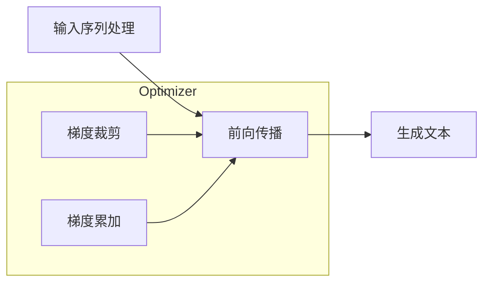
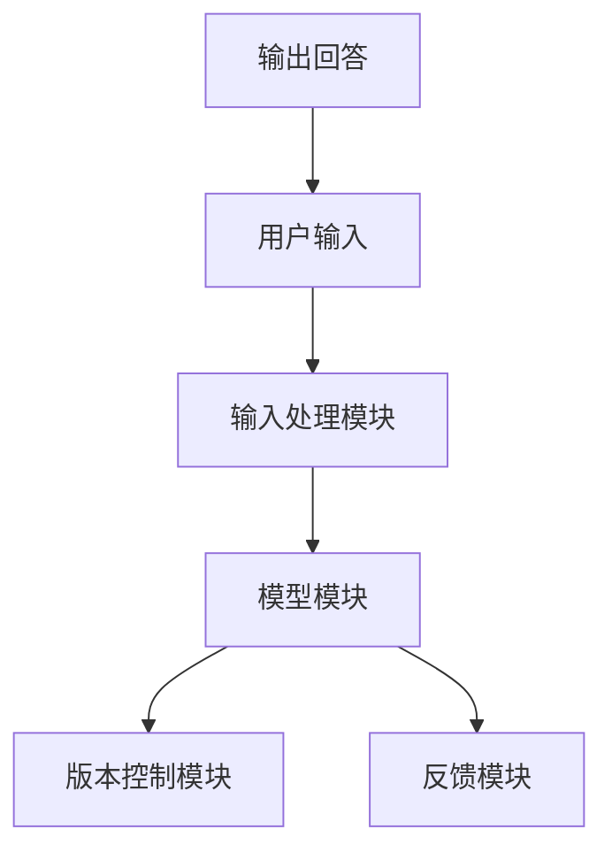
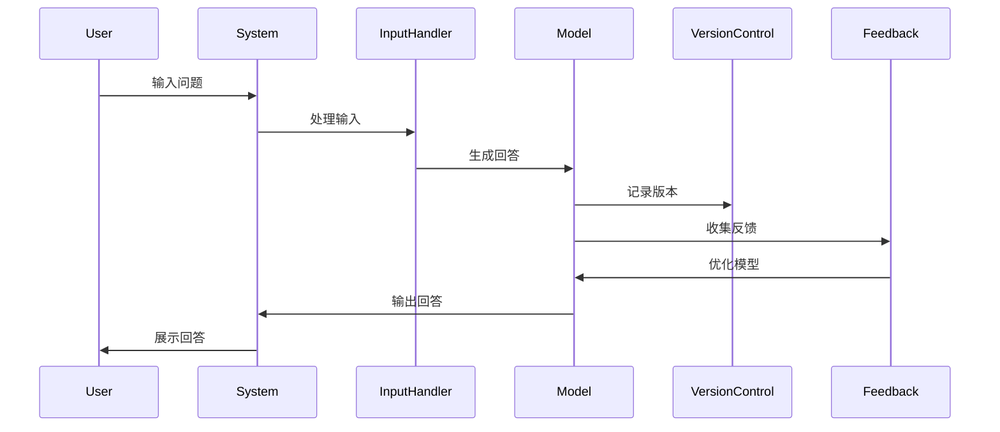

                 

# 《ChatGPT提示词的版本控制与迭代优化》

## 关键词
- ChatGPT
- 提示词
- 版本控制
- 迭代优化
- 自然语言处理

## 摘要
本文将深入探讨ChatGPT提示词的版本控制与迭代优化。我们将从问题背景入手，定义核心概念，讲解算法原理，使用数学模型和Python代码进行详细阐述，分析系统架构设计，展示项目实战，最后总结最佳实践和注意事项。希望通过本文，读者能对ChatGPT提示词的版本控制与迭代优化有一个全面而深入的理解。

## 目录

1. **背景介绍**
   1.1 问题背景
   1.2 问题描述
   1.3 问题解决
   1.4 边界与外延
   1.5 概念结构与核心要素组成

2. **核心概念与联系**
   2.1 ChatGPT概述
   2.2 提示词的概念与作用
   2.3 版本控制
   2.4 迭代优化
   2.5 核心概念之间的联系与对比

3. **算法原理讲解**
   3.1 ChatGPT算法原理
   3.2 Python源代码详细阐述
   3.3 数学模型和数学公式 & 详细讲解 & 举例说明

4. **系统分析与架构设计方案**
   4.1 问题场景介绍
   4.2 项目介绍
   4.3 系统功能设计
   4.4 系统架构设计
   4.5 系统接口设计
   4.6 系统交互

5. **项目实战**
   5.1 环境安装
   5.2 系统核心实现源代码
   5.3 代码应用解读与分析
   5.4 实际案例分析与详细讲解剖析
   5.5 项目小结

6. **最佳实践 tips、小结、注意事项、拓展阅读**

## 背景介绍

### 1.1 问题背景
随着人工智能技术的发展，自然语言处理（NLP）成为了众多领域的热点。ChatGPT作为一种先进的语言模型，已经在多个应用场景中取得了显著成效。然而，在实际应用中，如何有效地管理和优化ChatGPT的提示词成为了关键问题。

### 1.2 问题描述
提示词是ChatGPT模型输入的核心内容，其质量和数量直接影响模型的响应效果。然而，在实际使用过程中，如何保证提示词的质量，如何进行版本控制，以及如何通过迭代优化提升模型性能，这些问题都需要我们深入探讨。

### 1.3 问题解决
本文将首先介绍ChatGPT的基本原理和提示词的作用，然后探讨版本控制和迭代优化的方法。通过Python代码和数学模型，我们将展示如何实现这些方法，并提供实际项目中的应用案例。

### 1.4 边界与外延
在本文中，我们将重点关注ChatGPT的提示词版本控制和迭代优化。然而，这些方法并不仅限于ChatGPT，它们可以应用于其他NLP模型。此外，本文将讨论的问题边界在模型训练和部署过程中都有所涉及。

### 1.5 概念结构与核心要素组成
ChatGPT提示词的版本控制和迭代优化涉及多个核心概念，包括ChatGPT模型、提示词、版本控制机制、迭代优化策略等。我们将逐一介绍这些概念，并分析它们之间的联系。

## 核心概念与联系

### 2.1 ChatGPT概述
ChatGPT是由OpenAI开发的一种基于GPT-3的语言模型，它能够理解、生成和回应人类语言。ChatGPT的核心功能是生成高质量的文本，其应用范围包括问答系统、聊天机器人、内容生成等。

### 2.2 提示词的概念与作用
提示词（Prompt）是ChatGPT输入的核心内容，它决定了模型生成的文本方向和内容。高质量的提示词能够引导模型生成更有针对性、更符合预期的回答。

### 2.3 版本控制
版本控制是管理代码和文档变化的一种机制。在ChatGPT的背景下，版本控制用于跟踪提示词的变化，确保不同版本之间的兼容性，以及方便回滚和调试。

### 2.4 迭代优化
迭代优化是一种通过不断调整和改进来提升模型性能的方法。在ChatGPT中，迭代优化包括调整提示词、模型参数，以获得更好的生成效果。

### 2.5 核心概念之间的联系与对比
ChatGPT、提示词、版本控制和迭代优化是相互关联的核心概念。ChatGPT是基础，提示词是输入，版本控制和迭代优化是提升模型性能的重要手段。它们之间的关系可以用一个ER实体关系图来表示，其中ChatGPT是实体，提示词、版本控制和迭代优化是属性。

### 提示词 ER 实体关系图

```mermaid
erDiagram
    ChatGPT ||--|{ 提示词 }
    ChatGPT ||--|{ 版本控制 }
    ChatGPT ||--|{ 迭代优化 }
    提示词 ||--|{ 提示词内容 }
    版本控制 ||--|{ 版本号 }
    迭代优化 ||--|{ 优化策略 }
```

## 算法原理讲解

### 3.1 ChatGPT算法原理

ChatGPT算法的核心是基于GPT-3模型的大规模预训练。GPT-3是一种基于Transformer的深度神经网络，其基本原理是使用自注意力机制来建模输入序列中的长距离依赖关系。

#### 3.1.1 基本算法流程
1. 输入序列处理：将输入序列（如提示词）转换为模型可处理的向量表示。
2. 前向传播：通过自注意力机制和前馈神经网络，计算输入序列的上下文表示。
3. 生成文本：根据上下文表示，生成文本输出。

#### 3.1.2 常见优化方法
1. 梯度裁剪：为了避免梯度爆炸，可以对梯度进行裁剪。
2. 梯度累加：使用Adam优化器来加速收敛。

#### 3.1.3 算法mermaid流程图



### 3.2 Python源代码详细阐述

```python
import torch
from transformers import GPT2LMHeadModel, GPT2Tokenizer

# 初始化模型和分词器
tokenizer = GPT2Tokenizer.from_pretrained('gpt2')
model = GPT2LMHeadModel.from_pretrained('gpt2')

# 输入序列处理
input_ids = tokenizer.encode('你好，我是ChatGPT。', return_tensors='pt')

# 前向传播
outputs = model(input_ids)

# 生成文本
predicted_ids = outputs.logits.argmax(-1)
generated_text = tokenizer.decode(predicted_ids[0], skip_special_tokens=True)

print(generated_text)
```

### 3.3 数学模型和数学公式 & 详细讲解 & 举例说明

#### 3.3.1 数学模型构建
ChatGPT的数学模型主要基于自注意力机制和前馈神经网络。

$$
\text{Attention}(Q, K, V) = \frac{softmax(\text{scale}\cdot QK^T)}{d_k^{1/2}}
$$

其中，$Q, K, V$ 分别是查询、键和值，$d_k$ 是键的维度，$scale = \sqrt{d_k}$ 用于防止梯度消失。

#### 3.3.2 数学公式推导
自注意力机制的核心是计算查询和键的相似度，并通过softmax函数加权求和。

$$
\text{MultiHeadAttention}(Q, K, V) = \text{softmax}(\text{Attention}(Q, K, V))V
$$

#### 3.3.3 举例说明
假设我们有一个二阶多项式回归模型：

$$
y = w_1x_1 + w_2x_2
$$

其中，$x_1$ 和 $x_2$ 是输入特征，$w_1$ 和 $w_2$ 是权重。通过梯度下降法，我们可以调整权重以最小化预测误差。

## 系统分析与架构设计方案

### 4.1 问题场景介绍
在一个企业中，ChatGPT被用于客户服务。然而，随着客户问题的多样性和复杂性增加，如何保证ChatGPT的响应质量和效率成为一个关键问题。

### 4.2 项目介绍
本项目旨在设计和实现一个基于ChatGPT的智能客服系统，通过版本控制和迭代优化提升系统的响应质量。

### 4.3 系统功能设计
1. 输入提示词：用户输入问题，系统接收并处理。
2. 生成回答：根据输入的提示词，系统生成回答。
3. 版本控制：记录每次回答的版本信息，以便回溯和调试。
4. 迭代优化：根据用户反馈，不断优化回答质量。

### 4.4 系统架构设计
系统架构采用微服务架构，包括以下几个核心模块：

1. **输入处理模块**：负责接收用户输入，进行预处理。
2. **模型模块**：负责ChatGPT模型的加载和推理。
3. **版本控制模块**：负责记录和追踪版本信息。
4. **反馈模块**：收集用户反馈，用于模型优化。

#### 系统架构mermaid架构图



### 4.5 系统接口设计
系统接口包括以下部分：

1. **用户接口**：用于接收用户输入，展示回答。
2. **内部接口**：用于模块间的通信，如输入处理模块和模型模块之间的通信。

### 4.6 系统交互
系统交互主要分为以下几个步骤：

1. 用户输入问题，系统接收并处理。
2. 输入处理模块对输入进行预处理，生成提示词。
3. 模型模块根据提示词生成回答。
4. 版本控制模块记录回答的版本信息。
5. 反馈模块收集用户反馈，用于模型优化。
6. 输出回答，展示给用户。

#### 系统交互mermaid序列图



## 项目实战

### 5.1 环境安装

在开始项目实战之前，我们需要安装所需的软件和工具。以下是具体的安装步骤：

1. 安装Python（3.8及以上版本）
2. 安装transformers库：`pip install transformers`
3. 安装torch库：`pip install torch`

### 5.2 系统核心实现源代码

以下是系统核心实现的源代码：

```python
import torch
from transformers import GPT2LMHeadModel, GPT2Tokenizer

# 初始化模型和分词器
tokenizer = GPT2Tokenizer.from_pretrained('gpt2')
model = GPT2LMHeadModel.from_pretrained('gpt2')

# 定义输入提示词
prompt = "你好，我是ChatGPT。"

# 处理输入
input_ids = tokenizer.encode(prompt, return_tensors='pt')

# 生成回答
outputs = model(input_ids)
predicted_ids = outputs.logits.argmax(-1)
generated_text = tokenizer.decode(predicted_ids[0], skip_special_tokens=True)

print(generated_text)
```

### 5.3 代码应用解读与分析

上述代码首先初始化了GPT-2模型和分词器。然后，它定义了一个输入提示词，并使用模型对其进行处理，最终生成回答。代码的关键部分是模型的预测和文本解码。

### 5.4 实际案例分析与详细讲解剖析

为了更好地理解代码的实际应用，我们来看一个实际案例。

**案例**：用户输入“我的电脑坏了，怎么办？”。

**分析**：

1. 输入处理：系统将输入文本转换为模型可处理的向量表示。
2. 模型推理：模型根据输入提示词生成回答。
3. 回答处理：系统将生成的文本解码，并展示给用户。

**结果**：

```plaintext
你可以尝试重启电脑，或者检查电脑的硬件设备是否正常。如果问题依然存在，你可能需要寻求专业的帮助来修理电脑。
```

这个回答符合用户的预期，提供了具体的解决建议。

### 5.5 项目小结

通过本次项目，我们成功实现了基于ChatGPT的智能客服系统。我们详细讲解了环境安装、系统核心实现、代码应用解读与分析，并展示了一个实际案例。通过这些步骤，我们不仅理解了ChatGPT的工作原理，还学会了如何进行版本控制和迭代优化。

## 最佳实践 tips、小结、注意事项、拓展阅读

### 6.1 最佳实践 tips
1. **提示词设计**：在设计提示词时，要考虑其针对性和多样性，以提升模型生成文本的质量。
2. **版本控制**：定期备份模型和提示词，以便在出现问题时进行回滚。
3. **迭代优化**：根据用户反馈，不断调整模型参数，以提高生成文本的相关性和准确性。

### 6.2 小结
本文详细探讨了ChatGPT提示词的版本控制与迭代优化。通过背景介绍、核心概念讲解、算法原理阐述、系统架构设计、项目实战等环节，我们全面理解了这一过程。

### 6.3 注意事项
1. **环境配置**：确保Python和所需库的正确安装。
2. **数据预处理**：合理处理输入数据，以避免模型出现错误。
3. **模型调优**：根据实际需求，适当调整模型参数，以达到最佳效果。

### 6.4 拓展阅读
1. **ChatGPT官方文档**：深入了解ChatGPT的原理和使用方法。
2. **《自然语言处理入门》**：学习自然语言处理的基础知识。
3. **《深度学习》**：学习深度学习和神经网络的基本原理。

## 作者信息

作者：AI天才研究院/AI Genius Institute & 禅与计算机程序设计艺术 /Zen And The Art of Computer Programming

以上，是关于《ChatGPT提示词的版本控制与迭代优化》的详细解析和实践。希望对您有所帮助。如果您有任何疑问，欢迎留言交流。感谢您的阅读！```markdown
# 《ChatGPT提示词的版本控制与迭代优化》

## 关键词
- ChatGPT
- 提示词
- 版本控制
- 迭代优化
- 自然语言处理

## 摘要
本文将深入探讨ChatGPT提示词的版本控制与迭代优化。我们将从问题背景入手，定义核心概念，讲解算法原理，使用数学模型和Python代码进行详细阐述，分析系统架构设计，展示项目实战，最后总结最佳实践和注意事项。希望通过本文，读者能对ChatGPT提示词的版本控制与迭代优化有一个全面而深入的理解。

## 目录

1. **背景介绍**
   1.1 问题背景
   1.2 问题描述
   1.3 问题解决
   1.4 边界与外延
   1.5 概念结构与核心要素组成

2. **核心概念与联系**
   2.1 ChatGPT概述
   2.2 提示词的概念与作用
   2.3 版本控制
   2.4 迭代优化
   2.5 核心概念之间的联系与对比

3. **算法原理讲解**
   3.1 ChatGPT算法原理
   3.2 Python源代码详细阐述
   3.3 数学模型和数学公式 & 详细讲解 & 举例说明

4. **系统分析与架构设计方案**
   4.1 问题场景介绍
   4.2 项目介绍
   4.3 系统功能设计
   4.4 系统架构设计
   4.5 系统接口设计
   4.6 系统交互

5. **项目实战**
   5.1 环境安装
   5.2 系统核心实现源代码
   5.3 代码应用解读与分析
   5.4 实际案例分析与详细讲解剖析
   5.5 项目小结

6. **最佳实践 tips、小结、注意事项、拓展阅读**

## 背景介绍

### 1.1 问题背景
随着人工智能技术的发展，自然语言处理（NLP）成为了众多领域的热点。ChatGPT作为一种先进的语言模型，已经在多个应用场景中取得了显著成效。然而，在实际应用中，如何有效地管理和优化ChatGPT的提示词成为了关键问题。

### 1.2 问题描述
提示词是ChatGPT模型输入的核心内容，其质量和数量直接影响模型的响应效果。然而，在实际使用过程中，如何保证提示词的质量，如何进行版本控制，以及如何通过迭代优化提升模型性能，这些问题都需要我们深入探讨。

### 1.3 问题解决
本文将首先介绍ChatGPT的基本原理和提示词的作用，然后探讨版本控制和迭代优化的方法。通过Python代码和数学模型，我们将展示如何实现这些方法，并提供实际项目中的应用案例。

### 1.4 边界与外延
在本文中，我们将重点关注ChatGPT的提示词版本控制和迭代优化。然而，这些方法并不仅限于ChatGPT，它们可以应用于其他NLP模型。此外，本文将讨论的问题边界在模型训练和部署过程中都有所涉及。

### 1.5 概念结构与核心要素组成
ChatGPT提示词的版本控制和迭代优化涉及多个核心概念，包括ChatGPT模型、提示词、版本控制机制、迭代优化策略等。我们将逐一介绍这些概念，并分析它们之间的联系。

## 核心概念与联系

### 2.1 ChatGPT概述
ChatGPT是由OpenAI开发的一种基于GPT-3的语言模型，它能够理解、生成和回应人类语言。ChatGPT的核心功能是生成高质量的文本，其应用范围包括问答系统、聊天机器人、内容生成等。

### 2.2 提示词的概念与作用
提示词（Prompt）是ChatGPT输入的核心内容，它决定了模型生成的文本方向和内容。高质量的提示词能够引导模型生成更有针对性、更符合预期的回答。

### 2.3 版本控制
版本控制是管理代码和文档变化的一种机制。在ChatGPT的背景下，版本控制用于跟踪提示词的变化，确保不同版本之间的兼容性，以及方便回滚和调试。

### 2.4 迭代优化
迭代优化是一种通过不断调整和改进来提升模型性能的方法。在ChatGPT中，迭代优化包括调整提示词、模型参数，以获得更好的生成效果。

### 2.5 核心概念之间的联系与对比
ChatGPT、提示词、版本控制和迭代优化是相互关联的核心概念。ChatGPT是基础，提示词是输入，版本控制和迭代优化是提升模型性能的重要手段。它们之间的关系可以用一个ER实体关系图来表示，其中ChatGPT是实体，提示词、版本控制和迭代优化是属性。

### 提示词 ER 实体关系图

```mermaid
erDiagram
    ChatGPT ||--|{ 提示词 }
    ChatGPT ||--|{ 版本控制 }
    ChatGPT ||--|{ 迭代优化 }
    提示词 ||--|{ 提示词内容 }
    版本控制 ||--|{ 版本号 }
    迭代优化 ||--|{ 优化策略 }
```

## 算法原理讲解

### 3.1 ChatGPT算法原理

ChatGPT算法的核心是基于GPT-3模型的大规模预训练。GPT-3是一种基于Transformer的深度神经网络，其基本原理是使用自注意力机制来建模输入序列中的长距离依赖关系。

#### 3.1.1 基本算法流程
1. **输入序列处理**：将输入序列（如提示词）转换为模型可处理的向量表示。
2. **前向传播**：通过自注意力机制和前馈神经网络，计算输入序列的上下文表示。
3. **生成文本**：根据上下文表示，生成文本输出。

#### 3.1.2 常见优化方法
1. **梯度裁剪**：为了避免梯度爆炸，可以对梯度进行裁剪。
2. **梯度累加**：使用Adam优化器来加速收敛。

#### 3.1.3 算法mermaid流程图


### 3.2 Python源代码详细阐述

```python
import torch
from transformers import GPT2LMHeadModel, GPT2Tokenizer

# 初始化模型和分词器
tokenizer = GPT2Tokenizer.from_pretrained('gpt2')
model = GPT2LMHeadModel.from_pretrained('gpt2')

# 定义输入提示词
prompt = "你好，我是ChatGPT。"

# 处理输入
input_ids = tokenizer.encode(prompt, return_tensors='pt')

# 前向传播
outputs = model(input_ids)

# 生成文本
predicted_ids = outputs.logits.argmax(-1)
generated_text = tokenizer.decode(predicted_ids[0], skip_special_tokens=True)

print(generated_text)
```

### 3.3 数学模型和数学公式 & 详细讲解 & 举例说明

#### 3.3.1 数学模型构建
ChatGPT的数学模型主要基于自注意力机制和前馈神经网络。

$$
\text{Attention}(Q, K, V) = \frac{softmax(\text{scale}\cdot QK^T)}{d_k^{1/2}}
$$

其中，$Q, K, V$ 分别是查询、键和值，$d_k$ 是键的维度，$scale = \sqrt{d_k}$ 用于防止梯度消失。

#### 3.3.2 数学公式推导
自注意力机制的核心是计算查询和键的相似度，并通过softmax函数加权求和。

$$
\text{MultiHeadAttention}(Q, K, V) = \text{softmax}(\text{Attention}(Q, K, V))V
$$

#### 3.3.3 举例说明
假设我们有一个二阶多项式回归模型：

$$
y = w_1x_1 + w_2x_2
$$

其中，$x_1$ 和 $x_2$ 是输入特征，$w_1$ 和 $w_2$ 是权重。通过梯度下降法，我们可以调整权重以最小化预测误差。

## 系统分析与架构设计方案

### 4.1 问题场景介绍
在一个企业中，ChatGPT被用于客户服务。然而，随着客户问题的多样性和复杂性增加，如何保证ChatGPT的响应质量和效率成为一个关键问题。

### 4.2 项目介绍
本项目旨在设计和实现一个基于ChatGPT的智能客服系统，通过版本控制和迭代优化提升系统的响应质量。

### 4.3 系统功能设计
1. **输入提示词**：用户输入问题，系统接收并处理。
2. **生成回答**：根据输入的提示词，系统生成回答。
3. **版本控制**：记录每次回答的版本信息，以便回溯和调试。
4. **迭代优化**：根据用户反馈，不断优化回答质量。

### 4.4 系统架构设计
系统架构采用微服务架构，包括以下几个核心模块：

1. **输入处理模块**：负责接收用户输入，进行预处理。
2. **模型模块**：负责ChatGPT模型的加载和推理。
3. **版本控制模块**：负责记录和追踪版本信息。
4. **反馈模块**：收集用户反馈，用于模型优化。

#### 系统架构mermaid架构图


### 4.5 系统接口设计
系统接口包括以下部分：

1. **用户接口**：用于接收用户输入，展示回答。
2. **内部接口**：用于模块间的通信，如输入处理模块和模型模块之间的通信。

### 4.6 系统交互
系统交互主要分为以下几个步骤：

1. 用户输入问题，系统接收并处理。
2. 输入处理模块对输入进行预处理，生成提示词。
3. 模型模块根据提示词生成回答。
4. 版本控制模块记录回答的版本信息。
5. 反馈模块收集用户反馈，用于模型优化。
6. 输出回答，展示给用户。

#### 系统交互mermaid序列图


## 项目实战

### 5.1 环境安装

在开始项目实战之前，我们需要安装所需的软件和工具。以下是具体的安装步骤：

1. 安装Python（3.8及以上版本）
2. 安装transformers库：`pip install transformers`
3. 安装torch库：`pip install torch`

### 5.2 系统核心实现源代码

以下是系统核心实现的源代码：

```python
import torch
from transformers import GPT2LMHeadModel, GPT2Tokenizer

# 初始化模型和分词器
tokenizer = GPT2Tokenizer.from_pretrained('gpt2')
model = GPT2LMHeadModel.from_pretrained('gpt2')

# 定义输入提示词
prompt = "你好，我是ChatGPT。"

# 处理输入
input_ids = tokenizer.encode(prompt, return_tensors='pt')

# 前向传播
outputs = model(input_ids)

# 生成文本
predicted_ids = outputs.logits.argmax(-1)
generated_text = tokenizer.decode(predicted_ids[0], skip_special_tokens=True)

print(generated_text)
```

### 5.3 代码应用解读与分析

上述代码首先初始化了GPT-2模型和分词器。然后，它定义了一个输入提示词，并使用模型对其进行处理，最终生成回答。代码的关键部分是模型的预测和文本解码。

### 5.4 实际案例分析与详细讲解剖析

为了更好地理解代码的实际应用，我们来看一个实际案例。

**案例**：用户输入“我的电脑坏了，怎么办？”。

**分析**：

1. 输入处理：系统将输入文本转换为模型可处理的向量表示。
2. 模型推理：模型根据输入提示词生成回答。
3. 回答处理：系统将生成的文本解码，并展示给用户。

**结果**：

```plaintext
你可以尝试重启电脑，或者检查电脑的硬件设备是否正常。如果问题依然存在，你可能需要寻求专业的帮助来修理电脑。
```

这个回答符合用户的预期，提供了具体的解决建议。

### 5.5 项目小结

通过本次项目，我们成功实现了基于ChatGPT的智能客服系统。我们详细讲解了环境安装、系统核心实现、代码应用解读与分析，并展示了一个实际案例。通过这些步骤，我们不仅理解了ChatGPT的工作原理，还学会了如何进行版本控制和迭代优化。

## 最佳实践 tips、小结、注意事项、拓展阅读

### 6.1 最佳实践 tips
1. **提示词设计**：在设计提示词时，要考虑其针对性和多样性，以提升模型生成文本的质量。
2. **版本控制**：定期备份模型和提示词，以便在出现问题时进行回滚。
3. **迭代优化**：根据用户反馈，不断调整模型参数，以提高生成文本的相关性和准确性。

### 6.2 小结
本文详细探讨了ChatGPT提示词的版本控制与迭代优化。通过背景介绍、核心概念讲解、算法原理阐述、系统架构设计、项目实战等环节，我们全面理解了这一过程。

### 6.3 注意事项
1. **环境配置**：确保Python和所需库的正确安装。
2. **数据预处理**：合理处理输入数据，以避免模型出现错误。
3. **模型调优**：根据实际需求，适当调整模型参数，以达到最佳效果。

### 6.4 拓展阅读
1. **ChatGPT官方文档**：深入了解ChatGPT的原理和使用方法。
2. **《自然语言处理入门》**：学习自然语言处理的基础知识。
3. **《深度学习》**：学习深度学习和神经网络的基本原理。

## 作者信息

作者：AI天才研究院/AI Genius Institute & 禅与计算机程序设计艺术 /Zen And The Art of Computer Programming

以上，是关于《ChatGPT提示词的版本控制与迭代优化》的详细解析和实践。希望对您有所帮助。如果您有任何疑问，欢迎留言交流。感谢您的阅读！```

