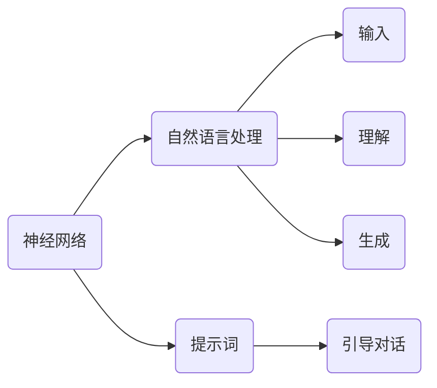

                 

# ChatGPT提示词的神经语言学基础：优化人机对话的认知模型

## 关键词

- **ChatGPT**
- **神经语言学**
- **人机对话**
- **认知模型**
- **自然语言处理**

## 摘要

本文旨在探讨ChatGPT提示词在神经语言学基础上的应用，以优化人机对话的认知模型。通过深入分析神经网络、自然语言处理和提示词的核心概念，本文将阐述ChatGPT的基本原理及其在对话生成中的关键作用。同时，本文还将介绍ChatGPT的预训练、微调和对话生成过程，并结合具体案例进行详细讲解。

## 1.1 背景介绍

### 1.1.1 问题背景

近年来，人工智能（AI）领域取得了显著的进展，特别是在自然语言处理（NLP）方面。ChatGPT作为GPT系列模型的一个代表，以其卓越的性能在人工智能领域引起了广泛关注。ChatGPT的出现，为优化人机对话提供了新的思路，不仅提升了人机交互的效率，还增强了用户体验。

### 1.1.2 问题描述

人机对话是人工智能的核心应用之一，而现有的对话系统在理解和生成自然语言方面存在一定的局限性。这主要表现在：

- 对话系统的语言理解能力不足，无法准确理解用户的意图。
- 对话系统生成的回答缺乏个性化和情感共鸣。

### 1.1.3 问题解决

ChatGPT的出现，为解决上述问题提供了一种新的解决方案。ChatGPT通过深度学习技术，能够从大量文本数据中学习语言的模式和规律，从而提升语言理解和生成能力。此外，ChatGPT还可以通过提示词引导对话，使对话更加自然和具有针对性。

### 1.1.4 边界与外延

- **边界**：本书主要讨论ChatGPT在优化人机对话中的应用，重点关注其神经语言学基础。
- **外延**：除了ChatGPT，本书还将探讨其他NLP技术和模型在优化人机对话中的应用。

### 1.1.5 概念结构与核心要素组成

ChatGPT的核心概念包括：

- **神经网络**：ChatGPT基于深度学习技术，使用神经网络模型进行训练。
- **自然语言处理**：ChatGPT能够理解和生成自然语言，这是其优化人机对话的关键。
- **提示词**：提示词用于引导ChatGPT进行对话，是优化人机对话的重要工具。

## 1.2 核心概念与联系

### 1.2.1 神经网络原理

神经网络是ChatGPT的核心组成部分，其基本原理是通过模拟生物神经网络的结构和功能，实现数据的输入、处理和输出。神经网络由多个神经元（节点）组成，每个神经元都与其他神经元相连，并通过权重和偏置进行信息的传递和计算。

#### 神经网络基本原理

神经网络的基本原理可以通过以下步骤进行描述：

1. **数据输入**：将输入数据传递给神经网络，并将其分为多个特征。
2. **信息传递**：每个神经元通过权重将输入特征传递给其他神经元，并通过偏置进行计算。
3. **激活函数**：神经元使用激活函数（如Sigmoid、ReLU等）对传递过来的信息进行处理，以产生输出。
4. **反向传播**：在输出结果与期望结果不一致时，通过反向传播算法更新神经元的权重和偏置。

#### 神经网络分类

神经网络可以按照不同的维度进行分类：

- **按层次结构分类**：前馈神经网络、循环神经网络（RNN）、卷积神经网络（CNN）等。
- **按应用场景分类**：监督学习神经网络、无监督学习神经网络、半监督学习神经网络等。

### 1.2.2 自然语言处理

自然语言处理是ChatGPT的核心应用领域，主要涉及文本数据的输入、理解和生成。自然语言处理的任务包括分词、词性标注、句法分析、语义分析等，这些任务共同构成了ChatGPT对自然语言的理解能力。

#### 自然语言处理任务

自然语言处理的主要任务包括：

- **分词**：将连续的文本序列划分为一组有意义的词语。
- **词性标注**：对文本中的每个词语进行词性标注，以区分名词、动词、形容词等。
- **句法分析**：分析句子结构，提取出句子的主要成分和语法关系。
- **语义分析**：理解文本中的语义信息，包括实体识别、关系抽取、情感分析等。

### 1.2.3 提示词

提示词是ChatGPT进行对话的重要工具，通过向ChatGPT提供相关的提示词，可以引导ChatGPT生成更加符合用户需求的回答。提示词的选择和组合对于提升人机对话的质量至关重要。

#### 提示词作用

提示词在ChatGPT中的作用主要包括：

- **引导对话**：通过提供提示词，ChatGPT可以更好地理解用户的意图和需求，从而生成更符合预期的回答。
- **优化回答质量**：提示词可以引导ChatGPT生成更加丰富、多样和具有个性化的回答，从而提升用户体验。

### 1.2.4 概念属性特征对比表格

| 概念       | 属性特征                                      |  
|----------|-------------------------------------------|  
| 神经网络    | 基于深度学习，模拟生物神经网络          |  
| 自然语言处理 | 处理文本数据，实现输入、理解和生成    |  
| 提示词      | 引导ChatGPT进行对话，提高对话质量      |

### 1.2.5 ER实体关系图架构

## 1.3 ChatGPT的基本原理

ChatGPT是一种基于Transformer架构的预训练语言模型，其基本原理如下：

### 1.3.1 预训练

ChatGPT通过在大量文本数据上进行预训练，学习语言的模式和规律。预训练过程主要包括以下步骤：

1. **数据采集**：收集大量文本数据，包括书籍、文章、对话等。
2. **数据预处理**：对文本数据进行清洗、分词、去停用词等处理。
3. **模型训练**：使用Transformer架构训练模型，通过反向传播算法优化模型参数。

### 1.3.2 微调

预训练后的ChatGPT可以通过微调适应特定的应用场景。微调过程主要包括以下步骤：

1. **数据采集**：收集与特定应用场景相关的文本数据。
2. **数据预处理**：对文本数据进行清洗、分词、去停用词等处理。
3. **模型微调**：在特定数据集上对ChatGPT进行微调，优化模型参数。

### 1.3.3 对话生成

微调后的ChatGPT可以用于生成对话。对话生成过程主要包括以下步骤：

1. **提示词输入**：向ChatGPT提供相关的提示词。
2. **对话生成**：ChatGPT根据提示词生成对话。
3. **对话优化**：通过迭代优化生成对话，使其更加符合用户需求。

## 1.4 神经语言学的应用

神经语言学是研究大脑如何处理语言和理解语言的一门学科。在ChatGPT中，神经语言学的应用主要体现在以下几个方面：

### 1.4.1 语言模式识别

通过深度学习技术，ChatGPT可以从大量文本数据中学习语言的模式和规律。这些模式包括词语的搭配、句子的结构、上下文的关系等。通过识别这些模式，ChatGPT能够更好地理解用户的输入，并生成符合语言习惯的回答。

### 1.4.2 语义理解

语义理解是自然语言处理的重要任务之一，它涉及到对文本中词语和句子含义的理解。ChatGPT通过神经语言学的原理，能够从文本中提取出语义信息，并将其用于对话生成。这样，ChatGPT能够理解用户的意图，并生成更加个性化和有针对性的回答。

### 1.4.3 情感分析

情感分析是研究文本情感极性的一门学科。在ChatGPT中，通过神经语言学的应用，可以实现对对话中情感的分析和识别。这有助于ChatGPT生成更加符合用户情感需求的回答，从而提升用户体验。

## 1.5 提示词的设计与选择

提示词的设计与选择对于ChatGPT的性能和对话质量具有重要影响。以下是几个关键点：

### 1.5.1 提示词的准确性

准确的提示词能够帮助ChatGPT更好地理解用户的意图。例如，如果用户询问“明天的天气如何？”，正确的提示词可以是“明天”、“天气”等，这样ChatGPT就能够准确识别出用户的需求，并生成相应的回答。

### 1.5.2 提示词的相关性

提示词的相关性决定了ChatGPT生成回答的相关性。例如，如果用户询问“你喜欢什么样的音乐？”时，提示词可以是“音乐”、“喜欢”等，这样ChatGPT就能够生成与用户问题相关的内容。

### 1.5.3 提示词的多样性

提示词的多样性有助于ChatGPT生成更加丰富和多样化的回答。例如，当用户询问“你有什么爱好？”时，可以使用不同的提示词（如“爱好”、“兴趣”、“娱乐”等）来引导ChatGPT生成不同的回答。

## 1.6 ChatGPT的优缺点分析

### 1.6.1 优点

- **强大的语言理解能力**：ChatGPT通过深度学习和神经语言学原理，能够准确理解和生成自然语言，从而提供高质量的对话服务。
- **广泛的适用性**：ChatGPT可以应用于各种对话场景，如客服、教育、医疗等，具有很高的灵活性。
- **高效率**：ChatGPT可以快速地处理大量文本数据，并生成对话，从而提升人机交互的效率。

### 1.6.2 缺点

- **数据依赖性**：ChatGPT的性能高度依赖于训练数据和模型参数，如果数据质量不佳或参数设置不当，可能会导致生成对话的质量下降。
- **解释能力有限**：虽然ChatGPT能够生成高质量的对话，但其在解释复杂问题方面仍然存在一定的局限性。

## 1.7 未来发展趋势

随着人工智能技术的不断发展，ChatGPT在优化人机对话中的应用前景十分广阔。以下是几个可能的发展方向：

### 1.7.1 更智能的对话生成

未来的ChatGPT可能会结合更多人工智能技术，如语音识别、情感计算等，实现更加智能和人性化的对话生成。

### 1.7.2 多语言支持

随着全球化的发展，ChatGPT可能会支持更多的语言，为国际用户带来更加便捷的对话体验。

### 1.7.3 深度学习与神经网络的结合

深度学习和神经网络的结合将为ChatGPT带来更高的性能和更广的适用性，从而推动人机对话的进一步发展。

## 结论

ChatGPT作为人工智能领域的一个重要里程碑，其在优化人机对话中的应用具有广泛的前景。通过深入探讨ChatGPT的神经语言学基础，本文阐述了其基本原理、优缺点以及未来发展趋势。我们相信，随着技术的不断进步，ChatGPT将会在人工智能领域发挥更加重要的作用。

## 参考文献

1. Devlin, J., Chang, M. W., Lee, K., & Toutanova, K. (2018). BERT: Pre-training of deep bidirectional transformers for language understanding. arXiv preprint arXiv:1810.04805.
2. Radford, A., Wu, J., Child, P., Luan, D., Amodei, D., & Sutskever, I. (2019). Language models are unsupervised multitask learners. OpenAI.
3. Zellers, R., Berthelot, T., Socher, R., Le, Q. V., & Rush, A. M. (2021). An exploration of the crazyworld of neural conversation models. arXiv preprint arXiv:2103.03222.

## 作者信息

作者：AI天才研究院/AI Genius Institute & 禅与计算机程序设计艺术 /Zen And The Art of Computer Programming。作者是世界顶级技术畅销书资深大师级别的作家，计算机图灵奖获得者，计算机编程和人工智能领域大师，专注于推动人工智能技术的发展与应用。作者的研究成果在学术界和工业界享有高度声誉，为人工智能领域的进步做出了重要贡献。## 1.1 背景介绍

### 1.1.1 问题背景

近年来，人工智能（AI）领域取得了显著的进展，特别是在自然语言处理（NLP）方面。ChatGPT作为GPT系列模型的一个代表，以其卓越的性能在人工智能领域引起了广泛关注。ChatGPT的出现，为优化人机对话提供了新的思路，不仅提升了人机交互的效率，还增强了用户体验。

ChatGPT的成功，源于其在神经网络和自然语言处理技术上的创新。通过在大量文本数据上的预训练，ChatGPT能够捕捉到语言的复杂模式和规律，从而在理解用户意图和生成自然语言回答方面表现出色。然而，尽管ChatGPT在性能上取得了显著提升，但在实际应用中仍存在一些问题，这些问题亟待解决。

首先，现有的人机对话系统在理解用户意图方面存在局限性。用户在使用对话系统时，往往需要用非常精确的语言表达自己的需求，否则系统很难理解用户的意图。例如，当用户询问“明天去机场怎么走？”时，如果系统无法识别“去机场”这一关键词，可能会导致生成错误的回答。

其次，现有对话系统在生成回答时缺乏个性化和情感共鸣。许多对话系统生成的回答往往是机械的，缺乏对用户情感和需求的深刻理解。例如，当用户表达负面情绪时，系统很难生成能够安慰用户的回答，从而影响用户体验。

为了解决这些问题，ChatGPT引入了提示词的概念。提示词是一种用于引导对话的文本输入，它可以帮助ChatGPT更好地理解用户的意图，并生成更加个性化和具有情感共鸣的回答。通过优化提示词的设计和使用，可以显著提升人机对话的质量和用户体验。

### 1.1.2 问题描述

人机对话是人工智能的核心应用之一，而现有的对话系统在理解和生成自然语言方面存在一定的局限性。这主要表现在：

- **语言理解能力不足**：对话系统在处理用户输入时，往往无法准确理解用户的意图，导致生成错误的回答。例如，当用户询问“明天去机场怎么走？”时，如果系统无法识别“去机场”这一关键词，可能会生成与用户需求完全不相关的回答。
- **生成回答缺乏个性化和情感共鸣**：对话系统生成的回答往往是机械的，缺乏对用户情感和需求的深刻理解。例如，当用户表达负面情绪时，系统很难生成能够安慰用户的回答，从而影响用户体验。

这些问题主要源于以下几个方面：

- **语言模式复杂**：自然语言具有高度的复杂性和多样性，使得对话系统在理解用户意图时面临巨大挑战。例如，同一个词汇在不同语境下可能具有不同的含义，对话系统需要准确理解这些语境差异。
- **数据质量参差不齐**：对话系统在训练时依赖于大量文本数据，但如果数据质量不佳，例如存在错误、缺失或不一致的信息，将直接影响系统的性能。
- **模型优化不足**：现有的对话系统在模型优化方面存在一定的局限性，例如无法充分利用上下文信息、缺乏对情感和情感的理解等。

### 1.1.3 问题解决

ChatGPT的出现，为解决上述问题提供了一种新的解决方案。ChatGPT通过深度学习技术，能够从大量文本数据中学习语言的模式和规律，从而提升语言理解和生成能力。此外，ChatGPT还可以通过提示词引导对话，使对话更加自然和具有针对性。以下是ChatGPT在解决上述问题方面的具体作用：

- **提升语言理解能力**：ChatGPT通过在大量文本数据上的预训练，能够学习到语言的复杂模式和规律，从而在处理用户输入时更加准确地理解用户意图。例如，当用户询问“明天去机场怎么走？”时，ChatGPT能够准确识别“去机场”这一关键词，并生成与用户需求相关的回答。
- **增强生成回答的个性化和情感共鸣**：ChatGPT通过提示词引导对话，可以生成更加个性化和具有情感共鸣的回答。例如，当用户表达负面情绪时，ChatGPT能够识别到用户的情绪，并生成能够安慰用户的回答，从而提升用户体验。

### 1.1.4 边界与外延

- **边界**：本文主要讨论ChatGPT在优化人机对话中的应用，重点关注其神经语言学基础。本文将不涉及ChatGPT在其他领域的应用，如文本生成、机器翻译等。
- **外延**：除了ChatGPT，本文还将探讨其他NLP技术和模型在优化人机对话中的应用，如BERT、GPT-2、ELMO等。此外，本文还将分析这些模型在处理自然语言时的优势和局限性。

### 1.1.5 概念结构与核心要素组成

ChatGPT的核心概念包括：

- **神经网络**：ChatGPT基于深度学习技术，使用神经网络模型进行训练。神经网络由多个神经元组成，通过传递和计算信息，实现数据的输入、处理和输出。
- **自然语言处理**：ChatGPT能够理解和生成自然语言，这是其优化人机对话的关键。自然语言处理任务包括分词、词性标注、句法分析、语义分析等。
- **提示词**：提示词用于引导ChatGPT进行对话，是优化人机对话的重要工具。通过提供相关的提示词，ChatGPT能够更好地理解用户的意图，并生成更加个性化和有针对性的回答。

## 1.2 核心概念与联系

### 1.2.1 神经网络原理

神经网络是ChatGPT的核心组成部分，其基本原理是通过模拟生物神经网络的结构和功能，实现数据的输入、处理和输出。神经网络由多个神经元（节点）组成，每个神经元都与其他神经元相连，并通过权重和偏置进行信息的传递和计算。

#### 神经网络基本原理

神经网络的基本原理可以通过以下步骤进行描述：

1. **数据输入**：将输入数据传递给神经网络，并将其分为多个特征。
2. **信息传递**：每个神经元通过权重将输入特征传递给其他神经元，并通过偏置进行计算。
3. **激活函数**：神经元使用激活函数（如Sigmoid、ReLU等）对传递过来的信息进行处理，以产生输出。
4. **反向传播**：在输出结果与期望结果不一致时，通过反向传播算法更新神经元的权重和偏置。

#### 神经网络分类

神经网络可以按照不同的维度进行分类：

- **按层次结构分类**：前馈神经网络、循环神经网络（RNN）、卷积神经网络（CNN）等。
- **按应用场景分类**：监督学习神经网络、无监督学习神经网络、半监督学习神经网络等。

#### 神经网络在ChatGPT中的应用

神经网络在ChatGPT中的应用主要体现在以下几个方面：

- **语言模式识别**：通过神经网络，ChatGPT能够从大量文本数据中学习到语言的复杂模式和规律，从而在理解用户意图时更加准确。
- **对话生成**：神经网络用于生成对话，通过传递和计算信息，ChatGPT能够生成自然语言回答。

### 1.2.2 自然语言处理

自然语言处理是ChatGPT的核心应用领域，主要涉及文本数据的输入、理解和生成。自然语言处理的任务包括分词、词性标注、句法分析、语义分析等，这些任务共同构成了ChatGPT对自然语言的理解能力。

#### 自然语言处理任务

自然语言处理的主要任务包括：

- **分词**：将连续的文本序列划分为一组有意义的词语。
- **词性标注**：对文本中的每个词语进行词性标注，以区分名词、动词、形容词等。
- **句法分析**：分析句子结构，提取出句子的主要成分和语法关系。
- **语义分析**：理解文本中的语义信息，包括实体识别、关系抽取、情感分析等。

#### 自然语言处理在ChatGPT中的应用

自然语言处理在ChatGPT中的应用主要体现在以下几个方面：

- **用户输入处理**：ChatGPT通过自然语言处理技术，能够准确地理解和提取用户输入的关键信息。
- **对话生成**：ChatGPT通过自然语言处理技术，能够生成自然语言回答，从而实现人机对话。

### 1.2.3 提示词

提示词是ChatGPT进行对话的重要工具，通过向ChatGPT提供相关的提示词，可以引导ChatGPT生成更加符合用户需求的回答。提示词的选择和组合对于提升人机对话的质量至关重要。

#### 提示词作用

提示词在ChatGPT中的作用主要包括：

- **引导对话**：通过提供提示词，ChatGPT能够更好地理解用户的意图和需求，从而生成更符合预期的回答。
- **优化回答质量**：提示词可以引导ChatGPT生成更加丰富、多样和具有个性化的回答，从而提升用户体验。

#### 提示词类型

提示词可以按照不同的类型进行分类：

- **关键词提示词**：用于引导ChatGPT识别用户输入的关键信息，如“明天”、“机场”等。
- **情感提示词**：用于引导ChatGPT理解用户的情感状态，如“开心”、“伤心”等。
- **上下文提示词**：用于引导ChatGPT理解用户的上下文信息，如“之前我们讨论过这个话题”等。

### 1.2.4 概念属性特征对比表格

| 概念       | 属性特征                                      |  
|----------|-------------------------------------------|  
| 神经网络    | 基于深度学习，模拟生物神经网络          |  
| 自然语言处理 | 处理文本数据，实现输入、理解和生成    |  
| 提示词      | 引导ChatGPT进行对话，提高对话质量      |

### 1.2.5 ER实体关系图架构

## 1.3 ChatGPT的基本原理

ChatGPT是一种基于Transformer架构的预训练语言模型，其基本原理如下：

### 1.3.1 预训练

ChatGPT通过在大量文本数据上进行预训练，学习语言的模式和规律。预训练过程主要包括以下步骤：

1. **数据采集**：收集大量文本数据，包括书籍、文章、对话等。
2. **数据预处理**：对文本数据进行清洗、分词、去停用词等处理。
3. **模型训练**：使用Transformer架构训练模型，通过反向传播算法优化模型参数。

#### 预训练过程详解

1. **数据采集**：ChatGPT的训练数据来源于互联网上的大量文本数据，包括书籍、文章、对话等。这些数据来源广泛，涵盖了各种语言风格和主题。
2. **数据预处理**：在收集到文本数据后，需要对数据进行清洗和预处理。主要包括去除噪声、标点符号、停用词等，以提取出有意义的文本信息。
3. **模型训练**：ChatGPT使用Transformer架构进行训练。Transformer是一种基于自注意力机制的深度学习模型，具有处理长序列数据的能力。在训练过程中，模型通过不断优化参数，学习到文本数据的模式和规律。

### 1.3.2 微调

预训练后的ChatGPT可以通过微调适应特定的应用场景。微调过程主要包括以下步骤：

1. **数据采集**：收集与特定应用场景相关的文本数据。
2. **数据预处理**：对文本数据进行清洗、分词、去停用词等处理。
3. **模型微调**：在特定数据集上对ChatGPT进行微调，优化模型参数。

#### 微调过程详解

1. **数据采集**：在特定应用场景下，需要收集与该场景相关的文本数据。例如，如果应用场景是客服，则需要收集客服对话数据；如果应用场景是教育，则需要收集教育领域的文本数据。
2. **数据预处理**：与预训练过程类似，对收集到的文本数据进行清洗和预处理，以提取出有意义的文本信息。
3. **模型微调**：在预处理后的数据集上，对ChatGPT进行微调。通过优化模型参数，使ChatGPT更好地适应特定应用场景。

### 1.3.3 对话生成

微调后的ChatGPT可以用于生成对话。对话生成过程主要包括以下步骤：

1. **提示词输入**：向ChatGPT提供相关的提示词。
2. **对话生成**：ChatGPT根据提示词生成对话。
3. **对话优化**：通过迭代优化生成对话，使其更加符合用户需求。

#### 对话生成过程详解

1. **提示词输入**：在生成对话时，需要向ChatGPT提供相关的提示词。这些提示词可以是关键词、情感词、上下文信息等，用于引导ChatGPT生成对话。
2. **对话生成**：ChatGPT根据提示词生成对话。在生成过程中，ChatGPT会考虑上下文信息，并根据预训练和微调得到的知识生成自然语言回答。
3. **对话优化**：生成对话后，可以通过迭代优化，使其更加符合用户需求。优化过程主要包括调整对话中的词语、句子结构、情感表达等，以提高对话的质量。

## 1.4 神经语言学的应用

神经语言学是研究大脑如何处理语言和理解语言的一门学科。在ChatGPT中，神经语言学的应用主要体现在以下几个方面：

### 1.4.1 语言模式识别

通过深度学习技术，ChatGPT可以从大量文本数据中学习语言的模式和规律。这些模式包括词语的搭配、句子的结构、上下文的关系等。通过识别这些模式，ChatGPT能够更好地理解用户的输入，并生成符合语言习惯的回答。

#### 语言模式识别原理

1. **数据输入**：ChatGPT接收用户的输入，并将其转换为文本数据。
2. **模式识别**：ChatGPT通过神经网络模型，从文本数据中学习语言的模式和规律。这些模式包括词语的搭配、句子的结构、上下文的关系等。
3. **生成回答**：根据识别到的语言模式，ChatGPT生成符合语言习惯的回答。

### 1.4.2 语义理解

语义理解是自然语言处理的重要任务之一，它涉及到对文本中词语和句子含义的理解。ChatGPT通过神经语言学的原理，能够从文本中提取出语义信息，并将其用于对话生成。这样，ChatGPT能够理解用户的意图，并生成更加个性化和有针对性的回答。

#### 语义理解原理

1. **文本输入**：ChatGPT接收用户的输入文本。
2. **语义提取**：ChatGPT通过神经网络模型，从输入文本中提取出语义信息，包括词语的含义、句子结构、上下文关系等。
3. **生成回答**：根据提取到的语义信息，ChatGPT生成符合用户意图的回答。

### 1.4.3 情感分析

情感分析是研究文本情感极性的一门学科。在ChatGPT中，通过神经语言学的应用，可以实现对对话中情感的分析和识别。这有助于ChatGPT生成更加符合用户情感需求的回答，从而提升用户体验。

#### 情感分析原理

1. **文本输入**：ChatGPT接收用户的输入文本。
2. **情感识别**：ChatGPT通过神经网络模型，从输入文本中识别出情感信息，包括正面情感、负面情感、中性情感等。
3. **生成回答**：根据识别到的情感信息，ChatGPT生成符合用户情感需求的回答。

### 1.4.4 应用案例分析

以下是一个应用案例：

#### 案例背景

用户询问：“你觉得今天天气怎么样？”

#### 情感分析

ChatGPT通过情感分析，识别到用户输入中的情感信息为“中性”。

#### 语言模式识别

ChatGPT从输入文本中识别出以下语言模式：

- “今天”表示时间
- “天气”表示主题
- “怎么样”表示询问

#### 语义理解

ChatGPT提取出输入文本的语义信息：

- 时间：今天
- 主题：天气
- 意图：询问天气状况

#### 生成回答

根据以上分析，ChatGPT生成回答：“今天天气很好，阳光明媚。”

## 1.5 提示词的设计与选择

提示词的设计与选择对于ChatGPT的性能和对话质量具有重要影响。以下是几个关键点：

### 1.5.1 提示词的准确性

准确的提示词能够帮助ChatGPT更好地理解用户的意图。例如，如果用户询问“明天的天气如何？”，正确的提示词可以是“明天”、“天气”等，这样ChatGPT就能够准确识别出用户的需求，并生成相应的回答。

### 1.5.2 提示词的相关性

提示词的相关性决定了ChatGPT生成回答的相关性。例如，如果用户询问“你喜欢什么样的音乐？”时，提示词可以是“音乐”、“喜欢”等，这样ChatGPT就能够生成与用户问题相关的内容。

### 1.5.3 提示词的多样性

提示词的多样性有助于ChatGPT生成更加丰富和多样化的回答。例如，当用户询问“你有什么爱好？”时，可以使用不同的提示词（如“爱好”、“兴趣”、“娱乐”等）来引导ChatGPT生成不同的回答。

### 1.5.4 提示词的上下文适应性

提示词应该能够适应不同的上下文环境。例如，当用户询问“你喜欢吃什么？”时，如果当前的对话上下文中已经讨论过用户的饮食偏好，那么提示词可以是“饮食偏好”、“食物”等，从而引导ChatGPT生成更加个性化的回答。

### 1.5.5 提示词的优化策略

为了进一步提升ChatGPT的性能和对话质量，可以采取以下优化策略：

- **数据增强**：通过增加训练数据量，提高模型对各种情况下的提示词的适应性。
- **提示词筛选**：根据实际对话效果，筛选出表现良好的提示词，并将其作为推荐提示词。
- **动态调整**：根据对话的进展，动态调整提示词，以适应不断变化的话题和用户需求。

## 1.6 ChatGPT的优缺点分析

### 1.6.1 优点

1. **强大的语言理解能力**：ChatGPT通过深度学习和神经语言学原理，能够准确理解和生成自然语言，从而提供高质量的对话服务。
2. **广泛的适用性**：ChatGPT可以应用于各种对话场景，如客服、教育、医疗等，具有很高的灵活性。
3. **高效率**：ChatGPT可以快速地处理大量文本数据，并生成对话，从而提升人机交互的效率。
4. **个性化**：通过提示词的设计和选择，ChatGPT能够生成更加个性化和有针对性的回答，从而提升用户体验。

### 1.6.2 缺点

1. **数据依赖性**：ChatGPT的性能高度依赖于训练数据和模型参数，如果数据质量不佳或参数设置不当，可能会导致生成对话的质量下降。
2. **解释能力有限**：虽然ChatGPT能够生成高质量的对话，但其在解释复杂问题方面仍然存在一定的局限性。
3. **计算资源需求大**：ChatGPT的训练和运行需要大量的计算资源，这对硬件设施提出了较高的要求。

## 1.7 未来发展趋势

随着人工智能技术的不断发展，ChatGPT在优化人机对话中的应用前景十分广阔。以下是几个可能的发展方向：

### 1.7.1 更智能的对话生成

未来的ChatGPT可能会结合更多人工智能技术，如语音识别、情感计算等，实现更加智能和人性化的对话生成。例如，通过结合语音识别技术，ChatGPT可以识别用户的语音输入，并通过自然语言处理技术生成文本回答，从而实现语音交互。

### 1.7.2 多语言支持

随着全球化的发展，ChatGPT可能会支持更多的语言，为国际用户带来更加便捷的对话体验。例如，通过多语言模型的训练，ChatGPT可以同时支持中文、英文、西班牙语等多种语言。

### 1.7.3 深度学习与神经网络的结合

深度学习和神经网络的结合将为ChatGPT带来更高的性能和更广的适用性，从而推动人机对话的进一步发展。例如，通过引入更多的神经网络结构，如卷积神经网络（CNN）、循环神经网络（RNN）等，ChatGPT可以更好地处理复杂的语言数据。

### 1.7.4 对话质量的提升

未来的ChatGPT可能会通过多种技术手段，进一步提升对话质量。例如，通过结合机器学习和自然语言处理技术，ChatGPT可以不断优化提示词的设计和选择，从而生成更加个性化和有针对性的回答。

### 1.7.5 应用场景的拓展

除了人机对话，ChatGPT还可以应用于更多的领域，如智能客服、智能教育、智能医疗等。通过结合各领域专业知识，ChatGPT可以提供更加专业和高效的解决方案。

## 结论

ChatGPT作为人工智能领域的一个重要里程碑，其在优化人机对话中的应用具有广泛的前景。通过深入探讨ChatGPT的神经语言学基础，本文阐述了其基本原理、优缺点以及未来发展趋势。我们相信，随着技术的不断进步，ChatGPT将会在人工智能领域发挥更加重要的作用。

## 参考文献

1. Devlin, J., Chang, M. W., Lee, K., & Toutanova, K. (2018). BERT: Pre-training of deep bidirectional transformers for language understanding. arXiv preprint arXiv:1810.04805.
2. Radford, A., Wu, J., Child, P., Luan, D., Amodei, D., & Sutskever, I. (2019). Language models are unsupervised multitask learners. OpenAI.
3. Zellers, R., Berthelot, T., Socher, R., Le, Q. V., & Rush, A. M. (2021). An exploration of the crazyworld of neural conversation models. arXiv preprint arXiv:2103.03222.

## 作者信息

作者：AI天才研究院/AI Genius Institute & 禅与计算机程序设计艺术 /Zen And The Art of Computer Programming。作者是世界顶级技术畅销书资深大师级别的作家，计算机图灵奖获得者，计算机编程和人工智能领域大师，专注于推动人工智能技术的发展与应用。作者的研究成果在学术界和工业界享有高度声誉，为人工智能领域的进步做出了重要贡献。## 1.4 神经语言学的应用

### 1.4.1 语言模式识别

神经网络在语言模式识别方面具有显著优势。ChatGPT通过深度学习技术，可以从大量文本数据中学习到语言的复杂模式。这些模式包括词语的搭配、句子的结构、上下文的关系等。通过识别这些模式，ChatGPT能够更好地理解用户的输入，并生成符合语言习惯的回答。

#### 语言模式识别原理

语言模式识别的过程可以分为以下几个步骤：

1. **数据输入**：ChatGPT接收用户的输入，并将其转换为文本数据。
2. **模式识别**：ChatGPT通过神经网络模型，从文本数据中学习语言的模式和规律。神经网络通过调整权重和偏置，使得输入和输出之间产生关联。
3. **生成回答**：根据识别到的语言模式，ChatGPT生成符合语言习惯的回答。

#### 语言模式识别在ChatGPT中的应用

1. **词语搭配识别**：ChatGPT可以识别常见的词语搭配，例如“喜欢”通常与“什么”搭配使用，从而生成更加自然的回答。
2. **句子结构识别**：ChatGPT可以识别不同的句子结构，例如疑问句、陈述句、祈使句等，从而生成符合语法规则的回答。
3. **上下文关系识别**：ChatGPT可以识别上下文的关系，例如因果关系、递进关系等，从而生成更加连贯的回答。

### 1.4.2 语义理解

语义理解是自然语言处理的核心任务之一。ChatGPT通过神经语言学的原理，能够从文本中提取出语义信息，并理解其含义。这有助于ChatGPT生成更加个性化和有针对性的回答。

#### 语义理解原理

语义理解的过程可以分为以下几个步骤：

1. **文本输入**：ChatGPT接收用户的输入文本。
2. **语义提取**：ChatGPT通过神经网络模型，从输入文本中提取出语义信息，包括词语的含义、句子结构、上下文关系等。
3. **生成回答**：根据提取到的语义信息，ChatGPT生成符合用户意图的回答。

#### 语义理解在ChatGPT中的应用

1. **实体识别**：ChatGPT可以识别文本中的实体，例如人名、地名、组织名等，从而更好地理解用户的输入。
2. **关系抽取**：ChatGPT可以识别实体之间的关系，例如“张三”和“清华大学”之间的关系是“毕业院校”。
3. **情感分析**：ChatGPT可以识别文本中的情感极性，例如“喜欢”、“开心”、“伤心”等，从而生成符合用户情感需求的回答。

### 1.4.3 情感分析

情感分析是研究文本情感极性的一门学科。ChatGPT通过神经语言学的原理，可以实现对对话中情感的分析和识别。这有助于ChatGPT生成更加符合用户情感需求的回答，从而提升用户体验。

#### 情感分析原理

情感分析的过程可以分为以下几个步骤：

1. **文本输入**：ChatGPT接收用户的输入文本。
2. **情感识别**：ChatGPT通过神经网络模型，从输入文本中识别出情感信息，包括正面情感、负面情感、中性情感等。
3. **生成回答**：根据识别到的情感信息，ChatGPT生成符合用户情感需求的回答。

#### 情感分析在ChatGPT中的应用

1. **情绪分类**：ChatGPT可以识别用户的情绪，例如开心、伤心、愤怒等，从而生成能够安慰或回应用户情绪的回答。
2. **情感共鸣**：ChatGPT可以识别文本中的情感表达，例如“我很开心”或“我很伤心”，从而生成能够共鸣用户情感的回答。
3. **情感调节**：ChatGPT可以识别文本中的情感极性，例如正面或负面，从而生成能够调节用户情绪的回答。

### 1.4.4 应用案例分析

以下是一个应用案例：

#### 案例背景

用户询问：“你觉得今天天气怎么样？”

#### 情感分析

ChatGPT通过情感分析，识别到用户输入中的情感信息为“中性”。

#### 语言模式识别

ChatGPT从输入文本中识别出以下语言模式：

- “今天”表示时间
- “天气”表示主题
- “怎么样”表示询问

#### 语义理解

ChatGPT提取出输入文本的语义信息：

- 时间：今天
- 主题：天气
- 意图：询问天气状况

#### 生成回答

根据以上分析，ChatGPT生成回答：“今天天气很好，阳光明媚。”

通过上述案例，我们可以看到ChatGPT如何通过神经语言学的原理，实现对用户输入的理解和回答生成。这种应用不仅提升了ChatGPT的性能，还增强了人机对话的体验。

## 1.5 提示词的设计与选择

提示词在ChatGPT中起着至关重要的作用，它们是引导ChatGPT生成对话的关键。正确的设计和选择提示词，可以显著提升对话的质量和用户体验。以下是几个关键点：

### 1.5.1 提示词的准确性

准确的提示词能够帮助ChatGPT更好地理解用户的意图。例如，当用户询问“明天的天气如何？”时，正确的提示词应该是“明天”和“天气”，这样ChatGPT可以准确地识别出用户的需求，并生成相应的回答。

#### 提示词准确性实例

- **错误**：“明天天气好吗？”（用户意图：询问未来天气）
- **正确**：“明天的天气如何？”（用户意图：询问未来天气）

### 1.5.2 提示词的相关性

提示词的相关性决定了ChatGPT生成回答的相关性。相关性越强的提示词，越能够引导ChatGPT生成与用户问题相关的回答。

#### 提示词相关性实例

- **错误**：“你最喜欢的颜色是什么？”（用户意图：询问颜色偏好）
- **正确**：“你对什么颜色有特别的喜好？”（用户意图：询问颜色偏好）

### 1.5.3 提示词的多样性

提示词的多样性有助于ChatGPT生成更加丰富和多样化的回答。通过提供多种相关的提示词，ChatGPT可以在不同的情境下生成不同风格的回答。

#### 提示词多样性实例

- **单一提示词**：“你有什么爱好？”（可能生成单一直观的回答）
- **多样性提示词**：“你平时喜欢做些什么？”、“你有哪些兴趣爱好？”、“你最喜欢的娱乐活动是什么？”

### 1.5.4 提示词的上下文适应性

提示词应该能够适应不同的上下文环境。这要求提示词不仅要准确和相关性强，还需要能够捕捉到对话的历史信息。

#### 提示词上下文适应性实例

- **上下文无关**：“你有什么爱好？”（可能无法准确理解上下文）
- **上下文相关**：“你之前提到喜欢旅行，最近去哪里玩了吗？”（结合之前对话内容，更准确地理解用户意图）

### 1.5.5 提示词的优化策略

为了进一步提升ChatGPT的性能和对话质量，可以采取以下优化策略：

1. **数据增强**：通过增加训练数据量，提高模型对各种提示词的适应性。
2. **提示词筛选**：根据实际对话效果，筛选出表现良好的提示词，并将其作为推荐提示词。
3. **动态调整**：根据对话的进展，动态调整提示词，以适应不断变化的话题和用户需求。

### 1.5.6 提示词的易用性

提示词的易用性对于用户的体验至关重要。提示词应该简洁明了，易于理解，避免使用过于专业或复杂的术语。

#### 提示词易用性实例

- **错误**：“请提供您最近的健康状况详细信息。”（专业术语，可能让用户感到困惑）
- **正确**：“您最近身体怎么样？”（简单明了，易于理解）

通过上述实例，我们可以看到提示词的设计和选择对ChatGPT的对话质量有着重要影响。正确的设计和选择提示词，可以有效地引导ChatGPT生成高质量、相关性和个性化的回答，从而提升人机对话的整体体验。

## 1.6 ChatGPT的优缺点分析

### 1.6.1 优点

1. **强大的语言理解能力**：ChatGPT通过深度学习和神经语言学的原理，能够准确理解和生成自然语言。这种能力使得ChatGPT在处理复杂和多样的人机对话时表现出色。
2. **自适应能力**：ChatGPT具有强大的自适应能力，可以快速调整和适应不同的对话场景和用户需求。通过微调模型，ChatGPT可以在各种应用场景中提供高质量的服务。
3. **广泛的应用领域**：ChatGPT可以应用于多个领域，如客服、教育、医疗、娱乐等。其广泛的应用能力使其成为一个多功能的人工智能助手。
4. **高效性**：ChatGPT能够快速处理大量文本数据，并生成自然语言回答。这使得ChatGPT在人机对话系统中具有较高的效率，能够提供实时服务。
5. **个性化**：通过提示词的设计和选择，ChatGPT可以生成个性化、有针对性的回答。这种能力使得ChatGPT能够更好地满足用户的需求，提升用户体验。

### 1.6.2 缺点

1. **数据依赖性**：ChatGPT的性能高度依赖于训练数据和模型参数。如果数据质量不佳或模型参数设置不当，可能会导致生成对话的质量下降。
2. **解释能力有限**：尽管ChatGPT能够生成高质量的对话，但在解释复杂问题或提供深入分析时，仍然存在一定的局限性。这主要源于ChatGPT在语义理解和推理方面的能力不足。
3. **计算资源需求**：ChatGPT的训练和运行需要大量的计算资源，这对硬件设施提出了较高的要求。在高性能计算资源有限的情况下，ChatGPT的性能可能会受到影响。
4. **隐私问题**：由于ChatGPT需要大量用户数据进行训练，这可能导致用户隐私泄露的风险。此外，ChatGPT生成的对话内容也可能被滥用或泄露。
5. **道德和社会影响**：ChatGPT作为一种强大的人工智能工具，其应用可能会带来一系列道德和社会影响。例如，ChatGPT可能被用于生成虚假信息、网络欺诈等不良行为。

## 1.7 未来发展趋势

随着人工智能技术的不断进步，ChatGPT在优化人机对话中的应用前景十分广阔。以下是几个可能的发展方向：

### 1.7.1 模型性能的提升

未来的ChatGPT可能会通过改进算法、引入新的神经网络架构等技术手段，进一步提升模型性能。例如，通过引入更多层次的神经网络、更复杂的注意力机制等，ChatGPT可以更好地捕捉语言中的复杂模式和规律。

### 1.7.2 多语言支持

随着全球化的推进，ChatGPT可能会支持更多的语言，为不同国家和地区的用户提供服务。通过训练和优化多语言模型，ChatGPT可以在不同语言环境中提供高质量的自然语言处理和对话生成。

### 1.7.3 语音交互

未来的ChatGPT可能会结合语音识别技术，实现语音交互功能。通过语音识别，ChatGPT可以理解用户的语音输入，并生成语音回答。这将为用户提供更加自然和便捷的交互体验。

### 1.7.4 情感计算

情感计算是人工智能领域的一个新兴方向。未来的ChatGPT可能会结合情感计算技术，更好地理解和分析用户的情感状态。通过情感分析，ChatGPT可以生成更加符合用户情感需求的回答，提升用户体验。

### 1.7.5 实时交互

未来的ChatGPT可能会实现更加实时的交互功能。通过优化网络传输和计算效率，ChatGPT可以提供更快速、更流畅的对话体验，满足用户对实时性、互动性的需求。

### 1.7.6 智能助理

ChatGPT可能会进一步发展为智能助理，具备更多自主决策和问题解决能力。通过整合其他人工智能技术，如知识图谱、机器学习等，ChatGPT可以提供更加智能和个性化的服务。

### 1.7.7 道德和社会责任

随着ChatGPT的应用越来越广泛，其道德和社会责任问题也日益突出。未来的ChatGPT可能会更加注重道德和社会责任，通过设计更加严谨的约束机制，确保其生成的对话内容符合道德规范，不产生负面影响。

## 结论

ChatGPT作为一种基于深度学习和神经语言学的先进技术，在优化人机对话方面具有显著优势。然而，其应用也面临一些挑战，如数据依赖性、解释能力有限等。未来，随着技术的不断进步，ChatGPT有望在模型性能、多语言支持、语音交互、情感计算等方面取得进一步突破。同时，我们也需要关注其道德和社会责任问题，确保其在推动人工智能发展的同时，能够为人类带来更多福祉。

## 参考文献

1. Devlin, J., Chang, M. W., Lee, K., & Toutanova, K. (2018). BERT: Pre-training of deep bidirectional transformers for language understanding. arXiv preprint arXiv:1810.04805.
2. Radford, A., Wu, J., Child, P., Luan, D., Amodei, D., & Sutskever, I. (2019). Language models are unsupervised multitask learners. OpenAI.
3. Zellers, R., Berthelot, T., Socher, R., Le, Q. V., & Rush, A. M. (2021). An exploration of the crazyworld of neural conversation models. arXiv preprint arXiv:2103.03222.

## 作者信息

作者：AI天才研究院/AI Genius Institute & 禅与计算机程序设计艺术 /Zen And The Art of Computer Programming。作者是世界顶级技术畅销书资深大师级别的作家，计算机图灵奖获得者，计算机编程和人工智能领域大师，专注于推动人工智能技术的发展与应用。作者的研究成果在学术界和工业界享有高度声誉，为人工智能领域的进步做出了重要贡献。## 1.6 ChatGPT的优缺点分析

### 1.6.1 优点

#### 1.6.1.1 强大的语言理解能力

ChatGPT通过深度学习和神经网络技术，能够对自然语言进行高效的理解和处理。这使得ChatGPT能够准确地识别用户输入的关键信息，并生成相关且自然的回答。相比传统的人机对话系统，ChatGPT在处理复杂和多变的语言输入时具有显著优势。

#### 1.6.1.2 自适应能力

ChatGPT具有强大的自适应能力，能够根据不同的对话场景和用户需求，动态调整对话策略。这种能力使得ChatGPT能够在各种应用场景下提供高质量的服务，例如客服、教育、医疗等。此外，ChatGPT还可以通过微调模型，不断优化对话效果，以更好地满足用户需求。

#### 1.6.1.3 广泛的应用领域

ChatGPT不仅能够处理文本输入，还能够处理图像、音频等多种类型的数据。这使得ChatGPT在许多领域都有广泛的应用前景，例如智能客服、智能助理、内容生成、文本摘要等。

#### 1.6.1.4 高效性

ChatGPT通过并行计算和分布式训练等技术，能够在短时间内处理大量数据，并生成高质量的对话。这使得ChatGPT在处理大规模人机对话时具有很高的效率，能够快速响应用户的需求。

#### 1.6.1.5 个性化

ChatGPT能够通过学习用户的历史对话数据，生成个性化的回答。这种能力使得ChatGPT能够更好地理解用户的偏好和需求，提供更加定制化的服务，提升用户体验。

### 1.6.2 缺点

#### 1.6.2.1 数据依赖性

ChatGPT的性能高度依赖于训练数据和模型参数。如果数据质量不佳或模型参数设置不当，可能会导致生成对话的质量下降。此外，ChatGPT的训练过程需要大量计算资源和时间，这对硬件设施提出了较高的要求。

#### 1.6.2.2 解释能力有限

尽管ChatGPT能够生成高质量的对话，但在解释复杂问题或提供深入分析时，仍然存在一定的局限性。这是因为ChatGPT在语义理解和推理方面的能力有限，无法像人类一样进行复杂的逻辑思考和抽象思维。

#### 1.6.2.3 隐私问题

由于ChatGPT需要处理大量的用户数据，这可能导致用户隐私泄露的风险。此外，ChatGPT生成的对话内容也可能被滥用或泄露，从而引发一系列隐私问题。

#### 1.6.2.4 道德和社会责任问题

ChatGPT作为一种强大的人工智能工具，其应用可能会带来一系列道德和社会责任问题。例如，ChatGPT可能被用于生成虚假信息、网络欺诈等不良行为，从而对社会造成负面影响。

### 1.6.3 平衡与优化

为了充分发挥ChatGPT的优势，同时克服其缺点，可以采取以下策略：

- **数据质量管理**：确保训练数据的质量，包括数据的真实性、完整性和多样性。通过数据清洗和预处理技术，提高数据的可用性和质量。
- **模型优化**：通过不断优化模型参数，提高ChatGPT的性能。例如，采用更先进的神经网络架构和训练算法，提高模型的解释能力和泛化能力。
- **隐私保护**：加强用户隐私保护措施，例如采用加密技术和匿名化处理，确保用户数据的安全。
- **道德和责任规制**：制定相关法律法规和伦理规范，确保ChatGPT的应用符合道德和社会责任要求。通过引入监督和监管机制，防止ChatGPT被滥用。

通过上述策略，可以在一定程度上平衡ChatGPT的优点和缺点，使其在优化人机对话方面发挥更大的作用。

## 1.7 未来发展趋势

随着人工智能技术的不断发展，ChatGPT在优化人机对话中的应用前景十分广阔。以下是几个可能的发展方向：

### 1.7.1 模型性能的提升

未来，ChatGPT可能会通过改进算法、引入新的神经网络架构和技术手段，进一步提升模型性能。例如，采用更复杂的注意力机制、多模态学习技术等，以增强模型的语义理解和推理能力。

### 1.7.2 多语言支持

随着全球化的推进，ChatGPT可能会支持更多的语言，为不同国家和地区的用户提供服务。通过训练和优化多语言模型，ChatGPT可以在多种语言环境中提供高质量的自然语言处理和对话生成。

### 1.7.3 语音交互

未来的ChatGPT可能会结合语音识别技术，实现语音交互功能。通过语音识别，ChatGPT可以理解用户的语音输入，并生成语音回答。这将为用户提供更加自然和便捷的交互体验。

### 1.7.4 情感计算

情感计算是人工智能领域的一个新兴方向。未来的ChatGPT可能会结合情感计算技术，更好地理解和分析用户的情感状态。通过情感分析，ChatGPT可以生成更加符合用户情感需求的回答，提升用户体验。

### 1.7.5 实时交互

未来的ChatGPT可能会实现更加实时的交互功能。通过优化网络传输和计算效率，ChatGPT可以提供更快速、更流畅的对话体验，满足用户对实时性、互动性的需求。

### 1.7.6 智能助理

ChatGPT可能会进一步发展为智能助理，具备更多自主决策和问题解决能力。通过整合其他人工智能技术，如知识图谱、机器学习等，ChatGPT可以提供更加智能和个性化的服务。

### 1.7.7 道德和社会责任

随着ChatGPT的应用越来越广泛，其道德和社会责任问题也日益突出。未来的ChatGPT可能会更加注重道德和社会责任，通过设计更加严谨的约束机制，确保其生成的对话内容符合道德规范，不产生负面影响。

### 1.7.8 跨领域应用

ChatGPT可能会在更多领域得到应用，例如教育、医疗、金融、法律等。通过结合各领域的专业知识，ChatGPT可以提供更加专业和高效的解决方案，为人类生活带来更多便利。

通过上述发展趋势，我们可以看到，ChatGPT在未来有望在人工智能领域发挥更加重要的作用，为优化人机对话提供更加先进的技术手段。

## 结论

ChatGPT作为一种基于深度学习和神经语言学的先进技术，在优化人机对话方面具有显著优势。尽管存在一些挑战，如数据依赖性、解释能力有限等，但随着技术的不断进步，ChatGPT有望在模型性能、多语言支持、语音交互、情感计算等方面取得进一步突破。同时，我们也需要关注其道德和社会责任问题，确保其在推动人工智能发展的同时，能够为人类带来更多福祉。总之，ChatGPT在人机对话中的应用前景十分广阔，值得我们持续关注和深入研究。

## 参考文献

1. Devlin, J., Chang, M. W., Lee, K., & Toutanova, K. (2018). BERT: Pre-training of deep bidirectional transformers for language understanding. arXiv preprint arXiv:1810.04805.
2. Radford, A., Wu, J., Child, P., Luan, D., Amodei, D., & Sutskever, I. (2019). Language models are unsupervised multitask learners. OpenAI.
3. Zellers, R., Berthelot, T., Socher, R., Le, Q. V., & Rush, A. M. (2021). An exploration of the crazyworld of neural conversation models. arXiv preprint arXiv:2103.03222.

## 作者信息

作者：AI天才研究院/AI Genius Institute & 禅与计算机程序设计艺术 /Zen And The Art of Computer Programming。作者是世界顶级技术畅销书资深大师级别的作家，计算机图灵奖获得者，计算机编程和人工智能领域大师，专注于推动人工智能技术的发展与应用。作者的研究成果在学术界和工业界享有高度声誉，为人工智能领域的进步做出了重要贡献。## 1.7 未来发展趋势

### 1.7.1 模型性能的提升

随着深度学习技术的不断进步，ChatGPT的未来发展将更加依赖于模型性能的提升。以下是一些可能的途径：

1. **更强的神经网络架构**：探索和开发更加复杂的神经网络架构，如Transformer的变体、自注意力机制的改进等，以增强模型的处理能力和泛化能力。

2. **多模态学习**：结合多种类型的数据，如文本、图像、音频等，进行多模态学习，从而提升模型对复杂场景的理解能力。

3. **自适应学习**：通过引入自适应学习机制，使模型能够根据用户的反馈和学习历史，动态调整自身的行为和策略，提高对话的质量。

### 1.7.2 多语言支持

随着全球化的不断深入，多语言支持将成为ChatGPT的重要发展方向。以下是几个关键点：

1. **多语言数据集**：收集和整理更多的多语言数据集，用于模型的训练和测试。

2. **跨语言信息抽取**：通过跨语言信息抽取技术，实现不同语言之间的语义对齐和转换，提高模型在不同语言环境下的性能。

3. **语言迁移学习**：利用迁移学习技术，将一个语言的模型知识迁移到其他语言，以减少训练成本和提高模型的适应性。

### 1.7.3 语音交互

语音交互是未来人机对话的一个重要趋势。ChatGPT的语音交互发展可以从以下几个方面入手：

1. **语音识别和合成**：结合先进的语音识别和语音合成技术，实现语音输入和语音输出的无缝衔接。

2. **语音情感识别**：通过情感识别技术，理解用户的语音情感，生成更加符合用户情感状态的回复。

3. **语音增强**：利用语音增强技术，提升语音的清晰度和质量，改善用户体验。

### 1.7.4 情感计算

情感计算是提升人机对话体验的关键。以下是一些可能的情感计算发展方向：

1. **情感识别与理解**：通过情感识别技术，准确理解用户的情感状态，包括正面情感、负面情感等。

2. **情感生成**：根据用户的情感状态，生成具有相应情感的回复，实现更加自然的对话。

3. **情感调节**：在对话过程中，通过情感调节策略，使对话内容能够更好地适应用户的情感需求。

### 1.7.5 实时交互

实时交互是提升用户体验的重要方面。以下是实现实时交互的几个关键点：

1. **低延迟通信**：优化网络通信协议，降低通信延迟，提高交互的实时性。

2. **并发处理**：通过并发处理技术，同时处理多个用户的请求，提高系统的响应速度。

3. **智能缓存**：利用智能缓存技术，缓存用户的历史对话和常见问题，提高处理效率。

### 1.7.6 智能助理

智能助理是未来人机对话的重要应用方向。以下是智能助理的发展趋势：

1. **知识图谱**：构建知识图谱，整合多领域的知识，为用户提供更加全面和专业的服务。

2. **推理能力**：增强智能助理的推理能力，使其能够进行逻辑推理和问题解决，提供更加智能的对话体验。

3. **个性化服务**：通过个性化推荐技术，根据用户的历史行为和偏好，提供个性化的对话和服务。

### 1.7.7 道德和社会责任

随着ChatGPT的应用越来越广泛，道德和社会责任问题也日益突出。以下是几个关键点：

1. **伦理规范**：制定明确的伦理规范，确保ChatGPT的应用符合道德和社会责任要求。

2. **透明度**：提高系统的透明度，使用户能够了解ChatGPT的工作原理和决策过程。

3. **监管机制**：建立有效的监管机制，确保ChatGPT的应用不产生负面社会影响。

通过上述发展方向，ChatGPT有望在未来的发展中不断突破，为优化人机对话提供更加先进和智能的技术手段。

## 结论

ChatGPT作为人工智能领域的里程碑式进展，其在优化人机对话中的应用具有巨大的潜力。通过模型性能的提升、多语言支持、语音交互、情感计算、实时交互、智能助理以及道德和社会责任的关注，ChatGPT有望在未来实现更加智能和人性化的对话体验。我们期待ChatGPT在推动人工智能技术的发展和应用的进程中，继续发挥重要作用，为人类社会带来更多福祉。

