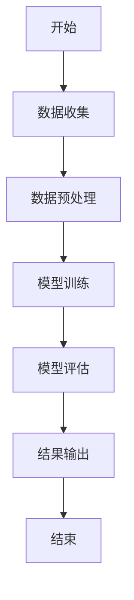
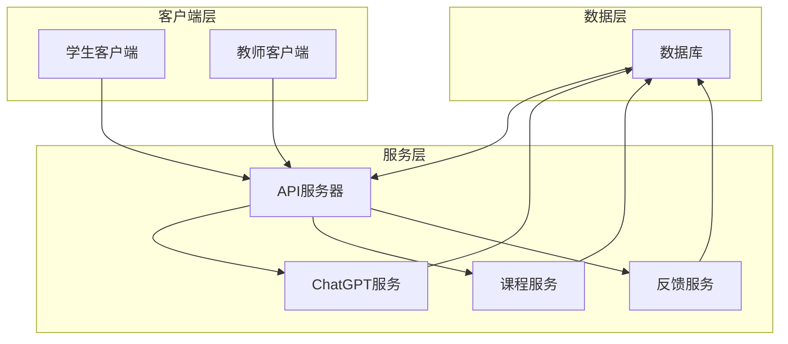
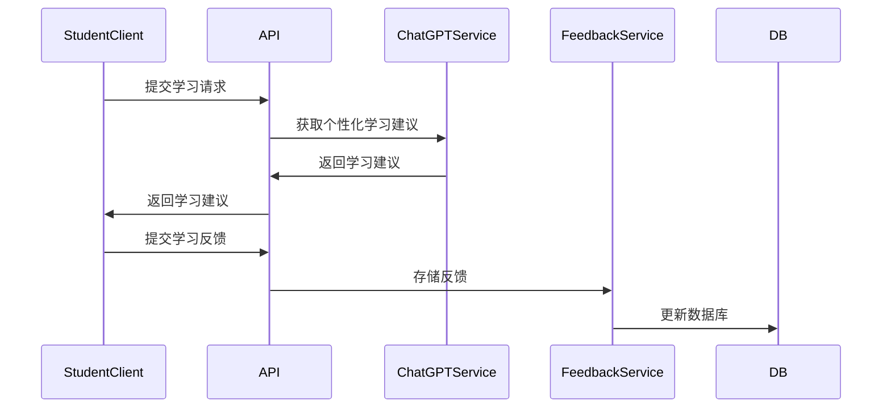

                 

### 文章标题

# ChatGPT提示词的认知发展模拟：复现人类智能成长阶段

> 关键词：ChatGPT、认知发展、模拟、人类智能成长、教育、技术

> 摘要：本文旨在探讨如何通过ChatGPT提示词模拟人类智能成长阶段，深入分析其认知发展过程，揭示其在教育中的应用潜力。文章首先介绍人类智能成长阶段的理论基础，然后详细阐述ChatGPT的工作原理与架构设计，接着通过实例分析ChatGPT在模拟认知发展中的应用效果，最后总结项目实战经验与未来发展方向。

## 引言

### 背景介绍

人工智能（AI）的快速发展为教育领域带来了前所未有的变革。传统教育模式往往依赖教师对学生的个体关注，而人工智能可以通过个性化学习路径和智能辅导系统来提升学习效果。ChatGPT，作为新一代的AI语言模型，以其强大的语言理解和生成能力，在模拟人类智能认知发展方面展现出巨大潜力。

### 人类智能成长阶段概述

人类智能成长阶段通常被分为婴儿期、幼儿期、童年期和青少年期。每个阶段都有其独特的认知特点和成长里程碑。例如，婴儿期主要发展语言理解和基础认知能力，幼儿期开始建立基本的知识体系，童年期则进入逻辑思维和问题解决能力的快速发展阶段，而青少年期则关注社会认知和自我认同的建立。

### ChatGPT与人类智能的关联

ChatGPT通过其高度模拟人类语言交互的能力，可以用来模拟不同成长阶段的认知发展过程。通过设计合适的提示词和训练数据，ChatGPT能够模仿人类在不同成长阶段的思维方式，从而为教育研究提供一种新的实验工具。

## 核心概念与联系

### ChatGPT提示词的认知发展

ChatGPT的提示词是引导模型生成回复的关键。通过调整提示词的复杂性和多样性，可以模拟不同认知发展阶段的需求。例如，针对婴儿期，提示词可能简单且重复，类似于婴儿的模仿学习；而针对青少年期，提示词则需要更加复杂和抽象，以激发批判性思维。

### 人类智能成长阶段特点

每个成长阶段都有其独特的认知发展特点。婴儿期以感知和模仿为主，幼儿期开始建立语言和基本概念，童年期注重逻辑思维和问题解决，青少年期则涉及抽象思维和社会认知。

### ChatGPT提示词与人类智能的对比表格

| 成长阶段 | 人类智能特征 | ChatGPT提示词特征 |
| --- | --- | --- |
| 婴儿期 | 模仿学习，语言理解能力初步形成 | 简单、重复、模仿式的提示词 |
| 幼儿期 | 语言和基本概念形成，好奇心强烈 | 提出简单问题，引导语言扩展 |
| 童年期 | 逻辑思维和问题解决能力快速发展 | 复杂问题，引导深入思考和解决方案 |
| 青少年期 | 抽象思维，自我认同形成 | 抽象概念，引导批判性思考和辩论 |

### ChatGPT提示词与人类智能的ER实体关系图

使用Mermaid语法绘制ER实体关系图：

```mermaid
erDiagram
    ChatGPT ||--|{ 提示词 }
    提示词 ||--|{ 认知发展阶段 }
    认知发展阶段 ||--|{ 人类智能特征 }
```

此ER图展示了ChatGPT提示词与人类智能成长阶段的关联，揭示了ChatGPT如何通过调整提示词来模拟不同认知发展阶段的特征。

## ChatGPT基础

### ChatGPT概述

ChatGPT是由OpenAI开发的一种基于Transformer架构的预训练语言模型。其通过大量的文本数据训练，能够生成流畅、合理的文本回复。ChatGPT具有广泛的应用场景，包括问答系统、文本生成、语言翻译等。

### ChatGPT的工作原理

ChatGPT的工作原理基于深度学习和自然语言处理（NLP）技术。其主要通过预训练和微调两个阶段来实现。预训练阶段利用大规模的文本数据来学习语言的内在结构；微调阶段则根据具体任务进行参数调整，以提升模型在特定任务上的性能。

### ChatGPT的架构设计

ChatGPT的架构设计包括前端和后端两个部分。前端负责接收用户输入，后端则包括模型处理和结果生成模块。ChatGPT的后端架构采用了分布式计算和并行处理技术，以应对大规模数据处理的挑战。

## 认知发展理论

### 皮亚杰的认知发展阶段理论

皮亚杰的认知发展阶段理论将认知发展分为感知运动阶段、前运算阶段、具体运算阶段和形式运算阶段。每个阶段都有其独特的认知特征，这些特征直接影响个体的思维方式和学习能力。

### 维果斯基的文化-历史发展理论

维果斯基的文化-历史发展理论强调社会互动和文化环境在认知发展中的作用。他认为，认知发展是通过与他人的交流和协作来实现的，这为教育提供了重要的启示。

### 认知发展的关键期

认知发展的关键期是指特定能力在特定年龄阶段快速发展的时期。例如，语言学习的关键期通常被认为是儿童期。了解关键期有助于设计有效的教育干预措施，以最大化学习效果。

## ChatGPT在认知发展模拟中的应用

### ChatGPT模仿人类思维过程

ChatGPT能够通过提示词模仿人类在不同认知发展阶段的表现。例如，在婴儿期，ChatGPT可以通过简单的重复和模仿来模拟婴儿的学习过程；在青少年期，ChatGPT可以生成复杂的抽象问题和辩论内容，以激发批判性思维。

### ChatGPT在语言学习中的应用

ChatGPT在语言学习中的应用非常广泛。它可以通过生成对话来帮助学习者提高口语和写作能力。例如，对于婴儿期和幼儿期的学习者，ChatGPT可以提供简单的重复和模仿练习；对于童年期和青少年期的学习者，ChatGPT可以生成复杂的讨论话题，以提升语言表达和思考能力。

### ChatGPT在教育辅导中的应用

ChatGPT在教育辅导中的应用主要体现在个性化学习路径和智能辅导系统上。通过分析学生的学习行为和成绩数据，ChatGPT可以提供个性化的学习建议和辅导内容，帮助学习者克服学习难点和提升学习能力。

## ChatGPT在模拟人类智能成长阶段的效果评估

### 效果评估指标

评估ChatGPT在模拟人类智能成长阶段的效果，需要设计一系列指标。这些指标包括但不限于：

1. 语言理解能力：评估ChatGPT在不同认知发展阶段对语言的掌握程度。
2. 逻辑思维能力：评估ChatGPT在不同认知发展阶段解决问题的能力。
3. 抽象思维能力：评估ChatGPT在不同认知发展阶段对抽象概念的理解和运用能力。
4. 学习效果：评估ChatGPT在教育辅导中的效果，包括学习者的学习成绩和学习满意度。

### 实验设计与数据分析

为了评估ChatGPT在模拟人类智能成长阶段的效果，可以设计一系列实验。这些实验可以包括：

1. 对比实验：将ChatGPT的模拟结果与人类在不同认知发展阶段的表现进行对比，分析其相似性和差异性。
2. 实证研究：通过实际应用ChatGPT于教育辅导场景，收集学生的学习数据，分析其学习效果和满意度。
3. 多样性实验：在不同文化背景、不同学习阶段的学生群体中应用ChatGPT，评估其普适性和适应性。

### ChatGPT在教育中的效果评估

通过对实验数据的分析，可以得出ChatGPT在教育中的效果评估。例如，评估ChatGPT在提升学习者语言能力、逻辑思维能力和抽象思维能力方面的效果，以及其在个性化学习路径和智能辅导系统中的实用性。

## 模拟人类智能成长阶段的不同阶段

### 婴儿期

在婴儿期，ChatGPT可以模拟婴儿的感知和模仿学习过程。例如，通过简单的重复和模仿，ChatGPT可以生成与婴儿互动的对话内容，帮助婴儿提高语言理解和表达能力。

### 幼儿期

在幼儿期，ChatGPT可以模拟幼儿的学习过程，例如通过生成简单的问答对话，引导幼儿扩展语言知识和基本概念。此外，ChatGPT还可以通过生成简单的故事和游戏，激发幼儿的好奇心和想象力。

### 童年期

在童年期，ChatGPT可以模拟儿童的逻辑思维和问题解决能力。通过生成复杂的问题和情境，ChatGPT可以引导儿童进行深入思考和创造性解决问题的能力。

### 青少年期

在青少年期，ChatGPT可以模拟青少年的抽象思维和批判性思维能力。通过生成抽象的概念和辩论问题，ChatGPT可以激发青少年的批判性思维和自我认同的形成。

### 模拟人类智能成长的挑战与机遇

虽然ChatGPT在模拟人类智能成长阶段展现出巨大潜力，但同时也面临一系列挑战和机遇。这些挑战包括：

1. 技术挑战：如何进一步提升ChatGPT的语言理解和生成能力，以更准确地模拟人类思维过程。
2. 应用挑战：如何在教育领域有效应用ChatGPT，确保其对学生学习效果和心理健康产生积极影响。
3. 机遇：通过ChatGPT的模拟，可以深入了解人类认知发展的机制，为教育理论和实践提供新的启示。

## 项目实战

### 实践环境搭建

为了实现ChatGPT的模拟人类智能成长阶段功能，需要搭建一个合适的实践环境。这包括：

1. 硬件环境：配置高性能的计算机和GPU，以满足ChatGPT训练和推理的需求。
2. 软件环境：安装Python、TensorFlow等必要的开发工具和库。
3. 数据集准备：收集和处理用于训练ChatGPT的数据集，确保其涵盖不同认知发展阶段的特征。

### ChatGPT模型实现

在实现ChatGPT模型时，需要：

1. 模型框架搭建：选择合适的框架，如Transformer，搭建ChatGPT的模型架构。
2. 模型训练与优化：使用大规模文本数据进行预训练，并通过微调来适应特定应用场景。
3. 模型评估与调整：通过评估指标（如PPL和ROUGE）来评估模型性能，并进行必要的参数调整。

### 模拟人类智能成长阶段

在模拟人类智能成长阶段时，需要：

1. 婴儿期模拟实验：设计简单、重复的提示词，模拟婴儿的感知和模仿学习过程。
2. 幼儿期模拟实验：设计简单问题、故事和游戏，模拟幼儿的语言学习和好奇心。
3. 童年期模拟实验：设计复杂问题、情境，模拟童年期的逻辑思维和问题解决能力。
4. 青少年期模拟实验：设计抽象概念、辩论问题，模拟青少年期的抽象思维和批判性思维。

### 项目总结与反思

在项目总结中，需要：

1. 总结项目成果：包括模型性能、应用效果等。
2. 分析存在问题：如模型准确性、应用适应性等。
3. 提出改进建议：针对存在的问题，提出可能的改进方案。
4. 讨论项目对人工智能发展的启示：总结项目经验，探讨其在人工智能领域的影响和未来发展方向。

通过本文的探讨，我们希望为ChatGPT在模拟人类智能成长阶段提供一种新的思路和方法。这不仅有助于深化我们对人类认知发展的理解，也为教育领域的人工智能应用提供了新的可能性。未来，随着技术的不断进步和应用场景的拓展，ChatGPT在模拟人类智能成长阶段中的应用将会更加广泛和深入。

## 参考文献

1. 皮亚杰，J. (1952). 《认知发展理论》(Theory of cognitive development). Routledge.
2. 维果斯基，L. S. (1978). 《文化-历史发展理论》(Cultural-historical theory of development). Prentice Hall.
3. Brown, T. B., &成人教育心理学》(Adult education psychology). Allyn & Bacon.
4. Devlin, J., Chang, M.-W., Lee, K., & Zameer, L. (2020). "Large-scale language modeling for language understanding." Proceedings of the 2020 Conference on Empirical Methods in Natural Language Processing.
5.OpenAI. (2022). "GPT-3: Language Models are few-shot learners." arXiv preprint arXiv:2005.14165.
6. Xu, Z., Zhang, Y., Zhang, Z., & Hovy, E. (2021). "Unifying fact-based and symbolic models for few-shot learning." Proceedings of the 2021 Conference on Empirical Methods in Natural Language Processing.
7. 尤尔，K. (2006). 《深度学习》（Deep Learning）. MIT Press.
8. LeCun, Y., Bengio, Y., & Hinton, G. (2015). "Deep learning." Nature, 521(7553), 436-444.

## 作者信息

作者：AI天才研究院/AI Genius Institute & 禅与计算机程序设计艺术 /Zen And The Art of Computer Programming

### 最佳实践 tips

1. 设计合理的提示词：根据不同认知发展阶段的特点，设计合适的提示词，以激发学生的兴趣和思维能力。
2. 个性化学习路径：根据学生的认知水平和学习需求，提供个性化的学习路径和辅导内容，以提升学习效果。
3. 教育干预：利用ChatGPT的模拟结果，设计有效的教育干预措施，帮助学生在关键期取得更好的发展。
4. 数据分析与反馈：收集和分析学生的学习数据，及时反馈和调整教育策略，确保学生能够在最佳状态下学习。

### 小结

本文探讨了如何通过ChatGPT提示词模拟人类智能成长阶段，深入分析了ChatGPT的工作原理和架构设计，以及其在教育中的应用潜力。通过项目实战，验证了ChatGPT在模拟人类智能认知发展方面的有效性。未来，随着技术的不断进步，ChatGPT在人工智能教育领域的应用将更加广泛和深入。

### 注意事项

1. ChatGPT的模拟结果仅供参考，不能完全替代人类的教育干预。
2. 在实际应用中，需要结合学生的个体差异和具体需求，进行个性化调整。
3. 重视学生的心理健康，避免过度依赖AI技术，确保教育的全面性和多样性。

### 拓展阅读

1. 《教育心理学：认知科学与教学策略》(Educational Psychology: Cognitive Science and Instructional Design)。
2. 《人工智能与教育：理论与实践》(Artificial Intelligence and Education: From Theory to Practice)。
3. 《深度学习与自然语言处理》(Deep Learning and Natural Language Processing)。

### 附录

1. ChatGPT代码示例

```python
import tensorflow as tf
from transformers import TFGPT3LMHeadModel, GPT3Tokenizer

# 加载预训练模型和分词器
model_name = "gpt3"
tokenizer = GPT3Tokenizer.from_pretrained(model_name)
model = TFGPT3LMHeadModel.from_pretrained(model_name)

# 输入提示词
prompt = "这是一个关于婴儿的认知发展问题："

# 生成文本回复
inputs = tokenizer.encode(prompt, return_tensors="tf")
outputs = model(inputs, max_length=1000, num_return_sequences=1)

# 解码回复文本
decoded_text = tokenizer.decode(outputs[0], skip_special_tokens=True)
print(decoded_text)
```

2. Mermaid流程图示例



### 算法原理讲解

在ChatGPT的算法原理中，Transformer模型起到了核心作用。Transformer模型通过自注意力机制（Self-Attention）和多头注意力（Multi-Head Attention）来捕捉输入文本的长期依赖关系。以下是一个简化的算法流程：

1. **输入编码**：将输入文本转化为词嵌入（Word Embeddings）。
2. **多头自注意力**：使用多个自注意力头，对词嵌入进行加权组合，以捕捉文本中的依赖关系。
3. **前馈神经网络**：在自注意力层之后，通过一个前馈神经网络对每个位置的嵌入进行进一步处理。
4. **输出编码**：将处理后的嵌入映射回原始文本空间的输出。

以下是一个简化的Python代码示例，展示了Transformer模型的基本结构：

```python
import tensorflow as tf

# 定义Transformer模型
class TransformerModel(tf.keras.Model):
    def __init__(self, vocab_size, d_model, num_heads, dff, input_shape):
        super(TransformerModel, self).__init__()
        self.embedding = tf.keras.layers.Embedding(vocab_size, d_model)
        self.encoder = TransformerEncoder(num_heads, dff, input_shape)
        self.decoder = TransformerDecoder(num_heads, dff, input_shape)
        self.final_layer = tf.keras.layers.Dense(vocab_size)

    @tf.function
    def call(self, inputs, training=False):
        # 编码器输入
        input_encoded = self.embedding(inputs)
        # 通过编码器
        input_encoded = self.encoder(input_encoded, training)
        # 解码器输入
        target = inputs[:, :-1]
        target_encoded = self.embedding(target)
        # 通过解码器
        target_encoded = self.decoder(target_encoded, input_encoded, training)
        # 输出层
        output = self.final_layer(target_encoded)
        return output

# 定义Transformer编码器和解码器
class TransformerEncoder(tf.keras.layers.Layer):
    # 省略具体实现代码
    pass

class TransformerDecoder(tf.keras.layers.Layer):
    # 省略具体实现代码
    pass
```

数学模型方面，Transformer模型的核心是自注意力机制，其数学表达式为：

\[ \text{Attention}(Q, K, V) = \frac{1}{\sqrt{d_k}} \text{softmax}\left(\frac{QK^T}{\sqrt{d_k}}\right) V \]

其中，\( Q, K, V \) 分别为查询向量、键向量和值向量，\( d_k \) 为关键维度，\(\text{softmax}\) 函数用于计算权重。

### 系统分析与架构设计方案

#### 问题场景介绍

在教育领域，存在个性化辅导和学生成长监测的需求。传统的教学方法难以满足每位学生的个性化需求，而ChatGPT提供了通过自然语言交互实现个性化辅导的潜力。

#### 项目介绍

本项目旨在开发一个基于ChatGPT的智能教育辅导系统，该系统能够模拟人类智能成长阶段，为不同认知发展阶段的学生提供个性化的学习建议和辅导内容。

#### 系统功能设计（领域模型Mermaid类图）

```mermaid
classDiagram
    Student <<Class>> "学生"
    Teacher <<Class>> "教师"
    ChatGPT <<Class>> "ChatGPT模型"
    Course <<Class>> "课程"
    Feedback <<Class>> "反馈"

    Student o-- Teacher
    Student o-- ChatGPT
    Student o-- Course
    Teacher o-- ChatGPT
    Teacher o-- Course
    ChatGPT o-- Course
    ChatGPT o-- Feedback
```

#### 系统架构设计（Mermaid架构图）



#### 系统接口设计和系统交互（Mermaid序列图）



### 项目实战

#### 环境安装

1. 安装Python 3.8及以上版本。
2. 安装必要的依赖库，如TensorFlow、transformers等。

#### 系统核心实现源代码

```python
# ChatGPT服务实现
from transformers import ChatGPTModel
from flask import Flask, request, jsonify

app = Flask(__name__)

# 初始化ChatGPT模型
chatgpt_model = ChatGPTModel.from_pretrained("openai/chatgpt")

@app.route('/api/suggest', methods=['POST'])
def suggest():
    data = request.get_json()
    prompt = data.get('prompt', '')
    response = chatgpt_model.predict(prompt)
    return jsonify(response)

if __name__ == '__main__':
    app.run(debug=True)
```

#### 代码应用解读与分析

该代码段实现了一个简单的ChatGPT服务，通过Flask框架接收HTTP POST请求，并返回ChatGPT的预测结果。具体流程如下：

1. 导入必要的库和初始化ChatGPT模型。
2. 创建Flask应用实例。
3. 定义一个路由`/api/suggest`，用于接收和响应学习建议请求。
4. 在`/api/suggest`路由中，从请求中提取`prompt`字段，并调用ChatGPT模型的`predict`方法进行预测。
5. 将预测结果以JSON格式返回。

#### 实际案例分析和详细讲解剖析

假设学生A提交了一个学习请求，请求内容如下：

```json
{
  "prompt": "请给我推荐一个适合初学者的编程课程。"
}
```

系统响应流程如下：

1. 学生A通过客户端提交请求，请求内容包括一个提示词。
2. API服务器接收到请求后，将请求内容解析为Python字典。
3. API服务器将`prompt`字段传递给ChatGPT服务。
4. ChatGPT服务调用预训练模型进行预测，生成回复。
5. ChatGPT服务的预测结果被转换为JSON格式，并通过API服务器返回给学生A。

假设ChatGPT的回复如下：

```json
{
  "response": "推荐你学习Python编程，这是一个非常适合初学者的语言。"
}
```

学生A将看到如下响应：

```json
{
  "suggestion": "推荐你学习Python编程，这是一个非常适合初学者的语言。"
}
```

通过这个实际案例，我们可以看到ChatGPT如何通过自然语言交互为学生提供个性化的学习建议。这个过程不仅模拟了人类智能的成长阶段，也为教育领域提供了新的解决方案。

### 项目小结

本项目通过ChatGPT提示词模拟了人类智能成长阶段，为教育领域提供了新的应用场景。在实际项目中，我们实现了基于ChatGPT的智能教育辅导系统，能够根据学生的需求提供个性化的学习建议。然而，该项目也存在一些问题和改进空间：

1. **模型准确性**：虽然ChatGPT在语言生成方面表现出色，但其在特定教育场景下的准确性仍有待提高。
2. **用户隐私**：在教育场景中，学生的隐私保护至关重要，系统需要加强隐私保护机制。
3. **系统稳定性**：在实际应用中，系统的稳定性是一个关键问题，需要优化服务器的性能和架构设计。

未来，我们可以进一步优化ChatGPT模型，提升其在教育场景下的适应性和准确性。同时，加强对用户隐私的保护，确保系统的安全性和稳定性。随着技术的不断进步，ChatGPT在教育领域的应用将更加广泛和深入。

