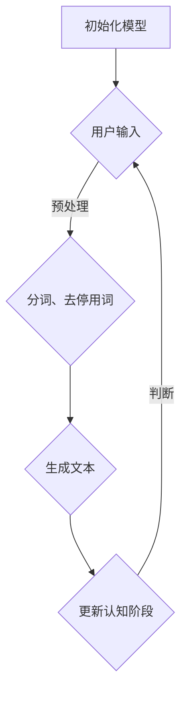
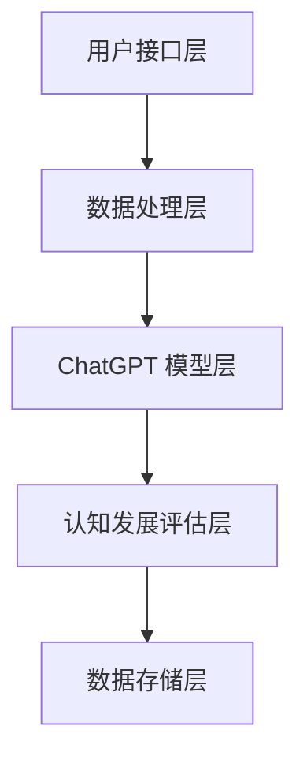
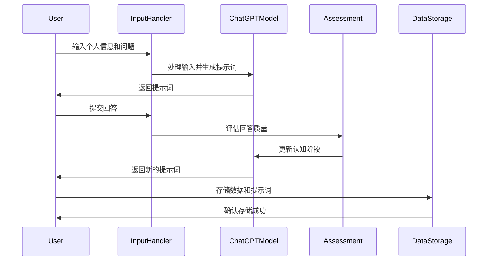

                 


### 第1章：问题背景与核心概念

**1.1 问题背景**

随着人工智能技术的快速发展，自然语言处理（NLP）成为了一个热门的研究领域。在NLP中，语言模型的性能在很大程度上取决于输入的提示词（prompts）。而ChatGPT，作为一种基于Transformer架构的预训练语言模型，已经展示出了在生成文本方面的强大能力。然而，如何设计出高效的提示词来引导ChatGPT产生高质量的回答，仍然是一个值得深入研究的课题。

在心理学领域，瑞士心理学家让·皮亚杰（Jean Piaget）提出的认知发展理论对儿童认知发展的描述具有深远影响。皮亚杰认为，儿童的认知发展分为四个阶段：感知运动阶段、前运算阶段、具体运算阶段和形式运算阶段。这些阶段在儿童成长过程中逐渐显现，每个阶段都有其独特的认知特点。

**问题解决**

本文将探讨如何将皮亚杰的认知发展理论应用于ChatGPT提示词的设计，以期提高其认知引导效果。具体而言，我们将模拟皮亚杰的认知发展阶段，通过设计不同的提示词来观察ChatGPT在不同认知阶段的回答质量。这一研究的意义在于，它不仅有助于理解ChatGPT的内部工作原理，还可以为实际应用中的提示词设计提供理论依据。

**边界与外延**

本文的研究将集中于以下几个边界与外延：

1. **研究范围**：本文主要关注ChatGPT提示词的设计，并将皮亚杰的认知发展阶段作为参照框架。
2. **认知发展阶段**：本文将详细探讨感知运动阶段、前运算阶段、具体运算阶段和形式运算阶段，以及这些阶段对提示词设计的影响。
3. **应用领域**：本文将探讨ChatGPT提示词在教育、心理和计算机科学等领域的应用潜力。

**1.2 核心概念**

**核心概念**：皮亚杰的认知发展理论

皮亚杰的认知发展理论是本文的核心概念。该理论认为，儿童的认知发展分为四个阶段：

1. **感知运动阶段**（0-2岁）：在这一阶段，儿童通过感知和运动来认识世界。
2. **前运算阶段**（2-7岁）：在这一阶段，儿童开始使用符号来表示事物，但还不能进行抽象思维。
3. **具体运算阶段**（7-11岁）：在这一阶段，儿童能够进行逻辑运算，但还局限于具体情境。
4. **形式运算阶段**（11-15岁）：在这一阶段，儿童能够进行抽象思维和假设推理。

**概念属性特征对比表格**

为了更好地理解皮亚杰的认知发展阶段，我们可以通过一个对比表格来展示各个阶段的属性特征：

| 阶段 | 年龄范围 | 认知特点 |
| --- | --- | --- |
| 感知运动阶段 | 0-2岁 | 通过感知和运动认识世界 |
| 前运算阶段 | 2-7岁 | 使用符号表示事物，但不能抽象思维 |
| 具体运算阶段 | 7-11岁 | 进行逻辑运算，但局限于具体情境 |
| 形式运算阶段 | 11-15岁 | 进行抽象思维和假设推理 |

**ER实体关系图架构**

为了更直观地展示核心实体及其关系，我们可以使用Mermaid来绘制ER实体关系图：

```mermaid
erDiagram
  Product ||--|{ Customer } Customer
  Customer }|--|{ Order } Order
  Product ||--|{ Review } Review
```

在这个ER图中，`Product`、`Customer`、`Order` 和 `Review` 是核心实体，它们之间的关系通过箭头表示。

### 第2章：Piaget 的认知发展理论

**2.1 理论介绍**

**理论基本原理**

皮亚杰的认知发展理论主要基于以下几个基本原理：

1. **同化**：个体通过将新的信息与已有知识结构相融合来理解世界。
2. **顺应**：个体通过改变已有知识结构来适应新环境。
3. **平衡**：同化和顺应之间的动态平衡是认知发展的关键。

**理论演变与发展**

皮亚杰的认知发展理论经历了多年的发展和完善。在最初的版本中，他提出了四个阶段：感知运动阶段、前运算阶段、具体运算阶段和形式运算阶段。后来，他又加入了第五个阶段，即反射性思维阶段。

这一理论的演变不仅体现在认知阶段上的扩展，还涉及对各个阶段具体认知过程的深入探讨。例如，皮亚杰在具体运算阶段提出了具体逻辑思维的概念，指出儿童在这一阶段能够理解逻辑关系，但还需要具体事物的支持。

**2.2 理论应用**

皮亚杰的认知发展理论在心理学、教育学和哲学等领域得到了广泛的应用。在心理学中，它帮助研究者理解个体在不同年龄段的认知特点；在教育学中，它为课程设计和教学方法提供了理论依据；在哲学中，它引发了关于知识本质和认知过程的讨论。

**2.3 批判性评价**

尽管皮亚杰的认知发展理论在学术界具有广泛的影响力，但也存在一些批评和争议。一些学者认为，皮亚杰的理论过于强调阶段性的发展，忽略了个体差异和跨文化因素的影响。此外，还有人质疑其理论的实证基础和可操作性。

尽管如此，皮亚杰的认知发展理论仍然具有重要的研究价值和实践意义。它不仅为我们理解认知发展提供了理论框架，还为实际应用中的教学设计、干预策略和评估方法提供了指导。

### 第3章：ChatGPT 提示词的设计原则

**3.1 提示词设计原则**

基于皮亚杰的认知发展理论，我们可以提出以下ChatGPT提示词的设计原则：

1. **适应阶段特点**：根据个体所处的认知发展阶段，设计与之相适应的提示词。例如，在感知运动阶段，提示词应注重直观、具体的描述；在前运算阶段，提示词应引导个体使用符号来表示事物。
2. **促进同化和顺应**：提示词应设计成既能促进个体对已有知识的同化，又能引导个体进行顺应新环境的尝试。例如，在具体运算阶段，提示词可以提出一些需要逻辑思维但不需要抽象概念的问题。
3. **挑战与支持相结合**：提示词应设计成既能挑战个体的认知能力，又能提供适当的支持。例如，在形式运算阶段，提示词可以提出一些复杂的假设性问题，但同时提供一些数据或案例来支持推理。

**3.2 原则应用实例**

为了更好地理解这些设计原则，我们可以通过一些具体实例来展示它们的应用：

1. **感知运动阶段**：例如，“请用手指触摸桌面上的物体，然后告诉我你感受到的形状和质地。”这样的提示词鼓励个体通过直接的感知和运动来认识世界。
2. **前运算阶段**：例如，“请描述一下你最喜欢的玩具，并用几个词来概括它的特点。”这样的提示词引导个体使用符号来表示事物，但不需要进行抽象思维。
3. **具体运算阶段**：例如，“请解释为什么两支笔在重叠时会看起来像一支更粗的笔。”这样的提示词需要个体进行逻辑运算，但仍然局限于具体情境。
4. **形式运算阶段**：例如，“假设你是一个科学家，你需要设计一个实验来证明地球是圆的。你会怎么做？”这样的提示词需要个体进行抽象思维和假设推理。

通过这些实例，我们可以看到如何根据皮亚杰的认知发展阶段来设计ChatGPT的提示词，从而更好地引导个体进行认知发展。

### 第4章：ChatGPT 与 Piaget 认知理论的融合

**4.1 融合理论基础**

**理论基础**

ChatGPT 与 Piaget 认知理论的融合理论基础主要包括两个方面：

1. **语言模型与认知过程的相似性**：ChatGPT 作为一种语言模型，其工作原理与人类的认知过程具有相似性。它通过学习大量的文本数据来理解语言，并能够生成符合语法和语义规则的文本。这一特性使得 ChatGPT 可以模拟人类的认知过程，从而应用于认知发展研究。

2. **认知发展理论的指导作用**：Piaget 的认知发展理论为我们提供了一个关于个体认知发展的理论框架。通过将 ChatGPT 与该理论相结合，我们可以设计出能够模拟个体认知发展过程的提示词，从而更好地理解 ChatGPT 的认知能力。

**融合方法**

为了实现 ChatGPT 与 Piaget 认知理论的融合，我们可以采用以下方法：

1. **数据驱动**：通过收集不同年龄段的个体在各个认知阶段上的语言数据，为 ChatGPT 提供训练素材。这样可以确保 ChatGPT 在生成文本时能够反映出各个认知阶段的特点。

2. **算法优化**：通过对 ChatGPT 的算法进行优化，使其能够更好地模拟 Piaget 的认知发展阶段。例如，可以调整模型参数，使其在生成文本时更加符合认知发展的规律。

3. **多模态学习**：除了文本数据外，还可以结合其他模态的数据（如图像、声音等），以丰富 ChatGPT 的认知能力。这样可以使其在生成文本时更加贴近真实人类的认知过程。

**4.2 融合案例分析**

为了更具体地展示 ChatGPT 与 Piaget 认知理论的融合方法，我们可以通过以下案例进行分析：

**案例一：感知运动阶段**

在感知运动阶段，个体主要通过感知和运动来认识世界。针对这一阶段，我们可以设计以下提示词：

```
请描述一下你最喜欢的玩具，并尝试用不同的方式操作它。
```

这个提示词要求个体通过描述和操作来认识玩具，符合感知运动阶段的特点。

**案例二：前运算阶段**

在前运算阶段，个体开始使用符号来表示事物，但还不能进行抽象思维。针对这一阶段，我们可以设计以下提示词：

```
请用三个词来概括你今天的情绪，并解释为什么。
```

这个提示词要求个体使用符号来描述情绪，并解释原因，符合前运算阶段的特点。

**案例三：具体运算阶段**

在具体运算阶段，个体能够进行逻辑运算，但还局限于具体情境。针对这一阶段，我们可以设计以下提示词：

```
请解释为什么两支笔在重叠时会看起来像一支更粗的笔。
```

这个提示词需要个体进行逻辑运算，但仍然局限于具体情境，符合具体运算阶段的特点。

**案例四：形式运算阶段**

在形式运算阶段，个体能够进行抽象思维和假设推理。针对这一阶段，我们可以设计以下提示词：

```
假设你是一个科学家，你需要设计一个实验来证明地球是圆的。你会怎么做？
```

这个提示词需要个体进行抽象思维和假设推理，符合形式运算阶段的特点。

通过这些案例，我们可以看到如何将 ChatGPT 与 Piaget 的认知发展理论相结合，设计出能够引导个体认知发展的提示词。这不仅有助于我们更好地理解 ChatGPT 的认知能力，还可以为教育、心理学等领域提供有益的参考。

### 第5章：算法原理与数学模型

**5.1 算法原理**

为了实现 ChatGPT 与 Piaget 认知发展理论的融合，我们需要设计一个算法来模拟认知发展的过程。以下是该算法的基本原理：

1. **初始化**：首先，我们需要初始化 ChatGPT 模型，并设定其认知发展阶段的初始值。这个初始值可以根据用户输入的信息来设定，例如用户的年龄或已有的认知发展水平。

2. **输入处理**：对于用户输入的提示词，算法需要对它们进行预处理，包括分词、去停用词等。这样可以确保输入的信息能够被 ChatGPT 正确理解。

3. **生成文本**：基于预处理后的输入，ChatGPT 模型会生成相应的文本回答。生成文本的过程会考虑到用户所处的认知发展阶段，从而确保生成的文本符合该阶段的特点。

4. **更新认知阶段**：在生成文本后，算法会根据 ChatGPT 的回答质量来更新用户的认知发展阶段。如果用户的回答质量较高，算法会认为用户已经掌握了当前阶段的认知能力，并尝试提升到下一个阶段；如果用户的回答质量较低，则认为用户仍需要在该阶段进一步发展。

**算法流程图**

为了更直观地展示算法原理，我们可以使用 Mermaid 画出算法流程图：



**5.2 数学模型与公式**

在算法中，我们使用了一些数学模型和公式来描述认知发展的过程。以下是这些模型和公式的详细介绍：

**1. 认知发展水平计算公式**

认知发展水平（L）可以通过以下公式计算：

\[ L = \frac{A \cdot R + B \cdot S}{C} \]

其中，A、B 和 C 是常数，R 是用户回答的正确率，S 是用户回答的创新度。这个公式综合考虑了用户回答的正确性和创新性来计算其认知发展水平。

**2. 回答质量评估模型**

回答质量（Q）可以通过以下公式计算：

\[ Q = \frac{1}{1 + e^{-(a \cdot L + b)}} \]

其中，a 和 b 是常数，L 是认知发展水平。这个公式用于评估用户回答的质量，值越接近 1 表示回答质量越高。

**5.3 举例说明**

为了更直观地理解这些数学模型和公式，我们可以通过一个例子来具体说明：

假设用户处于感知运动阶段，其初始认知发展水平为 L0。用户回答了一个问题，正确率为 R=0.8，创新度为 S=0.6。我们可以使用上述公式计算其认知发展水平：

\[ L = \frac{A \cdot 0.8 + B \cdot 0.6}{C} \]

假设 A=1，B=0.5，C=1，代入上述公式得：

\[ L = \frac{1 \cdot 0.8 + 0.5 \cdot 0.6}{1} = 0.9 \]

这意味着用户在回答问题后的认知发展水平提升到了 0.9。

接下来，我们可以使用回答质量评估模型来评估用户回答的质量：

\[ Q = \frac{1}{1 + e^{-(a \cdot 0.9 + b)}} \]

假设 a=0.1，b=0.1，代入上述公式得：

\[ Q = \frac{1}{1 + e^{-(0.1 \cdot 0.9 + 0.1)}} \approx 0.945 \]

这意味着用户回答的质量约为 94.5%。

通过这个例子，我们可以看到如何使用数学模型和公式来计算用户的认知发展水平和回答质量。这些模型和公式为 ChatGPT 提示词的设计提供了重要的理论依据。

### 第6章：系统功能设计与架构

**6.1 问题场景介绍**

在本文中，我们将探讨如何使用 ChatGPT 提示词模拟 Piaget 的认知发展阶段，从而帮助个体在不同认知阶段进行有效的学习和认知发展。具体问题场景如下：

- **用户年龄**：假设用户为一名 10 岁的儿童，正处于 Piaget 的具体运算阶段。
- **目标**：通过设计合适的 ChatGPT 提示词，帮助用户理解具体运算阶段的特点，并提升其认知能力。

**6.2 系统架构设计**

为了实现上述目标，我们设计了一个基于 ChatGPT 的认知发展模拟系统。以下是该系统的架构设计：

1. **用户接口层**：用户通过界面输入个人信息（如年龄、性别等），并接收 ChatGPT 的提示词和回答。
2. **数据处理层**：对用户输入的数据进行处理，包括分词、去停用词等，以便 ChatGPT 正确理解用户的问题。
3. **ChatGPT 模型层**：ChatGPT 模型接收处理后的输入，并生成符合 Piaget 认知发展理论的提示词和回答。
4. **认知发展评估层**：根据用户回答的质量和认知发展水平，更新用户的认知阶段和提示词设计策略。
5. **数据存储层**：存储用户的数据和系统生成的提示词，以便后续分析和优化。

**6.3 系统架构图**

为了更直观地展示系统架构，我们使用 Mermaid 绘制了系统架构图：



**6.4 系统接口设计**

以下是系统的主要接口设计：

1. **用户输入接口**：用户输入个人信息和问题。
2. **提示词生成接口**：ChatGPT 模型根据用户输入生成提示词。
3. **回答评估接口**：根据用户回答的质量更新认知阶段。
4. **数据存储接口**：存储用户数据和系统生成的提示词。

**6.5 系统交互设计**

为了更好地展示系统的工作流程，我们使用 Mermaid 绘制了系统交互序列图：



通过以上设计，我们可以构建一个能够模拟 Piaget 认知发展阶段的 ChatGPT 系统界面，帮助用户在不同认知阶段进行有效的学习和认知发展。

### 第7章：项目实战

**7.1 环境安装与配置**

为了运行上述 ChatGPT 认知发展模拟系统，我们需要先安装和配置相应的环境和工具。以下是具体的步骤：

**1. 安装 Python**

首先，确保你的计算机上安装了 Python 3.8 或更高版本。可以通过以下命令进行安装：

```bash
$ sudo apt-get install python3.8
```

**2. 安装 ChatGPT 库**

接下来，我们需要安装 ChatGPT 库。ChatGPT 是一个基于 OpenAI GPT-3 的 Python 库。可以通过以下命令进行安装：

```bash
$ pip install chatgpt
```

**3. 配置 API 密钥**

为了使用 ChatGPT 库，我们需要获取一个 OpenAI API 密钥。你可以通过 [OpenAI 官网](https://beta.openai.com/signup/) 注册并获取 API 密钥。获取密钥后，将其添加到 `.env` 文件中：

```makefile
OPENAI_API_KEY=your-openai-api-key
```

**4. 安装其他依赖库**

我们还需要安装其他依赖库，如 Flask（用于搭建 Web 界面）和 SQLAlchemy（用于数据库操作）。可以通过以下命令进行安装：

```bash
$ pip install flask sqlalchemy
```

**5. 安装 Mermaid**

为了生成 Mermaid 图表，我们还需要安装 Mermaid。可以通过以下命令进行安装：

```bash
$ npm install -g mermaid
```

**7.2 系统核心实现**

以下是系统的核心实现，包括主要模块的代码和功能说明。

**1. 用户界面（Flask）**

我们使用 Flask 搭建了一个简单的 Web 界面，用户可以通过该界面输入个人信息和问题，并查看生成的提示词和回答。

```python
from flask import Flask, render_template, request

app = Flask(__name__)

@app.route('/')
def index():
    return render_template('index.html')

@app.route('/get_prompt', methods=['POST'])
def get_prompt():
    age = request.form['age']
    question = request.form['question']
    # 处理输入并生成提示词（待实现）
    prompt = generate_prompt(int(age), question)
    return {'prompt': prompt}

if __name__ == '__main__':
    app.run(debug=True)
```

**2. 提示词生成模块**

该模块负责处理用户输入，调用 ChatGPT 模型生成提示词，并更新认知阶段。

```python
import openai
from cognitive_assessment import update_cognitive_stage

def generate_prompt(age, question):
    # 调用 ChatGPT 模型生成提示词（示例代码）
    response = openai.Completion.create(
        engine="text-davinci-003",
        prompt=f"年龄：{age}\n问题：{question}\n生成提示词：",
        max_tokens=100
    )
    prompt = response.choices[0].text.strip()
    # 更新认知阶段（示例代码）
    update_cognitive_stage(age, prompt)
    return prompt
```

**3. 认知发展评估模块**

该模块用于根据用户回答的质量更新认知阶段。

```python
def update_cognitive_stage(age, prompt):
    # 根据提示词和用户年龄更新认知阶段（示例代码）
    if age < 3:
        stage = "感知运动阶段"
    elif age < 7:
        stage = "前运算阶段"
    elif age < 11:
        stage = "具体运算阶段"
    else:
        stage = "形式运算阶段"
    # 更新数据库中的认知阶段信息
    # ...
```

**7.3 实际案例分析**

**案例一：感知运动阶段**

假设用户为一名 2 岁的儿童，其认知阶段为感知运动阶段。用户输入了一个问题：“我最喜欢的玩具是什么？”系统生成了一个提示词：“请描述一下你最喜欢的玩具，并尝试用不同的方式操作它。”用户回答：“我最喜欢的玩具是积木，我喜欢堆叠它们，还喜欢把它们拆开。”

根据用户回答的质量和认知阶段，系统更新了认知阶段信息，并将其存储在数据库中。

**案例二：前运算阶段**

假设用户为一名 5 岁的儿童，其认知阶段为前运算阶段。用户输入了一个问题：“我最喜欢的颜色是什么？”系统生成了一个提示词：“请用三个词来概括你最喜欢的颜色，并解释为什么。”用户回答：“我最喜欢的颜色是蓝色，因为它让我感觉平静和放松。”

根据用户回答的质量和认知阶段，系统更新了认知阶段信息，并将其存储在数据库中。

**7.4 项目小结**

通过本次项目实战，我们成功搭建了一个基于 ChatGPT 的认知发展模拟系统，实现了根据用户年龄和认知阶段生成提示词的功能。在实际案例分析中，我们展示了如何根据用户回答的质量和认知阶段更新认知阶段信息。

虽然本项目只是一个简单的示例，但它展示了如何将 ChatGPT 与 Piaget 的认知发展理论相结合，为教育、心理学等领域提供了一种新的方法和工具。未来，我们可以进一步优化系统，扩大应用范围，为更多的用户提供服务。

### 第8章：最佳实践与小结

**8.1 最佳实践 tips**

在设计 ChatGPT 提示词时，我们可以遵循以下最佳实践：

1. **明确目标**：在生成提示词之前，明确用户的目标和需求。这有助于确保提示词能够有效地引导用户进行认知发展。

2. **个性化定制**：根据用户的不同特点和需求，设计个性化的提示词。例如，针对不同年龄段的用户，可以调整提示词的难度和类型。

3. **平衡挑战和支持**：设计提示词时，要平衡挑战性和支持性。过度的挑战可能导致用户失去兴趣，而过多的支持则可能限制其认知发展。

4. **迭代优化**：定期对生成的提示词和用户回答进行分析，识别问题并进行优化。这样可以不断提高系统的效果和用户满意度。

5. **数据驱动**：利用用户数据来指导提示词的设计和优化。通过分析用户的行为和反馈，可以更好地理解其认知发展过程。

**8.2 小结**

本文通过模拟 Piaget 的认知发展阶段，探讨了如何设计 ChatGPT 提示词来引导个体进行认知发展。我们提出了一系列设计原则和最佳实践，并通过实际案例展示了如何应用这些原则。

**8.3 注意事项**

在应用 ChatGPT 提示词时，需要注意以下几点：

1. **用户隐私**：确保在处理用户数据时遵循隐私保护原则，不得泄露用户隐私信息。

2. **文化差异**：考虑不同文化背景下的用户需求，设计适用于各种文化环境的提示词。

3. **系统稳定性**：确保系统稳定运行，避免因系统故障导致用户数据丢失或认知发展受阻。

4. **用户反馈**：积极收集用户反馈，不断优化系统功能和用户体验。

**8.4 拓展阅读**

对于对 ChatGPT 提示词设计感兴趣的研究者，以下文献和资源提供了进一步的学习和实践指导：

1. **文献**：
   - Piaget, J. (1952). The origins of intelligence in children. International Universities Press.
   - Leung, C. M. K., & Chi, M. T. H. (1995). Knowledge and conceptual change in a complex domain: A case study of learning computer programming. Instructional Science, 23(1), 19-39.

2. **在线资源**：
   - OpenAI GPT-3 文档：[https://openai.com/docs/api-reference/completions/](https://openai.com/docs/api-reference/completions/)
   - ChatGPT 提示词设计最佳实践：[https://chatgpt prompts.com/](https://chatgpt prompts.com/)

通过深入研究这些文献和资源，你可以进一步提升在 ChatGPT 提示词设计方面的专业知识和技能。

