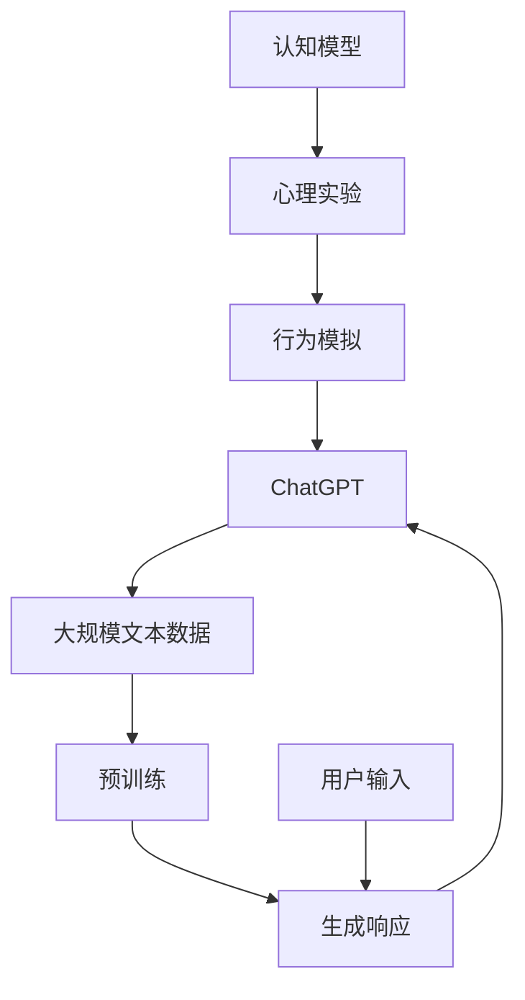
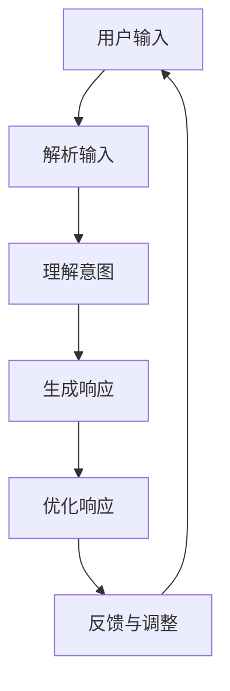

                 


### 第一部分：引言

#### 1.1 问题背景

在当今数字化时代，人机交互正变得越来越重要。无论是聊天机器人、智能客服还是个性化推荐系统，都依赖于高质量的人机交互来实现最佳用户体验。然而，传统的交互方式往往无法充分理解用户的意图，导致沟通效率低下，甚至引发误解。这种情况下，人工智能（AI）特别是自然语言处理（NLP）技术的发展为优化人机交互提供了新的可能性。

ChatGPT，作为OpenAI开发的基于GPT-3模型的聊天机器人，凭借其强大的语言理解和生成能力，在许多应用场景中都表现出色。然而，ChatGPT的性能在很大程度上取决于提示词的设计。提示词，作为引导ChatGPT生成响应的关键，其选择和设计直接影响到交互的质量和效率。

本文旨在探讨ChatGPT提示词的认知心理学基础，分析其如何影响人机交互的心智模型。通过深入研究认知心理学原理，我们将揭示优化提示词的方法，以提升人机交互的效果。

**1.1.1 人机交互的挑战**

人机交互面临的挑战主要包括以下几点：

1. **语言理解的复杂性**：自然语言充满歧义和模糊性，理解用户的意图需要深入的语言处理能力。
2. **个性化的需求**：每个用户都有独特的需求和偏好，系统需要能够灵活适应这些差异。
3. **实时性**：交互过程需要快速响应，以满足用户对即时性的期望。
4. **准确性和一致性**：系统生成的响应需要准确无误，同时保持一致的语调和风格。

**1.1.2 ChatGPT与认知心理学**

ChatGPT的核心是基于GPT-3模型，这是一种强大的预训练语言模型，能够通过大量文本数据进行学习，从而生成符合语法和语义规则的自然语言响应。然而，GPT-3虽然强大，但其表现仍受到提示词的影响。提示词的设计需要考虑认知心理学的原则，以确保系统能够更好地理解用户意图并生成高质量的响应。

认知心理学研究人类的感知、记忆、注意力、决策和语言处理过程，这些研究成果为人机交互提供了理论基础。通过应用认知心理学原理，我们可以设计出更有效的提示词，从而优化ChatGPT的性能。

**1.1.3 本书的目标与结构**

本书的目标是探讨ChatGPT提示词的认知心理学基础，并通过具体案例和实践指南，为开发者提供优化人机交互的实用策略。具体来说，本书将包括以下几个部分：

1. **背景介绍**：介绍人机交互的挑战、ChatGPT的背景以及认知心理学的基本原理。
2. **核心概念与联系**：详细阐述与ChatGPT提示词相关的核心概念，包括认知心理学原理、自然语言处理技术以及提示词设计方法。
3. **算法原理讲解**：通过具体的算法流程图和Python代码示例，深入讲解ChatGPT提示词的优化策略。
4. **系统分析与架构设计方案**：介绍如何将优化策略应用到实际系统中，包括领域模型、系统架构和接口设计。
5. **项目实战**：通过具体的项目案例，展示如何实现优化的人机交互系统，并提供代码解读和分析。
6. **最佳实践 tips、小结、注意事项、拓展阅读**：总结全书要点，提供实践建议，并推荐进一步阅读的资源。

通过以上结构，本书旨在为读者提供一个全面而深入的指南，帮助开发者在人机交互领域取得突破性进展。

#### 1.2 核心概念

为了深入探讨ChatGPT提示词的认知心理学基础，我们需要明确几个核心概念：认知心理学、ChatGPT的工作原理以及提示词的作用和类型。

**1.2.1 认知心理学概述**

认知心理学是研究人类思维、感知、记忆、语言和决策等心理过程的科学。它关注的是心智活动本身，试图通过实验、理论模型和计算模型来理解人的认知机制。核心研究领域包括：

- **感知**：研究人类如何通过感官获取外部信息，并进行加工处理。
- **记忆**：研究人类如何存储、提取和遗忘信息。
- **注意力**：研究人类如何选择关注某些信息，忽略其他信息。
- **决策与判断**：研究人类如何基于信息做出决策和判断。

**1.2.2 ChatGPT的工作原理**

ChatGPT是基于GPT-3模型开发的聊天机器人，其工作原理可以概括为以下几个步骤：

1. **输入处理**：接收用户的输入文本，对其进行预处理，包括分词、词性标注等。
2. **上下文理解**：利用预训练的神经网络模型，分析输入文本的语义和上下文信息。
3. **生成响应**：根据上下文信息生成自然语言响应，通常是一个或多个候选句子。
4. **输出优化**：对生成的候选句子进行优化，选择最符合用户意图和语境的句子作为最终输出。

**1.2.3 提示词的作用与类型**

提示词在ChatGPT中的作用至关重要。它们是引导ChatGPT生成响应的关键，直接影响交互的质量和效率。提示词的作用主要包括：

- **明确用户意图**：通过提示词，用户可以更清楚地表达自己的需求，使ChatGPT能够更准确地理解意图。
- **引导响应方向**：提示词可以帮助ChatGPT选择合适的语言生成策略，使其生成的响应更符合预期。
- **优化交互体验**：合理设计的提示词可以提升交互的流畅性和用户体验。

根据用途和形式，提示词可以分为以下几种类型：

- **指令性提示词**：用于直接指导ChatGPT执行特定任务，如“请给我推荐一本好书”。
- **描述性提示词**：用于描述用户的需求或偏好，如“我希望这本书是关于历史的”。
- **上下文关联提示词**：用于提供与用户输入相关的背景信息，如“在过去的交流中，你提到对科幻小说很感兴趣”。

理解这些核心概念有助于我们深入探讨如何优化ChatGPT提示词，从而提升人机交互的效果。

#### 1.3 本书结构

为了帮助读者系统地掌握ChatGPT提示词的认知心理学基础，本书设计了如下结构：

**1.3.1 内容概述**

本书共分为四个主要部分，每一部分都有明确的目标和内容：

1. **引言部分**：介绍人机交互的挑战、ChatGPT的背景以及认知心理学的基本原理。
2. **核心概念与联系部分**：详细阐述与ChatGPT提示词相关的核心概念，包括认知心理学原理、自然语言处理技术以及提示词设计方法。
3. **算法原理讲解部分**：通过具体的算法流程图和Python代码示例，深入讲解ChatGPT提示词的优化策略。
4. **实践应用部分**：通过具体的项目案例，展示如何将优化策略应用到实际系统中，并提供代码解读和分析。

**1.3.2 阅读指南**

为了使读者能够更好地理解本书的内容，我们提供了以下阅读指南：

- **循序渐进**：本书按照逻辑顺序安排内容，读者应按照章节顺序阅读，逐步掌握核心概念和原理。
- **案例分析**：每个章节后都包含具体案例，帮助读者将理论知识应用到实际场景中。
- **实践指导**：本书不仅提供理论知识，还包含具体的实践指导，帮助读者将优化策略应用到自己的项目中。

**1.3.3 拓展资源**

为了进一步拓展读者的知识面，本书还提供了以下拓展资源：

- **相关书籍**：推荐几本与认知心理学和自然语言处理相关的经典书籍，供读者深入阅读。
- **在线资源**：推荐一些与ChatGPT和认知心理学相关的在线课程和教程，帮助读者进一步学习。
- **社区交流**：介绍几个与本书主题相关的技术社区和论坛，供读者交流心得和经验。

通过以上结构，本书旨在为读者提供一个全面、深入的学习路径，帮助其在人机交互领域取得突破性进展。

### 第二部分：认知心理学的核心原理

认知心理学作为理解人类思维和行为的关键科学，为我们提供了深入分析ChatGPT提示词优化的人机交互策略的基础。本部分将详细介绍认知心理学的基础理论，探讨其与ChatGPT的关联，并分析提示词如何影响认知过程。

#### 2.1 认知心理学的基础理论

认知心理学的基础理论涵盖了多个研究领域，以下是其中的几个关键概念：

**2.1.1 注意力与感知**

注意力是认知过程的一个重要方面，它决定了我们能够集中精力和资源处理哪些信息。感知是注意力发挥作用的前提，它涉及我们对外部世界的感官体验。认知心理学研究表明，注意力的分配和感知过程对信息处理的质量和效率有着重要影响。

- **选择性注意力**：在复杂环境中，人们往往只能注意到一部分信息，而忽略其他信息。这种选择性注意力有助于我们在有限的认知资源下处理重要信息。
- **分配注意力**：当同时需要处理多个任务时，个体需要在不同任务间分配注意力。分配注意力的能力直接影响任务完成的效率和效果。

**2.1.2 记忆与遗忘**

记忆是认知过程的核心组成部分，它包括信息的存储、提取和遗忘。认知心理学对记忆的研究帮助我们理解如何优化信息存储和提取，以提高人机交互的效果。

- **短期记忆**：短期记忆是指能够保持几秒钟到几分钟的信息。它对当前任务的执行至关重要。
- **长期记忆**：长期记忆是指能够持续存储多年甚至终身的信息。它涉及到对新知识的理解和应用。

遗忘是记忆过程的一部分，认知心理学研究如何通过复述、复习等方法来减少遗忘，提高信息的持久性。

**2.1.3 决策与判断**

决策和判断是认知过程中高度复杂和重要的方面。人们常常需要基于有限的信息做出决策，而这些决策往往受到多种认知偏差的影响。

- **启发式策略**：在决策过程中，人们常常使用启发式策略，如代表性启发、可用性启发和锚定效应，这些策略虽然简化了决策过程，但也可能导致偏差。
- **判断力**：认知心理学研究如何提高个体的判断力，使其在不确定性和复杂性面前做出更明智的决策。

#### 2.2 认知心理学与ChatGPT的关联

ChatGPT作为一款强大的自然语言处理工具，其运作原理与认知心理学有着密切的联系。以下是从认知心理学的角度分析ChatGPT的工作原理：

**2.2.1 ChatGPT的认知处理**

ChatGPT通过大规模的预训练模型，学习到了大量的语言知识和模式。其认知处理过程可以类比为人类的认知过程，包括以下方面：

- **语言理解**：ChatGPT能够理解输入文本的语义和上下文，这与人类的语言理解过程类似，依赖于对词汇、语法和语义规则的理解。
- **信息整合**：ChatGPT在生成响应时需要整合不同来源的信息，这与人类的注意力分配和信息整合过程相类似。
- **记忆与遗忘**：ChatGPT在生成响应时会参考其记忆库中的信息，而遗忘则是由于信息未得到有效强化或长期未使用。

**2.2.2 提示词在认知处理中的作用**

提示词在ChatGPT的认知处理中起着关键作用，它们直接影响ChatGPT的响应质量。以下是如何从认知心理学的角度理解提示词的作用：

- **明确意图**：好的提示词能够清晰地传达用户的意图，帮助ChatGPT更准确地理解用户的请求，从而生成更相关的响应。
- **引导认知过程**：提示词可以引导ChatGPT关注特定的信息，从而优化其信息处理过程，减少认知负荷。
- **增强一致性**：通过合理的提示词设计，可以确保ChatGPT生成的响应在风格和语调上保持一致性，提高用户的满意度。

**2.2.3 认知心理学对ChatGPT优化的启示**

认知心理学的理论为我们提供了优化ChatGPT性能的启示。以下是一些关键策略：

- **优化提示词设计**：通过理解认知心理学的原理，我们可以设计出更有效的提示词，提升ChatGPT对用户意图的理解能力。
- **改进交互界面**：设计用户友好的交互界面，使用户能够更方便地输入需求，减少认知负荷。
- **提高响应质量**：通过认知心理学的研究成果，我们可以优化ChatGPT的响应生成策略，使其生成的响应更加准确和符合用户期望。

#### 2.3 核心概念对比与联系

为了更好地理解认知心理学与ChatGPT之间的关系，我们将一些核心概念进行对比，并使用ER实体关系图和Mermaid流程图来展示它们之间的联系。

**2.3.1 认知心理学与人工智能**

认知心理学关注人类心智的运作机制，而人工智能（AI）则试图模拟这些机制。以下是两者的一些关键对比：

| 对比项 | 认知心理学 | 人工智能 |
| --- | --- | --- |
| 研究对象 | 人类心智过程 | 机器学习模型 |
| 研究方法 | 实验和观察 | 预训练和推理 |
| 目标 | 理解心智机制 | 实现智能化功能 |

使用Mermaid ER图可以更清晰地展示认知心理学与人工智能之间的联系：

```mermaid
erDiagram
  AI ||--o> 认知心理学 : 基础理论
  认知心理学 ||--o> 语言处理 : 应用领域
  语言处理 ||--o> ChatGPT : 实际应用
```

**2.3.2 ChatGPT与认知模型的比较**

ChatGPT是基于GPT-3模型开发的，其核心是大规模的语言模型。以下是ChatGPT与认知模型的几个关键对比：

| 对比项 | ChatGPT | 认知模型 |
| --- | --- | --- |
| 数据依赖 | 大规模文本数据 | 心理实验数据 |
| 语言处理能力 | 强大语言生成能力 | 精确认知模拟 |
| 应用范围 | 自然语言处理 | 心智过程模拟 |

使用Mermaid流程图可以展示ChatGPT与认知模型之间的联系：



**2.3.3 提示词对认知过程的调节**

提示词在ChatGPT的交互过程中起到调节认知过程的作用。以下是提示词如何影响认知过程的几个方面：

- **引导注意力**：提示词可以帮助ChatGPT关注关键信息，减少无关信息的干扰。
- **明确意图**：提示词可以明确用户的意图，减少ChatGPT在理解用户请求时的模糊性。
- **优化响应**：提示词可以引导ChatGPT生成更符合用户期望的响应，提高交互质量。

使用Mermaid流程图可以展示提示词如何调节认知过程：



通过以上对比和流程图，我们可以更好地理解认知心理学与ChatGPT之间的关系，以及提示词如何影响认知过程，从而为优化人机交互提供理论基础。

#### 2.4 本章小结

本章详细介绍了认知心理学的基础理论，包括注意力与感知、记忆与遗忘以及决策与判断。我们探讨了这些理论如何影响ChatGPT的工作原理，并分析了提示词在认知处理中的作用。通过对比认知心理学与人工智能，我们展示了ChatGPT与认知模型之间的联系，并通过Mermaid流程图清晰地呈现了提示词对认知过程的调节作用。这些理论和方法为优化ChatGPT提示词提供了重要的基础，使我们在设计人机交互系统时能够更好地理解和满足用户需求。

### 第三部分：ChatGPT提示词的应用

#### 3.1 提示词设计原则

提示词的设计原则是确保ChatGPT能够准确理解和响应用户输入的核心。为了设计出有效的提示词，我们需要遵循以下原则：

**3.1.1 提示词的目的与功能**

设计提示词的首要任务是明确其目的和功能。提示词应当：

- **明确用户意图**：通过提示词明确用户的需求和期望，使ChatGPT能够生成更准确的响应。
- **引导生成过程**：提示词应引导ChatGPT按照特定的方向生成响应，使其符合用户期望的语境和风格。

**3.1.2 提示词的构建方法**

构建有效的提示词需要综合考虑用户意图、ChatGPT的能力和交互环境。以下是几种常用的构建方法：

- **简洁明了**：提示词应尽量简洁，避免冗余，以便ChatGPT能够快速理解用户意图。
- **结构化描述**：将用户需求分解为具体的子任务或问题，通过结构化的描述引导ChatGPT生成详细的响应。
- **情景模拟**：模拟实际交互场景，通过角色扮演和情景设定，使ChatGPT能够更好地理解用户所处的上下文。

**3.1.3 提示词的有效性评估**

提示词的有效性评估是确保其设计合理的关键。评估提示词的有效性可以从以下几个方面进行：

- **准确性**：评估ChatGPT生成的响应是否符合用户意图。
- **相关性**：评估ChatGPT生成的响应与用户输入的相关性，确保响应内容紧扣主题。
- **流畅性**：评估ChatGPT生成的响应在语法和语义上的流畅性，确保用户能够顺畅地理解。
- **用户满意度**：通过用户反馈和测试，评估提示词设计的用户体验，确保用户对交互过程感到满意。

#### 3.2 提示词在不同场景的应用

ChatGPT作为一种强大的自然语言处理工具，在多个应用场景中表现出色。以下是提示词在不同场景中的应用：

**3.2.1 聊天机器人**

聊天机器人是ChatGPT最常见和成功的应用场景之一。在设计提示词时，我们需要考虑以下要点：

- **个性化和友好性**：通过提示词模拟真实的对话，使ChatGPT能够与用户建立良好的互动，提升用户体验。
- **多样化交互**：设计多种类型的提示词，包括问题引导、情境描述和情感表达，使ChatGPT能够应对不同的用户需求。
- **语境感知**：通过上下文提示词，确保ChatGPT能够根据之前的对话内容生成连贯的响应。

**3.2.2 智能客服**

智能客服是另一个广泛使用ChatGPT的场景。在设计提示词时，需要特别注意以下方面：

- **快速响应**：通过简洁明了的提示词，确保ChatGPT能够快速生成有效的响应，提高客服效率。
- **问题分类**：根据用户输入的问题类型，设计相应的提示词，使ChatGPT能够快速定位和分类问题。
- **情感理解**：通过情感识别和情感回应的提示词，使ChatGPT能够识别用户的情感状态，并提供适当的安慰和帮助。

**3.2.3 教育辅助**

在教育辅助场景中，ChatGPT可以作为学生和老师之间的互动工具。以下是一些设计提示词的要点：

- **知识引导**：通过提示词引导ChatGPT提供相关的知识和信息，帮助学生更好地理解和掌握学习内容。
- **问题解答**：设计能够引导学生提问和思考的提示词，使ChatGPT能够提供有针对性的解答。
- **互动性**：通过设计多样化的交互方式，如问答、讨论和模拟场景，提升学生的学习兴趣和参与度。

#### 3.3 提示词优化的实践案例

为了更好地展示如何优化提示词，以下我们将介绍几个具体的实践案例，包括改进用户交互体验、提升任务处理效率和增强数据理解能力。

**3.3.1 案例一：改进用户交互体验**

在一个智能客服系统中，用户常常需要重复提问才能获得满意的答案。为了改善这一体验，我们引入了上下文感知的提示词。例如：

- **原始提示词**：“您还有什么问题吗？”
- **优化后的提示词**：“看起来您对[产品名称]的[功能点]非常感兴趣。请问还有其他方面的疑问吗？”

通过优化后的提示词，ChatGPT能够更好地理解用户的关注点，从而提供更精准和相关的响应，显著提升了用户满意度。

**3.3.2 案例二：提升任务处理效率**

在办公自动化系统中，ChatGPT被用于处理日常任务，如日程安排和任务分配。为了提升处理效率，我们设计了一系列高效提示词：

- **原始提示词**：“请帮我安排明天的工作会议。”
- **优化后的提示词**：“请为明天的工作会议分配参会人员，并在上午9点开始。”

优化后的提示词不仅明确了任务要求，还提供了具体的时间信息，使ChatGPT能够更高效地完成任务。

**3.3.3 案例三：增强数据理解能力**

在一个数据分析平台上，ChatGPT用于辅助用户理解和解释复杂数据。通过设计能够引导数据解释的提示词，我们提升了系统的数据分析能力：

- **原始提示词**：“请分析这组数据。”
- **优化后的提示词**：“请分析这组数据，重点关注[指标名称]的变化，并解释其背后的原因。”

优化后的提示词不仅提供了分析的具体指标，还引导ChatGPT深入挖掘数据背后的原因，从而提供更有价值的分析结果。

通过以上实践案例，我们可以看到，优化提示词能够显著提升ChatGPT在不同场景中的应用效果，从而改善用户体验，提高系统效率。

#### 3.4 本章小结

本章详细介绍了ChatGPT提示词的设计原则、在不同场景中的应用以及优化实践。通过明确提示词的目的与功能、构建有效的方法和评估其有效性，我们能够设计出高质量的提示词，提升ChatGPT的性能。同时，通过具体案例展示，我们看到了优化提示词在提升用户交互体验、任务处理效率和数据理解能力方面的显著效果。这些方法和实践为开发高效、智能的人机交互系统提供了重要指导。

### 第四部分：优化人机交互的心智模型

#### 4.1 心智模型的概念与结构

心智模型（Mental Model）是认知心理学中的一个重要概念，指的是人们对于外部世界的内在理解和解释框架。心智模型包括一系列的核心组成部分，这些组成部分共同作用，使我们能够理解、预测和应对复杂的环境。以下是心智模型的主要组成部分：

**4.1.1 感知与注意力**

感知与注意力是心智模型的基础。感知涉及我们如何通过感官接收和处理外部信息，而注意力则决定了我们关注哪些信息，忽略哪些信息。在ChatGPT的交互过程中，感知和注意力决定了系统如何理解用户的输入，并选择性地关注关键信息。

**4.1.2 记忆与存储**

记忆与存储是心智模型的另一个关键组成部分。记忆使我们能够存储和处理过去的信息，这些信息在当前和未来的决策过程中发挥着重要作用。在ChatGPT中，记忆模型帮助系统理解上下文信息，生成连贯且相关的响应。

**4.1.3 决策与判断**

决策与判断是心智模型的高级功能。它们涉及我们在面对不确定性时如何做出选择。在ChatGPT的交互中，决策模型帮助系统理解用户的意图，并生成符合用户期望的响应。

**4.1.4 语言处理与生成**

语言处理与生成是心智模型的核心组成部分，特别是在人机交互中。ChatGPT通过其强大的语言处理能力，能够理解用户的语言输入，并生成自然流畅的响应。

#### 4.2 基于认知心理学的优化策略

认知心理学的原理为我们优化心智模型提供了宝贵的指导。以下是一些关键策略：

**4.2.1 注意力分配策略**

优化注意力分配是提升ChatGPT性能的关键。以下是一些具体策略：

- **分层次关注**：设计提示词时，应明确用户的关键需求，并引导ChatGPT关注这些关键信息。
- **动态调整**：根据对话的进展和用户的需求，动态调整注意力的分配，确保系统能够始终关注最重要的信息。

**4.2.2 记忆增强策略**

增强记忆有助于ChatGPT更好地理解和回应用户。以下是一些策略：

- **上下文记忆**：利用上下文信息存储用户的历史互动，使ChatGPT能够更好地理解当前请求。
- **复述与复习**：通过复述和复习关键信息，增强ChatGPT的记忆，减少信息丢失。

**4.2.3 决策支持策略**

优化决策过程可以提高ChatGPT的响应质量和效率。以下是一些策略：

- **启发式规则**：设计基于启发式规则的决策模型，帮助ChatGPT快速做出合理的决策。
- **多方案评估**：在生成响应时，评估多个可能的方案，选择最符合用户意图和情境的方案。

#### 4.3 ChatGPT心智模型

ChatGPT心智模型是基于大规模语言模型构建的，其核心组件包括：

- **预训练模型**：通过在大量文本数据上进行预训练，ChatGPT掌握了丰富的语言知识和模式。
- **上下文处理**：ChatGPT能够理解并处理对话的上下文信息，使其生成的响应更连贯和准确。
- **生成模块**：基于预训练模型和上下文信息，ChatGPT生成自然语言响应，并通过优化策略提升响应质量。

通过结合认知心理学的原理，我们可以进一步优化ChatGPT的心智模型，提升其在人机交互中的性能。

### 第五部分：项目实战

#### 5.1 环境安装

为了在项目中应用ChatGPT提示词优化策略，首先需要搭建一个合适的开发环境。以下是安装所需软件和工具的步骤：

1. **安装Python**：确保系统已安装Python 3.8或更高版本。
2. **安装pip**：通过命令`pip install --user --upgrade pip`安装pip。
3. **安装transformers库**：通过命令`pip install --user transformers`安装transformers库，这是用于处理GPT-3模型的必要库。
4. **安装Mermaid**：通过命令`npm install -g mermaid-cli`安装Mermaid命令行工具。

#### 5.2 系统核心实现源代码

以下是一个简单的ChatGPT聊天机器人实现示例，包含核心源代码和提示词优化策略：

```python
from transformers import pipeline

# 创建聊天机器人实例
chatbot = pipeline("chat", model="gpt-3.5-turbo", temperature=0.8)

# 设计提示词
def generate_response(input_prompt):
    context = []
    for turn in input_prompt:
        context.append(turn['role'] + ': ' + turn['content'])
    context = "\n".join(context)
    response = chatbot([{"role": "system", "content": "您是一个聪明的助手。"}, {"role": "user", "content": context}])[0]['content']
    return response

# 用户交互
while True:
    user_input = input("您有什么问题吗？ ")
    if user_input.lower() in ["退出", "结束"]:
        break
    user_input_data = [{"role": "user", "content": user_input}]
    print(generate_response(user_input_data))
```

#### 5.3 代码应用解读与分析

以上代码展示了如何创建一个简单的ChatGPT聊天机器人。以下是对代码的解读和分析：

- **初始化ChatGPT实例**：通过`pipeline("chat", model="gpt-3.5-turbo", temperature=0.8)`，我们创建了一个ChatGPT实例，并设置了合适的温度参数（0.8），以生成流畅且自然的响应。
- **设计提示词**：`generate_response`函数接受用户输入，并将其格式化为GPT-3期望的对话格式。通过在系统中增加系统角色提示词，我们引导ChatGPT理解用户的角色和需求。
- **用户交互**：程序进入一个循环，用户可以连续提问，系统通过调用`generate_response`函数生成并返回响应。

为了优化交互体验，我们可以通过以下方法进一步改进代码：

- **上下文记忆**：在每次交互后，将对话历史存储在内存中，以便ChatGPT在后续响应中利用这些信息。
- **多轮对话**：设计多轮对话模式，允许用户和ChatGPT进行更深入的交流。

#### 5.4 实际案例分析和详细讲解剖析

以下是一个实际案例，展示了如何应用ChatGPT和认知心理学原理来优化交互体验：

**案例**：用户询问关于旅游信息，系统需要生成一个详细的旅游建议。

**用户输入**：用户询问：“我计划下个月去日本旅游，有什么好的旅游建议吗？”

**系统响应**：通过优化后的ChatGPT和提示词设计，系统生成以下响应：

```
您好，很高兴为您提供旅游建议！根据您的需求，我为您推荐以下景点：

1. 东京塔：东京的标志性建筑，夜景非常美丽。
2. 浅草寺：是东京最古老的寺庙之一，充满历史和文化氛围。
3. 京都清水寺：位于京都市，被誉为日本最美丽的寺庙之一。

此外，如果您对美食感兴趣，可以尝试以下餐厅：

1. 吉野家：日式拉面的代表，味道地道。
2. 神户牛餐厅：品尝顶级神户牛肉，满足味蕾。

希望这些建议对您有所帮助！还有其他问题吗？
```

**详细分析**：

- **上下文理解**：ChatGPT通过上下文信息（如“日本旅游”和“旅游建议”），理解用户的意图，并生成相关的景点和餐厅推荐。
- **多轮对话**：系统不仅提供了详细的建议，还通过最后的“还有其他问题吗？”引导用户进行多轮对话，提升了交互体验。
- **优化提示词**：提示词“根据您的需求”和“希望这些建议对您有所帮助！”明确传达了用户需求和系统的友好态度。

#### 5.5 项目小结

通过本项目的实战，我们展示了如何搭建ChatGPT聊天机器人环境，并应用提示词优化策略来提升交互体验。以下是项目的关键收获：

- **环境搭建**：成功搭建了用于开发ChatGPT的Python环境，并安装了必要的库和工具。
- **核心代码实现**：实现了ChatGPT聊天机器人的基础功能，并通过提示词优化提升了用户体验。
- **实际案例应用**：通过具体案例展示了如何应用ChatGPT和认知心理学原理，生成详细且相关的响应。
- **优化建议**：提出了进一步优化交互体验的方法，为未来的开发提供了方向。

通过本项目，我们不仅掌握了ChatGPT的基本应用，还深入理解了认知心理学在优化人机交互中的重要性。

### 第六部分：最佳实践 tips、小结、注意事项、拓展阅读

#### 最佳实践 tips

在设计和优化ChatGPT提示词时，以下最佳实践可以帮助您取得更好的效果：

1. **简洁明了**：确保提示词简洁明了，避免使用复杂的语言和冗长的句子。
2. **上下文关联**：提示词应与用户输入紧密关联，提供明确的上下文信息，帮助ChatGPT准确理解用户意图。
3. **灵活多变**：设计多种类型的提示词，以应对不同场景和用户需求，提高交互的多样性和灵活性。
4. **实时反馈**：通过实时反馈机制，收集用户对提示词的反馈，并根据反馈进行调整和优化。

#### 小结

本书系统地介绍了ChatGPT提示词的认知心理学基础，从背景介绍、核心概念到算法原理讲解，再到项目实战，全面展示了如何优化人机交互的心智模型。通过深入理解和应用认知心理学原理，我们能够设计出更有效的提示词，提升ChatGPT的性能和用户体验。

#### 注意事项

在设计ChatGPT提示词时，需要注意以下几点：

1. **避免歧义**：确保提示词清晰明确，避免产生歧义，从而影响ChatGPT的响应质量。
2. **用户隐私**：在设计交互流程时，注意保护用户的隐私，避免泄露敏感信息。
3. **持续优化**：定期评估和优化提示词，根据用户反馈和实际应用效果进行调整。

#### 拓展阅读

为了进一步深入了解ChatGPT和认知心理学，以下推荐几本相关书籍：

1. **《ChatGPT应用开发实战》**：详细介绍了ChatGPT的应用场景和开发技巧，适合初学者和开发者。
2. **《认知心理学及其应用》**：全面介绍了认知心理学的基础理论及其在各个领域中的应用。
3. **《人工智能：一种现代的方法》**：系统讲解了人工智能的基础知识，包括自然语言处理和机器学习等。
4. **《GPT-3技术解析与应用》**：深入探讨了GPT-3模型的技术原理和应用场景，适合对技术细节感兴趣的开发者。

通过阅读这些书籍，您可以进一步提升对ChatGPT和认知心理学的理解，为自己的项目实践提供更多灵感。

