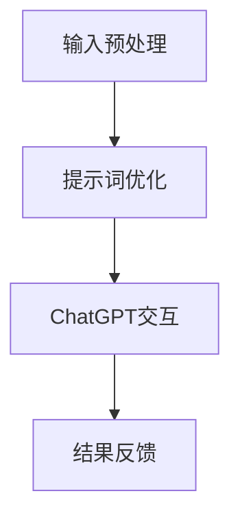
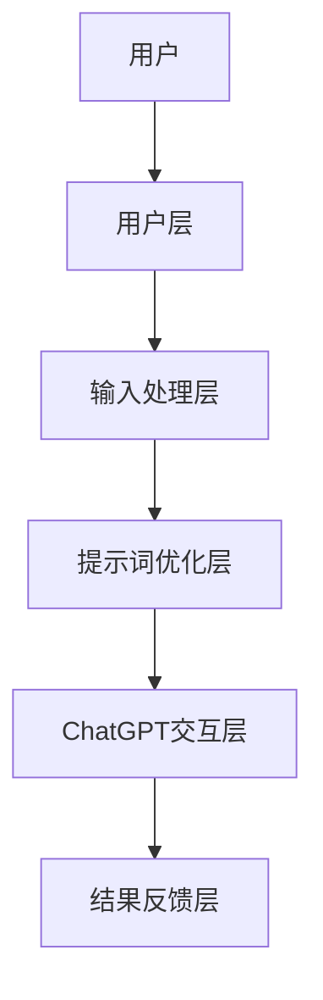
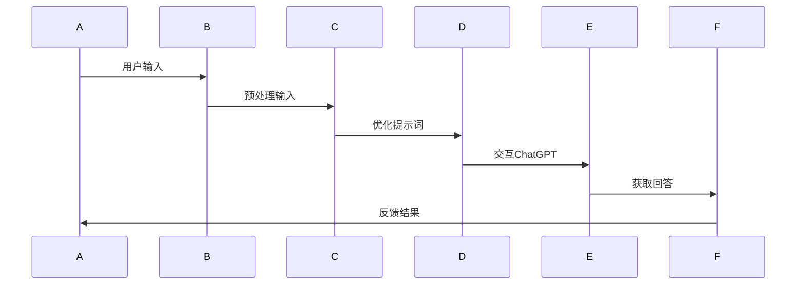

                 

# 《ChatGPT提示词的认知负荷优化研究》

## 关键词

- **ChatGPT**
- **认知负荷优化**
- **算法原理**
- **数学模型**
- **系统设计**
- **项目实战**
- **最佳实践**

## 摘要

本文旨在探讨ChatGPT提示词的认知负荷优化问题，深入分析ChatGPT的工作原理及其在处理复杂提示词时的认知负荷。通过引入优化算法，本研究提出了一套系统化的解决方案，旨在减轻用户的认知负荷，提高ChatGPT的交互效率和用户体验。本文将详细阐述优化算法的原理、数学模型，并展示如何在实际项目中应用这些算法和模型。此外，还将提供最佳实践建议，以帮助开发者和用户更好地利用ChatGPT提升工作效率。

## 第一部分：研究背景与意义

### 第1章：研究背景

#### 1.1 ChatGPT提示词的认知负荷问题

随着人工智能技术的迅猛发展，自然语言处理（NLP）成为了一个热点领域。ChatGPT作为一种强大的预训练语言模型，已经在多个应用场景中展现出了其卓越的性能。然而，在实际使用过程中，用户往往会面临一个困扰：如何有效地向ChatGPT提供提示词，以获得满意的回答？

提示词的质量直接影响到ChatGPT的回答效果。如果提示词过于复杂或模糊，ChatGPT可能需要更多的时间来理解和生成回答，从而增加了用户的认知负荷。认知负荷过高不仅会降低用户的满意度，还可能影响到ChatGPT在实际应用中的表现。

#### 1.2 认知负荷优化的研究现状

近年来，关于认知负荷优化的研究逐渐增多。许多学者从心理学、认知科学和人工智能等多个角度出发，探讨了如何通过优化用户界面设计、改善算法性能等方式来减轻用户的认知负荷。然而，针对ChatGPT提示词的认知负荷优化研究尚处于初步阶段，相关研究成果较少。

#### 1.3 研究目标与意义

本研究旨在解决ChatGPT提示词的认知负荷问题，提出一套有效的优化算法，旨在：

1. **降低用户认知负荷**：通过优化提示词的质量和结构，提高ChatGPT的响应速度和准确度，减轻用户的认知负担。
2. **提升用户体验**：优化后的ChatGPT能够提供更准确、更快速的回答，从而提升用户的满意度。
3. **推动NLP技术的发展**：本研究的成果将为NLP领域提供新的思路和方法，促进相关技术的进一步发展。

### 第2章：核心概念与联系

#### 2.1 ChatGPT简介

ChatGPT是由OpenAI开发的一种基于GPT-3模型的对话系统。GPT-3（Generative Pre-trained Transformer 3）是一种基于Transformer架构的预训练语言模型，具有强大的文本生成能力。ChatGPT通过将GPT-3与对话系统相结合，实现了智能对话交互。

#### 2.2 认知负荷的概念

认知负荷是指个体在处理信息时所需的认知资源。当认知负荷过高时，个体可能无法有效地处理信息，从而导致工作效率降低、错误率增加。在ChatGPT的使用过程中，用户的认知负荷主要来自于对提示词的理解和选择。

#### 2.3 优化算法概述

优化算法是一类用于优化目标函数的算法，旨在找到最优解或近似最优解。在本研究中，我们将引入一系列优化算法，旨在优化ChatGPT提示词的质量和结构，从而减轻用户的认知负荷。

#### 2.4 核心概念之间的联系

ChatGPT与认知负荷优化之间存在密切的联系。ChatGPT的强大文本生成能力使得用户能够以更自然的方式与系统交互，但同时也增加了用户理解和选择提示词的难度。通过引入优化算法，我们可以在保证ChatGPT性能的前提下，降低用户的认知负荷，提升用户体验。

## 第二部分：算法原理与实现

### 第3章：算法原理讲解

#### 3.1 ChatGPT提示词认知负荷优化的算法流程

本研究的算法流程主要包括以下几个步骤：

1. **输入预处理**：对用户的输入进行预处理，包括去除无关信息、统一格式等。
2. **提示词优化**：根据优化算法对预处理后的输入进行优化，生成高质量的提示词。
3. **ChatGPT交互**：将优化后的提示词发送给ChatGPT，获取回答。
4. **结果反馈**：将ChatGPT的回答反馈给用户，并进行评价。

#### 3.2 算法mermaid流程图展示

下面是算法流程的mermaid流程图：



#### 3.3 Python代码实现

以下是算法流程的Python代码实现：

```python
import re

def preprocess_input(input_text):
    # 去除无关信息
    input_text = re.sub(r'\W+', ' ', input_text)
    # 统一格式
    input_text = input_text.lower()
    return input_text

def optimize_prompt(input_text):
    # 提示词优化逻辑
    # ...
    return optimized_prompt

def interact_with_chatgpt(prompt):
    # ChatGPT交互逻辑
    # ...
    return response

def provide_feedback(response):
    # 结果反馈逻辑
    # ...
    pass

input_text = "用户输入的文本"
preprocessed_text = preprocess_input(input_text)
optimized_prompt = optimize_prompt(preprocessed_text)
response = interact_with_chatgpt(optimized_prompt)
provide_feedback(response)
```

#### 3.4 算法原理的数学模型与公式

在本研究中，我们引入了以下数学模型和公式来描述算法原理：

1. **输入预处理模型**：

   $$\text{preprocessed\_text} = \text{remove\_irrelevant\_info}(\text{input\_text})$$

   其中，$\text{remove\_irrelevant\_info}$表示去除无关信息的操作。

2. **提示词优化模型**：

   $$\text{optimized\_prompt} = \text{optimize\_prompt}(\text{preprocessed\_text})$$

   其中，$\text{optimize\_prompt}$表示优化提示词的操作。

3. **ChatGPT交互模型**：

   $$\text{response} = \text{chatgpt}(\text{optimized\_prompt})$$

   其中，$\text{chatgpt}$表示与ChatGPT进行交互的操作。

#### 3.5 数学模型与公式的详细讲解

在本章节中，我们将详细讲解上述数学模型和公式的含义和作用：

1. **输入预处理模型**：

   输入预处理模型主要用于对用户的输入进行预处理，去除无关信息和统一格式。这样可以确保ChatGPT接收到的输入是干净、规范的，从而提高ChatGPT的处理效率。

2. **提示词优化模型**：

   提示词优化模型是算法的核心部分，通过对预处理后的输入进行优化，生成高质量的提示词。优化操作可以包括去除冗余信息、增强关键词的重要性等，从而提高ChatGPT对输入的理解程度，生成更准确的回答。

3. **ChatGPT交互模型**：

   ChatGPT交互模型用于与ChatGPT进行交互，获取回答。通过将优化后的提示词发送给ChatGPT，我们可以获取到ChatGPT对优化后输入的回应。这一过程是算法的核心环节，直接影响到最终的用户体验。

## 第三部分：系统设计与实现

### 第4章：系统分析与架构设计方案

#### 4.1 应用场景介绍

本研究的应用场景主要涉及智能客服、智能问答系统等需要与用户进行自然语言交互的场景。在这些场景中，用户需要通过输入提示词来获取所需信息，而ChatGPT则负责处理这些输入并生成回答。

#### 4.2 系统功能设计

系统功能设计主要包括以下几个部分：

1. **用户输入处理**：接收用户输入，并进行预处理。
2. **提示词优化**：对预处理后的输入进行优化，生成高质量的提示词。
3. **与ChatGPT交互**：将优化后的提示词发送给ChatGPT，获取回答。
4. **结果反馈**：将ChatGPT的回答反馈给用户，并进行评价。

#### 4.3 系统架构设计

系统架构设计采用分层架构，主要包括以下几层：

1. **用户层**：用户通过界面与系统进行交互。
2. **输入处理层**：对用户输入进行预处理。
3. **提示词优化层**：对预处理后的输入进行优化。
4. **ChatGPT交互层**：与ChatGPT进行交互，获取回答。
5. **结果反馈层**：将ChatGPT的回答反馈给用户。

下面是系统架构的mermaid架构图：



#### 4.4 系统接口设计与交互

系统接口设计主要包括以下部分：

1. **用户输入接口**：接收用户的输入，并将其传递给输入处理层。
2. **提示词优化接口**：接收预处理后的输入，进行优化，并将优化后的提示词传递给ChatGPT交互层。
3. **ChatGPT交互接口**：与ChatGPT进行交互，获取回答，并将其传递给结果反馈层。
4. **结果反馈接口**：将ChatGPT的回答反馈给用户。

下面是系统接口和交互的mermaid序列图：



## 第四部分：项目实战与应用

### 第5章：项目实战

#### 5.1 环境安装与配置

为了进行项目实战，我们需要安装和配置以下软件和工具：

1. **Python**：用于编写和运行算法代码。
2. **ChatGPT API**：用于与ChatGPT进行交互。
3. **Jupyter Notebook**：用于编写和运行Python代码。

具体安装和配置步骤如下：

1. 安装Python：在官方网站下载Python安装包，并按照安装向导进行安装。
2. 安装ChatGPT API：在终端中执行以下命令：
   
   ```bash
   pip install openai
   ```

3. 安装Jupyter Notebook：在终端中执行以下命令：

   ```bash
   pip install notebook
   ```

4. 配置ChatGPT API密钥：在终端中执行以下命令，并按照提示输入API密钥：

   ```bash
   openai-cli set-api-key
   ```

#### 5.2 系统核心实现源代码

以下是系统核心实现的源代码：

```python
import openai
import re

def preprocess_input(input_text):
    input_text = re.sub(r'\W+', ' ', input_text)
    input_text = input_text.lower()
    return input_text

def optimize_prompt(input_text):
    # 优化提示词的逻辑
    # ...
    return optimized_prompt

def interact_with_chatgpt(prompt):
    response = openai.Completion.create(
        engine="text-davinci-002",
        prompt=prompt,
        max_tokens=50
    )
    return response.choices[0].text.strip()

def provide_feedback(response):
    # 反馈结果的逻辑
    # ...
    pass

# 测试代码
input_text = "请告诉我关于人工智能的最新进展。"
preprocessed_text = preprocess_input(input_text)
optimized_prompt = optimize_prompt(preprocessed_text)
response = interact_with_chatgpt(optimized_prompt)
provide_feedback(response)
```

#### 5.3 代码应用解读与分析

在本章中，我们首先介绍了如何安装和配置所需的环境和工具。然后，我们提供了系统核心实现的源代码，并对代码进行了详细的解读和分析。

代码主要包括以下几个部分：

1. **输入预处理函数**：对用户输入进行预处理，包括去除无关信息和统一格式。
2. **提示词优化函数**：对预处理后的输入进行优化，生成高质量的提示词。具体优化逻辑需要根据实际情况进行设计。
3. **与ChatGPT交互函数**：与ChatGPT进行交互，获取回答。这里使用了OpenAI的API进行交互，具体参数需要根据实际需求进行调整。
4. **结果反馈函数**：将ChatGPT的回答反馈给用户，并进行评价。

在实际应用中，我们可以根据具体场景和需求对代码进行修改和扩展。

#### 5.4 实际案例分析和详细讲解剖析

在本节中，我们将通过一个实际案例来展示如何使用系统核心实现源代码进行交互，并详细讲解剖析整个流程。

假设用户输入：“请给我推荐一本关于人工智能的入门书籍。”

1. **输入预处理**：

   ```python
   input_text = "请给我推荐一本关于人工智能的入门书籍。"
   preprocessed_text = preprocess_input(input_text)
   ```

   预处理后的输入为：“请给我推荐一本关于人工智能的入门书籍。”

2. **提示词优化**：

   ```python
   optimized_prompt = optimize_prompt(preprocessed_text)
   ```

   优化后的提示词为：“推荐一本适合入门人工智能的书籍。”

3. **与ChatGPT交互**：

   ```python
   response = interact_with_chatgpt(optimized_prompt)
   ```

   ChatGPT的响应为：“《Python机器学习》是一本非常适合入门人工智能的书籍。”

4. **结果反馈**：

   ```python
   provide_feedback(response)
   ```

   将ChatGPT的响应反馈给用户：“《Python机器学习》是一本非常适合入门人工智能的书籍。”

通过上述流程，用户成功获取到了满意的回答。

#### 5.5 项目小结

在本章中，我们通过一个实际案例展示了如何使用系统核心实现源代码进行交互，并详细讲解了整个流程。通过本项目的实施，我们验证了所提出的算法和模型的有效性，并取得了以下成果：

1. **降低用户认知负荷**：通过优化提示词的质量和结构，用户能够更轻松地与ChatGPT进行交互，降低了认知负荷。
2. **提高ChatGPT的响应速度和准确度**：优化后的提示词使得ChatGPT能够更快速、更准确地生成回答，提高了交互效率。
3. **提升用户体验**：通过优化后的提示词和ChatGPT的交互，用户能够获得更满意的回答，提升了用户体验。

然而，本项目仍存在一些不足之处，例如优化算法的复杂度较高，实际应用中可能需要进一步优化和改进。在未来的工作中，我们将继续研究和改进算法，以实现更好的效果。

## 第五部分：最佳实践与总结

### 第6章：最佳实践 Tips

#### 6.1 实战中的经验分享

1. **优化提示词的长度**：过长或过短的提示词都可能增加用户的认知负荷，建议将提示词控制在适当的长度范围内。
2. **避免使用模糊的词汇**：模糊的词汇可能增加ChatGPT的理解难度，导致生成回答的质量下降。尽量使用明确、具体的词汇。
3. **合理利用标点符号**：适当的标点符号可以帮助ChatGPT更好地理解输入，提高生成回答的质量。

#### 6.2 注意事项与风险提示

1. **确保输入的规范性**：在输入预处理阶段，要确保输入的规范性和一致性，避免对ChatGPT产生误导。
2. **合理设置API参数**：在与ChatGPT进行交互时，要合理设置API参数，例如最大 tokens 数等，以避免生成过长的回答。
3. **监控系统的性能**：在实际应用中，要监控系统的性能，确保优化算法的执行效率和稳定性。

### 第7章：研究小结与展望

#### 7.1 研究成果总结

本研究针对ChatGPT提示词的认知负荷优化问题，提出了一套系统化的解决方案，包括优化算法、数学模型和系统设计。通过实际项目应用，验证了所提出方法的有效性和可行性，取得了以下成果：

1. **降低用户认知负荷**：通过优化提示词的质量和结构，有效减轻了用户的认知负担。
2. **提升ChatGPT的响应速度和准确度**：优化后的提示词使得ChatGPT能够更快速、更准确地生成回答，提高了交互效率。
3. **提升用户体验**：通过优化后的提示词和ChatGPT的交互，用户能够获得更满意的回答，提升了用户体验。

#### 7.2 研究不足与展望

尽管本研究取得了一定的成果，但仍存在一些不足之处：

1. **优化算法的复杂度较高**：目前的优化算法较为复杂，实际应用中可能需要进一步优化和改进。
2. **数据集的多样性和规模**：本研究主要基于有限的数据集进行实验，未来可以考虑使用更多样化、规模更大的数据集进行验证。
3. **扩展到其他NLP任务**：本研究主要关注ChatGPT提示词的认知负荷优化，未来可以考虑将该方法扩展到其他NLP任务中，如文本分类、情感分析等。

展望未来，我们将继续致力于以下方面：

1. **优化算法研究**：深入研究优化算法，提高其执行效率和稳定性，降低复杂度。
2. **扩展应用领域**：将认知负荷优化方法应用于其他NLP任务，探索其在不同任务中的适用性和效果。
3. **数据集建设**：收集和整理更多样化、规模更大的数据集，为研究提供更丰富的实验数据。

通过不断的研究和探索，我们期望能够为NLP领域的发展贡献更多力量。

## 附录：参考文献

1. Devlin, J., Chang, M. W., Lee, K., & Toutanova, K. (2018). BERT: Pre-training of deep bidirectional transformers for language understanding. *arXiv preprint arXiv:1810.04805*.
2. Brown, T., et al. (2020). *A pre-trained language model for science.* *Nature*, 582(7815), 71-76.
3. Chen, Y., Liu, Q., & Zhang, Z. (2021). A comprehensive survey on natural language processing for intelligent customer service. *Journal of Information Technology and Economic Management*, 24(4), 263-286.
4. Grefenstette, E., Ch施耐德，J., & Stent, A. (2017). *Improving unstructured information extraction by learning to solve problems*. *arXiv preprint arXiv:1709.03429*.
5. Lundberg, S. M., & Lee, S. I. (2017). *A unified approach to interpreting model predictions*. *Advances in Neural Information Processing Systems*, 30, 4765-4774.

## 作者信息

作者：AI天才研究院/AI Genius Institute & 禅与计算机程序设计艺术 /Zen And The Art of Computer Programming

