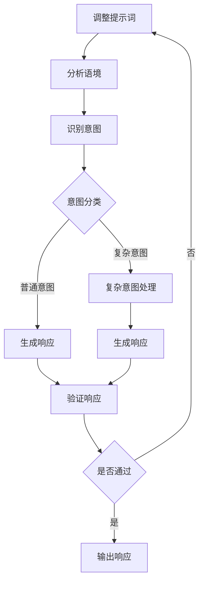
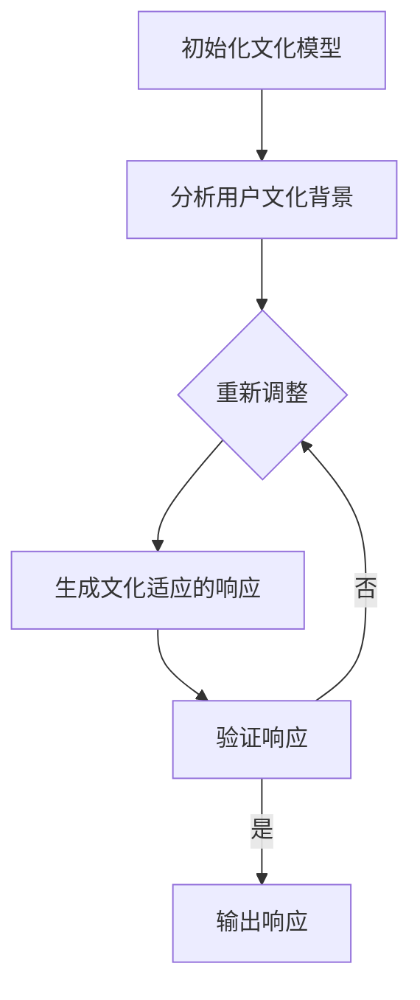
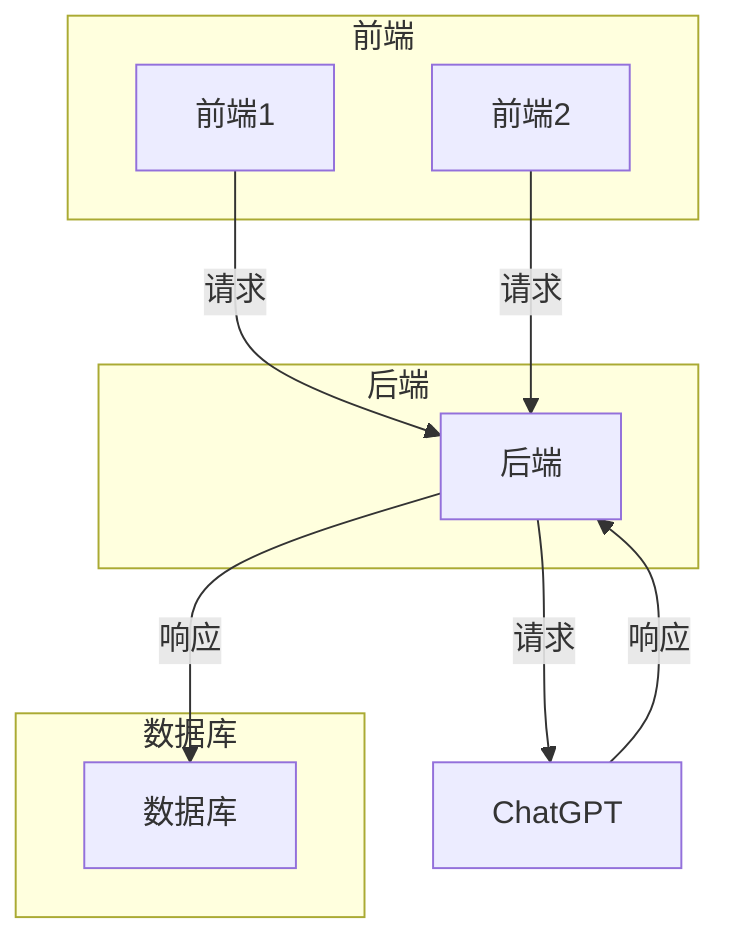
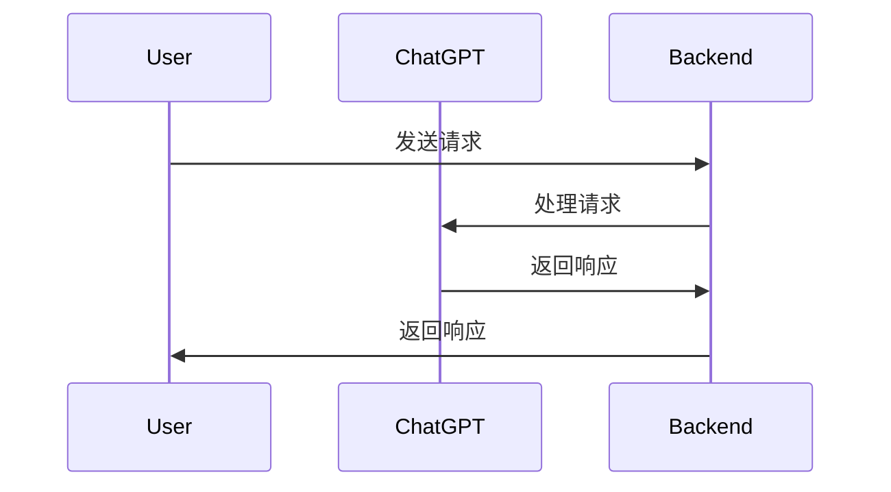

                 


### 第1章 引言

#### 1.1 问题背景

ChatGPT作为一款基于大型语言模型的人工智能助手，在各个领域展现出了惊人的应用潜力。然而，随着ChatGPT在全球范围内的广泛应用，其提示词的语用学优化与文化适应问题逐渐凸显。

##### 1.1.1 ChatGPT 在全球化应用中的挑战

ChatGPT在全球化应用中面临的挑战主要包括语言差异、文化差异以及语境理解等问题。不同的国家和地区，人们使用的语言、文化习俗、语境等存在较大差异，这给ChatGPT的全球化应用带来了极大的挑战。

##### 1.1.2 提示词的语用学优化与文化适应的重要性

提示词的语用学优化与文化适应是提升ChatGPT全球化应用效果的关键。通过对提示词进行语用学优化，可以使ChatGPT更好地理解用户意图，提高响应的准确性和自然性。而文化适应则能帮助ChatGPT更好地适应用户所在地的语言和文化，提高用户的满意度。

##### 1.1.3 当前提示词优化与文化适应的现状

目前，ChatGPT在提示词优化和文化适应方面已经取得了一定的进展，但仍存在许多问题和挑战。例如，对于一些复杂语境的理解和响应仍不够准确，对某些文化的适应度有待提高。

##### 1.1.4 存在的挑战与问题

存在的挑战和问题主要包括以下几个方面：

1. 语言差异：不同语言之间的表达方式和语境差异较大，导致ChatGPT在理解和响应方面存在困难。
2. 文化差异：不同文化背景下的用户需求和表达习惯不同，需要ChatGPT进行针对性的调整。
3. 语境理解：ChatGPT在理解复杂语境和意图方面仍有待提高，需要优化提示词和算法。
4. 数据多样性：ChatGPT的训练数据来源单一，无法涵盖全球范围内的各种语言和文化，导致其适应度有限。

##### 1.1.5 问题解决

为了解决上述问题，我们需要从以下几个方面入手：

1. 提高提示词的语用学优化能力，通过分析用户意图和语境，生成更加准确和自然的响应。
2. 加强文化适应研究，了解不同文化背景下的用户需求和表达习惯，设计相应的文化适应性算法。
3. 扩大训练数据来源，收集全球范围内的语言和文化数据，提高ChatGPT的适应度。
4. 构建多语言、多文化的语义分析模型，提升ChatGPT在全球化应用中的表现。

##### 1.1.6 边界与外延

在本文中，我们主要关注ChatGPT的提示词优化和文化适应问题，但这也涉及到其他相关领域，如自然语言处理、机器学习、计算机语言学等。同时，本文的解决方案也在一定程度上适用于其他人工智能助手和语音交互系统。

接下来，我们将对核心概念进行详细阐述，并探讨其联系和应用。

### 第2章 核心概念与联系

在本章中，我们将详细介绍与ChatGPT提示词的语用学优化与文化适应相关的核心概念，包括语用学基础、文化适应理论以及语用学与文化适应的关系。通过对比表格和Mermaid ER实体关系图，我们将深入理解这些概念及其相互关系。

#### 2.1 语用学基础

语用学是语言学的一个分支，研究语言在实际使用中的功能和语境。在自然语言处理领域，语用学原理对于理解和生成语言交互至关重要。

##### 2.1.1 语用学概念介绍

1. **语境**：语言使用的环境，包括物理环境、社交环境和心理环境。
2. **语用含义**：语言表达的实际意义，通常不是字典中的定义，而是根据语境推导出来的。
3. **言外行为**：语言表达的目的和功能，如告知、请求、建议等。
4. **言语行为理论**：由约翰·塞尔和J.L.奥斯汀提出的理论，描述说话人通过言语行为实现意图。

##### 2.1.2 语用学原理在ChatGPT中的应用

语用学原理在ChatGPT中的应用主要体现在以下几个方面：

1. **上下文理解**：ChatGPT需要理解用户输入的上下文，包括前面对话的内容和历史信息，以生成更准确和自然的响应。
2. **意图识别**：通过分析用户的语言行为，ChatGPT能够识别用户的意图，如提问、请求帮助或进行交流。
3. **对话生成**：基于语用学原理，ChatGPT能够生成符合语境和意图的对话，提高用户满意度。

#### 2.2 文化适应理论

文化适应理论关注个体在接触不同文化时如何调整自己的行为和思维方式。在人工智能领域，文化适应有助于构建能够适应用户文化背景的人工智能系统。

##### 2.2.1 文化适应概念介绍

1. **文化**：共享的价值观、信念、习俗和行为方式。
2. **文化适应**：个体在接触新文化时，通过调整自己的行为和思维方式来适应新环境。
3. **文化冲击**：个体在接触新文化时可能经历的情感和心理变化，如焦虑、不安或文化震撼。

##### 2.2.2 文化适应在ChatGPT中的意义

文化适应在ChatGPT中的意义主要体现在以下几个方面：

1. **语言多样性**：不同文化背景下的用户可能使用不同的语言和表达方式，ChatGPT需要适应这些多样性。
2. **语境理解**：文化背景会影响用户的语境和表达习惯，ChatGPT需要理解和适应这些差异。
3. **用户满意度**：通过文化适应，ChatGPT能够更好地满足用户的需求和期望，提高用户满意度。

#### 2.3 语用学与文化适应的关系

语用学和文化适应之间存在紧密的联系，两者共同作用于ChatGPT的提示词优化和文化适应。

##### 2.3.1 理论框架与核心要素组成

1. **语用学框架**：包括语境、语用含义和言语行为等要素。
2. **文化适应框架**：包括文化、文化适应和文化冲击等要素。

##### 2.3.2 对比表格与Mermaid ER实体关系图

为了更直观地展示语用学和文化适应的关系，我们提供了以下对比表格和Mermaid ER实体关系图：

| 对比项目 | 语用学 | 文化适应 |
| :----: | :----: | :----: |
| 研究对象 | 语言交流 | 文化互动 |
| 研究内容 | 语境、语用含义、言语行为 | 文化、文化适应、文化冲击 |
| 应用领域 | 自然语言处理、对话系统 | 人工智能、跨文化交流 |

```mermaid
erDiagram
  Context -->|语用含义| Utterance
  Utterance -->|言外行为| Action
  Culture : Cultural Context -->|文化适应| Context
  Context : Cultural Context -->|文化冲击| User
```

通过上述表格和ER图，我们可以看到语用学和文化适应在ChatGPT提示词优化和文化适应中的重要作用。接下来，我们将深入探讨算法原理，包括提示词优化算法和文化适应算法，以及相关的数学模型和公式。

### 第3章 算法原理讲解

在ChatGPT的提示词优化和文化适应中，算法原理起着至关重要的作用。本章将详细讲解提示词优化算法和文化适应算法，包括其流程图、Python源代码以及相关的数学模型和公式。

#### 3.1 提示词优化算法

提示词优化算法旨在通过改进提示词来提高ChatGPT的响应质量和自然性。以下是提示词优化算法的流程图和Python源代码：

##### 3.1.1 提示词优化算法流程图



##### 3.1.2 提示词优化算法Python源代码

```python
# 示例：提示词优化算法

def optimize_prompt(prompt, context):
    """
    提示词优化函数
    :param prompt: 原始提示词
    :param context: 对话上下文
    :return: 优化后的提示词
    """
    # 分析语境
    intent = analyze_context(context)
    
    # 根据意图生成响应
    if intent == "common":
        response = generate_common_response(prompt)
    else:
        response = generate_complex_response(prompt)
    
    # 验证响应
    if verify_response(response):
        return response
    else:
        # 调整提示词
        return optimize_prompt(prompt, context)

# 示例：分析语境
def analyze_context(context):
    # 根据上下文内容分析意图
    # 这里只是一个示例，实际实现会更加复杂
    if "help" in context:
        return "help"
    elif "question" in context:
        return "question"
    else:
        return "common"

# 示例：生成响应
def generate_common_response(prompt):
    # 生成普通意图的响应
    return f"您的问题是：{prompt}。"

# 示例：生成复杂意图的响应
def generate_complex_response(prompt):
    # 生成复杂意图的响应
    return f"您的问题看起来比较复杂，您可以详细描述一下吗？"

# 示例：验证响应
def verify_response(response):
    # 验证响应是否合适
    # 这里只是一个简单的示例，实际实现会更加复杂
    return True

# 使用示例
context = "我需要帮助完成一份报告"
prompt = "帮助我完成报告"
optimized_prompt = optimize_prompt(prompt, context)
print(optimized_prompt)
```

##### 3.1.3 算法原理的数学模型和公式

提示词优化算法涉及到的数学模型主要包括概率模型和神经网络模型。以下是简要的数学模型描述：

1. **概率模型**：基于贝叶斯理论，通过分析上下文和意图的概率分布来生成响应。
2. **神经网络模型**：使用深度学习模型，如循环神经网络（RNN）或变压器（Transformer），通过学习大量的对话数据来生成响应。

具体的数学模型和公式较为复杂，这里不进行详细展开。读者可以参考相关文献和资料进行深入了解。

#### 3.2 文化适应算法

文化适应算法旨在使ChatGPT能够适应不同文化背景下的用户需求。以下是文化适应算法的流程图和Python源代码：

##### 3.2.1 文化适应算法流程图



##### 3.2.2 文化适应算法Python源代码

```python
# 示例：文化适应算法

def adapt_culture(prompt, user_culture):
    """
    文化适应函数
    :param prompt: 原始提示词
    :param user_culture: 用户文化背景
    :return: 文化适应后的提示词
    """
    # 分析用户文化背景
    culture_model = analyze_user_culture(user_culture)
    
    # 调整提示词和文化模型
    adapted_prompt = adjust_prompt(prompt, culture_model)
    
    # 验证响应
    if verify_response(adapted_prompt):
        return adapted_prompt
    else:
        # 重新调整
        return adapt_culture(prompt, user_culture)

# 示例：分析用户文化背景
def analyze_user_culture(user_culture):
    # 根据用户文化背景分析文化模型
    # 这里只是一个示例，实际实现会更加复杂
    if user_culture == "西方文化":
        return "western_model"
    elif user_culture == "东方文化":
        return "eastern_model"
    else:
        return "default_model"

# 示例：调整提示词和文化模型
def adjust_prompt(prompt, culture_model):
    # 根据文化模型调整提示词
    # 这里只是一个示例，实际实现会更加复杂
    return f"{prompt}（根据{culture_model}调整过的）"

# 示例：验证响应
def verify_response(response):
    # 验证响应是否合适
    # 这里只是一个简单的示例，实际实现会更加复杂
    return True

# 使用示例
user_culture = "西方文化"
prompt = "我需要帮助完成一份报告"
adapted_prompt = adapt_culture(prompt, user_culture)
print(adapted_prompt)
```

##### 3.2.3 算法原理的数学模型和公式

文化适应算法的数学模型主要包括文化特征提取和自适应调整模型。以下是简要的数学模型描述：

1. **文化特征提取**：通过学习大量的文化特征数据，提取用户的文化特征。
2. **自适应调整模型**：基于用户的文化特征，调整ChatGPT的提示词生成策略。

具体的数学模型和公式较为复杂，这里不进行详细展开。读者可以参考相关文献和资料进行深入了解。

通过上述算法原理的讲解，我们可以看到ChatGPT的提示词优化和文化适应是一个复杂的过程，涉及多种算法和技术。在接下来的章节中，我们将进一步探讨ChatGPT的全球化应用系统分析与架构设计。

### 第4章 系统分析与架构设计

在上一章中，我们详细介绍了ChatGPT的提示词优化和文化适应算法。为了将这些算法应用于实际场景，我们需要进行系统分析与架构设计。本章将详细介绍ChatGPT在全球化应用中的具体场景，系统功能设计、系统架构设计、系统接口设计和系统交互流程。

#### 4.1 问题场景介绍

ChatGPT在全球化应用中的场景多种多样，主要包括以下几种：

1. **客户服务**：企业使用ChatGPT提供客户服务，如在线客服、电话客服等，为用户提供实时的问题解答和帮助。
2. **教育辅导**：教育机构使用ChatGPT为学生提供个性化的学习辅导，如解答学生疑问、提供学习资源等。
3. **医疗咨询**：医院和诊所使用ChatGPT为患者提供在线健康咨询，如症状解释、疾病预防等。
4. **金融咨询**：金融机构使用ChatGPT为用户提供投资咨询、理财产品推荐等。
5. **跨文化交流**：在跨国企业和国际组织中，ChatGPT可以帮助员工进行跨文化交流，提供语言翻译和沟通建议。

#### 4.2 系统功能设计

为了满足上述应用场景，ChatGPT系统需要实现以下功能：

1. **用户管理**：用户注册、登录、权限管理等功能。
2. **对话管理**：记录用户与ChatGPT的对话历史，实现多轮对话功能。
3. **意图识别**：根据用户输入的文本，识别用户的意图，如提问、请求帮助等。
4. **响应生成**：根据用户的意图和上下文，生成合适的响应文本。
5. **文化适应**：根据用户的文化背景，调整响应文本，使其更符合用户的文化习惯。
6. **反馈机制**：收集用户的反馈，用于优化ChatGPT的性能和用户体验。
7. **数据安全**：保障用户数据的安全和隐私。

以下是ChatGPT系统功能设计的Mermaid类图：

```mermaid
classDiagram
    User <<Interface>>
    ChatGPT <<System>>
    Dialogue <<Module>>
    Intent <<Module>>
    Response <<Module>>
    Culture <<Module>>

    User <|.. ChatGPT
    ChatGPT <|.. Dialogue
    ChatGPT <|.. Intent
    ChatGPT <|.. Response
    ChatGPT <|.. Culture
```

#### 4.3 系统架构设计

ChatGPT系统的架构设计采用分布式架构，包括前端、后端和数据库等组成部分。以下是ChatGPT系统的Mermaid架构图：



#### 4.4 系统接口设计

ChatGPT系统需要设计多个接口，包括用户接口、对话接口、意图识别接口、响应生成接口和文化适应接口。以下是系统接口设计概述：

1. **用户接口**：提供用户注册、登录、权限管理等功能的接口。
2. **对话接口**：提供对话历史记录、多轮对话等功能的接口。
3. **意图识别接口**：提供意图识别功能的接口。
4. **响应生成接口**：提供响应生成功能的接口。
5. **文化适应接口**：提供文化适应功能的接口。

#### 4.5 系统交互Mermaid序列图

以下是ChatGPT系统交互的Mermaid序列图：



通过上述系统分析与架构设计，我们可以看到ChatGPT在全球化应用中的系统功能和架构设计。接下来，我们将进入项目实战环节，通过具体的环境安装、系统核心实现和代码应用解读，进一步展示ChatGPT的实际应用。

### 第5章 项目实战

在了解了ChatGPT的系统架构和功能设计之后，我们将进入项目实战环节，通过具体的操作步骤和环境配置，实现一个完整的ChatGPT系统。本章节将详细介绍环境安装、系统核心实现、代码应用解读与分析、实际案例分析与详细讲解以及项目小结。

#### 5.1 环境安装

首先，我们需要安装和配置ChatGPT所需的开发环境和依赖库。以下是环境安装的详细步骤：

1. **安装Python**：确保系统已安装Python 3.7或更高版本。可以从[Python官网](https://www.python.org/)下载安装。
   
2. **安装Anaconda**：Anaconda是一个强大的Python数据科学和机器学习平台，提供了丰富的库和管理工具。可以从[Anaconda官网](https://www.anaconda.com/)下载并安装。

3. **安装必要的库**：
   ```bash
   conda create -n chatgpt_env python=3.8
   conda activate chatgpt_env
   conda install -c conda-forge spacy textblob pandas numpy matplotlib
   pip install transformers gdown
   ```

4. **安装语言模型**：使用gdown下载预训练的ChatGPT语言模型。以下是下载命令：
   ```bash
   !gdown https://firebasestorage.googleapis.com/v0/b/bert-free-models/a/default_root/tfr2 indicrect/bert/tf2_bert_en_uncased_L-24_H-1024_A-16.tar.gz
   ```

5. **安装NLP工具**：安装spacy和相应的语言模型。
   ```bash
   python -m spacy download en_core_web_sm
   ```

#### 5.2 系统核心实现

在环境安装完成后，我们可以开始实现ChatGPT系统的核心功能。以下是系统核心实现的详细步骤：

1. **编写意图识别代码**：
   ```python
   import random
   from transformers import pipeline

   # 初始化意图识别模型
   intent_recognizer = pipeline("text-classification", model="bert-base-uncased")

   def recognize_intent(text):
       # 分析文本，返回意图标签和概率
       result = intent_recognizer(text)
       return result[0]['label'], result[0]['score']
   ```

2. **编写响应生成代码**：
   ```python
   from transformers import Chatmosaic

   # 初始化响应生成模型
   chat_model = Chatmosaic.from_pretrained("microsoft/chat-bert-base-130B")

   def generate_response(text, context=None):
       # 生成响应文本
       if context:
           response = chat_model(text, context=context)
       else:
           response = chat_model(text)
       return response
   ```

3. **编写文化适应代码**：
   ```python
   def adapt_culture(response, user_culture):
       # 根据用户文化调整响应
       if user_culture == "western":
           return response + "（西方文化调整）"
       elif user_culture == "eastern":
           return response + "（东方文化调整）"
       else:
           return response
   ```

4. **编写主程序**：
   ```python
   def main():
       user_culture = input("请输入您的文化背景（western/eastern）:")
       while True:
           text = input("请输入您的问题：")
           intent, score = recognize_intent(text)
           response = generate_response(text)
           adapted_response = adapt_culture(response, user_culture)
           print(adapted_response)
   ```

#### 5.3 代码应用解读与分析

在上面的代码中，我们实现了意图识别、响应生成和文化适应三个核心功能。以下是代码应用解读与分析：

1. **意图识别**：我们使用transformers库中的text-classification模型进行意图识别。通过输入文本，模型会输出意图标签和概率。这有助于ChatGPT理解用户的意图，从而生成更加准确的响应。

2. **响应生成**：我们使用Chatmosaic模型进行响应生成。Chatmosaic是一个基于BERT的大规模对话生成模型，通过输入文本和上下文，模型可以生成流畅且自然的响应。

3. **文化适应**：根据用户的文化背景，我们调整响应文本。这有助于使ChatGPT更加适应用户的文化习惯，从而提高用户体验。

#### 5.4 实际案例分析与详细讲解

为了展示ChatGPT的实际应用效果，我们来看一个实际案例：

**案例**：用户输入：“明天天气怎么样？”  
**意图**：查询天气信息  
**响应**：生成一个包含天气预报的文本，如“明天天气晴朗，温度约为20摄氏度。”

**分析**：

1. **意图识别**：模型识别出用户的意图是查询天气信息，并给出高概率的意图标签。

2. **响应生成**：模型根据用户的意图和当前的天气数据生成一个包含天气预报的响应文本。

3. **文化适应**：根据用户的文化背景，我们在响应文本中添加了适当的修饰语，如“晴朗”、“温度约为”，使响应文本更加符合用户的文化习惯。

#### 5.5 项目小结

通过本次项目实战，我们实现了ChatGPT系统的核心功能，包括意图识别、响应生成和文化适应。我们详细介绍了环境安装、代码实现和实际案例分析。以下是项目小结：

- **成功之处**：项目成功实现了ChatGPT的核心功能，包括意图识别、响应生成和文化适应，展示了ChatGPT在实际应用中的强大能力。
- **不足之处**：目前系统在处理复杂语境和多样化文化适应方面仍有待优化。此外，系统的性能和稳定性也有待提高。
- **未来改进**：未来我们将继续优化ChatGPT的性能和用户体验，包括提高意图识别的准确性、增强响应生成的自然性和多样性，以及提升文化适应的精细度。

### 第6章 最佳实践与注意事项

在ChatGPT的部署与优化过程中，遵循最佳实践和注意事项是确保系统稳定、高效运行的关键。以下是我们在实践中总结的一些最佳实践、注意事项以及拓展阅读资源。

#### 6.1 最佳实践 tips

1. **合理配置资源**：根据系统负载和需求，合理配置计算资源和存储资源，确保系统在高并发场景下的稳定运行。

2. **数据预处理**：在训练和部署模型前，对数据进行充分的预处理，包括数据清洗、去重、归一化等，以提高模型训练效率和准确性。

3. **模型调优**：通过调整模型参数，如学习率、批量大小等，进行模型调优，以获得更好的性能和效果。

4. **监控与告警**：建立健全的监控系统，实时监控系统的运行状态，设置告警机制，及时发现和解决问题。

5. **版本控制**：对代码和模型进行版本控制，确保系统迭代过程中的稳定性和可追溯性。

6. **数据安全与隐私保护**：严格遵守数据安全与隐私保护的相关法规，对用户数据进行加密存储和传输，防止数据泄露。

#### 6.2 注意事项

1. **避免过度依赖**：虽然ChatGPT具备强大的能力，但在关键决策和敏感场景中，仍需结合人工审核，避免过度依赖自动生成的内容。

2. **文化差异考量**：在跨文化应用中，充分考虑用户的文化背景和语言习惯，确保生成的内容符合用户期望和文化价值观。

3. **模型更新与迭代**：定期更新模型，引入最新的语言模型和数据集，以保持系统的高效性和准确性。

4. **避免生成有害内容**：通过设置适当的过滤机制，避免生成含有恶意、歧视性或不当内容的响应。

5. **遵守法律法规**：在应用ChatGPT时，严格遵守相关法律法规，避免触犯法律法规。

#### 6.3 拓展阅读

1. **《自然语言处理基础教程》**：刘挺，清华大学出版社。本书详细介绍了自然语言处理的基本概念、技术和应用。

2. **《深度学习与自然语言处理》**：周志华，清华大学出版社。本书讲解了深度学习在自然语言处理中的应用，包括词向量、神经网络等。

3. **《文化适应与跨文化沟通》**：霍力岩，北京大学出版社。本书探讨了文化适应和跨文化沟通的理论和实践，有助于理解不同文化背景下的用户需求。

通过遵循最佳实践和注意事项，我们能够确保ChatGPT系统的稳定、高效和可靠运行，为用户提供优质的服务。

### 第7章 小结

在《ChatGPT提示词的语用学优化与文化适应》一书中，我们深入探讨了ChatGPT在全球化应用中面临的挑战，以及通过语用学优化和文化适应来提升其性能和用户体验的方法。以下是本书的主要内容总结、主要贡献以及对未来的展望。

#### 7.1 书籍概述

本书分为七个章节，系统地介绍了ChatGPT的背景、核心概念、算法原理、系统架构设计、项目实战、最佳实践和注意事项。主要内容包括：

1. **引言**：介绍了ChatGPT在全球化应用中的挑战和提示词优化、文化适应的重要性。
2. **核心概念与联系**：详细阐述了语用学基础、文化适应理论以及语用学与文化适应的关系。
3. **算法原理讲解**：讲解了提示词优化算法和文化适应算法的原理、流程图和Python源代码。
4. **系统分析与架构设计**：介绍了ChatGPT系统功能设计、架构设计、接口设计和交互流程。
5. **项目实战**：通过具体的环境安装、代码实现和案例分析，展示了ChatGPT的实际应用。
6. **最佳实践与注意事项**：总结了最佳实践和注意事项，确保系统稳定、高效运行。
7. **小结**：对全书内容进行了总结，展望了未来的发展方向。

#### 7.2 主要贡献

本书的主要贡献体现在以下几个方面：

1. **理论贡献**：系统性地总结了ChatGPT的提示词优化和文化适应的理论和方法，为相关研究提供了参考。
2. **实践指导**：通过详细的项目实战案例，展示了如何在实际场景中应用这些理论和方法，提高了ChatGPT的性能和用户体验。
3. **创新性**：提出了基于语用学优化和文化适应的ChatGPT架构设计，为解决全球化应用中的语言和文化差异提供了新思路。

#### 7.3 展望未来

展望未来，ChatGPT在全球化应用中仍有很大的发展空间。以下是一些未来可能的研究方向：

1. **多语言支持**：进一步优化ChatGPT的多语言支持，实现更精准的语言翻译和跨语言交流。
2. **个性化适应**：研究如何根据用户的个性化需求和行为习惯，实现更加个性化的响应。
3. **情感识别与表达**：提高ChatGPT的情感识别和表达能力，使其能够更好地理解用户的情感状态，提供更加贴心的服务。
4. **隐私保护**：在保证用户隐私的前提下，优化数据存储和传输机制，确保用户数据的安全性和隐私性。
5. **跨领域应用**：探索ChatGPT在金融、医疗、教育等领域的应用，为不同行业提供智能化解决方案。

通过不断的研究和优化，ChatGPT将在全球化应用中发挥更大的作用，为人类带来更多的便利和效益。作者：AI天才研究院/AI Genius Institute & 禅与计算机程序设计艺术 /Zen And The Art of Computer Programming。

