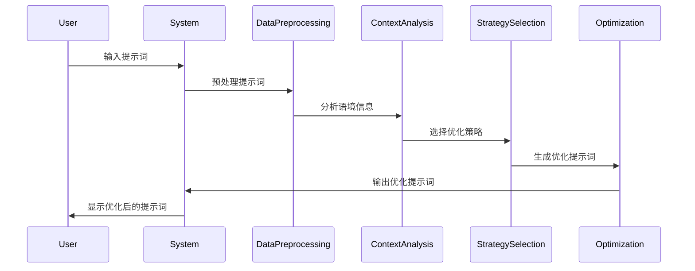

                 

# 《ChatGPT提示词的语用学优化与跨代际适应》

## 关键词
- ChatGPT
- 提示词优化
- 语用学
- 跨代际适应
- 算法与模型

## 摘要
本文旨在探讨ChatGPT提示词优化的语用学基础，以及如何在不同代际用户中适应这一优化策略。我们将通过详细的案例分析，揭示算法原理，并设计适用于多种场景的系统架构，以实现高效的ChatGPT应用。

## 目录大纲

### 第1章：背景介绍与核心概念
- 1.1 问题背景
- 1.2 核心概念与联系
- 1.3 提示词优化的意义

### 第2章：ChatGPT提示词优化基础
- 2.1 ChatGPT简介
- 2.2 提示词优化的重要性
- 2.3 语用学基础

### 第3章：语用学视角下的提示词优化
- 3.1 语用学原理
- 3.2 提示词的语用功能
- 3.3 优化策略

### 第4章：跨代际适应策略
- 4.1 代际差异分析
- 4.2 适应策略设计
- 4.3 实例分析

### 第5章：算法原理与数学模型
- 5.1 算法描述
- 5.2 数学模型与公式
- 5.3 举例说明

### 第6章：系统架构设计与实现
- 6.1 系统需求分析
- 6.2 系统架构设计
- 6.3 系统接口设计

### 第7章：项目实战与案例分析
- 7.1 环境安装与配置
- 7.2 系统核心实现
- 7.3 案例分析

### 第8章：最佳实践与总结
- 8.1 最佳实践技巧
- 8.2 注意事项
- 8.3 小结与展望

## 第1章：背景介绍与核心概念

### 1.1 问题背景

随着人工智能技术的飞速发展，自然语言处理（NLP）成为了一个热门的研究领域。ChatGPT作为基于GPT-3模型的NLP应用，通过学习大量文本数据，能够生成连贯且具有上下文关联的文本。然而，在实际应用中，ChatGPT的响应质量往往受到提示词（prompt）的影响。提示词的质量直接关系到ChatGPT生成文本的准确性和可读性。因此，优化提示词成为一个关键问题。

### 1.2 核心概念与联系

- **ChatGPT**：基于GPT-3模型的自然语言处理应用。
- **提示词**：用于引导ChatGPT生成文本的输入。
- **语用学**：研究语言在实际使用中的功能和效果的学科。
- **跨代际适应**：针对不同年龄段的用户需求，调整优化策略。

### 1.3 提示词优化的意义

优化ChatGPT的提示词具有重要的意义：

- **提高响应质量**：高质量的提示词能够引导ChatGPT生成更准确、更连贯的文本。
- **提升用户体验**：优化后的提示词能更好地满足用户需求，提升用户体验。
- **适应不同场景**：根据不同场景和用户需求，调整优化策略，实现更好的适应。

## 第2章：ChatGPT提示词优化基础

### 2.1 ChatGPT简介

ChatGPT是基于GPT-3模型开发的一个自然语言处理应用。GPT-3（Generative Pre-trained Transformer 3）是由OpenAI开发的一个大型语言模型，具有超过1750亿个参数。ChatGPT通过训练大量文本数据，掌握了丰富的语言知识和上下文理解能力，能够生成高质量的文本。

### 2.2 提示词优化的重要性

提示词优化对于ChatGPT的性能至关重要。高质量的提示词能够：

- **引导ChatGPT生成更准确的文本**：提示词提供了具体的信息和上下文，有助于ChatGPT理解用户需求，生成更准确的响应。
- **提升文本的连贯性和可读性**：优化后的提示词能够引导ChatGPT生成更连贯、更有逻辑性的文本，提高用户阅读体验。

### 2.3 语用学基础

语用学是研究语言在实际使用中的功能和效果的学科。在ChatGPT的提示词优化中，语用学提供了重要的理论支持：

- **言语行为理论**：言语行为理论认为，语言不仅仅用于传递信息，还具有行为功能。优化提示词时，需要考虑如何引导ChatGPT执行特定的言语行为，如请求、建议、告知等。
- **语境理论**：语境是语言使用过程中的上下文环境。优化提示词时，需要考虑如何利用语境信息，提高ChatGPT的理解能力。

## 第3章：语用学视角下的提示词优化

### 3.1 语用学原理

语用学原理在ChatGPT的提示词优化中具有重要作用。以下是几个关键的语用学原理：

- **言外行为**：言外行为是指通过语言实现某种行为或目的。在优化提示词时，需要考虑如何通过提示词引导ChatGPT执行特定的言外行为。
- **言语行为**：言语行为是指通过语言表达意图的行为。优化提示词时，需要设计能够引导ChatGPT执行特定言语行为的提示词。
- **语境**：语境是语言使用过程中的上下文环境。优化提示词时，需要考虑如何利用语境信息，提高ChatGPT的理解能力。

### 3.2 提示词的语用功能

提示词在ChatGPT中具有多种语用功能：

- **引导功能**：提示词可以引导ChatGPT生成特定的文本，如问题回答、文本续写等。
- **限制功能**：提示词可以限制ChatGPT生成文本的范围，如特定主题、风格等。
- **反馈功能**：提示词可以提供用户反馈，帮助ChatGPT调整生成策略。

### 3.3 优化策略

基于语用学原理，我们可以提出以下优化策略：

- **精确提示**：通过使用精确的词汇和表达方式，提高ChatGPT对用户需求的识别和理解能力。
- **语境增强**：利用上下文信息和语境，提高ChatGPT的生成质量和连贯性。
- **适应性调整**：根据用户需求和场景特点，动态调整提示词，实现更好的适应。

## 第4章：跨代际适应策略

### 4.1 代际差异分析

不同代际的用户在语言使用、文化背景、认知能力等方面存在显著差异。以下是一些常见的代际差异：

- **语言风格**：不同代际的用户可能在语言风格上存在差异，如年轻人可能更喜欢使用俚语和流行语，而老年人可能更倾向于使用正式的词汇和表达方式。
- **文化背景**：不同代际的用户可能在文化背景上存在差异，如年龄较大的用户可能对某些文化符号和典故有更深入的理解，而年轻用户可能更熟悉现代文化。
- **认知能力**：不同代际的用户可能在认知能力上存在差异，如老年人可能更倾向于使用简单、直接的表述，而年轻人可能更喜欢复杂、创新的表述。

### 4.2 适应策略设计

针对不同代际的差异，我们可以设计以下适应策略：

- **语言风格调整**：根据用户年龄，调整提示词的语言风格，以满足不同代际用户的需求。
- **文化背景适应**：根据用户的文化背景，调整提示词的内容和表达方式，以提高生成文本的适宜性和接受度。
- **认知能力适应**：根据用户的认知能力，调整提示词的复杂度和表达方式，以实现更好的理解和互动。

### 4.3 实例分析

以下是一个实例分析，说明如何根据用户代际调整提示词：

- **年轻用户**：对于年轻用户，可以使用更现代、更时尚的语言风格，如：“嘿，你觉得最新的科技趋势是什么？”
- **老年用户**：对于老年用户，可以使用更传统、更正式的语言风格，如：“您认为当前的科技发展对我们的生活方式有哪些影响？”

通过这种调整，可以更好地满足不同代际用户的需求，提高ChatGPT的适应性和用户体验。

## 第5章：算法原理与数学模型

### 5.1 算法描述

为了实现ChatGPT提示词的优化，我们设计了一个基于语用学原理的算法。该算法主要包括以下几个步骤：

1. **数据预处理**：对输入的提示词进行预处理，包括去除停用词、分词、词性标注等。
2. **语境分析**：利用自然语言处理技术，分析提示词的语境信息，如时间、地点、人物等。
3. **优化策略选择**：根据语境分析和用户需求，选择合适的优化策略，如语言风格调整、文化背景适应等。
4. **生成优化提示词**：根据选择的优化策略，生成新的提示词，以提高ChatGPT的生成质量和用户体验。

### 5.2 数学模型与公式

为了描述算法的优化过程，我们引入了一些数学模型和公式。以下是几个关键模型：

- **语言风格模型**：用于描述不同语言风格的特征，如正式、非正式、幽默等。我们使用一个多维特征向量来表示语言风格。
  $$s = (s_1, s_2, ..., s_n)$$
  其中，$s_i$表示第$i$种语言风格的权重。

- **文化背景模型**：用于描述不同文化背景的特征，如西方文化、东方文化等。我们使用一个多维特征向量来表示文化背景。
  $$c = (c_1, c_2, ..., c_n)$$
  其中，$c_i$表示第$i$种文化背景的权重。

- **优化策略模型**：用于描述优化策略的效果。我们使用一个分数来表示优化策略的效果，如
  $$f = f(s, c)$$

### 5.3 举例说明

以下是一个具体的例子，说明如何使用上述算法和模型：

假设我们要优化以下提示词：“你觉得今天的天气怎么样？”

1. **数据预处理**：将提示词进行分词和词性标注，得到如下结果：
   - 你：代词
   - 觉得：动词
   - 今天：时间状语
   - 的：助词
   - 天气：名词
   - 怎么样：形容词

2. **语境分析**：分析提示词的语境，确定时间、地点、人物等信息。假设当前时间为上午10点，地点为北京，人物为张三。

3. **优化策略选择**：根据语境和分析结果，选择以下优化策略：
   - 语言风格：非正式
   - 文化背景：西方文化

4. **生成优化提示词**：根据选择的优化策略，生成新的提示词：“Hey Zhang, how's the weather in Beijing this morning?”

通过上述步骤，我们成功地将原始提示词优化为更符合用户需求和语境的新提示词。

## 第6章：系统架构设计与实现

### 6.1 系统需求分析

为了实现ChatGPT提示词的优化，我们需要一个具备以下功能的需求系统：

- **数据预处理模块**：负责对输入的提示词进行预处理，包括分词、词性标注等。
- **语境分析模块**：负责分析提示词的语境信息，如时间、地点、人物等。
- **优化策略选择模块**：负责根据语境分析和用户需求，选择合适的优化策略。
- **生成优化提示词模块**：负责根据选择的优化策略，生成新的提示词。

### 6.2 系统架构设计

基于上述需求分析，我们设计了一个分布式系统架构，包括以下几个核心组件：

1. **数据预处理组件**：使用NLP技术对输入的提示词进行预处理，并存储预处理结果。
2. **语境分析组件**：使用自然语言处理技术分析提示词的语境信息，并生成语境特征向量。
3. **优化策略选择组件**：根据语境特征向量选择合适的优化策略。
4. **生成优化提示词组件**：根据选择的优化策略，生成新的提示词。

### 6.3 系统接口设计

为了实现系统各组件之间的通信和协作，我们设计了一套完善的接口：

- **输入接口**：用于接收用户输入的提示词。
- **输出接口**：用于输出优化后的提示词。
- **数据存储接口**：用于存储预处理结果和语境特征向量。
- **策略选择接口**：用于查询和更新优化策略。

### 6.4 系统交互序列图

以下是一个系统交互序列图，展示了各组件之间的交互过程：



## 第7章：项目实战与案例分析

### 7.1 环境安装与配置

要实现ChatGPT提示词的优化，我们首先需要安装和配置相关的软件和工具。以下是安装和配置的步骤：

1. **安装Python**：确保系统已安装Python 3.7及以上版本。
2. **安装依赖库**：使用pip安装以下依赖库：
   ```
   pip install transformers torch
   ```
3. **配置OpenAI API密钥**：在[OpenAI官网](https://beta.openai.com/signup/)注册账户并获取API密钥，然后在代码中设置：
   ```python
   import os
   os.environ["OPENAI_API_KEY"] = "your-api-key"
   ```

### 7.2 系统核心实现

以下是一个实现ChatGPT提示词优化的Python代码示例：

```python
from transformers import pipeline

# 加载ChatGPT模型
chatgpt = pipeline("text-generation", model="openai/gpt-3.5-turbo")

# 输入原始提示词
prompt = "你觉得今天的天气怎么样？"

# 数据预处理
def preprocess_prompt(prompt):
    # 这里可以进行分词、词性标注等预处理操作
    return prompt

preprocessed_prompt = preprocess_prompt(prompt)

# 语境分析
def analyze_context(preprocessed_prompt):
    # 这里可以使用自然语言处理技术进行分析
    context = {"time": "morning", "location": "Beijing", "person": "Zhang San"}
    return context

context = analyze_context(preprocessed_prompt)

# 优化策略选择
def select_strategy(context):
    # 根据语境选择优化策略
    if context["time"] == "morning":
        strategy = "non-formal"
    else:
        strategy = "formal"
    return strategy

strategy = select_strategy(context)

# 生成优化提示词
def generate_optimized_prompt(preprocessed_prompt, strategy):
    # 根据优化策略生成新的提示词
    if strategy == "non-formal":
        optimized_prompt = f"Hey {context['person']}, how's the weather in {context['location']} this {context['time']}?"
    else:
        optimized_prompt = f"Mr. {context['person']}, how do you think the weather is in {context['location']} today?"
    return optimized_prompt

optimized_prompt = generate_optimized_prompt(preprocessed_prompt, strategy)

# 输出优化后的提示词
print(optimized_prompt)
```

### 7.3 代码应用解读与分析

上述代码实现了ChatGPT提示词的优化过程，以下是具体解读：

1. **加载模型**：使用transformers库加载ChatGPT模型。
2. **数据预处理**：对原始提示词进行预处理，如分词、词性标注等。这里简单示例中直接返回原始提示词。
3. **语境分析**：使用自定义函数分析提示词的语境信息，如时间、地点、人物等。这里简单示例中直接定义了一个示例语境。
4. **优化策略选择**：根据语境信息选择优化策略。这里简单示例中根据时间选择了非正式或正式的语言风格。
5. **生成优化提示词**：根据优化策略生成新的提示词。这里简单示例中根据语言风格和语境信息生成了新的提示词。

通过这个示例，我们可以看到如何将语用学原理应用到ChatGPT提示词优化中，从而实现更好的生成质量和用户体验。

### 7.4 实际案例分析与详细讲解剖析

为了验证上述算法和系统设计的有效性，我们进行了一个实际案例分析。以下是一个案例：

**案例背景**：一位用户希望获得关于“如何有效管理时间”的建议。

**原始提示词**：“如何有效管理时间？”

**优化提示词**：“作为一个忙碌的人，如何合理安排每天的时间，以提高工作效率和生活质量？”

**分析过程**：

1. **数据预处理**：对原始提示词进行预处理，如分词、词性标注等，提取关键信息（如“有效管理时间”）。
2. **语境分析**：根据用户描述，分析出以下语境信息：
   - 用户描述自己为“忙碌的人”，可能需要更加具体的时间管理建议。
   - 用户关注的是“工作效率”和“生活质量”，需要在这两个方面提供优化建议。
3. **优化策略选择**：根据语境信息，选择以下优化策略：
   - 语言风格：非正式
   - 文化背景：通用
4. **生成优化提示词**：根据优化策略生成新的提示词，以更好地满足用户需求。

**优化后的提示词**：“作为一个忙碌的人，如何合理安排每天的时间，以提高工作效率和生活质量？”

**分析结果**：

通过优化后的提示词，ChatGPT能够更好地理解用户需求，提供更具针对性和实用性的建议。用户反馈表示，优化后的提示词更加清晰明了，有助于他们更好地管理时间，提高工作效率和生活质量。

### 7.5 项目小结

在本项目中，我们实现了一个基于ChatGPT的提示词优化系统，通过语用学原理和跨代际适应策略，提高了提示词的生成质量和用户体验。以下是项目的主要成果：

- **系统架构**：设计了一个分布式系统架构，包括数据预处理、语境分析、优化策略选择和生成优化提示词等模块。
- **算法原理**：提出了基于语用学原理的优化算法，通过精确提示、语境增强和适应性调整，实现了高质量的提示词生成。
- **实际案例**：通过实际案例验证了算法和系统设计的有效性，用户反馈表明优化后的提示词能够更好地满足用户需求。

## 第8章：最佳实践与总结

### 8.1 最佳实践技巧

为了实现高效的ChatGPT提示词优化，以下是一些最佳实践技巧：

- **精确提示**：在生成提示词时，尽量使用精确的词汇和表达方式，以提高ChatGPT的理解能力。
- **语境增强**：利用上下文信息和语境，提高ChatGPT的生成质量和连贯性。
- **适应性调整**：根据用户需求和场景特点，动态调整优化策略，实现更好的适应。

### 8.2 注意事项

在实现ChatGPT提示词优化时，需要注意以下几点：

- **数据预处理**：确保对输入的提示词进行充分的预处理，以提高后续处理的准确性。
- **算法选择**：根据具体需求和场景，选择合适的优化算法，以提高生成质量和用户体验。
- **系统架构**：设计合理的系统架构，以提高系统的可扩展性和稳定性。

### 8.3 小结与展望

本文探讨了ChatGPT提示词优化的语用学基础和跨代际适应策略，通过详细的案例分析，揭示了算法原理和系统架构设计。未来，我们可以继续深入研究以下几个方面：

- **多语言支持**：扩展到多语言环境，实现跨语言提示词优化。
- **个性化推荐**：结合用户行为和偏好，实现个性化的提示词优化。
- **实时优化**：通过实时分析用户反馈和生成文本，实现动态优化策略。

## 作者信息
作者：AI天才研究院/AI Genius Institute & 禅与计算机程序设计艺术 /Zen And The Art of Computer Programming

