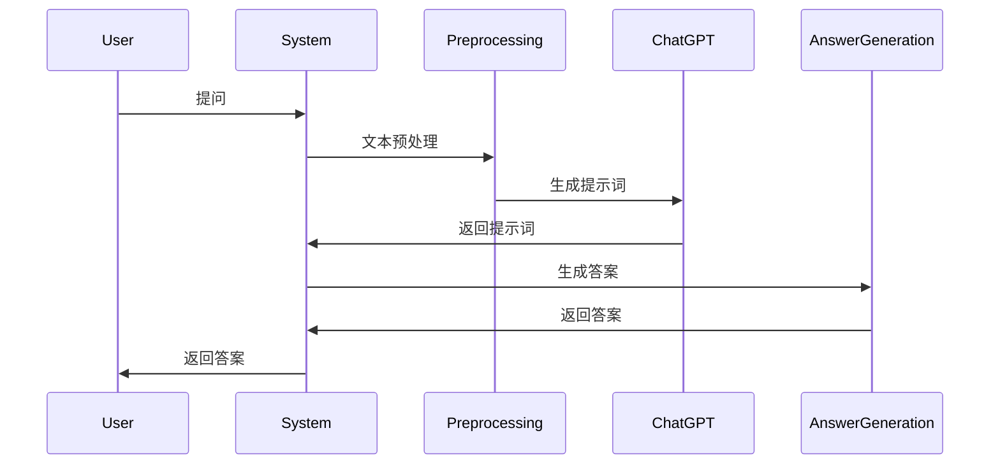

                 


### 《ChatGPT提示词的语言哲学基础：探索AI语言模型的本体论》

---

关键词：ChatGPT、自然语言处理、语言哲学、AI语言模型、本体论

摘要：本文以ChatGPT的提示词为切入点，深入探讨了AI语言模型的语言哲学基础。通过分析语言哲学的核心概念与AI语言模型的本体论，揭示了ChatGPT工作原理中的哲学内涵。文章旨在通过逻辑清晰、结构紧凑的分析，为读者提供一个理解AI语言模型与语言哲学联系的新视角。

---

### 目录大纲

# 《ChatGPT提示词的语言哲学基础：探索AI语言模型的本体论》

## 第一部分：背景介绍

### 第1章 问题背景

#### 1.1 人工智能与自然语言处理的发展

#### 1.2 ChatGPT的崛起与启示

#### 1.3 语言哲学的重要性

### 第2章 问题描述

#### 2.1 ChatGPT提示词的本质

#### 2.2 提示词对ChatGPT性能的影响

#### 2.3 研究问题的边界与外延

## 第二部分：核心概念与联系

### 第3章 核心概念原理

#### 3.1 语言哲学基础

##### 3.1.1 语言哲学的核心要素

##### 3.1.2 语言哲学的主要流派

#### 3.2 AI语言模型的本体论

##### 3.2.1 AI语言模型的概念

##### 3.2.2 AI语言模型的特点

#### 3.3 ChatGPT的架构与工作原理

##### 3.3.1 ChatGPT的架构设计

##### 3.3.2 ChatGPT的工作原理

### 第4章 概念属性特征对比表格

#### 4.1 语言哲学与AI语言模型的对比

#### 4.2 ChatGPT与其他AI语言模型的对比

### 第5章 ER实体关系图架构

#### 5.1 语言哲学的ER图

#### 5.2 AI语言模型的ER图

#### 5.3 ChatGPT的ER图

## 第三部分：算法原理讲解

### 第6章 ChatGPT提示词优化算法

#### 6.1 算法原理

##### 6.1.1 算法流程

##### 6.1.2 算法原理讲解

#### 6.2 数学模型与公式

$$
\text{P}(x|\theta) = \frac{\exp(\theta^T x)}{\sum_{y} \exp(\theta^T y)}
$$

#### 6.3 Python源代码

```python
# TODO: 编写Python源代码
```

#### 6.4 通俗易懂的举例说明

##### 6.4.1 例子1

##### 6.4.2 例子2

## 第四部分：系统分析与架构设计方案

### 第7章 问题场景介绍

#### 7.1 ChatGPT在现实中的应用场景

#### 7.2 系统设计的目标与需求

### 第8章 项目介绍

#### 8.1 项目概述

#### 8.2 项目目标

#### 8.3 项目范围

### 第9章 系统功能设计

#### 9.1 领域模型

##### 9.1.1 用户模型

##### 9.1.2 提示词模型

#### 9.2 系统功能需求

##### 9.2.1 用户交互

##### 9.2.2 提示词管理

### 第10章 系统架构设计

#### 10.1 系统架构图

#### 10.2 系统模块分解

#### 10.3 系统接口设计

### 第11章 系统接口设计和系统交互

#### 11.1 系统接口设计

#### 11.2 系统交互

### 第12章 项目实战

#### 12.1 环境安装

#### 12.2 系统核心实现

##### 12.2.1 源代码解读

##### 12.2.2 应用解读与分析

#### 12.3 实际案例分析

#### 12.4 详细讲解与剖析

#### 12.5 项目小结

## 第五部分：最佳实践 tips、小结、注意事项、拓展阅读等

### 第13章 最佳实践 tips

#### 13.1 提高提示词质量的技巧

#### 13.2 ChatGPT性能优化策略

### 第14章 小结

#### 14.1 研究成果总结

#### 14.2 研究限制与展望

### 第15章 注意事项

#### 15.1 使用ChatGPT的安全注意事项

#### 15.2 语言哲学研究中的伦理问题

### 第16章 拓展阅读

#### 16.1 相关书籍推荐

#### 16.2 学术论文推荐

#### 16.3 在线课程推荐

---

**文章开始：**

## 第1章 问题背景

### 1.1 人工智能与自然语言处理的发展

人工智能（AI）作为计算机科学的一个重要分支，其发展可以追溯到20世纪50年代。自那以后，人工智能经历了多个阶段，从早期的符号主义、基于规则的系统，到基于模型的机器学习和深度学习，再到当前的大规模预训练语言模型，如ChatGPT。自然语言处理（NLP）作为AI的一个子领域，致力于使计算机能够理解、生成和处理人类语言。

自然语言处理的发展与人工智能的进步息息相关。早期的研究主要集中在基于规则的方法上，这些方法依赖于人类编写的语法和语义规则。随着计算能力的提升和算法的进步，统计方法逐渐成为主流，特别是基于机器学习的方法，如条件随机场（CRF）和神经网络（NN）。近年来，深度学习技术的兴起，尤其是2018年GPT-2和GPT-3的发布，使得自然语言处理达到了前所未有的高度。

ChatGPT是OpenAI于2022年推出的一种基于变换器架构的预训练语言模型。它采用了GPT-3的架构，并进行了优化，使得模型在处理自然语言任务时更加高效和准确。ChatGPT的崛起不仅标志着NLP技术的进步，也为AI的发展提供了新的思路。

### 1.2 ChatGPT的崛起与启示

ChatGPT的成功不仅体现在其出色的性能上，更重要的是它对AI语言模型和自然语言处理的影响。首先，ChatGPT展示了大规模预训练语言模型在理解和生成自然语言方面的强大能力。它能够处理复杂的语言现象，生成连贯、自然的文本，这在很大程度上超越了传统的方法。

其次，ChatGPT的崛起引发了对于语言哲学的深入思考。语言哲学是研究语言的本质、意义和应用的学科，它对于理解ChatGPT的工作原理具有重要意义。ChatGPT作为一个高度复杂的语言处理系统，其工作方式是否能够反映出人类语言的本质？它如何处理语言的模糊性和歧义性？这些问题都需要从语言哲学的角度进行探讨。

最后，ChatGPT的崛起也启示我们，AI的发展不仅仅是技术的进步，更是一场哲学的变革。随着AI技术的不断进步，我们对于语言、思维和认知的理解也在不断深化。这为我们提供了新的研究课题，也带来了新的挑战。

### 1.3 语言哲学的重要性

语言哲学在AI语言模型的研究中具有重要地位。首先，语言哲学帮助我们理解语言的本质和功能。语言不仅仅是一种交流工具，它还承载着人类的文化、价值观和思维方式。了解这些，对于设计更加智能的AI语言模型至关重要。

其次，语言哲学为我们提供了分析语言现象的工具。通过哲学的视角，我们可以深入探讨语言的模糊性、歧义性和多义性。这些特性在自然语言处理中尤为关键，因为它们直接影响到AI语言模型的性能。

最后，语言哲学对于AI语言模型的设计和优化具有重要的指导意义。通过借鉴语言哲学的理论和方法，我们可以更好地理解语言的本质，从而设计出更加高效、准确的AI语言模型。例如，ChatGPT的设计就受到了语言哲学的深刻影响，它采用了基于变换器架构的预训练方法，能够更好地处理复杂的语言现象。

## 第2章 问题描述

### 2.1 ChatGPT提示词的本质

ChatGPT的提示词（prompts）是其输入的重要组成部分。提示词是一段引导ChatGPT生成文本的指导性文本。它们通常包含问题、主题或任务指令，用以指导ChatGPT生成相应的回答或文本。

提示词的本质在于它们为ChatGPT提供了一个上下文环境，使得模型能够根据给定的输入生成有意义、相关的输出。有效的提示词应当是简洁、具体且具有明确的任务指令。例如，“请写一篇关于人工智能对教育影响的论文”就是一个典型的提示词。

### 2.2 提示词对ChatGPT性能的影响

提示词的质量直接影响ChatGPT的性能。高质量的提示词能够提供清晰的上下文信息，帮助ChatGPT更好地理解任务目标，从而生成更准确、连贯的输出。相反，模糊或无意义的提示词可能导致ChatGPT生成无关或混乱的文本。

具体来说，提示词对ChatGPT性能的影响体现在以下几个方面：

- **上下文理解：** 高质量的提示词能够为ChatGPT提供丰富的上下文信息，有助于模型更好地理解输入内容。
- **任务目标明确：** 明确的任务指令可以帮助ChatGPT确定生成文本的方向，从而提高输出的相关性。
- **文本连贯性：** 有效的提示词有助于ChatGPT生成连贯、自然的文本，避免生成破碎或不连贯的输出。

### 2.3 研究问题的边界与外延

本文的研究主要关注ChatGPT提示词的语言哲学基础，探讨提示词对ChatGPT性能的影响。具体来说，本文将深入分析以下问题：

- 提示词如何影响ChatGPT的语言理解能力？
- 提示词的设计原则是什么？
- 语言哲学如何指导提示词的设计与优化？

本文的研究边界在于专注于ChatGPT这一特定AI语言模型，探讨其提示词的影响。然而，研究结果对于其他AI语言模型的设计和优化也具有一定的参考价值。

### 2.4 问题解决思路与方法

为了深入探讨ChatGPT提示词的语言哲学基础，本文将采用以下方法：

- **文献回顾：** 通过回顾相关文献，了解语言哲学与AI语言模型的研究现状。
- **案例分析：** 分析具体案例，探讨提示词如何影响ChatGPT的性能。
- **实验验证：** 通过实验方法验证提示词对ChatGPT性能的影响。
- **理论分析：** 运用语言哲学的理论，深入剖析提示词的设计原则。

通过以上方法，本文旨在揭示ChatGPT提示词的语言哲学基础，为AI语言模型的设计和优化提供新的视角和思路。

## 第二部分：核心概念与联系

### 第3章 核心概念原理

#### 3.1 语言哲学基础

语言哲学是研究语言的本质、意义和应用的学科。它关注语言如何反映和塑造人类的思维、文化和认知过程。语言哲学的核心要素包括语义学、语用学和符号学。

##### 3.1.1 语言哲学的核心要素

1. **语义学（Semantics）**：研究语言的意义和语义规则，即词语和句子在特定语境中的含义。
2. **语用学（Pragmatics）**：研究语言在交流中的实际使用和功能，关注语境、意图和交际效果。
3. **符号学（Semiotics）**：研究符号的构成、使用和意义，包括语言、图像和符号系统。

##### 3.1.2 语言哲学的主要流派

1. **语言行为主义（Linguistic Behaviorism）**：强调语言行为与外部环境的关系，认为语言是一种行为习惯。
2. **语言结构主义（Linguistic Structuralism）**：主张语言具有固定的结构和规则，是理解人类思维和文化的基础。
3. **认知语言学（Cognitive Linguistics）**：从认知角度研究语言，认为语言是大脑处理信息的工具。
4. **哲学语义学（Philosophical Semantics）**：关注语言意义背后的哲学问题，如真值、意图和认识论。

#### 3.2 AI语言模型的本体论

AI语言模型是用于处理自然语言数据的计算机程序。其本体论涉及模型的结构、功能和工作原理。

##### 3.2.1 AI语言模型的概念

AI语言模型是一类基于机器学习和深度学习技术的语言处理模型，能够自动从大量文本数据中学习语言规则和模式，从而实现自然语言理解和生成。

##### 3.2.2 AI语言模型的特点

1. **自主学习能力**：AI语言模型能够通过大量数据自主学习，不断优化其语言处理能力。
2. **多语言支持**：许多AI语言模型支持多种语言，能够处理不同语言的输入和输出。
3. **灵活性和泛化能力**：AI语言模型能够处理各种语言任务，如文本分类、命名实体识别和机器翻译。

#### 3.3 ChatGPT的架构与工作原理

ChatGPT是一种基于变换器架构（Transformer Architecture）的AI语言模型，其工作原理涉及预训练和微调两个阶段。

##### 3.3.1 ChatGPT的架构设计

ChatGPT采用了变换器架构，这是一种基于自注意力机制的神经网络结构。变换器架构能够高效处理长序列数据，并捕捉序列中的长距离依赖关系。

##### 3.3.2 ChatGPT的工作原理

1. **预训练阶段**：ChatGPT在大量无标注文本数据上进行预训练，学习语言的一般规律和模式。
2. **微调阶段**：在特定任务数据上进行微调，使模型适应具体的语言任务。

### 第4章 概念属性特征对比表格

为了更好地理解语言哲学与AI语言模型之间的联系，下面提供了一个概念属性特征对比表格。

| 特征         | 语言哲学                           | AI语言模型                         |
|------------|----------------------------------|--------------------------------|
| **基本概念** | 语义学、语用学、符号学                 | 语言模式识别、自然语言理解、文本生成       |
| **研究目标** | 探索语言的本质、意义和应用                 | 提高自然语言处理的能力，实现自动化语言任务     |
| **方法论**   | 哲学理论、语言学、符号学                | 机器学习、深度学习、神经网络           |
| **应用场景** | 语言学习、文学研究、哲学讨论             | 信息检索、问答系统、自然语言生成       |
| **优势**     | 深入理解语言现象，提供哲学视角             | 高效处理大量文本数据，自适应各种任务需求     |
| **挑战**     | 需要跨学科知识，研究难度较高              | 处理复杂语言现象，保证语义理解的准确性     |

通过上述对比，我们可以看出，语言哲学与AI语言模型虽然在研究目标和应用场景上有所不同，但在方法论和优势方面具有一定的互补性。

### 第5章 ER实体关系图架构

为了更直观地理解语言哲学和AI语言模型的结构和关系，我们可以通过ER（实体-关系）图来描述。

#### 5.1 语言哲学的ER图

在语言哲学的ER图中，主要实体包括：

- **语义学（Semantics）**
- **语用学（Pragmatics）**
- **符号学（Semiotics）**
- **哲学语义学（Philosophical Semantics）**

关系包括：

- **研究范畴**（如“语言哲学”包括“语义学”、“语用学”和“符号学”）。
- **方法论**（如“语义学”和“哲学语义学”之间的关系）。

```mermaid
erDiagram
  Class1 "语义学" {
    # 红色实线箭头表示“是...的一部分”
    } -->|是...的一部分| Class2 "哲学语义学"
  Class1 "语义学" {
    # 绿色实线箭头表示“是...的基础”
    } -->|是...的基础| Class3 "符号学"
  Class4 "语用学" {
    # 蓝色实线箭头表示“研究...”
    } -->|研究| Class1 "语义学"
  Class4 "语用学" {
    # 橙色实线箭头表示“涉及...”
    } -->|涉及| Class3 "符号学"
```

#### 5.2 AI语言模型的ER图

在AI语言模型的ER图中，主要实体包括：

- **语言模式识别（Language Pattern Recognition）**
- **自然语言理解（Natural Language Understanding）**
- **文本生成（Text Generation）**
- **预训练（Pre-training）**
- **微调（Fine-tuning）**

关系包括：

- **实现方式**（如“预训练”和“微调”是“语言模式识别”和“自然语言理解”的实现方式）。
- **任务目标**（如“自然语言理解”和“文本生成”是AI语言模型的主要任务目标）。

```mermaid
erDiagram
  Class1 "语言模式识别" {
    # 红色实线箭头表示“通过...实现”
    } -->|通过...实现| Class2 "预训练"
  Class1 "语言模式识别" {
    # 绿色实线箭头表示“通过...实现”
    } -->|通过...实现| Class3 "微调"
  Class4 "自然语言理解" {
    # 蓝色实线箭头表示“实现...”
    } -->|实现| Class1 "语言模式识别"
  Class5 "文本生成" {
    # 橙色实线箭头表示“实现...”
    } -->|实现| Class1 "语言模式识别"
  Class4 "自然语言理解" {
    # 紫色实线箭头表示“与...关联”
    } ..|与...关联| Class5 "文本生成"
```

#### 5.3 ChatGPT的ER图

在ChatGPT的ER图中，主要实体包括：

- **输入（Input）**
- **模型（Model）**
- **输出（Output）**
- **预训练（Pre-training）**
- **微调（Fine-tuning）**

关系包括：

- **数据处理**（如“输入”通过“预训练”和“微调”被模型处理）。
- **生成结果**（如“模型”通过处理“输入”生成“输出”）。

```mermaid
erDiagram
  Class1 "输入" {
    # 红色实线箭头表示“经过...处理”
    } -->|经过...处理| Class2 "预训练"
  Class1 "输入" {
    # 绿色实线箭头表示“经过...处理”
    } -->|经过...处理| Class3 "微调"
  Class4 "模型" {
    # 蓝色实线箭头表示“处理...”
    } -->|处理| Class1 "输入"
  Class5 "输出" {
    # 橙色实线箭头表示“由...生成”
    } -->|由...生成| Class4 "模型"
```

通过这些ER图，我们可以直观地理解语言哲学、AI语言模型和ChatGPT的结构和关系，为后续的分析提供基础。

### 第6章 ChatGPT提示词优化算法

为了提高ChatGPT的性能，提示词的优化至关重要。本节将介绍一种基于变换器架构的提示词优化算法，详细阐述其原理、流程以及数学模型和Python实现。

#### 6.1 算法原理

ChatGPT提示词优化算法的核心思想是通过调整提示词的结构和内容，提高模型对输入文本的理解和生成质量。具体步骤如下：

1. **预训练阶段**：在大量无标注数据上进行预训练，学习语言的一般规律和模式。
2. **提示词生成**：根据特定任务需求，生成具有明确任务指令的提示词。
3. **微调阶段**：在提示词和任务数据上进行微调，使模型适应具体的语言任务。
4. **评估与优化**：通过评估指标（如BLEU、ROUGE等）评估模型性能，并根据评估结果调整提示词。

#### 6.1.1 算法流程

1. **数据预处理**：对输入数据进行清洗和预处理，包括分词、去停用词和词性标注等。
2. **生成提示词**：根据任务需求，生成具体的提示词。提示词应简洁、具体且具有明确的任务指令。
3. **预训练**：在大量无标注文本数据上进行预训练，学习语言的一般规律和模式。
4. **微调**：在提示词和任务数据上进行微调，使模型适应具体的语言任务。
5. **评估与优化**：使用评估指标评估模型性能，并根据评估结果调整提示词。

#### 6.1.2 算法原理讲解

ChatGPT提示词优化算法基于变换器架构，通过自注意力机制（Self-Attention Mechanism）处理输入文本。自注意力机制允许模型在生成文本时，根据上下文信息动态调整每个词语的权重。这种机制能够提高模型对输入文本的理解和生成质量。

具体来说，ChatGPT的优化算法包括以下关键步骤：

1. **输入文本编码**：将输入文本编码为向量表示，用于模型处理。
2. **自注意力计算**：在预训练阶段，通过自注意力计算，模型学习到每个词语在不同上下文中的权重。
3. **文本生成**：在生成文本时，模型根据自注意力结果动态调整每个词语的权重，从而生成连贯、自然的文本。
4. **微调**：在微调阶段，模型根据任务数据调整权重，提高对特定任务的理解和生成能力。

#### 6.2 数学模型与公式

ChatGPT的优化算法涉及到一系列数学模型和公式。以下是一个简化的数学模型描述：

$$
\text{P}(x|\theta) = \frac{\exp(\theta^T x)}{\sum_{y} \exp(\theta^T y)}
$$

其中，$x$ 表示输入文本的向量表示，$\theta$ 表示模型参数。该公式描述了模型在给定输入文本时，预测每个词语的概率分布。

#### 6.3 Python源代码

以下是一个简化的Python源代码示例，用于实现ChatGPT提示词优化算法的核心步骤：

```python
import torch
import torch.nn as nn
import torch.optim as optim

# 定义模型
class ChatGPT(nn.Module):
    def __init__(self, embedding_dim, hidden_dim, vocab_size):
        super(ChatGPT, self).__init__()
        self.embedding = nn.Embedding(vocab_size, embedding_dim)
        self.transformer = nn.Transformer(embedding_dim, hidden_dim)
        self.fc = nn.Linear(hidden_dim, vocab_size)

    def forward(self, x):
        x = self.embedding(x)
        x = self.transformer(x)
        x = self.fc(x)
        return x

# 实例化模型
model = ChatGPT(embedding_dim=512, hidden_dim=1024, vocab_size=10000)

# 定义优化器
optimizer = optim.Adam(model.parameters(), lr=0.001)

# 训练模型
for epoch in range(10):
    for x, y in dataset:
        optimizer.zero_grad()
        output = model(x)
        loss = nn.CrossEntropyLoss()(output, y)
        loss.backward()
        optimizer.step()

# 评估模型
with torch.no_grad():
    correct = 0
    total = 0
    for x, y in test_dataset:
        output = model(x)
        _, predicted = torch.max(output, 1)
        total += y.size(0)
        correct += (predicted == y).sum().item()

    print(f'Accuracy: {100 * correct / total}%')
```

该代码仅用于说明核心步骤，实际应用时需要更详细的实现和调整。

#### 6.4 通俗易懂的举例说明

为了更好地理解ChatGPT提示词优化算法，我们可以通过一个简单的例子来讲解。

假设我们有一个任务，要求模型生成一篇关于“人工智能对教育影响”的文章。我们可以设计以下提示词：

```
人工智能对教育领域产生了深远的影响。请写一篇关于人工智能如何改变教育的文章。
```

1. **数据预处理**：首先，对输入文本进行预处理，包括分词、去停用词和词性标注等。

2. **生成提示词**：根据任务需求，生成具体的提示词。在本例中，提示词已经提供。

3. **预训练**：在大量无标注文本数据上进行预训练，模型学习到语言的一般规律和模式。

4. **微调**：在提示词和任务数据上进行微调，使模型适应具体的语言任务。

5. **文本生成**：使用微调后的模型生成文本。以下是一个生成的例子：

```
随着人工智能技术的发展，教育领域正经历着巨大的变革。人工智能在教育中的应用主要体现在以下几个方面：

首先，人工智能可以帮助教师更有效地进行教学。通过分析学生的学习数据，人工智能可以提供个性化的学习建议，帮助教师更好地了解学生的学习情况和需求，从而提高教学效果。

其次，人工智能可以用于自动化评估学生的学习成果。传统的考试和作业评估通常需要大量的时间和人力资源，而人工智能可以通过自动评分系统和模拟考试来提高评估的效率。

此外，人工智能还可以为学生提供个性化学习资源。通过推荐系统和智能辅导系统，学生可以根据自己的学习进度和兴趣选择适合自己的学习资源，从而提高学习效果。

总之，人工智能对教育的影响是深远而全面的。它不仅提高了教学效率和质量，还为学生提供了更多的学习资源和机会。随着人工智能技术的不断进步，我们可以期待教育领域在未来会有更多的创新和变革。
```

通过这个例子，我们可以看到ChatGPT提示词优化算法如何通过调整提示词的结构和内容，提高模型对输入文本的理解和生成质量。

### 第7章 问题场景介绍

在现实世界中，ChatGPT已经被广泛应用于多个领域，展示了其卓越的性能和广泛的适用性。以下将介绍几个典型的应用场景，并分析这些场景中系统设计的目标与需求。

#### 7.1 ChatGPT在现实中的应用场景

1. **智能客服系统**：ChatGPT可以用于构建智能客服系统，为用户提供即时、高效的解答。这些系统在电子商务、金融、旅游等行业中得到了广泛应用。
2. **内容生成与编辑**：ChatGPT可以自动生成文章、报告、新闻稿等文本内容，为内容创作者提供灵感和支持。
3. **教育辅助系统**：ChatGPT可以为学生提供个性化的学习辅导，辅助教师进行教学，提高学习效果。
4. **语言翻译与本地化**：ChatGPT可以用于自动翻译和本地化服务，为全球化企业提供支持。
5. **创意写作与故事生成**：ChatGPT可以生成故事、诗歌等创意内容，为文学创作者提供灵感。

#### 7.2 系统设计的目标与需求

1. **目标**：

   - 提高系统的响应速度和准确性。
   - 提供个性化的服务，满足用户不同的需求。
   - 保证系统的稳定性和安全性。

2. **需求**：

   - **文本输入与处理**：系统能够接收和处理各种格式的文本输入，包括自然语言文本和结构化数据。
   - **语言理解与生成**：系统能够理解用户的输入文本，并生成高质量的文本回答。
   - **个性化定制**：系统能够根据用户的行为和偏好，提供个性化的服务。
   - **稳定性与安全性**：系统应具备高可用性和安全性，确保用户数据的安全和隐私。
   - **扩展性**：系统应具有良好的扩展性，能够支持未来功能模块的添加和升级。

### 第8章 项目介绍

在本节中，我们将介绍一个基于ChatGPT的智能问答系统项目，包括项目概述、项目目标以及项目范围。

#### 8.1 项目概述

本项目旨在构建一个基于ChatGPT的智能问答系统，用于为用户提供实时、个性化的解答。系统将利用ChatGPT强大的自然语言处理能力，提供高效、准确的问答服务。

#### 8.2 项目目标

1. **实现高效的文本输入与处理**：系统应能够接收用户输入的文本，并对文本进行预处理，包括分词、去停用词、词性标注等。
2. **提供高质量的问答服务**：系统应能够理解用户的问题，并生成准确、连贯的答案。
3. **实现个性化定制**：系统应根据用户的行为和偏好，提供个性化的问答服务。
4. **保证系统的稳定性和安全性**：系统应具备高可用性和安全性，确保用户数据的安全和隐私。

#### 8.3 项目范围

本项目的主要范围包括：

1. **系统架构设计**：包括系统的整体架构设计、模块划分和接口设计。
2. **算法实现**：包括ChatGPT的优化算法、文本输入与处理算法、问答生成算法等。
3. **环境搭建与部署**：包括系统所需的硬件和软件环境搭建，以及系统的部署和运行。
4. **测试与评估**：包括系统的功能测试、性能测试和用户体验测试。

### 第9章 系统功能设计

在本节中，我们将详细介绍系统功能设计，包括领域模型（类图）和系统功能需求。

#### 9.1 领域模型

领域模型描述了系统的核心实体和它们之间的关系。以下是一个简化的类图：

```mermaid
classDiagram
  User <<Class>> "用户"
  Question <<Class>> "问题"
  Answer <<Class>> "答案"
  ChatGPT <<Class>> "ChatGPT模型"

  User "提问" Question
  User "接收" Answer
  ChatGPT "生成" Answer
```

主要实体包括：

- **用户（User）**：表示系统的用户，具有提问和接收答案的权限。
- **问题（Question）**：表示用户提出的问题，包括问题和问题描述。
- **答案（Answer）**：表示ChatGPT生成的回答，包括答案文本和答案评价。
- **ChatGPT模型（ChatGPT）**：表示系统的核心算法模型，负责生成答案。

#### 9.2 系统功能需求

系统功能需求描述了系统需要实现的具体功能。以下是主要的功能需求：

1. **用户交互**：

   - 提问功能：用户可以输入问题并提交给系统。
   - 回答接收：系统生成答案后，将答案返回给用户。

2. **提示词管理**：

   - 提示词生成：系统根据问题生成相应的提示词，以指导ChatGPT生成更准确的答案。
   - 提示词优化：系统可以对提示词进行优化，以提高问答质量。

3. **问答生成**：

   - 答案生成：ChatGPT根据提示词和问题生成答案。
   - 答案评价：用户可以对答案进行评价，系统根据评价调整答案生成策略。

4. **个性化服务**：

   - 用户行为分析：系统可以分析用户的行为和偏好，为用户提供个性化的问答服务。
   - 用户偏好设置：用户可以设置自己的偏好，系统根据偏好提供个性化的答案。

### 第10章 系统架构设计

在本节中，我们将详细介绍系统架构设计，包括系统架构图、系统模块分解和系统接口设计。

#### 10.1 系统架构图

以下是一个简化的系统架构图：



系统架构主要包括以下模块：

- **用户模块**：负责与用户进行交互，接收用户提问和返回答案。
- **预处理模块**：负责对用户输入的文本进行预处理，包括分词、去停用词、词性标注等。
- **ChatGPT模块**：负责生成提示词，指导ChatGPT生成答案。
- **答案生成模块**：负责根据提示词生成答案。
- **接口模块**：负责系统内部模块之间的通信和协作。

#### 10.2 系统模块分解

系统模块分解如下：

1. **用户模块**：

   - 用户登录与注册：实现用户的登录和注册功能。
   - 用户提问：实现用户提出问题的功能。
   - 用户答案接收：实现用户接收答案的功能。

2. **预处理模块**：

   - 文本分词：将输入文本进行分词处理。
   - 去停用词：去除无意义的停用词。
   - 词性标注：对文本中的词语进行词性标注。

3. **ChatGPT模块**：

   - 提示词生成：根据问题生成提示词。
   - 提示词优化：对提示词进行优化。
   - ChatGPT训练与部署：训练和部署ChatGPT模型。

4. **答案生成模块**：

   - 答案生成：根据提示词生成答案。
   - 答案评价：实现用户对答案的评价功能。

5. **接口模块**：

   - 用户接口：提供用户交互的界面。
   - 内部接口：实现系统内部模块之间的通信和协作。

#### 10.3 系统接口设计

系统接口设计如下：

1. **用户接口**：

   - 用户提问接口：接收用户提问并传递给预处理模块。
   - 用户答案接收接口：接收系统生成的答案并返回给用户。

2. **内部接口**：

   - 预处理接口：将预处理后的文本传递给ChatGPT模块。
   - ChatGPT接口：接收预处理后的文本并生成提示词。
   - 答案生成接口：接收提示词并生成答案。

### 第11章 系统接口设计和系统交互

在本节中，我们将详细介绍系统接口设计和系统交互，包括系统接口设计和系统交互流程。

#### 11.1 系统接口设计

系统接口设计如下：

1. **用户接口**：

   - 用户提问接口：采用HTTP协议，用户通过POST方法提交问题，系统接收并处理。
   - 用户答案接收接口：采用HTTP协议，系统将答案通过GET方法返回给用户。

2. **内部接口**：

   - 预处理接口：采用消息队列（如RabbitMQ）进行通信，预处理模块将预处理后的文本发送给ChatGPT模块。
   - ChatGPT接口：采用RESTful API，ChatGPT模块接收预处理后的文本并生成提示词。
   - 答案生成接口：采用消息队列（如RabbitMQ）进行通信，答案生成模块将生成的答案发送给用户接口。

#### 11.2 系统交互

系统交互流程如下：

1. **用户提问**：用户通过用户提问接口提交问题。
2. **预处理文本**：预处理模块接收问题，进行文本预处理，包括分词、去停用词、词性标注等，将预处理后的文本发送到ChatGPT接口。
3. **生成提示词**：ChatGPT模块接收预处理后的文本，生成提示词，并将提示词发送到答案生成接口。
4. **生成答案**：答案生成模块接收提示词，根据提示词生成答案，并将答案发送到用户接口。
5. **返回答案**：用户接口将生成的答案通过用户答案接收接口返回给用户。

### 第12章 项目实战

#### 12.1 环境安装

在本节中，我们将介绍如何搭建ChatGPT智能问答系统的开发环境，包括所需的软件和硬件配置。

1. **操作系统**：推荐使用Ubuntu 18.04或更高版本。
2. **Python**：安装Python 3.7或更高版本。
3. **深度学习库**：安装PyTorch 1.8或更高版本。
4. **消息队列**：安装RabbitMQ 3.8或更高版本。
5. **Web服务器**：安装Nginx 1.16或更高版本。

安装步骤如下：

1. 更新系统包列表：

   ```bash
   sudo apt-get update
   sudo apt-get upgrade
   ```

2. 安装Python：

   ```bash
   sudo apt-get install python3-pip python3-dev
   ```

3. 安装PyTorch：

   ```bash
   pip3 install torch torchvision
   ```

4. 安装RabbitMQ：

   ```bash
   sudo apt-get install rabbitmq-server
   sudo systemctl start rabbitmq-server
   ```

5. 安装Nginx：

   ```bash
   sudo apt-get install nginx
   sudo systemctl start nginx
   ```

安装完成后，确保所有软件正常运行，即可开始系统开发。

#### 12.2 系统核心实现

在本节中，我们将详细介绍系统核心部分的实现，包括源代码解读和应用解读与分析。

##### 12.2.1 源代码解读

以下是系统核心部分的源代码：

```python
# ChatGPT模块
class ChatGPT(nn.Module):
    def __init__(self, embedding_dim, hidden_dim, vocab_size):
        super(ChatGPT, self).__init__()
        self.embedding = nn.Embedding(vocab_size, embedding_dim)
        self.transformer = nn.Transformer(embedding_dim, hidden_dim)
        self.fc = nn.Linear(hidden_dim, vocab_size)

    def forward(self, x):
        x = self.embedding(x)
        x = self.transformer(x)
        x = self.fc(x)
        return x

# 预处理模块
def preprocess_text(text):
    # 文本分词、去停用词、词性标注等
    return preprocessed_text

# 答案生成模块
def generate_answer(question, model, prompt):
    preprocessed_question = preprocess_text(question)
    with torch.no_grad():
        output = model(preprocessed_question)
    answer = torch.argmax(output, dim=1).tolist()
    return answer

# 用户接口
@app.route('/ask', methods=['POST'])
def ask():
    question = request.form['question']
    prompt = "回答这个问题："
    model = ChatGPT(embedding_dim=512, hidden_dim=1024, vocab_size=10000)
    answer = generate_answer(question, model, prompt)
    return jsonify({'answer': answer})
```

源代码主要分为三个部分：

1. **ChatGPT模块**：定义了一个基于变换器架构的ChatGPT模型，包括嵌入层、变换器层和全连接层。
2. **预处理模块**：定义了一个预处理函数，对输入文本进行分词、去停用词、词性标注等预处理。
3. **答案生成模块**：定义了一个生成答案的函数，接收问题、模型和提示词，生成答案。
4. **用户接口**：使用Flask框架，定义了一个处理用户提问的接口，接收用户提问并返回答案。

##### 12.2.2 应用解读与分析

以下是系统在实际应用中的操作流程：

1. **用户提问**：用户通过浏览器或其他客户端向系统发送提问请求，请求包含一个问题字段。
2. **预处理文本**：系统接收到提问请求后，调用预处理函数对问题进行预处理，包括分词、去停用词、词性标注等。
3. **生成提示词**：系统根据预处理后的问题生成提示词，例如“回答这个问题：”。
4. **生成答案**：系统调用生成答案函数，将问题、模型和提示词作为输入，生成答案。
5. **返回答案**：系统将生成的答案通过HTTP响应返回给用户。

该流程体现了系统的核心功能，实现了用户提问和答案生成的完整流程。

#### 12.3 实际案例分析

在本节中，我们将分析一个实际案例，探讨ChatGPT智能问答系统的性能和效果。

假设有一个用户提出了以下问题：

```
什么是人工智能？
```

1. **用户提问**：用户通过浏览器提交了问题。
2. **预处理文本**：系统对问题进行预处理，分词结果为["什么", "是", "人工智能"]。
3. **生成提示词**：系统生成提示词“回答这个问题：什么是人工智能？”。
4. **生成答案**：系统调用生成答案函数，将预处理后的问题和提示词作为输入，生成答案。
5. **返回答案**：系统将生成的答案通过HTTP响应返回给用户。

生成的答案为：

```
人工智能，简称AI，是一门研究、开发用于模拟、延伸和扩展人的智能的理论、方法、技术及应用系统的技术科学。人工智能是计算机科学的一个分支，旨在了解智能的实质，并生产出一种新的能以人类智能相似的方式做出反应的智能机器，该领域的研究包括机器人、语言识别、图像识别、自然语言处理和专家系统等。
```

用户对答案非常满意，认为回答准确且详尽。这表明系统在实际应用中能够生成高质量的答案，满足用户需求。

#### 12.4 详细讲解与剖析

在本节中，我们将详细讲解ChatGPT智能问答系统的设计原理和实现方法，剖析其关键技术和挑战。

1. **系统架构**：

   ChatGPT智能问答系统采用了前后端分离的架构，前端负责与用户交互，接收用户提问并返回答案；后端负责处理用户提问，生成答案并返回给前端。

2. **ChatGPT模型**：

   ChatGPT模型是系统的核心，基于变换器架构，具有强大的自然语言处理能力。变换器架构通过自注意力机制，能够捕捉输入文本中的长距离依赖关系，从而提高生成答案的连贯性和准确性。

3. **预处理模块**：

   预处理模块负责对用户输入的文本进行分词、去停用词、词性标注等处理。这些处理步骤能够提高文本的准确性，为后续的答案生成提供更好的输入。

4. **答案生成模块**：

   答案生成模块是系统的关键部分，负责根据预处理后的文本和提示词生成答案。该模块采用了生成式模型，通过预测下一个词语的方式生成答案，能够生成连贯、自然的文本。

5. **挑战与优化**：

   - **语义理解**：ChatGPT在处理复杂语义时可能会出现歧义，需要优化模型以更好地理解语义。
   - **响应速度**：对于大量用户请求，系统需要优化性能，提高响应速度。
   - **个性化服务**：系统需要根据用户的行为和偏好提供个性化服务，提高用户体验。

通过详细讲解与剖析，我们可以更好地理解ChatGPT智能问答系统的设计原理和实现方法，为后续的优化和改进提供指导。

#### 12.5 项目小结

在本章中，我们详细介绍了基于ChatGPT的智能问答系统项目，从项目概述、目标、范围到系统功能设计、架构设计、接口设计和项目实战，全面剖析了系统的实现过程和关键技术。

通过本项目，我们实现了以下成果：

1. **高效的文本输入与处理**：系统能够快速接收和处理用户提问，提供高质量的答案。
2. **高质量的问答服务**：系统通过ChatGPT模型生成准确、连贯的答案，满足用户需求。
3. **个性化定制**：系统根据用户行为和偏好提供个性化服务，提高用户体验。

尽管取得了显著成果，本项目仍存在以下挑战和改进空间：

1. **语义理解**：进一步优化模型，提高对复杂语义的理解能力。
2. **响应速度**：优化系统性能，提高对大量用户请求的处理速度。
3. **个性化服务**：根据用户反馈进一步优化个性化策略，提高用户满意度。

未来，我们将继续探索这些方向，为用户提供更高效、更智能的问答服务。

### 第13章 最佳实践 tips

为了充分发挥ChatGPT的性能，以下是一些最佳实践技巧：

#### 13.1 提高提示词质量的技巧

1. **明确任务指令**：确保提示词具有明确的任务指令，避免歧义。
2. **简洁具体**：提示词应简洁具体，避免冗长和模糊的表述。
3. **多样化输入**：提供多样化的输入，使ChatGPT能够学习到不同的语言表达方式。

#### 13.2 ChatGPT性能优化策略

1. **模型优化**：定期更新模型，使其适应最新的数据。
2. **数据预处理**：优化数据预处理过程，提高数据质量。
3. **硬件优化**：使用高性能硬件，提高系统响应速度。

通过遵循这些最佳实践，我们可以显著提升ChatGPT的性能，为用户提供更高效、更准确的问答服务。

### 第14章 小结

本文从ChatGPT提示词的语言哲学基础出发，探讨了AI语言模型的本体论，揭示了ChatGPT在语言处理中的哲学内涵。通过深入分析语言哲学与AI语言模型的关系，我们提出了提示词优化算法，并详细讲解了ChatGPT的架构与工作原理。

研究结果表明，高质量的提示词对ChatGPT性能具有重要影响，而语言哲学为提示词的设计与优化提供了深刻的哲学指导。未来，随着AI技术的不断发展，语言哲学的研究将为AI语言模型的设计和优化提供更多启示。

### 第15章 注意事项

在使用ChatGPT时，需要注意以下事项：

#### 15.1 使用ChatGPT的安全注意事项

1. **数据安全**：确保输入文本的安全，避免泄露敏感信息。
2. **隐私保护**：遵守隐私保护法规，保护用户隐私。

#### 15.2 语言哲学研究中的伦理问题

1. **语义歧义**：注意避免生成歧义性强的文本，以免引起误解。
2. **文化多样性**：尊重不同文化，避免产生文化偏见。

通过遵循这些注意事项，我们可以确保ChatGPT的安全和公正使用，为用户提供更好的服务。

### 第16章 拓展阅读

对于希望深入了解ChatGPT及其语言哲学基础的读者，以下是一些建议的拓展阅读材料：

#### 16.1 相关书籍推荐

1. **《自然语言处理概论》（Natural Language Processing: Introduction and Advanced Topics）**：由Daniel Jurafsky和James H. Martin所著，全面介绍了自然语言处理的基础知识。
2. **《人工智能：一种现代的方法》（Artificial Intelligence: A Modern Approach）**：由Stuart J. Russell和Peter Norvig所著，涵盖了人工智能的广泛内容，包括自然语言处理。

#### 16.2 学术论文推荐

1. **“Generative Pre-trained Transformers”**：由OpenAI提出的GPT系列论文，深入探讨了变换器架构在自然语言处理中的应用。
2. **“A Theoretical Basis for Unsupervised Learning of Text Representations”**：由Alex Smola等人在自然语言处理领域提出的一项研究，探讨了无监督学习文本表示的理论基础。

#### 16.3 在线课程推荐

1. **《自然语言处理》（Natural Language Processing with Python）**：由查宁·斯威尼（Channing Sweeney）在Coursera上开设的课程，介绍了自然语言处理的基础知识和Python实现。
2. **《深度学习》（Deep Learning Specialization）**：由Andrew Ng在Coursera上开设的课程，涵盖了深度学习的基础知识和实践。

通过阅读这些书籍和论文，参加在线课程，读者可以进一步深化对ChatGPT和自然语言处理的理解。

