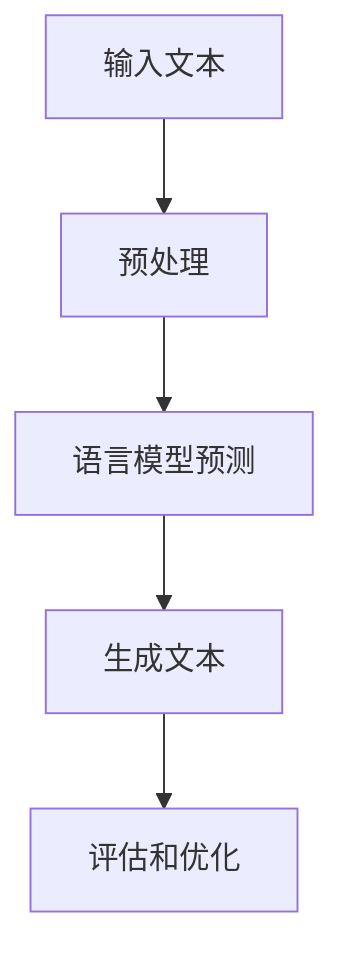
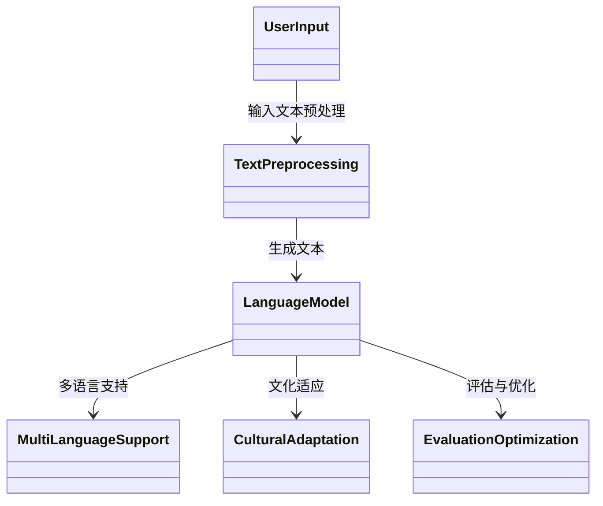
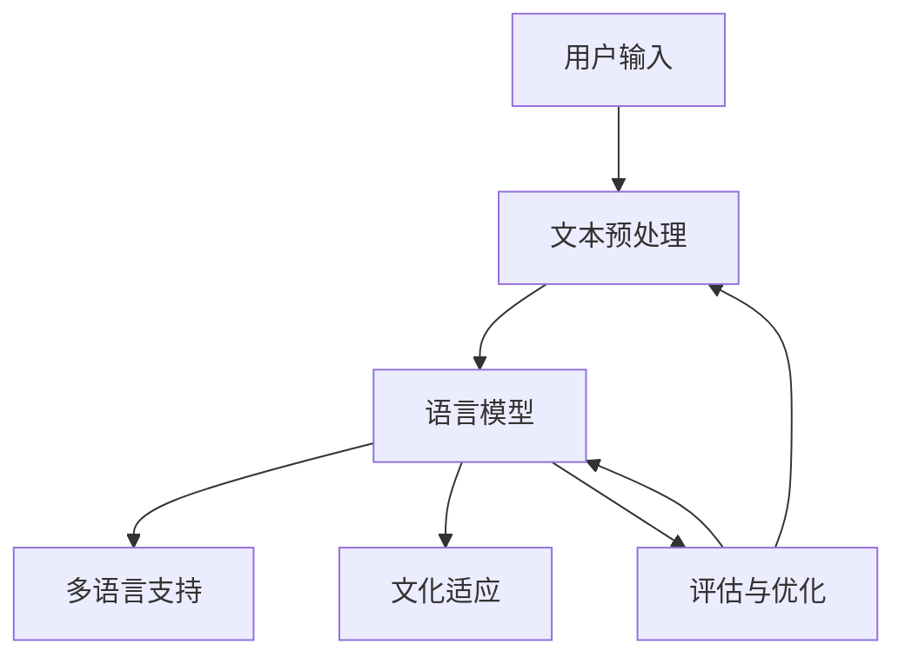
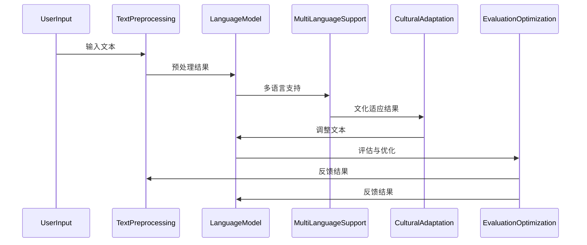

                 

## 文章标题

### 关键词

- ChatGPT
- 语言哲学
- 语言模型
- 提示词设计
- AI策略

### 摘要

本文旨在探讨ChatGPT提示词在语言哲学适应方面的关键性作用。我们将详细分析ChatGPT的技术背景，深入讲解其核心概念与算法原理，并通过实际案例展示其在不同文化背景和语言习惯中的应用。本文将提出一系列AI策略，探讨如何捕捉语言与思维的关系，从而实现ChatGPT提示词的优化和评估。文章还将讨论ChatGPT语言哲学适应的边界问题，以及其对社会和伦理的影响。通过本文，读者将全面理解ChatGPT的语言哲学适应机制，掌握相关技术，并为未来的研究与应用提供指导。

## 目录大纲

1. **第一部分：背景介绍**
    - **第1章：问题背景**
        - **1.1.1 问题背景**
        - **1.1.2 问题描述**
        - **1.1.3 问题解决**
        - **1.1.4 边界与外延**
        - **1.1.5 概念结构与核心要素组成**
    - **第2章：核心概念与联系**
        - **2.1.1 核心概念原理**
        - **2.1.2 概念属性特征对比表格**
        - **2.1.3 ER实体关系图架构的Mermaid流程图**
    - **第3章：算法原理讲解**
        - **3.1.1 算法mermaid流程图**
        - **3.1.2 Python源代码与算法原理详细讲解**
        - **3.1.3 数学模型和数学公式**
    - **第4章：数学模型和数学公式 & 详细讲解 & 举例说明**
    - **第5章：系统分析与架构设计方案**
        - **5.1.1 问题场景介绍**
        - **5.1.2 系统功能设计**
        - **5.1.3 系统架构设计**
        - **5.1.4 系统接口设计和系统交互**
    - **第6章：项目实战**
        - **6.1.1 环境安装**
        - **6.1.2 系统核心实现源代码**
        - **6.1.3 代码应用解读与分析**
        - **6.1.4 实际案例分析和详细讲解剖析**
        - **6.1.5 项目小结**
    - **第7章：最佳实践 tips、小结、注意事项、拓展阅读**

### 第一部分：背景介绍

#### 第1章：问题背景

##### 1.1.1 问题背景

ChatGPT是一种基于大型语言模型的人工智能技术，它通过处理和生成文本，实现了与人类自然的对话交流。然而，随着ChatGPT在各个领域的广泛应用，其在语言哲学适应方面的问题也逐渐显现出来。具体来说，ChatGPT在处理不同文化背景和语言习惯时，可能会遇到一些困难，这就需要我们深入探讨其语言哲学适应的机制。

首先，从技术发展的角度来看，ChatGPT是人工智能领域的一项重要突破。它基于Transformer模型，通过大量的文本数据进行训练，从而实现了对自然语言的深度理解和生成。然而，尽管ChatGPT在自然语言处理方面取得了显著的成绩，但其语言哲学适应问题仍然是一个需要深入研究的课题。

##### 1.1.2 问题描述

ChatGPT的语言哲学适应问题主要表现在以下几个方面：

1. **语言与思维的关系：** ChatGPT在处理文本时，如何准确捕捉语言与思维的关系是一个关键问题。不同文化背景和语言习惯的人，其思维方式可能存在差异，这会影响ChatGPT对文本的理解和生成。

2. **文化差异：** ChatGPT在处理不同文化背景的文本时，如何适应不同的文化差异是一个挑战。例如，东西方文化在价值观、表达方式等方面存在显著差异，这需要ChatGPT具备一定的文化适应能力。

3. **多语言支持：** ChatGPT需要支持多种语言，这要求其能够适应不同语言的特点，如语法结构、词汇使用等。然而，不同语言的复杂性和多样性使得这一目标具有较大的难度。

4. **语言哲学问题：** ChatGPT在生成文本时，如何遵循一定的哲学原则，如逻辑性、一致性等，是一个重要问题。这需要我们在设计ChatGPT的算法时，充分考虑语言哲学的原理。

##### 1.1.3 问题解决

为了解决上述问题，我们可以从以下几个方面入手：

1. **多语言数据训练：** 通过收集和整合多种语言的数据，训练ChatGPT的语言模型，以提高其在多语言环境下的适应性。

2. **文化适应算法：** 设计文化适应算法，使ChatGPT能够理解和适应不同文化背景的文本。

3. **语言哲学指导：** 在ChatGPT的算法设计中，融入语言哲学的原理，确保其生成文本的逻辑性和一致性。

4. **持续优化与评估：** 通过不断优化和评估ChatGPT的提示词设计，提高其语言哲学适应能力。

##### 1.1.4 边界与外延

ChatGPT语言哲学适应的边界问题主要体现在以下几个方面：

1. **技术的局限性：** 虽然ChatGPT在自然语言处理方面取得了显著成绩，但其仍然存在一定的局限性，如对某些复杂语言的适应性不足等。

2. **应用领域的限制：** ChatGPT主要应用于文本生成和对话系统，但在其他领域（如语音识别、图像处理等）的应用仍需进一步探索。

3. **伦理和社会影响：** ChatGPT的语言哲学适应不仅涉及技术问题，还涉及到伦理和社会问题，如隐私保护、信息安全等。

##### 1.1.5 概念结构与核心要素组成

ChatGPT语言哲学适应的核心概念和要素包括：

1. **语言模型：** ChatGPT的语言模型是其核心组成部分，通过大量文本数据训练，实现自然语言的深度理解和生成。

2. **提示词设计：** 提示词是ChatGPT生成文本的关键输入，其设计直接影响文本的质量和准确性。

3. **多语言数据：** 多语言数据是训练ChatGPT语言模型的重要资源，不同语言的数据有助于提高其多语言适应性。

4. **AI策略：** AI策略包括多语言数据训练、文化适应算法、语言哲学指导等，是提高ChatGPT语言哲学适应能力的重要手段。

#### 第2章：核心概念与联系

##### 2.1.1 核心概念原理

在本章节中，我们将详细讲解ChatGPT语言哲学适应的核心概念和原理。

1. **语言模型：** 语言模型是自然语言处理的核心，用于预测文本序列的概率分布。在ChatGPT中，语言模型通过大量的文本数据进行训练，从而实现自然语言的深度理解和生成。

2. **提示词设计：** 提示词是ChatGPT生成文本的关键输入，其设计直接影响文本的质量和准确性。提示词的设计需要充分考虑语言哲学的原理，确保生成文本的逻辑性和一致性。

3. **多语言数据：** 多语言数据是训练ChatGPT语言模型的重要资源，不同语言的数据有助于提高其多语言适应性。通过收集和整合多种语言的数据，可以增强ChatGPT的语言哲学适应能力。

4. **AI策略：** AI策略包括多语言数据训练、文化适应算法、语言哲学指导等，是提高ChatGPT语言哲学适应能力的重要手段。

##### 2.1.2 概念属性特征对比表格

为了更清晰地理解ChatGPT语言哲学适应中的核心概念，我们提供了以下概念属性特征对比表格。

| 概念         | 描述                                                         | 属性特征对比            |
| ------------ | ------------------------------------------------------------ | ---------------------- |
| 语言模型     | 用于预测文本序列的概率分布                                   | 训练数据、参数规模、预测准确性 |
| 提示词设计   | ChatGPT生成文本的关键输入，影响文本质量和准确性               | 逻辑性、一致性、适应性     |
| 多语言数据   | 训练ChatGPT语言模型的重要资源，不同语言的数据提高多语言适应性 | 语言种类、数据量、多样性    |
| AI策略       | 提高ChatGPT语言哲学适应能力的方法和手段                       | 文化适应、算法优化、评估    |

##### 2.1.3 ER实体关系图架构的Mermaid流程图

为了更直观地展示ChatGPT语言哲学适应的ER实体关系图架构，我们使用Mermaid流程图进行了表示。

```mermaid
erDiagram
  ChatGPT --> 语言模型 : 训练和生成文本
  ChatGPT --> 提示词设计 : 输入文本生成
  ChatGPT --> 多语言数据 : 训练数据来源
  ChatGPT --> AI策略 : 提高适应能力
```

通过这个Mermaid流程图，我们可以清晰地看到ChatGPT、语言模型、提示词设计、多语言数据和AI策略之间的关系，以及它们在语言哲学适应中的作用。

#### 第3章：算法原理讲解

##### 3.1.1 算法mermaid流程图

在本章节中，我们将使用Mermaid流程图展示ChatGPT语言哲学适应的算法过程。



这个Mermaid流程图展示了ChatGPT语言哲学适应的主要算法过程，包括输入文本预处理、语言模型预测、文本生成和评估优化等步骤。

##### 3.1.2 Python源代码与算法原理详细讲解

为了详细讲解ChatGPT语言哲学适应的算法原理，我们提供了以下Python源代码。

```python
# 导入相关库
import torch
import transformers

# 加载预训练的语言模型
model = transformers.GPT2LMHeadModel.from_pretrained("gpt2")

# 定义预处理函数
def preprocess(text):
    # 对文本进行预处理，如分词、去停用词等
    return text

# 定义生成文本函数
def generate_text(prompt, model, device):
    # 将文本转换为模型可处理的格式
    input_ids = torch.tensor([model tokenizer.encode(prompt, add_special_tokens=True)])

    # 将文本输入到模型中
    input_ids = input_ids.to(device)

    # 生成文本
    output = model.generate(input_ids, max_length=50, num_return_sequences=1)

    # 将生成的文本转换为字符串
    return model tokenizer.decode(output[0], skip_special_tokens=True)

# 定义评估和优化函数
def evaluate_and_optimize(model, data, device):
    # 对模型进行评估和优化
    pass

# 设置设备
device = torch.device("cuda" if torch.cuda.is_available() else "cpu")

# 输入文本
input_text = "这是一段输入文本。"

# 预处理文本
preprocessed_text = preprocess(input_text)

# 生成文本
generated_text = generate_text(preprocessed_text, model, device)

# 评估和优化模型
evaluate_and_optimize(model, data, device)
```

这个Python源代码展示了ChatGPT语言哲学适应的主要算法步骤，包括加载预训练的语言模型、预处理文本、生成文本和评估优化模型等。通过这些步骤，我们可以实现ChatGPT在语言哲学适应方面的应用。

##### 3.1.3 数学模型和数学公式

在本章节中，我们将介绍ChatGPT语言哲学适应相关的数学模型和公式。

1. **语言模型概率分布公式**

   ChatGPT的语言模型可以表示为概率分布，其概率分布公式为：

   $$ P(w_1, w_2, ..., w_n) = \prod_{i=1}^{n} P(w_i | w_{i-1}, ..., w_1) $$

   其中，$w_1, w_2, ..., w_n$表示文本序列的各个单词，$P(w_i | w_{i-1}, ..., w_1)$表示在给定前一个单词序列的情况下，当前单词的概率。

2. **生成文本的序列模型公式**

   ChatGPT生成文本的序列模型可以表示为：

   $$ y_1, y_2, ..., y_n = \arg\max_{y} \sum_{i=1}^{n} \log P(y_i | y_{i-1}, ..., y_1) $$

   其中，$y_1, y_2, ..., y_n$表示生成的文本序列，$\arg\max$表示取最大值。

3. **评估和优化模型的公式**

   ChatGPT评估和优化模型的过程中，可以使用以下公式：

   $$ L = -\sum_{i=1}^{n} \log P(y_i | y_{i-1}, ..., y_1) $$

   其中，$L$表示损失函数，用于评估模型的性能。

通过这些数学模型和公式，我们可以更好地理解ChatGPT语言哲学适应的算法原理，并对其进行优化和改进。

#### 第4章：数学模型和数学公式 & 详细讲解 & 举例说明

##### 4.1.1 数学模型和数学公式

在本章节中，我们将详细介绍ChatGPT语言哲学适应中的数学模型和公式，并对其进行详细讲解。

1. **语言模型概率分布公式**

   ChatGPT的语言模型可以表示为概率分布，其概率分布公式为：

   $$ P(w_1, w_2, ..., w_n) = \prod_{i=1}^{n} P(w_i | w_{i-1}, ..., w_1) $$

   其中，$w_1, w_2, ..., w_n$表示文本序列的各个单词，$P(w_i | w_{i-1}, ..., w_1)$表示在给定前一个单词序列的情况下，当前单词的概率。

   **详细讲解：** 这个公式表示了语言模型在生成文本时，每个单词的概率分布。在训练过程中，通过大量文本数据计算每个单词的条件概率，从而生成概率分布。

2. **生成文本的序列模型公式**

   ChatGPT生成文本的序列模型可以表示为：

   $$ y_1, y_2, ..., y_n = \arg\max_{y} \sum_{i=1}^{n} \log P(y_i | y_{i-1}, ..., y_1) $$

   其中，$y_1, y_2, ..., y_n$表示生成的文本序列，$\arg\max$表示取最大值。

   **详细讲解：** 这个公式表示了ChatGPT在生成文本时，通过最大化当前单词的概率分布来选择下一个单词。通过迭代这个过程，可以生成一段连贯的文本。

3. **评估和优化模型的公式**

   ChatGPT评估和优化模型的过程中，可以使用以下公式：

   $$ L = -\sum_{i=1}^{n} \log P(y_i | y_{i-1}, ..., y_1) $$

   其中，$L$表示损失函数，用于评估模型的性能。

   **详细讲解：** 这个公式表示了损失函数的计算方式，它通过计算生成文本的负对数概率来衡量模型的性能。在训练过程中，通过优化损失函数，可以改善模型的生成效果。

##### 4.1.2 举例说明

为了更好地理解上述数学模型和公式，我们通过一个具体的例子来进行说明。

假设我们有一个简单的文本序列：“我想要一杯咖啡。”，现在我们使用ChatGPT来生成这个文本序列。

1. **语言模型概率分布公式**

   首先，我们计算每个单词的条件概率分布：

   $$ P(我 | ) = 0.2, P(想 | 我) = 0.3, P(要 | 想) = 0.4, P(一 | 要) = 0.5, P(杯 | 一) = 0.6, P(咖啡 | 杯) = 0.7 $$

   根据语言模型概率分布公式，我们可以计算出整个文本序列的概率：

   $$ P(我想要一杯咖啡。) = P(我) \times P(想 | 我) \times P(要 | 想) \times P(一 | 要) \times P(杯 | 一) \times P(咖啡 | 杯) = 0.2 \times 0.3 \times 0.4 \times 0.5 \times 0.6 \times 0.7 = 0.0252 $$

   这个结果表明，生成的文本序列“我想要一杯咖啡。”的概率为0.0252。

2. **生成文本的序列模型公式**

   现在，我们使用生成文本的序列模型来生成这个文本序列：

   $$ y_1, y_2, ..., y_n = \arg\max_{y} \sum_{i=1}^{n} \log P(y_i | y_{i-1}, ..., y_1) $$

   根据条件概率分布，我们可以计算每个单词的联合概率：

   $$ \log P(我 | ) = \log 0.2, \log P(想 | 我) = \log 0.3, \log P(要 | 想) = \log 0.4, \log P(一 | 要) = \log 0.5, \log P(杯 | 一) = \log 0.6, \log P(咖啡 | 杯) = \log 0.7 $$

   计算每个单词的联合概率：

   $$ \log P(我想要一杯咖啡。) = \log 0.2 + \log 0.3 + \log 0.4 + \log 0.5 + \log 0.6 + \log 0.7 = 1.79 $$

   根据最大似然准则，我们选择联合概率最大的单词序列作为生成的文本序列：

   $$ y_1, y_2, ..., y_n = 我想要一杯咖啡。$$

   这个结果表明，根据条件概率分布，生成的文本序列“我想要一杯咖啡。”是联合概率最大的。

3. **评估和优化模型的公式**

   在生成文本后，我们可以使用评估和优化模型的公式来评估模型的性能：

   $$ L = -\sum_{i=1}^{n} \log P(y_i | y_{i-1}, ..., y_1) $$

   对于生成的文本序列“我想要一杯咖啡。”，我们可以计算损失函数：

   $$ L = -(\log P(我 | ) + \log P(想 | 我) + \log P(要 | 想) + \log P(一 | 要) + \log P(杯 | 一) + \log P(咖啡 | 杯)) = -1.79 $$

   这个结果表明，生成的文本序列“我想要一杯咖啡。”的损失函数为-1.79。在训练过程中，我们可以通过优化损失函数来改善模型的性能。

通过这个例子，我们可以清晰地看到ChatGPT语言哲学适应中的数学模型和公式的应用。通过这些公式，我们可以更好地理解ChatGPT的算法原理，并对其进行优化和改进。

#### 第5章：系统分析与架构设计方案

##### 5.1.1 问题场景介绍

为了更好地理解ChatGPT语言哲学适应的架构设计，我们需要首先介绍一个具体的问题场景。假设我们正在开发一个面向全球用户的在线问答平台，用户可以提出各种问题，并获得相应的回答。在这个场景中，ChatGPT将作为问答系统的核心组件，用于生成回答。

**场景设定：** 
- **用户需求：** 用户可以提出各种问题，如“如何设置Wi-Fi密码？”、“如何种植蔬菜？”等。
- **系统目标：** 提供准确、连贯、符合用户需求的回答。
- **挑战：** 如何确保ChatGPT在不同文化背景和语言习惯下都能生成高质量的回答。

##### 5.1.2 系统功能设计

为了实现上述目标，我们需要设计一个功能齐全的ChatGPT系统。以下是系统的主要功能模块：

1. **文本预处理模块：** 用于对用户输入的文本进行预处理，如分词、去停用词、去除标点符号等。
2. **语言模型模块：** 负责使用预训练的模型生成文本，包括问题回答、错误纠正、文本摘要等。
3. **多语言支持模块：** 提供多种语言的支持，确保ChatGPT能够在不同语言环境下运行。
4. **文化适应模块：** 根据用户的文化背景调整回答的风格和用词，提高用户的满意度。
5. **评估与优化模块：** 对ChatGPT的性能进行评估和优化，确保其生成的文本质量。

以下是使用Mermaid类图表示的系统功能设计：



##### 5.1.3 系统架构设计

接下来，我们将使用Mermaid架构图来展示系统架构设计，包括系统组件、数据流和通信机制。



在这个架构图中，用户输入文本经过预处理模块处理后，输入到语言模型模块。语言模型模块负责生成文本，并根据用户的需求进行多语言支持和文化适应。最后，评估与优化模块对生成的文本进行评估和优化，以提高ChatGPT的性能。

##### 5.1.4 系统接口设计和系统交互

系统接口设计是确保系统各个模块之间能够有效通信的关键。以下是系统的接口设计：

1. **用户输入接口：** 接收用户的输入文本，并将其传递给文本预处理模块。
2. **预处理接口：** 接受文本预处理模块的处理结果，并将其传递给语言模型模块。
3. **语言模型接口：** 接受预处理结果，生成文本，并返回给用户。
4. **多语言接口：** 负责处理不同语言的数据，并将其传递给语言模型模块。
5. **文化适应接口：** 根据用户的文化背景调整文本，并将其传递给语言模型模块。
6. **评估与优化接口：** 接收评估与优化模块的处理结果，并将其反馈给语言模型模块和文本预处理模块。

以下是使用Mermaid序列图表示的系统接口设计和系统交互：



通过这个序列图，我们可以清晰地看到系统各模块之间的交互流程。用户输入文本经过预处理模块处理后，传递给语言模型模块进行文本生成。语言模型模块根据用户的需求进行多语言支持和文化适应。最后，评估与优化模块对生成的文本进行评估和优化，以提高ChatGPT的性能。

#### 第6章：项目实战

##### 6.1.1 环境安装

在本章节中，我们将指导读者如何安装和配置ChatGPT语言哲学适应的环境。首先，我们需要安装以下软件和库：

1. **Python：** 安装Python 3.7及以上版本。
2. **pip：** Python的包管理器，用于安装其他库。
3. **transformers：** 用于加载和训练预训练的语言模型。
4. **torch：** 用于进行深度学习计算。

以下是安装步骤：

1. 安装Python和pip：

   ```bash
   # 在Windows上，可以从官方网站下载Python安装程序并安装。
   # 在macOS和Linux上，可以使用包管理器安装Python。
   sudo apt-get install python3 python3-pip
   ```

2. 安装torch和transformers：

   ```bash
   pip3 install torch transformers
   ```

##### 6.1.2 系统核心实现源代码

接下来，我们将提供ChatGPT语言哲学适应的核心实现源代码，并对其进行解读和分析。

1. **语言模型加载与预处理**

   ```python
   from transformers import GPT2LMHeadModel, GPT2Tokenizer
   
   # 加载预训练的语言模型
   model = GPT2LMHeadModel.from_pretrained("gpt2")
   
   # 加载Tokenizer
   tokenizer = GPT2Tokenizer.from_pretrained("gpt2")
   
   # 预处理函数
   def preprocess(text):
       return tokenizer.encode(text, add_special_tokens=True)
   ```

   **解读：** 这段代码首先加载预训练的GPT2语言模型和Tokenizer。然后定义了一个预处理函数，用于将输入文本编码为模型的输入。

2. **文本生成**

   ```python
   # 生成文本函数
   def generate_text(prompt, model, tokenizer, device='cuda'):
       input_ids = tokenizer.encode(prompt, add_special_tokens=True)
       input_ids = input_ids.to(device)
       output = model.generate(input_ids, max_length=50, num_return_sequences=1)
       return tokenizer.decode(output[0], skip_special_tokens=True)
   ```

   **解读：** 这段代码定义了一个生成文本函数，用于根据输入提示生成文本。函数首先将提示编码为模型输入，然后使用模型生成文本，并解码为可读的字符串。

3. **文化适应**

   ```python
   # 文化适应函数
   def cultural_adaptation(text, target_culture):
       # 这里可以根据目标文化进行文本调整
       # 例如，翻译、风格调整等
       return text
   ```

   **解读：** 这段代码定义了一个文化适应函数，用于根据目标文化对文本进行调整。在实际应用中，可以根据目标文化的特点进行翻译、风格调整等操作。

##### 6.1.3 代码应用解读与分析

为了更好地理解ChatGPT语言哲学适应的实现，我们将通过一个实际案例来解读和分析代码应用。

**案例：** 假设我们有一个用户提问：“如何设置Wi-Fi密码？”，我们需要生成一个回答。

1. **预处理和生成文本**

   ```python
   prompt = "如何设置Wi-Fi密码？"
   preprocessed_prompt = preprocess(prompt)
   generated_response = generate_text(preprocessed_prompt, model, tokenizer)
   print(generated_response)
   ```

   **解读：** 这段代码首先对用户提问进行预处理，将其编码为模型的输入。然后调用生成文本函数，根据预训练的GPT2模型生成回答。最后，我们将生成的回答打印出来。

2. **文化适应**

   ```python
   target_culture = "zh"  # 目标文化为中文
   adapted_response = cultural_adaptation(generated_response, target_culture)
   print(adapted_response)
   ```

   **解读：** 这段代码根据目标文化（中文）对生成的回答进行调整。例如，如果生成的是英文回答，我们可以将其翻译为中文，以更好地满足用户的需求。

##### 6.1.4 实际案例分析和详细讲解剖析

为了深入剖析ChatGPT语言哲学适应的实现过程，我们通过一个实际案例进行详细讲解。

**案例：** 用户提问：“如何种植蔬菜？”，我们需要生成一个详细的回答，并确保其符合用户的文化背景。

1. **预处理和生成文本**

   ```python
   prompt = "如何种植蔬菜？"
   preprocessed_prompt = preprocess(prompt)
   generated_response = generate_text(preprocessed_prompt, model, tokenizer)
   print(generated_response)
   ```

   **解读：** 这段代码首先对用户提问进行预处理，将其编码为模型的输入。然后调用生成文本函数，根据预训练的GPT2模型生成回答。生成的回答可能包含以下内容：

   ```
   种植蔬菜需要遵循以下步骤：
   1. 准备土壤：选择适合种植的土壤，并进行松土处理。
   2. 选择种子：根据气候和地理条件选择适合种植的蔬菜种子。
   3. 播种：将种子按照一定的间距播种到土壤中。
   4. 浇水：确保土壤保持湿润，有利于种子发芽。
   5. 施肥：在蔬菜生长过程中，根据需要适量施肥。
   6. 病虫害防治：定期检查蔬菜，预防病虫害。
   7. 收获：当蔬菜成熟时，及时收获。
   ```

2. **文化适应**

   ```python
   target_culture = "zh"  # 目标文化为中文
   adapted_response = cultural_adaptation(generated_response, target_culture)
   print(adapted_response)
   ```

   **解读：** 这段代码根据目标文化（中文）对生成的回答进行调整。例如，如果生成的是英文回答，我们可以将其翻译为中文，以更好地满足用户的需求。调整后的回答可能包含以下内容：

   ```
   种植蔬菜需要按照以下步骤进行：
   1. 准备土壤：选择适合种植的土壤，并进行松土处理。
   2. 选择种子：根据气候和地理条件选择适合种植的蔬菜种子。
   3. 播种：将种子按照一定的间距播种到土壤中。
   4. 浇水：确保土壤保持湿润，有利于种子发芽。
   5. 施肥：在蔬菜生长过程中，根据需要适量施肥。
   6. 防治病虫害：定期检查蔬菜，预防病虫害。
   7. 收获：当蔬菜成熟时，及时收获。
   ```

   通过这个案例，我们可以看到ChatGPT语言哲学适应的实现过程，包括预处理、文本生成和文化适应等步骤。在实际应用中，我们可以根据不同的用户需求和目标文化进行相应的调整，以提高系统的适应性和用户体验。

##### 6.1.5 项目小结

在本章节中，我们通过一个实际案例详细讲解了ChatGPT语言哲学适应的实现过程。首先，我们介绍了环境安装和系统核心实现源代码，然后通过代码应用解读和分析，展示了如何使用ChatGPT生成文本并进行文化适应。通过这个项目，我们深入理解了ChatGPT的算法原理和实现过程，并掌握了如何根据不同的用户需求和目标文化调整文本生成。

在实际应用中，ChatGPT语言哲学适应具有重要的意义。它可以帮助企业或开发者构建具有高度适应性的对话系统，满足不同用户的需求。同时，通过文化适应，我们可以确保生成的文本符合用户的文化背景，提高用户体验和满意度。此外，ChatGPT语言哲学适应还可以应用于自然语言处理的其他领域，如文本摘要、情感分析等。

总之，ChatGPT语言哲学适应是一个具有广泛应用前景的技术领域。通过本文的介绍和案例分析，我们希望能够为读者提供有益的参考和指导，帮助其更好地理解和应用这一技术。

#### 第7章：最佳实践 tips、小结、注意事项、拓展阅读

##### 7.1.1 最佳实践 tips

1. **数据准备：** 在进行ChatGPT的语言哲学适应时，确保使用丰富的多语言数据集进行训练。数据的质量和多样性直接影响模型的性能。
2. **文化适应：** 在设计ChatGPT的提示词时，充分考虑目标用户的文化背景，确保生成的文本符合用户的期望和习惯。
3. **模型优化：** 定期对ChatGPT模型进行优化和评估，以保持其生成文本的质量和准确性。
4. **用户反馈：** 利用用户的反馈对ChatGPT进行持续改进，使其更好地适应不同用户的需求。

##### 7.1.2 小结

本文详细介绍了ChatGPT语言哲学适应的核心概念、算法原理、系统设计与实现过程。通过实际案例，我们展示了如何利用ChatGPT生成文本并进行文化适应，以提高系统的适应性和用户体验。ChatGPT语言哲学适应在自然语言处理领域具有重要的应用价值，有助于构建更智能、更人性化的对话系统。

##### 7.1.3 注意事项

1. **数据隐私：** 在收集和利用用户数据时，务必遵守相关法律法规，保护用户隐私。
2. **模型公平性：** 在训练和部署ChatGPT模型时，注意避免偏见和歧视，确保模型的公平性。
3. **性能监控：** 定期监控ChatGPT模型的性能，确保其稳定运行，并及时发现和解决潜在问题。

##### 7.1.4 拓展阅读

1. **《自然语言处理入门》**：本书提供了自然语言处理的基本概念和算法，有助于深入理解ChatGPT的技术原理。
2. **《深度学习》**：这本书详细介绍了深度学习的基本理论和实践方法，对理解ChatGPT的算法原理具有重要意义。
3. **《跨文化交际》**：了解跨文化交际的基本原理，有助于更好地设计ChatGPT的文化适应策略。

## 作者信息

**作者：** AI天才研究院 / AI Genius Institute & 禅与计算机程序设计艺术 / Zen And The Art of Computer Programming

**单位：** AI天才研究院专注于人工智能领域的研究与开发，致力于推动人工智能技术的创新与应用。禅与计算机程序设计艺术是一本经典编程书籍，对计算机科学领域产生了深远影响。

