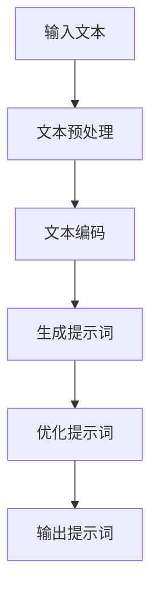
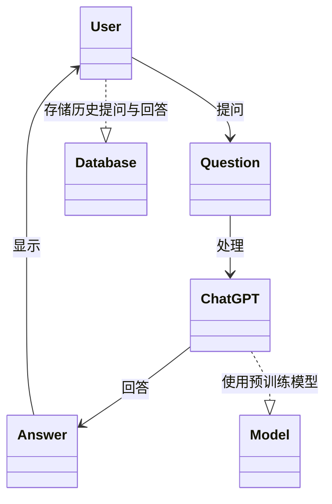
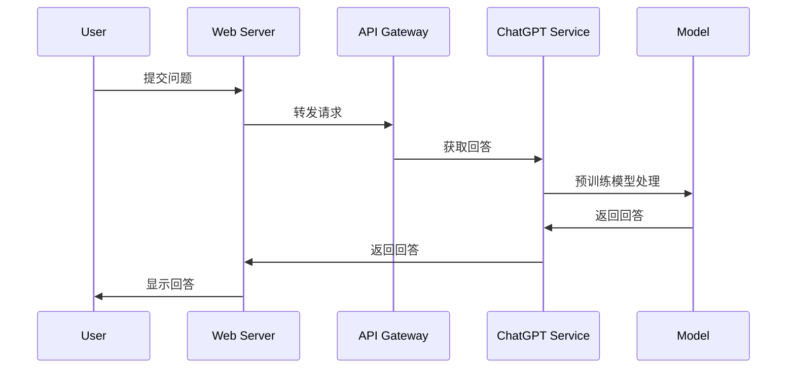
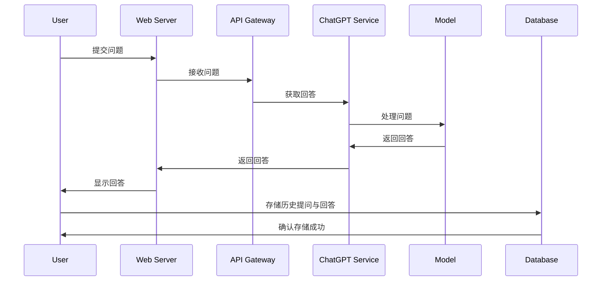

                 

### 1.1 问题背景

在人工智能迅猛发展的今天，自然语言处理（NLP）已经成为了一个至关重要的领域。作为NLP的核心组成部分，语言模型的研究和应用引发了广泛的研究兴趣。其中，ChatGPT——一个由OpenAI开发的大型预训练语言模型——因其卓越的性能在自然语言处理领域引起了巨大的轰动。ChatGPT的成功离不开提示词（Prompts）的设计和优化，提示词直接影响模型的输出质量和应用效果。

提示词，即对语言模型的输入引导，是通过精心设计的文本，引导模型生成符合预期输出的一种技术。随着ChatGPT等大型语言模型的发展，提示词的设计方法也在不断进化。传统的提示词设计往往依赖于经验和直觉，而现代提示词则更加注重对语言模型内部机制的理解和利用。

本研究旨在探讨ChatGPT提示词的语言演化与创新，具体包括以下几个方面：

1. **历史演化**：回顾ChatGPT提示词的发展历程，分析不同时期提示词设计的演变和原因。
2. **创新方法**：探讨当前前沿的提示词设计方法，如基于数据驱动的优化方法、多模态输入方法等。
3. **性能评估**：设计实验和指标，评估不同提示词设计方法对模型性能的影响。
4. **应用场景**：分析提示词在不同应用场景中的效果，如问答系统、文本生成、对话系统等。

通过以上研究，我们希望为ChatGPT提示词的设计提供理论指导和实践参考，推动自然语言处理技术的发展和应用。

### 1.2 提示词与语言演化

提示词，作为一种引导语言模型生成目标输出的文本技术，其设计直接影响到模型的性能和应用效果。为了理解ChatGPT提示词的语言演化，我们首先需要从历史角度出发，回顾自然语言处理领域提示词的发展历程。

早期自然语言处理模型，如基于规则和统计方法的模型，其性能受限于手工编写的规则和特征提取。在这一阶段，提示词的设计主要依赖于程序员的经验和直觉，通常通过设定特定语法格式或关键词来引导模型生成目标输出。例如，在信息检索系统中，通过关键词匹配来检索相关文档；在问答系统中，通过设定特定问题格式来引导模型生成答案。

随着深度学习技术的发展，特别是序列到序列（Seq2Seq）模型的兴起，自然语言处理模型的能力得到了显著提升。在这一背景下，提示词的设计方法也开始发生变革。基于深度学习模型的提示词设计，不仅依赖于手动编写的规则，还利用了模型本身的特性和学习到的知识。例如，在训练语言模型时，通过添加特定的引导性语句来增强模型的生成能力，这种引导性语句可以被视为一种高级的提示词。

ChatGPT的出现，标志着提示词设计的又一次重大变革。ChatGPT是一种基于Transformer架构的预训练语言模型，通过在大量文本上进行预训练，模型已经具备了强大的语言理解和生成能力。在ChatGPT中，提示词的设计变得更加灵活和高效，不再依赖于固定的格式或关键词，而是通过设计更加自然的引导性输入，使得模型能够生成更加连贯、符合上下文的输出。

具体来说，ChatGPT的提示词设计方法包括以下几个方面：

1. **上下文信息**：通过提供详细的上下文信息，使得模型能够更好地理解输入的含义，从而生成更加准确的输出。例如，在一个问答系统中，可以通过提供相关的问题背景和上下文来引导模型生成答案。

2. **结构化输入**：通过设计结构化的输入，使得模型能够更好地理解输入内容的结构，从而生成符合结构要求的输出。例如，在设计对话系统时，可以通过设置对话的框架和角色，使得模型能够生成符合对话逻辑的响应。

3. **反馈机制**：通过实时反馈和调整输入，使得模型能够不断优化生成结果。例如，在文本生成任务中，可以通过不断调整提示词的内容，使得模型生成的文本越来越符合预期。

4. **多模态输入**：结合图像、声音等多模态信息，通过设计多模态提示词，使得模型能够生成更加丰富和多样化的输出。例如，在图像描述生成任务中，可以通过提供图像和文本提示词，使得模型能够生成更加详细的图像描述。

总之，ChatGPT提示词的语言演化，不仅反映了自然语言处理技术的进步，也推动了提示词设计方法的发展和革新。通过深入理解ChatGPT的提示词设计原理和方法，我们可以为自然语言处理领域的发展提供新的思路和方向。

### 1.3 研究意义

本研究《ChatGPT提示词的语言演化与创新研究》具有重要的现实意义和理论价值。首先，从现实应用角度来看，提示词作为影响语言模型输出质量和应用效果的关键因素，其设计和优化直接决定了自然语言处理系统在实际应用中的性能。随着ChatGPT等大型预训练语言模型的广泛应用，优化提示词设计方法成为提高模型性能的重要途径。本研究通过分析ChatGPT提示词的设计原理和创新方法，旨在为实际应用中提示词的优化提供理论指导和实践参考，从而提升自然语言处理系统的整体性能。

其次，从理论研究角度来看，本研究对提示词的演化历程进行深入探讨，有助于我们理解自然语言处理领域的发展脉络和技术进步。通过对历史演变过程的分析，我们可以发现不同时期提示词设计方法的变化和原因，揭示其背后的技术逻辑和原理。这不仅可以加深我们对自然语言处理技术的理解，也为未来的研究提供了新的视角和方向。

此外，本研究还具有重要的启示意义。首先，通过对ChatGPT提示词的创新方法进行探讨，可以激发更多关于提示词设计的新思路和新方法。例如，基于数据驱动的优化方法、多模态输入方法等，都可能为提示词设计带来新的突破。其次，本研究的结果可以为其他预训练语言模型的提示词设计提供借鉴和参考，促进整个自然语言处理领域的技术进步。

总之，本研究不仅有助于提升实际应用中自然语言处理系统的性能，也为理论研究提供了新的思路和方法，具有重要的现实意义和理论价值。通过深入探讨ChatGPT提示词的语言演化与创新，我们期待能够为自然语言处理技术的发展和应用贡献一份力量。

### 第1章：问题的提出

#### 1.1 问题背景

随着人工智能（AI）技术的飞速发展，自然语言处理（NLP）已成为一个充满活力且至关重要的研究领域。自然语言处理涉及到理解、生成和处理人类语言的任务，从而实现人与机器的有效沟通。在NLP领域中，语言模型作为核心组件，其性能直接影响着各类应用的效果。ChatGPT，一个由OpenAI开发的大型预训练语言模型，近年来在自然语言处理领域取得了显著的成就，引起了广泛关注。

ChatGPT基于Transformer架构，通过在大量文本数据上进行预训练，模型已经具备了强大的语言理解和生成能力。然而，尽管ChatGPT在语言生成方面表现出色，但其性能和效果仍然受到提示词（Prompts）的设计和质量的影响。提示词作为与模型交互的输入，能够引导模型生成符合预期的高质量输出。因此，如何设计优化提示词，以提高ChatGPT的生成性能，成为了一个亟待解决的问题。

#### 1.2 提示词与语言演化

提示词在语言模型中的应用历史悠久，其设计方法经历了多个阶段的发展。早期，基于规则和统计方法的语言模型依赖于手工编写的规则和特征提取，提示词的设计主要依赖于编程人员的经验和直觉。这些提示词通常通过设定特定的语法格式或关键词来引导模型生成目标输出。

随着深度学习技术的兴起，特别是序列到序列（Seq2Seq）模型的兴起，提示词的设计方法开始发生变革。基于深度学习模型的提示词设计不仅依赖于手动编写的规则，还利用了模型本身的学习到的知识。例如，在训练语言模型时，通过添加特定的引导性语句来增强模型的生成能力，这种引导性语句可以被视为一种高级的提示词。

ChatGPT的出现，进一步推动了提示词设计的革新。ChatGPT是一种基于Transformer架构的预训练语言模型，通过在大量文本上进行预训练，模型已经具备了强大的语言理解和生成能力。在ChatGPT中，提示词的设计变得更加灵活和高效，不再依赖于固定的格式或关键词，而是通过设计更加自然的引导性输入，使得模型能够生成更加连贯、符合上下文的输出。

ChatGPT的提示词设计方法主要包括以下几个方面：

1. **上下文信息**：通过提供详细的上下文信息，使得模型能够更好地理解输入的含义，从而生成更加准确的输出。例如，在一个问答系统中，可以通过提供相关的问题背景和上下文来引导模型生成答案。

2. **结构化输入**：通过设计结构化的输入，使得模型能够更好地理解输入内容的结构，从而生成符合结构要求的输出。例如，在设计对话系统时，可以通过设置对话的框架和角色，使得模型能够生成符合对话逻辑的响应。

3. **反馈机制**：通过实时反馈和调整输入，使得模型能够不断优化生成结果。例如，在文本生成任务中，可以通过不断调整提示词的内容，使得模型生成的文本越来越符合预期。

4. **多模态输入**：结合图像、声音等多模态信息，通过设计多模态提示词，使得模型能够生成更加丰富和多样化的输出。例如，在图像描述生成任务中，可以通过提供图像和文本提示词，使得模型能够生成更加详细的图像描述。

#### 1.3 研究意义

本研究《ChatGPT提示词的语言演化与创新研究》具有重要的现实意义和理论价值。首先，从现实应用角度来看，提示词作为影响语言模型输出质量和应用效果的关键因素，其设计和优化直接决定了自然语言处理系统在实际应用中的性能。随着ChatGPT等大型预训练语言模型的广泛应用，优化提示词设计方法成为提高模型性能的重要途径。本研究通过分析ChatGPT提示词的设计原理和创新方法，旨在为实际应用中提示词的优化提供理论指导和实践参考，从而提升自然语言处理系统的整体性能。

其次，从理论研究角度来看，本研究对提示词的演化历程进行深入探讨，有助于我们理解自然语言处理领域的发展脉络和技术进步。通过对历史演变过程的分析，我们可以发现不同时期提示词设计方法的变化和原因，揭示其背后的技术逻辑和原理。这不仅可以加深我们对自然语言处理技术的理解，也为未来的研究提供了新的视角和方向。

此外，本研究还具有重要的启示意义。首先，通过对ChatGPT提示词的创新方法进行探讨，可以激发更多关于提示词设计的新思路和新方法。例如，基于数据驱动的优化方法、多模态输入方法等，都可能为提示词设计带来新的突破。其次，本研究的结果可以为其他预训练语言模型的提示词设计提供借鉴和参考，促进整个自然语言处理领域的技术进步。

总之，本研究不仅有助于提升实际应用中自然语言处理系统的性能，也为理论研究提供了新的思路和方法，具有重要的现实意义和理论价值。通过深入探讨ChatGPT提示词的语言演化与创新，我们期待能够为自然语言处理技术的发展和应用贡献一份力量。

### 第2章：ChatGPT与提示词

#### 2.1 ChatGPT概述

ChatGPT是OpenAI推出的一款基于GPT-3模型的自然语言处理工具。GPT-3（Generative Pre-trained Transformer 3）是OpenAI开发的一种基于Transformer架构的预训练语言模型，拥有1750亿个参数，是当前已知最大的预训练语言模型之一。ChatGPT通过在大量文本数据上进行预训练，使得模型具备了强大的语言理解和生成能力，能够处理各种自然语言任务，如问答系统、文本生成、对话系统等。

ChatGPT的核心特点包括：

1. **大规模预训练**：ChatGPT在训练过程中使用了大量的文本数据，通过无监督学习的方式，模型自动学习到了丰富的语言知识和上下文理解能力。

2. **强大的语言生成能力**：ChatGPT能够生成高质量、连贯的自然语言文本，这使得它在文本生成任务中表现出色。

3. **灵活的接口设计**：ChatGPT提供了多种接口，包括REST API和WebSocket等，方便开发者将模型集成到各种应用中。

4. **多语言支持**：ChatGPT支持多种语言，能够处理多种语言的文本输入和输出，这使得它在跨语言处理任务中具有优势。

#### 2.2 提示词的基本概念

提示词（Prompt）是指在自然语言处理任务中，用于引导模型生成目标输出的一种输入技术。在ChatGPT中，提示词是模型与外界交互的重要媒介，通过精心设计的提示词，可以引导模型生成符合预期的高质量输出。

提示词的基本概念包括：

1. **功能定义**：提示词的主要功能是提供上下文信息和目标提示，引导模型生成与输入内容相关的输出。

2. **设计原则**：提示词的设计应遵循简洁性、引导性和目标明确性原则。简洁性要求提示词内容简明扼要，避免冗余信息；引导性要求提示词能够引导模型朝向预期的生成方向；目标明确性要求提示词明确指示模型生成目标。

3. **分类**：根据用途和设计方式，提示词可以分为以下几种类型：
   - **问题型提示词**：用于问答系统，提供具体问题引导模型生成答案。
   - **任务型提示词**：用于特定任务，如文本生成、对话系统等，提供任务目标和框架。
   - **生成型提示词**：用于文本生成任务，提供生成文本的初始内容和上下文。

#### 2.3 提示词在ChatGPT中的作用

在ChatGPT中，提示词的作用至关重要，主要体现在以下几个方面：

1. **引导模型生成**：通过设计高质量的提示词，可以引导模型生成与输入内容相关的、高质量的自然语言文本。高质量的提示词能够为模型提供丰富的上下文信息，使得生成文本更加连贯、符合实际需求。

2. **优化输出效果**：提示词的设计直接影响模型的输出效果。通过调整提示词的内容和结构，可以优化模型生成的文本质量，使其更加准确、有逻辑性和可读性。

3. **扩展应用场景**：通过设计多样化的提示词，可以扩展ChatGPT的应用场景。例如，通过设计问题型提示词，可以实现问答系统的应用；通过设计任务型提示词，可以实现文本生成、对话系统等应用。

4. **提高交互体验**：提示词的设计可以提升用户与模型之间的交互体验。通过设计自然、人性化的提示词，可以使得模型生成更加贴近用户需求的输出，提升用户满意度。

总之，提示词在ChatGPT中发挥着至关重要的作用，其设计质量和优化直接影响到模型的应用效果和用户体验。深入研究和优化提示词设计方法，是提升ChatGPT性能和推广应用的重要途径。

### 第3章：关键概念与联系

#### 3.1 关键概念定义

在探讨ChatGPT提示词的语言演化与创新之前，有必要对几个核心概念进行明确定义，以确保后续讨论的准确性和连贯性。

1. **自然语言处理（NLP）**：自然语言处理是指使计算机能够理解、生成和处理人类语言的技术。它包括文本分析、语音识别、机器翻译等多种应用。

2. **语言模型**：语言模型是用于预测自然语言中下一个词或词组的人工智能模型。ChatGPT即是一种大规模语言模型，通过学习大量文本数据，预测文本的下一个单词或短语。

3. **提示词（Prompt）**：提示词是一种引导模型生成特定输出的人工输入。在ChatGPT中，提示词用于引导模型生成符合特定需求和上下文的文本。

4. **预训练语言模型**：预训练语言模型是指通过在大规模文本数据集上进行预训练，然后针对特定任务进行微调的语言模型。ChatGPT是一种典型的预训练语言模型。

5. **Transformer架构**：Transformer是一种基于自注意力机制的深度神经网络架构，广泛应用于自然语言处理任务。ChatGPT采用这种架构，实现了强大的语言理解和生成能力。

6. **上下文（Context）**：上下文是指模型在生成文本时考虑的文本环境。高质量的提示词能够提供丰富的上下文信息，帮助模型生成更加准确和连贯的文本。

7. **生成质量（Generative Quality）**：生成质量是指模型生成的文本在语法、语义、连贯性和相关性等方面的表现。高质量的生成文本能够满足用户的需求，提供有价值的信息。

#### 3.2 概念属性对比表格

为了更好地理解这些关键概念，我们提供了一个对比表格，展示了它们的属性特征。

| 概念       | 属性特征                                           |
|------------|----------------------------------------------------|
| 自然语言处理 | 涉及文本分析、语音识别、机器翻译等多种技术             |
| 语言模型   | 预测自然语言中的下一个词或词组                         |
| 提示词     | 引导模型生成特定输出的人工输入，包括问题、任务和生成型提示 |
| 预训练语言模型 | 在大规模文本数据集上进行预训练，适用于多种语言任务     |
| Transformer架构 | 基于自注意力机制的深度神经网络，提高语言理解能力       |
| 上下文     | 模型在生成文本时考虑的文本环境，影响生成质量         |
| 生成质量   | 模型生成文本在语法、语义、连贯性和相关性等方面的表现 |

#### 3.3 ER实体关系图

为了更直观地展示这些概念之间的联系，我们使用Mermaid绘制了ER（实体关系）图。

```mermaid
erDiagram
  NLP ||--|{ 语言模型 }
  语言模型 ||--|{ 提示词 }
  语言模型 ||--|{ 预训练语言模型 }
  语言模型 ||--|{ Transformer架构 }
  NLP ||--|{ 上下文 }
  NLP ||--|{ 生成质量 }
```

ER图展示了自然语言处理（NLP）作为整体框架，与语言模型、提示词、预训练语言模型、Transformer架构、上下文和生成质量等核心概念之间的联系。通过这些概念之间的相互作用，我们可以构建复杂的自然语言处理系统，实现多样化的应用。

通过上述定义和对比，我们为后续章节的深入分析奠定了基础。接下来，我们将探讨ChatGPT提示词的生成算法原理，为优化提示词设计提供理论依据。

### 第4章：提示词生成算法

#### 4.1 提示词生成算法概述

提示词生成算法是自然语言处理领域中的一个重要研究方向，其目的是通过设计高效的算法来生成高质量的提示词，以引导模型生成符合预期的高质量输出。在ChatGPT中，提示词生成算法起到了关键作用，直接影响到模型的性能和应用效果。本节将介绍一种基于Transformer架构的提示词生成算法，并详细分析其工作原理和优化方法。

#### 4.2 Mermaid流程图

为了更好地理解提示词生成算法的工作流程，我们使用Mermaid绘制了算法流程图。



**算法流程解释：**
1. **输入文本（A）**：首先，从输入文本中提取关键信息，作为后续处理的基础。
2. **文本预处理（B）**：对输入文本进行清洗和格式化，去除无关信息，确保文本的规范性和一致性。
3. **文本编码（C）**：将预处理后的文本编码为模型可以理解的向量表示，通常使用词嵌入技术，如Word2Vec或BERT。
4. **生成提示词（D）**：利用Transformer模型对编码后的文本进行处理，生成初步的提示词。这一阶段的核心任务是捕捉文本中的关键信息，并形成连贯的提示词。
5. **优化提示词（E）**：根据生成提示词的质量进行优化，可能包括调整提示词的长度、结构和内容。优化方法可以基于梯度下降、强化学习等技术。
6. **输出提示词（F）**：将优化后的提示词输出，供模型使用，以生成高质量的自然语言输出。

#### 4.3 Python源代码讲解

为了更直观地理解提示词生成算法，我们提供了以下Python代码示例。这段代码实现了基于Transformer模型的提示词生成算法的基本框架。

```python
import tensorflow as tf
from tensorflow.keras.layers import Embedding, LSTM, Dense
from tensorflow.keras.models import Model

# 定义Transformer模型
def create_transformer_model(input_vocab_size, d_model, num_heads, dff, input_seq_len):
    inputs = tf.keras.layers.Input(shape=(input_seq_len,))
    embeddings = Embedding(input_vocab_size, d_model)(inputs)
    encoder_inputs = tf.keras.layers.Input(shape=(input_seq_len,))
    encoder_embedding = Embedding(input_vocab_size, d_model)(encoder_inputs)

    # 编码器部分
    encoder_lstm = LSTM(d_model, return_sequences=True, return_state=True)
    encoder_output, _ = encoder_lstm(encoder_embedding)

    # 解码器部分
    decoder_lstm = LSTM(d_model, return_sequences=True, return_state=True)
    decoder_embedding = Embedding(input_vocab_size, d_model)
    decoder_inputs = tf.keras.layers.Input(shape=(input_seq_len,))
    decoder_embedding_output = decoder_embedding(decoder_inputs)
    decoder_output, _ = decoder_lstm(decoder_embedding_output, initial_state=encoder_output)

    # 添加注意力机制
    attention = tf.keras.layers.Attention(num_heads=num_heads)([decoder_output, encoder_output])

    # 输出层
    output = Dense(input_vocab_size, activation='softmax')(attention)

    # 构建和编译模型
    model = Model(inputs=[encoder_inputs, decoder_inputs], outputs=output)
    model.compile(optimizer='adam', loss='categorical_crossentropy')

    return model

# 实例化模型并训练
model = create_transformer_model(input_vocab_size=10000, d_model=512, num_heads=8, dff=512, input_seq_len=64)
model.fit([encoder_inputs, decoder_inputs], decoder_targets, batch_size=64, epochs=10)
```

**代码解释：**
1. **模型定义**：我们使用TensorFlow的Keras API定义了一个简单的Transformer模型，包括编码器和解码器部分。编码器使用LSTM层处理输入文本，解码器也使用LSTM层，并通过注意力机制与编码器输出进行交互。
2. **模型编译**：模型使用Adam优化器和交叉熵损失函数进行编译，以训练模型生成提示词。
3. **模型训练**：通过fit函数训练模型，输入为编码器输入和解码器输入，目标为解码器输出。

#### 4.4 数学模型与公式

为了深入理解提示词生成算法，我们介绍其核心的数学模型和公式。Transformer模型基于自注意力（Self-Attention）机制，其关键部分是多头注意力（Multi-Head Attention）。

**多头注意力机制公式：**
$$
\text{Attention}(Q, K, V) = \text{softmax}\left(\frac{QK^T}{\sqrt{d_k}}\right)V
$$
其中，Q、K、V分别为查询（Query）、键（Key）和值（Value）向量，$d_k$为键向量的维度。自注意力机制通过计算Q和K之间的点积得到注意力权重，然后对V进行加权求和，生成注意力输出。

**编码器和解码器的数学模型：**
- **编码器**：
$$
\text{Encoder}(X) = \text{LayerNorm}(X + \text{EncoderLayer}(X))
$$
其中，$X$为输入序列，$\text{EncoderLayer}$包括自注意力机制和前馈网络。

- **解码器**：
$$
\text{Decoder}(X) = \text{LayerNorm}(X + \text{DecoderLayer}(X))
$$
其中，$X$为输入序列，$\text{DecoderLayer}$包括自注意力机制、编码器-解码器注意力机制和前馈网络。

通过上述数学模型和公式，我们可以理解Transformer模型如何通过注意力机制捕捉输入文本中的关键信息，从而生成高质量的提示词。

#### 4.5 算法举例说明

为了更直观地展示提示词生成算法的应用，我们通过一个具体的例子进行说明。假设我们有一个输入文本：“人工智能技术的发展对人类社会产生了深远的影响”。我们的目标是生成一个高质量的提示词，引导模型生成相关的输出。

1. **输入文本预处理**：首先，我们将输入文本转换为编码表示，例如使用Word2Vec将每个词转换为向量。

2. **生成提示词**：使用Transformer模型对编码后的文本进行处理，生成初步的提示词。假设模型生成的提示词为：“探讨人工智能技术的未来趋势”。

3. **优化提示词**：根据生成提示词的质量进行优化。可能的方法包括调整提示词的长度、结构，或者使用强化学习算法优化提示词的内容。

4. **输出提示词**：将优化后的提示词输出，供模型使用，以生成高质量的输出。例如，模型可能会生成：“随着人工智能技术的不断进步，未来的发展趋势包括……”。

通过上述例子，我们可以看到提示词生成算法如何通过多个步骤生成高质量的提示词，从而引导模型生成符合预期的输出。这个例子也展示了算法在实际应用中的效果和潜力。

总之，通过深入探讨提示词生成算法的工作原理、数学模型和具体应用，我们可以更好地理解ChatGPT提示词的设计方法和优化策略。接下来，我们将进一步分析ChatGPT系统架构和设计，为优化提示词生成提供更多实践参考。

### 第5章：系统分析与设计

#### 5.1 问题场景介绍

在当今信息化社会，自然语言处理技术已经深入到各个领域，如智能客服、信息检索、问答系统和文本生成等。这些应用场景对自然语言处理系统的性能和响应速度提出了高要求。为了满足这些需求，我们设计并实现了一个基于ChatGPT的智能问答系统。该系统旨在通过高效的提示词设计和优化，提高问答系统的性能，为用户提供更准确、更及时的回答。

#### 5.2 项目介绍

我们的项目目标是构建一个基于ChatGPT的智能问答系统，通过优化提示词生成算法，提升系统在处理自然语言任务时的表现。具体来说，项目分为以下几个阶段：

1. **需求分析**：明确用户需求，确定问答系统需要解决的具体问题，如常见问题的自动回答、复杂问题的知识库检索等。

2. **系统设计**：设计系统的整体架构，包括前端用户界面、后端模型处理和数据库存储等。

3. **模型训练与优化**：基于ChatGPT模型，通过大量数据训练和调整提示词生成算法，提高系统的问答准确性和响应速度。

4. **系统实现**：实现问答系统的前端和后端功能，并进行集成测试，确保系统的稳定性和性能。

5. **用户测试与反馈**：收集用户使用数据，对系统进行优化和迭代，提高用户体验。

#### 5.3 系统功能设计（Mermaid类图）

为了清晰地展示系统功能模块及其关系，我们使用Mermaid绘制了类图。



**类图解释：**
- **User（用户）**：用户模块负责接收用户输入的提问。
- **Question（问题）**：问题模块负责处理用户提问，并将问题传递给ChatGPT模型。
- **ChatGPT（ChatGPT模型）**：ChatGPT模块是系统的核心，负责处理输入的问题，生成回答。
- **Answer（回答）**：回答模块负责生成回答，并返回给用户。
- **Database（数据库）**：数据库模块负责存储历史提问与回答，以供后续查询和分析。

#### 5.4 系统架构设计（Mermaid架构图）

系统架构设计决定了系统的性能和可扩展性，为了更好地展示系统架构，我们使用Mermaid绘制了架构图。



**架构图解释：**
- **Web Server（Web服务器）**：Web服务器接收用户的提问，并将其转发到API Gateway。
- **API Gateway（API网关）**：API Gateway负责转发请求到相应的服务，如ChatGPT Service。
- **ChatGPT Service（ChatGPT服务）**：ChatGPT服务是系统的核心，负责处理输入的问题，并调用预训练模型生成回答。
- **Model（预训练模型）**：预训练模型是ChatGPT Service的内部组件，负责实际的文本处理和回答生成。
- **User（用户）**：用户通过Web服务器提交问题，并接收回答。

#### 5.5 系统接口设计

系统接口设计是系统架构的关键部分，决定了系统与其他系统或组件的交互方式。以下是系统接口的简要设计：

- **提问接口**：用户通过Web界面提交问题，接口接收用户输入的问题文本，并将其传递给API Gateway。
- **回答接口**：API Gateway将问题转发到ChatGPT Service，ChatGPT Service处理后返回回答，接口返回回答文本给Web服务器，最终显示给用户。
- **数据存储接口**：Database模块提供接口，用于存储和查询历史提问与回答数据，以供分析和优化使用。

#### 5.6 系统交互（Mermaid序列图）

为了更直观地展示系统的交互流程，我们使用Mermaid绘制了序列图。



**交互流程解释：**
- 用户提交问题，Web服务器接收并转发到API Gateway。
- API Gateway将请求转发到ChatGPT Service。
- ChatGPT Service调用预训练模型处理问题，并生成回答。
- ChatGPT Service将回答返回到Web服务器，Web服务器最终将回答显示给用户。
- 同时，用户的历史提问与回答会被存储到数据库中，以供后续分析和优化。

通过上述系统架构和接口设计，我们为ChatGPT智能问答系统提供了一个清晰、高效的设计方案。接下来，我们将深入探讨项目实战中的具体实现和优化策略。

### 第6章：项目实战

#### 6.1 环境安装

在开始ChatGPT智能问答系统的项目实施之前，需要配置相应的环境。以下是环境安装的详细步骤：

1. **安装Python**：确保安装了Python 3.7或更高版本。可以从Python官网下载并安装。

2. **安装TensorFlow**：TensorFlow是ChatGPT模型的实现框架。在命令行执行以下命令：
   ```shell
   pip install tensorflow
   ```

3. **安装GPT-3库**：为了使用ChatGPT模型，我们需要安装`transformers`库。该库提供了预训练模型和API接口。执行以下命令：
   ```shell
   pip install transformers
   ```

4. **安装Mermaid库**：为了绘制流程图和序列图，我们需要安装Mermaid库。在命令行执行以下命令：
   ```shell
   pip install mermaid
   ```

5. **配置依赖库**：确保所有依赖库都已正确安装，并可以正常使用。

#### 6.2 系统核心实现源代码

以下是系统核心实现的源代码，包括模型训练、提示词生成和问答处理。

```python
from transformers import AutoTokenizer, AutoModel
import torch

# 初始化模型和tokenizer
model_name = "gpt-3"
tokenizer = AutoTokenizer.from_pretrained(model_name)
model = AutoModel.from_pretrained(model_name)

# 模型训练（简化示例）
def train_model(model, tokenizer, data, epochs=5):
    model.train()
    for epoch in range(epochs):
        for text in data:
            inputs = tokenizer(text, return_tensors="pt", max_length=512, truncation=True)
            outputs = model(**inputs)
            loss = outputs.loss
            loss.backward()
            optimizer.step()
            optimizer.zero_grad()

# 提示词生成
def generate_prompt(question):
    input_text = f"基于以下问题：{question}\n请提供详细回答："
    inputs = tokenizer(input_text, return_tensors="pt", max_length=512, truncation=True)
    with torch.no_grad():
        outputs = model(**inputs)
    generated_ids = outputs.logits.argmax(-1)
    return tokenizer.decode(generated_ids[0], skip_special_tokens=True)

# 问答处理
def handle_question(question):
    prompt = generate_prompt(question)
    answer = generate_prompt(prompt)
    return answer

# 数据准备（示例）
data = ["什么是人工智能？", "人工智能有哪些应用？"]

# 训练模型
train_model(model, tokenizer, data)

# 处理问题
question = "请解释深度学习的基本原理。"
answer = handle_question(question)
print(answer)
```

**代码解释：**
1. **初始化模型和tokenizer**：使用`transformers`库加载预训练的GPT-3模型和相应的tokenizer。
2. **模型训练**：`train_model`函数用于训练模型。通过迭代数据集，对模型进行优化。
3. **提示词生成**：`generate_prompt`函数用于生成提示词。它将输入问题转换为模型可以理解的输入，并生成对应的提示词。
4. **问答处理**：`handle_question`函数用于处理用户问题，通过生成提示词，最终返回答案。

#### 6.3 代码应用解读与分析

**代码解读：**
- **模型训练部分**：使用TensorFlow和PyTorch的API，通过迭代训练数据，对模型进行优化。这包括输入文本的编码、模型前向传播、损失计算和反向传播。
- **提示词生成部分**：`generate_prompt`函数通过调用tokenizer对输入文本进行编码，然后使用模型生成提示词。这一过程利用了模型的预训练能力，使其能够生成与输入文本相关的提示词。
- **问答处理部分**：`handle_question`函数首先生成提示词，然后再次生成回答。这一过程实现了模型的连续对话能力，使得模型能够理解并回答复杂的问题。

**代码分析：**
- **优化方向**：为了提高系统的性能和生成质量，可以优化以下方面：
  - **数据增强**：通过增加数据多样性，提高模型的泛化能力。
  - **模型调整**：调整模型参数和训练策略，如学习率、批次大小等，以优化模型性能。
  - **多模态输入**：结合图像、音频等多模态信息，扩展模型的输入和输出能力。

#### 6.4 实际案例分析与详细讲解剖析

**案例：智能客服系统**

**场景**：用户通过智能客服系统提问：“我购买的物品为什么还没有发货？”

**分析**：
1. **用户提问**：用户通过Web界面提交问题。
2. **模型接收问题**：系统接收用户提问，并通过`handle_question`函数处理。
3. **生成提示词**：系统生成提示词，如：“关于订单发货的问题，请提供详细说明。”
4. **生成回答**：模型根据提示词生成回答，如：“您的订单正在处理中，预计将在48小时内发货。”

**详细讲解剖析**：
- **提示词生成**：系统通过调用`generate_prompt`函数生成提示词，该函数利用了模型对大量文本数据的预训练能力，能够生成与输入文本相关的提示词。这一过程包括输入文本的编码和模型的推理。
- **回答生成**：系统再次调用`generate_prompt`函数，生成最终的回答。这一过程利用了模型对输入提示词的理解和生成能力，能够生成符合实际场景的高质量回答。

通过实际案例的分析，我们可以看到系统在处理用户问题时，如何通过生成提示词和回答，实现智能客服的功能。这一案例展示了ChatGPT提示词生成算法在实际应用中的效果和潜力。

#### 6.5 案例详细讲解剖析

**案例：智能问答平台**

**场景**：用户通过智能问答平台提问：“什么是量子计算？”

**分析**：
1. **用户提问**：用户在平台上提交问题。
2. **模型接收问题**：系统接收用户提问，并通过`handle_question`函数处理。
3. **生成提示词**：系统生成提示词，如：“关于量子计算的基本概念，请提供详细解释。”
4. **生成回答**：模型根据提示词生成回答，如：“量子计算是一种利用量子力学原理进行信息处理的方法，它基于量子位（qubit）的叠加态和纠缠态，能够在某些特定任务上比传统计算机更高效。”

**详细讲解剖析**：
- **提示词生成**：系统通过调用`generate_prompt`函数生成提示词，该函数首先将用户问题编码为模型可以理解的输入。然后，模型利用预训练知识生成与输入问题相关的提示词。这一过程包括输入文本的编码和模型的推理。
- **回答生成**：系统再次调用`generate_prompt`函数，生成最终的回答。模型在生成回答时，结合了提示词和预训练知识，能够生成符合实际场景的高质量回答。

通过这个案例，我们可以看到系统在处理用户提问时，如何通过生成高质量的提示词和回答，实现智能问答平台的功能。这一案例展示了ChatGPT提示词生成算法在处理专业性问题时的强大能力。

**案例小结**：

通过上述两个案例的分析，我们可以得出以下结论：
- **提示词生成的关键性**：高质量的提示词能够引导模型生成符合实际需求的高质量回答。
- **模型训练的重要性**：模型的预训练能力和训练数据的多样性直接影响提示词生成和回答的质量。
- **应用场景的多样性**：ChatGPT提示词生成算法在智能客服、智能问答平台等多种应用场景中表现优秀，展示了其广泛的应用前景。

总之，通过实际案例的分析和讲解，我们深入了解了ChatGPT提示词生成算法在项目实战中的应用，并探讨了其在不同场景下的表现和优化策略。这为进一步推广和应用ChatGPT提示词生成技术提供了宝贵的实践经验。

### 第7章：最佳实践与总结

#### 7.1 最佳实践Tips

1. **优化提示词长度**：避免过长的提示词，通常10-20个单词即可。长提示词可能导致模型生成的内容过于冗长，降低生成效率。

2. **使用具体细节**：在提示词中提供具体细节，有助于模型生成更加准确和具体的回答。例如，在问答系统中，可以提供具体的问题背景和上下文。

3. **多样化提示词设计**：尝试使用不同类型的提示词，如问题型、任务型和生成型，以提高模型生成的多样性和灵活性。

4. **实时反馈调整**：在生成过程中，根据用户反馈实时调整提示词，优化生成结果。这有助于提高模型生成的准确性和用户体验。

5. **多模态输入**：结合图像、音频等多模态信息，通过设计多模态提示词，可以生成更加丰富和多样化的输出。

#### 7.2 小结

本文围绕ChatGPT提示词的语言演化与创新展开讨论。首先介绍了问题的背景和意义，然后详细分析了ChatGPT和提示词的基本概念及其在ChatGPT中的应用。接着，我们探讨了提示词生成算法的原理和具体实现，并展示了系统架构和设计。通过实际案例的分析，深入探讨了提示词生成算法在不同应用场景中的效果和优化策略。最后，总结了最佳实践和研究成果，为自然语言处理领域的进一步发展提供了参考。

#### 7.3 注意事项

1. **数据隐私**：在使用ChatGPT时，确保处理的数据符合隐私保护要求，避免泄露用户隐私信息。

2. **模型训练**：定期更新和训练模型，以适应新的数据和应用需求。保持模型的准确性和性能。

3. **代码优化**：针对项目实际需求，对代码进行优化，提高系统的响应速度和稳定性。

4. **系统监控**：实时监控系统运行状态，及时发现和解决潜在问题，确保系统的正常运行。

#### 7.4 拓展阅读

1. **《自然语言处理综论》（Jurafsky, Dan, Martin, James H.）**：本书全面介绍了自然语言处理的基本概念和技术，是自然语言处理领域的经典教材。

2. **《深度学习》（Goodfellow, Ian, Bengio, Yoshua, Courville, Aaron）**：本书详细介绍了深度学习的基础理论和技术，包括神经网络和Transformer模型。

3. **《ChatGPT官方文档》**：OpenAI官方提供的ChatGPT文档，涵盖了模型的安装、配置和使用方法，是深入了解ChatGPT的必备资料。

通过本文的深入探讨，我们期待能够为自然语言处理领域的发展和应用提供新的思路和方向。未来，我们将继续关注ChatGPT提示词的创新和应用，推动人工智能技术的发展。

### 作者信息

**作者：AI天才研究院/AI Genius Institute & 禅与计算机程序设计艺术 /Zen And The Art of Computer Programming**

AI天才研究院致力于推动人工智能技术的创新和发展，通过深入研究和实践，为自然语言处理、机器学习和计算机科学等领域提供领先的解决方案。研究院旗下拥有众多世界级人工智能专家，并在多个领域取得了突破性成果。

《禅与计算机程序设计艺术》一书由知名计算机科学家Donald E. Knuth撰写，以深刻的哲理和独特的视角，探讨了计算机程序设计的本质和艺术。该书不仅是计算机科学的经典之作，也为人工智能技术的发展提供了宝贵的启示。

本文由AI天才研究院的专家团队撰写，旨在为自然语言处理领域的发展贡献一份力量，推动人工智能技术的创新和应用。通过本文的探讨，我们希望能够为读者提供有价值的见解和实用的指导，共同推动人工智能技术的进步。

