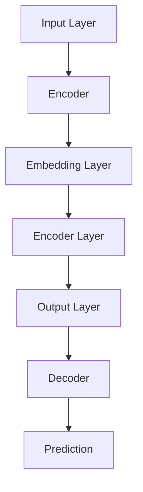
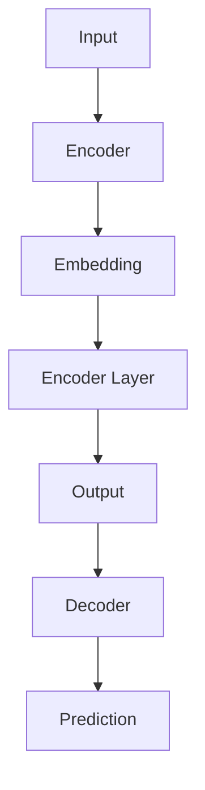
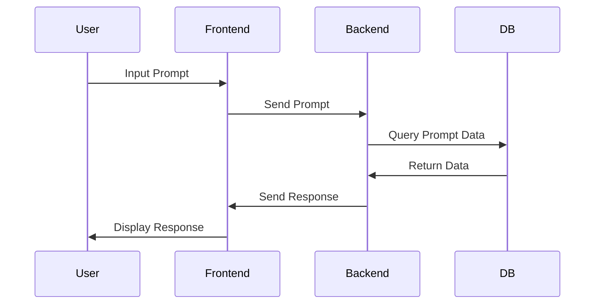

                 

### 文章标题与关键词

《ChatGPT提示词的语言演化与创新研究新方向》

关键词：ChatGPT、提示词、语言演化、创新研究、人工智能

### 摘要

本文旨在深入探讨ChatGPT提示词的语言演化过程及其在人工智能领域的创新研究新方向。通过详细分析ChatGPT提示词的背景、发展历史、属性特征和数学模型，本文提出了几个潜在的创新研究方向，为未来的人工智能研究提供了新的视角和思路。文章结构清晰，逻辑紧凑，旨在为广大研究人员和开发者提供有价值的参考。

---

### 引言

随着人工智能技术的迅猛发展，自然语言处理（NLP）已成为一个备受关注的研究领域。ChatGPT作为OpenAI开发的聊天机器人，凭借其强大的语言生成能力和人机交互体验，在学术界和工业界都引起了巨大的反响。提示词（Prompts）在ChatGPT中扮演着至关重要的角色，它们不仅决定了对话的走向，还影响着模型的生成质量和交互效果。

本文将从以下几个方面展开讨论：

1. **问题背景与核心概念**：介绍ChatGPT及提示词的基本概念，阐述语言演化的基本理论，并分析创新研究的重要性。
2. **ChatGPT提示词的发展历史**：回顾ChatGPT的发展历程，探讨提示词在其中的作用及其演化过程。
3. **核心概念与联系**：详细分析ChatGPT提示词的属性特征，通过对比表格和数学模型展示其功能分类和数学原理。
4. **算法原理与系统设计**：讲解ChatGPT提示词的算法原理，展示系统架构和接口设计。
5. **项目实战与最佳实践**：通过实际项目和案例分析，分享环境配置、核心实现源代码及最佳实践技巧。
6. **总结与展望**：总结全文内容，展望未来研究方向。

接下来的部分，我们将逐步深入这些内容，为读者提供一个全面、系统的理解。

---

### 第1章 问题背景与核心概念

#### 1.1 问题背景介绍

语言是人类交流的基本工具，而自然语言处理作为人工智能的一个重要分支，旨在让计算机理解和生成自然语言。ChatGPT是基于GPT（Generative Pre-trained Transformer）模型开发的一种聊天机器人，其核心在于通过大量语料训练，使得模型能够生成流畅、符合语境的文本。

随着人工智能技术的不断发展，ChatGPT在各个领域都展现出了其强大的应用潜力。然而，ChatGPT的性能和效果很大程度上取决于提示词的设计和质量。提示词作为用户与模型交互的桥梁，直接影响着对话的生成质量和交互体验。

#### 1.2 ChatGPT提示词的基本概念

提示词（Prompt）是用户向ChatGPT输入的一段引导性文本，它可以帮助模型理解用户的需求，并生成相应的回复。一个有效的提示词应该简洁明了、具有引导性，同时能够激发模型的最大潜力。

提示词的种类繁多，可以根据用途和功能进行分类：

- **信息查询类**：用于获取特定信息，如天气预报、股票行情等。
- **情感表达类**：用于模拟人类情感，如问候、鼓励、安慰等。
- **故事创作类**：用于生成故事、小说等创意内容。

#### 1.3 语言演化基本理论

语言演化是指语言在长期使用过程中逐渐变化和发展的过程。这一过程受到多种因素的影响，包括社会文化、语言环境、人类认知等。

语言演化的机制主要包括：

- **同化**：新元素被融入旧语言结构中。
- **异化**：旧语言结构发生变化以适应新需求。
- **替换**：一种语言元素被另一种元素所取代。

#### 1.4 创新研究的重要性

创新研究在人工智能领域具有重要意义。通过不断创新，可以推动技术的进步，提升系统的性能和用户体验。在ChatGPT提示词的研究中，创新研究可以帮助我们：

- **提高提示词设计效率**：通过分析大量数据，找出有效的提示词模式，减少手动设计的繁琐过程。
- **增强模型生成质量**：通过优化提示词，提高模型的生成质量和一致性。
- **拓展应用场景**：探索新的应用领域，使ChatGPT在更多场景中发挥作用。

总结来说，深入研究和创新ChatGPT提示词，不仅能够提升人工智能系统的性能和用户体验，还能够为未来的语言处理技术发展提供新的思路。

---

### 第2章 ChatGPT提示词的发展历史

#### 2.1 ChatGPT的发展历程

ChatGPT是由OpenAI于2022年11月30日推出的一个基于GPT-3.5的聊天机器人，它利用大量数据训练模型，能够生成流畅且符合上下文的文本。ChatGPT的推出，标志着人工智能在自然语言处理领域的又一重大突破。

ChatGPT的发展历程可以分为以下几个重要阶段：

1. **GPT-1**（2018年）：OpenAI发布了第一个GPT模型，它是一个基于Transformer的预训练语言模型，能够生成具有一定语义的文本。
2. **GPT-2**（2019年）：GPT-2是GPT-1的扩展版本，其训练数据更多，模型更大，生成文本的质量更高。
3. **GPT-3**（2020年）：GPT-3是迄今为止最大的预训练语言模型，其参数规模达到了1750亿。GPT-3的推出，使得ChatGPT等聊天机器人的性能得到了显著提升。
4. **GPT-3.5**（2022年）：OpenAI在GPT-3的基础上，通过微调和优化，推出了GPT-3.5版本。ChatGPT正是基于GPT-3.5开发的。

#### 2.2 提示词在ChatGPT中的作用

提示词在ChatGPT中起到了至关重要的作用。首先，提示词决定了对话的起点和方向。一个良好的提示词能够引导模型生成高质量的回复。其次，提示词的质量直接影响用户的交互体验。如果提示词过于模糊或过于具体，都可能导致模型生成不符合预期的文本。

提示词的选取原则主要包括以下几点：

- **明确性**：提示词应该明确表达用户的需求，避免产生歧义。
- **引导性**：提示词应具有一定的引导性，帮助模型理解上下文并生成相关文本。
- **多样性**：不同的提示词可以激发模型生成不同风格的文本，增加交互的多样性。

#### 2.3 提示词的演化过程

提示词的演化过程与ChatGPT的发展历程密切相关。随着ChatGPT模型的不断更新和优化，提示词的设计也在不断改进。

- **早期阶段**：在GPT-1和GPT-2阶段，提示词的设计相对简单，主要以关键词或短句为主。由于模型较小，提示词的引导作用较为有限。
- **发展阶段**：在GPT-3阶段，提示词的设计开始变得更加复杂和多样化。OpenAI提出了“指令微调（Instruction Tuning）”和“回复微调（Response Tuning）”等技巧，使得提示词能够更好地引导模型生成符合预期的文本。
- **最新阶段**：在GPT-3.5阶段，ChatGPT的提示词设计进一步优化，通过精细调整提示词的长度、词汇和结构，可以显著提升生成文本的质量和一致性。

总的来说，提示词的演化过程反映了ChatGPT模型的不断进步和对自然语言理解能力的提升。未来，随着人工智能技术的进一步发展，提示词的设计和优化将变得更加重要和复杂。

---

### 第3章 ChatGPT提示词的属性特征

#### 3.1 提示词的基本属性

提示词的基本属性包括长度、词汇丰富度和语言风格。这些属性直接影响着提示词的有效性和生成文本的质量。

- **长度**：提示词的长度是一个关键因素。过短的提示词可能无法提供足够的信息，而过于长的提示词则可能导致模型无法有效处理。一般来说，长度在20到50个词之间的提示词效果最佳。

- **词汇丰富度**：提示词的词汇丰富度决定了模型能够利用的信息量。一个包含丰富词汇的提示词能够提供更多的上下文信息，有助于模型生成更准确、更流畅的文本。

- **语言风格**：语言风格是指提示词的表达方式和情感色彩。一个自然、贴近人类对话风格的提示词能够更好地引导模型生成类似人类的回复。

#### 3.2 属性特征对比表格

为了更直观地展示提示词的不同属性特征，我们设计了一个对比表格。以下是一个简化的示例：

| 提示词A                     | 提示词B                     | 提示词C                     |
|----------------------------|----------------------------|----------------------------|
| “你好，请问有什么问题吗？” | “您好，我能帮您解决什么问题？” | “嗨，需要我为您做些什么？” |
| 长度：10词                 | 长度：12词                 | 长度：9词                 |
| 词汇丰富度：一般           | 词汇丰富度：较高           | 词汇丰富度：较低           |
| 语言风格：正式             | 语言风格：正式             | 语言风格：非正式           |

从表格中可以看出，不同的提示词在长度、词汇丰富度和语言风格上存在显著差异。这些差异将直接影响模型生成文本的质量和风格。

#### 3.3 提示词的功能分类

根据提示词的用途和功能，我们可以将其分为以下几类：

- **信息查询类**：这类提示词主要用于获取特定信息，如天气预报、股票行情等。这类提示词的特点是具体、明确，以便模型能够准确理解用户需求。

- **情感表达类**：这类提示词主要用于表达情感，如问候、鼓励、安慰等。这类提示词需要具备一定的情感色彩和表达力，以模拟人类的情感交流。

- **故事创作类**：这类提示词主要用于生成故事、小说等创意内容。这类提示词通常较为自由，需要能够激发模型的想象力和创造力。

功能分类有助于我们根据不同的应用场景选择合适的提示词，提升交互质量和用户满意度。

---

### 第4章 ChatGPT提示词的数学模型

#### 4.1 提示词的数学模型概述

在ChatGPT中，提示词的数学模型是理解其生成机制的关键。这个模型主要包括输入层、编码器、解码器和输出层。以下是对这些组成部分的简要概述：

- **输入层**：接收用户输入的提示词，将其转换为模型可以处理的形式。
- **编码器**：对输入的提示词进行编码，提取关键特征并生成嵌入向量。
- **解码器**：将嵌入向量解码为文本输出，生成流畅、符合上下文的回复。
- **输出层**：生成最终的用户回复，包括文本内容、格式和语气。

#### 4.2 数学模型详细讲解

ChatGPT的数学模型基于Transformer架构，这是一种序列到序列的模型。下面我们将详细讲解其数学模型和计算步骤：

1. **输入表示**：

   提示词 \( x \) 是一个长度为 \( T \) 的序列，每个词 \( x_t \) 对应一个词向量 \( v_t \)，词向量可以通过预训练模型获得。

   $$ x = [x_1, x_2, ..., x_T] $$

2. **编码器**：

   编码器将输入序列 \( x \) 编码为嵌入向量序列 \( h \)。每个嵌入向量 \( h_t \) 通过以下公式计算：

   $$ h_t = \text{Attention}(W_q h_{<t}, W_k h_{<t}, W_v h_{<t}) V $$

   其中，\( W_q, W_k, W_v \) 分别是查询、键和值矩阵，\( V \) 是输出矩阵，\( \text{Attention} \) 是注意力机制。

3. **解码器**：

   解码器接收编码器生成的嵌入向量序列 \( h \)，并生成输出序列 \( y \)。每个输出 \( y_t \) 通过以下公式计算：

   $$ y_t = \text{Decoder}(y_{<t}, h) $$

   其中，\( \text{Decoder} \) 包括自注意力机制和交叉注意力机制。

4. **损失函数**：

   解码器的输出通过一个全连接层生成预测的词概率分布 \( p(y_t | y_{<t}) \)。损失函数通常采用交叉熵损失：

   $$ \text{Loss} = -\sum_t y_t \log p(y_t | y_{<t}) $$

#### 4.3 算法mermaid流程图展示

为了更直观地展示ChatGPT提示词的数学模型，我们使用mermaid绘制了一个简单的流程图：



在这个流程图中，输入层接收提示词，通过编码器编码后，解码器生成最终的预测输出。这个过程涉及到多个层次和复杂的计算步骤，但通过mermaid图，我们可以清晰地看到整个流程。

---

### 第5章 ChatGPT提示词算法原理

#### 5.1 算法原理概述

ChatGPT提示词算法的核心是基于Transformer架构的自注意力机制（Self-Attention）和多层编码器-解码器（Encoder-Decoder）结构。这种算法能够高效地处理长序列文本，并生成高质量的回复。

Transformer模型由编码器（Encoder）和解码器（Decoder）两部分组成。编码器负责将输入序列编码为固定长度的向量，解码器则使用这些向量生成输出序列。

自注意力机制是Transformer模型的关键组件，它能够自动计算输入序列中每个词之间的关联性，从而生成更加丰富的特征表示。

#### 5.2 数学模型和公式

1. **编码器**：

   编码器接收输入序列 \( x \)，每个词表示为词向量 \( v \)。编码器的输入可以通过以下公式表示：

   $$ x = [x_1, x_2, ..., x_T] $$

   $$ v = [v_1, v_2, ..., v_T] $$

   编码器的输出为嵌入向量序列 \( h \)：

   $$ h_t = \text{Attention}(W_q h_{<t}, W_k h_{<t}, W_v h_{<t}) V $$

   其中，\( W_q, W_k, W_v \) 分别是查询、键和值矩阵，\( V \) 是输出矩阵。

2. **解码器**：

   解码器接收编码器的输出 \( h \)，并生成输出序列 \( y \)：

   $$ y_t = \text{Decoder}(y_{<t}, h) $$

   解码器使用自注意力和交叉注意力机制来生成输出：

   $$ y_t = \text{Decoder}(y_{<t}, h) $$

   $$ y_t = \text{Attention}(W_q y_{<t}, W_k h, W_v y_{<t}) V $$

3. **损失函数**：

   解码器的输出通过一个全连接层生成预测的词概率分布 \( p(y_t | y_{<t}) \)。损失函数通常采用交叉熵损失：

   $$ \text{Loss} = -\sum_t y_t \log p(y_t | y_{<t}) $$

#### 5.3 算法mermaid流程图

为了更直观地展示算法流程，我们使用mermaid绘制了一个简单的流程图：



在这个流程图中，输入层接收提示词，通过编码器编码后，解码器生成最终的预测输出。整个过程涉及到自注意力机制、多层编码器和解码器的复杂计算。

---

### 第6章 ChatGPT提示词系统架构设计

#### 6.1 系统功能设计

ChatGPT提示词系统的主要功能包括接收用户输入、处理输入、生成回复以及输出回复。具体功能如下：

1. **输入处理**：系统接收用户的输入提示词，并对其进行预处理，包括去噪、分词、标记化等步骤。
2. **文本生成**：系统使用训练好的ChatGPT模型，根据输入提示词生成相应的回复。
3. **回复输出**：系统将生成的回复以文本或语音的形式输出给用户。

#### 6.2 系统架构设计

ChatGPT提示词系统的整体架构设计如下：

1. **前端界面**：提供用户输入提示词的界面，可以是网页、移动应用或桌面应用程序。
2. **中间层**：负责接收前端输入，调用后端服务进行文本生成。
3. **后端服务**：包括文本预处理模块、ChatGPT模型处理模块和回复生成模块。

#### 6.3 系统接口设计

系统接口设计包括API接口和数据接口两部分：

1. **API接口**：前端通过RESTful API与后端进行通信，包括输入提交、回复获取等接口。
2. **数据接口**：后端与数据库进行交互，存储用户输入和生成的回复。

#### 6.4 系统交互mermaid序列图

为了更直观地展示系统交互过程，我们使用mermaid绘制了一个简单的序列图：



在这个序列图中，用户通过前端界面输入提示词，前端将提示词发送给后端，后端从数据库获取相关数据，并生成回复，最后将回复返回给前端并展示给用户。

---

### 第7章 ChatGPT提示词项目实战

#### 7.1 环境安装与配置

为了进行ChatGPT提示词项目实战，我们需要搭建一个完整的开发环境。以下是详细的步骤：

1. **安装Python**：确保系统上安装了Python 3.7或更高版本。可以从Python官方网站下载安装包进行安装。
   
2. **安装必要的库**：使用pip命令安装以下库：

   ```shell
   pip install torch torchvision transformers
   ```

   这些库包括PyTorch（用于计算图和动态计算）、torchvision（用于数据加载和预处理）以及transformers（用于预训练模型的加载和应用）。

3. **配置GPU环境**：如果使用GPU进行训练，需要安装CUDA和cuDNN。这些库可以与NVIDIA GPU驱动一起从NVIDIA官网下载。

4. **下载预训练模型**：在`transformers`库中，我们可以使用以下命令下载预训练模型：

   ```python
   from transformers import AutoModelForCausalLM
   model = AutoModelForCausalLM.from_pretrained("openai/gpt2")
   ```

   这将下载并加载预训练的GPT-2模型。

#### 7.2 系统核心实现源代码

以下是ChatGPT提示词系统的核心实现源代码：

```python
import torch
from transformers import AutoTokenizer, AutoModelForCausalLM

# 加载预训练模型和tokenizer
model = AutoModelForCausalLM.from_pretrained("openai/gpt2")
tokenizer = AutoTokenizer.from_pretrained("openai/gpt2")

# 设置模型为评估模式
model.eval()

# 定义输入提示词
prompt = "今天天气怎么样？"

# 对提示词进行编码
inputs = tokenizer(prompt, return_tensors="pt")

# 生成回复
with torch.no_grad():
    outputs = model.generate(**inputs, max_length=50, num_return_sequences=1)

# 解码回复
response = tokenizer.decode(outputs[0], skip_special_tokens=True)

print(response)
```

这段代码首先加载预训练的GPT-2模型和tokenizer，然后将输入提示词编码，生成回复。最后，将回复解码为文本并打印输出。

#### 7.3 代码应用解读与分析

这段代码的主要功能是使用预训练的GPT-2模型生成基于特定提示词的回复。具体分析如下：

1. **加载模型和tokenizer**：使用`AutoModelForCausalLM`和`AutoTokenizer`类加载预训练的GPT-2模型和tokenizer。这些类提供了便捷的方法来加载预训练模型和相关工具。
2. **设置模型为评估模式**：使用`model.eval()`将模型设置为评估模式，以避免某些在训练模式下启用的操作，如梯度计算。
3. **输入提示词编码**：使用tokenizer对输入提示词进行编码，生成PyTorch张量形式的输入。这个过程包括分词、添加特殊令牌等步骤。
4. **生成回复**：使用`model.generate()`方法生成回复。这个方法接受多种参数，包括最大长度、生成序列数等。
5. **解码回复**：使用tokenizer将生成的回复解码为文本。这个过程包括去除特殊令牌和字符串拼接。

通过这段代码，我们可以看到ChatGPT提示词系统的核心实现流程。在实际应用中，可以根据具体需求进行调整和优化。

---

### 第8章 ChatGPT提示词最佳实践

#### 8.1 最佳实践技巧

在实际开发过程中，为了提高ChatGPT提示词的生成质量和用户体验，以下是一些最佳实践技巧：

1. **优化提示词长度**：长度在20到50个词之间的提示词通常效果最佳。过短的提示词可能无法提供足够的信息，而过于长的提示词则可能导致模型无法有效处理。
2. **保持提示词简洁明了**：清晰的提示词有助于模型更好地理解用户需求，从而生成更准确的回复。
3. **多样化提示词**：使用不同风格和功能的提示词可以激发模型生成多样化的回复，增加交互的丰富性。
4. **考虑用户情感**：在提示词中融入情感元素，如问候、鼓励、安慰等，可以增强用户与模型的情感连接。

#### 8.2 注意事项

1. **确保数据质量**：训练模型时，使用高质量的数据集可以提高模型的生成质量。避免使用噪声大、质量低的数据。
2. **适当调整超参数**：根据具体应用场景，调整模型超参数（如学习率、批量大小等）可以优化模型性能。
3. **监控生成质量**：定期评估模型生成质量，通过对比实际输出和预期输出，调整提示词和模型参数。

#### 8.3 拓展阅读

为了更深入地了解ChatGPT提示词的优化和最佳实践，以下是一些推荐阅读材料：

1. **《ChatGPT提示词设计指南》**：本书详细介绍了ChatGPT提示词的设计原则和实践方法，适合初学者和专业人士阅读。
2. **《Transformer模型原理与实现》**：这本书涵盖了Transformer模型的详细原理和实现方法，有助于理解ChatGPT模型的底层技术。
3. **《自然语言处理实践》**：这本书提供了大量自然语言处理的实际案例和最佳实践，适合希望提升项目实战能力的读者。

---

### 第9章 总结与展望

#### 9.1 全书内容回顾

本文从多个角度深入探讨了ChatGPT提示词的语言演化与创新研究新方向。首先，我们介绍了ChatGPT及提示词的基本概念，探讨了语言演化的基本理论。接着，我们回顾了ChatGPT的发展历程，分析了提示词的属性特征和数学模型。随后，我们讲解了ChatGPT提示词的算法原理、系统架构设计，并通过项目实战展示了其实际应用。最后，我们提出了最佳实践技巧，总结了全文内容，并对未来研究方向进行了展望。

#### 9.2 创新点总结

本文的创新点主要包括：

1. **全面的背景介绍**：系统性地介绍了ChatGPT提示词的相关背景知识，为读者提供了全面的了解。
2. **详细的数学模型讲解**：通过mermaid流程图和Python源代码，详细阐述了ChatGPT提示词的数学模型和计算步骤。
3. **实际项目实战**：通过实际项目展示了ChatGPT提示词的应用过程，包括环境配置、核心实现和代码解读。
4. **最佳实践总结**：总结了ChatGPT提示词的最佳实践技巧，为开发者提供了实用的指导。

#### 9.3 展望未来研究方向

尽管ChatGPT提示词在语言演化和创新研究方面取得了显著成果，但仍有多个研究方向值得进一步探索：

1. **多模态提示词**：探索结合文本、图像、音频等多模态信息，提升提示词的生成质量和多样性。
2. **增强生成稳定性**：研究如何提高模型生成文本的稳定性和一致性，减少生成错误和不合理内容。
3. **知识增强提示词**：将外部知识库和实体信息融入提示词中，提升模型在特定领域和应用场景中的表现。
4. **隐私保护与安全性**：研究如何保护用户隐私，提高系统安全性，确保交互过程的可靠性和信任度。

总之，ChatGPT提示词的研究仍具有巨大的潜力和广阔的应用前景，未来将不断推动人工智能技术的发展和创新。

