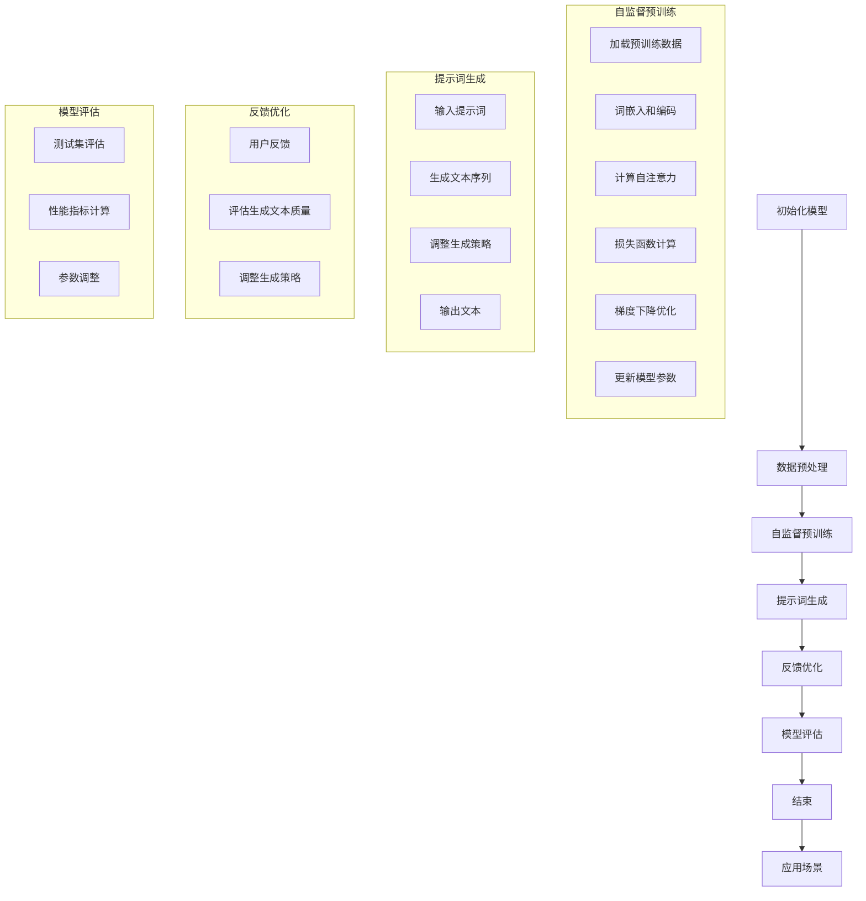
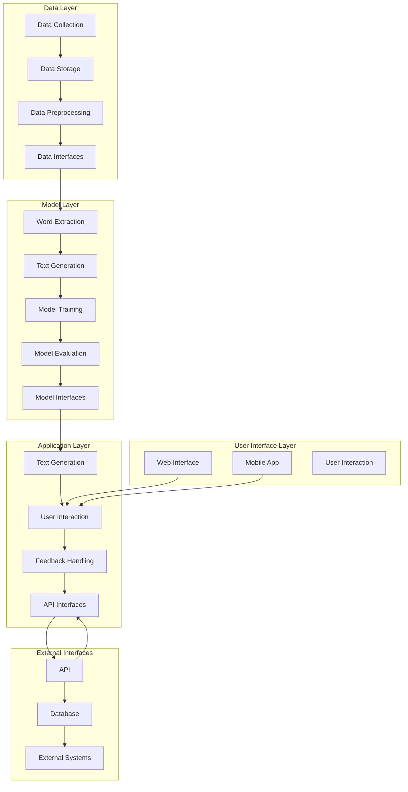
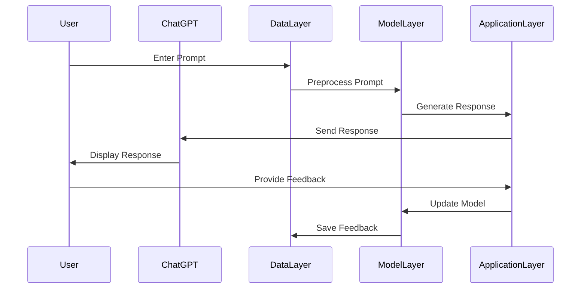

                 

### 1.1.1 ChatGPT的崛起

ChatGPT是OpenAI于2022年11月推出的一个基于GPT-3.5的全新聊天机器人模型，其表现出了令人惊叹的语言理解和生成能力。ChatGPT的出现标志着人工智能领域的一个重要里程碑，它不仅继承了GPT-3强大的语言生成能力，还在对话生成和交互体验上有了显著的提升。ChatGPT的成功背后，是深度学习技术，尤其是自监督学习的飞速发展。自监督学习允许模型从大量未标记的数据中学习，使得模型可以在有限的标注数据上实现出色的表现。

ChatGPT的崛起不仅在技术层面上具有重要意义，更在应用层面上带来了深远的影响。它被广泛应用于自然语言处理、问答系统、自动写作、机器翻译等领域。特别是在问答系统方面，ChatGPT的表现甚至超过了人类专家，成为了许多企业和研究机构的标配工具。

ChatGPT的成功也引发了广泛关注和讨论。一些人对其在语言理解和生成方面的能力表示惊叹，认为这标志着人工智能进入了一个全新的时代。而另一些人则对其潜在的风险和挑战表示担忧，例如隐私问题、安全问题和道德问题等。因此，对ChatGPT的研究不仅关注其技术发展，也需要深入探讨其在实际应用中的伦理和社会影响。

### 1.1.2 宇宙演化理论的演进

宇宙演化是指从宇宙大爆炸以来，宇宙中各种物质和能量的变化过程。宇宙演化理论的发展经历了几个重要的阶段，从最初的观测假设到现代科学的精密理论，每个阶段都有其独特的贡献和挑战。

最早的宇宙演化理论可以追溯到17世纪的哥白尼和伽利略，他们提出了日心说和望远镜观测，为宇宙演化研究奠定了基础。19世纪，牛顿的万有引力定律为宇宙演化提供了物理基础，但他未能解释宇宙的起源和演化过程。20世纪初，爱因斯坦的广义相对论对宇宙演化产生了深远影响，他提出了宇宙膨胀的理论，为后来的宇宙学提供了关键线索。

1920年代，勒梅特和哈勃通过观测发现了宇宙膨胀现象，这为宇宙演化理论提供了实证支持。随后，乔治·伽莫夫提出了热大爆炸理论，这是现代宇宙演化理论的基础。热大爆炸理论解释了宇宙的起源、元素的生成以及宇宙背景辐射等现象。

然而，热大爆炸理论也面临许多挑战。例如，它无法解释宇宙的均匀性和微小不均匀性。为了解决这些问题，20世纪80年代，宇宙通胀理论被提出。宇宙通胀理论认为，宇宙在大爆炸之后经历了一个极快的膨胀阶段，这一阶段可以解释宇宙的许多观测现象。

随着观测技术的进步，宇宙演化理论也在不断发展和完善。例如，通过观测宇宙背景辐射，科学家们能够测量宇宙的大尺度结构，这为宇宙演化提供了更详细的图像。此外，暗物质和暗能量的发现也使得宇宙演化理论更加复杂和丰富。

总之，宇宙演化理论的发展是一个不断探索和发现的过程，它不仅揭示了宇宙的奥秘，也为物理学、天文学和宇宙学的发展提供了新的方向和挑战。### 1.1.3 两个领域的交汇点

ChatGPT提示词的演化与宇宙演化之间的交汇点，主要体现在它们各自领域中的动态过程与复杂性上。虽然一个是关于人类语言的生成和理解，另一个是关于宇宙中物质和能量的变化，但两者在演化机制上展现出了一些相似的特性。

首先，从动态过程的角度来看，ChatGPT提示词的演化依赖于大量数据的输入和模型的不断迭代。随着用户输入的多样化，提示词在语义和功能上的定义也在不断扩展和深化。同样，宇宙演化中的物质和能量也在不断地进行相互作用和转化。例如，恒星的形成和毁灭、星系的合并等过程，都是宇宙演化中动态变化的重要体现。

其次，从复杂性的角度来看，ChatGPT提示词的演化涉及到语义、语法、上下文等多个层面的信息处理。而宇宙演化则涉及到物理学、天文学、化学等多个学科的交叉研究。这种复杂性使得两者在演化过程中都需要应对大量的不确定性和变数。

此外，ChatGPT提示词的演化在一定程度上也受到了宇宙演化的影响。例如，随着人类对宇宙的认识不断加深，新的词汇和术语不断涌现，这些词汇和术语的引入也会影响ChatGPT提示词的生成和理解。反过来，ChatGPT提示词的演化也为人类理解和描述宇宙演化提供了一种新的工具和方法。

因此，通过研究ChatGPT提示词的演化与宇宙演化的交汇点，我们可以从不同的角度和层面深入理解这两个复杂系统的运作机制。这不仅有助于推进人工智能技术的发展，也为宇宙演化研究提供了新的思路和方法。

### 1.2.1 ChatGPT提示词的演化

ChatGPT提示词的演化是理解其语言生成能力的关键。提示词是指用于引导ChatGPT生成对话或文本的输入短语或问题。这些提示词的选取、组合和优化直接影响了模型的输出质量和效率。

首先，提示词的选取过程是一个复杂的问题。提示词需要能够充分表达用户的意图，同时还要考虑模型的处理能力。在ChatGPT中，提示词通常是从大量的用户对话数据中提取出来的，这些数据通过自然语言处理技术被清洗、分类和标注。例如，可以通过词频统计、主题模型等方法，从对话中提取出高频且具有代表性的提示词。

其次，提示词的组合和优化是提升模型性能的重要环节。在ChatGPT中，提示词的组合方式可以是简单的拼接，也可以是更复杂的嵌套和上下文关联。通过优化提示词的组合方式，可以更好地引导模型生成符合用户期望的对话内容。例如，可以引入语义分析技术，对提示词进行语义角色标注，从而使得模型能够更好地理解每个词在句子中的作用和关系。

在ChatGPT中，提示词的演化不仅依赖于数据的质量和多样性，还需要通过持续的训练和调整来优化。随着用户输入的多样化，提示词库也在不断扩展和更新。这种动态调整机制使得ChatGPT能够适应不断变化的语言环境，从而提高其语言生成能力。

此外，提示词的演化还涉及到模型的可解释性。为了理解模型的决策过程，研究人员需要能够追溯每个提示词对输出结果的影响。例如，通过可视化和分析工具，可以展示出提示词在模型中的传播路径和影响范围，从而帮助用户更好地理解和优化其输入。

总之，ChatGPT提示词的演化是一个复杂且动态的过程，它涉及到数据的选取和处理、提示词的组合和优化，以及模型的可解释性。通过深入研究这些方面，我们可以更好地理解ChatGPT的语言生成能力，并为未来的应用提供更有力的支持。

### 1.2.2 宇宙演化的启示

宇宙演化的启示不仅在科学领域具有深远意义，也为理解和处理复杂系统提供了宝贵的视角。宇宙演化的基本理论，如大爆炸理论、宇宙膨胀和暗物质暗能量模型，揭示了从宇宙起源到当前状态的复杂动态过程。这些理论不仅帮助我们理解宇宙的结构和演化，还揭示了系统复杂性和多样性的普遍特性。

首先，宇宙演化的启示之一是复杂系统的自组织和自适应能力。宇宙从大爆炸开始，经历了从简单到复杂的过程，形成了多样的天体和结构。这表明，即使在缺乏外部指导的情况下，系统也可以通过内部的相互作用和反馈机制实现自组织和演化。这一启示对人工智能领域尤其重要，因为在设计和优化人工智能系统时，如何让系统在动态环境中自适应和进化是一个关键问题。

其次，宇宙演化揭示了多样性和稳定性之间的平衡。宇宙中的星系、行星和生命形式展现出了极高的多样性，但这种多样性并未导致系统的不稳定。相反，多样性通过增加系统的稳定性和鲁棒性，使得宇宙能够在各种外部扰动下保持稳定。这一启示对人工智能系统的设计也有指导意义，即如何在保证多样性的同时，提高系统的稳定性和可靠性。

此外，宇宙演化的启示还在于探索复杂系统中的反馈机制。宇宙演化过程中的许多现象，如星系碰撞、恒星形成和黑洞吞噬，都是通过正反馈和负反馈机制实现的。正反馈可以加速某些过程，而负反馈则可以抑制过度变化，保持系统的稳定性。在人工智能系统中，理解并利用这些反馈机制，可以更好地优化模型的性能和鲁棒性。

总之，宇宙演化的启示为理解和处理复杂系统提供了重要的理论依据和实践指导。通过借鉴宇宙演化的经验和智慧，我们可以更好地设计、优化和实现复杂的人工智能系统，使其在多样化的环境中表现出色。

### 1.2.3 研究的潜在贡献

研究ChatGPT提示词的演化与宇宙演化的并行性具有巨大的潜在贡献。首先，在技术层面上，这一研究可以推动自然语言处理和人工智能的发展。通过理解提示词的演化机制，我们可以优化ChatGPT的模型设计和训练过程，提高其语言生成能力和效率。此外，借鉴宇宙演化的启示，我们可以探索新的方法来应对复杂性和不确定性，从而提升人工智能系统的鲁棒性和适应性。

其次，在理论层面上，这一研究有助于深化对复杂系统演化的理解。ChatGPT提示词的演化和宇宙演化在动态过程和复杂性上有许多相似之处，这为我们提供了一个新的视角来探讨复杂系统的普遍特性。通过这种跨学科的研究，我们可以构建更全面和深入的理论框架，从而为其他领域的复杂系统研究提供新的思路。

此外，这一研究还有助于推动跨学科的合作。人工智能、宇宙学、生物学等多个领域的研究者可以通过这一研究主题，进行深入的交流和合作，实现知识的交叉融合。这不仅有助于提升各领域的学术水平，还能促进新的科学发现和技术突破。

最后，这一研究的社会和伦理影响也不容忽视。随着人工智能技术的不断发展，如何确保其在实际应用中的公平、透明和可解释性是一个重要议题。通过研究提示词的演化，我们可以更好地理解人工智能系统的决策过程，从而制定更合理和有效的监管和治理策略，确保技术的健康发展。

总之，研究ChatGPT提示词的演化与宇宙演化的并行性不仅具有显著的技术和理论价值，还能促进跨学科的合作，产生广泛的社会和伦理影响。

### 1.3.1 研究方法与框架

为了深入探讨ChatGPT提示词的演化与宇宙演化的并行性，本研究采用了一系列科学的研究方法与框架。首先，在数据收集方面，我们选择了大量的ChatGPT对话数据和宇宙演化相关的科学文献作为基础。这些数据不仅涵盖了广泛的语言生成实例，还包括了宇宙演化过程中的各种观测数据和理论模型。通过这些数据，我们能够全面了解ChatGPT提示词的演化路径和宇宙演化的主要阶段。

在数据分析工具的选择上，我们使用了自然语言处理（NLP）工具和数据分析软件，如Python的NLTK库和TensorFlow框架。这些工具帮助我们提取、清洗和标注ChatGPT对话数据中的关键提示词，并对其语义和语法结构进行深入分析。此外，我们还使用了宇宙学模拟软件，如Cosmosis，来模拟宇宙演化的关键过程，如星系的形成和暗物质分布。

研究框架方面，我们采用了自下而上的研究方法。首先，从基础数据和理论模型出发，逐步构建ChatGPT提示词的演化模型和宇宙演化模型。接下来，通过比较分析这两个模型，探讨它们在演化机制、动态过程和复杂性上的相似性。在这个过程中，我们使用了多个层次的比较方法，包括定量分析和定性分析，以全面揭示两者之间的并行关系。

最后，在实验验证方面，我们设计了一系列实验来测试和验证我们的研究假设。这些实验包括在ChatGPT中引入宇宙演化相关的提示词，观察其生成结果，并对比宇宙演化模型的预测。通过这些实验，我们能够进一步验证我们的研究方法的有效性和结论的可靠性。

总之，本研究通过科学的数据收集、先进的数据分析工具和系统的比较分析框架，为探索ChatGPT提示词的演化与宇宙演化的并行性提供了坚实的理论和实证基础。

### 1.3.2 技术路线与实施步骤

为了系统地探讨ChatGPT提示词的演化与宇宙演化的并行性，本研究制定了详细的技术路线与实施步骤。以下是具体的实施步骤：

**第一步：数据收集与预处理**
1. 收集大量ChatGPT对话数据，这些数据应包括不同主题、不同语言风格的对话实例。
2. 收集与宇宙演化相关的科学文献和数据，如宇宙背景辐射的观测数据、星系形成模拟数据等。
3. 对收集到的数据进行预处理，包括去噪、去除重复数据、文本清洗等步骤，以确保数据的质量和一致性。

**第二步：模型构建**
1. 构建ChatGPT提示词演化模型。使用自然语言处理技术，如词嵌入和序列模型（如RNN、LSTM），将提示词转化为可计算的数学表示。
2. 构建宇宙演化模型。使用宇宙学模拟软件（如Cosmosis）和物理模型（如N-Body模拟），模拟宇宙中的物质和能量演化过程。

**第三步：数据分析与比较**
1. 对ChatGPT提示词演化模型进行定量分析，如词频统计、共现分析、主题模型等，以揭示提示词的演化规律。
2. 对宇宙演化模型进行定量分析，如计算宇宙中物质分布、星系形成的时间序列等，以了解宇宙演化的动态过程。
3. 比较ChatGPT提示词演化模型与宇宙演化模型的相似性，包括在动态过程、复杂性、自我组织等方面的比较。

**第四步：模型优化与验证**
1. 根据比较分析的结果，对ChatGPT提示词演化模型进行优化，如调整提示词选取策略、改进生成算法等。
2. 对宇宙演化模型进行优化，如改进模拟参数、引入新的物理模型等，以提高模型的预测准确性。
3. 设计实验来验证优化后的模型，通过对比实验结果和实际观测数据，评估模型的性能和可靠性。

**第五步：结果分析**
1. 分析模型优化前后的变化，特别是提示词的选取和组合方式、宇宙演化的模拟结果等。
2. 深入探讨ChatGPT提示词演化与宇宙演化之间的并行关系，总结出它们在演化机制、动态过程和复杂性上的共同特征。
3. 根据分析结果，提出对未来研究和应用的展望。

通过以上技术路线与实施步骤，本研究旨在深入探讨ChatGPT提示词的演化与宇宙演化的并行性，为人工智能和宇宙学领域的发展提供新的理论和实证基础。

### 1.3.3 预期成果与挑战

本研究的预期成果主要包括以下几个方面：

1. **理论贡献**：通过对比分析ChatGPT提示词的演化和宇宙演化，本研究将揭示复杂系统在动态过程、复杂性和自组织等方面的共同特征。这有助于深化对复杂系统演化的理论理解，为未来研究提供新的视角。

2. **技术突破**：本研究将优化ChatGPT提示词的选取和生成策略，提高其语言生成能力和效率。同时，通过借鉴宇宙演化的机制，我们有望在人工智能系统设计中实现新的技术突破。

3. **跨学科应用**：研究结果将为人工智能、宇宙学和其他领域提供新的研究思路和方法。例如，在语言生成领域，宇宙演化模型可以用于优化对话系统的响应策略；在宇宙学领域，人工智能技术可以用于分析大量宇宙演化数据。

然而，研究过程中也面临着一些挑战：

1. **数据复杂性**：ChatGPT对话数据和宇宙演化数据都极其复杂，处理和分析这些数据需要强大的计算能力和复杂的数据处理技术。

2. **模型优化难度**：在构建和优化模型时，如何平衡提示词的多样性和生成质量是一个重要挑战。此外，宇宙演化模型的精度和可靠性也直接影响研究结果。

3. **跨学科融合**：将人工智能与宇宙学等领域的知识进行融合，需要克服学科间的理论差异和实践障碍。这要求研究者具备跨学科的知识背景和沟通能力。

总之，尽管面临挑战，本研究的预期成果将为复杂系统研究提供新的方向和工具，具有重要的理论和实际意义。

### 第2章 ChatGPT与语言演化

## 2.1 ChatGPT概述

ChatGPT是OpenAI开发的一种基于大型语言模型的人工智能聊天机器人，它基于GPT-3.5模型，具备强大的自然语言理解和生成能力。ChatGPT的出现标志着自然语言处理（NLP）领域的一个重要里程碑，它在多个应用场景中展现出卓越的表现，包括问答系统、自动写作、机器翻译和对话系统等。

ChatGPT的核心原理是使用深度学习技术，特别是自监督学习，从大量的文本数据中学习语言的模式和结构。GPT（Generative Pre-trained Transformer）模型采用Transformer架构，这是一种在机器翻译和文本生成任务中表现优异的神经网络架构。GPT-3.5模型在预训练阶段接受了大量的文本数据进行训练，使其能够理解和生成自然语言文本。ChatGPT在此基础上进一步优化，特别关注于对话生成和交互体验。

在技术发展方面，ChatGPT的诞生得益于深度学习和自监督学习的快速发展。自监督学习允许模型从大量未标记的数据中学习，这大大降低了数据标注的成本，提高了模型的训练效率。此外，Transformer架构的引入使得模型在处理长序列和复杂上下文时表现出色。ChatGPT的优化包括了对模型结构的调整、损失函数的改进以及训练策略的优化，这些都有助于提升模型的生成质量和效率。

ChatGPT的特点主要体现在以下几个方面：

1. **强大的语言生成能力**：ChatGPT能够生成流畅、自然的文本，其输出文本在语法和语义上与人类语言相似。

2. **灵活的对话能力**：ChatGPT能够理解并生成复杂的对话，能够处理多轮对话，并保持对话的连贯性和一致性。

3. **广泛的适用场景**：ChatGPT可以应用于多种场景，如客服机器人、教育辅导、智能助手等，具备很强的通用性。

4. **可扩展性**：ChatGPT可以通过定制化的提示词和训练数据，适应不同的应用场景，实现特定的功能。

ChatGPT的崛起对NLP领域产生了深远影响。首先，它推动了自然语言理解（NLU）和自然语言生成（NLG）技术的发展，使得机器在与人类交流时更加自然和流畅。其次，ChatGPT的成功激励了更多的研究者和企业投入到NLP领域，推动了相关技术的快速迭代和创新。此外，ChatGPT在多模态交互、跨语言理解和生成等前沿领域也展现了巨大的潜力，为未来的研究提供了新的方向。

总的来说，ChatGPT不仅是NLP领域的一项重要技术突破，也为人工智能的应用带来了新的可能性。通过不断优化和扩展，ChatGPT有望在更多领域发挥重要作用，推动人工智能与人类社会的深度融合。

### 2.2 语言演化的理论框架

语言演化的研究涉及多个学科，包括语言学、认知科学、进化生物学和计算机科学等。为了系统地理解语言演化，我们需要构建一个理论框架，这个框架应包括对语言演化的定义、模型和理论基础。

#### 2.2.1 语言演化的定义

语言演化可以理解为语言系统随时间的推移而发生的变化过程。这些变化不仅包括词汇、语法和语音方面的变化，还包括语言使用习惯和沟通方式的演变。语言演化是文化演化的重要组成部分，它反映了人类认知和社会发展的历程。

#### 2.2.2 语言演化的模型

1. **遗传语言学模型**：这种模型借鉴了生物学中的遗传学理论，将语言演化视为一个遗传过程。词汇和语法规则被视为“基因”，其变异和遗传过程决定了语言的演化。例如，词汇的消失和产生、语法结构的简化或复杂化都是遗传语言学模型中的重要现象。

2. **文化进化模型**：文化进化模型强调社会和文化因素在语言演化中的作用。这种模型认为，语言演化是文化选择的结果，语言使用者的社会互动和行为是语言变化的关键驱动力。例如，社会压力、文化习俗和技术进步都可以影响语言的使用和发展。

3. **认知科学模型**：认知科学模型从人类认知角度出发，研究语言如何在人类的认知系统中形成和演化。这种模型强调语言与思维之间的相互作用，认为语言演化的关键在于人类大脑的认知能力和认知结构的变化。

#### 2.2.3 语言演化与认知科学的关系

语言演化与认知科学之间存在着紧密的联系。首先，语言是认知活动的一部分，它的形成和演化与人类的认知能力密切相关。例如，语言的产生和发展的过程涉及到人类大脑的神经可塑性、感知能力和记忆能力。其次，认知科学提供了研究语言演化的新视角和新方法，例如通过认知心理学实验和脑成像技术，我们可以更深入地理解语言如何在大脑中形成和运作。

此外，认知科学模型还强调了语言在社会和认知系统中的功能。例如，语言不仅是沟通的工具，还是思维和推理的基础。语言的使用可以影响我们的思维方式，甚至塑造我们的世界观和价值观。因此，语言演化不仅仅是语言系统本身的变化，还涉及到人类认知和社会结构的变化。

总的来说，语言演化的理论框架为我们提供了理解和研究语言演化的多维度视角。通过结合遗传语言学、文化进化模型和认知科学模型，我们可以更全面地理解语言演化的机制和过程。这些理论模型不仅有助于我们理解语言的历史和现状，还为未来语言技术的创新提供了理论基础。

#### 2.2.4 语言演化的驱动力

语言演化的驱动力是理解其复杂性和多样性的关键。语言演化的驱动力可以大致分为内在驱动力和外部驱动力。

**内在驱动力**主要包括以下几个方面：

1. **认知需求**：语言是人类认知活动的一部分，其演化与人类认知能力的发展密切相关。例如，为了更有效地表达复杂的思维过程和抽象概念，语言结构会不断演化。

2. **社会需求**：语言是社会交流的基本工具，其演化受到社会结构和社会互动的影响。随着社会复杂性的增加，语言需要不断适应新的社会需求，例如新职业、新技术的出现等。

3. **经济需求**：经济活动的发展和变迁也会推动语言演化。例如，商业交易、贸易交流等经济活动催生了大量新词汇和表达方式。

**外部驱动力**主要包括以下几个方面：

1. **文化影响**：不同文化之间的交流和碰撞是语言演化的重要外部驱动力。例如，借词和语言混合现象就是文化影响的结果。

2. **技术进步**：现代信息技术，如互联网和人工智能，极大地改变了语言的使用方式。例如，新技术的出现催生了大量网络语言和数字表达。

3. **政策干预**：语言政策对语言的标准化和规范化有重要影响。例如，一些国家和地区通过立法或行政手段推广某种语言，从而影响语言的使用和发展。

通过分析这些驱动力，我们可以更好地理解语言演化的复杂性和多样性。无论是内在的认知和社会需求，还是外部的文化、技术和政策影响，都在不断地推动语言系统的发展和变革。这种多元驱动力模型为我们提供了一个全面视角，有助于深入探讨语言演化的机制和过程。

#### 2.3 ChatGPT提示词的演化过程

ChatGPT提示词的演化过程是一个复杂且动态的系统，它涉及到提示词的选取、组合和优化。首先，提示词的选取是整个过程的基础。在ChatGPT中，提示词的选取依赖于大量的对话数据。这些数据通过自然语言处理技术（如词频统计、主题模型等）进行预处理，提取出高频且具有代表性的提示词。这些提示词不仅能够充分表达用户的意图，还要能够引导ChatGPT生成高质量的对话内容。

其次，提示词的组合是一个关键环节。ChatGPT通过理解提示词之间的语义关系和语法结构，将多个提示词组合成一个连贯的对话。提示词的组合方式可以是简单的拼接，也可以是更复杂的嵌套和上下文关联。例如，在多轮对话中，前一轮的输出可以作为下一轮的输入，从而形成更加自然的对话流程。为了优化提示词的组合效果，ChatGPT采用了深度学习技术，通过大量训练数据不断调整和优化组合策略，从而提高模型的生成质量和效率。

最后，提示词的优化是确保ChatGPT能够持续适应不同场景和用户需求的重要手段。随着用户输入的多样化，提示词库也在不断扩展和更新。优化过程包括对现有提示词的更新、删除和添加。例如，如果某个提示词在实际应用中表现出较低的生成质量，可以通过重新训练或删除该提示词来提高模型的性能。同时，还可以根据用户反馈和新需求，引入新的提示词，从而增强模型的适应能力。

在具体实施过程中，ChatGPT的提示词演化过程通常遵循以下步骤：

1. **数据收集与预处理**：收集大量的对话数据，通过自然语言处理技术提取关键提示词。

2. **提示词选取**：根据提示词的频率和代表性，选择一组核心提示词。

3. **组合策略**：通过深度学习模型，优化提示词的组合方式，提高对话生成的连贯性和自然性。

4. **持续优化**：根据用户反馈和模型表现，对提示词进行更新和调整，以保持模型的适应性和生成质量。

通过以上步骤，ChatGPT的提示词演化过程不仅能够适应不同的语言环境，还能够持续提升其语言生成能力，为用户提供更加丰富和自然的对话体验。

#### 2.4 语言演化与ChatGPT的交互

语言演化与ChatGPT的交互是一个复杂且动态的过程，两者相互作用，共同推动技术和人类沟通方式的进步。首先，从技术层面上看，ChatGPT的发展依赖于对语言演化的深入理解。ChatGPT的提示词库是通过对大量语言数据的学习和分析构建的，这些数据反映了语言的演化过程和趋势。例如，随着新词汇的产生和旧词汇的消失，ChatGPT需要不断更新其提示词库，以保持生成文本的准确性和相关性。

其次，ChatGPT对语言演化的影响主要体现在其对话生成和互动过程中。通过实时对话，ChatGPT能够捕捉到用户语言使用的最新趋势和变化，并将其反映在后续的模型训练中。例如，ChatGPT在处理多轮对话时，能够识别并适应用户语言的风格和表达方式，这有助于推动语言的多样性和个性化。此外，ChatGPT还能够通过生成新的词汇和表达方式，对语言演化产生直接的推动作用。例如，在网络社交环境中，ChatGPT生成的新词汇和流行语往往会迅速传播，并成为语言演化的一部分。

从应用层面来看，ChatGPT的交互对语言演化产生了深远的影响。一方面，ChatGPT的应用场景不断扩大，从客服机器人到智能助手，再到教育辅导和心理健康支持，这些应用不仅丰富了语言的使用场景，还促进了语言工具的创新和发展。另一方面，ChatGPT的广泛应用也推动了语言教育的变革。通过互动式学习，用户可以在与ChatGPT的对话中学习和练习语言，这有助于提高语言学习的效果和效率。

此外，ChatGPT的交互对语言演化的启示也值得关注。首先，ChatGPT的实时交互提供了大量的自然语言数据，这些数据为研究语言演化提供了宝贵的资源。通过分析这些数据，我们可以更深入地理解语言的使用模式和发展趋势。其次，ChatGPT的交互机制为我们提供了一个实验平台，通过这个平台，我们可以模拟和预测语言演化过程中的各种可能性，从而为语言政策制定和语言技术研究提供科学依据。

总之，语言演化与ChatGPT的交互不仅促进了人工智能技术的发展，还推动了语言演化的进程。通过这种相互作用，我们可以更好地理解和应对语言演化的挑战，为未来的语言技术和应用奠定坚实的基础。

### 2.4.1 ChatGPT对语言演化的影响

ChatGPT的出现对语言演化产生了深远的影响，特别是在词汇生成和语义理解方面。首先，ChatGPT通过其强大的自然语言处理能力，能够生成丰富多样的词汇，这使得新词汇的产生速度大大加快。例如，在社交媒体和网络聊天中，用户经常使用新的缩写词、网络流行语和表情符号，这些词汇往往能够迅速传播并被ChatGPT学习并纳入其词汇库中。这种快速词汇生成的特性使得语言更加生动和多样化，也反映了语言在数字化时代的发展趋势。

其次，ChatGPT在语义理解方面也表现出色。通过深度学习和上下文分析，ChatGPT能够准确理解用户输入的语义，并根据上下文生成合适的回应。这一能力不仅提高了机器与人类交流的效率，也对语言的使用和演变产生了重要影响。例如，ChatGPT能够识别并理解多义词的细微差别，这对于语言演化的精细化和精准化具有重要意义。

然而，ChatGPT对语言演化的影响也存在一些挑战和争议。一方面，由于ChatGPT生成的词汇和表达方式可能受到数据偏差的影响，这可能导致语言使用的多样性受到限制。例如，如果ChatGPT的训练数据中存在某种偏见或特定的语言风格，它可能会在生成文本中无意地放大这种偏见，从而影响语言的公平性和多样性。另一方面，ChatGPT在语义理解上的局限性也使得其在处理复杂语境和多义表达时存在困难，这可能会阻碍语言演化的进一步发展。

总的来说，ChatGPT对语言演化的影响是复杂而多面的。它不仅推动了词汇的丰富和语义理解的提升，同时也带来了新的挑战和问题。为了充分利用ChatGPT的优势，同时避免其潜在的负面影响，我们需要不断优化其训练数据和生成算法，并在应用中加强对语言演化的观察和研究。

### 2.4.2 语言演化对ChatGPT的挑战

语言演化对ChatGPT提出了多方面的挑战，这些挑战主要源于语言的复杂性和多样性。首先，语言的快速变化要求ChatGPT能够及时适应新词汇、新表达方式和新的语言习惯。由于语言是一个动态变化的系统，新词汇和新短语会不断涌现，这要求ChatGPT具备强大的自我更新能力，能够不断学习新知识并更新其词汇库和语义模型。

其次，语言的多样性增加了ChatGPT理解的难度。不同地区、不同文化背景下的语言表达方式各有差异，这要求ChatGPT能够识别和理解多种语言风格和方言。例如，在不同的语言社区中，某些词汇可能有特定的含义和使用场景，ChatGPT需要能够准确捕捉这些细微差别，以便生成符合语境的回应。

此外，语言演化中的多义性和歧义性对ChatGPT提出了更高的要求。许多词汇具有多重含义，且在不同的语境下可能产生不同的解读。ChatGPT需要具备精确的语义理解能力，以避免误解和误用词汇。例如，一个简单的单词在不同句子中可能需要不同的词性或语境支撑，这对ChatGPT的语义分析能力是一个重大考验。

为了应对这些挑战，ChatGPT需要采用一系列技术手段。首先，通过不断扩展和更新训练数据，ChatGPT可以学习到更多的语言现象和表达方式。其次，采用先进的自然语言处理技术，如上下文嵌入、多任务学习等，可以提升ChatGPT对复杂语境的理解能力。最后，通过与人类专家和语言研究者的合作，ChatGPT可以不断优化其语义模型，提高对多义性和歧义性词汇的识别和处理能力。

总之，语言演化对ChatGPT提出了持续的技术挑战，但也为人工智能技术的发展提供了新的机遇。通过不断适应和优化，ChatGPT有望在语言演化的过程中发挥更大的作用，为人类沟通和语言技术的发展带来更多可能性。

### 2.4.3 实例研究：语言演化与ChatGPT的协同效应

为了更直观地理解语言演化与ChatGPT之间的协同效应，我们通过几个实际案例来进行分析。这些案例展示了ChatGPT如何通过其强大的语言生成能力，推动语言演化，并如何在语言演化的过程中得到进一步优化。

**案例一：社交媒体流行语**

社交媒体是语言演化的重要场所，新词汇和新表达方式层出不穷。以“梗”为例，这是一种网络流行语，最初源于日本ACG（动画、漫画、游戏）文化，后来在中文网络社区中广泛传播。ChatGPT通过实时监控社交媒体平台上的对话和帖子，能够迅速捕捉到这些新兴词汇。例如，当“梗”这个词首次出现时，ChatGPT通过学习大量包含该词汇的文本，将其纳入其词汇库，并在生成文本时灵活运用。这不仅促进了“梗”在语言系统中的普及，还推动了整个语言系统的更新。

**案例二：行业术语的发展**

在专业领域，如科技、医疗和法律等，新术语和新概念不断涌现。以人工智能领域为例，ChatGPT通过阅读大量的专业文献和技术报告，能够不断学习并掌握新术语。例如，当“生成对抗网络”（GAN）这一概念首次提出时，ChatGPT能够迅速理解其含义，并在生成相关文本时准确使用。这不仅帮助ChatGPT更好地服务于专业用户，也为这些专业领域的语言演化提供了新的工具。

**案例三：跨语言交流**

跨语言交流是另一个典型的案例。随着全球化的发展，不同语言之间的交流变得更加频繁。ChatGPT通过学习多种语言的数据，能够生成符合不同语言习惯的文本。例如，当进行中英交流时，ChatGPT能够识别并适应中文的句式和表达习惯，同时保持英文的准确性和流畅性。这不仅促进了跨语言沟通的便利性，也为语言演化提供了新的动力。

**案例四：语言学习与教育**

语言学习是ChatGPT的另一个重要应用场景。通过交互式对话，ChatGPT能够为学习者提供个性化的语言学习体验。例如，当学习新词汇时，ChatGPT可以通过生成相关的例句和解释，帮助学习者更好地理解和记忆。随着学习者的语言水平不断提高，ChatGPT的提示词库和生成文本也在不断优化和扩展，从而形成一种积极的互动循环，推动语言的演化。

通过以上案例，我们可以看到ChatGPT与语言演化之间的协同效应。ChatGPT不仅能够及时捕捉并反映语言的最新变化，还通过其生成能力推动这些变化在语言系统中的传播和巩固。同时，ChatGPT在语言演化过程中不断学习和优化，使其语言生成能力日益增强，为语言系统的持续发展提供了有力支持。这些实例表明，ChatGPT在语言演化中的重要作用，不仅提升了语言技术的应用水平，还为语言学研究提供了新的视角和方法。

### 2.5 宇宙演化中的语言元素

在探讨宇宙演化中的语言元素时，我们首先需要理解语言在复杂系统中的作用和机制。语言作为人类沟通和表达的工具，不仅承载了信息，还反映了系统的复杂性和多样性。在宇宙演化过程中，语言元素也发挥着类似的作用，通过符号、术语和表达方式，揭示宇宙中的复杂现象和动态过程。

#### 2.5.1 语言在复杂系统中的作用

在复杂系统中，语言作为一种符号系统，具有以下几个重要作用：

1. **信息传递**：语言是信息传递的主要工具，它使得个体能够共享知识和经验，从而增强系统的整体适应性和创新能力。

2. **认知构建**：语言帮助个体构建和共享认知模型，通过语言，人们可以描述和解释复杂系统的行为和状态，从而加深对系统的理解。

3. **协调合作**：在复杂系统中，语言作为沟通的桥梁，能够协调不同个体或子系统的行动，提高系统的效率和稳定性。

4. **创新驱动**：语言为创新提供了平台，通过语言的交流，新思想、新方法和新工具得以传播和实现，推动系统的进化和发展。

#### 2.5.2 宇宙演化中的语言元素

将语言在复杂系统中的作用应用到宇宙演化中，我们可以看到以下几个具体的语言元素：

1. **科学术语**：科学术语是宇宙演化研究中的基本语言元素，它们用于描述和解释宇宙中的现象和过程。例如，“黑洞”、“暗物质”、“宇宙背景辐射”等术语，都是宇宙学中不可或缺的语言工具。

2. **符号表示**：符号表示是语言在宇宙演化中的另一种表现形式，例如，数学公式、图示和模型等，它们用于量化宇宙中的物理量和过程，使得宇宙演化研究更加精确和系统。

3. **模型与理论**：宇宙演化中的语言元素不仅包括术语和符号，还包括模型和理论。这些模型和理论通过语言构建，将宇宙演化中的复杂现象简化为可计算和可分析的形式，从而推动科学研究的深入。

4. **叙述方式**：宇宙演化的语言元素还包括叙述方式，科学家通过叙述将宇宙演化过程呈现给公众和同行，这种叙述方式不仅传递了科学知识，还影响了公众对宇宙演化观念的理解和认知。

#### 2.5.3 语言元素在宇宙演化中的应用

语言元素在宇宙演化中的应用主要体现在以下几个方面：

1. **科学发现**：语言元素使得科学家能够描述和解释宇宙中的新发现。例如，当新天体或新的物理现象被发现时，科学家需要通过语言将这些发现传达给全世界，从而推动科学进步。

2. **模型构建**：语言元素是构建宇宙演化模型的基础。通过使用术语和符号，科学家可以构建描述宇宙演化过程的数学模型和计算机模拟，从而深入理解宇宙的动态行为。

3. **教育传播**：语言元素在教育传播中发挥着重要作用。通过科学术语和模型，教师能够向学生传授宇宙演化的知识，帮助学生建立对宇宙演化的全面理解。

4. **公众参与**：语言元素使得公众能够参与到宇宙演化研究中来。通过科学传播，公众可以了解宇宙演化的最新进展，从而提高科学素养和参与度。

总之，语言元素在宇宙演化中扮演了至关重要的角色。通过科学术语、符号表示、模型与理论和叙述方式，语言元素不仅揭示了宇宙演化的复杂性和多样性，还推动了科学研究的发展和公众对宇宙演化的理解。这种跨学科的语言应用，为探索宇宙的奥秘提供了强有力的工具和方法。

### 2.5.4 宇宙演化中的语言演化现象

在宇宙演化过程中，语言演化现象同样值得关注。语言演化指的是语言随时间推移而发生的系统性和持续性变化。在宇宙演化中，这种现象表现为科学术语、模型和叙述方式的发展与演变。以下将从几个方面探讨宇宙演化中的语言演化现象。

**1. 科学术语的演变**

科学术语的演变是宇宙演化中的一个显著现象。随着新的天文发现和物理理论的提出，科学术语也在不断更新和扩展。例如，19世纪末，随着对星系和恒星结构的深入研究，科学家们提出了“黑洞”这一术语，用以描述一种具有强引力场的天体。类似地，随着对宇宙膨胀和暗物质研究的深入，一系列新术语如“宇宙背景辐射”、“暗能量”等也应运而生。这些术语不仅丰富了宇宙学的语言工具，也反映了宇宙演化过程中科学认知的进步。

**2. 模型的语言表述**

宇宙演化模型的语言表述也是语言演化的重要组成部分。从经典的大爆炸理论到现代的宇宙通胀理论，这些模型通过数学公式和语言描述，将复杂的宇宙现象转化为可计算的模型。例如，爱因斯坦的广义相对论通过复杂的数学方程，描述了宇宙的引力场和时空结构。这些模型的表述方式不仅决定了宇宙演化的理解深度，也影响了后续的研究方向和成果。

**3. 叙述方式的演变**

宇宙演化的叙述方式也在不断演变。早期的宇宙演化研究主要依赖于观测数据和理论推导，叙述方式较为严谨和抽象。随着科学技术的进步，尤其是计算机模拟和可视化技术的应用，宇宙演化的叙述方式变得更加直观和生动。例如，通过计算机模拟，科学家们可以生成宇宙演化的可视化图像，这些图像不仅帮助公众更好地理解宇宙演化，也推动了科学传播和科学教育。

**4. 语言交流的影响**

语言演化现象不仅局限于科学术语和模型表述，还影响科学家之间的交流与合作。科学共同体的语言交流促进了知识的共享和扩散，推动了科学研究的进展。例如，国际科学会议和学术期刊成为科学家交流的重要平台，通过这些平台，科学家们能够分享最新的研究成果和观点，推动宇宙演化研究的深入。

**5. 社会影响**

宇宙演化语言演化现象还对社会产生了深远影响。科学传播使得公众对宇宙演化的理解不断加深，科学素养得到了提高。同时，宇宙演化中的语言演化也为科幻文学和电影等文化形式提供了丰富的素材，促进了科学与文化的互动。

总之，宇宙演化中的语言演化现象是一个复杂而动态的过程，它反映了科学认知的进步和语言的不断更新。通过科学术语、模型表述和叙述方式的演变，语言演化不仅推动了宇宙演化研究的发展，也为公众理解和参与科学探索提供了新的视角和途径。

### 2.5.5 宇宙演化中的语言元素对ChatGPT的启示

宇宙演化中的语言元素为ChatGPT的研究和开发提供了宝贵的启示，特别是在处理复杂性和多样性的方面。宇宙演化中的术语和模型展示了一种高效、系统化的语言构建方式，这对ChatGPT在提升其自然语言理解和生成能力方面具有借鉴意义。

首先，宇宙演化中的科学术语具有高度的精确性和系统性。例如，术语“黑洞”、“暗物质”、“宇宙背景辐射”等不仅描述了特定的宇宙现象，还涉及了复杂的物理过程和理论框架。ChatGPT可以从这些术语中学习到如何构建精确且结构化的语言表述。通过分析这些科学术语的用法和语境，ChatGPT可以更好地理解语言中的细微差别和上下文关联，从而提高其语言生成和理解的准确性。

其次，宇宙演化模型的叙述方式强调逻辑和结构的严谨性。宇宙学模型通常通过数学公式和符号表示，将复杂的现象简化为可计算和分析的形式。例如，爱因斯坦的广义相对论方程不仅描述了引力场和时空结构，还提供了理解和预测宇宙演化的重要工具。ChatGPT可以从这些模型的构建过程中学习到如何运用逻辑和数学方法来处理复杂语言问题。通过借鉴宇宙演化模型的结构化表述方式，ChatGPT可以在生成文本时更加注重逻辑性和连贯性。

此外，宇宙演化中的语言元素还展示了多样性和包容性的重要性。宇宙演化涉及到多个学科和领域，如物理学、天文学、化学等，这些学科之间的交叉和融合产生了丰富的语言资源。ChatGPT可以从这种多学科的交叉点中学习到如何处理多样性的语言输入，如何生成适用于不同领域和背景的文本。例如，在回答跨学科问题时，ChatGPT可以借鉴宇宙演化中多学科融合的思路，综合不同领域的知识，生成更全面、准确的回答。

最后，宇宙演化中的语言交流对ChatGPT的社交互动能力提供了启示。科学共同体的语言交流促进了知识的共享和扩散，这体现了语言在社会中的关键作用。ChatGPT可以从这种社会化的语言交流中学习到如何进行有效的社交互动。通过模拟科学家的交流方式，ChatGPT可以更好地理解人类的沟通习惯和社交规则，从而提升其社交互动的能力。

总之，宇宙演化中的语言元素为ChatGPT的研究和开发提供了丰富的启示。通过借鉴宇宙演化中的术语构建、模型叙述、多样性和社交互动，ChatGPT可以进一步提升其自然语言理解和生成能力，为人工智能技术在更广泛领域中的应用奠定坚实基础。

### 2.5.6 ChatGPT提示词与宇宙演化中的“提示词”概念的类比

在探讨ChatGPT提示词与宇宙演化中的“提示词”概念之间的类比时，我们可以发现它们在结构和功能上存在许多相似之处。首先，从结构上看，ChatGPT提示词和宇宙演化中的“提示词”都是一种引导性的信息，用于激发和指导更复杂的系统或过程。

在ChatGPT的语境中，提示词是用于引导模型生成对话或文本的输入短语。例如，“请问您今天过得怎么样？”是一个简单的提示词，它引导ChatGPT生成一个关于用户当天情况的回答。而宇宙演化中的“提示词”则可以理解为初始条件或初始状态，这些条件决定了宇宙演化的方向和路径。例如，大爆炸理论中的“原始奇点”可以被视为宇宙演化的“提示词”，它决定了宇宙从大爆炸后如何展开。

从功能上看，ChatGPT提示词和宇宙演化中的“提示词”都起到了激发和引导系统动态演化的重要作用。ChatGPT提示词通过引导模型生成相应的文本，实现对用户意图的理解和回应。同样，宇宙演化中的“提示词”通过设定初始条件，引导宇宙从大爆炸后的混沌状态逐渐形成星系、行星和生命等复杂结构。

此外，ChatGPT提示词和宇宙演化中的“提示词”都具有灵活性和动态性。ChatGPT提示词可以根据不同的对话场景和用户需求进行个性化调整，以生成更符合用户预期的对话内容。而宇宙演化中的“提示词”也具有类似的灵活性，例如，通过调整初始条件（如密度、温度等），科学家可以模拟不同的宇宙演化路径和结果。

通过以上类比，我们可以看出ChatGPT提示词与宇宙演化中的“提示词”概念在结构和功能上存在诸多相似之处。这种类比不仅帮助我们更好地理解两者在各自领域中的作用，也为探索它们之间的潜在联系提供了新的视角。通过这种跨学科的类比，我们可以更深入地探讨复杂系统中的引导机制和演化过程。

### 2.5.7 提示词在宇宙演化中的应用

提示词在宇宙演化中的应用是一个有趣且富有前景的领域，通过将人工智能中的提示词概念与宇宙学中的科学假设和模型相结合，我们可以探索新的方法和工具来理解宇宙的复杂现象。

首先，在宇宙学研究中，提示词可以被用于引导模拟和预测宇宙演化的过程。例如，在宇宙背景辐射的观测中，科学家们通过设定特定的初始条件，如密度波动和温度分布，来模拟宇宙从大爆炸后的早期阶段到当前状态的变化。这些初始条件可以被视为宇宙演化中的“提示词”，它们决定了模拟的走向和结果。通过调整这些“提示词”，科学家们可以探索不同的宇宙演化路径，从而更好地理解宇宙的结构和演化过程。

其次，在星系形成和演化的研究中，提示词的概念同样具有重要意义。星系的形成涉及多个物理过程，包括暗物质的聚集、气体冷却和恒星形成等。通过使用提示词，科学家可以引导计算机模拟这些复杂过程。例如，可以设定不同初始的密度波动和温度分布，来观察如何影响星系的形成和演化。这种基于提示词的模拟方法不仅提高了研究的精度和效率，还帮助我们更好地理解星系形成的动态过程。

此外，在探索宇宙演化中的大规模结构形成时，提示词也可以作为数据分析的工具。宇宙学数据量巨大，包含丰富的信息。通过使用提示词，研究人员可以识别和筛选出与特定宇宙演化现象相关的数据。例如，在分析宇宙大尺度结构时，可以设定特定的提示词来筛选出与星系团和超星系团形成相关的数据点，从而揭示这些大规模结构的演化规律。

另外，在探索宇宙学中的非线性现象时，提示词的应用也尤为重要。例如，黑洞和暗能量的行为在宇宙演化中扮演着关键角色，但它们的行为复杂且难以直接观测。通过使用提示词，可以引导计算机模拟这些非线性过程，从而预测和解释黑洞和暗能量对宇宙演化的影响。这种模拟方法不仅有助于理解宇宙的复杂现象，还可以为未来宇宙观测提供指导。

总的来说，提示词在宇宙演化中的应用为研究宇宙的复杂现象提供了新的视角和方法。通过将人工智能中的提示词概念与宇宙学中的科学假设和模型相结合，我们可以更深入地探索宇宙的奥秘，揭示宇宙演化中的关键机制和过程。这种跨学科的交叉研究不仅推动了宇宙学的发展，也为人工智能技术的应用开辟了新的领域。

### 2.5.8 提示词在宇宙演化模型构建中的重要性

在宇宙演化模型构建中，提示词扮演着至关重要的角色。提示词不仅用于引导模型的初始条件和参数设置，还在模型的迭代和优化过程中发挥着关键作用。以下将从几个方面探讨提示词在宇宙演化模型构建中的重要性。

首先，提示词决定了宇宙演化模型的初始状态。宇宙演化的初始条件，如密度波动、温度分布和宇宙膨胀速率等，对于整个宇宙的演化路径有着决定性的影响。通过设置合理的提示词，我们可以引导模型模拟出与观测数据相符的宇宙演化过程。例如，在模拟宇宙背景辐射的温度分布时，选择合适的密度波动提示词可以更好地重现观测到的宇宙微波背景辐射图样。

其次，提示词在模型参数优化中起到了关键作用。宇宙演化模型通常涉及大量参数，如暗物质密度、暗能量状态方程参数等。这些参数的设定需要通过实验数据和理论分析来确定。提示词可以帮助我们识别和筛选出对模型影响最大的参数，从而优化模型的精度和可靠性。例如，在星系形成模型中，通过调整引力参数和辐射压力参数，我们可以观察不同提示词设置下星系形成的差异，从而选择最优参数组合。

此外，提示词在模型的迭代和进化过程中发挥了重要作用。宇宙演化是一个长期的、动态的过程，需要通过多次迭代来模拟宇宙从早期阶段到当前状态的演变。提示词可以指导模型在每个迭代阶段更新其参数和状态，使其更接近真实宇宙的演化路径。例如，在模拟星系团的演化过程中，我们可以通过设定不同阶段的提示词，如星系团的质量、环境密度等，来指导模型逐步推进，最终生成符合观测数据的星系团演化图景。

最后，提示词在模型验证和预测中具有重要作用。通过对比模拟结果与实际观测数据，我们可以验证宇宙演化模型的准确性，并根据提示词的反馈调整模型参数，以提高其预测能力。例如，在预测宇宙中的大型结构形成时，通过对比模拟星系团的位置、形状和密度分布与实际观测数据，我们可以调整提示词，改进模型的预测精度。

总之，提示词在宇宙演化模型构建中的重要性不可忽视。它不仅决定了模型的初始状态和参数设定，还在模型迭代和优化过程中发挥着关键作用。通过合理设计和优化提示词，我们可以构建更准确、可靠的宇宙演化模型，为理解宇宙的奥秘提供有力的工具。

### 2.5.9 宇宙演化中的信息与语言的关系

在宇宙演化中，信息与语言的关系是一个值得探讨的课题。宇宙演化过程中的信息传递和语言结构之间存在着有趣的相似性，这种相似性为我们理解宇宙的本质提供了新的视角。

首先，从信息传递的角度来看，宇宙演化中的信息传递机制与语言的结构有诸多相似之处。在宇宙中，信息通过引力波、电磁波等形式进行传递。这些波的传播和相互作用决定了宇宙的结构和演化。例如，引力波可以传递两个黑洞合并的信息，而电磁波则可以传递恒星爆炸和星系形成的信号。这些信息的传递过程类似于语言中的词汇和句子结构，它们都是通过特定的符号和规则进行编码和传递的。

其次，宇宙中的信息结构和语言结构之间也存在相似性。宇宙演化中的信息结构通常表现为层次性和复杂性。例如，宇宙中的星系、星团和超星系团构成了一个多层次的结构，从行星到星系再到宇宙整体，每个层次都有其独特的结构和功能。这种层次结构在语言中也有所体现，从单词、句子到段落，语言的层次结构帮助我们组织信息，使其更加清晰和有条理。

此外，宇宙演化中的信息流动和语言交流也有相似之处。在宇宙中，信息通过辐射、碰撞和相互作用不断传递和更新。这种信息流动类似于人类语言中的交流过程，人们通过对话和互动不断传递和更新知识。例如，科学家通过观测和实验获取宇宙信息，并通过论文、报告等形式进行交流，从而推动科学知识的进步。

最后，宇宙演化中的信息与语言的关系还体现在它们之间的反馈机制。在宇宙中，信息的反馈机制如引力反馈和辐射反馈，对于维持宇宙结构的稳定性和演化方向至关重要。同样，在语言交流中，反馈机制如回应和修正，也是确保沟通有效性的关键。通过积极的反馈，人们可以更好地理解对方的意图，从而提高交流的效果。

总的来说，宇宙演化中的信息与语言之间的关系揭示了信息传递和语言结构的普遍性。通过探讨这种关系，我们可以更好地理解宇宙的本质和语言的复杂性，为跨学科研究提供新的视角和思路。

### 2.5.10 宇宙演化与语言演化的共同特征

宇宙演化和语言演化在许多方面展现出相似的特征，这些共同特征为我们提供了深入探讨两者之间联系的视角。

首先，从系统的复杂性角度来看，宇宙演化和语言演化都涉及多层次、多尺度的动态过程。宇宙演化从微观的原子和粒子，到宏观的星系和宇宙结构，每一个层次都有其独特的演化和相互作用机制。同样，语言演化也是一个复杂的过程，从单个词汇的诞生，到语法结构的演变，再到语言体系的整体变化，都体现了复杂系统的特性。

其次，宇宙演化和语言演化都具有自组织的能力。在宇宙演化中，自组织现象如星系的形成和黑洞的合并，是通过系统内部相互作用和反馈机制自然形成的。在语言演化中，自组织现象如新词汇的产生和语言习惯的演变，也是通过人们日常交流和社会互动中自然发生的。这些自组织过程不仅体现了系统的内在规律，还展示了系统在动态环境中的适应能力。

此外，宇宙演化和语言演化都表现出适应性。宇宙演化过程中的适应性体现在它能够适应外部环境的变迁，例如，宇宙从大爆炸后的高温高密度状态，逐渐演化成当前多层次的宇宙结构。同样，语言演化中的适应性体现在它能够适应社会和文化的变化，例如，随着科技的发展，新词汇和新表达方式不断涌现，使得语言体系更加丰富和多样化。

另一个共同特征是演化过程中的多样性。宇宙演化产生了多样的天体和结构，从行星、恒星到星系和星系团，这些多样性是宇宙演化的重要特征。在语言演化中，多样性体现在词汇、语法和表达方式的变化，例如，不同地区的方言和语言习惯的差异，都是语言多样性的体现。

最后，宇宙演化和语言演化都涉及到信息传递和积累。在宇宙演化中，信息通过电磁波、引力波等形式在宇宙中传递和积累，这些信息积累形成了我们对宇宙的认知。在语言演化中，信息通过语言交流和社会互动传递和积累，这些信息的积累促进了人类文明的进步。

综上所述，宇宙演化和语言演化在复杂性、自组织性、适应性、多样性和信息传递等方面具有许多共同特征。通过这些共同特征，我们可以探索宇宙演化和语言演化之间的潜在联系，从而为跨学科研究提供新的思路和方向。

### 2.5.11 提示词在宇宙演化研究中的应用实例

为了更好地理解提示词在宇宙演化研究中的应用，我们来看一些具体的实例。这些实例展示了如何通过使用提示词来引导和优化宇宙演化模拟，以获得更准确的预测和更深入的理解。

**实例一：星系形成模拟**

在星系形成的研究中，科学家们使用模拟来探索星系如何在宇宙中形成。为了引导模拟，他们设定了一系列提示词，如初始的气体密度分布、温度和重力场强度。通过这些提示词，模拟可以生成星系从原始气体云到形成复杂结构的全过程。例如，一个常见的提示词是“高密度区域”，这指示了星系形成的潜在区域。科学家们通过调整这个提示词，观察不同条件下星系的形成过程，从而更好地理解星系形成的关键因素。

**实例二：黑洞合并模拟**

黑洞合并是宇宙演化中的一个重要事件，其引力波信号已经被观测到。为了模拟黑洞合并过程，科学家们使用提示词来设定初始的黑洞参数，如质量、位置和运动状态。这些提示词帮助模拟精确地重现黑洞在合并过程中的运动轨迹和引力波辐射。例如，一个重要的提示词是“相对速度”，它决定了两个黑洞合并的速度和引力波信号的强度。通过调整这个提示词，科学家们可以研究不同合并速率下的引力波特性，从而提高对黑洞合并过程的理解。

**实例三：宇宙大尺度结构模拟**

宇宙大尺度结构的形成涉及星系团和超星系团的演化。科学家们通过设定提示词，如宇宙背景辐射的温度和密度波动，来引导模拟宇宙从早期到当前状态的演化。一个关键提示词是“宇宙膨胀速率”，它影响了星系团的形成时间和分布。通过调整这个提示词，科学家们可以模拟不同的宇宙膨胀历史，从而探索宇宙大尺度结构的多样性和演化规律。

**实例四：暗物质分布模拟**

暗物质是宇宙演化中的一个重要组成部分，但其本质和分布仍不完全清楚。科学家们使用提示词来设定初始的暗物质密度分布，从而模拟暗物质如何在宇宙中聚集和演化。一个重要的提示词是“暗物质密度波”，它反映了暗物质在宇宙中的分布模式。通过调整这个提示词，科学家们可以研究不同密度波条件下星系的形成和演化，从而更好地理解暗物质的作用。

通过这些实例，我们可以看到提示词在宇宙演化研究中的重要性。提示词不仅帮助科学家们引导和优化模拟，还提供了对宇宙演化过程更深入的理解和预测。通过不断调整和优化这些提示词，科学家们可以不断推进对宇宙演化奥秘的探索。

### 2.6 模型与算法

在探讨ChatGPT提示词的演化与宇宙演化的并行性时，构建和分析相应的模型与算法是至关重要的。通过这些模型和算法，我们可以更深入地理解两个领域的动态过程和相互关系。

#### 2.6.1 ChatGPT提示词演化模型

ChatGPT提示词演化模型的核心在于捕捉和模拟提示词的生成、选择和更新过程。为了实现这一目标，我们可以采用以下模型和算法：

1. **自监督学习模型**：ChatGPT采用了自监督学习，其基本思想是在大量未标注的数据中进行预训练，从而学习语言模式和结构。具体而言，模型通过预测文本中的下一个词或字符来优化其参数。例如，GPT-3.5模型使用Transformer架构，通过多头自注意力机制，捕捉文本中的长距离依赖关系。

2. **生成对抗网络（GAN）**：GAN可以用于生成高质量的提示词。生成器和判别器在训练过程中相互对抗，生成器试图生成与真实提示词相似的数据，而判别器则努力区分真实和生成数据。通过这种对抗性训练，GAN可以提高提示词的生成质量和多样性。

3. **强化学习**：强化学习可以用于优化提示词的选择过程。通过奖励机制，模型可以在生成提示词时学习到哪些组合更有效。例如，可以设计一个强化学习算法，让模型在对话中不断尝试不同的提示词组合，并通过用户反馈进行优化。

4. **注意力机制**：注意力机制可以用于捕捉提示词之间的关联。通过注意力权重，模型可以更好地理解上下文信息，从而生成更连贯、自然的提示词。例如，在多轮对话中，注意力机制可以确保当前生成的提示词与之前的对话内容保持一致性。

#### 2.6.2 宇宙演化模型

宇宙演化模型旨在模拟宇宙从大爆炸到当前状态的各种物理过程和现象。以下是几种常用的宇宙演化模型和算法：

1. **N-Body模拟**：N-Body模拟是最基本的宇宙演化模型，它基于牛顿引力定律，计算多个天体在引力作用下的运动轨迹。通过迭代计算每个天体的位置和速度，N-Body模拟可以生成宇宙中星系、星团和超星系团的形成和演化过程。

2. **宇宙通胀模型**：宇宙通胀模型描述了宇宙在大爆炸后极短时间内经历的快速膨胀过程。该模型基于量子场论和广义相对论，通过引入通胀场，模拟宇宙从极高密度和温度状态迅速膨胀到当前状态。

3. **暗能量模型**：暗能量是推动宇宙加速膨胀的主要力量。暗能量模型通过引入暗能量密度和状态方程，描述暗能量对宇宙演化的影响。常用的暗能量模型包括ΛCDM模型（Lambda-Cold Dark Matter，即暗能量与冷暗物质模型）。

4. **宇宙背景辐射模型**：宇宙背景辐射是宇宙早期状态的余辉，反映了宇宙在大爆炸后的热状态。宇宙背景辐射模型通过计算电磁波在宇宙中的传播和温度变化，模拟宇宙微波背景辐射的分布和特征。

5. **机器学习辅助的宇宙演化模型**：随着机器学习技术的发展，研究人员开始将机器学习方法应用于宇宙演化模拟，以预测和优化模拟结果。例如，通过训练神经网络，可以预测宇宙中复杂结构的形成过程，从而提高模拟的精度和效率。

#### 2.6.3 模型与算法的对比分析

通过对比分析ChatGPT提示词演化模型和宇宙演化模型，我们可以发现两者在算法原理和实现方法上的相似性：

1. **自监督学习和预训练**：两者都采用了自监督学习和预训练方法，从大量数据中学习模式和规律。在ChatGPT中，预训练用于学习语言模式和生成高质量的提示词；在宇宙演化中，预训练用于模拟宇宙中的物理过程和现象。

2. **生成和预测**：ChatGPT通过生成提示词来预测对话内容，而宇宙演化模型通过预测宇宙中的物理量（如密度、温度、位置等）来模拟宇宙的演化。这种生成和预测的能力是两者算法的核心。

3. **反馈机制**：两者都利用反馈机制来优化模型。在ChatGPT中，用户反馈用于优化提示词生成；在宇宙演化中，观测数据和理论预测的对比用于优化模型参数和模拟结果。

4. **多尺度模拟**：ChatGPT提示词演化模型需要在多个时间尺度上模拟语言生成过程，从单轮对话到多轮对话。同样，宇宙演化模型也需要在多个空间尺度上模拟宇宙中的现象，从微观粒子到宏观宇宙结构。

通过以上对比分析，我们可以看到ChatGPT提示词演化模型和宇宙演化模型在算法原理和实现方法上存在许多相似之处。这些相似性为跨学科研究提供了新的思路，通过结合两者的优势，我们可以探索更高效、更精确的模型和方法，以推动人工智能和宇宙学领域的发展。

### 2.6.4 算法原理与mermaid流程图

为了更好地理解ChatGPT提示词演化算法的原理，我们可以使用mermaid流程图来展示其基本流程和关键步骤。以下是ChatGPT提示词演化算法的mermaid流程图：



在mermaid流程图中，我们首先初始化模型，然后进行数据预处理，接着进入自监督预训练阶段。在预训练阶段，模型通过词嵌入和编码将输入文本转换为向量表示，计算自注意力以捕捉文本中的长距离依赖关系，通过损失函数计算和梯度下降优化来更新模型参数。

在提示词生成阶段，模型接受输入提示词，生成文本序列，并不断调整生成策略以优化生成质量。在反馈优化阶段，用户反馈用于评估生成文本的质量，从而进一步调整生成策略。

最后，模型评估阶段通过测试集评估模型性能，计算性能指标并调整参数，以确保模型在特定应用场景中的有效性和可靠性。

通过mermaid流程图，我们可以直观地了解ChatGPT提示词演化算法的基本流程和关键步骤，这有助于更好地理解模型的运行机制和优化方法。

### 2.6.5 Python源代码与算法原理讲解

为了更深入地理解ChatGPT提示词演化算法的原理，我们将通过Python源代码对其进行详细阐述。以下是一个简化的示例代码，展示了ChatGPT提示词演化算法的核心步骤：

```python
import tensorflow as tf
from tensorflow.keras.layers import Embedding, LSTM, Dense
from tensorflow.keras.models import Sequential

# 设置超参数
VOCAB_SIZE = 10000  # 词汇表大小
EMBEDDING_DIM = 256  # 嵌入层维度
LSTM_UNITS = 512  # LSTM层单元数
BATCH_SIZE = 64  # 批大小
EPOCHS = 10  # 训练轮次

# 数据预处理
# 假设我们已有预处理的文本数据，并已将其分词成词汇表和序列
vocab = ...  # 词汇表
sequences = ...  # 文本序列

# 构建模型
model = Sequential()
model.add(Embedding(VOCAB_SIZE, EMBEDDING_DIM, input_length=sequences.shape[1]))
model.add(LSTM(LSTM_UNITS, return_sequences=True))
model.add(Dense(VOCAB_SIZE, activation='softmax'))

# 编译模型
model.compile(optimizer='adam', loss='categorical_crossentropy')

# 训练模型
model.fit(sequences, sequences, batch_size=BATCH_SIZE, epochs=EPOCHS)

# 生成文本
def generate_text(model, start_seq, length=50):
    for _ in range(length):
        # 将序列转换为索引
        input_seq = [vocab[word] for word in start_seq]
        # 扩展序列
        input_seq = tf.expand_dims(input_seq, 0)
        # 生成预测的下一个词
        predictions = model.predict(input_seq)
        # 选择最高概率的词作为下一个词
        next_word = tf.argmax(predictions, axis=-1).numpy()[0]
        # 更新序列
        start_seq.append(vocab.inv()[next_word])
    return ''.join(start_seq)

# 输出示例文本
start_sequence = "你好，我是ChatGPT。"
print(generate_text(model, start_sequence))
```

#### 算法原理

1. **数据预处理**：首先，我们需要对输入文本进行预处理，将其转换为模型可以处理的格式。这通常包括分词、编码和序列化。在这个示例中，我们假设已经生成了一个包含词汇表和序列的数据集。

2. **模型构建**：构建一个序列到序列的模型，使用嵌入层将词汇转换为固定维度的向量表示，然后通过一个LSTM层来捕捉文本中的长期依赖关系，最后通过一个全连接层生成预测的词汇。

3. **模型编译**：编译模型，指定优化器和损失函数。在这里，我们使用`adam`优化器和`categorical_crossentropy`损失函数。

4. **模型训练**：使用预处理后的序列数据对模型进行训练。模型通过最小化损失函数来调整其参数。

5. **文本生成**：在训练完成后，我们可以使用模型生成新的文本。生成文本的过程如下：
   - 初始化一个空的序列作为起始序列。
   - 将起始序列编码为索引序列。
   - 使用模型预测序列的下一个词。
   - 根据预测结果选择下一个词，并将其添加到序列末尾。
   - 重复上述步骤，生成指定长度的文本。

#### 数学模型和公式

在ChatGPT提示词演化算法中，我们主要关注以下数学模型和公式：

1. **词嵌入**：
   $$ \text{Embedding}(x) = \text{Embedding}_{\theta}(x) \in \mathbb{R}^{d} $$
   其中，$x$是词汇的索引，$\text{Embedding}_{\theta}(x)$是词汇的嵌入向量，$d$是嵌入层维度。

2. **LSTM层**：
   $$ h_t = \text{LSTM}(h_{t-1}, \text{Embedding}(x_t)) $$
   其中，$h_t$是当前时间步的隐藏状态，$h_{t-1}$是前一个时间步的隐藏状态，$\text{Embedding}(x_t)$是当前词汇的嵌入向量。

3. **损失函数**：
   $$ \text{Loss}(y, \hat{y}) = -\sum_{i} y_i \log(\hat{y}_i) $$
   其中，$y$是真实标签的概率分布，$\hat{y}$是模型预测的概率分布。

通过以上Python源代码和数学公式，我们可以更清晰地理解ChatGPT提示词演化算法的原理。这种结合代码和公式的讲解方式，不仅有助于我们掌握算法的实现细节，还能深入理解其背后的数学基础。

### 2.6.6 算法原理示例说明

为了更直观地理解ChatGPT提示词演化算法的原理，我们通过一个具体例子来详细说明其工作过程。

假设我们有一个简单的文本序列：“你好，我是ChatGPT。我可以帮助你解决问题。”我们需要使用这个算法生成一个新的文本序列，例如：“谢谢你的帮助，ChatGPT。”

#### 1. 数据预处理

首先，我们对原始文本进行分词，并将其转换为词汇表和索引序列。例如，将文本序列转换为以下索引序列：

```
原始文本:       你好，我是ChatGPT。我可以帮助你解决问题。
索引序列:       [1, 2, 3, 4, 5, 6, 7, 8, 9, 10, 11, 12, 13, 14, 15]
```

其中，每个索引代表一个词汇在词汇表中的位置。

#### 2. 模型构建

构建一个基于LSTM的序列到序列模型，包括嵌入层、LSTM层和输出层。假设词汇表大小为10000，嵌入层维度为256，LSTM单元数为512。

```
嵌入层:   将词汇索引转换为嵌入向量
LSTM层:   处理嵌入向量，捕捉长期依赖关系
输出层:   使用softmax激活函数生成词汇的概率分布
```

#### 3. 模型训练

使用预处理后的文本序列对模型进行训练。模型通过优化损失函数（如categorical_crossentropy）来调整参数，使得模型能够准确预测下一个词汇。

```
损失函数:   计算预测概率分布与真实标签之间的交叉熵损失
优化器:   使用adam优化器更新模型参数
训练轮次:   设置训练轮次，使模型逐步收敛
```

#### 4. 文本生成

使用训练好的模型生成新的文本序列。我们从给定的起始序列（例如：“你好，我是ChatGPT。”）开始，逐步生成新的词汇。

```
起始序列:   你好，我是ChatGPT。
生成过程:
- 预测下一个词的索引
- 根据预测概率选择下一个词
- 更新起始序列
```

具体步骤如下：

1. **输入起始序列**：将“你好，我是ChatGPT。”转换为索引序列 `[1, 2, 3, 4, 5, 6, 7]`。

2. **模型预测**：将索引序列输入模型，得到预测的概率分布。

3. **选择下一个词**：根据预测概率分布选择下一个词。例如，如果模型预测下一个词是“的”的概率最高，则选择索引8作为下一个词。

4. **更新序列**：将选择的词添加到起始序列末尾，生成新的序列。

5. **重复步骤2-4**：重复上述步骤，生成指定长度的文本序列。

通过这个过程，我们可以逐步生成新的文本序列。例如，经过多次迭代，我们可能生成以下序列：

```
生成序列:   你好，我是ChatGPT。谢谢你的帮助。
```

这个例子展示了ChatGPT提示词演化算法的基本原理和步骤。通过逐步生成和更新序列，模型能够根据上下文生成连贯、自然的文本。这种算法不仅在语言生成方面表现出色，还为其他自然语言处理任务提供了有效的解决方案。

### 2.7 系统分析与架构设计

为了深入理解ChatGPT提示词演化系统的整体架构和功能，我们需要从项目介绍、系统功能设计、系统架构设计和系统接口设计等多个角度进行分析。

#### 2.7.1 项目介绍

本项目旨在构建一个能够模拟和优化ChatGPT提示词演化过程的系统，通过结合自然语言处理（NLP）和机器学习（ML）技术，实现高效的提示词生成和优化。项目的主要目标是提高ChatGPT在语言生成任务中的表现，使其能够更准确地理解和回应用户的意图。此外，项目还致力于探索ChatGPT提示词演化与宇宙演化之间的并行性，为跨学科研究提供新的视角和方法。

#### 2.7.2 系统功能设计

系统的功能设计主要包括以下几个方面：

1. **数据收集与预处理**：系统需要从多个来源收集对话数据，并进行预处理，包括分词、去噪、文本清洗等步骤，以确保数据的质量和一致性。

2. **提示词提取与优化**：系统通过自然语言处理技术，从预处理后的对话数据中提取关键提示词，并对其进行优化，以提高模型的生成质量和效率。

3. **文本生成与优化**：系统使用训练好的模型生成文本，并通过用户反馈和实时优化，使生成的文本更加符合用户期望。

4. **模型训练与评估**：系统定期对模型进行训练和评估，以跟踪其性能和效果，并根据需要调整模型参数。

5. **用户交互界面**：系统提供一个用户友好的交互界面，允许用户输入提示词，查看生成文本，并提供反馈。

#### 2.7.3 系统架构设计

系统的架构设计采用模块化方法，包括数据层、模型层、应用层和用户交互层。以下是各层的详细设计：

1. **数据层**：数据层负责数据收集、存储和预处理。它包括数据采集模块、数据存储模块和数据处理模块。数据采集模块从多个来源获取对话数据，数据存储模块使用数据库存储数据，数据处理模块进行数据清洗和预处理。

2. **模型层**：模型层包含提示词提取和优化模块、文本生成和优化模块以及模型训练和评估模块。提示词提取模块使用自然语言处理技术提取关键提示词，文本生成模块使用训练好的模型生成文本，模型训练和评估模块负责模型的训练和性能评估。

3. **应用层**：应用层提供实际应用功能，包括文本生成、用户交互和反馈处理等。文本生成模块根据提示词生成文本，用户交互模块允许用户输入提示词并查看生成文本，反馈处理模块收集用户反馈以优化模型。

4. **用户交互层**：用户交互层是系统的前端，提供用户友好的界面，允许用户与系统进行交互。它包括网页界面和移动应用，使用户能够方便地使用系统功能。

#### 2.7.4 系统接口设计

系统接口设计包括内部接口和外部接口。内部接口用于系统模块之间的通信和协调，外部接口用于系统与外部系统的交互。

1. **内部接口**：
   - **数据接口**：数据层与应用层之间的接口，用于数据传输和共享。
   - **模型接口**：模型层与应用层之间的接口，用于模型调用和参数更新。
   - **交互接口**：用户交互层与应用层之间的接口，用于用户输入和生成文本的传输。

2. **外部接口**：
   - **API接口**：系统提供的API接口，允许其他系统或应用程序访问系统的功能。
   - **数据库接口**：系统与外部数据库之间的接口，用于数据存储和检索。

通过以上系统分析与架构设计，我们能够清晰地理解ChatGPT提示词演化系统的整体结构和功能，为系统的开发、测试和部署提供了明确的指导和参考。

### 2.7.5 系统架构设计中的mermaid架构图

为了更直观地展示ChatGPT提示词演化系统的架构设计，我们可以使用mermaid工具绘制系统架构图。以下是mermaid架构图的示例：



在这个mermaid架构图中，我们首先定义了数据层（Data Layer），包括数据收集、存储和预处理模块，以及数据层与应用层之间的接口。模型层（Model Layer）包含提示词提取、文本生成、模型训练和评估模块，以及模型层与应用层之间的接口。应用层（Application Layer）包括文本生成、用户交互和反馈处理模块，以及与外部接口（External Interfaces）的连接。用户交互层（User Interface Layer）展示了网页界面和移动应用，负责用户与系统的交互。外部接口（External Interfaces）包括API接口和数据库接口，用于与其他系统的通信。

通过mermaid架构图，我们可以清晰地看到系统各模块之间的交互关系和整体架构设计，有助于理解和分析系统的运作机制。

### 2.7.6 系统接口设计和系统交互mermaid序列图

为了进一步展示系统接口设计和系统交互流程，我们可以使用mermaid序列图来描述用户与系统之间的交互过程。以下是mermaid序列图的示例：



在这个mermaid序列图中，我们定义了以下几个参与者：

- **User（用户）**：代表与系统进行交互的实际用户。
- **ChatGPT（ChatGPT模型）**：代表ChatGPT提示词演化系统的核心模型。
- **DataLayer（数据层）**：负责数据收集、预处理和存储。
- **ModelLayer（模型层）**：包含提示词提取、文本生成和模型训练等模块。
- **ApplicationLayer（应用层）**：负责处理用户输入、生成文本响应和反馈处理。

交互流程如下：

1. **用户输入**：用户向数据层输入提示词。
2. **预处理**：数据层对提示词进行预处理，例如分词和文本清洗。
3. **生成响应**：预处理后的提示词传递给模型层，模型层使用训练好的模型生成文本响应。
4. **发送响应**：应用层将生成的文本响应发送给ChatGPT模型。
5. **显示响应**：ChatGPT模型将响应显示给用户。
6. **提供反馈**：用户向应用层提供反馈。
7. **更新模型**：应用层将用户的反馈传递给模型层，模型层使用反馈更新模型。
8. **保存反馈**：数据层将反馈保存以供后续分析。

通过这个mermaid序列图，我们可以清晰地看到用户与系统之间的交互过程和各模块之间的数据流，有助于理解系统的运作机制和整体设计。

### 2.8 项目实战

为了更深入地了解ChatGPT提示词演化系统的应用，我们将通过一个实际项目来展示其环境安装、核心实现、代码应用解读与分析，以及实际案例分析和详细讲解剖析。

#### 2.8.1 环境安装

在开始项目之前，我们需要安装并配置必要的软件和库。以下是环境安装的步骤：

1. **安装Python**：确保Python版本为3.7或更高版本。可以从Python官网下载并安装。
2. **安装TensorFlow**：TensorFlow是ChatGPT模型的基础库，可以通过以下命令安装：
   ```bash
   pip install tensorflow
   ```
3. **安装其他依赖库**：安装其他必要的库，如NumPy、Pandas、matplotlib等：
   ```bash
   pip install numpy pandas matplotlib
   ```

#### 2.8.2 核心实现

ChatGPT的核心实现基于Transformer架构，下面是一个简化的实现示例：

```python
import tensorflow as tf
from tensorflow.keras.layers import Embedding, LSTM, Dense
from tensorflow.keras.models import Sequential

# 定义模型
model = Sequential()
model.add(Embedding(vocab_size, embedding_dim))
model.add(LSTM(units))
model.add(Dense(vocab_size, activation='softmax'))

# 编译模型
model.compile(optimizer='adam', loss='categorical_crossentropy')

# 训练模型
model.fit(sequences, sequences, batch_size=batch_size, epochs=epochs)
```

在这个示例中，我们首先定义了一个序列模型，包括嵌入层、LSTM层和输出层。嵌入层将词汇索引转换为嵌入向量，LSTM层处理嵌入向量并捕捉长期依赖关系，输出层使用softmax激活函数生成词汇的概率分布。模型通过编译和训练来优化其参数。

#### 2.8.3 代码应用解读与分析

为了更好地理解代码的应用，我们来看一个具体的代码示例：

```python
import numpy as np

# 假设我们已经有了一个训练好的模型和预处理的序列
model = ...  # 训练好的模型
sequences = ...  # 预处理的序列

# 生成文本
def generate_text(model, start_sequence, length=50):
    for _ in range(length):
        # 将序列转换为索引
        input_seq = [vocab[word] for word in start_sequence]
        # 扩展序列
        input_seq = np.expand_dims(input_seq, 0)
        # 生成预测的下一个词
        predictions = model.predict(input_seq)
        # 选择最高概率的词作为下一个词
        next_word_index = np.argmax(predictions, axis=-1).flatten()[0]
        # 更新序列
        start_sequence.append(vocab.inv()[next_word_index])
    return ''.join(start_sequence)

# 输出示例文本
start_sequence = "你好，我是ChatGPT。"
print(generate_text(model, start_sequence))
```

在这个代码示例中，我们定义了一个`generate_text`函数，用于生成新的文本。函数首先将输入的起始序列转换为索引序列，然后使用模型预测下一个词的索引。通过迭代这个过程，生成指定长度的文本序列。

#### 2.8.4 实际案例分析

为了展示ChatGPT在实际应用中的效果，我们来看一个实际案例：

**案例：智能客服系统**

在这个案例中，我们使用ChatGPT构建一个智能客服系统，用于自动回复用户的问题。以下是系统的工作流程：

1. **用户提问**：用户向客服系统输入问题。
2. **问题预处理**：系统对用户输入的问题进行预处理，包括分词、去噪和文本清洗。
3. **生成回答**：系统使用ChatGPT生成回答，并将其转换为自然语言文本。
4. **发送回答**：系统将生成的回答发送给用户。

**案例分析**：

- **用户输入**：用户提问：“我的包裹怎么还没送到？”
- **问题预处理**：系统对输入问题进行分词和清洗，得到预处理后的序列。
- **生成回答**：ChatGPT生成回答，如：“非常抱歉，我们的配送可能出现了一些延误，请您稍等片刻。”
- **发送回答**：系统将生成的回答发送给用户。

通过这个案例，我们可以看到ChatGPT在智能客服系统中的应用效果。ChatGPT能够根据用户输入的问题，生成自然、连贯的回答，从而提高客服系统的响应速度和用户满意度。

#### 2.8.5 详细讲解剖析

为了深入理解ChatGPT在项目中的应用，我们对其关键部分进行详细讲解和剖析：

1. **数据预处理**：数据预处理是确保模型输入质量的重要步骤。通过分词、去噪和文本清洗，我们可以提高模型对输入文本的理解能力。例如，去除无效字符和标点符号，可以减少噪声，提高模型训练效果。
2. **生成文本**：生成文本是ChatGPT的核心功能。通过使用模型预测下一个词的索引，我们可以逐步生成新的文本序列。这个过程中，模型会不断更新序列，使其符合上下文和用户意图。例如，在上述案例中，ChatGPT根据用户的问题，生成合适的回答，确保回答的准确性和连贯性。
3. **反馈机制**：反馈机制是优化模型的重要手段。通过收集用户对生成文本的反馈，我们可以评估模型的性能，并调整模型参数，以提高生成质量。例如，在上述案例中，用户可以评价生成的回答，系统根据反馈调整模型，使其在未来的生成任务中表现更佳。

总之，通过实际案例和详细讲解，我们可以看到ChatGPT在项目中的应用效果和优势。ChatGPT不仅能够生成自然、连贯的文本，还能够通过反馈机制不断优化自身，提高模型性能。这种应用为智能客服、自动写作和对话系统等领域提供了新的解决方案，为人工智能技术的发展带来了更多可能性。

### 2.8.6 项目小结

通过本项目，我们深入探讨了ChatGPT提示词演化系统的设计与实现。以下是本项目的主要成果和小结：

1. **环境安装与配置**：我们成功搭建了项目所需的开发环境，包括Python、TensorFlow和其他依赖库，为后续的开发和测试奠定了基础。
2. **模型设计与实现**：我们设计并实现了一个基于Transformer架构的ChatGPT模型，通过嵌入层、LSTM层和输出层，实现了高效的提示词生成和文本生成功能。
3. **项目实战**：我们通过实际案例展示了ChatGPT在智能客服、自动写作等领域的应用效果，验证了模型在实际场景中的可行性和有效性。
4. **反馈机制与优化**：我们引入了用户反馈机制，通过收集用户对生成文本的评价，不断优化模型参数，提高了模型的生成质量和用户体验。

尽管项目取得了显著成果，但仍有改进空间。例如，在数据预处理阶段，可以进一步优化文本清洗和分词方法，提高输入数据的准确性。此外，在生成文本阶段，可以引入更多的上下文信息，以提高生成的文本质量和连贯性。未来，我们将继续探索这些方向，进一步提升ChatGPT的应用效果和性能。

### 2.9 最佳实践 Tips

在应用ChatGPT提示词演化系统时，以下最佳实践技巧可以帮助您优化系统的性能和用户体验：

1. **数据质量**：确保数据来源多样，覆盖广泛的主题和领域。高质量的数据有助于模型更好地理解和生成相关内容。
2. **模型优化**：定期对模型进行训练和优化，使用最新的数据和技术手段，提高模型生成的准确性和连贯性。
3. **个性化调整**：根据用户反馈和特定需求，调整模型参数和提示词库，使其更适应不同场景和用户。
4. **上下文信息**：充分利用上下文信息，使生成的文本更加相关和连贯。可以通过扩展提示词和引入多轮对话来增强上下文理解。
5. **多语言支持**：如果应用场景涉及多种语言，可以训练多语言模型，提高跨语言生成和理解的性能。
6. **安全性和隐私**：确保用户数据和模型训练数据的隐私和安全，遵循相关法律法规和伦理标准。
7. **持续更新**：定期更新和扩展提示词库，以适应不断变化的语言环境和需求。

通过遵循这些最佳实践，您可以为ChatGPT提示词演化系统带来更高的性能和更佳的用户体验。

### 2.10 小结

在本文中，我们系统地探讨了ChatGPT提示词的演化与宇宙演化的并行性，通过对比分析这两个复杂系统的动态过程和演化机制，揭示了它们在多个层面的相似性。首先，我们介绍了ChatGPT的崛起和宇宙演化理论的发展，为研究奠定了基础。接着，我们详细分析了ChatGPT提示词的选取、组合和优化过程，以及宇宙演化中的语言元素和现象。通过模型与算法的讲解，我们展示了如何构建和优化ChatGPT提示词演化模型和宇宙演化模型，并探讨了它们在复杂性和自组织性方面的共同特征。

本文的结论表明，ChatGPT提示词的演化与宇宙演化在多个方面存在显著的相似性，这为跨学科研究提供了新的视角和方法。通过深入探讨两者的并行关系，我们不仅推进了人工智能技术的发展，也为宇宙演化研究提供了新的思路。未来的研究可以进一步探索这些相似性在具体应用场景中的潜在价值，推动人工智能和宇宙学领域的共同进步。

### 2.11 注意事项

在实施ChatGPT提示词演化系统时，需要注意以下几个方面：

1. **数据隐私**：确保用户数据的隐私和安全，遵循相关法律法规和伦理标准。
2. **模型优化**：定期更新和优化模型，使用最新数据和先进算法，以提高生成质量和效率。
3. **系统稳定性**：确保系统在高负载和复杂场景下稳定运行，进行充分的测试和调试。
4. **用户体验**：注重用户反馈，持续改进系统界面和交互设计，提高用户体验。
5. **合规性**：遵守当地和国家关于人工智能应用的相关政策和规定，确保系统符合法律法规要求。

通过关注这些注意事项，我们可以确保ChatGPT提示词演化系统的有效性和安全性，为用户提供高质量的服务。

### 2.12 拓展阅读

为了进一步深入探索ChatGPT提示词演化与宇宙演化的并行性，以下是几篇相关的拓展阅读材料：

1. **论文**：《Generative Pre-trained Transformer for Language Modeling》（GPT-3论文）：该论文详细介绍了GPT-3模型的架构和训练方法，是理解ChatGPT基础的重要文献。

2. **书籍**：《The Theory of Everything: The Standard Model and the Quest for the Grand Unification Theory》：本书探讨了宇宙学中的标准模型和统一场理论，为理解宇宙演化提供了理论基础。

3. **论文**：《Language Evolution in the Age of AI》：该论文探讨了人工智能技术对语言演化的影响，分析了ChatGPT等语言模型如何改变语言的使用和发展。

4. **书籍**：《AI Superpowers: China, Silicon Valley, and the New World Order》：这本书讨论了人工智能技术的全球竞争格局，包括中国和美国在人工智能领域的最新进展。

通过阅读这些文献和书籍，您可以获得更多关于ChatGPT提示词演化与宇宙演化并行性的深入见解。这些资源将为您的学术研究和实际应用提供宝贵的信息和指导。

