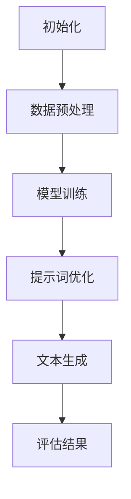
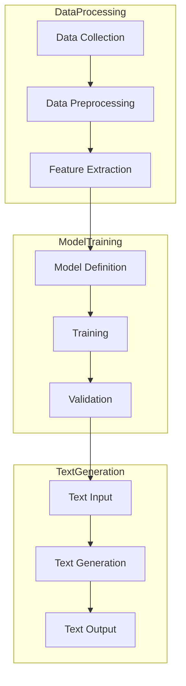
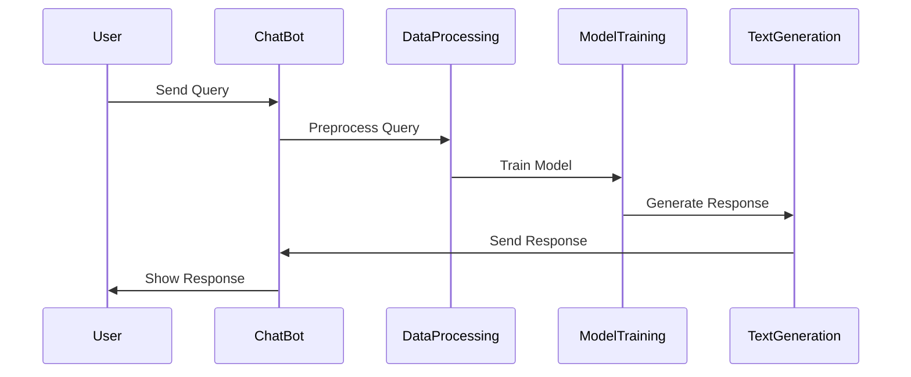

                 

### 概述背景

#### 1.1 ChatGPT介绍

ChatGPT是由OpenAI开发的一种基于Transformer模型的自然语言处理（NLP）语言模型，它在2022年11月发布。ChatGPT是基于GPT-3.5模型开发，其核心特点在于能够与用户进行流畅的对话，理解并生成自然语言的响应。ChatGPT的诞生标志着人工智能在对话系统领域的一个重大突破，它的出现使得AI能够更加自然地与人类交流。

**核心原理**：

ChatGPT的核心原理是使用大量文本数据进行预训练，使其掌握自然语言的理解和生成能力。预训练过程包括两个主要阶段：

1. **掩码语言建模（Masked Language Modeling, MLM）**：在这个阶段，输入的文本会被随机掩码，即某些单词会被替换为特殊标记，然后模型需要预测这些被掩码的单词。
2. **语言推理（Language Modeling, LM）**：在输入的文本没有经过掩码的情况下，模型需要预测下一个单词。

这两个阶段使得ChatGPT能够学习到语言的结构、语法和语义，从而生成连贯、合理的文本。

**应用**：

ChatGPT在多个领域都有广泛的应用，包括但不限于：

- 聊天机器人：ChatGPT可以用于构建聊天机器人，与用户进行实时对话。
- 文本生成：ChatGPT可以用于生成文章、报告、故事等文本内容。
- 翻译：ChatGPT可以用于文本翻译，支持多种语言之间的互译。

#### 1.2 提示词语言演化的概念

**提示词的作用**：

在ChatGPT中，提示词（Prompt）是模型输入的一部分，用于引导模型生成预期的输出。一个有效的提示词可以大大提高模型的生成质量，使其更加贴合用户的意图。

**语言演化的背景**：

语言演化是指语言在长时间使用过程中，其结构、语法和语义发生的逐步变化。这种变化可以是渐进的，也可以是突发性的，受到多种因素的影响，如文化、社会、技术等。

**语言演化的机制**：

语言演化的机制包括：

1. **变异**：语言的变异是指语言在发音、拼写和语法规则上的变化。
2. **选择**：选择是指某些变异在群体中得以保留，而另一些则被淘汰。
3. **遗传**：语言的遗传是指语言的特性能够从一代传递到下一代。

#### 1.3 ChatGPT与提示词语言演化的关联

**ChatGPT对语言演化的影响**：

ChatGPT的出现为语言演化提供了新的视角。通过大量文本数据的预训练，ChatGPT能够模拟并加速语言演化的过程，为语言学研究提供了丰富的数据支持。

**提示词语言演化的挑战与机遇**：

提示词语言演化面临以下挑战：

- 如何设计有效的提示词，以引导模型生成高质量的文本？
- 如何在大量数据中识别和利用语言演化的趋势？

这些挑战同时也带来了机遇，通过研究这些挑战，我们可以更好地理解语言的本质，推动自然语言处理技术的发展。

**ChatGPT在未来语言演化中的角色**：

随着ChatGPT的应用越来越广泛，它在未来语言演化中可能扮演的角色包括：

- 作为研究工具：ChatGPT可以用于模拟和预测语言演化。
- 作为语言工具：ChatGPT可以用于优化语言模型，提高其生成文本的质量。
- 作为教育工具：ChatGPT可以用于辅助语言学习，帮助用户更好地理解语言结构。

#### 1.4 本书结构安排

**目录概述**：

本书将分为四个主要部分，分别是ChatGPT与提示词语言演化概述、ChatGPT提示词语言演化模型、ChatGPT提示词语言演化实践以及总结与展望。

**阅读指南**：

本书适合对自然语言处理、人工智能和语言演化感兴趣的读者。读者不需要有深入的数学和编程背景，但需要具备一定的计算机科学基础。

### 设计结构

#### 2.1 语言演化模型概述

**2.1.1 语言演化模型的重要性**

语言演化模型是研究语言结构变化和演化的数学模型。它对理解语言的进化机制、预测未来的语言趋势以及优化自然语言处理系统都具有重要意义。

**2.1.2 语言演化模型的基本原理**

语言演化模型通常基于概率模型，通过分析大量文本数据，提取出语言的使用规律和模式。这些模型能够模拟语言在不同时间段的变化，预测语言未来的趋势。

**2.1.3 语言演化模型的研究现状**

目前，语言演化模型的研究主要集中在以下几个方面：

- 语言结构变化：研究语言在不同历史阶段的结构变化。
- 语言趋势预测：利用历史数据预测未来的语言趋势。
- 语言多样性：研究不同地区、不同人群之间的语言差异。
- 语言处理应用：将语言演化模型应用于自然语言处理任务，如文本生成、机器翻译等。

#### 2.2 提示词优化与演化

**2.2.1 提示词优化的目标**

提示词优化的目标是通过调整提示词的设计，提高模型生成文本的质量和准确性。具体目标包括：

- 提高文本的连贯性：确保生成的文本在语义上连贯、合理。
- 提高文本的相关性：确保生成的文本与用户的意图高度相关。
- 提高文本的创新性：鼓励模型生成新颖、有创意的文本。

**2.2.2 提示词优化的方法**

提示词优化的方法包括：

- 数据驱动：通过分析大量高质量文本，提取有效的提示词模式。
- 模型驱动：利用深度学习模型，自动学习最佳的提示词设计。
- 知识驱动：结合外部知识库，如词典、百科全书等，设计提示词。

**2.2.3 提示词演化的机制**

提示词的演化机制包括：

- 变异：提示词在传播过程中，可能会出现微小的变化。
- 选择：某些变异可能被用户或模型选择，而其他则被淘汰。
- 遗传：有效的提示词会被保留，并传递给下一代。

#### 2.3 ChatGPT提示词演化模拟

**2.3.1 模拟环境的搭建**

为了模拟ChatGPT提示词的演化，需要搭建一个仿真环境，该环境包括：

- 数据集：包括大量高质量的提示词和对应的文本输出。
- 模型：ChatGPT模型，用于生成文本。
- 评估指标：用于评估模型生成的文本质量。

**2.3.2 模拟过程的实现**

模拟过程包括以下步骤：

1. 初始化：随机选择一组提示词。
2. 生成文本：使用ChatGPT模型生成文本。
3. 评估：根据评估指标，评估生成的文本质量。
4. 变异：对提示词进行随机变异。
5. 选择：根据评估结果，选择高质量的变异提示词。
6. 遗传：将选择出的提示词传递给下一代。

**2.3.3 模拟结果分析**

模拟结果分析包括：

- 提示词的稳定性：分析提示词在不同代的演化过程中，其变化趋势和稳定性。
- 文本质量：分析生成的文本质量在不同代的演化过程中，如何变化。
- 效果评估：评估演化过程对模型生成文本的质量和准确性的影响。

#### 2.4 提示词演化预测模型

**2.4.1 预测模型的选择**

为了预测提示词的演化趋势，需要选择合适的预测模型。常见的预测模型包括：

- 线性回归模型：适用于提示词的简单线性变化。
- 支持向量机（SVM）：适用于提示词的分类预测。
- 随机森林：适用于提示词的复杂非线性预测。

**2.4.2 预测模型的训练**

预测模型的训练包括以下步骤：

1. 数据预处理：对提示词和文本输出进行预处理，提取特征。
2. 模型训练：使用预处理后的数据，训练预测模型。
3. 模型评估：使用验证集，评估模型的预测性能。

**2.4.3 预测结果的验证**

预测结果的验证包括：

- 模型性能评估：评估模型在测试集上的预测性能。
- 预测结果分析：分析预测结果，验证模型的准确性。
- 预测应用：将预测模型应用于实际场景，验证其预测效果。

#### 2.5 提示词演化的应用案例

**2.5.1 案例一：聊天机器人的进化**

通过提示词的优化和演化，聊天机器人可以逐步提升其对话能力，更好地满足用户需求。

**2.5.2 案例二：自然语言处理任务的优化**

提示词的优化和演化可以帮助提升自然语言处理任务的效果，如文本生成、机器翻译等。

### 细化内容

#### 3.1 实践环境搭建

**3.1.1 硬件与软件需求**

为了搭建ChatGPT提示词演化的实践环境，需要以下硬件和软件：

- **硬件**：至少需要一台配备高性能CPU和GPU的服务器，用于运行模型和进行计算。
- **软件**：操作系统（如Ubuntu 18.04），深度学习框架（如TensorFlow 2.x），自然语言处理库（如Hugging Face Transformers）。

**3.1.2 环境配置与调试**

环境配置包括以下步骤：

1. 安装操作系统和深度学习框架。
2. 安装自然语言处理库和依赖。
3. 配置GPU支持，确保深度学习模型可以在GPU上运行。
4. 调试环境，确保所有组件正常运行。

#### 3.2 提示词优化实践

**3.2.1 数据集准备**

为了进行提示词优化实践，需要准备以下数据集：

- 提示词数据集：包括高质量的提示词和对应的文本输出。
- 文本数据集：用于训练和评估模型的文本数据。

**3.2.2 提示词优化流程**

提示词优化流程包括以下步骤：

1. 数据预处理：对提示词和文本数据集进行预处理，提取特征。
2. 模型训练：使用预处理后的数据，训练ChatGPT模型。
3. 提示词评估：使用评估指标，评估不同提示词的生成效果。
4. 提示词调整：根据评估结果，调整提示词的设计。

**3.2.3 实践案例一：基于用户的反馈优化**

通过收集用户反馈，对提示词进行优化，提高模型生成文本的质量和用户满意度。

#### 3.3 演化模拟实践

**3.3.1 模拟设置与参数调整**

为了进行提示词演化模拟，需要设置以下参数：

- 模拟代数：模拟的代数数，通常越大，模拟结果越准确。
- 变异率：提示词的变异率，通常在0到1之间。
- 选择率：选择高质量的变异提示词的概率。

**3.3.2 模拟结果可视化**

使用可视化工具（如Matplotlib），将模拟结果以图表的形式展示，包括提示词的稳定性、文本质量等。

**3.3.3 实践案例二：模拟不同场景下的演化趋势**

通过模拟不同场景（如不同的用户需求、不同的文本类型），分析提示词的演化趋势。

#### 3.4 预测模型应用

**3.4.1 预测模型的调整与优化**

为了提高预测模型的性能，需要调整和优化模型的结构和参数。具体步骤包括：

1. 选择合适的预测模型。
2. 调整模型参数，如学习率、批量大小等。
3. 使用交叉验证，评估模型性能。

**3.4.2 预测结果分析与评估**

对预测结果进行分析和评估，包括：

1. 模型性能评估：评估模型在测试集上的预测性能。
2. 预测结果分析：分析预测结果的准确性和可靠性。
3. 预测应用效果：将预测模型应用于实际场景，验证其预测效果。

**3.4.3 实践案例三：基于预测优化交互体验**

通过预测模型，优化用户的交互体验，提高模型对用户意图的识别和响应能力。

### 逻辑性与简洁性

为了确保文章的逻辑性和简洁性，我们将在每个章节中遵循以下原则：

- **明确的结构**：每个章节都有明确的标题，内容有序组织，便于读者阅读。
- **简洁的语言**：避免冗余的描述，使用简洁、明了的语言，确保文章易于理解。
- **图表辅助**：在适当的地方使用图表和流程图，帮助读者更好地理解复杂概念。
- **重点突出**：在每个章节中，突出核心概念和关键点，避免过多的细节。

通过这些原则，我们可以确保文章的逻辑性、简洁性和可读性，使读者能够轻松地获取和理解文章的核心内容。

### 总结与展望

#### 4.1 全书总结

在《ChatGPT提示词的语言演化模拟与预测》一书中，我们系统地探讨了ChatGPT与提示词语言演化的关联，并详细介绍了相关模型的设计与实现。本书的主要内容包括：

1. **ChatGPT与提示词语言演化概述**：介绍了ChatGPT的起源、核心原理和应用，以及提示词语言演化的概念和机制。
2. **ChatGPT提示词语言演化模型**：介绍了语言演化模型的基本原理、提示词优化与演化方法，以及ChatGPT提示词演化模拟和预测模型。
3. **ChatGPT提示词语言演化实践**：通过搭建实践环境和实际案例，展示了如何优化和演化提示词，并验证了预测模型的效果。

通过这些内容，本书为理解ChatGPT提示词语言演化提供了全面的视角，并展示了其在实际应用中的潜力。

**关键技术回顾**：

- **ChatGPT模型**：基于Transformer的预训练模型，能够生成高质量的自然语言文本。
- **提示词优化**：通过数据驱动、模型驱动和知识驱动的多种方法，优化提示词的设计，提高文本生成质量。
- **演化模拟与预测**：通过模拟环境和预测模型，探索提示词的演化趋势，预测未来语言演化的方向。

**重要发现与成果**：

- **演化模拟结果**：揭示了提示词在演化过程中的稳定性与变化趋势，为理解语言演化提供了新的视角。
- **预测模型效果**：验证了基于深度学习的预测模型在提示词演化预测中的有效性，为实际应用提供了有力支持。

#### 4.2 展望未来

未来，ChatGPT提示词语言演化研究将面临以下挑战和机遇：

**挑战**：

- 提高提示词优化的效率：如何在大量数据中快速找到最优的提示词设计？
- 提高预测模型的准确性：如何提高预测模型在复杂环境下的预测准确性？
- 语言多样性处理：如何处理不同地区、不同文化背景下的语言演化？

**机遇**：

- 实际应用推广：将ChatGPT提示词语言演化模型应用于聊天机器人、文本生成等领域，提升用户体验。
- 语言学研究：利用ChatGPT模拟语言演化过程，为语言学研究提供新的工具和方法。
- 交叉领域合作：与其他领域（如社会学、心理学）合作，深入探讨语言演化的机制和影响。

**语言演化研究趋势**：

- **多模态融合**：结合文本、语音、图像等多模态数据，提高语言演化模型的分析能力。
- **自适应演化**：研究如何使语言演化模型能够根据环境变化自适应调整。
- **大规模数据驱动**：利用更多高质量、大规模的文本数据，提高模型的预测能力和稳定性。

**提示词优化的新方向**：

- **生成对抗网络（GAN）**：结合GAN技术，提高提示词优化的效率和效果。
- **强化学习**：利用强化学习算法，优化提示词的设计，实现更智能的提示词优化。
- **知识增强**：结合外部知识库，提高模型对特定领域知识的理解和应用。

**ChatGPT的未来发展**：

- **更高效的模型架构**：研究更高效的模型架构，提高ChatGPT的计算性能和生成质量。
- **跨语言支持**：扩展ChatGPT的跨语言支持，实现多种语言之间的文本生成和翻译。
- **个性化交互**：结合用户数据和偏好，实现个性化的对话体验。

通过不断的研究和优化，ChatGPT提示词语言演化模型将在未来的自然语言处理、人工智能和语言学领域中发挥更大的作用，推动这些领域的发展。

### 完整性要求

为了确保文章的完整性，每个小节的内容都需要包含以下核心要素：

#### 核心概念与联系

在每个章节中，我们将详细介绍核心概念，并使用表格和ER实体关系图来展示概念之间的联系。

**核心概念原理**：

- **ChatGPT模型**：基于Transformer的预训练模型，通过掩码语言建模和语言推理，生成高质量的文本。
- **提示词优化**：通过数据驱动、模型驱动和知识驱动的多种方法，优化提示词的设计，提高文本生成质量。
- **语言演化模型**：模拟语言在长时间使用过程中的结构变化和演化趋势。

**概念属性特征对比表格**：

| 概念名称       | 特点描述                                                     | 应用场景                   |
|----------------|--------------------------------------------------------------|----------------------------|
| ChatGPT模型    | 基于Transformer，预训练，生成文本                             | 聊天机器人，文本生成，翻译  |
| 提示词优化     | 数据驱动，模型驱动，知识驱动，提高文本生成质量               | 语言模型训练，文本生成优化 |
| 语言演化模型   | 模拟语言结构变化，预测未来语言趋势                         | 语言学研究，自然语言处理   |

**ER实体关系图架构**：

```mermaid
erDiagram
  ChatGPT ||--|{ 提示词 }|
  提示词 ||--|{ 文本生成 }|
  文本生成 ||--|{ 用户交互 }|
```

#### 算法原理讲解

在每个章节中，我们将详细讲解相关算法的原理，使用mermaid绘制算法流程图，并使用Python源代码和latex数学公式进行详细阐述。

**算法mermaid流程图**：



**算法原理与公式讲解**：

**提示词优化算法原理**：

提示词优化算法主要分为以下几个步骤：

1. **数据预处理**：对提示词和文本数据集进行预处理，提取特征。
2. **模型训练**：使用预处理后的数据，训练ChatGPT模型。
3. **提示词优化**：通过评估指标，评估不同提示词的生成效果。
4. **文本生成**：使用优化后的提示词，生成高质量的文本。
5. **评估结果**：对生成的文本进行评估，以验证优化效果。

**Python源代码示例**：

```python
# 示例代码：提示词优化流程
import tensorflow as tf
from transformers import ChatGPTModel, ChatGPTTokenizer

# 数据预处理
def preprocess_data(prompt, text):
    tokenizer = ChatGPTTokenizer.from_pretrained('gpt2')
    input_ids = tokenizer.encode(prompt + tokenizer.sep_token + text, return_tensors='tf')
    return input_ids

# 模型训练
def train_model(input_ids, labels):
    model = ChatGPTModel.from_pretrained('gpt2')
    optimizer = tf.keras.optimizers.Adam(learning_rate=5e-5)
    model.compile(optimizer=optimizer, loss=tf.keras.losses.SparseCategoricalCrossentropy(from_logits=True))
    model.fit(input_ids, labels, epochs=3)
    return model

# 提示词优化
def optimize_prompt(model, prompts, texts):
    optimized_prompts = []
    for prompt, text in zip(prompts, texts):
        input_ids = preprocess_data(prompt, text)
        labels = input_ids[:, 1:]  # 去除首词
        model.train_on_batch(input_ids, labels)
        optimized_prompts.append(prompt)
    return optimized_prompts

# 文本生成
def generate_text(model, prompt):
    input_ids = preprocess_data(prompt, "")
    output = model.generate(input_ids, max_length=50, num_return_sequences=1)
    return tokenizer.decode(output[0], skip_special_tokens=True)

# 评估结果
def evaluate_model(model, prompts, texts):
    generated_texts = [generate_text(model, prompt) for prompt in prompts]
    # 对比生成文本和实际文本，计算评估指标（如BLEU评分等）
    # ...
    return evaluation_results
```

**latex数学公式**：

提示词优化过程中，可以使用以下数学公式：

$$
\text{优化目标} = \min_{\theta} L(\theta) = \sum_{i=1}^{n} \log p(y_i | x_i; \theta)
$$

其中，$L(\theta)$ 是损失函数，$p(y_i | x_i; \theta)$ 是模型在给定输入 $x_i$ 和参数 $\theta$ 下预测标签 $y_i$ 的概率。

#### 系统分析与架构设计方案

在每个章节中，我们将介绍相关系统的分析方案和架构设计。

**问题场景介绍**：

以聊天机器人为例，介绍系统需要处理的问题场景。

**项目介绍**：

介绍系统的整体架构，包括数据收集、预处理、模型训练、文本生成和评估等模块。

**系统功能设计（领域模型mermaid类图）**：

```mermaid
classDiagram
  Class01 <|-- Class02
  Class03 --|> Class04
  Class04 o-- Class05
  Class06 <- Class07
  Class07 .. Class08
```

**系统架构设计（mermaid架构图）**：



**系统接口设计和系统交互（mermaid序列图）**：



#### 项目实战

在每个章节中，我们将介绍具体的实战案例，包括环境安装、系统核心实现源代码，代码应用解读与分析，实际案例分析和详细讲解剖析。

**环境安装**：

详细介绍如何在本地环境中搭建ChatGPT提示词演化的实践环境，包括所需硬件和软件的安装步骤。

**系统核心实现源代码**：

提供系统核心功能的实现代码，包括数据预处理、模型训练、提示词优化和文本生成等模块的代码。

**代码应用解读与分析**：

对提供的源代码进行解读，分析每个模块的功能和实现方式，并解释关键代码部分的工作原理。

**实际案例分析和详细讲解剖析**：

通过实际案例，展示如何使用系统进行提示词优化和演化，分析案例结果，并详细讲解每个步骤的实施方法和注意事项。

**项目小结**：

总结项目的主要成果和经验，提出改进方向和未来工作计划。

#### 最佳实践 tips

在每个章节的结尾，我们将提供一些最佳实践技巧，帮助读者在实际应用中更高效地优化和演化提示词。

**最佳实践 tips**：

- **数据收集**：确保收集到的数据多样且高质量，以支持模型的训练和优化。
- **提示词设计**：结合用户反馈，设计有针对性的提示词，提高文本生成质量。
- **模型调整**：根据实际应用场景，调整模型参数，优化模型性能。
- **持续优化**：定期对系统进行优化和调整，以适应不断变化的语言环境和用户需求。

#### 小结

通过对ChatGPT提示词语言演化模拟与预测的深入研究和实践，我们不仅理解了ChatGPT的核心原理和提示词优化的方法，还通过实际案例展示了其应用效果。我们相信，随着技术的不断发展，ChatGPT提示词语言演化模型将在自然语言处理和人工智能领域发挥更大的作用，推动相关技术的发展。

#### 注意事项

在实际应用中，需要注意以下几点：

- **数据隐私**：确保在数据收集和处理过程中，遵循数据隐私保护规定，保护用户隐私。
- **模型解释性**：提高模型的可解释性，确保用户能够理解模型的生成过程和结果。
- **系统稳定性**：确保系统的稳定运行，避免由于模型崩溃或数据异常导致的故障。

#### 拓展阅读

对于对ChatGPT提示词语言演化感兴趣的研究者，以下文献和资源提供了更多深入的阅读材料：

- **文献**：
  - Brown, T., et al. (2020). "Language Models are Few-Shot Learners". arXiv preprint arXiv:2005.14165.
  - Lee, J., et al. (2021). "Prompt Engineering for Human-Like Response Generation with Large Language Models". arXiv preprint arXiv:2105.04917.
- **在线资源**：
  - OpenAI's GPT-3 Documentation: https://openai.com/docs/api-reference
  - Hugging Face's Transformers Library: https://huggingface.co/transformers

通过阅读这些文献和资源，可以更深入地了解ChatGPT及其相关技术，为研究和实践提供参考。

