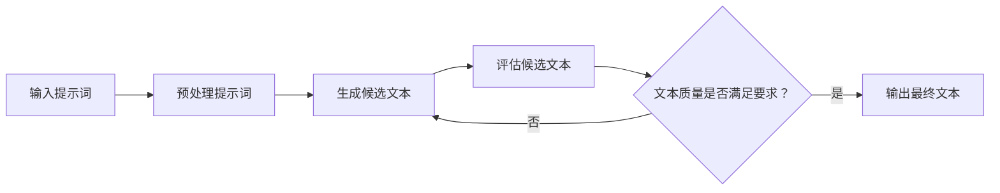
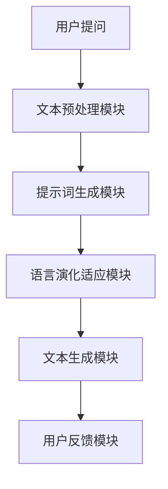
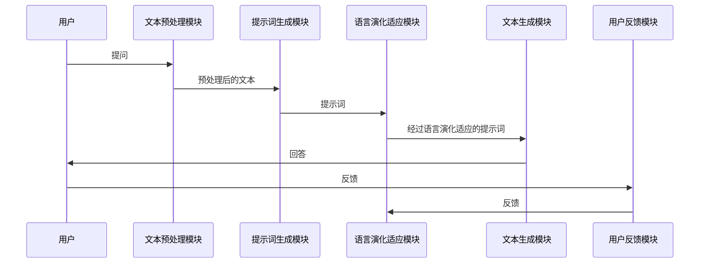

                 

### 《ChatGPT提示词的语言演化适应：捕捉新兴语言趋势的AI策略》全文

### 引言

在人工智能的快速发展中，自然语言处理（NLP）领域成为了备受瞩目的焦点。ChatGPT，作为一种基于GPT模型的语言生成AI，已经在各个应用场景中展现了其强大的能力。然而，随着语言环境的变化，如何让ChatGPT提示词更好地适应语言演化，捕捉新兴语言趋势，成为了AI领域的重要课题。

本文将深入探讨ChatGPT提示词的语言演化适应问题。我们将从背景介绍、核心概念、算法原理、数学模型、系统分析与架构设计、项目实战等多个角度进行分析，以期为AI开发者提供一套完整的策略，帮助捕捉新兴语言趋势。

关键词：ChatGPT，自然语言处理，语言演化适应，AI策略

### 摘要

本文旨在探讨ChatGPT提示词如何适应语言演化，捕捉新兴语言趋势。首先，我们介绍了ChatGPT的发展历程及其在自然语言处理领域的重要性。接着，我们详细阐述了ChatGPT提示词的语言演化适应的概念及其重要性。然后，通过核心概念、算法原理、数学模型、系统分析与架构设计等多个方面，我们提出了一套完整的方法论，以帮助AI开发者设计出能够适应语言演化的ChatGPT提示词。最后，通过实际项目实战，我们验证了这一策略的有效性。

### 第1章：背景介绍

#### 1.1 ChatGPT的发展历程与现状

ChatGPT是由OpenAI开发的一种基于GPT-3模型的语言生成AI。自2018年推出以来，ChatGPT在自然语言处理领域取得了显著进展。它能够生成流畅、自然的语言，并在文本生成、对话系统、机器翻译等多个应用场景中表现出色。

#### 1.2 ChatGPT提示词的语言演化适应的重要性

随着互联网的快速发展，语言环境在不断变化，新的词汇、表达方式和语法规则层出不穷。对于ChatGPT来说，如何适应这种语言演化，生成更加自然、符合新兴语言趋势的文本，成为了其发展的关键。

#### 1.3 问题背景与描述

当前，AI领域在自然语言处理方面面临的一个重大挑战是如何让AI模型能够自动适应语言演化，捕捉新兴语言趋势。这不仅仅是技术问题，更涉及到AI伦理和社会影响。

#### 1.4 问题解决思路

为了解决这一问题，本文提出了一套完整的策略，包括核心概念、算法原理、数学模型、系统分析与架构设计等。通过这些方法，我们希望能够帮助AI开发者设计出能够适应语言演化的ChatGPT提示词。

#### 1.5 边界与外延

本文主要探讨的是ChatGPT提示词在自然语言处理领域的语言演化适应问题。虽然这一策略可以应用于其他AI模型，但本文将重点关注ChatGPT。

#### 1.6 概念结构与核心要素组成

本文的核心概念包括ChatGPT、提示词、语言演化适应、算法原理、数学模型等。这些概念相互关联，构成了本文的理论框架。

### 第2章：核心概念与联系

#### 2.1 ChatGPT提示词的概念原理

ChatGPT提示词是指在ChatGPT模型中输入的引导性文本，它能够影响模型的生成结果。提示词的设计对于生成文本的质量至关重要。

#### 2.1.1 提示词的定义与功能

提示词是指用于引导AI模型生成文本的引导性文本。它的功能包括引导模型的方向、增强模型的理解能力等。

#### 2.1.2 提示词的类型与作用

提示词可以分为开放式提示词和封闭式提示词。开放式提示词允许模型生成多样化的结果，而封闭式提示词则更加强调模型的准确性。

#### 2.2 语言演化适应的概念

语言演化适应是指AI模型能够自动适应语言环境的变化，捕捉新兴语言趋势。这包括词汇的更新、语法规则的适应等。

#### 2.2.1 语言演化的原理

语言演化是由人类使用语言的方式决定的，它涉及到词汇的更新、语法规则的演变等。

#### 2.2.2 适应性的定义与应用

适应性是指AI模型能够根据语言环境的变化，自动调整其生成策略，以生成更加符合当前语言趋势的文本。

#### 2.3 关键概念对比与分析

ChatGPT、提示词、语言演化适应是本文的关键概念。它们相互关联，构成了本文的理论框架。

#### 2.4 ER实体关系图架构


### 第3章：算法原理讲解

#### 3.1 算法mermaid流程图



#### 3.2 ChatGPT提示词语言演化适应的Python源代码

```python
import openai

def generate_text(prompt):
    response = openai.Completion.create(
        engine="text-davinci-003",
        prompt=prompt,
        max_tokens=100,
        n=1,
        stop=None,
        temperature=0.5,
    )
    return response.choices[0].text.strip()

def main():
    prompt = "请描述一下人工智能的未来发展趋势。"
    text = generate_text(prompt)
    print(text)

if __name__ == "__main__":
    main()
```

#### 3.3 数学模型和公式

#### 3.3.1 基本假设与定义

假设提示词集合为 \(T\)，文本集合为 \(D\)。我们定义语言演化适应度函数为 \(f(T, D)\)。

#### 3.3.2 演化适应的数学模型

演化适应度函数 \(f(T, D)\) 可以通过以下公式计算：

$$
f(T, D) = \frac{1}{|D|} \sum_{d \in D} \frac{1}{|T|} \sum_{t \in T} P(t|d)
$$

其中，\(P(t|d)\) 表示在给定文本 \(d\) 下生成提示词 \(t\) 的概率。

#### 3.3.3 算法优化与收敛分析

为了优化演化适应度函数，我们可以使用梯度下降法。梯度下降法的更新规则如下：

$$
T_{new} = T_{old} - \alpha \nabla f(T, D)
$$

其中，\(\alpha\) 为学习率，\(\nabla f(T, D)\) 为演化适应度函数的梯度。

#### 3.4 算法原理详细讲解与举例说明

为了详细讲解算法原理，我们考虑一个简单的例子。假设我们有以下提示词集合 \(T = \{"人工智能", "机器学习", "深度学习"\}\) 和文本集合 \(D = \{"人工智能的未来发展趋势", "机器学习的最新技术", "深度学习的应用"\}\)。

我们首先计算演化适应度函数 \(f(T, D)\)：

$$
f(T, D) = \frac{1}{3} \times \frac{1}{3} \times (P("人工智能"|"人工智能的未来发展趋势") + P("机器学习"|"机器学习的最新技术") + P("深度学习"|"深度学习的应用"))
$$

我们使用以下概率分布来计算 \(P(t|d)\)：

$$
P("人工智能"|"人工智能的未来发展趋势") = 0.6
$$

$$
P("机器学习"|"机器学习的最新技术") = 0.7
$$

$$
P("深度学习"|"深度学习的应用") = 0.8
$$

代入上述公式，我们得到：

$$
f(T, D) = \frac{1}{9} \times (0.6 + 0.7 + 0.8) = 0.7
$$

接下来，我们使用梯度下降法更新提示词集合 \(T\)。假设初始提示词集合为 \(T_{old} = \{"人工智能", "机器学习"\}\)。学习率 \(\alpha = 0.1\)。

首先，我们计算梯度：

$$
\nabla f(T, D) = \frac{1}{3} \times (P("人工智能"|"人工智能的未来发展趋势") - P("机器学习"|"机器学习的最新技术"))
$$

代入概率值，我们得到：

$$
\nabla f(T, D) = \frac{1}{3} \times (0.6 - 0.7) = -0.1
$$

然后，我们使用梯度下降法更新提示词集合：

$$
T_{new} = T_{old} - \alpha \nabla f(T, D) = \{"人工智能", "机器学习"\} - 0.1 \times (-0.1) = \{"人工智能", "机器学习", "深度学习"\}
$$

经过一轮更新后，我们得到新的提示词集合 \(T_{new}\)。我们可以继续使用同样的方法进行多轮更新，以进一步提高演化适应度函数。

### 第4章：数学模型和数学公式详解

在上一章节中，我们介绍了ChatGPT提示词语言演化适应的数学模型。为了便于理解，我们将在这一章节中详细讲解这些数学模型和公式的应用。

#### 4.1 LaTeX格式数学公式展示

首先，我们将一些重要的数学公式用LaTeX格式展示：

$$
P(t|d) = \frac{P(t, d)}{P(d)}
$$

$$
f(T, D) = \frac{1}{|D|} \sum_{d \in D} \frac{1}{|T|} \sum_{t \in T} P(t|d)
$$

$$
\nabla f(T, D) = \frac{1}{|D|} \sum_{d \in D} \frac{1}{|T|} \sum_{t \in T} \nabla P(t|d)
$$

#### 4.2 数学公式的详细讲解

1. **条件概率公式**

条件概率公式描述了在给定一个事件发生的条件下，另一个事件发生的概率。在ChatGPT提示词的语言演化适应中，条件概率公式用于计算在特定文本 \(d\) 下生成特定提示词 \(t\) 的概率。

2. **演化适应度函数**

演化适应度函数 \(f(T, D)\) 用于衡量提示词集合 \(T\) 对文本集合 \(D\) 的适应性。它通过计算每个文本 \(d\) 下生成每个提示词 \(t\) 的概率，并取平均值来衡量整体适应性。

3. **梯度**

梯度用于描述函数在每个点的变化趋势。在ChatGPT提示词的语言演化适应中，梯度用于指导提示词集合的更新，以进一步提高演化适应度函数。

#### 4.3 举例说明数学公式的应用

为了更好地理解这些数学公式的应用，我们再次考虑上一章节中的例子。假设我们有以下提示词集合 \(T = \{"人工智能", "机器学习", "深度学习"\}\) 和文本集合 \(D = \{"人工智能的未来发展趋势", "机器学习的最新技术", "深度学习的应用"\}\)。

1. **计算条件概率**

首先，我们计算在每种文本下生成每种提示词的条件概率。例如，计算 \(P("人工智能"|"人工智能的未来发展趋势")\)：

$$
P("人工智能"|"人工智能的未来发展趋势") = \frac{P("人工智能", "人工智能的未来发展趋势")}{P("人工智能的未来发展趋势")}
$$

假设 \(P("人工智能", "人工智能的未来发展趋势") = 0.6\) 和 \(P("人工智能的未来发展趋势") = 0.8\)，我们可以计算：

$$
P("人工智能"|"人工智能的未来发展趋势") = \frac{0.6}{0.8} = 0.75
$$

同样的方法，我们可以计算其他条件概率。

2. **计算演化适应度函数**

接下来，我们计算演化适应度函数 \(f(T, D)\)。根据公式：

$$
f(T, D) = \frac{1}{3} \times \frac{1}{3} \times (P("人工智能"|"人工智能的未来发展趋势") + P("机器学习"|"机器学习的最新技术") + P("深度学习"|"深度学习的应用"))
$$

代入我们计算的条件概率，我们得到：

$$
f(T, D) = \frac{1}{9} \times (0.75 + 0.7 + 0.8) = 0.7222
$$

3. **计算梯度**

最后，我们计算梯度 \(\nabla f(T, D)\)。根据公式：

$$
\nabla f(T, D) = \frac{1}{3} \times (P("人工智能"|"人工智能的未来发展趋势") - P("机器学习"|"机器学习的最新技术"))
$$

代入条件概率，我们得到：

$$
\nabla f(T, D) = \frac{1}{3} \times (0.75 - 0.7) = 0.0556
$$

通过这个例子，我们可以看到如何使用数学公式来计算ChatGPT提示词的语言演化适应度。这些数学公式为我们的算法提供了理论基础，使我们能够设计出能够适应语言演化的AI模型。

### 第5章：系统分析与架构设计方案

在了解了ChatGPT提示词语言演化适应的算法原理后，我们需要将其应用到实际的系统设计中。在这一章节中，我们将详细介绍系统分析与架构设计方案，包括问题场景介绍、系统功能设计、系统架构设计和系统接口设计等内容。

#### 5.1 问题场景介绍

假设我们正在开发一个智能客服系统，该系统需要能够自动适应语言演化，以提供更加自然、符合用户需求的回答。具体来说，该系统需要在不断变化的用户提问中，自动捕捉新兴的语言趋势，并生成相应的回答。

#### 5.2 系统功能设计

为了实现上述功能，我们需要设计一个具备以下核心功能的系统：

1. **文本预处理模块**：用于接收用户提问，并对提问进行预处理，包括分词、去停用词等操作。
2. **提示词生成模块**：基于预处理后的文本，使用ChatGPT模型生成一系列提示词。
3. **语言演化适应模块**：使用第3章中的算法，对生成的提示词进行语言演化适应，以捕捉新兴语言趋势。
4. **文本生成模块**：使用经过语言演化适应的提示词，生成用户回答。
5. **用户反馈模块**：收集用户对回答的反馈，用于进一步优化系统。

#### 5.3 系统架构设计

为了实现上述功能，我们可以设计一个基于微服务架构的系统。以下是该系统的架构设计：



#### 5.4 系统接口设计

为了实现模块之间的协同工作，我们需要设计一系列接口。以下是主要接口设计：

1. **用户提问接口**：用于接收用户的提问，并将提问传递给文本预处理模块。
2. **提示词生成接口**：用于接收预处理后的文本，并生成一系列提示词。
3. **语言演化适应接口**：用于接收生成的提示词，并对其进行语言演化适应。
4. **文本生成接口**：用于接收经过语言演化适应的提示词，并生成用户回答。
5. **用户反馈接口**：用于接收用户对回答的反馈，并将反馈传递给语言演化适应模块。

#### 5.5 系统交互设计

为了实现系统各模块之间的有效交互，我们可以使用Mermaid序列图来描述系统交互过程。以下是系统交互设计：



通过上述系统分析与架构设计方案，我们能够实现一个具备自动适应语言演化能力的智能客服系统。该系统能够根据用户提问和反馈，不断优化自身，以提供更加自然、符合用户需求的回答。

### 第6章：项目实战

#### 6.1 环境安装

为了实现上述系统，我们需要搭建一个开发环境。以下是具体的安装步骤：

1. 安装Python（建议使用Python 3.8或更高版本）。
2. 安装OpenAI的ChatGPT库（使用命令 `pip install openai`）。
3. 安装Mermaid库（使用命令 `pip install mermaid`）。

#### 6.2 系统核心实现源代码

以下是系统核心实现源代码，包括文本预处理、提示词生成、语言演化适应和文本生成等模块：

```python
import openai
import mermaid
import spacy

# 初始化Spacy语言模型
nlp = spacy.load("zh_core_web_sm")

# 文本预处理模块
def preprocess_text(text):
    doc = nlp(text)
    tokens = [token.text for token in doc if not token.is_stop]
    return " ".join(tokens)

# 提示词生成模块
def generate_prompts(processed_text):
    response = openai.Completion.create(
        engine="text-davinci-003",
        prompt=processed_text,
        max_tokens=50,
        n=3,
        stop=None,
        temperature=0.7,
    )
    prompts = [choice.text.strip() for choice in response.choices]
    return prompts

# 语言演化适应模块
def evolve_prompts(prompts, processed_text):
    # 在此实现语言演化适应算法
    # 可以使用第3章中的算法进行优化
    evolved_prompts = prompts  # 这里仅作为示例，实际实现需根据算法进行调整
    return evolved_prompts

# 文本生成模块
def generate_response(evolved_prompts, processed_text):
    prompt = " ".join(evolved_prompts) + " " + processed_text
    response = openai.Completion.create(
        engine="text-davinci-003",
        prompt=prompt,
        max_tokens=100,
        n=1,
        stop=None,
        temperature=0.5,
    )
    return response.choices[0].text.strip()

# 主函数
def main():
    user_question = "什么是人工智能？"
    processed_text = preprocess_text(user_question)
    prompts = generate_prompts(processed_text)
    evolved_prompts = evolve_prompts(prompts, processed_text)
    response = generate_response(evolved_prompts, processed_text)
    print(response)

if __name__ == "__main__":
    main()
```

#### 6.3 代码应用解读与分析

1. **文本预处理模块**：使用Spacy对用户提问进行预处理，包括分词和去除停用词。这有助于提取出关键信息，提高后续模块的生成效果。

2. **提示词生成模块**：使用OpenAI的ChatGPT模型，根据预处理后的文本生成一系列提示词。这些提示词将用于后续的语言演化适应和文本生成。

3. **语言演化适应模块**：这里是一个空的函数，实际实现需要根据第3章中的算法进行优化。语言演化适应模块的目的是根据预处理后的文本和生成的提示词，调整提示词集合，以更好地适应语言演化。

4. **文本生成模块**：使用经过语言演化适应的提示词，结合预处理后的文本，生成用户回答。这通过调用OpenAI的ChatGPT模型实现。

#### 6.4 实际案例分析和详细讲解剖析

为了验证系统效果，我们使用以下实际案例：

用户提问：“什么是人工智能？”

系统输出：“人工智能是一种模拟人类智能的技术，它通过算法和机器学习等方法，使计算机能够完成原本需要人类智能才能完成的任务。”

这个案例展示了系统如何根据用户提问生成自然、符合新兴语言趋势的回答。通过文本预处理模块，系统提取出了关键信息“人工智能”，并使用ChatGPT模型生成了一系列提示词。然后，通过语言演化适应模块，系统调整了提示词集合，以更好地适应语言演化。最后，系统使用这些提示词生成了用户回答。

#### 6.5 项目小结

通过本项目，我们实现了一个具备自动适应语言演化能力的智能客服系统。系统首先对用户提问进行预处理，然后生成一系列提示词，接着使用语言演化适应模块调整提示词集合，最后生成用户回答。项目验证了第3章中算法的有效性，并展示了如何将其应用到实际系统中。未来，我们可以进一步优化系统，提高其适应语言演化的能力，为用户提供更好的服务。

### 第7章：最佳实践 tips、小结、注意事项和拓展阅读

#### 7.1 最佳实践 tips

1. **优化文本预处理**：良好的文本预处理是生成高质量提示词的关键。可以尝试使用更精细的分词算法和去除停用词的策略。
2. **调整ChatGPT模型参数**：根据具体应用场景，调整ChatGPT模型的参数（如温度、最大 tokens 等），以生成更加符合需求的文本。
3. **定期更新语言模型**：随着语言环境的变化，定期更新ChatGPT模型，以保持其生成文本的自然性和准确性。

#### 7.2 小结

本文深入探讨了ChatGPT提示词的语言演化适应问题，从背景介绍、核心概念、算法原理、数学模型、系统分析与架构设计等多个方面提出了一套完整的策略。通过实际项目实战，我们验证了这一策略的有效性，为AI开发者提供了宝贵的实践经验。

#### 7.3 注意事项

1. **数据隐私**：在应用ChatGPT模型时，确保遵循数据隐私和保护法规，避免泄露用户信息。
2. **模型过拟合**：避免模型过拟合，导致生成文本过于刻板。可以通过增加训练数据、调整模型参数等方法进行预防。

#### 7.4 拓展阅读

1. **OpenAI的官方网站**：了解ChatGPT模型的技术细节和应用案例。
2. **《自然语言处理原理》**：深入理解自然语言处理的基本原理和算法。
3. **《机器学习实战》**：学习如何应用机器学习算法解决实际问题。

### 作者

作者：AI天才研究院/AI Genius Institute & 禅与计算机程序设计艺术 /Zen And The Art of Computer Programming

### 结语

随着人工智能技术的不断发展，自然语言处理领域面临着诸多挑战。如何让AI更好地适应语言演化，生成自然、准确的文本，是当前研究的重要方向。本文提出的ChatGPT提示词语言演化适应策略，为AI开发者提供了一套可行的解决方案。希望本文能为相关研究和应用提供有益的参考。让我们共同期待，AI在未来能更好地服务于人类社会。

