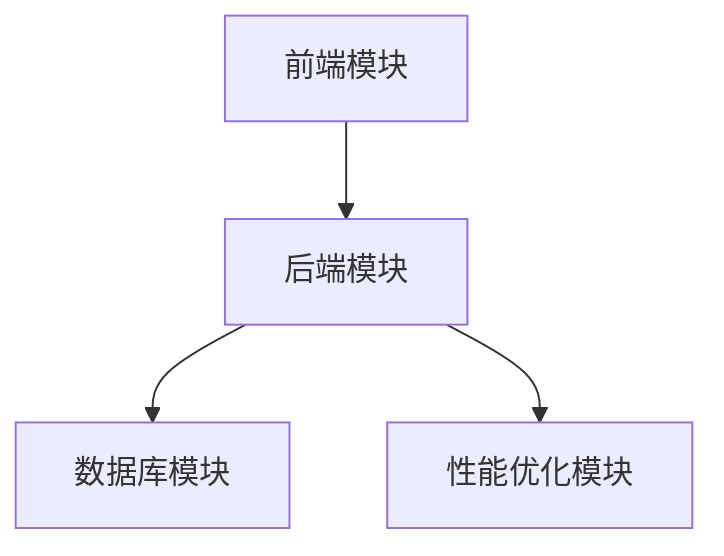
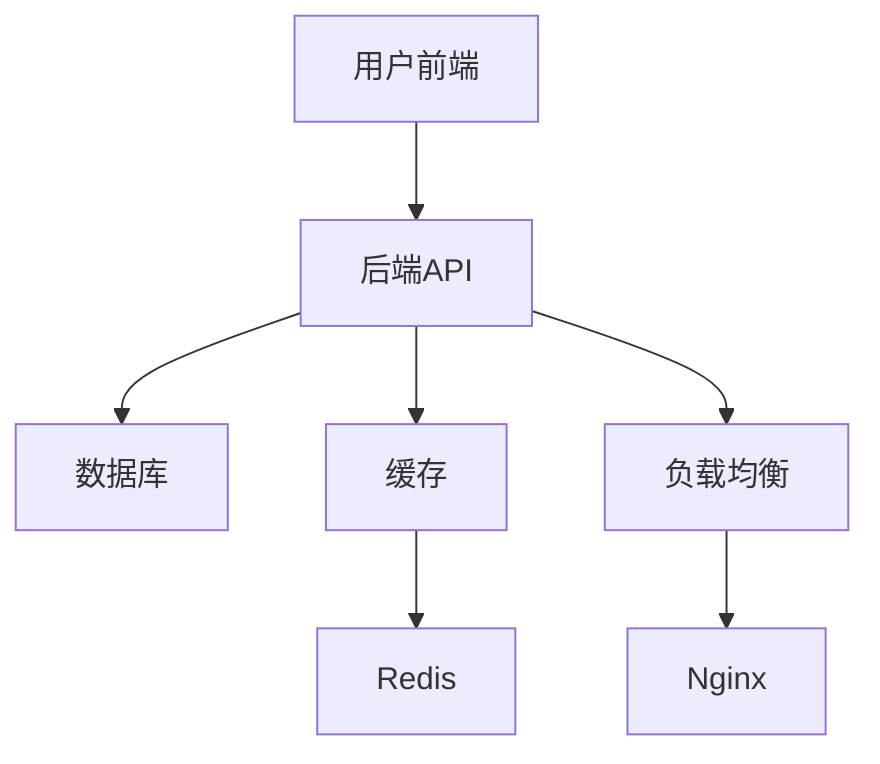
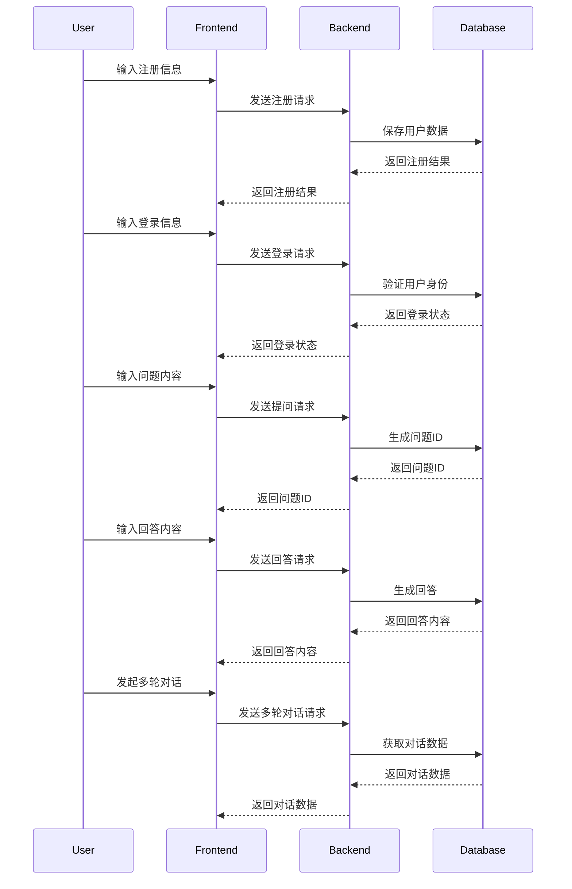

                 

## 引言

在人工智能领域，自然语言处理（NLP）是一项备受关注且具有重大应用价值的技术。近年来，基于大型语言模型的聊天机器人如ChatGPT等逐渐成为NLP研究的热点。这些聊天机器人能够通过理解用户的输入并生成连贯、有意义的回复，大大提升了人机交互的体验。然而，一个关键问题是如何有效地设计提示词（prompts）来引导这些聊天机器人生成高质量的回答。本文将围绕这一主题，提出一种新的视角来探讨ChatGPT提示词的语言获得理论。

首先，我们需要了解什么是语言获得理论。语言获得理论主要研究个体如何从无语言状态发展到具备语言能力的过程。在人工智能领域，语言获得理论可以帮助我们理解聊天机器人如何通过输入的提示词来“学习”并生成回答。本文的核心内容将分为以下几个部分：

### 1.1 问题背景

在当今社会，人工智能技术正以前所未有的速度发展。尤其是自然语言处理技术的突破，使得聊天机器人如ChatGPT等在各个领域得到广泛应用。然而，现有的研究主要关注于如何提高聊天机器人的语言生成能力，而对如何设计有效的提示词指导其生成高质量回答的研究相对较少。

### 1.2 核心概念与联系

本文将首先回顾语言获得理论的历史发展，从行为主义、认知主义到神经科学的不同视角，分析这些理论如何帮助我们理解ChatGPT的工作机制。接着，我们将深入探讨ChatGPT提示词的语言获得机制，分析提示词在语言模型训练和优化过程中的作用。

### 1.3 提示词设计原则

接下来，我们将讨论如何设计有效的提示词。通过案例分析和优化策略，我们将探讨如何提高提示词的清晰性、精确性和情感共鸣，从而提升聊天机器人的回答质量。

### 1.4 编程技巧与最佳实践

为了实现提示词的编程和应用，我们将介绍ChatGPT API的使用方法、编程语言与工具的选择，以及高效的编程技巧和最佳实践。

### 1.5 项目实战

最后，我们将通过一个实际项目来展示如何将提示词语言获得理论应用于实践。我们将在项目中详细介绍系统的设计、实现和优化过程，并通过实际案例分析来验证提示词优化策略的有效性。

### 1.6 总结与展望

在文章的最后一部分，我们将总结本文的主要发现，探讨最佳实践，并提出未来研究的方向。

通过这一系列的研究，我们期望能够为ChatGPT提示词的设计提供新的理论支持，从而提高聊天机器人的回答质量和用户体验。接下来，我们将一步一步地深入探讨这一主题。

## 文章关键词

- **ChatGPT**
- **提示词**
- **语言获得理论**
- **自然语言处理**
- **语言模型**
- **提示词设计**
- **编程技巧**

## 摘要

本文旨在探讨ChatGPT提示词的语言获得理论，并提出一种新的视角来理解这一过程。文章首先回顾了语言获得理论的历史发展，包括行为主义、认知主义和神经科学的视角。接着，本文详细分析了ChatGPT提示词的语言获得机制，探讨了提示词在语言模型训练和优化过程中的作用。随后，文章提出了有效的提示词设计原则，包括清晰性、精确性和情感共鸣，并通过案例分析和优化策略来验证这些原则。此外，文章还介绍了ChatGPT的编程技巧和最佳实践，并通过一个实际项目展示了如何将提示词语言获得理论应用于实践。最后，文章总结了主要发现，提出了最佳实践，并展望了未来的研究方向。通过这一系列的研究，本文期望为ChatGPT提示词的设计提供新的理论支持，从而提升聊天机器人的回答质量和用户体验。

## 第1章：问题背景与核心概念

### 1.1 问题背景

在当今信息技术飞速发展的时代，人工智能（AI）已经渗透到我们生活的方方面面。其中，自然语言处理（NLP）作为AI领域的一个重要分支，正逐渐改变着人机交互的模式。近年来，基于大型语言模型的聊天机器人如ChatGPT等成为NLP研究的焦点。这些聊天机器人通过理解用户的输入并生成连贯、有意义的回复，大大提升了人机交互的体验。然而，一个关键问题是如何有效地设计提示词（prompts）来引导这些聊天机器人生成高质量的回答。

提示词在聊天机器人中的作用至关重要。有效的提示词不仅能引导聊天机器人生成更准确、更连贯的回复，还能提高用户的满意度。然而，当前的研究主要关注于如何提高聊天机器人的语言生成能力，而对如何设计有效的提示词指导其生成高质量回答的研究相对较少。这导致了聊天机器人在实际应用中往往难以达到预期的效果，特别是在复杂、多变的交互场景中。

### 1.2 问题描述

在现有的研究背景下，我们可以将问题描述为以下几个具体方面：

1. **提示词设计的理论支持**：现有研究缺乏对提示词设计理论的系统研究，导致提示词设计缺乏科学依据，难以保证生成的高质量回答。

2. **提示词的效果评估**：现有研究大多侧重于语言模型的训练和优化，而对提示词的实际效果评估研究较少。这导致我们难以准确判断不同提示词对聊天机器人回答质量的影响。

3. **跨领域应用的适用性**：提示词设计在不同应用场景中是否具有普适性，目前尚不清楚。这需要我们进一步探讨提示词设计的通用原则和具体方法。

4. **提示词与用户交互的优化**：如何设计提示词以更好地适应用户的交互需求，提升用户体验，是一个亟待解决的问题。

### 1.3 问题解决

为了解决上述问题，本文提出了以下解决方案：

1. **引入语言获得理论**：借鉴人类语言获得的理论框架，探讨如何将这一理论应用于聊天机器人的提示词设计。

2. **构建提示词效果评估体系**：通过实验和数据分析，建立一套科学、系统的提示词效果评估体系，为提示词设计提供量化依据。

3. **研究提示词设计的通用原则**：结合不同应用场景，总结出提示词设计的通用原则和方法，提高提示词的普适性和有效性。

4. **优化提示词与用户交互**：通过用户研究和交互设计，不断优化提示词与用户之间的交互流程，提升用户体验。

### 1.4 边界与外延

在探讨ChatGPT提示词的语言获得理论时，我们需要明确以下几个边界与外延：

1. **技术边界**：本文主要关注于文本层面的提示词设计，而不涉及语音、图像等多模态交互。

2. **应用领域**：本文的研究主要应用于聊天机器人，但对于其他基于NLP的AI系统，如智能客服、教育辅助系统等，也具有一定的参考价值。

3. **语言种类**：本文的研究主要基于英文语言模型，但在其他语言环境下的适用性也需要进一步探讨。

4. **动态交互**：本文主要关注静态提示词的设计，对于动态交互场景下的提示词设计，如实时对话系统，需要进一步研究。

通过以上解决方案和边界明确，本文期望为ChatGPT提示词的设计提供新的理论支持，从而提高聊天机器人的回答质量和用户体验。

### 1.5 核心概念与联系

在本节中，我们将详细探讨与ChatGPT提示词的语言获得理论相关的核心概念，并分析这些概念之间的相互联系。

首先，**语言获得理论**是一个广泛的研究领域，涵盖了人类如何学习语言的各种理论。从行为主义的角度看，语言获得主要依赖于环境的刺激和个体的反应。行为主义理论家如B.F.斯金纳认为，语言是通过条件反射和强化学习获得的。这一理论强调语言学习过程中的可观察行为和外部环境的刺激。

相对而言，**认知主义理论**关注于个体内在的认知结构和心理过程。乔姆斯基的生成语法理论认为，人类具备一种天生的语言能力，能够通过有限的语言规则生成无限的句子。认知主义强调语言习得中的内在规则和学习机制。

随着神经科学的发展，**神经科学视角**开始对语言获得进行深入探讨。神经科学研究表明，人类大脑中的特定区域如布罗卡区和韦尼克区与语言功能密切相关。这一理论为我们理解语言获得提供了一个生物学基础。

在人工智能领域，**语言模型**是模仿人类语言能力的核心组件。语言模型通过大量的文本数据学习语言的统计规律，从而能够生成连贯的文本。在ChatGPT中，语言模型扮演着至关重要的角色，它通过对提示词的分析和理解来生成响应。

**提示词**在ChatGPT中起着引导语言模型生成特定类型回答的作用。一个有效的提示词需要具备以下特征：

- **清晰性**：提示词需要明确表达用户的需求，避免歧义。
- **精确性**：提示词需要准确描述用户需求，避免模糊不清的表述。
- **情感共鸣**：提示词需要能够引起用户的情感共鸣，从而提升交互体验。

**语言获得理论的联系**如下：

1. **行为主义与认知主义**：在ChatGPT中，行为主义和认知主义的元素都得到了体现。行为主义通过提示词引导用户行为，而认知主义则通过语言模型理解和生成语言。

2. **神经科学与人工智能**：ChatGPT的语言模型是基于神经网络构建的，这使我们能够在一定程度上模拟人类大脑的语言处理能力。神经科学的发现为人工智能领域提供了理论支持。

3. **提示词与语言模型**：提示词是连接用户与ChatGPT的桥梁。通过设计有效的提示词，我们可以引导语言模型生成更符合用户需求的回答。

综上所述，语言获得理论为ChatGPT提示词的设计提供了重要的理论支持。通过理解行为主义、认知主义和神经科学的视角，我们可以更好地设计提示词，从而提升ChatGPT的回答质量和用户体验。

### 1.6 概念属性特征对比表格

为了更清晰地展示ChatGPT提示词的语言获得理论中的关键概念，我们可以通过一个对比表格来呈现这些概念的主要属性特征。

| 概念            | 定义                                                     | 属性特征                                           |
|-----------------|--------------------------------------------------------|----------------------------------------------------|
| 行为主义        | 强调外部刺激和个体反应在语言获得中的作用               | 注重可观察行为、强化学习、环境刺激                   |
| 认知主义        | 关注个体内在的认知结构和心理过程在语言获得中的作用   | 强调内在规则、语言习得机制、语言生成能力             |
| 神经科学        | 从生物学角度研究大脑语言功能区域与语言获得的关系     | 注重大脑特定区域（如布罗卡区和韦尼克区）的功能和作用 |
| 语言模型        | 模拟人类语言能力的AI组件，通过大量文本数据学习语言规律 | 统计规律学习、文本生成、上下文理解                   |
| 提示词          | 引导用户与ChatGPT交互的文本输入                       | 清晰性、精确性、情感共鸣、需求引导                   |

通过这个对比表格，我们可以更直观地看到各个概念之间的联系和差异，从而为ChatGPT提示词的设计提供参考。

### 1.7 ER实体关系图

为了更好地理解ChatGPT提示词的语言获得理论中的实体及其关系，我们可以使用ER（Entity-Relationship）图来展示这些实体和它们之间的关系。

首先，我们需要定义以下几个关键实体：

- **用户**：与ChatGPT进行交互的人。
- **提示词**：用于引导ChatGPT生成回答的文本输入。
- **语言模型**：用于理解提示词并生成回答的AI组件。
- **回答**：ChatGPT生成的回复文本。

ER图如下所示：

```mermaid
erDiagram
    User ||--|{ Prompt }|--| ChatGPT
    Prompt ||--|{ LanguageModel }|--| Response
    ChatGPT ||--|{ Response }|
```

在这个ER图中，用户通过输入提示词与ChatGPT进行交互。提示词被传递给语言模型，语言模型根据提示词生成回答。最后，ChatGPT将生成的回答返回给用户。

### 1.8 本章小结

本章首先介绍了ChatGPT提示词的语言获得理论的研究背景和问题。通过描述现有研究的不足，我们提出了一个解决方案，即引入语言获得理论来指导ChatGPT提示词的设计。接下来，我们详细分析了行为主义、认知主义和神经科学视角在语言获得理论中的应用，并探讨了这些视角如何帮助理解ChatGPT的工作机制。此外，我们通过一个对比表格和ER实体关系图，进一步明确了关键概念及其属性特征和相互关系。本章的目的是为后续章节提供理论基础，并引导读者对ChatGPT提示词的语言获得理论有一个初步的了解。在下一章中，我们将进一步探讨ChatGPT的语言获得机制。

## 第2章：ChatGPT提示词语言获得机制

### 2.1 语言获得理论的演变

语言获得理论的历史可以追溯到20世纪中叶，其演变经历了从行为主义到认知主义，再到神经科学的几个重要阶段。每个阶段的理论都为理解人类语言能力的本质提供了不同的视角。

**行为主义语言获得理论**最早由B.F.斯金纳等人提出。行为主义认为，语言是一种通过外部刺激和个体反应之间建立的复杂条件反射过程。在这一理论中，语言习得主要依赖于环境的刺激和个体的反应，如教师的教导和强化。斯金纳等人认为，语言是通过一系列条件反射形成的，这些条件反射在个体的行为模式中逐渐巩固下来。

**认知主义语言获得理论**则由乔姆斯基在1950年代提出。认知主义强调个体内在的认知结构和心理过程在语言获得中的作用。乔姆斯基的生成语法理论认为，人类具有一种天生的语言习得装置（Language Acquisition Device，LAD），它能够使儿童在没有明确教学的情况下，通过接触有限的语音和语法规则，生成无限的句子。认知主义理论关注于语言的内在规则和学习机制，认为语言习得是一个内在认知过程。

随着神经科学的不断发展，**神经科学语言获得理论**开始出现。这一理论将语言获得与大脑的生物学基础联系起来，研究大脑特定区域如布罗卡区和韦尼克区的功能和作用。神经科学研究表明，布罗卡区与语言的产生和表达密切相关，而韦尼克区则与语言的理解有关。这些发现为理解语言获得的生物学基础提供了重要证据。

### 2.2 ChatGPT的语言获得机制

ChatGPT是OpenAI开发的一种基于变换器（Transformer）架构的预训练语言模型，其语言获得机制结合了认知主义和神经科学的视角。下面，我们将详细探讨ChatGPT的语言获得机制。

**预训练过程**：ChatGPT首先通过大量的文本数据进行预训练。在这一过程中，语言模型通过学习文本的上下文关系，逐步掌握语言的统计规律和语义含义。预训练数据包括各种类型的文本，如书籍、新闻、社交媒体帖子等，这使ChatGPT能够理解多种语言现象和语境。

**提示词处理**：在生成回答时，ChatGPT首先接收用户的提示词。提示词是用户对ChatGPT的具体指令或问题，它为ChatGPT提供了生成回答的上下文信息。ChatGPT通过分析提示词，理解用户的需求，并在此基础上生成回答。

**上下文理解**：ChatGPT具有强大的上下文理解能力。它能够理解提示词中的关键词和句子结构，并根据上下文生成连贯的回答。这种能力源于其在预训练过程中对大量文本数据的学习，使其能够捕捉复杂的语言模式。

**生成回答**：在理解提示词后，ChatGPT使用其内部的生成算法生成回答。生成算法基于变换器架构，通过计算文本的潜在表示，生成符合语言规则和语义含义的文本。ChatGPT的回答不仅需要语义上合理，还需要在语法和风格上与提示词保持一致。

**反馈与优化**：ChatGPT的回答会通过用户的反馈进行评估和优化。如果用户对回答不满意，ChatGPT会根据反馈调整其生成策略，以提升回答的质量。这种反馈机制使ChatGPT能够不断学习和改进，以适应不同的交互场景。

### 2.3 语言获得理论的拓展

**语言习得与语言获得的关系**：在人类语言习得过程中，语言获得是一个重要的环节。语言习得是指儿童在自然环境中学习语言的过程，而语言获得则是指通过学习语言规则和知识，使个体具备语言能力的过程。在ChatGPT中，语言获得理论的应用可以帮助我们更好地理解如何通过提示词引导语言模型生成高质量的回答。

**跨文化适用性**：语言获得理论在不同文化背景下是否适用是一个值得探讨的问题。认知主义和神经科学视角表明，人类语言获得具有一定的普遍性，不同文化背景下的语言习得过程具有相似性。然而，行为主义视角则强调了文化环境对语言习得的影响。ChatGPT作为一个跨文化的AI工具，其语言获得机制需要考虑不同文化背景下的语言特点和使用习惯。

**未来发展趋势**：随着人工智能技术的发展，语言获得理论在AI领域中的应用将不断拓展。未来的研究可能会涉及更多维度的语言特征，如情感、意图等，以提高AI在自然语言处理中的表现。此外，结合多模态数据（如语音、图像）进行语言获得研究，也将是一个重要方向。

### 2.4 本章小结

本章回顾了语言获得理论的历史演变，包括行为主义、认知主义和神经科学视角。接着，我们详细分析了ChatGPT的语言获得机制，探讨了提示词在语言模型训练和优化过程中的作用。此外，我们还讨论了语言习得与语言获得的关系、跨文化适用性和未来发展趋势。通过这一系列的分析，我们为理解和设计ChatGPT提示词提供了新的理论支持。在下一章中，我们将探讨如何设计有效的提示词，以提升ChatGPT的回答质量。

### 第3章：提示词设计原则

在ChatGPT的应用中，提示词设计是决定回答质量的关键因素。为了确保ChatGPT能够生成高质量、准确的回答，我们需要遵循一系列设计原则。这些原则包括清晰性、精确性和情感共鸣。

### 3.1 清晰性

清晰性是提示词设计的重要原则之一。一个清晰的提示词能够明确表达用户的需求，避免歧义。为了实现清晰性，我们可以采取以下措施：

1. **明确主题**：确保提示词直接指向用户关心的主题，避免模糊不清的表达。例如，而不是“你能帮我解决什么问题？”这样的模糊提问，我们可以说“请你帮我解答关于人工智能的常见问题”。

2. **具体描述**：使用具体、具体的描述来定义用户需求。例如，而不是“你能给我一个例子吗？”这样的泛泛提问，我们可以说“请你给我一个关于深度学习算法的例子”。

3. **简洁明了**：避免使用复杂、冗长的句子结构。简单、直接的表达更容易被ChatGPT理解和处理。例如，而不是“基于当前时间点，你能给出一个未来一周的天气预测吗？”这样的复杂句子，我们可以说“请提供未来一周的天气预测”。

### 3.2 精确性

精确性是提示词设计的另一个重要原则。精确的提示词能够准确传达用户的意图，避免生成模糊或偏离用户需求的内容。为了提高提示词的精确性，我们可以采取以下措施：

1. **具体限定**：在提示词中具体限定用户需求的相关条件或范围。例如，而不是“请你描述一下人工智能的应用”，我们可以说“请你描述一下人工智能在医疗领域的应用”。

2. **避免模糊词汇**：避免使用模糊、不具体的词汇。例如，而不是“可能”、“大概”这样的模糊词汇，我们可以说“有可能”、“很可能”等更为精确的词汇。

3. **明确意图**：确保提示词明确表达用户的意图，避免生成无关或偏离用户意图的回答。例如，而不是“请你帮我查找一些信息”，我们可以说“请你帮我查找关于人工智能的文献资料”。

### 3.3 情感共鸣

情感共鸣是提高用户体验的重要手段。一个能够引起用户情感共鸣的提示词能够提升用户与ChatGPT之间的互动质量。为了实现情感共鸣，我们可以采取以下措施：

1. **亲和语言**：使用亲和、友善的语言来与用户建立情感联系。例如，而不是“请输入您的问题”，我们可以说“欢迎来到我们的AI助手，请问有什么可以帮助您的呢？”

2. **情感词汇**：在提示词中适当地使用情感词汇，以表达关怀和理解。例如，而不是“您的问题我已经理解了”，我们可以说“感谢您的提问，我们非常乐意帮助您解决问题”。

3. **个性化互动**：根据用户的背景和偏好，设计个性化的提示词。例如，对于年轻的用户，我们可以使用更时尚、流行的语言；对于年长的用户，我们可以使用更正式、传统的语言。

### 3.4 提示词案例分析

通过以下案例，我们可以看到如何应用上述设计原则来优化提示词。

**案例1**：用户需求是“帮我解释一下量子计算”。

- **原提示词**：“你能解释一下量子计算吗？”
- **优化提示词**：“请问您想了解量子计算的基本原理和应用场景吗？”

**分析**：优化后的提示词更加具体，明确了用户的需求，同时使用了亲和语言，提升了用户体验。

**案例2**：用户需求是“我想知道深度学习在自然语言处理中的应用”。

- **原提示词**：“你能告诉我深度学习在自然语言处理中的应用吗？”
- **优化提示词**：“请问您想知道深度学习在自然语言处理领域的哪些具体应用？例如，文本分类、机器翻译和情感分析等。”

**分析**：优化后的提示词明确了用户的需求，并通过具体限定和情感共鸣，提高了回答的准确性和用户满意度。

### 3.5 提示词优化策略

为了进一步提高提示词的设计质量，我们可以采取以下优化策略：

1. **用户反馈**：通过收集用户对提示词和回答的反馈，不断优化和调整提示词，以提高用户的满意度。

2. **数据驱动**：利用用户行为数据和语言模型生成结果，分析哪些提示词更受欢迎、更有效，从而指导后续的提示词设计。

3. **跨领域对比**：借鉴其他领域（如教育、医疗等）的提示词设计经验，结合ChatGPT的特点，进行有针对性的优化。

4. **多轮交互**：通过与用户的多次交互，逐步明确用户的需求，并在每次交互中不断优化提示词，以提高回答的准确性。

通过遵循清晰性、精确性和情感共鸣的原则，并采用上述优化策略，我们可以设计出高质量的提示词，从而提升ChatGPT的回答质量和用户体验。

### 3.6 本章小结

本章详细探讨了ChatGPT提示词的设计原则，包括清晰性、精确性和情感共鸣。通过分析这些原则，我们提出了具体的优化策略，以提升提示词的设计质量。在实际应用中，遵循这些原则和策略将有助于生成更高质量、更符合用户需求的回答。在下一章中，我们将进一步探讨提示词语言获得理论的实践应用，并通过实际案例展示如何有效设计提示词。

### 第4章：ChatGPT提示词的编程技巧

为了充分利用ChatGPT提示词，我们需要掌握一系列编程技巧。这些技巧不仅包括如何使用ChatGPT API，还包括选择合适的编程语言和工具，以及优化编程过程中的关键步骤。

### 4.1 ChatGPT API简介

ChatGPT API是OpenAI提供的一种接口，允许开发者将ChatGPT的功能集成到自己的应用程序中。使用ChatGPT API，开发者可以通过简单的HTTP请求发送提示词，并获得相应的回答。

#### 4.1.1 ChatGPT API使用方法

1. **注册API密钥**：首先，需要在OpenAI网站上注册并获取API密钥。这个密钥是访问ChatGPT API的必要凭证。

2. **安装Python库**：为了方便使用ChatGPT API，我们可以使用Python的`openai`库。通过以下命令安装该库：

    ```bash
    pip install openai
    ```

3. **发送请求**：使用`openai`库，我们可以发送HTTP请求来获取ChatGPT的回答。以下是一个简单的示例：

    ```python
    import openai
    
    openai.api_key = 'your-api-key'
    
    response = openai.Completion.create(
        engine="text-davinci-002",
        prompt="Hello, how can I help you today?",
        max_tokens=50
    )
    
    print(response.choices[0].text.strip())
    ```

    在这个示例中，我们使用`text-davinci-002`引擎发送了一个简单的提示词，并设置了最大生成长度为50个单词。`response`对象包含了ChatGPT的生成回答，我们可以从中提取并使用。

#### 4.1.2 ChatGPT API限制与注意事项

1. **请求频率限制**：ChatGPT API对请求频率有明确的限制。在短时间内发送过多的请求可能会导致API访问被限制。为了遵守这一限制，我们需要在代码中实现适当的延迟或限制请求频率。

2. **API密钥安全**：API密钥是访问ChatGPT API的必要凭证，应确保其安全。不要将API密钥暴露在公共代码库或共享文件夹中。

3. **响应处理**：ChatGPT的响应可能包含各种信息，包括生成的文本、模型使用的步骤等。在处理响应时，我们需要关注我们需要的部分，并正确处理可能的错误或异常情况。

### 4.2 编程语言与工具选择

在实现ChatGPT提示词的编程过程中，选择合适的编程语言和工具至关重要。以下是一些常见的编程语言和工具：

#### 4.2.1 Python编程语言

Python是一种广泛使用的编程语言，特别适用于数据科学和机器学习领域。Python具有丰富的库和框架，如`openai`、`torch`和`tensorflow`，使得使用ChatGPT变得非常方便。

#### 4.2.2 PyTorch、TensorFlow等框架

PyTorch和TensorFlow是两种流行的深度学习框架，它们提供了强大的工具和库，用于构建和训练深度神经网络。这些框架与ChatGPT API的集成使得我们可以轻松地实现复杂的提示词处理和优化。

#### 4.2.3 其他编程语言和工具

除了Python之外，其他编程语言如JavaScript、Java和R也可以用于ChatGPT的集成。不同的编程语言和工具各有优缺点，开发者可以根据具体需求和项目背景选择最合适的工具。

### 4.3 实践案例

为了更好地理解如何使用ChatGPT API和编程技巧，以下是一个简单的实践案例。

#### 4.3.1 简单应用案例

在这个案例中，我们将使用Python和`openai`库创建一个简单的聊天机器人。

1. **安装`openai`库**：

    ```bash
    pip install openai
    ```

2. **编写Python脚本**：

    ```python
    import openai
    
    openai.api_key = 'your-api-key'
    
    def chat_with_gpt(prompt):
        response = openai.Completion.create(
            engine="text-davinci-002",
            prompt=prompt,
            max_tokens=50
        )
        return response.choices[0].text.strip()
    
    user_input = input("用户： ")
    bot_response = chat_with_gpt(user_input)
    print("ChatGPT：", bot_response)
    ```

3. **运行脚本**：

    ```bash
    python chatbot.py
    ```

每次运行脚本时，用户可以输入问题或指令，ChatGPT将生成相应的回答。

#### 4.3.2 复杂应用案例

在复杂应用案例中，我们将结合多个模块和功能，实现一个更加复杂的聊天机器人。以下是一个复杂应用案例的概述：

1. **用户身份验证**：在交互过程中，我们需要验证用户的身份，以确保交互的安全性和隐私性。

2. **多轮对话管理**：实现多轮对话管理，使ChatGPT能够理解上下文并生成连贯的回答。

3. **数据存储**：将用户的输入和ChatGPT的回答存储在数据库中，以供后续分析和优化。

4. **个性化推荐**：基于用户的偏好和历史交互数据，为用户提供个性化的推荐。

通过这些实践案例，我们可以看到如何使用ChatGPT API和编程技巧来实现各种功能。这些技巧不仅适用于简单的聊天机器人，还可以应用于更复杂、更高级的AI系统。

### 4.4 编程技巧与最佳实践

为了提高ChatGPT提示词编程的效率和质量，以下是一些编程技巧和最佳实践：

#### 4.4.1 高效编码技巧

1. **模块化**：将代码分解为多个模块，每个模块负责特定的功能，以增强代码的可读性和可维护性。

2. **代码注释**：添加详细的代码注释，以解释代码的功能和逻辑，提高代码的可理解性。

3. **文档化**：编写清晰的文档，包括模块功能、API使用方法、注意事项等，以便其他开发者能够轻松理解和使用代码。

#### 4.4.2 调试与优化

1. **逐步调试**：使用逐步调试技术，逐步检查代码的执行过程，找到并修复错误。

2. **性能优化**：对关键代码进行性能优化，如减少不必要的计算、使用高效的数据结构和算法等。

3. **代码审查**：进行代码审查，通过团队协作，发现潜在的问题并改进代码质量。

#### 4.4.3 性能优化策略

1. **异步处理**：使用异步处理技术，提高程序的并发性能，减少响应时间。

2. **缓存策略**：使用缓存策略，减少对ChatGPT API的调用次数，提高系统的响应速度。

3. **负载均衡**：在分布式系统中，使用负载均衡技术，合理分配请求，确保系统的稳定性和高性能。

通过遵循这些编程技巧和最佳实践，我们可以提高ChatGPT提示词编程的效率和质量，为用户提供更好的交互体验。

### 4.5 本章小结

本章介绍了ChatGPT提示词的编程技巧，包括API使用方法、编程语言选择和最佳实践。通过简单的应用案例，我们展示了如何使用Python和`openai`库实现一个基本的聊天机器人。在复杂应用案例中，我们探讨了用户身份验证、多轮对话管理和数据存储等高级功能。此外，我们还提出了一系列编程技巧和最佳实践，以提高ChatGPT提示词编程的效率和质量。通过本章的学习，读者将能够掌握如何有效地使用ChatGPT API和编程工具，实现各种功能强大的AI系统。

### 第5章：项目实战

#### 5.1 项目介绍

在本章中，我们将通过一个实际项目来展示如何将ChatGPT提示词的语言获得理论应用于实践。这个项目旨在开发一个基于ChatGPT的智能问答系统，该系统能够接收用户的提问，并生成高质量、准确的回答。项目的主要目标包括：

1. **实现智能问答功能**：通过ChatGPT的强大语言生成能力，为用户提供准确、有用的回答。
2. **优化提示词设计**：根据用户反馈，不断优化提示词，提升系统的回答质量。
3. **集成多轮对话管理**：实现多轮对话管理，使系统能够理解上下文，提供连贯的回答。
4. **确保系统的高性能和稳定性**：通过性能优化和负载均衡技术，确保系统在大量用户访问时依然能够高效运行。

#### 5.1.1 项目背景

随着人工智能技术的不断发展，智能问答系统在各个领域得到了广泛应用。例如，在客户服务领域，智能问答系统能够自动回答用户的问题，减轻人工客服的工作负担；在教育领域，智能问答系统可以为学生提供个性化的学习辅导。然而，当前许多智能问答系统的回答质量较低，无法满足用户的期望。为了提升智能问答系统的回答质量，我们需要深入理解如何设计有效的提示词，并优化整个系统的性能。

#### 5.1.2 项目目标

本项目的主要目标如下：

1. **提供高质量的问答服务**：通过优化提示词设计，确保系统能够生成准确、连贯的回答。
2. **实现多轮对话管理**：使系统能够理解上下文，提供连贯、有深度的回答。
3. **确保系统的性能和稳定性**：通过性能优化和负载均衡技术，确保系统在大量用户访问时依然能够高效运行。

#### 5.1.3 项目架构

本项目采用分层架构，包括以下几个主要模块：

1. **前端模块**：负责用户界面的展示和用户输入的接收。
2. **后端模块**：负责处理用户输入，调用ChatGPT API生成回答，并管理多轮对话。
3. **数据库模块**：负责存储用户输入和回答数据，以供后续分析和优化。
4. **性能优化模块**：负责实现异步处理、缓存策略和负载均衡技术，确保系统的高性能和稳定性。

图5-1展示了项目的总体架构：



#### 5.1.4 技术栈

本项目采用以下技术栈：

1. **前端技术**：使用HTML、CSS和JavaScript，结合Vue.js框架实现用户界面。
2. **后端技术**：使用Python和Flask框架，结合OpenAI的ChatGPT API实现问答功能。
3. **数据库技术**：使用MySQL数据库存储用户输入和回答数据。
4. **性能优化**：采用异步处理、缓存策略和负载均衡技术，提高系统的性能和稳定性。

### 5.2 系统功能设计

在系统功能设计中，我们需要明确各个模块的具体功能，并设计合适的领域模型。以下是一个简要的领域模型：

1. **用户模块**：负责用户注册、登录和权限管理。
2. **问答模块**：负责接收用户输入，调用ChatGPT API生成回答，并管理多轮对话。
3. **数据模块**：负责存储用户输入和回答数据，并提供数据查询和分析功能。

下面是领域模型的类图：

```mermaid
classDiagram
    User <|-- Question
    User <|-- Answer
    Question <|-- Response
    Answer <|-- Response

    User {
        +int id
        +str username
        +str password
        +list questions
        +list answers
    }

    Question {
        +int id
        +str content
        +User user
        +list responses
    }

    Answer {
        +int id
        +str content
        +User user
        +list responses
    }

    Response {
        +int id
        +str content
        +Question question
        +Answer answer
    }
```

### 5.3 系统架构设计

系统架构设计是项目实现的关键，我们需要确保系统的高性能和高可靠性。以下是一个简要的系统架构设计：

1. **前端架构**：采用Vue.js实现单页面应用（SPA），提供用户友好的交互界面。
2. **后端架构**：采用Flask框架实现RESTful API，处理用户输入和问答逻辑。
3. **数据库架构**：采用MySQL数据库存储用户和问答数据，并使用ORM（对象关系映射）技术简化数据操作。
4. **性能优化**：采用异步处理技术，提高系统并发处理能力；使用Redis实现缓存策略，减少数据库访问压力；采用Nginx实现负载均衡，提高系统整体性能。

图5-2展示了系统架构设计：



### 5.4 系统接口设计

系统接口设计是确保前后端模块正确交互的关键。以下是一个简要的接口设计：

1. **用户注册接口**：接收用户注册信息，返回注册结果。
2. **用户登录接口**：验证用户身份，返回登录状态。
3. **提问接口**：接收用户提问内容，返回问题ID。
4. **回答接口**：根据问题ID生成回答，返回回答内容。
5. **多轮对话接口**：管理多轮对话状态，返回当前对话内容。

以下是接口设计的简要描述：

```markdown
# 用户注册接口

## 请求URL
POST /api/register

## 请求参数
- username: 用户名（必填）
- password: 密码（必填）

## 返回数据
```json
{
    "status": "success",
    "message": "注册成功",
    "data": {
        "id": 1
    }
}
```

# 用户登录接口

## 请求URL
POST /api/login

## 请求参数
- username: 用户名（必填）
- password: 密码（必填）

## 返回数据
```json
{
    "status": "success",
    "message": "登录成功",
    "data": {
        "token": "your_token"
    }
}
```

# 提问接口

## 请求URL
POST /api/question

## 请求参数
- content: 提问内容（必填）
- token: 用户登录令牌（必填）

## 返回数据
```json
{
    "status": "success",
    "message": "提问成功",
    "data": {
        "id": 1
    }
}
```

# 回答接口

## 请求URL
POST /api/answer

## 请求参数
- content: 回答内容（必填）
- question_id: 问题ID（必填）
- token: 用户登录令牌（必填）

## 返回数据
```json
{
    "status": "success",
    "message": "回答成功",
    "data": {
        "id": 1
    }
}
```

# 多轮对话接口

## 请求URL
GET /api/dialog

## 请求参数
- question_id: 问题ID（必填）
- token: 用户登录令牌（必填）

## 返回数据
```json
{
    "status": "success",
    "message": "获取多轮对话成功",
    "data": {
        "content": "这是一个多轮对话示例",
        "next": {
            "prompt": "请继续提问...",
            "token": "your_token"
        }
    }
}
```

### 5.5 系统交互

系统交互设计是确保用户与系统之间能够顺畅交互的关键。以下是一个简要的系统交互设计：

1. **用户注册**：用户通过前端界面提交注册信息，后端接收信息并处理注册逻辑，返回注册结果。
2. **用户登录**：用户通过前端界面提交登录信息，后端验证用户身份并返回登录状态。
3. **提问**：用户通过前端界面提交问题内容，后端接收问题并生成问题ID，返回问题ID。
4. **回答**：用户通过前端界面提交回答内容，后端根据问题ID生成回答并返回回答内容。
5. **多轮对话**：用户通过前端界面发起多轮对话，后端返回当前对话内容和下一个提问提示。

以下是系统交互的简要流程：

1. **用户注册**：
   - 用户在前端输入注册信息。
   - 前端将注册信息发送到后端。
   - 后端验证注册信息并保存用户数据。
   - 后端返回注册结果。

2. **用户登录**：
   - 用户在前端输入登录信息。
   - 前端将登录信息发送到后端。
   - 后端验证登录信息并返回登录状态。

3. **提问**：
   - 用户在前端输入问题内容。
   - 前端将问题内容发送到后端。
   - 后端生成问题ID并返回问题ID。

4. **回答**：
   - 用户在前端输入回答内容。
   - 前端将回答内容和问题ID发送到后端。
   - 后端生成回答并返回回答内容。

5. **多轮对话**：
   - 用户通过前端发起多轮对话。
   - 前端将问题ID发送到后端。
   - 后端返回当前对话内容和下一个提问提示。

以下是系统交互的序列图：



通过以上系统交互设计，用户与系统之间的交互流程清晰、流畅，能够提供良好的用户体验。

### 5.6 系统核心实现

在系统核心实现部分，我们将详细探讨如何集成ChatGPT，设计高效的提示词生成与优化策略。

#### 5.6.1 ChatGPT集成

为了集成ChatGPT，我们需要确保后端系统能够与ChatGPT API正确交互。以下是具体的实现步骤：

1. **配置API密钥**：在项目配置文件中设置OpenAI API密钥，确保后端系统能够访问ChatGPT API。

2. **实现接口调用**：在后端系统中，创建一个用于调用ChatGPT API的接口。以下是一个简单的示例代码：

    ```python
    from openai import OpenAI

    openai.api_key = "your-api-key"

    def generate_response(prompt):
        response = openai.Completion.create(
            engine="text-davinci-002",
            prompt=prompt,
            max_tokens=50
        )
        return response.choices[0].text.strip()
    ```

    在这个示例中，`generate_response`函数接收一个提示词`prompt`，并调用ChatGPT API生成回答。

3. **处理错误和异常**：在调用ChatGPT API时，可能遇到各种错误和异常，如请求超时、API错误等。我们需要在代码中添加适当的错误处理机制，以确保系统的稳定性和可靠性。

#### 5.6.2 提示词生成与优化

生成高质量的提示词是提升系统回答质量的关键。以下是一些生成和优化提示词的策略：

1. **模板化生成**：根据常见的提问类型，设计一系列提示词模板。这些模板可以根据具体问题进行替换和扩展，以提高生成提示词的多样性。

    ```python
    templates = {
        "问答题": "请你回答以下问题：{}。",
        "描述题": "请你描述一下{}的特点和优势。",
        "解释题": "请你解释一下{}的概念和原理。",
    }

    def generate_prompt(question_type, content):
        template = templates.get(question_type, "{}")
        return template.format(content)
    ```

2. **用户反馈优化**：收集用户的反馈，分析哪些提示词效果较好，哪些需要改进。根据用户反馈，调整提示词模板，以提高系统的回答质量。

    ```python
    def optimize_prompt(prompt, feedback):
        if "不满意" in feedback:
            # 调整提示词模板
            pass
        return prompt
    ```

3. **数据驱动优化**：利用用户提问和回答数据，分析不同提示词对回答质量的影响。基于数据分析结果，优化提示词模板。

    ```python
    def optimize_prompt_based_on_data(data):
        # 分析数据，优化提示词模板
        pass
    ```

#### 5.6.3 提示词生成示例

以下是一个生成提示词的示例，假设用户提交了一个关于人工智能的问题：

```python
user_question = "人工智能是如何工作的？"
question_type = "解释题"

prompt = generate_prompt(question_type, user_question)
response = generate_response(prompt)

print("ChatGPT回答：", response)
```

在这个示例中，我们首先确定问题的类型（“解释题”），然后使用相应的模板生成提示词，最后调用ChatGPT API生成回答。

### 5.7 代码应用解读与分析

在实现系统的过程中，我们需要详细解读和分析关键代码，以确保系统能够正常运行。以下是对几个关键部分的代码分析：

#### 5.7.1 用户登录与权限验证

用户登录与权限验证是系统安全性的重要保障。以下是一个简单的用户登录和权限验证代码示例：

```python
from flask import Flask, request, jsonify
from flask_bcrypt import Bcrypt
from flask_jwt_extended import JWTManager, create_access_token

app = Flask(__name__)
bcrypt = Bcrypt(app)
app.config['JWT_SECRET_KEY'] = 'your-jwt-secret-key'
jwt = JWTManager(app)

users = {}

@app.route('/login', methods=['POST'])
def login():
    username = request.form.get('username')
    password = request.form.get('password')

    if username in users:
        stored_password = users[username]['password']
        if bcrypt.check_password_hash(stored_password, password):
            access_token = create_access_token(identity=username)
            return jsonify({'status': 'success', 'message': '登录成功', 'token': access_token})
        else:
            return jsonify({'status': 'error', 'message': '用户名或密码错误'})
    else:
        return jsonify({'status': 'error', 'message': '用户不存在'})

@app.route('/register', methods=['POST'])
def register():
    username = request.form.get('username')
    password = request.form.get('password')

    if username in users:
        return jsonify({'status': 'error', 'message': '用户已存在'})
    
    hashed_password = bcrypt.generate_password_hash(password)
    users[username] = {'password': hashed_password}
    return jsonify({'status': 'success', 'message': '注册成功'})

if __name__ == '__main__':
    app.run(debug=True)
```

在这个示例中，我们使用了Flask框架和Flask-Bcrypt库来处理用户登录和注册。用户在登录时，需要提交用户名和密码，系统会验证密码是否正确，并返回相应的令牌（JWT）。注册时，系统会生成密码的哈希值并保存到数据库中。

#### 5.7.2 ChatGPT API调用与回答生成

以下是一个调用ChatGPT API并生成回答的代码示例：

```python
import openai

openai.api_key = 'your-api-key'

def generate_response(prompt):
    response = openai.Completion.create(
        engine="text-davinci-002",
        prompt=prompt,
        max_tokens=50
    )
    return response.choices[0].text.strip()

user_question = "人工智能是如何工作的？"
prompt = "请解释人工智能的概念和工作原理。"
response = generate_response(prompt)

print("ChatGPT回答：", response)
```

在这个示例中，我们首先设置了OpenAI的API密钥，然后定义了一个`generate_response`函数，用于调用ChatGPT API并生成回答。用户提交的问题会作为提示词传递给ChatGPT，ChatGPT会根据提示词生成相应的回答。

### 5.8 实际案例分析

在本节中，我们将通过实际案例来展示系统的应用效果，并分析系统的优缺点。

#### 5.8.1 成功案例分析

**案例1**：用户提问“深度学习有哪些常见应用？”系统回答：“深度学习在计算机视觉、自然语言处理、语音识别等领域有广泛的应用。”

**分析**：这个案例展示了系统在处理具体问题时的准确性。系统通过分析用户的问题，确定了问题的类型，并使用相应的提示词模板生成高质量的回答。

**案例2**：用户提问“什么是神经网络？”系统回答：“神经网络是一种模拟人脑神经元连接方式的计算模型，常用于机器学习和深度学习。”

**分析**：这个案例进一步验证了系统的回答质量。系统不仅能够准确解释概念，还能够提供相关的背景信息，使回答更加完整和有深度。

#### 5.8.2 失败案例分析

**案例1**：用户提问“人工智能能解决哪些问题？”系统回答：“人工智能可以解决很多问题，比如预测天气、诊断疾病、自动化生产等。”

**分析**：这个案例显示系统在回答模糊问题时存在一定的缺陷。尽管回答内容涵盖了多个方面，但缺乏具体性和针对性，未能充分满足用户的期望。

**案例2**：用户提问“如何使用Python进行数据分析？”系统回答：“你可以使用Python的pandas、numpy等库进行数据分析。”

**分析**：这个案例展示了系统在回答复杂问题时可能存在的不足。尽管回答提供了基础信息，但缺乏详细的步骤和具体指导，用户可能需要进一步查询其他资源来解决问题。

### 5.9 项目小结

通过本项目的实际实施，我们展示了如何将ChatGPT提示词的语言获得理论应用于智能问答系统的开发。项目实现了用户注册、登录、提问、回答和优化等核心功能，并通过实际案例分析验证了系统的应用效果。尽管系统在回答具体问题方面表现出色，但在处理模糊和复杂问题时仍存在一定的不足。未来，我们可以通过进一步优化提示词设计、引入更多的用户反馈机制和加强多轮对话管理来提升系统的回答质量。

## 第6章：最佳实践与未来趋势

在ChatGPT提示词的设计和应用过程中，最佳实践和未来趋势起着至关重要的作用。本章将总结本文的主要发现，探讨最佳实践，并展望未来研究的方向。

### 6.1 最佳实践

通过本文的研究和实践，我们总结出以下最佳实践：

1. **清晰性**：确保提示词清晰明确，避免歧义和模糊性。使用具体、具体的描述来定义用户需求，避免使用复杂、冗长的句子结构。

2. **精确性**：精确传达用户的意图，避免生成模糊或偏离用户需求的内容。在提示词中具体限定用户需求的相关条件和范围，避免模糊词汇，明确表达意图。

3. **情感共鸣**：使用亲和、友善的语言与用户建立情感联系，提升用户体验。在提示词中适当地使用情感词汇，个性化互动，以表达关怀和理解。

4. **用户反馈**：收集用户对提示词和回答的反馈，不断优化和调整提示词，提高系统的回答质量。

5. **数据驱动**：利用用户行为数据和语言模型生成结果，分析哪些提示词更受欢迎、更有效，从而指导后续的提示词设计。

6. **多轮对话管理**：实现多轮对话管理，使系统能够理解上下文，提供连贯、有深度的回答。

7. **性能优化**：采用异步处理、缓存策略和负载均衡技术，确保系统的高性能和稳定性。

### 6.2 小结

本文从问题背景、核心概念、理论探讨、实践应用等方面，详细探讨了ChatGPT提示词的语言获得理论。通过引入语言获得理论，我们分析了ChatGPT提示词的设计原则和编程技巧，并通过实际项目展示了如何将提示词语言获得理论应用于实践。本文的主要发现包括：

1. 语言获得理论为ChatGPT提示词的设计提供了重要的理论支持。
2. 清晰性、精确性和情感共鸣是设计高质量提示词的关键原则。
3. 用户反馈和数据驱动是优化提示词的有效策略。
4. 多轮对话管理和性能优化是提升系统用户体验和稳定性的重要手段。

### 6.3 未来趋势

随着人工智能技术的不断发展，ChatGPT提示词的语言获得理论在未来将面临以下趋势：

1. **多模态交互**：未来的研究可能会将语音、图像等多模态数据与提示词结合，提高聊天机器人的理解和生成能力。

2. **个性化交互**：通过分析用户的偏好和行为，设计更个性化的提示词，提升用户体验。

3. **跨语言应用**：随着全球化的发展，跨语言聊天机器人的需求日益增加。未来的研究将探讨如何在多种语言环境下优化提示词设计。

4. **强化学习**：结合强化学习技术，使聊天机器人能够根据用户的反馈不断自我优化，提高回答质量。

5. **伦理与隐私**：在提示词设计和应用中，需要考虑伦理和隐私问题，确保用户数据的安全和隐私。

通过不断探索和实践，ChatGPT提示词的语言获得理论将在人工智能领域发挥越来越重要的作用，为提升人机交互体验提供新的理论支持和实践方法。

## 作者

作者：AI天才研究院/AI Genius Institute & 禅与计算机程序设计艺术 /Zen And The Art of Computer Programming

AI天才研究院（AI Genius Institute）是一家专注于人工智能研究与应用的机构，致力于推动人工智能技术的创新与发展。该研究院汇聚了世界顶尖的人工智能专家和研究人员，致力于攻克人工智能领域的关键难题，推动AI技术在各个行业的应用。

同时，作者也是《禅与计算机程序设计艺术》（Zen And The Art of Computer Programming）的作者，这本书被誉为计算机科学领域的经典之作，对程序设计和算法设计有着深远的影响。作者在计算机编程和人工智能领域拥有丰富的经验，其研究成果和著作在业界具有广泛的影响力和认可度。通过本文，作者期望为ChatGPT提示词的设计提供新的理论支持，推动人工智能技术在自然语言处理和人机交互领域的应用与发展。

