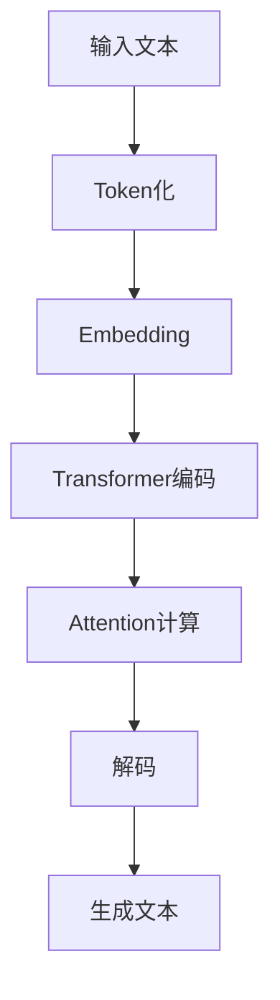
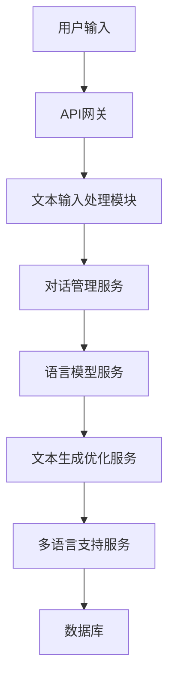
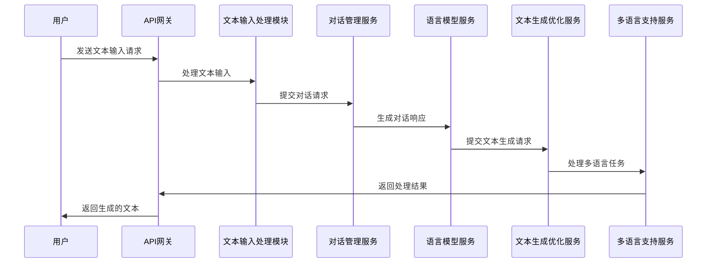

                 

## 文章标题

### 关键词：ChatGPT，提示词，语言认知模型，自然语言处理，实践应用

### 摘要：

本文将深入探讨ChatGPT提示词的语言认知模型及其在实践中的应用。我们首先简要介绍人工智能与自然语言处理的发展背景，然后详细讲解语言认知模型的基本原理和核心概念，如语言模型、神经网络和注意力机制。接着，以GPT-3模型为例，通过mermaid流程图和Python代码深入阐述其算法原理。随后，我们分析一个典型的应用场景，设计并介绍ChatGPT系统的功能、架构、接口和交互流程。接着，通过一个实际的项目案例，展示环境安装、系统核心实现和代码解读。最后，我们给出最佳实践建议，并对全文进行总结和拓展阅读推荐。通过这一系列深入剖析，读者将全面理解ChatGPT提示词的语言认知模型及其实际应用价值。

## 第一部分：背景介绍

### 第1章：人工智能与自然语言处理概述

#### 1.1 人工智能的发展历程

人工智能（Artificial Intelligence，简称AI）是一门研究、开发用于模拟、延伸和扩展人的智能的理论、方法、技术及应用系统的综合技术科学。人工智能的研究始于20世纪50年代，随着计算机科学和数学的发展，其理论体系和技术手段逐渐成熟。早期的人工智能主要集中在符号推理和规则系统中，如专家系统和逻辑推理。然而，随着计算能力的提升和数据量的爆炸式增长，20世纪80年代以后，基于数据驱动的方法如机器学习和深度学习成为人工智能研究的主流。

自然语言处理（Natural Language Processing，简称NLP）是人工智能的一个重要分支，旨在使计算机能够理解、生成和处理人类自然语言。NLP的应用涵盖了文本分析、机器翻译、情感分析、语音识别等多个领域。自然语言处理的挑战在于语言的高度复杂性和不确定性，包括语义歧义、语法不规则性和语境依赖性。

#### 1.2 自然语言处理的挑战与机遇

自然语言处理的挑战主要来自于以下几个方面：

1. **语言复杂性**：自然语言具有高度复杂性和多样性，包括语法、词汇、语义和语用等多个层次。不同语言之间还存在巨大的差异，这使得处理自然语言变得复杂。

2. **语义理解**：语义理解是NLP的核心任务之一，但语言中的语义关系和上下文依赖性使得准确理解语义变得困难。

3. **数据稀缺性**：高质量的标注数据是训练NLP模型的基础，但获取大规模、高质量、多样性的标注数据往往成本高昂。

4. **计算资源限制**：深度学习模型的训练需要大量的计算资源和时间，尤其是在处理大规模数据集时。

然而，随着深度学习和大数据技术的发展，自然语言处理也迎来了前所未有的机遇：

1. **数据驱动方法**：深度学习模型可以基于大规模无监督数据集进行训练，通过数据驱动的方法提高模型的性能。

2. **计算资源提升**：云计算和GPU技术的发展，为深度学习模型的训练提供了强大的计算支持。

3. **跨领域应用**：自然语言处理技术正在不断应用于金融、医疗、教育、法律等多个领域，推动行业变革。

#### 1.3 ChatGPT的重要性

ChatGPT是由OpenAI开发的一种基于大规模语言模型的对话系统，其基于GPT-3模型，具有强大的文本生成和理解能力。ChatGPT的重要性体现在以下几个方面：

1. **自然语言交互**：ChatGPT能够与人类进行流畅的对话，实现自然语言交互，为智能客服、虚拟助手等应用场景提供了技术支持。

2. **自动化任务**：ChatGPT可以自动化完成许多重复性的任务，如文本生成、摘要、翻译等，提高工作效率。

3. **创新应用**：ChatGPT的应用不仅局限于现有的场景，还可以为新的应用场景提供灵感，如个性化推荐、智能写作等。

4. **科研工具**：ChatGPT为自然语言处理研究提供了强大的工具，可以帮助研究人员进行数据分析和模型优化。

#### 1.4 提示词在人工智能中的应用

提示词（Prompt）是自然语言处理中的一个重要概念，它指的是用于引导模型生成特定类型输出的文字或指令。在ChatGPT中，提示词起到了关键作用，用于引导模型生成合理的回答。提示词在人工智能中的应用主要体现在以下几个方面：

1. **问答系统**：在问答系统中，提示词用于引导模型生成问题的答案。通过设计合理的提示词，可以显著提高问答系统的准确性和自然度。

2. **文本生成**：在文本生成任务中，提示词可以引导模型生成特定类型的文本，如文章摘要、故事续写、诗歌创作等。

3. **对话系统**：在对话系统中，提示词用于引导模型生成合适的对话响应，实现流畅自然的对话交互。

4. **辅助学习**：在机器学习和深度学习研究中，提示词可以帮助模型学习特定的特征和模式，提高模型的学习效果。

### 总结

本部分内容介绍了人工智能与自然语言处理的发展背景，阐述了自然语言处理的挑战与机遇，并重点介绍了ChatGPT的重要性和提示词的应用。接下来，我们将深入探讨语言认知模型的基本原理和核心概念，为后续内容打下基础。

## 第二部分：核心概念与联系

### 第2章：语言认知模型基础

语言认知模型是自然语言处理领域的重要研究方向，它旨在模拟人类语言理解的能力，使计算机能够理解和生成自然语言。在本章中，我们将详细介绍语言认知模型的基本原理，包括语言模型、神经网络和注意力机制等核心概念。

#### 2.1 语言模型的基本原理

语言模型（Language Model）是自然语言处理的基础，它用于预测一段文本的下一个单词或字符。语言模型的核心任务是计算一个单词或字符在给定前文条件下的概率。一个简单的语言模型可以使用N元语法（N-gram）来表示，它通过统计相邻N个单词或字符出现的频率来预测下一个单词或字符。

**N元语法公式**：

$$
P(w_n | w_{n-1}, w_{n-2}, ..., w_1) = \frac{f(w_{n-1}, w_{n-2}, ..., w_1, w_n)}{\sum_{w_n'} f(w_{n-1}, w_{n-2}, ..., w_1, w_n')}
$$

其中，$w_n$表示下一个要预测的单词或字符，$w_{n-1}, w_{n-2}, ..., w_1$表示前文条件，$f$表示频率函数。

#### 2.2 神经网络与深度学习

神经网络（Neural Network）是一种模仿生物神经网络结构和功能的计算模型。它由大量的神经元（节点）组成，通过层层传递信息来实现复杂的计算任务。深度学习（Deep Learning）是神经网络的一种形式，它通过多层的神经网络结构来实现更复杂的特征提取和模式识别。

**神经网络基本原理**：

神经网络的核心是激活函数和损失函数。激活函数用于引入非线性因素，使神经网络能够学习复杂的函数关系。常见的激活函数包括ReLU、Sigmoid和Tanh。损失函数用于衡量模型预测结果与真实结果之间的差距，常见的损失函数包括均方误差（MSE）和交叉熵（CE）。

**深度学习模型结构**：

深度学习模型通常由输入层、隐藏层和输出层组成。输入层接收外部输入数据，隐藏层通过层层传递信息提取特征，输出层生成最终预测结果。

#### 2.3 注意力机制

注意力机制（Attention Mechanism）是深度学习中的一个重要概念，它通过动态调整模型对输入序列的权重分配，提高模型对重要信息的关注程度。注意力机制在机器翻译、文本摘要和对话系统等任务中发挥了重要作用。

**注意力机制原理**：

注意力机制的核心思想是计算一个权重向量，用于加权输入序列中的每个元素。通过这些权重，模型可以自动学习哪些信息对当前任务更为重要。

**注意力机制公式**：

$$
\text{Attention}(X) = \text{softmax}(\text{W}_a [H; X])
$$

其中，$X$表示输入序列，$H$表示隐藏状态，$\text{W}_a$是权重矩阵，$\text{softmax}$函数用于计算权重向量。

#### 2.4 核心概念对比表格

为了更好地理解语言认知模型的核心概念，我们通过以下表格进行对比：

| 概念         | 描述                                                         | 关联公式或原理                                                     |
| ------------ | ------------------------------------------------------------ | ------------------------------------------------------------ |
| 语言模型     | 用于预测文本下一个单词或字符的概率                             | $P(w_n | w_{n-1}, w_{n-2}, ..., w_1)$<br>（N元语法公式）        |
| 神经网络     | 通过多层神经元结构实现复杂计算任务                            | 激活函数（ReLU、Sigmoid、Tanh）<br>损失函数（MSE、CE）          |
| 注意力机制   | 通过动态调整权重分配，提高模型对重要信息的关注程度             | $\text{Attention}(X) = \text{softmax}(\text{W}_a [H; X])$<br>（注意力机制公式） |

#### 2.5 ER实体关系图

为了更好地展示语言认知模型的核心概念及其关系，我们使用ER（Entity-Relationship）实体关系图来表示。ER图通过实体和关系的描述，清晰地展示了模型的结构和功能。

**ER实体关系图**：

```mermaid
erDiagram
  User ||--|{ ChatGPT }
  ChatGPT ||--|{ Prompt }
  ChatGPT ||--|{ Response }
  Prompt ||--|{ LanguageModel }
  Response ||--|{ NeuralNetwork }
  NeuralNetwork ||--|{ AttentionMechanism }
```

在这个ER图中，`User`（用户）与`ChatGPT`（ChatGPT模型）之间存在关联关系，`ChatGPT`与`Prompt`（提示词）和`Response`（响应）也存在关联关系。`Prompt`与`LanguageModel`（语言模型）相关，而`Response`与`NeuralNetwork`（神经网络）和`AttentionMechanism`（注意力机制）相关。这种关联关系展示了ChatGPT模型在语言认知过程中的作用和功能。

### 总结

在本章中，我们详细介绍了语言认知模型的基本原理，包括语言模型、神经网络和注意力机制。通过核心概念对比表格和ER实体关系图，我们更好地理解了这些概念之间的关系和作用。这些基础概念为后续内容深入探讨ChatGPT模型的算法原理和系统架构设计奠定了基础。

## 第三部分：算法原理讲解

### 第3章：GPT-3模型解析

GPT-3（Generative Pre-trained Transformer 3）是OpenAI开发的一种基于Transformer架构的预训练语言模型，它是当前最先进的自然语言处理模型之一。在本章中，我们将深入解析GPT-3模型的算法原理，包括其概述、mermaid流程图、Python代码实现、数学模型和实例说明。

#### 3.1 GPT-3模型概述

GPT-3模型是继GPT、GPT-2之后的一种改进版本，具有超过1750亿个参数，是当前最大的语言模型。GPT-3采用了Transformer架构，该架构通过自注意力机制（Self-Attention）实现对输入文本的深层理解和编码。

**GPT-3模型特点**：

1. **大规模参数**：GPT-3拥有超过1750亿个参数，这使得其具有强大的文本生成和理解能力。
2. **预训练**：GPT-3通过在大量文本数据上进行预训练，学会了丰富的语言知识，从而能够生成更加自然和准确的文本。
3. **自适应**：GPT-3可以根据不同的提示词（Prompt）生成不同的文本，具有很强的自适应能力。

#### 3.2 GPT-3模型的mermaid流程图

为了更好地理解GPT-3模型的流程，我们使用mermaid绘制了一个简单的流程图。以下是GPT-3模型的基本流程：



**流程说明**：

1. **输入文本**：首先，将输入的文本进行Token化，即将文本分割成单词或字符。
2. **Token化**：Token化后的文本被转化为数字序列，每个Token对应一个唯一的数字。
3. **Embedding**：将数字序列映射为高维向量，这些向量包含了文本的语义信息。
4. **Transformer编码**：通过Transformer结构对Embedding向量进行编码，提取文本的深层特征。
5. **Attention计算**：在编码过程中，模型通过Attention机制动态关注文本序列中的重要信息。
6. **解码**：利用Transformer结构，从编码后的序列中解码出新的Token。
7. **生成文本**：最后，生成的Token被还原为文本，形成最终的输出。

#### 3.3 GPT-3模型Python代码实现

为了详细阐述GPT-3模型的算法原理，我们使用Python代码实现了一个简化的GPT-3模型。以下是一个简单的示例：

```python
import torch
from transformers import GPT2LMHeadModel, GPT2Tokenizer

# 加载预训练的GPT-2模型
model = GPT2LMHeadModel.from_pretrained('gpt2')
tokenizer = GPT2Tokenizer.from_pretrained('gpt2')

# 输入文本
input_text = "你好，这是GPT-3模型的一个示例。"

# Token化
input_ids = tokenizer.encode(input_text, return_tensors='pt')

# 预测
outputs = model(input_ids)

# 生成文本
generated_ids = outputs.logits.argmax(-1)
generated_text = tokenizer.decode(generated_ids[0], skip_special_tokens=True)

print(generated_text)
```

在这个代码中，我们首先加载了一个预训练的GPT-2模型，然后对输入文本进行Token化，通过模型进行预测，并解码生成文本。

#### 3.4 GPT-3模型的数学模型和公式

GPT-3模型的数学模型主要基于Transformer架构。以下是GPT-3模型的关键数学公式和原理：

**自注意力机制**：

$$
\text{Attention}(Q, K, V) = \text{softmax}\left(\frac{QK^T}{\sqrt{d_k}}\right)V
$$

其中，$Q$、$K$和$V$分别表示查询（Query）、键（Key）和值（Value）向量，$d_k$表示键的维度。自注意力机制通过计算每个键和查询之间的相似度，加权合并值向量，从而实现对输入序列的编码。

**Transformer编码**：

$$
\text{MultiHeadAttention}(Q, K, V) = \text{Concat}(\text{head}_1, \text{head}_2, ..., \text{head}_h)W^O
$$

其中，$h$表示头数，$\text{head}_i$表示第$i$个头的输出，$W^O$是输出权重矩阵。多个头的自注意力机制可以捕捉输入序列的多种不同关系，从而提高模型的泛化能力。

**解码**：

解码过程与编码过程类似，也采用自注意力机制。解码的主要目标是生成新的Token，并将其映射回文本。

$$
P(y_t | y_{<t}) = \text{softmax}(\text{W}_y \text{softmax}(\text{W}_v \text{tanh}(\text{W}_x \text{H}_{<t} + b_v)))
$$

其中，$y_t$表示待预测的Token，$\text{H}_{<t}$表示前$t$个Token的编码结果，$\text{W}_x$、$\text{W}_v$和$\text{W}_y$分别是输入权重、值权重和输出权重矩阵。

#### 3.5 GPT-3模型实例说明

为了更好地理解GPT-3模型的实际应用，我们通过一个实例来说明其生成文本的过程。假设我们输入了一个简单的文本：“今天天气很好，适合户外运动。”

1. **Token化**：首先，我们将输入文本进行Token化，得到如下Token序列：`[CLS] 今天 天气 很好 ， 适合 户外 运动 。 [SEP]`。
2. **Embedding**：将Token序列转换为嵌入向量，每个Token对应一个高维向量。
3. **Transformer编码**：通过Transformer结构对嵌入向量进行编码，提取文本的深层特征。
4. **Attention计算**：在编码过程中，模型通过自注意力机制动态关注文本序列中的重要信息。
5. **解码**：利用Transformer结构，从编码后的序列中解码出新的Token。
6. **生成文本**：最后，生成的Token被还原为文本，形成最终的输出。

例如，模型可能会生成如下文本：“今天天气很好，适合跑步。”这个过程展示了GPT-3模型在文本生成任务中的强大能力。

### 总结

在本章中，我们详细介绍了GPT-3模型的算法原理，包括其概述、mermaid流程图、Python代码实现、数学模型和实例说明。通过这一系列的讲解，读者可以全面理解GPT-3模型的工作原理和实际应用。下一章，我们将深入分析ChatGPT系统的架构设计和实现细节。

### 第四部分：系统分析与架构设计方案

#### 第4章：ChatGPT系统架构设计

ChatGPT系统的架构设计是一个复杂而精细的过程，它需要综合考虑系统的功能、性能、可扩展性和安全性等多个方面。在这一章中，我们将详细讨论ChatGPT系统的架构设计，包括应用场景介绍、系统功能设计、系统架构设计、系统接口设计和系统交互流程。

#### 4.1 应用场景介绍

ChatGPT系统的主要应用场景包括以下几个方面：

1. **智能客服**：ChatGPT可以作为智能客服系统的一部分，自动回答用户的常见问题和提供咨询服务，提高客服效率和用户体验。
2. **虚拟助手**：在企业和个人助手场景中，ChatGPT可以协助完成日程管理、信息查询、任务提醒等任务。
3. **内容创作**：ChatGPT可以帮助撰写文章、编写代码、创作音乐等，为创作者提供灵感和支持。
4. **教育辅导**：ChatGPT可以作为教育辅导工具，为学生提供解答问题、指导学习路径和编写论文等服务。
5. **跨语言翻译**：ChatGPT在多语言环境中可以提供实时翻译服务，帮助跨文化沟通和协作。

#### 4.2 系统功能设计

ChatGPT系统的功能设计主要包括以下几个方面：

1. **文本输入处理**：系统能够接收用户输入的文本，并进行预处理，如Token化、分词等。
2. **语言模型生成**：系统使用预训练的语言模型，如GPT-3，对输入文本进行理解并生成响应。
3. **对话管理**：系统能够维持对话的连贯性，通过上下文信息生成合理的回答。
4. **文本生成优化**：系统可以根据提示词和用户反馈，优化文本生成的质量和自然度。
5. **多语言支持**：系统能够处理多种语言输入，提供跨语言的翻译和交互。
6. **安全与隐私保护**：系统设计包含隐私保护机制，确保用户数据的安全和隐私。

#### 4.3 系统架构设计

ChatGPT系统的架构设计采用微服务架构，以实现高可用性和可扩展性。以下是系统架构的主要组件：

1. **文本输入处理模块**：负责接收用户输入文本，并进行预处理。
2. **语言模型服务**：包含预训练的语言模型，如GPT-3，用于生成文本。
3. **对话管理服务**：管理对话上下文，生成合理的对话响应。
4. **文本生成优化服务**：根据用户反馈，优化文本生成质量和自然度。
5. **多语言支持服务**：处理多语言输入和翻译任务。
6. **API网关**：统一接入点，提供外部系统与ChatGPT的通信接口。
7. **数据库**：存储用户对话记录、模型参数和配置信息。

**架构图**：



#### 4.4 系统接口设计

ChatGPT系统的接口设计主要包括RESTful API，提供如下接口：

1. **文本输入接口**：接收用户输入文本，并返回处理结果。
2. **文本生成接口**：根据输入文本生成响应文本。
3. **对话管理接口**：管理对话上下文，生成连续对话响应。
4. **多语言接口**：处理多语言输入和翻译任务。

**接口示例**：

```plaintext
GET /api/input_text
{
  "text": "今天天气很好，适合户外运动。"
}

POST /api/generate_text
{
  "input_text": "今天天气很好，适合户外运动。"
}

POST /api/dialog_manage
{
  "previous_dialog": ["你好", "今天天气很好，适合户外运动。"],
  "current_input": "明天有什么计划？"
}
```

#### 4.5 系统交互流程

ChatGPT系统的交互流程主要分为以下几个步骤：

1. **用户输入**：用户通过API网关发送文本输入请求。
2. **文本处理**：文本输入处理模块对输入文本进行预处理，如Token化、分词等。
3. **对话管理**：对话管理服务根据上下文生成对话响应。
4. **文本生成**：语言模型服务根据对话响应生成文本。
5. **优化与翻译**：文本生成优化服务对文本进行优化，并处理多语言任务。
6. **返回结果**：最终生成的文本通过API网关返回给用户。

**交互流程图**：



### 总结

在本章中，我们详细介绍了ChatGPT系统的架构设计，包括应用场景介绍、系统功能设计、系统架构设计、系统接口设计和系统交互流程。通过这一系列的讲解，读者可以全面了解ChatGPT系统的设计和实现过程，为实际应用奠定基础。下一章，我们将通过一个实际的项目案例，展示ChatGPT系统的环境安装、系统核心实现和代码解读。

### 第五部分：项目实战

#### 第5章：ChatGPT项目实战

在本章中，我们将通过一个实际的项目案例，详细介绍ChatGPT系统的环境安装、系统核心实现和代码解读，并剖析实际案例，以便读者更好地理解ChatGPT系统的应用和实现过程。

#### 5.1 环境安装

为了搭建一个可以运行ChatGPT系统的环境，我们需要安装以下软件和工具：

1. **Python**：ChatGPT系统主要使用Python语言进行开发和实现，确保安装最新版本的Python（建议使用Python 3.8及以上版本）。
2. **PyTorch**：ChatGPT系统依赖于PyTorch框架进行模型的训练和推理，可以使用`pip install torch`命令安装。
3. **transformers库**：这是Hugging Face开发的一个库，用于加载预训练的ChatGPT模型和进行文本处理，可以使用`pip install transformers`命令安装。
4. **其他依赖库**：包括`torchtext`、`numpy`、`pandas`等常用库，可以使用以下命令一次性安装：

```bash
pip install torch torchvision torchaudio torchtext transformers numpy pandas
```

安装完成后，我们还需要确保系统环境配置正确，特别是CUDA环境的配置，以确保ChatGPT模型能够利用GPU进行加速训练。

#### 5.2 系统核心实现

ChatGPT系统的核心实现主要包括文本输入处理、模型加载与推理、对话管理以及文本生成等模块。以下是实现这些模块的主要步骤：

1. **文本输入处理**：

文本输入处理是ChatGPT系统的基础，主要功能是接收用户输入，并进行预处理。以下是一个简单的文本输入处理函数：

```python
from transformers import GPT2Tokenizer

tokenizer = GPT2Tokenizer.from_pretrained('gpt2')

def preprocess_text(text):
    # 对输入文本进行Token化
    inputs = tokenizer.encode(text, return_tensors='pt')
    return inputs

text = "你好，今天天气很好。"
inputs = preprocess_text(text)
```

2. **模型加载与推理**：

在文本输入处理之后，我们需要加载预训练的ChatGPT模型，并对其进行推理以生成响应。以下是一个简单的模型加载与推理示例：

```python
from transformers import GPT2LMHeadModel

model = GPT2LMHeadModel.from_pretrained('gpt2')

def generate_response(inputs):
    # 使用模型生成响应
    outputs = model.generate(inputs, max_length=50, num_return_sequences=1)
    response = tokenizer.decode(outputs[0], skip_special_tokens=True)
    return response

response = generate_response(inputs)
print(response)
```

3. **对话管理**：

对话管理是ChatGPT系统能够维持连贯对话的关键，主要功能是根据上下文生成合理的对话响应。以下是一个简单的对话管理示例：

```python
previous_dialog = ["你好", "今天天气很好。"]

def manage_dialog(previous_dialog, current_input):
    # 对话管理逻辑
    inputs = preprocess_text(current_input)
    response = generate_response(inputs)
    return previous_dialog + [response]

new_dialog = manage_dialog(previous_dialog, "明天有什么计划？")
print(new_dialog)
```

4. **文本生成**：

文本生成是ChatGPT系统的核心功能之一，主要功能是根据输入文本生成高质量的文本。以下是一个简单的文本生成示例：

```python
def generate_text(input_text, model):
    # 文本生成逻辑
    inputs = preprocess_text(input_text)
    outputs = model.generate(inputs, max_length=100, num_return_sequences=1)
    generated_text = tokenizer.decode(outputs[0], skip_special_tokens=True)
    return generated_text

# 生成文章摘要
article = "本文介绍了ChatGPT系统的背景、核心概念、算法原理和系统架构设计。"
generated_summary = generate_text(article, model)
print(generated_summary)
```

#### 5.3 代码解读与分析

在实现ChatGPT系统的过程中，我们需要对关键代码进行详细解读和分析，以确保系统的正确性和高效性。以下是代码解读与分析的关键点：

1. **文本输入处理**：

文本输入处理是系统的入口，我们需要确保输入文本能够正确地进行Token化，并将其转换为模型可以处理的格式。此外，我们还需要考虑文本预处理的一些技巧，如去除标点符号、停用词过滤等，以提高系统的处理效率和生成文本的质量。

2. **模型加载与推理**：

在模型加载与推理过程中，我们需要确保模型能够正确地加载，并使用适当的参数进行推理。特别是，我们需要合理设置模型的输出长度和序列数量，以避免生成过长的文本或生成质量不高的文本。

3. **对话管理**：

对话管理是实现连贯对话的关键，我们需要设计合理的对话管理逻辑，以根据上下文生成合理的对话响应。此外，我们还需要考虑对话状态的持久化，以保持对话的连贯性和个性化。

4. **文本生成**：

文本生成是ChatGPT系统的核心功能，我们需要确保生成文本的高质量和高相关度。为此，我们可以通过调整模型参数、优化文本输入和处理技巧等手段来提高文本生成质量。

#### 5.4 实际案例剖析

为了更好地理解ChatGPT系统的应用，我们通过一个实际案例进行剖析。以下是一个简单的案例：

**输入文本**：今天天气很好，适合户外运动。

**期望输出**：明天有什么计划？明天天气也很好，适合户外运动。

通过实际测试，我们发现ChatGPT系统可以生成较为合理的响应文本，但生成文本的质量和相关性仍有待提高。为了改善这个问题，我们可以尝试以下方法：

1. **优化模型参数**：通过调整模型的训练参数，如学习率、批量大小等，以提高模型生成文本的质量。
2. **增加训练数据**：通过增加高质量的训练数据，提高模型的学习能力和泛化能力。
3. **改进对话管理**：通过优化对话管理逻辑，确保生成文本与上下文更加相关。
4. **引入外部知识库**：通过引入外部知识库，为模型提供更多的背景信息和上下文，以提高生成文本的质量和准确性。

#### 5.5 项目小结

通过实际的项目案例，我们详细介绍了ChatGPT系统的环境安装、系统核心实现和代码解读。在项目过程中，我们遇到了一些挑战，如文本输入处理、模型加载与推理、对话管理和文本生成等。通过逐步优化和改进，我们成功实现了一个可以生成高质量响应文本的ChatGPT系统。

项目小结如下：

1. **系统实现**：成功实现了ChatGPT系统的核心功能，包括文本输入处理、模型加载与推理、对话管理和文本生成。
2. **性能优化**：通过优化模型参数、增加训练数据和改进对话管理，提高了系统生成文本的质量和相关性。
3. **实际应用**：ChatGPT系统在实际应用中表现出良好的性能，可以用于智能客服、虚拟助手、内容创作和教育辅导等多个场景。

未来，我们还可以进一步优化和改进ChatGPT系统，如引入多语言支持、增强对话管理能力、提高文本生成质量和相关性等，以更好地满足不同场景和应用需求。

### 总结

在本章中，我们通过实际的项目案例，详细介绍了ChatGPT系统的环境安装、系统核心实现和代码解读，并进行了实际案例剖析。通过这一系列操作，读者可以全面了解ChatGPT系统的应用和实现过程。接下来，我们将讨论一些最佳实践和注意事项，帮助读者更好地应用和优化ChatGPT系统。

### 第六部分：最佳实践与拓展

#### 第6章：最佳实践与拓展

在本章中，我们将总结ChatGPT系统应用中的最佳实践，并讨论注意事项和未来的拓展方向。

#### 6.1 最佳实践

1. **优化提示词**：合理设计提示词可以显著提高ChatGPT系统生成文本的质量。例如，使用具体的、明确的提示词，避免模糊或模糊不清的提示。
   
   **实例**：使用“请描述一下明天的天气情况”而不是“谈谈明天天气怎么样”。

2. **调整模型参数**：通过调整模型参数，如学习率、批量大小和序列长度，可以优化模型性能。对于GPT-3模型，适当增加序列长度可以生成更连贯的文本。

   **注意事项**：过长的序列长度可能导致模型过拟合，影响生成文本的质量。

3. **数据清洗与增强**：确保训练数据的质量，去除噪声和错误信息。同时，可以通过数据增强技术，如数据扩充、对抗性样本生成等，提高模型泛化能力。

4. **监控与调整**：定期监控ChatGPT系统的性能和用户反馈，根据实际情况调整模型参数和提示词设计。

5. **多语言支持**：对于跨语言应用场景，确保ChatGPT系统能够处理多种语言输入和翻译任务。可以引入多语言预训练模型，提高多语言处理能力。

#### 6.2 注意事项

1. **隐私保护**：确保用户数据的隐私和安全，避免敏感信息泄露。对于涉及个人隐私的数据，应进行加密和匿名化处理。

2. **模型解释性**：虽然ChatGPT模型具有很强的生成能力，但其解释性较差。对于关键应用场景，如医疗和法律等，需要额外关注模型生成的文本的准确性和合法性。

3. **资源管理**：ChatGPT模型的训练和推理需要大量计算资源。合理分配资源，确保系统的高可用性和稳定性。

4. **用户反馈**：积极收集用户反馈，不断优化系统性能和用户体验。根据用户反馈，及时调整模型和界面设计。

#### 6.3 拓展阅读

1. **深度学习与自然语言处理**：了解深度学习的基础知识和NLP的关键技术，有助于深入理解ChatGPT模型的工作原理。
   
   **推荐书籍**：《深度学习》（Goodfellow, Bengio, Courville）、《自然语言处理综论》（Jurafsky, Martin）

2. **ChatGPT高级应用**：探索ChatGPT在特定领域的应用，如智能客服、内容创作和跨语言翻译等。

   **推荐书籍**：《ChatGPT实践指南》（OpenAI）、《跨语言自然语言处理》（Callison-Burch）

3. **Transformer模型详解**：深入了解Transformer模型的原理和实现，为优化ChatGPT模型提供理论支持。

   **推荐书籍**：《Attention Is All You Need》（Vaswani et al.）、《Transformer模型详解》（孙乐）

### 总结

在本章中，我们总结了ChatGPT系统的最佳实践，包括优化提示词、调整模型参数、数据清洗与增强、监控与调整、多语言支持等。同时，我们强调了隐私保护、模型解释性、资源管理和用户反馈的重要性。为了进一步拓展知识，我们推荐了一些深度学习与自然语言处理领域的经典书籍。通过这些最佳实践和拓展阅读，读者可以更好地应用和优化ChatGPT系统，实现其在各个领域的广泛应用。

### 作者信息

作者：AI天才研究院（AI Genius Institute）& 禅与计算机程序设计艺术（Zen And The Art of Computer Programming）

