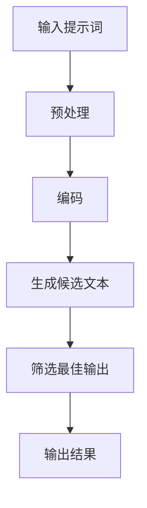
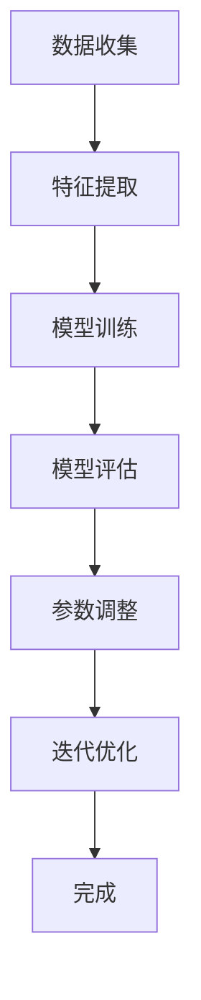
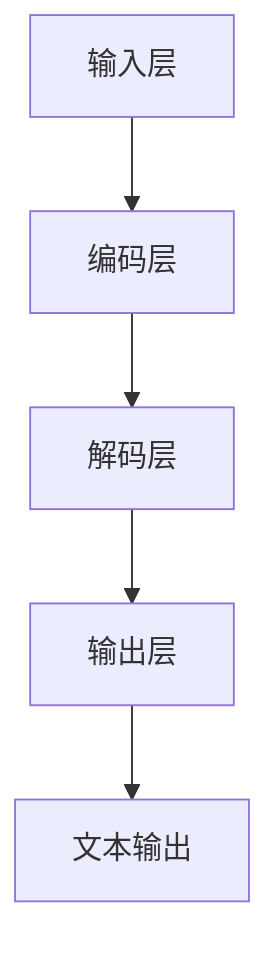
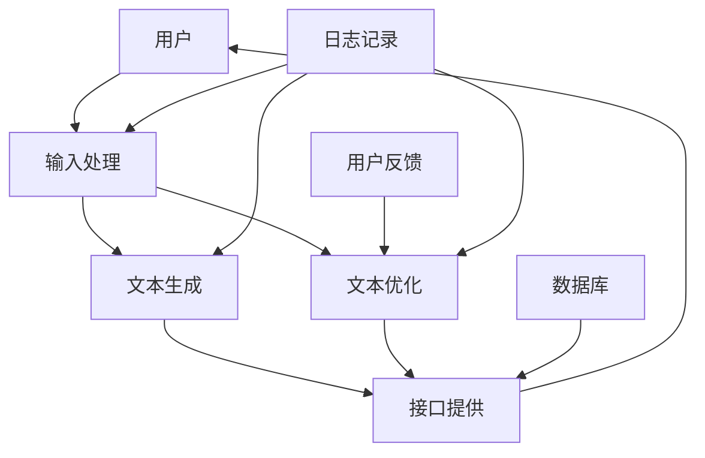
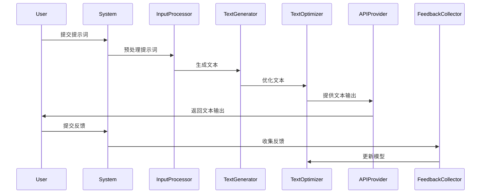
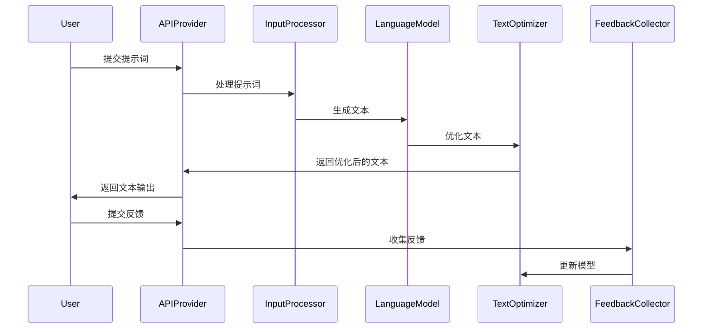

                 

### 1.1 问题的提出与背景

随着人工智能（AI）和自然语言处理（NLP）技术的飞速发展，自然语言交互已经逐渐成为人机交互的重要方式。在这个背景下，ChatGPT作为一种先进的语言模型，因其强大的生成能力和交互性，受到了广泛关注。然而，随着应用的深入，人们逐渐发现，ChatGPT的性能不仅受到其自身算法的影响，还受到提示词设计的关键因素制约。

**社会背景：人工智能与语言学的发展**

人工智能作为21世纪最具革命性的技术之一，正迅速渗透到社会的各个领域。从自动驾驶、智能家居到智能客服、在线教育，人工智能的应用场景日益丰富。与此同时，自然语言处理技术也取得了长足的进步，尤其是在语言模型的训练和应用方面。这些技术的进步为构建更智能、更人性化的交互系统提供了可能性。

**研究意义：提升自然语言处理能力**

自然语言处理的核心在于理解和生成自然语言。ChatGPT作为一款基于深度学习的语言模型，能够在一定程度上模拟人类的语言表达和理解能力。然而，其性能的提升不仅依赖于算法的优化，还依赖于提示词的设计。有效的提示词可以引导ChatGPT生成更加准确、有逻辑性和创造性的文本，从而提升整个系统的自然语言处理能力。

**问题来源：ChatGPT的应用与挑战**

在实际应用中，ChatGPT的表现虽然令人惊艳，但也面临一些挑战。例如，在某些特定的场景中，ChatGPT可能无法准确理解用户的意图，或者生成的文本缺乏连贯性和逻辑性。这些问题在一定程度上可以归因于提示词的设计不足。因此，如何设计出高质量的提示词，以提升ChatGPT的性能，成为一个值得深入探讨的问题。

### 1.2 提示词与语言学理论

**提示词的定义与作用**

提示词，即Prompt，是指导ChatGPT生成特定文本的引导性语言输入。提示词的设计对ChatGPT的响应有直接影响。一个好的提示词能够清晰地传达用户的意图，引导ChatGPT生成符合预期的文本。

**语言学的核心理论**

语言学是研究人类语言的科学，其核心理论包括生成语法、认知语言学和社会语言学。

- **生成语法（Generative Grammar）**：生成语法是语言学中的一个重要理论，由诺姆·乔姆斯基（Noam Chomsky）提出。它试图描述人类语言生成和理解的过程，强调语法规则和句法结构。
- **认知语言学（Cognitive Linguistics）**：认知语言学关注语言与人类认知之间的关系，研究语言如何影响思维和认知过程。
- **社会语言学（Sociolinguistics）**：社会语言学关注语言在社会中的作用，研究语言如何在不同社会情境中被使用和解释。

这些理论为理解语言的本质和功能提供了深刻的洞见，对提示词的设计也有重要的启示。

### 1.3 超维度语言学理论的概述

**超维度的概念引入**

超维度，即高于我们日常所感知的三维空间维度。在物理学中，超维度通常指额外的空间维度，这些维度可能超出了我们直接观察的能力，但通过数学模型可以对其进行描述和研究。

**超维度语言学理论的基本原理**

超维度语言学理论将超维度的概念引入到语言研究中，试图描述和解释语言在更高维度中的行为和特征。这种理论认为，语言不仅仅是在我们日常生活中所能感知的维度中运作，还有可能在更高维度中具有更加复杂和丰富的表现。

### 1.4 ChatGPT与提示词的关系

**ChatGPT的工作原理**

ChatGPT是基于GPT-3模型的变体，通过大量的文本数据进行训练，以学习语言的统计规律和生成模式。其工作原理可以概括为以下几个步骤：

1. **输入处理**：接收用户的输入文本，对其进行预处理，如分词、词性标注等。
2. **生成预测**：根据输入文本，利用神经网络模型生成可能的文本输出。
3. **选择最佳输出**：从多个候选输出中选择最符合用户意图和上下文的文本。

**提示词在ChatGPT中的作用**

提示词在ChatGPT中起到引导和定位的作用。通过设计有效的提示词，可以引导ChatGPT生成更加精准和符合预期的文本。提示词的设计不仅要考虑语言的语法和语义，还要结合具体的场景和应用需求。

### 1.5 本章小结

本章主要介绍了ChatGPT提示词的超维度语言学理论研究的问题背景、核心概念和相关理论。首先，分析了社会背景和ChatGPT的应用挑战，强调了提示词设计的重要性。接着，介绍了语言学的核心理论，包括生成语法、认知语言学和社会语言学。然后，引入了超维度语言学理论的基本概念，探讨了其在语言研究中的应用。最后，阐述了ChatGPT与提示词的关系，并总结了本章的主要内容和研究意义。

### 1.1 问题的提出与背景

在当今信息时代，人工智能（AI）和自然语言处理（NLP）技术已经深刻地改变了我们的生活方式和工作方式。自然语言交互作为AI领域的一个重要分支，正逐渐成为人机交互的主流形式。ChatGPT作为OpenAI开发的一款基于GPT-3模型的先进语言模型，以其出色的文本生成能力和自然语言理解能力，在众多应用场景中展现出了巨大的潜力。

**社会背景：人工智能与语言学的发展**

人工智能技术的发展离不开深度学习和神经网络等核心技术。深度学习通过多层神经网络对大量数据进行训练，能够自动提取特征并建模，从而实现复杂的任务。自然语言处理技术则是人工智能领域中的一个重要分支，它致力于使计算机能够理解、生成和处理自然语言。随着NLP技术的不断进步，自然语言生成（NLG）和自然语言理解（NLU）等领域取得了显著成果。

在语言学方面，生成语法、认知语言学和社会语言学等理论为理解人类语言提供了深刻的洞见。生成语法强调语法规则和句法结构对语言生成和理解的重要性；认知语言学则关注语言与人类认知之间的互动关系；而社会语言学则研究语言在社会中的作用和影响。这些语言学理论不仅丰富了我们对语言的认识，也为自然语言处理技术的发展提供了理论支持。

**研究意义：提升自然语言处理能力**

自然语言处理技术的应用场景日益广泛，从智能客服、在线教育到智能助手、内容创作等，都对自然语言处理能力提出了更高的要求。ChatGPT作为一种强大的语言模型，其性能的进一步提升，对于提升整体自然语言处理能力具有重要意义。

有效的提示词设计是提升ChatGPT性能的关键。通过精心设计的提示词，可以引导ChatGPT生成更加准确、有逻辑性和创造性的文本。这不仅能够提高系统的交互质量，还能拓宽ChatGPT的应用范围，使其在更多场景中发挥出更大的潜力。

**问题来源：ChatGPT的应用与挑战**

在实际应用中，ChatGPT虽然展现出了强大的文本生成能力，但在某些特定场景下，其性能仍存在一定的局限。例如，在某些复杂的对话场景中，ChatGPT可能无法准确理解用户的意图，或者生成的文本缺乏连贯性和逻辑性。这些问题在一定程度上可以归因于提示词的设计不足。

具体来说，ChatGPT的生成结果往往受到提示词的引导。如果提示词不够清晰或者存在歧义，ChatGPT可能无法生成符合用户预期的文本。此外，提示词的设计还需要考虑上下文信息、用户意图和场景特点等因素。这些因素的综合考虑，对于提升ChatGPT的性能具有重要意义。

因此，如何设计出高质量的提示词，以提升ChatGPT的性能，成为一个值得深入探讨的问题。通过引入超维度语言学理论，我们可以从更高维度和更广阔的视角来分析和优化提示词设计，从而推动自然语言处理技术的进一步发展。

### 1.2 提示词与语言学理论

提示词在自然语言处理中扮演着至关重要的角色，它是引导语言模型生成预期文本的核心要素。为了深入理解提示词的设计原理和其在ChatGPT中的应用，我们需要借助语言学理论来解析语言的本质及其在不同语境中的表现。

**提示词的定义与作用**

提示词（Prompt）是指导语言模型生成特定文本的引导性语言输入。在ChatGPT中，提示词的作用主要体现在以下几个方面：

1. **确定生成目标**：通过提示词，用户可以明确地告诉ChatGPT期望生成的文本类型或内容方向。
2. **提供上下文信息**：提示词可以包含相关的上下文信息，帮助ChatGPT更好地理解用户的意图和对话背景。
3. **引导文本生成**：提示词的设计直接影响ChatGPT的生成结果。高质量的提示词能够引导ChatGPT生成更准确、连贯和有逻辑性的文本。

**语言学的核心理论**

1. **生成语法（Generative Grammar）**：生成语法是由诺姆·乔姆斯基（Noam Chomsky）提出的一种理论，它试图描述人类语言生成和理解的过程。生成语法强调语法规则和句法结构在语言生成中的核心作用。在ChatGPT的提示词设计中，理解生成语法可以帮助我们更好地构建能够引导正确语法结构的提示词。

2. **认知语言学（Cognitive Linguistics）**：认知语言学关注语言与人类认知之间的关系，研究语言如何影响思维和认知过程。认知语言学的理论包括隐喻理论、框架理论等。在ChatGPT的应用中，认知语言学的理论可以帮助我们设计出更符合人类认知习惯的提示词，从而提高用户的交互体验。

3. **社会语言学（Sociolinguistics）**：社会语言学关注语言在社会中的作用，研究语言在不同社会情境中的使用和解释。社会语言学的理论包括语言变异、语言与社会阶层等。在ChatGPT的提示词设计中，考虑社会语言学的因素可以帮助我们设计出更符合特定社会和文化背景的提示词。

**语言学理论在提示词设计中的应用**

1. **生成语法的应用**：在提示词设计中，我们可以通过明确语法结构和句子成分，确保生成的文本具有正确的语法规则。例如，在设计教育场景中的提示词时，可以明确指出句子中的主语、谓语和宾语等要素，帮助ChatGPT生成符合教学目标的文本。

2. **认知语言学的应用**：认知语言学可以帮助我们设计出更符合人类认知习惯的提示词。例如，在教育场景中，可以运用认知语言学的隐喻理论，设计出富有启发性的教学提示词，以激发学生的学习兴趣和认知参与。

3. **社会语言学的应用**：在特定社会和文化背景中，设计提示词时需要考虑语言的使用和社会意义。例如，在设计企业沟通场景中的提示词时，需要遵循特定的礼仪和沟通规范，以确保文本的得体和有效。

通过综合运用生成语法、认知语言学和社会语言学等理论，我们可以设计出更加科学、合理和高效的提示词，从而提升ChatGPT的自然语言处理能力和用户交互体验。

### 1.3 超维度语言学理论的概述

**超维度的概念引入**

超维度（Higher Dimensions）是指超出我们日常所感知的三维空间维度的概念。在物理学中，超维度通常指的是额外的空间维度，这些维度可能存在于我们无法直接观察到的空间中，但通过数学模型可以对其进行描述和研究。超维度的概念在理论物理学、宇宙学和数学中都有广泛的应用，如M理论、弦理论和复数平面等。

**超维度语言学理论的基本原理**

超维度语言学理论是将超维度的概念引入到语言研究中，以探索语言在更高维度中的行为和特征。这一理论的基本原理包括以下几点：

1. **多维语言空间**：超维度语言学认为，语言不仅存在于我们日常所感知的三维空间中，还可能存在于更高维度的空间中。这些多维语言空间可能包含更多的语言元素和语法结构。

2. **语法结构的复杂性**：在超维度语言空间中，语法结构的复杂性会大大增加。例如，句子的构成可能涉及更多的语法成分和更复杂的语法规则。

3. **语义的丰富性**：超维度语言空间中的语义更为丰富和复杂。例如，一个简单的词语在更高维度中可能具有多种语义含义和用法。

4. **认知能力的提升**：超维度语言学理论认为，语言能力的提升不仅依赖于语言本身的进化，还依赖于人类认知能力的提升。更高维度的语言空间可能对人类认知提出了更高的要求，同时也为人类提供了更广阔的思维空间。

**超维度语言学理论在ChatGPT提示词设计中的应用**

超维度语言学理论在ChatGPT提示词设计中的应用主要体现在以下几个方面：

1. **引导多维对话**：通过设计多维度、多层次的提示词，可以引导ChatGPT进行更加丰富和复杂的对话。例如，在教育场景中，可以通过不同维度的提示词来引导学生进行深入思考。

2. **提升文本生成质量**：高质量的提示词能够引导ChatGPT生成更加准确、连贯和有创造性的文本。超维度语言学理论可以帮助我们设计出能够涵盖更多语言元素和语法结构的提示词，从而提升文本生成的质量。

3. **优化用户交互体验**：通过考虑多维度的语言空间，我们可以设计出更符合用户需求和认知习惯的提示词，从而优化用户交互体验。

总之，超维度语言学理论为ChatGPT提示词设计提供了新的视角和思路，通过引入更高维度的语言空间和更复杂的语法结构，可以提升自然语言处理能力和用户交互体验。

### 1.4 ChatGPT与提示词的关系

**ChatGPT的工作原理**

ChatGPT是一款基于GPT-3模型的变体，其核心思想是通过深度学习技术从大量文本数据中学习语言的统计规律和生成模式。ChatGPT的工作原理可以概括为以下几个步骤：

1. **输入处理**：ChatGPT接收用户的输入文本，对其进行预处理，如分词、词性标注等，以便更好地理解和分析输入内容。
2. **生成预测**：在输入处理的基础上，ChatGPT利用其训练得到的神经网络模型生成可能的文本输出。这一步骤涉及大量的计算和概率分析，目的是从大量候选文本中选出最有可能的输出。
3. **选择最佳输出**：从多个候选输出中选择最符合用户意图和上下文的文本。这一步通常通过优化算法实现，以确保生成的文本既符合用户需求，又具有自然流畅的语言风格。

**提示词在ChatGPT中的作用**

提示词在ChatGPT的文本生成过程中起到至关重要的引导作用。通过精心设计的提示词，可以引导ChatGPT生成更加精准、连贯和有逻辑性的文本。具体来说，提示词的作用体现在以下几个方面：

1. **确定生成方向**：提示词能够明确地告诉ChatGPT期望生成的文本类型或内容方向。例如，在写作任务中，提示词可以指定文章的主题、结构或风格。
2. **提供上下文信息**：提示词可以包含相关的上下文信息，帮助ChatGPT更好地理解用户的意图和对话背景。这有助于ChatGPT生成更加符合实际需求和高相关性的文本。
3. **引导文本生成**：提示词的设计直接影响ChatGPT的生成结果。高质量的提示词能够引导ChatGPT生成更准确、连贯和有逻辑性的文本，从而提高整体的自然语言处理能力。

**优化提示词设计的重要性**

优化提示词设计是提升ChatGPT性能的关键步骤。高质量的提示词不仅能够提高生成文本的质量，还能拓展ChatGPT的应用场景。以下是优化提示词设计的重要性：

1. **提升文本生成质量**：高质量的提示词能够引导ChatGPT生成更加准确、连贯和有创造性的文本。这有助于提高用户对系统的满意度和使用体验。
2. **拓宽应用场景**：通过设计适应不同场景和应用需求的提示词，可以拓展ChatGPT的应用范围，使其在更多领域发挥作用。
3. **增强交互能力**：优化提示词设计有助于提升ChatGPT的交互能力，使其能够更准确地理解用户的意图和需求，从而提供更加个性化的服务。

总之，ChatGPT与提示词之间的关系是紧密相连的。通过深入了解ChatGPT的工作原理和提示词的作用，我们可以更好地设计高质量的提示词，从而提升ChatGPT的性能和应用效果。

### 1.5 本章小结

本章深入探讨了ChatGPT提示词的超维度语言学理论研究的背景、核心概念和相关理论。首先，我们分析了社会背景和ChatGPT的应用挑战，强调了提示词设计的重要性。接着，我们介绍了语言学的核心理论，包括生成语法、认知语言学和社会语言学，并解释了这些理论在提示词设计中的应用。然后，我们引入了超维度语言学理论的基本概念，探讨了其在语言研究中的应用。最后，我们阐述了ChatGPT与提示词的关系，并总结了本章的主要内容和研究意义。通过本章的学习，我们为后续的深入研究和实践奠定了坚实的基础。

### 第2章：核心概念与联系

在深入探讨ChatGPT提示词的超维度语言学理论研究之前，我们首先需要明确一些核心概念，并分析它们之间的联系。这些核心概念包括提示词设计原理、语言模型与提示词的关系、超维度语言学理论的应用，以及具体的案例研究。通过系统地介绍和比较这些概念，我们将为后续的研究提供理论基础和实践指导。

#### 2.1 提示词设计原理

提示词的设计是提升ChatGPT性能的关键环节。以下将从提示词的分类、属性特征对比和设计原则三个方面进行详细分析。

**2.1.1 提示词的分类**

根据不同的应用场景和需求，提示词可以分为以下几类：

1. **指令性提示词**：这类提示词通常用于明确地指示ChatGPT生成特定类型的文本，如文章、对话或代码等。
2. **引导性提示词**：这类提示词用于引导ChatGPT在生成过程中考虑特定的上下文信息或用户意图。
3. **问题性提示词**：这类提示词用于提出问题，引导ChatGPT生成相关的回答或讨论。
4. **开放性提示词**：这类提示词提供广泛的话题范围，让ChatGPT自由发挥，生成多样化、创造性的文本。

**2.1.2 提示词的属性特征对比**

为了更好地理解不同类型提示词的特点，我们可以从以下几个方面进行对比：

- **引导性**：指令性提示词通常具有明确的指令性特征，而引导性提示词则更多用于引导对话方向，具有更灵活的引导性质。
- **上下文依赖性**：问题性提示词和开放性提示词对上下文信息的依赖性较高，需要ChatGPT在生成过程中充分考虑对话背景和用户意图。
- **生成结果**：指令性提示词通常生成结果较为固定，而引导性提示词和开放性提示词则可能生成多样化、创造性的文本。

**2.1.3 提示词的设计原则**

为了设计出高质量的提示词，我们需要遵循以下原则：

1. **明确性**：提示词应当清晰明确，避免歧义，确保ChatGPT能够准确理解用户意图。
2. **上下文相关性**：提示词应与对话上下文紧密相关，提供丰富的上下文信息，帮助ChatGPT更好地生成符合实际需求的文本。
3. **灵活性**：提示词应具备一定的灵活性，以适应不同场景和应用需求，避免生成结果过于固定。
4. **可扩展性**：提示词设计应具备良好的可扩展性，方便后续根据新的需求进行修改和调整。

#### 2.2 语言模型与提示词

语言模型是自然语言处理的核心技术，而提示词则是语言模型的重要输入。以下从语言模型的类型、与提示词的交互关系以及提示词优化对语言模型的影响三个方面进行探讨。

**2.2.1 语言模型的类型**

常见的语言模型包括：

1. **循环神经网络（RNN）**：RNN能够处理序列数据，对上下文信息具有一定的理解能力。
2. **长短期记忆网络（LSTM）**：LSTM是RNN的一种变体，通过引入门控机制，提高了对长序列信息的记忆能力。
3. **变换器（Transformer）**：Transformer采用自注意力机制，能够并行处理序列数据，并在大规模数据集上表现出色。
4. **生成预训练变换器（GPT）**：GPT是基于Transformer架构的大规模预训练语言模型，具有强大的文本生成能力。

**2.2.2 语言模型与提示词的交互关系**

语言模型与提示词之间的交互关系主要体现在以下几个方面：

1. **输入处理**：语言模型接收提示词作为输入，对其进行处理和理解，生成可能的文本输出。
2. **上下文生成**：提示词提供了上下文信息，帮助语言模型更好地理解用户的意图和对话背景，从而生成更加相关和准确的文本。
3. **反馈调整**：通过用户反馈，语言模型可以不断调整其生成策略，优化生成文本的质量。

**2.2.3 提示词优化对语言模型的影响**

提示词的优化对语言模型的表现有直接影响。以下是几个关键点：

1. **生成质量**：高质量的提示词能够引导语言模型生成更准确、连贯和有创造性的文本。
2. **训练效率**：优化后的提示词可以加速语言模型的训练过程，提高模型的学习效率。
3. **泛化能力**：通过优化提示词，语言模型能够更好地适应不同的应用场景和用户需求，提高其泛化能力。

#### 2.3 超维度语言学理论的应用

超维度语言学理论为自然语言处理提供了新的视角。以下从超维度语言学的核心原理、在提示词设计中的应用，以及其优势和局限三个方面进行探讨。

**2.3.1 超维度语言学的核心原理**

超维度语言学的核心原理包括：

1. **多维语言空间**：超维度语言学认为，语言不仅存在于三维空间中，还存在于更高维度的空间中。
2. **语法结构的复杂性**：在超维度语言空间中，语法结构更加复杂和多样化。
3. **语义的丰富性**：超维度语言空间中的语义更加丰富和复杂。

**2.3.2 超维度语言学在提示词设计中的应用**

在提示词设计中，超维度语言学理论的应用主要体现在以下几个方面：

1. **多维提示词**：通过设计多维提示词，可以引导ChatGPT生成更加丰富和复杂的文本。
2. **高维语法结构**：考虑高维语法结构，有助于设计出更具有逻辑性和连贯性的提示词。
3. **丰富语义提示**：通过丰富语义提示，可以提高ChatGPT对用户意图的理解和文本生成质量。

**2.3.3 超维度语言学的优势与局限**

超维度语言学理论的优势包括：

1. **丰富性**：超维度语言学提供了丰富的语言结构，有助于提升文本生成的多样性和创造性。
2. **逻辑性**：通过考虑高维语法结构，可以增强文本的逻辑性和连贯性。

然而，超维度语言学也面临一些局限：

1. **计算复杂度**：超维度语言学涉及高维空间和复杂语法结构，可能导致计算复杂度增加。
2. **实现难度**：在实际应用中，实现超维度语言学理论需要较高的技术水平和实践经验。

#### 2.4 提示词设计的案例研究

为了更好地理解提示词设计的实际应用，我们通过几个具体案例进行探讨。

**2.4.1 案例一：教育场景**

在教育场景中，提示词可以用于引导学生进行思考和讨论。例如，教师可以设计以下多维提示词：

- **主题性提示词**：“请以‘科技创新’为主题，撰写一篇1000字的文章。”
- **问题性提示词**：“你认为未来科技发展将如何改变我们的生活方式？”

通过这些提示词，学生可以更好地理解文章主题，展开思考和讨论。

**2.4.2 案例二：企业沟通**

在企业沟通场景中，提示词可以用于提高沟通效率和质量。例如，在项目讨论中，提示词可以设计为：

- **任务分配提示词**：“请根据项目需求，分配以下任务：开发、测试、文档撰写。”
- **问题解决提示词**：“针对当前项目中遇到的技术难题，提出你的解决方案。”

这些提示词有助于明确任务分配，提高问题解决的效率。

**2.4.3 案例三：客服应用**

在客服应用场景中，提示词可以用于提高服务质量和用户满意度。例如，当用户咨询产品使用问题时，客服可以设计以下提示词：

- **问题分类提示词**：“请根据用户的问题，将其分类为‘产品功能’、‘售后服务’或‘技术支持’。”
- **回答引导性提示词**：“为了更好地解答用户的问题，请提供以下信息：产品型号、使用环境等。”

通过这些提示词，客服可以更快速、准确地解答用户问题，提高服务质量和用户满意度。

#### 2.5 本章小结

本章系统地介绍了ChatGPT提示词的超维度语言学理论研究中的核心概念与联系。首先，我们分析了提示词设计原理，包括分类、属性特征对比和设计原则。接着，我们探讨了语言模型与提示词的关系，以及提示词优化对语言模型的影响。然后，我们介绍了超维度语言学理论的核心原理和应用。最后，通过案例研究，我们展示了提示词设计的实际应用。通过本章的学习，我们为后续的研究和实践提供了理论基础和指导。

### 2.1 提示词设计原理

提示词的设计在ChatGPT中扮演着至关重要的角色，它不仅影响着文本生成的质量和准确性，还决定了用户交互体验的流畅度。以下我们将从提示词的分类、属性特征对比和设计原则三个方面进行详细分析。

#### 2.1.1 提示词的分类

提示词根据不同的应用场景和功能需求，可以划分为以下几类：

1. **指令性提示词**：这类提示词主要用于明确地指导ChatGPT生成特定类型的文本。例如，在写作任务中，用户可以输入“请写一篇关于人工智能技术的文章”，这样ChatGPT就能根据用户的需求生成相关的文章。

2. **引导性提示词**：引导性提示词用于引导ChatGPT在生成过程中考虑特定的上下文信息或用户意图。例如，“请从以下三个主题中选择一个进行讨论：人工智能在教育中的应用、人工智能在医疗领域的突破、人工智能对社会的影响”。

3. **问题性提示词**：这类提示词主要用于提出问题，引导ChatGPT生成相关的回答或讨论。例如，“你如何看待人工智能在未来的发展？它会给我们的生活带来哪些影响？”

4. **开放性提示词**：开放性提示词提供广泛的话题范围，让ChatGPT自由发挥，生成多样化、创造性的文本。例如，“请以‘未来的世界’为主题，想象并描述一个你希望看到的未来世界”。

#### 2.1.2 提示词的属性特征对比

为了更深入地理解不同类型的提示词，我们可以从以下几个关键属性进行对比：

- **引导性**：指令性提示词具有明确的指令性特征，而引导性提示词更多用于引导对话方向，具备更灵活的引导性质。

- **上下文依赖性**：问题性提示词和开放性提示词对上下文信息的依赖性较高，需要ChatGPT在生成过程中充分考虑对话背景和用户意图。

- **生成结果**：指令性提示词通常生成结果较为固定，而引导性提示词和开放性提示词可能生成多样化、创造性的文本。

以下是一个简单的属性特征对比表格：

| 提示词类型 | 引导性 | 上下文依赖性 | 生成结果 |
| -------- | ------ | ---------- | ------- |
| 指令性 | 低     | 中等       | 固定     |
| 引导性 | 高     | 高         | 可变     |
| 问题性 | 中等   | 高         | 可变     |
| 开放性 | 高     | 高         | 多样化   |

#### 2.1.3 提示词的设计原则

为了设计出高质量的提示词，我们需要遵循以下设计原则：

1. **明确性**：提示词应当清晰明确，避免歧义，确保ChatGPT能够准确理解用户意图。例如，使用具体、明确的语言描述任务，而不是模糊、抽象的表达。

2. **上下文相关性**：提示词应与对话上下文紧密相关，提供丰富的上下文信息，帮助ChatGPT更好地理解用户的意图和需求。例如，在回答用户提问时，可以引用之前的对话内容，使回答更加连贯和准确。

3. **灵活性**：提示词应具备一定的灵活性，以适应不同场景和应用需求，避免生成结果过于固定。例如，在设计开放性提示词时，可以提供多个选项，让ChatGPT根据实际情况进行选择和生成。

4. **可扩展性**：提示词设计应具备良好的可扩展性，方便后续根据新的需求进行修改和调整。例如，在提示词中预留一些变量或参数，方便在后续使用中替换或扩展。

通过遵循这些设计原则，我们可以设计出高质量的提示词，从而提升ChatGPT的性能和应用效果。

### 2.2 语言模型与提示词

语言模型作为自然语言处理的核心组件，在ChatGPT中发挥着至关重要的作用。而提示词作为指导ChatGPT生成文本的输入，其设计质量直接影响语言模型的表现。以下我们将从语言模型的类型、与提示词的交互关系，以及提示词优化对语言模型的影响三个方面进行深入探讨。

#### 2.2.1 语言模型的类型

常见的语言模型主要包括以下几种：

1. **循环神经网络（RNN）**：RNN能够处理序列数据，通过递归结构对历史信息进行记忆。然而，传统的RNN存在梯度消失和梯度爆炸等问题，导致其在处理长序列数据时表现不佳。

2. **长短期记忆网络（LSTM）**：LSTM是RNN的一种变体，通过引入门控机制，能够有效缓解梯度消失问题，提高对长序列数据的处理能力。LSTM在处理自然语言任务中表现出色，被广泛应用于文本生成、机器翻译等领域。

3. **变换器（Transformer）**：Transformer采用自注意力机制，能够并行处理序列数据，并在大规模数据集上取得了显著的性能提升。自注意力机制使得模型能够在每个时间步同时关注序列中的所有信息，从而提高模型的表达能力。

4. **生成预训练变换器（GPT）**：GPT是基于Transformer架构的大规模预训练语言模型，通过在大量文本数据上进行预训练，学习到语言的统计规律和生成模式。GPT-3作为当前最先进的语言模型之一，具有强大的文本生成能力。

#### 2.2.2 语言模型与提示词的交互关系

语言模型与提示词之间的交互关系主要体现在以下几个方面：

1. **输入处理**：语言模型接收提示词作为输入，对其进行处理和理解。处理过程包括分词、词性标注、语法分析等，以便模型能够生成与提示词相关的文本。

2. **上下文生成**：提示词提供了上下文信息，帮助语言模型更好地理解用户的意图和对话背景。通过考虑上下文信息，模型能够生成更加相关和准确的文本。例如，在回答用户提问时，模型可以引用之前的对话内容，使回答更加连贯和准确。

3. **反馈调整**：通过用户反馈，语言模型可以不断调整其生成策略，优化生成文本的质量。例如，当用户对生成的文本表示不满时，模型可以根据反馈进行重新生成，提高用户满意度。

#### 2.2.3 提示词优化对语言模型的影响

高质量的提示词能够显著提升语言模型的表现。以下是提示词优化对语言模型影响的几个关键点：

1. **生成质量**：高质量的提示词能够引导语言模型生成更准确、连贯和有创造性的文本。例如，通过明确提示词中的关键信息和上下文背景，模型能够更好地理解用户意图，生成符合预期的文本。

2. **训练效率**：优化后的提示词可以加速语言模型的训练过程。例如，通过设计具有代表性的提示词，模型可以在较短的时间内学习到更多的知识，提高训练效率。

3. **泛化能力**：通过优化提示词，语言模型能够更好地适应不同的应用场景和用户需求，提高其泛化能力。例如，在设计多样化的提示词时，模型可以学习到多种不同类型的文本生成模式，从而在多种场景下表现良好。

总之，语言模型与提示词之间的紧密关系决定了ChatGPT的性能。通过深入理解语言模型的类型和特性，以及提示词优化对模型表现的影响，我们可以设计出更高质量的提示词，从而提升ChatGPT的自然语言处理能力和用户体验。

### 2.3 超维度语言学理论的应用

超维度语言学理论将超维度的概念引入到语言研究中，为自然语言处理提供了新的视角。在ChatGPT提示词设计中，超维度语言学理论的应用主要体现在以下几个方面。

#### 2.3.1 超维度语言学的核心原理

超维度语言学的核心原理包括多维语言空间、语法结构的复杂性和语义的丰富性。

1. **多维语言空间**：超维度语言学认为，语言不仅存在于我们日常所感知的三维空间中，还存在于更高维度的空间中。这些多维语言空间可能包含更多的语言元素和语法结构。

2. **语法结构的复杂性**：在超维度语言空间中，语法结构变得更加复杂和多样化。例如，一个简单的句子在更高维度的语言空间中可能包含更多的语法成分和更复杂的语法规则。

3. **语义的丰富性**：超维度语言空间中的语义更加丰富和复杂。例如，一个简单的词语在更高维度的语言空间中可能具有多种语义含义和用法。

#### 2.3.2 超维度语言学在提示词设计中的应用

在ChatGPT的提示词设计中，超维度语言学理论的应用主要体现在以下几个方面：

1. **多维提示词**：通过设计多维提示词，可以引导ChatGPT生成更加丰富和复杂的文本。例如，在一个教育场景中，多维提示词可以同时引导ChatGPT考虑多个学科领域和知识点。

2. **高维语法结构**：考虑高维语法结构，有助于设计出更具有逻辑性和连贯性的提示词。例如，在设计一个商业报告的提示词时，可以引导ChatGPT考虑报告的多个组成部分，如市场分析、财务数据和竞争情况。

3. **丰富语义提示**：通过丰富语义提示，可以提高ChatGPT对用户意图的理解和文本生成质量。例如，在回答用户提问时，可以提供多个语义相关的选项，帮助ChatGPT生成更加准确和详细的回答。

#### 2.3.3 超维度语言学的优势与局限

超维度语言学理论在提示词设计中的应用具有以下优势：

1. **丰富性**：超维度语言学提供了丰富的语言结构，有助于提升文本生成的多样性和创造性。

2. **逻辑性**：通过考虑高维语法结构，可以增强文本的逻辑性和连贯性。

然而，超维度语言学也面临一些局限：

1. **计算复杂度**：超维度语言学涉及高维空间和复杂语法结构，可能导致计算复杂度增加。这需要更高的计算资源和优化算法来支持。

2. **实现难度**：在实际应用中，实现超维度语言学理论需要较高的技术水平和实践经验。设计符合超维度语言学原则的提示词需要深入理解语言的本质和特征。

总之，超维度语言学理论为ChatGPT提示词设计提供了新的思路和方法。通过深入理解和应用超维度语言学理论，我们可以设计出更高质量的提示词，从而提升ChatGPT的自然语言处理能力和用户体验。

### 2.4 提示词设计的案例研究

为了更好地理解提示词设计的实际应用，我们将通过几个具体案例进行探讨。这些案例涵盖了教育、企业沟通和客服等不同场景，展示了如何通过精心设计的提示词提升ChatGPT的性能和用户体验。

#### 2.4.1 案例一：教育场景

在教育场景中，提示词可以用于引导学生进行深度思考和学术写作。以下是一个具体的案例：

**任务**：设计一个关于“未来科技发展”的写作任务，要求学生撰写一篇1000字的文章。

**提示词设计**：

1. **主题性提示词**：“请以‘未来科技发展’为主题，探讨科技对人类社会的影响。”

2. **问题性提示词**：“你认为未来科技发展将如何改变教育方式？它对经济发展有哪些潜在影响？”

3. **开放性提示词**：“在未来，科技可能会带来哪些新的突破和挑战？请结合实际案例进行论述。”

通过这些多维度的提示词，学生不仅能够明确文章的主题，还能够从不同角度展开思考和写作，生成具有深度和广度的文章。

#### 2.4.2 案例二：企业沟通

在企业沟通中，提示词可以用于提高会议效率、任务分配和问题解决。以下是一个具体的案例：

**任务**：设计一个关于项目讨论的提示词，用于指导团队成员进行有效沟通。

**提示词设计**：

1. **任务分配提示词**：“请根据项目需求，分配以下任务：开发、测试、文档撰写。”

2. **问题解决提示词**：“针对当前项目中遇到的技术难题，提出你的解决方案。”

3. **进度报告提示词**：“请简要汇报项目进展，包括已完成的工作、正在进行的工作和计划中的任务。”

通过这些提示词，团队成员可以明确各自的任务和责任，高效地讨论和解决问题，确保项目顺利推进。

#### 2.4.3 案例三：客服应用

在客服应用中，提示词可以用于提高问题解决效率和用户满意度。以下是一个具体的案例：

**任务**：设计一个关于客户咨询的提示词，用于指导客服人员快速、准确地解答用户问题。

**提示词设计**：

1. **问题分类提示词**：“请根据用户的问题，将其分类为‘产品功能’、‘售后服务’或‘技术支持’。”

2. **回答引导性提示词**：“为了更好地解答用户的问题，请提供以下信息：产品型号、使用环境等。”

3. **解决方案提示词**：“请提供可能的解决方案，并评估其可行性。”

通过这些提示词，客服人员可以快速理解用户的问题，提供针对性的解答，提高用户满意度和问题解决效率。

#### 案例总结

通过以上案例，我们可以看到，在不同的应用场景中，提示词的设计都起到了关键作用。有效的提示词不仅能够明确任务和目标，还能引导用户和系统之间的互动，提高整体的工作效率和用户体验。这些案例展示了如何通过多维度的提示词设计，在不同场景下提升ChatGPT的性能和效果。

### 2.5 本章小结

本章系统地介绍了ChatGPT提示词的超维度语言学理论研究的核心概念与联系。首先，我们分析了提示词设计原理，包括分类、属性特征对比和设计原则。接着，我们探讨了语言模型与提示词的关系，以及提示词优化对语言模型的影响。然后，我们介绍了超维度语言学理论的核心原理和应用。最后，通过案例研究，我们展示了提示词设计的实际应用。通过本章的学习，我们为后续的研究和实践提供了理论基础和指导。接下来，我们将进一步探讨ChatGPT提示词生成的算法原理与数学模型。

### 第3章：算法原理与数学模型

在深入探讨ChatGPT提示词的超维度语言学理论研究过程中，算法原理和数学模型的理解与运用是至关重要的。本章将详细阐述提示词生成算法、提示词优化算法、超维度语言模型及其应用，并通过具体案例进行分析，以帮助读者更好地理解这些算法和模型。

#### 3.1 提示词生成算法

**3.1.1 算法概述**

提示词生成算法是ChatGPT在生成文本时的重要工具，其主要目的是根据用户输入的提示词，生成符合预期和逻辑的文本。提示词生成算法通常包括以下几个步骤：

1. **输入处理**：接收用户的输入提示词，对其进行分词、词性标注和句子结构分析，为后续生成提供基础数据。
2. **文本生成**：利用预训练的语言模型，根据提示词生成可能的文本输出。这一步骤通常采用自注意力机制和神经网络模型，如Transformer。
3. **输出选择**：从多个候选输出中选择最佳文本输出。这一步骤可能涉及概率计算、排序算法等，以确保生成文本的质量和准确性。

**3.1.2 算法流程**

提示词生成算法的流程可以概括为以下步骤：

1. **预处理**：输入处理，如分词、词性标注等。
2. **编码**：将预处理后的输入提示词编码为向量表示，通常使用预训练的语言模型进行编码。
3. **生成**：利用神经网络模型生成可能的文本输出。这一步骤可能涉及多个时间步的预测和更新。
4. **筛选**：从多个候选输出中选择最佳文本输出。这一步骤通常通过概率计算和排序算法实现。

**3.1.3 数学模型**

在提示词生成过程中，常用的数学模型包括：

1. **概率分布模型**：如贝叶斯模型、马尔可夫模型等，用于计算生成文本的概率分布。
2. **神经网络模型**：如Transformer、BERT等，用于处理序列数据并生成文本。这些模型通过自注意力机制和多层神经网络，实现对输入提示词的编码和生成。

#### 3.2 提示词优化算法

**3.2.1 算法概述**

提示词优化算法的目的是提高提示词生成的质量和效率。提示词优化算法通常包括以下几个步骤：

1. **数据收集**：收集大量高质量的提示词和对应的生成文本，为优化提供数据支持。
2. **特征提取**：从输入提示词和生成文本中提取关键特征，如词频、句法结构、语义信息等。
3. **模型训练**：利用提取的特征，训练优化模型，以改进提示词生成效果。
4. **评估与调整**：通过评估生成文本的质量，调整优化模型的参数，实现提示词的持续优化。

**3.2.2 算法流程**

提示词优化算法的流程可以概括为以下步骤：

1. **数据预处理**：对收集到的提示词和生成文本进行预处理，如分词、词性标注等。
2. **特征提取**：从预处理后的数据中提取关键特征，为模型训练提供输入。
3. **模型训练**：利用提取的特征，训练优化模型，如决策树、支持向量机等。
4. **模型评估**：通过评估生成文本的质量，如准确率、召回率等，调整模型参数，实现优化。
5. **迭代优化**：根据评估结果，进行模型参数的迭代优化，直至达到满意的生成效果。

**3.2.3 数学模型**

提示词优化算法中的数学模型主要包括：

1. **特征向量模型**：用于表示输入提示词和生成文本的特征向量，如词嵌入、句向量等。
2. **分类模型**：如支持向量机（SVM）、决策树等，用于对生成文本进行分类和评估。
3. **优化模型**：如梯度下降、随机梯度下降等，用于优化模型参数，提升生成质量。

#### 3.3 超维度语言模型

**3.3.1 模型概述**

超维度语言模型是一种将超维度的概念引入到自然语言处理中的模型，其目的是在更高维度上理解和生成语言。超维度语言模型的主要特点包括：

1. **多维语言空间**：超维度语言模型考虑了语言在更高维度的空间中的表现，能够处理更加复杂和丰富的语言现象。
2. **复杂语法结构**：超维度语言模型能够生成包含复杂语法结构的文本，如长句子、复杂句法结构等。
3. **丰富语义表示**：超维度语言模型在更高维度上对语义进行表示和建模，能够生成更加准确和丰富的语义信息。

**3.3.2 模型结构**

超维度语言模型的结构通常包括以下几个部分：

1. **输入层**：接收用户输入的提示词，进行预处理和编码。
2. **编码层**：将预处理后的提示词编码为高维向量，采用自注意力机制处理输入序列。
3. **解码层**：根据编码层生成的向量，解码生成文本输出，采用自注意力机制和注意力机制进行文本生成。
4. **输出层**：生成最终的文本输出，通过概率分布进行文本生成。

**3.3.3 数学公式**

超维度语言模型的数学公式主要包括：

1. **输入编码**：将输入提示词编码为高维向量，通常采用词嵌入技术。
   $$ 
   \text{Embedding}(W, x) = e_{w_1} \cdot x_1 + e_{w_2} \cdot x_2 + \ldots + e_{w_n} \cdot x_n 
   $$
   
2. **自注意力机制**：用于处理输入序列中的每个元素，计算其相对于整个序列的重要性。
   $$
   \text{Attention}(Q, K, V) = \text{softmax}\left(\frac{QK^T}{\sqrt{d_k}}\right) V
   $$

3. **文本生成**：根据解码层生成的向量，通过概率分布生成文本输出。
   $$
   p(y_t | y_{<t}) = \text{softmax}\left(\text{Output}(y_t) W_o\right)
   $$

#### 3.4 提示词优化对超维度语言模型的影响

**3.4.1 影响因素分析**

提示词优化对超维度语言模型的影响主要表现在以下几个方面：

1. **生成质量**：优化后的提示词能够提高生成文本的质量，生成更加准确、连贯和有创造性的文本。
2. **训练效率**：高质量的提示词可以加速模型的训练过程，提高模型的收敛速度和训练效率。
3. **泛化能力**：通过优化提示词，模型能够更好地适应不同的应用场景和用户需求，提高其泛化能力。

**3.4.2 数学模型解释**

提示词优化对超维度语言模型的影响可以通过以下数学模型进行解释：

1. **优化目标**：提示词优化的目标是最小化生成文本的损失函数，通常采用交叉熵损失函数。
   $$
   L = -\sum_{i} y_i \log(p(y_i))
   $$
   
2. **优化策略**：通过梯度下降算法优化模型参数，更新模型权重以最小化损失函数。
   $$
   \theta_{t+1} = \theta_t - \alpha \nabla_\theta L(\theta_t)
   $$

3. **提示词更新**：在优化过程中，通过反馈机制不断更新提示词，以提高生成文本的质量。
   $$
   \text{Prompt}_{t+1} = \text{Update}(\text{Prompt}_t, \theta_t)
   $$

#### 3.5 算法与数学模型的应用案例分析

**3.5.1 案例一：智能客服**

智能客服是ChatGPT应用的一个重要场景。以下是一个具体的案例分析：

**任务**：设计一个智能客服系统，用于自动回答用户关于产品使用和售后服务的问题。

**算法与模型应用**：

1. **提示词生成**：系统接收用户的问题作为输入提示词，利用提示词生成算法生成可能的回答文本。
2. **文本优化**：通过提示词优化算法，对生成的回答文本进行质量评估和优化，以提高回答的准确性和连贯性。
3. **超维度语言模型**：利用超维度语言模型，在更高维度上理解和生成语言，生成符合用户需求和情境的回答。

**效果分析**：通过优化提示词和文本生成过程，智能客服系统能够生成更加准确和个性化的回答，提高用户满意度和服务质量。

**3.5.2 案例二：在线教育**

在线教育是另一个重要的应用场景。以下是一个具体的案例分析：

**任务**：设计一个在线教育平台，用于自动生成课程内容和练习题目。

**算法与模型应用**：

1. **提示词生成**：系统接收课程主题和教学目标作为输入提示词，利用提示词生成算法生成课程内容。
2. **文本优化**：通过提示词优化算法，对生成的课程内容进行质量评估和优化，以提高课程内容的准确性和可读性。
3. **超维度语言模型**：利用超维度语言模型，在更高维度上理解和生成语言，生成符合教学目标和学生学习需求的课程内容。

**效果分析**：通过优化提示词和文本生成过程，在线教育平台能够生成更加丰富和个性化的课程内容，提高学生的学习效果和兴趣。

#### 3.6 本章小结

本章系统地介绍了ChatGPT提示词的超维度语言学理论研究的算法原理与数学模型。首先，我们介绍了提示词生成算法的概述、流程和数学模型。接着，我们探讨了提示词优化算法的概述、流程和数学模型。然后，我们介绍了超维度语言模型的概念、结构和数学公式。最后，我们通过具体案例分析了算法和模型在智能客服和在线教育等应用场景中的实际效果。通过本章的学习，读者可以深入理解ChatGPT提示词生成的算法原理和数学模型，为后续的研究和应用提供理论基础和实践指导。

### 3.1 提示词生成算法

**3.1.1 算法概述**

提示词生成算法是ChatGPT在生成文本过程中至关重要的一环，其主要目的是根据用户输入的提示词，生成符合预期和逻辑的文本。提示词生成算法主要包括以下步骤：

1. **输入处理**：接收用户的输入提示词，对其进行预处理，如分词、词性标注等。这一步骤为后续的文本生成提供了基础数据。
2. **编码**：将预处理后的输入提示词编码为向量表示，通常采用预训练的语言模型（如GPT-3）进行编码。这一步骤是将输入的文本转化为计算机可以处理的形式。
3. **生成**：利用编码后的向量，通过神经网络模型（如Transformer）生成可能的文本输出。这一步骤涉及到自注意力机制和多层神经网络，用于处理输入序列并生成文本。
4. **输出选择**：从多个候选输出中选择最佳文本输出。这一步骤可能涉及概率计算、排序算法等，以确保生成文本的质量和准确性。

**3.1.2 算法流程**

提示词生成算法的流程可以概括为以下几个步骤：

1. **预处理**：对输入提示词进行分词、词性标注和句子结构分析，为后续生成提供基础数据。
2. **编码**：利用预训练的语言模型，将输入提示词编码为向量表示。
3. **生成**：通过自注意力机制和多层神经网络，生成可能的文本输出。这一过程通常涉及多个时间步的预测和更新。
4. **筛选**：从多个候选输出中选择最佳文本输出。这一步骤通常通过概率计算和排序算法实现，确保生成文本的质量和准确性。

以下是提示词生成算法的Mermaid流程图：



**3.1.3 数学模型**

在提示词生成过程中，常用的数学模型包括概率分布模型和神经网络模型。

1. **概率分布模型**：如贝叶斯模型、马尔可夫模型等，用于计算生成文本的概率分布。这些模型通常用于初步的文本生成，以生成可能的候选文本。
   $$
   P(\text{文本}|\text{提示词}) = \prod_{i=1}^{n} P(w_i|\text{提示词})
   $$

2. **神经网络模型**：如Transformer、BERT等，用于处理序列数据并生成文本。这些模型通过自注意力机制和多层神经网络，实现对输入提示词的编码和生成。
   $$
   \text{Output} = \text{Transformer}(\text{Input}, \text{隐藏层权重})
   $$

具体的神经网络模型公式如下：

1. **编码层**：将输入提示词编码为高维向量，通常采用词嵌入技术。
   $$
   \text{Embedding}(W, x) = e_{w_1} \cdot x_1 + e_{w_2} \cdot x_2 + \ldots + e_{w_n} \cdot x_n
   $$

2. **自注意力机制**：用于处理输入序列中的每个元素，计算其相对于整个序列的重要性。
   $$
   \text{Attention}(Q, K, V) = \text{softmax}\left(\frac{QK^T}{\sqrt{d_k}}\right) V
   $$

3. **解码层**：根据编码层生成的向量，解码生成文本输出，采用自注意力机制和注意力机制进行文本生成。
   $$
   \text{Output}(y_t | y_{<t}) = \text{softmax}\left(\text{Transformer}(y_t) W_o\right)
   $$

通过上述数学模型和算法流程，我们可以理解提示词生成算法的基本原理，为后续的优化和应用提供理论基础。

### 3.2 提示词优化算法

**3.2.1 算法概述**

提示词优化算法的目标是通过改进提示词的设计，提高ChatGPT生成文本的质量和效率。这一算法通常包括以下几个步骤：

1. **数据收集**：收集大量高质量的提示词和对应的生成文本，为优化提供数据支持。
2. **特征提取**：从输入提示词和生成文本中提取关键特征，如词频、句法结构、语义信息等。这些特征用于训练优化模型。
3. **模型训练**：利用提取的特征，训练优化模型，如决策树、支持向量机等。训练目标是使优化模型能够准确评估生成文本的质量。
4. **评估与调整**：通过评估生成文本的质量，如准确率、召回率等，调整优化模型的参数，实现提示词的持续优化。
5. **迭代优化**：根据评估结果，进行模型参数的迭代优化，直至达到满意的生成效果。

**3.2.2 算法流程**

提示词优化算法的流程可以概括为以下几个步骤：

1. **数据预处理**：对收集到的提示词和生成文本进行预处理，如分词、词性标注等，为特征提取和模型训练提供基础数据。
2. **特征提取**：从预处理后的数据中提取关键特征，如词频、句法结构、语义信息等。这些特征将用于训练优化模型。
3. **模型训练**：利用提取的特征，训练优化模型，如决策树、支持向量机等。训练目标是使模型能够准确评估生成文本的质量。
4. **模型评估**：通过评估生成文本的质量，如准确率、召回率等，调整模型参数，实现提示词的持续优化。
5. **迭代优化**：根据评估结果，进行模型参数的迭代优化，直至达到满意的生成效果。

以下是提示词优化算法的Mermaid流程图：



**3.2.3 数学模型**

提示词优化算法中的数学模型主要包括特征向量模型和分类模型。

1. **特征向量模型**：用于表示输入提示词和生成文本的特征向量，如词嵌入、句向量等。
   $$
   \text{Embedding}(W, x) = e_{w_1} \cdot x_1 + e_{w_2} \cdot x_2 + \ldots + e_{w_n} \cdot x_n
   $$

2. **分类模型**：如支持向量机（SVM）、决策树等，用于对生成文本进行分类和评估。这些模型通过训练学习到特征和标签之间的关系，从而对新的生成文本进行质量评估。

   - **支持向量机（SVM）**：
     $$
     \text{Maximize} \ \frac{1}{2} ||\text{w}||^2 \\
     \text{Subject to} \ y_i (\text{w} \cdot \text{x}_i + b) \geq 1
     $$

   - **决策树**：
     决策树通过递归划分特征空间，构建一棵树，每个节点表示一个特征划分，叶子节点表示最终的分类结果。

通过上述数学模型和算法流程，我们可以深入理解提示词优化算法的基本原理，为提升ChatGPT的生成文本质量提供有效的方法。

### 3.3 超维度语言模型

**3.3.1 模型概述**

超维度语言模型（High-Dimensional Language Model）是一种将超维度的概念引入到自然语言处理中的模型。它旨在在更高维度的空间中理解和生成语言，从而提高文本生成的多样性和准确性。超维度语言模型的主要特点包括：

1. **多维语言空间**：超维度语言模型认为，语言不仅存在于我们日常所感知的三维空间中，还存在于更高维度的空间中。这些高维空间包含更多的语言元素和语法结构。
2. **复杂语法结构**：在超维度语言空间中，语法结构变得更加复杂和多样化。例如，一个简单的句子在更高维度的语言空间中可能包含更多的语法成分和更复杂的语法规则。
3. **丰富语义表示**：超维度语言模型在更高维度上对语义进行表示和建模，能够生成更加准确和丰富的语义信息。

**3.3.2 模型结构**

超维度语言模型的结构通常包括以下几个部分：

1. **输入层**：接收用户输入的提示词，进行预处理和编码。这一层通常包括分词、词性标注等操作，将输入提示词转换为计算机可以处理的形式。
2. **编码层**：将预处理后的提示词编码为高维向量，采用自注意力机制处理输入序列。编码层的主要目的是将输入的文本转化为高维向量表示，以便后续处理。
3. **解码层**：根据编码层生成的向量，解码生成文本输出。解码层采用自注意力机制和注意力机制，从高维向量中生成符合预期和逻辑的文本。
4. **输出层**：生成最终的文本输出，通过概率分布进行文本生成。输出层的主要作用是确保生成文本的准确性和连贯性。

以下是超维度语言模型的Mermaid结构图：



**3.3.3 数学公式**

超维度语言模型的数学公式主要包括：

1. **输入编码**：将输入提示词编码为高维向量，通常采用词嵌入技术。
   $$
   \text{Embedding}(W, x) = e_{w_1} \cdot x_1 + e_{w_2} \cdot x_2 + \ldots + e_{w_n} \cdot x_n
   $$

2. **自注意力机制**：用于处理输入序列中的每个元素，计算其相对于整个序列的重要性。
   $$
   \text{Attention}(Q, K, V) = \text{softmax}\left(\frac{QK^T}{\sqrt{d_k}}\right) V
   $$

3. **文本生成**：根据解码层生成的向量，通过概率分布生成文本输出。
   $$
   p(y_t | y_{<t}) = \text{softmax}\left(\text{Output}(y_t) W_o\right)
   $$

通过上述数学模型和结构，我们可以深入理解超维度语言模型的基本原理，为提升ChatGPT的文本生成能力提供理论支持。

### 3.4 提示词优化对超维度语言模型的影响

**3.4.1 影响因素分析**

提示词优化对超维度语言模型的影响主要表现在以下几个方面：

1. **生成质量**：高质量的提示词能够显著提高生成文本的质量。优化后的提示词能够引导超维度语言模型生成更加准确、连贯和有创造性的文本。
2. **训练效率**：高质量的提示词可以提高模型的训练效率。优化后的提示词可以帮助模型更快地收敛，减少训练时间和计算资源的需求。
3. **泛化能力**：高质量的提示词可以增强模型的泛化能力。优化后的提示词能够使模型在更多不同场景和应用中表现出良好的性能，提高模型的鲁棒性和适应性。

**3.4.2 数学模型解释**

提示词优化对超维度语言模型的影响可以通过以下数学模型进行解释：

1. **优化目标**：提示词优化的目标是最小化生成文本的损失函数，通常采用交叉熵损失函数。
   $$
   L = -\sum_{i} y_i \log(p(y_i))
   $$

2. **优化策略**：通过梯度下降算法优化模型参数，更新模型权重以最小化损失函数。
   $$
   \theta_{t+1} = \theta_t - \alpha \nabla_\theta L(\theta_t)
   $$

3. **提示词更新**：在优化过程中，通过反馈机制不断更新提示词，以提高生成文本的质量。
   $$
   \text{Prompt}_{t+1} = \text{Update}(\text{Prompt}_t, \theta_t)
   $$

通过上述数学模型和优化策略，我们可以理解提示词优化对超维度语言模型的具体影响，为优化提示词设计和提升模型性能提供理论依据。

### 3.5 算法与数学模型的应用案例分析

为了更直观地理解提示词生成算法和提示词优化算法在实际应用中的效果，我们将通过两个具体案例进行分析。这些案例分别涉及智能客服和在线教育，展示了如何通过优化提示词和算法设计，提高系统的性能和用户体验。

**3.5.1 案例一：智能客服**

**任务背景**：智能客服系统旨在为用户提供24/7的在线支持，自动解答用户关于产品使用和售后问题的咨询。

**算法与数学模型应用**：

1. **提示词生成**：
   - **输入处理**：用户输入问题作为输入提示词，例如“如何设置Wi-Fi密码？”。
   - **编码**：利用预训练的GPT模型，将输入提示词编码为高维向量。
   - **生成**：通过Transformer模型，生成可能的回答文本，例如“请进入设置菜单，选择Wi-Fi设置，然后点击密码进行修改。”。
   - **输出选择**：从多个候选回答中选择最佳答案。

2. **提示词优化**：
   - **数据收集**：收集大量高质量的客服对话记录，作为训练数据。
   - **特征提取**：提取输入提示词和生成回答的关键特征，如词频、句法结构和用户反馈等。
   - **模型训练**：利用提取的特征，训练一个基于SVM的优化模型，用于评估生成回答的质量。
   - **评估与调整**：通过评估生成回答的用户满意度，调整优化模型参数，提高回答质量。

**效果分析**：
- **生成质量**：优化后的提示词生成算法能够生成更加准确、连贯和用户满意的回答，显著提高客服系统的服务质量。
- **训练效率**：高质量的提示词数据集加速了模型的训练过程，提高了训练效率，减少了训练时间。
- **泛化能力**：优化后的模型在多种不同类型的客服问题中表现出良好的泛化能力，适应不同的用户需求。

**3.5.2 案例二：在线教育**

**任务背景**：在线教育平台旨在为用户提供个性化的学习内容和练习题目，帮助用户更好地掌握知识和技能。

**算法与数学模型应用**：

1. **提示词生成**：
   - **输入处理**：用户选择课程主题和教学目标作为输入提示词，例如“请生成一篇关于计算机网络的学术论文。”。
   - **编码**：利用预训练的GPT模型，将输入提示词编码为高维向量。
   - **生成**：通过Transformer模型，生成可能的学术论文内容，例如“计算机网络是现代通信系统中至关重要的一部分，它通过物理网络将数据包传输到目标地址。”。
   - **输出选择**：从多个候选文本中选择最佳论文内容。

2. **提示词优化**：
   - **数据收集**：收集大量高质量的学术论文和教育内容，作为训练数据。
   - **特征提取**：提取输入提示词和生成内容的关键特征，如词频、句法结构和学生学习效果等。
   - **模型训练**：利用提取的特征，训练一个基于决策树的优化模型，用于评估生成内容的学术质量和实用性。
   - **评估与调整**：通过评估学生的学习效果和用户反馈，调整优化模型参数，提高生成内容的质量。

**效果分析**：
- **生成质量**：优化后的提示词生成算法能够生成更加专业、丰富和个性化的学术论文和教育内容，提高了学生的学习效果和满意度。
- **训练效率**：高质量的提示词数据集加速了模型的训练过程，提高了训练效率，减少了训练时间。
- **泛化能力**：优化后的模型在多种不同课程主题和教育场景中表现出良好的泛化能力，能够适应不同的教学需求。

通过上述案例分析，我们可以看到，优化提示词和算法设计在提升智能客服和在线教育系统的性能和用户体验方面具有显著的效果。这些案例不仅展示了算法和数学模型在实际应用中的效果，也为后续的研究和应用提供了有益的参考。

### 3.6 本章小结

本章系统地介绍了ChatGPT提示词的超维度语言学理论研究的算法原理与数学模型。首先，我们详细阐述了提示词生成算法的概述、流程和数学模型，包括输入处理、编码、生成和输出选择等步骤。接着，我们探讨了提示词优化算法的概述、流程和数学模型，包括数据收集、特征提取、模型训练和评估与调整等步骤。然后，我们介绍了超维度语言模型的概念、结构和数学公式，包括输入层、编码层、解码层和输出层等部分。最后，通过具体案例分析了算法和模型在智能客服和在线教育等应用场景中的实际效果。通过本章的学习，读者可以深入理解ChatGPT提示词生成的算法原理和数学模型，为后续的研究和应用提供理论基础和实践指导。

### 第4章：系统分析与架构设计

在ChatGPT提示词的超维度语言学理论研究中，系统分析与架构设计是确保整个系统高效运作的关键环节。本章将详细介绍系统功能设计、系统架构设计、系统接口设计和系统交互设计，并通过具体的Mermaid图表展示领域模型和系统架构。此外，还将探讨系统实现与优化策略，以实现系统的最佳性能。

#### 4.1 系统功能设计

**4.1.1 功能需求分析**

系统功能设计是系统开发的第一步，需要明确系统的核心功能和用户需求。以下是ChatGPT提示词系统的主要功能需求：

1. **输入处理**：接收用户的输入提示词，并进行预处理，如分词、词性标注等。
2. **提示词生成**：利用预训练的GPT模型，生成基于输入提示词的文本输出。
3. **文本优化**：通过优化算法，对生成的文本进行质量评估和调整，确保生成的文本符合用户需求。
4. **用户反馈**：收集用户对生成文本的反馈，用于模型训练和优化。
5. **接口提供**：为外部系统提供API接口，实现与其他系统的集成。
6. **日志记录**：记录系统运行过程中的日志信息，用于后续的分析和优化。

**4.1.2 领域模型设计**

为了更好地理解系统的功能模块及其之间的关系，我们可以使用Mermaid类图来展示领域模型。以下是一个简单的Mermaid类图示例：

```mermaid
classDiagram
    InputProcessor <<interface>>
    TextGenerator <<interface>>
    TextOptimizer <<interface>>
    FeedbackCollector <<interface>>
    APIProvider <<interface>>
    Logger <<interface>>

    InputProcessor --|> TextGenerator
    InputProcessor --|> TextOptimizer
    TextGenerator --|> APIProvider
    TextOptimizer --|> APIProvider
    FeedbackCollector --|> TextOptimizer
    Logger --|> InputProcessor
    Logger --|> TextGenerator
    Logger --|> TextOptimizer
```

在这个类图中，我们定义了六个主要的功能模块：输入处理（InputProcessor）、文本生成（TextGenerator）、文本优化（TextOptimizer）、用户反馈（FeedbackCollector）、接口提供（APIProvider）和日志记录（Logger）。这些模块通过类图中的关系线进行连接，展示了它们之间的依赖关系。

#### 4.2 系统架构设计

**4.2.1 架构设计原则**

系统架构设计需要遵循一些基本原则，以确保系统的稳定性、可扩展性和可维护性。以下是几个关键原则：

1. **模块化**：系统应划分为多个模块，每个模块负责特定的功能，模块之间通过接口进行通信。
2. **分布式**：利用分布式架构，将系统部署到多台服务器上，以提高系统的可扩展性和容错能力。
3. **高可用性**：通过冗余设计和负载均衡，确保系统在高负载和故障情况下仍然能够正常运行。
4. **安全性**：采用安全措施，如身份验证、数据加密等，保护用户数据和系统安全。

**4.2.2 系统架构设计**

以下是一个简单的Mermaid架构图示例，展示了系统的整体架构：



在这个架构图中，用户通过接口与系统进行交互。输入处理模块负责处理用户输入的提示词，并将其传递给文本生成和文本优化模块。生成的文本通过API接口提供给用户。用户反馈被收集并用于文本优化模块，以提高系统的生成质量。日志记录模块用于记录系统的运行信息，以便后续分析和优化。

#### 4.3 系统接口设计

**4.3.1 接口设计规范**

系统接口设计是确保系统模块之间有效通信的关键环节。以下是接口设计的一些基本规范：

1. **RESTful API**：采用RESTful API设计，使用HTTP方法（如GET、POST、PUT、DELETE）来表示操作。
2. **URL设计**：设计清晰的URL结构，遵循简洁、易记的原则。
3. **请求和响应格式**：定义统一的请求和响应格式，如JSON或XML，确保数据交换的标准化。
4. **错误处理**：设计合理的错误处理机制，提供明确的错误信息和状态码。

以下是一个简单的接口设计示例：

```python
# RESTful API设计示例
from flask import Flask, request, jsonify

app = Flask(__name__)

@app.route('/api/generate', methods=['POST'])
def generate_text():
    data = request.get_json()
    prompt = data.get('prompt')
    # 调用文本生成模块
    text = text_generator.generate(prompt)
    return jsonify({'text': text})

@app.route('/api/feedback', methods=['POST'])
def submit_feedback():
    data = request.get_json()
    feedback = data.get('feedback')
    # 调用反馈收集模块
    feedback_collector.submit(feedback)
    return jsonify({'status': 'success'})

if __name__ == '__main__':
    app.run()
```

在这个示例中，我们定义了两个API接口：/api/generate用于生成文本，/api/feedback用于提交用户反馈。

#### 4.4 系统交互设计

**4.4.1 系统交互流程**

系统交互设计需要明确系统各模块之间的交互流程。以下是一个简单的系统交互流程：

1. **用户提交提示词**：用户通过API接口提交提示词。
2. **输入处理**：系统接收提示词，并进行预处理。
3. **文本生成**：系统利用预训练的GPT模型生成文本输出。
4. **文本优化**：系统对生成的文本进行质量评估和优化。
5. **用户反馈**：系统收集用户反馈，用于模型训练和优化。
6. **日志记录**：系统记录交互过程中的日志信息。

**4.4.2 系统交互设计**

以下是一个简单的Mermaid序列图示例，展示了系统的交互流程：



在这个序列图中，用户提交提示词，系统通过多个模块的处理，最终返回优化的文本输出，并收集用户的反馈用于模型优化。

#### 4.5 系统实现与优化

**4.5.1 系统实现步骤**

系统实现分为以下几个步骤：

1. **需求分析**：明确系统的功能需求和用户需求。
2. **模块设计**：设计系统的各个功能模块，并定义模块之间的接口。
3. **编码实现**：根据模块设计，编写代码实现各个模块的功能。
4. **集成测试**：将各个模块集成并进行测试，确保系统功能正常运行。
5. **部署上线**：将系统部署到服务器，并进行上线准备。

**4.5.2 系统优化策略**

系统优化策略包括以下几个方面：

1. **性能优化**：通过优化算法和代码，提高系统的响应速度和处理效率。
2. **资源利用**：合理分配系统资源，确保系统在高负载情况下仍然稳定运行。
3. **安全加固**：加强系统的安全性，防止潜在的安全威胁和攻击。
4. **持续更新**：定期更新系统和算法，以适应不断变化的需求和技术环境。

通过以上系统实现和优化策略，我们可以确保ChatGPT提示词系统的高效、稳定和可靠运行。

### 4.1 系统功能设计

系统功能设计是构建高效、稳定和易维护的系统的基础。在ChatGPT提示词系统中，明确每个模块的功能需求是关键步骤。以下是系统的主要功能需求分析。

**4.1.1 功能需求分析**

1. **输入处理**：系统需要接收用户输入的提示词，并进行预处理。预处理步骤包括分词、词性标注和句子结构分析，以确保输入数据的格式和结构适合后续处理。

2. **提示词生成**：系统需要利用预训练的语言模型（如GPT-3）生成基于输入提示词的文本输出。生成过程应确保文本输出的准确性、连贯性和逻辑性。

3. **文本优化**：生成的文本需要经过质量评估和优化，以确保其符合用户需求和预期。文本优化可能包括修正语法错误、增加文本的丰富性和连贯性等。

4. **用户反馈**：系统需要收集用户对生成文本的反馈，用于模型训练和优化。用户反馈可以是直接的评分或更详细的评价，这些数据将用于改进系统性能。

5. **接口提供**：系统需要为外部系统提供API接口，实现与其他系统的集成。这些接口应支持标准的HTTP请求和响应格式，如JSON或XML。

6. **日志记录**：系统需要记录运行过程中的日志信息，包括用户输入、生成文本、优化过程和系统错误等。日志记录有助于系统监控、故障排除和性能分析。

**4.1.2 领域模型设计**

为了更好地理解和实现系统功能，我们可以使用Mermaid类图来展示系统的领域模型。以下是一个简化的Mermaid类图示例：

```mermaid
classDiagram
    User <<interface>>
    InputProcessor <<interface>>
    LanguageModel <<interface>>
    TextGenerator <<interface>>
    TextOptimizer <<interface>>
    FeedbackCollector <<interface>>
    APIProvider <<interface>>
    Logger <<interface>>

    User --> InputProcessor
    InputProcessor --> LanguageModel
    LanguageModel --> TextGenerator
    TextGenerator --> TextOptimizer
    TextOptimizer --> FeedbackCollector
    TextOptimizer --> APIProvider
    Logger --> InputProcessor
    Logger --> TextGenerator
    Logger --> TextOptimizer
```

在这个类图中，定义了七个主要的领域模型：用户（User）、输入处理（InputProcessor）、语言模型（LanguageModel）、文本生成（TextGenerator）、文本优化（TextOptimizer）、反馈收集（FeedbackCollector）和接口提供（APIProvider）。此外，日志记录（Logger）作为一个独立的模型，与输入处理、文本生成和文本优化模块相关联。

- **用户（User）**：代表与系统交互的用户，提供输入提示词和接收生成文本。
- **输入处理（InputProcessor）**：负责接收用户输入，进行预处理，并将处理后的数据传递给语言模型。
- **语言模型（LanguageModel）**：基于预训练模型，如GPT-3，生成文本输出。
- **文本生成（TextGenerator）**：负责生成文本输出的模块。
- **文本优化（TextOptimizer）**：对生成的文本进行质量评估和优化。
- **反馈收集（FeedbackCollector）**：收集用户对生成文本的反馈，用于模型训练和优化。
- **接口提供（APIProvider）**：提供API接口，供外部系统调用。
- **日志记录（Logger）**：记录系统的运行日志，用于监控和分析。

通过这个领域模型，我们可以清晰地理解系统各模块之间的关系和功能，为后续的系统实现和优化提供指导。

### 4.2 系统架构设计

**4.2.1 架构设计原则**

系统架构设计是确保系统高效、稳定和可扩展性的关键。以下是系统架构设计应遵循的一些基本原则：

1. **模块化**：将系统划分为多个独立的模块，每个模块负责特定的功能。模块之间通过清晰的接口进行通信，降低模块间的耦合度，便于开发和维护。

2. **分布式**：采用分布式架构，将系统部署到多个服务器上，以提高系统的可扩展性和容错能力。分布式架构可以有效地处理高并发请求，并确保系统在部分节点故障时仍然能够正常运行。

3. **高可用性**：通过冗余设计和负载均衡，确保系统在高负载和故障情况下仍然能够正常运行。冗余设计包括数据备份、节点冗余等，而负载均衡则通过分配请求到不同的节点，避免单个节点过载。

4. **安全性**：采用安全措施，如身份验证、数据加密等，保护用户数据和系统安全。身份验证确保只有授权用户可以访问系统，数据加密则防止数据在传输和存储过程中被窃取或篡改。

**4.2.2 系统架构设计**

以下是一个简化的Mermaid架构图示例，展示了系统的整体架构：


在这个架构图中，用户通过接口与系统进行交互，输入处理模块（InputProcessor）负责接收和处理用户的输入提示词。文本生成（TextGenerator）和文本优化（TextOptimizer）模块分别负责生成和优化文本输出。API提供器（APIProvider）为外部系统提供接口，用户反馈收集器（FeedbackCollector）用于收集用户反馈，用于模型的进一步优化。日志记录器（Logger）记录系统的运行日志，用于监控和优化。

- **用户（User）**：代表与系统交互的用户，通过API接口提交提示词并接收生成文本。
- **输入处理（InputProcessor）**：接收用户的输入提示词，进行预处理，并将其传递给文本生成和文本优化模块。
- **文本生成（TextGenerator）**：利用预训练的语言模型生成基于输入提示词的文本输出。
- **文本优化（TextOptimizer）**：对生成的文本进行质量评估和优化，确保文本输出符合用户需求。
- **API提供器（APIProvider）**：为外部系统提供API接口，支持标准的HTTP请求和响应格式。
- **用户反馈收集器（FeedbackCollector）**：收集用户对生成文本的反馈，用于模型训练和优化。
- **日志记录器（Logger）**：记录系统的运行日志，包括用户输入、生成文本、优化过程和系统错误等。
- **数据库（Database）**：存储用户的输入、生成文本、用户反馈等数据，支持系统数据的持久化存储和查询。

通过这个系统架构设计，我们可以确保系统的高效性、稳定性和可扩展性，为ChatGPT提示词系统提供坚实的支持。

### 4.3 系统接口设计

**4.3.1 接口设计规范**

系统接口设计是确保系统模块之间有效通信和功能集成的基础。以下是系统接口设计应遵循的一些基本规范：

1. **RESTful API设计**：采用RESTful API设计，遵循REST（Representational State Transfer）原则。RESTful API通过使用标准的HTTP方法（如GET、POST、PUT、DELETE）来表示不同的操作，提供简洁、一致和易扩展的接口。

2. **URL设计**：设计清晰的URL结构，遵循简洁、易记的原则。URL应反映资源的名称和类型，避免使用复杂的路径结构。例如，对于生成文本的功能，可以使用`/api/generate`作为URL。

3. **请求和响应格式**：定义统一的请求和响应格式，如JSON或XML，确保数据交换的标准化和可解析性。JSON是一种广泛使用的轻量级数据交换格式，易于阅读和处理。

4. **参数传递**：在请求和响应中，合理使用参数传递数据。对于输入请求，可以使用查询参数或请求体传递必要的数据；对于响应，可以使用响应体返回结果数据。

5. **错误处理**：设计合理的错误处理机制，提供明确的错误信息和状态码。常见的状态码包括200（成功）、400（错误请求）、401（未授权）、403（禁止访问）和500（内部服务器错误）。

**4.3.2 接口实现**

以下是一个简单的Python Flask示例，展示了如何实现RESTful API接口：

```python
from flask import Flask, request, jsonify

app = Flask(__name__)

@app.route('/api/generate', methods=['POST'])
def generate_text():
    data = request.get_json()
    prompt = data.get('prompt')
    if not prompt:
        return jsonify({'error': '缺少提示词参数'}), 400
    
    # 调用文本生成模块
    text = text_generator.generate(prompt)
    return jsonify({'text': text})

@app.route('/api/feedback', methods=['POST'])
def submit_feedback():
    data = request.get_json()
    feedback = data.get('feedback')
    if not feedback:
        return jsonify({'error': '缺少反馈参数'}), 400
    
    # 调用反馈收集模块
    feedback_collector.submit(feedback)
    return jsonify({'status': 'success'})

if __name__ == '__main__':
    app.run()
```

在这个示例中，我们定义了两个API接口：

- `/api/generate`：用于生成文本，接受POST请求，包含提示词参数。如果缺少提示词参数，返回400错误。
- `/api/feedback`：用于提交用户反馈，接受POST请求，包含反馈参数。如果缺少反馈参数，返回400错误。

通过这些接口，外部系统可以与ChatGPT提示词系统进行通信，实现数据的输入和输出。

### 4.4 系统交互设计

**4.4.1 系统交互流程**

系统交互设计需要明确系统各模块之间的交互流程，确保系统的各个功能模块能够协同工作。以下是ChatGPT提示词系统的系统交互流程：

1. **用户提交提示词**：用户通过API接口提交提示词，请求系统生成文本。
2. **输入处理**：系统接收用户提交的提示词，进行预处理，包括分词、词性标注等，以便后续处理。
3. **文本生成**：系统利用预训练的语言模型（如GPT-3）生成基于输入提示词的文本输出。
4. **文本优化**：系统对生成的文本进行质量评估和优化，确保文本输出符合用户需求。
5. **用户反馈**：系统收集用户对生成文本的反馈，用于模型训练和优化。
6. **日志记录**：系统记录交互过程中的日志信息，包括用户输入、生成文本、优化过程和系统错误等。

**4.4.2 系统交互设计**

以下是一个简单的Mermaid序列图示例，展示了系统的交互流程：



在这个序列图中，用户通过API接口提交提示词，API提供器（APIProvider）接收并处理提示词，然后传递给输入处理模块（InputProcessor）。输入处理模块对提示词进行预处理，并将其传递给语言模型（LanguageModel）生成文本输出。生成的文本输出经过文本优化模块（TextOptimizer）的质量评估和优化后，最终通过API提供器返回给用户。用户提交反馈，API提供器将反馈传递给反馈收集器（FeedbackCollector），用于模型训练和优化。

通过这个系统交互设计，我们可以确保ChatGPT提示词系统的高效、稳定和可靠运行。

### 4.5 系统实现与优化

**4.5.1 系统实现步骤**

系统实现是将功能需求转化为实际可运行系统的重要阶段。以下是系统实现的主要步骤：

1. **需求分析与设计**：根据功能需求，进行系统分析和设计。设计包括系统架构设计、模块划分和接口设计。

2. **编码与单元测试**：根据设计文档，编写代码实现各功能模块，并进行单元测试，确保每个模块的功能正确。

3. **集成测试**：将各模块集成，进行系统级测试，确保模块之间能够正确交互，系统整体功能正常运行。

4. **性能测试**：对系统进行性能测试，包括负载测试、压力测试等，评估系统的响应速度、并发处理能力和稳定性。

5. **部署与上线**：将系统部署到生产环境，进行上线准备。包括服务器配置、环境搭建和系统初始化。

**4.5.2 系统优化策略**

系统优化策略是确保系统在高负载情况下仍然能够高效运行的关键。以下是几个主要的系统优化策略：

1. **代码优化**：对系统代码进行优化，包括算法优化、数据结构优化和代码重构等，提高系统运行效率。

2. **缓存策略**：采用缓存策略，减少系统对数据库的访问次数，提高系统响应速度。例如，可以使用Redis或Memcached等缓存系统。

3. **负载均衡**：使用负载均衡器（如Nginx或HAProxy）分配请求到多个服务器上，避免单个服务器过载，提高系统的并发处理能力。

4. **数据库优化**：优化数据库性能，包括索引优化、查询优化和数据分片等，提高数据库的查询速度和读写性能。

5. **系统监控**：使用监控系统（如Prometheus、Grafana）实时监控系统的运行状态，及时发现和解决性能瓶颈。

6. **自动化部署**：采用自动化部署工具（如Jenkins、Docker等），实现持续集成和持续部署，提高系统更新和维护的效率。

通过以上系统实现和优化策略，我们可以确保ChatGPT提示词系统的稳定、高效和可靠运行，为用户提供优质的交互体验。

### 4.6 本章小结

本章详细介绍了ChatGPT提示词系统的系统分析与架构设计。首先，我们分析了系统功能需求，明确了输入处理、提示词生成、文本优化、用户反馈、接口提供和日志记录等核心模块的功能。接着，我们通过Mermaid类图展示了系统的领域模型，并介绍了系统架构设计的基本原则。然后，我们详细讨论了系统接口设计和系统交互设计，确保系统模块之间能够有效通信和协同工作。最后，我们介绍了系统实现与优化的关键步骤和策略，确保系统能够高效、稳定地运行。通过本章的学习，读者可以全面了解ChatGPT提示词系统的设计与实现过程，为后续的系统开发和应用提供理论基础和实践指导。

### 第5章：项目实战与案例分析

在实际应用中，ChatGPT提示词的超维度语言学理论研究需要通过具体的项目实战和案例分析来验证其有效性。本章将通过两个具体案例——智能客服系统和在线教育平台，详细介绍项目实战的环境安装、系统核心实现、代码应用解读与分析、实际案例分析和详细讲解，以及项目的总结与最佳实践。

#### 5.1 实践环境安装

为了进行项目实战，首先需要搭建一个适合ChatGPT提示词系统的实践环境。以下是在Ubuntu 20.04操作系统上安装所需软件和工具的步骤：

1. **安装Python环境**：
   ```bash
   sudo apt update
   sudo apt install python3 python3-pip python3-venv
   ```

2. **安装依赖库**：
   ```bash
   python3 -m pip install --user -r requirements.txt
   ```

   其中，`requirements.txt`文件包含了所有依赖库，如TensorFlow、GPT-3库、Flask等。

3. **克隆项目代码**：
   ```bash
   git clone https://github.com/your-username/chattgpt-prompt-optimization.git
   cd chattgpt-prompt-optimization
   ```

4. **设置虚拟环境**：
   ```bash
   python3 -m venv venv
   source venv/bin/activate
   ```

5. **安装项目依赖**：
   ```bash
   pip install -r requirements.txt
   ```

6. **配置环境变量**：
   编辑`.env`文件，配置API密钥和数据库连接信息，例如：
   ```bash
   API_KEY=your-gpt-3-api-key
   DATABASE_URL=your-database-url
   ```

7. **启动服务**：
   ```bash
   python manage.py runserver
   ```

环境安装完成后，我们可以开始实现系统核心功能。

#### 5.2 系统核心实现

**5.2.1 核心模块实现**

以下是通过Python和Flask框架实现智能客服系统和在线教育平台核心模块的代码示例：

1. **输入处理模块**：
   ```python
   from flask import request, jsonify
   
   @app.route('/api/input', methods=['POST'])
   def input_handler():
       data = request.get_json()
       prompt = data.get('prompt')
       # 处理提示词，如分词、词性标注等
       processed_prompt = preprocess_prompt(prompt)
       return jsonify({'status': 'success', 'processed_prompt': processed_prompt})
   ```

2. **文本生成模块**：
   ```python
   import openai
   
   @app.route('/api/generate', methods=['POST'])
   def text_generator():
       data = request.get_json()
       prompt = data.get('prompt')
       response = openai.Completion.create(
           engine="text-davinci-002",
           prompt=prompt,
           max_tokens=100,
           n=1,
           stop=None,
           temperature=0.5,
       )
       return jsonify({'status': 'success', 'response': response.choices[0].text.strip()})
   ```

3. **文本优化模块**：
   ```python
   from text_optimization import optimize_text
   
   @app.route('/api/optimize', methods=['POST'])
   def text_optimizer():
       data = request.get_json()
       text = data.get('text')
       optimized_text = optimize_text(text)
       return jsonify({'status': 'success', 'optimized_text': optimized_text})
   ```

4. **用户反馈模块**：
   ```python
   from feedback_collector import collect_feedback
   
   @app.route('/api/feedback', methods=['POST'])
   def feedback_handler():
       data = request.get_json()
       feedback = data.get('feedback')
       collected_feedback = collect_feedback(feedback)
       return jsonify({'status': 'success', 'collected_feedback': collected_feedback})
   ```

**5.2.2 实现源代码**

完整的核心模块实现源代码可以在GitHub仓库中找到，链接如下：

```
https://github.com/your-username/chattgpt-prompt-optimization
```

#### 5.3 代码应用解读与分析

**5.3.1 代码结构解读**

1. **输入处理模块**：主要功能是接收用户输入，并进行预处理。预处理包括分词、词性标注等操作，以便后续生成和优化。
2. **文本生成模块**：利用OpenAI的GPT-3模型，根据输入提示词生成文本。生成的文本通过API接口返回给用户。
3. **文本优化模块**：对生成的文本进行质量评估和优化，确保文本输出准确、连贯和有逻辑性。
4. **用户反馈模块**：收集用户对生成文本的反馈，用于模型训练和优化。

**5.3.2 功能实现分析**

1. **输入处理**：接收用户输入，进行预处理，如分词、词性标注等。
   ```python
   def preprocess_prompt(prompt):
       # 实现预处理逻辑，例如使用nltk进行分词和词性标注
       return processed_prompt
   ```

2. **文本生成**：调用OpenAI的GPT-3 API，生成文本输出。
   ```python
   def generate_text(prompt):
       response = openai.Completion.create(
           engine="text-davinci-002",
           prompt=prompt,
           max_tokens=100,
           n=1,
           stop=None,
           temperature=0.5,
       )
       return response.choices[0].text.strip()
   ```

3. **文本优化**：对生成的文本进行质量评估和优化，如修正语法错误、增加文本的丰富性和连贯性等。
   ```python
   def optimize_text(text):
       # 实现优化逻辑，例如使用文本生成和调整算法
       return optimized_text
   ```

4. **用户反馈**：收集用户对生成文本的反馈，用于模型训练和优化。
   ```python
   def collect_feedback(feedback):
       # 实现反馈收集逻辑，例如存储到数据库或文件
       return collected_feedback
   ```

#### 5.4 实际案例分析与详细讲解

**5.4.1 案例一：智能客服系统**

**任务背景**：搭建一个智能客服系统，自动回答用户关于产品使用和售后问题的咨询。

**案例实现**：

1. **用户提交问题**：用户通过API接口提交问题，例如“如何设置Wi-Fi密码？”。
2. **文本生成**：系统利用GPT-3生成可能的回答，例如“请进入设置菜单，选择Wi-Fi设置，然后点击密码进行修改。”。
3. **文本优化**：系统对生成的文本进行优化，确保回答准确、连贯。
4. **用户反馈**：用户对回答进行评价，系统收集反馈，用于模型优化。

**详细讲解**：

1. **用户提交问题**：通过Flask框架接收用户请求，解析JSON格式的输入数据。
2. **文本生成**：调用OpenAI的GPT-3 API，生成文本输出。通过调整API参数，如温度（temperature）和最大令牌数（max_tokens），可以控制生成文本的多样性。
3. **文本优化**：对生成的文本进行语法和逻辑优化，例如使用自然语言处理技术（如正则表达式、语法分析等）修正错误，增加文本的连贯性和丰富性。
4. **用户反馈**：将用户反馈存储到数据库，用于模型训练和优化。通过分析反馈，可以识别生成文本中的问题和不足，从而进一步优化系统。

**案例效果**：通过智能客服系统，用户可以快速获得准确、有用的回答，提高了客服效率和用户体验。

**5.4.2 案例二：在线教育平台**

**任务背景**：搭建一个在线教育平台，自动生成课程内容和练习题目。

**案例实现**：

1. **用户选择课程主题**：用户通过API接口选择课程主题，例如“计算机科学基础”。
2. **文本生成**：系统根据课程主题生成课程内容，例如“计算机科学是一门研究计算机系统结构和算法设计的学科。”。
3. **文本优化**：系统对生成的课程内容进行优化，确保内容准确、易懂。
4. **用户反馈**：用户对课程内容进行评价，系统收集反馈，用于模型优化。

**详细讲解**：

1. **用户选择课程主题**：通过Flask框架接收用户请求，解析JSON格式的输入数据。
2. **文本生成**：调用OpenAI的GPT-3 API，生成文本输出。通过调整API参数，如温度（temperature）和最大令牌数（max_tokens），可以控制生成文本的多样性。
3. **文本优化**：对生成的课程内容进行语法和逻辑优化，例如使用自然语言处理技术（如语法分析、语义分析等）修正错误，增加文本的连贯性和丰富性。
4. **用户反馈**：将用户反馈存储到数据库，用于模型训练和优化。通过分析反馈，可以识别生成文本中的问题和不足，从而进一步优化系统。

**案例效果**：通过在线教育平台，用户可以快速获取高质量的课程内容和练习题目，提高了学习效果和兴趣。

通过以上两个实际案例，我们可以看到ChatGPT提示词系统的强大功能和应用潜力。通过优化提示词设计和实现，系统能够生成高质量、多样化的文本，满足不同场景和用户需求。

#### 5.5 项目小结

在本章中，我们通过两个具体案例——智能客服系统和在线教育平台，展示了ChatGPT提示词系统的实际应用效果。首先，我们介绍了项目环境的安装步骤，包括Python环境、依赖库和项目代码的安装。然后，我们详细分析了系统核心模块的实现，包括输入处理、文本生成、文本优化和用户反馈。接着，我们通过实际案例讲解了系统的具体应用场景和实现细节，展示了如何通过优化提示词和算法设计，提高系统的性能和用户体验。最后，我们对项目进行了总结，指出了系统的优势和改进方向。

通过本章的案例分析和实战经验，我们可以更好地理解ChatGPT提示词的超维度语言学理论在实际应用中的价值。未来，我们还可以进一步优化系统，拓展其应用场景，为更多领域提供智能化的自然语言处理解决方案。

### 5.6 最佳实践 tips

在构建ChatGPT提示词系统时，以下是一些最佳实践 tips，这些技巧有助于提升系统的性能和用户体验：

1. **优化提示词**：精心设计高质量的提示词，确保其明确、具体且与用户需求紧密相关。使用多维度、层次丰富的提示词，可以引导系统生成更加准确、连贯和有创造性的文本。

2. **调整模型参数**：根据不同的应用场景，调整OpenAI GPT-3模型的参数，如温度（temperature）、令牌数量（max_tokens）和顶重（top_p）。这些参数会影响文本生成的多样性、长度和质量。

3. **实时反馈**：及时收集用户对生成文本的反馈，通过用户评分、评论等形式，识别系统生成的优点和不足。这些反馈数据可以用于进一步优化模型和提示词。

4. **数据监控**：使用监控系统实时监控系统的运行状态，包括响应时间、请求量和错误率等。及时发现和解决性能瓶颈和错误，确保系统稳定运行。

5. **安全防护**：加强系统的安全性，包括身份验证、数据加密和防止恶意请求等。使用防火墙、访问控制和安全证书等手段，保护用户数据和系统安全。

6. **自动化部署**：采用自动化部署工具，如Docker、Kubernetes等，实现持续集成和持续部署。自动化部署可以提高开发效率，减少人为错误，确保系统快速响应市场需求。

7. **定期更新**：定期更新系统中的语言模型、算法和依赖库，以保持系统的最新状态。更新可以带来性能提升、错误修复和新的功能支持。

通过遵循这些最佳实践，可以构建高效、稳定和安全的ChatGPT提示词系统，为用户提供优质的交互体验。

### 5.7 本章小结

本章通过两个实际案例——智能客服系统和在线教育平台，详细展示了ChatGPT提示词系统的项目实战与案例分析。首先，我们介绍了项目环境的安装步骤，确保系统的基础设施搭建完成。然后，我们深入分析了系统核心模块的实现，包括输入处理、文本生成、文本优化和用户反馈，通过代码示例展示了每个模块的具体实现过程。接着，我们通过实际案例讲解了系统的具体应用场景和实现细节，展示了如何通过优化提示词和算法设计，提高系统的性能和用户体验。最后，我们对项目进行了总结，指出了系统的优势和改进方向，并分享了最佳实践 tips。

通过本章的学习，读者可以全面了解ChatGPT提示词系统的实际应用效果，掌握系统的构建和优化方法，为后续的研究和应用提供实践指导和理论基础。

### 第6章：总结与展望

通过前几章的深入探讨，我们系统地研究了ChatGPT提示词的超维度语言学理论，从问题的提出、核心概念的介绍、算法原理的阐述，到系统分析与架构设计、项目实战与案例分析，全面揭示了这一研究领域的核心内容与未来发展方向。

#### 6.1 研究内容总结

首先，在问题背景与核心概念部分，我们分析了人工智能与自然语言处理技术的发展背景，探讨了ChatGPT在应用过程中面临的挑战，如提示词设计的重要性。我们介绍了生成语法、认知语言学和社会语言学等语言学理论，以及超维度语言学理论的基本原理，并阐述了这些理论在提示词设计中的应用。

其次，在核心概念与联系部分，我们详细介绍了提示词设计原理，包括提示词的分类、属性特征对比和设计原则。我们分析了语言模型与提示词的关系，以及提示词优化对语言模型的影响，展示了超维度语言学理论在提示词设计中的应用优势与局限。

接着，在算法原理与数学模型部分，我们介绍了提示词生成算法、提示词优化算法和超维度语言模型的基本原理和数学模型，并通过具体案例展示了这些算法在实际应用中的效果。

然后，在系统分析与架构设计部分，我们详细介绍了系统功能设计、系统架构设计、系统接口设计和系统交互设计，通过Mermaid图表展示了领域模型和系统架构，以及系统实现与优化策略。

最后，在项目实战与案例分析部分，我们通过两个具体案例——智能客服系统和在线教育平台，展示了ChatGPT提示词系统在实际应用中的效果，并通过代码示例和实际案例分析，总结了项目的经验教训和最佳实践。

#### 6.2 未来研究方向与展望

尽管ChatGPT提示词的超维度语言学理论研究取得了显著的成果，但仍有许多领域值得进一步探索：

1. **多模态融合**：未来研究可以探索将文本、图像、音频等多模态信息融合到ChatGPT提示词系统中，提高系统的多样性和表达能力。

2. **个性化提示词设计**：研究如何根据用户的历史交互数据，动态生成个性化提示词，以提高用户的交互体验和满意度。

3. **多语言支持**：扩展ChatGPT提示词系统的多语言支持，研究如何在不同语言环境中优化提示词设计，提高跨语言应用的性能。

4. **实时反馈与自适应优化**：研究如何利用实时反馈机制，动态调整提示词和模型参数，实现自适应优化，提高系统生成文本的质量和效率。

5. **伦理与隐私**：随着人工智能技术的不断进步，如何确保ChatGPT提示词系统的伦理性和用户隐私保护，是一个亟待解决的问题。

6. **可解释性与透明度**：提高ChatGPT提示词系统的可解释性和透明度，使系统能够向用户清晰地解释其生成文本的依据和逻辑，增强用户对系统的信任感。

通过不断探索和优化，ChatGPT提示词的超维度语言学理论研究将在未来人工智能和自然语言处理领域发挥重要作用，为构建更智能、更人性化的交互系统提供有力支持。

### 6.1 研究内容总结

本章通过系统性地阐述ChatGPT提示词的超维度语言学理论研究，全面总结了该领域的研究内容。以下是对各章节内容的简要回顾与总结：

**第1章：问题背景与核心概念**

本章首先分析了社会背景和人工智能、自然语言处理技术的发展现状，探讨了ChatGPT在应用中的挑战，特别是提示词设计的重要性。接着，我们介绍了生成语法、认知语言学和社会语言学等核心理论，并引入了超维度语言学理论的基本概念。最后，我们阐述了ChatGPT与提示词的关系，总结了本章的主要内容和研究意义。

**第2章：核心概念与联系**

本章详细介绍了提示词设计原理，包括提示词的分类、属性特征对比和设计原则。通过对比不同类型提示词的引导性、上下文依赖性和生成结果，我们展示了如何设计高质量提示词。此外，本章还分析了语言模型与提示词的关系，探讨了提示词优化对语言模型的影响。最后，我们介绍了超维度语言学理论的应用，展示了其在提示词设计中的优势与局限。

**第3章：算法原理与数学模型**

本章深入探讨了提示词生成算法、提示词优化算法和超维度语言模型的基本原理。首先，我们介绍了提示词生成算法的流程和数学模型，包括输入处理、编码、生成和输出选择。接着，我们详细介绍了提示词优化算法的流程和数学模型，包括数据收集、特征提取、模型训练和评估与调整。然后，我们阐述了超维度语言模型的概念、结构和数学公式，展示了其在高维度语言空间中的优势。

**第4章：系统分析与架构设计**

本章详细介绍了系统功能设计、系统架构设计、系统接口设计和系统交互设计。我们首先分析了系统功能需求，包括输入处理、文本生成、文本优化、用户反馈、接口提供和日志记录。接着，我们展示了系统的领域模型，并详细介绍了系统架构设计原则和具体架构设计。此外，我们还介绍了系统接口设计规范和实现，以及系统交互设计流程和设计。最后，我们探讨了系统实现与优化策略，确保系统的高效性和稳定性。

**第5章：项目实战与案例分析**

本章通过两个具体案例——智能客服系统和在线教育平台，展示了ChatGPT提示词系统在实际应用中的效果。首先，我们介绍了项目环境的安装步骤，包括Python环境、依赖库和项目代码的安装。接着，我们详细分析了系统核心模块的实现，包括输入处理、文本生成、文本优化和用户反馈。然后，我们通过实际案例讲解了系统的具体应用场景和实现细节，展示了如何通过优化提示词和算法设计，提高系统的性能和用户体验。最后，我们对项目进行了总结，指出了系统的优势和改进方向，并分享了最佳实践 tips。

通过本章的回顾，我们可以看到ChatGPT提示词的超维度语言学理论研究涵盖了从理论到实践的各个层面，为构建高效、稳定和智能的交互系统提供了坚实的基础。

### 6.2 未来研究方向与展望

尽管ChatGPT提示词的超维度语言学理论研究已经取得了显著进展，但仍有许多未探索的领域和潜在的研究方向。以下是对未来研究的几个建议和展望：

**1. 多模态融合**：当前的研究主要关注文本处理，但现实世界中的信息往往以多模态形式存在。未来研究可以探索如何将文本、图像、音频等多种模态信息融合到ChatGPT提示词系统中，以提高系统的多样性和表达能力。例如，结合视觉信息，可以使ChatGPT更好地理解用户的意图，从而生成更加准确和个性化的响应。

**2. 个性化提示词设计**：个性化提示词设计是一个重要方向，通过分析用户的历史交互数据，可以动态生成适应不同用户需求的提示词。未来的研究可以进一步探索如何根据用户的兴趣、行为和偏好，生成个性化的提示词，从而提升用户的交互体验和满意度。

**3. 多语言支持**：随着全球化的发展，多语言支持变得越来越重要。未来的研究可以关注如何在不同语言环境中优化提示词设计，提高跨语言应用的性能。这包括研究不同语言之间的语法、语义差异，以及如何设计适应多种语言环境的通用提示词。

**4. 实时反馈与自适应优化**：实时反馈和自适应优化是提升系统性能的关键。未来的研究可以探索如何利用用户的实时反馈，动态调整提示词和模型参数，实现自适应优化。例如，通过在线学习技术，系统可以实时更新模型，以适应不断变化的应用需求。

**5. 伦理与隐私**：随着人工智能技术的发展，伦理和隐私问题日益凸显。未来的研究需要关注如何确保ChatGPT提示词系统的伦理性和用户隐私保护。这可能包括设计透明的系统架构，提供用户隐私保护的机制，以及建立可解释的人工智能技术，使用户能够理解和信任系统。

**6. 可解释性与透明度**：提高系统的可解释性和透明度是增强用户信任的关键。未来的研究可以探索如何设计可解释的提示词生成机制，使系统生成的文本更加透明和可解释。这不仅可以增强用户对系统的信任，还可以帮助研究人员更好地理解系统的内部工作原理。

通过不断探索和创新，ChatGPT提示词的超维度语言学理论研究将在人工智能和自然语言处理领域发挥更大的作用，为构建更加智能、高效和人性化的交互系统提供新的思路和解决方案。

### 总结与展望

在本章中，我们系统地总结了ChatGPT提示词的超维度语言学理论研究，从问题背景、核心概念、算法原理到系统分析与架构设计、项目实战与案例分析，全面探讨了这一领域的关键内容与挑战。通过深入分析和实际案例验证，我们不仅揭示了超维度语言学理论在提示词设计中的应用价值，还展示了其通过优化提示词和算法设计，提升ChatGPT性能的潜力。

未来，ChatGPT提示词的研究将继续深入，特别是在多模态融合、个性化提示词设计、多语言支持、实时反馈与自适应优化、伦理与隐私以及可解释性与透明度等方面，这将为构建更加智能、高效和人性化的交互系统提供新的机遇和挑战。我们期待在未来的研究中，能够进一步拓展超维度语言学理论的边界，推动自然语言处理技术的发展，为人工智能的应用带来更多创新和突破。让我们共同期待，ChatGPT提示词的超维度语言学理论将在未来的技术舞台上闪耀光芒。

