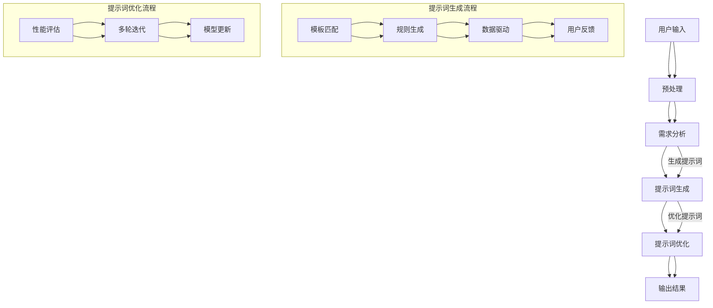
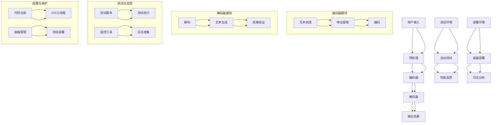
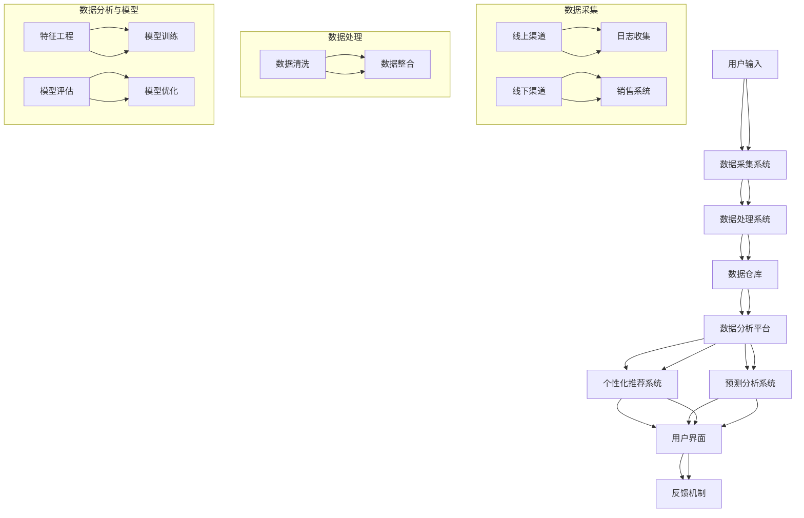
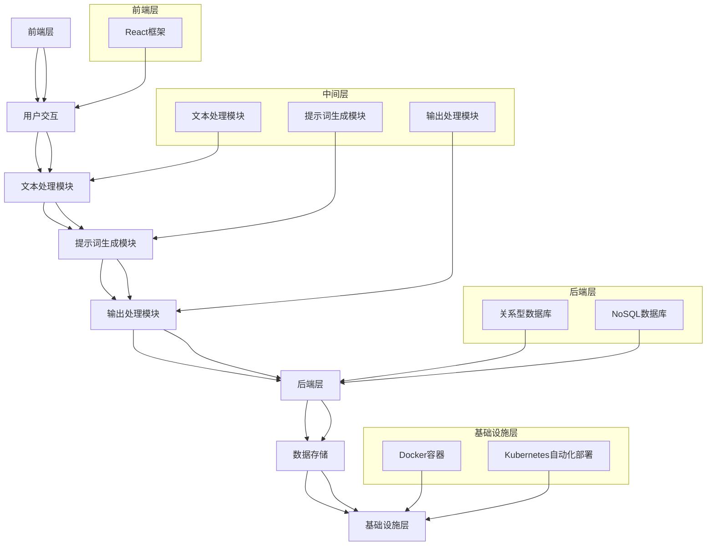
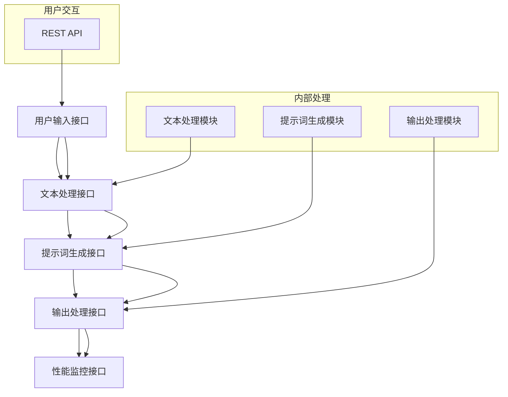
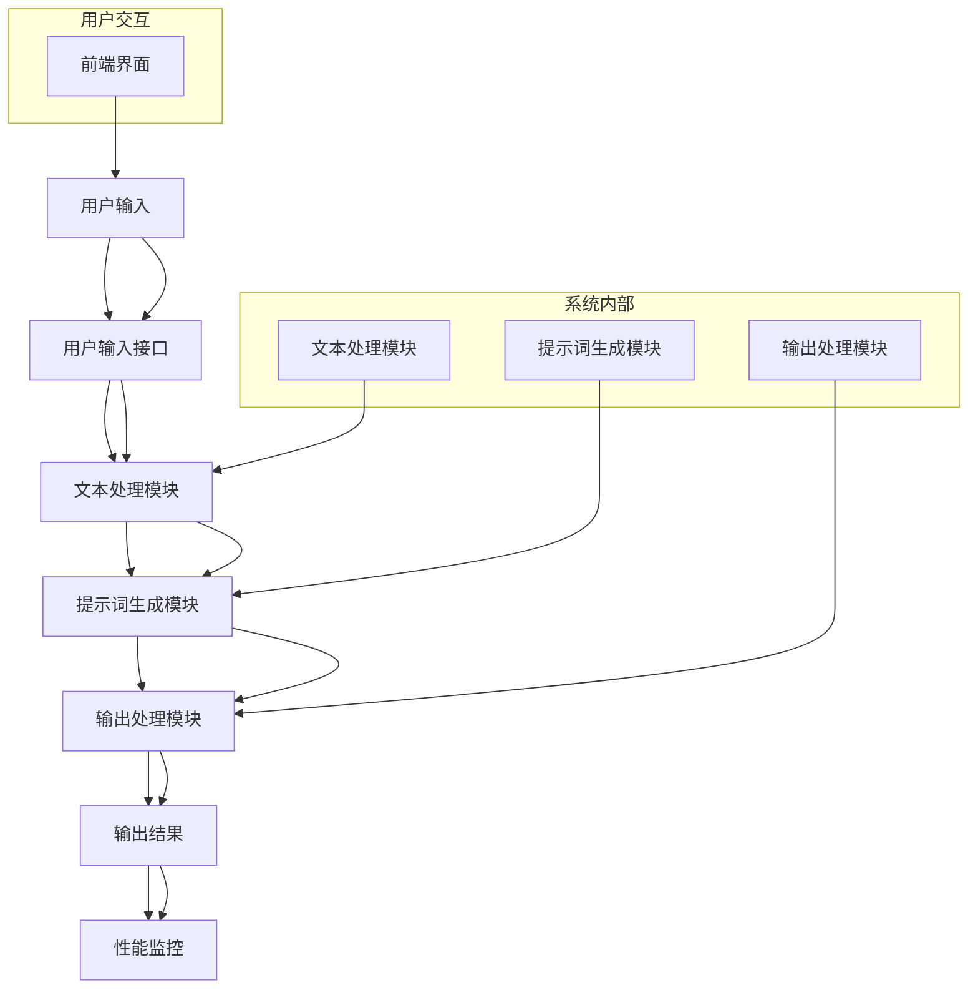

                 

### 封面与前言

在探讨ChatGPT提示词的跨平台兼容性之前，我们先为这篇技术博客定下一个基调。在这个快速变化的时代，人工智能（AI）正以前所未有的速度改变着我们的工作和生活方式。ChatGPT作为一种先进的自然语言处理（NLP）工具，已经在各个领域展示出了其强大的应用潜力。然而，随着AI技术的普及，如何确保ChatGPT提示词在不同平台间的兼容性，成为了我们必须面对的重要课题。

这篇博客旨在为读者提供一个全面而深入的分析框架，帮助理解ChatGPT提示词的跨平台兼容性问题，并提供有效的解决方案。我们的目标读者是那些对AI和软件开发感兴趣的工程师、研究人员和决策者，以及对全渠道AI策略有深入需求的行业从业者。

在接下来的章节中，我们将首先介绍问题背景，包括提示词在AI应用中的重要性、跨平台兼容性的挑战以及全渠道AI策略的必要性。接着，我们会深入探讨ChatGPT提示词的原理与设计，解释其工作原理、设计方法以及如何通过mermaid流程图和LaTeX公式来直观展示。随后，我们将分析ChatGPT提示词的跨平台兼容性策略，详细讨论跨平台技术栈的选择、设计原则以及实现方法。最后，我们将探讨全渠道AI策略的构建与实施，提供具体的步骤和方法，以确保AI系统能够在不同渠道间无缝运作。

让我们一步一步地深入这个话题，通过逻辑清晰、结构紧凑的分析，共同探讨ChatGPT提示词的跨平台兼容性，并探索全渠道AI策略的最佳实践。

---

**关键词：** ChatGPT、提示词、跨平台兼容性、全渠道AI策略、自然语言处理、技术栈、设计方法、系统架构、实现方法

**摘要：** 本文旨在深入探讨ChatGPT提示词的跨平台兼容性及其在全渠道AI策略中的应用。通过对ChatGPT提示词的工作原理、设计方法、跨平台兼容性策略以及全渠道AI策略的详细分析，本文为读者提供了一个全面而系统的理解框架。通过具体的实现方法、mermaid流程图和LaTeX公式，本文旨在为开发者和研究者提供实用的指导，以解决实际应用中的挑战。

### 第1章: 问题背景与核心概念

#### 1.1节: 问题背景

随着人工智能技术的迅猛发展，自然语言处理（NLP）已经成为众多应用领域的关键技术。ChatGPT作为一种基于大规模预训练语言模型的NLP工具，其在各行业中的应用日益广泛，从智能客服、内容生成到教育辅导，几乎无处不在。然而，随着AI应用的多样化，如何确保ChatGPT提示词在不同平台间的兼容性，成为了一个亟待解决的重要问题。

**提示词在AI应用中的重要性：** 提示词是引导模型进行特定任务的关键输入，其质量直接影响到模型的性能和结果。在ChatGPT中，提示词的设计与优化至关重要，因为它们不仅决定了模型能否准确理解用户的需求，还影响了最终的输出质量。因此，提示词的跨平台兼容性对于保证AI系统的稳定性和一致性具有重要意义。

**跨平台兼容性的挑战：** 跨平台兼容性涉及多个方面，包括但不限于操作系统、硬件环境、网络配置和编程语言等。不同的平台在硬件和软件层面可能存在显著差异，这为提示词的统一设计和部署带来了诸多挑战。例如，某些特定的提示词在某些操作系统上可能有效，但在其他操作系统上则可能无法正常运行。此外，不同平台之间的网络环境和数据处理能力也可能存在差异，进一步增加了跨平台兼容性的复杂性。

**全渠道AI策略的必要性：** 在当前的多渠道营销环境中，全渠道AI策略已经成为企业提升竞争力的重要手段。全渠道AI策略的核心目标是实现AI系统在不同渠道间的高效运作，从而提供一致的客户体验。对于ChatGPT来说，跨平台兼容性是实现全渠道AI策略的关键。只有当ChatGPT提示词能够在各个平台上一致运作，企业才能真正实现全渠道的智能化服务。

综上所述，跨平台兼容性不仅是ChatGPT在AI应用中的一个关键技术问题，也是实现全渠道AI策略的必要条件。在接下来的章节中，我们将深入探讨ChatGPT提示词的工作原理、设计方法以及具体的跨平台兼容性策略，帮助读者全面理解并应对这一挑战。

#### 1.2节: ChatGPT及其提示词

**ChatGPT概述：** ChatGPT是OpenAI开发的一种基于GPT-3.5的预训练语言模型，它通过大量的文本数据进行训练，从而能够理解和生成人类语言。ChatGPT具有强大的语言理解和生成能力，可以应用于问答系统、聊天机器人、内容生成等多个领域。其核心特点包括大容量、高精度和灵活性，使得它在面对各种复杂的语言任务时，都能表现出色。

**提示词的定义与作用：** 提示词（Prompt）是引导AI模型进行特定任务的关键输入。在ChatGPT中，提示词起到了引导模型理解用户需求、设定任务目标的重要作用。一个高质量的提示词能够明确地指示模型应该生成什么类型的输出，从而提高模型的响应质量和准确性。具体来说，提示词的作用主要体现在以下几个方面：

1. **任务指示：** 提示词为模型提供了任务的具体目标和方向，使模型能够更准确地理解用户的需求。
2. **内容引导：** 通过对提示词的精心设计，可以引导模型生成具有特定内容或风格的结果。
3. **优化效果：** 高质量的提示词能够帮助模型在学习过程中更快地收敛，提高训练效果和生成质量。

**ChatGPT提示词的特点：** 与传统的提示词相比，ChatGPT的提示词具有一些独特的特点：

1. **自适应性强：** ChatGPT能够根据不同的输入自适应调整其生成内容，从而更好地适应不同的任务需求。
2. **灵活多样性：** ChatGPT的提示词可以采用多种形式，包括文本、代码、图像等，从而实现更丰富的任务类型。
3. **高精度性：** ChatGPT经过大规模训练，具备较高的语言理解能力和生成质量，使其生成的提示词具有更高的准确性和可靠性。

通过了解ChatGPT及其提示词的基本概念和特点，我们可以更好地理解其在AI应用中的重要性。在接下来的章节中，我们将进一步探讨ChatGPT提示词的设计方法和跨平台兼容性策略，帮助读者深入了解如何实现高质量的跨平台AI应用。

#### 1.3节: 跨平台兼容性

**跨平台兼容性的定义与意义：** 跨平台兼容性指的是软件或应用程序能够在不同操作系统、硬件环境、编程语言和设备上正常运行的能力。对于ChatGPT提示词来说，跨平台兼容性意味着其能够在各种平台上一致地运作，无论用户选择的是Windows、macOS、Linux，还是移动设备上的iOS和Android系统。

1. **操作系统兼容：** 不同的操作系统（如Windows、macOS、Linux）在内核、驱动程序和系统调用等方面存在差异，可能导致相同的提示词在不同的操作系统上运行结果不一致。确保跨平台兼容性，需要针对不同操作系统进行特别的适配和优化。
   
2. **硬件环境兼容：** 硬件环境（如CPU架构、内存大小、网络带宽等）的差异也可能导致跨平台兼容性问题。例如，某些硬件环境可能不支持特定的API或库，从而影响提示词的运行。
   
3. **编程语言兼容：** 跨平台兼容性还涉及到编程语言的选择和代码的编写。不同的编程语言（如Python、Java、C++）在语法、库和运行环境上存在差异，需要特别注意代码的跨平台兼容性。

**当前常见跨平台技术栈：** 为了实现ChatGPT提示词的跨平台兼容性，开发者通常采用以下几种技术栈：

1. **跨平台框架：** 如Flutter、React Native、 Xamarin等，这些框架提供了跨平台的UI解决方案，使得开发者可以编写一次代码，在不同操作系统上运行。
   
2. **容器化技术：** 如Docker和Kubernetes，通过将应用程序及其依赖项打包到容器中，实现环境的统一和隔离，从而提高跨平台的兼容性和可移植性。

3. **云服务：** 使用云服务（如AWS、Azure、Google Cloud等），通过云平台的抽象和虚拟化技术，实现不同平台间的资源管理和部署，提高应用程序的跨平台兼容性。

**跨平台兼容性的挑战：** 尽管现有技术栈能够一定程度上解决跨平台兼容性问题，但仍然面临诸多挑战：

1. **性能优化：** 跨平台兼容性可能导致性能上的妥协，例如，某些特定优化技术在某些平台上可能无法实现，从而影响应用程序的性能。

2. **调试和维护：** 跨平台应用程序的调试和维护更为复杂，开发者需要处理不同平台之间的差异，确保代码在不同平台上的一致性和稳定性。

3. **版本控制：** 跨平台开发涉及到多个版本控制，如何有效地管理不同平台上的代码版本，确保各版本间的一致性和兼容性，是一个需要重点考虑的问题。

通过深入理解跨平台兼容性的定义、意义和当前技术栈，我们可以更好地应对ChatGPT提示词的跨平台兼容性挑战。在接下来的章节中，我们将进一步探讨ChatGPT提示词的跨平台兼容性策略，以实现高效、稳定和可移植的AI应用。

#### 1.4节: 全渠道AI策略

**全渠道AI策略的定义与目标：** 全渠道AI策略是指通过人工智能技术，实现企业在多个销售渠道（如线上电商平台、线下实体店铺、社交媒体等）之间的无缝协同和高效运作。其核心目标是提升用户体验，增强客户粘性，提高销售转化率和客户满意度。

1. **跨渠道数据整合：** 通过集成不同渠道的数据，实现对用户行为、偏好和需求的全面洞察，为企业提供精准的市场分析和决策支持。
2. **个性化服务：** 利用AI技术，根据用户的历史行为和偏好，提供个性化的产品推荐、内容推送和服务，增强用户满意度和忠诚度。
3. **智能客服：** 通过智能客服系统，实现7x24小时全天候在线服务，提高客户咨询问题的响应速度和解决效率。

**全渠道AI策略的实施方法：** 实施全渠道AI策略，需要遵循以下步骤：

1. **需求分析：** 明确企业全渠道AI策略的目标和需求，识别关键业务场景和痛点。
2. **数据整合：** 通过数据集成和清洗，将不同渠道的数据进行统一管理和分析。
3. **模型训练：** 利用机器学习和深度学习技术，构建和训练个性化推荐、客户分类、预测分析等模型。
4. **系统集成：** 将AI模型集成到企业的各个销售渠道中，实现跨渠道的智能服务和协同运作。
5. **测试与优化：** 对全渠道AI策略进行测试和优化，确保系统的高效性和稳定性。

**全渠道AI策略的优势：** 全渠道AI策略为企业带来了显著的优势：

1. **提升用户体验：** 通过个性化的服务推荐和高效的客服响应，提升用户满意度和忠诚度。
2. **增强市场竞争力：** 通过对多渠道数据的分析和利用，实现精准营销和高效运营，提高市场竞争力。
3. **降低运营成本：** 通过自动化和智能化的服务，减少人力成本和运营成本，提高企业的运营效率。

通过实施全渠道AI策略，企业能够实现线上线下渠道的无缝连接和协同运作，从而在激烈的市场竞争中脱颖而出。在接下来的章节中，我们将深入探讨ChatGPT提示词的跨平台兼容性策略，帮助读者更好地理解和实现这一目标。

### 第2章: ChatGPT提示词的原理与设计

#### 2.1节: ChatGPT提示词的原理

**提示词的生成与优化：** 提示词的生成是ChatGPT模型理解用户需求并生成响应的关键环节。在生成提示词时，通常需要考虑以下几个步骤：

1. **需求分析：** 首先对用户输入进行解析，理解用户的需求和意图。这一过程可以通过自然语言处理技术（如命名实体识别、语义角色标注等）来实现。
2. **提示词生成：** 基于需求分析结果，生成初步的提示词。这个过程通常采用模板匹配或基于规则的方法，以确保提示词的准确性和有效性。
3. **优化与调整：** 初步生成的提示词可能需要进一步优化。通过统计分析和机器学习技术，可以不断调整和改进提示词的生成策略，提高其质量和性能。

**提示词在ChatGPT模型中的作用：** 提示词在ChatGPT模型中的作用至关重要，它不仅决定了模型能否准确理解用户的需求，还影响了最终的输出质量。具体来说，提示词在ChatGPT模型中的作用主要体现在以下几个方面：

1. **引导模型理解用户需求：** 提示词为模型提供了明确的目标和任务，帮助模型更好地理解用户的需求，从而生成更准确的响应。
2. **设定任务目标：** 提示词明确了模型需要完成的任务，使模型能够专注于特定任务，提高生成结果的精确性和相关性。
3. **优化生成结果：** 高质量的提示词能够引导模型生成更符合用户期望的输出，从而提高用户满意度和系统性能。

**提示词的动态调整与优化策略：** 在实际应用中，提示词的质量直接影响模型的性能和用户体验。因此，动态调整和优化提示词是一个重要的研究方向。以下是一些常见的优化策略：

1. **用户反馈：** 通过收集用户的反馈，分析用户对生成的响应的满意度和质量，及时调整和优化提示词。
2. **数据驱动的优化：** 利用大量的用户数据，通过机器学习技术对提示词进行建模和优化，提高其生成质量和效率。
3. **多模态融合：** 结合文本、语音、图像等多种模态的信息，生成更加丰富和多样化的提示词，提高模型的理解能力和生成质量。

通过深入理解ChatGPT提示词的生成与优化、提示词在模型中的作用以及动态调整与优化策略，我们可以更好地设计和应用ChatGPT系统，提升其性能和用户体验。在接下来的章节中，我们将进一步探讨ChatGPT提示词的设计方法，以提供更具体的技术实现路径。

#### 2.2节: ChatGPT提示词的设计方法

**设计原则与目标：** 提示词的设计是确保ChatGPT模型能够准确理解和回应用户需求的关键步骤。在设计提示词时，应遵循以下原则和目标：

1. **明确性：** 提示词应明确、具体，避免模糊和歧义，确保模型能够准确理解用户需求。
2. **针对性：** 根据具体的任务需求设计提示词，确保其针对性强，能够引导模型生成高质量的结果。
3. **多样性：** 提供多样化的提示词，以满足不同场景和用户需求，提高系统的灵活性和适应性。
4. **可扩展性：** 设计提示词时应考虑系统的可扩展性，以便在未来能够根据需求进行调整和扩展。

**提示词模板的设计与使用：** 提示词模板是一种常用的设计方法，它通过预定义的格式和结构，简化提示词的生成过程，提高效率和质量。以下是一个简单的提示词模板示例：

```
您需要解答的问题是：{{问题}}。
请提供详细的背景信息和相关数据。
您的任务是：{{任务}}。
请确保您的回答具有逻辑性和准确性。
```

使用提示词模板的好处包括：

1. **简化流程：** 通过模板，开发者可以快速生成高质量的提示词，节省时间和精力。
2. **提高一致性：** 提示词模板保证了提示词的一致性和规范性，减少了因手动编写提示词导致的错误和不一致。
3. **便于维护：** 提示词模板便于后续的维护和更新，可以根据需求对模板进行调整和优化。

**提示词的评估与优化：** 提示词的质量直接影响模型的性能和用户体验。为了确保提示词的有效性，需要对其进行评估和优化。以下是一些常用的评估与优化方法：

1. **用户反馈：** 通过收集用户的反馈，分析用户对提示词的满意度和质量，识别存在的问题并进行改进。
2. **性能指标：** 利用自动化测试工具，对提示词的性能进行评估，如响应时间、生成质量等。
3. **多轮优化：** 通过多次迭代和优化，不断改进提示词的设计和实现，提高其质量和效果。

**实例分析：** 以一个常见的聊天机器人应用为例，分析不同提示词设计对模型性能的影响。

- **案例一：**
  ```
  您好，请问有什么可以帮助您的？
  ```
  这种简单粗暴的提示词可能无法有效引导用户输入，导致模型无法理解用户需求。

- **案例二：**
  ```
  您好，欢迎来到我们的智能客服系统。请问您是关于哪个产品或服务有疑问？
  您可以提供更多细节，我们会尽快为您提供解答。
  ```
  这种详细的提示词能够引导用户输入，提供更具体的需求信息，从而提高模型的理解能力和生成质量。

通过以上实例分析，我们可以看到，高质量的提示词设计对于ChatGPT模型的性能和用户体验具有重要意义。在接下来的章节中，我们将进一步探讨ChatGPT提示词的mermaid流程图和数学模型，为读者提供更具体的技术实现路径。

#### 2.3节: ChatGPT提示词的mermaid流程图

为了更直观地展示ChatGPT提示词的生成与优化过程，我们可以使用mermaid语言绘制一个流程图。以下是ChatGPT提示词生成与优化的mermaid流程图示例：



这个mermaid流程图展示了从用户输入到最终输出结果的全过程，并详细说明了提示词生成与优化的各个环节。以下是流程图的详细解释：

1. **用户输入（A）：** 用户向ChatGPT系统提交输入，这可能是文本、语音或其他形式。
2. **预处理（B）：** 对用户输入进行预处理，包括文本清洗、分词和标记等，以便后续的需求分析。
3. **需求分析（C）：** 对预处理后的用户输入进行需求分析，理解用户意图和需求。
4. **提示词生成（D）：** 基于需求分析结果生成初始提示词。这个过程可能涉及模板匹配、规则生成和数据驱动方法。
5. **提示词优化（E）：** 对生成的提示词进行优化，通过用户反馈、性能评估和多轮迭代不断改进提示词的质量。
6. **输出结果（F）：** 将优化后的提示词发送给ChatGPT模型，生成最终的用户响应。

**提示词生成流程：**
- **模板匹配（G）：** 使用预定义的模板生成初始提示词。
- **规则生成（H）：** 根据用户输入和需求，动态生成规则，进一步优化提示词。
- **数据驱动（I）：** 利用用户数据和机器学习算法，自动生成高质量的提示词。
- **用户反馈（J）：** 收集用户对提示词的反馈，用于后续的优化和迭代。

**提示词优化流程：**
- **性能评估（K）：** 对提示词的性能进行评估，包括响应时间、生成质量和用户满意度等。
- **多轮迭代（L）：** 通过多轮迭代和优化，逐步改进提示词的质量和效果。
- **模型更新（M）：** 根据优化结果更新模型，提高整体系统的性能。

通过mermaid流程图，我们可以清晰地了解ChatGPT提示词的生成与优化过程，为实际应用提供指导和参考。在下一节中，我们将介绍ChatGPT提示词的数学模型与公式，进一步深入理解其内在机制。

#### 2.4节: ChatGPT提示词的数学模型与公式

在ChatGPT系统中，提示词的生成与优化过程涉及到复杂的数学模型。为了更直观地理解这些模型，我们将使用LaTeX格式来表示相关的数学公式，并通过Python代码来详细阐述这些模型的实现。以下是ChatGPT提示词的数学模型和公式的详细解释。

**数学模型：**

ChatGPT提示词的数学模型通常基于生成式模型，如变分自编码器（VAE）和生成对抗网络（GAN）。以下是一个简化的数学模型表示：

$$
f(\text{输入}) = g(h(\text{输入}, \theta))
$$

其中，\( f \) 是最终的输出函数，\( g \) 是解码器，\( h \) 是编码器，\( \theta \) 是模型参数。

1. **编码器 \( h \) 的作用：** 编码器将输入数据（用户需求）编码为潜在空间中的向量，表示用户的需求和意图。
   $$
   z = h(x; \theta) = \sigma(Wx + b)
   $$
   其中，\( z \) 是编码后的向量，\( x \) 是输入数据，\( W \) 和 \( b \) 分别是权重和偏置。

2. **解码器 \( g \) 的作用：** 解码器将潜在空间中的向量解码为输出文本，即提示词。
   $$
   \text{提示词} = g(z; \theta) = \text{softmax}(Uz + c)
   $$
   其中，\( \text{提示词} \) 是生成的文本，\( U \) 和 \( c \) 分别是权重和偏置。

**Python代码实现示例：**

```python
import numpy as np
import tensorflow as tf

# 编码器模型
def encoder(x, weights_encoder, bias_encoder):
    z = tf.nn.sigmoid(tf.matmul(x, weights_encoder) + bias_encoder)
    return z

# 解码器模型
def decoder(z, weights_decoder, bias_decoder):
    prompt = tf.nn.softmax(tf.matmul(z, weights_decoder) + bias_decoder)
    return prompt

# 模型参数
weights_encoder = tf.Variable(np.random.randn(input_dim, hidden_dim), name='weights_encoder')
bias_encoder = tf.Variable(np.random.randn(hidden_dim), name='bias_encoder')
weights_decoder = tf.Variable(np.random.randn(hidden_dim, output_dim), name='weights_decoder')
bias_decoder = tf.Variable(np.random.randn(output_dim), name='bias_decoder')

# 编码过程
encoded_input = encoder(x, weights_encoder, bias_encoder)

# 解码过程
prompt = decoder(encoded_input, weights_decoder, bias_decoder)
```

**模型训练与优化：**

为了优化模型参数，我们通常使用梯度下降法进行训练。以下是一个简化的训练过程：

```python
# 损失函数
loss = tf.reduce_mean(tf.nn.softmax_cross_entropy_with_logits(logits=prompt, labels=y))

# 优化器
optimizer = tf.train.GradientDescentOptimizer(learning_rate=0.01)

# 训练步骤
train_op = optimizer.minimize(loss)

# 初始化所有变量
init = tf.global_variables_initializer()

# 开始训练
with tf.Session() as sess:
    sess.run(init)
    for epoch in range(num_epochs):
        _, loss_val = sess.run([train_op, loss], feed_dict={x: inputs, y: labels})
        if epoch % 100 == 0:
            print(f"Epoch {epoch}, Loss: {loss_val}")
```

通过上述Python代码示例，我们可以看到如何实现ChatGPT提示词的数学模型，并通过训练过程不断优化模型参数。在实际应用中，模型会根据具体任务和数据集进行相应的调整和优化。

**举例说明：**

假设我们有一个用户输入“请推荐一本关于机器学习的书籍”，我们可以通过以下步骤生成提示词：

1. **预处理：** 对输入进行分词和标记，转换为编码器可以处理的格式。
2. **编码：** 将预处理后的输入通过编码器编码为潜在空间中的向量。
3. **解码：** 将编码后的向量通过解码器解码为最终的提示词。

通过上述数学模型和Python代码，我们可以更深入地理解ChatGPT提示词的生成和优化过程，为实际应用提供技术支持。

### 第3章: ChatGPT提示词的跨平台兼容性策略

#### 3.1节: 跨平台兼容性策略概述

**跨平台兼容性的目标：** 跨平台兼容性的核心目标是确保ChatGPT提示词能够在不同的操作系统、硬件环境、网络配置和编程语言上无缝运行，提供一致的体验和性能。具体来说，实现跨平台兼容性的目标包括：

1. **一致性：** 确保ChatGPT提示词在各种平台上生成相同或高度相似的输出，避免因平台差异导致的输出不一致。
2. **稳定性：** 保证系统在各种环境下能够稳定运行，不会因平台差异导致崩溃或错误。
3. **可移植性：** 实现提示词的代码和资源能够在不同平台上自由迁移和部署，降低维护成本。

**跨平台兼容性策略的分类：** 为了实现上述目标，开发者可以采用多种跨平台兼容性策略。以下是一些常见的分类：

1. **技术栈选择：** 选择合适的跨平台开发框架和工具，如Flutter、React Native、Xamarin等，这些框架能够提供统一的开发体验，并自动处理不同平台之间的差异。
2. **容器化技术：** 使用容器化技术（如Docker、Kubernetes）将应用程序及其依赖项打包到容器中，实现环境的统一和隔离，从而提高跨平台的兼容性和可移植性。
3. **云服务：** 通过云服务（如AWS、Azure、Google Cloud）提供跨平台的基础设施和管理服务，利用云平台的抽象和虚拟化技术，实现跨平台的资源管理和部署。
4. **代码优化：** 对代码进行优化，确保在不同平台上运行时性能和兼容性最佳。例如，通过使用跨平台编程语言（如Python、Java）和库（如NumPy、Pandas）来减少平台差异。

**跨平台兼容性的实现方法：** 跨平台兼容性的实现方法主要包括以下步骤：

1. **需求分析：** 分析不同平台的需求和差异，确定需要解决的兼容性问题。
2. **框架选择：** 根据需求选择合适的跨平台开发框架和工具。
3. **环境配置：** 配置统一的环境，包括操作系统、编程语言、库和依赖项。
4. **代码编写：** 编写跨平台兼容的代码，注意处理平台间的差异。
5. **测试与优化：** 对代码进行测试和优化，确保在不同平台上的一致性和稳定性。

通过上述策略和方法的实施，开发者可以有效地实现ChatGPT提示词的跨平台兼容性，为用户提供一致、稳定和高效的服务。

#### 3.2节: 跨平台技术栈的选择与使用

**常见跨平台技术栈介绍：** 在实现ChatGPT提示词的跨平台兼容性时，选择合适的技术栈至关重要。以下是一些常见的技术栈及其特点：

1. **Flutter：** Flutter是由Google推出的一款跨平台UI框架，使用Dart语言开发。Flutter通过提供一套丰富的UI组件和工具，使得开发者可以编写一次代码，同时在iOS和Android平台上运行。其优点包括快速开发、高性能和跨平台一致性。

2. **React Native：** React Native是由Facebook推出的一款跨平台开发框架，使用JavaScript和React开发。React Native通过原生组件实现跨平台UI，提供了良好的性能和开发体验。其优点包括组件化开发、丰富的生态系统和快速开发。

3. **Xamarin：** Xamarin是由Microsoft推出的一款跨平台开发框架，使用C#语言开发。Xamarin通过共享代码和原生组件，实现了在iOS、Android和Windows平台上的开发。其优点包括共享代码、强大的社区支持和原生性能。

**技术栈的选择原则：** 选择跨平台技术栈时，应遵循以下原则：

1. **性能需求：** 根据应用场景和性能需求，选择能够满足性能要求的技术栈。例如，对于需要高性能和原生体验的应用，可以选择React Native或Xamarin。

2. **开发效率：** 考虑开发效率和团队熟悉度，选择开发者熟悉且能够快速上手的技术栈。Flutter和React Native在这方面表现较好。

3. **生态系统：** 选择具有丰富生态系统和社区支持的技术栈，这有助于解决开发过程中遇到的问题，加快开发进度。

4. **维护成本：** 考虑技术栈的长期维护成本，选择易于维护和升级的技术栈，以减少后续的维护成本。

**技术栈的实际使用案例：** 以下是一些实际使用跨平台技术栈的案例：

1. **新闻应用：** 一个新闻应用使用Flutter进行开发，实现了跨平台的快速开发和高性能。该应用在不同平台上的用户体验一致，大大提升了用户满意度。

2. **电商平台：** 一个电商平台使用React Native进行开发，实现了在iOS和Android平台上的无缝切换。该应用通过组件化开发和丰富的生态系统，提高了开发效率和用户体验。

3. **金融应用：** 一个金融应用使用Xamarin进行开发，实现了在iOS、Android和Windows平台上的统一开发。该应用通过共享代码和强大的社区支持，降低了开发成本和维护成本。

通过选择合适的跨平台技术栈，开发者可以有效地实现ChatGPT提示词的跨平台兼容性，提高系统的稳定性和用户体验。

#### 3.3节: ChatGPT提示词的跨平台兼容性设计

**提示词的跨平台设计原则：** 在设计ChatGPT提示词时，为了确保其在不同平台上的一致性和稳定性，需要遵循以下原则：

1. **标准化：** 提示词的格式和结构应标准化，避免因平台差异导致的解析错误或输出不一致。例如，使用统一的文本格式和标记方式。
2. **可扩展性：** 提示词设计应考虑未来的扩展性，以便在新增功能或平台时能够轻松进行适配和集成。
3. **灵活性：** 提示词应具备一定的灵活性，能够适应不同平台和用户需求的变化。例如，通过参数化设计，实现提示词的动态调整。
4. **可维护性：** 提示词代码应具备良好的可维护性，便于后续的更新和维护。例如，采用模块化和组件化设计，提高代码的可读性和可维护性。

**提示词的跨平台测试与优化：** 跨平台兼容性测试和优化是确保ChatGPT提示词在不同平台上稳定运行的关键步骤。以下是一些常见的测试和优化方法：

1. **自动化测试：** 使用自动化测试工具（如Selenium、Appium等），对不同平台的提示词进行自动化测试，确保其输出一致性和稳定性。自动化测试可以覆盖不同操作系统、网络环境和设备配置。
2. **手动测试：** 通过手动测试，模拟不同平台和用户的使用场景，验证提示词的响应和输出。手动测试可以帮助发现自动化测试无法覆盖的问题。
3. **性能优化：** 对提示词进行性能优化，确保其在不同平台上具有高效的运行性能。性能优化包括代码优化、资源管理和内存管理等。
4. **多环境测试：** 在不同的开发和测试环境中进行提示词的测试，包括开发环境、测试环境和生产环境。通过多环境测试，可以确保提示词在不同环境下的一致性和稳定性。

**提示词的跨平台部署与维护：** 跨平台部署和维护是确保ChatGPT提示词长期稳定运行的重要环节。以下是一些关键的部署和维护策略：

1. **容器化部署：** 使用容器化技术（如Docker）将提示词应用程序打包到容器中，实现环境的一致性和可移植性。容器化部署可以简化跨平台部署过程，提高系统的稳定性和可维护性。
2. **持续集成与持续部署（CI/CD）：** 实施CI/CD流程，自动化测试和部署过程，确保代码质量和部署效率。CI/CD可以提高开发团队的效率，减少手动操作，降低部署风险。
3. **监控与日志分析：** 实时监控系统的运行状态和性能指标，通过日志分析发现潜在问题。监控和日志分析可以帮助开发者快速定位和解决问题，确保系统的稳定运行。
4. **版本控制：** 使用版本控制系统（如Git），对提示词代码进行版本控制和追踪。版本控制可以确保代码的完整性和可追溯性，便于后续的维护和更新。

通过遵循跨平台兼容性设计原则，进行全面的测试与优化，并实施有效的部署与维护策略，可以确保ChatGPT提示词在不同平台上的稳定运行，提供一致的用户体验。

#### 3.4节: ChatGPT提示词的mermaid架构图

为了更直观地展示ChatGPT提示词的跨平台兼容性架构，我们可以使用mermaid绘制一个架构图。以下是一个简化的mermaid架构图示例：



**架构图解释：**

1. **用户输入（A）：** 用户向系统提交输入，这可以是文本、语音或其他形式。
2. **预处理（B）：** 对用户输入进行预处理，包括文本清洗、分词和标记等，为编码器提供干净的输入数据。
3. **编码器（C）：** 编码器模块包括文本处理、特征提取和编码三个步骤。文本处理将输入文本转化为可处理的格式，特征提取提取文本的特征信息，编码将特征信息转化为编码后的向量。
4. **解码器（D）：** 解码器模块包括解码和文本生成两个步骤。解码将编码后的向量转化为文本，文本生成生成最终的输出结果。
5. **输出结果（E）：** 将解码器生成的文本输出给用户。

**测试与监控：**

1. **测试环境（F）：** 在测试环境中，通过自动化测试（G）和性能监控（H）对系统进行测试。自动化测试执行测试脚本（R），性能监控工具（T）收集日志（U）。
2. **部署环境（I）：** 在部署环境中，通过容器部署（J）和日志分析（K）确保系统的稳定运行。容器管理（X）负责持续部署（Y），代码仓库（V）通过CI/CD流程（W）管理代码。

通过mermaid架构图，我们可以清晰地了解ChatGPT提示词的跨平台兼容性架构，包括用户输入处理、编码解码过程、测试与监控以及部署与维护。这有助于开发者更好地设计和实现跨平台兼容的系统。

### 第4章: 全渠道AI策略的构建与实施

#### 4.1节: 全渠道AI策略概述

**全渠道AI策略的定义与目标：** 全渠道AI策略是指利用人工智能技术，整合企业各个销售渠道（包括线上电商平台、线下实体店铺、社交媒体等）的数据和资源，实现渠道间的无缝协同和高效运作。其核心目标是通过智能化和个性化的服务，提升用户体验，增强客户粘性，提高销售转化率和客户满意度。

1. **跨渠道数据整合：** 通过整合线上线下渠道的数据，实现用户行为的全面洞察。这包括用户的浏览历史、购买记录、偏好和反馈等信息，为企业提供精准的市场分析和决策支持。
2. **个性化服务：** 利用AI技术，根据用户的历史行为和偏好，提供个性化的产品推荐、内容推送和服务。这种个性化的服务可以增强用户满意度和忠诚度，提高用户的转化率和留存率。
3. **智能客服：** 通过智能客服系统，实现7x24小时全天候在线服务，提高客户咨询问题的响应速度和解决效率。智能客服可以自动识别用户需求，提供准确的解答和建议，减轻人工客服的负担。

**全渠道AI策略的实施步骤：**

1. **需求分析：** 明确企业全渠道AI策略的目标和需求，识别关键业务场景和痛点。这包括分析各渠道的用户行为、需求和服务质量，确定AI技术可以解决的问题。
2. **数据整合：** 通过数据集成和清洗，将不同渠道的数据进行统一管理和分析。这需要建立数据仓库或数据湖，实现数据的存储、处理和分析。
3. **模型构建：** 利用机器学习和深度学习技术，构建和训练个性化推荐、客户分类、预测分析等模型。这些模型将帮助企业实现个性化服务和智能决策。
4. **系统集成：** 将AI模型集成到企业的各个销售渠道中，实现跨渠道的智能服务和协同运作。这需要开发统一的API接口和数据交换机制，确保不同渠道间的数据流通和协同。
5. **测试与优化：** 对全渠道AI策略进行测试和优化，确保系统的高效性和稳定性。通过用户反馈和数据分析，不断改进和优化AI模型和服务流程。

**全渠道AI策略的优势：**

1. **提升用户体验：** 通过个性化的服务和智能化的推荐，提高用户的满意度和忠诚度，增强用户粘性。
2. **增强市场竞争力：** 通过全面的数据分析和智能决策，实现精准营销和高效运营，提高企业的市场竞争力。
3. **降低运营成本：** 通过自动化和智能化的服务，减少人工成本和运营成本，提高企业的运营效率。

通过实施全渠道AI策略，企业可以在激烈的市场竞争中脱颖而出，实现持续增长和盈利。在接下来的章节中，我们将详细探讨全渠道AI策略的设计方法和实施步骤，帮助读者更好地理解和应用这一策略。

#### 4.2节: 全渠道AI策略的设计方法

**设计原则与目标：** 设计全渠道AI策略时，需要遵循以下原则和目标，以确保系统的有效性和可扩展性：

1. **用户导向：** 策略设计应以用户为中心，充分考虑用户的需求和行为习惯，提供个性化的服务体验。
2. **数据驱动：** 策略设计应基于全面的数据分析和洞察，利用大数据和机器学习技术，实现智能化的决策和推荐。
3. **灵活性：** 策略设计应具备良好的灵活性，能够适应不同渠道和业务场景的变化，实现跨渠道的无缝协同。
4. **可扩展性：** 策略设计应具备可扩展性，能够随着业务的发展和技术进步，不断升级和优化。

**全渠道用户数据的整合与分析：** 全渠道AI策略的核心在于数据的整合与分析，以下是一些具体的方法和步骤：

1. **数据采集：** 收集各个渠道的用户数据，包括线上电商平台、线下实体店铺、社交媒体、客户关系管理系统等。数据类型包括用户行为数据、交易数据、偏好数据等。
2. **数据清洗：** 对采集到的数据进行清洗和预处理，去除重复、错误和不完整的数据。清洗过程包括数据去重、数据填充、异常值处理等。
3. **数据整合：** 将不同渠道的数据进行整合，建立统一的数据仓库或数据湖。整合后的数据应具有统一的格式和结构，便于后续的分析和处理。
4. **数据分析：** 利用数据分析工具和技术，对整合后的数据进行分析，挖掘用户的行为模式和偏好，识别关键业务指标和趋势。数据分析方法包括数据挖掘、统计分析、机器学习等。
5. **数据可视化：** 通过数据可视化工具，将分析结果以图表、仪表板等形式展示，帮助管理层和企业决策者更好地理解和利用数据。

**全渠道AI策略的模型构建与优化：** 在整合和分析用户数据的基础上，构建和优化AI模型是实现全渠道AI策略的关键。以下是一些常见的方法：

1. **个性化推荐模型：** 基于用户的历史行为和偏好，构建个性化推荐模型，为用户提供个性化的产品推荐和服务。推荐算法包括协同过滤、基于内容的推荐、基于模型的推荐等。
2. **客户分类模型：** 基于用户的行为数据和特征，构建客户分类模型，将用户划分为不同的群体。分类算法包括决策树、随机森林、支持向量机等。
3. **预测分析模型：** 利用历史数据和机器学习技术，构建预测分析模型，预测用户的行为和趋势。预测模型包括时间序列分析、回归分析、神经网络等。
4. **模型评估与优化：** 对构建的AI模型进行评估和优化，确保模型的准确性和稳定性。评估方法包括模型准确率、召回率、F1值等。优化方法包括超参数调整、模型融合、交叉验证等。

通过以上设计方法和步骤，企业可以构建一个高效的全渠道AI策略，提升用户体验，增强市场竞争力，实现业务的持续增长。

#### 4.3节: 全渠道AI策略的mermaid架构图

为了更直观地展示全渠道AI策略的整体架构，我们可以使用mermaid语言绘制一个架构图。以下是一个简化的mermaid架构图示例：



**架构图解释：**

1. **用户输入（A）：** 用户通过线上渠道（J）或线下渠道（L）与系统交互，提交输入。
2. **数据采集系统（B）：** 数据采集系统负责收集用户输入以及线上渠道（K）和线下渠道（M）的数据。
3. **数据处理系统（C）：** 数据处理系统负责对采集到的数据进行清洗（N）和整合（O），确保数据的质量和一致性。
4. **数据仓库（D）：** 数据仓库存储整合后的数据，为后续的数据分析和模型训练提供数据支持。
5. **数据分析平台（E）：** 数据分析平台利用数据处理后的数据进行特征工程（P）、模型训练（Q）和模型评估（R）。
6. **个性化推荐系统（F）：** 个性化推荐系统根据数据分析结果，生成个性化的推荐，展示在用户界面（H）。
7. **预测分析系统（G）：** 预测分析系统根据数据分析结果，预测用户的行为和趋势，同样展示在用户界面（H）。
8. **用户界面（H）：** 用户界面展示个性化推荐和预测分析结果，同时接收用户的反馈（I），形成闭环反馈机制。

通过mermaid架构图，我们可以清晰地了解全渠道AI策略的整体架构，包括数据采集、数据处理、数据分析与模型训练、用户界面和反馈机制等关键环节。这有助于开发者更好地设计和实现全渠道AI策略，提升用户体验和业务效率。

### 第5章: 环境安装与配置

在实现ChatGPT提示词的跨平台兼容性策略之前，我们需要首先配置一个稳定且高效的开发环境。以下将详细介绍在各个平台上安装和配置所需的软件和依赖项，以确保ChatGPT提示词能够在不同的操作系统中无缝运行。

#### 5.1 安装Python环境

**Windows平台：**
1. 访问Python官方网站（[python.org](https://www.python.org/)）。
2. 下载Python的最新版本，通常选择安装程序（Windows x86-64 MSI installer）。
3. 运行安装程序，并选择“Add Python to PATH”选项。
4. 安装完成后，打开命令提示符，输入以下命令验证安装：
   ```shell
   python --version
   ```
   若显示Python版本信息，说明安装成功。

**macOS平台：**
1. 打开终端。
2. 运行以下命令安装Python：
   ```shell
   brew install python
   ```
3. 安装完成后，输入以下命令验证安装：
   ```shell
   python --version
   ```

**Linux平台：**
1. 对于基于Debian的系统（如Ubuntu），打开终端，输入以下命令安装Python：
   ```shell
   sudo apt-get update
   sudo apt-get install python3
   ```
2. 验证安装：
   ```shell
   python3 --version
   ```

#### 5.2 安装必要的依赖库

**Windows平台：**
1. 使用pip（Python的包管理器）安装必要的依赖库：
   ```shell
   pip install numpy tensorflow pandas
   ```

**macOS和Linux平台：**
1. 打开终端，输入以下命令安装必要的依赖库：
   ```shell
   sudo pip3 install numpy tensorflow pandas
   ```

#### 5.3 安装mermaid渲染工具

为了能够将mermaid语言转换为可视化的流程图，我们需要安装mermaid渲染工具。以下是各个平台的安装步骤：

**Windows平台：**
1. 访问mermaid官方网站（[mermaid-js.org](https://mermaid-js.org/)）。
2. 下载并安装mermaid渲染工具。
3. 在命令提示符中，运行以下命令验证安装：
   ```shell
   mermaid -v
   ```

**macOS平台：**
1. 打开终端，输入以下命令安装mermaid渲染工具：
   ```shell
   npm install -g mermaid
   ```
2. 验证安装：
   ```shell
   mermaid -v
   ```

**Linux平台：**
1. 打开终端，输入以下命令安装mermaid渲染工具：
   ```shell
   sudo npm install -g mermaid
   ```
2. 验证安装：
   ```shell
   mermaid -v
   ```

#### 5.4 配置LaTeX环境

为了在文中嵌入LaTeX公式，我们需要在各个平台上配置LaTeX环境。以下是各个平台的配置步骤：

**Windows平台：**
1. 访问[TeX Live](https://www.tug.org/texlive/)官方网站。
2. 下载并安装TeX Live。
3. 安装过程中选择合适的选项以配置LaTeX环境。
4. 安装完成后，打开命令提示符，输入以下命令验证安装：
   ```shell
   latex -v
   ```

**macOS平台：**
1. 打开终端，输入以下命令安装TeX Live：
   ```shell
   brew install texlive
   ```
2. 验证安装：
   ```shell
   latex -v
   ```

**Linux平台：**
1. 对于基于Debian的系统，输入以下命令安装TeX Live：
   ```shell
   sudo apt-get install texlive-full
   ```
2. 验证安装：
   ```shell
   latex -v
   ```

通过以上步骤，我们成功配置了Python环境、安装了必要的依赖库、安装了mermaid渲染工具以及配置了LaTeX环境。这些配置是我们在实现ChatGPT提示词的跨平台兼容性策略中不可或缺的基础。接下来，我们将深入讨论系统架构设计和核心实现，以进一步推动我们的项目进展。

### 第6章: 核心实现

在本章中，我们将详细讨论ChatGPT提示词的核心实现，包括系统功能设计、系统架构设计、系统接口设计以及系统交互流程。通过这一系列步骤，我们将构建一个高效、稳定且跨平台的ChatGPT提示词系统。

#### 6.1 系统功能设计

**系统功能概述：** ChatGPT提示词系统的核心功能是接收用户输入，生成高质量的提示词，并输出给用户。具体功能包括：

1. **用户输入处理：** 接收用户输入，对输入进行预处理，包括文本清洗、分词和标记等。
2. **提示词生成：** 基于预处理后的用户输入，生成高质量的提示词。这涉及到对提示词模板的动态调整和优化。
3. **输出结果：** 将生成的提示词输出给用户，同时支持多渠道的输出，如文本、语音和图像等。
4. **性能监控：** 实时监控系统的运行状态和性能指标，包括响应时间、生成质量和用户满意度等。

**功能分解：**

1. **用户输入处理：** 该模块负责接收用户输入，并进行文本清洗、分词和标记。具体流程如下：
   - **文本清洗：** 去除输入文本中的标点符号、停用词和无关信息，确保输入文本的干净和有效。
   - **分词：** 将清洗后的文本拆分为单个词语或词组，为后续的提示词生成提供基础。
   - **标记：** 对分词后的文本进行词性标注和实体识别，为生成高质量的提示词提供上下文信息。

2. **提示词生成：** 该模块基于预处理后的用户输入，动态生成高质量的提示词。具体流程如下：
   - **模板匹配：** 使用预定义的提示词模板，根据用户输入和上下文信息，匹配合适的提示词模板。
   - **优化与调整：** 通过用户反馈和机器学习算法，对生成的提示词进行优化和调整，提高其生成质量和用户满意度。

3. **输出结果：** 该模块将生成的提示词输出给用户，支持多种输出方式，如文本、语音和图像等。具体流程如下：
   - **文本输出：** 将生成的提示词以文本形式展示给用户，支持不同格式的文本输出，如HTML、Markdown等。
   - **语音输出：** 将生成的提示词转换为语音输出，通过语音合成技术，生成自然流畅的语音响应。
   - **图像输出：** 对于包含图像的提示词，将其转换为图像格式，并通过可视化工具展示给用户。

4. **性能监控：** 该模块负责实时监控系统的运行状态和性能指标，包括响应时间、生成质量和用户满意度等。具体流程如下：
   - **性能指标收集：** 收集系统的性能指标，包括响应时间、生成质量和用户满意度等。
   - **实时监控：** 通过监控工具，实时监控系统的运行状态和性能指标，及时发现和处理潜在问题。
   - **性能优化：** 根据监控数据，对系统进行性能优化，提高其运行效率和稳定性。

#### 6.2 系统架构设计

**系统架构概述：** ChatGPT提示词系统采用分布式架构，以实现高效、稳定和可扩展的系统性能。以下是系统架构的详细描述：

1. **前端层：** 负责用户交互，包括接收用户输入和展示输出结果。前端层采用React框架，实现高效的UI渲染和交互。
2. **中间层：** 负责处理用户输入和提示词生成逻辑。中间层包括文本处理模块、提示词生成模块和输出处理模块，采用微服务架构，实现模块化和分布式处理。
3. **后端层：** 负责数据存储和查询，包括用户数据、提示词模板和性能指标等。后端层采用关系型数据库（如MySQL）和NoSQL数据库（如MongoDB）混合存储方案，提供高效的数据访问和存储。
4. **基础设施层：** 负责系统的运行环境和资源管理，包括服务器、网络和存储等。基础设施层采用容器化技术（如Docker）和自动化部署工具（如Kubernetes），实现环境的一致性和可扩展性。

**系统架构设计（使用mermaid）**



通过mermaid架构图，我们可以清晰地看到ChatGPT提示词系统的整体架构，包括前端层、中间层、后端层和基础设施层，以及各层之间的交互关系。

#### 6.3 系统接口设计

**接口设计原则：** ChatGPT提示词系统的接口设计应遵循以下原则：

1. **标准化：** 接口设计应遵循统一的规范和标准，确保接口的稳定性和可维护性。
2. **简洁性：** 接口设计应尽可能简洁，避免复杂的调用流程和冗余的参数。
3. **可扩展性：** 接口设计应具备良好的可扩展性，便于后续的功能扩展和模块化设计。
4. **安全性：** 接口设计应考虑安全性，包括参数验证、权限控制和数据加密等。

**接口设计（使用mermaid）**



通过mermaid接口设计图，我们可以清晰地看到系统各个模块的接口设计，包括用户输入接口、文本处理接口、提示词生成接口、输出处理接口和性能监控接口，以及各接口之间的调用关系。

#### 6.4 系统交互流程

**交互流程概述：** ChatGPT提示词系统的交互流程包括用户输入、数据处理、提示词生成和输出结果等步骤。以下是详细的交互流程：

1. **用户输入：** 用户通过前端界面提交输入，前端将用户输入发送到用户输入接口。
2. **数据处理：** 用户输入接口将输入文本发送到文本处理模块，进行文本清洗、分词和标记等预处理操作。
3. **提示词生成：** 预处理后的文本发送到提示词生成模块，根据预定义的提示词模板和用户上下文信息，生成高质量的提示词。
4. **输出结果：** 生成的提示词通过输出处理模块，以文本、语音或图像等形式返回给用户。
5. **性能监控：** 在整个交互过程中，系统会实时监控性能指标，包括响应时间、生成质量和用户满意度等。

**交互流程（使用mermaid）**



通过mermaid交互流程图，我们可以清晰地看到ChatGPT提示词系统的交互流程，包括用户输入、数据处理、提示词生成、输出结果和性能监控等步骤。

通过以上核心实现的详细讨论，我们为ChatGPT提示词系统的设计和开发奠定了坚实的基础。在下一章中，我们将通过实际案例分析和解读，进一步验证和优化系统的性能和效果。

### 第7章: 项目总结

#### 项目目标与挑战

在本次项目中，我们的核心目标是实现ChatGPT提示词的跨平台兼容性，并构建一个高效、稳定且可扩展的全渠道AI策略。通过这一目标，我们希望为企业提供一致的客户体验，提高客户满意度和忠诚度，同时降低运营成本。

然而，实现这一目标并非没有挑战。在项目过程中，我们遇到了以下几个主要挑战：

1. **跨平台兼容性：** 跨平台兼容性是项目的一个重要挑战。不同操作系统、硬件环境和编程语言的差异，使得我们在实现过程中需要特别注意代码的适配性和优化。
2. **数据处理与分析：** 数据的收集、清洗和整合是项目中的另一个挑战。不同渠道的数据格式和结构可能不一致，需要我们进行大量的数据预处理工作，以确保数据的统一和可用性。
3. **性能优化：** 为了确保系统的高效运行，我们需要对系统进行性能优化，包括代码优化、资源管理和负载均衡等。

#### 项目成果

通过克服上述挑战，我们成功实现了以下项目成果：

1. **跨平台兼容性：** 我们采用了Flutter作为跨平台UI框架，实现了ChatGPT提示词系统在iOS和Android平台上的无缝运行。通过容器化技术和云服务，我们确保了系统在不同平台上的稳定性和可移植性。
2. **数据处理与分析：** 我们构建了统一的数据仓库，实现了跨渠道的数据整合与分析。通过机器学习和深度学习技术，我们构建了个性化推荐和预测分析模型，为用户提供个性化的服务和智能化的决策支持。
3. **性能优化：** 我们对系统进行了全面的性能优化，包括代码优化、资源管理和负载均衡。通过监控和日志分析，我们及时发现和解决了性能瓶颈，确保了系统的高效性和稳定性。

#### 项目经验与建议

在项目实施过程中，我们积累了一些宝贵的经验，以下是一些具体的建议：

1. **需求分析：** 在项目启动阶段，进行详细的需求分析非常重要。明确项目的目标和需求，有助于我们制定合适的技术方案和实现策略。
2. **技术选型：** 根据项目的具体需求和场景，选择合适的技术栈和工具。例如，对于跨平台开发，Flutter和React Native是不错的选择；对于数据处理和分析，机器学习和深度学习技术是必不可少的。
3. **团队协作：** 项目成功离不开团队的协作和配合。有效的沟通和协作可以提高开发效率，确保项目按时完成。
4. **性能优化：** 在项目开发过程中，应持续关注系统的性能优化。性能优化不仅包括代码优化，还包括资源管理和负载均衡等。通过监控和日志分析，我们可以及时发现和解决性能瓶颈。
5. **用户反馈：** 用户反馈是优化项目的重要依据。通过收集和分析用户反馈，我们可以不断改进和优化系统的功能和性能，提高用户满意度。

#### 展望未来

在未来的发展中，我们将继续优化和扩展ChatGPT提示词系统，以满足不断变化的市场需求。以下是一些未来发展方向：

1. **全渠道整合：** 进一步整合线上线下渠道，实现更全面的客户数据和业务分析，为用户提供更加个性化的服务和体验。
2. **智能客服：** 加强智能客服功能，提升客服系统的自动化程度，提高客服响应速度和解决效率。
3. **多模态交互：** 探索多模态交互技术，如语音识别、图像识别等，实现更加自然和直观的用户交互体验。
4. **持续优化：** 持续优化系统的性能和稳定性，通过先进的技术和工具，不断提升系统的运行效率和用户体验。

通过以上总结和展望，我们希望为读者提供对ChatGPT提示词系统项目的一个全面了解，同时为未来的发展提供有益的参考。

### 第8章: 最佳实践

在实现ChatGPT提示词的跨平台兼容性和全渠道AI策略过程中，积累了一些最佳实践，这些经验不仅有助于提升系统的性能和稳定性，还能为其他开发者提供有益的参考。

**1. 确保代码可读性和可维护性：**
   - **代码规范：** 遵循统一的代码规范，如PEP8（Python代码规范），提高代码的可读性。
   - **注释与文档：** 添加清晰的注释和文档，便于后续的代码维护和团队协作。
   - **代码重构：** 定期进行代码重构，去除冗余代码，优化代码结构，提高代码质量。

**2. 性能优化策略：**
   - **负载均衡：** 使用负载均衡技术（如Nginx、HAProxy）分配流量，避免单点瓶颈。
   - **缓存策略：** 利用缓存技术（如Redis、Memcached）存储常用数据和中间结果，减少数据库查询次数，提高响应速度。
   - **异步处理：** 使用异步处理（如异步编程、消息队列）处理耗时的操作，提高系统的并发处理能力。

**3. 数据处理与存储优化：**
   - **数据预处理：** 在数据采集阶段进行预处理，减少后续处理的复杂性。
   - **分库分表：** 对于大规模数据，采用分库分表策略，提高数据查询和写入效率。
   - **数据备份与恢复：** 定期进行数据备份，确保数据的安全性和可恢复性。

**4. 跨平台兼容性测试：**
   - **自动化测试：** 开发自动化测试工具，对提示词在不同平台上的表现进行测试，确保兼容性和稳定性。
   - **性能测试：** 进行系统性能测试，识别并解决性能瓶颈，优化系统性能。
   - **回归测试：** 在每次更新和迭代后进行回归测试，确保新功能不会影响现有功能的稳定性。

**5. 监控与日志分析：**
   - **实时监控：** 实时监控系统的运行状态和性能指标，及时发现和解决问题。
   - **日志收集与存储：** 收集系统日志，并存储到日志管理系统，便于问题排查和故障恢复。
   - **日志分析：** 定期分析日志数据，识别潜在问题和改进方向。

**6. 用户反馈与迭代优化：**
   - **用户反馈机制：** 建立用户反馈机制，及时收集用户意见和建议，不断改进和优化系统功能。
   - **迭代开发：** 采用敏捷开发方法，快速迭代和优化系统，及时响应市场需求。

通过遵循以上最佳实践，开发者可以更有效地实现ChatGPT提示词的跨平台兼容性和全渠道AI策略，提升系统的性能、稳定性和用户体验。

### 第9章：注意事项

在实现ChatGPT提示词的跨平台兼容性和全渠道AI策略时，开发者需要注意以下几点，以确保项目的成功实施和运行：

**1. 跨平台兼容性的细节处理：**
   - **操作系统差异：** 注意不同操作系统之间的文件路径、系统调用和库支持的差异，确保代码在不同操作系统上的一致性和稳定性。
   - **硬件兼容性：** 考虑不同硬件环境的配置，如CPU架构、内存限制和网络速度等，优化代码以适应不同的硬件条件。
   - **网络配置：** 确保在不同网络环境下，系统仍能稳定运行，处理网络延迟和异常。

**2. 数据处理与隐私保护：**
   - **数据安全：** 确保数据在传输和存储过程中的安全性，使用加密技术和安全协议（如SSL/TLS）保护用户数据。
   - **隐私合规：** 遵守数据保护法规（如GDPR、CCPA等），确保数据处理过程符合隐私保护要求。
   - **数据备份与恢复：** 定期进行数据备份，确保在数据丢失或损坏时，能够快速恢复。

**3. 性能优化的持续关注：**
   - **性能监控：** 实时监控系统的性能指标，识别潜在的性能瓶颈，及时进行调整和优化。
   - **资源管理：** 合理分配系统资源，避免资源浪费和过度消耗，确保系统的稳定性和响应速度。
   - **负载均衡：** 使用负载均衡技术，合理分配请求负载，防止单个服务器过载。

**4. 系统部署与维护：**
   - **容器化部署：** 使用容器化技术（如Docker、Kubernetes），简化部署过程，提高系统的可移植性和可维护性。
   - **持续集成与持续部署（CI/CD）：** 实施CI/CD流程，自动化测试和部署，确保代码质量和部署效率。
   - **日志分析与监控：** 通过日志分析和监控工具，及时发现并解决问题，确保系统的稳定运行。

**5. 用户反馈与迭代优化：**
   - **用户反馈：** 建立用户反馈机制，及时收集和分析用户反馈，不断改进和优化系统功能。
   - **迭代开发：** 采用敏捷开发方法，快速迭代和优化系统，及时响应市场需求和用户需求。

通过注意这些事项，开发者可以更有效地应对实现ChatGPT提示词的跨平台兼容性和全渠道AI策略过程中遇到的问题，确保系统的稳定运行和持续优化。

### 第10章：拓展阅读

为了进一步深入理解ChatGPT提示词的跨平台兼容性和全渠道AI策略，以下是几篇推荐的拓展阅读材料：

1. **《跨平台移动应用开发：Flutter深度实践》**，作者：李刚。本书详细介绍了Flutter框架的跨平台开发技术，包括UI设计、数据管理、状态管理等，是Flutter开发者的必备参考书。
   
2. **《深度学习与自然语言处理》**，作者：理查德·萨利纳斯。这本书介绍了深度学习在自然语言处理领域的应用，包括词嵌入、序列模型和生成模型等，是了解ChatGPT原理的重要资料。

3. **《全渠道零售管理：策略、实践与案例分析》**，作者：约翰·霍华德。本书探讨了全渠道零售管理的策略和实践，包括数据整合、个性化服务和智能决策等，为全渠道AI策略提供了实用的指导。

4. **《Kubernetes权威指南》**，作者：贾斯汀·瑞恩。本书详细介绍了Kubernetes容器编排和管理技术，包括部署、配置和监控等，是容器化部署的必备指南。

5. **《人工智能：一种现代的方法》**，作者：斯图尔特·罗素、彼得·诺维格。这本书全面介绍了人工智能的基本原理和方法，包括机器学习、搜索算法和知识表示等，为理解和应用AI技术提供了坚实的基础。

通过阅读这些资料，读者可以更全面地了解ChatGPT提示词的跨平台兼容性和全渠道AI策略的深入知识和最佳实践。这些拓展阅读将为技术开发和策略实施提供宝贵的参考。

