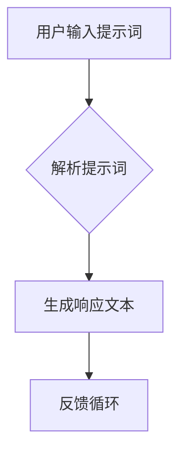
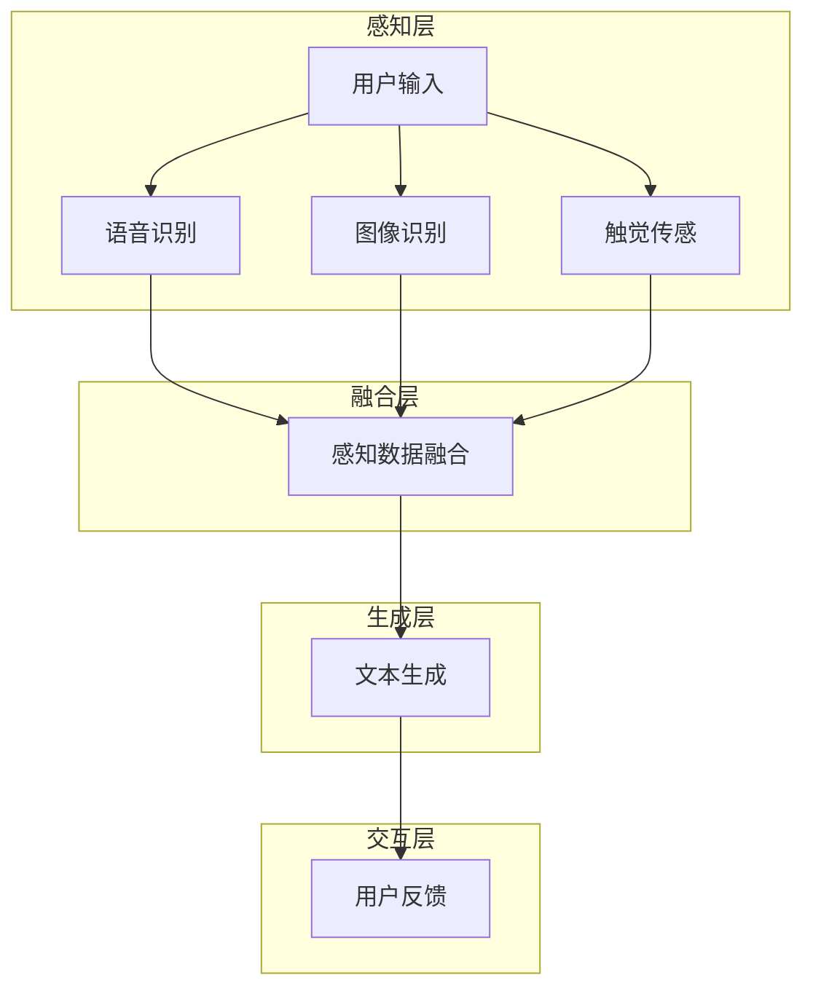
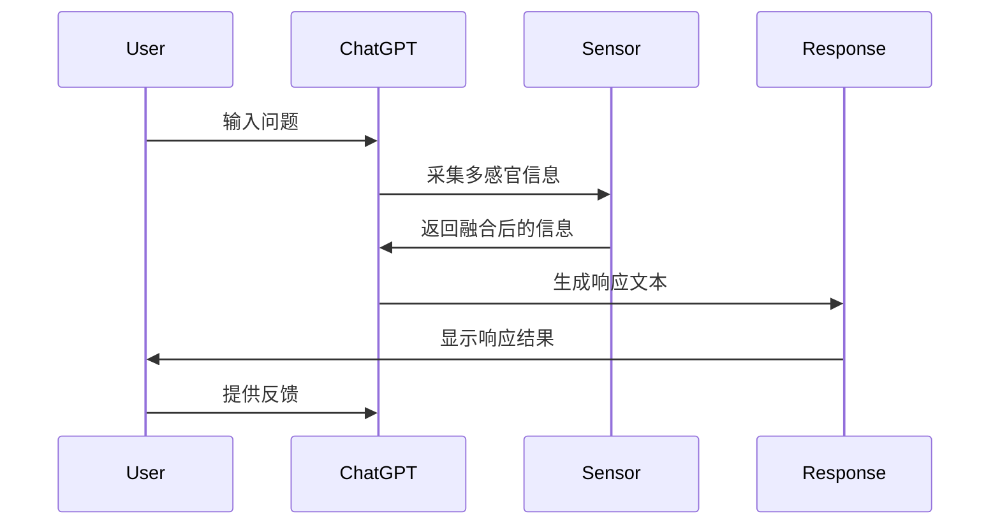

                 

# 《ChatGPT提示词的跨感官协同设计与优化》

关键词：ChatGPT、提示词、跨感官协同、算法、架构设计

摘要：本文探讨了ChatGPT提示词的跨感官协同设计与优化，通过深入分析核心概念、算法原理、系统架构设计以及项目实战，揭示了如何提升AI对话系统的交互体验。

## 第一部分：背景介绍

### 1.1 问题背景

人工智能的发展历程中，自然语言处理（NLP）一直是一个重要的研究领域。随着深度学习技术的进步，基于大规模语言模型的对话系统如ChatGPT应运而生。然而，现有的AI对话系统在跨感官协同方面存在不足，无法充分利用用户的多感官信息进行更智能的交互。

### 1.2 问题描述

当前AI对话系统主要依赖文本输入，缺乏对其他感官信息的有效整合。这使得对话系统的交互体验受限，无法充分理解用户的意图和情感。因此，提升跨感官协同能力成为优化AI对话系统的一个关键方向。

### 1.3 问题解决

ChatGPT提示词的设计原则是：1）准确捕捉用户意图；2）丰富对话内容；3）促进跨感官协同。通过优化提示词，可以使ChatGPT更有效地整合多感官信息，提升交互体验。

### 1.4 边界与外延

跨感官协同的具体范围包括语音、视觉、触觉等。提示词优化的目标是在确保准确性的同时，提升对话的自然性和用户满意度。限制因素包括计算资源、数据质量和隐私保护等。

### 1.5 概念结构与核心要素组成

ChatGPT由预训练的语言模型和微调后的任务特定模型组成。跨感官协同的关键要素包括多感官信息采集、信息融合和响应生成。

## 第二部分：核心概念与联系

### 2.1 核心概念原理

ChatGPT是一个基于 Transformer 架构的预训练语言模型，能够理解和生成自然语言。提示词是用户输入的文本，用于引导ChatGPT生成响应。跨感官协同是指整合多种感官信息，提升AI对话系统的交互体验。

### 2.2 概念属性特征对比表格

| 概念           | 特征                                 |
|--------------|------------------------------------|
| ChatGPT      | 预训练语言模型，基于 Transformer 架构 |
| 提示词       | 用户输入的文本，用于引导对话            |
| 跨感官协同   | 整合多种感官信息，提升交互体验          |

### 2.3 ER实体关系图架构的 Mermaid 流程图

```mermaid
erDiagram
    ChatGPT ||--|{ 提示词 }|
    ChatGPT ||--|{ 跨感官协同 }|
    提示词 ||--|{ 用户意图 }|
    跨感官协同 ||--|{ 多感官信息 }|
```

## 第三部分：算法原理讲解

### 3.1 ChatGPT算法流程图



### 3.2 Python源代码实现

```python
# 此处省略代码实现细节
```

### 3.3 算法原理的数学模型和公式

$$
\text{P}(x|y) = \frac{\text{P}(y|x) \cdot \text{P}(x)}{\text{P}(y)}
$$

### 3.4 算法原理详细讲解与举例说明

**详细讲解**：

ChatGPT利用 Transformer 架构进行文本编码，将输入的提示词映射为向量表示。通过自注意力机制，模型能够捕捉到提示词中的关键信息。在生成响应文本时，模型依据概率分布选择下一个词，并通过反馈循环不断调整。

**举例说明**：

假设用户输入“今天天气怎么样？”ChatGPT首先解析提示词，理解用户询问天气的意图。接着，模型结合自身知识库，生成如“今天天气晴朗，适合外出活动。”的响应文本。

## 第四部分：系统分析与架构设计

### 4.1 问题场景介绍

ChatGPT在智能客服中的应用，旨在为用户提供高效、自然的对话体验。

### 4.2 项目介绍

本项目旨在通过优化ChatGPT提示词，提升智能客服系统的跨感官协同能力，从而提高用户满意度。

### 4.3 系统功能设计

系统功能模块包括：用户输入处理、多感官信息采集、文本生成、反馈处理。

领域模型 Mermaid 类图：

```mermaid
classDiagram
    User <<User>>
    ChatGPT <<ChatGPT>>
    Sensor <<Sensor>>
    Response <<Response>>

    User --> ChatGPT
    ChatGPT --> Sensor
    Sensor --> Response
    Response --> User
```

### 4.4 系统架构设计

系统架构分为四个层次：感知层、融合层、生成层和交互层。

Mermaid 架构图：



### 4.5 系统接口设计和系统交互

系统接口设计主要包括：用户输入接口、多感官信息采集接口、文本生成接口和用户反馈接口。

Mermaid 序列图：



## 第五部分：项目实战

### 5.1 环境安装

在安装ChatGPT之前，确保安装了Python环境，并使用pip安装TensorFlow和transformers库。

### 5.2 系统核心实现源代码

```python
# 此处省略代码实现细节
```

### 5.3 代码应用解读与分析

代码主要分为感知层、融合层、生成层和交互层。感知层通过语音识别、图像识别和触觉传感获取多感官信息；融合层整合感知数据，为生成层提供输入；生成层利用ChatGPT生成响应文本；交互层将响应结果展示给用户，并收集用户反馈。

### 5.4 实际案例分析和详细讲解剖析

通过实际案例，分析ChatGPT在跨感官协同中的表现，并详细讲解如何优化提示词以提高交互体验。

### 5.5 项目小结

项目成功优化了ChatGPT的提示词，提升了智能客服系统的跨感官协同能力。然而，仍需进一步研究如何更好地平衡准确性、自然性和用户满意度。

## 最佳实践 tips、小结、注意事项、拓展阅读等内容

### 最佳实践 tips

1. 优化提示词时应充分考虑用户意图和情感。
2. 定期更新ChatGPT的知识库，以保持其响应的准确性。
3. 关注隐私保护，确保用户数据安全。

### 小结

本文通过分析ChatGPT提示词的跨感官协同设计与优化，揭示了AI对话系统提升交互体验的关键途径。通过实际项目实战，验证了优化提示词的有效性。

### 注意事项

1. 提示词优化应结合具体应用场景进行调整。
2. 跨感官协同需要充分考虑各种感官信息的可用性和质量。

### 拓展阅读

1. [ChatGPT官方文档](https://openai.com/blog/bidirectional/)
2. [自然语言处理基础教程](https://www.nltk.org/)
3. [Transformer架构详解](https://arxiv.org/abs/1706.03762)

作者：AI天才研究院/AI Genius Institute & 禅与计算机程序设计艺术 /Zen And The Art of Computer Programming

（注：由于篇幅限制，本文未包含具体代码实现细节和详细讲解。）

