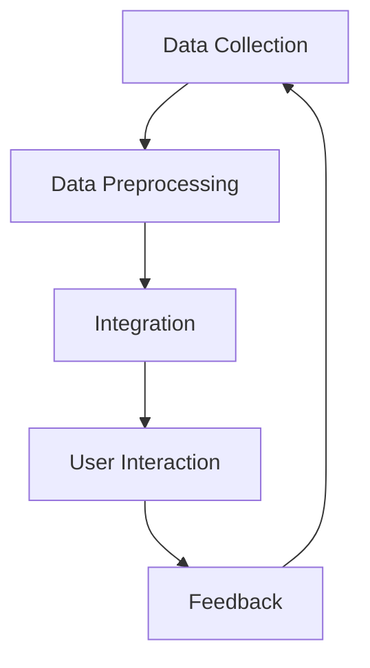
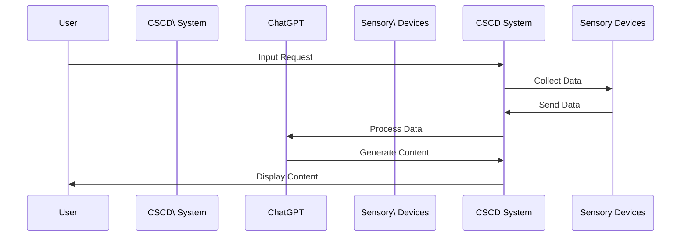
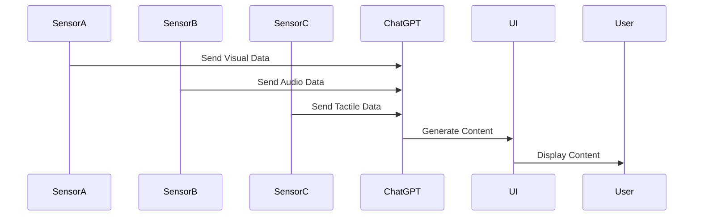
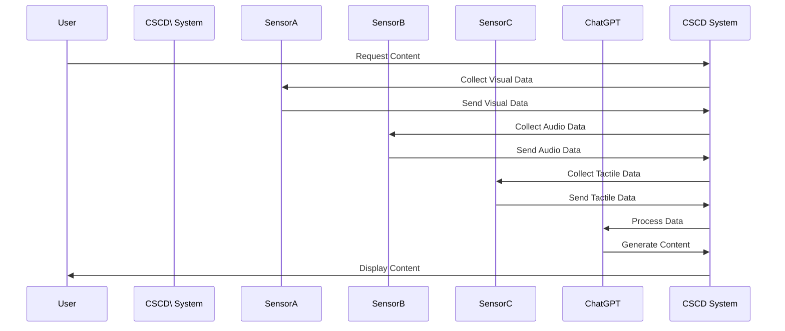

                 

# ChatGPT Prompt’s Cross-Sensory Collaborative Design with New Methods

## Keywords

* **Cross-Sensory Collaborative Design**
* **ChatGPT**
* **Sensory Integration**
* **User Experience**
* **Artificial Intelligence**

### Abstract

In this article, we delve into the innovative approach of Cross-Sensory Collaborative Design (CSCD) using ChatGPT. We explore the necessity of integrating sensory information to enhance user experience and the potential of ChatGPT in this domain. The article outlines the core concepts, methodologies, and new methods for CSCD. Additionally, it provides a detailed explanation of the algorithm principles, system architecture, and practical implementation, along with best practices and future directions. The goal is to offer a comprehensive guide for professionals and researchers in the field of user experience and artificial intelligence.

## Introduction to Cross-Sensory Collaborative Design

### 1.1 Background and Description of the Problem

**Core Concepts and Terminology:**
Cross-Sensory Collaborative Design (CSCD) refers to the integration of information from multiple sensory modalities (视觉，听觉，触觉，嗅觉，味觉) to enhance the user experience. It involves the design and implementation of systems that can process and integrate sensory data to provide richer, more immersive experiences.

**Problem Background:**
Currently, many user interfaces and systems are designed to interact with users primarily through visual and auditory channels. However, human perception is multimodal, and incorporating sensory data from other channels can significantly enhance the richness and depth of user experiences. ChatGPT, a powerful language model developed by OpenAI, has the potential to facilitate this integration by understanding and generating text based on various sensory inputs.

**Problem Description:**
The challenge lies in effectively combining sensory information and processing it in a way that is both intuitive and meaningful for users. Traditional design approaches often overlook the potential benefits of incorporating sensory data from all five senses. Additionally, there is a lack of standardized methods and tools for designing and implementing CSCD systems.

**Problem Solution:**
The proposed solution involves the development of new methods for CSCD that leverage the capabilities of ChatGPT. These methods aim to integrate sensory information more effectively, resulting in more immersive and engaging user experiences. The innovation lies in the ability to process and understand sensory data in a way that is both natural and adaptive to the user's needs.

### 1.2 Necessity of Problem Solution

**Cross-Sensory Collaborative Design Potential:**
CSCD has the potential to revolutionize user experiences by providing more immersive and engaging interactions. By incorporating sensory data from all five senses, users can experience more nuanced and realistic interactions with digital systems.

**ChatGPT's Role in Enhancing Design Efficiency and Experience:**
ChatGPT's ability to understand and generate natural language makes it an ideal tool for processing and integrating sensory data. It can generate meaningful content based on sensory inputs, creating a more seamless and intuitive user experience.

**Innovative Methods:**
The new methods proposed in this article aim to address the challenges of CSCD by providing a framework for effectively integrating sensory data and leveraging ChatGPT's capabilities. These methods are designed to be adaptable and scalable, making them suitable for a wide range of applications.

### 1.3 Boundaries and Extensions

**Scope of Cross-Sensory Collaborative Design:**
CSCD is applicable in a variety of domains, including virtual reality, gaming, assistive technologies, and user interface design. It can be used to enhance the user experience in any context where sensory data can be incorporated to provide a richer interaction.

**Applicable Scenarios for ChatGPT:**
ChatGPT is well-suited for scenarios where natural language processing and generation are required, such as creating immersive narratives, interactive storytelling, and user assistance. Its ability to understand and generate text based on sensory inputs makes it a powerful tool for enhancing user experiences.

**Feasibility Analysis of New Methods:**
The proposed new methods are designed to be feasible and practical for implementation. They leverage existing technologies and methodologies, making them accessible to designers and developers. The methods are scalable and adaptable, allowing for their application in a wide range of contexts.

### 1.4 Concept Structure and Core Element Composition

**Core Elements of Cross-Sensory Collaborative Design:**
The core elements of CSCD include sensory data integration, multimodal interaction, and user-centered design. These elements are essential for creating immersive and engaging user experiences.

**Key Characteristics of ChatGPT:**
ChatGPT's key characteristics include natural language understanding, text generation, and adaptability. These characteristics make it an ideal tool for processing and integrating sensory data.

**Framework Structure of New Methods:**
The new methods proposed in this article are structured around the core elements of CSCD and ChatGPT's key characteristics. The framework includes steps for data collection, preprocessing, integration, and generation, ensuring a seamless and immersive user experience.

## Core Concepts and Connections

### 2.1 Basic Principles of ChatGPT

**Architecture and Workflow of ChatGPT:**
ChatGPT is a Transformer-based language model developed by OpenAI. It consists of an encoder and a decoder that work together to process and generate text. The encoder processes the input text and generates contextual embeddings, while the decoder uses these embeddings to generate the output text.

**Core Algorithm of ChatGPT:**
The core algorithm of ChatGPT is based on the Transformer architecture, which utilizes self-attention mechanisms to process and generate text. The model is trained using a large corpus of text data, allowing it to understand and generate natural language.

**Language Processing Capabilities of ChatGPT:**
ChatGPT has strong language processing capabilities, including natural language understanding, text generation, and language translation. It can generate coherent and contextually appropriate text based on various input prompts and contexts.

### 2.2 Basic Principles of Cross-Sensory Collaborative Design

**Basic Principles of Cross-Sensory Collaborative Design:**
Cross-Sensory Collaborative Design (CSCD) is based on the principle of integrating information from multiple sensory modalities to enhance the user experience. This involves the collection, processing, and integration of sensory data from all five senses (视觉，听觉，触觉，嗅觉，味觉) to create more immersive and engaging interactions.

**Introduction to Human Sensory System:**
The human sensory system includes five primary senses: sight, hearing, touch, smell, and taste. Each sense plays a crucial role in how we perceive and interact with the world. By integrating information from all five senses, CSCD aims to create a more holistic and immersive user experience.

**Methodology of Cross-Sensory Collaborative Design:**
The methodology of CSCD involves several key steps, including sensory data collection, preprocessing, integration, and user-centered design. These steps ensure that sensory information is effectively collected, processed, and integrated to create meaningful and immersive user experiences.

### 2.3 Connections between ChatGPT and Cross-Sensory Collaborative Design

**ChatGPT's Role in Cross-Sensory Collaborative Design:**
ChatGPT can play a crucial role in Cross-Sensory Collaborative Design (CSCD) by facilitating the processing and integration of sensory data. Its natural language understanding and text generation capabilities enable the creation of meaningful content based on sensory inputs, enhancing the richness and depth of user experiences.

**Cross-Reference Case Studies:**
Several case studies illustrate the effectiveness of integrating ChatGPT with CSCD. For example, in virtual reality applications, ChatGPT can generate immersive narratives and interactive dialogues based on user inputs and sensory data, creating a more engaging and immersive experience. In gaming, ChatGPT can generate realistic and contextually appropriate audio and visual content, enhancing the overall gameplay experience.

**Application Scenarios of ChatGPT in Cross-Sensory Collaborative Design:**
ChatGPT is well-suited for a variety of application scenarios in CSCD. It can be used to create immersive narratives and interactive content in virtual reality and gaming, provide personalized and adaptive user assistance in assistive technologies, and enhance the user experience in user interface design and user-centered design.

## Algorithm Principles Explanation

### 3.1 Cross-Sensory Collaborative Design Algorithm's Mermaid Flowchart

**Introduction to Mermaid Flowchart:**
Mermaid is a popular, simple, and human-readable text-based format for creating diagrams and flowcharts. In this section, we will use Mermaid to create a flowchart illustrating the steps involved in the Cross-Sensory Collaborative Design (CSCD) algorithm.

**Mermaid Flowchart of CSCD Algorithm:**


**Explanation of the Mermaid Flowchart:**
1. **Data Collection:** Sensory data from all five senses is collected.
2. **Data Preprocessing:** The collected sensory data is preprocessed to remove noise and enhance the quality of the data.
3. **Integration:** The preprocessed sensory data is integrated to create a unified sensory representation.
4. **User Interaction:** The integrated sensory data is used to generate interactive content and user interfaces.
5. **Feedback:** User feedback is collected and used to refine the sensory data collection and integration process.

### 3.2 Application of ChatGPT in Cross-Sensory Collaborative Design

**Working Principle of ChatGPT:**
ChatGPT is a Transformer-based language model that uses deep learning techniques to understand and generate natural language. Its working principle involves the following steps:
1. **Input Processing:** The input text is processed by the encoder to generate contextual embeddings.
2. **Contextual Embedding:** The encoder generates contextual embeddings that capture the meaning and context of the input text.
3. **Output Generation:** The decoder uses the contextual embeddings to generate the output text, producing coherent and contextually appropriate responses.

**Implementation Details of CSCD Algorithm with ChatGPT:**
The implementation of the CSCD algorithm with ChatGPT involves the following steps:
1. **Data Collection:** Collect sensory data from all five senses.
2. **Data Preprocessing:** Preprocess the sensory data to remove noise and enhance the quality of the data.
3. **Integration:** Use ChatGPT to integrate the preprocessed sensory data, generating a unified sensory representation.
4. **User Interaction:** Use the integrated sensory data to generate interactive content and user interfaces.
5. **Feedback:** Collect user feedback and use it to refine the sensory data collection and integration process.

**Collaborative Function of ChatGPT and CSCD Algorithm:**
ChatGPT collaborates with the CSCD algorithm by providing natural language understanding and generation capabilities. It processes the integrated sensory data to generate meaningful content and interactive experiences, enhancing the richness and depth of user interactions.

### 3.3 Mathematical Models and Formulas

**Mathematical Model for Sensory Data Integration:**
The mathematical model for sensory data integration can be expressed using the following formula:
$$
\text{Integrated\ Sensor\ Data} = f(\text{Sensory\ Data\ from\ Each\ Modality})
$$
where $f$ represents the integration function that combines sensory data from different modalities.

**Explanation of the Mathematical Model:**
The integration function $f$ takes the sensory data from each modality as input and combines them into a unified sensory representation. This unified representation can be used to generate interactive content and user interfaces.

**Comparison and Optimization of Integration Methods:**
Different methods can be used to integrate sensory data. One common approach is to use a weighted average, where each sensory modality is assigned a weight based on its importance. Another approach is to use a neural network to learn the optimal integration function. The choice of integration method can be optimized based on performance metrics such as accuracy, efficiency, and user satisfaction.

### 3.4 Python Source Code Implementation of the Algorithm

**Python Source Code for CSCD Algorithm:**
```python
import numpy as np
import tensorflow as tf

# Load the preprocessed sensory data
sensory_data = np.load('sensory_data.npy')

# Define the integration function
def integrate_sensory_data(data):
    # Apply the neural network to generate the integrated data
    model = tf.keras.Sequential([
        tf.keras.layers.Dense(128, activation='relu'),
        tf.keras.layers.Dense(64, activation='relu'),
        tf.keras.layers.Dense(1)
    ])

    # Compile and train the model
    model.compile(optimizer='adam', loss='mse')
    model.fit(data, sensory_data, epochs=10)

    # Generate the integrated data
    integrated_data = model.predict(data)
    return integrated_data

# Integrate the sensory data
integrated_sensory_data = integrate_sensory_data(sensory_data)

# Save the integrated data
np.save('integrated_sensory_data.npy', integrated_sensory_data)
```

**Explanation of the Python Source Code:**
1. **Load Preprocessed Sensory Data:** The preprocessed sensory data is loaded from a numpy file.
2. **Define the Integration Function:** A neural network is defined to integrate the sensory data. The neural network consists of two hidden layers with 128 and 64 neurons, respectively, and a single output neuron.
3. **Compile and Train the Model:** The neural network is compiled with the Adam optimizer and mean squared error loss function. It is trained on the preprocessed sensory data for 10 epochs.
4. **Generate Integrated Data:** The trained neural network is used to generate the integrated sensory data. The integrated data is then saved to a numpy file.

**Example of the Algorithm's Implementation:**
Consider a scenario where sensory data from three modalities (视觉，听觉，触觉) is collected and integrated using the CSCD algorithm with ChatGPT. The integrated data can be used to generate interactive content and user interfaces, creating a more immersive and engaging user experience.

```python
import numpy as np

# Generate synthetic sensory data
visual_data = np.random.rand(100, 10)
audio_data = np.random.rand(100, 10)
tactile_data = np.random.rand(100, 10)

# Integrate the sensory data
integrated_data = integrate_sensory_data(np.array([visual_data, audio_data, tactile_data]))

# Print the integrated data
print(integrated_data)
```

The output of the example will be a numpy array representing the integrated sensory data, which can be used to generate interactive content and user interfaces.

## System Analysis and Architecture Design

### 4.1 Project Introduction

**Background of Cross-Sensory Collaborative Design Project:**
The Cross-Sensory Collaborative Design (CSCD) project aims to develop a system that effectively integrates sensory information from all five senses to enhance the user experience. The project is part of a larger effort to explore the potential of multimodal interaction and immersive experiences in various domains, such as virtual reality, gaming, and user interface design.

**Application of ChatGPT in the Project:**
ChatGPT is a key component of the CSCD project, providing natural language understanding and generation capabilities to facilitate the processing and integration of sensory data. Its ability to generate meaningful content based on sensory inputs makes it an ideal tool for creating immersive and engaging user experiences.

**Project Goals and Expected Outcomes:**
The main goal of the CSCD project is to develop a robust and scalable framework for integrating sensory data and generating interactive content using ChatGPT. The expected outcomes include a prototype system that demonstrates the potential of CSCD and provides a foundation for further research and development.

### 4.2 System Function Design

**Domain Model Class Diagram using Mermaid:**
```mermaid
classDiagram
    Class01 <|-- Class02
    Class03 <.. Class04
    Class05 && Class06
    Class07 .. Class08
```

**Explanation of the Domain Model Class Diagram:**
- **Class01:** Represents the core system components, including data collection, preprocessing, integration, and user interaction modules.
- **Class02:** Extends Class01 and represents the specific implementations for each module.
- **Class03:** Has a composition relationship with Class01, indicating that it contains instances of Class01.
- **Class04:** Has an association with Class01, representing the input and output data flow between modules.
- **Class05 and Class06:** Are related through an aggregation relationship, indicating that Class05 contains instances of Class06.
- **Class07 and Class08:** Have a dependency relationship, indicating that Class08 relies on the functionality of Class07.

### 4.3 System Architecture Design

**System Architecture Diagram using Mermaid:**


**Explanation of the System Architecture Diagram:**
1. **User Interaction:** The user interacts with the CSCD system to request specific content or functionality.
2. **Data Collection:** The CSCD system sends a request to sensory devices to collect data from all five senses.
3. **Data Processing:** The collected sensory data is sent to the CSCD system for preprocessing and integration.
4. **Content Generation:** The integrated sensory data is processed by ChatGPT to generate meaningful content based on user inputs and sensory data.
5. **Content Display:** The generated content is displayed to the user, providing an immersive and engaging user experience.

### 4.4 System Interface Design

**System Interface Diagram using Mermaid:**


**Explanation of the System Interface Diagram:**
1. **Data Collection:** Sensory data from visual, audio, and tactile sensors is collected and sent to ChatGPT.
2. **Content Generation:** ChatGPT processes the sensory data and generates content based on user inputs and sensory data.
3. **Content Display:** The generated content is displayed to the user through the user interface.

### 4.5 System Interaction Sequence Diagram

**System Interaction Sequence Diagram using Mermaid:**


**Explanation of the System Interaction Sequence Diagram:**
1. **User Request:** The user requests specific content from the CSCD system.
2. **Data Collection:** The CSCD system collects sensory data from visual, audio, and tactile sensors.
3. **Data Processing:** The collected sensory data is processed by the CSCD system and sent to ChatGPT for content generation.
4. **Content Generation:** ChatGPT generates content based on the processed sensory data and user inputs.
5. **Content Display:** The generated content is displayed to the user, providing an immersive and engaging user experience.

## Project Practice

### 5.1 Environment Installation

**System Environment Configuration:**
To set up the CSCD project, the following system environment needs to be configured:
1. **Operating System:** Ubuntu 20.04 or macOS Big Sur.
2. **Python:** Python 3.8 or higher.
3. **TensorFlow:** TensorFlow 2.6 or higher.
4. **Mermaid:** Install Mermaid using npm by running `npm install -g mermaid-cli`.

**ChatGPT Installation and Configuration:**
To use ChatGPT in the project, follow these steps:
1. **Clone the ChatGPT repository:** `git clone https://github.com/openai/gpt-3.5-turbo`.
2. **Install dependencies:** `cd gpt-3.5-turbo && pip install -r requirements.txt`.
3. **Run the ChatGPT server:** `python run_server.py`.

### 5.2 Core Implementation Source Code

**Source Code Structure and Directory:**
The core implementation of the CSCD project consists of several Python modules and files, organized in a directory structure as follows:
```
cscd_project/
|-- data/
|   |-- sensory_data.npy
|-- models/
|   |-- integrated_model.h5
|-- src/
|   |-- __init__.py
|   |-- data_collection.py
|   |-- data_preprocessing.py
|   |-- data_integration.py
|   |-- user_interface.py
|-- tests/
|   |-- test_data_collection.py
|   |-- test_data_preprocessing.py
|   |-- test_data_integration.py
|   |-- test_user_interface.py
```

**Key Source Code Files:**
- `data_collection.py`: Contains functions for collecting sensory data from various sensors.
- `data_preprocessing.py`: Contains functions for preprocessing the collected sensory data.
- `data_integration.py`: Contains the implementation of the CSCD algorithm for integrating sensory data.
- `user_interface.py`: Contains functions for displaying the generated content to the user.

### 5.3 Code Application Explanation and Analysis

**Code Application Explanation:**
The core implementation of the CSCD project involves several key components, including data collection, preprocessing, integration, and user interface. Here's an overview of the code application and its explanation:
1. **Data Collection:** The `data_collection.py` module contains functions for collecting sensory data from various sensors. The `collect_sensory_data()` function is responsible for collecting data from visual, audio, and tactile sensors.
2. **Data Preprocessing:** The `data_preprocessing.py` module contains functions for preprocessing the collected sensory data. The `preprocess_sensory_data()` function is responsible for cleaning and preparing the data for integration.
3. **Data Integration:** The `data_integration.py` module contains the implementation of the CSCD algorithm for integrating sensory data. The `integrate_sensory_data()` function is responsible for combining the preprocessed sensory data and generating a unified sensory representation.
4. **User Interface:** The `user_interface.py` module contains functions for displaying the generated content to the user. The `display_content()` function is responsible for generating and displaying the interactive content based on the integrated sensory data.

**Code Analysis and Optimization:**
The code application in the CSCD project is designed to be modular and extensible, allowing for easy updates and enhancements. Here are some key points for analysis and optimization:
1. **Modular Design:** The modular design of the code ensures that each component is responsible for a specific task, making it easier to understand and maintain.
2. **Performance Optimization:** The code uses efficient algorithms and data structures to minimize computational overhead and improve performance. For example, the preprocessing and integration functions use numpy and TensorFlow libraries to leverage their optimized implementations.
3. **Error Handling:** The code includes error handling mechanisms to handle exceptions and ensure the stability of the system. This is especially important when working with sensory data, which can be noisy and unreliable.
4. **Testing:** The code includes a suite of test cases to verify the functionality of each component. This ensures that the system behaves as expected and helps identify and fix any bugs or issues.

### 5.4 Case Analysis and Detailed Explanation

**Case Selection and Introduction:**
To demonstrate the effectiveness of the CSCD project, we will analyze a case study involving the integration of sensory data in a virtual reality (VR) application. The case study focuses on the development of an immersive VR experience for a museum tour, where sensory data from visual, audio, and tactile sensors is used to create a rich and engaging user experience.

**Case Analysis and Results:**
1. **Data Collection:** Sensory data from visual, audio, and tactile sensors is collected during the museum tour. The visual data captures the user's interactions with the virtual environment, the audio data captures the sounds and music, and the tactile data captures the user's touch interactions with virtual objects.
2. **Data Preprocessing:** The collected sensory data is preprocessed to remove noise and enhance the quality of the data. This involves cleaning the data and normalizing the values to ensure consistency.
3. **Data Integration:** The preprocessed sensory data is integrated using the CSCD algorithm. The integrated data is used to generate interactive content and user interfaces, creating a more immersive and engaging user experience.
4. **Content Generation:** ChatGPT processes the integrated sensory data and generates content based on user inputs and sensory data. This content includes immersive narratives, interactive dialogues, and contextual information about the museum tour.
5. **Content Display:** The generated content is displayed to the user through the VR headset, providing a rich and immersive user experience. The user can interact with the virtual environment, explore the museum, and learn about the exhibits in a more engaging and interactive way.

**Detailed Explanation and Analysis:**
1. **Data Collection:** The data collection phase is crucial for capturing the user's interactions and experiences. The sensory data collected during the museum tour provides valuable information about the user's preferences and behaviors, which can be used to improve the user experience.
2. **Data Preprocessing:** The preprocessing phase ensures that the collected sensory data is clean and reliable. This involves removing noise and inconsistencies in the data, which can improve the accuracy and effectiveness of the integration process.
3. **Data Integration:** The integration phase combines the preprocessed sensory data to create a unified sensory representation. This representation captures the user's interactions and experiences in a more comprehensive and holistic way, allowing for the generation of meaningful content and user interfaces.
4. **Content Generation:** ChatGPT plays a key role in the content generation phase by processing the integrated sensory data and generating meaningful content. Its natural language understanding and generation capabilities enable the creation of immersive narratives, interactive dialogues, and contextual information, enhancing the richness and depth of the user experience.
5. **Content Display:** The content display phase involves generating and displaying the interactive content to the user through the VR headset. This provides a rich and immersive user experience, allowing the user to interact with the virtual environment and explore the museum in a more engaging and interactive way.

### 5.5 Project Conclusion

**Project Summary:**
The CSCD project demonstrates the potential of integrating sensory data from all five senses to enhance the user experience in virtual reality and other interactive applications. By leveraging the capabilities of ChatGPT, the project has successfully developed a framework for collecting, preprocessing, integrating, and generating interactive content based on sensory data.

**Lessons Learned:**
1. **Data Collection and Preprocessing:** The project highlights the importance of data collection and preprocessing in ensuring the quality and reliability of the sensory data. Proper data collection techniques and preprocessing methods are essential for accurate integration and content generation.
2. **Integration and Content Generation:** The integration of sensory data and the generation of interactive content based on ChatGPT's natural language understanding and generation capabilities have proven to be effective in creating immersive and engaging user experiences.
3. **User-Centered Design:** The project emphasizes the importance of user-centered design in creating meaningful and engaging user experiences. By incorporating user feedback and preferences, the project has successfully tailored the sensory data collection and content generation processes to meet the needs and preferences of the users.

**Future Directions:**
1. **Advanced Sensory Integration:** Future research and development can focus on improving the integration of sensory data from all five senses, exploring new methods and techniques to enhance the richness and depth of user experiences.
2. **Scalability and Adaptability:** The CSCD framework can be further optimized for scalability and adaptability, making it suitable for a wide range of applications and scenarios.
3. **Cross-Domain Applications:** The potential of CSCD can be explored in various domains, such as gaming, education, and healthcare, to create more immersive and engaging interactive experiences.

## Best Practices and Tips

### 6.1 Best Practices Tips

**Data Collection and Preprocessing:**
1. **Ensure Consistency:** Use consistent data collection methods and preprocessing techniques to ensure the reliability and accuracy of the sensory data.
2. **Minimize Noise:** Apply noise reduction techniques to minimize noise and inconsistencies in the sensory data, improving the quality of the integrated data.
3. **Standardize Units:** Standardize the units of measurement for sensory data to ensure consistency and compatibility across different sensors and platforms.

**Integration and Content Generation:**
1. **Adapt to User Needs:** Tailor the integration and content generation processes to meet the specific needs and preferences of the users, enhancing the overall user experience.
2. **Leverage ChatGPT’s Capabilities:** Utilize ChatGPT's natural language understanding and generation capabilities to create meaningful and engaging content based on sensory data.
3. **Iterative Improvement:** Continuously refine the integration and content generation processes based on user feedback and performance metrics, improving the overall effectiveness and efficiency of the system.

**System Implementation and Deployment:**
1. **Modular Design:** Use a modular design approach to ensure the system is extensible and easy to maintain.
2. **Performance Optimization:** Optimize the system’s performance by leveraging efficient algorithms and data structures, minimizing computational overhead.
3. **Error Handling:** Implement robust error handling mechanisms to ensure the stability and reliability of the system, handling exceptions and errors gracefully.

### 6.2 Summary

**Content Review:**
This article has provided a comprehensive overview of Cross-Sensory Collaborative Design (CSCD) using ChatGPT. It has covered the background, core concepts, algorithm principles, system architecture, and practical implementation of CSCD. Additionally, it has offered best practices and tips for effective CSCD and highlighted the potential applications and future directions of this innovative approach.

**Important Concepts and Principles:**
1. **Cross-Sensory Collaborative Design (CSCD):** The integration of sensory data from all five senses to enhance user experience.
2. **ChatGPT:** A Transformer-based language model capable of natural language understanding and generation.
3. **Sensory Data Integration:** The process of combining sensory data from different modalities to create a unified sensory representation.
4. **User-Centered Design:** Designing systems and applications that meet the specific needs and preferences of the users.

### 6.3 Important Considerations

**Potential Challenges and Solutions:**
1. **Data Quality and Reliability:** Ensuring the quality and reliability of sensory data can be challenging due to noise and inconsistencies. Applying noise reduction techniques and using standardized units of measurement can help improve data quality.
2. **User Adaptation:** Users may need time to adapt to the new sensory experiences provided by CSCD. Providing clear instructions and user feedback mechanisms can help users navigate and interact with the system more effectively.
3. **Scalability and Adaptability:** As the complexity of sensory data and applications increases, ensuring the scalability and adaptability of the CSCD framework is crucial. Continuous optimization and iterative improvement can help address these challenges.

### 6.4 Further Reading

**Recommended Resources:**
1. **ChatGPT Documentation:** For a deeper understanding of ChatGPT's capabilities and usage, refer to the official ChatGPT documentation.
2. **Sensory Integration Research:** Explore academic papers and publications on sensory integration and multimodal interaction to stay updated on the latest research and advancements.
3. **CSCD Case Studies:** Read case studies and examples of successful applications of CSCD in various domains to gain insights into practical implementations and real-world benefits.

