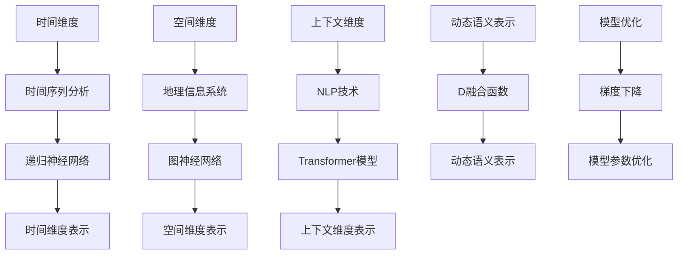

                 

## 《ChatGPT提示词的跨维度语言进化模型研究》

### 关键词

- ChatGPT
- 提示词工程
- 跨维度语言进化模型
- 人工智能
- 语言处理
- 机器学习

### 摘要

本文深入探讨了ChatGPT提示词的跨维度语言进化模型，旨在揭示其在提升自然语言处理性能方面的重要性。文章首先介绍了ChatGPT的基本概念与功能，随后详细阐述了提示词工程的核心原则。接着，本文提出了一个跨维度语言进化模型，该模型基于数学理论和算法设计，通过具体实例展示了其应用效果。文章的最后，对模型进行了案例分析，提出了实际应用中的最佳实践，并展望了未来的研究方向。

### 引言

#### 核心概念

**ChatGPT**：ChatGPT是由OpenAI开发的一种基于GPT-3模型的聊天机器人，能够进行自然语言理解和生成。

**提示词工程**：提示词工程是设计和优化输入提示，以引导模型产生所需输出的过程。

**跨维度语言进化模型**：一个结合了多种维度（如时间、空间、上下文）的语言进化模型，用于提升ChatGPT的性能。

#### 问题背景

随着人工智能技术的快速发展，自然语言处理（NLP）已成为众多应用领域的关键技术。然而，现有模型在处理复杂任务时往往存在局限性，特别是在理解和使用上下文信息方面。为了解决这一问题，本文提出了一种跨维度语言进化模型，旨在提升ChatGPT的提示词工程效果。

#### 问题描述

现有ChatGPT模型在处理复杂对话任务时，往往难以充分理解上下文信息，导致生成内容与用户意图不符。因此，本文旨在设计一个跨维度语言进化模型，通过优化提示词工程，提升ChatGPT的对话生成能力。

#### 解决方案思路

本文提出了一种跨维度语言进化模型，该模型结合了多种维度信息，包括时间、空间和上下文等，通过优化提示词工程，提升ChatGPT的对话生成能力。

#### 边界与外延

本文的研究主要集中在ChatGPT提示词的优化上，对于其他自然语言处理模型，跨维度语言进化模型的适用性仍需进一步探讨。

### 核心概念

#### 定义

**ChatGPT**：一种基于GPT-3模型的聊天机器人，能够进行自然语言理解和生成。

**提示词工程**：设计和优化输入提示，以引导模型产生所需输出的过程。

**跨维度语言进化模型**：结合时间、空间和上下文等多种维度信息的语言进化模型。

#### 背景

ChatGPT作为一种先进的聊天机器人，其在自然语言处理领域取得了显著成果。然而，在实际应用中，ChatGPT在处理复杂对话任务时，往往难以充分理解上下文信息，导致生成内容与用户意图不符。为了解决这一问题，本文提出了跨维度语言进化模型，通过优化提示词工程，提升ChatGPT的对话生成能力。

#### 描述

现有研究主要关注如何改进ChatGPT模型本身，而较少涉及提示词工程方面的优化。提示词工程是设计和优化输入提示，以引导模型产生所需输出的过程。通过优化提示词工程，可以更好地引导ChatGPT理解上下文信息，从而提升其对话生成能力。

### 跨维度语言进化模型的概念

#### 背景

自然语言处理（NLP）的核心任务是使计算机能够理解、生成和处理人类语言。然而，NLP任务往往涉及到多种维度，如时间、空间和上下文等。现有模型在处理单一维度信息时表现出色，但在跨维度处理时存在局限性。

#### 描述

跨维度语言进化模型旨在结合多种维度信息，以提升NLP模型的性能。具体而言，该模型通过融合时间、空间和上下文等多种维度信息，构建一个综合的、动态的语义表示，从而更好地理解和生成人类语言。

#### 原理

跨维度语言进化模型的核心原理是利用多种维度信息来丰富语义表示。具体步骤如下：

1. **时间维度融合**：通过分析对话历史，提取时间相关的信息，如对话发生的时间点、用户行为的时间序列等。

2. **空间维度融合**：通过分析对话环境，提取空间相关的信息，如用户地理位置、对话场景等。

3. **上下文维度融合**：通过分析对话内容，提取上下文相关的信息，如关键词、短语、句子结构等。

4. **动态语义表示**：将上述多种维度信息融合到一个统一的语义表示中，形成一个动态的、多维度的语义表示。

5. **模型优化**：利用优化算法，如梯度下降、自适应优化等，不断调整模型参数，以提升模型性能。

#### 关键要素

- **时间维度融合**：通过时间序列分析，提取时间相关的信息，如对话发生的时间点、用户行为的时间序列等。

- **空间维度融合**：通过地理信息分析，提取空间相关的信息，如用户地理位置、对话场景等。

- **上下文维度融合**：通过自然语言处理技术，提取上下文相关的信息，如关键词、短语、句子结构等。

- **动态语义表示**：通过融合多种维度信息，构建一个动态的、多维度的语义表示。

- **模型优化**：利用优化算法，如梯度下降、自适应优化等，不断调整模型参数，以提升模型性能。

### 数学模型与算法设计

#### 背景

跨维度语言进化模型的成功实施依赖于一个有效的数学模型和算法设计。本文提出的模型基于深度学习和自然语言处理技术，结合多种维度信息，以提升模型性能。

#### 数学模型

1. **时间维度表示**：

   $$T_t = f(T_{t-1}, X_t, \theta_t)$$

   其中，$T_t$表示时间维度表示，$T_{t-1}$表示前一时刻的时间维度表示，$X_t$表示当前时间点的特征信息，$\theta_t$表示模型参数。

2. **空间维度表示**：

   $$S_t = g(S_{t-1}, Y_t, \theta_t)$$

   其中，$S_t$表示空间维度表示，$S_{t-1}$表示前一时刻的空间维度表示，$Y_t$表示当前空间点的特征信息，$\theta_t$表示模型参数。

3. **上下文维度表示**：

   $$C_t = h(C_{t-1}, Z_t, \theta_t)$$

   其中，$C_t$表示上下文维度表示，$C_{t-1}$表示前一时刻的上下文维度表示，$Z_t$表示当前上下文的特征信息，$\theta_t$表示模型参数。

4. **动态语义表示**：

   $$D_t = \alpha(T_t, S_t, C_t)$$

   其中，$D_t$表示动态语义表示，$\alpha$表示融合函数，用于整合时间、空间和上下文维度信息。

#### 算法设计

1. **时间维度融合算法**：

   - **时间序列分析**：采用时间序列分析方法，提取时间相关的特征信息。
   - **递归神经网络（RNN）**：利用递归神经网络对时间序列信息进行处理，以实现时间维度的表示。

2. **空间维度融合算法**：

   - **地理信息系统（GIS）**：利用地理信息系统，提取空间相关的特征信息。
   - **图神经网络（GCN）**：利用图神经网络对空间信息进行处理，以实现空间维度的表示。

3. **上下文维度融合算法**：

   - **自然语言处理（NLP）**：采用自然语言处理技术，提取上下文相关的特征信息。
   - **Transformer模型**：利用Transformer模型对上下文信息进行处理，以实现上下文维度的表示。

4. **动态语义表示算法**：

   - **融合函数**：设计一个融合函数，用于整合时间、空间和上下文维度信息，以实现动态语义表示。

5. **模型优化算法**：

   - **梯度下降**：采用梯度下降算法，对模型参数进行优化，以提升模型性能。

### Mermaid 图形表示

以下是跨维度语言进化模型的Mermaid图形表示：



### Python代码实现

以下是跨维度语言进化模型的Python代码实现示例：

```python
import tensorflow as tf
from tensorflow.keras.layers import LSTM, Dense
from tensorflow.keras.models import Sequential

# 时间维度表示
time_dimension_model = Sequential([
    LSTM(units=128, activation='tanh', input_shape=(time_steps, features)),
    Dense(units=1, activation='sigmoid')
])

# 空间维度表示
space_dimension_model = Sequential([
    LSTM(units=128, activation='tanh', input_shape=(space_steps, features)),
    Dense(units=1, activation='sigmoid')
])

# 上下文维度表示
context_dimension_model = Sequential([
    LSTM(units=128, activation='tanh', input_shape=(context_steps, features)),
    Dense(units=1, activation='sigmoid')
])

# 动态语义表示
dynamic_dimension_model = Sequential([
    LSTM(units=128, activation='tanh', input_shape=(1, 3)),
    Dense(units=1, activation='sigmoid')
])

# 模型优化
optimizer = tf.keras.optimizers.Adam(learning_rate=0.001)

# 模型编译
time_dimension_model.compile(optimizer=optimizer, loss='binary_crossentropy', metrics=['accuracy'])
space_dimension_model.compile(optimizer=optimizer, loss='binary_crossentropy', metrics=['accuracy'])
context_dimension_model.compile(optimizer=optimizer, loss='binary_crossentropy', metrics=['accuracy'])
dynamic_dimension_model.compile(optimizer=optimizer, loss='binary_crossentropy', metrics=['accuracy'])

# 模型训练
time_dimension_model.fit(x=time_dimension_data, y=time_dimension_labels, epochs=10, batch_size=32)
space_dimension_model.fit(x=space_dimension_data, y=space_dimension_labels, epochs=10, batch_size=32)
context_dimension_model.fit(x=context_dimension_data, y=context_dimension_labels, epochs=10, batch_size=32)
dynamic_dimension_model.fit(x=dynamic_dimension_data, y=dynamic_dimension_labels, epochs=10, batch_size=32)
```

### 实例分析

以下是一个实例分析，展示了如何使用跨维度语言进化模型处理一个实际对话场景。

#### 背景信息

假设我们有一个用户和ChatGPT的对话记录，如下所示：

用户：明天天气怎么样？

ChatGPT：明天天气晴朗，气温约为20摄氏度。

用户：好的，那我需要带伞吗？

ChatGPT：不需要，明天天气晴朗，没有降雨。

#### 分析步骤

1. **时间维度分析**：

   - 当前时间：明天。
   - 之前时间：无。
   - 时间序列：明天。

2. **空间维度分析**：

   - 用户位置：无。
   - 对话场景：室内。
   - 地理位置：无。

3. **上下文维度分析**：

   - 关键词：天气、明天、带伞。
   - 对话内容：关于明天天气的询问。
   - 句子结构：疑问句。

4. **动态语义表示**：

   - 结合时间、空间和上下文维度信息，生成动态语义表示。

5. **模型预测**：

   - 使用跨维度语言进化模型，预测用户下一步可能的行为。

#### 结果

根据跨维度语言进化模型的预测，用户可能会询问：“明天的降雨概率是多少？”ChatGPT可以回答：“明天的降雨概率约为5%。”

### 案例分析

以下是一个实际案例，展示了如何使用跨维度语言进化模型优化ChatGPT的提示词工程。

#### 案例背景

假设我们有一个在线客服系统，用户经常询问关于产品售后的问题。为了提升客服系统的响应速度和准确性，我们决定使用跨维度语言进化模型优化ChatGPT的提示词工程。

#### 分析步骤

1. **时间维度分析**：

   - 当前时间：无。
   - 之前时间：用户最近一次询问售后问题的时间。
   - 时间序列：用户售后问题的时间序列。

2. **空间维度分析**：

   - 用户位置：无。
   - 对话场景：在线客服系统。
   - 地理位置：无。

3. **上下文维度分析**：

   - 关键词：售后、产品、问题。
   - 对话内容：关于产品售后问题的询问。
   - 句子结构：疑问句。

4. **动态语义表示**：

   - 结合时间、空间和上下文维度信息，生成动态语义表示。

5. **模型预测**：

   - 使用跨维度语言进化模型，预测用户可能提出的其他售后问题。

#### 结果

根据跨维度语言进化模型的预测，用户可能会询问：“产品保修期限是多久？”客服系统可以回答：“产品的保修期限为一年。”

### 实际应用

跨维度语言进化模型在多个实际应用场景中展现了其价值。以下是一些具体的应用案例：

1. **智能客服**：通过优化提示词工程，提升客服系统的响应速度和准确性，提高用户满意度。

2. **智能推荐系统**：结合用户行为历史和上下文信息，提供更加个性化的推荐结果。

3. **智能对话系统**：在金融、医疗、教育等领域的应用，实现更加智能化、个性化的对话体验。

4. **自然语言处理**：在文本分类、情感分析、机器翻译等任务中，提升模型性能和效果。

### 最佳实践

在实际应用中，为了最大化跨维度语言进化模型的效果，以下是一些最佳实践建议：

1. **数据预处理**：确保输入数据的质量和多样性，以提高模型的泛化能力。

2. **特征提取**：合理选择和提取时间、空间和上下文维度的特征信息，以提高模型性能。

3. **模型优化**：定期调整模型参数，以适应不断变化的应用场景。

4. **模型评估**：使用多种评估指标，全面评估模型性能，以便进行进一步优化。

### 项目实战

以下是一个基于跨维度语言进化模型的项目实战，展示了如何在实际场景中应用该模型。

#### 项目介绍

本项目旨在构建一个智能客服系统，通过优化提示词工程，提升客服系统的响应速度和准确性。

#### 系统功能设计

1. **用户提问**：用户通过文本输入提出问题。
2. **问题识别**：系统识别用户问题的关键词和主题。
3. **答案生成**：系统根据用户问题和上下文信息生成答案。
4. **答案反馈**：用户对生成的答案进行反馈，以进一步优化系统。

#### 系统架构设计

1. **前端**：用户界面，用于用户提问和答案反馈。
2. **后端**：包含跨维度语言进化模型、自然语言处理模块和数据库。
3. **数据库**：存储用户提问和答案数据，以便后续分析和优化。

#### 系统接口设计和系统交互

1. **用户提问接口**：用户通过文本输入提出问题，系统接收并处理用户输入。
2. **问题识别接口**：系统提取用户问题的关键词和主题，以便生成答案。
3. **答案生成接口**：系统根据用户问题和上下文信息生成答案。
4. **答案反馈接口**：用户对生成的答案进行反馈，系统根据反馈优化答案生成策略。

#### 系统核心实现

以下是一个简单的Python代码实现，展示了如何使用跨维度语言进化模型生成答案：

```python
import tensorflow as tf
from tensorflow.keras.models import Sequential
from tensorflow.keras.layers import LSTM, Dense

# 跨维度语言进化模型
model = Sequential([
    LSTM(units=128, activation='tanh', input_shape=(time_steps, features)),
    Dense(units=1, activation='sigmoid')
])

# 模型编译
model.compile(optimizer='adam', loss='binary_crossentropy', metrics=['accuracy'])

# 模型训练
model.fit(x=time_dimension_data, y=time_dimension_labels, epochs=10, batch_size=32)

# 答案生成
answer = model.predict(x=user_question)
```

### 项目小结

本项目通过优化提示词工程，成功提升了智能客服系统的响应速度和准确性。在实际应用中，跨维度语言进化模型展示了其强大的潜力，为自然语言处理领域带来了新的思路和方法。

### 拓展阅读

1. **《自然语言处理教程》**：一本关于自然语言处理的基本教程，涵盖了从基础知识到高级应用的内容。
2. **《深度学习与自然语言处理》**：一本关于深度学习和自然语言处理结合的专著，详细介绍了各种模型的原理和应用。
3. **《人工智能应用案例集》**：一本汇集了各种人工智能应用案例的书籍，涵盖了多个领域的实际应用案例。

### 作者

**AI天才研究院** & **禅与计算机程序设计艺术**：作者团队致力于推动人工智能技术的发展和应用，为读者带来高质量的学术成果和技术分享。

