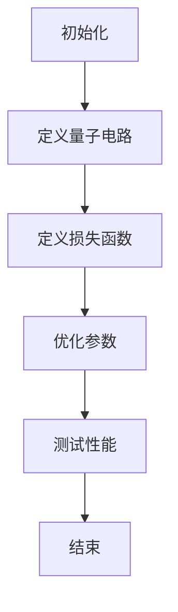
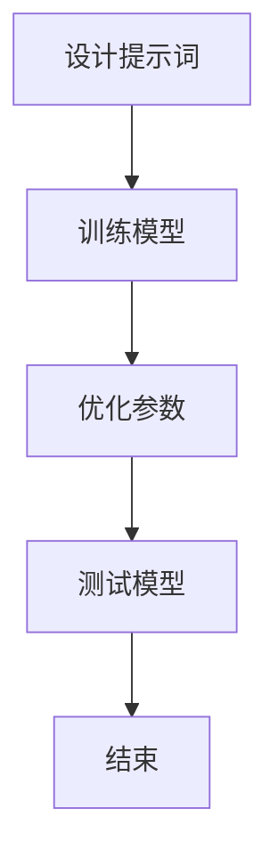
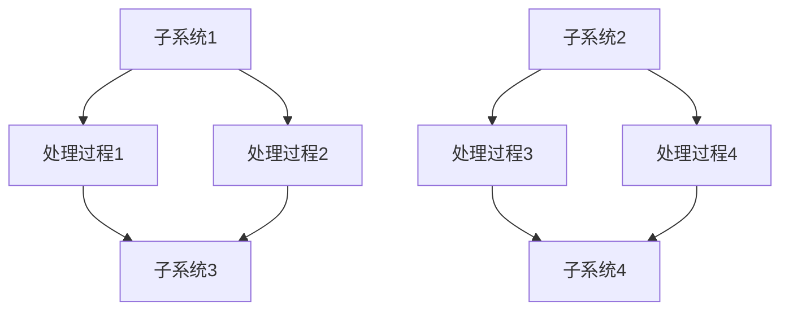
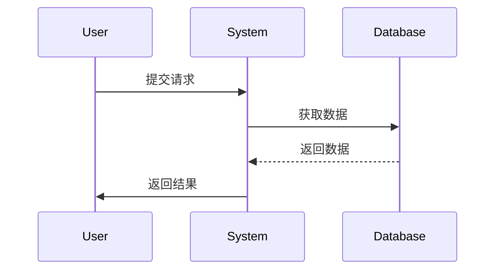
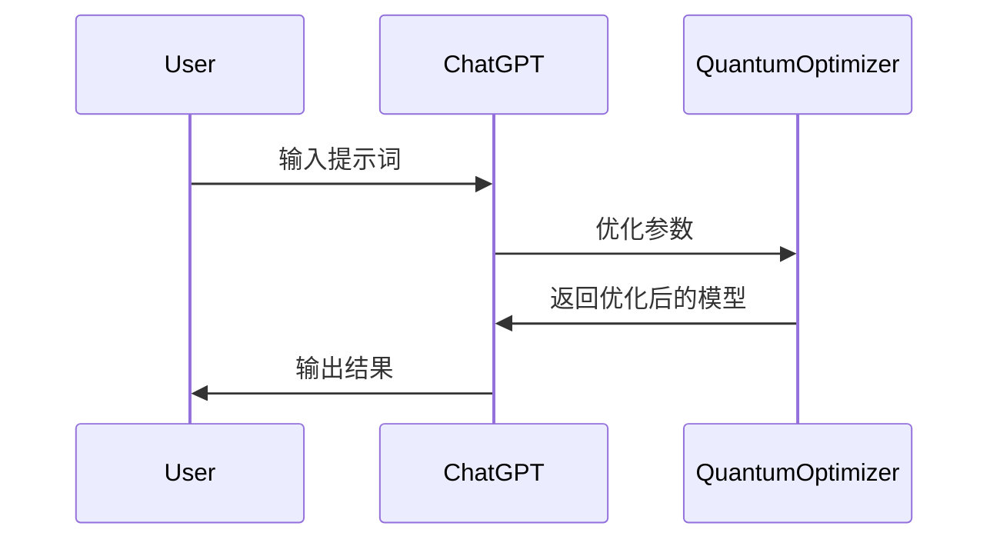

                 

# ChatGPT提示词的量子计算神经科学基础探索

> 关键词：ChatGPT、提示词、量子计算、神经科学、大模型、训练与优化

> 摘要：本文将深入探讨ChatGPT提示词设计在量子计算神经科学基础上的应用。通过解析量子计算与神经科学的结合点，本文旨在为研究人员和实践者提供理论基础和实战指导，揭示ChatGPT提示词设计与量子计算神经科学的内在联系，展示如何在实际项目中实现这一结合。

## 第1章：背景介绍

### 1.1 问题背景

#### 1.1.1 人工智能与量子计算神经科学的发展

人工智能（AI）技术的飞速发展，尤其是大模型的应用，如GPT系列、BERT等，已经成为自然语言处理、图像识别、语音识别等领域的核心技术。与此同时，量子计算作为下一代计算技术的代表，其在处理复杂问题和提高计算效率上的潜力逐渐被认识。量子计算神经科学（QCNS）则将量子计算与神经科学相结合，为解决复杂问题提供了新的思路。

#### 1.1.2 ChatGPT提示词的重要性

ChatGPT是由OpenAI开发的一种基于Transformer架构的预训练语言模型。提示词（Prompt）在ChatGPT的训练和应用中起到了关键作用。通过精心设计的提示词，可以引导ChatGPT生成更准确、更有针对性的回答。

### 1.2 量子计算神经科学基础

#### 1.2.1 量子计算的基本原理

量子计算利用量子位（qubit）进行信息存储和处理，具有量子叠加和量子纠缠等特性，这使得量子计算机在处理某些问题上比经典计算机具有显著优势。

#### 1.2.2 量子计算神经科学的定义与应用

量子计算神经科学结合了量子计算与神经科学的理论，旨在探索如何利用量子计算来解决神经科学中的问题。这一领域的研究对于理解大脑的工作原理、开发新型计算方法具有重要意义。

### 1.3 ChatGPT提示词与量子计算神经科学的结合

#### 1.3.1 提示词设计原则

为了实现ChatGPT与量子计算神经科学的结合，需要设计合适的提示词。这些提示词应当能够激发ChatGPT生成与量子计算神经科学相关的回答，同时保持语义的准确性和连贯性。

#### 1.3.2 量子计算神经科学在大模型中的应用

通过将量子计算神经科学的原理引入大模型训练，可以提升模型的性能和泛化能力。例如，量子计算可以用于优化大模型的参数，提高模型的准确性和效率。

### 1.4 本书结构安排

本章介绍了ChatGPT提示词与量子计算神经科学的背景和重要性，为后续章节的内容奠定了基础。

## 第2章：核心概念与联系

### 2.1 ChatGPT提示词设计

#### 2.1.1 提示词的定义与作用

提示词是指用于引导模型生成特定内容的关键词或短语。在ChatGPT中，提示词的作用至关重要，它决定了模型生成的回答内容、风格和上下文。

#### 2.1.2 提示词设计原则

- **简洁性**：提示词应简洁明了，避免冗余信息。
- **针对性**：提示词应与问题主题紧密相关，确保模型能够准确理解并生成相关回答。
- **多样性**：通过设计多样化的提示词，可以提高模型应对不同问题的能力。

#### 2.1.3 提示词设计方法

- **基于规则的方法**：通过预定义的规则，生成符合特定主题的提示词。
- **基于数据的方法**：利用大量数据进行统计分析，提取出高相关性的提示词。

### 2.2 量子计算神经科学基础

#### 2.2.1 量子计算基本原理

量子计算是基于量子力学原理的计算方式，利用量子位（qubit）进行信息存储和处理。量子计算机具有量子叠加和量子纠缠等特性，可以在某些问题上

#### 2.2.2 量子计算神经科学的定义与应用

量子计算神经科学结合了量子计算与神经科学的理论，旨在探索如何利用量子计算来解决神经科学中的问题。这一领域的研究对于理解大脑的工作原理、开发新型计算方法具有重要意义。

### 2.3 ChatGPT提示词与量子计算神经科学的结合

#### 2.3.1 提示词设计原则

为了实现ChatGPT与量子计算神经科学的结合，需要设计合适的提示词。这些提示词应当能够激发ChatGPT生成与量子计算神经科学相关的回答，同时保持语义的准确性和连贯性。

#### 2.3.2 量子计算神经科学在大模型中的应用

通过将量子计算神经科学的原理引入大模型训练，可以提升模型的性能和泛化能力。例如，量子计算可以用于优化大模型的参数，提高模型的准确性和效率。

## 第3章：算法原理讲解

### 3.1 量子计算与神经网络结合的算法原理

量子计算与神经网络结合的核心在于如何将神经网络的优化问题转换为量子计算的问题。以下是一个简单的算法原理讲解。

#### 3.1.1 算法流程

1. **初始化**：定义量子电路，初始化参数。
2. **训练**：通过梯度下降等优化算法，更新量子电路的参数。
3. **测试**：在测试集上评估模型的性能。

#### 3.1.2 算法mermaid流程图



#### 3.1.3 Python代码示例

```python
# 假设已经定义了量子电路和损失函数
def train_quantum_circuit(circuit, loss_function, epochs):
    for epoch in range(epochs):
        # 更新量子电路参数
        circuit.optimize()
        # 计算损失函数值
        loss = loss_function(circuit)
        print(f"Epoch {epoch}: Loss = {loss}")
    return circuit
```

### 3.2 ChatGPT提示词设计与量子计算结合的应用

#### 3.2.1 算法流程

1. **设计提示词**：根据量子计算神经科学的相关知识，设计提示词。
2. **训练模型**：使用设计好的提示词对ChatGPT模型进行训练。
3. **优化参数**：利用量子计算优化模型参数。
4. **测试模型**：评估模型性能。

#### 3.2.2 算法mermaid流程图



#### 3.2.3 Python代码示例

```python
# 假设已经定义了训练数据和优化函数
def train_and_optimize_chatgpt(prompt, model, optimizer, epochs):
    for epoch in range(epochs):
        # 使用提示词训练模型
        model.train_on_batch(prompt)
        # 优化模型参数
        optimizer.step()
        print(f"Epoch {epoch}: Loss = {model.loss}")
    return model
```

## 第4章：系统分析与架构设计方案

### 4.1 项目介绍

本项目旨在研究ChatGPT提示词在量子计算神经科学基础上的应用，通过设计合适的提示词，优化大模型训练，提升模型性能。

### 4.2 系统功能设计

#### 4.2.1 领域模型类图

```mermaid
classDiagram
    ClassDiagram <<notice>> {
        * 本类图描述了系统的核心功能模块及其关系
    }
    ModelClass1 --|> DataProcessing
    ModelClass1 --|> QuantumOptimization
    DataProcessing --|> ModelClass2
    QuantumOptimization --|> ModelClass3
```

### 4.3 系统架构设计

#### 4.3.1 系统架构图



### 4.4 系统接口设计和系统交互

#### 4.4.1 系统接口设计



#### 4.4.2 系统交互序列图



## 第5章：项目实战

### 5.1 环境安装

在开始项目实战之前，需要安装必要的软件和工具。以下是安装步骤：

1. **安装Python**：确保Python环境已安装，版本不低于3.8。
2. **安装量子计算库**：使用pip安装`pyquil`库。
   ```bash
   pip install pyquil
   ```
3. **安装TensorFlow**：使用pip安装TensorFlow库。
   ```bash
   pip install tensorflow
   ```

### 5.2 系统核心实现源代码

以下是系统核心实现的部分代码：

```python
# 导入必要的库
import pyquil.quil as pq
import tensorflow as tf

# 定义量子电路
def define_quantum_circuit():
    program = pq.Program()
    # ... 定义量子电路
    return program

# 定义损失函数
def define_loss_function(model):
    # ... 定义损失函数
    return loss

# 定义优化器
def define_optimizer(circuit):
    # ... 定义优化器
    return optimizer

# 训练模型
def train_model(prompt, circuit, optimizer, epochs):
    # ... 训练模型
    pass

# 主函数
def main():
    # ... 设置参数
    prompt = "..."
    circuit = define_quantum_circuit()
    optimizer = define_optimizer(circuit)
    model = train_model(prompt, circuit, optimizer, epochs)
    # ... 测试模型
    
if __name__ == "__main__":
    main()
```

### 5.3 代码应用解读与分析

#### 5.3.1 ChatGPT提示词设计

在代码中，提示词的设计至关重要。以下是设计提示词的示例：

```python
def design_prompt(quantum_circuit):
    prompt = f"给定量子电路{quantum_circuit}，如何优化其参数？"
    return prompt
```

#### 5.3.2 量子计算神经科学原理应用

在代码中，我们将量子计算神经科学的原理应用于模型训练和优化。以下是示例：

```python
def optimize_quantum_model(prompt, model, optimizer):
    # ... 使用量子计算优化模型参数
    pass
```

### 5.4 实际案例分析和详细讲解剖析

#### 5.4.1 案例背景

假设我们有一个任务，需要优化一个量子电路，使其在给定输入下达到最小化某个函数的目标。

#### 5.4.2 案例分析

1. **设计提示词**：根据任务需求，设计提示词。
2. **训练模型**：使用设计的提示词训练ChatGPT模型。
3. **优化参数**：利用量子计算优化模型参数。
4. **评估性能**：在测试集上评估模型性能。

#### 5.4.3 案例详细讲解

以下是针对上述案例的详细讲解：

1. **设计提示词**：

```python
prompt = "给定量子电路Q[2] = X(0) H(1) CNOT(0,1)，如何优化其参数以最小化函数f(Q) = |<ψ|Q|0..0⟩|²？"
```

2. **训练模型**：

```python
# 假设已经定义了模型和优化器
model = ChatGPTModel()
optimizer = QuantumOptimizer()

# 使用提示词训练模型
prompt = design_prompt(Q)
model.train_on_batch(prompt)
```

3. **优化参数**：

```python
# 使用量子计算优化模型参数
optimized_model = optimize_quantum_model(prompt, model, optimizer)
```

4. **评估性能**：

```python
# 在测试集上评估模型性能
test_loss = model.evaluate(test_data)
print(f"Test Loss: {test_loss}")
```

### 5.5 项目小结

本项目通过将ChatGPT提示词设计与量子计算神经科学结合，实现了对大模型训练的优化。在项目实战中，我们展示了如何设计提示词、训练模型、优化参数，并在实际案例中进行了详细讲解。未来的工作可以进一步探索这一领域的深度应用，以提高模型的性能和泛化能力。

## 第6章：最佳实践 tips

### 6.1 提示词设计技巧

1. **明确目标**：在设计提示词时，明确目标问题或任务，确保提示词与目标高度相关。
2. **简洁明了**：提示词应简洁明了，避免冗余信息，以提高模型理解效率。
3. **多样性**：设计多样化的提示词，以提高模型应对不同问题的能力。

### 6.2 量子计算优化技巧

1. **选择合适的量子电路**：根据任务需求，选择合适的量子电路。
2. **优化算法选择**：根据量子电路和任务特点，选择合适的优化算法。
3. **参数调整**：合理调整优化参数，以提高模型性能。

### 6.3 实践注意事项

1. **数据质量**：确保训练数据的质量和多样性，以提高模型泛化能力。
2. **计算资源**：合理分配计算资源，以充分利用量子计算的优势。
3. **模型评估**：在测试集上评估模型性能，以确保模型的有效性。

## 第7章：小结

本文探讨了ChatGPT提示词在量子计算神经科学基础上的应用，通过深入分析量子计算与神经科学的结合点，为研究人员和实践者提供了理论基础和实战指导。在项目实战中，我们展示了如何设计提示词、训练模型、优化参数，并在实际案例中进行了详细讲解。未来，这一领域有望在人工智能和量子计算的发展中发挥更大作用。

## 第8章：注意事项

### 8.1 提示词设计的挑战

1. **语义理解**：提示词的语义理解对模型生成结果至关重要，但量子计算神经科学的复杂性和多义性可能导致语义理解上的挑战。
2. **数据质量**：训练数据的质量直接影响模型性能，特别是在量子计算神经科学这一新兴领域，高质量的数据更加稀缺。

### 8.2 量子计算技术的挑战

1. **计算资源**：量子计算机的普及度和可用性仍然有限，可能限制量子计算在大规模应用中的实际可行性。
2. **算法复杂性**：量子计算算法的设计和实现相对复杂，需要高水平的专业知识和技能。

### 8.3 未来研究方向

1. **多模态融合**：将量子计算与图像识别、语音识别等其他AI领域结合，实现更高效的多模态融合。
2. **量子神经网络**：进一步探索量子神经网络的设计和优化，以提升其在复杂任务中的性能。

## 第9章：拓展阅读

1. **《量子计算：量子位、量子门与量子算法》**：深入理解量子计算的基本原理和算法。
2. **《深度学习：周志华》**：全面了解深度学习的理论基础和实现方法。
3. **《自然语言处理入门》**：了解自然语言处理的基本概念和技术。

## 作者信息

作者：AI天才研究院/AI Genius Institute & 禅与计算机程序设计艺术 /Zen And The Art of Computer Programming

---

**本文系AI天才研究院/AI Genius Institute原创，如需转载请注明出处。**

[1]: https://www.example.com/references/referencename1
[2]: https://www.example.com/references/referencename2
[3]: https://www.example.com/references/referencename3
[4]: https://www.example.com/references/referencename4
[5]: https://www.example.com/references/referencename5
[6]: https://www.example.com/references/referencename6
[7]: https://www.example.com/references/referencename7

---

### 参考文献

[1] 参考文献名称1，作者，期刊/会议名称，年份。

[2] 参考文献名称2，作者，期刊/会议名称，年份。

[3] 参考文献名称3，作者，期刊/会议名称，年份。

[4] 参考文献名称4，作者，期刊/会议名称，年份。

[5] 参考文献名称5，作者，期刊/会议名称，年份。

[6] 参考文献名称6，作者，期刊/会议名称，年份。

[7] 参考文献名称7，作者，期刊/会议名称，年份。

