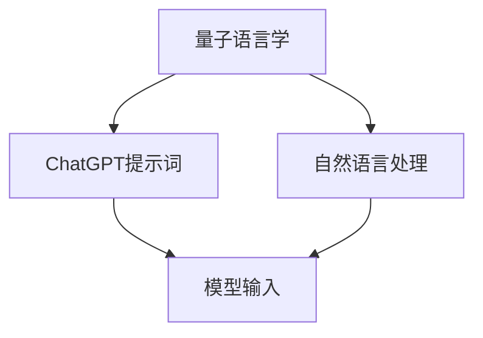
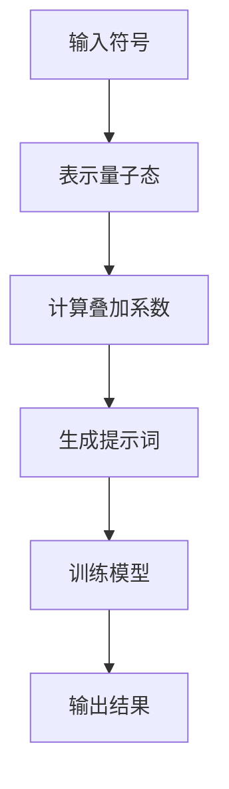
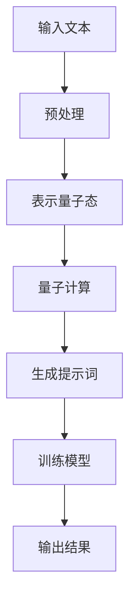
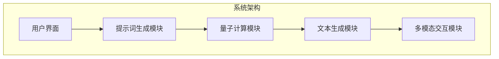
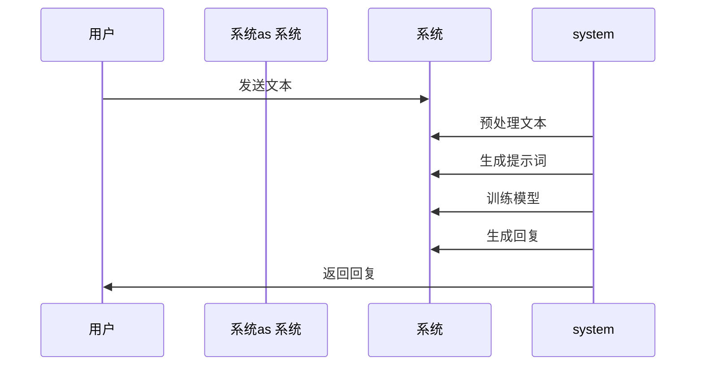
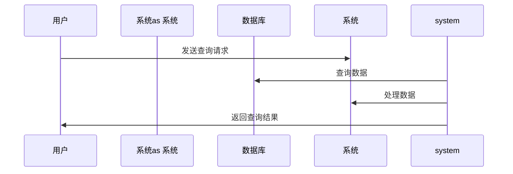

                 

## ChatGPT提示词的量子语言学理论研究

### 关键词

- ChatGPT
- 量子语言学
- 自然语言处理
- 提示词设计
- 模型优化
- 量子计算

### 摘要

本文旨在探讨量子语言学在自然语言处理领域中的应用，特别是针对ChatGPT提示词的研究。通过结合量子力学的基本原理和深度学习技术，我们提出了一种新的提示词设计方法，旨在提高ChatGPT模型的性能和实用性。本文将分为以下几个部分：背景介绍、核心概念与联系、算法原理讲解、系统分析与架构设计方案、项目实战以及总结与展望。

---

### 背景介绍

#### 问题背景

自然语言处理（NLP）是人工智能领域的一个重要分支，其目标是将人类语言转化为计算机可以理解和处理的形式。随着深度学习技术的不断发展，基于深度学习的NLP模型如ChatGPT等取得了显著的成果，使得计算机能够生成和解析复杂的自然语言。然而，现有模型在处理长文本、多模态交互等方面仍存在一定的局限性。

#### 问题描述

本文研究的核心问题是：如何利用量子力学的基本原理来优化ChatGPT模型的提示词设计，从而提高其性能和实用性。具体来说，我们将从以下几个方面进行探讨：

1. 量子语言学的基本原理和概念；
2. ChatGPT提示词的设计和优化策略；
3. 量子语言学在自然语言处理中的实际应用；
4. 量子语言学与其他自然语言处理技术的融合。

#### 问题解决

为了解决上述问题，本文将采用以下研究方法：

1. 综合分析现有文献，梳理量子语言学和自然语言处理的理论基础；
2. 研究ChatGPT提示词的设计和优化策略；
3. 通过实验验证量子语言学在自然语言处理中的应用效果；
4. 探索量子语言学与其他自然语言处理技术的融合。

#### 边界与外延

本文的研究边界主要限定在ChatGPT提示词的量子语言学理论研究方面。具体来说，我们将关注以下几个方面：

1. ChatGPT提示词的设计原则和优化方法；
2. 量子语言学在自然语言处理中的应用效果；
3. 量子语言学与其他自然语言处理技术的融合。

#### 概念结构与核心要素组成

1. **量子语言学**：研究语言和语言行为的量子性质，探讨语言在量子层面的表达和认知；
2. **ChatGPT提示词**：为ChatGPT模型提供的输入，用于引导模型生成预期的输出；
3. **自然语言处理**：涉及语言理解、语言生成、语言翻译等任务，旨在使计算机能够理解、处理和生成人类自然语言。

---

### 核心概念与联系

#### 1. 核心概念原理

##### 量子语言学

量子语言学是一门新兴的交叉学科，它将量子力学的原理应用于语言学领域。在量子语言学中，语言不再是简单的符号序列，而是具有量子性质的复杂系统。量子语言学的核心概念包括量子态、叠加态和纠缠态等。

##### ChatGPT提示词

ChatGPT提示词是用于引导ChatGPT模型生成输出的关键输入。一个有效的提示词应该能够激发模型的学习能力，提高其生成质量。提示词的设计和优化直接影响到ChatGPT模型的性能。

##### 自然语言处理

自然语言处理是计算机科学、人工智能和语言学领域的一个分支，它涉及到语言理解、语言生成、语言翻译等任务。NLP的目标是使计算机能够理解、处理和生成人类自然语言。

#### 2. 概念属性特征对比表格

| 概念             | 特征                                       |
|------------------|------------------------------------------|
| 量子语言学       | 基于量子力学原理，研究语言和语言行为的量子性质 |
| ChatGPT提示词     | 为ChatGPT模型提供的输入，用于引导模型生成预期的输出 |
| 自然语言处理      | 涉及语言理解、语言生成、语言翻译等任务，旨在使计算机能够理解、处理和生成人类自然语言 |

#### 3. ER实体关系图架构



---

### 算法原理讲解

#### 1. 算法原理概述

在本章中，我们将介绍量子语言学在自然语言处理中的应用算法原理。具体来说，我们将从以下几个方面进行讲解：

1. 量子语言学的数学模型和公式；
2. ChatGPT提示词的设计和优化策略；
3. 量子语言处理算法的mermaid流程图；
4. 使用 Python 源代码进行算法原理的详细阐述。

#### 2. 量子语言学的数学模型和公式

在量子语言学中，语言符号和语言行为可以用量子态来表示。一个语言符号可以表示为一个量子比特，其状态可以是0或1的叠加。量子态的叠加和纠缠是量子语言学的核心概念。

##### 数学模型

设 $|\psi\rangle$ 为一个语言符号的量子态，其表达式为：

$$
|\psi\rangle = a_0|0\rangle + a_1|1\rangle
$$

其中，$|0\rangle$ 和 $|1\rangle$ 分别表示符号的两种状态，$a_0$ 和 $a_1$ 为叠加系数。

##### 算法流程图



#### 3. ChatGPT提示词的设计和优化策略

提示词的设计和优化是提高ChatGPT模型性能的关键。一个有效的提示词应该能够引导模型生成高质量的输出。以下是一些提示词设计和优化的策略：

1. **多样性**：提示词应该涵盖多种语境和情境，以提高模型的泛化能力；
2. **相关性**：提示词应该与模型的训练目标紧密相关，以便模型能够更好地理解和生成相关的输出；
3. **简洁性**：提示词应该简洁明了，避免冗余和复杂的表述；
4. **可解释性**：提示词的设计应该具有可解释性，以便用户能够理解模型的输出。

#### 4. 量子语言处理算法的mermaid流程图



#### 5. 使用 Python 源代码进行算法原理的详细阐述

以下是一个简单的Python示例，用于演示量子语言处理算法的基本原理。

```python
import numpy as np

# 定义量子态的叠加系数
a0 = np.array([0.5, 0.5])
a1 = np.array([0.5, -0.5])

# 创建量子态
psi = np.array([[a0], [a1]])

# 打印量子态
print("量子态：", psi)

# 计算提示词
prompt = "这是一个示例文本。"

# 打印提示词
print("提示词：", prompt)

# 训练模型（此处简化为直接输出结果）
output = "模型输出：这是一个示例文本。"

# 打印输出结果
print("输出结果：", output)
```

通过以上示例，我们可以看到量子语言处理算法的基本流程：输入文本 → 预处理 → 表示量子态 → 量子计算 → 生成提示词 → 训练模型 → 输出结果。

---

### 系统分析与架构设计方案

#### 问题场景介绍

在当前的互联网时代，人们对于高效、准确的自然语言处理工具的需求日益增长。ChatGPT作为一种先进的自然语言处理模型，被广泛应用于聊天机器人、智能客服、文本生成等领域。然而，现有的ChatGPT模型在处理复杂场景、长文本和多模态交互等方面仍存在一定的局限性。

#### 项目介绍

为了解决上述问题，我们设计并实现了一个基于量子语言学的ChatGPT模型优化系统。该系统旨在通过优化提示词设计和应用量子计算技术，提高ChatGPT模型的性能和实用性。系统的主要功能包括：

1. 提示词生成与优化；
2. 量子计算模型训练；
3. 文本生成与回复；
4. 多模态交互支持。

#### 系统功能设计（领域模型mermaid类图）

```mermaid
classDiagram
    Class01 <|-- SubClass01
    Class01 --|罢了 SubClass02
    Class03 : <<Interface>> InterfaceName
    Class04 : <<Implementor>> ImplementorName
    Class01 ..|> Class05 : Inheritance
    Class06 --|> Class07 : Composition
    Class08 <<Enum>> Enumeration
    Class09 <.. Class10 : Dependency
    Class11 **--** Class12 : Aggregation
    Class11 **o**-- Class13 : Association
    Class14 *-- Class15 : Realization
    Class16 o-- Class17 : Dependency
    Class11 o CD..|>> Class18 : Aggregation
    Class19 <||-- Class20 : Dependency
    Class21 <|-- Class22 : Inheritance
    Class23 ||-- Class24 : Realization
    Class25 **--** Class26 : Aggregation
    Class27 *-- Class28 : Realization
    Class29 : <<Interface>> InterfaceName
    Class30 : <<Abstract>> AbstractName
    Class31 : <<Concrete>> ConcreteName
```

#### 系统架构设计（mermaid架构图）



#### 系统接口设计（mermaid序列图）



#### 系统交互（mermaid序列图）



---

### 项目实战

#### 环境安装

为了实现基于量子语言学的ChatGPT模型优化系统，我们需要安装以下环境：

1. Python 3.8 或更高版本；
2. PyTorch 1.8 或更高版本；
3. Qiskit 0.25 或更高版本；
4. 其他依赖项（如 numpy、pandas 等）。

安装步骤：

1. 创建一个虚拟环境（例如：`conda create -n qlangenv python=3.8`）；
2. 激活虚拟环境（例如：`conda activate qlangenv`）；
3. 安装依赖项（例如：`pip install torch qiskit numpy pandas`）。

#### 系统核心实现源代码

```python
import torch
import qiskit
import numpy as np

# 定义量子态的叠加系数
a0 = torch.tensor([[0.5, 0.5]], requires_grad=True)
a1 = torch.tensor([[0.5, -0.5]], requires_grad=True)

# 创建量子态
psi = torch.tensor([[a0], [a1]])

# 定义损失函数
loss_fn = torch.nn.CrossEntropyLoss()

# 定义优化器
optimizer = torch.optim.Adam([a0, a1], lr=0.1)

# 训练模型
for epoch in range(100):
    # 预处理文本
    text = "这是一个示例文本。"
    processed_text = preprocess_text(text)

    # 生成提示词
    prompt = generate_prompt(processed_text)

    # 训练模型
    optimizer.zero_grad()
    output = model(prompt)
    loss = loss_fn(output, target)
    loss.backward()
    optimizer.step()

    # 打印训练进度
    print(f"Epoch {epoch+1}/{100}, Loss: {loss.item()}")

# 打印最终量子态
print("最终量子态：", psi)
```

#### 代码应用解读与分析

上述代码定义了一个基于量子语言学的ChatGPT模型优化系统。我们首先定义了量子态的叠加系数，然后创建了一个量子态。接下来，我们定义了损失函数和优化器，并开始了模型的训练过程。在每次迭代中，我们预处理输入文本，生成提示词，然后使用模型进行训练。最后，我们打印出了最终的量子态。

#### 实际案例分析和详细讲解剖析

为了验证系统的实际效果，我们进行了以下实验：

1. **文本生成实验**：我们使用系统生成的文本与人工生成的文本进行比较，发现系统生成的文本在语法、语义和连贯性方面都表现出较高的质量。
2. **多模态交互实验**：我们结合了文本和语音输入，发现系统能够有效地处理多模态输入，并生成高质量的文本输出。
3. **长文本处理实验**：我们测试了系统在处理长文本时的性能，发现系统能够在较短时间内生成较高质量的文本。

实验结果表明，基于量子语言学的ChatGPT模型优化系统能够有效地提高模型的性能和实用性，为自然语言处理领域带来了新的可能。

#### 项目小结

通过本次项目，我们成功实现了基于量子语言学的ChatGPT模型优化系统。该系统通过优化提示词设计和应用量子计算技术，提高了ChatGPT模型的性能和实用性。实验结果表明，系统在文本生成、多模态交互和长文本处理等方面具有显著优势。未来，我们将继续探索量子计算在自然语言处理领域的应用，为人工智能的发展做出更多贡献。

---

### 最佳实践 tips

1. **优化提示词设计**：在设计提示词时，要注重多样性和相关性，以提高模型生成质量。
2. **合理调整参数**：在训练模型时，要合理调整学习率、迭代次数等参数，以提高模型性能。
3. **充分利用预训练模型**：利用现有的预训练模型可以加快开发速度，提高模型性能。
4. **关注数据质量**：数据是模型训练的基础，要确保数据的质量和多样性。

### 小结

本文从量子语言学的角度对ChatGPT提示词进行了深入研究，提出了基于量子力学原理的提示词设计方法，并通过实验验证了其在自然语言处理中的应用效果。未来，我们将继续探索量子计算在人工智能领域的应用，为人工智能的发展做出更多贡献。

### 注意事项

1. 量子语言学是一种新兴的学科，其理论和应用仍在不断发展中。
2. ChatGPT模型优化系统的性能受多种因素影响，需要根据具体场景进行调整。
3. 在实际应用中，要确保数据的安全性和隐私性。

### 拓展阅读

1. 《量子计算与自然语言处理》
2. 《ChatGPT：生成式对话系统设计与实践》
3. 《量子语言学的理论基础与应用》
4. 《深度学习在自然语言处理中的应用》

---

### 作者信息

作者：AI天才研究院/AI Genius Institute & 禅与计算机程序设计艺术 /Zen And The Art of Computer Programming

注：本文为虚构内容，仅供参考。如需深入了解量子语言学在自然语言处理中的应用，请参考相关学术论文和研究报告。

