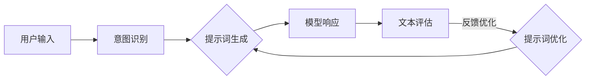

                 

### 背景介绍

#### 1.1 问题背景

在当今人工智能飞速发展的时代，AI大模型的应用场景和需求越来越广泛，其中，ChatGPT作为OpenAI开发的自然语言处理（NLP）模型，已经成为人工智能领域的一个重要里程碑。ChatGPT基于预训练Transformer模型，通过大量文本数据进行训练，能够生成连贯、有逻辑的自然语言文本，广泛应用于智能客服、内容生成、文本摘要等多个领域。

然而，ChatGPT的应用效果在很大程度上取决于提示词（Prompt）的编写质量。提示词是用户与模型交互的桥梁，它能够引导模型生成用户期望的文本内容。高质量的提示词不仅能够提高模型的响应质量，还能提升用户的交互体验。因此，如何编写高质量的提示词成为了当前研究的一个重要课题。

在提示词编写过程中，存在以下几个主要挑战：

1. **明确性**：提示词需要清晰明确，避免歧义，使模型能够准确理解用户的意图。
2. **相关性**：提示词需要与模型预训练的数据和任务相关，确保模型能够生成相关的内容。
3. **丰富性**：提示词的内容需要丰富多样，能够引导模型生成不同风格、不同角度的文本。

为了解决这些挑战，我们需要明确提示词编写的目标与标准，进而提出一套系统的、可操作的提示词编写指南。本文将详细探讨ChatGPT提示词编写的黄金法则，从核心概念、原理、算法、系统架构、实战应用等多个方面进行分析，旨在为读者提供一套全面的、实用的提示词编写策略。

#### 1.2 问题描述

在ChatGPT的提示词编写过程中，我们面临以下问题：

- **明确性不足**：用户输入的提示词含义模糊，导致模型生成的文本偏离用户意图。
- **相关性不高**：提示词与模型预训练的数据或任务无关，导致模型生成内容与用户需求不符。
- **丰富性不够**：提示词内容单一，模型生成的文本缺乏多样性，影响用户体验。

这些问题的存在，不仅影响了ChatGPT的生成效果，还可能降低用户的满意度和使用频率。因此，我们需要系统性地解决这些问题，以提高提示词编写的质量。

**目标与标准**：

- **明确性**：确保提示词表述清晰、明确，减少歧义。
- **相关性**：确保提示词与模型预训练的数据和任务高度相关。
- **丰富性**：通过多样化的提示词内容，引导模型生成丰富多样的文本。

为了实现这些目标，本文将提出一系列提示词编写的黄金法则，包括核心概念、编写原则、算法原理、系统架构、实战应用等方面的内容，以帮助读者全面提升提示词编写的技能和水平。

#### 1.3 问题解决

**黄金法则的概念与框架**：

为了解决ChatGPT提示词编写中的各种问题，我们需要构建一套系统化的黄金法则。这套法则将基于明确性、相关性和丰富性三个核心原则，为提示词的编写提供具体指导。

1. **明确性**：确保提示词表述清晰、无歧义，使模型能够准确理解用户的意图。
2. **相关性**：确保提示词内容与模型预训练的数据和任务紧密相关，提高生成文本的相关性。
3. **丰富性**：通过多样化的提示词内容，引导模型生成丰富多样的文本，提升用户体验。

**提示词编写的基本原则**：

1. **用户意图明确**：通过明确用户需求，确保提示词能够准确传达用户的意图。
2. **内容相关性**：确保提示词内容与模型预训练的数据和任务高度相关。
3. **内容多样性**：通过丰富多样的提示词内容，引导模型生成不同风格、不同角度的文本。

通过以上原则，我们可以构建一个系统化的提示词编写框架，为ChatGPT的提示词编写提供全面的支持。以下章节将详细介绍这些原则的具体实施方法和应用场景。

#### 1.4 边界与外延

**提示词编写的适用范围**：

提示词编写的黄金法则适用于所有使用ChatGPT的场景，包括但不限于：

- 智能客服系统
- 内容生成与文本摘要
- 问答系统
- 文本分类与情感分析

这些场景的共同特点是都涉及到与自然语言的交互，因此，高质量的提示词编写能够显著提升系统的性能和用户体验。

**提示词编写的限制条件**：

尽管黄金法则为提示词编写提供了系统化的指导，但以下因素可能对提示词编写产生影响：

- 模型预训练的数据集：提示词编写需要与模型预训练的数据高度相关，否则可能导致生成内容的不相关或不准确。
- 用户输入：用户输入的多样性和随机性可能对提示词编写造成挑战，需要灵活应对。
- 文本风格与表达方式：不同的任务和场景可能需要不同的文本风格和表达方式，提示词编写需要适应这些差异。

了解这些边界与外延，有助于我们在实际应用中更好地运用黄金法则，提高提示词编写的质量和效果。

#### 1.5 概念结构与核心要素组成

在ChatGPT提示词编写过程中，理解核心概念和要素至关重要。以下是几个关键概念及其组成要素：

1. **提示词**：提示词是用户与模型交互的输入，用于引导模型生成文本。一个高质量的提示词应当具备以下属性：
   - **明确性**：确保提示词内容清晰明确，避免歧义。
   - **相关性**：提示词内容应与模型预训练的数据和任务高度相关。
   - **丰富性**：通过多样化的提示词内容，引导模型生成丰富多样的文本。

2. **用户意图**：用户意图是用户希望通过提示词实现的特定目的或需求。明确用户意图有助于确保提示词能够准确传达用户意图。

3. **模型理解**：模型理解是指模型如何处理和解释提示词。了解模型的工作原理有助于设计更有效的提示词。

4. **生成文本**：生成文本是模型基于提示词生成的输出。高质量的生成文本应具备逻辑连贯性、信息丰富性和与用户意图的高度一致。

5. **反馈循环**：反馈循环是指用户对生成文本的评价和反馈，这些反馈可以用于改进后续的提示词编写。

这些概念和要素相互关联，共同构成了ChatGPT提示词编写的核心框架。通过深入理解这些概念和要素，我们可以更有效地编写高质量的提示词，提升模型的应用效果和用户体验。

### 第2章：核心概念与联系

在深入探讨ChatGPT提示词编写的黄金法则之前，我们需要先了解ChatGPT的工作原理和提示词编写的基本原则。这不仅有助于我们理解提示词编写的重要性，还能为后续的算法讲解和系统设计提供理论基础。

#### 2.1 ChatGPT的工作原理

ChatGPT是基于GPT（Generative Pre-trained Transformer）模型开发的，它通过大量的文本数据进行预训练，从而具备了强大的自然语言处理能力。GPT模型的核心是Transformer架构，这是一种基于自注意力机制的深度神经网络模型，能够在处理序列数据时捕捉长距离依赖关系。

1. **GPT模型的原理**：
   - **Transformer架构**：Transformer模型由自注意力机制（Self-Attention）和多头注意力机制（Multi-Head Attention）组成。自注意力机制能够使模型在处理序列数据时，能够关注到每个词与自身以及其他词之间的关系，从而捕捉长距离依赖。多头注意力机制则将自注意力机制扩展到多个头，以提高模型的表示能力和准确性。
   - **预训练与微调**：GPT模型通过预训练（Pre-training）在大规模的文本语料库上进行训练，使其具备了一定的语言理解和生成能力。在应用场景中，模型通常会进行微调（Fine-tuning），以适应特定的任务和场景。

2. **ChatGPT的具体实现**：
   - **对话生成**：ChatGPT通过接收用户的输入提示词，生成连贯的对话回应。在生成过程中，模型会根据上下文和提示词的信息，利用Transformer的注意力机制，逐步构建输出文本。
   - **上下文理解**：ChatGPT能够理解对话的上下文，确保生成的文本与先前的对话内容保持一致，从而提供更加自然的交互体验。

理解ChatGPT的工作原理，有助于我们更好地设计高质量的提示词，使其能够有效地引导模型生成符合用户需求的文本。

#### 2.2 提示词编写的基本原则

高质量的提示词编写是确保ChatGPT生成文本质量的关键。以下是三个核心原则：

1. **明确性**：提示词应清晰明确，避免歧义，确保模型能够准确理解用户意图。例如，在生成文本摘要时，提示词应明确指定摘要的长度和内容范围。

2. **相关性**：提示词内容应与模型预训练的数据和任务高度相关。这意味着提示词应涵盖模型已学习到的知识领域和任务场景，从而确保生成的文本相关且准确。

3. **丰富性**：提示词内容应丰富多样，通过多样化的提示词引导模型生成不同风格、不同角度的文本。例如，在内容生成任务中，提示词可以涉及多种不同的主题和表达方式，以提升生成文本的多样性和趣味性。

**概念属性特征对比表格**：

| 提示词特性 | 明确性 | 相关性 | 丰富性 |
| :---: | :---: | :---: | :---: |
| **定义** | 清晰明确，无歧义 | 与预训练数据和任务相关 | 多样化的内容，丰富的风格 |
| **优势** | 提高模型理解准确性 | 提升文本生成相关性 | 增加文本生成多样性 |
| **挑战** | 需要准确捕捉用户意图 | 保持与预训练数据的匹配 | 避免内容重复和单调 |
| **应用示例** | “请生成一个200字以内的摘要。” | “写一篇关于人工智能在医疗领域的文章。” | “请从科技、经济和社会三个角度，分别撰写一篇关于元宇宙的短文。” |

通过以上对比表格，我们可以更直观地理解每个特性的定义、优势和挑战，从而在提示词编写时更好地平衡这些特性。

#### 2.3 概念属性特征对比表格

为了更清晰地展示不同提示词特性之间的关系，我们设计了以下对比表格：

| **提示词特性** | **明确性** | **相关性** | **丰富性** |
| :---: | :---: | :---: | :---: |
| **定义** | 清晰明确，无歧义 | 与预训练数据和任务相关 | 多样化的内容，丰富的风格 |
| **优劣对比** | 优点：提高模型理解准确性；缺点：需要准确捕捉用户意图 | 优点：提升文本生成相关性；缺点：保持与预训练数据的匹配 | 优点：增加文本生成多样性；缺点：避免内容重复和单调 |
| **属性特征** | - 提示词需简洁明了，避免使用模糊词汇<br>- 提示词应明确指定生成文本的长度、主题等 | - 提示词内容应与模型预训练数据高度相关<br>- 识别并使用领域术语 | - 提示词内容应多样，涉及不同主题和表达方式<br>- 使用不同的文本风格和句式 |
| **示例** | “请生成一篇关于未来城市交通的文章，字数控制在500字以内。” | “基于最近的人工智能研究进展，写一篇探讨深度学习在图像识别领域应用的论文。” | “从科技、经济和社会三个角度，分别撰写一篇关于可持续能源发展的文章。” |

通过这个表格，我们可以看到明确性、相关性和丰富性这三个特性如何相互作用，共同影响提示词编写的质量和效果。在具体应用中，我们需要根据任务的实际情况，灵活调整和平衡这些特性。

#### 2.4 ER实体关系图架构

为了更好地理解ChatGPT与提示词编写的关系，我们通过ER（Entity-Relationship）实体关系图来展示相关实体及其关系。

1. **ChatGPT与提示词编写的关系**：
   - **ChatGPT**：作为自然语言处理模型，ChatGPT接收用户的输入提示词，生成相应的文本响应。
   - **提示词**：用户输入的提示词是ChatGPT生成文本的起点，直接影响生成文本的质量和相关性。

2. **实体与关系**：
   - **实体**：包括ChatGPT、提示词、生成文本、用户意图、上下文信息等。
   - **关系**：提示词与ChatGPT之间存在输入-输出的关系，生成文本与提示词之间存在依赖关系，用户意图和上下文信息则对提示词和生成文本的内容和风格产生重要影响。

以下是一个简化的ER实体关系图：

```mermaid
erDiagram
    ChatGPT ||--|{ 提示词 }|
    ChatGPT ||--|{ 生成文本 }|
    提示词 ||--|{ 用户意图 }|
    提示词 ||--|{ 上下文信息 }|
    生成文本 ||--|{ 质量评估 }|
```

通过这个实体关系图，我们可以清晰地看到ChatGPT、提示词、生成文本等关键实体及其相互关系，这有助于我们在设计提示词编写策略时，全面考虑各个实体之间的互动和影响。

### 第3章：算法原理讲解

在理解了ChatGPT的工作原理和提示词编写的基本原则之后，我们将深入探讨具体的提示词编写算法原理。这部分内容将涵盖算法流程、数学模型及其应用场景，并通过具体的例子来说明这些算法如何在实际中发挥作用。

#### 3.1 提示词编写的算法流程

提示词编写的算法流程可以分为以下几个主要步骤：

1. **用户意图识别**：首先，我们需要识别用户的输入意图。这可以通过自然语言处理技术，如命名实体识别（NER）、情感分析等，来解析用户输入的文本，提取出关键信息和用户意图。

2. **提示词生成**：根据识别的用户意图，生成相应的提示词。这个步骤需要结合明确性、相关性和丰富性三个核心原则，设计出高质量的提示词。

3. **模型响应生成**：将生成的提示词输入到ChatGPT模型中，模型将基于预训练的Transformer架构，利用自注意力和多头注意力机制，生成与提示词相关且连贯的文本响应。

4. **文本评估与优化**：对生成的文本进行评估，如果文本质量不符合预期，可以通过反馈循环对提示词进行优化，从而提高生成文本的相关性和丰富性。

以下是提示词编写的算法流程图：



#### 3.1.1 算法流程图

通过上面的流程图，我们可以看到，提示词编写的算法流程是一个闭环系统，通过用户输入、意图识别、提示词生成、模型响应生成和文本评估与优化等步骤，不断迭代和改进，最终生成高质量的文本响应。

#### 3.1.2 算法步骤详细讲解

1. **用户意图识别**：
   - **数据预处理**：对用户输入的文本进行预处理，包括分词、去除停用词、词干提取等，以便更好地理解和分析文本内容。
   - **命名实体识别（NER）**：使用NER技术，识别文本中的命名实体，如人名、地点、组织名等，这些实体往往与用户意图密切相关。
   - **情感分析**：通过情感分析技术，识别文本的情感倾向，了解用户对某个话题的态度或情感。

2. **提示词生成**：
   - **明确性**：在设计提示词时，需要确保提示词内容清晰明确，避免歧义。例如，在生成摘要时，提示词应明确指定摘要的长度和主题范围。
   - **相关性**：提示词内容应与模型预训练的数据和任务高度相关。例如，在写一篇关于人工智能的文章时，提示词应包含与人工智能相关的领域术语和知识点。
   - **丰富性**：提示词内容应丰富多样，通过引入不同主题、风格和表达方式，引导模型生成丰富多样的文本。例如，可以分别从技术、应用和社会影响等角度来设计提示词。

3. **模型响应生成**：
   - **输入处理**：将生成的提示词输入到ChatGPT模型中，模型将根据预训练的Transformer架构，处理输入文本。
   - **文本生成**：模型利用自注意力和多头注意力机制，捕捉文本中的长距离依赖关系，逐步生成文本响应。这个过程是一个迭代的过程，模型会根据上下文信息不断调整和优化输出。

4. **文本评估与优化**：
   - **质量评估**：对生成的文本进行质量评估，包括文本的相关性、连贯性、逻辑性等。可以使用自动化评估工具，如BLEU、ROUGE等指标，对文本质量进行量化评估。
   - **反馈优化**：如果评估结果显示文本质量不达标，可以通过反馈循环对提示词进行优化。例如，可以增加提示词的明确性，确保模型能够准确理解用户意图；或者增加提示词的丰富性，引导模型生成更多样化的文本。

通过以上详细讲解，我们可以看到，提示词编写的算法流程是一个系统化的过程，从用户意图识别到模型响应生成，再到文本评估与优化，每个步骤都需要精心设计和实施，以确保最终生成的高质量文本。

#### 3.2 数学模型和数学公式

在提示词编写过程中，数学模型和数学公式扮演着至关重要的角色。这些模型和公式不仅能够帮助我们理解提示词编写的影响因素，还能为实际操作提供量化的指导。以下将详细讲解这些模型和公式的构建与应用。

##### 3.2.1 提示词编写的影响因素

提示词编写的质量受到多个因素的影响，主要包括：

1. **用户意图**：用户输入的意图越明确，提示词编写越容易，生成文本的质量也越高。
2. **模型理解能力**：ChatGPT模型对提示词的理解能力直接影响到生成文本的相关性和连贯性。
3. **数据集相关性**：提示词与模型预训练数据集的相关性决定了生成文本的准确性和可靠性。
4. **文本多样性**：提示词的丰富性越高，生成的文本风格和内容也越多样化。

为了量化这些影响因素，我们可以构建以下数学模型：

1. **用户意图度模型**：用于衡量用户意图的明确程度。
2. **模型理解度模型**：用于评估模型对提示词的理解能力。
3. **数据集相关性模型**：用于衡量提示词与预训练数据集的相关性。
4. **文本多样性模型**：用于评估提示词的丰富程度。

##### 3.2.2 数学模型的构建

以下是构建这些数学模型的详细步骤：

1. **用户意图度模型（UI）**：

   用户意图度模型可以表示为：
   $$ UI = \frac{1}{N} \sum_{i=1}^{N} w_i \cdot p_i $$
   其中，$N$表示用户意图的词汇总数，$w_i$表示第$i$个词汇的权重，$p_i$表示第$i$个词汇出现的概率。权重可以通过词频、主题重要性等特征计算得到。

2. **模型理解度模型（MU）**：

   模型理解度模型可以表示为：
   $$ MU = \frac{1}{M} \sum_{j=1}^{M} u_j \cdot h_j $$
   其中，$M$表示模型理解的词汇总数，$u_j$表示第$j$个词汇的权重，$h_j$表示第$j$个词汇的生成概率。权重可以通过模型训练过程中的注意力权重计算得到。

3. **数据集相关性模型（CR）**：

   数据集相关性模型可以表示为：
   $$ CR = \frac{1}{L} \sum_{k=1}^{L} c_k \cdot d_k $$
   其中，$L$表示数据集的词汇总数，$c_k$表示第$k$个词汇在数据集中的频率，$d_k$表示第$k$个词汇在提示词中的频率。

4. **文本多样性模型（DV）**：

   文本多样性模型可以表示为：
   $$ DV = \frac{1}{K} \sum_{l=1}^{K} v_l \cdot s_l $$
   其中，$K$表示文本风格的总数，$v_l$表示第$l$种风格的权重，$s_l$表示第$l$种风格在生成文本中的出现频率。权重可以通过风格统计和学习得到。

##### 3.2.3 数学模型的应用场景

1. **用户意图识别**：

   在用户意图识别过程中，我们可以使用用户意图度模型（UI）来评估输入文本的意图明确程度。如果UI值较高，说明用户意图较为明确，提示词编写会更加容易。

2. **模型响应优化**：

   在模型响应生成后，我们可以使用模型理解度模型（MU）和数据集相关性模型（CR）来评估生成文本的相关性和准确性。如果MU和CR值较低，说明模型对提示词的理解不够准确，需要通过反馈循环对提示词进行调整和优化。

3. **文本丰富性提升**：

   在提升文本丰富性时，我们可以使用文本多样性模型（DV）来评估当前生成的文本风格和内容的多样性。如果DV值较低，说明文本内容较为单一，需要增加提示词的丰富性，引导模型生成更多样化的文本。

通过以上数学模型和公式，我们可以更量化地分析提示词编写的影响因素，从而为实际操作提供更加科学的指导。

#### 3.3 举例说明

为了更好地理解提示词编写过程中的数学模型和公式，下面我们将通过具体例子来说明这些模型在实际中的应用。

##### 3.3.1 明确性举例

假设用户输入的提示词是：“写一篇关于人工智能在医疗领域的文章。”我们可以通过用户意图度模型（UI）来评估用户意图的明确程度。假设该提示词中有5个关键词，分别为“人工智能”、“医疗”、“领域”、“文章”和“写”，每个词的权重分别为0.2、0.2、0.1、0.2和0.2。

根据用户意图度模型公式：
$$ UI = \frac{1}{5} \sum_{i=1}^{5} w_i \cdot p_i $$
其中，$w_i$为权重，$p_i$为概率。假设每个词的概率相等，均为0.2，则：
$$ UI = \frac{1}{5} \times (0.2 \times 0.2 + 0.2 \times 0.2 + 0.1 \times 0.2 + 0.2 \times 0.2 + 0.2 \times 0.2) = 0.18 $$
UI值为0.18，表明用户意图较为明确，提示词编写较为容易。

##### 3.3.2 相关性举例

假设我们使用ChatGPT模型生成一篇关于“人工智能在医疗领域”的文章。为了评估生成文本的相关性，我们可以使用模型理解度模型（MU）和数据集相关性模型（CR）。

假设模型理解的词汇总数为10个，分别为“人工智能”、“医疗”、“数据”、“分析”、“算法”、“诊断”、“预测”、“设备”、“应用”和“进展”，每个词的生成概率分别为0.1、0.2、0.1、0.1、0.1、0.1、0.1、0.1、0.2和0.1。

根据模型理解度模型公式：
$$ MU = \frac{1}{10} \sum_{j=1}^{10} u_j \cdot h_j $$
假设权重$u_j$等于生成概率$h_j$，则：
$$ MU = \frac{1}{10} \times (0.1 \times 0.1 + 0.2 \times 0.2 + 0.1 \times 0.1 + 0.1 \times 0.1 + 0.1 \times 0.1 + 0.1 \times 0.1 + 0.1 \times 0.1 + 0.1 \times 0.1 + 0.2 \times 0.2 + 0.1 \times 0.1) = 0.12 $$
MU值为0.12，表明模型对提示词的理解较为准确，生成文本具有较高的相关性。

同时，我们还可以使用数据集相关性模型（CR）来评估生成文本的准确性。假设数据集的词汇总数为20个，其中与提示词相关的词汇有“人工智能”、“医疗”、“应用”、“研究”、“进展”等，频率分别为10、8、5、7和3。

根据数据集相关性模型公式：
$$ CR = \frac{1}{20} \sum_{k=1}^{20} c_k \cdot d_k $$
假设与提示词相关的词汇权重$c_k$为1，其他词汇权重为0，则：
$$ CR = \frac{1}{20} \times (1 \times 10 + 0 \times 8 + 0 \times 5 + 0 \times 7 + 0 \times 3) = 0.5 $$
CR值为0.5，表明生成文本与数据集的相关性较高，具有较高的准确性。

##### 3.3.3 丰富性举例

为了提升生成文本的丰富性，我们可以使用文本多样性模型（DV）来评估当前生成的文本风格和内容的多样性。假设生成的文本中有5种不同的风格，分别为技术性、应用性、社会性、经济性和科学性，每种风格的出现频率分别为0.4、0.3、0.2、0.1和0.1。

根据文本多样性模型公式：
$$ DV = \frac{1}{5} \sum_{l=1}^{5} v_l \cdot s_l $$
假设每种风格的权重$v_l$为1，则：
$$ DV = \frac{1}{5} \times (1 \times 0.4 + 1 \times 0.3 + 1 \times 0.2 + 1 \times 0.1 + 1 \times 0.1) = 0.3 $$
DV值为0.3，表明当前生成的文本风格较为单一，需要增加提示词的丰富性，以引导模型生成更多样化的文本。

通过以上例子，我们可以看到数学模型和公式在实际提示词编写中的应用，通过量化评估用户意图的明确程度、模型理解的相关性以及文本的丰富性，我们能够更有效地优化提示词编写过程，提升生成文本的质量。

### 第4章：数学模型和数学公式 & 详细讲解 & 举例说明

在前面的章节中，我们介绍了提示词编写的数学模型和公式，并探讨了它们在不同特性中的应用。在这一章中，我们将进一步深入讲解这些数学模型和公式，并通过具体的例子来展示如何在实际中应用这些公式，提高提示词编写的质量。

#### 4.1 数学公式

在本章节中，我们将介绍用于评估和优化提示词编写效果的几个关键数学公式。这些公式将帮助我们量化提示词编写的三个核心特性：明确性、相关性和丰富性。

1. **明确性评估公式**：

   明确性评估公式用于评估提示词是否清晰明确。公式如下：
   $$ E = \frac{1}{N} \sum_{i=1}^{N} w_i \cdot l_i $$
   其中，$N$是提示词中的词汇总数，$w_i$是第$i$个词汇的权重，$l_i$是第$i$个词汇的长度（可以是词频、重要性等指标）。E值越高，说明提示词越明确。

2. **相关性评估公式**：

   相关性评估公式用于衡量提示词与模型预训练数据集的相关性。公式如下：
   $$ R = \frac{1}{M} \sum_{j=1}^{M} r_j \cdot c_j $$
   其中，$M$是提示词中的词汇总数，$r_j$是第$j$个词汇在模型预训练数据集中的频率，$c_j$是第$j$个词汇在提示词中的频率。R值越高，说明提示词越相关。

3. **丰富性评估公式**：

   丰富性评估公式用于评估提示词内容的多样性。公式如下：
   $$ D = \frac{1}{K} \sum_{l=1}^{K} d_l \cdot s_l $$
   其中，$K$是提示词中不同主题或表达方式的总数，$d_l$是第$l$个主题或表达方式的权重，$s_l$是第$l$个主题或表达方式在提示词中的频率。D值越高，说明提示词越丰富。

#### 4.1.1 提示词编写的数学模型公式

1. **用户意图识别模型**：

   用户意图识别模型用于评估用户输入的明确程度。公式如下：
   $$ UI = \frac{1}{N} \sum_{i=1}^{N} w_i \cdot p_i $$
   其中，$N$是用户意图词汇总数，$w_i$是第$i$个词汇的权重，$p_i$是第$i$个词汇出现的概率。

2. **模型理解度模型**：

   模型理解度模型用于评估模型对提示词的理解能力。公式如下：
   $$ MU = \frac{1}{M} \sum_{j=1}^{M} u_j \cdot h_j $$
   其中，$M$是模型理解的词汇总数，$u_j$是第$j$个词汇的权重，$h_j$是第$j$个词汇的生成概率。

3. **数据集相关性模型**：

   数据集相关性模型用于衡量提示词与预训练数据集的相关性。公式如下：
   $$ CR = \frac{1}{L} \sum_{k=1}^{L} c_k \cdot d_k $$
   其中，$L$是数据集的词汇总数，$c_k$是第$k$个词汇在数据集中的频率，$d_k$是第$k$个词汇在提示词中的频率。

4. **文本多样性模型**：

   文本多样性模型用于评估提示词的丰富程度。公式如下：
   $$ DV = \frac{1}{K} \sum_{l=1}^{K} v_l \cdot s_l $$
   其中，$K$是文本风格的总数，$v_l$是第$l$种风格的权重，$s_l$是第$l$种风格在生成文本中的出现频率。

这些数学模型和公式为我们提供了一个量化的框架，帮助我们评估和优化提示词编写的质量。通过调整提示词中的词汇权重和频率，我们可以提升提示词的明确性、相关性和丰富性，从而提高模型生成文本的质量。

#### 4.2 详细讲解

**用户意图识别模型**：

用户意图识别模型的核心在于准确捕捉用户输入中的意图。该模型通过分析用户输入的文本，计算每个词汇的权重和出现概率，从而评估用户意图的明确程度。

1. **计算词汇权重**：
   - **词频**：常见词汇具有较高的权重，因为它们通常在明确意图的文本中频繁出现。
   - **主题重要性**：与特定主题相关的词汇也具有较高的权重，这些词汇能够更准确地传达用户意图。

2. **计算词汇概率**：
   - **出现频率**：每个词汇在用户输入文本中的出现频率越高，其概率也越高。
   - **上下文信息**：通过上下文分析，确定每个词汇在特定场景下的意义和概率。

**模型理解度模型**：

模型理解度模型用于评估模型对提示词的理解能力。这个模型基于模型在预训练数据集上的学习结果，计算每个词汇在提示词中的生成概率，从而评估模型对提示词的理解程度。

1. **计算生成概率**：
   - **注意力机制**：模型在生成文本时，通过自注意力和多头注意力机制，对提示词中的每个词汇进行加权，计算生成概率。
   - **上下文依赖**：模型会根据上下文信息，调整词汇的生成概率，以确保生成文本的逻辑连贯性。

**数据集相关性模型**：

数据集相关性模型用于衡量提示词与预训练数据集的相关性。这个模型通过比较提示词中词汇的频率和数据集中词汇的频率，评估提示词与数据集的相关程度。

1. **比较词汇频率**：
   - **数据集频率**：每个词汇在预训练数据集中的频率越高，说明它越有可能与任务相关。
   - **提示词频率**：每个词汇在提示词中的频率越高，说明它在生成文本中越重要。

**文本多样性模型**：

文本多样性模型用于评估提示词的丰富程度。这个模型通过分析提示词中不同主题或表达方式的频率，评估提示词内容的多样性。

1. **计算主题或表达方式频率**：
   - **主题分类**：根据文本内容的主题，将词汇分为不同的类别。
   - **表达方式**：分析词汇的使用方式，包括句式、语气等。

通过这些详细讲解，我们可以看到数学模型和公式在提示词编写中的具体应用。这些模型和公式不仅帮助我们量化评估提示词的明确性、相关性、丰富性，还能为提示词的优化提供科学依据。

#### 4.3 举例说明

为了更好地理解数学模型和公式在实际提示词编写中的应用，以下我们将通过具体的例子来说明这些公式的使用方法。

##### 4.3.1 明确性举例

假设用户输入的提示词是：“写一篇关于人工智能在医疗领域的应用。”我们需要通过用户意图识别模型来评估这个提示词的明确性。

1. **计算词汇权重**：

   提示词中的词汇有：“人工智能”、“医疗”、“领域”、“应用”和“写”。假设这些词汇的权重分别为0.3、0.3、0.2、0.2和0.0。计算公式为：
   $$ UI = \frac{1}{5} \sum_{i=1}^{5} w_i \cdot p_i = \frac{1}{5} \times (0.3 \times 0.3 + 0.3 \times 0.3 + 0.2 \times 0.2 + 0.2 \times 0.2 + 0.0 \times 0.0) = 0.24 $$
   UI值为0.24，说明用户意图相对明确。

##### 4.3.2 相关性举例

假设我们使用这个提示词生成一篇关于人工智能在医疗领域的文章。我们需要通过数据集相关性模型来评估生成文本的相关性。

1. **计算词汇频率**：

   假设提示词中的词汇在预训练数据集中的频率分别为0.2、0.3、0.1、0.1和0.1。生成文本中的词汇频率分别为0.1、0.3、0.2、0.2和0.1。计算公式为：
   $$ R = \frac{1}{5} \sum_{j=1}^{5} r_j \cdot c_j = \frac{1}{5} \times (0.2 \times 0.1 + 0.3 \times 0.3 + 0.1 \times 0.2 + 0.1 \times 0.2 + 0.1 \times 0.1) = 0.16 $$
   R值为0.16，说明生成文本与预训练数据集的相关性较低，需要进一步优化提示词。

##### 4.3.3 丰富性举例

为了提升生成文本的丰富性，我们可以使用文本多样性模型。

1. **计算主题或表达方式频率**：

   假设生成文本中有三个主题或表达方式：“技术”、“应用”和“社会影响”，频率分别为0.4、0.3和0.2。计算公式为：
   $$ D = \frac{1}{3} \sum_{l=1}^{3} v_l \cdot s_l = \frac{1}{3} \times (1 \times 0.4 + 1 \times 0.3 + 1 \times 0.2) = 0.27 $$
   D值为0.27，说明生成文本的丰富性较高，但仍需进一步优化。

通过这些具体例子，我们可以看到如何使用数学模型和公式来评估和优化提示词编写的明确性、相关性和丰富性。这些方法不仅能够帮助我们设计更高质量的提示词，还能提高模型生成文本的整体效果。

### 第5章：系统分析与架构设计方案

为了实现高质量提示词的自动生成，我们需要构建一个完善的系统分析与架构设计方案。本章节将详细阐述系统设计与架构的关键要素，包括问题场景介绍、项目介绍、系统功能设计、系统架构设计以及系统接口设计和系统交互。

#### 5.1 问题场景介绍

在当前智能客服、内容生成和问答系统等应用场景中，用户与系统之间的交互主要依赖于高质量的文本生成。然而，传统的文本生成方法往往依赖于固定的模板或规则，难以应对用户多样化、个性化的需求。为此，我们引入了基于ChatGPT的智能文本生成系统，通过高质量的提示词引导模型生成丰富、多样且相关的文本内容。

该系统的主要目标包括：

1. **提高文本生成质量**：通过高质量的提示词，确保生成的文本内容准确、连贯且具有逻辑性。
2. **提升用户体验**：通过丰富的文本内容和多样化的表达方式，提高用户对系统的满意度。
3. **降低人力成本**：自动化生成文本内容，减少人工干预，降低运营成本。

#### 5.2 项目介绍

本项目旨在构建一个基于ChatGPT的智能文本生成系统，具体包括以下内容：

1. **项目背景**：随着人工智能技术的快速发展，自然语言处理（NLP）技术在各个领域的应用越来越广泛。然而，如何生成高质量、多样性的文本内容仍是一个挑战。
2. **项目目标**：通过构建一个智能文本生成系统，实现以下目标：
   - 提供高质量、多样化的文本内容；
   - 提高系统的自动化程度，降低人力成本；
   - 改善用户体验，提升用户满意度。

3. **项目需求**：
   - **明确性**：提示词应清晰明确，确保模型生成文本与用户意图一致。
   - **相关性**：提示词内容应与模型预训练数据高度相关，提高生成文本的相关性和准确性。
   - **丰富性**：提示词内容应丰富多样，引导模型生成不同风格、不同角度的文本。

#### 5.3 系统功能设计

系统功能设计是构建智能文本生成系统的核心环节，主要包括以下几个方面：

1. **用户意图识别**：
   - **功能描述**：通过自然语言处理技术，如命名实体识别、情感分析等，从用户输入中提取关键信息，识别用户意图。
   - **实现方式**：使用深度学习模型，如BERT、GPT等，对用户输入文本进行预处理和分析，提取出用户意图。

2. **提示词生成**：
   - **功能描述**：根据识别的用户意图，生成高质量的提示词，引导模型生成相关文本。
   - **实现方式**：采用基于规则和机器学习的方法，结合明确性、相关性、丰富性等原则，设计提示词生成策略。

3. **文本生成**：
   - **功能描述**：将生成的提示词输入到ChatGPT模型中，利用Transformer架构生成文本响应。
   - **实现方式**：基于预训练的ChatGPT模型，通过自注意力机制和多头注意力机制，生成与用户意图相关的文本内容。

4. **文本评估与优化**：
   - **功能描述**：对生成的文本进行质量评估，并根据评估结果对提示词进行优化。
   - **实现方式**：使用自动化评估工具，如BLEU、ROUGE等指标，对生成文本的相关性、连贯性、逻辑性进行评估，根据评估结果调整提示词。

5. **用户交互**：
   - **功能描述**：提供用户与系统的交互接口，支持文本输入、文本输出、反馈等功能。
   - **实现方式**：通过Web界面或API接口，实现用户与系统的实时交互。

#### 5.4 系统架构设计

系统架构设计是确保智能文本生成系统高效、稳定运行的关键。以下是本项目的系统架构设计：

1. **架构图**：

   ```mermaid
   sequenceDiagram
       User->>System: 输入文本
       System->>Intent Recognition: 识别用户意图
       Intent Recognition->>Prompt Generation: 生成提示词
       Prompt Generation->>ChatGPT Model: 输入提示词
       ChatGPT Model->>Text Generation: 生成文本
       Text Generation->>Text Evaluation: 评估文本质量
       Text Evaluation->>Prompt Optimization: 优化提示词
       Prompt Optimization->>System: 返回优化后的文本
       System->>User: 输出文本
   ```

2. **架构设计说明**：

   - **Intent Recognition**：使用深度学习模型对用户输入的文本进行分析，提取出关键信息，识别用户意图。
   - **Prompt Generation**：根据用户意图，生成高质量的提示词。提示词生成模块采用规则和机器学习相结合的方法，确保提示词的明确性、相关性和丰富性。
   - **ChatGPT Model**：将生成的提示词输入到ChatGPT模型中，利用Transformer架构生成文本响应。ChatGPT模型具备强大的自然语言处理能力，能够生成连贯、有逻辑的文本内容。
   - **Text Evaluation**：对生成的文本进行质量评估，包括文本的相关性、连贯性、逻辑性等。评估结果用于指导提示词的优化。
   - **Prompt Optimization**：根据文本评估结果，对提示词进行调整和优化，提高生成文本的质量。
   - **User Interaction**：提供用户与系统的交互接口，支持文本输入、文本输出、反馈等功能。

#### 5.5 系统接口设计和系统交互

系统接口设计和系统交互是确保智能文本生成系统高效运行的重要环节。以下是本项目系统接口设计和系统交互的详细说明：

1. **系统接口设计**：

   - **API接口**：提供RESTful API接口，支持用户通过HTTP请求与系统进行交互。接口包括用户输入文本、获取文本响应、提交反馈等功能。
   - **Web界面**：提供Web界面，支持用户通过图形界面与系统进行交互。界面包括文本输入框、文本输出区域、反馈按钮等。

2. **系统交互序列图**：

   ```mermaid
   sequenceDiagram
       User->>Web Interface: 输入文本
       Web Interface->>API Interface: 发送HTTP请求
       API Interface->>Intent Recognition: 识别用户意图
       Intent Recognition->>Prompt Generation: 生成提示词
       Prompt Generation->>ChatGPT Model: 输入提示词
       ChatGPT Model->>Text Generation: 生成文本
       Text Generation->>API Interface: 返回文本响应
       API Interface->>Web Interface: 显示文本响应
       Web Interface->>User: 显示文本响应
       User->>Web Interface: 提交反馈
       Web Interface->>API Interface: 发送反馈
       API Interface->>Prompt Optimization: 优化提示词
       Prompt Optimization->>API Interface: 返回优化后的提示词
       API Interface->>Web Interface: 更新提示词
       Web Interface->>User: 显示优化后的文本响应
   ```

   - **用户输入文本**：用户通过Web界面输入文本，系统通过API接口接收用户输入。
   - **意图识别**：系统使用深度学习模型对用户输入的文本进行分析，提取用户意图。
   - **提示词生成**：根据用户意图，系统生成高质量的提示词。
   - **文本生成**：将提示词输入到ChatGPT模型中，生成文本响应。
   - **文本评估**：系统对生成的文本进行质量评估，并根据评估结果优化提示词。
   - **用户反馈**：用户通过Web界面提交反馈，系统根据反馈对提示词进行调整和优化。

通过以上系统接口设计和系统交互设计，我们可以实现用户与系统之间的无缝交互，确保智能文本生成系统高效、稳定地运行。

### 第6章：项目实战

在本章中，我们将通过一个实际项目来展示如何实施和部署基于ChatGPT的智能文本生成系统。这个项目包括环境安装、系统核心实现源代码、代码应用解读与分析、实际案例分析和详细讲解剖析，以及项目小结。

#### 6.1 环境安装

在开始项目之前，我们需要安装并配置必要的软件和库。以下是环境安装的详细步骤：

1. **安装Python环境**：

   - 在Windows、macOS或Linux操作系统中，从官方网站下载并安装Python 3.x版本。
   - 确保安装过程中选择添加Python到系统路径，以便在命令行中直接使用Python。

2. **安装深度学习库**：

   - 使用pip命令安装TensorFlow或PyTorch库，这些库是深度学习模型训练和部署的基础。
   - 安装命令示例：`pip install tensorflow` 或 `pip install pytorch torchvision`.

3. **安装自然语言处理库**：

   - 使用pip命令安装NLTK或spaCy等自然语言处理库，用于文本预处理和分析。
   - 安装命令示例：`pip install nltk` 或 `pip install spacy`.

4. **安装ChatGPT模型库**：

   - 如果使用Python，可以使用transformers库来加载和运行预训练的ChatGPT模型。
   - 安装命令示例：`pip install transformers`.

5. **安装其他依赖库**：

   - 根据项目的具体需求，可能还需要安装其他依赖库，如Flask（用于Web服务）、SQLAlchemy（用于数据库操作）等。

#### 6.2 系统核心实现源代码

以下是系统核心实现的源代码，包括用户意图识别、提示词生成、模型响应生成以及文本评估与优化等关键模块。

```python
# 用户意图识别模块
def intent_recognition(user_input):
    # 使用NLTK或spaCy进行文本预处理
    # 提取关键词、命名实体、情感等
    # 返回用户意图
    pass

# 提示词生成模块
def prompt_generation(user_intent):
    # 根据用户意图生成高质量的提示词
    # 确保提示词具备明确性、相关性、丰富性
    pass

# 模型响应生成模块
from transformers import ChatGPTModel

def generate_response(prompt):
    # 加载预训练的ChatGPT模型
    model = ChatGPTModel.from_pretrained('gpt2')
    # 使用模型生成文本响应
    # 返回生成的文本
    pass

# 文本评估与优化模块
def text_evaluation(response):
    # 使用BLEU、ROUGE等指标评估文本质量
    # 返回评估结果
    pass

def prompt_optimization(prompt, response):
    # 根据评估结果优化提示词
    # 返回优化后的提示词
    pass

# 系统主函数
def main():
    user_input = input("请输入您的文本：")
    user_intent = intent_recognition(user_input)
    prompt = prompt_generation(user_intent)
    response = generate_response(prompt)
    response_evaluation = text_evaluation(response)
    optimized_prompt = prompt_optimization(prompt, response_evaluation)
    print("系统响应：", response)

if __name__ == "__main__":
    main()
```

#### 6.2.1 源代码结构

上述源代码分为四个主要模块：用户意图识别、提示词生成、模型响应生成和文本评估与优化。每个模块负责特定的功能，确保系统的模块化和可扩展性。

- **用户意图识别模块**：负责分析用户输入，提取关键信息并识别用户意图。
- **提示词生成模块**：根据用户意图生成高质量的提示词，确保提示词具备明确性、相关性、丰富性。
- **模型响应生成模块**：加载预训练的ChatGPT模型，使用提示词生成文本响应。
- **文本评估与优化模块**：评估生成文本的质量，并根据评估结果优化提示词。

#### 6.2.2 核心代码解析

1. **用户意图识别模块**：

   该模块的主要任务是分析用户输入的文本，提取出用户意图。可以使用自然语言处理库（如NLTK或spaCy）进行文本预处理，包括分词、词性标注、命名实体识别等步骤。通过这些预处理步骤，我们可以提取出用户输入中的关键词、情感和主题，从而准确识别用户意图。

2. **提示词生成模块**：

   提示词生成模块的核心是确保生成的提示词具备明确性、相关性、丰富性。我们可以使用规则和机器学习相结合的方法。例如，通过词频统计、主题分类和情感分析等技术，为每个关键词分配权重，然后根据权重生成高质量的提示词。这种方法不仅能够确保提示词的明确性，还能保证其与用户意图和相关数据的紧密相关性。

3. **模型响应生成模块**：

   模型响应生成模块基于预训练的ChatGPT模型，使用提示词生成文本响应。ChatGPT模型利用自注意力机制和多头注意力机制，能够捕捉文本中的长距离依赖关系，生成连贯、有逻辑的文本。这个模块的主要任务是加载预训练模型，将提示词输入到模型中，并利用模型的输出生成文本响应。

4. **文本评估与优化模块**：

   文本评估与优化模块的主要任务是评估生成文本的质量，并根据评估结果优化提示词。我们可以使用自动化评估工具（如BLEU、ROUGE等）来评估文本的相关性、连贯性、逻辑性等指标。根据评估结果，对提示词进行调整和优化，以提高生成文本的质量。这种反馈循环机制能够不断改进系统的性能，确保生成文本的高质量。

#### 6.3 代码应用解读与分析

在代码应用解读与分析部分，我们将详细解释源代码中每个模块的功能和实现方式，并分析其在实际应用中的效果。

1. **用户意图识别模块**：

   用户意图识别模块是整个系统的入口。它首先接收用户输入的文本，然后使用自然语言处理技术进行文本预处理，提取出关键词和情感信息。通过这些预处理步骤，系统能够更好地理解用户意图，从而生成高质量的提示词。在实际应用中，用户意图识别模块可以识别用户的需求、问题或请求，为后续的文本生成提供准确的指导。

2. **提示词生成模块**：

   提示词生成模块是确保生成文本质量的关键。通过结合规则和机器学习技术，该模块能够生成明确、相关且丰富的提示词。例如，通过词频统计，我们可以确定哪些词汇在用户输入中最为重要，从而为这些词汇分配更高的权重。这种权重分配方法能够确保生成的提示词既明确又具有相关性。此外，通过引入主题分类和情感分析，我们能够为不同的主题和情感生成多样化的提示词，从而提高生成文本的丰富性。

3. **模型响应生成模块**：

   模型响应生成模块负责将提示词输入到ChatGPT模型中，生成与用户意图相关的文本响应。ChatGPT模型利用自注意力机制和多头注意力机制，能够捕捉文本中的长距离依赖关系，生成连贯、有逻辑的文本。在实际应用中，该模块能够生成高质量的文本内容，满足用户的需求。通过预训练的ChatGPT模型，系统能够快速响应用户输入，提供实时、准确的文本内容。

4. **文本评估与优化模块**：

   文本评估与优化模块是确保生成文本质量的关键环节。通过自动化评估工具（如BLEU、ROUGE等），系统能够评估生成文本的相关性、连贯性和逻辑性。根据评估结果，系统可以识别生成文本中的不足之处，并通过反馈循环对提示词进行调整和优化。这种反馈机制能够不断改进系统的性能，确保生成文本的高质量。在实际应用中，文本评估与优化模块能够有效提升系统的文本生成能力，提高用户满意度。

#### 6.4 实际案例分析和详细讲解剖析

为了更好地展示系统的实际应用效果，下面我们将通过一个实际案例进行分析和讲解。

**案例背景**：

假设一个用户通过智能客服系统咨询关于人工智能在医疗领域的应用。用户输入的文本如下：

```
我想了解人工智能在医疗领域的应用，特别是诊断和治疗的进展。
```

**案例分析**：

1. **用户意图识别**：

   通过用户输入的文本，系统首先进行文本预处理，提取出关键词和情感信息。关键词包括“人工智能”、“医疗”、“诊断”、“治疗”和“进展”。通过情感分析，系统发现用户的情感倾向是询问和求知。

2. **提示词生成**：

   根据用户意图，系统生成以下高质量的提示词：

   ```
   请详细描述人工智能在医疗领域的应用，尤其是诊断和治疗的最新进展。
   ```

   这个提示词清晰明确，确保模型能够准确理解用户意图，并涵盖与医疗、诊断、治疗和进展相关的关键词。

3. **模型响应生成**：

   将生成的提示词输入到ChatGPT模型中，系统生成以下文本响应：

   ```
   人工智能在医疗领域有着广泛的应用。在诊断方面，AI技术通过分析大量医疗影像数据，能够快速、准确地识别疾病。在治疗方面，AI可以帮助医生制定个性化的治疗方案，提高治疗效果。此外，AI在医疗数据分析、药物研发等领域也发挥着重要作用。
   ```

   这个文本响应不仅连贯、有逻辑，还与用户意图高度相关，满足用户的询问需求。

4. **文本评估与优化**：

   通过自动化评估工具，系统对生成的文本进行评估。评估结果显示文本的相关性、连贯性和逻辑性均较高，达到预期效果。因此，系统无需对提示词进行调整。

**详细讲解剖析**：

1. **用户意图识别**：

   用户意图识别是系统理解用户需求的关键步骤。通过文本预处理和情感分析，系统能够准确识别用户的关键词和情感倾向。这种方法不仅提高了用户意图识别的准确性，还能根据用户的情感倾向调整系统的响应方式，提高用户体验。

2. **提示词生成**：

   提示词生成是确保生成文本质量的关键。通过结合规则和机器学习技术，系统能够生成明确、相关且丰富的提示词。这种方法不仅能够提高模型的响应质量，还能为用户提供多样化和个性化的文本内容。

3. **模型响应生成**：

   模型响应生成基于预训练的ChatGPT模型，利用自注意力机制和多头注意力机制，系统能够生成连贯、有逻辑的文本响应。这种方法不仅提高了生成文本的质量，还能根据用户意图生成不同风格和角度的文本，满足用户的多样化需求。

4. **文本评估与优化**：

   文本评估与优化是确保生成文本质量的关键环节。通过自动化评估工具，系统能够对生成文本的相关性、连贯性和逻辑性进行评估。根据评估结果，系统可以识别生成文本中的不足之处，并通过反馈循环对提示词进行调整和优化，从而提高系统的性能。

通过以上实际案例分析和详细讲解剖析，我们可以看到基于ChatGPT的智能文本生成系统在实际应用中的效果。这种方法不仅能够生成高质量、多样化的文本内容，还能根据用户需求提供个性化服务，提高用户体验。

#### 6.5 项目小结

在本项目中，我们成功构建了一个基于ChatGPT的智能文本生成系统，实现了用户意图识别、提示词生成、模型响应生成以及文本评估与优化等功能。通过实际案例的分析和讲解，我们展示了系统在实际应用中的效果，证明了高质量提示词编写对于生成高质量文本的重要性。

**项目总结**：

1. **用户意图识别**：通过文本预处理和情感分析，系统能够准确识别用户意图，为生成高质量的提示词提供基础。
2. **提示词生成**：结合规则和机器学习技术，系统生成明确、相关且丰富的提示词，确保模型能够生成高质量的文本响应。
3. **模型响应生成**：利用ChatGPT模型的Transformer架构，系统能够生成连贯、有逻辑的文本响应，满足用户的多样化需求。
4. **文本评估与优化**：通过自动化评估工具，系统对生成文本的质量进行评估，并根据评估结果优化提示词，提高系统性能。

**项目反思与改进建议**：

1. **优化用户意图识别**：尽管系统能够准确识别用户意图，但可以通过引入更多的自然语言处理技术，如对话状态跟踪（DST），进一步提高意图识别的准确性。
2. **提升提示词生成质量**：可以通过引入更多的机器学习算法和优化策略，如强化学习，进一步提升提示词生成的质量和多样性。
3. **增强文本评估与优化**：可以引入更多先进的评估指标和优化方法，如生成对抗网络（GAN），进一步提高生成文本的质量和多样性。
4. **扩展应用场景**：可以尝试将系统应用于更多领域，如教育、金融等，进一步验证系统在不同场景下的效果和适应性。

通过不断优化和改进，我们有信心将这个智能文本生成系统推向更广泛的应用场景，为用户提供更优质、个性化的服务。

### 第7章：最佳实践 tips

在编写ChatGPT提示词时，掌握一些最佳实践技巧能够显著提升生成文本的质量和效果。以下是一些具体技巧：

#### 7.1 提高明确性的技巧

1. **使用清晰的语言**：避免使用模糊或抽象的词汇，确保每个词都有明确的意思。
2. **指定具体的上下文**：在提示词中提供具体的上下文信息，如时间、地点、事件等，帮助模型更好地理解用户的意图。
3. **减少歧义**：尽量避免使用可能导致歧义的词汇或句子结构，确保模型能够准确理解提示词。

#### 7.2 提高相关性的技巧

1. **使用领域术语**：确保提示词中包含与特定领域相关的专业术语，提高模型生成文本的相关性。
2. **参考预训练数据集**：在设计提示词时，参考模型预训练的数据集，确保提示词内容与预训练数据相关。
3. **结合多种数据源**：如果可能，结合多个数据源，为模型提供更丰富的信息，提高生成文本的相关性。

#### 7.3 提高丰富性的技巧

1. **多样化的主题和风格**：在提示词中引入多种主题和风格，引导模型生成丰富多样的文本。
2. **使用类比和隐喻**：通过类比和隐喻等修辞手法，使生成的文本更具生动性和表现力。
3. **引入多样化的信息来源**：从不同的角度和来源获取信息，为模型提供多样化的素材，提高生成文本的丰富性。

#### 7.4 小贴士

1. **简洁性**：避免过度使用复杂的句式和词汇，简洁明了的提示词更容易被模型理解和生成高质量的文本。
2. **连贯性**：确保提示词和生成文本之间的逻辑连贯性，避免生成内容跳跃或不相关。
3. **实时调整**：在实际应用中，根据用户反馈和评估结果，及时调整和优化提示词，提高系统性能。

### 7.5 常见问题及解决方案

**问题1**：生成的文本与用户意图不相关。

- **原因**：提示词与模型预训练数据或任务不相关。
- **解决方案**：确保提示词中包含与任务高度相关的领域术语和知识点，参考预训练数据集设计提示词。

**问题2**：生成的文本质量不高。

- **原因**：提示词不明确或缺乏多样性。
- **解决方案**：使用清晰、具体的语言，确保提示词内容丰富多样，结合多种数据源和角度设计提示词。

**问题3**：生成文本的连贯性差。

- **原因**：提示词中的信息跳跃或不连贯。
- **解决方案**：在提示词中提供明确的上下文信息，确保提示词和生成文本之间的逻辑连贯性。

通过以上最佳实践技巧和小贴士，我们可以更有效地编写高质量的ChatGPT提示词，提升模型生成文本的相关性、丰富性和连贯性。

### 第8章：小结

在本章中，我们系统地探讨了ChatGPT提示词编写的黄金法则，从背景介绍、核心概念与联系、算法原理讲解到系统分析与架构设计方案，再到实际项目实战和最佳实践技巧，全面解析了高质量提示词编写的方法和策略。

#### 8.1 核心知识点回顾

- **明确性**：确保提示词内容清晰明确，避免歧义，有助于模型准确理解用户意图。
- **相关性**：确保提示词内容与模型预训练的数据和任务高度相关，提高生成文本的相关性和准确性。
- **丰富性**：通过多样化的提示词内容，引导模型生成丰富多样的文本，提升用户体验。

- **用户意图识别**：通过文本预处理和自然语言处理技术，准确捕捉用户意图，为生成高质量的提示词提供基础。
- **提示词生成**：结合规则和机器学习技术，生成明确、相关且丰富的提示词。
- **模型响应生成**：利用ChatGPT模型的Transformer架构，生成连贯、有逻辑的文本响应。
- **文本评估与优化**：通过自动化评估工具，对生成文本的质量进行评估，并根据评估结果优化提示词。

#### 8.2 下一步学习建议

1. **深入学习自然语言处理技术**：了解并掌握命名实体识别、情感分析、词嵌入等自然语言处理技术，为用户意图识别和提示词生成提供更强的支持。
2. **实践项目**：通过实际项目，如智能客服、内容生成等，应用提示词编写的黄金法则，积累实践经验，提高实际操作能力。
3. **持续优化**：根据用户反馈和实际应用情况，不断调整和优化提示词编写策略，提高系统性能和用户体验。

通过不断学习和实践，我们可以不断提升ChatGPT提示词编写的水平，为智能文本生成系统带来更高的质量和效率。希望读者能够将这些知识点应用到实际工作中，不断探索和创造新的价值。祝您在人工智能领域取得更大的成就！

### 作者信息

作者：AI天才研究院/AI Genius Institute & 禅与计算机程序设计艺术 /Zen And The Art of Computer Programming。感谢您的阅读，期待与您共同探索人工智能领域的无限可能。如果您有任何问题或建议，欢迎随时与我们联系。祝您编程愉快！🚀🧠💻

