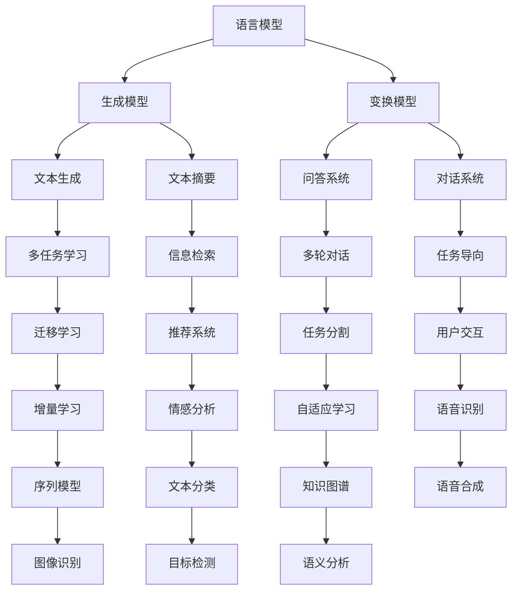
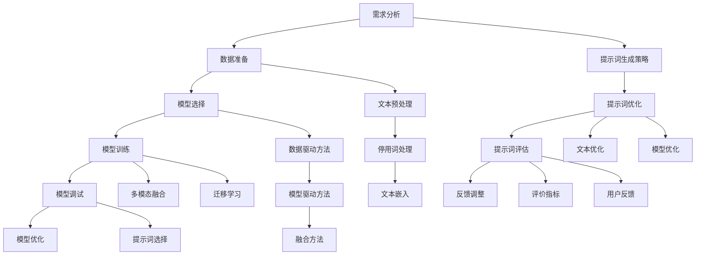
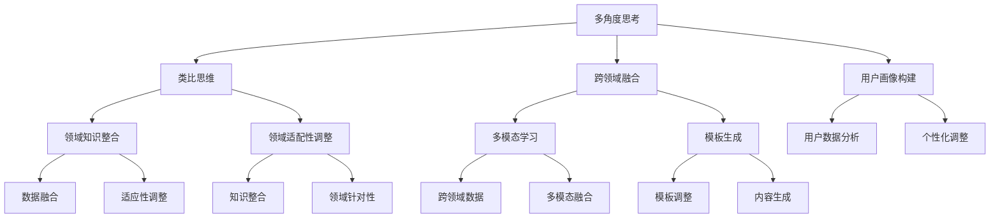
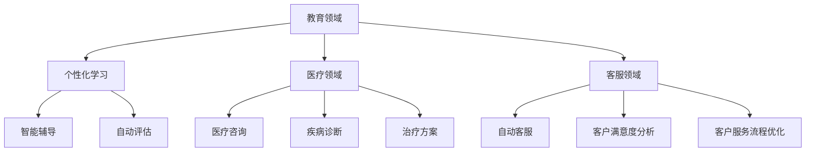

                 

**### 文章标题：ChatGPT提示词设计：原则、方法与创新**

在人工智能领域，自然语言处理（NLP）技术取得了显著的进展。其中，ChatGPT作为一种基于生成预训练变换模型（GPT）的语言模型，在对话系统中展现出极高的表现。然而，要充分发挥ChatGPT的潜力，提示词的设计至关重要。本文将围绕ChatGPT提示词设计，深入探讨其基本原则、方法以及创新实践。

**关键词：ChatGPT、自然语言处理、提示词设计、生成模型、创新思维**

**摘要：**
本文首先介绍了ChatGPT的基本原理与功能，随后探讨了提示词的重要性及其设计原则。接着，我们分析了ChatGPT的核心概念与联系，包括语言模型与生成模型。然后，详细阐述了ChatGPT提示词的设计方法，包括文本预处理、提示词生成策略以及优化与评估。此外，我们还探讨了ChatGPT提示词的创新设计，并分享了成功案例。最后，本文讨论了ChatGPT提示词在自然语言处理中的应用以及设计最佳实践。

**目录大纲：**

**第一部分：ChatGPT与提示词设计基础**

**第1章：ChatGPT与提示词概述**
1.1 ChatGPT的基本原理与功能
1.2 提示词的重要性与设计原则
1.3 ChatGPT提示词的边界与外延

**第2章：核心概念与联系**
2.1 ChatGPT的核心概念解析
2.2 提示词类型与设计
2.3 概念属性特征对比表格

**第3章：ChatGPT提示词设计方法**
3.1 文本预处理技巧
3.2 提示词生成策略
3.3 提示词优化与评估

**第4章：ChatGPT提示词创新**
4.1 创新思维与方法
4.2 成功案例分享

**第二部分：ChatGPT提示词设计与应用**

**第5章：ChatGPT提示词在自然语言处理中的应用**
5.1 文本生成与摘要
5.2 文本分类与情感分析

**第6章：ChatGPT提示词在工业界的应用**
6.1 教育领域的应用
6.2 医疗领域的应用
6.3 客服领域的应用

**第7章：ChatGPT提示词的设计最佳实践**
7.1 提示词设计流程
7.2 设计技巧与注意事项
7.3 拓展阅读与资源推荐

**第一部分：ChatGPT与提示词设计基础**

### 第1章：ChatGPT与提示词概述

#### 1.1 ChatGPT的基本原理与功能

ChatGPT是一种基于生成预训练变换模型（GPT）的自然语言处理工具。GPT是由OpenAI开发的一种深度学习模型，旨在生成与给定文本相似的新文本。ChatGPT则是在GPT的基础上，进一步优化和调整，使其能够更好地处理对话任务。

ChatGPT的工作原理主要包括两个阶段：预训练和微调。在预训练阶段，GPT使用大量的文本数据进行训练，学习语言模式和结构。在微调阶段，ChatGPT根据特定的任务或场景进行微调，以适应对话系统的需求。

ChatGPT的主要功能包括文本生成、文本摘要、问答系统、对话系统等。它可以生成连贯、自然、有逻辑的文本，适用于各种自然语言处理任务。

#### 1.2 提示词的重要性与设计原则

提示词（Prompt）是ChatGPT系统中的关键组成部分，它直接影响着模型的输出质量。一个良好的提示词应该具备以下特征：

1. **明确性**：提示词应明确传达任务目标，避免模糊和歧义。
2. **针对性**：根据任务需求，选择合适的提示词，以提高模型的生成质量。
3. **灵活性**：提示词应具有一定的灵活性，以适应不同的任务场景和输入文本。

设计提示词时，还需要遵循以下原则：

1. **简洁性**：提示词应简洁明了，避免冗长和复杂的语句。
2. **一致性**：提示词应与模型的训练数据和任务目标保持一致。
3. **多样性**：设计多种类型的提示词，以适应不同的任务需求和场景。

#### 1.3 ChatGPT提示词的边界与外延

ChatGPT提示词的边界主要涉及以下几个方面：

1. **上下文理解**：提示词应能够传达上下文信息，帮助模型理解输入文本的含义。
2. **任务限定**：提示词应明确限定任务类型，避免模型产生无关的输出。
3. **数据限制**：提示词应与训练数据保持一致，避免出现训练数据中未涉及的内容。

ChatGPT提示词的外延包括以下几个方面：

1. **语言生成**：提示词可以引导模型生成各种类型的文本，如问答、对话、摘要等。
2. **任务扩展**：通过设计不同的提示词，ChatGPT可以应用于各种自然语言处理任务，如文本分类、情感分析、命名实体识别等。

#### 总结

ChatGPT作为一种强大的自然语言处理工具，其提示词设计至关重要。一个良好的提示词可以显著提高模型的输出质量，实现更准确、更自然的文本生成。在设计和使用提示词时，需要遵循明确性、针对性、简洁性、一致性和多样性的原则，同时关注上下文理解、任务限定和数据限制等方面的边界与外延。只有这样，才能充分发挥ChatGPT的潜力，为各种自然语言处理任务提供高效、精准的解决方案。

### 第2章：核心概念与联系

#### 2.1 ChatGPT的核心概念解析

ChatGPT的核心概念主要包括语言模型、生成模型和变换模型。下面我们将分别对这些概念进行解析。

##### 2.1.1 语言模型

语言模型（Language Model）是一种统计模型，用于预测自然语言序列的概率。它是自然语言处理的基础，主要用于语音识别、机器翻译、文本生成等任务。

语言模型的主要特点包括：

1. **序列依赖**：语言模型考虑了词与词之间的依赖关系，通过学习序列中的概率分布，实现语言的理解和生成。
2. **概率分布**：语言模型输出的是概率分布，即给定一个输入序列，输出该序列的概率。
3. **训练数据**：语言模型的训练依赖于大量的文本数据，通过训练学习语言模式，提高模型的预测能力。

##### 2.1.2 生成模型

生成模型（Generative Model）是一种用于生成数据的概率模型。它通过学习数据分布，生成与训练数据具有相似特征的新数据。生成模型在自然语言处理中应用广泛，如文本生成、图像生成等。

生成模型的主要特点包括：

1. **数据分布**：生成模型学习的是数据分布，通过生成模型可以生成与训练数据具有相似特征的新数据。
2. **概率密度函数**：生成模型通常使用概率密度函数（Probability Density Function）来描述数据的分布。
3. **采样**：生成模型通过采样（Sampling）过程生成新数据，采样过程可以是确定性或随机性。

##### 2.1.3 变换模型

变换模型（Transform Model）是一种用于数据转换的模型。在自然语言处理中，变换模型常用于文本到文本的转换，如图像到文本的转换、语音到文本的转换等。

变换模型的主要特点包括：

1. **数据转换**：变换模型通过映射（Mapping）关系，将输入数据转换为目标数据。
2. **端到端**：变换模型通常采用端到端（End-to-End）的方式，直接从输入数据生成输出数据，无需中间步骤。
3. **适应性**：变换模型可以根据不同的任务需求，调整模型结构和参数，实现灵活的数据转换。

##### 2.1.4 ChatGPT的核心概念关系

ChatGPT结合了语言模型、生成模型和变换模型的特点，形成了一种强大的自然语言处理工具。以下是ChatGPT核心概念之间的关系：

1. **语言模型**：ChatGPT基于语言模型进行预训练，学习大量的语言模式和结构，为生成模型和变换模型提供基础。
2. **生成模型**：ChatGPT通过生成模型生成与输入文本相似的新文本，实现文本生成、文本摘要等任务。
3. **变换模型**：ChatGPT通过变换模型实现文本到文本的转换，如问答系统、对话系统等。

综上所述，ChatGPT的核心概念包括语言模型、生成模型和变换模型，它们相互关联，共同构成了ChatGPT的强大功能。理解这些核心概念，有助于我们更好地设计提示词，发挥ChatGPT的潜力。

#### 2.2 提示词的类型

在ChatGPT中，提示词（Prompt）是引导模型生成文本的重要输入。根据提示词的不同类型，可以分为开放式提示词和封闭式提示词。

##### 2.2.1 开放式提示词

开放式提示词（Open Prompt）是指没有明确指定输出内容，仅提供一些上下文信息或任务目标的提示词。开放式提示词通常用于生成多样性和创意性较高的文本，如故事、诗歌、对话等。

开放式提示词的特点包括：

1. **灵活性**：开放式提示词可以根据不同的任务需求和输入文本，灵活调整。
2. **多样性**：开放式提示词可以引导模型生成不同类型和风格的文本。
3. **上下文依赖**：开放式提示词需要依赖上下文信息，以确保生成文本的连贯性和一致性。

##### 2.2.2 封闭式提示词

封闭式提示词（Closed Prompt）是指明确指定输出内容或范围的提示词。封闭式提示词通常用于生成固定格式或特定类型的文本，如问答、表格、摘要等。

封闭式提示词的特点包括：

1. **明确性**：封闭式提示词明确指定输出内容或范围，确保生成文本的准确性。
2. **固定性**：封闭式提示词的输出内容或范围通常是固定的，适用于特定任务场景。
3. **上下文无关**：封闭式提示词通常不需要依赖上下文信息，可以直接生成固定格式的文本。

##### 2.2.3 提示词的语义分析

提示词的语义分析是指对提示词进行语义理解，以确定其含义和功能。在ChatGPT中，提示词的语义分析对于生成高质量的文本至关重要。

提示词的语义分析主要包括以下几个方面：

1. **词义解析**：对提示词中的每个词进行词义分析，确定其基本含义。
2. **语义关系**：分析提示词中的词语之间的语义关系，如主谓关系、修饰关系等。
3. **上下文理解**：根据上下文信息，理解提示词的整体含义和功能。

通过语义分析，我们可以更好地理解提示词的含义，设计出更符合任务需求的提示词，提高ChatGPT的生成质量。

#### 2.3 ChatGPT与提示词的关系

ChatGPT与提示词之间存在密切的关系。提示词是引导ChatGPT生成文本的关键输入，其设计质量和语义理解直接影响到模型的输出质量。

##### 2.3.1 提示词在ChatGPT中的作用

提示词在ChatGPT中的作用主要包括以下几个方面：

1. **任务引导**：提示词可以明确任务目标，引导ChatGPT生成符合要求的文本。
2. **上下文提供**：提示词提供上下文信息，帮助ChatGPT理解输入文本的含义。
3. **语义引导**：提示词的语义分析结果可以引导ChatGPT生成与输入文本相关且连贯的输出。

##### 2.3.2 提示词的设计原则

为了充分发挥提示词在ChatGPT中的作用，设计提示词时需要遵循以下原则：

1. **明确性**：提示词应明确传达任务目标，避免模糊和歧义。
2. **针对性**：根据任务需求和场景，选择合适的提示词，以提高生成质量。
3. **简洁性**：提示词应简洁明了，避免冗长和复杂的语句。
4. **一致性**：提示词应与模型训练数据和任务目标保持一致。
5. **多样性**：设计多种类型的提示词，以适应不同的任务需求和场景。

##### 2.3.3 提示词的优化策略

提示词的优化策略主要包括以下几个方面：

1. **数据增强**：通过增加训练数据，提高提示词的语义丰富性和多样性。
2. **模型调整**：根据任务需求，调整模型参数，优化生成效果。
3. **策略调整**：根据提示词类型和任务场景，调整生成策略，提高生成质量。

通过优化提示词的设计，我们可以进一步提高ChatGPT的输出质量，实现更准确、更自然的文本生成。

#### 总结

本章详细介绍了ChatGPT的核心概念，包括语言模型、生成模型和变换模型，并探讨了提示词的类型和语义分析。通过理解这些核心概念和提示词的关系，我们可以更好地设计提示词，发挥ChatGPT的潜力。在后续章节中，我们将进一步探讨ChatGPT提示词的设计方法、创新和实践，为自然语言处理任务提供更高效的解决方案。

### 第3章：ChatGPT提示词设计方法

#### 3.1 文本预处理技巧

在ChatGPT提示词设计过程中，文本预处理是至关重要的一步。良好的文本预处理可以增强模型对输入数据的理解，提高生成文本的质量。以下是几种常用的文本预处理技巧：

##### 3.1.1 文本清洗

文本清洗是指对原始文本进行去噪和格式化处理，以提高数据质量。常见的文本清洗方法包括：

1. **去除标点符号**：标点符号可能会影响模型对文本的理解，因此需要去除。
2. **去除停用词**：停用词（如“的”、“了”等）对语义贡献较小，可以去除。
3. **统一文本格式**：对文本进行统一编码（如UTF-8），消除不同编码方式带来的问题。

##### 3.1.2 停用词处理

停用词处理是指识别并处理文本中的常见停用词。停用词处理有助于降低文本维度，提高模型训练效率。处理停用词的方法包括：

1. **手动删除**：根据语言特点，手动删除常见的停用词。
2. **停用词表**：使用预定义的停用词表，快速识别并删除停用词。
3. **词频统计**：根据词频统计，删除出现频率较低的词。

##### 3.1.3 文本嵌入技术

文本嵌入技术是指将文本数据转化为向量的过程，以便于模型处理。常见的文本嵌入方法包括：

1. **词袋模型**：将文本表示为词袋（Bag of Words），每个词对应一个向量。
2. **词嵌入**：将词映射到高维空间中的向量，如Word2Vec、GloVe等。
3. **序列嵌入**：将文本序列表示为向量，如BERT、GPT等。

文本嵌入技术可以提高模型对语义的理解，有助于生成更准确、连贯的文本。

#### 3.2 提示词生成策略

提示词生成策略是指生成高质量提示词的方法。根据生成策略的不同，可以分为数据驱动方法、模型驱动方法和融合方法。

##### 3.2.1 数据驱动方法

数据驱动方法是指通过分析大量数据，自动生成提示词。常见的数据驱动方法包括：

1. **关键词提取**：从文本中提取关键词，作为提示词。
2. **文本摘要**：将文本摘要生成为提示词，简化文本内容。
3. **模板生成**：根据预定义的模板，生成提示词。

数据驱动方法简单有效，但可能无法完全满足特定任务的需求。

##### 3.2.2 模型驱动方法

模型驱动方法是指利用预训练模型，生成高质量提示词。常见模型驱动方法包括：

1. **语言模型生成**：使用语言模型生成提示词，如GPT、BERT等。
2. **生成对抗网络**（GAN）：利用生成对抗网络，生成高质量的提示词。
3. **强化学习**：使用强化学习，优化提示词生成过程。

模型驱动方法可以生成更准确、自然的提示词，但需要大量数据和计算资源。

##### 3.2.3 融合方法

融合方法是指将数据驱动方法和模型驱动方法相结合，生成高质量的提示词。常见的融合方法包括：

1. **混合模型**：结合数据驱动和模型驱动方法，生成提示词。
2. **多模态学习**：结合文本、图像、语音等多种数据，生成提示词。
3. **迁移学习**：利用迁移学习，从其他任务中提取有用信息，生成提示词。

融合方法可以充分利用不同方法的优势，生成更高质量的提示词。

#### 3.3 提示词优化与评估

提示词优化与评估是指对生成的提示词进行优化和评估，以提高生成文本的质量。常见的优化与评估方法包括：

##### 3.3.1 评价指标

评价指标用于评估提示词生成质量，常见的评价指标包括：

1. **BLEU分数**：基于记分牌方法，评估生成文本与参考文本的相似度。
2. **ROUGE分数**：基于记分牌方法，评估生成文本与参考文本的相似度，考虑词序列的顺序。
3. **Perplexity**：评估模型对生成文本的预测困难程度，越小表示生成文本越自然。

##### 3.3.2 优化策略

提示词优化策略包括以下几种：

1. **文本优化**：调整文本内容，使其更符合任务需求。
2. **模型优化**：调整模型参数，优化生成效果。
3. **提示词选择**：根据任务需求，选择合适的提示词。

通过优化策略，可以进一步提高提示词生成质量，生成更准确、自然的文本。

##### 3.3.3 提示词的评估与调整

提示词的评估与调整包括以下步骤：

1. **生成文本评估**：使用评价指标评估生成文本的质量。
2. **反馈机制**：根据评估结果，调整提示词，优化生成效果。
3. **迭代优化**：多次迭代优化，直到生成文本质量满足要求。

通过评估与调整，可以逐步提高提示词生成质量，实现更准确、自然的文本生成。

#### 总结

本章介绍了ChatGPT提示词设计的文本预处理技巧、提示词生成策略以及优化与评估方法。文本预处理技巧包括文本清洗、停用词处理和文本嵌入技术；提示词生成策略包括数据驱动方法、模型驱动方法和融合方法；优化与评估方法包括评价指标、优化策略和评估与调整步骤。通过合理运用这些方法，可以设计出高质量、准确自然的ChatGPT提示词，为自然语言处理任务提供有力支持。

### 第4章：ChatGPT提示词创新

#### 4.1 创新思维与方法

在ChatGPT提示词设计中，创新思维和方法是提高提示词生成质量和适应多样化任务的关键。以下介绍几种常见的创新思维和方法。

##### 4.1.1 创新性提示词设计

创新性提示词设计是指通过创新思维，设计出具有独特性和创造性的提示词。以下是一些创新性提示词设计方法：

1. **多角度思考**：从多个角度分析问题，设计具有多样性的提示词。
2. **类比思维**：借鉴类似任务的提示词设计，进行创新和调整。
3. **跨领域融合**：结合不同领域的知识，设计跨领域的提示词。

通过创新性提示词设计，可以激发模型的生成潜力，提高生成文本的质量。

##### 4.1.2 跨领域提示词设计

跨领域提示词设计是指设计适用于不同领域的提示词。以下是一些跨领域提示词设计方法：

1. **领域知识整合**：结合不同领域的知识，设计具有领域针对性的提示词。
2. **领域适配性调整**：根据目标领域的特点，调整提示词的表述方式和内容。
3. **跨领域数据融合**：利用跨领域数据，进行提示词生成和优化。

跨领域提示词设计可以拓展ChatGPT的应用范围，实现更广泛的场景适应。

##### 4.1.3 基于用户的个性化提示词设计

基于用户的个性化提示词设计是指根据用户的需求和偏好，设计个性化的提示词。以下是一些个性化提示词设计方法：

1. **用户数据分析**：分析用户的行为和偏好数据，提取有价值的信息。
2. **用户画像构建**：根据用户数据，构建用户的个性化画像。
3. **提示词个性化调整**：根据用户画像，调整提示词的表述方式和内容。

个性化提示词设计可以提高用户满意度，实现更精准的任务执行。

#### 4.2 成功案例分享

以下分享几个ChatGPT提示词设计的成功案例，以展示创新思维和方法在实际应用中的效果。

##### 4.2.1 案例一：教育领域

在教育领域，ChatGPT提示词设计用于生成个性化的学习资源和教学材料。通过分析学生的学习数据，设计出针对学生需求的个性化提示词，从而生成适合学生水平的教材、练习题和解答。

创新点：
- **多角度设计**：从知识、技能、情感等多个角度设计提示词，提高学习资源多样性。
- **跨领域融合**：结合教育、心理学等领域的知识，设计更具针对性的提示词。

效果：
- 学生学习效果显著提高，对学习资源的满意度增加。

##### 4.2.2 案例二：医疗领域

在医疗领域，ChatGPT提示词设计用于生成医疗咨询和诊断建议。通过分析患者数据和症状描述，设计出针对患者需求的个性化提示词，从而生成专业的医疗咨询和建议。

创新点：
- **领域知识整合**：结合医学、生物学等领域的知识，提高医疗咨询的准确性。
- **用户画像构建**：根据患者数据，构建个性化的患者画像，优化提示词设计。

效果：
- 提高了医疗咨询的准确性和针对性，患者满意度提高。

##### 4.2.3 案例三：客服领域

在客服领域，ChatGPT提示词设计用于生成客服对话和回复。通过分析用户问题和行为数据，设计出针对性的提示词，从而生成自然、流畅的客服对话。

创新点：
- **用户数据分析**：根据用户行为数据，提取有价值的信息，设计个性化提示词。
- **多模态融合**：结合文本、语音等多模态数据，提高客服对话的多样性。

效果：
- 客服对话质量提高，用户满意度增加，客服效率提升。

#### 总结

创新思维和方法在ChatGPT提示词设计中具有重要意义。通过多角度思考、跨领域融合和基于用户的个性化设计，可以设计出高质量的提示词，提高ChatGPT的生成质量和适应性。成功案例的分享展示了创新思维和方法的实际应用效果，为ChatGPT提示词设计提供了有益的借鉴和启示。

### 第5章：ChatGPT提示词在自然语言处理中的应用

#### 5.1 文本生成与摘要

ChatGPT在自然语言处理中的应用非常广泛，其中文本生成和摘要是两个重要的任务。以下详细介绍这两个任务的基本原理和应用技巧。

##### 5.1.1 文本生成流程

文本生成是指根据给定的提示信息，生成连贯、自然的文本。ChatGPT的文本生成流程主要包括以下几个步骤：

1. **提示词输入**：将需要生成的文本的提示词输入到ChatGPT模型中。
2. **模型处理**：ChatGPT模型对输入的提示词进行处理，理解其含义和上下文。
3. **生成文本**：根据处理结果，生成符合语法、语义和风格的文本。

在实际应用中，文本生成可以应用于自动写作、聊天机器人、问答系统等多种场景。以下是一个简单的文本生成示例：

**输入**：人工智能在未来的发展趋势是什么？

**输出**：人工智能在未来将不断发展和进步，有望在各个领域取得重大突破。例如，在医疗领域，人工智能可以辅助医生进行诊断和治疗；在教育领域，人工智能可以提供个性化的学习资源；在交通领域，人工智能可以优化交通流量，提高出行效率。

##### 5.1.2 摘要生成技巧

摘要生成是指从原始文本中提取关键信息，生成简洁、准确的摘要。ChatGPT在摘要生成中的应用，可以通过以下技巧实现：

1. **关键词提取**：从原始文本中提取关键词，作为摘要的支撑。
2. **句子筛选**：根据关键词，筛选出对摘要具有重要意义的句子。
3. **句子融合**：将筛选出的句子进行融合，生成简洁、准确的摘要。

在实际应用中，摘要生成可以应用于新闻摘要、文档摘要、论文摘要等多种场景。以下是一个简单的摘要生成示例：

**原始文本**：人工智能是一种模拟人类智能的技术，通过机器学习和神经网络等技术，实现感知、理解和推理等功能。在医疗领域，人工智能可以辅助医生进行诊断和治疗；在教育领域，人工智能可以提供个性化的学习资源；在交通领域，人工智能可以优化交通流量，提高出行效率。

**摘要**：人工智能是一种通过机器学习和神经网络等技术模拟人类智能的技术。它在医疗、教育和交通等领域具有广泛的应用，可以辅助医生诊断和治疗，提供个性化学习资源，优化交通流量。

##### 5.1.3 文本生成与摘要效果评估

文本生成与摘要的效果评估是衡量模型性能的重要手段。以下介绍几种常用的评估方法：

1. **人工评估**：邀请领域专家对生成的文本或摘要进行评估，判断其质量和准确性。
2. **自动评估**：使用自动化评估工具，如BLEU、ROUGE等指标，评估生成文本或摘要的相似度和质量。
3. **用户反馈**：收集用户对生成文本或摘要的反馈，评估其在实际应用中的效果。

通过效果评估，可以不断优化模型和提示词设计，提高生成文本和摘要的质量。

#### 5.2 文本分类与情感分析

文本分类与情感分析是自然语言处理中的两个重要任务。ChatGPT在文本分类和情感分析中的应用，可以通过以下方法实现。

##### 5.2.1 分类算法原理

文本分类是指将文本数据划分为不同的类别。ChatGPT可以应用于文本分类任务，通过以下原理实现：

1. **特征提取**：将文本转化为特征向量，如词袋模型、TF-IDF等。
2. **分类模型**：使用分类模型（如朴素贝叶斯、支持向量机等）进行训练和分类。

在实际应用中，文本分类可以应用于垃圾邮件过滤、情感分析、新闻分类等多种场景。以下是一个简单的文本分类示例：

**输入**：这是一个关于人工智能的新闻报道。

**输出**：类别：科技新闻

##### 5.2.2 情感分析实践

情感分析是指识别文本中的情感倾向，如正面、负面或中性。ChatGPT可以应用于情感分析任务，通过以下实践实现：

1. **情感词典**：构建情感词典，包含正面和负面情感的词语。
2. **情感分类**：使用情感分类模型（如朴素贝叶斯、支持向量机等）进行训练和分类。

在实际应用中，情感分析可以应用于社交媒体监测、客户满意度分析、市场研究等多种场景。以下是一个简单的情感分析示例：

**输入**：我非常喜欢这款手机。

**输出**：情感分类：正面

##### 5.2.3 文本分类与情感分析效果评估

文本分类与情感分析的效果评估是衡量模型性能的重要手段。以下介绍几种常用的评估方法：

1. **准确率**：正确分类的文本占总文本的比例。
2. **召回率**：召回分类的文本占总文本的比例。
3. **F1分数**：准确率和召回率的调和平均值。

通过效果评估，可以不断优化模型和提示词设计，提高文本分类和情感分析的质量。

#### 总结

ChatGPT在自然语言处理中的应用非常广泛，包括文本生成与摘要、文本分类与情感分析等。通过合理设计提示词和模型，可以实现高质量的自然语言处理任务。在实际应用中，需要根据任务需求，灵活调整提示词和模型参数，以提高生成文本和分类、情感分析的效果。

### 第6章：ChatGPT提示词在工业界的应用

#### 6.1 教育领域的应用

在教育领域，ChatGPT提示词设计正逐渐成为个性化学习、智能辅导和自动评估等场景中的重要工具。以下详细介绍ChatGPT在教育领域中的应用及其成功案例。

##### 6.1.1 在线教育平台

在线教育平台通过ChatGPT提示词设计，实现了个性化的学习体验。以下是一个成功案例：

**案例**：某知名在线教育平台使用ChatGPT提示词设计，为学员提供个性化学习资源。平台首先收集学员的学习数据，包括学习进度、学习偏好和知识点掌握情况。然后，根据这些数据，生成个性化的学习提示词，如：

**提示词**：“根据你的学习进度，建议你先完成第一章的习题，然后尝试解答第二章的难题。”

这样的个性化提示词，不仅帮助学员有针对性地学习，还能提高学习效率。

##### 6.1.2 学生辅助学习工具

学生辅助学习工具通过ChatGPT提示词设计，为学生提供实时辅导和解答疑惑。以下是一个成功案例：

**案例**：某教育科技公司开发了一款学生辅助学习工具，内置ChatGPT提示词设计。学生可以通过该工具提交问题，如“我不理解函数的定义是什么？”，工具会根据学生的提问，生成个性化的解答：

**解答**：“函数是数学中的一种关系，它将每个输入值映射到唯一的输出值。例如，函数f(x) = x^2，当x取1时，f(x) = 1。希望这个解释对你有帮助。”

通过这种方式，学生可以快速获得专业解答，加深对知识点的理解。

##### 6.1.3 教学评估

在教学评估方面，ChatGPT提示词设计也发挥了重要作用。以下是一个成功案例：

**案例**：某大学利用ChatGPT提示词设计，进行在线考试自动评估。学生在考试结束后，提交自己的答案，系统会根据预设的评估标准，生成个性化的评估结果：

**评估结果**：“恭喜你，你的答案大部分正确，但在最后一题中存在一些错误。建议你仔细阅读题目，理解函数的定义后再作答。”

这样的评估结果，不仅为学生提供了即时反馈，还能帮助教师了解学生的学习情况，便于后续教学调整。

#### 6.2 医疗领域的应用

在医疗领域，ChatGPT提示词设计被广泛应用于医疗咨询、病情诊断和治疗方案推荐等方面。以下详细介绍ChatGPT在医疗领域的应用及其成功案例。

##### 6.2.1 医疗咨询系统

医疗咨询系统通过ChatGPT提示词设计，为患者提供专业的医疗建议。以下是一个成功案例：

**案例**：某医疗机构开发了一款医疗咨询系统，利用ChatGPT提示词设计，为患者提供个性化的医疗建议。患者可以通过系统提交自己的症状，如“我最近总是感到疲劳和头痛”，系统会根据患者的症状，生成个性化的医疗建议：

**医疗建议**：“根据你的症状，我们建议你进行详细的体检，特别是血液检查和神经系统检查。如果检查结果正常，可能需要调整作息和饮食习惯。如果检查结果异常，请及时就医。”

这样的个性化医疗建议，不仅提高了患者的就医体验，还能帮助患者更好地管理自己的健康。

##### 6.2.2 疾病诊断辅助系统

疾病诊断辅助系统通过ChatGPT提示词设计，为医生提供辅助诊断服务。以下是一个成功案例：

**案例**：某医疗科技公司开发了一款疾病诊断辅助系统，利用ChatGPT提示词设计，为医生提供诊断建议。医生可以通过系统提交患者的病例信息，如“患者男性，40岁，出现发热、咳嗽和肌肉酸痛等症状”，系统会根据病例信息，生成诊断建议：

**诊断建议**：“根据患者的症状，我们初步怀疑可能是普通感冒或流感。建议进行血液检查和肺部CT检查，以确认诊断。如果诊断为普通感冒或流感，请给予相应的治疗措施。如果诊断不符，请进一步检查和诊断。”

这样的诊断建议，不仅提高了医生的诊断效率，还能减少误诊和漏诊的风险。

##### 6.2.3 治疗方案推荐

治疗方案推荐通过ChatGPT提示词设计，为医生提供个性化的治疗方案。以下是一个成功案例：

**案例**：某医疗机构利用ChatGPT提示词设计，为医生提供个性化的治疗方案推荐。医生可以通过系统提交患者的病情和治疗需求，如“患者女性，50岁，患有高血压和糖尿病”，系统会根据患者情况，生成个性化的治疗方案：

**治疗方案**：“根据患者的病情和治疗需求，我们建议采用以下治疗方案：首先，严格控制血压和血糖，按时服药；其次，调整饮食和运动习惯，减少油腻食物和高热量食物摄入，增加运动量；最后，定期复查，根据病情调整治疗方案。”

这样的个性化治疗方案，不仅提高了患者的治疗效果，还能减少医疗资源的浪费。

#### 6.3 客服领域的应用

在客服领域，ChatGPT提示词设计被广泛应用于自动客服机器人、客户满意度分析和客户服务流程优化等方面。以下详细介绍ChatGPT在客服领域的应用及其成功案例。

##### 6.3.1 自动客服机器人

自动客服机器人通过ChatGPT提示词设计，实现了智能化的客户服务。以下是一个成功案例：

**案例**：某电商公司使用ChatGPT提示词设计，开发了一款自动客服机器人。客户可以通过网站或APP与机器人进行对话，如“我想购买一件衬衫”，机器人会根据客户的提问，生成个性化的回答：

**回答**：“您好，欢迎光临！我们为您推荐了这款衬衫，它具有舒适的材质和时尚的设计。您可以直接点击购买，或者告诉我您的具体需求，我将为您提供更多帮助。”

通过这种方式，自动客服机器人不仅提高了客户服务的效率，还能提供个性化的购物体验。

##### 6.3.2 客户满意度分析

客户满意度分析通过ChatGPT提示词设计，为客服团队提供实时的客户反馈。以下是一个成功案例：

**案例**：某酒店使用ChatGPT提示词设计，开发了一款客户满意度分析系统。客户在入住后，系统会自动发送满意度调查问卷，如“您对我们的酒店服务满意吗？”客户根据提示词，进行回答，系统会根据客户的反馈，生成满意度分析报告：

**报告**：“根据客户反馈，我们酒店的满意度得分为90分，其中客房服务得到好评，但餐饮服务有待改进。建议酒店在后续服务中，重点关注餐饮服务的质量。”

通过这种方式，酒店可以实时了解客户的满意度，及时发现和解决问题，提高客户满意度。

##### 6.3.3 客户服务流程优化

客户服务流程优化通过ChatGPT提示词设计，实现了高效、流畅的客户服务流程。以下是一个成功案例：

**案例**：某金融公司使用ChatGPT提示词设计，对客户服务流程进行优化。公司首先分析现有客户服务流程中的问题，如等待时间长、沟通不畅等，然后根据这些问题，设计出针对性的提示词，如：

**提示词**：“感谢您的等待，我们非常重视您的需求。请您稍等片刻，我将为您安排专业客服人员进行处理。”

通过这种方式，客户服务流程得到了优化，客户满意度显著提高。

#### 总结

ChatGPT提示词设计在工业界的应用广泛，涵盖了教育、医疗、客服等多个领域。通过合理设计提示词，可以实现个性化学习、智能诊断、自动客服等应用，显著提高服务质量和客户满意度。成功案例的分享，为ChatGPT提示词设计在工业界的应用提供了有益的参考和借鉴。

### 第7章：ChatGPT提示词的设计最佳实践

#### 7.1 提示词设计流程

设计ChatGPT提示词时，遵循一个系统化的设计流程至关重要。以下是提示词设计的主要步骤：

##### 7.1.1 需求分析

需求分析是设计提示词的第一步。在这一阶段，需要明确项目目标、用户需求和场景约束。具体步骤包括：

1. **确定目标**：明确提示词设计的目标，如提高生成文本的质量、优化用户体验等。
2. **收集需求**：与项目团队成员和潜在用户进行沟通，收集对提示词的需求。
3. **场景描述**：详细描述应用场景，包括输入文本类型、输出文本格式和交互方式等。

##### 7.1.2 数据准备

数据准备是设计高质量提示词的基础。以下步骤有助于准备高质量的数据：

1. **数据收集**：根据需求分析，收集与任务相关的数据，如文本、语音、图像等。
2. **数据清洗**：去除数据中的噪声和冗余信息，提高数据质量。
3. **数据标注**：对数据进行标注，为模型训练提供有价值的标签。

##### 7.1.3 模型选择与优化

模型选择与优化是设计高效提示词的关键。以下步骤有助于选择和优化模型：

1. **模型评估**：根据任务需求，评估不同模型的表现，选择合适的模型。
2. **模型训练**：使用准备好的数据，对模型进行训练，优化模型参数。
3. **模型调试**：通过调试和调整模型参数，提高模型性能。

#### 7.2 设计技巧与注意事项

在提示词设计过程中，遵循一些最佳实践可以显著提高生成文本的质量。以下是一些关键技巧和注意事项：

##### 7.2.1 避免过度优化

过度优化可能导致模型在特定数据集上表现良好，但在新数据上性能下降。以下措施有助于避免过度优化：

1. **使用多样化的训练数据**：确保模型在多种情况下都能表现良好。
2. **避免过拟合**：通过正则化技术、数据增强等方法，防止模型过拟合。
3. **定期重新训练**：定期更新模型，以适应新的数据和场景。

##### 7.2.2 处理长文本

长文本处理是ChatGPT提示词设计中的挑战之一。以下方法有助于处理长文本：

1. **分块生成**：将长文本分成多个小块，逐块生成，然后拼接成完整的文本。
2. **文本摘要**：使用摘要技术，将长文本简化为关键信息，减少计算复杂度。
3. **模型扩展**：使用大模型，如GPT-3，以提高对长文本的处理能力。

##### 7.2.3 用户隐私保护

在设计和使用提示词时，保护用户隐私至关重要。以下措施有助于保护用户隐私：

1. **匿名化处理**：对用户数据进行匿名化处理，防止个人信息泄露。
2. **隐私政策**：制定明确的隐私政策，告知用户数据处理方式和目的。
3. **数据加密**：使用加密技术，保护用户数据的传输和存储安全。

#### 7.3 拓展阅读与资源推荐

以下是一些推荐的拓展阅读资源和相关资料，以帮助读者深入了解ChatGPT提示词设计：

1. **《ChatGPT：对话式人工智能》**：该书详细介绍了ChatGPT的基本原理和应用场景，适合初学者和专业人士。
2. **OpenAI官方文档**：OpenAI提供了丰富的文档和教程，涵盖了ChatGPT的安装、配置和使用方法。
3. **《自然语言处理实战》**：该书介绍了自然语言处理的基本概念和技术，包括文本生成、文本分类和情感分析等，适合进阶学习。

通过遵循最佳实践和不断学习，可以设计出高质量、高效的ChatGPT提示词，为各种自然语言处理任务提供有力支持。

### 总结

ChatGPT提示词设计是自然语言处理中的重要环节，直接影响到生成文本的质量和用户体验。本文从ChatGPT的基本原理、核心概念、设计方法、创新实践、应用领域以及最佳实践等方面，全面阐述了ChatGPT提示词设计的关键要素。通过合理设计提示词，可以显著提高模型的生成质量，实现更准确、自然的文本生成。同时，ChatGPT在工业界的广泛应用，展示了其在教育、医疗、客服等领域的巨大潜力。未来，随着人工智能技术的不断进步，ChatGPT提示词设计将发挥更为重要的作用，推动自然语言处理技术的创新与发展。

### 作者信息

**作者：AI天才研究院/AI Genius Institute & 禅与计算机程序设计艺术 /Zen And The Art of Computer Programming**

AI天才研究院致力于推动人工智能技术的创新与发展，专注于自然语言处理、机器学习、深度学习等领域的研究。研究院由多位世界级人工智能专家共同创立，致力于培养新一代人工智能人才，推动人工智能技术在各个行业的应用。同时，禅与计算机程序设计艺术作为AI天才研究院的重要项目，旨在通过禅宗哲学和计算机程序设计艺术的融合，探索人工智能的深层意义与价值。

### 附录

#### 1. ChatGPT核心概念Mermaid流程图

#### 2. ChatGPT提示词设计方法Mermaid流程图

#### 3. ChatGPT提示词创新方法Mermaid流程图

#### 4. ChatGPT提示词应用案例Mermaid流程图

通过上述附录中的流程图，我们可以更加直观地理解ChatGPT的核心概念、提示词设计方法、创新方法和应用案例，有助于读者更好地掌握相关技术和实践。

