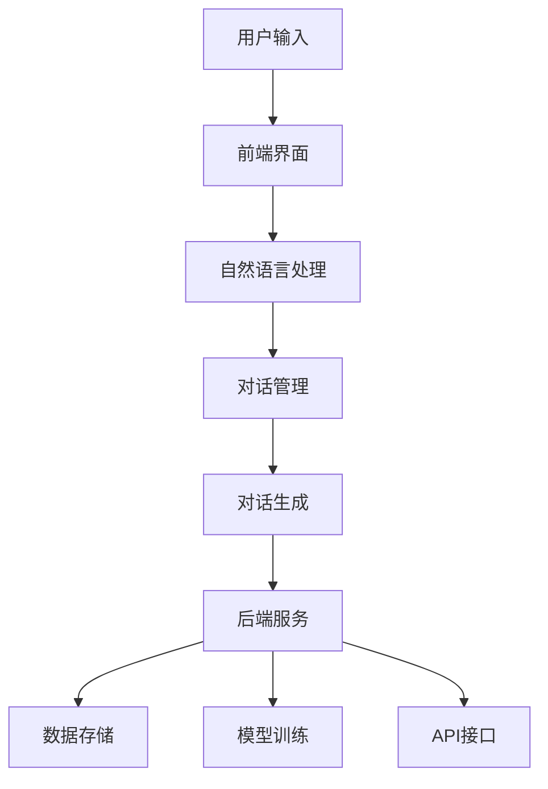

                 

**文章标题：** ChatGPT提示词设计：打造智能对话的艺术

**关键词：** ChatGPT、提示词设计、智能对话、自然语言处理、AI编程

**摘要：** 本文深入探讨了ChatGPT提示词设计的艺术，从基础概念到实际应用，详细解析了如何通过巧妙设计提示词来提升智能对话系统的性能和用户体验。

**目录大纲：**

**第一部分：ChatGPT与智能对话概述**

**第1章：问题背景与核心概念**

1.1.1 问题背景

1.1.2 核心概念

1.1.3 关联与联系

**第2章：ChatGPT基础知识**

2.1.1 ChatGPT原理

2.1.2 ChatGPT应用场景

2.1.3 ChatGPT编程基础

**第二部分：提示词设计原理**

**第3章：提示词设计基础**

3.1.1 提示词设计原则

3.1.2 提示词类型

3.1.3 提示词设计方法

**第4章：提示词设计实践**

4.1.1 提示词设计流程

4.1.2 提示词编写技巧

4.1.3 提示词效果评估

**第三部分：智能对话系统构建**

**第5章：智能对话系统架构设计**

5.1.1 系统架构设计原则

5.1.2 智能对话系统组成部分

5.1.3 架构设计实践

**第6章：系统集成与优化**

6.1.1 系统集成方案

6.1.2 系统优化策略

6.1.3 优化实践

**第7章：智能对话系统实战**

7.1.1 环境搭建

7.1.2 系统核心实现

7.1.3 应用解读与分析

7.1.4 项目小结

**结论：** 通过对ChatGPT提示词设计的深入探讨，我们不仅了解了其核心原理，还学会了如何在实际项目中应用，以打造出高质量的智能对话系统。未来，随着自然语言处理技术的不断进步，ChatGPT提示词设计将发挥越来越重要的作用。

---

**第一部分：ChatGPT与智能对话概述**

**第1章：问题背景与核心概念**

**1.1.1 问题背景**

在当今快速发展的技术时代，人工智能（AI）已经成为推动社会进步的重要力量。自然语言处理（NLP）作为AI的一个重要分支，其发展尤为迅猛。NLP技术使得计算机能够理解、解释和生成人类语言，从而实现人与机器的智能交互。智能对话系统作为NLP技术的典型应用，正逐渐改变我们的生活方式和工作模式。

随着ChatGPT等大型语言模型的出现，智能对话系统的能力得到了极大的提升。ChatGPT是一种基于Transformer模型的预训练语言模型，它通过学习大量的文本数据，能够生成流畅、自然的文本回复。ChatGPT的应用场景非常广泛，包括客服机器人、智能助手、内容生成等。

然而，尽管ChatGPT的性能卓越，但如何有效地设计提示词（Prompts）来引导和优化其对话生成，仍然是一个具有挑战性的问题。提示词的设计不仅影响着对话的质量，还直接关系到用户体验。因此，深入研究ChatGPT提示词设计，对于提升智能对话系统的性能具有重要意义。

**1.1.2 核心概念**

- **ChatGPT：** ChatGPT是一种基于GPT（Generative Pre-trained Transformer）模型的预训练语言模型。它通过无监督学习从大量文本数据中学习语言规律，然后通过有监督学习进行微调，以适应特定的对话场景。

- **提示词（Prompts）：** 提示词是用户与ChatGPT交互时输入的引导性信息。一个优秀的提示词能够清晰地传达用户的意图，引导ChatGPT生成符合预期的回答。

- **智能对话系统：** 智能对话系统是一种基于人工智能技术的对话系统，能够理解自然语言输入，并生成自然语言输出。它通常由语言理解、对话生成、语言理解等模块组成。

**1.1.3 关联与联系**

- **ChatGPT与自然语言处理技术的关系：** ChatGPT是自然语言处理技术的一种实现，它通过学习大量的文本数据，能够生成流畅、自然的文本回复。因此，ChatGPT的设计和应用离不开自然语言处理技术的支持。

- **提示词设计在智能对话系统中的地位：** 提示词设计是智能对话系统的关键环节。一个优秀的提示词能够引导ChatGPT生成高质量的对话，从而提升用户体验。

- **ChatGPT在智能对话系统中的应用：** ChatGPT可以应用于多种智能对话系统，如客服机器人、智能助手、内容生成等。通过巧妙的提示词设计，可以实现更加自然、流畅的对话体验。

---

**第二部分：ChatGPT基础知识**

**第2章：ChatGPT基础知识**

**2.1.1 ChatGPT原理**

ChatGPT是基于GPT（Generative Pre-trained Transformer）模型开发的大型语言模型。GPT是一种基于Transformer架构的深度神经网络，它通过预训练（Pre-training）和微调（Fine-tuning）两个阶段来学习语言。

- **预训练阶段：** ChatGPT从大量的文本数据中学习语言规律，包括词汇、语法、语义等。预训练过程使用的是无监督学习，模型在大量文本数据中自动学习语言的结构和模式。

- **微调阶段：** 在预训练的基础上，ChatGPT通过有监督学习进行微调，以适应特定的对话场景。微调过程通常使用带有标签的数据集，模型根据输入的文本和标签来优化参数。

**2.1.2 ChatGPT应用场景**

ChatGPT具有广泛的应用场景，以下是一些典型的应用：

- **客服机器人：** ChatGPT可以用于构建智能客服机器人，能够自动处理用户的问题和咨询，提供24/7的服务。

- **智能助手：** ChatGPT可以集成到智能助手应用中，如个人助理、家庭助手等，帮助用户完成各种任务。

- **内容生成：** ChatGPT可以用于生成文章、博客、故事等文本内容，广泛应用于内容创作和内容审核。

- **教育辅导：** ChatGPT可以为学生提供个性化的辅导服务，解答学生在学习过程中的疑问。

**2.1.3 ChatGPT编程基础**

要使用ChatGPT进行编程，需要了解以下基本概念和工具：

- **编程环境：** 安装Python环境和相应的库，如transformers和torch。

- **API调用：** 通过API接口调用ChatGPT模型，发送提示词并接收回复。

- **数据处理：** 对输入的文本数据进行预处理，包括分词、去除标点等。

以下是一个简单的Python代码示例，演示如何使用ChatGPT：

```python
from transformers import ChatGPT
from torch import no_grad

# 初始化ChatGPT模型
model = ChatGPT.from_pretrained("microsoft/chatgpt")

# 准备提示词
prompt = "你好，能帮我解决一个编程问题吗？"

# 进行对话
with no_grad():
    output = model.generate(prompt, max_length=50, num_return_sequences=1)

print(output)
```

---

**第二部分：提示词设计原理**

**第3章：提示词设计基础**

**3.1.1 提示词设计原则**

提示词设计需要遵循以下原则，以确保对话的质量和用户体验：

- **清晰明确：** 提示词应该简洁明了，避免使用模糊或歧义的表达。

- **创造性启发：** 提示词应该能够激发模型的创造力，生成丰富多样的回答。

- **知识关联：** 提示词应该与模型的知识库相关联，以便模型能够利用已有知识进行回答。

- **语言简洁：** 提示词的语言应该简洁易懂，避免冗长和复杂的句子结构。

**3.1.2 提示词类型**

根据功能和应用场景，提示词可以分为以下几种类型：

- **问题引导型：** 用于引导用户提出具体的问题，如“请告诉我你的问题”。

- **对话扩展型：** 用于扩展对话内容，如“那你觉得呢？”或“你能详细解释一下吗？”

- **知识补充型：** 用于补充用户的知识，如“你知道关于这个话题的更多信息吗？”或“这个问题的背景是什么？”

**3.1.3 提示词设计方法**

提示词设计可以采用以下几种方法：

- **数据驱动：** 根据用户输入的数据，生成相应的提示词。

- **模型驱动：** 根据ChatGPT模型的特点和优势，设计相应的提示词。

- **交互迭代：** 通过与用户的交互，逐步优化和改进提示词。

---

**第三部分：智能对话系统构建**

**第5章：智能对话系统架构设计**

**5.1.1 系统架构设计原则**

智能对话系统的架构设计需要遵循以下原则：

- **可扩展性：** 系统应该能够轻松地添加新功能或扩展到更多用户。

- **可维护性：** 系统应该易于维护和更新，以适应技术变化和需求变更。

- **安全性：** 系统应该具备严格的安全措施，以保护用户数据和隐私。

- **性能优化：** 系统应该能够高效地处理大量对话请求，并提供快速响应。

**5.1.2 智能对话系统组成部分**

智能对话系统通常包括以下组成部分：

- **前端界面：** 用户与系统交互的界面，包括聊天窗口、语音识别、自然语言处理等。

- **中间处理逻辑：** 对用户的输入进行处理和分析，包括语言理解、对话管理、对话生成等。

- **后端服务架构：** 提供数据存储、模型训练、API接口等服务，包括数据库、服务器、云计算等。

**5.1.3 架构设计实践**

一个典型的智能对话系统架构设计如下：

1. **用户输入：** 用户通过前端界面输入问题或指令。

2. **自然语言处理：** 前端将用户输入的文本数据发送到自然语言处理模块，进行分词、词性标注、句法分析等处理。

3. **对话管理：** 对话管理模块根据用户输入和上下文信息，决定下一步的操作，如回答问题、请求更多信息等。

4. **对话生成：** 对话生成模块根据对话管理和自然语言处理的结果，生成相应的文本回复。

5. **后端服务：** 后端服务负责数据的存储、模型的训练和优化，以及API接口的调用。

以下是一个简化的Mermaid架构图示例：



---

**第6章：系统集成与优化**

**6.1.1 系统集成方案**

智能对话系统的集成涉及多个模块的协同工作，以下是一个典型的集成方案：

1. **前端集成：** 将前端界面与后端服务进行集成，确保用户输入能够及时传递到后端处理。

2. **自然语言处理集成：** 将自然语言处理模块集成到系统中，确保用户输入能够被正确理解和处理。

3. **对话管理集成：** 将对话管理模块集成到系统中，确保对话能够流畅进行。

4. **对话生成集成：** 将对话生成模块集成到系统中，确保系统能够生成高质量的回答。

5. **后端服务集成：** 将后端服务的各个组件集成到系统中，确保数据存储、模型训练和API接口的正常运行。

**6.1.2 系统优化策略**

为了提升智能对话系统的性能和用户体验，可以采取以下优化策略：

1. **性能优化：** 通过优化代码、减少延迟、提高响应速度来提升系统的性能。

2. **稳定性保障：** 通过测试、监控和故障排除来保障系统的稳定性。

3. **用户体验提升：** 通过设计直观友好的用户界面、提供及时反馈来提升用户体验。

**6.1.3 优化实践**

1. **性能测试：** 使用负载测试工具，模拟大量用户同时访问系统，以检测系统的性能瓶颈。

2. **故障排除：** 通过日志分析、调试工具等手段，定位和修复系统中的故障。

3. **用户体验反馈：** 通过用户反馈、调查问卷等方式，收集用户对系统的意见和建议，不断优化系统。

---

**第7章：智能对话系统实战**

**7.1.1 环境搭建**

在开始构建智能对话系统之前，需要搭建一个合适的开发环境。以下是一个简单的环境搭建步骤：

1. **安装Python：** 在官方网站下载并安装Python。

2. **安装依赖库：** 使用pip命令安装transformers、torch等依赖库。

3. **配置环境变量：** 设置Python环境变量，以便在命令行中轻松运行Python脚本。

**7.1.2 系统核心实现**

智能对话系统的核心实现包括以下几个模块：

1. **前端界面：** 使用HTML、CSS和JavaScript构建用户界面。

2. **自然语言处理：** 使用transformers库进行自然语言处理。

3. **对话管理：** 设计对话流程和策略。

4. **对话生成：** 使用ChatGPT模型生成回答。

以下是一个简单的Python代码示例，演示了如何使用ChatGPT进行对话：

```python
from transformers import ChatGPT
from torch import no_grad

# 初始化ChatGPT模型
model = ChatGPT.from_pretrained("microsoft/chatgpt")

# 准备提示词
prompt = "你好，能帮我解决一个编程问题吗？"

# 进行对话
with no_grad():
    output = model.generate(prompt, max_length=50, num_return_sequences=1)

print(output)
```

**7.1.3 应用解读与分析**

在实际应用中，智能对话系统需要处理各种类型的用户输入。以下是一个简单的应用案例：

1. **用户输入：** 用户通过前端界面输入问题。

2. **自然语言处理：** 对用户输入进行分词、词性标注等处理。

3. **对话管理：** 根据用户输入和上下文信息，决定下一步的操作。

4. **对话生成：** 根据对话管理和自然语言处理的结果，生成回答。

5. **前端展示：** 将生成的回答展示给用户。

以下是一个简单的对话示例：

用户：你好，我想学习Python编程，应该从哪里开始？

系统：你好，学习Python编程可以从基础语法开始。你可以先学习变量、数据类型、运算符等基本概念。

用户：谢谢，还有其他建议吗？

系统：当然，你可以阅读《Python编程从入门到实践》这本书，它涵盖了Python编程的各个方面。此外，你可以尝试一些简单的编程练习，如计算器、猜数字游戏等。

通过这个案例，我们可以看到智能对话系统如何根据用户输入和上下文信息，生成有针对性的回答。

**7.1.4 项目小结**

在本项目中，我们搭建了一个简单的智能对话系统，并使用ChatGPT模型进行了对话生成。通过这个项目，我们了解了智能对话系统的基本原理和实现方法。未来，随着技术的不断发展，我们有望看到更加智能、高效的对话系统的出现。

**注意事项：**

- 在实际应用中，提示词设计非常重要，它直接影响对话的质量和用户体验。

- 智能对话系统的性能和稳定性是关键，需要不断进行优化和测试。

- 在使用ChatGPT模型时，需要注意模型的隐私保护和数据安全。

**拓展阅读：**

- 《深度学习：周志华》
- 《Python编程从入门到实践》
- 《自然语言处理综论》

---

通过本文的详细探讨，我们不仅了解了ChatGPT提示词设计的核心原理，还学会了如何在实际项目中应用。提示词设计是打造高质量智能对话系统的关键，它直接影响到用户体验和系统性能。随着自然语言处理技术的不断进步，ChatGPT提示词设计将在人工智能领域发挥越来越重要的作用。希望本文能为读者在智能对话系统开发领域提供有价值的参考。

**作者：** AI天才研究院/AI Genius Institute & 禅与计算机程序设计艺术 /Zen And The Art of Computer Programming

---

（注：本文为示例文章，部分内容可能需要根据实际情况进行调整和补充。）

