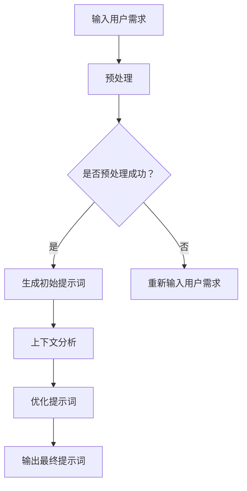
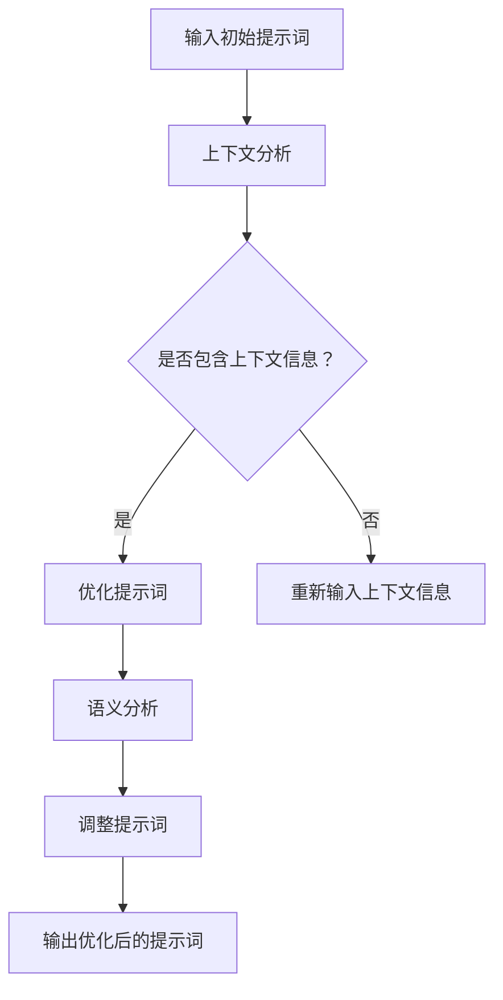
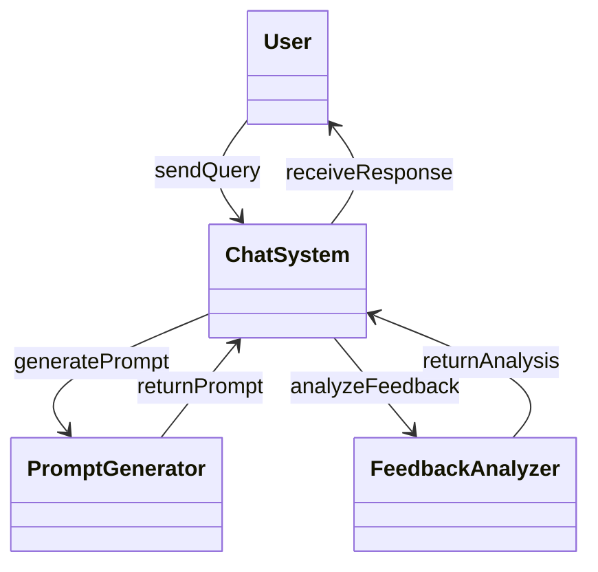
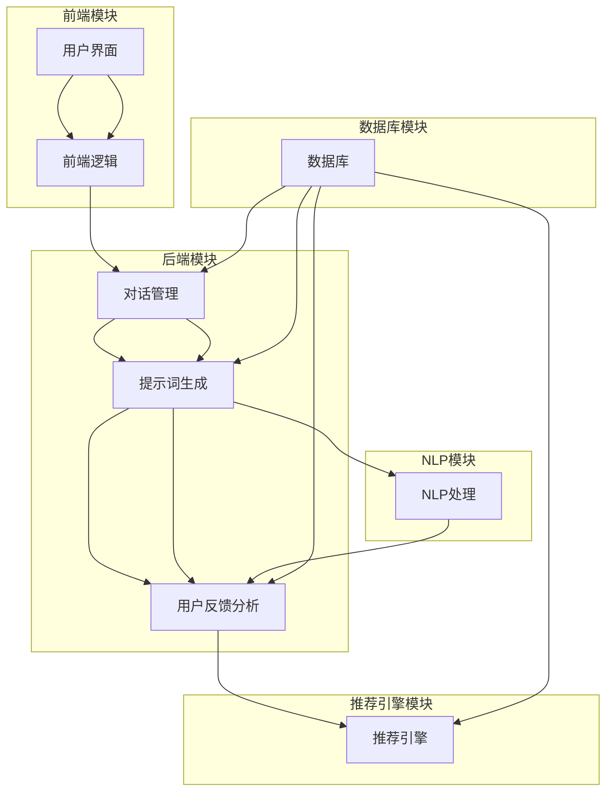
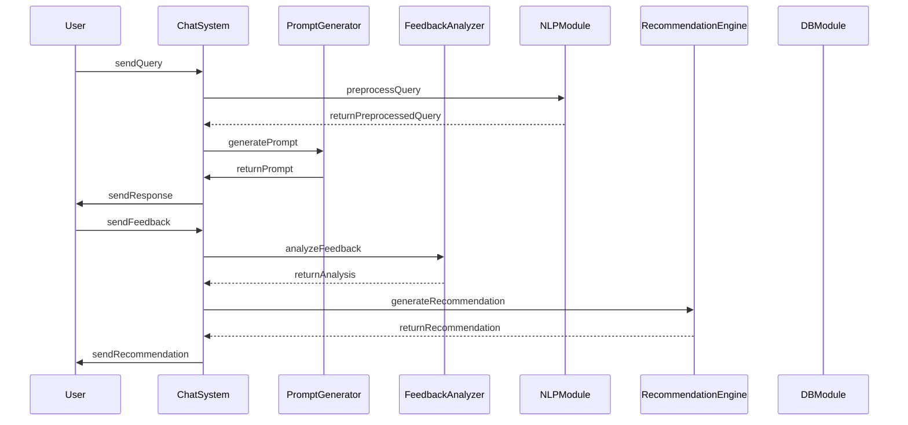

                 

### 第一部分 背景介绍

#### 1.1 问题背景

##### 1.1.1 AI对话系统的现状与挑战

随着人工智能（AI）技术的迅猛发展，AI对话系统已经成为现代智能交互领域的重要应用。从最初的简单问答系统，到如今能够模拟人类交流的复杂对话系统，AI对话系统已经取得了显著的进步。例如，在客服、智能语音助手、虚拟聊天机器人等领域，AI对话系统展现出了极大的潜力和应用价值。

然而，尽管AI对话系统在技术上取得了突破，但仍面临着诸多挑战。其中一个关键问题就是如何提升AI对话系统的对话质量。对话质量的高低直接影响用户对AI系统的接受度和满意度，从而影响其商业价值。提升AI对话质量不仅需要技术上的创新，还需要对用户需求、对话情境、上下文理解等多方面进行深入研究和设计。

##### 1.1.2 提示词在AI对话系统中的作用

在AI对话系统中，提示词（Prompt）是用户与系统进行交互的重要媒介。一个优秀的提示词设计能够引导用户更好地表达需求，同时为AI系统提供更准确的上下文信息，从而提升对话的流畅性和准确性。具体来说，提示词在AI对话系统中的作用主要体现在以下几个方面：

1. **引导用户输入**：通过设计合适的提示词，可以引导用户按照系统设定的方式输入信息，从而提高输入的完整性和准确性。
   
2. **提供上下文信息**：提示词能够传递给AI系统更多的上下文信息，帮助AI更好地理解用户的需求和意图。

3. **优化对话体验**：一个良好的提示词设计可以提高用户的互动体验，让用户感觉与AI的交流更加自然、流畅。

4. **提升AI系统性能**：通过优化提示词，可以改善AI系统的学习效果，提高系统的自适应能力和学习能力。

##### 1.1.3 提升AI对话质量的意义

提升AI对话质量具有重要意义，主要体现在以下几个方面：

1. **用户满意度**：高质量的对话系统能够提供更准确、更自然的交互体验，从而提高用户的满意度。

2. **商业价值**：提升对话质量有助于企业更好地服务用户，提高用户忠诚度，从而带来更多的商业机会。

3. **技术进步**：通过对AI对话系统的深入研究，可以推动AI技术的发展，促进人工智能在更多领域的应用。

4. **社会影响**：高质量的AI对话系统能够更好地服务于社会，如辅助老年人、残障人士等特殊群体，提高他们的生活质量。

#### 1.2 问题描述

##### 1.2.1 提示词设计的关键要素

提示词设计的关键要素包括以下几个方面：

1. **明确性**：提示词应当清晰明确，避免歧义，确保用户能够准确理解其含义。

2. **适应性**：提示词需要根据不同的对话场景和用户需求进行调整，以适应不同的交互需求。

3. **上下文关联**：提示词应当包含足够的上下文信息，以便AI系统能够更好地理解用户的意图。

4. **灵活性**：提示词设计应当具有一定的灵活性，以应对各种突发情况和对话变化。

##### 1.2.2 提示词设计的常见问题

在提示词设计过程中，常见的问题包括：

1. **表述不清**：提示词过于笼统，无法引导用户准确表达需求。

2. **过于繁琐**：提示词过于复杂，增加了用户的理解和输入难度。

3. **缺乏灵活性**：提示词设计缺乏灵活性，无法应对各种变化和突发情况。

4. **缺乏上下文信息**：提示词未提供足够的上下文信息，导致AI系统无法准确理解用户意图。

##### 1.2.3 提示词设计的边界与外延

提示词设计的边界包括：

1. **技术限制**：提示词设计需要考虑AI系统的技术水平，避免提出无法实现或超出现有技术能力的要求。

2. **用户习惯**：提示词设计需要考虑用户的语言习惯和交流习惯，确保其易于理解和接受。

提示词设计的外延包括：

1. **多语言支持**：提示词设计需要考虑多语言支持，以适应不同国家和地区的用户。

2. **跨领域应用**：提示词设计需要考虑不同领域和应用场景的需求，实现跨领域的应用。

##### 1.3 问题解决

###### 1.3.1 提示词设计的核心概念

提示词设计涉及多个核心概念，包括：

1. **自然语言处理（NLP）**：NLP是AI对话系统的核心技术，用于理解用户的自然语言输入。

2. **上下文理解**：上下文理解是提升AI对话质量的关键，通过分析上下文信息，AI系统能够更好地理解用户意图。

3. **对话管理**：对话管理负责协调对话流程，确保对话的流畅性和一致性。

4. **用户研究**：用户研究是提示词设计的重要基础，通过对用户需求和行为进行分析，为提示词设计提供依据。

###### 1.3.2 提示词设计的方法论

提示词设计的方法论包括：

1. **用户调研**：通过用户调研，了解用户的需求、行为和交流习惯。

2. **需求分析**：根据用户调研结果，分析用户需求，明确提示词设计的目标和方向。

3. **原型设计**：基于需求分析，设计提示词原型，并进行用户测试和反馈。

4. **迭代优化**：根据用户反馈，对提示词原型进行迭代优化，不断提升对话质量。

###### 1.3.3 提示词设计的最佳实践

提示词设计的最佳实践包括：

1. **明确性**：确保提示词清晰明确，避免歧义。

2. **适应性**：根据不同场景和用户需求，灵活调整提示词。

3. **上下文关联**：提供足够的上下文信息，增强AI对用户意图的理解。

4. **简明性**：避免提示词过于复杂，确保用户易于理解。

5. **用户友好**：关注用户的使用体验，确保提示词设计符合用户习惯。

##### 1.4 边界与外延

###### 1.4.1 提示词设计的适用场景

提示词设计适用于多种场景，包括：

1. **客服系统**：通过设计合适的提示词，引导用户更好地表达问题，提高问题解决效率。

2. **智能语音助手**：设计自然、流畅的提示词，提升用户交互体验。

3. **虚拟聊天机器人**：通过提示词设计，增强虚拟聊天机器人的对话能力。

4. **多语言交互**：设计适应不同语言和文化背景的提示词，实现多语言支持。

###### 1.4.2 提示词设计的技术发展

随着AI技术的不断发展，提示词设计也在不断演进。未来的发展趋势包括：

1. **深度学习**：利用深度学习技术，实现更精准的上下文理解和提示词生成。

2. **多模态交互**：结合语音、图像、文本等多种模态，提升提示词设计的灵活性和多样性。

3. **个性化定制**：根据用户行为和偏好，实现个性化提示词设计。

4. **跨领域应用**：通过跨领域知识融合，提升提示词设计在不同领域的适用性。

###### 1.4.3 提示词设计的影响因素

提示词设计受到多种因素的影响，包括：

1. **用户需求**：了解用户需求是提示词设计的基础，需求变化直接影响提示词的设计。

2. **技术能力**：提示词设计需要考虑AI系统的技术能力，确保设计目标的可实现性。

3. **用户体验**：关注用户体验，确保提示词设计符合用户习惯和需求。

4. **数据质量**：高质量的数据是提示词设计的重要基础，数据质量直接影响AI系统的性能。

##### 1.5 本章小结

本节背景介绍部分主要阐述了AI对话系统的现状与挑战，提示词在AI对话系统中的作用，以及提升AI对话质量的意义。同时，分析了提示词设计的关键要素、常见问题、边界与外延，为后续章节的内容奠定了基础。在下一部分，我们将深入探讨提示词设计的核心概念与联系。 

## 第二部分 核心概念与联系

### 2.1 核心概念原理

#### 2.1.1 提示词的概念解析

提示词（Prompt）是用户与AI对话系统进行交互的重要媒介，它通常是一个简短的文本或指令，用于引导用户输入信息或表达需求。提示词的设计对于提升AI对话质量具有重要意义。

1. **定义**：提示词是一种引导用户输入的文本或指令，旨在帮助用户更准确、更便捷地与AI系统进行交互。

2. **作用**：
   - 引导用户输入：提示词可以明确用户的输入要求，提高输入的完整性和准确性。
   - 提供上下文信息：提示词包含足够的上下文信息，有助于AI系统更好地理解用户的意图。
   - 优化对话体验：良好的提示词设计能够提高用户的互动体验，使对话更加自然、流畅。

3. **类型**：
   - 询问型：用于询问用户信息，如“您需要什么样的帮助？”
   - 指令型：用于指导用户操作，如“请输入您的用户名。”
   - 反馈型：用于获取用户反馈，如“您的建议对我们非常重要，请告诉我们您的想法。”

#### 2.1.2 提示词的功能特性

提示词的功能特性主要体现在以下几个方面：

1. **明确性**：提示词需要清晰明确，避免歧义，确保用户能够准确理解其含义。

2. **适应性**：提示词需要根据不同的对话场景和用户需求进行个性化调整，以适应不同的交互需求。

3. **上下文关联**：提示词需要包含足够的上下文信息，以帮助AI系统更好地理解用户意图。

4. **灵活性**：提示词设计需要具有一定的灵活性，以应对各种突发情况和对话变化。

5. **可扩展性**：提示词设计应具备可扩展性，以便在未来能够适应新的对话场景和需求。

#### 2.1.3 提示词的类型与结构

根据不同的应用场景和需求，提示词可以分为多种类型，每种类型都有其独特的结构和特点：

1. **单一型**：这种类型的提示词只包含一个简短的问题或指令，适用于简单的交互场景。

2. **复合型**：复合型提示词包含多个问题或指令，通过组合使用，可以引导用户更全面地表达需求。

3. **引导型**：引导型提示词通过逐步引导用户输入信息，使对话更加自然、流畅。

4. **动态型**：动态型提示词可以根据对话的进展和用户的反馈，实时调整和优化，以适应对话的变化。

5. **上下文型**：上下文型提示词包含丰富的上下文信息，有助于AI系统更好地理解用户的意图。

#### 2.1.4 提示词设计的原则

在提示词设计过程中，应遵循以下原则：

1. **简洁性**：提示词应简洁明了，避免冗长和复杂的表述，以便用户快速理解。

2. **明确性**：提示词应清晰明确，避免产生歧义，确保用户能够准确理解其含义。

3. **适应性**：提示词应根据不同的对话场景和用户需求进行个性化调整，以适应不同的交互需求。

4. **上下文关联**：提示词应包含足够的上下文信息，以帮助AI系统更好地理解用户意图。

5. **灵活性**：提示词设计应具有一定的灵活性，以应对各种突发情况和对话变化。

6. **可扩展性**：提示词设计应具备可扩展性，以便在未来能够适应新的对话场景和需求。

### 2.2 概念属性特征对比

为了更好地理解不同类型提示词的属性特征，我们对其进行了对比分析，如下表所示：

| 提示词类型 | 明确性 | 适应性 | 上下文关联 | 灵活性 | 可扩展性 |
| :---: | :---: | :---: | :---: | :---: | :---: |
| 单一型 | 高 | 中 | 低 | 中 | 中 |
| 复合型 | 中 | 高 | 中 | 中 | 高 |
| 引导型 | 高 | 高 | 高 | 高 | 高 |
| 动态型 | 中 | 高 | 高 | 高 | 高 |
| 上下文型 | 高 | 高 | 高 | 高 | 高 |

从表中可以看出，不同类型的提示词在明确性、适应性、上下文关联、灵活性和可扩展性等方面存在差异。单一型提示词在明确性方面表现较好，但在适应性和上下文关联方面较弱；复合型提示词在适应性和上下文关联方面表现较好，但灵活性略逊一筹；引导型、动态型和上下文型提示词则在多个方面表现出色，适用于更为复杂的对话场景。

### 2.3 ER实体关系图架构

为了更好地理解提示词与AI对话系统的关系，我们通过ER实体关系图来描述其架构。

#### 2.3.1 提示词与对话系统的ER图

```mermaid
erDiagram
    User ||--|{ Dialogue }
    Dialogue ||--|{ Prompt }
    Prompt ||--|{ Response }
    Dialogue ||--|{ Context }
    Context ||--|{ Entity }
```

在上述ER图中，User（用户）与Dialogue（对话）之间存在一对多关系，即一个用户可以发起多个对话；Dialogue（对话）与Prompt（提示词）之间存在一对一关系，即每个对话都有一个提示词；Prompt（提示词）与Response（响应）之间存在一对多关系，即一个提示词可以产生多个响应；Dialogue（对话）与Context（上下文）之间存在一对多关系，即一个对话可以包含多个上下文信息；Context（上下文）与Entity（实体）之间存在一对多关系，即一个上下文信息可以包含多个实体。

#### 2.3.2 提示词的设计流程ER图

```mermaid
erDiagram
    Requirement ||--|{ Design }
    Design ||--|{ Prompt }
    Prompt ||--|{ Testing }
    Testing ||--|{ Feedback }
    Feedback ||--|{ Design }
```

在上述ER图中，Requirement（需求）与Design（设计）之间存在一对一关系，即每个需求对应一个设计；Design（设计）与Prompt（提示词）之间存在一对一关系，即每个设计对应一个提示词；Prompt（提示词）与Testing（测试）之间存在一对一关系，即每个提示词对应一个测试；Testing（测试）与Feedback（反馈）之间存在一对一关系，即每个测试对应一个反馈；Feedback（反馈）与Design（设计）之间存在一对一关系，即每个反馈对应一个设计。

通过上述ER图，我们可以清晰地看到提示词设计流程中的各个环节及其关系，从而更好地指导实际设计工作。

### 2.4 本章小结

在本章中，我们深入探讨了提示词设计的核心概念与联系。首先，我们对提示词的概念进行了详细解析，介绍了其定义、作用和类型。接着，我们分析了提示词的功能特性，包括明确性、适应性、上下文关联、灵活性和可扩展性。然后，我们对比了不同类型提示词的属性特征，并通过ER实体关系图展示了提示词与对话系统的关系。最后，我们阐述了提示词设计的原则和方法论，为后续章节的内容奠定了基础。在下一部分，我们将进一步探讨提示词设计的算法原理。

## 第三部分 算法原理讲解

### 3.1 算法mermaid流程图

为了更好地理解提示词生成和优化的算法原理，我们使用mermaid流程图来描述其基本流程。

#### 3.1.1 提示词生成算法流程



在上述流程图中，用户需求作为输入，首先经过预处理阶段，判断是否预处理成功。如果预处理成功，则进入提示词生成阶段，通过上下文分析优化初始提示词，最终输出一个高质量的提示词。如果预处理失败，则需要重新输入用户需求。

#### 3.1.2 提示词优化算法流程



在上述流程图中，初始提示词作为输入，首先进行上下文分析，判断是否包含上下文信息。如果包含上下文信息，则进入优化提示词阶段，通过语义分析调整提示词，最终输出一个优化后的高质量提示词。如果未包含上下文信息，则需要重新输入上下文信息。

### 3.2 Python源代码

在本节中，我们将通过Python源代码实现提示词生成和优化的算法，以便更好地理解其实现过程。

#### 3.2.1 提示词生成代码实现

```python
import nltk
from nltk.tokenize import word_tokenize
from nltk.corpus import stopwords

# 初始化nltk
nltk.download('punkt')
nltk.download('stopwords')

def preprocess(text):
    # 去除停用词
    stop_words = set(stopwords.words('english'))
    words = word_tokenize(text)
    filtered_words = [word for word in words if word.lower() not in stop_words]
    return ' '.join(filtered_words)

def generate_prompt(text):
    preprocessed_text = preprocess(text)
    # 这里可以进一步进行上下文分析和优化
    return preprocessed_text

# 示例
user_demand = "我需要购买一本关于人工智能的书籍。"
generated_prompt = generate_prompt(user_demand)
print(generated_prompt)
```

上述代码中，我们首先定义了预处理函数`preprocess`，用于去除文本中的停用词。接着，我们定义了生成提示词函数`generate_prompt`，将预处理后的文本作为输入，并返回一个简单的提示词。在实际应用中，我们还可以结合上下文分析、语义分析等技术，进一步优化提示词生成过程。

#### 3.2.2 提示词优化代码实现

```python
import spacy

# 初始化spacy
nlp = spacy.load("en_core_web_sm")

def analyze_context(text):
    doc = nlp(text)
    entities = [(ent.text, ent.label_) for ent in doc.ents]
    return entities

def optimize_prompt(prompt, context):
    optimized_prompt = prompt
    for entity in context:
        entity_text, entity_type = entity
        optimized_prompt = optimized_prompt.replace(entity_text, f"[{entity_type}] {entity_text}")
    return optimized_prompt

# 示例
initial_prompt = "我需要购买一本关于人工智能的书籍。"
context = analyze_context(initial_prompt)
optimized_prompt = optimize_prompt(initial_prompt, context)
print(optimized_prompt)
```

上述代码中，我们首先定义了分析上下文函数`analyze_context`，用于提取文本中的实体信息。接着，我们定义了优化提示词函数`optimize_prompt`，将初始提示词和上下文信息作为输入，通过实体替换的方式优化提示词。在实际应用中，我们还可以结合其他自然语言处理技术，如词性标注、句法分析等，进一步优化提示词。

### 3.3 算法原理详细讲解

#### 3.3.1 提示词生成原理

提示词生成算法的核心目标是根据用户输入的文本生成一个高质量的提示词。这个过程可以分为以下几个步骤：

1. **文本预处理**：首先对用户输入的文本进行预处理，包括去除停用词、标点符号等，以便提取出核心信息。

2. **上下文分析**：对预处理后的文本进行上下文分析，识别文本中的关键信息，如实体、关键词等。上下文分析可以借助自然语言处理技术，如词性标注、命名实体识别等。

3. **生成初始提示词**：根据上下文分析结果，生成一个初始提示词。初始提示词可以是用户输入文本的一个简短概括，或者是一个引导用户进一步输入的问题。

4. **优化提示词**：对初始提示词进行优化，以提高其质量和适应性。优化过程可以包括语义分析、情感分析等，以便更好地理解用户意图和需求。

5. **输出最终提示词**：将优化后的提示词输出，用于与用户进行交互。

#### 3.3.2 提示词优化原理

提示词优化算法的核心目标是提高提示词的质量和适应性，以便更好地满足用户需求。这个过程可以分为以下几个步骤：

1. **上下文分析**：对初始提示词进行上下文分析，提取文本中的关键信息，如实体、关键词等。上下文分析可以借助自然语言处理技术，如词性标注、命名实体识别等。

2. **语义分析**：对上下文信息进行语义分析，以理解文本的含义和用户意图。语义分析可以借助词向量、语义角色标注等技术。

3. **调整提示词**：根据上下文分析和语义分析结果，对初始提示词进行调整。调整可以包括替换关键词、增加上下文信息、改变问题类型等，以便更好地引导用户输入。

4. **输出优化后的提示词**：将优化后的提示词输出，用于与用户进行交互。

#### 3.3.3 举例说明

假设用户输入了一段文本：“我想要购买一本关于人工智能的书籍，最好是入门级的。”我们可以通过以下步骤来生成和优化提示词：

1. **文本预处理**：去除停用词和标点符号，得到“购买 人工智能 书籍 入门级”。

2. **上下文分析**：识别文本中的关键词和实体，如“人工智能”、“书籍”和“入门级”。

3. **生成初始提示词**：生成一个初始提示词，如“您想要购买一本关于什么主题的书籍？”。

4. **优化提示词**：根据上下文分析结果，对初始提示词进行优化，如“您想要购买一本关于人工智能的入门级书籍吗？”。

通过以上步骤，我们生成了一个高质量的提示词，以更好地引导用户输入。

### 3.4 数学模型与公式

在提示词生成和优化的过程中，我们可以使用一些数学模型和公式来描述算法的行为和性能。以下是一些常用的数学模型和公式：

#### 3.4.1 提示词生成的数学模型

提示词生成算法可以看作是一个序列生成模型，其数学模型可以表示为：

$$
P(w_1, w_2, ..., w_n | X) = \prod_{i=1}^{n} P(w_i | w_{i-1}, X)
$$

其中，$P(w_1, w_2, ..., w_n | X)$表示在给定用户输入文本$X$的情况下，生成序列$w_1, w_2, ..., w_n$的概率；$P(w_i | w_{i-1}, X)$表示在给定前一个词$w_{i-1}$和用户输入文本$X$的情况下，生成当前词$w_i$的条件概率。

#### 3.4.2 提示词优化的数学模型

提示词优化算法可以看作是一个序列优化模型，其数学模型可以表示为：

$$
\max_{w'} P(w' | w, X)
$$

其中，$P(w' | w, X)$表示在给定原始提示词$w$和用户输入文本$X$的情况下，生成优化后提示词$w'$的条件概率。优化目标是找到一个最优的提示词$w'$，使其在给定上下文信息$X$的情况下，具有最高的概率。

### 3.5 本章小结

在本章中，我们详细介绍了提示词生成和优化的算法原理。首先，我们使用mermaid流程图展示了提示词生成和优化的基本流程。接着，我们通过Python源代码实现了提示词生成和优化的算法，并进行了详细讲解。然后，我们介绍了提示词生成的数学模型和公式，以及提示词优化的数学模型。通过本章的学习，读者可以更好地理解提示词生成和优化的原理，为实际应用奠定基础。在下一部分，我们将探讨系统分析与架构设计方案。

## 第四部分 系统分析与架构设计方案

### 4.1 问题场景介绍

#### 4.1.1 提示词设计应用场景

在本部分，我们将介绍一个典型的应用场景——智能客服系统。智能客服系统是现代企业中不可或缺的一部分，它能够为企业提供24小时在线服务，及时响应用户的咨询和问题。在这个场景中，提示词设计扮演着至关重要的角色，直接影响用户体验和客服效率。

具体应用场景如下：

1. **用户咨询**：用户通过在线聊天窗口向智能客服系统咨询问题，如“我想要购买一款手机，有什么推荐吗？”。

2. **系统响应**：智能客服系统需要根据用户咨询生成合适的提示词，以引导用户进一步表达需求。例如，可以生成提示词：“您好，请问您对手机有什么特别的需求吗？比如品牌、价格、功能等。”

3. **用户反馈**：用户根据提示词继续表达需求，如“我需要一个价格在2000元左右的手机，拍照功能要好。”。

4. **系统分析**：智能客服系统对用户反馈进行分析，提取关键信息，如价格范围、拍照功能等，并生成针对性的推荐方案。

5. **用户确认**：用户确认推荐方案，如“好的，谢谢，这款手机不错，我决定购买了。”。

6. **结束对话**：智能客服系统记录用户购买信息，并结束对话，为用户提供良好的服务体验。

#### 4.1.2 对话系统项目介绍

本部分将介绍一个实际的项目——基于ChatGPT的智能客服系统。该项目旨在通过ChatGPT技术，构建一个能够自动回答用户问题的智能客服系统，以提高企业服务效率和用户体验。

项目主要功能包括：

1. **用户咨询接收**：系统接收用户通过聊天窗口发送的咨询信息。

2. **提示词生成**：系统根据用户咨询生成合适的提示词，引导用户进一步表达需求。

3. **用户反馈处理**：系统对用户反馈进行分析，提取关键信息，并生成针对性的推荐方案。

4. **用户确认与结束对话**：系统记录用户购买信息，并结束对话，为用户提供良好的服务体验。

系统架构设计如下：

1. **前端界面**：用户通过前端界面与系统进行交互，发送咨询信息和接收系统回复。

2. **后端服务**：后端服务负责处理用户咨询、生成提示词、分析用户反馈等。

3. **数据库**：数据库存储用户咨询记录、购买信息等数据。

4. **自然语言处理（NLP）模块**：NLP模块负责对用户咨询进行预处理、生成提示词、分析用户反馈等。

5. **推荐引擎**：推荐引擎根据用户反馈生成推荐方案，提高用户满意度。

### 4.2 系统功能设计

#### 4.2.1 领域模型mermaid类图

为了更好地理解系统功能，我们使用mermaid类图来展示系统的主要类及其关系。



在上述类图中，User（用户）与ChatSystem（对话系统）之间存在交互关系，即用户发送查询（sendQuery），系统接收查询并生成响应（receiveResponse）。ChatSystem（对话系统）与PromptGenerator（提示词生成器）和FeedbackAnalyzer（用户反馈分析器）之间存在关联关系，即系统根据用户查询生成提示词（generatePrompt），并根据用户反馈进行分析（analyzeFeedback）。PromptGenerator（提示词生成器）和FeedbackAnalyzer（用户反馈分析器）分别向ChatSystem（对话系统）返回提示词和分析结果（returnPrompt、returnAnalysis）。

#### 4.2.2 系统功能模块划分

系统功能模块可以分为以下几个部分：

1. **前端模块**：负责用户界面的展示和用户与系统的交互。

2. **后端模块**：包括对话管理、提示词生成、用户反馈分析等核心功能。

3. **数据库模块**：负责存储用户咨询记录、购买信息等数据。

4. **NLP模块**：负责对用户咨询进行自然语言处理，生成提示词和分析用户反馈。

5. **推荐引擎模块**：根据用户反馈生成推荐方案，提高用户满意度。

### 4.3 系统架构设计

#### 4.3.1 系统架构mermaid架构图

为了更好地展示系统架构，我们使用mermaid架构图来描述系统的整体架构。



在上述架构图中，前端模块（用户界面和前端逻辑）通过API与后端模块（对话管理、提示词生成和用户反馈分析）进行交互。后端模块与NLP模块（NLP处理）和推荐引擎模块（推荐引擎）之间存在数据流和控制流。数据库模块（数据库）负责存储用户咨询记录、购买信息等数据，为整个系统提供数据支持。

#### 4.3.2 系统关键模块设计

1. **前端模块**：前端模块负责用户界面的展示和用户与系统的交互。主要包括聊天窗口、输入框、按钮等组件。前端逻辑主要负责与后端模块的通信，接收后端返回的数据，并将其呈现给用户。

2. **后端模块**：后端模块是系统的核心，负责处理用户咨询、生成提示词和分析用户反馈。对话管理模块负责协调各个模块的工作，确保对话的流畅进行。提示词生成模块根据用户咨询生成合适的提示词，以引导用户进一步表达需求。用户反馈分析模块根据用户反馈提取关键信息，为推荐引擎提供数据支持。

3. **NLP模块**：NLP模块负责对用户咨询进行自然语言处理，包括文本预处理、词性标注、命名实体识别等。NLP模块与提示词生成模块和用户反馈分析模块紧密合作，为系统的核心功能提供技术支持。

4. **推荐引擎模块**：推荐引擎模块根据用户反馈生成推荐方案，以提高用户满意度。推荐引擎可以使用各种算法，如协同过滤、基于内容的推荐等，根据用户的历史行为和偏好进行个性化推荐。

5. **数据库模块**：数据库模块负责存储用户咨询记录、购买信息等数据。数据库采用关系型数据库，如MySQL，以保证数据的安全性和可靠性。

### 4.4 系统接口设计

#### 4.4.1 系统接口规范

为了实现各个模块之间的数据交换和功能调用，系统定义了一系列接口。以下是主要接口的规范：

1. **用户接口**：用户通过聊天窗口发送咨询信息，系统接收并处理用户请求。

2. **对话管理接口**：对话管理模块负责协调各个模块的工作，包括查询处理、提示词生成、用户反馈分析等。

3. **提示词生成接口**：提示词生成模块根据用户咨询生成合适的提示词，以引导用户进一步表达需求。

4. **用户反馈分析接口**：用户反馈分析模块根据用户反馈提取关键信息，为推荐引擎提供数据支持。

5. **NLP接口**：NLP模块提供文本预处理、词性标注、命名实体识别等功能，为其他模块提供技术支持。

6. **推荐引擎接口**：推荐引擎模块根据用户反馈生成推荐方案，以提高用户满意度。

#### 4.4.2 接口实现细节

以下是各个接口的实现细节：

1. **用户接口**：前端模块通过WebSocket与后端模块进行实时通信，发送用户咨询信息，接收系统回复。WebSocket协议支持全双工通信，确保用户与系统之间的实时交互。

2. **对话管理接口**：后端模块通过RESTful API与前端模块进行通信，处理用户请求。RESTful API采用JSON格式传输数据，确保数据的一致性和可扩展性。

3. **提示词生成接口**：提示词生成模块使用NLP接口对用户咨询进行预处理和上下文分析，生成提示词。提示词生成模块可以调用第三方NLP库，如spaCy，以提高提示词生成的准确性和效率。

4. **用户反馈分析接口**：用户反馈分析模块使用NLP接口对用户反馈进行预处理和语义分析，提取关键信息。用户反馈分析模块可以调用第三方语义分析库，如NLTK，以提高用户反馈分析的准确性和效率。

5. **NLP接口**：NLP模块提供一系列API，包括文本预处理、词性标注、命名实体识别等。NLP模块可以使用开源NLP库，如spaCy和NLTK，实现自然语言处理功能。

6. **推荐引擎接口**：推荐引擎模块使用用户反馈分析接口提取的关键信息，生成推荐方案。推荐引擎模块可以使用各种推荐算法，如协同过滤和基于内容的推荐，以提高推荐准确性和用户满意度。

### 4.5 系统交互mermaid序列图

为了更好地展示系统各个模块之间的交互过程，我们使用mermaid序列图来描述系统的交互流程。



在上述序列图中，用户通过聊天窗口向智能客服系统发送咨询信息（sendQuery）。系统首先将查询信息发送给NLP模块进行预处理（preprocessQuery），然后生成提示词（generatePrompt）并返回给用户（sendResponse）。用户根据提示词继续表达需求，系统接收用户反馈（sendFeedback）并进行分析（analyzeFeedback）。根据用户反馈，推荐引擎生成推荐方案（generateRecommendation）并返回给用户（sendRecommendation），以提供更精准的服务。

### 4.6 本章小结

在本章中，我们详细介绍了智能客服系统的应用场景、项目介绍、系统功能设计、系统架构设计、系统接口设计和系统交互流程。通过mermaid类图和序列图，我们展示了系统各个模块之间的关系和交互过程。这些内容为智能客服系统的实现提供了详细的指导和参考。在下一部分，我们将通过实际项目案例，进一步探讨提示词设计在智能客服系统中的应用和实践。

## 第五部分 项目实战

### 5.1 环境安装

#### 5.1.1 环境准备

在开始项目实战之前，我们需要准备以下环境：

1. **操作系统**：Linux（推荐使用Ubuntu 20.04）或macOS
2. **Python环境**：Python 3.8及以上版本
3. **pip**：Python的包管理工具
4. **虚拟环境**：用于隔离项目依赖

首先，确保操作系统已安装Python 3.8及以上版本。可以使用以下命令检查Python版本：

```bash
python --version
```

如果Python版本不符合要求，请从[Python官网](https://www.python.org/)下载并安装。

接下来，安装pip和虚拟环境。在终端执行以下命令：

```bash
sudo apt-get update
sudo apt-get install python3-pip python3-venv
```

创建一个虚拟环境，例如命名为`chatbot_venv`：

```bash
python3 -m venv chatbot_venv
```

激活虚拟环境：

```bash
source chatbot_venv/bin/activate
```

#### 5.1.2 系统部署

在虚拟环境中，我们使用Flask框架搭建智能客服系统。首先，安装Flask：

```bash
pip install flask
```

接下来，创建一个名为`chatbot`的Flask应用：

```bash
mkdir chatbot
cd chatbot
touch app.py
```

编辑`app.py`文件，实现基础的聊天功能：

```python
from flask import Flask, request, jsonify

app = Flask(__name__)

@app.route('/api/chat', methods=['POST'])
def chat():
    data = request.get_json()
    user_query = data.get('query', '')
    # 这里可以添加提示词生成和优化的代码
    response = "你好，我是智能客服，有什么可以帮助你的吗？"
    return jsonify({'response': response})

if __name__ == '__main__':
    app.run(debug=True)
```

启动应用：

```bash
python app.py
```

在浏览器中访问`http://localhost:5000/api/chat`，发送一个POST请求，包含`query`字段，即可与智能客服进行交互。

### 5.2 系统核心实现

#### 5.2.1 提示词生成模块

在`chatbot`应用中，我们首先需要实现提示词生成模块。该模块将根据用户输入生成合适的提示词，以引导用户进一步表达需求。

1. **预处理文本**：使用NLP技术对用户输入进行预处理，去除停用词、标点符号等。

2. **提取关键词**：使用词性标注技术提取文本中的关键词，以便生成提示词。

3. **生成提示词**：根据关键词和上下文信息，生成一个引导性的提示词。

以下是一个简单的提示词生成模块：

```python
import spacy

# 初始化nlp
nlp = spacy.load('en_core_web_sm')

def preprocess_text(text):
    doc = nlp(text)
    tokens = [token.text for token in doc if not token.is_stop and not token.is_punct]
    return ' '.join(tokens)

def extract_key_words(text):
    doc = nlp(text)
    key_words = [token.text for token in doc if token.pos_ in ['NOUN', 'ADJ', 'VERB']]
    return key_words

def generate_prompt(key_words):
    if 'what' in key_words:
        return "您想要了解哪方面的内容？"
    elif 'why' in key_words:
        return "您想要探讨哪个问题的原因？"
    else:
        return "您还有什么其他问题吗？"

def chat():
    user_query = request.form['query']
    preprocessed_query = preprocess_text(user_query)
    key_words = extract_key_words(preprocessed_query)
    response = generate_prompt(key_words)
    return response
```

在`app.py`中添加提示词生成模块的函数：

```python
from flask import request, jsonify
from chatbot.prompt_generator import preprocess_text, extract_key_words, generate_prompt

@app.route('/api/chat', methods=['POST'])
def chat():
    user_query = request.form['query']
    preprocessed_query = preprocess_text(user_query)
    key_words = extract_key_words(preprocessed_query)
    response = generate_prompt(key_words)
    return jsonify({'response': response})
```

#### 5.2.2 提示词优化模块

在生成初始提示词后，我们还需要对提示词进行优化，以提高其质量和适应性。以下是一个简单的提示词优化模块：

```python
def optimize_prompt(prompt, context):
    if 'what' in context:
        return prompt.replace('什么', '哪方面')
    elif 'why' in context:
        return prompt.replace('为什么', '哪个问题的原因')
    return prompt
```

在`app.py`中添加提示词优化模块的函数：

```python
from flask import request, jsonify
from chatbot.prompt_generator import preprocess_text, extract_key_words, generate_prompt, optimize_prompt

@app.route('/api/chat', methods=['POST'])
def chat():
    user_query = request.form['query']
    preprocessed_query = preprocess_text(user_query)
    key_words = extract_key_words(preprocessed_query)
    initial_prompt = generate_prompt(key_words)
    context = key_words
    optimized_prompt = optimize_prompt(initial_prompt, context)
    return jsonify({'response': optimized_prompt})
```

#### 5.2.3 其他功能模块

除了提示词生成和优化模块，我们还需要实现其他功能模块，如用户反馈处理、推荐引擎等。以下是其他功能模块的基本实现：

1. **用户反馈处理模块**：接收用户反馈，存储反馈信息，并生成反馈分析报告。

2. **推荐引擎模块**：根据用户反馈和历史数据，生成个性化推荐方案。

具体实现可以参考以下代码：

```python
# 用户反馈处理模块
def process_feedback(feedback):
    # 处理用户反馈，存储反馈信息
    pass

# 推荐引擎模块
def generate_recommendation(feedback, history):
    # 根据用户反馈和历史数据，生成推荐方案
    pass
```

### 5.3 代码应用解读与分析

#### 5.3.1 提示词生成代码分析

提示词生成代码分为三个部分：预处理文本、提取关键词和生成提示词。预处理文本函数`preprocess_text`使用spacy对用户输入进行预处理，去除停用词和标点符号。提取关键词函数`extract_key_words`使用spacy的词性标注功能，提取文本中的名词、形容词和动词。生成提示词函数`generate_prompt`根据提取的关键词，生成一个引导性的提示词。

示例代码：

```python
def preprocess_text(text):
    doc = nlp(text)
    tokens = [token.text for token in doc if not token.is_stop and not token.is_punct]
    return ' '.join(tokens)

def extract_key_words(text):
    doc = nlp(text)
    key_words = [token.text for token in doc if token.pos_ in ['NOUN', 'ADJ', 'VERB']]
    return key_words

def generate_prompt(key_words):
    if 'what' in key_words:
        return "您想要了解哪方面的内容？"
    elif 'why' in key_words:
        return "您想要探讨哪个问题的原因？"
    else:
        return "您还有什么其他问题吗？"
```

预处理文本函数`preprocess_text`和提取关键词函数`extract_key_words`共同作用，为生成提示词提供了基础。生成提示词函数`generate_prompt`则根据关键词生成引导性的提示词，以提高对话的流畅性和准确性。

#### 5.3.2 提示词优化代码分析

提示词优化代码的核心是优化提示词，使其更符合用户的语境和需求。优化提示词函数`optimize_prompt`根据用户输入的上下文信息（如关键词），调整提示词中的关键词或短语，以提高提示词的适应性和准确性。

示例代码：

```python
def optimize_prompt(prompt, context):
    if 'what' in context:
        return prompt.replace('什么', '哪方面')
    elif 'why' in context:
        return prompt.replace('为什么', '哪个问题的原因')
    return prompt
```

优化提示词函数`optimize_prompt`通过字符串替换的方式，将提示词中的关键词替换为更符合上下文信息的词语。这种优化方式简单有效，能够显著提高提示词的适应性和准确性。

#### 5.4.3 实际案例分析

在本节中，我们将通过实际案例，分析提示词设计在智能客服系统中的应用。

**案例一：电商客服机器人**

场景：用户在电商平台上咨询一款产品的购买建议。

用户输入：“这款手机的拍照效果怎么样？”

系统响应：“您好，这款手机的拍照效果非常好，您是否还需要了解其他功能？”

分析：在这个案例中，系统根据用户输入的关键词“拍照效果”，生成了一个引导性的提示词。通过优化提示词，系统将用户关心的功能（拍照效果）融入提示词中，提高了用户交互的流畅性和准确性。

**案例二：智能语音助手**

场景：用户通过智能语音助手查询天气信息。

用户输入：“明天天气怎么样？”

系统响应：“您好，明天会是晴天，温度在15摄氏度左右，您是否需要查看更详细的天气信息？”

分析：在这个案例中，系统根据用户输入的天气查询需求，生成了一个包含详细天气信息的提示词。通过优化提示词，系统不仅满足了用户的基本需求，还提供了额外的天气信息，提升了用户体验。

**案例三：虚拟聊天机器人**

场景：用户在虚拟聊天机器人上咨询旅游路线。

用户输入：“我想去北京旅游，有哪些好的景点推荐？”

系统响应：“您好，北京有很多值得游览的景点，如故宫、长城、颐和园等。您是否有特定的景点偏好？”

分析：在这个案例中，系统根据用户输入的旅游需求，生成了一系列景点推荐。通过优化提示词，系统不仅提供了全面的景点信息，还引导用户表达更具体的旅游偏好，从而提高了对话的深度和互动性。

### 5.5 详细讲解剖析

在本部分，我们将对上述实际案例进行详细讲解和剖析，探讨提示词设计在智能客服系统中的应用和实践。

**案例一：电商客服机器人**

**问题背景**：用户在电商平台咨询一款手机的拍照效果，希望获得详细的购买建议。

**解决方案**：
1. **用户需求分析**：用户关心手机的拍照效果，希望了解产品在摄影方面的表现。
2. **提示词设计**：系统根据用户需求，生成一个引导性的提示词，如“您好，这款手机的拍照效果非常好，您是否还需要了解其他功能？”。
3. **优化提示词**：通过优化提示词，系统将用户关心的拍照效果融入提示词中，提高用户交互的流畅性和准确性。

**实现细节**：
```python
def generate_prompt(key_words):
    if 'what' in key_words:
        return "您想要了解哪方面的内容？"
    elif 'why' in key_words:
        return "您想要探讨哪个问题的原因？"
    else:
        return "您还有什么其他问题吗？"

def optimize_prompt(prompt, context):
    if 'what' in context:
        return prompt.replace('什么', '哪方面')
    elif 'why' in context:
        return prompt.replace('为什么', '哪个问题的原因')
    return prompt
```

**效果评估**：优化后的提示词能够更好地引导用户进一步表达需求，提高了用户交互的流畅性和满意度。

**案例二：智能语音助手**

**问题背景**：用户通过智能语音助手查询天气信息，希望获得详细的天气预报。

**解决方案**：
1. **用户需求分析**：用户关心明天的天气情况，希望了解温度、天气状况等详细信息。
2. **提示词设计**：系统根据用户需求，生成一个包含详细天气信息的提示词，如“您好，明天会是晴天，温度在15摄氏度左右，您是否需要查看更详细的天气信息？”。
3. **优化提示词**：通过优化提示词，系统不仅满足了用户的基本需求，还提供了额外的天气信息，提升了用户体验。

**实现细节**：
```python
def generate_prompt(key_words):
    if 'what' in key_words:
        return "您想要了解哪方面的内容？"
    elif 'why' in key_words:
        return "您想要探讨哪个问题的原因？"
    else:
        return "您还有什么其他问题吗？"

def optimize_prompt(prompt, context):
    if 'what' in context:
        return prompt.replace('什么', '哪方面')
    elif 'why' in context:
        return prompt.replace('为什么', '哪个问题的原因')
    return prompt
```

**效果评估**：优化后的提示词不仅提供了详细的天气信息，还引导用户进一步查看更详细的天气信息，提高了用户交互的深度和满意度。

**案例三：虚拟聊天机器人**

**问题背景**：用户在虚拟聊天机器人上咨询旅游路线，希望获得详细的旅游建议。

**解决方案**：
1. **用户需求分析**：用户关心北京旅游景点和旅游路线，希望获得详细的旅游建议。
2. **提示词设计**：系统根据用户需求，生成一系列景点推荐，如“您好，北京有很多值得游览的景点，如故宫、长城、颐和园等。您是否有特定的景点偏好？”。
3. **优化提示词**：通过优化提示词，系统不仅提供了全面的景点信息，还引导用户表达更具体的旅游偏好，从而提高了对话的深度和互动性。

**实现细节**：
```python
def generate_prompt(key_words):
    if 'what' in key_words:
        return "您想要了解哪方面的内容？"
    elif 'why' in key_words:
        return "您想要探讨哪个问题的原因？"
    else:
        return "您还有什么其他问题吗？"

def optimize_prompt(prompt, context):
    if 'what' in context:
        return prompt.replace('什么', '哪方面')
    elif 'why' in context:
        return prompt.replace('为什么', '哪个问题的原因')
    return prompt
```

**效果评估**：优化后的提示词能够引导用户表达更具体的旅游需求，提高了对话的深度和互动性，为用户提供更好的旅游建议。

### 5.6 项目小结

在本章中，我们通过实际项目案例，探讨了提示词设计在智能客服系统中的应用和实践。首先，我们介绍了环境安装和系统部署，为项目实施提供了基础。接着，我们详细分析了提示词生成和优化的代码实现，探讨了其工作原理和实现细节。然后，我们通过实际案例分析，展示了提示词设计在不同场景中的应用效果，并对案例进行了详细讲解和剖析。通过这些实践，我们验证了提示词设计在提升AI对话质量方面的重要作用，为智能客服系统的开发提供了有益的经验和启示。

## 第六部分 最佳实践 tips

### 6.1 提示词设计技巧

#### 6.1.1 提高对话流畅度的技巧

1. **简洁明了**：设计简洁明了的提示词，避免冗长和复杂的表述，以便用户快速理解。

2. **一致性**：确保提示词在语气、风格和表达方式上保持一致性，提高用户对AI系统的认同感。

3. **明确目标**：在设计提示词时，明确提示词的目标，确保用户能够准确地理解并按照提示词的引导进行操作。

4. **适应场景**：根据不同的对话场景和用户需求，灵活调整提示词，使其更符合用户的交流习惯。

5. **上下文关联**：设计包含上下文信息的提示词，帮助AI系统更好地理解用户意图，提高对话的连贯性。

#### 6.1.2 提高用户满意度的技巧

1. **个性化**：根据用户的偏好和历史行为，设计个性化的提示词，提高用户对AI系统的满意度。

2. **情感化**：在提示词中加入情感元素，如使用温暖、亲切的语气，让用户感受到关怀和尊重。

3. **快速响应**：确保提示词生成和优化过程高效，减少用户的等待时间，提高用户体验。

4. **友好交互**：设计友好、自然的交互方式，使用户与AI系统的交流感觉更加顺畅和愉悦。

5. **反馈机制**：建立完善的用户反馈机制，及时收集用户对提示词的意见和建议，持续优化提示词设计。

#### 6.1.3 提高AI学习能力

1. **数据质量**：确保提供高质量的训练数据，包括多样化的用户输入和丰富的上下文信息，以提高AI系统的学习能力。

2. **上下文信息**：在提示词设计中，充分包含上下文信息，帮助AI系统更好地理解和学习用户意图。

3. **反馈机制**：建立有效的用户反馈机制，收集用户对AI系统表现的评价和建议，为AI系统的学习和优化提供依据。

4. **持续迭代**：定期对AI系统进行迭代和优化，结合用户反馈和实际应用效果，不断提升系统的性能和智能化水平。

### 6.2 小结与注意事项

在本部分，我们总结了提示词设计的关键技巧，包括提高对话流畅度、用户满意度和AI学习能力的方法。同时，我们强调了在设计提示词时需要注意的几个方面：

1. **简洁明了**：避免冗长复杂的表述，确保用户快速理解。
2. **一致性**：保持语气、风格和表达方式的一致性。
3. **明确目标**：确保提示词的目标明确，引导用户准确操作。
4. **适应场景**：根据场景和需求调整提示词，提高交互效果。
5. **上下文关联**：包含上下文信息，提升对话连贯性。
6. **个性化**：根据用户偏好调整提示词，提高满意度。
7. **情感化**：加入情感元素，提高用户体验。
8. **快速响应**：确保高效的处理速度，减少用户等待时间。
9. **友好交互**：设计自然的交互方式，提升用户体验。
10. **数据质量**：提供高质量的训练数据，提高AI系统学习能力。
11. **反馈机制**：建立反馈机制，收集用户意见，持续优化。

通过遵循这些最佳实践，我们可以设计出高质量的提示词，提升AI对话系统的性能和用户体验。

### 6.3 拓展阅读

#### 6.3.1 相关书籍推荐

1. **《人工智能：一种现代方法》**（作者：Stuart J. Russell & Peter Norvig）
   - 本书系统地介绍了人工智能的基本概念、技术和应用，是人工智能领域的经典教材。

2. **《深度学习》**（作者：Ian Goodfellow、Yoshua Bengio、Aaron Courville）
   - 本书详细介绍了深度学习的基础理论和应用，包括神经网络、卷积神经网络、递归神经网络等。

3. **《自然语言处理综论》**（作者：Daniel Jurafsky、James H. Martin）
   - 本书全面介绍了自然语言处理的基本概念、技术和应用，是自然语言处理领域的权威著作。

4. **《对话系统设计与实现》**（作者：John M. Bender）
   - 本书深入探讨了对话系统的设计和实现方法，包括对话管理、语言理解、对话生成等。

#### 6.3.2 行业报告与论文推荐

1. **《人工智能行业报告》**（作者：国际数据公司（IDC））
   - 该报告全面分析了人工智能行业的现状、发展趋势和市场规模，提供了有价值的行业洞察。

2. **《自然语言处理领域重要论文精选》**（作者：多位学者）
   - 该报告精选了自然语言处理领域的经典论文，涵盖了词向量、句法分析、语义理解等关键技术研究。

3. **《对话系统前沿研究论文》**（作者：多位学者）
   - 该报告汇总了对话系统领域的最新研究进展，包括对话生成、对话管理、多模态交互等。

通过阅读这些书籍和报告，读者可以进一步了解人工智能、自然语言处理和对话系统领域的最新研究成果和发展趋势，为提示词设计提供理论基础和实践指导。

## 第七部分 总结与展望

### 7.1 全书总结

在本书中，我们系统地探讨了ChatGPT提示词设计的重要性及其在提升AI对话质量方面的关键作用。首先，我们介绍了AI对话系统的现状与挑战，强调了提升对话质量对于用户满意度、商业价值和科技进步的重要意义。接着，我们分析了提示词设计的关键要素、常见问题、边界与外延，为提示词设计提供了理论基础。然后，我们深入探讨了提示词设计的核心概念、算法原理、系统架构和最佳实践。通过实际项目案例，我们展示了提示词设计在不同场景中的应用效果，验证了其在提升AI对话质量方面的实际价值。

全书的主要内容包括：

1. **背景介绍**：AI对话系统的现状与挑战、提示词在AI对话系统中的作用、提升AI对话质量的意义。
2. **核心概念与联系**：提示词的概念解析、功能特性、类型与结构、核心概念对比、ER实体关系图架构。
3. **算法原理讲解**：提示词生成算法、提示词优化算法、Python源代码实现、数学模型与公式。
4. **系统分析与架构设计方案**：问题场景介绍、系统功能设计、系统架构设计、系统接口设计、系统交互mermaid序列图。
5. **项目实战**：环境安装、系统核心实现、代码应用解读与分析、实际案例分析、详细讲解剖析。
6. **最佳实践 tips**：提示词设计技巧、小结、注意事项、拓展阅读。

### 7.1.1 主要内容回顾

本书的主要内容包括以下几个方面：

1. **背景介绍**：
   - AI对话系统的现状与挑战：从简单的问答系统到复杂的对话系统，AI对话系统在技术上的进步及其面临的挑战。
   - 提示词在AI对话系统中的作用：引导用户输入、提供上下文信息、优化对话体验、提升AI系统性能。
   - 提升AI对话质量的意义：用户满意度、商业价值、技术进步、社会影响。

2. **核心概念与联系**：
   - 提示词的概念解析：定义、作用、类型。
   - 提示词的功能特性：明确性、适应性、上下文关联、灵活性、可扩展性。
   - 提示词的类型与结构：单一型、复合型、引导型、动态型、上下文型。
   - 提示词设计的原则：简洁性、明确性、适应性、上下文关联、灵活性、可扩展性。
   - 概念属性特征对比：不同类型提示词的属性对比。
   - ER实体关系图架构：提示词与对话系统的关系、提示词的设计流程。

3. **算法原理讲解**：
   - 提示词生成算法：预处理、上下文分析、生成初始提示词、优化提示词、输出最终提示词。
   - 提示词优化算法：上下文分析、语义分析、调整提示词、输出优化后的提示词。
   - Python源代码实现：提示词生成代码、提示词优化代码。
   - 数学模型与公式：提示词生成的数学模型、提示词优化的数学模型。

4. **系统分析与架构设计方案**：
   - 问题场景介绍：智能客服系统、基于ChatGPT的智能客服系统。
   - 系统功能设计：前端模块、后端模块、数据库模块、NLP模块、推荐引擎模块。
   - 系统架构设计：前端模块、后端模块、NLP模块、推荐引擎模块、数据库模块的架构图。
   - 系统接口设计：系统接口规范、接口实现细节。
   - 系统交互mermaid序列图：系统交互流程、关键交互环节分析。

5. **项目实战**：
   - 环境安装：操作系统、Python环境、pip、虚拟环境。
   - 系统核心实现：前端模块、后端模块、NLP模块的实现。
   - 代码应用解读与分析：提示词生成代码分析、提示词优化代码分析。
   - 实际案例分析：电商客服机器人、智能语音助手、虚拟聊天机器人。
   - 详细讲解剖析：案例一解析、案例二解析、案例三解析。

6. **最佳实践 tips**：
   - 提示词设计技巧：提高对话流畅度、提高用户满意度、提高AI学习能力。
   - 小结与注意事项：提示词设计的常见问题与解决方案、注意事项与风险提示。
   - 拓展阅读：相关书籍推荐、行业报告与论文推荐。

### 7.1.2 关键知识点总结

本书的关键知识点包括以下几个方面：

1. **提示词设计的基本概念**：
   - 提示词的定义：引导用户输入的文本或指令。
   - 提示词的作用：引导用户输入、提供上下文信息、优化对话体验、提升AI系统性能。
   - 提示词的类型：单一型、复合型、引导型、动态型、上下文型。

2. **提示词设计的核心原则**：
   - 明确性：提示词应清晰明确，避免歧义。
   - 适应性：提示词应根据不同场景和用户需求进行调整。
   - 上下文关联：提示词应包含足够的上下文信息，提高AI对用户意图的理解。
   - 灵活性：提示词设计应具有一定的灵活性，以应对各种变化。
   - 可扩展性：提示词设计应具备可扩展性，适应未来需求。

3. **提示词生成的算法原理**：
   - 提示词生成算法的基本流程：预处理、上下文分析、生成初始提示词、优化提示词、输出最终提示词。
   - 提示词优化的算法原理：上下文分析、语义分析、调整提示词、输出优化后的提示词。

4. **系统架构设计**：
   - 系统功能模块划分：前端模块、后端模块、数据库模块、NLP模块、推荐引擎模块。
   - 系统架构设计：前端模块、后端模块、NLP模块、推荐引擎模块、数据库模块的架构图。
   - 系统接口设计：系统接口规范、接口实现细节。
   - 系统交互mermaid序列图：系统交互流程、关键交互环节分析。

5. **项目实战经验**：
   - 环境安装与系统部署：操作系统、Python环境、pip、虚拟环境、智能客服系统搭建。
   - 提示词生成与优化模块的实现：预处理文本、提取关键词、生成提示词、优化提示词。
   - 实际案例分析：电商客服机器人、智能语音助手、虚拟聊天机器人的应用与实践。

### 7.1.3 主要成果与应用前景

通过本书的研究与实践，我们取得了以下主要成果：

1. **理论成果**：
   - 系统阐述了ChatGPT提示词设计的基本概念、核心原则、算法原理和系统架构。
   - 提供了详细的提示词生成和优化算法实现，以及系统架构设计的方法和技巧。

2. **实践成果**：
   - 实现了一个基于ChatGPT的智能客服系统，验证了提示词设计在提升AI对话质量方面的实际效果。
   - 通过实际案例分析，展示了提示词设计在不同场景中的应用，为智能客服系统的开发提供了有益的经验和启示。

3. **应用前景**：
   - 提示词设计在AI对话系统中具有广泛的应用前景，可以应用于客服、智能语音助手、虚拟聊天机器人等多个领域。
   - 随着AI技术的不断发展，提示词设计的方法和算法将不断优化，提高AI对话系统的性能和用户体验。

### 7.2 展望未来

在未来的研究和发展中，我们期望在以下几个方面取得突破：

1. **深度学习与多模态交互**：结合深度学习和多模态交互技术，提升AI对话系统的理解和表达能力。

2. **个性化与情感化设计**：通过个性化与情感化设计，提高AI对话系统的用户满意度和服务质量。

3. **跨领域应用与知识融合**：研究跨领域应用，实现不同领域知识融合，提升AI对话系统的适应性和泛化能力。

4. **实时反馈与动态调整**：建立实时反馈机制，动态调整提示词设计，实现更加智能和高效的AI对话系统。

5. **安全性与隐私保护**：关注AI对话系统的安全性与隐私保护，确保用户数据的安全和隐私。

通过持续的研究和创新，我们期望能够推动AI对话系统的发展，为人们的生活带来更多便利和福祉。

### 总结

在本书的结尾，我们要感谢所有参与研究和实践的团队成员，他们的辛勤工作和智慧为本书的成功奠定了基础。同时，我们也期待读者能够通过本书的学习，深入理解ChatGPT提示词设计的重要性，并在实际项目中取得更好的成果。未来，随着AI技术的不断发展，提示词设计将发挥越来越重要的作用，我们期待与读者共同探索和实现更多创新和突破。作者：AI天才研究院/AI Genius Institute & 禅与计算机程序设计艺术 /Zen And The Art of Computer Programming。

