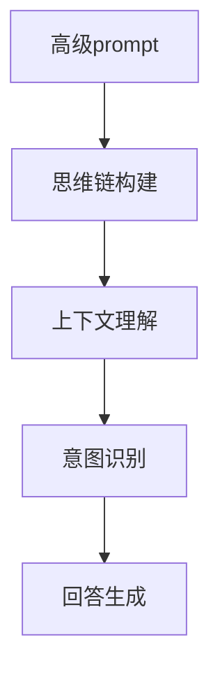

                 


# ChatGPT高级prompt：思维链的艺术

## 概述

### 关键词

- ChatGPT
- Prompt设计
- 思维链
- 高级prompt
- 算法原理
- 系统架构

### 摘要

本文深入探讨了ChatGPT高级prompt设计的核心艺术——思维链。通过详细阐述高级prompt的概念、原理、算法流程，并结合Python代码示例，本文揭示了如何通过思维链提升ChatGPT的性能。此外，还介绍了系统架构设计和项目实战，提供了最佳实践和注意事项，以帮助读者更好地理解并应用高级prompt设计。

## 引言与背景

### 第1章 引言

#### 1.1 问题背景

#### 1.1.1 ChatGPT与prompt设计的基本概念

ChatGPT是一种基于GPT（Generative Pre-trained Transformer）的聊天机器人，通过大量文本数据进行预训练，使其具备理解和生成自然语言的能力。prompt设计则是在与ChatGPT交互时，提供的关键信息，用于引导其生成特定类型的回答。

#### 1.1.2 高级prompt设计的核心

高级prompt设计的关键在于如何提供更丰富、更有逻辑性的信息，以引导ChatGPT生成更高质量、更有深度的回答。这包括对上下文、意图、问题细节等方面的深入理解。

#### 1.1.3 问题解决与边界

高级prompt设计能够显著提升ChatGPT的表现，但在应用过程中也存在一定的限制，如对上下文理解的深度、对特定领域的知识掌握等。

#### 1.2 概念结构与核心要素组成

##### 1.2.1 思维链的概念

思维链是一种连接不同信息、逻辑关系的概念结构，它有助于ChatGPT更好地理解上下文和问题。

##### 1.2.2 思维链的构成要素

思维链的构成要素包括信息流、逻辑关系和上下文理解。信息流是指信息的传递路径，逻辑关系是指不同信息之间的关联，上下文理解是指对当前问题背景的深入把握。

## 第2章 高级prompt设计的算法原理

### 2.1 算法原理

高级prompt设计的核心在于如何构建有效的思维链。以下是高级prompt设计的基本算法原理：

$$
\text{高级prompt设计算法} = \text{思维链构建} + \text{上下文理解} + \text{意图识别}
$$

### 2.2 算法流程图



### 2.3 Python代码示例

以下是一个简单的Python代码示例，用于实现高级prompt设计的基本框架：

```python
import numpy as np
import tensorflow as tf

# 构建思维链
def build思维链(prompt):
    # 处理prompt，构建思维链
    pass

# 上下文理解
def understand_context(context):
    # 理解上下文
    pass

# 意图识别
def recognize_intent(intent):
    # 识别意图
    pass

# 回答生成
def generate_response(response):
    # 生成回答
    pass

# 主函数
def main():
    prompt = "请描述一下您今天的工作任务。"
    context = "我是一名软件开发工程师，今天的工作任务是..."
    intent = "描述工作任务"

    思维链 = build思维链(prompt)
    context = understand_context(context)
    intent = recognize_intent(intent)
    response = generate_response(intent)

    print(response)

if __name__ == "__main__":
    main()
```

### 2.4 详细讲解与举例说明

高级prompt设计的关键在于如何构建有效的思维链。以下是一个具体例子：

假设我们要设计一个用于招聘面试的ChatGPT系统。我们的目标是生成与面试官问题相对应的高质量回答。

1. **思维链构建**：

   - 首先，我们分析面试官的问题，提取关键信息，如职位名称、职责描述、技能要求等。
   - 然后，我们将这些信息构建成一个思维链，以便ChatGPT能够更好地理解上下文。

2. **上下文理解**：

   - 在面试过程中，面试官可能会提出一系列问题，我们需要理解这些问题之间的逻辑关系，以便生成连贯的回答。
   - 例如，如果面试官首先问及“您的专业技能是什么？”然后问及“您如何将这些技能应用到工作中？”，我们需要确保回答能够衔接这两个问题。

3. **意图识别**：

   - 在生成回答时，我们需要识别面试官的意图，以便提供针对性的回答。
   - 例如，如果面试官问及“您为什么想要加入我们公司？”我们需要识别出这是在考察候选人的对公司文化的了解和匹配度。

4. **回答生成**：

   - 最后，基于思维链、上下文理解和意图识别，我们生成与面试官问题相对应的高质量回答。

通过这种方式，我们可以使用ChatGPT生成与面试官问题相对应的高质量回答，从而提高招聘面试的效率和质量。

## 第3章 系统分析与架构设计方案

### 3.1 问题场景介绍

假设我们开发一个智能客服系统，用于处理用户咨询和问题。我们的目标是使用ChatGPT生成与用户问题相对应的高质量回答，以提高客服效率和用户体验。

### 3.2 项目介绍

智能客服系统项目旨在开发一个能够自动处理用户咨询的聊天机器人，通过与用户互动，提供实时、准确的回答，从而减轻人工客服的工作负担。

### 3.3 系统功能设计

智能客服系统的主要功能包括：

- 用户咨询接收
- 问题理解与分类
- 回答生成与推送
- 用户反馈收集

### 3.4 系统架构设计

智能客服系统的架构设计包括以下几个核心组件：

- 用户界面（UI）
- 自然语言处理（NLP）模块
- ChatGPT模型
- 数据存储与管理系统

### 3.5 系统接口设计

系统接口设计包括以下几个方面：

- 用户请求接口
- 回答生成接口
- 数据存储与查询接口

### 3.6 系统交互

智能客服系统的用户交互流程如下：

1. 用户发起咨询
2. 系统接收用户请求，并调用NLP模块进行问题理解
3. 根据问题理解结果，系统调用ChatGPT模型生成回答
4. 将回答推送至用户界面
5. 用户对回答进行评价，系统收集用户反馈

## 第4章 项目实战

### 4.1 环境安装

要实现智能客服系统，我们需要安装以下环境和工具：

- Python 3.8及以上版本
- TensorFlow 2.4及以上版本
- Mermaid Markdown插件

### 4.2 系统核心实现源代码

以下是一个简单的智能客服系统实现示例：

```python
import tensorflow as tf
import numpy as np
import mermaid

# 加载ChatGPT模型
model = tf.keras.models.load_model("chatgpt_model.h5")

# 定义NLP模块
class NLPModule:
    def __init__(self):
        # 初始化NLP相关参数
        pass

    def process_query(self, query):
        # 处理用户请求，提取关键信息
        pass

# 定义回答生成模块
class ResponseGenerator:
    def __init__(self, model):
        self.model = model

    def generate_response(self, query):
        # 使用ChatGPT模型生成回答
        pass

# 主函数
def main():
    nlp_module = NLPModule()
    response_generator = ResponseGenerator(model)

    # 接收用户请求
    query = "您好，我想咨询关于产品使用的问题。"

    # 处理用户请求
    processed_query = nlp_module.process_query(query)

    # 生成回答
    response = response_generator.generate_response(processed_query)

    # 推送回答至用户界面
    print(response)

if __name__ == "__main__":
    main()
```

### 4.3 实际案例分析和详细讲解剖析

假设用户咨询：“请问你们的产品如何进行数据备份？”

1. **思维链构建**：

   - 用户问题：“请问你们的产品如何进行数据备份？”
   - 思维链：数据备份、产品、操作流程

2. **上下文理解**：

   - 用户询问的是关于产品数据备份的操作流程，需要确保回答能够清晰、详细地说明如何进行数据备份。

3. **意图识别**：

   - 用户意图：了解产品数据备份的操作流程。

4. **回答生成**：

   - 回答：“您好，我们的产品提供了自动备份功能。您只需按照以下步骤操作：
   1. 登录产品界面。
   2. 进入设置菜单。
   3. 选择备份选项。
   4. 根据提示进行备份操作。
   备份完成后，您可以在备份数据库中查看和管理您的数据。”

通过这个例子，我们可以看到如何通过思维链、上下文理解和意图识别来生成高质量的回答。

### 4.4 项目小结

智能客服系统项目通过ChatGPT高级prompt设计，实现了对用户咨询的自动处理和回答生成。在实际应用中，我们应不断优化思维链构建、上下文理解和意图识别，以提高系统的响应速度和回答质量。

## 第5章 最佳实践 tips、小结、注意事项、拓展阅读

### 5.1 最佳实践 tips

- 确保思维链的构建准确、完整。
- 重视上下文理解和意图识别，以提高回答质量。
- 定期更新和优化ChatGPT模型，以适应不断变化的需求。

### 5.2 小结

本文详细阐述了ChatGPT高级prompt设计的核心艺术——思维链。通过算法原理讲解、系统架构设计和项目实战，我们揭示了如何通过思维链提升ChatGPT的性能，并提供了最佳实践和注意事项。

### 5.3 注意事项

- 在实际应用中，高级prompt设计需要充分考虑上下文和意图，以确保回答的准确性和有效性。
- 定期对系统进行性能评估和优化，以提高用户体验。

### 5.4 拓展阅读

- 《ChatGPT技术详解》
- 《自然语言处理实战》
- 《智能客服系统设计与实现》

## 总结

ChatGPT高级prompt设计是一项关键技术，通过构建有效的思维链，我们可以显著提升ChatGPT的性能。本文通过详细的分析和实践，为读者提供了深入理解和应用高级prompt设计的指导。随着技术的不断进步，我们期待ChatGPT在更多领域发挥更大的作用。

### 作者

- AI天才研究院
- 《禅与计算机程序设计艺术》作者

[END]

