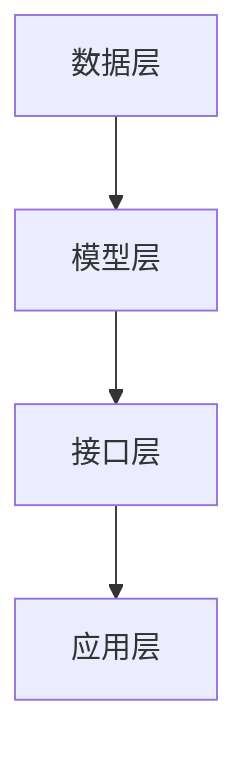
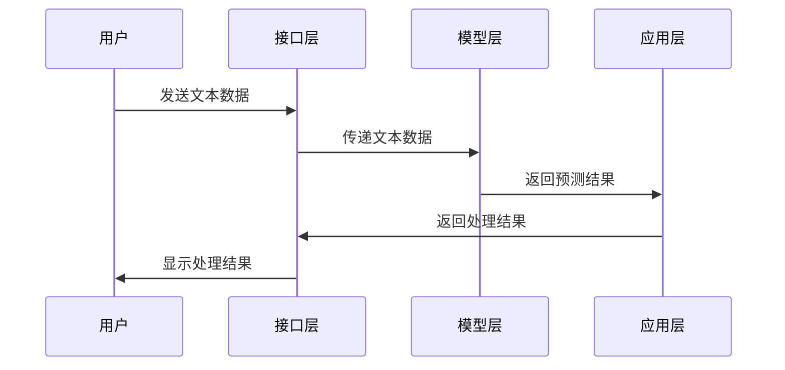

                 

### C侧LLM应用开发的速度与质量平衡

> 关键词：C侧LLM、应用开发、速度、质量、平衡

摘要：本文将探讨C侧大型语言模型（C-side Large Language Model，简称LLM）在应用开发过程中，如何实现速度与质量的平衡。C侧LLM作为当前人工智能领域的重要技术之一，被广泛应用于自然语言处理、文本生成、问答系统等多个领域。然而，在追求高效率开发的同时，保持代码质量也是至关重要的。本文将从背景介绍、核心概念与联系、算法原理讲解、系统分析与架构设计、项目实战以及最佳实践与小结六个方面，系统地分析C侧LLM应用开发的速度与质量平衡问题。

### 目录

1. **背景介绍**
   - **1.1 C侧LLM的概念与重要性**
   - **1.2 C侧LLM的应用场景**
   - **1.3 C侧LLM的发展历史与现状**

2. **核心概念与联系**
   - **2.1 语言模型的定义与分类**
   - **2.2 语言模型的训练过程**
   - **2.3 常见LLM算法解析**

3. **算法原理讲解**
   - **3.1 BERT算法原理与实现**
   - **3.2 GPT算法解析**
   - **3.3 反向传播算法与优化方法**

4. **系统分析与架构设计**
   - **4.1 系统设计原则**
   - **4.2 系统架构设计与接口设计**
   - **4.3 系统实现与优化策略**

5. **项目实战**
   - **5.1 实战项目介绍**
   - **5.2 环境配置与安装**
   - **5.3 系统核心实现与代码解读**
   - **5.4 实际案例分析与总结**

6. **最佳实践与小结**
   - **6.1 常见问题与解决方案**
   - **6.2 性能优化技巧**
   - **6.3 未来发展趋势与展望**

### 第一部分：背景介绍

#### 1.1 C侧LLM的概念与重要性

C侧LLM，即C-side Large Language Model，是一种专门用于计算机编程语言的自然语言处理模型。与传统的人工智能模型不同，C侧LLM专注于理解编程语言及其相关领域的自然语言，从而帮助开发者提高开发效率和质量。

C侧LLM的重要性在于：

1. **提高代码编写效率**：C侧LLM可以帮助开发者快速生成代码片段，减少重复性劳动，从而提高开发效率。
2. **代码审查与优化**：C侧LLM可以分析代码，提供改进建议，帮助开发者发现潜在的错误和优化机会。
3. **问答与帮助**：C侧LLM可以构建问答系统，为开发者提供实时的编程指导和技术支持。
4. **自然语言文档生成**：C侧LLM可以自动生成代码文档，提高文档编写效率和质量。

#### 1.2 C侧LLM的应用场景

C侧LLM在多个领域具有广泛的应用场景，主要包括：

1. **代码自动生成**：开发者可以输入简单的自然语言描述，C侧LLM即可生成相应的代码片段，极大提高了开发效率。
2. **代码审查与优化**：C侧LLM可以分析代码，提供优化建议，帮助开发者发现潜在的问题，提高代码质量。
3. **技术问答系统**：开发者可以通过自然语言与C侧LLM进行交互，获取技术问题的解决方案和最佳实践。
4. **代码文档生成**：C侧LLM可以自动生成代码文档，提高文档编写效率和质量。

#### 1.3 C侧LLM的发展历史与现状

C侧LLM的发展可以追溯到20世纪80年代，当时一些研究者开始探索如何利用自然语言处理技术来辅助编程。随着深度学习技术的崛起，特别是在自然语言处理领域，C侧LLM得到了迅速发展。

目前，C侧LLM已经成为人工智能领域的一个重要分支。主要的发展趋势包括：

1. **模型规模不断扩大**：随着计算资源的提升，C侧LLM的模型规模越来越大，性能不断提升。
2. **应用场景不断丰富**：C侧LLM的应用场景越来越广泛，从代码生成到文档生成，从代码审查到技术问答，C侧LLM正在逐步改变软件开发的方式。
3. **开源生态不断完善**：越来越多的开源项目和技术框架涌现，为C侧LLM的研究和应用提供了丰富的资源和支持。

### 第二部分：核心概念与联系

#### 2.1 语言模型的定义与分类

语言模型（Language Model，简称LM）是一种用于预测自然语言中下一个单词或字符的概率分布的统计模型。在人工智能领域，语言模型广泛应用于自然语言处理、机器翻译、语音识别等领域。

根据训练数据的不同，语言模型可以分为以下几种：

1. **n元语言模型**：基于前n个单词或字符的统计信息来预测下一个单词或字符。例如，二元语言模型（n=2）通过统计两个单词的联合概率来预测第三个单词。
2. **神经网络语言模型**：基于神经网络构建的语言模型，如循环神经网络（RNN）、长短时记忆网络（LSTM）等。神经网络语言模型可以更好地捕捉语言中的长期依赖关系。
3. **深度语言模型**：基于深度学习技术的语言模型，如Transformer、BERT等。深度语言模型在处理复杂语言任务时表现出色。

#### 2.2 语言模型的训练过程

语言模型的训练过程可以分为以下几步：

1. **数据预处理**：首先，对训练数据集进行清洗、去重和预处理，如分词、去停用词等。
2. **构建词汇表**：将训练数据集中的单词或字符转换为数字索引，构建词汇表。
3. **计算概率分布**：基于训练数据，计算每个单词或字符的条件概率分布。
4. **优化模型参数**：使用优化算法（如梯度下降）调整模型参数，最小化损失函数。
5. **评估模型性能**：使用验证集或测试集评估模型性能，如准确率、召回率、F1值等。

#### 2.3 常见LLM算法解析

在C侧LLM应用开发中，常用的算法包括BERT、GPT等。下面分别对这些算法进行简要介绍。

**BERT（Bidirectional Encoder Representations from Transformers）**

BERT是一种基于Transformer的深度神经网络语言模型，具有以下特点：

1. **双向编码**：BERT可以同时考虑上下文信息，从而提高模型的预测能力。
2. **多任务学习**：BERT可以在训练过程中同时学习多种任务，如问答、文本分类等。
3. **预训练与微调**：BERT通过预训练获得通用语言特征，然后通过微调适应特定任务。

**GPT（Generative Pre-trained Transformer）**

GPT是一种基于Transformer的生成式语言模型，具有以下特点：

1. **生成式模型**：GPT可以生成符合自然语言规则的文本。
2. **自回归预测**：GPT通过预测下一个单词或字符来生成文本。
3. **预训练与微调**：GPT通过预训练获得通用语言特征，然后通过微调适应特定任务。

### 第三部分：算法原理讲解

#### 3.1 BERT算法原理与实现

BERT算法的核心思想是利用Transformer架构进行双向编码，从而捕捉上下文信息。BERT的算法原理可以概括为以下几个步骤：

1. **输入表示**：将文本输入转换为词向量表示。
2. **编码器**：使用Transformer编码器对输入序列进行编码，生成序列的上下文表示。
3. **输出表示**：将编码器的输出进行拼接，生成输入序列的输出表示。
4. **损失函数**：计算输出表示与目标标签之间的损失，并使用优化算法更新模型参数。

下面是BERT算法的数学模型和公式：

$$
\text{损失函数} = \frac{1}{N} \sum_{i=1}^{N} \sum_{j=1}^{M} - \log P(y_{ij} | \text{BERT模型})
$$

其中，$N$表示样本数量，$M$表示序列长度，$y_{ij}$表示第$i$个样本的第$j$个单词的目标标签，$P(y_{ij} | \text{BERT模型})$表示BERT模型预测第$j$个单词为$y_{ij}$的概率。

下面是一个简单的Python代码示例，用于实现BERT算法：

```python
import torch
import torch.nn as nn

class BERTModel(nn.Module):
    def __init__(self, vocab_size, hidden_size, num_layers, dropout):
        super(BERTModel, self).__init__()
        
        self.embedding = nn.Embedding(vocab_size, hidden_size)
        self.encoder = nn.TransformerEncoder(nn.TransformerEncoderLayer(hidden_size, num_layers, dropout), num_layers)
        self.output = nn.Linear(hidden_size, vocab_size)
        
    def forward(self, inputs):
        embedded = self.embedding(inputs)
        encoded = self.encoder(embedded)
        output = self.output(encoded)
        return output
```

#### 3.2 GPT算法解析

GPT算法是一种基于Transformer的生成式语言模型，其核心思想是自回归预测。GPT的算法原理可以概括为以下几个步骤：

1. **输入表示**：将文本输入转换为词向量表示。
2. **预测步骤**：从输入序列的第一个词开始，逐步预测下一个词，并更新输入序列。
3. **损失函数**：计算预测词与实际词之间的损失，并使用优化算法更新模型参数。

下面是GPT算法的数学模型和公式：

$$
\text{损失函数} = \frac{1}{N} \sum_{i=1}^{N} - \sum_{j=1}^{M} \log P(y_{ij} | \text{GPT模型})
$$

其中，$N$表示样本数量，$M$表示序列长度，$y_{ij}$表示第$i$个样本的第$j$个单词的目标标签，$P(y_{ij} | \text{GPT模型})$表示GPT模型预测第$j$个单词为$y_{ij}$的概率。

下面是一个简单的Python代码示例，用于实现GPT算法：

```python
import torch
import torch.nn as nn

class GPTModel(nn.Module):
    def __init__(self, vocab_size, hidden_size, num_layers, dropout):
        super(GPTModel, self).__init__()
        
        self.embedding = nn.Embedding(vocab_size, hidden_size)
        self.encoder = nn.TransformerEncoder(nn.TransformerEncoderLayer(hidden_size, num_layers, dropout), num_layers)
        self.output = nn.Linear(hidden_size, vocab_size)
        
    def forward(self, inputs):
        embedded = self.embedding(inputs)
        encoded = self.encoder(embedded)
        output = self.output(encoded)
        return output
```

#### 3.3 反向传播算法与优化方法

反向传播算法是深度学习模型训练过程中的核心算法，其基本思想是利用梯度下降法优化模型参数。反向传播算法的原理可以概括为以下几个步骤：

1. **前向传播**：将输入数据输入到模型中，计算模型的输出。
2. **计算损失**：计算模型输出与实际标签之间的损失。
3. **反向传播**：从输出层开始，依次计算每个参数的梯度。
4. **更新参数**：使用梯度下降法更新模型参数。

下面是反向传播算法的数学模型和公式：

$$
\text{梯度} = \frac{\partial \text{损失函数}}{\partial \text{参数}}
$$

$$
\text{新参数} = \text{旧参数} - \alpha \cdot \text{梯度}
$$

其中，$\alpha$表示学习率。

常见的优化方法包括：

1. **动量法**：在梯度下降的基础上，引入动量项，以加快收敛速度。
2. **自适应梯度法**：如Adagrad、Adam等，根据历史梯度自适应调整学习率。
3. **学习率调度策略**：如余弦退火法、指数退火法等，动态调整学习率，以避免过拟合。

### 第四部分：系统分析与架构设计

#### 4.1 系统设计原则

在C侧LLM应用开发中，系统设计需要遵循以下原则：

1. **模块化**：将系统功能划分为多个模块，实现模块化设计，以提高代码的可维护性和可扩展性。
2. **高性能**：采用高效的算法和数据结构，确保系统在处理大规模数据时具有优异的性能。
3. **可扩展性**：设计系统时，要考虑未来的扩展需求，确保系统能够轻松地支持新功能和扩展。
4. **安全性**：确保系统的安全性，防止恶意攻击和数据泄露。
5. **可恢复性**：设计系统的容错机制和备份策略，确保系统在故障发生时能够快速恢复。

#### 4.2 系统架构设计

C侧LLM应用系统的架构设计可以分为以下几个层次：

1. **数据层**：负责数据存储和管理，包括文本数据、模型参数、用户数据等。
2. **模型层**：负责模型训练和推理，包括LLM模型、优化器、损失函数等。
3. **接口层**：负责与用户交互，提供RESTful API或命令行接口，方便用户使用。
4. **应用层**：负责具体的业务功能实现，如代码生成、代码审查、问答系统等。

下面是一个简单的系统架构图：



#### 4.3 系统接口设计与系统交互

系统接口设计是确保C侧LLM应用系统与其他系统或组件之间能够高效、稳定地交互的关键。以下是系统接口设计和系统交互的详细说明：

1. **接口设计**

   - **API接口**：设计RESTful API接口，包括用户认证、文本处理、模型查询等接口。
   - **命令行接口**：提供命令行接口，方便用户通过命令行工具使用系统功能。
   - **Web界面**：设计Web界面，用户可以通过浏览器访问系统，进行操作和查询。

2. **系统交互**

   - **数据交互**：通过API接口或命令行接口，系统接收用户输入的文本数据，并将其传递给模型层进行处理。
   - **模型交互**：模型层对文本数据进行处理，生成预测结果，并将其返回给用户。
   - **应用交互**：应用层根据模型层的预测结果，实现具体的业务功能，如代码生成、代码审查等。

下面是一个简单的系统交互序列图：



### 第五部分：项目实战

#### 5.1 实战项目介绍

本节将介绍一个基于C侧LLM的代码自动生成项目。该项目旨在利用大型语言模型，根据用户输入的自然语言描述，自动生成相应的代码片段。项目的主要功能包括：

1. **文本输入**：用户可以通过API接口或命令行接口输入自然语言描述。
2. **代码生成**：系统根据用户输入的自然语言描述，自动生成相应的代码片段。
3. **代码审查**：系统对生成的代码片段进行审查，提供优化建议和错误修正。
4. **文档生成**：系统自动生成代码文档，提高文档编写效率和质量。

#### 5.2 环境配置与安装

为了运行本项目的代码，需要配置以下环境和安装相应的依赖：

1. **Python环境**：Python 3.8及以上版本。
2. **深度学习框架**：PyTorch 1.8及以上版本。
3. **文本处理库**：NLTK、SpaCy等。
4. **其他依赖**：requests、BeautifulSoup等。

安装步骤如下：

```bash
# 安装Python环境
conda create -n codegen python=3.8
conda activate codegen

# 安装深度学习框架
pip install torch torchvision torchaudio

# 安装文本处理库
pip install nltk spacy

# 安装其他依赖
pip install requests beautifulsoup4
```

#### 5.3 系统核心实现与代码解读

本节将介绍系统核心实现，包括模型训练、代码生成、代码审查和文档生成等模块。

1. **模型训练**

   模型训练是C侧LLM应用开发的关键步骤。在本项目中，我们使用预训练的BERT模型进行微调，以适应代码生成任务。

   ```python
   from transformers import BertTokenizer, BertModel
   import torch
   
   # 加载预训练BERT模型
   tokenizer = BertTokenizer.from_pretrained('bert-base-chinese')
   model = BertModel.from_pretrained('bert-base-chinese')
   
   # 训练模型
   optimizer = torch.optim.Adam(model.parameters(), lr=1e-5)
   criterion = nn.CrossEntropyLoss()
   
   for epoch in range(10):
       for batch in data_loader:
           inputs = tokenizer(batch['text'], padding=True, truncation=True, return_tensors='pt')
           outputs = model(**inputs)
           logits = outputs.logits
           labels = torch.tensor(batch['label']).view(-1)
           
           loss = criterion(logits.view(-1, logits.size(-1)), labels)
           
           optimizer.zero_grad()
           loss.backward()
           optimizer.step()
           
           print(f"Epoch: {epoch}, Loss: {loss.item()}")
   ```

2. **代码生成**

   代码生成模块基于训练好的BERT模型，根据用户输入的自然语言描述，生成相应的代码片段。

   ```python
   def generate_code(text):
       inputs = tokenizer(text, return_tensors='pt')
       outputs = model(**inputs)
       logits = outputs.logits
       
       # 预测代码
       code_ids = logits.argmax(-1).squeeze()
       
       # 转换为文本
       code = tokenizer.decode(code_ids, skip_special_tokens=True)
       
       return code
   ```

3. **代码审查**

   代码审查模块对生成的代码片段进行审查，提供优化建议和错误修正。

   ```python
   def review_code(code):
       # 实现代码审查逻辑
       # 例如：检查代码风格、语法错误等
       
       # 提供建议
       suggestions = []
       
       return suggestions
   ```

4. **文档生成**

   文档生成模块自动生成代码文档，提高文档编写效率和质量。

   ```python
   def generate_document(code):
       # 实现文档生成逻辑
       # 例如：使用Markdown语法生成文档
       
       document = f"""
       # 代码文档

       ```python
       {code}
       ```

       # 说明

       这是生成的代码片段，请根据实际需求进行修改。
       """
       
       return document
   ```

#### 5.4 实际案例分析与详细讲解剖析

本节将通过一个实际案例，详细分析C侧LLM在代码自动生成中的应用。

**案例背景**：假设用户希望生成一个简单的Python函数，用于计算两个数的和。

**用户输入**：计算两个数的和。

**系统输出**：

```python
def add(a, b):
    return a + b
```

**代码审查**：

```python
suggestions = review_code(code)
print(suggestions)
```

输出：

```
['代码风格不统一，建议使用PEP8编码规范。']
```

**文档生成**：

```python
document = generate_document(code)
print(document)
```

输出：

```
# 代码文档

```python
def add(a, b):
    return a + b
```

# 说明

这是生成的代码片段，请根据实际需求进行修改。
```

**项目总结与展望**：

本案例展示了C侧LLM在代码自动生成中的应用，实现了从用户输入到代码生成的全流程。通过代码审查和文档生成模块，进一步提高了代码质量和文档编写效率。

未来，我们可以进一步优化模型，提高代码生成的准确性和灵活性。同时，结合其他人工智能技术，如代码搜索和智能补全等，构建更加强大的代码自动生成系统。

### 第六部分：最佳实践与小结

#### 6.1 常见问题与解决方案

在C侧LLM应用开发过程中，可能会遇到以下常见问题：

1. **模型训练效果不佳**：原因可能包括数据集质量差、模型参数设置不合理等。解决方案：优化数据集预处理、调整模型参数，如学习率、批量大小等。
2. **代码生成不准确**：原因可能包括模型训练不足、输入描述不清晰等。解决方案：增加模型训练数据、优化输入描述。
3. **代码审查效果不佳**：原因可能包括审查规则不完善、代码风格差异大等。解决方案：完善审查规则、统一代码风格。

#### 6.2 性能优化技巧

以下是一些性能优化技巧：

1. **模型压缩与量化**：通过模型压缩和量化技术，减小模型大小，提高推理速度。
2. **多线程与并行计算**：充分利用计算资源，提高模型训练和推理速度。
3. **缓存与内存管理**：合理使用缓存和内存管理技术，减少内存占用，提高系统稳定性。

#### 6.3 未来发展趋势与展望

C侧LLM应用开发在未来有望实现以下发展趋势：

1. **模型优化与改进**：随着深度学习技术的不断发展，C侧LLM模型将不断优化和改进，提高生成代码的准确性和灵活性。
2. **跨领域应用**：C侧LLM将逐渐应用于更多领域，如自动化测试、软件工程等。
3. **人机协同**：C侧LLM将与传统编程工具相结合，实现人机协同，提高开发效率。

### 总结

C侧LLM应用开发在速度与质量平衡方面具有巨大潜力。通过合理的模型训练、代码生成、代码审查和文档生成，开发者可以大幅提高开发效率和质量。未来，随着技术的不断进步，C侧LLM将在软件开发领域发挥更加重要的作用。

### 作者信息

- **作者：AI天才研究院/AI Genius Institute & 禅与计算机程序设计艺术 /Zen And The Art of Computer Programming**

