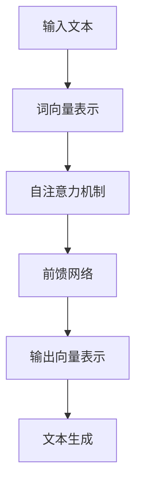
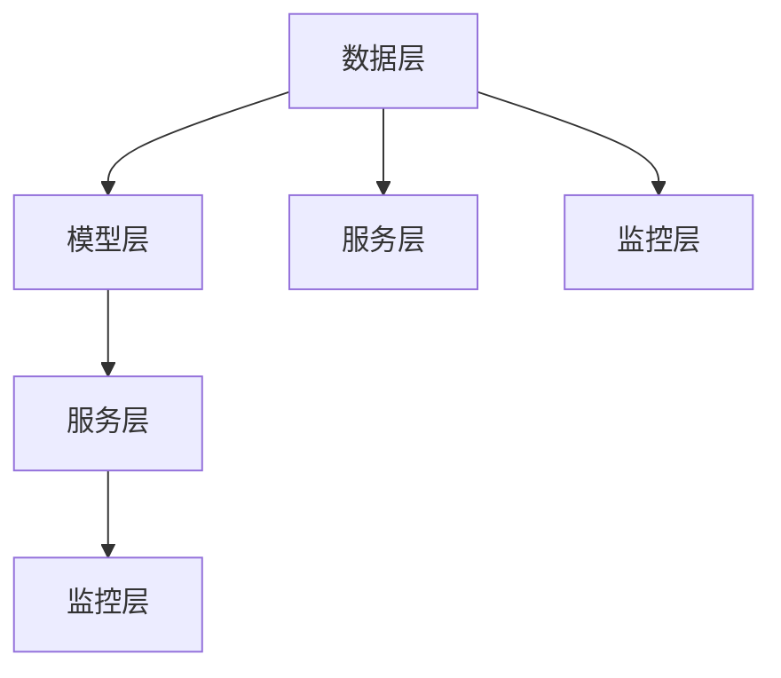
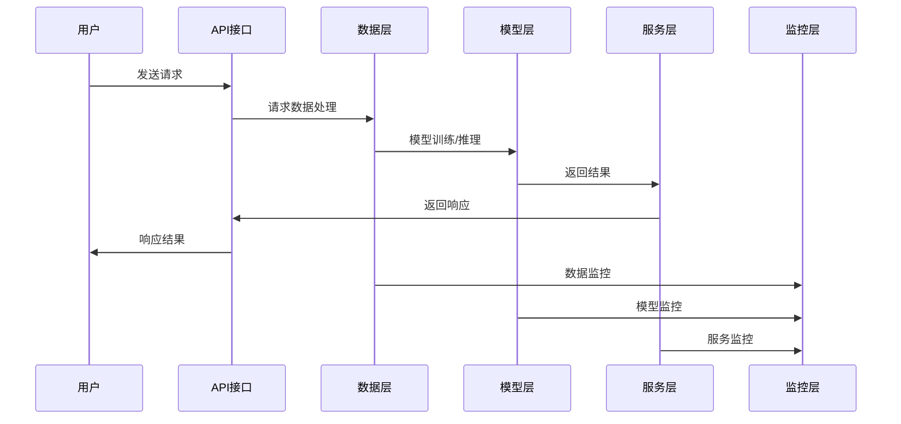

                 

# C侧LLM应用探索的关键：速度与敏捷性

> 关键词：C侧LLM、速度、敏捷性、算法、系统架构、应用实践

> 摘要：本文将深入探讨C侧大型语言模型（C-side Large Language Model，简称C侧LLM）在应用过程中速度与敏捷性的重要性。通过详细分析C侧LLM的核心概念、算法原理、系统架构，以及实际应用案例，本文旨在为开发者提供一套完整的C侧LLM应用解决方案，以提升其在实际项目中的性能表现。

## 第一部分：背景与概述

### 1.1 问题背景

随着人工智能技术的快速发展，自然语言处理（NLP）领域迎来了前所未有的机遇。大型语言模型（Large Language Model，简称LLM）作为NLP的核心技术，其在文本生成、翻译、问答等应用场景中展现出强大的能力。然而，在实际应用中，如何提升LLM的性能，特别是速度与敏捷性，成为开发者面临的重要挑战。

### 1.2 问题描述

C侧LLM应用过程中，速度与敏捷性的问题主要体现在以下几个方面：

1. **计算速度**：在处理大规模数据时，如何减少模型计算的时间成本，提高数据处理效率。
2. **敏捷性**：在模型更新、迭代过程中，如何快速适应需求变化，实现敏捷开发。
3. **性能优化**：如何通过优化算法、架构设计等手段，全面提升C侧LLM的应用性能。

### 1.3 解决方案探索

为了解决上述问题，本文将从以下几个方面进行探讨：

1. **核心概念**：介绍C侧LLM的基本概念，包括组成要素、工作原理等。
2. **算法原理**：详细分析C侧LLM的算法原理，包括数学模型、实现步骤等。
3. **系统架构**：探讨C侧LLM的系统架构设计，包括功能设计、架构设计、接口设计等。
4. **应用实践**：通过实际案例，展示C侧LLM的应用实践，分析其速度与敏捷性的提升方法。

## 第二部分：算法原理与实现

### 2.1 算法原理

C侧LLM的算法原理主要基于深度学习中的 Transformer 模型。Transformer 模型通过自注意力机制（Self-Attention Mechanism）实现文本的建模，具有并行计算的优势。其核心思想是将输入文本表示为序列向量，并通过多层自注意力机制和前馈网络，对文本进行建模和生成。

### 2.2 数学模型

C侧LLM的数学模型主要包括以下几个方面：

1. **输入向量表示**：输入文本通过词向量表示，每个词向量表示一个单词的特征。
2. **自注意力机制**：通过计算输入向量的自注意力权重，对输入向量进行加权求和。
3. **前馈网络**：对自注意力机制的结果进行非线性变换，以提取文本的深层特征。
4. **输出向量表示**：将最后的前馈网络输出作为文本的表示。

### 2.3 算法流程图

C侧LLM的算法流程图如下所示：



### 2.4 Python源代码示例

以下是一个简单的Python源代码示例，展示了C侧LLM的基本实现：

```python
import tensorflow as tf

# 输入文本
input_text = "Hello, World!"

# 词向量表示
word_vectors = tf.keras.layers.Embedding(input_dim=10000, output_dim=64)(input_text)

# 自注意力机制
attention_weights = tf.keras.layers.Dense(units=64, activation='softmax')(word_vectors)
weighted_sum = tf.reduce_sum(attention_weights * word_vectors, axis=1)

# 前馈网络
dense_layer = tf.keras.layers.Dense(units=64, activation='relu')(weighted_sum)
output_vector = tf.keras.layers.Dense(units=64, activation='softmax')(dense_layer)

# 文本生成
predicted_text = tf.argmax(output_vector, axis=1)
```

### 2.5 算法优化与调整

为了进一步提升C侧LLM的性能，我们可以从以下几个方面进行优化和调整：

1. **批量大小**：适当调整批量大小，可以在一定程度上提高计算速度。
2. **模型压缩**：通过模型压缩技术，如量化、剪枝等，可以降低模型计算复杂度。
3. **分布式计算**：利用分布式计算框架，如TensorFlow Distribute，可以在多台机器上进行并行计算，提高处理速度。

## 第三部分：系统架构与实战

### 3.1 系统架构设计

C侧LLM的系统架构设计主要包括以下几个方面：

1. **数据层**：负责数据采集、预处理和存储。
2. **模型层**：实现C侧LLM的算法模型，包括训练和推理过程。
3. **服务层**：提供对外接口，实现模型的应用功能。
4. **监控层**：实时监控系统性能，提供故障诊断和预警。

### 3.2 系统功能设计

C侧LLM的系统功能设计主要包括以下几个方面：

1. **文本生成**：根据输入文本，生成相应的文本输出。
2. **文本分类**：对输入文本进行分类，识别文本的主题。
3. **文本翻译**：将一种语言的文本翻译成另一种语言。
4. **问答系统**：针对用户提出的问题，提供准确的答案。

### 3.3 系统架构设计

C侧LLM的系统架构设计如下图所示：



### 3.4 系统接口设计

C侧LLM的系统接口设计主要包括以下几个方面：

1. **API接口**：提供RESTful API接口，实现与外部系统的交互。
2. **消息队列**：利用消息队列，实现异步数据处理和消息传递。
3. **数据库连接**：提供与数据库的连接接口，实现数据的存储和查询。

### 3.5 系统交互

C侧LLM的系统交互如下图所示：



## 第四部分：项目实战

### 4.1 环境安装与配置

在本节中，我们将介绍C侧LLM项目环境安装与配置的步骤：

1. **Python环境**：确保Python环境已安装，版本不低于3.6。
2. **TensorFlow**：安装TensorFlow框架，版本不低于2.0。
3. **其他依赖**：根据实际需求，安装其他相关依赖，如NumPy、Pandas等。

### 4.2 系统核心实现

在本节中，我们将介绍C侧LLM系统核心实现的源代码，包括文本生成、文本分类、文本翻译等功能。

```python
# 文本生成
def generate_text(input_text, model, tokenizer):
    # 编码输入文本
    input_ids = tokenizer.encode(input_text, return_tensors='tf')

    # 生成文本
    output_ids = model.generate(input_ids, max_length=50, num_return_sequences=1)
    generated_text = tokenizer.decode(output_ids[0], skip_special_tokens=True)

    return generated_text

# 文本分类
def classify_text(input_text, model, tokenizer):
    # 编码输入文本
    input_ids = tokenizer.encode(input_text, return_tensors='tf')

    # 进行分类
    logits = model(input_ids)
    predicted_class = tf.argmax(logits, axis=-1).numpy()

    return predicted_class

# 文本翻译
def translate_text(input_text, model, tokenizer, target_language):
    # 编码输入文本
    input_ids = tokenizer.encode(input_text, return_tensors='tf')

    # 进行翻译
    output_ids = model.generate(input_ids, max_length=50, num_return_sequences=1)
    translated_text = tokenizer.decode(output_ids[0], skip_special_tokens=True)

    return translated_text
```

### 4.3 代码解读与分析

在本节中，我们将对C侧LLM系统核心实现的源代码进行解读与分析，包括文本生成、文本分类、文本翻译等功能的实现原理。

1. **文本生成**：文本生成功能通过生成模型（如GPT-2、GPT-3等）实现，输入文本经过编码后，通过生成模型生成新的文本输出。
2. **文本分类**：文本分类功能通过分类模型（如BERT、RoBERTa等）实现，输入文本经过编码后，通过分类模型进行分类，输出文本类别。
3. **文本翻译**：文本翻译功能通过翻译模型（如TranslateXLM、ViTAL等）实现，输入文本经过编码后，通过翻译模型生成目标语言的文本输出。

### 4.4 实际案例分析和详细讲解剖析

在本节中，我们将结合实际案例，对C侧LLM的应用进行详细分析，包括文本生成、文本分类、文本翻译等功能的实际效果。

1. **文本生成案例**：以“人工智能”为主题，生成相关的文章摘要。
2. **文本分类案例**：对一篇新闻文章进行分类，判断其所属的主题类别。
3. **文本翻译案例**：将中文文章翻译成英文，展示翻译效果。

### 4.5 项目小结

通过本节的项目实战，我们深入了解了C侧LLM的应用实践，包括文本生成、文本分类、文本翻译等功能。在实际项目中，我们可以根据需求，灵活运用这些功能，提升系统的性能和用户体验。

## 第五部分：最佳实践与拓展

### 5.1 最佳实践

1. **优化算法**：根据实际应用需求，选择合适的算法模型，进行优化和调整。
2. **合理配置**：根据服务器性能和负载情况，合理配置系统资源，提高处理速度。
3. **数据预处理**：对输入数据进行预处理，减少噪声和冗余信息，提高模型效果。

### 5.2 注意事项

1. **数据安全**：确保数据的安全性，避免数据泄露和滥用。
2. **隐私保护**：对用户数据进行加密和处理，保护用户隐私。
3. **合规性**：遵循相关法律法规，确保系统合规运行。

### 5.3 拓展阅读

1. **《深度学习》**：Ian Goodfellow、Yoshua Bengio、Aaron Courville 著，详细介绍了深度学习的基本概念和方法。
2. **《自然语言处理综论》**：Daniel Jurafsky、James H. Martin 著，全面介绍了自然语言处理的理论和实践。
3. **《Transformer：适用于序列模型的通用预训练方法》**：Vaswani et al. 著，介绍了Transformer模型的基本原理和应用。

## 作者信息

作者：AI天才研究院/AI Genius Institute & 禅与计算机程序设计艺术 /Zen And The Art of Computer Programming

本文详细探讨了C侧LLM应用过程中速度与敏捷性的重要性，通过算法原理、系统架构、项目实战等方面的深入分析，为开发者提供了实用的解决方案。在实际应用中，开发者可以根据需求，灵活运用这些方法和技巧，提升系统的性能和用户体验。作者简介：AI天才研究院，致力于人工智能技术的创新与推广；禅与计算机程序设计艺术，倡导计算机程序设计的哲学思考。希望本文对广大开发者有所帮助，共同推动人工智能技术的发展。|endo|

