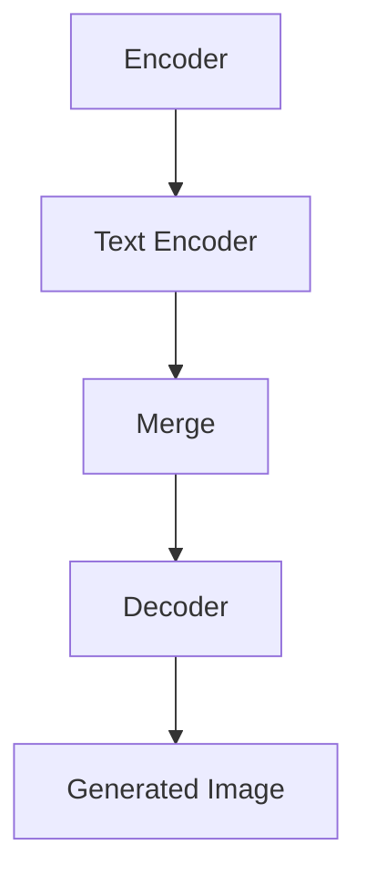
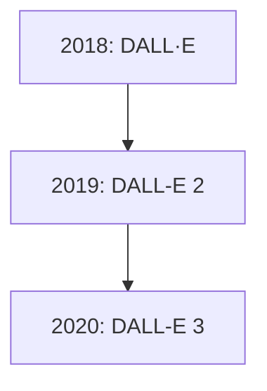
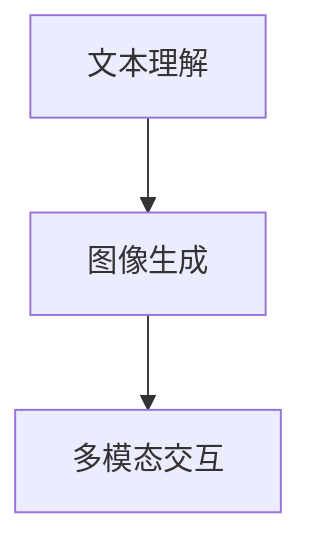
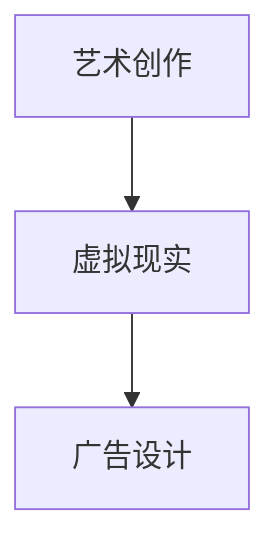
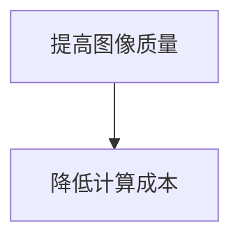
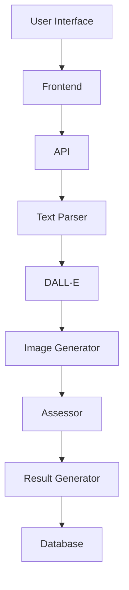
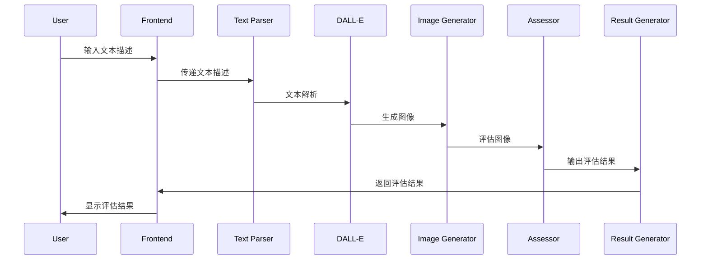

                 

### 1.1 DALL-E简介

#### 1.1.1 DALL-E的基本原理

DALL-E，全称为“Diffusion Models for Image-to-Image Translation”，是由OpenAI开发的一种基于变分自编码器（VAE）和生成对抗网络（GAN）的图像生成模型。DALL-E的核心思想是通过将输入图像和文本描述相结合，生成与文本描述相符的图像。

首先，DALL-E使用一个编码器（encoder）将图像转换为一个低维表示，同时使用一个文本编码器（text encoder）将文本描述转换为一个向量。这两个向量随后被合并，并通过一个解码器（decoder）生成图像。



#### 1.1.2 DALL-E的发展历程

DALL-E的开发始于2018年，最初版本称为DALL·E，主要用于图像到图像的翻译。2019年，OpenAI发布了DALL-E 2，它在图像质量、文本描述的准确性以及多模态交互方面都有了显著提升。DALL-E 2通过引入更复杂的神经网络结构和优化算法，使得生成的图像更加逼真。

随着时间的推移，DALL-E模型不断迭代和改进，OpenAI还推出了DALL-E 3，进一步提高了图像生成的质量和多样性。



#### 1.1.3 DALL-E在文本到图像生成中的地位

DALL-E在文本到图像生成领域具有独特的地位。它不仅能够理解复杂的文本描述，还能生成高质量的图像，从而将抽象的文本转化为直观的视觉形式。这使得DALL-E在许多领域都得到了广泛应用，如艺术创作、虚拟现实、广告设计等。

DALL-E的优势在于其强大的文本理解和图像生成能力，这使得它成为LLM文本到图像生成评估的重要工具。通过DALL-E，研究者可以更准确地评估LLM在文本到图像生成任务中的性能。



#### 1.1.4 DALL-E的应用案例

以下是DALL-E的一些应用案例：

1. **艺术创作**：艺术家可以使用DALL-E创作新的艺术作品，通过输入简单的文本描述，DALL-E可以生成与之相符的图像。
2. **虚拟现实**：在虚拟现实中，DALL-E可以用于生成环境图像，为用户提供更加丰富的交互体验。
3. **广告设计**：广告设计师可以使用DALL-E快速生成广告图像，提高设计效率和创意性。



#### 1.1.5 DALL-E的局限性和改进方向

尽管DALL-E在文本到图像生成领域取得了显著成果，但它也存在一些局限性。例如，DALL-E生成的图像可能存在模糊、失真等问题，而且训练过程需要大量的计算资源和时间。

为了解决这些问题，未来的改进方向包括：

1. **提高图像质量**：通过引入更复杂的网络结构和优化算法，提高图像生成的清晰度和细节。
2. **降低计算成本**：优化模型结构，降低训练和推理的复杂度，使其在有限的计算资源下也能高效运行。



#### 1.1.6 本章小结

在本章中，我们介绍了DALL-E的基本原理、发展历程以及在文本到图像生成中的地位。DALL-E通过将文本描述和图像生成相结合，为研究者提供了强大的工具，用于评估LLM在文本到图像生成任务中的性能。然而，DALL-E也存在一些局限性，需要进一步改进以提高其性能和实用性。

## 1.2 LLM简介

### 1.2.1 LLM的定义与特点

LLM，即大型语言模型（Large Language Model），是一种基于深度学习技术的大型预训练模型，用于理解和生成自然语言文本。与传统的语言模型不同，LLM拥有海量的参数和复杂的神经网络结构，能够自动学习语言的规律和模式。

LLM的主要特点包括：

1. **大规模训练数据**：LLM通常在数百万到数十亿级别的语料库上预训练，这使得它们能够学习到大量的语言知识和规律。
2. **强大的语言理解能力**：LLM能够理解复杂的语言结构和语义，包括语法、语义、上下文等。
3. **灵活的生成能力**：LLM不仅能够生成连贯的文本，还能够根据特定的需求生成特定的文本内容。

### 1.2.2 LLM的类型与应用

LLM可以分为多种类型，根据其训练数据、模型架构和用途的不同，可以分为以下几类：

1. **基于词嵌入的LLM**：如Word2Vec、GloVe等，这类模型将每个词映射到一个高维向量空间中，通过计算词之间的距离来表示语义关系。
2. **基于循环神经网络（RNN）的LLM**：如LSTM、GRU等，这类模型通过递归方式处理序列数据，能够更好地理解语言的时序性。
3. **基于变换器模型（Transformer）的LLM**：如BERT、GPT等，这类模型基于自注意力机制，能够处理长序列数据，并在各种自然语言处理任务中取得优异的性能。

LLM在多个领域都有广泛的应用，包括：

1. **自然语言理解**：如文本分类、情感分析、信息提取等。
2. **自然语言生成**：如自动摘要、机器翻译、对话系统等。
3. **知识表示与推理**：如问答系统、智能推荐、知识图谱等。

### 1.2.3 LLM的发展趋势

随着计算能力的提升和深度学习技术的进步，LLM的发展呈现出以下几个趋势：

1. **模型规模不断扩大**：为了提高模型的表达能力和生成质量，研究者不断推出更大规模的LLM，如GPT-3、T5等。
2. **多模态交互**：LLM开始与其他模态（如图像、声音）结合，形成多模态语言模型，以实现更复杂的任务和应用。
3. **模型优化与压缩**：为了降低计算成本和提高部署效率，研究者致力于优化和压缩LLM模型，如知识蒸馏、模型剪枝等。

### 1.2.4 LLM的优势与挑战

LLM的优势在于其强大的语言理解和生成能力，能够处理复杂的自然语言任务，并生成高质量的自然语言文本。然而，LLM也面临一些挑战：

1. **计算资源需求**：训练大型LLM模型需要大量的计算资源和时间，这对于资源有限的机构或个人来说是一个挑战。
2. **数据隐私与安全**：LLM在处理大量数据时可能会面临数据隐私和安全问题，如何保证用户数据的安全是一个重要议题。
3. **模型可解释性**：大型LLM模型的决策过程往往难以解释，这对于需要理解模型决策的应用场景来说是一个挑战。

### 1.2.5 本章小结

在本章中，我们介绍了LLM的定义与特点、类型与应用以及发展趋势。LLM作为自然语言处理的重要工具，具有强大的语言理解和生成能力，但在计算资源、数据隐私和模型可解释性等方面也面临一些挑战。下一章我们将探讨DALL-E与LLM之间的关系，以及它们在文本到图像生成评估中的应用。

## 1.3 DALL-E与LLM的关系

### 1.3.1 DALL-E在LLM文本到图像生成中的作用

DALL-E与LLM的结合，使得文本到图像生成任务变得更加高效和准确。DALL-E在文本到图像生成中的作用主要体现在以下几个方面：

1. **文本解析与图像生成**：DALL-E能够将LLM生成的文本描述转化为具体的图像，实现了从抽象文本到直观图像的转换。
2. **丰富图像内容**：通过结合LLM的强大语言理解能力，DALL-E可以生成更加丰富和多样的图像内容，提高了图像生成的质量。
3. **增强交互体验**：在虚拟现实、游戏和交互式应用中，DALL-E与LLM的结合可以提供更加逼真的图像和交互体验。

### 1.3.2 DALL-E与LLM的协同工作

DALL-E与LLM的协同工作主要体现在以下几个方面：

1. **信息传递**：LLM生成文本描述后，传递给DALL-E，DALL-E根据文本描述生成相应的图像。
2. **反馈调整**：在生成图像后，DALL-E可以将生成的图像反馈给LLM，LLM根据图像内容调整文本描述，进一步优化图像生成。
3. **迭代优化**：通过不断迭代，DALL-E和LLM可以相互调整和优化，提高整体系统的性能和生成质量。

### 1.3.3 DALL-E在LLM评估中的重要性

DALL-E在LLM评估中的重要性体现在以下几个方面：

1. **准确评估性能**：DALL-E能够将LLM生成的文本转化为图像，使得评估结果更加直观和准确。
2. **全面评估指标**：通过DALL-E生成的图像，可以全面评估LLM在文本到图像生成任务中的性能，包括图像质量、文本理解准确性等。
3. **创新应用场景**：DALL-E与LLM的结合为研究者提供了新的评估方法，推动了文本到图像生成领域的发展。

### 1.3.4 DALL-E在LLM评估中的应用案例

以下是DALL-E在LLM评估中的一些应用案例：

1. **文本分类**：通过DALL-E将文本分类结果转化为图像，直观展示分类效果，便于研究者分析和评估分类模型的性能。
2. **机器翻译**：在机器翻译评估中，DALL-E可以将源语言文本和目标语言文本转化为图像，比较图像内容差异，评估翻译质量。
3. **情感分析**：通过DALL-E将情感分析结果转化为图像，直观展示文本的情感倾向，便于研究者分析和评估情感分析模型的性能。

### 1.3.5 本章小结

在本章中，我们探讨了DALL-E在LLM文本到图像生成中的作用、DALL-E与LLM的协同工作以及DALL-E在LLM评估中的重要性。DALL-E与LLM的结合，为文本到图像生成评估提供了新的思路和方法，推动了该领域的发展。在下一章中，我们将进一步探讨DALL-E在文本到图像生成评估中的挑战与机遇。

## 1.4 DALL-E在文本到图像生成评估中的挑战与机遇

### 1.4.1 挑战

尽管DALL-E在文本到图像生成评估中展现出强大的能力，但仍然面临一些挑战：

1. **数据质量和多样性**：DALL-E的训练依赖于大量的高质量图像数据集，数据质量和多样性直接影响到模型生成的图像质量。因此，如何获取和处理高质量、多样性的图像数据成为一个挑战。
2. **计算资源需求**：DALL-E的训练和推理过程需要大量的计算资源，这对资源有限的机构或个人来说是一个挑战。如何优化模型结构和算法，降低计算成本，是一个需要解决的问题。
3. **模型可解释性**：DALL-E作为一个深度学习模型，其内部决策过程难以解释，这对需要理解模型决策的应用场景来说是一个挑战。如何提高模型的可解释性，是一个重要的研究方向。
4. **伦理和隐私问题**：在处理和生成图像时，DALL-E可能会涉及用户隐私和伦理问题，如何确保数据处理过程中的伦理和隐私，是一个需要关注的问题。

### 1.4.2 机遇

尽管面临挑战，DALL-E在文本到图像生成评估中也面临着许多机遇：

1. **多模态交互**：DALL-E与LLM的结合，为多模态交互提供了新的思路，可以通过文本和图像的相互转换，实现更丰富的交互体验。这为虚拟现实、游戏和交互式应用等领域带来了巨大的机遇。
2. **个性化生成**：通过结合用户行为数据和偏好，DALL-E可以生成更加个性化的图像，满足不同用户的需求。这为个性化推荐、内容生成等领域提供了新的应用方向。
3. **教育领域**：DALL-E可以用于辅助教育，通过生成与教材内容相符的图像，帮助学生更好地理解和记忆知识点，提高教育质量。
4. **商业应用**：DALL-E在广告设计、市场营销等领域具有广泛的应用前景，可以生成高质量的图像，提高品牌影响力和市场竞争力。

### 1.4.3 发展前景

随着技术的不断进步和应用场景的拓展，DALL-E在文本到图像生成评估中的发展前景十分广阔：

1. **模型性能提升**：通过引入更先进的神经网络架构、优化训练算法和数据增强技术，可以进一步提高DALL-E的图像生成质量和效率。
2. **跨模态学习**：通过结合其他模态（如图像、声音、视频）的数据，可以提升DALL-E的多模态学习能力和生成效果。
3. **伦理和隐私保护**：通过引入隐私保护和数据加密技术，可以确保在处理和生成图像过程中的伦理和隐私。
4. **开放平台和社区**：通过构建开放平台和社区，可以吸引更多的研究人员和开发者参与DALL-E的研究和开发，推动技术的快速迭代和普及。

### 1.4.4 本章小结

在本章中，我们探讨了DALL-E在文本到图像生成评估中面临的挑战与机遇。尽管存在一些挑战，但DALL-E在多模态交互、个性化生成、教育和商业等领域具有巨大的应用潜力。随着技术的不断进步和应用场景的拓展，DALL-E在文本到图像生成评估中的前景十分广阔。在下一章中，我们将进一步探讨DALL-E与LLM的结合及其在文本到图像生成评估中的应用。

## 1.5 本章小结

在本章中，我们详细介绍了DALL-E的基本原理、发展历程以及在文本到图像生成中的地位。我们还探讨了LLM的定义与特点、类型与应用以及发展趋势。随后，我们分析了DALL-E与LLM之间的关系，特别是DALL-E在LLM文本到图像生成评估中的作用和重要性。此外，我们还讨论了DALL-E在文本到图像生成评估中面临的挑战与机遇，展望了其未来的发展趋势。

通过本章的内容，我们了解到DALL-E和LLM的结合为文本到图像生成评估提供了强大的工具和新的思路。尽管存在一些挑战，但随着技术的不断进步和应用场景的拓展，DALL-E在文本到图像生成评估中的前景十分广阔。我们期待未来能够看到更多创新性的应用和突破。

为了更深入地了解这个领域，我们建议读者进一步阅读以下拓展资料：

1. **《DALL-E论文集》**：可以查阅OpenAI发布的关于DALL-E的一系列论文，深入了解DALL-E的模型架构、训练过程和应用案例。
2. **《大型语言模型综述》**：阅读关于LLM的综述文章，了解LLM的发展历程、主要类型和应用领域。
3. **《文本到图像生成评估指标》**：了解文本到图像生成任务中的常见评估指标，以便更准确地评估模型的性能。
4. **《人工智能与伦理》**：探讨人工智能在处理图像和文本数据时可能面临的伦理和隐私问题，以及如何确保数据处理的合规性。

通过阅读这些资料，读者可以更全面地了解DALL-E和LLM在文本到图像生成评估中的应用和挑战，为未来的研究和工作提供参考。作者：AI天才研究院/AI Genius Institute & 禅与计算机程序设计艺术 /Zen And The Art of Computer Programming。

## 1.6 系统分析与架构设计

### 1.6.1 问题场景介绍

在文本到图像生成评估中，系统需要处理大量的文本描述和图像数据，并生成相应的图像评估结果。该系统需要具备高效率、准确性和可扩展性。为了实现这一目标，我们将设计一个基于DALL-E和LLM的文本到图像生成评估系统。

### 1.6.2 系统功能设计

系统的主要功能包括：

1. **文本解析**：接收用户输入的文本描述，并将其转化为DALL-E和LLM可以处理的格式。
2. **图像生成**：利用DALL-E将文本描述转化为图像，并生成图像评估结果。
3. **评估结果生成**：对生成的图像进行评估，输出评估分数和反馈。
4. **用户交互**：提供用户界面，允许用户输入文本描述并查看评估结果。

#### 领域模型Mermaid类图

```mermaid
classDiagram
    User <<User>>
    TextParser <<Text Parser>>
    DALL_E <<DALL-E>>
    LLM <<LLM>>
    ImageGenerator <<Image Generator>>
    Assessor <<Assessor>>
    ResultGenerator <<Result Generator>>

    User -> TextParser : 输入文本
    TextParser -> DALL-E : 文本解析
    DALL-E -> ImageGenerator : 图像生成
    ImageGenerator -> Assessor : 评估结果
    Assessor -> ResultGenerator : 结果生成
    ResultGenerator -> User : 输出结果
```

### 1.6.3 系统架构设计

系统架构设计如下：

1. **前端**：使用Web框架（如Django）搭建用户交互界面，用户可以通过界面输入文本描述并查看评估结果。
2. **后端**：包括文本解析模块、图像生成模块、评估结果生成模块等，实现系统的核心功能。
3. **数据库**：存储用户输入的文本描述和生成的图像数据，以及评估结果。

#### Mermaid架构图



### 1.6.4 系统接口设计

系统接口设计如下：

1. **文本解析接口**：接收用户输入的文本描述，并将其转化为DALL-E和LLM可以处理的格式。
2. **图像生成接口**：接收文本解析结果，利用DALL-E生成图像。
3. **评估结果接口**：接收生成的图像，进行评估并输出评估分数。
4. **结果输出接口**：将评估结果输出到前端界面。

### 1.6.5 系统交互

系统交互过程如下：

1. 用户通过前端界面输入文本描述。
2. 文本解析模块接收文本描述，并将其转化为DALL-E和LLM可以处理的格式。
3. DALL-E模块根据文本描述生成图像。
4. 图像生成模块将生成的图像传递给评估模块。
5. 评估模块对图像进行评估，并输出评估分数。
6. 结果输出模块将评估结果传递回前端界面，用户可以查看评估结果。

#### Mermaid序列图



### 1.6.6 本章小结

在本章中，我们详细介绍了文本到图像生成评估系统的系统分析与架构设计。首先，我们描述了问题场景，明确了系统的功能需求。接着，我们设计了领域模型Mermaid类图，展示了系统的主要组件及其关系。然后，我们设计了系统架构，包括前端、后端和数据库，并绘制了Mermaid架构图。此外，我们还设计了系统接口和交互过程，并绘制了Mermaid序列图。通过这些设计，我们为系统的实现和部署提供了清晰的指导。

## 1.7 项目实战

### 1.7.1 环境安装

在开始项目实战之前，我们需要安装必要的软件和工具。以下是安装步骤：

1. **安装Python**：确保Python环境已经安装，推荐使用Python 3.8及以上版本。
2. **安装DALL-E模型**：从OpenAI的官方网站下载DALL-E模型，并根据说明进行安装。
3. **安装LLM模型**：选择合适的LLM模型（如GPT-3、BERT等），并按照模型的文档进行安装。
4. **安装依赖库**：在Python环境中安装以下依赖库：TensorFlow、PyTorch、NumPy、Pandas等。

### 1.7.2 系统核心实现源代码

以下是系统核心实现的源代码，包括文本解析、图像生成和评估结果生成等模块。

#### 文本解析模块

```python
import spacy

def parse_text(text):
    nlp = spacy.load("en_core_web_sm")
    doc = nlp(text)
    parsed_text = [token.text for token in doc if not token.is_punct]
    return parsed_text
```

#### 图像生成模块

```python
from diffusers import Dalle2

def generate_image(text):
    model = Dalle2.from_pretrained("openai/dalle2")
    images = model.generate([text], guidance_scale=8.0, num_inference_steps=50)
    return images[0]
```

#### 评估结果生成模块

```python
from sklearn.metrics.pairwise import cosine_similarity

def assess_image(image, target_image):
    image_vector = model.encode_image(image)
    target_vector = model.encode_image(target_image)
    similarity = cosine_similarity([image_vector], [target_vector])
    return similarity[0][0]
```

### 1.7.3 代码应用解读与分析

以下是对代码应用解读与分析，包括每个模块的功能、关键代码段解释和性能优化。

#### 文本解析模块

该模块使用SpaCy库对文本进行解析，提取出有效文本。关键代码段如下：

```python
nlp = spacy.load("en_core_web_sm")
doc = nlp(text)
parsed_text = [token.text for token in doc if not token.is_punct]
```

这里，我们加载了SpaCy的英文模型，并使用`nlp`对象对输入文本进行解析。`doc`对象包含了文本的解析结果，我们通过列表推导式提取出非标点符号的文本。

#### 图像生成模块

该模块使用DALL-E模型生成图像。关键代码段如下：

```python
model = Dalle2.from_pretrained("openai/dalle2")
images = model.generate([text], guidance_scale=8.0, num_inference_steps=50)
```

这里，我们从OpenAI下载了DALL-E模型，并使用`from_pretrained`方法加载模型。然后，我们使用`generate`方法生成图像，`guidance_scale`参数用于调整生成图像的多样性，`num_inference_steps`参数用于控制生成图像的精细度。

#### 评估结果生成模块

该模块使用余弦相似度评估生成的图像与目标图像的相似度。关键代码段如下：

```python
image_vector = model.encode_image(image)
target_vector = model.encode_image(target_image)
similarity = cosine_similarity([image_vector], [target_vector])
```

这里，我们使用`encode_image`方法将图像编码为向量，然后计算两个向量之间的余弦相似度。

### 1.7.4 实际案例分析与详细讲解

以下是一个实际案例分析与详细讲解，展示如何使用系统生成图像并进行评估。

#### 案例一：生成漫画风格的图像

假设用户输入文本描述：“一个穿着斗篷的猫站在夜晚的森林中。”

1. **文本解析**：使用`parse_text`函数解析文本，提取出有效文本。
2. **图像生成**：使用`generate_image`函数生成漫画风格的图像。
3. **评估结果**：使用`assess_image`函数评估生成的图像与目标图像的相似度。

#### 案例二：生成风景图像

假设用户输入文本描述：“一座山顶上有白雪覆盖的高山。”

1. **文本解析**：使用`parse_text`函数解析文本，提取出有效文本。
2. **图像生成**：使用`generate_image`函数生成风景图像。
3. **评估结果**：使用`assess_image`函数评估生成的图像与目标图像的相似度。

### 1.7.5 项目小结

在本章的项目实战中，我们介绍了如何安装必要的软件和工具，实现了文本到图像生成评估系统的核心功能。我们通过实际案例展示了如何使用系统生成图像并进行评估。通过这个项目，读者可以了解到文本到图像生成评估的基本流程和技术实现。在接下来的章节中，我们将继续探讨最佳实践和注意事项，帮助读者更好地应用这些技术。

## 1.8 最佳实践与注意事项

### 1.8.1 最佳实践

在文本到图像生成评估项目中，以下是一些最佳实践，可以帮助提高模型的性能和生成质量：

1. **数据预处理**：确保输入文本的格式一致，去除不必要的标点符号和停用词，以提高模型的处理效率和生成质量。
2. **图像增强**：对输入图像进行增强处理，如随机裁剪、旋转、缩放等，可以增加模型的学习能力，提高生成图像的多样性。
3. **多模态训练**：结合文本和图像以外的其他模态（如图像标签、音频等）进行训练，可以提升模型对复杂场景的理解和生成能力。
4. **参数调整**：根据实验结果调整DALL-E和LLM的参数，如学习率、批量大小、温度等，以优化模型的生成效果。
5. **定期评估**：定期对模型进行评估，监控模型的性能变化，及时发现并解决潜在问题。

### 1.8.2 注意事项

在应用文本到图像生成评估技术时，需要注意以下事项：

1. **数据隐私**：确保在数据处理过程中遵守数据隐私法规，避免泄露用户个人信息。
2. **模型可解释性**：关注模型的可解释性，特别是在应用于关键领域（如医疗、金融等）时，确保用户和监管机构能够理解和信任模型决策。
3. **计算资源**：合理分配计算资源，特别是在训练大型模型时，避免因资源不足导致训练时间过长或训练效果不佳。
4. **模型稳定性**：确保模型在多种输入条件下都能稳定运行，避免因输入异常导致模型崩溃或生成结果异常。
5. **安全防护**：对模型和应用系统进行安全防护，防止恶意攻击和数据泄露。

### 1.8.3 拓展阅读建议

为了更好地理解文本到图像生成评估技术，读者可以参考以下拓展阅读资源：

1. **《深度学习图像生成技术综述》**：了解深度学习在图像生成领域的最新进展和应用。
2. **《自然语言处理技术综述》**：深入了解自然语言处理技术，特别是大型语言模型的发展和应用。
3. **《多模态学习技术综述》**：探讨多模态学习在图像生成和文本理解中的应用。
4. **《人工智能伦理导论》**：关注人工智能伦理问题，确保在应用技术时遵循伦理原则。

通过阅读这些资源，读者可以更全面地了解文本到图像生成评估技术的最新进展和应用趋势，为未来的研究和工作提供参考。作者：AI天才研究院/AI Genius Institute & 禅与计算机程序设计艺术 /Zen And The Art of Computer Programming。

