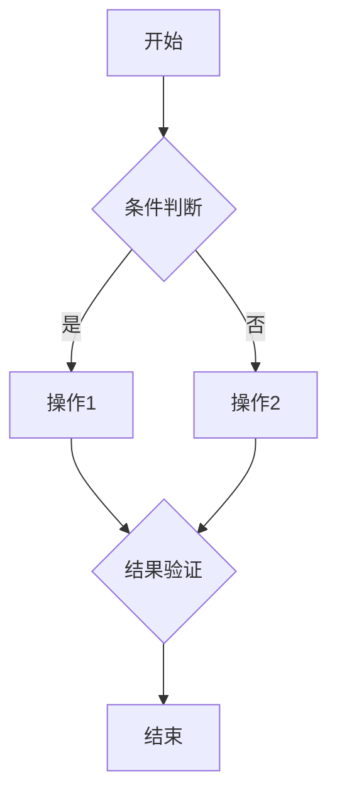

                 

## 《DevOps实践：优化LLM应用的开发流程》

关键词：DevOps、LLM应用、开发流程、持续集成、持续交付、自动化、团队协作

摘要：本文旨在深入探讨DevOps在优化大型语言模型（LLM）应用开发流程中的应用。首先，我们将介绍DevOps的基础概念、起源及其与传统IT运维的对比。随后，文章将具体分析DevOps在LLM开发中的应用，包括持续集成（CI）和持续交付（CD）的实施、自动化测试与部署，以及DevOps工具在LLM开发中的实际应用案例。文章还将提供优化LLM应用开发流程的策略和步骤，并探讨如何构建高效的DevOps团队和塑造DevOps文化。最后，通过最佳实践案例分享和未来展望，为读者提供全面的DevOps实践指南。

## 目录大纲

### 第一部分：DevOps基础

#### 第1章：DevOps概述

1.1 DevOps概念与起源
1.2 DevOps与传统IT运维对比
1.3 DevOps的核心要素
1.4 DevOps工具介绍

#### 第2章：LLM应用开发中的DevOps实践

2.1 LLMApp应用场景
2.2 DevOps在LLM开发中的应用
2.3 CI/CD在LLM开发中的应用
2.4 自动化在LLM开发中的应用
2.5 DevOps工具在LLM开发中的应用实例

### 第二部分：优化LLM应用的开发流程

#### 第3章：优化LLM应用的开发流程

3.1 LLMApp开发流程分析
3.2 优化开发流程的策略
3.3 流程优化案例分析
3.4 实施流程优化的步骤

#### 第4章：构建高效团队

4.1 DevOps团队构建
4.2 沟通与协作
4.3 跨部门协作
4.4 提升团队效能

#### 第5章：DevOps文化

5.1 DevOps文化的核心要素
5.2 塑造DevOps文化的方法
5.3 DevOps文化的实践案例

### 第三部分：DevOps最佳实践

#### 第6章：DevOps最佳实践

6.1 DevOps最佳实践概述
6.2 DevOps最佳实践案例分享
6.3 DevOps最佳实践的实施建议

#### 第7章：未来展望

7.1 DevOps发展趋势
7.2 DevOps在LLM应用开发中的未来角色
7.3 总结与展望

### 结尾：作者信息

作者：AI天才研究院/AI Genius Institute & 禅与计算机程序设计艺术 /Zen And The Art of Computer Programming

## 第1章 DevOps概述

### 1.1 DevOps概念与起源

DevOps是一种文化和实践，旨在通过加强开发和运维团队之间的合作，实现快速、可靠地交付高质量软件。DevOps的核心思想是将开发（Development）和运维（Operations）紧密结合，以应对现代软件开发中速度和质量的挑战。

DevOps的概念起源于2009年的第一次DevOpsDays会议。其理念源自前几年的敏捷开发（Agile Development）和持续集成（Continuous Integration，CI）运动。当时，软件开发团队发现，传统开发与运维分离的模式导致了效率低下、沟通不畅和交付延迟。为了解决这一问题，DevOps应运而生。

DevOps的目标和原则包括：

- **提高交付速度**：通过自动化和敏捷开发方法，缩短软件从开发到交付的时间。
- **增强质量**：通过持续集成和测试，确保软件的质量和可靠性。
- **增强团队协作**：通过打破开发和运维之间的壁垒，促进团队成员之间的合作和沟通。
- **持续改进**：通过不断反馈和优化，不断提高开发流程和系统的效能。

### 1.2 DevOps与传统IT运维对比

传统IT运维通常以稳定性和可靠性为核心目标，强调规范的流程和严格的控制。这种模式在保证系统稳定运行方面非常有效，但往往导致开发与运维之间的隔离，使得软件交付过程缓慢、成本高昂。

相比之下，DevOps强调快速迭代、持续交付和自动化，更注重开发和运维团队的协作与整合。以下是比较两者的一些关键点：

| 传统IT运维 | DevOps |
| --- | --- |
| 以规范和标准为核心 | 以自动化和敏捷为核心 |
| 开发和运维分离 | 开发和运维整合 |
| 软件交付周期长 | 软件交付周期短 |
| 重稳定性轻速度 | 重速度轻稳定性 |

### 1.3 DevOps的核心要素

DevOps的核心要素包括持续集成（CI）、持续交付（CD）、自动化和协作。

1. **持续集成（CI）**

持续集成是指通过自动化构建和测试，确保代码的每次更改都被及时集成到主分支中。这样，可以快速发现和解决代码冲突和缺陷，提高代码质量。

2. **持续交付（CD）**

持续交付是指通过自动化部署和测试，确保软件在经过一系列验证后可以随时交付给用户。持续交付的目标是减少部署风险，加快软件交付速度。

3. **自动化**

自动化是DevOps的重要组成部分，包括自动化构建、测试、部署和监控等。自动化可以提高效率、减少人为错误，并确保重复任务的标准化和可重复性。

4. **协作**

协作是指通过打破开发和运维之间的壁垒，促进团队成员之间的沟通和合作。协作的目的是确保所有团队成员都了解项目的进展和质量，从而实现高效交付。

### 1.4 DevOps工具介绍

DevOps的实施需要一系列工具的支持。以下是一些常用的DevOps工具：

1. **Jenkins**

Jenkins是一个开源的持续集成工具，用于自动化构建、测试和部署。Jenkins支持多种编程语言和平台，并提供丰富的插件生态系统。

2. **GitLab**

GitLab是一个开源的代码托管和项目管理平台，提供Git仓库管理、代码审查、持续集成和持续交付等功能。

3. **Docker**

Docker是一个开源的应用容器引擎，用于自动化部署、测试和交付应用程序。Docker通过将应用程序及其依赖项打包到容器中，确保应用程序在不同环境中的一致性。

4. **Kubernetes**

Kubernetes是一个开源的容器编排平台，用于自动化部署、扩展和管理容器化应用程序。Kubernetes提供了强大的容器编排功能，使得大规模容器化应用的管理变得更加简单和高效。

## 第2章 LLM应用开发中的DevOps实践

### 2.1 LLMApp应用场景

大型语言模型（LLM）是一种基于深度学习技术，能够理解和生成自然语言的复杂模型。LLM应用广泛，包括但不限于自然语言处理（NLP）、机器翻译、文本生成、情感分析等。以下是几个常见的LLM应用场景：

1. **自然语言处理（NLP）**

NLP是LLM最典型的应用场景之一，包括文本分类、情感分析、命名实体识别等。LLM在NLP中的应用大大提高了文本处理的准确性和效率。

2. **机器翻译**

机器翻译是LLM的重要应用领域，通过将一种语言文本转换为另一种语言文本，实现跨语言沟通。LLM在机器翻译中能够提供更为精准和自然的翻译结果。

3. **文本生成**

文本生成是LLM的另一个关键应用，包括生成新闻文章、故事、诗歌等。通过训练大规模的LLM模型，可以生成高质量、多样化的文本内容。

4. **情感分析**

情感分析是利用LLM对文本的情感倾向进行识别和分类。在社交媒体分析、市场调研、客户服务等领域，情感分析可以帮助企业更好地理解用户需求和市场动态。

### 2.2 DevOps在LLM开发中的应用

DevOps在LLM开发中的应用具有显著的价值，可以解决传统开发模式中存在的问题，如开发与运维的脱节、部署过程的复杂性等。以下是DevOps在LLM开发中的应用价值：

1. **提高开发效率**

通过持续集成和持续交付，DevOps可以大大缩短LLM开发的周期，提高开发效率。自动化测试和部署进一步减少了手动操作，降低了人为错误的风险。

2. **确保软件质量**

DevOps强调代码的持续集成和测试，确保每次代码变更都经过严格的验证。这种做法有助于及早发现和修复缺陷，确保LLM应用的高质量。

3. **降低部署风险**

传统部署过程中，由于环境和配置的不一致性，部署风险较高。通过使用容器化和自动化部署工具，DevOps可以确保应用程序在不同环境中的一致性，降低部署风险。

4. **提升团队协作**

DevOps强调开发、测试和运维团队之间的紧密协作。通过共享资源和流程，团队成员可以更好地协同工作，提高整体效率。

### 2.3 CI/CD在LLM开发中的应用

持续集成（CI）和持续交付（CD）是DevOps实践中的两个核心环节，对于优化LLM开发流程具有重要意义。

1. **持续集成（CI）**

持续集成是指将代码的每次变更都集成到主分支中，并进行自动化的测试和构建。在LLM开发中，CI可以确保代码库的整洁和一致性，及时发现和解决潜在问题。

- **实现方式**：开发者将代码提交到代码仓库后，CI工具会自动执行一系列测试任务，包括单元测试、集成测试和性能测试。如果测试通过，代码会被合并到主分支；否则，会触发问题报告，提示开发者修复问题。
- **优势**：通过CI，LLM开发团队能够及早发现代码冲突和缺陷，提高代码质量。同时，自动化测试减少了手动测试的工作量，提高了测试的效率和准确性。

2. **持续交付（CD）**

持续交付是指通过自动化部署和测试，确保软件在经过一系列验证后可以随时交付给用户。在LLM开发中，CD可以确保部署过程的快速、可靠和可重复。

- **实现方式**：在CI的基础上，CD通过自动化部署工具将经过验证的代码部署到生产环境中。部署过程中，会执行一系列测试，确保软件的质量和性能。
- **优势**：通过CD，LLM开发团队能够实现快速迭代和交付，减少部署风险。自动化部署减少了手动操作，提高了部署的效率和一致性。

### 2.4 自动化在LLM开发中的应用

自动化是DevOps实践的重要组成部分，在LLM开发中发挥着关键作用。以下是自动化在LLM开发中的具体应用：

1. **自动化测试**

自动化测试是确保LLM应用质量的重要手段。通过编写测试脚本，可以自动化执行各种测试，包括功能测试、性能测试和安全测试。

- **实现方式**：开发者编写测试脚本，自动化测试工具会定期执行这些脚本，检测LLM应用的功能和性能是否符合预期。如果测试失败，会生成详细的错误报告。
- **优势**：自动化测试提高了测试的效率和准确性，减少了人为错误。同时，定期执行的自动化测试可以及时发现和修复潜在问题，确保应用质量。

2. **自动化部署**

自动化部署是确保LLM应用可靠交付的关键。通过使用自动化部署工具，可以简化部署过程，提高部署的效率和一致性。

- **实现方式**：开发者在代码仓库中提交代码后，自动化部署工具会自动执行一系列操作，包括打包、构建、测试和部署。部署过程中，工具会确保应用程序在不同环境中的一致性。
- **优势**：自动化部署减少了手动操作，降低了部署风险。同时，自动化部署工具可以轻松处理复杂的部署流程，提高了部署的效率和一致性。

### 2.5 DevOps工具在LLM开发中的应用实例

为了更好地理解DevOps在LLM开发中的应用，以下将介绍几个常见的DevOps工具在LLM开发中的实际应用案例：

1. **Jenkins在LLM开发中的应用**

Jenkins是一个强大的开源持续集成工具，可以用于自动化LLM开发的各个阶段。以下是一个使用Jenkins进行LLM开发的示例：

- **构建和测试**：开发者将代码提交到GitLab仓库后，Jenkins会自动触发构建和测试流程。Jenkins会编译代码、执行单元测试和集成测试，并将测试结果报告给开发者。
- **部署**：如果测试通过，Jenkins会自动将代码部署到测试环境。部署过程中，Jenkins会执行一系列测试，确保应用程序在测试环境中正常运行。

2. **GitLab在LLM开发中的应用**

GitLab是一个功能强大的代码托管和持续集成平台，可以用于管理LLM项目的代码库和自动化测试。

- **代码管理**：开发者将LLM项目的代码提交到GitLab仓库，GitLab提供版本控制和代码审查功能，确保代码库的整洁和一致性。
- **自动化测试**：GitLab提供Jenkins集成插件，可以轻松将Jenkins的构建和测试流程与GitLab代码库绑定。每次代码提交都会触发Jenkins的构建和测试，确保代码质量。

3. **Docker在LLM开发中的应用**

Docker是一个开源的容器化平台，可以用于封装LLM应用程序及其依赖项。以下是一个使用Docker进行LLM容器化的示例：

- **容器化应用**：开发者使用Dockerfile定义LLM应用程序的容器化过程，包括安装依赖项、编译代码和配置环境。通过运行Docker build命令，可以创建一个包含LLM应用程序的容器镜像。
- **容器部署**：将容器镜像部署到生产环境中，Docker可以确保应用程序在不同环境中的一致性。通过运行Docker run命令，可以启动容器实例，使应用程序在容器中运行。

4. **Kubernetes在LLM开发中的应用**

Kubernetes是一个开源的容器编排平台，可以用于管理和部署LLM应用程序的容器化实例。以下是一个使用Kubernetes进行LLM容器化部署的示例：

- **容器编排**：开发者使用Kubernetes配置文件（如YAML文件）定义LLM应用程序的部署策略，包括容器镜像、容器数量和资源限制。通过运行Kubernetes命令，可以自动部署和管理LLM应用程序的容器化实例。
- **弹性伸缩**：Kubernetes可以根据负载自动扩展或收缩LLM应用程序的容器实例，确保应用程序的高可用性和性能。

## 第3章 优化LLM应用的开发流程

### 3.1 LLMApp开发流程分析

优化LLM应用的开发流程首先需要对当前的流程进行深入分析。LLM应用开发流程通常包括以下阶段：

1. **需求分析**

在需求分析阶段，开发团队与客户或产品经理紧密合作，明确项目目标和功能需求。这一阶段的关键任务是确保对项目需求的理解一致，并制定详细的项目计划。

2. **设计**

设计阶段包括系统架构设计、数据模型设计和界面设计等。开发团队需要根据需求分析的结果，设计出能够满足需求的系统架构和应用程序界面。

3. **编码**

编码阶段是实际编写代码的过程。开发团队根据设计文档，编写出满足需求的代码。这一阶段通常涉及多个开发人员协作，以确保代码质量和进度。

4. **测试**

测试阶段是确保代码质量和功能完整性的关键环节。测试包括单元测试、集成测试、性能测试和用户验收测试等。通过一系列严格的测试，开发团队可以及时发现和修复问题。

5. **部署**

部署阶段是将应用程序部署到生产环境的过程。这一阶段包括环境配置、应用程序安装和测试等。通过自动化部署工具，可以确保部署过程的快速、可靠和可重复。

6. **运维**

运维阶段是应用程序上线后的维护和监控过程。运维团队负责确保应用程序的稳定运行，及时处理故障和性能问题。

### 3.2 开发流程中的瓶颈

尽管LLM应用开发流程已经包含了多个阶段，但在实际操作中仍然存在一些瓶颈，影响了开发效率和软件质量。以下是常见的瓶颈：

1. **沟通不畅**

开发和运维团队之间的沟通不畅是导致开发流程瓶颈的主要原因之一。由于角色不同，双方对项目的理解和期望可能存在差异，导致协作效率低下。

2. **自动化不足**

在传统开发模式中，许多任务依赖手动操作，如环境配置、代码部署和性能测试等。自动化不足不仅降低了开发效率，还增加了人为错误的风险。

3. **测试不足**

测试阶段在传统开发流程中往往被忽视，导致应用程序在上线后出现质量问题。测试不足不仅会影响软件质量，还会增加后续维护成本。

4. **流程不规范**

缺乏规范的流程和标准会导致开发过程中的混乱和不一致。不规范的开发流程会增加错误和故障的风险，降低开发效率。

### 3.3 优化开发流程的策略

为了克服上述瓶颈，优化LLM应用的开发流程，可以采取以下策略：

1. **引入敏捷开发方法**

敏捷开发是一种以人为核心、迭代、循序渐进的开发方法。通过引入敏捷开发方法，可以缩短开发周期、提高软件质量，并增强团队协作。

- **迭代开发**：将开发过程划分为多个迭代周期，每个迭代周期完成一部分功能。这样可以及时反馈和调整，减少项目风险。
- **用户故事**：使用用户故事来描述功能需求，确保需求清晰、具体，便于开发和测试。

2. **增量式开发方法**

增量式开发是将大型项目分解为多个小的、可管理的部分，逐步实现的功能开发方法。这种方法可以降低开发风险，提高项目可管理性。

- **功能模块化**：将项目划分为多个功能模块，每个模块独立开发、测试和部署。这样可以确保每个模块的质量，降低整体风险。
- **持续集成**：在开发过程中，定期集成和测试每个模块，确保模块之间的兼容性和稳定性。

3. **加强自动化**

加强自动化可以显著提高开发效率、减少人为错误，并确保开发流程的规范性和可重复性。

- **自动化构建**：使用自动化构建工具（如Jenkins）实现代码的自动化编译、打包和测试。
- **自动化部署**：使用自动化部署工具（如Docker和Kubernetes）实现应用程序的自动化部署和管理。
- **自动化测试**：编写自动化测试脚本，实现单元测试、集成测试和性能测试的自动化执行。

### 3.4 流程优化案例分析

为了更好地理解流程优化策略的实际效果，以下将介绍一个LLM应用开发流程优化的案例。

**案例背景**：

某企业开发一款智能客服系统，基于LLM技术，实现自然语言理解、智能对话和自动回复等功能。由于项目规模较大，开发流程存在明显的瓶颈，如沟通不畅、自动化不足和测试不足等。

**优化过程**：

1. **引入敏捷开发方法**

开发团队引入敏捷开发方法，将项目划分为多个迭代周期，每个迭代周期完成一部分功能。同时，使用用户故事来描述功能需求，确保需求清晰、具体。

2. **增量式开发方法**

将项目划分为多个功能模块，如自然语言理解、对话管理、知识库管理等。每个模块独立开发、测试和部署，确保模块之间的兼容性和稳定性。

3. **加强自动化**

引入Jenkins作为自动化构建和测试工具，实现代码的自动化编译、打包、测试和部署。同时，使用Docker容器化技术，简化应用程序的部署和管理。

4. **持续集成和持续交付**

在开发过程中，定期集成和测试每个模块，确保模块之间的兼容性和稳定性。通过持续集成和持续交付，实现快速迭代和交付。

**效果分析**：

1. **开发效率提高**

引入敏捷开发和增量式开发方法，使开发团队能够更灵活地应对需求变更，缩短开发周期。同时，加强自动化，减少了手动操作和人为错误，提高了开发效率。

2. **软件质量提升**

通过持续集成和持续交付，开发团队可以及早发现和修复问题，确保代码质量和功能完整性。自动化测试的引入，进一步提高了软件质量。

3. **团队协作加强**

通过引入敏捷开发和自动化工具，开发、测试和运维团队之间的沟通和协作得到加强。团队成员可以更好地协同工作，提高了整体效率。

### 3.5 实施流程优化的步骤

为了成功实施流程优化，可以按照以下步骤进行：

1. **评估当前流程**

评估当前开发流程的瓶颈和不足，识别需要优化的环节。

2. **制定优化方案**

根据评估结果，制定具体的优化方案，包括引入敏捷开发方法、增量式开发方法、加强自动化等。

3. **培训和宣传**

对团队成员进行培训和宣传，确保他们了解新的开发流程和工具，并理解优化方案的意义和目标。

4. **逐步实施**

逐步实施优化方案，将新的开发流程和工具应用到实际项目中，逐步推广到整个团队。

5. **监控和调整**

监控优化方案的实施效果，及时发现和解决出现的问题。根据实际情况，调整优化方案，确保其持续改进。

## 第4章 构建高效团队

### 4.1 DevOps团队构建

构建一个高效的DevOps团队是实现DevOps目标的关键。一个理想的DevOps团队应该具备以下特征：

1. **多技能成员**

DevOps团队应该由具有多技能的成员组成，包括开发人员、运维人员、测试工程师等。这样，团队成员可以相互补充，提高团队整体的能力和效率。

2. **协作文化**

DevOps强调跨职能团队的合作，因此，团队内部应该培养一种开放、协作的文化。团队成员应该乐于分享知识和经验，共同解决难题。

3. **持续学习**

DevOps是一个不断发展和变化的领域，团队成员需要具备持续学习的能力，不断更新自己的技能和知识。

### 4.2 沟通与协作

沟通和协作是DevOps团队高效运作的基础。以下是一些关键点：

1. **定期会议**

定期举行团队会议，讨论项目进展、问题解决和改进措施。会议应保持简洁，确保高效。

2. **即时沟通**

鼓励团队成员之间的即时沟通，使用工具如Slack、Microsoft Teams等，方便快速交流和协作。

3. **代码审查**

代码审查是一种有效的沟通和协作方式，可以确保代码质量，同时促进团队成员之间的知识共享。

### 4.3 跨部门协作

跨部门协作是DevOps团队面临的另一个挑战。以下是一些建议：

1. **明确职责**

确保各部门明确自己的职责和任务，避免职责重叠和冲突。

2. **建立沟通渠道**

建立跨部门的沟通渠道，如跨部门会议、邮件列表等，促进信息的流通和协作。

3. **共享资源**

鼓励跨部门共享资源，如工具、技术和知识，提高整体效率。

### 4.4 提升团队效能

提升团队效能是DevOps团队持续发展的关键。以下是一些方法：

1. **自动化**

通过自动化工具和流程，减少重复性工作，提高工作效率。

2. **培训与发展**

定期为团队成员提供培训和发展机会，提高其技能和知识水平。

3. **激励与奖励**

建立合理的激励和奖励机制，鼓励团队成员积极参与项目，提高工作积极性。

## 第5章 DevOps文化

### 5.1 DevOps文化的核心要素

DevOps文化是DevOps实践成功的关键。一个成功的DevOps文化应该具备以下核心要素：

1. **相互信任**

在DevOps文化中，团队成员之间应该建立相互信任，相信对方会尽最大努力完成工作。这种信任有助于减少冲突，提高团队协作效率。

2. **客户导向**

DevOps团队应该以客户需求为导向，关注用户体验和业务价值。通过持续交付高质量软件，满足客户需求，实现业务目标。

3. **持续学习**

DevOps文化鼓励团队成员不断学习新技术和知识，提高自身能力。持续学习有助于团队保持竞争力，应对快速变化的市场环境。

4. **持续改进**

DevOps团队应该不断寻求改进的机会，通过反馈和优化，提高开发流程和系统的效能。

### 5.2 塑造DevOps文化的方法

要塑造DevOps文化，可以采取以下方法：

1. **培训与教育**

为团队成员提供DevOps相关的培训和教育，帮助他们了解DevOps的理念和实践。

2. **领导示范**

领导者应该以身作则，积极参与DevOps实践，树立榜样，推动团队文化变革。

3. **鼓励反馈**

鼓励团队成员提出改进建议，建立开放的反馈机制，促进团队文化的持续改进。

4. **共享成功经验**

分享团队在DevOps实践中的成功经验和教训，提高团队成员的认同感和归属感。

### 5.3 DevOps文化的实践案例

以下是一个DevOps文化实践的成功案例：

**公司背景**：

某大型互联网公司，业务发展迅速，但开发流程和运维模式相对落后，导致项目交付周期长、质量不稳定。

**实践过程**：

1. **引入DevOps理念**

公司管理层决定引入DevOps理念，推动组织变革。他们聘请了专业的DevOps顾问，为团队提供培训和指导。

2. **构建DevOps团队**

公司组建了一个跨职能的DevOps团队，包括开发、测试和运维人员。团队成员接受了全面的DevOps培训，掌握了相关工具和技能。

3. **实施自动化**

团队开始实施自动化，包括自动化构建、测试和部署。他们使用了Jenkins、Docker和Kubernetes等工具，简化了开发流程。

4. **建立协作文化**

团队建立了协作文化，定期举行跨部门会议，讨论项目进展和问题解决。他们还采用了敏捷开发方法，提高项目交付效率。

5. **持续改进**

团队持续寻求改进机会，通过反馈和优化，不断提升开发流程和系统的效能。

**效果分析**：

1. **交付周期缩短**

通过自动化和敏捷开发，项目的交付周期显著缩短，满足了业务发展的需求。

2. **质量提升**

自动化测试和持续集成确保了软件质量，项目上线后的故障率降低。

3. **团队协作增强**

跨部门协作和协作文化的建立，提高了团队的整体效率和满意度。

4. **业务价值实现**

快速迭代和高质量交付，帮助公司实现了业务目标，提升了市场竞争力。

### 5.4 挑战与应对

尽管DevOps文化在实践中取得了显著成效，但仍然面临一些挑战。以下是一些常见挑战及应对策略：

1. **组织变革的阻力**

组织变革往往面临阻力，特别是当变革涉及人员岗位调整和职责变化时。应对策略包括：

- **充分沟通**：向员工解释变革的原因和目标，增强他们的认同感。
- **领导示范**：领导者应以身作则，积极参与变革，树立榜样。
- **激励机制**：建立激励机制，鼓励员工积极参与变革。

2. **技能和知识的不足**

DevOps实践需要团队成员具备多技能和专业知识。应对策略包括：

- **培训与教育**：定期为团队成员提供培训和成长机会，提高其技能和知识水平。
- **引进专业人才**：招聘具有DevOps经验和技能的专业人才，为团队注入新的活力。

3. **工具选择和管理**

DevOps工具繁多，选择和管理工具是一项挑战。应对策略包括：

- **需求分析**：根据项目需求，选择合适的工具，确保工具的适用性和兼容性。
- **工具集成**：建立工具集成框架，实现工具之间的无缝协作。

4. **文化和组织习惯的转变**

DevOps文化的塑造需要时间和努力，尤其是当组织习惯于传统的开发模式时。应对策略包括：

- **逐步推广**：逐步引入DevOps理念和实践，让团队成员逐步适应。
- **试点项目**：选择一些项目作为试点，通过试点项目的成功经验，推动组织变革。

## 第6章 DevOps最佳实践

### 6.1 DevOps最佳实践概述

DevOps最佳实践是成功实施DevOps的基石，它们提供了具体的方法和策略，帮助企业实现快速、可靠地交付高质量软件。以下是一些核心的DevOps最佳实践：

1. **持续集成和持续交付（CI/CD）**

持续集成（CI）和持续交付（CD）是DevOps的核心原则。CI确保每次代码变更都被及时集成到主分支，并进行自动化测试和构建。CD则确保经过验证的代码可以快速、可靠地部署到生产环境。CI/CD有助于减少部署时间、降低风险并提高代码质量。

2. **自动化**

自动化是DevOps的重要组成部分，包括自动化构建、测试、部署和监控等。自动化工具可以显著提高开发效率，减少人为错误，并确保重复任务的标准化和可重复性。

3. **基础设施即代码（Infrastructure as Code，IaC）**

基础设施即代码是将基础设施配置和管理作为代码的一部分，通过版本控制和自动化工具进行管理。IaC有助于提高基础设施的可复用性和可维护性，减少手动操作和配置错误。

4. **微服务架构**

微服务架构是将应用程序分解为一系列独立的、可扩展的服务。每个服务都专注于特定的业务功能，可以通过自动化工具独立部署和管理。微服务架构有助于提高应用程序的灵活性、可伸缩性和可靠性。

5. **容器化**

容器化是一种轻量级虚拟化技术，通过将应用程序及其依赖项封装在容器中，实现应用程序在不同环境中的可移植性和一致性。Docker和Kubernetes是常用的容器化工具。

6. **监控和日志分析**

监控和日志分析是确保应用程序稳定运行的关键。通过监控工具，可以实时了解系统的性能和健康状况，通过日志分析，可以诊断和解决出现的问题。

7. **团队协作**

DevOps强调跨职能团队的协作。通过协作，可以确保开发和运维团队紧密合作，提高开发效率和软件质量。

### 6.2 DevOps最佳实践案例分享

以下分享两个DevOps最佳实践的案例，以展示这些实践在实际项目中的应用和效果。

#### 案例一：企业级LLM应用的持续集成与持续交付

**项目背景**：

某大型企业开发一款基于LLM技术的智能客服系统，要求快速迭代和高质量交付。由于系统复杂，传统的开发模式难以满足需求。

**解决方案**：

1. **持续集成（CI）**

使用Jenkins作为CI工具，实现代码的自动化构建和测试。每次代码提交都会触发Jenkins构建和测试流程，确保代码质量。

2. **持续交付（CD）**

使用Jenkins结合Docker和Kubernetes，实现自动化部署和监控。通过Kubernetes，可以轻松管理容器化应用程序的部署、扩展和恢复。

**效果分析**：

- **交付周期缩短**：通过CI/CD，项目的交付周期从原来的几周缩短到几天，提高了交付速度。
- **软件质量提升**：自动化测试和部署确保了软件质量，降低了上线后的故障率。
- **运维效率提高**：通过容器化和Kubernetes，简化了运维工作，提高了运维效率。

#### 案例二：使用容器化技术优化LLM应用的部署

**项目背景**：

某初创公司开发一款基于LLM技术的文本生成应用，需要快速部署和扩展，以适应不断变化的市场需求。

**解决方案**：

1. **容器化**

使用Docker将应用程序及其依赖项封装到容器中，实现应用程序在不同环境中的可移植性和一致性。

2. **自动化部署**

使用Kubernetes进行自动化部署和管理。通过编写Kubernetes配置文件，可以轻松管理容器化应用程序的部署、扩展和监控。

**效果分析**：

- **部署效率提高**：容器化技术简化了部署过程，提高了部署效率。
- **可扩展性增强**：通过Kubernetes，可以轻松实现应用程序的弹性扩展，满足业务需求。
- **运维成本降低**：容器化技术减少了运维工作量，降低了运维成本。

### 6.3 DevOps最佳实践的实施建议

为了成功实施DevOps最佳实践，可以采取以下建议：

1. **需求分析和规划**

在实施DevOps之前，进行详细的需求分析和规划，明确项目目标和实施步骤。

2. **选择合适的工具**

根据项目需求，选择合适的DevOps工具。确保工具的兼容性和适用性。

3. **培训与文化建设**

为团队成员提供DevOps相关的培训，培养团队协作文化，确保团队成员理解DevOps理念和实践。

4. **逐步实施**

逐步实施DevOps最佳实践，从简单的自动化任务开始，逐步扩展到更复杂的流程和工具。

5. **监控与优化**

定期监控实施效果，发现和解决潜在问题，不断优化开发流程和系统。

## 第7章 未来展望

### 7.1 DevOps发展趋势

DevOps正随着技术的进步和市场需求的变化而不断发展。以下是DevOps的一些发展趋势：

1. **自动化与智能化的融合**

随着人工智能和机器学习技术的不断发展，自动化将进一步与智能化融合。自动化工具将能够通过学习历史数据和模式，自动优化和调整开发流程。

2. **云原生DevOps**

云原生技术（如Kubernetes和Docker）的发展，使得DevOps在云环境中的应用变得更加广泛和成熟。云原生DevOps将提供更灵活、可扩展的部署和管理方式。

3. **DevOps与AI的融合**

DevOps与AI的结合，将使得开发流程更加智能化。AI技术可以用于自动化测试、异常检测、性能优化等，提高开发效率和软件质量。

4. **边缘计算与DevOps**

随着物联网和边缘计算的发展，DevOps将扩展到边缘环境。边缘计算中的DevOps将关注如何高效地部署和管理分布式应用程序。

### 7.2 DevOps在LLM应用开发中的未来角色

在LLM应用开发中，DevOps的角色将变得更加重要。以下是DevOps在LLM开发中的未来角色：

1. **提升开发效率**

DevOps将帮助LLM开发团队实现更快速的开发和交付，通过自动化和协作，减少重复工作和人为错误。

2. **确保软件质量**

持续集成和持续交付将确保LLM软件的质量和可靠性，通过自动化测试和监控，及时发现和修复问题。

3. **支持大规模部署**

随着LLM应用规模的不断扩大，DevOps将提供支持大规模部署和管理的技术和工具，确保应用在不同环境中的稳定运行。

4. **促进AI创新**

DevOps将促进LLM应用的创新，通过快速迭代和交付，使开发者能够更快地尝试新的模型和算法，推动AI技术的发展。

### 7.3 总结与展望

DevOps作为一种文化和实践，正日益成为现代软件开发的核心。通过DevOps，开发团队可以更快速、更可靠地交付高质量软件，提高开发效率和软件质量。在LLM应用开发中，DevOps发挥着关键作用，通过自动化、持续集成和持续交付，优化开发流程，支持大规模部署和管理。展望未来，随着自动化和智能化技术的不断发展，DevOps将在软件开发中扮演更加重要的角色，推动AI技术的创新和应用。

## 结尾：作者信息

作者：AI天才研究院/AI Genius Institute & 禅与计算机程序设计艺术 /Zen And The Art of Computer Programming

通过本文的探讨，我们深入了解了DevOps在优化LLM应用开发流程中的重要性。DevOps不仅提高了开发效率和质量，还加强了团队协作和持续改进。展望未来，随着自动化和智能化的融合，DevOps将在更广泛的领域发挥作用，推动AI技术的发展和应用。我们期待读者能够将这些最佳实践应用到实际项目中，共同推动软件开发的进步。

## 附录：数学公式与流程图

在本文中，我们使用了LaTeX格式来嵌入数学公式，以清晰地表达算法原理和数学模型。以下是一些示例：

$$
1 + 1 = 2
$$

$$
y = mx + b
$$

此外，我们还使用了Mermaid流程图来展示算法流程和系统架构。以下是一个Mermaid流程图的示例：

这些数学公式和流程图有助于读者更好地理解和掌握本文的核心概念和算法原理。在未来的项目中，我们建议读者结合实际需求，灵活运用这些工具和方法，优化开发流程，提高软件质量。

