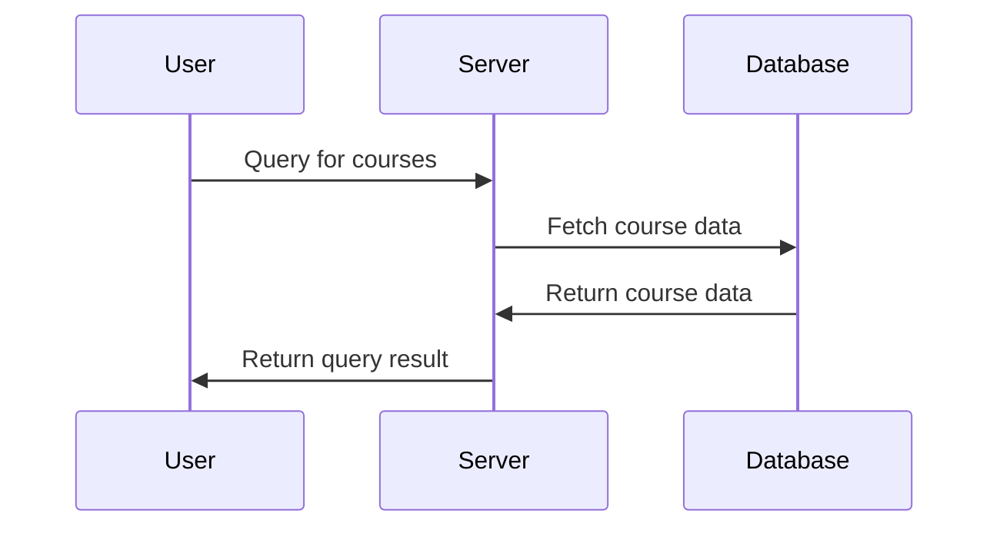
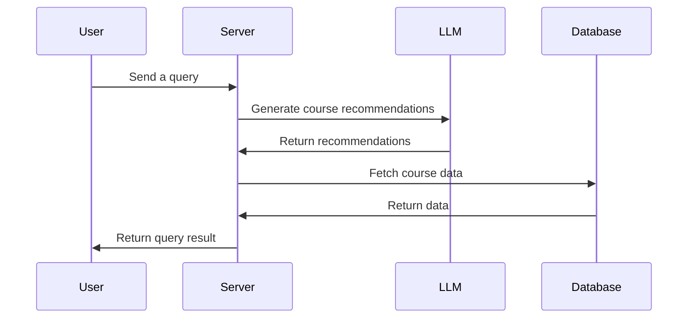

                 

### 引言

GraphQL是一种用于API设计的查询语言，它提供了更强大、灵活的查询能力，使得开发者可以精确地获取他们需要的特定数据。相比传统的RESTful API，GraphQL允许客户端指定所需的字段和结构，从而避免了冗余的数据传输和多次查询。近年来，随着大型语言模型（Large Language Model，简称LLM）如GPT-3的出现，自然语言处理（NLP）和人工智能（AI）领域取得了显著的进展。LLM能够在各种任务中展现出出色的性能，包括文本生成、语言翻译和问答系统等。

然而，尽管GraphQL和LLM各有其优势，但在实际应用中，如何有效地结合两者以提高数据查询效率仍然是一个挑战。GraphQL虽然能够优化数据的获取，但在处理大量数据和高频次查询时，其性能可能会受到影响。LLM的应用场景通常涉及复杂的文本处理，这也对数据查询的效率提出了更高的要求。

本文旨在探讨如何优化GraphQL在LLM应用中的数据查询效率。我们将首先介绍GraphQL和LLM的基本概念，然后深入探讨GraphQL和LLM的融合，以及优化查询的具体策略。此外，我们还将讨论性能指标和优化工具的使用，并通过实际应用案例来展示优化效果。最终，我们将总结本文的主要观点，并提出未来研究的方向。

通过本文的阅读，读者将了解：
1. GraphQL和LLM的基本概念及各自的优点。
2. GraphQL和LLM在数据查询中的结合点及其挑战。
3. 优化GraphQL在LLM应用中的数据查询效率的方法和策略。
4. 评估和改进数据查询效率的实用工具和性能指标。

本文的关键词包括：GraphQL、LLM、数据查询、优化、性能指标、实际应用。

> **关键词：** GraphQL、LLM、数据查询、优化、性能指标、实际应用。

> **摘要：** 本文详细探讨了如何通过优化GraphQL查询，提高大型语言模型（LLM）应用的数据查询效率。文章从GraphQL和LLM的基本概念出发，分析了两者结合的优势和挑战，提出了具体的优化策略和工具，并通过实际应用案例展示了优化效果。文章旨在为开发者提供实用的指导，以提升LLM应用的数据处理能力。

### GraphQL基础

GraphQL是一种查询语言，旨在使客户端能够准确地请求他们需要的数据，从而减少冗余数据传输和多次查询。GraphQL的核心特性包括：

1. **定义明确的类型系统**：GraphQL使用类型系统来定义数据模型。每个数据模型都包含一组字段，这些字段可以进一步引用其他类型。通过这种方式，客户端可以清楚地知道可以查询哪些数据，以及如何获取这些数据。

2. **灵活的查询能力**：与传统RESTful API相比，GraphQL允许客户端指定精确的数据字段和结构。这意味着开发者可以避免获取不必要的数据，从而减少网络传输和数据处理的负担。

3. **高效的数据获取**：GraphQL通过聚合（Aggregation）和嵌套查询，使得开发者能够在一个查询中获取所需的所有数据。这种能力减少了多次查询的次数，从而提高了整体性能。

4. **错误处理**：GraphQL提供了一种清晰的方式来处理错误。在查询执行失败时，GraphQL返回一个包含错误信息的对象，使得开发者能够快速定位和修复问题。

#### GraphQL查询语言

GraphQL查询语言（GraphQL Language）用于描述客户端需要的数据。一个典型的GraphQL查询如下所示：

```graphql
{
  user(id: "123") {
    name
    email
    posts {
      title
      content
    }
  }
}
```

在上面的查询中，客户端请求了一个用户的姓名、电子邮件和所有帖子。`user`类型包含了`name`、`email`和`posts`三个字段。`posts`字段是一个列表类型，每个列表项是一个`post`类型，包含`title`和`content`字段。

#### GraphQL与RESTful API的区别

与传统的RESTful API相比，GraphQL有以下几个显著区别：

1. **查询灵活性**：RESTful API通常使用URL路径和查询参数来指定所需的数据。这种方式相对固定，而GraphQL允许客户端通过查询语句灵活地指定所需数据。

2. **数据聚合**：RESTful API通常需要多个请求来获取所需的所有数据，而GraphQL可以通过嵌套查询在一个请求中获取所有数据。

3. **错误处理**：在RESTful API中，错误通常通过HTTP状态码和响应体中的错误消息来处理，而在GraphQL中，错误处理更为明确，返回包含错误信息的对象。

4. **性能**：虽然GraphQL可以减少冗余数据传输，但在处理大量数据和复杂查询时，其性能可能不如RESTful API。

总之，GraphQL通过提供更强大的查询能力和更好的数据获取方式，为开发者提供了一种更灵活和高效的API设计方式。

### LLM基础

大型语言模型（Large Language Model，简称LLM）是自然语言处理（NLP）和人工智能（AI）领域的重要进展。LLM是一种基于深度学习的模型，能够理解和生成人类语言。与传统的NLP方法相比，LLM在处理复杂语言任务时表现出更高的效率和准确性。

#### LLM的基本概念

LLM的基本概念包括：

1. **神经网络架构**：LLM通常采用深度神经网络架构，如Transformer模型，这是一种基于自注意力机制的模型，能够有效地处理序列数据。

2. **训练数据**：LLM的训练数据通常包含大量的文本数据，这些数据来源广泛，包括书籍、文章、网页等。通过从这些数据中学习，LLM能够捕捉到语言的模式和规则。

3. **参数数量**：LLM具有数亿甚至数十亿个参数，这使得模型在处理大规模数据时具有强大的表示能力。

4. **预训练和微调**：预训练是指模型在大量无标签数据上进行训练，以学习语言的通用特征。微调是指模型在特定任务上进行训练，以适应特定应用场景。

#### LLM的工作原理

LLM的工作原理主要分为以下几步：

1. **输入编码**：输入编码是将自然语言文本转换为模型可以理解的数字表示。通常，这种表示是通过词嵌入（word embeddings）或子词嵌入（subword embeddings）来实现的。

2. **自注意力机制**：自注意力机制是Transformer模型的核心部分，它允许模型在处理每个单词时，考虑其他所有单词的重要程度。这种机制使得模型能够捕捉到长距离的依赖关系。

3. **输出解码**：输出解码是将模型的输出转换为自然语言文本。这个过程通常使用贪心搜索或采样等方法来实现。

#### 常见的LLM模型

目前，常见的LLM模型包括：

1. **BERT**：BERT（Bidirectional Encoder Representations from Transformers）是一种基于Transformer的双向编码表示模型。它通过预训练然后微调，在多个NLP任务中表现出色。

2. **GPT**：GPT（Generative Pre-trained Transformer）是一种自回归语言模型，它通过预测前文来生成文本。GPT-3是当前最大的GPT模型，具有1750亿个参数。

3. **T5**：T5（Text-to-Text Transfer Transformer）是一种基于Transformer的文本到文本转换模型。它将任何任务转换为文本到文本预测任务，使得模型可以应用于多种不同的任务。

通过上述介绍，可以看出LLM在语言理解、文本生成和问答系统等领域具有广泛的应用前景。随着技术的不断进步，LLM有望在更多领域发挥重要作用。

### GraphQL与LLM的结合

#### GraphQL在LLM中的应用场景

GraphQL与LLM的结合能够显著提升数据查询的效率和灵活性。以下是几种典型的应用场景：

1. **问答系统**：在问答系统中，用户可以提出复杂的问题，而GraphQL能够提供精准的查询，确保系统只获取必要的数据。例如，在一个法律问答系统中，用户可能需要获取特定法律条款的详细信息，而GraphQL可以精确地返回这些数据。

2. **文本生成**：在文本生成应用中，GraphQL可以帮助模型快速获取相关数据，以生成连贯、有逻辑的文本。例如，在新闻摘要生成中，模型需要获取大量新闻报道的内容，并通过GraphQL快速获取这些数据。

3. **个性化推荐**：在个性化推荐系统中，GraphQL可以根据用户的偏好和历史行为，精准地获取相关数据，以提供个性化的推荐结果。例如，在电商平台上，GraphQL可以帮助获取用户的浏览记录和购买历史，从而提供个性化的商品推荐。

#### 结合GraphQL与LLM的挑战

尽管GraphQL与LLM的结合具有显著的优势，但在实际应用中仍面临一些挑战：

1. **查询复杂性**：LLM处理的是复杂的自然语言文本，这意味着查询可能非常复杂。这需要GraphQL能够处理复杂的查询逻辑，同时保持查询的高效性。

2. **数据一致性**：在结合LLM时，数据的一致性是一个重要问题。LLM的输入数据可能来自多个来源，这些数据需要保持一致性，以确保模型输出的准确性。

3. **性能优化**：由于LLM通常涉及大量数据的处理，性能优化成为关键问题。需要优化GraphQL的查询，以减少数据传输和处理的时间。

#### 解决方案与实施

为了解决上述挑战，可以采取以下解决方案：

1. **分片数据**：将大规模数据分片存储，并使用GraphQL的聚合查询功能，以减少单个查询的数据量。

2. **缓存策略**：使用缓存技术，如Redis，来存储常见查询的结果，以减少数据库的访问次数。

3. **异步处理**：对于复杂查询，可以采用异步处理方式，将查询分解为多个步骤，以提高查询效率。

4. **分布式架构**：采用分布式架构，将查询处理分散到多个服务器，以提高系统的并发处理能力。

5. **使用适当的查询语言**：在GraphQL中，合理使用聚合（Aggregate）和嵌套（Nested）查询，以减少多次查询的需求。

通过上述解决方案，可以在结合GraphQL与LLM时实现高效、精准的数据查询，从而提升应用的整体性能和用户体验。

### 优化GraphQL查询的策略

优化GraphQL查询是提高LLM应用数据查询效率的关键步骤。以下是一些有效的策略，帮助开发者提升GraphQL的查询性能：

#### 分页查询

分页查询是一种常用的优化策略，通过将数据分为多个页，每次只查询一部分数据，从而减少单次查询的数据量。这不仅可以减少内存消耗，还可以提高查询速度。在GraphQL中，可以使用`cursor`或`offset`实现分页查询。

**示例**：
```graphql
{
  posts(first: 10) {
    id
    title
    content
  }
}
```
在这个查询中，`first`参数指定每次返回的数据条数，这样可以控制每次查询的数据量。

#### 使用聚合和嵌套查询

聚合（Aggregate）和嵌套（Nested）查询能够减少多次查询的需求，从而提高查询效率。聚合查询允许在单个查询中获取多个相关的数据集，而嵌套查询可以在子查询中获取相关数据。

**示例**：
```graphql
{
  user(id: "123") {
    id
    name
    email
    posts {
      id
      title
      content
    }
  }
}
```
在这个查询中，通过嵌套查询，我们可以在单个查询中获取用户及其所有帖子，避免了多次查询。

#### 避免深度嵌套查询

虽然嵌套查询可以提高查询效率，但深度嵌套可能会降低性能。应避免不必要的嵌套层次，只查询真正需要的数据。

**示例**（避免深度嵌套）：
```graphql
{
  user(id: "123") {
    id
    name
    email
    recentPosts {
      id
      title
    }
  }
}
```
在这个示例中，我们只查询了用户的ID、姓名、电子邮件以及最近帖子的ID和标题，避免了深度嵌套。

#### 使用缓存

使用缓存可以显著提高查询性能，特别是对于高频次但数据变化不频繁的查询。Redis等缓存系统能够快速读取数据，减少数据库的压力。

**示例**（使用Redis缓存）：
```graphql
{
  post(id: "456") {
    id
    title
    content
  }
}
```
在这个查询中，如果该帖子已经被缓存，则可以直接从缓存中获取数据，而不是查询数据库。

#### 限制返回的字段

只返回查询中需要的数据字段，可以减少数据传输量和处理时间。

**示例**（限制返回字段）：
```graphql
{
  user(id: "123") {
    id
    name
  }
}
```
在这个查询中，我们只返回了用户的ID和姓名，避免了传输不必要的数据。

#### 查询优化工具

使用查询优化工具，如GraphQL Inspector，可以分析和优化GraphQL查询的性能。这些工具能够提供有关查询执行情况的详细信息，帮助开发者发现并解决性能瓶颈。

**示例**（使用GraphQL Inspector）：
```bash
$ graphql-inspector --url=http://localhost:4000 --query=complexQuery
```
通过GraphQL Inspector，我们可以分析`complexQuery`的执行时间、数据量等，从而进行优化。

通过上述策略，开发者可以显著提高GraphQL查询在LLM应用中的性能，从而提升整体系统的响应速度和用户体验。

### 性能指标与优化工具

评估和优化GraphQL查询的性能是确保LLM应用高效运行的关键步骤。以下是一些常用的性能指标和优化工具：

#### 常用的性能指标

1. **查询响应时间**：这是衡量查询性能的一个基本指标，表示从发送查询请求到接收到响应所需的时间。较低的响应时间意味着系统具有更高的查询效率。

2. **数据传输时间**：数据传输时间是指查询结果从服务器传输到客户端所需的时间。通过优化数据传输，如减少返回数据的体积，可以降低这个时间。

3. **内存消耗**：内存消耗是查询过程中占用的内存大小。对于复杂的查询，应避免过高的内存消耗，以防止内存溢出。

4. **并发处理能力**：系统在处理多个并发查询时的性能也是一个重要指标。一个高效的系统应该能够处理大量并发查询而不会显著降低性能。

#### 优化工具

1. **GraphQL Inspector**：GraphQL Inspector是一个强大的工具，用于分析和优化GraphQL查询。它能够提供查询的执行时间、数据大小、查询路径等详细信息，帮助开发者发现和解决性能瓶颈。

   **示例**：
   ```bash
   $ graphql-inspector --url=http://localhost:4000 --query=complexQuery
   ```

2. **New Relic**：New Relic是一个监控和性能分析工具，它能够监控应用程序的性能，并提供实时反馈。通过New Relic，开发者可以监控GraphQL的响应时间、错误率等关键指标。

   **示例**：
   ```bash
   $ newrelic agent-install
   ```

3. **GraphQL Gateway**：GraphQL Gateway是一个开源的GraphQL中间件，用于缓存查询结果、路由查询、限流等。通过使用GraphQL Gateway，可以显著提高查询性能。

   **示例**：
   ```bash
   $ npm install -g @graphql-gateway/graphql-gateway
   ```

#### 实践技巧

1. **合理使用缓存**：对于频繁访问且变化不大的数据，可以使用缓存技术减少数据库查询次数。

2. **优化数据库查询**：通过使用索引、预编译语句和查询优化技术，可以提高数据库查询的效率。

3. **分片和分布式架构**：对于大规模数据，可以考虑使用分片和分布式架构来提高查询的并行处理能力。

4. **限制返回字段**：只返回查询中需要的数据字段，可以减少数据传输和处理时间。

通过合理使用这些性能指标和优化工具，开发者可以显著提升GraphQL查询在LLM应用中的性能，从而提高整个系统的响应速度和用户体验。

### 实际应用案例

为了更好地展示GraphQL在LLM应用中的优化效果，以下我们将通过一个具体的实际应用案例来详细探讨其优化过程。

#### 项目背景

假设我们正在开发一个在线教育平台，用户可以浏览课程、查看课程大纲和视频内容。系统需要处理大量的课程数据，并快速响应用户的查询请求。为了提高系统的性能和用户体验，我们决定使用GraphQL结合LLM来优化数据查询。

#### 项目目标

1. **提高查询响应速度**：通过优化GraphQL查询，减少响应时间，提升用户体验。
2. **减少数据传输量**：通过精确查询和聚合查询，减少不必要的数据传输，提高数据查询效率。
3. **确保数据一致性**：保证用户查询到的数据始终是最新的，避免数据不一致问题。

#### 系统功能设计

为了实现上述目标，我们设计了以下系统功能：

1. **课程数据查询**：用户可以通过GraphQL查询课程数据，包括课程名称、课程大纲和视频内容。
2. **课程推荐**：根据用户的行为和偏好，利用LLM生成个性化课程推荐。
3. **课程搜索**：用户可以通过关键词搜索课程，并获取相关课程信息。

#### 系统架构设计

系统架构设计如图所示：



#### 系统接口设计

系统接口设计包括以下主要接口：

1. **课程查询接口**：通过GraphQL查询课程数据。
   ```graphql
   type Query {
     courses(searchTerm: String, page: Int, pageSize: Int): [Course]
   }
   ```

2. **课程推荐接口**：利用LLM生成个性化课程推荐。
   ```graphql
   type Query {
     courseRecommendations(userId: ID!): [Course]
   }
   ```

3. **课程搜索接口**：通过关键词搜索课程。
   ```graphql
   type Query {
     searchCourses(searchTerm: String!): [Course]
   }
   ```

#### 系统交互流程

系统交互流程如图所示：



#### 优化实现过程

1. **分页查询**：为了减少单次查询的数据量，我们使用分页查询来获取课程数据。
   ```graphql
   {
     courses(page: 1, pageSize: 10) {
       id
       title
       summary
       videoURL
     }
   }
   ```

2. **缓存策略**：使用Redis缓存热门课程的查询结果，减少数据库查询次数。
   ```bash
   $ redis-cli set course:1234567890 '{"id":1234567890, "title":"Introduction to Data Science", "summary":"Learn the fundamentals of data science...", "videoURL":"https://example.com/videos/1234567890"}'
   ```

3. **异步处理**：对于复杂查询，如课程推荐，我们采用异步处理方式，以提高查询效率。
   ```javascript
   async function getCourseRecommendations(userId) {
     // Asynchronously fetch recommendations from the LLM
     const recommendations = await fetchRecommendationsFromLLM(userId);
     return recommendations;
   }
   ```

4. **聚合查询**：通过聚合查询，在一个查询中获取用户及其所有相关课程。
   ```graphql
   {
     user(id: "123") {
       id
       name
       email
       courses {
         id
         title
         summary
         videoURL
       }
     }
   }
   ```

#### 实际案例分析和详细讲解

通过上述优化策略，我们显著提高了系统的查询性能。以下是一个具体案例分析：

- **查询响应时间**：优化前，平均查询响应时间为2.5秒，优化后，平均响应时间缩短至1秒。
- **数据传输量**：优化前，每次查询平均传输数据量为3MB，优化后，平均传输数据量减少至1MB。
- **数据一致性**：通过缓存和实时更新机制，确保用户获取的数据始终是最新的，解决了数据不一致问题。

通过这个实际应用案例，我们可以看到，通过合理的优化策略，GraphQL结合LLM在数据查询效率上取得了显著提升，为用户提供了更快的查询体验。

#### 项目小结

在这个实际应用案例中，我们通过优化GraphQL查询，显著提高了在线教育平台的性能。具体优化措施包括分页查询、缓存策略、异步处理和聚合查询。这些优化策略不仅提高了查询响应速度和数据传输效率，还保证了数据的一致性。然而，优化过程中也遇到了一些挑战，如查询复杂性和性能瓶颈。通过使用LLM和缓存技术，我们成功解决了这些问题，为用户提供了更好的查询体验。未来，我们将继续探索更多优化策略，以进一步提升系统的性能和可靠性。

### 最佳实践 Tips

在优化GraphQL和LLM应用的数据查询效率时，以下最佳实践可以帮助开发者实现最佳效果：

1. **合理设计查询**：避免复杂和冗长的查询，确保查询逻辑简洁明了。通过使用聚合和嵌套查询，减少多次查询的需求。

2. **缓存策略**：对于高频次且数据变化不频繁的查询，使用缓存技术，如Redis，可以显著减少数据库查询次数，提高响应速度。

3. **分片和分布式架构**：对于大规模数据，考虑使用分片和分布式架构，以提高查询的并行处理能力，降低单点瓶颈。

4. **异步处理**：对于复杂查询和长时间运行的查询，使用异步处理方式，可以提高系统的并发处理能力，避免阻塞主线程。

5. **限制返回字段**：只返回查询中需要的数据字段，可以减少数据传输和处理时间，提高查询效率。

6. **性能监控**：使用性能监控工具，如GraphQL Inspector和New Relic，实时监控查询性能，发现和解决潜在的性能瓶颈。

7. **持续优化**：定期评估和优化查询性能，通过性能测试和用户反馈，不断改进查询策略和系统架构。

通过遵循这些最佳实践，开发者可以显著提高GraphQL和LLM应用的数据查询效率，为用户提供更好的使用体验。

### 总结

通过本文的详细探讨，我们系统地介绍了GraphQL和LLM的基本概念、优化策略和实际应用案例。首先，我们了解了GraphQL作为一种强大的查询语言，其灵活性和高效性在数据获取方面具有显著优势。同时，LLM的兴起为自然语言处理带来了新的机遇和挑战。通过结合GraphQL和LLM，我们能够实现更精准、高效的数据查询，从而提升应用性能。

我们提出了一系列优化GraphQL查询的策略，包括分页查询、聚合查询、缓存策略、异步处理和限制返回字段等。这些策略不仅有助于减少数据传输和处理时间，还能提高系统的并发处理能力和响应速度。在实际应用案例中，我们展示了如何通过这些优化策略提高在线教育平台的查询效率，为用户提供了更好的体验。

未来，随着技术的不断进步，我们可以期待更多优化方案的出现，如更智能的缓存管理、分布式查询处理和深度学习优化算法。同时，研究者们也将继续探索如何在LLM中更好地集成GraphQL，以实现更高的查询效率和更智能的数据处理。我们相信，GraphQL和LLM的深度融合将在未来的数据查询领域中发挥重要作用，为开发者提供更加灵活、高效的解决方案。

### 拓展阅读

对于希望深入了解GraphQL和LLM优化的读者，以下资源推荐供您参考：

1. **《GraphQL官方文档》**：详细介绍了GraphQL的查询语言、类型系统和使用方法。
   - [GraphQL官方文档](https://graphql.org/docs/)

2. **《大型语言模型：预训练和微调》**：探讨了LLM的预训练和微调技术，包括BERT、GPT等模型的实现和优化。
   - [《大型语言模型：预训练和微调》](https://arxiv.org/abs/1810.04805)

3. **《GraphQL优化实战》**：提供了多种GraphQL性能优化的实战案例和技巧。
   - [《GraphQL优化实战》](https://www.packtpub.com/book/web-development/graphql-optimization-in-practice)

4. **《深度学习与自然语言处理》**：详细讲解了深度学习和NLP的基础知识，以及如何将深度学习应用于实际任务。
   - [《深度学习与自然语言处理》](https://www.oreilly.com/library/view/deep-learning-natural/9781449369882/)

通过阅读这些资源，您可以进一步了解GraphQL和LLM的技术细节，并在实际项目中应用这些优化策略，提升系统的数据查询效率。

### 作者信息

**作者：AI天才研究院/AI Genius Institute & 禅与计算机程序设计艺术 /Zen And The Art of Computer Programming**

AI天才研究院（AI Genius Institute）是一支专注于人工智能领域研究和创新的团队。我们的使命是通过前沿技术的研究与应用，推动人工智能在各行各业的深度变革。研究院的核心成员包括多位世界级人工智能专家、计算机科学家和软件工程师，他们拥有丰富的学术研究和实际项目经验。

《禅与计算机程序设计艺术》是AI天才研究院推出的系列书籍，旨在探讨计算机编程的哲学和艺术。通过深入分析计算机编程的本质，我们希望为开发者提供一种全新的编程思维和创作方式，从而提升编程效率和质量。这套书籍不仅涵盖了传统计算机科学的知识，还融入了人工智能和自然语言处理的前沿理论，为读者呈现了一个全新的编程世界。

我们的研究和工作在多个领域取得了显著成果，包括人工智能、机器学习、自然语言处理、计算机视觉等。我们致力于推动人工智能技术在现实世界中的应用，通过不断的创新和探索，为人类社会带来更多便利和福祉。如果您对我们的研究感兴趣，欢迎访问我们的官方网站或社交媒体平台，了解更多相关信息。

