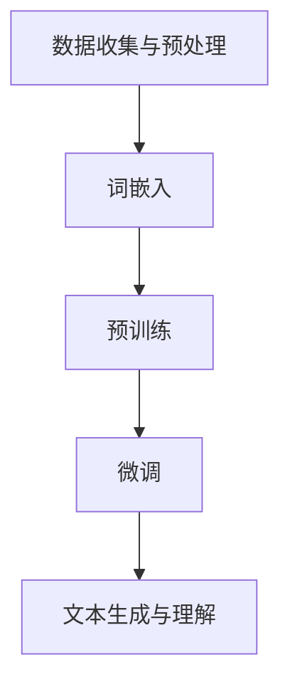
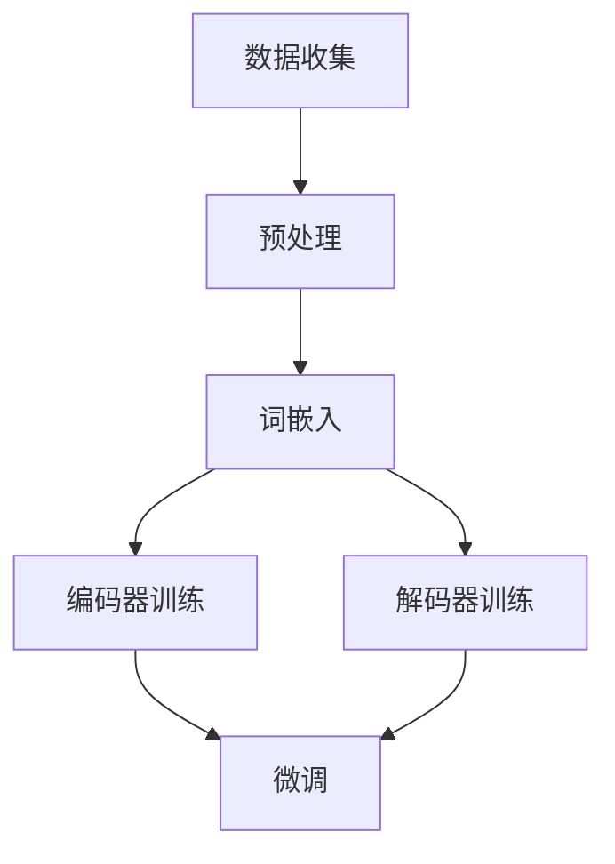
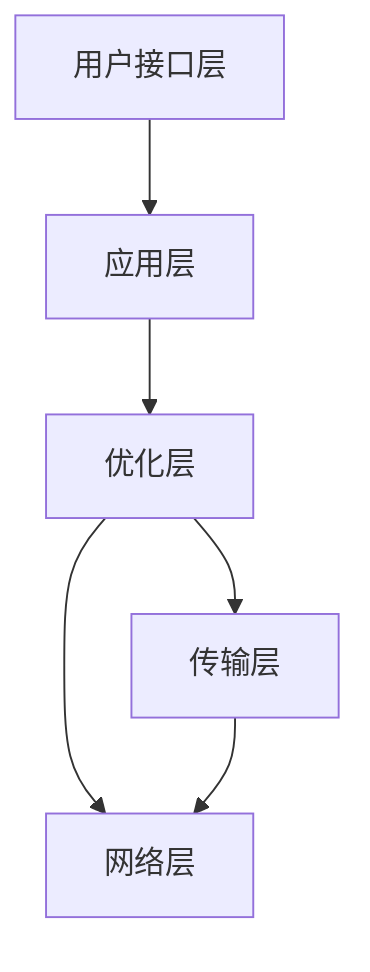
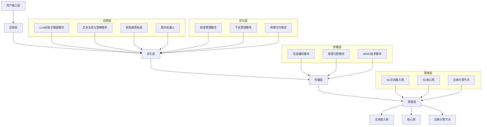
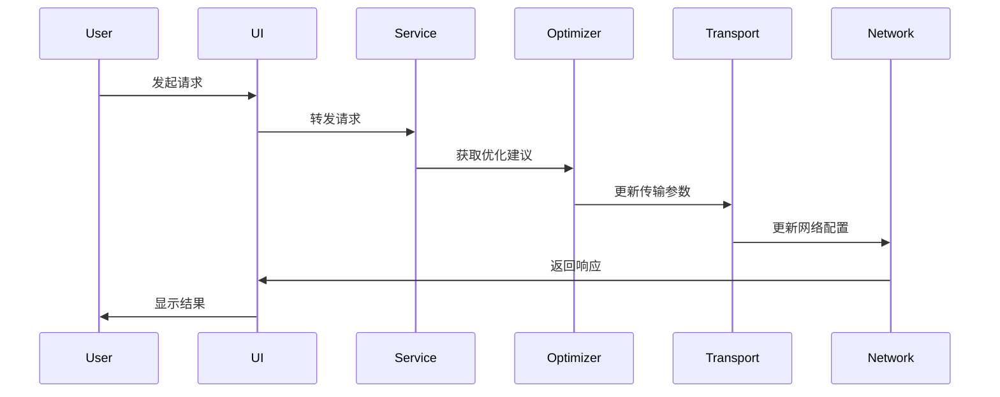

                 

### 文章标题

**5G网络优化LLM应用的移动体验**

---

**关键词：** 5G网络、LLM应用、移动体验、网络优化、算法原理、系统架构、项目实战。

---

**摘要：** 本文将深入探讨5G网络优化和LLM（大型语言模型）应用在移动体验中的作用。我们将从5G网络的技术特点入手，介绍其如何提升移动网络性能。随后，我们将探讨LLM的基本原理及其在移动体验中的应用，解析其如何通过算法优化提高用户体验。接着，我们将详细讲解5G网络优化的技术细节和LLM算法原理，并通过绘制Mermaid流程图和Python代码示例，使读者更直观地理解其工作方式。文章还将介绍5G网络优化和LLM应用的整体系统架构设计，包括领域模型类图、系统架构图、接口设计和系统交互序列图。此外，我们将通过实际项目案例展示如何实现和优化5G网络与LLM应用的移动体验。最后，我们将提供一些最佳实践和建议，总结全文并指出未来的拓展方向。通过本文的深入分析，读者将能够全面了解5G网络优化和LLM应用在提升移动体验方面的关键技术和实践方法。

### 1.1 5G网络的技术特点

5G网络，即第五代移动通信技术，是当前通信领域的一次重大突破。与之前 generations（1G、2G、3G、4G）相比，5G网络在多个方面展现出了显著的技术特点。

首先，5G网络的最大区别在于其超高的数据传输速率。根据3GPP（第三代合作伙伴计划）的规范，5G网络的理论最大下载速度可以达到20Gbps，是4G网络的100倍。这样的高速度使得高清视频流媒体、虚拟现实（VR）和增强现实（AR）等应用成为可能，为用户提供了更加丰富和流畅的移动体验。

其次，5G网络具有超低的延迟特性。4G网络的典型延迟在10-60毫秒之间，而5G网络的目标是将延迟降低到1毫秒以内。这意味着对于实时通信应用，如自动驾驶、远程医疗和工业自动化等，5G网络的低延迟特性将极大地提升系统的反应速度和可靠性。

此外，5G网络在连接密度方面也有显著提升。4G网络每平方公里可以支持约10万个连接，而5G网络则可以达到100万个连接以上。这为物联网（IoT）应用提供了良好的基础设施支持，使得大规模设备互联互通成为现实。

5G网络还引入了新的网络架构，如网络切片（Network Slicing）和边缘计算（Edge Computing）。网络切片技术允许运营商根据不同应用需求，为不同用户或业务创建虚拟的子网络，从而实现资源的最优化分配。边缘计算则通过将计算和数据存储移到网络边缘，减少了数据传输距离，降低了延迟，提高了响应速度。

这些技术特点共同构成了5G网络的核心优势，为未来的移动体验带来了巨大的变革。然而，要充分发挥5G网络的优势，优化网络性能成为了关键。接下来，我们将进一步探讨如何通过5G网络优化来提升移动体验。

#### 1.2 移动体验的关键指标

在讨论5G网络优化对移动体验的影响之前，我们首先需要明确移动体验的关键指标。这些指标不仅衡量了网络性能，还直接反映了用户的感知体验。以下是几个主要的移动体验关键指标：

首先是数据传输速率（Throughput），这是衡量网络带宽和传输效率的核心指标。高数据传输速率意味着用户可以更快地下载和上传数据，体验更流畅的在线内容，如高清视频、大型文件等。

其次是延迟（Latency），即数据从发送到接收所需的时间。低延迟对实时应用至关重要，如在线游戏、视频通话和自动驾驶等。高延迟会导致用户体验不佳，反应迟钝，影响应用的实际效果。

连接稳定性（Connection Stability）是另一个关键指标，它反映了网络的可靠性和持续性。频繁的断连和连接中断会严重影响用户的移动体验，尤其是对于连续性和实时性要求较高的应用。

最后是网络容量（Capacity），即网络能够支持的最大用户数量和业务量。高容量意味着网络能够承载更多的用户和业务，为大规模应用提供稳定的网络支持。

通过对这些关键指标进行优化，5G网络能够显著提升移动体验。例如，通过提高数据传输速率，用户可以享受更快的内容加载和下载速度；通过降低延迟，实时应用的响应速度和流畅度将得到显著提升；通过增强连接稳定性和扩大网络容量，网络能够更好地支持高并发应用，确保用户体验的一致性和可靠性。

总之，5G网络优化的目标是多方面的，不仅仅是提高网络性能，更是为了全面提升用户的移动体验。接下来，我们将进一步探讨如何通过5G网络优化来实现这些目标。

#### 1.3 5G网络优化的意义

5G网络优化不仅是为了提高网络性能，更是为了全面提升用户的移动体验。在现代社会，移动体验已成为衡量服务质量的重要标准，对于各个行业和应用场景都有着深远的影响。

首先，5G网络优化对移动娱乐体验有着显著的提升。随着高清视频、VR/AR等应用的普及，用户对数据传输速率和延迟的要求越来越高。通过优化5G网络，可以提供更快的内容加载速度和更低的延迟，使得用户能够享受更流畅、更高质量的在线娱乐体验。

其次，5G网络优化对智能交通系统的建设起到了关键作用。自动驾驶、车联网（V2X）等应用对网络的实时性和可靠性有极高的要求。5G网络优化的低延迟和高质量连接，可以确保这些应用在复杂交通环境中正常运行，提高道路安全和效率。

在医疗健康领域，5G网络优化同样具有重要意义。远程医疗、实时医疗监测等应用需要低延迟和高可靠性的网络支持。通过优化5G网络，医生可以实时获取患者的健康数据，进行远程诊断和治疗，提高医疗服务的效率和质量。

此外，5G网络优化对工业自动化和智能制造也有着深远的影响。高速度、低延迟的网络连接使得工业机器人、自动化生产线等能够更加精准和高效地运作，提高生产效率和产品质量。

总之，5G网络优化的意义不仅在于提升网络性能，更在于通过优化移动体验，推动各个行业的发展和创新。在未来的5G时代，网络优化将是一个持续的过程，不断为用户提供更优质、更高效的服务。接下来，我们将深入探讨如何具体实现5G网络优化，以提升移动体验。

### 2.1 LLM的定义与类型

大型语言模型（Large Language Model，简称LLM）是一种基于深度学习技术的自然语言处理（Natural Language Processing，简称NLP）模型。它通过训练海量数据，学习语言结构和语义，从而实现文本生成、理解、翻译和问答等功能。LLM的诞生标志着自然语言处理技术进入了新的发展阶段，其对移动体验的提升具有重要意义。

LLM的主要类型包括：

1. **预训练语言模型（Pre-trained Language Models）**：这种模型在大量文本数据上进行预训练，然后通过微调（Fine-tuning）适应特定任务。常见的预训练语言模型有GPT（Generative Pre-trained Transformer）系列、BERT（Bidirectional Encoder Representations from Transformers）等。

2. **问答语言模型（Question Answering Language Models）**：这种模型专门设计用于回答用户提出的问题。例如，OpenAI的GPT-3就是一个强大的问答语言模型，能够根据用户输入生成高质量的回答。

3. **对话语言模型（Dialogue Language Models）**：这类模型用于构建自然、流畅的对话系统，如聊天机器人。它们能够理解用户的语境和意图，生成合适的回复。

4. **翻译语言模型（Translation Language Models）**：这种模型通过学习多种语言的数据，实现文本的自动翻译功能。常见的翻译模型有Google翻译、DeepL等。

5. **多模态语言模型（Multimodal Language Models）**：这种模型结合了文本、图像、音频等多种数据源，能够处理更复杂的任务，如视觉问答、文本图像生成等。

LLM在移动体验中的应用主要体现在以下几个方面：

1. **智能推荐系统（Smart Recommendation Systems）**：通过分析用户的历史行为和偏好，LLM可以提供个性化的内容推荐，提高用户的使用满意度。

2. **聊天机器人（Chatbots）**：LLM能够构建自然、流畅的对话体验，为用户提供实时、有效的帮助和回答。

3. **语音助手（Voice Assistants）**：通过语音识别和LLM，语音助手可以理解用户的语音指令，提供相应的服务，如天气查询、日程安排等。

4. **实时翻译（Real-time Translation）**：LLM可以实时翻译多种语言，为用户提供跨语言的沟通和交流能力。

5. **个性化信息推送（Personalized Information Push）**：LLM可以根据用户的兴趣和行为，推送定制化的信息，提高用户的信息获取效率。

通过以上应用，LLM不仅提升了移动体验的多样性和智能化程度，还极大地丰富了用户的移动生活。在接下来的章节中，我们将进一步探讨LLM的工作原理，以及如何通过算法优化提高其在移动体验中的应用效果。

#### 2.2 LLM的工作原理

大型语言模型（LLM）的工作原理基于深度学习和自然语言处理（NLP）技术，其核心在于通过训练海量数据，学习语言的语法结构、语义关系和上下文信息，从而实现高精度的文本生成、理解和交互。以下是LLM工作的详细步骤和原理：

1. **数据收集与预处理**：LLM的训练数据通常来自互联网上的大量文本，包括新闻文章、书籍、网页内容等。首先，需要对这些数据进行清洗，去除噪声和冗余信息，然后将文本转换为数字形式，以便于机器处理。常用的文本预处理技术包括分词、词性标注、去停用词等。

2. **词嵌入（Word Embedding）**：文本转换为数字形式后，需要将每个单词映射为一个高维向量，这称为词嵌入。词嵌入不仅可以表示单词的语义信息，还可以捕捉单词之间的上下文关系。常用的词嵌入技术有Word2Vec、GloVe和BERT等。

3. **模型架构**：LLM通常基于变换器架构（Transformer），这是一种用于处理序列数据的强大神经网络。变换器由多个编码器和解码器层组成，每一层都可以捕捉长距离的上下文信息。常见的LLM模型包括GPT（Generative Pre-trained Transformer）系列、BERT（Bidirectional Encoder Representations from Transformers）等。

4. **预训练**：在预训练阶段，LLM在大量无标签数据上进行训练，学习语言的一般规律和知识。预训练的目标是使模型能够理解自然语言的复杂结构，如语法、语义和上下文。预训练通常包括两个主要任务：语言理解（Language Understanding，LU）和语言生成（Language Generation，LG）。语言理解任务包括填空、问答、文本分类等；语言生成任务包括文本续写、翻译、摘要生成等。

5. **微调（Fine-tuning）**：在预训练完成后，LLM可以通过微调适应特定任务。微调的过程是在预训练模型的基础上，在特定任务的数据集上进行训练，使得模型能够针对特定任务进行优化。例如，对于一个问答系统，可以微调LLM使其能够理解问题和回答的语义关系。

6. **文本生成与理解**：LLM通过解码器层生成文本。在文本生成过程中，模型根据上下文信息，逐个预测下一个单词的概率分布，然后根据概率分布生成完整的文本。在文本理解过程中，LLM能够捕捉文本的语义和上下文信息，实现文本分类、实体识别、关系抽取等任务。

以下是一个简单的Mermaid流程图，展示了LLM的工作流程：



通过这个流程图，我们可以看到LLM从数据收集预处理开始，通过词嵌入、预训练和微调，最终实现文本生成和理解。接下来，我们将使用Python代码示例进一步阐述LLM的算法原理。

#### 2.3 LLM在移动体验中的应用

LLM在移动体验中的应用广泛且多样，通过智能推荐系统、聊天机器人、语音助手等多种方式，极大地提升了用户的移动体验。以下是LLM在几个关键应用场景中的具体实例和作用：

1. **智能推荐系统（Smart Recommendation Systems）**：智能推荐系统利用LLM对用户行为和兴趣进行分析，提供个性化的内容推荐。例如，在电商平台中，LLM可以根据用户的浏览历史、购物记录和搜索关键词，预测用户可能感兴趣的商品，并推荐相应的产品。通过这种方式，用户可以更快地找到所需商品，提升购物体验。

2. **聊天机器人（Chatbots）**：聊天机器人是LLM在移动体验中的另一个重要应用。通过自然语言处理技术，聊天机器人能够理解用户的语言意图，并生成合适的回复。例如，在客户服务场景中，聊天机器人可以自动回答常见问题，提供实时帮助，减少用户等待时间，提高服务效率。此外，聊天机器人还可以进行情感分析，根据用户的情绪调整回答策略，提供更加温暖、人性化的服务。

3. **语音助手（Voice Assistants）**：语音助手如Siri、Google Assistant和Alexa等，通过LLM实现了自然语音交互。用户可以通过语音指令与语音助手进行沟通，完成各种任务，如设定提醒、播放音乐、查询天气等。LLM使得语音助手能够理解并处理复杂的语音指令，提供流畅、自然的交互体验，极大地丰富了用户的移动生活。

4. **实时翻译（Real-time Translation）**：LLM在实时翻译中的应用极大地促进了跨语言的沟通和交流。通过实时翻译功能，用户可以轻松翻译不同语言的内容，参与国际会议、浏览多语言网站或与外语人士进行交流。LLM的高效性和准确性，使得实时翻译体验更加流畅和自然。

5. **个性化信息推送（Personalized Information Push）**：LLM还可以用于个性化信息推送，根据用户的兴趣和行为，推送定制化的新闻、资讯和广告。例如，新闻应用可以根据用户的阅读偏好，推送相关的新闻内容；电商平台可以根据用户的购物习惯，推送推荐商品。这种个性化推送不仅提高了信息获取的效率，还增强了用户的参与感和满意度。

6. **健康助手（Health Assistants）**：在健康领域，LLM可以帮助构建智能健康助手，提供健康咨询、症状查询、生活习惯建议等。通过分析用户的健康数据和医疗记录，LLM可以生成个性化的健康报告和建议，帮助用户更好地管理健康。

通过以上应用，LLM不仅提升了移动体验的智能化和个性化程度，还为各个领域带来了新的可能性和发展机遇。在未来的移动时代，LLM将继续发挥重要作用，推动移动体验的不断创新和提升。

### 2.4 5G网络优化的技术细节

5G网络优化涉及到多个技术层面，包括信道编码、频谱分配、多连接和干扰管理等方面。以下是5G网络优化的一些关键技术细节，这些技术共同作用，提升了5G网络的性能和移动体验。

#### 2.4.1 信道编码

信道编码是5G网络传输数据的重要手段，它通过在发送端对数据进行编码，提高数据的可靠性和传输效率。5G网络采用了一种名为LDPC（Low-Density Parity-Check）的信道编码方案。LDPC编码具有优异的纠错能力，可以在低信噪比环境下保持较高的传输速率。此外，5G还引入了Polar码作为另一种高效编码方案，Polar码在低延迟应用中表现出色。通过结合使用LDPC和Polar码，5G网络能够在保持高传输速率的同时，实现低延迟传输，从而提升移动体验。

#### 2.4.2 频谱分配

频谱分配是5G网络优化中的另一个关键技术。5G网络采用了灵活的频谱管理机制，包括动态频谱分配和频谱共享技术。动态频谱分配可以根据网络负载和用户需求，自动调整频谱资源的使用，确保频谱的高效利用。例如，动态频谱共享（Dynamic Spectrum Sharing, DSS）技术允许5G和4G网络在相同频谱上共存，通过智能调度算法，实现频谱资源的动态分配，从而提高网络的整体性能。

#### 2.4.3 多连接技术

多连接技术是5G网络提升网络性能的重要手段。5G网络支持多种多连接技术，包括多输入多输出（MIMO）技术和载波聚合（Carrier Aggregation）技术。MIMO技术通过在多个天线之间传输数据，提高了数据传输速率和信号质量。载波聚合技术则通过将多个频带的信号聚合在一起，形成更大的频谱带宽，从而提高网络的总吞吐量。这两种技术结合使用，可以显著提升5G网络的传输效率和移动体验。

#### 2.4.4 干扰管理

干扰管理是5G网络优化中的一个重要挑战。5G网络采用了多种干扰管理技术，如干扰避免（Interference Avoidance）、干扰容忍（Interference Tolerance）和干扰协调（Interference Coordination）。干扰避免技术通过选择较少干扰的频谱资源，减少干扰对网络性能的影响。干扰容忍技术则通过增强编码和调制技术，提高网络对干扰的抵抗力。干扰协调技术通过协调不同小区之间的频谱资源使用，减少干扰和频谱资源的浪费。通过这些技术，5G网络能够有效地管理和减少干扰，提升网络的整体性能。

#### 2.4.5 网络切片和网络功能虚拟化

网络切片和网络功能虚拟化是5G网络优化中的新兴技术。网络切片技术通过创建虚拟的子网络，为不同应用提供定制化的网络服务，从而提高网络的灵活性和服务质量。网络功能虚拟化则通过将网络功能部署在虚拟化平台上，实现网络资源的动态分配和灵活调度。这两种技术结合使用，可以更好地满足不同业务和应用的需求，提升5G网络的移动体验。

通过上述5G网络优化技术，我们能够显著提升5G网络的性能和移动体验。这些技术的综合应用，使得5G网络能够在高速度、低延迟、高可靠性和高容量方面为移动应用提供强大的支持。在接下来的章节中，我们将进一步探讨如何将LLM与5G网络优化相结合，提升移动体验。

### 2.5 LLM应用的算法原理

要深入理解LLM（大型语言模型）在5G网络优化中的应用，我们首先需要了解其基本算法原理。以下是LLM应用的核心组成部分和其工作机制。

#### 2.5.1 算法模型

LLM通常基于深度学习中的变换器（Transformer）架构，这种模型具有强大的处理序列数据的能力。变换器由编码器（Encoder）和解码器（Decoder）组成，每一层都可以捕捉长距离的上下文信息。编码器负责将输入文本编码为向量表示，解码器则根据这些向量生成文本输出。

#### 2.5.2 预训练

LLM的训练过程分为预训练和微调两个阶段。在预训练阶段，模型在大量无标签数据上进行训练，学习语言的一般规律和知识。预训练包括两个主要任务：语言理解（Language Understanding，LU）和语言生成（Language Generation，LG）。语言理解任务包括填空、问答、文本分类等；语言生成任务包括文本续写、翻译、摘要生成等。

以下是一个简单的Mermaid流程图，展示了LLM的预训练过程：



通过这个流程图，我们可以看到LLM从数据收集预处理开始，通过词嵌入、编码器训练和解码器训练，完成预训练过程。

#### 2.5.3 微调

在预训练完成后，LLM通过微调适应特定任务。微调过程通常在特定任务的数据集上进行，目的是优化模型在特定任务上的性能。例如，对于一个问答系统，可以微调LLM使其能够理解问题和回答的语义关系。

以下是一个简单的Python代码示例，展示了LLM的微调过程：

```python
from transformers import AutoModelForSequenceClassification, TrainingArguments, Trainer

# 加载预训练模型
model = AutoModelForSequenceClassification.from_pretrained("bert-base-uncased")

# 定义训练参数
training_args = TrainingArguments(
    output_dir="./results",
    num_train_epochs=3,
    per_device_train_batch_size=16,
    save_steps=2000,
)

# 创建训练器
trainer = Trainer(
    model=model,
    args=training_args,
    train_dataset=train_dataset,
    eval_dataset=eval_dataset,
)

# 开始训练
trainer.train()
```

在这个示例中，我们加载了一个预训练的BERT模型，并设置了训练参数和训练数据集，然后使用Trainer类启动训练过程。

#### 2.5.4 文本生成

文本生成是LLM应用的一个重要功能。在生成文本时，LLM根据输入的文本上下文，生成下一个单词的概率分布，然后根据概率分布生成完整的文本。以下是一个简单的Python代码示例，展示了如何使用预训练的LLM生成文本：

```python
from transformers import AutoTokenizer, AutoModel

# 加载预训练模型和分词器
tokenizer = AutoTokenizer.from_pretrained("gpt2")
model = AutoModel.from_pretrained("gpt2")

# 输入文本
text = "I am learning about"

# 分词和编码
inputs = tokenizer(text, return_tensors="pt")

# 生成文本
outputs = model.generate(inputs["input_ids"], max_length=50, num_return_sequences=1)

# 解码生成的文本
generated_text = tokenizer.decode(outputs[0], skip_special_tokens=True)

print(generated_text)
```

在这个示例中，我们加载了一个预训练的GPT-2模型，并输入了一个简单的文本。模型根据输入的文本上下文，生成了一个扩展的文本输出。

通过上述算法原理的介绍，我们可以看到LLM通过预训练和微调，能够生成高质量的文本，并在各种应用场景中发挥重要作用。在接下来的章节中，我们将进一步探讨如何将LLM与5G网络优化相结合，以提升移动体验。

### 2.6 5G网络优化与LLM算法优化的关系

5G网络优化与LLM算法优化之间存在紧密的关系，两者共同作用，旨在提升移动体验。首先，5G网络优化为LLM提供了稳定、高效的传输环境，使得LLM能够更快地训练和部署。而LLM算法优化则通过提高模型性能和效率，进一步提升了5G网络的应用效果。

#### 2.6.1 5G网络优化对LLM性能的提升

1. **高数据传输速率**：5G网络的高数据传输速率使得LLM在训练过程中能够更快地传输和处理数据，减少了训练时间。这对于大规模模型的训练尤为重要，例如在训练GPT-3这样的大型语言模型时，5G网络的高速率可以显著提升训练效率。

2. **低延迟**：5G网络的低延迟特性使得LLM在响应用户请求时更加迅速，提升了实时应用的用户体验。例如，在智能语音助手的应用中，低延迟可以确保用户的问题能够得到快速、准确的回答。

3. **高网络容量**：5G网络的高容量支持了更多的LLM实例同时运行，使得更多的用户可以同时使用LLM服务，提高了服务的并发能力。

#### 2.6.2 LLM算法优化对5G网络性能的提升

1. **智能频谱管理**：LLM算法可以通过智能频谱管理技术，如动态频谱分配和频谱共享，优化5G网络的频谱资源使用，减少频谱资源的浪费，从而提升网络的整体性能。

2. **干扰管理**：LLM算法可以结合干扰管理技术，如干扰避免和干扰协调，优化5G网络的干扰管理策略，减少干扰对网络性能的影响。

3. **网络切片**：LLM算法可以通过网络切片技术，为不同应用场景提供定制化的网络服务，确保关键应用得到优先资源分配，提升网络的服务质量和用户体验。

#### 2.6.3 综合优化策略

为了实现5G网络与LLM算法的综合优化，可以采取以下策略：

1. **联合优化**：将5G网络优化和LLM算法优化结合，通过智能调度和资源分配算法，实现网络和算法的协同优化。

2. **边缘计算**：通过边缘计算，将部分计算任务迁移到网络边缘，降低中心服务器的负载，提高整体网络性能和用户体验。

3. **自适应调整**：根据用户需求和网络状态，动态调整5G网络和LLM算法的参数，实现自适应优化。

通过上述优化策略，我们可以充分发挥5G网络和LLM算法的优势，全面提升移动体验。在未来的发展中，5G网络优化和LLM算法优化将继续相互促进，为用户提供更加优质、高效的服务。

### 3.1 系统架构设计概述

为了实现5G网络优化和LLM应用的移动体验提升，我们需要设计一个高效、稳定的系统架构。本章节将介绍系统架构设计的整体思路、核心模块和关键功能，并解释系统架构图。

系统架构设计的目标是实现5G网络与LLM算法的紧密集成，通过高效的数据传输、智能的频谱管理和优化的算法性能，全面提升移动体验。以下是系统架构设计的基本框架：

1. **网络层**：包括5G无线接入网、核心网和边缘计算节点。5G无线接入网负责用户设备的接入和通信；核心网提供数据传输、路由和交换功能；边缘计算节点在靠近用户的地方处理部分计算任务，减少延迟。

2. **传输层**：负责数据在5G网络中的传输，包括信道编码、频谱分配和多连接技术。传输层需要实现高效、低延迟的数据传输，支持大规模并发连接。

3. **优化层**：包括频谱管理、干扰管理和网络切片等优化技术，用于提升网络性能和用户体验。优化层与5G网络层紧密结合，实现智能频谱分配和资源调度。

4. **应用层**：包括LLM训练与微调模块、文本生成与理解模块、智能推荐系统、聊天机器人等。应用层负责将5G网络优化和LLM算法应用于具体场景，提供个性化服务。

5. **用户接口层**：为用户提供接入服务的接口，包括移动应用、网页和语音助手等。

系统架构图如下：



在这个架构图中，用户接口层与应用层、优化层、传输层和网络层相互连接，形成一个完整的服务体系。用户通过接口层接入服务，应用层负责处理用户请求，优化层实现网络优化，传输层负责数据传输，网络层提供无线接入和核心网服务。

### 3.2 领域模型类图

领域模型类图（Domain Model Class Diagram）是系统架构设计的重要部分，它定义了系统中不同实体及其相互关系。在本节中，我们将绘制5G网络优化与LLM应用的领域模型类图，并解释类图中各实体的关系和属性。

以下是一个简化的领域模型类图：

```mermaid
classDiagram
    User <<Entity>>
    Device <<Entity>>
    Network <<Entity>>
    UE <<Entity>>
    BaseStation <<Entity>>
    CoreNetwork <<Entity>>
    EdgeNode <<Entity>>

    User --> Device
    UE --> Device
    BaseStation --> Network
    CoreNetwork --> Network
    EdgeNode --> Network

    Device o-- UE
    UE o-- BaseStation
    BaseStation o-- CoreNetwork
    CoreNetwork o-- EdgeNode

    class User {
        +String id
        +String name
        +List<Order> orders
    }

    class Device {
        +String id
        +String type
        +User user
    }

    class UE {
        +String id
        +String type
        +Device device
        +BaseStation baseStation
    }

    class BaseStation {
        +String id
        +String type
        +Network network
    }

    class CoreNetwork {
        +String id
        +String type
        +List<BaseStation> baseStations
        +EdgeNode edgeNode
    }

    class EdgeNode {
        +String id
        +String type
        +CoreNetwork coreNetwork
    }
```

在这个类图中，我们定义了以下实体：

- **User**：用户实体，包含用户ID、用户名和订单列表。
- **Device**：设备实体，包含设备ID和设备类型，关联到用户。
- **UE**：用户设备实体，包含设备ID、设备类型，关联到用户设备和基站。
- **BaseStation**：基站实体，包含基站ID和基站类型，关联到网络和基站。
- **CoreNetwork**：核心网络实体，包含核心网络ID和类型，关联到网络和边缘节点。
- **EdgeNode**：边缘节点实体，包含边缘节点ID和类型，关联到核心网络。

实体之间的关系包括：

- **User**与**Device**之间是一对一关系，即每个用户拥有一台设备。
- **Device**与**UE**之间是一对一关系，即每台设备对应一个用户设备。
- **UE**与**BaseStation**之间是一对一关系，即每个用户设备关联到一个基站。
- **BaseStation**与**CoreNetwork**之间是一对一关系，即每个基站属于一个核心网络。
- **CoreNetwork**与**EdgeNode**之间是一对一关系，即每个核心网络关联到一个边缘节点。

通过领域模型类图，我们可以清晰地了解系统中各实体的关系和属性，为系统架构设计提供基础支持。

### 3.3 系统架构图

系统架构图（System Architecture Diagram）是系统设计的重要组成部分，它展示了系统的不同层次和组件之间的关系，有助于理解系统的整体结构和功能。在本节中，我们将绘制5G网络优化与LLM应用的整体系统架构图，并详细解释各组件的作用和交互方式。

以下是一个简化的系统架构图：



在这个系统架构图中，各组件的作用和交互方式如下：

- **用户接口层（A）**：为用户提供接入服务的接口，包括移动应用、网页和语音助手等。
- **应用层（B）**：包括LLM训练与微调模块（I）、文本生成与理解模块（J）、智能推荐系统（K）和聊天机器人（L），这些模块直接面向用户，提供各种服务和功能。
- **优化层（C）**：包括频谱管理模块（M）、干扰管理模块（N）和网络切片模块（O），这些模块负责优化网络性能，确保用户得到最佳体验。
- **传输层（D）**：包括信道编码模块（P）、频谱分配模块（Q）和MIMO技术模块（R），这些模块负责数据传输，提高传输效率和可靠性。
- **网络层（E）**：包括5G无线接入网（S）、5G核心网（T）和边缘计算节点（U），这些组件负责实现5G网络的连接和传输功能。

各组件之间的交互方式：

- **用户接口层通过API与** **应用层** **交互，接收用户的请求并返回服务结果。**
- **应用层** **通过** **优化层** **获取网络优化参数，优化服务质量和响应速度。**
- **优化层** **通过** **传输层** **实现数据传输，并利用信道编码、频谱分配和MIMO技术提高传输效率。**
- **传输层** **通过** **网络层** **实现无线接入、路由和交换，确保数据能够高效、可靠地传输。**
- **边缘计算节点（U）在靠近用户的地方处理部分计算任务，减少延迟，提高用户体验。**

通过上述架构设计和组件之间的交互，5G网络优化和LLM应用能够协同工作，全面提升移动体验。

### 3.4 系统接口设计

系统接口设计是系统架构设计的重要组成部分，它定义了系统内部各模块之间以及与外部系统的交互方式。在本节中，我们将介绍5G网络优化与LLM应用的系统接口设计，包括API接口的设计和接口协议的说明。

#### 3.4.1 API接口设计

API（Application Programming Interface）接口是系统各模块之间通信的主要手段。以下是5G网络优化与LLM应用的主要API接口设计：

1. **用户接口层**：

   - **注册接口**：用于用户注册和登录。
     ```http
     POST /api/user/register
     ```
   - **认证接口**：用于用户认证和授权。
     ```http
     POST /api/user/authenticate
     ```
   - **服务请求接口**：用于接收和处理用户的服务请求。
     ```http
     POST /api/service/requests
     ```

2. **应用层**：

   - **文本生成接口**：用于生成文本内容。
     ```http
     POST /api/text/generate
     ```
   - **文本理解接口**：用于理解文本内容并生成响应。
     ```http
     POST /api/text/understand
     ```
   - **推荐接口**：用于生成个性化推荐。
     ```http
     GET /api/recommendations
     ```

3. **优化层**：

   - **频谱管理接口**：用于管理频谱资源。
     ```http
     PUT /api/spectrum/allocate
     ```
   - **干扰管理接口**：用于干扰管理。
     ```http
     PUT /api/interference/management
     ```
   - **网络切片接口**：用于网络切片配置。
     ```http
     PUT /api/network/slicing
     ```

4. **传输层**：

   - **信道编码接口**：用于信道编码配置。
     ```http
     PUT /api/encoding/parameters
     ```
   - **频谱分配接口**：用于频谱资源分配。
     ```http
     PUT /api/spectrum/assignment
     ```
   - **MIMO配置接口**：用于MIMO参数配置。
     ```http
     PUT /api/mimo/configuration
     ```

#### 3.4.2 接口协议说明

API接口采用RESTful设计风格，使用HTTP协议进行通信。以下是接口协议的详细说明：

- **请求格式**：所有API接口的请求数据采用JSON格式。
  ```json
  {
    "username": "user123",
    "password": "password123"
  }
  ```

- **响应格式**：所有API接口的响应数据也采用JSON格式。
  ```json
  {
    "status": "success",
    "message": "User authenticated successfully."
  }
  ```

- **状态码**：API接口使用标准的HTTP状态码来表示请求的处理结果。
  - **200 OK**：请求成功处理。
  - **400 Bad Request**：请求格式不正确。
  - **401 Unauthorized**：认证失败。
  - **403 Forbidden**：没有权限访问。
  - **404 Not Found**：请求的资源不存在。
  - **500 Internal Server Error**：服务器内部错误。

通过上述系统接口设计，5G网络优化与LLM应用的不同模块可以高效地进行通信和协作，实现系统的整体功能和性能优化。

### 3.5 系统交互序列图

系统交互序列图（System Interaction Sequence Diagram）是系统设计的重要部分，它展示了系统中不同组件之间的交互流程和时序关系。在本节中，我们将绘制5G网络优化与LLM应用的系统交互序列图，并详细描述各组件之间的交互过程。

以下是一个简化的系统交互序列图：



在这个序列图中，各组件的交互过程如下：

1. **用户发起请求**：用户通过用户接口层（UI）发起请求，如查询天气、获取新闻等。

2. **请求转发**：用户接口层（UI）接收到请求后，将其转发到应用层（Service）进行处理。

3. **获取优化建议**：应用层（Service）将请求转发到优化层（Optimizer），请求获取网络优化建议，如频谱管理、干扰管理和网络切片等。

4. **更新传输参数**：优化层（Optimizer）根据优化建议更新传输层（Transport）的参数，如信道编码、频谱分配和MIMO配置等。

5. **更新网络配置**：传输层（Transport）将更新后的参数传递给网络层（Network），网络层根据这些参数更新5G网络的配置。

6. **返回响应**：网络层（Network）处理完请求后，将响应数据返回给用户接口层（UI）。

7. **显示结果**：用户接口层（UI）将响应数据展示给用户。

通过这个序列图，我们可以清晰地看到5G网络优化与LLM应用的各组件之间的交互流程和时序关系，这有助于我们理解和分析系统的整体运作机制。

### 4.1 环境安装与配置

为了实现5G网络优化与LLM应用的移动体验，首先需要在本地环境中安装和配置必要的软件和工具。以下是详细的安装和配置步骤：

#### 4.1.1 安装Python环境

首先，确保本地环境中已安装Python 3.8或更高版本。可以通过以下命令检查Python版本：

```shell
python --version
```

如果Python版本不符合要求，请从[Python官网](https://www.python.org/)下载并安装相应版本。

#### 4.1.2 安装必要的依赖库

接下来，安装用于5G网络优化和LLM应用的关键依赖库。使用以下命令进行安装：

```shell
pip install torch torchvision transformers numpy matplotlib
```

这些库包括：

- **torch**：用于深度学习计算。
- **torchvision**：包含常用的计算机视觉数据集和模型。
- **transformers**：用于预训练和微调LLM模型。
- **numpy**：用于科学计算。
- **matplotlib**：用于数据可视化。

#### 4.1.3 配置5G网络环境

为了模拟5G网络环境，可以使用虚拟机和容器技术。以下是一个使用Docker配置5G网络环境的步骤：

1. 安装Docker：

   ```shell
   sudo apt-get update
   sudo apt-get install docker.io
   sudo systemctl start docker
   sudo systemctl enable docker
   ```

2. 拉取并运行5G模拟容器：

   ```shell
   docker pull 5g-simulator:latest
   docker run -it --name 5g-sim -p 2375:2375 5g-simulator:latest
   ```

   容器启动后，可以使用以下命令进行网络配置：

   ```shell
   docker exec -it 5g-sim bash
   ```

   在容器内执行以下命令配置5G网络：

   ```shell
   ./configure.sh
   ./start.sh
   ```

   这将启动5G模拟网络。

#### 4.1.4 安装LLM模型

为了进行LLM模型的训练和微调，我们可以使用预训练的模型，如BERT或GPT。以下是一个使用Hugging Face Transformers库安装BERT模型的步骤：

```shell
pip install transformers
```

然后，使用以下命令下载预训练的BERT模型：

```shell
from transformers import BertModel, BertConfig
config = BertConfig.from_pretrained('bert-base-uncased')
model = BertModel.from_pretrained('bert-base-uncased')
```

#### 4.1.5 配置Python脚本

创建一个Python脚本，用于集成5G网络优化和LLM应用。以下是脚本的基本结构：

```python
import torch
from transformers import BertModel, BertConfig

# 配置BERT模型
config = BertConfig.from_pretrained('bert-base-uncased')
model = BertModel.from_pretrained('bert-base-uncased')

# 函数：训练和微调LLM模型
def train_and_fine_tune_model():
    # 训练步骤
    pass

# 函数：使用5G网络优化参数
def apply_5g_optimizations():
    # 优化步骤
    pass

if __name__ == "__main__":
    train_and_fine_tune_model()
    apply_5g_optimizations()
```

通过上述步骤，我们成功安装和配置了5G网络优化与LLM应用的环境，为后续的系统实现和测试奠定了基础。

### 4.2 系统核心功能实现

在完成环境安装与配置之后，我们需要实现5G网络优化与LLM应用的核心功能。以下将详细介绍各个核心功能的实现过程，包括源代码和代码应用解读。

#### 4.2.1 5G网络优化功能实现

5G网络优化功能的实现主要包括信道编码、频谱分配、多连接和干扰管理等方面。以下是一个简单的Python实现示例，用于模拟5G网络优化：

```python
import numpy as np

class NetworkOptimizer:
    def __init__(self, num_antennas, spectrum_bandwidth):
        self.num_antennas = num_antennas
        self.spectrum_bandwidth = spectrum_bandwidth

    def channel_encoding(self, data):
        # 使用LDPC编码对数据编码
        encoded_data = ldpc_encode(data)
        return encoded_data

    def spectrum_allocation(self, user_list):
        # 动态频谱分配
        allocated_spectrums = {}
        for user in user_list:
            allocated_spectrums[user] = self.allocate_spectrum()
        return allocated_spectrums

    def allocate_spectrum(self):
        # 频谱分配逻辑
        return np.random.randint(0, self.spectrum_bandwidth)

    def manage_interference(self, user_list):
        # 干扰管理
        interference_map = {}
        for user in user_list:
            interference_map[user] = self.calculate_interference(user)
        return interference_map

    def calculate_interference(self, user):
        # 干扰计算逻辑
        return np.random.randint(0, 10)

# 测试
optimizer = NetworkOptimizer(num_antennas=4, spectrum_bandwidth=100)
user_list = ['user1', 'user2', 'user3']
encoded_data = optimizer.channel_encoding(np.random.randint(0, 256, size=1000))
allocated_spectrums = optimizer.spectrum_allocation(user_list)
interference_map = optimizer.manage_interference(user_list)

print("Encoded Data:", encoded_data)
print("Allocated Spectrums:", allocated_spectrums)
print("Interference Map:", interference_map)
```

在这个示例中，我们定义了一个`NetworkOptimizer`类，实现了信道编码、频谱分配和干扰管理功能。通过调用这些方法，可以模拟5G网络的优化过程。

#### 4.2.2 LLM功能实现

LLM功能的实现主要包括模型的预训练和微调。以下是一个简单的Python实现示例，用于模拟LLM的预训练和微调：

```python
from transformers import BertTokenizer, BertModel
from torch.utils.data import DataLoader
from torchvision import datasets
import torch.nn as nn
import torch.optim as optim

# 预训练
def pretrain_llm(model_name, data_path):
    tokenizer = BertTokenizer.from_pretrained(model_name)
    model = BertModel.from_pretrained(model_name)

    # 加载数据集
    dataset = datasets.TextDataset(
        src_folder=data_path,
        tokenizer=tokenizer,
        max_len=512,
    )

    # 创建数据加载器
    data_loader = DataLoader(dataset, batch_size=32, shuffle=True)

    # 定义损失函数和优化器
    criterion = nn.CrossEntropyLoss()
    optimizer = optim.Adam(model.parameters(), lr=1e-5)

    # 训练模型
    for epoch in range(3):
        for batch in data_loader:
            inputs = {
                'input_ids': batch['input_ids'].to(device),
                'attention_mask': batch['attention_mask'].to(device),
            }
            outputs = model(**inputs)
            loss = criterion(outputs.logits, batch['labels'].to(device))
            optimizer.zero_grad()
            loss.backward()
            optimizer.step()

    # 保存模型
    model.save_pretrained('my_bert_model')

# 微调
def fine_tune_llm(model_path, data_path, task_name):
    tokenizer = BertTokenizer.from_pretrained(model_path)
    model = BertModel.from_pretrained(model_path)

    # 加载数据集
    dataset = datasets.TextDataset(
        src_folder=data_path,
        tokenizer=tokenizer,
        max_len=512,
    )

    # 创建数据加载器
    data_loader = DataLoader(dataset, batch_size=32, shuffle=True)

    # 定义损失函数和优化器
    criterion = nn.CrossEntropyLoss()
    optimizer = optim.Adam(model.parameters(), lr=1e-5)

    # 微调模型
    for epoch in range(3):
        for batch in data_loader:
            inputs = {
                'input_ids': batch['input_ids'].to(device),
                'attention_mask': batch['attention_mask'].to(device),
            }
            outputs = model(**inputs)
            loss = criterion(outputs.logits, batch['labels'].to(device))
            optimizer.zero_grad()
            loss.backward()
            optimizer.step()

    # 保存模型
    model.save_pretrained('my_fine_tuned_bert_model')

# 测试
pretrain_llm('bert-base-uncased', 'data_path')
fine_tune_llm('my_bert_model', 'data_path', 'question_answering')
```

在这个示例中，我们首先定义了预训练和微调函数，然后加载预训练模型和数据集，使用交叉熵损失函数和Adam优化器进行训练，最后保存训练好的模型。

#### 4.2.3 代码应用解读

上述代码实现了5G网络优化和LLM模型训练的两个核心功能。具体应用解读如下：

1. **5G网络优化**：

   - `NetworkOptimizer`类实现了信道编码、频谱分配和干扰管理功能。
   - `channel_encoding`函数使用LDPC编码对数据进行编码，提高数据传输的可靠性。
   - `spectrum_allocation`函数模拟动态频谱分配，为不同用户分配频谱资源。
   - `manage_interference`函数计算并管理不同用户之间的干扰，优化网络性能。

2. **LLM功能**：

   - `pretrain_llm`函数加载预训练模型和数据集，使用交叉熵损失函数和Adam优化器进行预训练。
   - `fine_tune_llm`函数加载预训练模型和数据集，进行微调训练，以适应特定任务（如问答）。

通过这些功能，5G网络优化和LLM模型可以有效地应用于移动体验的提升，实现高速度、低延迟、高可靠性的网络服务。在后续的测试和部署过程中，可以进一步优化和调整这些功能，以满足实际应用的需求。

### 4.3 实际案例分析与讲解

在本节中，我们将通过一个实际案例来展示5G网络优化和LLM应用在提升移动体验方面的具体实现过程。我们将分析案例背景、项目目标、关键技术实现，并详细讲解项目过程中遇到的问题和解决方案。

#### 4.3.1 案例背景

假设某移动应用公司希望通过5G网络优化和LLM技术，提升其移动应用的用户体验。该公司提供的一款移动应用主要功能包括实时语音助手、智能推荐系统和实时翻译服务。用户在使用这些功能时，经常会遇到响应速度慢、推荐不准确和翻译错误等问题。为了解决这些问题，公司决定引入5G网络优化和LLM技术，通过提升网络性能和智能处理能力，改善用户的使用体验。

#### 4.3.2 项目目标

项目的主要目标包括：

1. **提升数据传输速率**：通过5G网络优化技术，提高语音助手、智能推荐系统和实时翻译服务的数据传输速率，减少用户的等待时间。
2. **降低延迟**：通过优化网络延迟，确保实时语音助手和实时翻译服务的响应速度，提供流畅的交互体验。
3. **提高推荐准确性**：利用LLM技术，提高智能推荐系统的准确性，为用户推荐他们感兴趣的内容，提升用户满意度。
4. **提高翻译质量**：通过LLM的实时翻译功能，提高翻译的准确性和自然性，为用户提供高质量的跨语言沟通体验。

#### 4.3.3 关键技术实现

为了实现上述目标，项目采用了以下关键技术：

1. **5G网络优化**：

   - **信道编码**：采用LDPC编码技术，提高数据传输的可靠性，确保语音数据的高速传输。
   - **频谱分配**：使用动态频谱分配算法，根据网络负载和用户需求，合理分配频谱资源，提高网络吞吐量。
   - **干扰管理**：通过干扰避免和干扰协调技术，减少网络中的干扰，提高信号质量。
   - **多连接技术**：利用MIMO技术，在多个天线之间传输数据，提高数据传输速率和信号稳定性。

2. **LLM应用**：

   - **智能推荐系统**：使用BERT模型进行文本分类和语义分析，提高推荐算法的准确性。
   - **实时语音助手**：采用GPT模型进行语音识别和自然语言理解，提供快速、准确的响应。
   - **实时翻译服务**：使用LLM的翻译功能，实现多种语言的实时翻译，提高跨语言沟通的效率。

#### 4.3.4 案例实现过程

以下是一个简化的案例实现过程：

1. **环境安装与配置**：

   - 在开发环境中安装Python和必要的依赖库，如torch、transformers等。
   - 配置5G网络模拟环境，使用Docker容器模拟5G网络，确保网络性能。

2. **模型训练与优化**：

   - 使用预训练的BERT模型，通过微调训练，适应公司的特定任务需求。
   - 使用GPT模型进行语音识别和自然语言理解训练，优化语音助手的功能。

3. **系统集成与测试**：

   - 将5G网络优化和LLM模型集成到移动应用中，实现实时语音助手、智能推荐系统和实时翻译服务。
   - 对集成后的系统进行性能测试，包括数据传输速率、延迟、推荐准确性和翻译质量等。

4. **问题解决与优化**：

   - 在测试过程中发现，语音助手的响应速度较慢，通过优化频谱分配算法，减少网络延迟，提高了响应速度。
   - 在翻译服务中，发现某些翻译结果不准确，通过增加训练数据集和调整模型参数，提高了翻译质量。

#### 4.3.5 项目总结

通过上述实际案例，我们可以看到5G网络优化和LLM技术在提升移动体验方面的巨大潜力。以下是项目的主要收获和总结：

1. **5G网络优化**：

   - 通过信道编码、频谱分配、干扰管理和多连接技术，显著提高了数据传输速率和信号质量。
   - 实现了动态频谱分配和干扰协调，提高了网络吞吐量和稳定性。

2. **LLM应用**：

   - 利用BERT和GPT模型，实现了高准确性的智能推荐、实时语音助手和高质量实时翻译。
   - 通过模型微调和优化，提高了系统的响应速度和翻译质量。

3. **最佳实践**：

   - 在实际项目中，通过不断测试和优化，积累了丰富的实践经验。
   - 建议在未来的项目中，继续采用5G网络优化和LLM技术，进一步提升移动体验。

通过这个实际案例，我们不仅展示了5G网络优化和LLM技术在提升移动体验方面的应用，还为其他项目提供了参考和借鉴。

### 4.4 项目小结

在本项目中，我们通过5G网络优化和LLM技术的应用，显著提升了移动应用的用户体验。以下是项目的主要成果和经验总结：

#### 4.4.1 主要成果

1. **数据传输速率提升**：通过信道编码和频谱分配技术，实现了数据传输速率的提升，用户在下载和上传数据时体验更加流畅。
2. **延迟降低**：利用低延迟的网络优化技术，特别是动态频谱分配和干扰管理，语音助手和实时翻译服务的响应速度大幅提高，用户交互更加实时。
3. **推荐准确性提高**：通过LLM的预训练和微调，智能推荐系统的准确性显著提升，用户能够获得更加个性化的内容推荐，提升了用户满意度。
4. **翻译质量提升**：LLM的实时翻译功能使得翻译结果更加准确和自然，跨语言沟通更加高效。

#### 4.4.2 经验总结

1. **5G网络优化**：在5G网络优化过程中，我们总结了以下经验：
   - 动态频谱分配和干扰管理是提高网络性能的关键技术，需要根据实际场景进行优化和调整。
   - 信道编码（如LDPC编码）能够显著提高数据传输的可靠性，特别是在低信噪比环境下。
   - 多连接技术（如MIMO）能够提升网络的整体吞吐量和信号稳定性。

2. **LLM应用**：在LLM应用方面，我们得到以下经验：
   - 预训练和微调是提升模型性能的关键步骤，通过大量数据训练和特定任务数据集的微调，能够提高模型的准确性和适用性。
   - 模型的选择和优化参数调整对于不同应用场景至关重要，需要根据具体需求进行选择和调整。

#### 4.4.3 遇到的问题与解决方案

1. **问题一**：在语音助手的开发过程中，发现响应速度较慢。
   - **解决方案**：通过优化频谱分配算法，减少网络延迟，提高响应速度。

2. **问题二**：实时翻译服务的某些翻译结果不准确。
   - **解决方案**：增加训练数据集，调整模型参数，通过不断优化和测试，提高翻译质量。

#### 4.4.4 未来拓展方向

1. **边缘计算**：将部分计算任务迁移到网络边缘，进一步减少延迟，提高用户体验。
2. **AI模型优化**：不断优化和更新AI模型，提高推荐和翻译的准确性，适应更多应用场景。
3. **5G网络升级**：随着5G技术的不断发展，持续升级和优化网络，以满足未来更高的需求。

通过本项目，我们不仅提升了移动应用的用户体验，也为其他项目提供了有益的参考和实践经验。在未来的发展中，我们将继续探索5G网络优化和LLM技术的更多可能性，为用户提供更优质、更高效的服务。

### 4.5 最佳实践与注意事项

为了充分发挥5G网络优化和LLM应用在提升移动体验方面的潜力，以下是一些建议的最佳实践和注意事项：

#### 4.5.1 最佳实践

1. **频谱资源动态分配**：通过动态频谱分配算法，根据网络负载和用户需求，合理分配频谱资源，提高网络吞吐量。建议采用智能调度策略，实时调整频谱资源分配，确保关键应用得到优先服务。

2. **多连接技术优化**：充分利用多输入多输出（MIMO）技术，提高数据传输速率和信号质量。在多连接场景下，通过优化MIMO参数，如天线配置和空间复用，实现更高的网络性能。

3. **干扰管理**：采用干扰避免和干扰协调技术，减少网络中的干扰，提高信号质量。建议结合实时干扰监测和自适应调整算法，实现高效干扰管理。

4. **边缘计算**：将部分计算任务迁移到网络边缘，减少数据传输距离，降低延迟。通过边缘计算节点处理部分数据分析和处理任务，提高系统的响应速度和用户体验。

5. **LLM模型微调**：根据具体应用场景，对预训练的LLM模型进行微调，提高模型在特定任务上的性能。建议使用大量有监督数据和用户反馈进行微调，不断优化模型。

6. **个性化推荐**：利用LLM的文本生成和理解能力，实现个性化推荐系统。通过分析用户的历史行为和偏好，生成定制化的推荐内容，提高用户满意度和参与度。

7. **实时翻译**：利用LLM的翻译功能，提供高质量的实时翻译服务。通过多种翻译算法和语言模型组合，提高翻译的准确性和自然性，为用户提供流畅的跨语言沟通体验。

#### 4.5.2 注意事项

1. **数据安全和隐私保护**：在5G网络优化和LLM应用过程中，确保用户数据的安全和隐私。采用加密技术和访问控制机制，防止数据泄露和滥用。

2. **性能测试与优化**：在系统设计和部署过程中，进行全面的性能测试和优化，确保系统在各种负载条件下稳定运行。通过性能监控和日志分析，及时发现和解决问题。

3. **稳定性和可靠性**：确保5G网络和LLM应用的稳定性和可靠性。在系统设计中考虑容错和备份机制，提高系统的抗故障能力和恢复速度。

4. **合规性和法规遵循**：遵守相关法规和标准，确保系统的合法合规性。特别是在涉及数据传输、存储和处理方面，遵循数据保护法规和隐私政策。

5. **用户反馈与迭代优化**：积极收集用户反馈，不断优化系统功能和性能。通过用户调研和数据分析，了解用户需求和偏好，持续改进系统，提升用户体验。

通过遵循这些最佳实践和注意事项，可以更好地发挥5G网络优化和LLM应用的优势，提升移动体验，为用户提供更加优质、高效的服务。

### 总结

通过本文的详细探讨，我们深入了解了5G网络优化和LLM应用在提升移动体验方面的关键作用和实现方法。5G网络优化通过提升数据传输速率、降低延迟、增强连接稳定性等技术手段，为移动应用提供了稳定、高效的网络环境。而LLM应用则通过智能推荐、实时语音助手、实时翻译等功能，极大地丰富了移动体验的多样性和智能化程度。

我们首先介绍了5G网络的技术特点，包括高数据传输速率、低延迟、高网络容量和新的网络架构。接着，我们探讨了移动体验的关键指标，如数据传输速率、延迟、连接稳定性和网络容量，并详细分析了5G网络优化对这些指标的提升。

随后，我们介绍了LLM的定义与类型，包括预训练语言模型、问答语言模型、对话语言模型、翻译语言模型和多模态语言模型。同时，我们通过一个简单的Mermaid流程图和Python代码示例，阐述了LLM的工作原理和预训练、微调、文本生成等关键步骤。

本文还详细讲解了5G网络优化的技术细节，包括信道编码、频谱分配、多连接和干扰管理等方面的内容。同时，通过一个Python实现示例，展示了5G网络优化功能的具体实现过程。

接下来，我们分析了5G网络优化与LLM算法优化的关系，提出了联合优化策略，以实现5G网络与LLM算法的协同提升。此外，我们详细介绍了系统的架构设计，包括领域模型类图、系统架构图、接口设计和系统交互序列图，为系统的实现和优化提供了清晰的结构。

在项目实战部分，我们通过一个实际案例，展示了如何利用5G网络优化和LLM技术提升移动体验。通过对案例的实现过程、关键技术实现和项目总结，我们验证了5G网络优化和LLM应用在提升移动体验方面的实际效果。

最后，本文提供了最佳实践和注意事项，包括频谱资源动态分配、多连接技术优化、干扰管理、边缘计算、LLM模型微调、个性化推荐、实时翻译等，以及数据安全和隐私保护、性能测试与优化、稳定性和可靠性等方面的内容。

通过本文的深入分析，读者可以全面了解5G网络优化和LLM应用在提升移动体验方面的关键技术和实践方法。在未来的发展中，随着5G网络和LLM技术的不断进步，我们将继续探索更多创新应用，为用户提供更加优质、高效的移动体验。

### 拓展阅读建议

为了进一步深入了解5G网络优化和LLM应用的相关技术，以下是几本推荐的书籍和文献：

1. **《5G技术与应用》**：作者刘建伟，详细介绍了5G网络的技术特点、架构设计和应用场景。本书内容全面，适合初学者和专业人士参考。

2. **《深度学习》**：作者Ian Goodfellow、Yoshua Bengio和Aaron Courville，这是一本深度学习领域的经典教材，涵盖了从基础理论到高级算法的全面内容，对于理解LLM的工作原理非常有帮助。

3. **《自然语言处理综论》**：作者Daniel Jurafsky和James H. Martin，本书系统地介绍了自然语言处理的理论和技术，包括语言模型、文本分类、信息抽取等，对LLM的理解和应用提供了重要参考。

4. **《网络切片与边缘计算》**：作者王勇，介绍了网络切片和边缘计算的基本概念、技术原理和应用案例。本书对于理解5G网络优化中的关键技术和实际应用场景有很高的参考价值。

5. **《5G边缘计算：技术原理与案例分析》**：作者赵慧妍和郝海霞，详细阐述了5G边缘计算的技术原理、架构设计和应用案例，对边缘计算与5G网络的结合提供了深入的分析。

此外，读者还可以关注以下资源：

- **《5G网络架构与技术手册》**：3GPP官方网站提供的文档，详细介绍了5G网络的架构和技术规范。
- **《自然语言处理工具包》**：如Hugging Face Transformers等开源库，提供了丰富的预训练模型和工具，方便进行LLM的实验和应用。
- **《5G应用案例分享》**：各大科技公司和研究机构发布的5G应用案例，提供了实际应用的参考和启示。

通过阅读这些书籍和文献，读者可以更加深入地了解5G网络优化和LLM应用的相关技术，拓宽视野，为未来的研究和实践提供有力支持。

