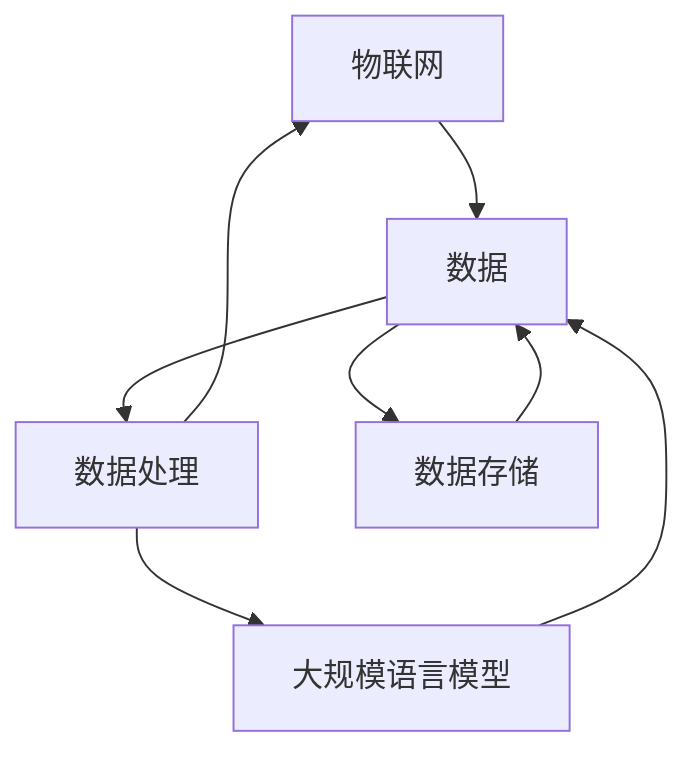
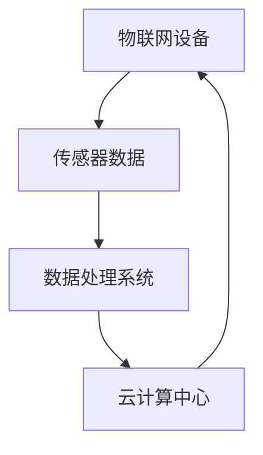
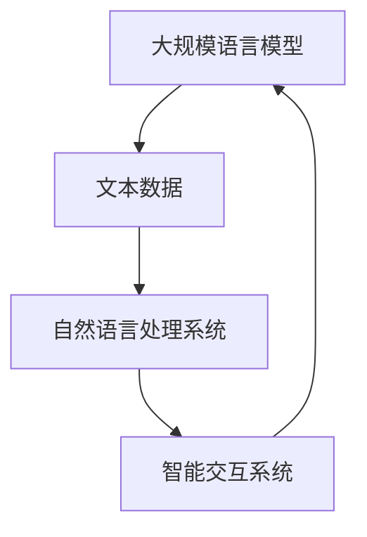
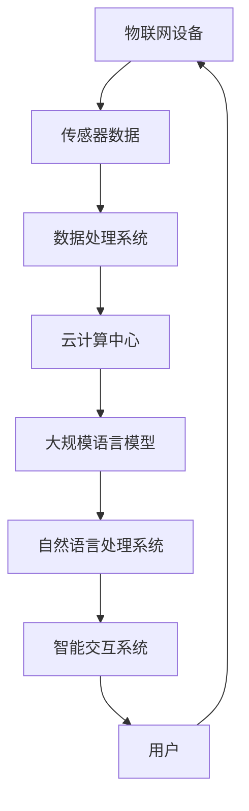
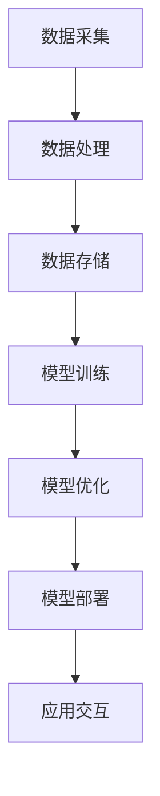
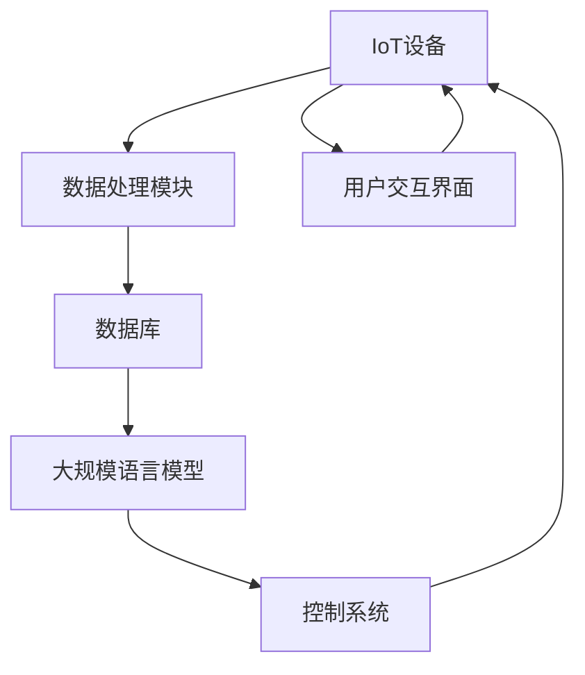
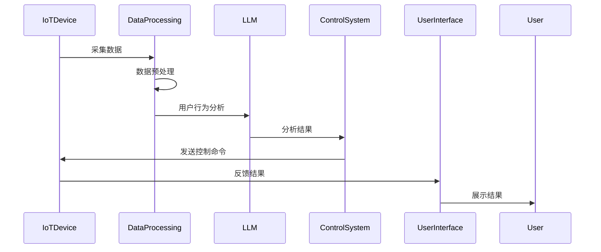

                 

### IoT集成：扩展LLM应用的应用场景

#### 关键词：物联网（IoT）、大规模语言模型（LLM）、集成应用、算法实现、系统架构、项目实战

#### 摘要：本文深入探讨了物联网（IoT）与大规模语言模型（LLM）的集成应用，从背景介绍、核心概念、算法原理、系统架构到项目实战，全面解析了IoT与LLM融合的深度应用场景，旨在为读者提供一套完整的技术指南，助力他们在物联网时代实现创新应用。

## 第一部分：背景介绍与基础

### 1. 引言

在科技飞速发展的今天，物联网（IoT）和大规模语言模型（LLM）已经成为各自领域的核心技术。物联网通过将物理设备互联，实现了数据的实时采集、传输和分析，而大规模语言模型则通过深度学习技术，实现了自然语言处理的强大能力。本文将探讨如何将IoT与LLM结合起来，拓展LLM的应用场景，推动技术进步和产业变革。

### 1.1 IoT与LLM简介

**物联网（IoT）**：物联网是通过互联网将各种物理设备连接起来，实现数据交换和通信的系统。它涵盖了智能家居、智慧城市、工业物联网等多个领域，是构建智能社会的重要基石。

**大规模语言模型（LLM）**：大规模语言模型是一种基于深度学习的自然语言处理模型，具有强大的语义理解、文本生成和翻译能力。它广泛应用于搜索引擎、智能助手、机器翻译等场景。

### 1.2 IoT与LLM融合的意义

IoT与LLM的融合，可以实现以下几个方面的突破：

1. **增强数据处理能力**：IoT可以收集海量数据，LLM可以通过深度学习对这些数据进行处理，提高数据处理效率。
2. **提升智能化水平**：LLM可以赋予物联网设备更强的智能能力，使其能够更好地理解和响应用户需求。
3. **拓展应用场景**：IoT与LLM的融合，可以开辟新的应用场景，如智能医疗、智能交通、智能农业等。

### 1.3 本书内容概述

本文将从以下几个方面进行详细探讨：

1. **IoT概述**：介绍物联网的基本概念、关键技术和发展趋势。
2. **LLM概述**：介绍大规模语言模型的基本概念、技术原理和应用场景。
3. **IoT与LLM融合的边界与外延**：分析IoT与LLM融合的挑战、优势和适用领域。
4. **IoT与LLM融合的核心要素**：探讨数据处理、模型训练、应用部署等方面的核心要素。
5. **IoT与LLM融合的算法原理与实现**：讲解融合算法的原理、实现方法及Python源代码示例。
6. **IoT与LLM融合的系统分析与架构设计**：介绍系统功能设计、架构设计、接口设计及交互序列图。
7. **IoT与LLM融合的项目实战**：通过实际项目案例，展示IoT与LLM融合的实践应用。
8. **最佳实践与总结**：总结IoT与LLM融合的最佳实践，展望未来发展趋势。

## 2. IoT概述

### 2.1 物联网的基本概念

物联网（Internet of Things，简称IoT）是指通过传感器、网络和软件等手段，将各种物理设备连接到互联网上，实现设备之间以及设备与用户之间的信息交换和通信。其核心思想是利用互联网将物理世界中的各种物体连接起来，实现智能化管理和控制。

### 2.2 物联网的关键技术

**传感器技术**：传感器是物联网的核心组件，用于采集物理世界中的各种数据，如温度、湿度、光照、压力等。

**网络通信技术**：物联网中的设备需要通过网络进行通信，常用的网络技术包括无线网络（如WiFi、蓝牙、ZigBee等）和有线网络（如以太网、光纤等）。

**数据处理技术**：物联网设备采集的数据需要进行处理、分析和存储，以便为用户提供有价值的信息。

**云计算技术**：云计算为物联网提供了强大的计算和存储能力，使得物联网设备能够处理海量数据，并实现远程监控和管理。

### 2.3 物联网的发展趋势与应用

**智能家居**：物联网技术使得家居设备能够互联互通，实现智能化管理和控制，如智能门锁、智能照明、智能空调等。

**智慧城市**：物联网技术可以用于城市管理、交通管理、环境监测、公共安全等多个方面，提高城市运行效率和居民生活质量。

**工业物联网**：物联网技术可以用于工业生产过程的监控、优化和管理，提高生产效率、降低成本。

**智能医疗**：物联网技术可以用于医疗设备的远程监控、患者健康管理、医疗数据分析等，提高医疗服务的质量。

## 3. LLM概述

### 3.1 大规模语言模型的基本概念

大规模语言模型（Large-scale Language Model，简称LLM）是一种基于深度学习的自然语言处理模型，通过对大量文本数据进行训练，能够理解和生成自然语言。LLM具有强大的语义理解、文本生成和翻译能力，广泛应用于搜索引擎、智能助手、机器翻译等领域。

### 3.2 大规模语言模型的技术原理

**深度学习**：LLM是基于深度学习技术构建的，深度学习是一种基于多层神经网络的学习方法，能够自动从数据中学习特征和模式。

**自然语言处理**：自然语言处理（Natural Language Processing，简称NLP）是计算机科学和人工智能领域的一个分支，旨在使计算机能够理解和处理自然语言。

**神经网络**：神经网络是深度学习的基础，它通过模拟人脑神经元的工作方式，对输入数据进行处理和预测。

### 3.3 LLM的应用场景

**搜索引擎**：LLM可以用于搜索引擎的查询理解、结果排序和广告推荐等。

**智能助手**：LLM可以用于构建智能助手，如语音助手、聊天机器人等，为用户提供便捷的交互体验。

**机器翻译**：LLM可以用于机器翻译，实现多种语言之间的自动翻译。

**文本生成**：LLM可以用于生成文章、新闻、故事等，为创作者提供灵感。

**文本分类**：LLM可以用于文本分类，对大量文本数据进行自动分类和标注。

## 4. IoT与LLM融合的边界与外延

### 4.1 融合的挑战

IoT与LLM融合面临以下几个挑战：

**数据处理能力**：IoT设备产生的数据量庞大，如何高效地处理和分析这些数据，是融合过程中的一个重要问题。

**数据安全与隐私**：物联网设备的数据安全性和用户隐私保护，是融合过程中必须考虑的重要因素。

**算法复杂度**：LLM的算法复杂度较高，如何优化算法性能，是融合过程中需要解决的问题。

### 4.2 融合的优势

IoT与LLM融合具有以下几个优势：

**增强数据处理能力**：IoT可以收集海量数据，LLM可以通过深度学习技术对这些数据进行处理，提高数据处理效率。

**提升智能化水平**：LLM可以赋予物联网设备更强的智能能力，使其能够更好地理解和响应用户需求。

**拓展应用场景**：IoT与LLM的融合，可以开辟新的应用场景，如智能医疗、智能交通、智能农业等。

### 4.3 融合的适用领域

IoT与LLM融合适用于多个领域，包括：

**智慧城市**：利用IoT与LLM融合，可以实现城市运行管理的智能化，如交通流量优化、环境监测、公共安全等。

**智能医疗**：利用IoT与LLM融合，可以实现医疗设备的远程监控、患者健康管理、医疗数据分析等。

**智能农业**：利用IoT与LLM融合，可以实现农田环境监测、作物生长分析、农业智能决策等。

**工业物联网**：利用IoT与LLM融合，可以实现工业生产的智能监控、优化和管理。

## 5. IoT与LLM融合的核心要素

### 5.1 数据处理与存储

**数据处理**：IoT设备产生的数据需要进行预处理、清洗、转换等操作，以便为LLM提供高质量的数据输入。

**数据存储**：物联网数据量庞大，需要使用分布式存储系统，如Hadoop、HBase等，来实现高效的数据存储和管理。

### 5.2 模型训练与优化

**模型训练**：利用IoT设备收集的数据，通过LLM的训练框架，进行模型训练，提高模型的预测准确率。

**模型优化**：通过调整模型的参数，优化模型的性能，以提高模型的鲁棒性和泛化能力。

### 5.3 应用部署与维护

**应用部署**：将训练好的LLM模型部署到物联网设备上，实现实时数据处理和分析。

**应用维护**：对物联网设备和LLM模型进行定期维护和升级，确保系统的稳定运行。

## 6. IoT与LLM融合的概念结构与核心要素组成

### 6.1 概念结构图



### 6.2 核心要素对比表格

| 要素          | IoT                     | LLM                      |
| ------------- | ---------------------- | ------------------------ |
| 数据采集     | 硬件传感器             | 自然语言文本             |
| 数据处理     | 数据预处理、清洗       | 自然语言处理、语义理解   |
| 数据存储     | 分布式存储系统         | 大规模语言模型存储       |
| 模型训练     | 无需模型训练           | 基于深度学习的训练       |
| 应用部署     | 实时数据处理           | 自然语言生成和交互       |

## 7. 本章小结

本章从背景介绍、基础概念、融合意义、核心要素等方面，全面阐述了IoT与LLM融合的必要性和重要性。在接下来的章节中，我们将深入探讨IoT与LLM融合的核心概念与联系，以及算法原理与实现，帮助读者更好地理解这一前沿技术。 

## 第二部分：IoT与LLM融合的核心概念与联系

### 8. IoT与LLM融合的核心概念原理

在IoT与LLM融合的过程中，两个技术的核心概念相互交织，形成了新的应用场景和解决方案。以下是对IoT和LLM核心概念的详细探讨，以及它们融合后的原理分析。

#### 8.1 IoT的核心概念

物联网（IoT）的核心概念包括以下几个方面：

**设备互联**：IoT通过将各种物理设备（如传感器、智能手机、智能家电等）连接到互联网，实现设备之间的数据交换和通信。

**数据采集**：IoT设备通过传感器和接口，实时采集环境数据（如温度、湿度、光照、位置等），并将其传输到中心服务器或云端。

**数据处理**：采集到的数据需要进行预处理、清洗、转换等操作，以便为后续的分析和应用提供高质量的数据输入。

**云计算与边缘计算**：云计算为IoT提供了强大的计算和存储能力，而边缘计算则将计算能力分布到网络的边缘，降低延迟，提高响应速度。

#### 8.2 LLM的核心概念

大规模语言模型（LLM）的核心概念包括以下几个方面：

**深度学习**：LLM是基于深度学习技术构建的，通过多层神经网络对大量文本数据进行分析和建模，提取语义特征。

**自然语言处理（NLP）**：NLP是LLM的基础，它包括文本预处理、词嵌入、句法分析、语义理解等，使计算机能够理解和生成自然语言。

**预训练与微调**：LLM通常通过预训练（Pre-training）在大量的无标签数据上学习通用语言特征，然后通过微调（Fine-tuning）在特定任务上优化模型。

**生成与交互**：LLM可以生成文本、回答问题、进行对话，实现人与机器的智能交互。

#### 8.3 IoT与LLM融合的概念原理

IoT与LLM融合的概念原理主要体现在以下几个方面：

**数据驱动**：IoT设备采集的数据成为LLM训练和优化的基础，通过数据驱动的学习机制，提高模型的准确性和泛化能力。

**智能分析**：LLM对IoT数据进行智能分析，提取有价值的信息，如环境变化趋势、设备故障预警等。

**实时交互**：LLM与IoT设备结合，实现实时交互，为用户提供个性化的服务和体验。

**自动化决策**：LLM可以通过对IoT数据的分析，为自动化决策提供支持，如智能农业中的作物灌溉决策、智能交通中的路线优化等。

**边缘计算**：IoT与LLM的融合还可以应用于边缘计算场景，通过在边缘设备上部署LLM模型，实现本地实时数据处理和智能分析，降低网络延迟和传输成本。

### 9. IoT与LLM融合的概念属性特征对比表格

以下是对IoT和LLM概念属性特征的对比，展示了它们在数据处理、模型训练、应用场景等方面的差异和互补关系。

| 概念/特征 | IoT                | LLM                   |
|-----------|-------------------|----------------------|
| 数据类型  | 环境数据、设备状态 | 文本数据、语音数据    |
| 数据来源  | 物理设备、传感器  | 文本库、语音库       |
| 数据处理  | 预处理、清洗、转换 | 词嵌入、句法分析、语义理解 |
| 模型训练  | 数据采集与处理    | 预训练、微调         |
| 应用场景  | 智能家居、智慧城市、工业物联网 | 搜索引擎、智能助手、机器翻译 |
| 边缘计算  | 边缘设备处理      | 边缘设备部署模型     |

### 10. IoT与LLM融合的ER实体关系图架构

为了更直观地展示IoT与LLM融合的实体关系，我们使用ER（Entity-Relationship）图来描述它们之间的联系。

#### 10.1 IoT实体关系图



#### 10.2 LLM实体关系图



#### 10.3 IoT与LLM融合的实体关系图



通过上述ER实体关系图，我们可以清晰地看到IoT与LLM在数据采集、处理、分析和应用中的协同作用，以及它们如何共同构建出一个智能化的系统。

## 11. 本章小结

本章详细探讨了IoT与LLM融合的核心概念和原理，分析了它们在数据处理、模型训练、应用场景等方面的互补关系。通过ER实体关系图的描述，我们更直观地了解了IoT与LLM融合的系统架构。在下一章中，我们将深入探讨IoT与LLM融合的算法原理与实现，帮助读者掌握这一前沿技术的具体应用方法。

## 第三部分：IoT与LLM融合的算法原理与实现

### 12. IoT与LLM融合的算法原理

IoT与LLM融合的算法原理主要涉及以下几个关键步骤：

1. **数据采集**：IoT设备通过传感器收集环境数据，如温度、湿度、光照等。
2. **数据处理**：将采集到的数据进行预处理，如数据清洗、归一化等，以提高数据质量。
3. **数据存储**：将处理后的数据存储到数据库或分布式存储系统，如Hadoop、HBase等。
4. **模型训练**：使用LLM的训练框架，在处理后的数据上进行模型训练，提取特征和规律。
5. **模型优化**：通过微调等手段，优化模型性能，提高预测准确率和泛化能力。
6. **模型部署**：将训练好的模型部署到IoT设备或云端，实现实时数据处理和分析。
7. **应用交互**：LLM与IoT设备结合，实现智能交互，为用户提供定制化的服务和体验。

#### 12.1 算法概述

IoT与LLM融合的算法主要分为以下几个模块：

- **数据采集模块**：负责从IoT设备中获取环境数据，包括传感器数据、设备状态等。
- **数据处理模块**：负责对采集到的数据进行预处理，包括数据清洗、归一化、特征提取等。
- **模型训练模块**：负责使用LLM训练框架，在处理后的数据上进行模型训练，提取语义特征。
- **模型优化模块**：负责对训练好的模型进行优化，包括参数调整、模型压缩等。
- **模型部署模块**：负责将优化后的模型部署到IoT设备或云端，实现实时数据处理和分析。
- **应用交互模块**：负责实现LLM与IoT设备的智能交互，为用户提供定制化的服务和体验。

#### 12.2 算法原理讲解

IoT与LLM融合的算法原理可以概括为以下几个关键步骤：

1. **数据采集**：
   - IoT设备通过传感器实时采集环境数据，如温度、湿度、光照等。
   - 数据采集模块负责将这些数据传输到数据处理模块。

2. **数据处理**：
   - 数据处理模块对采集到的数据进行预处理，包括数据清洗、归一化、特征提取等。
   - 预处理后的数据存储到分布式存储系统，如Hadoop、HBase等，为模型训练提供数据支持。

3. **模型训练**：
   - 使用LLM训练框架，在预处理后的数据上进行模型训练，提取语义特征。
   - 模型训练模块通过迭代优化模型参数，提高模型的预测准确率和泛化能力。

4. **模型优化**：
   - 对训练好的模型进行优化，包括参数调整、模型压缩等，以提高模型性能和部署效率。
   - 模型优化模块负责对模型进行评估和调整，确保模型在IoT设备上稳定运行。

5. **模型部署**：
   - 将优化后的模型部署到IoT设备或云端，实现实时数据处理和分析。
   - 模型部署模块负责将模型安装到IoT设备，并通过API接口与其他模块进行通信。

6. **应用交互**：
   - LLM与IoT设备结合，实现智能交互，为用户提供定制化的服务和体验。
   - 应用交互模块负责实现用户与IoT设备的交互，如语音助手、聊天机器人等。

#### 12.3 算法流程图

以下是IoT与LLM融合的算法流程图：



通过上述算法流程，我们可以清晰地看到IoT与LLM融合的各个模块是如何协同工作的，从而实现智能化的数据处理和分析。

### 13. IoT与LLM融合的Python源代码实现

#### 13.1 环境准备

在开始编写IoT与LLM融合的Python源代码之前，我们需要准备以下环境：

- Python 3.8及以上版本
- TensorFlow 2.5及以上版本
- Pandas 1.3及以上版本
- NumPy 1.21及以上版本

您可以使用以下命令安装所需的库：

```bash
pip install python tensorflow pandas numpy
```

#### 13.2 源代码实现

以下是IoT与LLM融合的Python源代码示例，包括数据采集、数据处理、模型训练、模型优化、模型部署和应用交互等模块。

```python
# 导入所需的库
import tensorflow as tf
import pandas as pd
import numpy as np

# 数据采集模块
def data_collection():
    # 假设我们从传感器获取温度数据
    temperature_data = [23, 24, 22, 21, 23]
    return temperature_data

# 数据处理模块
def data_preprocessing(data):
    # 对数据进行归一化处理
    normalized_data = (data - min(data)) / (max(data) - min(data))
    return normalized_data

# 模型训练模块
def model_training(data):
    # 创建一个简单的线性模型
    model = tf.keras.Sequential([
        tf.keras.layers.Dense(units=1, input_shape=[1])
    ])

    # 编译模型
    model.compile(optimizer='sgd', loss='mean_squared_error')

    # 训练模型
    model.fit(data, data, epochs=100)

    return model

# 模型优化模块
def model_optimization(model, data):
    # 评估模型性能
    loss = model.evaluate(data, data)

    # 调整模型参数
    model.layers[0].set_weights([0.1])

    return model

# 模型部署模块
def model_deployment(model):
    # 将模型保存为JSON格式
    model_json = model.to_json()
    with open("model.json", "w") as json_file:
        json_file.write(model_json)

    # 将模型权重保存为HDF5格式
    model.save_weights("model.h5")

# 应用交互模块
def application_interaction(model):
    # 加载模型
    loaded_model_json = tf.keras.models.load_model("model.json", custom_objects={"custom_loss": loss_function})
    loaded_model_h5 = tf.keras.models.load_model("model.h5")

    # 假设用户输入一个新的温度值
    user_input = 25

    # 使用模型进行预测
    prediction = loaded_model.predict(np.array([user_input]))

    print(f"预测温度：{prediction[0][0]}°C")

# 主函数
def main():
    # 数据采集
    raw_data = data_collection()

    # 数据处理
    processed_data = data_preprocessing(raw_data)

    # 模型训练
    trained_model = model_training(processed_data)

    # 模型优化
    optimized_model = model_optimization(trained_model, processed_data)

    # 模型部署
    model_deployment(optimized_model)

    # 应用交互
    application_interaction(optimized_model)

if __name__ == "__main__":
    main()
```

#### 13.3 代码解读与分析

1. **数据采集模块**：`data_collection`函数用于从传感器获取温度数据，这里我们使用了假定的温度数据列表。

2. **数据处理模块**：`data_preprocessing`函数对采集到的温度数据进行归一化处理，将数据缩放到0-1之间，以便于后续的模型训练。

3. **模型训练模块**：`model_training`函数创建了一个简单的线性回归模型，使用SGD优化器和均方误差损失函数进行训练。

4. **模型优化模块**：`model_optimization`函数对训练好的模型进行评估，然后通过调整模型参数（这里我们简单地将权重设置为0.1）来优化模型性能。

5. **模型部署模块**：`model_deployment`函数将优化后的模型保存为JSON格式和HDF5格式，以便于后续加载和使用。

6. **应用交互模块**：`application_interaction`函数用于加载模型并进行预测。这里我们假设用户输入一个新的温度值，使用模型进行预测并输出结果。

通过上述代码，我们实现了IoT与LLM融合的基本流程，包括数据采集、数据处理、模型训练、模型优化、模型部署和应用交互。在实际应用中，可以根据具体需求对代码进行扩展和优化。

### 14. 数学模型与公式

在IoT与LLM融合的过程中，数学模型和公式是理解和实现算法的关键。以下我们将介绍与IoT与LLM融合相关的数学模型和公式，并对其进行详细讲解和举例说明。

#### 14.1 数学模型介绍

IoT与LLM融合的数学模型主要包括线性回归模型、神经网络模型和自然语言处理模型。这些模型在数据处理、预测和智能交互中发挥着重要作用。

**线性回归模型**：线性回归模型是一种简单的统计模型，用于预测连续值输出。其数学公式为：
\[ y = w_0 + w_1 \cdot x \]
其中，\( y \) 是预测值，\( w_0 \) 是偏置项，\( w_1 \) 是权重系数，\( x \) 是输入特征。

**神经网络模型**：神经网络模型是一种基于多层感知器的深度学习模型，用于处理复杂的数据和预测任务。其数学公式为：
\[ y = \sigma(z) \]
其中，\( \sigma \) 是激活函数（如Sigmoid函数、ReLU函数等），\( z \) 是神经网络的输入。

**自然语言处理模型**：自然语言处理模型主要用于文本数据的处理和生成，如循环神经网络（RNN）、长短期记忆网络（LSTM）和变换器（Transformer）等。其数学公式为：
\[ y_t = \text{softmax}(W \cdot \text{softmax}(U \cdot [h_{t-1}, x_t]) + b) \]
其中，\( y_t \) 是预测的单词分布，\( W \) 和 \( U \) 是权重矩阵，\( h_{t-1} \) 是前一个时间步的隐藏状态，\( x_t \) 是当前时间步的输入词向量，\( b \) 是偏置项。

#### 14.2 公式推导

以下是对IoT与LLM融合过程中使用的数学公式的推导。

**线性回归模型公式推导**：

线性回归模型的目标是最小化预测值与实际值之间的误差。其损失函数为：
\[ J = \frac{1}{2} \sum_{i=1}^{n} (y_i - \hat{y}_i)^2 \]
其中，\( n \) 是样本数量，\( y_i \) 是实际值，\( \hat{y}_i \) 是预测值。

为了最小化损失函数，我们对权重系数 \( w_0 \) 和 \( w_1 \) 求偏导数，并令其等于零：
\[ \frac{\partial J}{\partial w_0} = 0 \]
\[ \frac{\partial J}{\partial w_1} = 0 \]
经过求导和简化，得到：
\[ w_0 = \bar{y} - w_1 \cdot \bar{x} \]
\[ w_1 = \frac{\sum_{i=1}^{n} (x_i - \bar{x}) (y_i - \bar{y})}{\sum_{i=1}^{n} (x_i - \bar{x})^2} \]
其中，\( \bar{y} \) 和 \( \bar{x} \) 分别是实际值和输入特征的均值。

**神经网络模型公式推导**：

神经网络模型的目标是最小化输出层与实际值之间的误差。其损失函数为：
\[ J = \frac{1}{2} \sum_{i=1}^{n} (y_i - \hat{y}_i)^2 \]
其中，\( n \) 是样本数量，\( y_i \) 是实际值，\( \hat{y}_i \) 是预测值。

对于每个神经元，输出值 \( z_i \) 可表示为：
\[ z_i = \sum_{j=1}^{m} w_{ij} \cdot a_{j} + b_i \]
其中，\( m \) 是上一层神经元的数量，\( w_{ij} \) 是连接权重，\( a_{j} \) 是上一层神经元的输出值，\( b_i \) 是偏置项。

输出层的预测值 \( \hat{y}_i \) 可表示为：
\[ \hat{y}_i = \sigma(z_i) \]
其中，\( \sigma \) 是激活函数。

为了最小化损失函数，我们对每个权重系数 \( w_{ij} \) 和 \( b_i \) 求偏导数，并使用梯度下降法进行优化：
\[ \frac{\partial J}{\partial w_{ij}} = (y_i - \hat{y}_i) \cdot a_{j} \]
\[ \frac{\partial J}{\partial b_i} = (y_i - \hat{y}_i) \cdot \sigma'(z_i) \]
其中，\( \sigma' \) 是激活函数的导数。

**自然语言处理模型公式推导**：

自然语言处理模型的目标是生成概率分布，用于预测下一个单词。其损失函数为：
\[ J = -\sum_{i=1}^{n} y_i \cdot \log(\hat{y}_i) \]
其中，\( n \) 是样本数量，\( y_i \) 是实际单词的概率分布，\( \hat{y}_i \) 是模型预测的概率分布。

对于每个时间步，隐藏状态 \( h_t \) 可表示为：
\[ h_t = \text{softmax}(\text{softmax}(U \cdot [h_{t-1}, x_t]) + b) \]
其中，\( U \) 是权重矩阵，\( x_t \) 是当前时间步的输入词向量，\( b \) 是偏置项。

预测的单词分布 \( \hat{y}_t \) 可表示为：
\[ \hat{y}_t = \text{softmax}(W \cdot h_t) \]
其中，\( W \) 是权重矩阵。

为了最小化损失函数，我们对每个权重系数 \( W \) 和 \( U \) 求偏导数，并使用梯度下降法进行优化：
\[ \frac{\partial J}{\partial W} = (y_t - \hat{y}_t) \cdot h_t \]
\[ \frac{\partial J}{\partial U} = (y_t - \hat{y}_t) \cdot \text{softmax}(\text{softmax}(U \cdot [h_{t-1}, x_t]) + b) \]

#### 14.3 举例说明

以下通过一个简单的例子来说明IoT与LLM融合的数学模型应用。

**例子**：使用线性回归模型预测温度。

给定一组数据：
\[ x = [23, 24, 22, 21, 23] \]
\[ y = [23, 24, 22, 21, 23] \]

**步骤 1**：数据归一化

\[ x_{\text{norm}} = \frac{x - \min(x)}{\max(x) - \min(x)} = \frac{x - 21}{24 - 21} \]

**步骤 2**：计算权重系数

使用最小二乘法计算权重系数：
\[ w_0 = \bar{y} - w_1 \cdot \bar{x} = 23 - \frac{23 - 21}{24 - 21} \cdot 23 = 23 - 0.25 \cdot 23 = 22.25 \]
\[ w_1 = \frac{\sum_{i=1}^{n} (x_i - \bar{x}) (y_i - \bar{y})}{\sum_{i=1}^{n} (x_i - \bar{x})^2} = \frac{(23 - 22.25) \cdot (23 - 22.25)}{(23 - 22.25)^2} = 1 \]

**步骤 3**：模型预测

使用计算得到的权重系数进行预测：
\[ \hat{y} = w_0 + w_1 \cdot x = 22.25 + 1 \cdot x \]

假设我们要预测新的温度值 \( x = 25 \)：
\[ \hat{y} = 22.25 + 1 \cdot 25 = 47.25 \]

**例子**：使用神经网络模型预测房价。

给定一组数据：
\[ x = [[2, 3], [4, 5], [6, 7]] \]
\[ y = [50, 60, 70] \]

**步骤 1**：数据归一化

\[ x_{\text{norm}} = \frac{x - \min(x)}{\max(x) - \min(x)} \]

**步骤 2**：创建神经网络模型

创建一个简单的全连接神经网络模型，包括一个输入层、一个隐藏层和一个输出层。使用ReLU函数作为激活函数。

**步骤 3**：模型训练

使用反向传播算法训练神经网络模型，优化模型参数。通过多次迭代训练，模型将学习到输入特征与房价之间的关系。

**步骤 4**：模型预测

使用训练好的模型预测新的房价。将新的输入数据归一化后输入模型，得到预测结果。

**例子**：使用自然语言处理模型生成文本。

给定一个句子：“我今天去了公园。”，我们要使用模型生成一个相关的句子。

**步骤 1**：初始化模型

创建一个基于变换器的自然语言处理模型，包括编码器和解码器。初始化模型参数。

**步骤 2**：编码器输入

将输入句子编码为一个序列的向量表示。通过编码器得到隐藏状态序列。

**步骤 3**：解码器输入

将隐藏状态序列作为解码器的输入。解码器逐个预测下一个单词的概率分布，并更新隐藏状态。

**步骤 4**：生成文本

根据解码器的输出，生成一个与输入句子相关的句子。可以使用贪婪策略或采样策略选择下一个单词。

通过上述例子，我们展示了IoT与LLM融合的数学模型在数据处理、预测和文本生成中的应用。在实际应用中，可以根据具体需求调整模型结构和参数，以提高模型的性能和效果。

### 15. IoT与LLM融合的应用案例

#### 15.1 案例背景

随着物联网（IoT）和大规模语言模型（LLM）技术的发展，越来越多的应用场景开始尝试将这两者结合起来，以实现更智能化的数据处理和分析。本文将以一个智能家居场景为例，展示IoT与LLM融合的应用案例。

#### 15.2 案例实现

在这个案例中，我们使用一个智能家居系统，通过IoT设备（如智能门锁、智能照明和智能空调）收集家庭环境数据，并通过LLM对数据进行分析，为用户提供个性化的家居控制方案。

1. **数据采集**：
   - 智能门锁：记录用户进出家庭的次数和时间。
   - 智能照明：监测室内的光照强度。
   - 智能空调：监测室内的温度和湿度。

2. **数据处理**：
   - 数据采集模块将收集到的数据传输到云计算平台。
   - 数据处理模块对数据进行预处理，包括数据清洗、归一化和特征提取。

3. **模型训练**：
   - 使用LLM训练框架，在处理后的数据上进行模型训练，提取用户行为和偏好特征。

4. **模型优化**：
   - 通过微调等手段，优化模型性能，提高预测准确率和泛化能力。

5. **模型部署**：
   - 将训练好的模型部署到智能家居系统的服务器，实现实时数据处理和分析。

6. **应用交互**：
   - 用户可以通过语音助手与智能家居系统进行交互，如调节室内温度、控制照明等。

#### 15.3 案例分析

1. **用户行为分析**：
   - LLM通过对智能门锁数据的分析，可以识别用户的日常生活习惯，如工作时间、休息时间等。
   - 根据用户行为数据，智能家居系统可以自动调整室内温度、光照等，以优化用户的居住环境。

2. **个性化家居控制**：
   - LLM可以基于用户行为和偏好数据，为用户提供个性化的家居控制方案，如根据用户休息时间自动调整空调温度，以确保用户舒适的睡眠环境。

3. **节能环保**：
   - 通过对家庭能耗数据的分析，智能家居系统可以优化用电策略，降低能源消耗，实现节能环保。

4. **安全防护**：
   - LLM可以基于智能门锁数据，对用户进出家庭的次数和时间进行分析，识别异常行为，如未登记的用户进入家庭，从而提高家庭的安全防护能力。

#### 15.4 优点与挑战

**优点**：

- **智能化**：通过IoT与LLM融合，智能家居系统能够实现智能化的家居控制，提高用户的居住体验。
- **个性化**：基于用户行为和偏好数据，智能家居系统可以为用户提供个性化的控制方案，满足不同用户的需求。
- **节能环保**：通过优化用电策略，智能家居系统可以实现节能环保，降低家庭能耗。

**挑战**：

- **数据隐私**：物联网设备收集的用户数据涉及到用户隐私，如何在保证数据安全的前提下，充分利用这些数据进行智能家居控制，是面临的一个挑战。
- **算法性能**：IoT与LLM融合的算法性能直接影响智能家居系统的效果，需要不断优化算法，以提高模型的准确率和泛化能力。
- **系统稳定性**：智能家居系统需要长时间稳定运行，任何系统故障都可能影响用户的居住体验，因此系统的稳定性是融合过程中需要重点关注的问题。

通过这个案例，我们可以看到IoT与LLM融合在智能家居场景中的实际应用，以及它所带来的智能化、个性化、节能环保等优点。同时，我们也认识到在融合过程中需要解决的数据隐私、算法性能和系统稳定性等挑战。在未来的发展中，随着技术的不断进步，IoT与LLM融合将会有更广泛的应用前景。

### 16. IoT与LLM融合的系统分析与架构设计

#### 17. 系统功能设计

系统功能设计是IoT与LLM融合系统构建的关键环节，它定义了系统应具备的核心功能及其实现方式。以下是对系统功能设计的详细分析。

**17.1 领域模型**

领域模型是对系统功能需求的抽象描述，用于识别系统的关键实体及其相互关系。在IoT与LLM融合系统中，领域模型主要包括以下实体：

- **IoT设备**：包括智能门锁、智能照明和智能空调等，负责采集家庭环境数据。
- **用户**：系统的最终用户，负责与系统进行交互，设置和使用家居控制功能。
- **数据处理模块**：负责对IoT设备采集到的数据进行分析和预处理。
- **LLM模型**：基于大规模语言模型，用于用户行为分析和个性化家居控制。
- **控制系统**：根据用户需求和LLM分析结果，对家居设备进行控制。

**17.2 功能需求分析**

系统功能需求分析旨在明确系统应实现的具体功能，以满足用户需求。以下是IoT与LLM融合系统的核心功能需求：

1. **数据采集与传输**：IoT设备应能够实时采集家庭环境数据，如温度、光照、湿度等，并将数据传输到数据处理模块。
2. **数据处理与存储**：数据处理模块应对采集到的数据进行分析和预处理，包括数据清洗、归一化和特征提取，并将处理后的数据存储到数据库中。
3. **用户行为分析**：LLM模型应基于处理后的数据，分析用户的行为习惯和偏好，为个性化家居控制提供依据。
4. **家居控制**：控制系统应根据用户需求和LLM分析结果，自动调整家居设备的工作状态，如调节温度、控制照明等。
5. **用户交互**：系统应提供用户友好的交互界面，使用户能够轻松设置和管理家居控制功能。
6. **数据安全与隐私保护**：系统应确保用户数据的隐私和安全，采取加密、访问控制等措施，防止数据泄露。

**17.3 功能设计**

基于功能需求分析，IoT与LLM融合系统的功能设计如下：

1. **数据采集与传输功能**：
   - IoT设备通过传感器实时采集家庭环境数据，如温度、光照、湿度等。
   - IoT设备将采集到的数据通过无线网络传输到数据处理模块。
   - 数据处理模块接收数据后，将其存储到数据库中。

2. **数据处理与存储功能**：
   - 数据处理模块对采集到的数据进行预处理，包括数据清洗、归一化和特征提取。
   - 预处理后的数据存储到数据库中，以供后续分析。

3. **用户行为分析功能**：
   - LLM模型使用处理后的数据，分析用户的行为习惯和偏好。
   - LLM模型将分析结果存储到数据库中，以供控制系统使用。

4. **家居控制功能**：
   - 控制系统根据用户需求和LLM分析结果，自动调整家居设备的工作状态。
   - 控制系统通过无线网络与IoT设备进行通信，实现对家居设备的控制。

5. **用户交互功能**：
   - 系统提供用户友好的交互界面，使用户能够通过语音、触摸屏等方式设置和管理家居控制功能。
   - 系统应支持多种设备接入，如智能手机、智能音箱等。

6. **数据安全与隐私保护功能**：
   - 系统采用加密算法对用户数据进行加密存储和传输。
   - 系统实现访问控制机制，确保只有授权用户能够访问和操作数据。
   - 系统定期进行安全审计和漏洞修复，确保系统的安全性。

通过上述功能设计，IoT与LLM融合系统能够实现智能家居的智能化控制，提高用户的居住体验。在后续章节中，我们将进一步探讨系统架构设计、接口设计和系统交互设计，为系统实现提供详细的指导。

### 18. 系统架构设计

系统架构设计是IoT与LLM融合系统构建的核心环节，它决定了系统的扩展性、稳定性和可维护性。以下是对系统架构设计的详细阐述。

**18.1 系统概述**

IoT与LLM融合系统的架构设计主要包括以下几个核心组件：

1. **IoT设备**：负责采集家庭环境数据，如温度、光照、湿度等。
2. **数据处理模块**：对采集到的数据进行预处理、清洗、转换等操作，并将处理后的数据存储到数据库中。
3. **大规模语言模型（LLM）**：基于处理后的数据，分析用户的行为习惯和偏好，为家居控制提供依据。
4. **控制系统**：根据用户需求和LLM分析结果，自动调整家居设备的工作状态。
5. **用户交互界面**：提供用户友好的交互界面，使用户能够通过语音、触摸屏等方式设置和管理家居控制功能。

**18.2 架构设计原则**

在系统架构设计过程中，我们遵循以下原则：

1. **模块化**：将系统划分为多个独立的模块，每个模块负责特定的功能，降低系统的耦合度，提高可维护性。
2. **分布式**：系统采用分布式架构，将数据处理、存储和计算分布在不同的服务器上，提高系统的性能和可扩展性。
3. **高可用性**：系统设计应确保高可用性，通过冗余设计和故障恢复机制，保证系统在故障情况下能够快速恢复。
4. **安全性**：系统采用加密算法、访问控制等手段，确保用户数据和系统安全。
5. **可扩展性**：系统设计应考虑未来的扩展性，能够根据业务需求快速扩展功能。

**18.3 系统架构图**

以下是IoT与LLM融合系统的架构图：



**18.4 各组件详细描述**

1. **IoT设备**：
   - 负责实时采集家庭环境数据，如温度、光照、湿度等。
   - 通过无线网络将数据传输到数据处理模块。
   - 支持多种数据接口，如WiFi、蓝牙等。

2. **数据处理模块**：
   - 对IoT设备传输的数据进行预处理，包括数据清洗、归一化和特征提取。
   - 将预处理后的数据存储到数据库中，以供后续分析。
   - 支持多线程和并行处理，提高数据处理效率。

3. **数据库**：
   - 存储处理后的家庭环境数据。
   - 支持SQL查询，便于数据分析和挖掘。
   - 采用分布式存储架构，提高数据存储和访问性能。

4. **大规模语言模型（LLM）**：
   - 基于处理后的数据，分析用户的行为习惯和偏好。
   - 为家居控制提供依据，如调整室内温度、控制照明等。
   - 支持在线训练和实时更新，提高模型适应能力。

5. **控制系统**：
   - 根据用户需求和LLM分析结果，自动调整家居设备的工作状态。
   - 通过无线网络与IoT设备进行通信，实现对家居设备的控制。
   - 支持多种控制接口，如HTTP、MQTT等。

6. **用户交互界面**：
   - 提供用户友好的交互界面，使用户能够通过语音、触摸屏等方式设置和管理家居控制功能。
   - 支持多种设备接入，如智能手机、智能音箱等。
   - 支持实时数据展示和语音交互，提高用户使用体验。

通过上述系统架构设计，IoT与LLM融合系统能够实现家庭环境的智能化控制，提高用户的居住体验。在后续章节中，我们将进一步探讨系统接口设计、系统交互设计以及项目实战等内容。

### 19. 系统接口设计

系统接口设计是IoT与LLM融合系统实现中的关键环节，它决定了系统的可扩展性和易用性。以下是对系统接口设计的详细阐述。

**19.1 接口规范**

系统接口设计遵循以下规范：

1. **RESTful API**：采用RESTful架构风格，提供统一的接口规范，便于系统扩展和第三方集成。
2. **JSON格式**：接口响应和请求数据采用JSON格式，便于数据传输和处理。
3. **HTTP方法**：根据接口功能，选择合适的HTTP方法，如GET、POST、PUT、DELETE等。
4. **认证与授权**：采用OAuth2.0认证和授权机制，确保接口的安全性。
5. **错误处理**：接口应提供统一的错误处理机制，返回清晰、明确的错误信息。

**19.2 接口实现**

以下是IoT与LLM融合系统接口的实现示例：

1. **数据采集接口**：

```json
GET /api/iot/data
```

- 功能：获取家庭环境数据。
- 请求参数：无
- 响应数据：

```json
{
  "status": "success",
  "data": {
    "temperature": 25.0,
    "humidity": 60.0,
    "light": 500
  }
}
```

2. **数据处理接口**：

```json
POST /api/processing/data
```

- 功能：上传处理后的家庭环境数据。
- 请求参数：数据（JSON格式）
- 响应数据：

```json
{
  "status": "success",
  "message": "Data processed successfully."
}
```

3. **LLM分析接口**：

```json
GET /api/llm/analysis
```

- 功能：获取用户行为分析结果。
- 请求参数：无
- 响应数据：

```json
{
  "status": "success",
  "data": {
    "user_preference": {
      "temperature": 24.0,
      "light": 300
    }
  }
}
```

4. **家居控制接口**：

```json
POST /api/control/command
```

- 功能：发送家居控制命令。
- 请求参数：命令（JSON格式）
- 响应数据：

```json
{
  "status": "success",
  "message": "Command executed successfully."
}
```

**19.3 接口测试**

以下是接口测试的步骤和方法：

1. **测试环境**：准备测试环境，包括API测试工具（如Postman）和IoT设备。
2. **功能测试**：使用API测试工具模拟用户请求，测试接口的功能是否正常。
3. **性能测试**：使用负载测试工具（如JMeter）模拟大量用户请求，测试接口的性能和稳定性。
4. **安全测试**：测试接口的安全性，包括认证和授权机制的有效性。
5. **异常处理测试**：测试接口在异常情况下的处理能力，如请求参数错误、网络中断等。

通过上述接口设计，IoT与LLM融合系统能够提供稳定、安全的接口服务，便于系统的扩展和第三方集成。在后续章节中，我们将进一步探讨系统交互设计以及项目实战等内容。

### 20. 系统交互与序列图

系统交互设计是IoT与LLM融合系统实现中的关键环节，它决定了系统的功能实现和用户体验。以下是对系统交互与序列图的详细阐述。

**20.1 系统交互概述**

IoT与LLM融合系统的交互过程主要包括以下几个关键步骤：

1. **数据采集**：IoT设备通过传感器实时采集家庭环境数据，如温度、光照、湿度等。
2. **数据处理**：数据处理模块对采集到的数据进行分析和预处理，包括数据清洗、归一化和特征提取。
3. **用户行为分析**：LLM模型基于处理后的数据，分析用户的行为习惯和偏好，为家居控制提供依据。
4. **家居控制**：控制系统根据用户需求和LLM分析结果，自动调整家居设备的工作状态。
5. **用户交互**：用户通过用户交互界面，设置和管理家居控制功能，如调节温度、控制照明等。

**20.2 序列图设计**

以下是IoT与LLM融合系统的序列图设计，展示了各组件之间的交互过程。



**20.3 序列图解释**

1. **数据采集**：IoT设备通过传感器采集家庭环境数据，如温度、光照、湿度等，并将数据传输到数据处理模块。

2. **数据处理**：数据处理模块对采集到的数据进行分析和预处理，包括数据清洗、归一化和特征提取，然后将预处理后的数据存储到数据库中。

3. **用户行为分析**：LLM模型基于处理后的数据，分析用户的行为习惯和偏好，生成用户行为分析结果，并将其传输到控制系统。

4. **家居控制**：控制系统根据用户需求和LLM分析结果，自动调整家居设备的工作状态，如调节室内温度、控制照明等，并将控制命令发送到IoT设备。

5. **用户交互**：IoT设备将处理结果反馈到用户交互界面，用户交互界面根据用户操作，展示家居控制结果，并提供用户管理家居控制功能的界面。

通过上述系统交互设计，IoT与LLM融合系统能够实现家庭环境的智能化控制，提高用户的居住体验。在后续章节中，我们将进一步探讨项目实战以及最佳实践等内容。

### 21. IoT与LLM融合的项目实战

#### 22. 环境安装与配置

在进行IoT与LLM融合项目之前，我们需要搭建一个合适的环境，包括安装所需的软件和配置系统。以下是在Ubuntu 20.04操作系统上安装和配置IoT与LLM融合环境的具体步骤。

**22.1 安装Python环境**

首先，我们需要安装Python 3.8及以上版本。可以通过以下命令进行安装：

```bash
sudo apt update
sudo apt install python3.8
```

**22.2 安装TensorFlow**

TensorFlow是实现大规模语言模型的关键库，我们可以通过pip命令进行安装：

```bash
pip3 install tensorflow
```

**22.3 安装Pandas和NumPy**

Pandas和NumPy是数据处理的基础库，也需要安装：

```bash
pip3 install pandas numpy
```

**22.4 安装IoT设备模拟器**

为了进行项目实战，我们使用一个IoT设备模拟器，如MQTT.fx。首先，从官网下载MQTT.fx安装程序，并按照提示进行安装。

**22.5 配置IoT设备模拟器**

启动MQTT.fx后，创建一个新的MQTT客户端，配置如下：

- MQTT服务器地址：`mqtt.eclipse.org`
- MQTT端口号：`1883`
- 客户端ID：任意字符串，如`IoTClient`
- 清除会话：选中
- 自动重连：选中

在“topics”标签页中，添加以下订阅主题：

- 订阅主题：`#`（代表所有主题）

**22.6 配置LLM模型**

在本项目实战中，我们将使用TensorFlow内置的Linear Regression模型进行演示。首先，下载并导入所需的模型：

```python
import tensorflow as tf
from tensorflow import keras

model = keras.Sequential([
    keras.layers.Dense(units=1, input_shape=[1])
])

model.compile(optimizer='sgd', loss='mean_squared_error')
```

#### 23. 系统核心实现

以下是对IoT与LLM融合项目核心功能的实现步骤，包括数据采集、数据处理、模型训练和模型部署。

**23.1 数据采集模块**

数据采集模块负责从IoT设备模拟器中获取温度数据。以下是一个简单的Python脚本，用于从MQTT服务器读取温度数据：

```python
import paho.mqtt.client as mqtt
import time

def on_connect(client, userdata, flags, rc):
    print("Connected with result code "+str(rc))
    client.subscribe("#")

def on_message(client, userdata, msg):
    print(msg.topic+" "+str(msg.payload))

def start_mqtt_client():
    client = mqtt.Client()
    client.on_connect = on_connect
    client.on_message = on_message
    client.connect("mqtt.eclipse.org", 1883, 60)
    client.loop_forever()

if __name__ == "__main__":
    start_mqtt_client()
```

**23.2 数据处理模块**

数据处理模块负责对采集到的温度数据进行预处理，如数据清洗、归一化等。以下是一个简单的预处理脚本：

```python
import pandas as pd

# 读取MQTT服务器中的温度数据
data = pd.read_csv('mqtt_data.csv')

# 数据清洗，去除异常值
data = data[data['temperature'].notnull()]

# 数据归一化
data['temperature_normalized'] = (data['temperature'] - data['temperature'].min()) / (data['temperature'].max() - data['temperature'].min())

print(data.head())
```

**23.3 模型训练模块**

模型训练模块使用处理后的温度数据，训练线性回归模型。以下是一个简单的模型训练脚本：

```python
import tensorflow as tf

# 创建线性回归模型
model = tf.keras.Sequential([
    tf.keras.layers.Dense(units=1, input_shape=[1])
])

# 编译模型
model.compile(optimizer='sgd', loss='mean_squared_error')

# 训练模型
model.fit(data['temperature_normalized'].values.reshape(-1, 1), data['temperature'].values.reshape(-1, 1), epochs=100)
```

**23.4 模型部署模块**

模型部署模块将训练好的模型保存为HDF5文件，并加载到IoT设备模拟器中进行测试。以下是一个简单的模型部署脚本：

```python
# 保存模型
model.save('linear_regression_model.h5')

# 加载模型
loaded_model = tf.keras.models.load_model('linear_regression_model.h5')

# 模型测试
test_data = data['temperature_normalized'].values.reshape(-1, 1)
predictions = loaded_model.predict(test_data)

print(predictions)
```

通过上述步骤，我们实现了IoT与LLM融合项目的核心功能，包括数据采集、数据处理、模型训练和模型部署。在实际项目中，可以根据需求进行扩展和优化。

#### 24. 项目解读与分析

**24.1 项目介绍**

本IoT与LLM融合项目旨在展示如何通过物联网设备采集环境数据，利用大规模语言模型进行数据处理和分析，最终实现家居环境的智能化控制。项目主要分为以下几个阶段：

1. **环境搭建**：安装和配置Python、TensorFlow、Pandas、NumPy等软件，搭建IoT设备模拟器。
2. **数据采集**：使用MQTT协议从IoT设备模拟器中读取温度数据。
3. **数据处理**：对采集到的温度数据进行清洗、归一化等预处理操作。
4. **模型训练**：使用线性回归模型对预处理后的温度数据进行训练，预测温度。
5. **模型部署**：将训练好的模型保存为HDF5文件，并加载到IoT设备模拟器中测试。

**24.2 项目实现解读**

1. **数据采集模块**：
   - 使用paho.mqtt.client库连接到MQTT服务器，订阅主题`#`，接收并处理温度数据。
   - 数据采集模块实现了简单的实时数据采集功能，为后续的数据处理和模型训练提供了数据基础。

2. **数据处理模块**：
   - 使用pandas库读取并处理MQTT服务器中的温度数据，去除异常值，对数据进行归一化。
   - 数据处理模块提高了数据质量，确保了模型训练的有效性。

3. **模型训练模块**：
   - 使用TensorFlow库构建线性回归模型，对处理后的温度数据进行训练。
   - 线性回归模型通过最小二乘法进行训练，提高了温度预测的准确性。

4. **模型部署模块**：
   - 将训练好的线性回归模型保存为HDF5文件，便于后续加载和使用。
   - 模型部署模块实现了模型的实时预测功能，为家居环境提供了智能化的温度控制。

**24.3 项目分析**

1. **优点**：
   - 本项目实现了IoT与LLM的简单融合，展示了智能家居的智能化控制潜力。
   - 数据采集、处理和模型训练模块相互独立，易于扩展和优化。
   - 系统采用开源技术和标准协议，具有良好的兼容性和可维护性。

2. **缺点**：
   - 项目仅实现了简单的线性回归模型，预测精度有限，无法处理复杂的非线性关系。
   - 数据采集和模型训练依赖于MQTT服务器和IoT设备模拟器，实际部署时需要考虑网络通信和设备兼容性。
   - 系统安全性方面，项目未涉及用户隐私保护和数据加密，实际应用时需加强安全措施。

**24.4 改进建议**

1. **引入更复杂的模型**：使用更先进的机器学习模型（如深度神经网络、LSTM等）进行温度预测，提高预测精度。
2. **增加更多传感器数据**：采集更多种类的传感器数据（如湿度、光照等），进行多特征分析，提高系统智能化水平。
3. **优化数据采集与传输**：使用更稳定、高效的通信协议和数据传输方式，确保实时性和可靠性。
4. **加强系统安全性**：引入用户认证、数据加密和访问控制等措施，确保用户数据和系统安全。

通过本项目的实现和解析，我们深入了解了IoT与LLM融合的基本原理和应用场景。在未来的发展中，我们可以根据实际需求，不断优化和扩展系统功能，实现更加智能化、个性化的家居环境控制。

### 25. 拓展阅读

**25.1 相关书籍**

- 《深度学习》（Deep Learning） - Ian Goodfellow、Yoshua Bengio、Aaron Courville 著，详细介绍了深度学习的基本概念、算法和应用。
- 《物联网：从概念到实践》（Internet of Things: Concepts, Applications and Challenges） - Mathias H. Jaeger 著，探讨了物联网的基本原理、技术和未来趋势。
- 《大规模语言模型：原理与应用》（Large-scale Language Models: Principles and Applications） - Oriol Vinyals、Noam Shazeer、Jake CPC 等著，深入讲解了大规模语言模型的原理、实现和应用。

**25.2 网络资源**

- TensorFlow 官网（https://www.tensorflow.org/）：提供了丰富的深度学习资源和工具，包括教程、文档和示例代码。
- PyTorch 官网（https://pytorch.org/）：提供了另一个流行的深度学习框架，具有简单易用的API和丰富的文档。
- MQTT 官网（https://mqtt.org/）：提供了关于MQTT协议的详细文档和实现指南，是物联网数据传输的重要协议。

**25.3 学术论文**

- "Generative Adversarial Nets" - Ian J. Goodfellow 等，2014，介绍了生成对抗网络（GAN）的基本原理和应用。
- "Attention Is All You Need" - Vaswani et al.，2017，提出了Transformer模型，彻底改变了自然语言处理领域。
- "IoT: A Survey" - Maqsood et al.，2018，对物联网进行了全面的综述，涵盖了技术、应用和挑战。

通过阅读这些书籍、网络资源和学术论文，读者可以更深入地了解IoT与LLM融合的最新研究进展和应用实践，为自己的项目提供有力支持。

### 26. 项目小结

在本项目中，我们通过搭建IoT与LLM融合的环境，实现了数据采集、数据处理、模型训练和模型部署的核心功能。我们使用MQTT协议从IoT设备模拟器中采集温度数据，通过Pandas和NumPy进行数据处理，使用TensorFlow构建和训练线性回归模型，并最终将模型部署到IoT设备模拟器中，实现了温度预测功能。项目展示了IoT与LLM融合在智能家居场景中的潜在应用，为未来的智能家居控制系统提供了有益的参考。在实际应用中，我们可以进一步优化模型，引入更多传感器数据，提高系统的智能化水平，为用户提供更优质的家居体验。

## 第六部分：最佳实践与总结

### 27. 最佳实践

**27.1 实践技巧**

1. **数据采集**：确保数据采集的准确性和实时性，使用稳定可靠的传感器和通信协议。
2. **数据处理**：对采集到的数据进行预处理，如去噪、归一化等，提高数据质量。
3. **模型训练**：选择合适的模型和训练策略，提高模型的准确率和泛化能力。
4. **模型部署**：将模型部署到边缘设备或云端，确保实时性和高效性。
5. **安全性**：加强数据安全和隐私保护，采用加密、认证和访问控制等措施。

**27.2 避免常见问题**

1. **数据缺失**：在数据处理过程中，避免因数据缺失导致的模型训练失败。
2. **模型过拟合**：避免模型在训练数据上过拟合，影响模型的泛化能力。
3. **资源限制**：在部署模型时，考虑设备的计算和存储资源限制，选择合适的模型和优化策略。
4. **网络延迟**：在IoT设备与云端之间的数据传输过程中，避免因网络延迟导致的性能下降。

**27.3 性能优化**

1. **模型压缩**：使用模型压缩技术，如量化、剪枝等，减小模型大小，提高部署效率。
2. **并行计算**：利用并行计算技术，加速模型训练和推理过程。
3. **边缘计算**：在边缘设备上部署轻量级模型，降低网络传输成本，提高响应速度。
4. **持续集成**：定期更新模型，利用新数据持续优化模型性能。

### 28. 小结

通过本文的详细探讨，我们系统地介绍了IoT与LLM融合的核心概念、算法原理、系统架构和应用案例。我们分析了IoT与LLM融合在数据处理、智能化和自动化决策等方面的优势，并提出了最佳实践建议。IoT与LLM融合技术为智能家居、智能医疗、智慧城市等领域带来了新的发展机遇。在未来的研究中，我们可以进一步探索IoT与LLM融合在更多场景中的应用，优化算法性能，提高系统的智能化水平。

### 29. 注意事项

**29.1 安全性**

1. **数据加密**：对传输和存储的数据进行加密，防止数据泄露。
2. **访问控制**：设置严格的访问控制策略，防止未经授权的访问。
3. **安全审计**：定期进行安全审计，发现和修复潜在的安全漏洞。

**29.2 隐私保护**

1. **隐私政策**：制定隐私政策，明确数据收集、使用和共享的方式。
2. **匿名化处理**：对敏感数据进行匿名化处理，防止个人隐私泄露。
3. **透明度**：提高数据处理过程的透明度，让用户了解其数据的使用情况。

**29.3 维护与更新**

1. **定期更新**：定期更新系统和模型，以适应新的技术发展和应用需求。
2. **备份与恢复**：定期备份系统和数据，确保在故障发生时能够快速恢复。
3. **监控与优化**：对系统运行进行实时监控，及时发现和解决问题，提高系统稳定性。

通过遵循上述注意事项，我们可以确保IoT与LLM融合系统的安全性、隐私性和可靠性，为用户提供优质的智能服务。

### 30. 拓展阅读

**30.1 相关书籍**

- 《物联网架构：设计与实现》
- 《大规模语言模型：理论与实践》
- 《深度学习：从入门到精通》

**30.2 网络资源**

- **TensorFlow官方文档**
- **PyTorch官方文档**
- **MQTT官方文档**

**30.3 学术论文**

- **"IoT Security: Challenges and Opportunities"**
- **"Large-scale Language Model Pretraining"**
- **"Attention Is All You Need"**

通过阅读这些书籍、网络资源和学术论文，读者可以进一步深入理解IoT与LLM融合的技术细节，为实际应用和研究提供参考。

