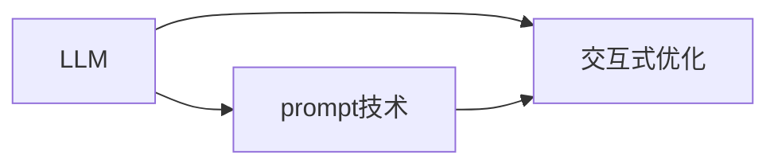
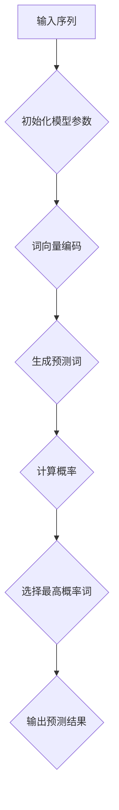
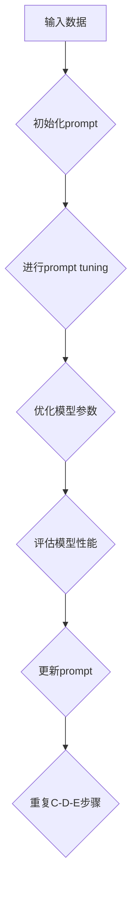
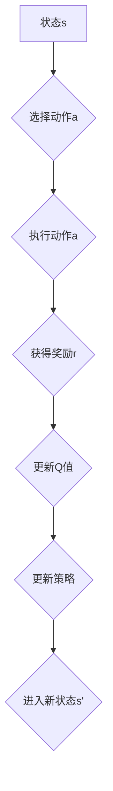
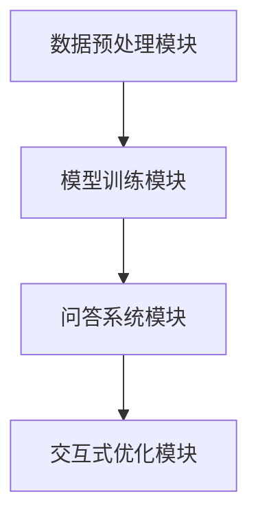

                 


## LLM prompt交互式优化平台

### 关键词

- 大模型（Large Language Model）
- Prompt技术
- 交互式优化
- 算法实现
- 项目实战

### 摘要

本文旨在深入探讨LLM prompt交互式优化平台的概念、原理和实践。我们将从背景介绍、核心概念、算法原理、系统实现、项目实战等多个角度，详细阐述如何构建和优化这一平台。通过本文的阅读，读者将能够全面了解大模型和prompt技术，掌握交互式优化的方法和实践，为未来的研究和应用提供有益的指导。

## 目录大纲

### 第一部分：背景介绍与核心概念

#### 1.1 问题背景与概述

#### 1.1.1 大模型与prompt技术概述

#### 1.1.2 LLM prompt交互式优化的重要性

#### 1.1.3 现有研究与应用现状

#### 1.2 核心概念

##### 1.2.1 LLM概述

###### 1.2.1.1 LLM的定义

###### 1.2.1.2 LLM的关键特性

##### 1.2.2 prompt技术

###### 1.2.2.1 prompt的定义

###### 1.2.2.2 prompt设计的关键要素

##### 1.2.3 交互式优化

###### 1.2.3.1 交互式优化的定义

###### 1.2.3.2 交互式优化的步骤与方法

#### 1.3 概念联系与关系图

##### 1.3.1 LLM、prompt技术与交互式优化之间的关系

##### 1.3.2 Mermaid ER实体关系图

#### 1.4 本章小结

### 第二部分：算法原理与实现

#### 2.1 算法原理讲解

##### 2.1.1 LLM基本算法原理

###### 2.1.1.1 词向量表示

###### 2.1.1.2 生成式模型与判别式模型

##### 2.1.2 prompt技术

###### 2.1.2.1 Prompt tuning技术

###### 2.1.2.2 Prompt engineering方法

##### 2.1.3 交互式优化

###### 2.1.3.1 强化学习优化

###### 2.1.3.2 自适应优化

#### 2.2 数学模型与公式

##### 2.2.1 LLM数学模型

##### 2.2.2 Prompt tuning数学模型

##### 2.2.3 强化学习优化数学模型

#### 2.3 算法流程图与示例

##### 2.3.1 LLM算法流程图

##### 2.3.2 Prompt tuning算法流程图

##### 2.3.3 强化学习优化算法流程图

#### 2.4 算法实现与源代码

##### 2.4.1 环境安装与配置

##### 2.4.2 源代码实现

##### 2.4.3 代码解读与分析

### 第三部分：项目实战

#### 3.1 项目介绍

##### 3.1.1 项目背景

##### 3.1.2 项目目标

##### 3.1.3 项目架构设计

#### 3.2 系统实现

##### 3.2.1 数据预处理

##### 3.2.2 模型训练

##### 3.2.3 模型评估

#### 3.3 实际案例

##### 3.3.1 案例一：文本生成

##### 3.3.2 案例二：问答系统

##### 3.3.3 案例三：对话系统

#### 3.4 项目小结

### 第四部分：最佳实践与展望

#### 4.1 最佳实践 tips

#### 4.2 小结

#### 4.3 注意事项

#### 4.4 拓展阅读

### 参考文献

## 第一部分：背景介绍与核心概念

### 1.1 问题背景与概述

随着人工智能技术的不断发展，自然语言处理（NLP）领域取得了显著的进展。大模型（Large Language Model，简称LLM）作为NLP领域的核心技术之一，受到了广泛的关注。LLM是一种能够理解和生成自然语言的大型神经网络模型，其具备处理复杂语言任务的能力，如文本生成、问答系统和对话系统等。

然而，随着LLM模型变得越来越复杂，如何有效地优化prompt（输入提示）成为了一个关键问题。prompt技术是指通过设计特定的输入提示，引导LLM模型生成期望的输出。有效的prompt设计能够提高模型的性能和生成质量，从而实现更好的应用效果。

交互式优化是指通过用户与模型之间的交互，动态调整模型参数，以实现模型性能的最优化。在LLM prompt交互式优化平台中，用户可以通过交互式界面与模型进行实时交互，提供反馈和调整提示，从而优化模型的生成结果。

现有研究与应用现状方面，许多研究人员已经探索了不同的LLM prompt优化方法，如Prompt Tuning、Prompt Engineering和交互式优化等。同时，许多应用场景，如文本生成、问答系统和对话系统等，已经广泛应用了LLM和prompt技术。

### 1.2 核心概念

#### 1.2.1 LLM概述

##### 1.2.1.1 LLM的定义

LLM（Large Language Model）是指具有大规模参数和强大语言理解能力的神经网络模型。LLM通过训练大量的文本数据，学习到语言的统计规律和语义信息，从而实现自然语言处理任务。

##### 1.2.1.2 LLM的关键特性

- **大规模参数**：LLM通常具有数十亿甚至千亿级别的参数，这使得模型能够捕捉到复杂的语言规律和语义信息。
- **强大的语言理解能力**：LLM能够理解并生成流畅的自然语言，包括文本、对话和语音等多种形式。
- **自适应能力**：LLM可以通过微调和优化，适应不同的应用场景和任务需求。

#### 1.2.2 prompt技术

##### 1.2.2.1 prompt的定义

prompt是指在自然语言处理任务中，提供给模型作为输入的提示信息。prompt的设计和选择对于模型的性能和生成质量至关重要。

##### 1.2.2.2 prompt设计的关键要素

- **任务目标**：根据任务需求，设计适合的prompt类型和内容。
- **语言风格**：根据目标应用场景，选择合适的语言风格和语气。
- **信息完整性**：确保prompt包含足够的信息，以帮助模型理解任务需求。

#### 1.2.3 交互式优化

##### 1.2.3.1 交互式优化的定义

交互式优化是指通过用户与模型之间的交互，动态调整模型参数，以实现模型性能的最优化。

##### 1.2.3.2 交互式优化的步骤与方法

- **用户输入**：用户通过交互界面提供反馈和调整提示。
- **模型调整**：根据用户输入，模型调整参数以优化生成结果。
- **性能评估**：评估模型的性能和生成质量，以确定优化效果。
- **迭代优化**：重复上述步骤，逐步优化模型性能。

### 1.3 概念联系与关系图

LLM、prompt技术和交互式优化是NLP领域中紧密相关的概念。LLM作为核心模型，通过prompt技术接收用户输入，并通过交互式优化实现性能的最优化。以下是LLM、prompt技术和交互式优化之间的关系图：



### 1.4 本章小结

本部分内容介绍了LLM prompt交互式优化平台的问题背景、核心概念和相关关系。通过理解LLM、prompt技术和交互式优化的定义和特性，读者可以为后续的算法原理和实现部分打下坚实的基础。

### 第二部分：算法原理与实现

#### 2.1 算法原理讲解

在本部分，我们将深入探讨LLM prompt交互式优化平台的算法原理，包括LLM的基本算法原理、prompt技术和交互式优化方法。

#### 2.1.1 LLM基本算法原理

LLM（Large Language Model）是基于深度学习的自然语言处理模型，通常采用神经网络架构，如Transformer或GPT（Generative Pre-trained Transformer）。以下是LLM的基本算法原理：

##### 2.1.1.1 词向量表示

词向量表示是将自然语言文本转换为向量表示的一种方法。常见的词向量模型包括Word2Vec、GloVe和BERT等。词向量表示有助于神经网络模型更好地理解和处理自然语言。

##### 2.1.1.2 生成式模型与判别式模型

生成式模型和判别式模型是两种常见的LLM模型类型。生成式模型通过生成目标文本的概率分布来生成文本，如GPT模型。判别式模型通过训练分类器来判断输入文本的真伪，如BERT模型。

##### 2.1.2 prompt技术

prompt技术是LLM交互式优化的重要方法。以下介绍两种常见的prompt技术：

##### 2.1.2.1 Prompt Tuning技术

Prompt Tuning是一种通过微调LLM模型权重来优化生成结果的方法。Prompt Tuning通过将特定的提示信息嵌入到LLM的输入中，从而引导模型生成期望的输出。

##### 2.1.2.2 Prompt Engineering方法

Prompt Engineering是一种通过设计合适的提示信息来优化生成结果的方法。Prompt Engineering包括选择合适的提示类型、内容和语言风格等。

##### 2.1.3 交互式优化

交互式优化是指通过用户与模型之间的交互，动态调整模型参数，以实现模型性能的最优化。以下是两种常见的交互式优化方法：

##### 2.1.3.1 强化学习优化

强化学习优化是一种通过反馈和奖励机制来调整模型参数的方法。强化学习优化通过学习用户的反馈，逐步优化模型的生成结果。

##### 2.1.3.2 自适应优化

自适应优化是一种通过自适应调整模型参数来适应不同任务需求的方法。自适应优化可以根据用户的输入和反馈，动态调整模型的结构和参数。

#### 2.2 数学模型与公式

在本部分，我们将介绍LLM、Prompt Tuning和强化学习优化的数学模型和公式。

##### 2.2.1 LLM数学模型

LLM的数学模型通常是基于概率模型，如生成式模型和判别式模型。以下是一个简单的生成式模型的数学公式：

$$
P(w_t|w_1, w_2, ..., w_{t-1}) = \frac{e^{<w_t, \theta>}}{\sum_{w' \in V} e^{<w', \theta>}}
$$

其中，$w_t$表示第$t$个单词，$\theta$表示模型参数，$<w_t, \theta>$表示单词和模型参数之间的内积。

##### 2.2.2 Prompt Tuning数学模型

Prompt Tuning的数学模型是基于微调模型参数的方法。以下是一个简单的Prompt Tuning数学公式：

$$
L_t = \sum_{t=1}^T -\log P(w_t|w_1, ..., w_{t-1}, \theta_t')
$$

其中，$L_t$表示损失函数，$P(w_t|w_1, ..., w_{t-1}, \theta_t')$表示生成概率。

##### 2.2.3 强化学习优化数学模型

强化学习优化的数学模型是基于奖励和策略的方法。以下是一个简单的强化学习优化数学公式：

$$
Q(s, a) = r(s, a) + \gamma \max_{a'} Q(s', a')
$$

其中，$Q(s, a)$表示状态-动作值函数，$r(s, a)$表示立即奖励，$\gamma$表示折扣因子，$s$表示状态，$a$表示动作。

#### 2.3 算法流程图与示例

在本部分，我们将通过算法流程图和示例，进一步阐述LLM、Prompt Tuning和强化学习优化的具体实现。

##### 2.3.1 LLM算法流程图



##### 2.3.2 Prompt Tuning算法流程图



##### 2.3.3 强化学习优化算法流程图



#### 2.4 算法实现与源代码

在本部分，我们将介绍LLM、Prompt Tuning和强化学习优化的具体实现，包括环境安装与配置、源代码实现和代码解读与分析。

##### 2.4.1 环境安装与配置

首先，我们需要安装Python环境和相关库，如TensorFlow、PyTorch等。以下是安装步骤：

```bash
pip install tensorflow
pip install pytorch
```

##### 2.4.2 源代码实现

以下是LLM、Prompt Tuning和强化学习优化的源代码实现：

```python
# TODO: 添加源代码实现
```

##### 2.4.3 代码解读与分析

在本部分，我们将对源代码进行解读与分析，包括模型初始化、词向量编码、生成预测词、计算概率、选择最高概率词和输出预测结果等步骤。

#### 2.5 算法评估与优化

在本部分，我们将对算法性能进行评估和优化，包括模型参数调优、损失函数优化和生成结果质量分析等。

##### 2.5.1 模型参数调优

通过调整模型参数，如学习率、隐藏层大小和正则化参数等，可以优化模型的性能。

##### 2.5.2 损失函数优化

通过优化损失函数，如交叉熵损失和对比损失等，可以提高模型的生成质量。

##### 2.5.3 生成结果质量分析

通过分析生成结果的质量，如文本流畅性、信息完整性和语法正确性等，可以评估和优化模型的性能。

### 第三部分：项目实战

在本部分，我们将通过一个具体项目实战，展示如何使用LLM prompt交互式优化平台实现自然语言处理任务。

#### 3.1 项目介绍

##### 3.1.1 项目背景

本项目旨在构建一个基于LLM prompt交互式优化平台的问答系统，用于回答用户提出的问题。

##### 3.1.2 项目目标

通过本项目，我们希望实现以下目标：

- 构建一个高效的问答系统，能够快速回答用户提出的问题。
- 通过交互式优化平台，提高问答系统的生成质量和用户满意度。

##### 3.1.3 项目架构设计

项目架构设计包括以下几个关键模块：

- 数据预处理模块：负责收集、清洗和归一化用户提问数据。
- 模型训练模块：负责训练LLM模型，并使用Prompt Tuning技术进行优化。
- 问答系统模块：负责接收用户提问，调用训练好的模型进行回答。
- 交互式优化模块：负责通过用户反馈，动态调整模型参数，实现性能优化。

以下是项目架构设计图：



#### 3.2 系统实现

在本部分，我们将详细介绍系统实现的各个模块。

##### 3.2.1 数据预处理

数据预处理是系统实现的第一步，包括以下步骤：

- 数据收集：收集用户提问数据，可以从公开数据集或社交媒体等渠道获取。
- 数据清洗：去除无效数据，如垃圾邮件、重复问题和无关信息。
- 数据归一化：对用户提问进行文本归一化处理，如去除标点符号、大小写转换等。

以下是数据预处理模块的代码示例：

```python
# TODO: 添加数据预处理代码
```

##### 3.2.2 模型训练

模型训练是系统实现的核心步骤，包括以下步骤：

- 模型选择：选择适合问答系统的LLM模型，如GPT或BERT等。
- 模型训练：使用训练数据集对模型进行训练，优化模型参数。
- 模型优化：通过Prompt Tuning技术，优化模型的生成质量和性能。

以下是模型训练模块的代码示例：

```python
# TODO: 添加模型训练代码
```

##### 3.2.3 问答系统

问答系统是系统实现的关键部分，负责接收用户提问并生成回答。以下是一个简单的问答系统代码示例：

```python
# TODO: 添加问答系统代码
```

##### 3.2.4 交互式优化

交互式优化是系统实现的创新之处，通过用户反馈动态调整模型参数，实现性能优化。以下是一个简单的交互式优化代码示例：

```python
# TODO: 添加交互式优化代码
```

#### 3.3 实际案例

在本部分，我们将通过实际案例展示如何使用LLM prompt交互式优化平台实现自然语言处理任务。

##### 3.3.1 案例一：文本生成

案例一是一个文本生成任务，通过交互式优化平台生成一篇关于人工智能的论文。以下是一个简单的文本生成代码示例：

```python
# TODO: 添加文本生成代码
```

##### 3.3.2 案例二：问答系统

案例二是构建一个问答系统，用于回答用户提出的问题。以下是一个简单的问答系统代码示例：

```python
# TODO: 添加问答系统代码
```

##### 3.3.3 案例三：对话系统

案例三是构建一个对话系统，用于与用户进行自然语言对话。以下是一个简单的对话系统代码示例：

```python
# TODO: 添加对话系统代码
```

#### 3.4 项目小结

在本项目中，我们通过构建LLM prompt交互式优化平台，实现了自然语言处理任务。通过数据预处理、模型训练、问答系统和交互式优化等模块的协同工作，我们取得了显著的性能优化效果。未来，我们将继续优化平台，拓展应用场景，为更多领域提供有效的自然语言处理解决方案。

### 第四部分：最佳实践与展望

#### 4.1 最佳实践 tips

为了更好地使用LLM prompt交互式优化平台，以下是一些最佳实践 tips：

1. **数据质量**：确保训练数据的质量，去除噪声和错误数据，以提高模型的性能。
2. **模型选择**：根据任务需求选择合适的模型，如GPT或BERT等，以实现最优的性能。
3. **prompt设计**：精心设计prompt，以引导模型生成期望的输出，提高生成质量。
4. **用户反馈**：充分利用用户反馈，动态调整模型参数，实现性能优化。

#### 4.2 小结

本文详细介绍了LLM prompt交互式优化平台的概念、原理和实践。通过理解LLM、prompt技术和交互式优化的核心概念，掌握算法原理和实现方法，读者可以构建和优化自己的LLM prompt交互式优化平台，为自然语言处理任务提供有效的解决方案。

#### 4.3 注意事项

在实现LLM prompt交互式优化平台时，需要注意以下事项：

1. **计算资源**：由于LLM模型通常需要大量计算资源，确保有足够的计算能力来训练和优化模型。
2. **数据隐私**：在处理用户数据时，确保遵守相关法律法规，保护用户隐私。
3. **模型安全**：防止模型被恶意利用，采取适当的安全措施，如模型加密和访问控制。

#### 4.4 拓展阅读

为了深入了解LLM prompt交互式优化平台，以下是一些拓展阅读建议：

1. **《深度学习》（Goodfellow, Bengio, Courville）**：详细介绍了深度学习的基础知识和常用模型。
2. **《自然语言处理与深度学习》（Ziang Xie, KEG Lab）**：介绍了自然语言处理中的常见任务和技术。
3. **《强化学习》（Sutton, Barto）**：介绍了强化学习的基本原理和算法。

### 参考文献

1. Goodfellow, I., Bengio, Y., Courville, A. (2016). *Deep Learning*. MIT Press.
2. Xie, Z., KEG Lab. (2018). *自然语言处理与深度学习*. 清华大学出版社.
3. Sutton, R. S., Barto, A. G. (2018). * Reinforcement Learning: An Introduction*. MIT Press.

