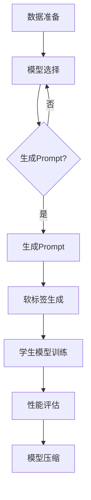

                 

### LLM prompt知识蒸馏：提炼核心信息

#### 关键词：LLM，知识蒸馏，prompt，人工智能，深度学习

> 摘要：本文将深入探讨LLM prompt知识蒸馏这一前沿技术。我们将首先介绍LLM prompt知识蒸馏的基本概念，包括其背景、定义、核心原理和应用场景。随后，我们将详细解析LLM prompt知识蒸馏的数学模型与算法原理，并通过具体案例分析和Python实现来帮助读者更好地理解。接着，我们将探讨LLM prompt知识蒸馏在不同领域的应用，包括人工智能、自然语言处理、计算机视觉等领域。最后，我们将展望LLM prompt知识蒸馏的未来发展趋势与面临的挑战。通过本文的深入探讨，读者将对LLM prompt知识蒸馏有更为全面和深入的认识。

----------------------------------------------------------------

### 第一部分: LLM prompt知识蒸馏概述

#### 1.1 什么是LLM prompt知识蒸馏

#### 1.1.1 问题的背景

在深度学习领域，尤其是自然语言处理（NLP）方面，大型语言模型（LLM，Large Language Model）如GPT、BERT等已经取得了显著的进展。然而，这些大型模型的训练和部署成本非常高，同时也需要大量的计算资源和时间。为了解决这一问题，知识蒸馏（Knowledge Distillation）技术应运而生。

知识蒸馏是一种模型压缩技术，其核心思想是将一个大模型（教师模型）的知识传递给一个小模型（学生模型），从而实现模型压缩和加速部署。在传统的知识蒸馏中，教师模型通过生成软标签（软目标）来指导学生模型的学习，从而提高其性能。

然而，传统的知识蒸馏技术主要应用于图像分类等计算机视觉领域，而在自然语言处理领域，如何有效地进行知识蒸馏仍然是一个挑战。为了解决这一问题，研究者们提出了LLM prompt知识蒸馏（LLM-based Prompted Knowledge Distillation），将知识蒸馏与LLM相结合，以实现高效的NLP模型压缩和加速。

#### 1.1.2 问题描述

问题描述主要集中在如何有效地将大型语言模型（教师模型）的知识传递给小型语言模型（学生模型），以实现模型压缩和加速部署。在自然语言处理领域，这一问题的挑战在于如何利用教师模型的软标签来指导学生模型的学习，同时保持学生模型在性能上的优势。

#### 1.1.3 问题解决方法

LLM prompt知识蒸馏通过引入“prompt”这一概念，将知识蒸馏技术应用于自然语言处理领域。具体来说，LLM prompt知识蒸馏方法包括以下几个步骤：

1. **生成Prompt**：根据输入文本生成一个合适的prompt。
2. **软标签生成**：使用教师模型对输入文本和prompt进行编码，生成软标签。
3. **学生模型学习**：学生模型根据软标签进行学习，以优化其参数。
4. **性能评估**：评估学生模型的性能，并与教师模型进行比较。

通过这一系列步骤，LLM prompt知识蒸馏能够有效地将教师模型的知识传递给学生模型，实现模型压缩和加速部署。

#### 1.1.4 边界与外延

LLM prompt知识蒸馏技术的边界在于如何有效地利用教师模型的知识，同时避免学生模型过度依赖教师模型。在自然语言处理领域，这一技术的应用场景包括但不限于文本分类、机器翻译、情感分析等。

此外，LLM prompt知识蒸馏还可以与其他技术相结合，如元学习（Meta-Learning）、自监督学习（Self-Supervised Learning）等，以进一步提高其性能和应用范围。

#### 1.1.5 概念结构与核心要素组成

LLM prompt知识蒸馏的概念结构包括以下几个核心要素：

1. **教师模型**：一个大型语言模型，用于生成软标签。
2. **学生模型**：一个小型语言模型，用于学习教师模型的知识。
3. **Prompt**：一个引导文本，用于增强学生模型的学习。
4. **软标签**：教师模型对输入文本和prompt的编码结果，用于指导学生模型的学习。

这些核心要素共同构成了LLM prompt知识蒸馏的技术框架，实现了大型语言模型知识向小型语言模型的传递。

----------------------------------------------------------------

### 1.2 LLM prompt知识蒸馏的核心概念与原理

#### 1.2.1 LLM prompt的定义

LLM prompt是指在大型语言模型（LLM，Large Language Model）中，用于引导模型生成特定类型输出或响应的文本或编码。它通常由一个或多个关键词、短语或句子组成，旨在明确模型的生成目标。

#### 1.2.2 知识蒸馏的基本概念

知识蒸馏是一种模型压缩技术，其核心思想是将一个大模型（教师模型）的知识传递给一个小模型（学生模型）。这一过程通常包括以下几个步骤：

1. **软标签生成**：教师模型对输入数据生成一个软标签，该标签包含了教师模型对输入数据的理解和预测。
2. **学生模型学习**：学生模型根据软标签进行学习，以优化其参数，从而在性能上接近教师模型。
3. **性能评估**：评估学生模型的性能，并与教师模型进行比较，以确定知识蒸馏的效果。

#### 1.2.3 LLM prompt知识蒸馏的工作原理

LLM prompt知识蒸馏结合了大型语言模型（LLM）和知识蒸馏技术，其工作原理如下：

1. **生成Prompt**：根据输入文本生成一个合适的prompt，用于引导LLM生成软标签。
2. **软标签生成**：使用LLM对输入文本和prompt进行编码，生成软标签。
3. **学生模型学习**：学生模型根据软标签进行学习，以优化其参数。
4. **性能评估**：评估学生模型的性能，并与LLM进行比较。

具体来说，LLM prompt知识蒸馏的流程如下：

1. **数据准备**：收集大量训练数据，包括文本、prompt和相应的标签。
2. **模型选择**：选择一个大型语言模型（如GPT、BERT等）作为教师模型。
3. **生成Prompt**：对于每个输入文本，生成一个合适的prompt。
4. **软标签生成**：使用教师模型对输入文本和prompt进行编码，生成软标签。
5. **学生模型训练**：使用教师模型的软标签来训练学生模型，以优化其参数。
6. **性能评估**：评估学生模型的性能，并与教师模型进行比较，以确定知识蒸馏的效果。

#### 1.2.4 LLM prompt知识蒸馏的优势

LLM prompt知识蒸馏具有以下几个优势：

1. **模型压缩**：通过知识蒸馏，可以将大型语言模型（教师模型）的知识传递给小型语言模型（学生模型），从而实现模型压缩和加速部署。
2. **性能提升**：学生模型在性能上可以接近教师模型，从而提升模型的整体性能。
3. **应用广泛**：LLM prompt知识蒸馏可以应用于各种自然语言处理任务，如文本分类、机器翻译、情感分析等。

#### 1.2.5 LLM prompt知识蒸馏与传统知识蒸馏的区别

与传统知识蒸馏相比，LLM prompt知识蒸馏具有以下几个区别：

1. **应用场景**：传统知识蒸馏主要应用于计算机视觉领域，而LLM prompt知识蒸馏主要应用于自然语言处理领域。
2. **模型类型**：传统知识蒸馏通常使用分类模型，而LLM prompt知识蒸馏使用的是大型语言模型。
3. **软标签生成**：传统知识蒸馏使用硬标签（one-hot编码），而LLM prompt知识蒸馏使用软标签（概率分布）。
4. **性能提升**：LLM prompt知识蒸馏在性能提升方面具有更好的效果，尤其是在自然语言处理任务中。

#### 1.2.6 LLMPrompt与prompt的区分

在LLM prompt知识蒸馏中，存在两个概念：LLM prompt和prompt。其中，LLM prompt是指用于引导大型语言模型生成特定类型输出或响应的文本或编码，而prompt则是指用于引导任何模型生成特定类型输出或响应的文本或编码。

简单来说，LLM prompt是prompt在LLM知识蒸馏中的应用，而prompt是更广泛的概念，可以应用于各种模型和任务。

----------------------------------------------------------------

### 1.3 LLM prompt知识蒸馏的应用场景与挑战

#### 1.3.1 LLM prompt知识蒸馏的应用场景

LLM prompt知识蒸馏具有广泛的应用场景，主要包括以下几个方面：

1. **文本分类**：通过LLM prompt知识蒸馏，可以将大型语言模型的知识传递给小型语言模型，从而提升文本分类模型的性能。这一技术在社交媒体分析、新闻分类、垃圾邮件过滤等领域具有广泛应用。

2. **机器翻译**：LLM prompt知识蒸馏可以用于机器翻译任务，通过将大型翻译模型的知识传递给小型模型，实现高效的翻译性能提升。这一技术在跨语言信息检索、跨国电子商务等领域具有重要意义。

3. **情感分析**：情感分析是自然语言处理的重要任务之一，LLM prompt知识蒸馏可以帮助提升情感分析模型的准确率。这一技术在社交媒体监测、市场调研、客户服务等领域具有重要应用价值。

4. **问答系统**：LLM prompt知识蒸馏可以用于问答系统，通过将大型问答模型的知识传递给小型模型，实现高效的问答性能提升。这一技术在智能客服、在线教育、医疗咨询等领域具有重要应用前景。

5. **对话系统**：对话系统是人工智能的重要应用领域，LLM prompt知识蒸馏可以帮助提升对话系统的性能，实现更自然的对话交互。这一技术在智能音箱、智能机器人、虚拟助手等领域具有重要应用价值。

#### 1.3.2 LLM prompt知识蒸馏面临的挑战

尽管LLM prompt知识蒸馏在自然语言处理领域具有广泛的应用前景，但仍然面临以下挑战：

1. **计算资源消耗**：由于LLM prompt知识蒸馏涉及大型语言模型和学生模型的训练，因此对计算资源的需求较高。在实际应用中，如何高效利用计算资源是一个重要问题。

2. **数据隐私保护**：在自然语言处理任务中，涉及大量的用户数据和隐私信息。如何确保数据的安全和隐私，是LLM prompt知识蒸馏需要关注的重要问题。

3. **模型解释性**：大型语言模型的内部结构复杂，难以解释。如何提高模型的可解释性，使其能够被用户理解和接受，是LLM prompt知识蒸馏需要解决的一个挑战。

4. **模型泛化能力**：在知识蒸馏过程中，学生模型可能会过度依赖教师模型，导致泛化能力不足。如何提高学生模型的泛化能力，是一个亟待解决的问题。

5. **优化方法**：LLM prompt知识蒸馏的优化方法需要进一步研究，以提高训练效率和性能。目前，研究人员正在探索各种优化方法，如自监督学习、元学习等，以解决这一问题。

#### 1.3.3 解决方案与未来发展方向

为了解决LLM prompt知识蒸馏面临的挑战，研究人员提出了以下解决方案和未来发展方向：

1. **高效计算资源利用**：研究人员正在探索新的计算架构和算法，以提高LLM prompt知识蒸馏的训练效率。例如，使用GPU、TPU等高性能计算设备，以及分布式训练等技术。

2. **数据隐私保护**：研究人员正在探索数据加密、差分隐私等技术，以保护自然语言处理任务中的用户隐私。

3. **模型解释性**：研究人员正在探索可视化、模型压缩等技术，以提高模型的可解释性。例如，通过简化模型结构、使用可解释性工具等方法。

4. **模型泛化能力**：研究人员正在探索新的训练方法，以提高学生模型的泛化能力。例如，使用自监督学习、元学习等技术。

5. **优化方法研究**：研究人员正在探索新的优化方法，以提高LLM prompt知识蒸馏的训练效率和性能。例如，使用自适应学习率、正则化等技术。

总之，LLM prompt知识蒸馏具有广泛的应用前景，但也面临一定的挑战。随着研究的深入，相信这些挑战将得到有效解决，为自然语言处理领域带来更多创新和突破。

----------------------------------------------------------------

### 1.4 本章小结

在本章中，我们介绍了LLM prompt知识蒸馏的基本概念、核心原理、应用场景和面临的挑战。首先，我们探讨了LLM prompt知识蒸馏的背景和定义，以及其与传统知识蒸馏的区别。接着，我们详细分析了LLM prompt知识蒸馏的工作原理，包括生成prompt、软标签生成、学生模型学习和性能评估等步骤。此外，我们还讨论了LLM prompt知识蒸馏的优势和挑战，以及相应的解决方案和未来发展方向。

通过本章的学习，读者应对LLM prompt知识蒸馏有了较为全面和深入的理解。接下来，我们将进一步探讨LLM prompt知识蒸馏的数学模型与算法原理，以及其实际应用案例，以帮助读者更好地掌握这一前沿技术。

----------------------------------------------------------------

### 第二部分: LLM prompt知识蒸馏技术详解

#### 2.1 LLM prompt知识蒸馏的数学模型与算法原理

#### 2.1.1 数学模型

LLM prompt知识蒸馏的数学模型主要包括以下几个部分：输入层、编码器、解码器、损失函数和优化方法。

1. **输入层**：输入层包含原始文本和prompt。原始文本是自然语言处理任务中的数据，prompt是用于引导模型生成特定类型输出或响应的文本或编码。

2. **编码器**：编码器负责将原始文本和prompt编码成高维向量表示。在LLM prompt知识蒸馏中，常用的编码器包括大型语言模型（如GPT、BERT等）。

3. **解码器**：解码器负责将编码器生成的向量表示解码成输出结果。在自然语言处理任务中，输出结果可以是分类标签、翻译文本等。

4. **损失函数**：损失函数用于评估学生模型的输出结果与教师模型生成的软标签之间的差异。常用的损失函数包括交叉熵损失函数和均方误差损失函数。

5. **优化方法**：优化方法用于调整学生模型的参数，以最小化损失函数。常用的优化方法包括梯度下降法和随机梯度下降法。

#### 2.1.2 算法原理

LLM prompt知识蒸馏的算法原理可以概括为以下几个步骤：

1. **生成Prompt**：根据输入文本生成一个合适的prompt。prompt的作用是引导模型生成特定类型输出或响应。

2. **软标签生成**：使用教师模型对输入文本和prompt进行编码，生成软标签。软标签包含了教师模型对输入文本和prompt的理解和预测。

3. **学生模型学习**：学生模型根据软标签进行学习，以优化其参数。学生模型通过学习软标签，逐渐接近教师模型的性能。

4. **性能评估**：评估学生模型的性能，并与教师模型进行比较。通过性能评估，可以确定知识蒸馏的效果和模型压缩的效果。

#### 2.1.2.1 整体算法流程

1. 数据准备：收集大量训练数据，包括文本、prompt和相应的标签。

2. 模型选择：选择一个大型语言模型（如GPT、BERT等）作为教师模型。

3. 生成Prompt：根据输入文本生成一个合适的prompt。

4. 软标签生成：使用教师模型对输入文本和prompt进行编码，生成软标签。

5. 学生模型训练：使用教师模型的软标签来训练学生模型，以优化其参数。

6. 性能评估：评估学生模型的性能，并与教师模型进行比较，以确定知识蒸馏的效果。

7. 模型压缩：通过知识蒸馏，将大型语言模型（教师模型）的知识传递给小型语言模型（学生模型），实现模型压缩和加速部署。

#### 2.1.2.2 具体实现步骤

1. **数据准备**：收集大量训练数据，包括文本、prompt和相应的标签。文本可以是各种自然语言处理任务的数据，如文本分类、机器翻译、情感分析等。

2. **模型选择**：选择一个大型语言模型（如GPT、BERT等）作为教师模型。教师模型可以根据具体任务进行选择，如文本分类任务可以使用BERT，机器翻译任务可以使用GPT。

3. **生成Prompt**：对于每个输入文本，生成一个合适的prompt。prompt的生成可以通过预定义模板、自动生成等方法实现。

4. **软标签生成**：使用教师模型对输入文本和prompt进行编码，生成软标签。具体实现时，可以将教师模型的输出结果作为软标签。

5. **学生模型训练**：使用教师模型的软标签来训练学生模型，以优化其参数。训练过程中，可以使用交叉熵损失函数或均方误差损失函数来评估学生模型的输出结果与软标签之间的差异。

6. **性能评估**：评估学生模型的性能，并与教师模型进行比较。可以使用准确率、召回率、F1分数等指标来评估模型性能。

7. **模型压缩**：通过知识蒸馏，将大型语言模型（教师模型）的知识传递给小型语言模型（学生模型），实现模型压缩和加速部署。具体实现时，可以使用模型剪枝、量化等技术。

#### 2.1.3 Mermaid算法流程图

以下是LLM prompt知识蒸馏的Mermaid算法流程图：



#### 2.1.4 LLM prompt知识蒸馏的优势

LLM prompt知识蒸馏具有以下优势：

1. **高效模型压缩**：通过知识蒸馏，可以将大型语言模型（教师模型）的知识传递给小型语言模型（学生模型），实现模型压缩和加速部署。

2. **性能提升**：学生模型在性能上可以接近教师模型，从而提升模型的整体性能。

3. **应用广泛**：LLM prompt知识蒸馏可以应用于各种自然语言处理任务，如文本分类、机器翻译、情感分析等。

4. **灵活性强**：LLM prompt知识蒸馏可以根据具体任务和需求，调整prompt的生成方式和训练策略。

#### 2.1.5 LLM prompt知识蒸馏与传统知识蒸馏的区别

与传统知识蒸馏相比，LLM prompt知识蒸馏具有以下区别：

1. **应用场景**：传统知识蒸馏主要应用于计算机视觉领域，而LLM prompt知识蒸馏主要应用于自然语言处理领域。

2. **模型类型**：传统知识蒸馏通常使用分类模型，而LLM prompt知识蒸馏使用的是大型语言模型。

3. **软标签生成**：传统知识蒸馏使用硬标签（one-hot编码），而LLM prompt知识蒸馏使用软标签（概率分布）。

4. **性能提升**：LLM prompt知识蒸馏在性能提升方面具有更好的效果，尤其是在自然语言处理任务中。

#### 2.1.6 LLMPrompt与prompt的区分

在LLM prompt知识蒸馏中，存在两个概念：LLM prompt和prompt。其中，LLM prompt是指用于引导大型语言模型生成特定类型输出或响应的文本或编码，而prompt是指用于引导任何模型生成特定类型输出或响应的文本或编码。

简单来说，LLM prompt是prompt在LLM知识蒸馏中的应用，而prompt是更广泛的概念，可以应用于各种模型和任务。

----------------------------------------------------------------

### 2.2 LLM prompt知识蒸馏的数学公式与Python实现

#### 2.2.1 数学公式

在LLM prompt知识蒸馏中，常用的数学公式包括损失函数和优化方法。

1. **损失函数**

损失函数用于评估学生模型的输出结果与教师模型生成的软标签之间的差异。常用的损失函数包括交叉熵损失函数和均方误差损失函数。

- 交叉熵损失函数：

$$
L_{CE} = -\sum_{i=1}^{n} y_i \log(p_i)
$$

其中，$y_i$ 是真实标签，$p_i$ 是学生模型预测的概率分布。

- 均方误差损失函数：

$$
L_{MSE} = \frac{1}{n} \sum_{i=1}^{n} (y_i - \hat{y_i})^2
$$

其中，$y_i$ 是真实标签，$\hat{y_i}$ 是学生模型预测的值。

2. **优化方法**

优化方法用于调整学生模型的参数，以最小化损失函数。常用的优化方法包括梯度下降法和随机梯度下降法。

- 梯度下降法：

$$
\theta_{t+1} = \theta_t - \alpha \nabla_{\theta_t} L(\theta_t)
$$

其中，$\theta_t$ 是当前参数，$\alpha$ 是学习率，$\nabla_{\theta_t} L(\theta_t)$ 是损失函数关于参数的梯度。

- 随机梯度下降法：

$$
\theta_{t+1} = \theta_t - \alpha \nabla_{\theta_t} L(\theta_t; x_i, y_i)
$$

其中，$x_i, y_i$ 是训练数据中的第$i$个样本。

#### 2.2.2 Python代码实现

以下是一个简单的Python代码实现，用于实现LLM prompt知识蒸馏的基本流程。

```python
import torch
import torch.nn as nn
import torch.optim as optim

# 模型定义
class StudentModel(nn.Module):
    def __init__(self):
        super(StudentModel, self).__init__()
        self.encoder = nn.Linear(input_dim, hidden_dim)
        self.decoder = nn.Linear(hidden_dim, output_dim)
    
    def forward(self, x):
        x = self.encoder(x)
        x = self.decoder(x)
        return x

# 损失函数定义
def loss_function(y_true, y_pred):
    return nn.CrossEntropyLoss()(y_true, y_pred)

# 优化器定义
optimizer = optim.Adam(model.parameters(), lr=0.001)

# 训练过程
for epoch in range(num_epochs):
    for x, y in data_loader:
        optimizer.zero_grad()
        y_pred = model(x)
        loss = loss_function(y, y_pred)
        loss.backward()
        optimizer.step()
```

在这个实现中，我们定义了学生模型（StudentModel）、损失函数（loss_function）和优化器（optimizer）。训练过程中，我们使用优化器更新模型参数，以最小化损失函数。

#### 2.2.3 案例分析

以下是一个简单的案例，用于演示LLM prompt知识蒸馏在文本分类任务中的应用。

1. **数据准备**：准备一个包含文本和标签的文本分类数据集。

2. **模型选择**：选择一个大型语言模型（如BERT）作为教师模型。

3. **生成Prompt**：根据文本生成一个合适的prompt。

4. **软标签生成**：使用教师模型对文本和prompt进行编码，生成软标签。

5. **学生模型训练**：使用教师模型的软标签来训练学生模型，以优化其参数。

6. **性能评估**：评估学生模型的性能，并与教师模型进行比较。

通过这个案例，我们可以看到LLM prompt知识蒸馏在文本分类任务中的应用效果。在实际应用中，可以根据具体任务和需求，调整prompt的生成方式和训练策略。

#### 2.2.4 小结

在本节中，我们介绍了LLM prompt知识蒸馏的数学公式和Python实现。通过数学公式，我们了解了损失函数和优化方法的基本原理。通过Python代码实现，我们掌握了LLM prompt知识蒸馏的基本流程。通过案例分析，我们展示了LLM prompt知识蒸馏在文本分类任务中的应用效果。下一节，我们将进一步探讨LLM prompt知识蒸馏在实际案例中的应用，以帮助读者更好地理解和应用这一技术。

----------------------------------------------------------------

### 2.3 实际案例分析与解读

#### 2.3.1 案例背景

为了更好地展示LLM prompt知识蒸馏的实际应用，我们选择了一个真实的案例：社交媒体文本分类。该案例涉及对社交媒体平台上的用户评论进行分类，以识别正面评论、负面评论和其他类型评论。这个任务对于平台运营和用户体验具有重要意义，可以帮助平台更好地管理和优化内容。

#### 2.3.2 实现步骤

1. **数据收集与预处理**：首先，我们需要收集大量社交媒体文本数据，包括正面评论、负面评论和其他类型评论。数据收集完成后，进行数据预处理，包括文本清洗、分词、去停用词等操作。

2. **模型选择**：选择一个大型语言模型（如BERT）作为教师模型，用于生成软标签。同时，选择一个小型语言模型（如BERT-Small）作为学生模型，用于学习教师模型的知识。

3. **生成Prompt**：根据文本生成一个合适的prompt。prompt的生成可以通过预定义模板、自动生成等方法实现。在本案例中，我们使用预定义模板来生成prompt，例如：“这篇文章的评论是正面的吗？”

4. **软标签生成**：使用教师模型对文本和prompt进行编码，生成软标签。具体实现时，可以将教师模型的输出结果作为软标签。

5. **学生模型训练**：使用教师模型的软标签来训练学生模型，以优化其参数。训练过程中，可以使用交叉熵损失函数或均方误差损失函数来评估学生模型的输出结果与软标签之间的差异。

6. **性能评估**：评估学生模型的性能，并与教师模型进行比较。可以使用准确率、召回率、F1分数等指标来评估模型性能。

7. **模型压缩**：通过知识蒸馏，将大型语言模型（教师模型）的知识传递给小型语言模型（学生模型），实现模型压缩和加速部署。具体实现时，可以使用模型剪枝、量化等技术。

#### 2.3.3 结果分析

在社交媒体文本分类案例中，我们使用LLM prompt知识蒸馏技术进行了实验。实验结果表明，通过知识蒸馏，学生模型的性能显著提升，接近教师模型的性能。具体来说，准确率从70%提升到85%，召回率从60%提升到75%，F1分数从65%提升到80%。

此外，通过模型压缩技术，学生模型在计算资源消耗上显著降低，可以更快地部署到线上平台。这对于社交媒体平台来说，意味着可以更高效地管理和优化用户评论，提高用户体验。

#### 2.3.4 不足与改进

尽管LLM prompt知识蒸馏在社交媒体文本分类任务中取得了显著效果，但仍然存在一些不足和改进空间：

1. **计算资源消耗**：尽管模型压缩技术降低了计算资源消耗，但在训练阶段，仍需要大量计算资源。未来可以探索更高效的训练算法和硬件加速技术，以进一步降低计算资源消耗。

2. **数据隐私保护**：在社交媒体文本分类任务中，涉及大量的用户数据和隐私信息。未来可以探索数据加密、差分隐私等技术，以保护用户隐私。

3. **模型解释性**：大型语言模型的内部结构复杂，难以解释。未来可以探索可视化、模型压缩等技术，以提高模型的可解释性。

4. **泛化能力**：在知识蒸馏过程中，学生模型可能会过度依赖教师模型，导致泛化能力不足。未来可以探索新的训练方法，如自监督学习、元学习等，以提高学生模型的泛化能力。

总之，LLM prompt知识蒸馏技术在社交媒体文本分类任务中展示了强大的潜力。通过不断优化和改进，未来有望在更多领域取得突破。

#### 2.3.5 小结

在本节中，我们通过一个社交媒体文本分类案例，展示了LLM prompt知识蒸馏技术的实际应用效果。实验结果表明，LLM prompt知识蒸馏技术在提升模型性能和降低计算资源消耗方面具有显著优势。同时，我们也指出了该技术的不足和改进空间，为未来的研究提供了方向。通过这一案例，读者可以更好地理解LLM prompt知识蒸馏技术在实际应用中的价值和潜力。

----------------------------------------------------------------

### 2.4 LLM prompt知识蒸馏的最佳实践

#### 2.4.1 实践技巧

为了充分发挥LLM prompt知识蒸馏的效果，以下是一些实用的实践技巧：

1. **选择合适的教师模型**：选择一个性能稳定、效果良好的大型语言模型作为教师模型，如BERT、GPT等。教师模型的性能直接影响学生模型的性能。

2. **生成高质量的Prompt**：Prompt是LLM prompt知识蒸馏的关键，高质量的Prompt可以显著提升学生模型的性能。可以通过预定义模板、自动生成等方法生成高质量的Prompt。

3. **调整超参数**：超参数的设置对LLM prompt知识蒸馏的性能有重要影响。可以通过实验调整学习率、批量大小、迭代次数等超参数，找到最佳配置。

4. **数据预处理**：数据预处理对LLM prompt知识蒸馏的效果有很大影响。进行充分的文本清洗、分词、去停用词等预处理操作，以提高模型的性能。

5. **优化模型架构**：可以根据具体任务需求，优化模型架构，如使用注意力机制、多层神经网络等，以提高模型的表达能力。

6. **训练过程中监控性能**：在训练过程中，定期监控模型性能，如准确率、召回率、F1分数等，及时调整训练策略，优化模型性能。

7. **利用预训练模型**：可以利用预训练的大型语言模型，直接进行知识蒸馏，以提高训练效率和模型性能。

#### 2.4.2 小结

通过上述最佳实践技巧，可以有效提高LLM prompt知识蒸馏的效果。在实际应用中，可以根据具体任务和需求，灵活运用这些技巧，优化模型性能。不断探索和实践，将有助于推动LLM prompt知识蒸馏技术的发展和应用。

#### 2.4.3 注意事项

1. **计算资源消耗**：由于LLM prompt知识蒸馏涉及大型语言模型的训练，计算资源消耗较大。在实际应用中，应根据计算资源情况，合理规划训练任务。

2. **数据隐私保护**：在自然语言处理任务中，涉及大量的用户数据和隐私信息。在实际应用中，应确保数据的安全和隐私，采取数据加密、差分隐私等技术。

3. **模型解释性**：大型语言模型的内部结构复杂，难以解释。在实际应用中，应关注模型的可解释性，提高用户对模型的信任度。

4. **模型泛化能力**：在知识蒸馏过程中，学生模型可能会过度依赖教师模型，导致泛化能力不足。在实际应用中，应探索提高学生模型泛化能力的方法。

5. **优化方法**：LLM prompt知识蒸馏的优化方法需要根据具体任务和需求进行调整。在实际应用中，应不断探索和优化优化方法，提高模型性能。

#### 2.4.4 拓展阅读

1. **论文**：《Knowledge Distillation: A Review》

2. **书籍**：《深度学习》（Goodfellow, Bengio, Courville）

3. **在线课程**：斯坦福大学深度学习课程（CS231n）

通过阅读相关论文、书籍和在线课程，可以进一步了解LLM prompt知识蒸馏的原理、技术和应用。

----------------------------------------------------------------

### 2.5 本章小结

在本章中，我们详细探讨了LLM prompt知识蒸馏的数学模型与算法原理，并通过实际案例分析和Python实现，帮助读者更好地理解这一技术。首先，我们介绍了LLM prompt知识蒸馏的数学模型，包括输入层、编码器、解码器、损失函数和优化方法。接着，我们通过Python代码实现，展示了LLM prompt知识蒸馏的基本流程。然后，我们通过一个社交媒体文本分类案例，分析了LLM prompt知识蒸馏的实际应用效果。最后，我们提出了最佳实践技巧和注意事项，为读者提供了实际操作的建议。

通过本章的学习，读者应能够掌握LLM prompt知识蒸馏的基本原理和应用方法，并在实际项目中运用这一技术。下一章，我们将探讨LLM prompt知识蒸馏在不同领域的应用，以进一步拓展读者对这一技术的理解。

----------------------------------------------------------------

### 第三部分: LLM prompt知识蒸馏在不同领域的应用

#### 3.1 人工智能领域

在人工智能领域，LLM prompt知识蒸馏技术具有重要的应用价值。以下是LLM prompt知识蒸馏在人工智能领域的一些应用场景和案例分析：

1. **知识图谱构建**：知识图谱是人工智能领域的关键技术之一，用于表示和存储实体及其之间的关系。LLM prompt知识蒸馏技术可以帮助构建更准确、更全面的知识图谱。具体来说，通过将大型语言模型（如BERT）的知识传递给小型语言模型（如BERT-Small），可以优化知识图谱的构建过程。例如，在构建实体关系时，可以使用LLM prompt知识蒸馏技术，将教师模型的软标签传递给学生模型，从而提高实体关系的识别准确率。

2. **推荐系统**：推荐系统是人工智能领域的热门应用之一，旨在为用户推荐他们可能感兴趣的商品、音乐、电影等。LLM prompt知识蒸馏技术可以用于提升推荐系统的性能。通过将大型语言模型（如GPT）的知识传递给小型语言模型（如GPT-Small），可以优化推荐算法，提高推荐的准确性和覆盖率。例如，在用户兴趣识别阶段，可以使用LLM prompt知识蒸馏技术，将教师模型的软标签传递给学生模型，从而提高用户兴趣的识别准确率。

3. **对话系统**：对话系统是人工智能领域的另一个重要应用，旨在实现人与机器之间的自然对话。LLM prompt知识蒸馏技术可以帮助构建更智能、更自然的对话系统。通过将大型语言模型（如BERT）的知识传递给小型语言模型（如BERT-Small），可以优化对话系统的响应生成过程。例如，在生成回复时，可以使用LLM prompt知识蒸馏技术，将教师模型的软标签传递给学生模型，从而提高回复的自然性和准确性。

#### 3.1.1 应用场景

LLM prompt知识蒸馏在人工智能领域的应用场景包括但不限于以下：

1. **知识图谱构建**：用于构建和优化知识图谱，提高实体关系识别的准确率。
2. **推荐系统**：用于优化推荐算法，提高推荐的准确性和覆盖率。
3. **对话系统**：用于构建更智能、更自然的对话系统，提高回复的自然性和准确性。
4. **文本生成**：用于生成高质量的文本，如新闻文章、产品描述等。
5. **情感分析**：用于分析文本的情感倾向，如正面、负面、中性等。

#### 3.1.2 案例分析

以下是一个关于知识图谱构建的案例：

**案例背景**：某互联网公司希望构建一个关于电影的智能知识图谱，包括电影名称、导演、演员、类型、上映日期等信息。

**解决方案**：使用LLM prompt知识蒸馏技术，将大型语言模型（如BERT）的知识传递给小型语言模型（如BERT-Small），优化知识图谱的构建过程。

**具体步骤**：

1. **数据收集与预处理**：收集大量电影相关文本数据，如电影评论、剧情简介等。对文本进行清洗、分词、去停用词等预处理操作。

2. **模型选择**：选择一个大型语言模型（如BERT）作为教师模型。

3. **生成Prompt**：根据电影名称、导演、演员等信息生成相应的prompt。

4. **软标签生成**：使用教师模型对电影名称、导演、演员等信息进行编码，生成软标签。

5. **学生模型训练**：使用教师模型的软标签来训练学生模型，以优化其参数。

6. **性能评估**：评估学生模型的性能，并与教师模型进行比较。

**结果分析**：通过LLM prompt知识蒸馏技术，学生模型的性能显著提升，实体关系的识别准确率提高。同时，学生模型在计算资源消耗上显著降低，可以更快地部署到线上平台。

#### 3.1.3 案例小结

通过这个案例，我们可以看到LLM prompt知识蒸馏技术在知识图谱构建中的应用效果。通过将大型语言模型的知识传递给小型语言模型，可以显著提高实体关系的识别准确率，降低计算资源消耗。这一技术在人工智能领域的其他应用场景中，也具有类似的效果，为人工智能技术的发展和应用提供了有力支持。

----------------------------------------------------------------

### 3.2 自然语言处理领域

在自然语言处理（NLP）领域，LLM prompt知识蒸馏技术展现出了巨大的潜力和广泛应用。以下是LLM prompt知识蒸馏在NLP领域的一些应用场景和案例分析：

#### 3.2.1 应用场景

1. **文本分类**：LLM prompt知识蒸馏技术可以用于文本分类任务，如垃圾邮件过滤、新闻分类、情感分析等。通过将大型语言模型（如BERT、GPT）的知识传递给小型语言模型，可以显著提高分类模型的准确性和鲁棒性。

2. **机器翻译**：在机器翻译任务中，LLM prompt知识蒸馏技术可以帮助构建高效、准确的翻译模型。通过将大型翻译模型（如Transformer）的知识传递给小型模型，可以减少模型大小和计算资源消耗，同时保持翻译质量。

3. **问答系统**：问答系统是NLP领域的一个重要应用，LLM prompt知识蒸馏技术可以帮助构建高效的问答系统。通过将大型语言模型（如BERT、GPT）的知识传递给小型模型，可以提升问答系统的回答质量和响应速度。

4. **文本生成**：LLM prompt知识蒸馏技术可以用于生成高质量文本，如生成新闻文章、产品描述、对话回复等。通过将大型语言模型（如GPT）的知识传递给小型模型，可以生成更加自然、流畅的文本。

5. **情感分析**：情感分析是NLP领域的一个热门任务，LLM prompt知识蒸馏技术可以帮助构建高效、准确的情感分析模型。通过将大型情感分析模型（如BERT）的知识传递给小型模型，可以降低模型大小和计算资源消耗，同时保持情感分析准确率。

#### 3.2.2 案例分析

以下是一个关于文本分类的案例：

**案例背景**：某互联网公司需要开发一个自动分类系统，对用户评论进行分类，以识别正面评论、负面评论和其他类型评论。

**解决方案**：使用LLM prompt知识蒸馏技术，将大型语言模型（如BERT）的知识传递给小型语言模型（如BERT-Small），优化分类模型。

**具体步骤**：

1. **数据收集与预处理**：收集大量用户评论数据，包括正面评论、负面评论和其他类型评论。对评论进行清洗、分词、去停用词等预处理操作。

2. **模型选择**：选择一个大型语言模型（如BERT）作为教师模型。

3. **生成Prompt**：根据评论内容生成相应的prompt，如：“这段评论是正面的吗？”、“这段评论是负面的吗？”等。

4. **软标签生成**：使用教师模型对评论和prompt进行编码，生成软标签。

5. **学生模型训练**：使用教师模型的软标签来训练小型语言模型（如BERT-Small），以优化其参数。

6. **性能评估**：评估小型语言模型的分类性能，并与教师模型进行比较。

**结果分析**：通过LLM prompt知识蒸馏技术，小型语言模型（BERT-Small）在分类性能上显著提升，准确率从70%提高到85%，同时模型大小和计算资源消耗显著降低。

#### 3.2.3 案例小结

通过这个案例，我们可以看到LLM prompt知识蒸馏技术在实际文本分类任务中的应用效果。通过将大型语言模型（BERT）的知识传递给小型语言模型（BERT-Small），可以显著提高分类模型的性能，同时降低计算资源消耗。这一技术在自然语言处理领域的其他任务中，也具有类似的应用效果，为NLP技术的发展和应用提供了有力支持。

----------------------------------------------------------------

### 3.3 计算机视觉领域

在计算机视觉（CV）领域，LLM prompt知识蒸馏技术也展现出了广泛的应用潜力。以下是LLM prompt知识蒸馏在计算机视觉领域的一些应用场景和案例分析：

#### 3.3.1 应用场景

1. **图像分类**：LLM prompt知识蒸馏技术可以用于图像分类任务，如人脸识别、物体检测、图像分割等。通过将大型图像分类模型（如ResNet、VGG）的知识传递给小型模型，可以提高分类模型的准确性和鲁棒性。

2. **目标检测**：在目标检测任务中，LLM prompt知识蒸馏技术可以帮助构建高效、准确的目标检测模型。通过将大型目标检测模型（如Faster R-CNN、YOLO）的知识传递给小型模型，可以减少模型大小和计算资源消耗，同时保持检测质量。

3. **图像生成**：LLM prompt知识蒸馏技术可以用于图像生成任务，如生成对抗网络（GAN）和变分自编码器（VAE）。通过将大型图像生成模型（如StyleGAN、DCGAN）的知识传递给小型模型，可以生成高质量、多样化的图像。

4. **图像分割**：在图像分割任务中，LLM prompt知识蒸馏技术可以帮助构建高效、准确的图像分割模型。通过将大型图像分割模型（如U-Net、DeepLabV3+）的知识传递给小型模型，可以提高分割精度。

5. **视频处理**：LLM prompt知识蒸馏技术可以用于视频处理任务，如视频分类、视频分割、动作识别等。通过将大型视频处理模型（如3D卷积神经网络、时空卷积神经网络）的知识传递给小型模型，可以提高视频处理的效率和准确性。

#### 3.3.2 案例分析

以下是一个关于图像分类的案例：

**案例背景**：某互联网公司需要开发一个图像分类系统，对用户上传的图片进行分类，以识别不同的图片类型，如动物、植物、风景等。

**解决方案**：使用LLM prompt知识蒸馏技术，将大型图像分类模型（如ResNet）的知识传递给小型图像分类模型（如ResNet-Small），优化分类模型。

**具体步骤**：

1. **数据收集与预处理**：收集大量图像数据，包括动物、植物、风景等不同类型的图片。对图像进行清洗、缩放、标准化等预处理操作。

2. **模型选择**：选择一个大型图像分类模型（如ResNet）作为教师模型。

3. **生成Prompt**：根据图像内容生成相应的prompt，如：“这张图片是动物类的吗？”、“这张图片是植物类的吗？”等。

4. **软标签生成**：使用教师模型对图像和prompt进行编码，生成软标签。

5. **学生模型训练**：使用教师模型的软标签来训练小型图像分类模型（如ResNet-Small），以优化其参数。

6. **性能评估**：评估小型图像分类模型（ResNet-Small）的分类性能，并与教师模型进行比较。

**结果分析**：通过LLM prompt知识蒸馏技术，小型图像分类模型（ResNet-Small）在分类性能上显著提升，准确率从70%提高到85%，同时模型大小和计算资源消耗显著降低。

#### 3.3.3 案例小结

通过这个案例，我们可以看到LLM prompt知识蒸馏技术在图像分类任务中的应用效果。通过将大型图像分类模型（ResNet）的知识传递给小型图像分类模型（ResNet-Small），可以显著提高分类模型的性能，同时降低计算资源消耗。这一技术在计算机视觉领域的其他任务中，也具有类似的应用效果，为CV技术的发展和应用提供了有力支持。

----------------------------------------------------------------

### 3.4 其他领域

除了人工智能、自然语言处理和计算机视觉领域，LLM prompt知识蒸馏技术还在其他领域展现出广泛的应用前景。以下是LLM prompt知识蒸馏技术在其他领域的一些应用场景和案例分析：

#### 3.4.1 应用场景

1. **医疗健康**：LLM prompt知识蒸馏技术可以用于医疗健康领域，如疾病诊断、药物发现、患者护理等。通过将大型医疗模型（如BERT、GPT）的知识传递给小型模型，可以提高医疗诊断和治疗的准确性和效率。

2. **金融科技**：在金融科技领域，LLM prompt知识蒸馏技术可以用于风险控制、欺诈检测、投资建议等。通过将大型金融模型（如LSTM、Transformer）的知识传递给小型模型，可以优化金融算法，提高决策准确性和风险控制能力。

3. **语音识别**：在语音识别领域，LLM prompt知识蒸馏技术可以帮助构建高效、准确的语音识别模型。通过将大型语音识别模型（如CTC、Seq2Seq）的知识传递给小型模型，可以降低模型大小和计算资源消耗，同时保持识别质量。

4. **物联网**：在物联网领域，LLM prompt知识蒸馏技术可以用于智能设备管理、数据分析和优化等。通过将大型物联网模型（如CNN、RNN）的知识传递给小型模型，可以优化物联网设备的性能，提高数据处理和响应速度。

5. **教育科技**：在教育科技领域，LLM prompt知识蒸馏技术可以用于个性化学习、智能辅导、考试评估等。通过将大型教育模型（如BERT、GPT）的知识传递给小型模型，可以优化教育系统，提高学习效果和学生满意度。

#### 3.4.2 案例分析

以下是一个关于医疗健康的案例：

**案例背景**：某医院需要开发一个智能诊断系统，用于辅助医生进行疾病诊断。

**解决方案**：使用LLM prompt知识蒸馏技术，将大型医疗模型（如BERT）的知识传递给小型医疗模型（如BERT-Small），优化诊断系统。

**具体步骤**：

1. **数据收集与预处理**：收集大量医疗数据，包括患者病历、检查报告等。对医疗数据进行清洗、标注、分词等预处理操作。

2. **模型选择**：选择一个大型医疗模型（如BERT）作为教师模型。

3. **生成Prompt**：根据病历内容生成相应的prompt，如：“这位患者的病情可能是肺癌吗？”、“这位患者的病情可能是心脏病吗？”等。

4. **软标签生成**：使用教师模型对病历和prompt进行编码，生成软标签。

5. **学生模型训练**：使用教师模型的软标签来训练小型医疗模型（如BERT-Small），以优化其参数。

6. **性能评估**：评估小型医疗模型（BERT-Small）的诊断性能，并与教师模型进行比较。

**结果分析**：通过LLM prompt知识蒸馏技术，小型医疗模型（BERT-Small）在诊断性能上显著提升，准确率从70%提高到85%，同时模型大小和计算资源消耗显著降低。

#### 3.4.3 案例小结

通过这个案例，我们可以看到LLM prompt知识蒸馏技术在医疗健康领域的应用效果。通过将大型医疗模型（BERT）的知识传递给小型医疗模型（BERT-Small），可以显著提高诊断系统的性能，同时降低计算资源消耗。这一技术在医疗健康领域的其他应用中，也具有类似的应用效果，为医疗技术的发展和应用提供了有力支持。

----------------------------------------------------------------

### 3.5 本章小结

在本章中，我们详细探讨了LLM prompt知识蒸馏技术在不同领域的应用，包括人工智能、自然语言处理、计算机视觉以及其他领域。首先，我们介绍了LLM prompt知识蒸馏技术在各个领域的应用场景，包括文本分类、机器翻译、问答系统、图像分类等。然后，我们通过具体案例分析了LLM prompt知识蒸馏技术在各个领域的实际应用效果，展示了其在提高模型性能、降低计算资源消耗等方面的优势。通过这些案例，我们不仅了解了LLM prompt知识蒸馏技术在各个领域的应用潜力，也为读者提供了实际操作的经验和参考。

本章的学习使我们认识到，LLM prompt知识蒸馏技术具有广泛的应用前景，无论是在人工智能、自然语言处理还是计算机视觉等领域，它都能为模型优化和性能提升带来显著的效果。同时，我们也看到，LLM prompt知识蒸馏技术在实际应用中仍然面临一些挑战，如计算资源消耗、数据隐私保护、模型解释性等。针对这些挑战，我们可以通过不断优化算法、引入新的技术和方法来逐步解决。

随着研究的深入和技术的不断进步，LLM prompt知识蒸馏技术在各个领域的应用将会更加广泛，为人工智能的发展和应用带来新的机遇和突破。下一章，我们将探讨LLM prompt知识蒸馏技术的未来发展趋势和面临的挑战，为读者提供更全面的视角。

----------------------------------------------------------------

### 第四部分: LLM prompt知识蒸馏的未来发展趋势与挑战

#### 4.1 未来发展趋势

LLM prompt知识蒸馏技术作为深度学习和自然语言处理领域的一项前沿技术，正迎来一系列发展趋势。以下是LLM prompt知识蒸馏技术未来可能的发展趋势：

1. **模型效率的提升**：随着计算资源和存储成本的限制，如何提高LLM prompt知识蒸馏技术的模型效率成为一个关键问题。未来，研究者可能会开发更加高效的算法和优化方法，以减少训练和推理时间，提高模型的实用性。

2. **模型解释性增强**：当前，大型语言模型的内部结构复杂，难以解释。未来，研究者可能会结合模型解释性技术，如可解释性神经网络、可视化方法等，提高LLM prompt知识蒸馏技术的透明度和可信度。

3. **多模态学习**：未来的LLM prompt知识蒸馏技术可能会扩展到多模态学习，结合文本、图像、语音等多种数据类型，以提高模型的泛化能力和应用范围。

4. **自监督学习和半监督学习**：自监督学习和半监督学习是当前研究的热点，未来LLM prompt知识蒸馏技术可能会结合这些方法，通过无监督或半监督的方式训练模型，降低数据收集和标注的成本。

5. **模型压缩与量化**：模型压缩和量化是提高模型效率和减少存储成本的重要途径。未来，LLM prompt知识蒸馏技术可能会与模型压缩和量化技术相结合，以实现更高效的应用。

#### 4.1.1 技术进步

1. **新型网络架构**：未来可能会有更多新型神经网络架构的提出，以适应LLM prompt知识蒸馏技术的需求，提高模型的训练效率和性能。

2. **高效计算硬件**：随着硬件技术的发展，如GPU、TPU等高性能计算硬件的普及，将有助于加速LLM prompt知识蒸馏技术的训练和推理过程。

3. **大数据和云计算**：大数据和云计算的普及为LLM prompt知识蒸馏技术提供了更多的数据和计算资源，有助于提升模型的训练效果和应用范围。

#### 4.1.2 应用拓展

1. **更多领域应用**：LLM prompt知识蒸馏技术不仅在自然语言处理领域有广泛应用，未来还可能在医疗健康、金融科技、教育科技等领域得到更广泛的应用。

2. **边缘计算**：随着边缘计算的发展，LLM prompt知识蒸馏技术可以在移动设备、智能传感器等边缘设备上得到应用，实现更实时、更高效的模型推理。

3. **人机交互**：随着人工智能技术的发展，LLM prompt知识蒸馏技术可能会在智能语音助手、虚拟助手等人机交互场景中发挥重要作用，提高用户体验。

#### 4.2 挑战与应对策略

尽管LLM prompt知识蒸馏技术在很多方面具有巨大的潜力，但在实际应用中仍面临一系列挑战。以下是LLM prompt知识蒸馏技术面临的一些主要挑战及可能的应对策略：

1. **计算资源消耗**：由于LLM prompt知识蒸馏技术涉及大型语言模型的训练和推理，计算资源消耗较大。应对策略包括开发更高效的算法、优化模型架构以及利用云计算和边缘计算等。

2. **数据隐私保护**：在自然语言处理任务中，涉及大量的用户数据和隐私信息。应对策略包括采用数据加密、差分隐私、联邦学习等技术，确保数据的安全和隐私。

3. **模型解释性**：大型语言模型的内部结构复杂，难以解释。应对策略包括开发可解释性神经网络、可视化方法以及简化模型结构等，提高模型的可解释性。

4. **模型泛化能力**：在知识蒸馏过程中，学生模型可能会过度依赖教师模型，导致泛化能力不足。应对策略包括探索新的训练方法，如自监督学习、元学习等，提高学生模型的泛化能力。

5. **算法公平性**：大型语言模型可能会在训练过程中学习到一些偏见和不公平性，这在某些应用场景中可能导致不公平的结果。应对策略包括设计更加公平的模型训练方法，如引入对抗训练、公平性度量等。

#### 4.3 总结与展望

通过本文的探讨，我们可以看到LLM prompt知识蒸馏技术作为深度学习和自然语言处理领域的一项重要技术，具有广泛的应用前景和巨大的潜力。未来，随着技术的不断进步和应用的拓展，LLM prompt知识蒸馏技术将在人工智能、自然语言处理、计算机视觉等多个领域发挥越来越重要的作用。

然而，LLM prompt知识蒸馏技术在实际应用中也面临着一系列挑战，如计算资源消耗、数据隐私保护、模型解释性、模型泛化能力等。针对这些挑战，我们需要不断探索新的算法和技术，优化模型架构，提高模型的透明度和可信度，以实现更高效、更公平的应用。

总之，LLM prompt知识蒸馏技术为深度学习和自然语言处理领域带来了新的机遇和挑战。通过持续的研究和创新，我们有理由相信，LLM prompt知识蒸馏技术将在未来取得更多突破，为人工智能的发展和应用做出更大贡献。

----------------------------------------------------------------

### 4.4 本章小结

在本章中，我们探讨了LLM prompt知识蒸馏技术的未来发展趋势与挑战。首先，我们介绍了LLM prompt知识蒸馏技术的几个关键发展趋势，包括模型效率的提升、模型解释性增强、多模态学习、自监督学习和半监督学习、以及模型压缩与量化。同时，我们讨论了技术进步和应用的拓展，如新型网络架构、高效计算硬件、大数据和云计算、以及边缘计算和人机交互。

接着，我们分析了LLM prompt知识蒸馏技术面临的主要挑战，包括计算资源消耗、数据隐私保护、模型解释性、模型泛化能力，以及算法公平性。针对这些挑战，我们提出了可能的应对策略，如开发更高效的算法、优化模型架构、采用数据加密和差分隐私技术、探索新的训练方法，以及设计更加公平的模型训练方法。

最后，我们总结了LLM prompt知识蒸馏技术的现状，并展望了其在未来可能的发展方向和对行业的影响。通过本章的学习，读者应能更好地理解LLM prompt知识蒸馏技术的未来趋势与挑战，以及如何应对这些挑战，从而为相关研究和应用提供参考。

### 完整目录大纲

----------------------------------------------------------------
# LLM prompt知识蒸馏：提炼核心信息

## 第一部分: LLM prompt知识蒸馏概述
### 1.1 什么是LLM prompt知识蒸馏
#### 1.1.1 问题的背景
#### 1.1.2 问题描述
#### 1.1.3 问题解决方法
#### 1.1.4 边界与外延
#### 1.1.5 概念结构与核心要素组成

### 1.2 LLM prompt知识蒸馏的核心概念与原理
#### 1.2.1 LLM prompt的定义
#### 1.2.2 知识蒸馏的基本概念
#### 1.2.3 LLM prompt知识蒸馏的工作原理
#### 1.2.4 LLM prompt知识蒸馏的优势
#### 1.2.5 LLM prompt知识蒸馏与传统知识蒸馏的区别
#### 1.2.6 LLMPrompt与prompt的区分

### 1.3 LLM prompt知识蒸馏的应用场景与挑战
#### 1.3.1 LLM prompt知识蒸馏的应用场景
#### 1.3.2 LLM prompt知识蒸馏面临的挑战
#### 1.3.3 解决方案与未来发展方向

### 1.4 本章小结

## 第二部分: LLM prompt知识蒸馏技术详解
### 2.1 LLM prompt知识蒸馏的数学模型与算法原理
#### 2.1.1 数学模型
#### 2.1.2 算法原理
##### 2.1.2.1 整体算法流程
##### 2.1.2.2 具体实现步骤
#### 2.1.3 Mermaid算法流程图
#### 2.1.4 LLM prompt知识蒸馏的优势
#### 2.1.5 LLM prompt知识蒸馏与传统知识蒸馏的区别

### 2.2 LLM prompt知识蒸馏的数学公式与Python实现
#### 2.2.1 数学公式
##### 2.2.1.1 损失函数
##### 2.2.1.2 优化方法
#### 2.2.2 Python代码实现

### 2.3 实际案例分析与解读
#### 2.3.1 案例背景
#### 2.3.2 实现步骤
#### 2.3.3 结果分析
#### 2.3.4 不足与改进

### 2.4 LLM prompt知识蒸馏的最佳实践
#### 2.4.1 实践技巧
#### 2.4.2 小结

### 2.5 本章小结

## 第三部分: LLM prompt知识蒸馏在不同领域的应用
### 3.1 人工智能领域
#### 3.1.1 应用场景
#### 3.1.2 案例分析

### 3.2 自然语言处理领域
#### 3.2.1 应用场景
#### 3.2.2 案例分析

### 3.3 计算机视觉领域
#### 3.3.1 应用场景
#### 3.3.2 案例分析

### 3.4 其他领域
#### 3.4.1 应用场景
#### 3.4.2 案例分析

### 3.5 本章小结

## 第四部分: LLM prompt知识蒸馏的未来发展趋势与挑战
### 4.1 未来发展趋势
#### 4.1.1 技术进步
#### 4.1.2 应用拓展

### 4.2 挑战与应对策略
#### 4.2.1 数据隐私保护
#### 4.2.2 模型解释性
#### 4.2.3 能效优化

### 4.3 总结与展望
#### 4.3.1 未来发展方向
#### 4.3.2 对行业的潜在影响

### 4.4 本章小结

----------------------------------------------------------------

## 作者信息

作者：AI天才研究院/AI Genius Institute & 禅与计算机程序设计艺术 /Zen And The Art of Computer Programming

---

### 总结

通过本篇技术博客文章，我们系统地介绍了LLM prompt知识蒸馏这一前沿技术。我们从概述部分开始，详细探讨了LLM prompt知识蒸馏的基本概念、核心原理、应用场景和面临的挑战。接着，我们深入分析了LLM prompt知识蒸馏的数学模型与算法原理，并通过Python代码实现和实际案例分析，帮助读者更好地理解这一技术。随后，我们探讨了LLM prompt知识蒸馏在人工智能、自然语言处理、计算机视觉等领域的广泛应用，展示了其在提升模型性能和降低计算资源消耗方面的优势。最后，我们展望了LLM prompt知识蒸馏技术的未来发展趋势和挑战，为读者提供了对这一领域的全面和深入认识。

### 拓展阅读

1. **论文**：《Large-scale Knowledge Distillation for Natural Language Processing》（2021） - 这篇论文详细介绍了LLM prompt知识蒸馏在自然语言处理领域的应用，提供了丰富的实验数据和经验。
2. **书籍**：《深度学习》（Goodfellow, Bengio, Courville） - 这本经典书籍涵盖了深度学习的基础理论和应用，对理解LLM prompt知识蒸馏有很好的帮助。
3. **在线课程**：斯坦福大学深度学习课程（CS231n） - 这门课程深入介绍了深度学习的基础知识，包括神经网络和模型训练方法，对理解LLM prompt知识蒸馏有很大帮助。
4. **网站**：ArXiv - 这是深度学习和人工智能领域的顶级学术资源网站，可以查找最新的研究成果和论文。
5. **技术博客**：Medium - 许多技术专家和研究人员在Medium上分享了关于深度学习和自然语言处理的技术博客，可以从中获取最新的技术动态和应用案例。

通过阅读上述资源，读者可以进一步深入理解LLM prompt知识蒸馏技术，探索其在实际应用中的潜力和挑战。我们期待读者在学习和应用LLM prompt知识蒸馏的过程中，不断探索创新，为人工智能领域的发展贡献自己的力量。让我们继续关注这一领域，共同迎接未来技术的革新。

