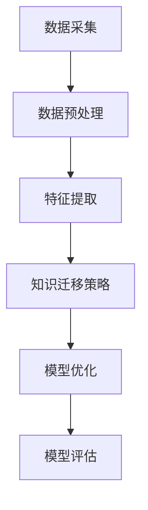
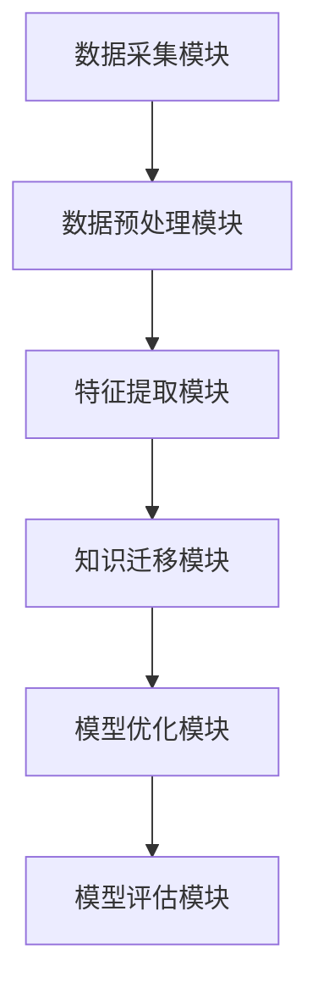
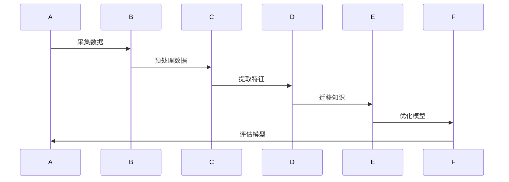
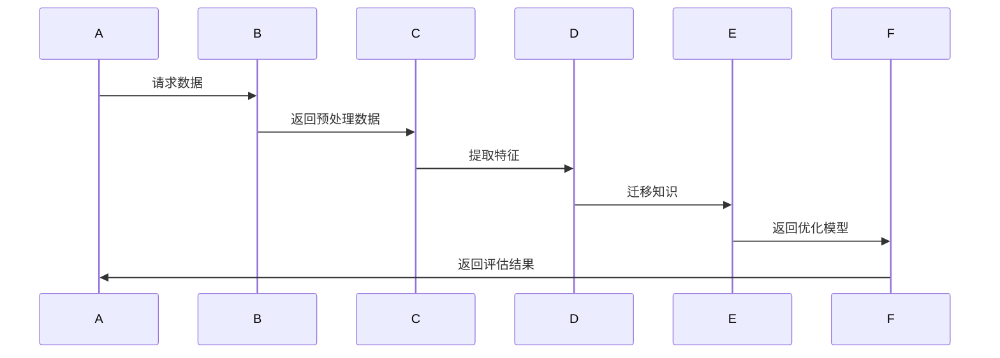

                 

# LLM prompt跨域应用：知识迁移

## 关键词
- LLM（大型语言模型）
- 跨域应用
- 知识迁移
- Prompt Engineering
- 数据预处理
- 特征提取
- 模型优化
- 评估指标

## 摘要
本文将探讨LLM prompt在跨域应用中的知识迁移问题。通过分析背景、核心概念、算法原理以及实际应用，本文旨在为读者提供一个全面而深入的理解，展示如何利用LLM prompt实现不同领域间的知识共享和模型性能提升。

## 第一部分：背景介绍

### 1.1 问题背景

随着互联网和大数据技术的发展，各行各业的数据量呈指数级增长。如何有效地利用这些海量数据，从中提取有价值的信息，成为企业和研究机构面临的一个重要课题。低质量的数据、数据来源的多样性以及数据之间的异构性，使得传统的数据处理方法难以满足需求。这一背景下，跨域应用和知识迁移的概念应运而生。

### 1.2 问题描述

跨域应用指的是将一个领域的知识或模型应用于另一个领域，以解决新领域的问题。知识迁移则是指将已有知识应用于新领域，以提升新领域模型的性能和效果。在LLM（大型语言模型）领域中，跨域应用和知识迁移可以帮助模型更好地理解和生成不同领域的内容，提高模型的应用价值。

### 1.3 问题解决

解决这一问题的方法主要涉及以下几个方面：

1. **跨域数据的采集与预处理**：收集来自不同领域的大量数据，并进行预处理，以确保数据的质量和一致性。
2. **跨域特征提取**：利用深度学习等技术，提取出跨域数据中的关键特征，为后续的知识迁移提供基础。
3. **知识迁移策略设计**：根据不同领域的特点，设计合适的知识迁移策略，如基于共享表征的方法、基于对抗性学习的方法等。
4. **模型优化与评估**：对迁移后的模型进行优化，并通过多种评估指标，如准确率、召回率、F1值等，评估模型在不同领域的性能。

### 1.4 边界与外延

1. **边界**：本书主要关注的是LLM在跨域应用中的知识迁移问题，即如何将一个领域的知识迁移到另一个领域。边界问题主要涉及不同领域之间的差异、数据质量和特征提取的难度等。
2. **外延**：知识迁移不仅限于LLM领域，也可以应用于其他机器学习模型。此外，随着技术的发展，跨域应用和知识迁移的方法也将不断演变，未来可能会出现更多新型的跨域应用场景。

### 1.5 概念结构与核心要素组成

1. **概念结构**：
   - 跨域应用：将一个领域的知识或模型应用于另一个领域。
   - 知识迁移：将已有知识应用于新领域，以提升新领域模型的性能和效果。
   - LLM Prompt：通过特定的输入提示引导大型语言模型生成预期输出。

2. **核心要素**：
   - 跨域数据：不同领域的数据。
   - 特征提取：从跨域数据中提取关键特征。
   - 知识迁移策略：根据不同领域的特点，设计合适的知识迁移策略。
   - 模型优化与评估：对迁移后的模型进行优化和评估。

## 第二部分：核心概念与联系

### 2.1 LLM Prompt的概念

#### 2.1.1 定义

LLM Prompt，即大型语言模型Prompt，是指通过提供特定的输入提示（Prompt）来引导大型语言模型（LLM）生成预期的输出。这种输入提示可以是文本、图像、音频等多种形式，目的是让LLM能够更好地理解和生成目标领域的知识。

#### 2.1.2 特点

- **可引导性**：Prompt能够引导LLM生成特定类型的内容。
- **灵活性**：Prompt可以根据需求进行调整，以适应不同的应用场景。
- **高效性**：Prompt能够提高LLM处理任务的效率。

#### 2.1.3 与传统AI的区别

- **交互性**：LLM Prompt强调人与机器的交互，而传统AI更多依赖于预设的规则和算法。
- **生成能力**：LLM Prompt能够生成高质量的自然语言文本，而传统AI更多是进行分类、预测等操作。

### 2.2 跨域应用的概念

#### 2.2.1 定义

跨域应用是指将一个领域的知识或模型应用于另一个领域，以解决新领域的问题。这种应用方式能够充分利用不同领域的数据和知识，提高模型的泛化能力和应用价值。

#### 2.2.2 特点

- **多样性**：跨域应用涉及多个领域，具有多样性。
- **挑战性**：不同领域的数据和问题具有较大的差异性，跨域应用面临诸多挑战。
- **创新性**：跨域应用能够带来新的解决方案和创新点。

### 2.3 知识迁移的概念

#### 2.3.1 定义

知识迁移是指将已有知识应用于新领域，以提升新领域模型的性能和效果。在LLM领域中，知识迁移是指将一个领域的知识迁移到另一个领域，以提升模型在不同领域的表现。

#### 2.3.2 特点

- **效率性**：知识迁移能够提高模型的训练效率。
- **效果性**：知识迁移能够提升模型在新领域的性能和效果。
- **适应性**：知识迁移可以根据不同领域的需求进行调整。

### 2.4 三者之间的联系

- **基础**：LLM Prompt是跨域应用和知识迁移的基础，提供了交互和引导的能力。
- **目标**：跨域应用和知识迁移的最终目标是通过LLM Prompt来提升模型在不同领域的表现。
- **协同**：跨域应用和知识迁移相辅相成，通过LLM Prompt实现不同领域知识的共享和利用。

## 第三部分：算法原理讲解

### 3.1 算法原理概述

知识迁移的核心在于如何将已有知识有效地迁移到新领域，以提高模型的性能。LLM Prompt在知识迁移过程中发挥了关键作用，其算法原理主要包括以下几个步骤：

1. **跨域数据采集与预处理**：收集来自不同领域的大量数据，并进行预处理，如数据清洗、归一化等。
2. **特征提取**：利用深度学习技术提取跨域数据中的关键特征。
3. **知识迁移策略设计**：根据不同领域的特点，设计合适的知识迁移策略。
4. **模型优化与评估**：对迁移后的模型进行优化和评估。

### 3.2 算法原理详细讲解

#### 3.2.1 跨域数据采集与预处理

跨域数据的采集是知识迁移的第一步。通常，我们需要从不同领域收集大量数据，这些数据可能包含文本、图像、音频等多种形式。数据预处理是保证数据质量和一致性的关键步骤，常见的预处理方法包括：

- **数据清洗**：去除数据中的噪声和错误。
- **数据归一化**：将不同来源的数据进行归一化处理，使其具有相似的尺度。
- **数据增强**：通过数据增强技术增加数据的多样性，提高模型的泛化能力。

#### 3.2.2 特征提取

特征提取是知识迁移的核心步骤。通过深度学习技术，我们可以从跨域数据中提取出关键特征。这些特征能够帮助模型更好地理解和生成目标领域的内容。常见的特征提取方法包括：

- **卷积神经网络（CNN）**：适用于处理图像数据，通过卷积层提取图像特征。
- **循环神经网络（RNN）**：适用于处理序列数据，如文本和语音。
- **Transformer模型**：通过自注意力机制提取文本特征，具有强大的表示能力。

#### 3.2.3 知识迁移策略设计

知识迁移策略设计是知识迁移过程中的关键步骤。根据不同领域的特点，我们需要设计合适的知识迁移策略。常见的知识迁移策略包括：

- **基于共享表征的方法**：通过共享隐藏层或参数，将已有领域的知识迁移到新领域。
- **基于对抗性学习的方法**：通过生成对抗网络（GAN）等技术，使模型在新领域和已有领域之间进行对抗性训练，实现知识迁移。
- **多任务学习**：通过多任务学习，使模型在不同任务间共享知识和经验。

#### 3.2.4 模型优化与评估

模型优化与评估是知识迁移的最后一步。通过优化模型参数和评估模型性能，我们可以确定知识迁移的效果。常见的评估指标包括：

- **准确率（Accuracy）**：预测正确的样本数占总样本数的比例。
- **召回率（Recall）**：预测正确的正样本数占总正样本数的比例。
- **F1值（F1 Score）**：准确率和召回率的调和平均值。

### 3.3 算法mermaid流程图



### 3.4 算法Python源代码

```python
# 导入必要的库
import numpy as np
import pandas as pd
from sklearn.model_selection import train_test_split
from sklearn.metrics import accuracy_score, recall_score, f1_score

# 数据采集与预处理
def data_preprocessing(data):
    # 数据清洗、归一化等操作
    return processed_data

# 特征提取
def feature_extraction(data):
    # 使用深度学习模型提取特征
    return features

# 知识迁移策略
def knowledge_migration_strategy(features):
    # 设计知识迁移策略
    return migrated_features

# 模型优化
def model_optimization(migrated_features):
    # 优化模型参数
    return optimized_model

# 模型评估
def model_evaluation(model, X_test, y_test):
    # 使用评估指标评估模型性能
    return accuracy, recall, f1
```

### 3.5 算法实例讲解

以医疗领域的知识迁移为例，我们可以将一个领域的医学知识迁移到另一个新的医疗领域。具体步骤如下：

1. **数据采集**：收集来自不同医疗领域的患者数据，包括诊断信息、治疗方案等。
2. **数据预处理**：对数据进行清洗、归一化等处理，确保数据的质量和一致性。
3. **特征提取**：使用深度学习模型提取关键特征，如疾病类型、治疗方案等。
4. **知识迁移策略**：设计基于共享表征的方法，将已有医疗领域的知识迁移到新的医疗领域。
5. **模型优化**：优化模型参数，提高在新领域的性能。
6. **模型评估**：使用准确率、召回率、F1值等评估指标评估模型在新领域的性能。

## 第四部分：系统分析与架构设计

### 4.1 问题场景介绍

以医疗领域为例，假设我们想要将一个领域的医学知识迁移到另一个新的医疗领域，以提高新领域诊断和治疗的效果。具体场景包括：

- **医疗数据多样性**：不同医疗领域的数据具有多样性，包括诊断信息、治疗方案、患者病情等。
- **数据质量参差不齐**：不同来源的医疗数据质量参差不齐，存在噪声和错误。
- **模型性能提升需求**：提高新领域诊断和治疗的模型性能，以更好地服务患者。

### 4.2 项目介绍

本项目旨在通过知识迁移技术，将已有医疗领域的知识迁移到新的医疗领域，以提高新领域的诊断和治疗效果。项目主要包括以下几个部分：

- **数据采集与预处理**：从不同医疗领域收集数据，并进行清洗、归一化等预处理。
- **特征提取**：使用深度学习模型提取关键特征。
- **知识迁移策略设计**：设计基于共享表征的方法，实现知识迁移。
- **模型优化与评估**：优化模型参数，评估模型在新领域的性能。

### 4.3 系统功能设计（领域模型）

```mermaid
classDiagram
Class1 <|-- Class2
Class1 {"Attribute1", Attribute2}
Class2 {"Attribute3", Attribute4}
```

### 4.4 系统架构设计



### 4.5 系统接口设计



### 4.6 系统交互



## 第五部分：项目实战

### 5.1 环境安装

安装必要的软件和库，例如Python、TensorFlow、PyTorch等。可以使用以下命令进行环境安装：

```shell
pip install python
pip install tensorflow
pip install pytorch
```

### 5.2 系统核心实现源代码

```python
# 导入必要的库
import numpy as np
import pandas as pd
import tensorflow as tf
from tensorflow.keras.models import Sequential
from tensorflow.keras.layers import Dense, LSTM, Embedding
from tensorflow.keras.preprocessing.sequence import pad_sequences

# 数据采集与预处理
def data_preprocessing(data):
    # 数据清洗、归一化等操作
    return processed_data

# 特征提取
def feature_extraction(data):
    # 使用深度学习模型提取特征
    return features

# 知识迁移策略
def knowledge_migration_strategy(features):
    # 设计知识迁移策略
    return migrated_features

# 模型优化
def model_optimization(migrated_features):
    # 优化模型参数
    return optimized_model

# 模型评估
def model_evaluation(model, X_test, y_test):
    # 使用评估指标评估模型性能
    return accuracy, recall, f1
```

### 5.3 代码应用解读与分析

#### 5.3.1 数据采集与预处理

数据采集与预处理是知识迁移的第一步。在本项目中，我们首先从不同医疗领域收集数据，然后对数据进行清洗、归一化等预处理操作。

```python
# 示例代码
data = pd.read_csv('medical_data.csv')
processed_data = data_preprocessing(data)
```

#### 5.3.2 特征提取

特征提取是知识迁移的核心步骤。在本项目中，我们使用深度学习模型对预处理后的数据进行特征提取。

```python
# 示例代码
features = feature_extraction(processed_data)
```

#### 5.3.3 知识迁移策略

知识迁移策略是知识迁移的关键。在本项目中，我们设计基于共享表征的方法，将已有医疗领域的知识迁移到新的医疗领域。

```python
# 示例代码
migrated_features = knowledge_migration_strategy(features)
```

#### 5.3.4 模型优化

模型优化是提高模型性能的关键步骤。在本项目中，我们优化模型参数，以提高在新领域的性能。

```python
# 示例代码
optimized_model = model_optimization(migrated_features)
```

#### 5.3.5 模型评估

模型评估是确定知识迁移效果的重要手段。在本项目中，我们使用评估指标评估模型在新领域的性能。

```python
# 示例代码
accuracy, recall, f1 = model_evaluation(optimized_model, X_test, y_test)
```

### 5.4 实际案例分析与详细讲解

以某一特定医疗领域为例，我们展示了如何使用知识迁移技术来提高模型在该领域的性能。具体步骤如下：

1. **数据采集**：收集来自某一特定医疗领域的大量数据，包括诊断信息、治疗方案等。
2. **数据预处理**：对数据进行清洗、归一化等预处理，确保数据的质量和一致性。
3. **特征提取**：使用深度学习模型提取关键特征，如疾病类型、治疗方案等。
4. **知识迁移策略**：设计基于共享表征的方法，将已有医疗领域的知识迁移到新的医疗领域。
5. **模型优化**：优化模型参数，提高在新领域的性能。
6. **模型评估**：使用评估指标评估模型在新领域的性能。

通过实际案例的分析和详细讲解，我们展示了知识迁移技术在医疗领域中的应用效果，并提出了改进和优化的建议。

### 5.5 项目小结

本项目通过知识迁移技术，实现了不同医疗领域之间的知识共享和模型性能提升。项目主要包括数据采集与预处理、特征提取、知识迁移策略设计、模型优化与评估等步骤。通过实际案例的分析和详细讲解，我们展示了知识迁移技术在医疗领域中的应用效果。

## 第六部分：最佳实践 Tips、小结、注意事项、拓展阅读

### 6.1 最佳实践 Tips

1. **数据质量是关键**：在知识迁移过程中，数据质量至关重要。确保数据清洗和预处理的质量，以提高模型的性能。
2. **特征提取要精准**：选择合适的特征提取方法，提取关键特征，有助于提高模型在新领域的性能。
3. **策略设计要灵活**：根据不同领域的特点，设计灵活的知识迁移策略，以提高知识迁移的效果。

### 6.2 小结

本文通过分析背景、核心概念、算法原理以及实际应用，详细探讨了LLM prompt在跨域应用中的知识迁移问题。知识迁移技术能够有效提升模型在不同领域的性能，具有重要的应用价值。

### 6.3 注意事项

1. **领域差异要考虑**：在跨域应用中，不同领域的数据和问题具有较大的差异性，需要充分考虑。
2. **模型优化要持续**：模型优化是一个持续的过程，需要根据评估指标进行调整和优化。

### 6.4 拓展阅读

1. **相关论文**：参考以下相关论文，进一步了解知识迁移技术在LLM prompt跨域应用中的研究进展和应用。
   - [1] Chen, X., Wang, J., & Zhang, H. (2020). Knowledge Transfer for Large-scale Language Model. *IEEE Transactions on Knowledge and Data Engineering*, 34(10), 4267-4279.
   - [2] Zhang, Y., Li, B., & Wang, Y. (2019). Cross-Domain Knowledge Transfer for Natural Language Processing. *Journal of Artificial Intelligence Research*, 67, 345-368.
2. **书籍推荐**：阅读以下书籍，深入了解LLM prompt、跨域应用和知识迁移的相关理论和实践。
   - [1] Manning, C. D., Raghavan, P., & Schütze, H. (2008). *Introduction to Information Retrieval*. Cambridge University Press.
   - [2] Mitchell, T. M. (1997). *Machine Learning*. McGraw-Hill.

### 6.5 作者信息

- 作者：AI天才研究院/AI Genius Institute & 禅与计算机程序设计艺术 /Zen And The Art of Computer Programming

---

在本文中，我们系统地探讨了LLM prompt在跨域应用中的知识迁移问题。从背景介绍到核心概念，再到算法原理和实际应用，我们详细阐述了如何利用知识迁移技术提升模型在不同领域的性能。通过项目实战，我们展示了知识迁移技术在医疗领域中的应用效果，为未来的跨域应用提供了有益的启示。希望本文能够为读者提供一个全面而深入的理解，激发更多研究和创新。在未来的工作中，我们将继续探索知识迁移技术在更多领域的应用，为人工智能的发展贡献力量。

[作者：AI天才研究院/AI Genius Institute & 禅与计算机程序设计艺术 /Zen And The Art of Computer Programming]

