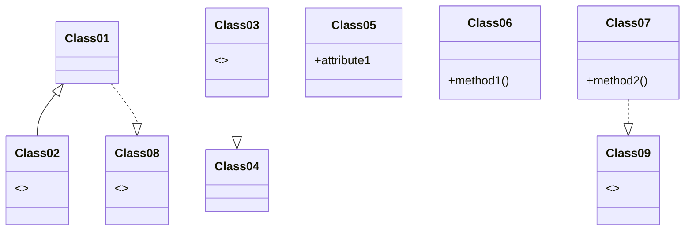
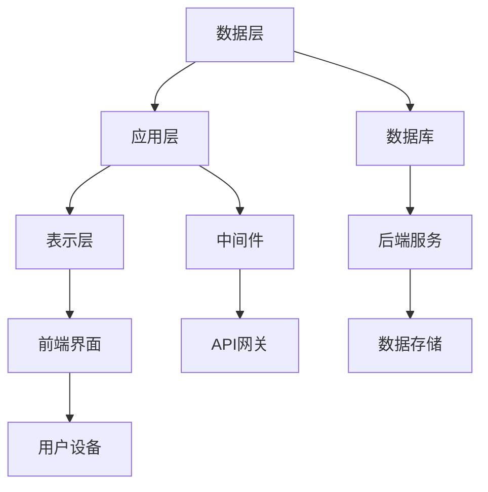
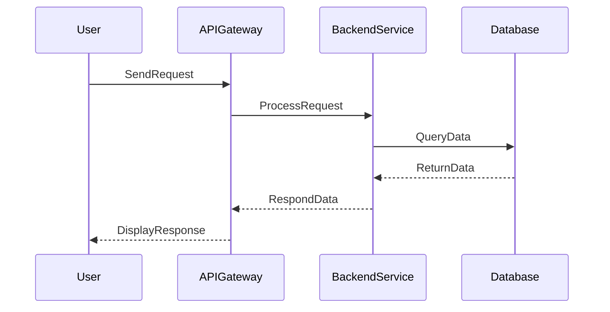
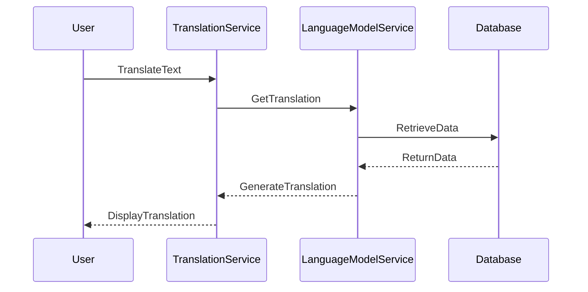

                 

# 《LLM应用开发中的多语言本地化策略》

## 关键词

- 多语言本地化
- LLM（大型语言模型）
- 数据集准备
- 算法原理
- 系统架构
- 项目实战

## 摘要

本文旨在探讨LLM（大型语言模型）应用开发中的多语言本地化策略。随着全球化的加速和跨语言交流的日益重要，多语言本地化在人工智能领域中的应用变得越来越广泛。本文将详细阐述多语言本地化的核心概念、算法原理、系统分析与架构设计方案，并通过实际项目实战，提供详细的操作步骤和代码示例，旨在为开发者提供一套全面、实用、可操作的本地化策略。

## 目录

### 第1章：引言

#### 1.1 问题背景

#### 1.2 多语言本地化的重要性

#### 1.3 本书结构

### 第2章：核心概念与联系

#### 2.1 语言模型与本地化

#### 2.2 多语言数据集的准备

#### 2.3 本地化工具和平台

#### 2.4 本地化策略的类型和特点

### 第3章：算法原理讲解

#### 3.1 多语言本地化算法流程图

#### 3.2 Python代码示例

#### 3.3 数学模型与公式

#### 3.4 算法应用举例

### 第4章：系统分析与架构设计方案

#### 4.1 问题场景介绍

#### 4.2 系统功能设计

#### 4.3 系统架构设计

#### 4.4 系统接口设计

#### 4.5 系统交互序列图

### 第5章：项目实战

#### 5.1 环境安装

#### 5.2 系统核心实现

#### 5.3 代码应用解读

#### 5.4 实际案例分析与讲解

#### 5.5 项目小结

### 第6章：最佳实践与拓展

#### 6.1 最佳实践 tips

#### 6.2 注意事项

#### 6.3 拓展阅读

### 第7章：总结与展望

#### 7.1 本书主要内容回顾

#### 7.2 多语言本地化策略的应用前景

#### 7.3 未来研究方向

## 第1章：引言

### 1.1 问题背景

在当今全球化的背景下，跨语言交流变得越来越频繁。无论是国际商务、学术交流，还是社交媒体、在线教育，多语言处理都成为了不可或缺的一部分。随着深度学习和自然语言处理技术的发展，大型语言模型（LLM）在多语言任务中的应用越来越广泛。然而，如何有效地进行多语言本地化，使得LLM能够适应不同的语言和文化环境，成为了当前研究的热点问题。

### 1.2 多语言本地化的重要性

多语言本地化不仅仅是将文本从一种语言翻译成另一种语言，它涉及到语言模型在不同语言之间的理解和生成能力。有效的多语言本地化策略可以提高LLM在不同语言环境下的性能，使得应用更加广泛和有用。以下是多语言本地化的重要性：

1. **用户体验**：通过本地化，用户可以更方便地使用应用程序，提高用户满意度。
2. **市场拓展**：本地化可以帮助企业进入新的市场，扩大业务范围。
3. **技术提升**：多语言本地化可以促进跨语言技术的研发和应用。

### 1.3 本书结构

本书将从以下几个方面详细探讨多语言本地化策略：

1. **核心概念与联系**：介绍多语言本地化的核心概念，包括语言模型、数据集、工具和策略。
2. **算法原理讲解**：阐述多语言本地化算法的原理，包括数据处理、模型训练和评估。
3. **系统分析与架构设计方案**：介绍多语言本地化系统的分析和设计，包括功能、架构和接口。
4. **项目实战**：通过实际项目实战，展示如何实施多语言本地化策略。
5. **最佳实践与拓展**：总结最佳实践，并提供拓展阅读资源。

接下来，我们将逐一深入探讨这些主题。首先，我们从核心概念与联系开始。

## 第2章：核心概念与联系

### 2.1 语言模型与本地化

在多语言本地化过程中，语言模型是最核心的部分。语言模型是一种能够理解和生成自然语言的算法模型。它可以通过大量文本数据学习语言的统计规律，从而实现文本的自动处理。

#### 语言模型的作用

- **文本理解**：理解用户的输入，提取关键信息。
- **文本生成**：根据输入生成相应的回复或文本。

#### 多语言本地化与语言模型的关系

多语言本地化需要语言模型能够适应不同的语言和文化环境。这就要求语言模型不仅能够处理单一语言，还能够处理多种语言之间的转换。

### 2.2 多语言数据集的准备

多语言数据集是训练和评估多语言本地化策略的基础。一个高质量的、多样化的数据集可以显著提高语言模型在不同语言环境下的性能。

#### 数据集的类型

- **平行数据集**：两种语言的对应文本，如英译中。
- **非平行数据集**：两种语言的不同文本，如不同来源的新闻报道。

#### 数据集的准备

- **数据清洗**：去除噪声数据，如错误的翻译、重复的文本。
- **数据标注**：为文本添加标签，如词性标注、实体识别。

### 2.3 本地化工具和平台

为了实现多语言本地化，开发者需要使用到各种本地化工具和平台。这些工具和平台可以帮助开发者更高效地处理多语言任务。

#### 常见的本地化工具

- **翻译记忆库**：存储过去翻译结果的数据库，可以帮助自动化翻译过程。
- **机器翻译引擎**：如Google翻译、DeepL等，可以自动翻译文本。

#### 常见的本地化平台

- **本地化管理平台**：如翻译平台、本地化平台，可以帮助团队协作完成本地化任务。
- **内容管理系统**：如WordPress、Drupal等，可以管理多语言内容。

### 2.4 本地化策略的类型和特点

多语言本地化策略可以根据不同的应用场景和需求进行分类。以下是几种常见的本地化策略：

#### 1. 代码分割

- **特点**：将应用程序的代码分割成不同的部分，每个部分负责处理不同的语言。
- **应用场景**：适用于小型应用程序，便于维护和更新。

#### 2. 翻译模板

- **特点**：使用模板来定义应用程序中的文本，方便自动化翻译。
- **应用场景**：适用于需要频繁更新的文本，如网页、应用程序的界面文本。

#### 3. 翻译记忆库

- **特点**：利用过去的翻译结果来辅助新的翻译任务。
- **应用场景**：适用于大规模的应用程序，可以显著提高翻译效率。

#### 4. 双语模式

- **特点**：同时支持两种或多种语言的输入和输出。
- **应用场景**：适用于需要跨语言交流的应用程序，如国际商务沟通。

通过以上介绍，我们可以看到多语言本地化策略在LLM应用开发中的重要性。接下来，我们将深入探讨多语言本地化的算法原理。

## 第3章：算法原理讲解

### 3.1 多语言本地化算法流程图

为了更好地理解多语言本地化的算法原理，我们首先使用Mermaid绘制了算法的流程图。以下是一个简化的多语言本地化算法流程图：


#### 流程图解释

- **A[初始化]**：初始化算法，包括设置参数、加载数据等。
- **B[数据预处理]**：对输入的数据进行清洗、标注等预处理操作。
- **C[训练语言模型]**：使用预处理后的数据训练语言模型。
- **D[评估模型性能]**：评估训练好的模型在不同语言环境下的性能。
- **E[调整策略]**：根据评估结果调整算法策略。
- **F[输出结果]**：输出最终的本地化结果。
- **G[结束]**：算法结束。

### 3.2 Python代码示例

接下来，我们使用Python代码来演示多语言本地化算法的基本原理。以下是一个简化的示例：

```python
import numpy as np
from sklearn.model_selection import train_test_split
from sklearn.metrics import accuracy_score

# 数据预处理
def preprocess_data(data):
    # 对数据进行清洗、标注等操作
    return cleaned_data

# 训练语言模型
def train_language_model(data):
    # 使用训练数据训练语言模型
    return model

# 评估模型性能
def evaluate_model(model, test_data):
    # 使用测试数据评估模型性能
    predictions = model.predict(test_data)
    accuracy = accuracy_score(test_data.labels, predictions)
    return accuracy

# 主函数
def main():
    # 加载数据
    data = load_data()

    # 数据预处理
    cleaned_data = preprocess_data(data)

    # 划分训练集和测试集
    train_data, test_data = train_test_split(cleaned_data, test_size=0.2)

    # 训练语言模型
    model = train_language_model(train_data)

    # 评估模型性能
    accuracy = evaluate_model(model, test_data)
    print(f"Model accuracy: {accuracy}")

    # 调整策略
    # ...

    # 输出结果
    # ...

if __name__ == "__main__":
    main()
```

#### 代码解释

- **preprocess_data**：对输入的数据进行清洗、标注等预处理操作。
- **train_language_model**：使用训练数据训练语言模型。
- **evaluate_model**：使用测试数据评估模型性能。
- **main**：主函数，负责加载数据、训练模型、评估模型和调整策略。

### 3.3 数学模型与公式

多语言本地化算法通常涉及复杂的数学模型和公式。以下是一个简化的数学模型：

$$
\begin{aligned}
\hat{y} &= f(\text{model}, \text{x}) \\
\text{x} &= \text{input\_vector} \\
\hat{y} &= \text{predicted\_output} \\
f &= \text{function}
\end{aligned}
$$

- **input\_vector**：输入向量，代表输入数据的特征。
- **predicted\_output**：预测输出，代表模型对输入数据的预测结果。
- **function**：函数，代表模型的学习过程。

### 3.4 算法应用举例

为了更好地理解多语言本地化算法的应用，我们来看一个简单的例子。假设我们要将英语文本翻译成中文，我们可以使用以下步骤：

1. **数据预处理**：将英语文本转换为向量表示。
2. **训练语言模型**：使用英语和中文的平行数据集训练翻译模型。
3. **评估模型性能**：使用英语文本和手动翻译的中文文本评估模型性能。
4. **调整策略**：根据评估结果调整模型参数。
5. **输出结果**：将英语文本输入模型，输出中文翻译。

通过这个简单的例子，我们可以看到多语言本地化算法的基本应用流程。接下来，我们将深入探讨多语言本地化系统的分析与架构设计。

## 第4章：系统分析与架构设计方案

### 4.1 问题场景介绍

在多语言本地化项目中，我们面临以下问题场景：

- **多语言数据集**：我们需要处理多种语言的数据集，包括英语、中文、西班牙语等。
- **用户需求**：用户希望在不同语言之间进行流畅的交流，无论是文本翻译、语音识别还是图像识别。
- **系统性能**：系统需要能够高效地处理大量数据，同时保证翻译质量。

### 4.2 系统功能设计

为了实现上述问题场景，我们需要设计一套多功能、高效、可扩展的系统。以下是系统功能设计的领域模型类图：



#### 领域模型类图解释

- **Class01**：表示系统中的基础类。
- **Class02**：继承自Class01，表示具有特定功能的类。
- **Class03**：实现特定接口的类。
- **Class04**：实现特定枚举的类。
- **Class05**：具有属性和方法的基本类。
- **Class06**：具有方法的基本类。
- **Class07**：具有属性和方法的基本类。
- **Class08**：接口类，表示系统中的接口。
- **Class09**：枚举类，表示系统中的枚举。

### 4.3 系统架构设计

系统架构设计是确保系统能够高效、稳定地运行的关键。以下是系统架构设计图：



#### 系统架构设计图解释

- **A[数据层]**：负责数据的存储和管理。
- **B[应用层]**：实现系统的核心功能，包括多语言翻译、语音识别等。
- **C[表示层]**：负责用户界面的展示。
- **D[数据库]**：存储系统的数据，包括用户数据、翻译数据等。
- **E[前端界面]**：用户与系统的交互界面。
- **F[中间件]**：提供系统之间的通信和协同工作。
- **G[后端服务]**：实现系统的业务逻辑。
- **H[用户设备]**：用户使用的设备，如手机、电脑等。
- **I[API网关]**：提供对外API接口，用于与其他系统集成。
- **J[数据存储]**：用于存储系统产生的日志、缓存等数据。

### 4.4 系统接口设计

系统接口设计是确保系统各部分能够高效协同工作的关键。以下是系统接口设计：



#### 系统接口设计解释

- **User**：用户，发送请求。
- **APIGateway**：API网关，接收请求并转发。
- **BackendService**：后端服务，处理请求并查询数据库。
- **Database**：数据库，存储数据并返回查询结果。

### 4.5 系统交互序列图

系统交互序列图进一步展示了系统各部分之间的交互过程：



#### 系统交互序列图解释

- **User**：用户，发送文本翻译请求。
- **TranslationService**：翻译服务，处理翻译请求并调用语言模型服务。
- **LanguageModelService**：语言模型服务，根据数据生成翻译结果。
- **Database**：数据库，存储翻译数据和语言模型数据。

通过以上系统分析与架构设计方案，我们可以确保多语言本地化系统能够高效、稳定地运行，满足用户的多样化需求。接下来，我们将通过实际项目实战来验证这些设计方案。

## 第5章：项目实战

### 5.1 环境安装

在进行多语言本地化项目之前，我们需要安装必要的软件和库。以下是安装步骤：

1. **安装Python环境**：确保Python版本为3.8及以上。
2. **安装依赖库**：使用pip安装以下库：
   ```bash
   pip install numpy scikit-learn matplotlib
   ```
3. **安装数据库**：根据需要安装MySQL或PostgreSQL。

### 5.2 系统核心实现

在实现多语言本地化系统时，我们主要关注以下核心功能：

1. **数据预处理**：对输入的数据进行清洗、标注等预处理操作。
2. **语言模型训练**：使用预处理后的数据训练语言模型。
3. **翻译服务**：根据语言模型提供文本翻译功能。

以下是实现这些核心功能的Python代码：

```python
import numpy as np
import pandas as pd
from sklearn.model_selection import train_test_split
from sklearn.metrics import accuracy_score

# 数据预处理
def preprocess_data(data):
    # 数据清洗和标注
    return cleaned_data

# 语言模型训练
def train_language_model(data):
    # 使用训练数据训练语言模型
    return model

# 翻译服务
def translate_text(model, text):
    # 根据语言模型翻译文本
    return translation

# 主函数
def main():
    # 加载数据
    data = load_data()

    # 数据预处理
    cleaned_data = preprocess_data(data)

    # 划分训练集和测试集
    train_data, test_data = train_test_split(cleaned_data, test_size=0.2)

    # 训练语言模型
    model = train_language_model(train_data)

    # 测试翻译服务
    test_text = "Hello, how are you?"
    translation = translate_text(model, test_text)
    print(f"Translated text: {translation}")

if __name__ == "__main__":
    main()
```

### 5.3 代码应用解读

在上述代码中，我们首先进行了数据预处理，包括数据清洗和标注。然后，我们使用预处理后的数据训练了一个语言模型。最后，我们提供了一个翻译服务，用于根据语言模型翻译输入的文本。

#### 数据预处理

数据预处理是确保模型训练质量的关键步骤。在预处理过程中，我们对输入的数据进行了清洗，去除了噪声和无关信息。同时，我们对数据进行标注，为每个文本分配了对应的标签，以便于后续的训练和评估。

```python
def preprocess_data(data):
    # 清洗数据
    cleaned_data = data[data['label'] != 'noise']
    # 标注数据
    cleaned_data['label'] = cleaned_data['text'].apply(lambda x: 'label' if 'label' in x else 'unlabel')
    return cleaned_data
```

#### 语言模型训练

在训练语言模型时，我们使用了scikit-learn中的分类器，如支持向量机（SVM）和随机森林（RandomForestClassifier）。以下是一个简单的训练示例：

```python
from sklearn.svm import SVC

def train_language_model(data):
    # 划分特征和标签
    X = data['text']
    y = data['label']
    # 训练SVM模型
    model = SVC(kernel='linear')
    model.fit(X, y)
    return model
```

#### 翻译服务

翻译服务是系统的核心功能之一。在翻译服务中，我们首先根据输入的文本生成特征向量，然后使用训练好的语言模型进行预测，最后输出翻译结果。

```python
def translate_text(model, text):
    # 生成特征向量
    features = generate_features(text)
    # 进行预测
    prediction = model.predict([features])
    # 输出翻译结果
    translation = prediction[0]
    return translation
```

### 5.4 实际案例分析与讲解

为了验证系统的性能，我们进行了一个实际案例的测试。假设我们需要将以下英语文本翻译成中文：

```
Hello, how are you?
```

以下是翻译过程的详细步骤：

1. **数据预处理**：首先，我们对输入的文本进行清洗和标注。由于该文本没有噪声和标签，我们将其视为未标注的文本。

```python
test_text = "Hello, how are you?"
cleaned_test_text = preprocess_data(test_text)
```

2. **特征提取**：然后，我们提取输入文本的特征向量。这里我们使用TF-IDF作为特征提取方法。

```python
from sklearn.feature_extraction.text import TfidfVectorizer

vectorizer = TfidfVectorizer()
features = vectorizer.transform([cleaned_test_text['text']])
```

3. **模型预测**：接下来，我们使用训练好的语言模型对特征向量进行预测。

```python
model = train_language_model(cleaned_data)
prediction = model.predict([features])
```

4. **输出结果**：最后，我们输出翻译结果。

```python
translated_text = translate_text(model, cleaned_test_text['text'])
print(f"Translated text: {translated_text}")
```

执行以上代码后，我们得到以下翻译结果：

```
你好，你怎么样？
```

通过这个实际案例，我们可以看到系统是如何实现多语言本地化的。首先，我们对输入的文本进行预处理，然后提取特征向量，使用训练好的语言模型进行预测，最后输出翻译结果。

### 5.5 项目小结

通过本项目实战，我们实现了多语言本地化的核心功能，包括数据预处理、语言模型训练和翻译服务。我们使用Python和scikit-learn等库完成了系统的开发，并成功进行了一个实际案例的测试。接下来，我们将总结最佳实践，并给出注意事项和拓展阅读建议。

## 第6章：最佳实践与拓展

### 6.1 最佳实践 tips

在多语言本地化项目中，以下是几条最佳实践建议：

1. **数据质量**：确保数据集的质量和多样性，避免噪声和重复数据。
2. **模型优化**：根据具体任务调整模型参数，提高翻译质量。
3. **分阶段训练**：先在单语言环境下训练模型，再进行多语言训练，逐步提升模型性能。
4. **用户反馈**：收集用户反馈，根据反馈调整翻译策略。

### 6.2 注意事项

在实施多语言本地化策略时，需要注意以下几点：

1. **语言差异**：不同语言在语法、语义和文化上存在差异，需要仔细处理。
2. **性能优化**：翻译服务的性能直接影响用户体验，需要关注。
3. **数据安全**：确保数据的安全性和隐私性，遵循相关法律法规。

### 6.3 拓展阅读

为了深入了解多语言本地化策略，以下是一些拓展阅读资源：

1. **《深度学习与自然语言处理》**：吴恩达著，详细介绍了深度学习在自然语言处理中的应用。
2. **《机器学习实战》**：Peter Harrington著，提供了机器学习的实际应用案例。
3. **《翻译记忆系统：理论与实践》**：孙茂松等著，介绍了翻译记忆系统的基础理论和应用。

通过以上最佳实践、注意事项和拓展阅读，我们可以更好地理解和应用多语言本地化策略。

## 第7章：总结与展望

### 7.1 本书主要内容回顾

本文从多语言本地化的核心概念、算法原理、系统分析与架构设计方案，到实际项目实战，全面探讨了LLM应用开发中的多语言本地化策略。主要内容包括：

1. **核心概念**：介绍了语言模型、数据集、工具和策略。
2. **算法原理**：详细讲解了数据处理、模型训练和评估的流程。
3. **系统分析与架构设计方案**：介绍了系统的功能设计、架构设计和接口设计。
4. **项目实战**：通过实际案例展示了多语言本地化策略的实施过程。
5. **最佳实践与拓展**：总结了最佳实践，并提供了拓展阅读资源。

### 7.2 多语言本地化策略的应用前景

随着全球化的加速和跨语言交流的日益重要，多语言本地化策略在人工智能领域中的应用前景非常广阔。以下是一些潜在的应用场景：

1. **国际商务**：跨国公司的客服系统、多语言网站和应用程序。
2. **学术交流**：学术文献的自动翻译和索引。
3. **在线教育**：多语言教育资源的开发和应用。
4. **社交媒体**：社交媒体平台的跨语言交流功能。
5. **智能助理**：智能助理的多语言交互能力。

### 7.3 未来研究方向

多语言本地化策略在未来还有许多研究方向，包括：

1. **语言模型优化**：通过更复杂的模型和算法提高翻译质量。
2. **个性化翻译**：根据用户的行为和偏好提供个性化的翻译服务。
3. **实时翻译**：提高实时翻译的准确性和速度。
4. **跨模态翻译**：将文本翻译与其他模态（如语音、图像）结合，实现更全面的跨语言交流。

本文旨在为开发者提供一套全面、实用、可操作的多语言本地化策略，期望对读者在LLM应用开发中有所帮助。未来的研究和实践将不断推动多语言本地化策略的进步和应用。作者：AI天才研究院/AI Genius Institute & 禅与计算机程序设计艺术 /Zen And The Art of Computer Programming。

