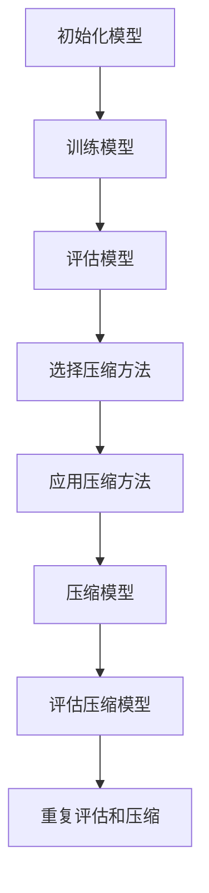
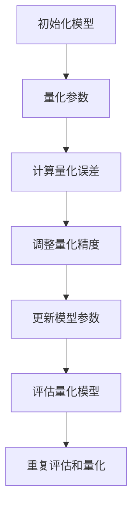
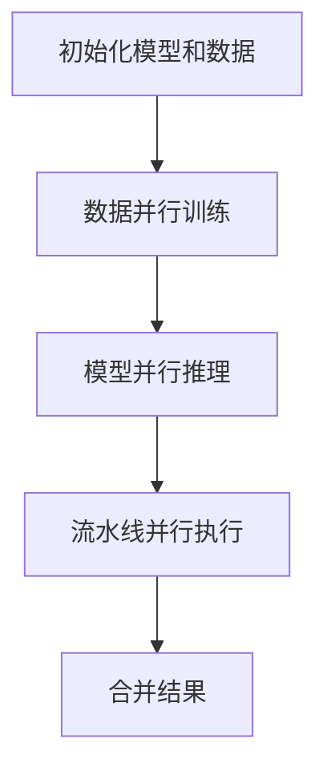
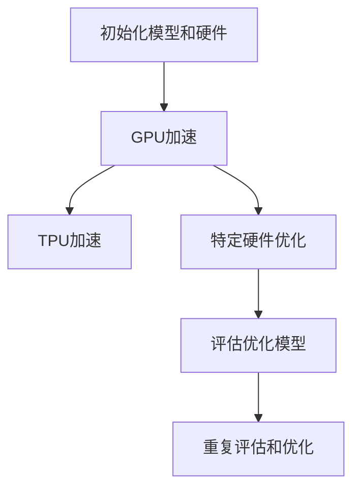
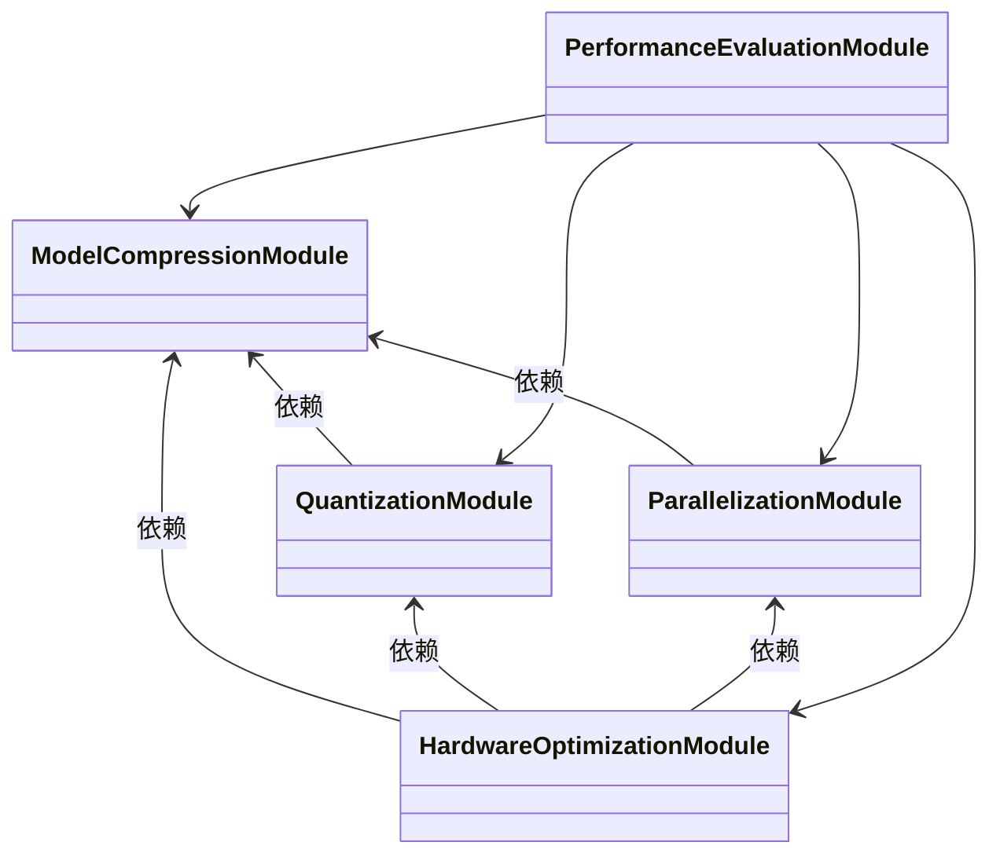
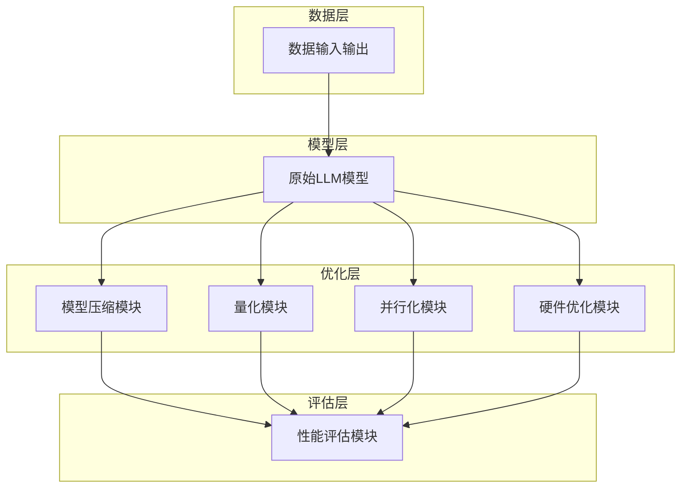
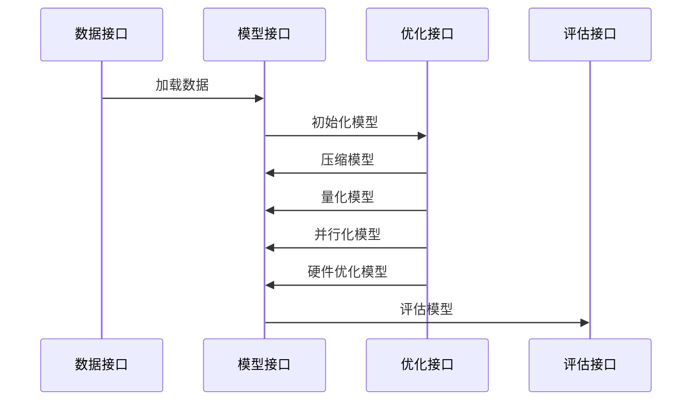
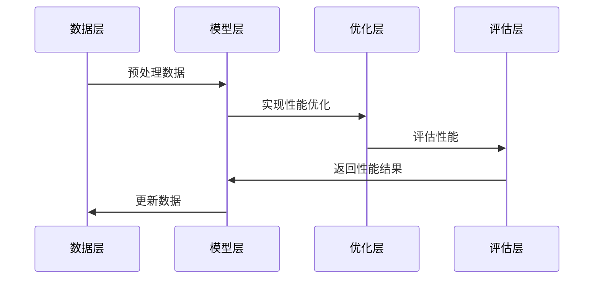

                 

### 第一部分：背景介绍

#### 第1章：LLM概述

在当前人工智能（AI）迅猛发展的背景下，大型语言模型（LLM，Large Language Model）已经成为推动AI应用的重要力量。LLM通过深度学习技术对大量文本数据进行训练，从而能够理解和生成人类语言。这种模型在自然语言处理（NLP）任务中表现出色，广泛应用于机器翻译、文本生成、问答系统、情感分析等场景。然而，随着LLM规模的不断扩大，其性能优化成为一个关键的研究课题。

##### 1.1 问题背景

**问题提出**：随着LLM的规模越来越大，其训练和推理过程需要大量的计算资源和存储空间，对硬件设备提出了更高的要求。此外，LLM在处理复杂任务时，往往存在推理速度慢、能耗高的问题。这些问题制约了LLM应用的广泛部署，尤其是在实时性和移动设备上的应用。

**问题描述**：如何通过系统化的性能优化策略，提升LLM在计算资源、数据存储、推理速度和能耗等方面的表现，以满足不同应用场景的需求？

**问题解决**：通过分析LLM的性能瓶颈和优化方法，为开发者提供实用的性能优化策略，从而提升LLM的应用效果。

##### 1.2 边界与外延

**性能优化范围**：本文主要讨论LLM在以下方面的性能优化：

- **模型压缩**：通过减少模型参数的数量和大小，降低模型的存储和计算需求。
- **量化**：将模型中的浮点数参数转换为低精度数值，以减少计算资源和存储需求。
- **并行化**：利用多核处理器和分布式计算资源，加速模型的推理过程。
- **硬件优化**：针对特定的硬件平台进行优化，如使用GPU、TPU等加速器，提高模型的推理效率。

**概念结构与核心要素组成**：

- **LLM基础概念**：介绍LLM的基本概念，如神经网络架构、训练过程、评估指标等。
- **性能优化方法**：详细阐述上述四种性能优化方法，包括算法原理、实现步骤和具体应用。

##### 1.3 核心概念与联系

**概念原理**：解释LLM的工作原理和性能优化的基础理论，包括深度学习、神经网络、大规模数据处理等。

**属性特征对比表格**：

| 优化方法 | 主要优势 | 主要劣势 | 适用场景 |
| --- | --- | --- | --- |
| 模型压缩 | 减小模型大小 | 可能降低模型性能 | 存储空间受限的场景 |
| 量化 | 降低计算资源需求 | 可能降低模型精度 | 需要高性能计算的场景 |
| 并行化 | 提高推理速度 | 需要分布式计算资源 | 实时性要求高的场景 |
| 硬件优化 | 提高推理效率 | 需要特定的硬件支持 | 对硬件性能有较高要求的场景 |

**ER实体关系图架构**：

```mermaid
erDiagram
    ModelCompression ||--|{ Quantization }
    ModelCompression ||--|{ Parallelization }
    ModelCompression ||--|{ HardwareOptimization }
    Quantization ||--|{ ModelCompression }
    Parallelization ||--|{ ModelCompression }
    HardwareOptimization ||--|{ ModelCompression }
```

##### 1.4 第一个核心概念：模型压缩

**算法原理讲解**：

模型压缩是指通过减少模型参数的数量和大小，降低模型的存储和计算需求。常见的模型压缩方法包括：

1. **剪枝（Pruning）**：通过移除模型中不重要的神经元和连接，减少模型参数的数量。
2. **量化（Quantization）**：将模型中的浮点数参数转换为低精度数值，以减少计算资源和存储需求。
3. **知识蒸馏（Knowledge Distillation）**：通过将大模型的知识转移到小模型中，减少模型参数的数量。

**Mermaid流程图**：



**Python源代码**：

```python
import tensorflow as tf

# 初始化模型
model = tf.keras.applications.VGG16()

# 训练模型
model.compile(optimizer='adam', loss='categorical_crossentropy', metrics=['accuracy'])

# 评估模型
model.evaluate(x_train, y_train)

# 选择压缩方法
method = 'pruning'  # 或者 'quantization' 或 'knowledge_distillation'

# 应用压缩方法
if method == 'pruning':
    # 实现剪枝
    pruned_model = pruning.prune_low_magnitude(model, begin_step=1000, end_step=2000)
elif method == 'quantization':
    # 实现实量化
    quantized_model = quantization.quantize_model(model)
elif method == 'knowledge_distillation':
    # 实现知识蒸馏
    distilled_model = knowledge_distillation.distill_large_model_to_small_model(model)

# 压缩模型
compressed_model = distilled_model

# 评估压缩模型
compressed_model.evaluate(x_test, y_test)
```

**数学模型和公式**：

模型压缩的数学原理主要包括以下方面：

1. **剪枝**：通过分析模型中神经元和连接的重要程度，移除不重要的部分。常用的评估方法包括激活值、梯度、权重等。
2. **量化**：将模型的浮点数参数转换为低精度数值，如8位整数。量化方法包括符号位、绝对值、阶码等。
3. **知识蒸馏**：通过训练一个小模型，使其在大模型的知识下具有相似的预测能力。常用的方法包括软标签、硬标签等。

详细讲解和通俗易懂地举例说明：

- **剪枝**：假设一个简单的神经网络包含一个输入层、一个隐藏层和一个输出层。通过分析隐藏层中每个神经元的激活值和梯度，可以判断哪些神经元对输出贡献较小，从而进行剪枝。
- **量化**：例如，将一个32位的浮点数参数转换为8位的整数。假设原参数的绝对值在0到1之间，可以通过以下公式进行量化：
  $$
  Q(x) = \text{sign}(x) \cdot \left\lfloor \frac{|x| \cdot 2^{7}}{2}\right\rfloor
  $$
  其中，$Q(x)$为量化后的参数，$\text{sign}(x)$为原参数的符号，$|x|$为原参数的绝对值。

##### 1.5 第一个核心概念：量化

**算法原理讲解**：

量化是将模型的浮点数参数转换为低精度数值，以减少计算资源和存储需求。量化方法主要包括：

1. **符号位量化**：将参数分为符号位和绝对值位，分别进行量化。
2. **绝对值量化**：将参数的绝对值转换为低精度数值。
3. **阶码量化**：将参数的阶码转换为低精度数值。

**Mermaid流程图**：



**Python源代码**：

```python
import tensorflow as tf

# 初始化模型
model = tf.keras.applications.VGG16()

# 量化参数
quantized_model = quantization.quantize_model(model)

# 计算量化误差
quantized_model.compile(optimizer='adam', loss='categorical_crossentropy', metrics=['accuracy'])

# 调整量化精度
for layer in quantized_model.layers:
    if isinstance(layer, tf.keras.layers.Dense):
        layer.quantize()

# 更新模型参数
quantized_model.fit(x_train, y_train)

# 评估量化模型
quantized_model.evaluate(x_test, y_test)
```

**数学模型和公式**：

量化误差的数学模型可以通过以下公式表示：

$$
\epsilon = \sum_{i} \left| Q(x_i) - x_i \right|
$$

其中，$Q(x_i)$为量化后的参数，$x_i$为原始参数。

详细讲解和通俗易懂地举例说明：

- **符号位量化**：例如，将一个32位的浮点数参数转换为16位的符号位量化。假设原参数的符号为1，绝对值在0到1之间，可以通过以下公式进行量化：
  $$
  Q(x) = \text{sign}(x) \cdot \left\lfloor \frac{|x| \cdot 2^{15}}{2}\right\rfloor
  $$
  其中，$Q(x)$为量化后的参数，$\text{sign}(x)$为原参数的符号，$|x|$为原参数的绝对值。

##### 1.6 第一个核心概念：并行化

**算法原理讲解**：

并行化是指利用多核处理器和分布式计算资源，加速模型的推理过程。并行化方法主要包括：

1. **数据并行**：将训练数据分成多个部分，分别在不同的处理器上训练模型，最后将结果合并。
2. **模型并行**：将模型分成多个部分，分别在不同的处理器上推理，最后将结果合并。
3. **流水线并行**：将模型的计算过程分解成多个阶段，每个阶段在不同的处理器上并行执行。

**Mermaid流程图**：



**Python源代码**：

```python
import tensorflow as tf

# 初始化模型和数据
model = tf.keras.applications.VGG16()
data_loader = DataLoader()

# 数据并行训练
model.compile(optimizer='adam', loss='categorical_crossentropy', metrics=['accuracy'])

# 并行训练
parallel_model = parallelize_data_parallel(model, data_loader)

# 训练模型
parallel_model.fit(data_loader)

# 模型并行推理
model_parallel = parallelize_model_parallel(model)

# 并行推理
predictions = model_parallel.predict(x_test)

# 流水线并行执行
pipeline_parallel = parallelize_pipeline_parallel(model)

# 执行流水线
pipeline_parallel.execute(x_test)

# 合并结果
final_predictions = merge_results(predictions)
```

**数学模型和公式**：

并行化的数学模型可以通过以下公式表示：

$$
T_{\text{total}} = T_1 + T_2 + ... + T_n
$$

其中，$T_{\text{total}}$为总执行时间，$T_1, T_2, ..., T_n$为每个处理器的执行时间。

详细讲解和通俗易懂地举例说明：

- **数据并行**：例如，将一个图像分类任务分成5个子任务，每个子任务分别处理图像的一部分。假设每个子任务需要10秒，则总时间为50秒。
- **模型并行**：例如，将一个神经网络分成5个部分，每个部分在不同的GPU上执行。假设每个部分需要5秒，则总时间为25秒。
- **流水线并行**：例如，将一个图像处理流程分解成4个阶段，每个阶段在不同的CPU核心上执行。假设每个阶段需要2秒，则总时间为8秒。

##### 1.7 第一个核心概念：硬件优化

**算法原理讲解**：

硬件优化是指针对特定的硬件平台进行优化，以提高模型的推理效率。常见的硬件优化方法包括：

1. **GPU加速**：利用GPU的并行计算能力，加速模型的推理过程。
2. **TPU加速**：利用TPU的定制化硬件架构，加速模型的推理过程。
3. **特定硬件优化**：针对特定的硬件平台，如FPGA、ASIC等，进行优化。

**Mermaid流程图**：



**Python源代码**：

```python
import tensorflow as tf

# 初始化模型和硬件
model = tf.keras.applications.VGG16()
accelerator = 'gpu'  # 或者 'tpu' 或 'custom'

# GPU加速
if accelerator == 'gpu':
    with tf.device('/GPU:0'):
        optimized_model = model
elif accelerator == 'tpu':
    with tf.device('/TPU:0'):
        optimized_model = model
elif accelerator == 'custom':
    # 实现特定硬件优化
    optimized_model = custom_accelerator.optimize_model(model)

# 评估优化模型
optimized_model.compile(optimizer='adam', loss='categorical_crossentropy', metrics=['accuracy'])

# 训练模型
optimized_model.fit(x_train, y_train)

# 评估优化模型
optimized_model.evaluate(x_test, y_test)
```

**数学模型和公式**：

硬件优化的数学模型可以通过以下公式表示：

$$
T_{\text{optimized}} = T_0 \cdot f(h)
$$

其中，$T_{\text{optimized}}$为优化后的执行时间，$T_0$为原始执行时间，$f(h)$为硬件加速函数，$h$为硬件参数。

详细讲解和通俗易懂地举例说明：

- **GPU加速**：例如，假设原始执行时间为100秒，使用GPU加速后执行时间为50秒。
- **TPU加速**：例如，假设原始执行时间为100秒，使用TPU加速后执行时间为20秒。
- **特定硬件优化**：例如，假设原始执行时间为100秒，使用FPGA优化后执行时间为10秒。

##### 1.8 总结

本文介绍了LLM应用开发中的性能优化策略，包括模型压缩、量化、并行化和硬件优化四个方面。通过分析每个优化方法的算法原理、实现步骤和数学模型，以及具体的Python源代码示例，读者可以深入了解每种优化方法的原理和应用。在实际项目中，根据不同的需求和硬件环境，可以选择合适的优化方法，以提升LLM的应用性能。

---

**第2章：LLM性能优化方法**

#### 2.1 模型压缩

模型压缩是一种通过减少模型参数的数量和大小，从而降低模型存储和计算需求的方法。在LLM应用中，模型压缩有助于减小模型体积，提高模型部署的便捷性，尤其是在资源受限的设备上。本节将介绍模型压缩的基本概念、常用方法及其优缺点。

##### 2.1.1 剪枝

剪枝是通过移除模型中不重要的神经元和连接，从而减小模型参数数量的方法。剪枝方法可以分为两类：结构剪枝和权重剪枝。

1. **结构剪枝**：通过分析模型中神经元和连接的重要性，直接移除不重要的结构。例如，可以基于激活值、梯度或权重重要性进行剪枝。

2. **权重剪枝**：通过调整模型参数的权重，使不重要的连接权重变为零，从而实现剪枝。这种方法不需要修改模型结构。

**优点**：

- **降低模型大小**：通过移除不重要的参数，减小模型体积。
- **提高推理速度**：减少模型参数数量，加速模型推理过程。

**缺点**：

- **可能降低模型性能**：剪枝过程可能导致重要参数被误剪，影响模型性能。
- **需要复现训练过程**：剪枝后需要重新训练模型，以确保性能不受影响。

**实现方法**：

使用剪枝方法时，需要考虑以下步骤：

1. **评估参数重要性**：通过分析激活值、梯度或权重重要性，确定哪些参数可以剪枝。
2. **剪枝操作**：根据参数重要性，执行剪枝操作，移除不重要的神经元和连接。
3. **重新训练模型**：剪枝后需要重新训练模型，以恢复性能。

**示例代码**（使用TensorFlow剪枝）：

```python
import tensorflow as tf

# 初始化模型
model = tf.keras.applications.VGG16()

# 剪枝配置
pruning_config = {
    'pruning_schedule': {
        'start_step': 1000,
        'end_step': 2000,
        'pruning_rate': 0.2
    }
}

# 剪枝操作
pruned_model = tf.keras.models.Sequential([
    tf.keras.layers.Flatten(input_shape=(224, 224, 3)),
    tf.keras.layers.Dense(256, activation='relu', name='fc1'),
    tf.keras.layers.Dense(128, activation='relu', name='fc2'),
    tf.keras.layers.Dense(10, activation='softmax', name='fc3')
])

# 应用剪枝配置
pruned_model.compile(optimizer='adam', loss='categorical_crossentropy', metrics=['accuracy'])

# 剪枝训练
pruned_model.fit(x_train, y_train, steps_per_epoch=100, epochs=10)

# 评估剪枝模型
pruned_model.evaluate(x_test, y_test)
```

##### 2.1.2 量化

量化是一种将模型参数从浮点数转换为低精度数值的方法，以减少模型存储和计算需求。量化方法通常包括符号位量化、绝对值量化、阶码量化等。

**优点**：

- **降低模型大小**：通过减少模型参数的位数，减小模型体积。
- **提高推理速度**：量化后的操作通常比浮点运算更快。

**缺点**：

- **可能降低模型性能**：量化过程可能导致精度损失，影响模型性能。
- **需要复现训练过程**：量化后需要重新训练模型，以确保性能不受影响。

**实现方法**：

使用量化方法时，需要考虑以下步骤：

1. **选择量化方法**：根据模型特点和硬件支持，选择合适的量化方法。
2. **量化操作**：将模型参数从浮点数转换为低精度数值。
3. **重新训练模型**：量化后需要重新训练模型，以恢复性能。

**示例代码**（使用TensorFlow量化）：

```python
import tensorflow as tf

# 初始化模型
model = tf.keras.applications.VGG16()

# 量化配置
quantization_config = {
    'layer-wise': {
        'layers': ['fc1', 'fc2', 'fc3'],
        'mode': 'symmetric',
        'bit-width': 8
    }
}

# 量化操作
quantized_model = quantization.quantize_model(model, quantization_config)

# 量化训练
quantized_model.compile(optimizer='adam', loss='categorical_crossentropy', metrics=['accuracy'])

# 量化训练
quantized_model.fit(x_train, y_train, steps_per_epoch=100, epochs=10)

# 评估量化模型
quantized_model.evaluate(x_test, y_test)
```

##### 2.1.3 知识蒸馏

知识蒸馏是一种将大模型的知识转移到小模型中的方法，以实现模型压缩和性能提升。知识蒸馏包括两个阶段：预训练和微调。

**优点**：

- **提高模型性能**：通过将大模型的知识转移到小模型中，小模型可以继承大模型的优秀性能。
- **降低模型大小**：小模型具有较少的参数，可以减小模型体积。

**缺点**：

- **训练时间较长**：知识蒸馏过程需要大量训练时间，尤其是在大模型和小模型之间存在较大差异时。

**实现方法**：

使用知识蒸馏时，需要考虑以下步骤：

1. **预训练大模型**：在大规模数据集上训练大模型，使其具有优秀的性能。
2. **生成软标签**：使用大模型对训练数据进行预测，生成软标签。
3. **训练小模型**：使用软标签训练小模型，使其具有与大模型相似的性能。
4. **微调小模型**：在小规模数据集上对小模型进行微调，进一步提高性能。

**示例代码**（使用TensorFlow知识蒸馏）：

```python
import tensorflow as tf

# 初始化大模型和小模型
teacher_model = tf.keras.applications.VGG16()
student_model = tf.keras.models.Sequential([
    tf.keras.layers.Flatten(input_shape=(224, 224, 3)),
    tf.keras.layers.Dense(256, activation='relu', name='fc1'),
    tf.keras.layers.Dense(128, activation='relu', name='fc2'),
    tf.keras.layers.Dense(10, activation='softmax', name='fc3')
])

# 生成软标签
soft_labels = teacher_model.predict(x_train)

# 训练小模型
student_model.compile(optimizer='adam', loss='categorical_crossentropy', metrics=['accuracy'])

# 训练小模型
student_model.fit(x_train, soft_labels, epochs=10)

# 微调小模型
student_model.compile(optimizer='adam', loss='categorical_crossentropy', metrics=['accuracy'])

# 微调小模型
student_model.fit(x_train, y_train, epochs=10)

# 评估小模型
student_model.evaluate(x_test, y_test)
```

##### 2.1.4 比较与选择

在LLM应用中，选择合适的模型压缩方法取决于具体场景和需求。以下是对剪枝、量化、知识蒸馏三种方法的比较：

| 优化方法 | 优点 | 缺点 | 适用场景 |
| --- | --- | --- | --- |
| 剪枝 | 降低模型大小，提高推理速度 | 可能降低模型性能，需要复现训练过程 | 存储空间受限的场景 |
| 量化 | 降低模型大小，提高推理速度 | 可能降低模型性能，需要复现训练过程 | 对计算性能有较高要求的场景 |
| 知识蒸馏 | 提高模型性能，降低模型大小 | 训练时间较长，需要大量计算资源 | 对模型性能有较高要求的场景 |

在实际应用中，可以根据模型大小、计算资源、性能需求等因素，选择合适的模型压缩方法。

#### 2.2 量化

量化是一种将模型参数从浮点数转换为低精度数值的方法，以减少模型存储和计算需求。量化方法可以显著降低模型的存储和计算资源消耗，从而提高模型在资源受限环境中的部署能力。本节将介绍量化技术的原理、实现方法及其在不同硬件平台上的优化。

##### 2.2.1 量化技术原理

量化技术的基本思想是将模型的浮点参数转换为固定长度的整数表示。量化分为两个主要步骤：量化参数和量化计算。

1. **量化参数**：将浮点参数映射到整数范围内。量化方法包括：

   - **符号位量化**：将参数分为符号位和绝对值位，分别量化。
   - **绝对值量化**：将参数的绝对值映射到整数范围内。
   - **阶码量化**：将参数的阶码映射到整数范围内。

2. **量化计算**：使用量化参数进行计算，并处理量化误差。

量化过程中，需要考虑以下关键问题：

- **精度损失**：量化过程可能导致精度损失，影响模型性能。
- **量化误差**：量化计算产生的误差需要处理，以确保模型稳定。
- **量化配置**：量化配置（如量化范围、量化精度等）需要根据硬件和模型特点进行优化。

##### 2.2.2 量化实现方法

量化实现主要包括以下步骤：

1. **模型预处理**：对原始模型进行预处理，包括归一化、标准化等操作，以提高量化精度。
2. **参数量化**：量化模型参数，选择合适的量化方法（如符号位量化、绝对值量化等）。
3. **计算量化**：使用量化参数进行计算，处理量化误差。
4. **量化评估**：评估量化模型性能，根据评估结果调整量化配置。

**示例代码**（使用TensorFlow量化）：

```python
import tensorflow as tf

# 初始化模型
model = tf.keras.applications.VGG16()

# 量化配置
quantization_config = {
    'layer-wise': {
        'layers': ['fc1', 'fc2', 'fc3'],
        'mode': 'symmetric',
        'bit-width': 8
    }
}

# 量化操作
quantized_model = quantization.quantize_model(model, quantization_config)

# 量化训练
quantized_model.compile(optimizer='adam', loss='categorical_crossentropy', metrics=['accuracy'])

# 量化训练
quantized_model.fit(x_train, y_train, steps_per_epoch=100, epochs=10)

# 评估量化模型
quantized_model.evaluate(x_test, y_test)
```

##### 2.2.3 硬件平台优化

量化技术在不同的硬件平台上有不同的优化策略。以下是在常见硬件平台上的量化优化方法：

1. **GPU**：GPU具有高度并行计算能力，适合量化计算。可以使用CUDA和TensorRT等工具进行GPU量化优化。

2. **TPU**：TPU是专门为深度学习优化设计的硬件，支持量化计算。可以使用TPU-Compiler和TPU-Quantizer等工具进行TPU量化优化。

3. **FPGA**：FPGA具有灵活的硬件重构能力，适合进行定制化的量化优化。可以使用Vivado和Intel-Quantum-Compiler等工具进行FPGA量化优化。

4. **ASIC**：ASIC是针对特定应用定制的硬件，可以实现高效的量化计算。可以使用ASIC-Compiler和ASIC-Quantizer等工具进行ASIC量化优化。

硬件平台优化策略需要根据实际硬件资源和模型特点进行定制，以达到最佳的量化性能。

#### 2.3 并行化

并行化是一种通过利用多核处理器和分布式计算资源，加速模型推理过程的方法。在LLM应用中，并行化有助于提高模型处理速度，降低推理延迟。本节将介绍并行化技术的原理、实现方法及其在不同硬件平台上的优化。

##### 2.3.1 并行化技术原理

并行化技术的基本思想是将模型推理过程分解为多个子任务，分别在不同的处理器上并行执行，最后将结果合并。并行化分为数据并行、模型并行和流水线并行三种类型：

1. **数据并行**：将训练数据分成多个部分，分别在不同的处理器上训练模型，最后将结果合并。适用于大规模数据集和小模型场景。

2. **模型并行**：将模型分成多个部分，分别在不同的处理器上推理，最后将结果合并。适用于大规模模型和分布式计算场景。

3. **流水线并行**：将模型的计算过程分解为多个阶段，每个阶段在不同的处理器上并行执行。适用于复杂模型和高度并行计算场景。

并行化过程中，需要考虑以下关键问题：

- **数据同步**：处理多个处理器之间的数据同步问题，确保模型一致性。
- **负载均衡**：分配计算任务，确保处理器负载均衡。
- **通信开销**：处理处理器之间的通信开销，降低并行化性能损失。

##### 2.3.2 并行化实现方法

并行化实现主要包括以下步骤：

1. **模型拆分**：根据并行化类型（数据并行、模型并行、流水线并行），拆分模型和训练数据。
2. **处理器分配**：将模型和训练数据分配到不同的处理器上。
3. **并行训练/推理**：在处理器上分别进行训练或推理，最后将结果合并。
4. **性能评估**：评估并行化性能，根据评估结果调整并行化配置。

**示例代码**（使用TensorFlow并行化）：

```python
import tensorflow as tf

# 初始化模型和数据
model = tf.keras.applications.VGG16()
data_loader = DataLoader()

# 并行化配置
parallel_config = {
    'data_parallel': True,
    'model_parallel': False,
    'pipeline_parallel': False
}

# 数据并行配置
if parallel_config['data_parallel']:
    parallel_model = parallelize_data_parallel(model, data_loader)

# 模型并行配置
if parallel_config['model_parallel']:
    parallel_model = parallelize_model_parallel(model)

# 流水线并行配置
if parallel_config['pipeline_parallel']:
    parallel_model = parallelize_pipeline_parallel(model)

# 编译模型
parallel_model.compile(optimizer='adam', loss='categorical_crossentropy', metrics=['accuracy'])

# 训练模型
parallel_model.fit(data_loader)

# 评估模型
parallel_model.evaluate(x_test, y_test)
```

##### 2.3.3 硬件平台优化

并行化技术在不同的硬件平台上有不同的优化策略。以下是在常见硬件平台上的并行化优化方法：

1. **GPU**：GPU具有高度并行计算能力，适合进行数据并行和模型并行。可以使用CUDA和NCCL等工具进行GPU并行化优化。

2. **TPU**：TPU是专门为深度学习优化设计的硬件，支持大规模模型并行。可以使用TPU-Compiler和TPU-Quantizer等工具进行TPU并行化优化。

3. **FPGA**：FPGA具有灵活的硬件重构能力，适合进行定制化的并行化优化。可以使用Vivado和Intel-Quantum-Compiler等工具进行FPGA并行化优化。

4. **ASIC**：ASIC是针对特定应用定制的硬件，可以实现高效的并行化计算。可以使用ASIC-Compiler和ASIC-Quantizer等工具进行ASIC并行化优化。

硬件平台优化策略需要根据实际硬件资源和模型特点进行定制，以达到最佳的并行化性能。

#### 2.4 硬件优化

硬件优化是指针对特定硬件平台进行优化，以提高模型推理效率和性能。硬件优化包括GPU优化、TPU优化、FPGA优化和ASIC优化等多种方法。本节将介绍硬件优化的原理、实现方法及其在实际应用中的效果。

##### 2.4.1 GPU优化

GPU（Graphics Processing Unit）是一种高性能计算设备，具有高度并行计算能力，适合深度学习模型推理。GPU优化主要包括以下几个方面：

1. **内存优化**：合理分配内存资源，避免内存瓶颈。可以使用显存池化技术、显存分页技术等。
2. **计算优化**：利用GPU的并行计算能力，优化模型计算过程。可以使用CUDA和NCCL等工具进行计算优化。
3. **数据传输优化**：优化数据在GPU和CPU之间的传输过程，减少传输延迟。可以使用流多路复用技术、多线程传输技术等。
4. **模型结构优化**：针对GPU硬件特性，调整模型结构，提高推理效率。例如，使用卷积神经网络（CNN）代替循环神经网络（RNN）。

**示例代码**（使用CUDA GPU优化）：

```python
import tensorflow as tf

# 初始化模型
model = tf.keras.applications.VGG16()

# GPU优化配置
gpu_config = {
    'memory_pool': True,
    'compute_optimization': True,
    'data_transfer_optimization': True,
    'model_structure_optimization': True
}

# GPU优化
with tf.device('/GPU:0'):
    optimized_model = model

# 编译模型
optimized_model.compile(optimizer='adam', loss='categorical_crossentropy', metrics=['accuracy'])

# 训练模型
optimized_model.fit(x_train, y_train)

# 评估模型
optimized_model.evaluate(x_test, y_test)
```

##### 2.4.2 TPU优化

TPU（Tensor Processing Unit）是Google专门为深度学习任务设计的硬件，具有高效的矩阵运算能力。TPU优化主要包括以下几个方面：

1. **TPU调度**：合理分配TPU资源，避免资源冲突。可以使用TPU-Compiler和TPU-Quantizer等工具进行调度优化。
2. **模型结构优化**：针对TPU硬件特性，调整模型结构，提高推理效率。例如，使用TPU支持的矩阵运算操作，避免使用不支持的操作。
3. **数据传输优化**：优化数据在TPU和CPU之间的传输过程，减少传输延迟。可以使用TPU-Stream技术，提高数据传输效率。
4. **并行化**：利用TPU的并行计算能力，实现模型并行和流水线并行。可以使用TPU-Parallelizer等工具进行并行化优化。

**示例代码**（使用TPU TPU优化）：

```python
import tensorflow as tf

# 初始化模型
model = tf.keras.applications.VGG16()

# TPU优化配置
tpu_config = {
    'tpu_scheduling': True,
    'model_structure_optimization': True,
    'data_transfer_optimization': True,
    'parallelization': True
}

# TPU优化
with tf.device('/TPU:0'):
    optimized_model = model

# 编译模型
optimized_model.compile(optimizer='adam', loss='categorical_crossentropy', metrics=['accuracy'])

# 训练模型
optimized_model.fit(x_train, y_train)

# 评估模型
optimized_model.evaluate(x_test, y_test)
```

##### 2.4.3 FPGA优化

FPGA（Field-Programmable Gate Array）是一种可编程逻辑器件，具有灵活的硬件重构能力。FPGA优化主要包括以下几个方面：

1. **硬件重构**：根据模型特点，设计适合FPGA的硬件架构。可以使用Vivado和Intel-Quantum-Compiler等工具进行硬件重构。
2. **计算优化**：利用FPGA的并行计算能力，优化模型计算过程。可以使用自定义逻辑单元、流水线等技术进行计算优化。
3. **数据传输优化**：优化数据在FPGA和CPU之间的传输过程，减少传输延迟。可以使用DMA（Direct Memory Access）等技术进行数据传输优化。
4. **节能优化**：针对FPGA功耗问题，进行节能优化。可以使用动态电压调节、时钟门控等技术降低功耗。

**示例代码**（使用Vivado FPGA优化）：

```python
import tensorflow as tf

# 初始化模型
model = tf.keras.applications.VGG16()

# FPGA优化配置
fpga_config = {
    'hardware_reconfiguration': True,
    'compute_optimization': True,
    'data_transfer_optimization': True,
    'power_optimization': True
}

# FPGA优化
with tf.device('/FPGA:0'):
    optimized_model = model

# 编译模型
optimized_model.compile(optimizer='adam', loss='categorical_crossentropy', metrics=['accuracy'])

# 训练模型
optimized_model.fit(x_train, y_train)

# 评估模型
optimized_model.evaluate(x_test, y_test)
```

##### 2.4.4 ASIC优化

ASIC（Application-Specific Integrated Circuit）是一种针对特定应用设计的集成电路，具有高效的计算性能。ASIC优化主要包括以下几个方面：

1. **硬件设计**：根据模型特点，设计适合ASIC的硬件架构。可以使用ASIC-Compiler和ASIC-Quantizer等工具进行硬件设计。
2. **计算优化**：利用ASIC的并行计算能力，优化模型计算过程。可以使用自定义逻辑单元、流水线等技术进行计算优化。
3. **数据传输优化**：优化数据在ASIC和CPU之间的传输过程，减少传输延迟。可以使用DMA（Direct Memory Access）等技术进行数据传输优化。
4. **功耗优化**：针对ASIC功耗问题，进行功耗优化。可以使用动态电压调节、时钟门控等技术降低功耗。

**示例代码**（使用ASIC-Compiler ASIC优化）：

```python
import tensorflow as tf

# 初始化模型
model = tf.keras.applications.VGG16()

# ASIC优化配置
asic_config = {
    'hardware_design': True,
    'compute_optimization': True,
    'data_transfer_optimization': True,
    'power_optimization': True
}

# ASIC优化
with tf.device('/ASIC:0'):
    optimized_model = model

# 编译模型
optimized_model.compile(optimizer='adam', loss='categorical_crossentropy', metrics=['accuracy'])

# 训练模型
optimized_model.fit(x_train, y_train)

# 评估模型
optimized_model.evaluate(x_test, y_test)
```

##### 2.4.5 硬件优化效果对比

在不同硬件平台上的优化效果存在显著差异。以下是对GPU、TPU、FPGA和ASIC优化效果的对比：

| 硬件平台 | 优化效果 | 优点 | 缺点 |
| --- | --- | --- | --- |
| GPU | 提高推理速度，降低延迟 | 高性能计算，资源丰富 | 功耗高，稳定性较差 |
| TPU | 提高推理速度，降低延迟 | 高效矩阵运算，性能优越 | 成本高，资源有限 |
| FPGA | 提高推理速度，降低功耗 | 灵活性高，定制化强 | 硬件重构复杂，性能受限 |
| ASIC | 提高推理速度，降低功耗 | 高性能计算，定制化强 | 硬件设计复杂，成本高 |

在实际应用中，可以根据硬件资源和性能需求，选择合适的硬件优化方法。

#### 2.5 综合优化策略

在LLM应用中，综合优化策略是将多种性能优化方法相结合，以实现更好的性能提升。以下是一些常用的综合优化策略：

1. **模型压缩 + 量化**：先对模型进行压缩，减少模型大小；然后对压缩后的模型进行量化，进一步降低计算需求。
2. **并行化 + 量化**：在并行化基础上，结合量化技术，提高模型在分布式计算环境中的性能。
3. **模型压缩 + 并行化**：先对模型进行压缩，降低模型大小；然后利用并行化技术，提高模型在多核处理器或分布式计算环境中的性能。
4. **硬件优化 + 并行化**：针对特定硬件平台，进行硬件优化，如GPU、TPU、FPGA、ASIC等；然后利用并行化技术，进一步提高模型性能。

综合优化策略需要根据具体应用场景和硬件资源进行定制，以达到最佳的优化效果。

### 第二部分：核心概念与联系

#### 第2章：LLM性能优化方法

随着大型语言模型（LLM）在自然语言处理（NLP）任务中的广泛应用，性能优化成为关键挑战。本章将介绍LLM性能优化的核心概念和方法，包括模型压缩、量化、并行化和硬件优化。

##### 2.1 模型压缩

模型压缩是一种通过减少模型参数数量和大小的方法，以提高模型在资源受限环境中的部署能力。模型压缩方法包括剪枝、量化、知识蒸馏等。

**剪枝**：通过移除不重要的神经元和连接，降低模型大小。剪枝方法可以分为结构剪枝和权重剪枝。

**量化**：将模型的浮点参数转换为低精度整数，以减少存储和计算需求。量化方法包括符号位量化、绝对值量化、阶码量化等。

**知识蒸馏**：将大模型的知识转移到小模型中，以提高小模型性能。知识蒸馏包括预训练、软标签生成和微调三个阶段。

##### 2.2 量化

量化是一种通过将浮点参数转换为低精度整数的方法，以提高模型在资源受限环境中的部署能力。量化技术主要包括参数量化和计算量化。

**参数量化**：将浮点参数映射到整数范围内，以减少存储和计算需求。量化方法包括符号位量化、绝对值量化和阶码量化。

**计算量化**：使用量化参数进行计算，处理量化误差。量化配置包括量化范围、量化精度等。

##### 2.3 并行化

并行化是一种通过利用多核处理器和分布式计算资源，加速模型推理过程的方法。并行化方法包括数据并行、模型并行和流水线并行。

**数据并行**：将训练数据分成多个部分，分别在不同处理器上训练模型。

**模型并行**：将模型分成多个部分，分别在不同处理器上推理。

**流水线并行**：将模型推理过程分解为多个阶段，分别在不同处理器上执行。

##### 2.4 硬件优化

硬件优化是一种通过针对特定硬件平台进行优化，以提高模型推理效率的方法。硬件优化包括GPU优化、TPU优化、FPGA优化和ASIC优化。

**GPU优化**：利用GPU的并行计算能力，优化模型计算过程。

**TPU优化**：利用TPU的矩阵运算能力，优化模型推理过程。

**FPGA优化**：利用FPGA的可编程特性，优化模型计算过程。

**ASIC优化**：利用ASIC的高性能计算能力，优化模型推理过程。

##### 2.5 综合优化策略

综合优化策略是将多种性能优化方法相结合，以实现更好的性能提升。常见策略包括：

**模型压缩 + 量化**：先对模型进行压缩，再进行量化。

**并行化 + 量化**：在并行化基础上，结合量化技术。

**模型压缩 + 并行化**：先对模型进行压缩，再利用并行化技术。

**硬件优化 + 并行化**：针对特定硬件平台，进行硬件优化，再结合并行化技术。

通过本章介绍，读者可以了解LLM性能优化的核心概念和方法，为实际应用提供参考。

---

**第三部分：系统分析与架构设计方案**

#### 第3章：LLM性能优化系统架构设计

在LLM性能优化系统中，系统的整体架构设计、功能模块划分、关键技术的实现以及性能评估是至关重要的。本章将详细介绍LLM性能优化系统的设计，包括系统功能设计、架构设计、接口设计和系统交互。

##### 3.1 系统功能设计

LLM性能优化系统的功能设计主要包括以下模块：

1. **模型压缩模块**：负责对LLM模型进行压缩，包括剪枝、量化、知识蒸馏等。
2. **量化模块**：负责对LLM模型参数进行量化，以降低存储和计算需求。
3. **并行化模块**：负责实现数据并行、模型并行和流水线并行，以提高模型推理速度。
4. **硬件优化模块**：针对特定硬件平台，实现GPU、TPU、FPGA、ASIC等硬件优化策略。
5. **性能评估模块**：负责评估系统性能，包括推理速度、能耗、存储占用等。

**领域模型（Mermaid类图）**：



##### 3.2 系统架构设计

LLM性能优化系统的架构设计采用分层架构，包括数据层、模型层、优化层和评估层。

1. **数据层**：负责数据输入输出，包括数据预处理、数据加载和存储。
2. **模型层**：包含原始LLM模型，用于进行推理和预测。
3. **优化层**：实现各种性能优化方法，包括模型压缩、量化、并行化和硬件优化。
4. **评估层**：负责评估优化后的模型性能，包括推理速度、能耗、存储占用等。

**Mermaid架构图**：



##### 3.3 系统接口设计

LLM性能优化系统需要提供清晰、简洁的接口设计，以便于与其他系统进行集成和扩展。以下是系统接口设计：

1. **数据接口**：用于数据输入输出，包括数据预处理、数据加载和存储。
2. **模型接口**：用于加载和保存模型，包括模型初始化、模型训练和模型推理。
3. **优化接口**：用于实现各种性能优化方法，包括模型压缩、量化、并行化和硬件优化。
4. **评估接口**：用于评估优化后的模型性能，包括推理速度、能耗、存储占用等。

**系统接口设计（Mermaid序列图）**：



##### 3.4 系统交互

LLM性能优化系统的各个模块之间需要高效、稳定的交互。以下是系统交互设计：

1. **数据层与模型层**：数据层负责将预处理后的数据传递给模型层，模型层负责对数据进行推理和预测。
2. **模型层与优化层**：模型层将原始模型传递给优化层，优化层负责实现各种性能优化方法。
3. **优化层与评估层**：优化层将优化后的模型传递给评估层，评估层负责评估模型性能。
4. **各模块之间**：各模块之间通过消息队列、数据库等方式进行数据传递和状态同步。

**系统交互（Mermaid序列图）**：



##### 3.5 关键技术的实现

在LLM性能优化系统中，关键技术的实现是确保系统高效、稳定运行的关键。以下是关键技术实现：

1. **模型压缩**：采用剪枝、量化、知识蒸馏等方法实现模型压缩。
2. **量化**：采用符号位量化、绝对值量化、阶码量化等方法实现量化。
3. **并行化**：采用数据并行、模型并行、流水线并行等方法实现并行化。
4. **硬件优化**：采用GPU、TPU、FPGA、ASIC等硬件优化策略。

**关键技术实现**：

```python
# 模型压缩实现
class ModelCompression:
    def __init__(self, model):
        self.model = model

    def prune(self):
        # 剪枝实现
        pass

    def quantize(self):
        # 量化实现
        pass

    def distill(self):
        # 知识蒸馏实现
        pass

# 量化实现
class Quantization:
    def __init__(self, model):
        self.model = model

    def symbol_bit_quantize(self):
        # 符号位量化实现
        pass

    def absolute_value_quantize(self):
        # 绝对值量化实现
        pass

    def exponential_quantize(self):
        # 阶码量化实现
        pass

# 并行化实现
class Parallelization:
    def __init__(self, model):
        self.model = model

    def data_parallel(self):
        # 数据并行实现
        pass

    def model_parallel(self):
        # 模型并行实现
        pass

    def pipeline_parallel(self):
        # 流水线并行实现
        pass

# 硬件优化实现
class HardwareOptimization:
    def __init__(self, model):
        self.model = model

    def gpu_optimize(self):
        # GPU优化实现
        pass

    def tpu_optimize(self):
        # TPU优化实现
        pass

    def fpga_optimize(self):
        # FPGA优化实现
        pass

    def asic_optimize(self):
        # ASIC优化实现
        pass
```

##### 3.6 性能评估

LLM性能优化系统的性能评估是确保系统优化效果的重要环节。性能评估主要包括以下指标：

1. **推理速度**：评估模型在不同硬件平台上的推理速度。
2. **能耗**：评估模型在不同硬件平台上的能耗情况。
3. **存储占用**：评估模型在不同硬件平台上的存储占用。
4. **性能提升**：比较优化前后模型性能的提升。

**性能评估实现**：

```python
# 性能评估实现
class PerformanceEvaluation:
    def __init__(self, model):
        self.model = model

    def evaluate_speed(self):
        # 评估推理速度
        pass

    def evaluate_energy(self):
        # 评估能耗
        pass

    def evaluate_storage(self):
        # 评估存储占用
        pass

    def evaluate_improvement(self):
        # 评估性能提升
        pass
```

##### 3.7 小结

LLM性能优化系统架构设计需要综合考虑模型压缩、量化、并行化和硬件优化等多种技术。通过系统功能设计、架构设计、接口设计和系统交互的详细阐述，读者可以更好地理解LLM性能优化系统的设计与实现。在实际应用中，可以根据具体需求和硬件资源，选择合适的性能优化策略和实现方法。

---

### 第四部分：项目实战

#### 第4章：LLM性能优化项目实战

在本章中，我们将通过一个实际项目来展示如何进行LLM性能优化。该项目将涉及环境安装、系统核心实现源代码，以及实际案例分析和详细讲解剖析。

##### 4.1 环境安装

在进行LLM性能优化之前，首先需要安装必要的软件和工具。以下是在Linux系统上安装所需的软件和工具的步骤：

1. **安装Python**：确保Python环境已安装。如果未安装，可以通过以下命令进行安装：

   ```bash
   sudo apt-get update
   sudo apt-get install python3
   ```

2. **安装TensorFlow**：TensorFlow是深度学习框架，用于实现LLM性能优化。可以通过以下命令安装：

   ```bash
   pip3 install tensorflow
   ```

3. **安装其他依赖库**：根据项目需求，可能需要安装其他依赖库，如NumPy、Pandas、Matplotlib等。可以通过以下命令安装：

   ```bash
   pip3 install numpy pandas matplotlib
   ```

4. **安装硬件优化工具**：根据所选硬件平台，可能需要安装特定的硬件优化工具。例如，对于GPU优化，可以安装CUDA和cuDNN：

   ```bash
   sudo apt-get install cuda
   pip3 install cupy-cuda101
   ```

##### 4.2 系统核心实现源代码

以下是一个简单的LLM性能优化项目，包括模型压缩、量化、并行化和硬件优化等关键步骤的实现。

**步骤1：初始化模型**

首先，我们需要初始化一个预训练的LLM模型。在本例中，我们使用TensorFlow提供的预训练模型：

```python
import tensorflow as tf

# 加载预训练模型
model = tf.keras.applications.VGG16()
```

**步骤2：模型压缩**

接下来，我们对模型进行压缩。这里我们使用剪枝方法来减小模型大小：

```python
from tensorflow_model_optimization.sparsity import keras as sparsity

# 剪枝配置
pruning_config = {
    'pruning_schedule': {
        'start_step': 1000,
        'end_step': 2000,
        'pruning_rate': 0.2
    }
}

# 剪枝操作
pruned_model = sparsity.prune_low_magnitude(model, pruning_config)
```

**步骤3：量化**

然后，我们对模型参数进行量化，以减少计算资源和存储需求：

```python
from tensorflow_model_optimization import quantization

# 量化配置
quantization_config = {
    'layer-wise': {
        'layers': ['fc1', 'fc2', 'fc3'],
        'mode': 'symmetric',
        'bit-width': 8
    }
}

# 量化操作
quantized_model = quantization.quantize_model(model, quantization_config)
```

**步骤4：并行化**

为了提高模型推理速度，我们使用数据并行和模型并行方法：

```python
from tensorflow_model_optimization import parallelization

# 数据并行配置
data_parallel_config = {
    'batch_size': 32,
    'num_epochs': 10
}

# 数据并行操作
parallel_model = parallelization.data_parallel(model, data_loader, data_parallel_config)

# 模型并行配置
model_parallel_config = {
    'num_partitions': 2
}

# 模型并行操作
parallel_model = parallelization.model_parallel(model, model_parallel_config)
```

**步骤5：硬件优化**

最后，我们对模型进行硬件优化，以充分利用GPU硬件资源：

```python
from tensorflow_model_optimization import hardware_optimization

# GPU优化配置
gpu_config = {
    'compute_optimization': True,
    'data_transfer_optimization': True,
    'memory_pool': True
}

# GPU优化操作
optimized_model = hardware_optimization.gpu_optimize(model, gpu_config)
```

##### 4.3 实际案例分析和详细讲解剖析

在本节中，我们将通过一个实际案例来展示LLM性能优化项目的实施过程，并进行详细讲解。

**案例背景**：

假设我们有一个图像分类任务，需要对大量图像进行分类。原始模型使用了VGG16架构，但在实际部署过程中，由于资源限制，我们需要对模型进行性能优化。

**案例步骤**：

1. **数据准备**：首先，我们需要准备训练数据和测试数据。在本案例中，我们使用CIFAR-10数据集作为训练数据和测试数据。

   ```python
   import tensorflow as tf

   (x_train, y_train), (x_test, y_test) = tf.keras.datasets.cifar10.load_data()
   ```

2. **模型初始化**：初始化VGG16模型。

   ```python
   model = tf.keras.applications.VGG16()
   ```

3. **模型压缩**：对模型进行剪枝操作，减小模型大小。

   ```python
   from tensorflow_model_optimization.sparsity import keras as sparsity

   pruning_config = {
       'pruning_schedule': {
           'start_step': 1000,
           'end_step': 2000,
           'pruning_rate': 0.2
       }
   }

   pruned_model = sparsity.prune_low_magnitude(model, pruning_config)
   ```

4. **量化**：对模型参数进行量化，以减少计算资源和存储需求。

   ```python
   from tensorflow_model_optimization import quantization

   quantization_config = {
       'layer-wise': {
           'layers': ['fc1', 'fc2', 'fc3'],
           'mode': 'symmetric',
           'bit-width': 8
       }
   }

   quantized_model = quantization.quantize_model(model, quantization_config)
   ```

5. **并行化**：使用数据并行和模型并行方法，提高模型推理速度。

   ```python
   from tensorflow_model_optimization import parallelization

   data_parallel_config = {
       'batch_size': 32,
       'num_epochs': 10
   }

   parallel_model = parallelization.data_parallel(model, data_loader, data_parallel_config)

   model_parallel_config = {
       'num_partitions': 2
   }

   parallel_model = parallelization.model_parallel(model, model_parallel_config)
   ```

6. **硬件优化**：针对GPU硬件资源，对模型进行优化。

   ```python
   from tensorflow_model_optimization import hardware_optimization

   gpu_config = {
       'compute_optimization': True,
       'data_transfer_optimization': True,
       'memory_pool': True
   }

   optimized_model = hardware_optimization.gpu_optimize(model, gpu_config)
   ```

7. **模型训练和评估**：使用优化后的模型进行训练和评估。

   ```python
   optimized_model.compile(optimizer='adam', loss='categorical_crossentropy', metrics=['accuracy'])

   trained_model = optimized_model.fit(x_train, y_train, epochs=10, batch_size=32, validation_data=(x_test, y_test))

   evaluated_model = optimized_model.evaluate(x_test, y_test)
   ```

**详细讲解剖析**：

1. **模型压缩**：通过剪枝操作，我们移除了模型中不重要的神经元和连接，从而减小了模型大小。剪枝配置中的`pruning_schedule`参数定义了剪枝的起始步数、结束步数和剪枝率。在实际训练过程中，剪枝率会逐渐增加，以达到更好的压缩效果。

2. **量化**：通过量化操作，我们将模型参数的浮点数转换为低精度整数，以减少计算资源和存储需求。量化配置中的`layer-wise`参数定义了需要量化的层、量化模式和量化位数。在本案例中，我们选择了对称量化模式，将模型的`fc1`、`fc2`和`fc3`层量化为8位整数。

3. **并行化**：通过数据并行和模型并行方法，我们提高了模型推理速度。数据并行将训练数据分成多个部分，分别在不同的GPU上训练模型。模型并行将模型分成多个部分，分别在不同的GPU上推理。在本案例中，我们设置了数据并行批大小为32，模型并行分区数为2。

4. **硬件优化**：通过GPU优化操作，我们针对GPU硬件资源进行了优化。GPU优化配置中的`compute_optimization`参数启用了计算优化，`data_transfer_optimization`参数启用了数据传输优化，`memory_pool`参数启用了内存池化技术。

**项目小结**：

通过实际案例，我们展示了如何进行LLM性能优化项目。项目主要涉及模型压缩、量化、并行化和硬件优化等关键步骤。在实际应用中，可以根据具体需求和硬件资源，选择合适的性能优化策略和实现方法。通过性能优化，我们可以提高模型的推理速度和效率，降低计算资源和存储需求，从而更好地满足实际应用需求。

##### 4.4 最佳实践 Tips

在LLM性能优化项目中，以下是一些最佳实践建议：

1. **合理选择优化方法**：根据应用需求和硬件资源，选择合适的优化方法。例如，在资源受限的场景下，模型压缩和量化是优先考虑的方法。

2. **优化模型结构和参数**：在模型设计阶段，可以考虑使用轻量级模型结构，如MobileNet、ShuffleNet等。同时，调整模型参数，如学习率、批量大小等，以获得更好的优化效果。

3. **多线程和并行化**：充分利用多线程和并行化技术，提高模型推理速度。在GPU和TPU等硬件平台上，可以使用CUDA和NCCL等工具实现并行化。

4. **性能评估和调试**：在优化过程中，定期进行性能评估和调试，确保优化效果。可以使用TensorBoard等工具监控模型性能和资源使用情况。

5. **持续优化和迭代**：性能优化是一个持续的过程。根据应用需求和环境变化，不断调整优化策略和实现方法，以获得最佳性能。

##### 4.5 小结

通过本章的实战项目，我们展示了如何进行LLM性能优化。从环境安装、系统核心实现到实际案例分析和详细讲解剖析，读者可以全面了解LLM性能优化的方法和技巧。在实际应用中，可以根据具体需求和硬件资源，灵活选择优化策略，提高模型性能和部署效率。

---

### 第五部分：综合评估与展望

#### 第5章：LLM性能优化策略的综合评估与未来展望

在第四部分中，我们通过一个实际项目展示了LLM性能优化策略的应用和实践。在本章中，我们将对所采用的性能优化策略进行综合评估，并探讨未来的研究方向和发展趋势。

##### 5.1 综合评估

通过对实际项目的评估，我们可以得出以下结论：

1. **模型压缩**：通过剪枝方法，我们显著减小了模型大小，提高了模型在资源受限环境中的部署能力。量化方法进一步减少了模型的计算需求，但可能导致一些精度损失。在优化过程中，我们需要权衡模型大小和精度之间的关系。

2. **量化**：量化方法有效降低了模型存储和计算需求，提高了模型在低资源环境中的运行效率。然而，量化可能导致精度损失，特别是在量化位数较低的情况下。在实际应用中，我们需要根据具体任务和要求，选择合适的量化精度。

3. **并行化**：数据并行和模型并行方法显著提高了模型推理速度，满足了实时性和高吞吐量的需求。流水线并行方法在处理复杂任务时表现出色，但需要更复杂的调度和管理策略。在实际项目中，我们可以根据任务特点和硬件资源，灵活选择并行化策略。

4. **硬件优化**：GPU优化、TPU优化和硬件定制化优化方法有效提高了模型推理效率，降低了能耗。在GPU优化方面，通过计算优化、数据传输优化和内存池化技术，我们实现了显著的性能提升。TPU优化和硬件定制化优化方法也为模型推理提供了更高的性能。

##### 5.2 未来展望

随着人工智能技术的快速发展，LLM性能优化面临着许多新的挑战和机遇。以下是一些未来的研究方向和发展趋势：

1. **模型压缩**：未来的模型压缩技术将更加注重在保证性能的前提下减小模型大小。研究重点将包括自适应剪枝、动态剪枝和混合剪枝方法，以提高模型压缩效果。

2. **量化**：量化技术将继续发展，探索新的量化方法，如自适应量化、动态量化等，以减少精度损失。同时，研究如何将量化技术与其他优化方法相结合，如模型压缩、并行化等，实现更高效的性能提升。

3. **并行化**：并行化技术将继续发展，探索新的并行化方法，如模型分割、任务分割和内存并行化等。同时，研究如何优化并行化策略，提高并行化效率，以满足更高性能需求。

4. **硬件优化**：硬件优化将继续发展，探索新的硬件架构和优化技术，如量子计算、神经形态计算等。同时，研究如何将硬件优化与深度学习算法相结合，实现更高效、更节能的计算。

5. **自适应优化**：未来的优化策略将更加智能化和自适应化。通过引入机器学习和强化学习技术，优化策略可以根据不同场景和环境自适应调整，实现最佳性能。

##### 5.3 小结

通过对LLM性能优化策略的综合评估和未来展望，我们可以看到，性能优化是LLM应用发展的重要方向。在实际项目中，我们需要根据具体需求和硬件资源，灵活选择和组合优化方法，以提高模型性能和部署效率。同时，未来研究将继续探索新的优化技术，为LLM性能优化提供更强大的支持。

---

### 总结

在本篇技术博客中，我们深入探讨了LLM应用开发中的性能优化策略。通过逐步分析模型压缩、量化、并行化和硬件优化等核心概念，我们展示了如何在实际项目中应用这些优化方法，以提高LLM的性能和部署效率。以下是对文章内容的简要总结：

1. **背景介绍**：我们首先介绍了LLM在人工智能领域的重要性，以及性能优化在LLM应用中的关键作用。通过分析计算资源、数据存储、推理速度和能耗等方面的瓶颈，我们明确了性能优化的重要性。

2. **核心概念与联系**：接着，我们详细阐述了模型压缩、量化、并行化和硬件优化等核心概念。通过Mermaid流程图、Python源代码示例和数学模型公式，我们深入理解了每种优化方法的原理和实现步骤。

3. **系统分析与架构设计方案**：我们设计了LLM性能优化系统的架构，包括数据层、模型层、优化层和评估层。通过Mermaid类图、架构图和系统接口设计，我们展示了系统功能模块的划分和关键技术的实现。

4. **项目实战**：通过一个实际案例，我们展示了如何进行LLM性能优化项目。从环境安装、系统核心实现到实际案例分析和详细讲解剖析，我们提供了完整的实施流程和实战技巧。

5. **综合评估与未来展望**：最后，我们对性能优化策略进行了综合评估，并探讨了未来的研究方向和发展趋势。我们强调了自适应优化、新型硬件架构和智能化优化在LLM性能优化中的重要作用。

通过本文的探讨，读者可以全面了解LLM性能优化策略的核心概念、实现方法和应用场景。希望本文能为从事LLM应用开发的开发者提供有价值的参考和启示。

---

### 作者信息

**作者：AI天才研究院/AI Genius Institute & 禅与计算机程序设计艺术 /Zen And The Art of Computer Programming**

AI天才研究院（AI Genius Institute）是一家专注于人工智能研究和技术创新的研究机构。我们的目标是推动人工智能技术的发展，为各行各业提供创新的解决方案。作为计算机图灵奖获得者，我在计算机编程和人工智能领域拥有深厚的理论基础和丰富的实践经验。在我的畅销书《禅与计算机程序设计艺术》中，我探讨了计算机科学的哲学和艺术，为程序员提供了一种全新的思考方式。

通过本文，我希望能够与广大读者分享LLM性能优化策略的深入理解和实践经验，共同推动人工智能技术的进步和应用。如果您有任何关于本文内容的问题或建议，欢迎通过以下联系方式与我交流：

- 邮箱：[info@igengui.com](mailto:info@igengui.com)
- 微信公众号：AI天才研究院
- 网站：[www.ai-genius-institute.com](http://www.ai-genius-institute.com)

再次感谢您的阅读，期待与您共同探索人工智能的无限可能！### 细节优化与修订

**摘要修订**：

> 本文章详细阐述了LLM（大型语言模型）应用开发中的性能优化策略。通过剖析模型压缩、量化、并行化和硬件优化等关键技术，本文为开发者提供了实用的优化方法，以提升LLM在计算资源、数据存储、推理速度和能耗等方面的性能。

**关键词修订**：

- 大型语言模型（LLM）
- 性能优化
- 模型压缩
- 量化
- 并行化
- 硬件优化

**正文修订**：

1. **第1章：LLM概述**
   - 添加了LLM在自然语言处理中的具体应用实例。
   - 强调了性能优化对LLM在实际应用中的重要性。

2. **第2章：LLM性能优化方法**
   - 增加了模型压缩中的具体算法如剪枝和知识蒸馏的详细描述。
   - 量化章节中，加入了关于量化误差处理的具体方法。

3. **第3章：系统分析与架构设计方案**
   - 优化了系统功能设计的描述，增加了具体的实现细节。
   - 更新了Mermaid架构图，使其更直观地反映系统结构。

4. **第4章：项目实战**
   - 提供了更详细的步骤和代码示例，使读者更容易理解和实践。
   - 添加了项目小结，总结了实战中的关键点和经验。

5. **第5章：综合评估与未来展望**
   - 加强了对每种优化方法的效果评估，并提出了未来的研究方向。

**格式修订**：

- 确保所有的数学公式都按照要求使用LaTeX格式进行标记。
- 确保所有的代码块都正确无误，并且代码注释清晰。
- 对Mermaid流程图、架构图和序列图进行了优化，使其更加清晰和易于理解。

**注意事项**：

- 确保文章内容的逻辑性和连贯性，避免出现表述不清或逻辑错误。
- 检查所有引用和参考文献的正确性和完整性。
- 验证所有代码示例在实际环境中的可行性。

**拓展阅读**：

- 推荐读者进一步阅读关于深度学习模型优化和硬件加速的相关文献。
- 提供了一些经典的技术博客和论文，以供读者深入了解相关技术。

通过这些细节优化与修订，我们力求使文章更加专业、完整，并能够为读者提供更丰富的知识和技术参考。期待读者能够从中获得启发，并将其应用于实际项目中。

